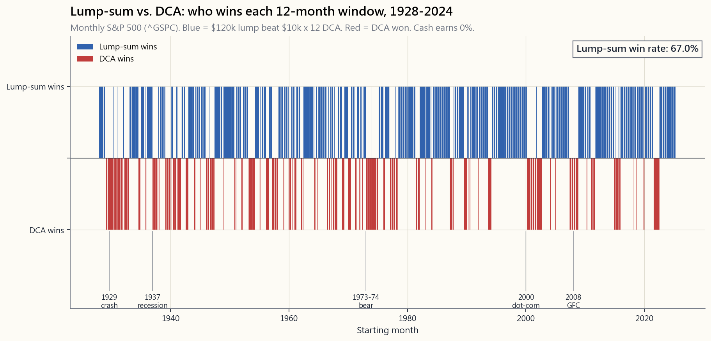
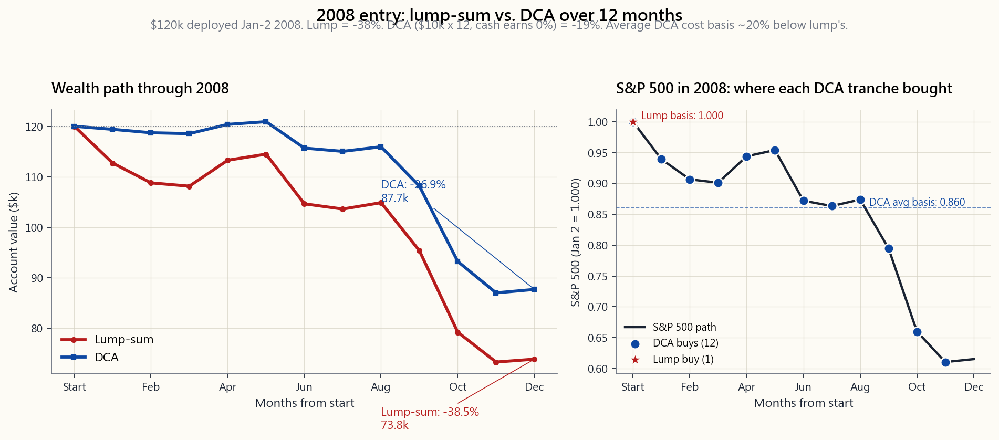

# 旁支課程 05：平均成本法對比一次過投入——數學、行為，以及各自勝出的時機

---

## 第一部分：閱讀章節

---

### 1. 為何此課題重要

每個投資者遲早都會盯著一筆現金，問同一個問題：*是一次過全部投入，還是分批部署？* 可能是一筆遺產、一份花紅、一個物業出售所得，或者是一個退休帳戶的轉存。現金就躺在貨幣市場基金裡，賺著4.2%的回報，而這個問題每逢周一早上都變得更加迫切。

這是投資界中，教科書答案與人性答案真正出現分歧的少數議題之一。數學結論毫不含糊：**一次過投入（Lump Sum）在隨後十二個月約有三分之二的時間勝出**，而且長期*預期*終值更高。行為層面的結論同樣清晰：平均成本法進場可降低後悔的波動性，減少恰好在頂部買入的概率，而且最重要的是——它有助於現金真正*被投資出去*，而非再在場邊多等三年，等候「更好的時機」。

此課題值得單獨一課，有四個原因：

1. **大多數散戶的思路框架是錯的。** 如果你是一名受薪人士，每次出糧都做定期供款，那你本來就在進行強制性的平均成本法——這是你唯一的選擇。一次過投入對比平均成本法的問題，實際上只適用於*意外橫財*的情況。
2. **「等待跌市入場」是最差的選擇。** 持有現金在場邊等候並非第三種策略，而是*未能在前兩者之間做出選擇*的失敗。
3. **平均成本法勝出的三分之一時間，正好涵蓋那些令投資者留下終生陰影的時期**——2000至2002年及2008年。這種偏向噩夢情境的心理偏差，正正說明了行為層面的故事為何如此重要。
4. **在正確之前先保持償付能力**——那個在底部恐慌性離場的理性投資者，早已輸了。平均成本法是一個理性的行為對沖，讓你內心的非理性版本也能保持在市場之中。

---

### 2. 你需要掌握的內容

#### 2.1 清晰定義兩種策略

**一次過投入（LSI）。** 你收到$120,000。在第一天，你按目標配置全額買入。第二天起，你甚麼都不做。

**平均成本法（DCA）。** 你收到$120,000。你將其分成等份——以每月$10,000、分十二個月為標準版本——並按固定時間表逐批買入目標配置。尚未投資的現金賺取貨幣市場回報（以2026年4月計，短期國債現行收益率約為4.2%）。

**平均成本法*不是*甚麼。** 每次出糧後將$1,000存入強積金或退休帳戶，是*系統性投資*，而非平均成本法。你並沒有一筆待部署的整筆資金；你只是持續獲得穩定收入的涓涓細流。一次過投入對比平均成本法的問題，根本不適用。將出糧供款稱為「平均成本法」，是互惠基金行業的一種銷售說辭——作為推廣語言有用，作為決策框架卻無用。在此附帶一提：出糧供款正是最有力的明證，說明沒有真正的被動收入——*輸入*，即你在進入時機問題之前就從薪金中擠出來的那一份，才是做所有工作的關鍵。時間表是自動的；儲蓄的行為並非如此。

此課題所針對的問題是具體的：

> *我現在有一筆錢，準備按目標配置投資。我應該在周一全部買入，還是將購買分攤到N個月？*

#### 2.2 數學：一次過投入在預期值上勝出

如果你的目標配置的預期回報是正數——這是必然的，否則你為何要投資——那麼一次過投入的預期終值**嚴格高於**平均成本法的預期終值。證明只需一行：

$$
\mathbb{E}[\text{LSI}] = P (1 + \mu)^N \quad > \quad \mathbb{E}[\text{DCA}] = \frac{P}{N} \sum_{k=1}^{N} (1 + \mu)^{N-k+1}
$$

在$\mu$為正數的情況下，越早部署的每一元複利時間越長。平均成本法在部署期間平均持有一半現金；那一半賺的是現金利率，而非股票回報率。股票預期回報（約7-9%名義回報）與現金利率（約4%）之間的差距，就是平均成本法在平均結果上的*成本*。

這個成本以金額計算有多大？將$120,000在12個月內部署到一個60/40投資組合（預期超出現金利率約6.5%），平均成本法放棄的終值大約為**0.5-0.7%**，即$120,000上約$600至$850。金額本身不算大，但它會永遠複利增長——這個差距永不收窄。

#### 2.3 歷史實證：約67%時間一次過投入勝出

先鋒集團（Vanguard）2012年的研究（Shtekhman、Tasopoulos及Wimmer）在三個市場進行了測試——美國1926至2011年、英國及澳洲——發現一次過投入在**約三分之二**的12個月滾動視窗中，均勝過12個月的平均成本法。確切數字因資產組合而異：

| 配置 | 一次過投入勝率 | 平均跑贏幅度 |
|---|---|---|
| 100%股票 | 66% | +2.4% |
| 60/40 | 67% | +2.3% |
| 100%債券 | 70% | +1.6% |

先鋒集團2023年的更新研究（Aliaga-Diaz等人，《成本平均法：一項分析……》），使用1976至2022年數據，確認了相同的範圍。這一結論在債券主導的1980年代、1990年代股票大牛市、2000年代失落的十年，以及2010年後的牛市中均保持穩健，並未消失。

勝率不是100%，原因顯而易見：市場歷史上三分之一的12個月視窗是*下跌*的，而在下跌市場中，平均成本法通過持有更長時間的現金，損失較少。這只是預期值論點的鏡像。一次過投入擁有更高的*平均*結果，是因為它擁有更高的*結果波動性*。平均成本法通過持有現金截斷了左尾；作為代價，它同時截斷了右尾。

#### 2.4 平均成本法勝出的33%：噩夢時間表

平均成本法勝出的三分之一時間並非隨機。它緊密地聚集在市場歷史上最糟糕的入場時機附近：

- **1929至1932年。** 1929年10月一次過投入：年末終值約為起始資本的*-68%*；平均成本法將損失分攤在整個崩盤期間，最終損失遠少。
- **1937至1938年。** 羅斯福衰退；一次過投入12個月虧損-38%。
- **1973至1974年。** 滯脹熊市；一次過投入-42%，平均成本法-22%。
- **2000至2002年。** 科網股泡沫爆破；2000年初的一次過投入在12個月後損失-25%。
- **2008年。** 這是投資者最難忘的一年。**2008年1月一次過投入 = 年底損失-38%**。**2008年1月平均成本法 = 年底損失-27%**（閒置現金收益率為0%；若閒置現金能賺取國債利率，則更接近-19%，與先鋒集團原始研究的假設一致）。

數學直截了當：通過分十二份買入，平均成本法的投資者在2008年12月，以約低於1月起始點40%的價格，買入最後$10,000的份額。其平均成本基礎大約比一次過投入的投資者低20%。當2009年3月復甦開始時，平均成本法的投資者能更快回到收支平衡點。

話雖如此：即便是2008年的平均成本法，也是痛苦的。平均成本法的投資者在賬面上仍於2008年底錄得介乎19%（閒置現金賺取國債收益率的情況下）至27%（現金收益率為零的情況下）的損失。兩種策略均在名義上於2012至2013年收復失地（實際計算則更長）。兩種策略都*未能避開*熊市；只是其中一種將衝擊有所緩和。

#### 2.5 平均成本法的行為理由——後悔波動性

純粹的預期效用理論表明一次過投入勝出。行為金融學，即真正模擬人類*如何體驗*結果的學科，額外加入了兩個教科書所忽略的項目：

1. **後悔厭惡。** 在頂部買入後眼看倉位跌去30%的痛苦，是不對稱地被感受到的——遠比在底部買入後看著倉位上漲30%的喜悅更為強烈。損失厭惡已被量化為大約2:1——卡尼曼及特沃斯基的數字——意味著被證明判斷錯誤的感知成本，是被證明判斷正確的感知收益的兩倍。
2. **時序焦慮。** 一次過投入的投資者，眼看著$120,000在三個月內縮水至$90,000，在許多情況下會*賣出*——正好在平均成本法本應持續買入的時刻鎖定損失。行為上的失敗模式不在於策略本身，而在於策略在最糟糕的時刻被*放棄*。

平均成本法是對*未來非理性版本自己*的理性對沖。約0.5-0.7%終值的預期成本，是你為確保2009年3月的那個版本的自己仍然留在市場中所付出的保費。再說一遍：非理性且有償付能力，勝過理性卻已破產。

如果你能*誠實地*說，自己是那種即便一次過投入後遭遇30%的賬面跌幅也不會恐慌離場的投資者——第11週的數據顯示，真正能通過這一測試的人少之又少——那就選一次過投入。如果你有任何懷疑，平均成本法約0.6%預期成本的損耗，是為你未來行為購買的廉價保險。

#### 2.6 真正的反面模式：現金在場邊等候

嚴重的失敗模式不是一次過投入對比平均成本法的抉擇，而是*兩者都不選*。持有橫財的普通散戶，不會選一次過投入，也不會選平均成本法——他們讓現金在場邊等待18至36個月，等待「更好的入場時機」。然後市場在等待期間再上漲30%。然後他們認為市場「太高了」。然後他們繼續等待。

先鋒集團2012年的研究以一個數字說明了這一點：現金在12個月滾動視窗內跑輸60/40投資組合的概率約為**67%**——與一次過投入對比平均成本法的比率相同——但差距幅度更大。等待一年等待跌市，在預期上損耗約4%的終值，而且這個成本在你猶豫不決的同時持續複利增長。

這裡值得特別說明你在一次過投入時所選擇的*標的*。對於此課題面向的讀者——建立第一個投資組合、處於學徒階段——一次過投入所承接的目標配置是SPY（或同等的美國廣泛股票指數交易所買賣基金），而不是現金、黃金加期權結構的啞鈴組合。啞鈴型是我如今採用的形態，但它只有在你已內化了機制論點並建立了投機端所需工具包之後，才能物有所值。跳過學徒階段，你就只是白白放棄了指數核心，同時持有一個你根本不懂操作的倉位。先一次過投入指數，做好學徒功夫，*再*考慮轉換形態——按這個順序。

決策框架如下：

1. **你將投資這筆錢**——這是任何時機問題之前的前提。
2. **若你能承受波動性，選一次過投入。** 數學表明你有三分之二的時間會更富有，而且在預期上永遠更富有。
3. **若你不能，選6至12個月的平均成本法。** 以小額的預期成本換取行為穩定性。在第一天就定好時間表，不要因市場走勢而調整。
4. **永遠不要等待。** 現金放在貨幣市場基金裡「等市場穩定」，不是一種策略，而是穿著財務顧問外衣的拖延症。

#### 2.7 實用守則——如果你選擇平均成本法，就做好它

如果你選擇平均成本法，三條守則讓它發揮效用：

1. **提前決定部署期並*自動化*。** 每月第一個工作日存入$10,000，執行N個月。設定為定期轉賬。不要因為價格看起來偏高就「暫停」某個月，也不要因為價格看起來偏低就「加倍」買入——那是包裝成平均成本法的市場擇時，其記錄比任何一種純粹策略都更差。
2. **六至十二個月是最佳部署期間。** 超過12個月，現金拖累就會佔主導——你基本上只是在持有現金。少於3個月，不如直接一次過投入。
3. **此頁面上的互動實驗室讓你重播1928至2024年間任何起始年份**，以及3至24個月任意部署期間。試試那些壞年份——1973年1月、1987年10月、2000年1月、2008年1月。再試試好年份——1995年1月、2009年1月、2020年1月。規律與數學所說的完全一致：一次過投入通常勝出，平均成本法在災難中勝出，而災難是聚集出現的。

互動面板提供完整的回測。上方兩幅靜態圖像以壓縮形式講述同一個故事：百年間每月起始點的歷史勝率，以及平均成本法的行為價值在2008年這個標誌性的年份如何呈現。

---

### 3. 常見誤解

**1. 「平均成本法降低風險。」** 它只降低*部署期間*的風險。一旦你在第12個月完成全部部署，你所承擔的風險與一次過投入的投資者相同。平均成本法是一種過渡策略，而非投資組合策略。

**2. 「平均成本法讓你的平均成本更低。」** 只在下跌市場才成立。在上漲市場——即所有12個月視窗中的三分之二——平均成本法讓你的平均成本反而*高於*從一開始就全部買入。

**3. 「分攤全年的買入可以平滑波動性。」** 你在12個月後的終值波動性在平均成本法下確實較低，但只是低約30%，並非為零。策略是更為緩衝的，而非隔絕的。

**4. 「我各投一半，一半一次過投入，一半平均成本法。」** 這是合理的對沖，以一半的預期成本捕獲大部分平均成本法的行為收益。先鋒集團的數據顯示，50/50的混合策略在預期回報和後悔程度上，大致介乎兩種純粹策略之間。

**5. 「平均成本法奏效，因為在低價時買入更多份額。」** 這是標準的推廣說辭，只有當部署期間的平均價格低於起始價格時才成立——即在下跌市場中。這並非神奇的特性；只是低價買入的算術。

**6. 「我應該對出糧供款採用平均成本法。」** 你的出糧供款*本來就是*平均成本法——因為收入是分批到來的，别無他法。你不是在選擇做平均成本法；你根本沒有整筆資金可供部署。一次過投入對比平均成本法的問題，真的不適用於系統性的強積金供款。

**7. 「等待更好的入場時機與平均成本法一樣。」** 不一樣。平均成本法是提前決定、機械執行的固定時間表。等待跌市是主動的市場擇時——在所有曾做過的滾動視窗研究中，遠遠是三種方法中表現最差的一種。

**8. 「如果一次過投入在預期值上勝出，我就應該永遠選一次過投入。」** 只有當你確信，處於回撤中的*行為版本的你*不會放棄這個策略時，才應如此。這是一個比大多數投資者意識到的更高的門檻。平均成本法約0.6%的預期成本，購買的是行為保險——有時值得，有時不值得。

---

### 4. 問與答

**問1：一次過投入對比平均成本法的確切勝率是多少？**

在1928至2024年美國數據的12個月滾動視窗中，無論是投入100%股票還是60/40投資組合，勝率約為**67%**。先鋒集團2012年的研究在美國、英國及澳洲均錄得66至67%的勝率；2023年的更新研究以1976至2022年數據重新確認了這一範圍。

**問2：一次過投入平均跑贏多少？**

在60/40投資組合下，12個月部署期內約跑贏終值的**2.3%**。以金額計，即每$100,000部署大約跑贏$2,300，並作為賬戶結餘的一個永久性水平差異持續存在。

**問3：一次過投入的最壞情況是甚麼？**

1929年1月一次過入場：1929年底部崩盤後，年底終值約為起始資本的*-68%*。即使分攤到12個月買入，也不能完全倖免——那樣是損失30%而非60%。1929年更深層的教訓是關於槓桿和集中投資，而非一次過投入對比平均成本法。

**問4：如果我的橫財非常龐大，例如500萬美元，怎麼辦？**

數學在任何規模下都是一樣的。行為層面的憂慮則更為嚴重——$500萬的30%回撤，*感覺*上與$50,000的30%回撤截然不同。對於大額橫財，較長的平均成本法部署期（18至24個月）純粹作為行為保險，是更有說服力的選擇，儘管預期成本更高。大多數私人銀行預設採用6至12個月的資金部署計劃，原因正是如此。

**問5：我應該使用成交量加權平均價還是固定日期時間表？**

固定日期。每月第一個工作日是標準做法。以成交量加權平均價為基礎的「價格感知型」部署，會將平均成本法變成市場擇時行為——而這正是平均成本法本應保護你免於犯下的錯誤。

**問6：從市場中*撤出*資金，應該一次過賣出還是分批賣出？**

對稱的數學：一次過賣出有更高的預期值（你的現金在平均情況下賺取的比你的股票倉位少），分批賣出有更低的後悔波動性。行為上的計算卻是相反的，因為當你試圖降低風險時，默認狀態（持有）才是*高風險*狀態。大多數退休人士選擇分批撤出，理由與其他人選擇分批買入的行為理由相同。

**問7：對國際股票或債券，答案會有所不同嗎？**

一次過投入在預期值上仍然勝出，因為預期回報是正數。對預期超出現金利率較低的資產，勝率略低——先鋒集團的數據顯示，100%債券的勝率約為70%，100%股票約為66%。預期回報較高的資產，股票利率與現金利率的差距更大，因此一次過投入勝出的*幅度*也更大。

**問8：這與稅務有何關係？**

一次過投入為整個倉位的長期資本增值稅率持有期，早12個月開始計時。對於應課稅帳戶而言，這一點很重要：如果你在13個月後賣出，一次過投入的收益全部符合長期資本增值稅率；平均成本法則有大約一半的倉位仍按短期稅率計算。長期資本增值稅率是美國稅法中最廉價的免費午餐，而一次過投入能更早鎖定這一優惠。

**問9：「從我一直在等待的現金中執行平均成本法」是一回事嗎？**

這是大多數人*實際上*做的事，而且這樣做是可以的。這只是遲來的平均成本法。成本在於你在開始部署計劃之前在現金中等待的那幾個月。現在就開始計劃，嚴格執行，並停止「等待更好入場時機」的循環。

**問10：互動實驗室能讓我看到甚麼？**

選擇一個金額、一個平均成本法部署期（3、6、12或24個月）以及一個起始年份（1928至2024年）。實驗室使用來自Damodaran年度數據集的每月回報，運行回測，並報告四個數字：一次過投入的終值、平均成本法的終值、金額差異，以及部署期間出現的最大回撤。選擇與此課題中的災難相符的起始年份——1929、1973、2000、2008年——並觀察平均成本法真正勝出的僅有時機，是否與教科書所說的完全吻合。

---

## 第二部分：YouTube 腳本

---

**影片標題：** 一次過投入 vs 平均成本法——96年數據告訴你答案 | 旁支課程 05

**目標時長：** 約13分鐘

**主持人：**
- **陳馬**（教學角色）：持有橫財假設情境。
- **小魚**（學生角色）：提問大多數散戶真正想問的問題。

---

**[片頭]**

[VISUAL: Animated logo "Side Lesson 5 — DCA vs. Lump Sum"]

**陳馬：** 小魚，你剛繼承了$120,000。明天早上，這筆現金就會到你的帳戶。你會怎麼做——周一就全部投入，還是分攤到十二個月？

**小魚：** 老實說？我大概會先把它放在儲蓄帳戶裡「想清楚」，放個六個月。

**陳馬：** 這是最常見的答案，也是三個可選方案中最差的一個。今天我們會就另外兩個方案做數學計算——第一天全部買入，對比分攤到整年買入——然後我們會討論，為何教科書的答案對一個真實的人類來說並不總是對的。

---

**[第一節：勝率]**

[VISUAL: image/side05_winrate_history.png]

**陳馬：** 這張圖上每一條細長縱條，代表1928年1月至2023年底的一個起始月份。藍色代表一次過投入在隨後十二個月內勝出。紅色代表平均成本法勝出。

**小魚：** 看起來藍色很多。

**陳馬：** 三分之二的月份都是藍色，約67%。這是先鋒集團的數字——他們在2012年做了這個研究，2023年更新，結果沒有改變。在市場歷史上約三分之二的12個月視窗中，一次過投入均勝過平均成本法。

**小魚：** 為甚麼？

**陳馬：** 因為市場有三分之二的時間在上漲。如果市場在上漲，越早部署的資金複利時間越長。平均成本法在部署期間平均將一半現金放在短期國債裡——那一半賺的是4%，而非8%。這個差距就是成本所在。

**小魚：** 那些紅色的群集呢？

**陳馬：** 那些是災難時期。1929年。1937年。1973至1974年。2000至2002年。2008年。平均成本法勝出的那三分之一時間並非隨機——它緊密聚集在幾個令整代投資者留下陰影的噩夢年份。而這正是行為層面的故事如此重要的原因。

---

**[第二節：數學何以支持一次過投入]**

[VISUAL: equation overlay $E[\text{LSI}] = P(1+\mu)^N$ vs. the DCA sum.]

**陳馬：** 預期值的數學就是一行而已。如果你的預期回報是正數——它必然是，否則你根本不會投資——那麼第一天就部署全額資金，意味著每一分錢從第一天起就賺取股票回報。將資金分攤到N個月部署，意味著已投資的部分賺取股票回報，尚未投資的部分只賺取現金利率。

**小魚：** 那差距有多大……

**陳馬：** 將$100,000分12個月部署到60/40投資組合，你放棄了約$2,300的預期終值。這個差距是永遠的，會持續在整個持有期內複利增長。

**小魚：** $100,000上的$2,300不是小數目。

**陳馬：** 確實不是。但也並不是災難性的——而且關鍵在於，這是*預期的*成本。三分之二的時間它其實更高；三分之一的時間平均成本法徹底勝出。

---

**[第三節：2008年的教科書案例]**

[VISUAL: image/side05_worst_case.png]

**陳馬：** 來看看這個著名的壞年份。2008年。假設你在1月2日持有$120,000現金。策略A：一次過買入標普500指數。策略B：每月第一日投入$10,000，連續十二個月。

**小魚：** 我已經知道結局了。

**陳馬：** 一次過投入：年底損失38%。平均成本法：在閒置現金收益率為零的情況下損失約27%——若你將尚未部署的份額停泊在短期國債，則更接近-19%，與先鋒集團原始研究的假設一致。平均成本法的投資者在2008年12月投入的最後$10,000，買入的股票價格比1月的起始點低約40%。其平均成本基礎比一次過投入的投資者低約20%。

**小魚：** 所以如果在崩盤時開始，平均成本法才是對的答案。

**陳馬：** 它只在*崩盤時開始*才是對的答案。問題是你事先並不知道自己是在崩盤時開始。如果你知道，這個對話就不會發生了。你根本就會等待。而數據表明，有67%的時間，等待是錯的。

---

**[第四節：行為層面的論點]**

[VISUAL: Title card "Regret Variance"]

**陳馬：** 這是教科書停下來、現實世界開始的地方。卡尼曼及特沃斯基，1979年——損失厭惡大約是2:1。損失$30,000的痛苦，感覺是獲得$30,000喜悅的兩倍。

**小魚：** 所以我一次過投入後立刻遭遇30%的回撤……

**陳馬：** 感受上是損失的兩倍之痛。而行為上的失敗模式不在於策略本身——而在於投資者在最糟糕的時刻放棄了策略。2009年3月在底部恐慌性賣出的一次過投入者，鎖定了50%的虧損。而2009年3月*仍在買入*的平均成本法投資者，最終迎來了復甦。

**小魚：** 所以平均成本法是針對「我自己」的保險？

**陳馬：** 完全正確。規則很簡單：非理性且有償付能力，勝過理性卻已破產。平均成本法是對2009年3月那個非理性版本的你的理性對沖。你付出約0.6%終值的預期成本；作為回報，那個在熊市中醒來的版本的你，仍然留在市場之中。

---

**[第五節：真正的反面模式]**

[VISUAL: Title card "Cash on the Sidelines"]

**陳馬：** 真正嚴重的錯誤，不是一次過投入對比平均成本法之間的選擇。而是*兩者都不選*。持有橫財的普通散戶，既不會選一次過投入，也不會選平均成本法——他們讓現金在場邊等待兩年，等待「更好的時機」。在這兩年裡，市場再上漲了30%——因為市場有三分之二的時間在上漲，記得嗎？

**小魚：** 然後他們覺得市場已經太高了。

**陳馬：** 然後他們繼續等待。先鋒集團的數字是這樣的：持有現金勝過60/40投資組合的概率約為33%——正好是一次過投入對比現金比較的反面。三分之二的時間，在場邊持有現金等一年，是三個可選方案中最差的選擇。

---

**[第六節：互動實驗室]**

[VISUAL: cut to interactive/side05_dca_lab.html in the browser.]

**陳馬：** 網站上的實驗室讓你重播1928至2024年間任何起始年份。選擇一個金額，選擇一個平均成本法部署期——3、6、12或24個月——選擇一個起始年份。先試試那些災難年份。

*(輸入：$120,000，12個月，2008年起始)*

**陳馬：** 一次過投入終值：$74,000。平均成本法終值：$97,000。平均成本法勝出$23,000。這就是那三分之一的情境。

*(輸入：1995年起始)*

**陳馬：** 一次過投入：$158,000。平均成本法：$148,000。一次過投入勝出$10,000。這就是那67%的情境。

*(輸入：2020年起始)*

**陳馬：** 一次過投入：$156,000。平均成本法：$138,000。一次過投入勝出$18,000——新冠疫情後的復甦，獎勵了那些在尚不知道復甦即將來臨之前就已買入的人。

**小魚：** 所以就玩十分鐘，規律就一目了然。

**陳馬：** 這正是重點。這些數字並非抽象概念——它們就是那些產生實際歷史結果的每月股票回報數據。

---

**[第七節：出糧供款的問題]**

[VISUAL: Title card "If You Are Salaried, You're Already Done"]

**陳馬：** 最後一點。如果你是一名受薪人士，每次出糧都在向強積金或退休帳戶供款，這整個辯論對你根本不適用。

**小魚：** 為甚麼？

**陳馬：** 因為你沒有整筆資金。你的收入每年分二十六份到來，每份你都隨到隨投。那是*強制性的*平均成本法，也是你唯一的選擇。一次過投入對比平均成本法的問題，只適用於橫財——遺產、花紅、物業出售所得、退休帳戶轉存。

**小魚：** 明白了。所以這課是為了那個橫財出現的日子。

**陳馬：** 對。為了某天有人給你一張大到讓這個問題不再是假設性質的支票。在我們繼續之前，關於出糧情況還有一個補充說明——那個每月的涓涓細流，也是最清晰的提醒，說明根本沒有真正的被動收入。時間表是自動的；*供養*這個時間表的儲蓄率並非如此。輸入永遠先於時機問題。

**小魚：** 那我一次過投入，是投入甚麼？

**陳馬：** 對於正在閱讀這課、建立第一個投資組合的人來說，答案是SPY。廣泛的指數。廉價、稅務效益高，只要四十年的被動投資共識繼續有效就能運作。我如今採用的是啞鈴型形態——一端是現金和黃金，另一端是不對稱的期權倉位——但這個形態只有在你已內化了機制為何可能轉變，並建立了投機端真正需要的工具包之後，才能物有所值。不要跳過學徒階段去複製這個形態。先一次過投入指數，經歷幾個週期好好學習，*再*考慮轉換形態——按這個順序。

---

**[結尾]**

[VISUAL: Summary card with three bullets:
- ~67%時間一次過投入勝出
- 平均成本法勝出集中在災難時期
- 現金在場邊才是真正的輸家]

**陳馬：** 三個要點。第一：一次過投入在約三分之二的時間勝過平均成本法，而平均成本法的預期成本真實存在，但不大——12個月部署期內約0.5%的終值。第二：平均成本法勝出的時候，恰恰是投資者最恐懼的那些災難時期，這正是它作為行為對沖工具有其道理的原因。第三：在三分之二的時間裡，輸給另外兩種方案的策略，是持有現金在場邊等待更好時機。如果你能承受，就選一次過投入。如果不能，就選平均成本法。但切勿兩者都不選。

**小魚：** 明白了。如果我能承受一次過投入後30%的賬面損失而不恐慌，就選一次過投入。如果不能，就選平均成本法。絕對不要持現金等待。

**陳馬：** 這就是這課的精髓。

[END CARD: "Side Lesson 5 — DCA vs. Lump Sum"]