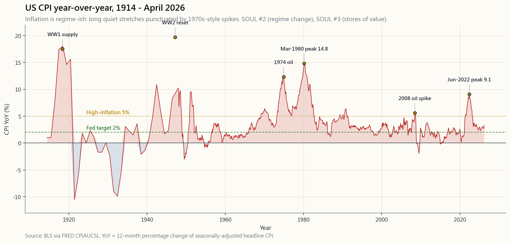
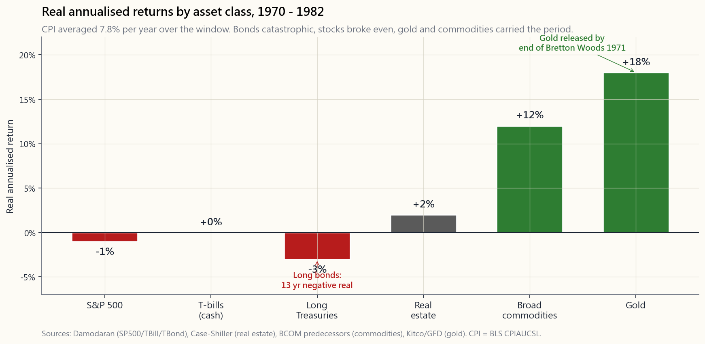

# 附加課06：通脹——殺死現金的元兇，以及（有時）保護你的資產

---

## 第一部分：閱讀材料

---

### 1. 為何此課題值得重視

本教程所涵蓋的其他風險——回撤、違約、波動性、相關性崩潰——都會*自我揭示*。通脹則不然。通脹是唯一一種以持續方式向你收費的風險，計費單位是購買力，而購買力既不會出現在任何賬戶結單上，也不會有任何經紀向你發出相關通知。一段為期十五年的通脹週期可以蠶食你一半的真實財富，而你在券商平台上卻看不到任何一個負數。

以下三點說明了為何此課題值得獨立成一節，而非只是附在債券章節末尾的一段話：

1. **1970年代並非教科書中的舊聞——它是每一個退休計劃的現實最壞情景。** 美國整體CPI於1980年3月達至14.8%的峰值；從1968年高位至1982年低位，標普500的實際回報（經通脹調整）約為負50%。名義指數在十四年間*橫行*。以美元衡量財富的人看起來安好無恙；以食品雜貨衡量財富的人卻在被悄然蠶食。
2. **2021至2022年的通脹插曲提醒世人，1970年代並非僅屬歷史。** 美國整體CPI於2022年6月達至9.1%，創四十年新高。長期國債從峰值至谷底跌幅約30%。教科書聲稱能保護你的黃金，在通脹急升的首年*毫無建樹*。後2008年世代所熟記的通脹應對手冊，大部分都被證明是錯的。
3. **通脹環境下各資產類別的排名，與大多數人過度適應的排名截然不同。** 債券——60/40配置中的「安全」一腳——是災難性的。股票的實際回報偲弱，因為利潤率受壓。黃金*不可靠*——有時表現卓越（1971至1980年），有時毫無用處（2022年）。商品和房地產的表現尚可。通脹掛鉤債券（TIPS）是唯一在機制上可靠的對沖工具。現金是注定的輸家。這些資產充當「價值儲存工具」——但所謂價值儲存工具，取決於下一代人*相信*什麼才是，這正是答案不斷輪換的原因。

本附加課的目標，是為你提供幾個關鍵數字，以及一個理解通脹週期的框架——通脹週期可以在四十年的時間跨度上發生根本性轉變——從而將通脹從一種模糊的恐懼，轉化為四組合投資組合中一個可量化、可對沖的風險。

---

### 2. 你需要掌握的知識

#### 2.1 CPI、PCE與核心通脹——三個並不相同的數字

你在新聞中看到的數字是**CPI**（消費者物價指數，由勞工統計局公布）。美聯儲實際盯住的目標是**核心PCE**（個人消費支出指數剔除食品及能源，由經濟分析局公布）。兩者長期存在分歧，每年相差約30至50個基點，而這差異舉足輕重。

CPI採用每兩年更新一次的*固定籃子*；PCE每季重新調整籃子權重，以追蹤家庭的實際消費行為。當牛肉價格上漲，CPI沿用舊籃子，報告出更高的數字；PCE則觀察到消費者已轉向雞肉，報告出較低的數字。PCE的醫療保健權重也遠高於CPI（因為它涵蓋僱主提供的保險），住房權重則較低。

然後是「核心」通脹——同一指數剔除食品及能源這兩個最不穩定的組成部分之後的數字。美聯儲盯住核心通脹，因為它反映的是趨勢信號；新聞報道整體通脹，因為它反映的是選民在油泵前的切身感受。兩個數字都是真實的；兩個都重要；但它們各自回答不同的問題。

第三個值得關注的指標是**截尾均值PCE**（達拉斯聯儲），它每月剔除漲幅和跌幅最極端的組成部分。這個指標的波動最慢，是反映底層通脹趨勢最清晰的讀數。2026年4月，整體CPI約為3.2%、核心PCE約為2.8%、截尾均值約為2.6%，美聯儲對此感到滿意；而在2022年中，三個指標均企於5%以上時，美聯儲則高度警惕。

從投資角度而言：**切勿在未作調整的情況下，將以CPI計算的實際回報數字與以PCE計算的數字直接比較。** Damodaran的歷史股票溢價是以CPI平減的數據；美聯儲偏好的通脹圖表則以PCE平減。在二十年的複利計算中，兩者每年相差0.4%——在長期複利計算下，這是真實且顯著的差距。

#### 2.2 1970年代——通脹創傷的典型案例

每一位具備長線視野的投資者，都應在腦海中對**1970年代美國**保持清醒的校準。它在本教程中反覆出現，原因在於它以2008年金融危機和2020年新冠疫情崩市所未曾達到的方式，顛覆了當時所有主流的資產配置正統觀念。

以大約整數計：美國整體CPI在1970年至1982年間平均每年上升7.8%。1980年3月達至14.8%的峰值（正是這個數字讓聯儲局主席沃爾克豁出去全力應對）。標普500在這段時期的名義年回報率約為6%；扣除通脹後，實際回報率約為負2%，從1968年高位至1982年低位的實際最大回撤約為負50%。長期國債的實際年回報率約為負3%——連續十五年錄得負實際固定收益回報。定義現代退休默認方案的「平衡」60/40投資組合，在整個十年間的實際回報接近*零*。

兩類資產勝出。黃金，擺脫1971年的美元掛鉤後，從每盎司35美元升至850美元——在十二年間帶來約18%的實際年回報。商品廣泛指數的實際年回報率約為12至13%。兩者都是從被壓制的狀態中解脫出來（黃金受布雷頓森林體系約束，商品受戰後價格管制約束），這正是典型的四十年週期轉變的設定：當舊週期打破，獲重新估值的資產，正是在*舊週期下*被迫低估的那個。

最後這一點正是陷阱所在。1970年代的黃金故事並非「黃金抵禦通脹」。1970年代的黃金故事是「黃金在通脹開始的那年*出獄了*」。當通脹在2022年捲土重來，而黃金市場並無類似的週期突破時，黃金在首年*毫無作為*。更清晰的框架是：價值儲存工具是下一代人相信它是的那個東西。1972年是黃金。2022年短暫地是比特幣（然後又不是了）。其機制是*信念重新定價*，而非金屬本身。

#### 2.3 2021至2022年通脹急升——現代應對手冊的失誤

美國整體CPI於2022年6月達至9.1%，為1981年11月以來最高。有三件事使這次通脹與大多數活躍投資者賴以操作的教科書通脹章節截然不同：

第一，**債券以教科書所預測的方式被摧毀**——長期國債（TLT）從峰值至谷底跌幅約31%，是有記錄以來該資產類別最差的一個日曆年。這部分應對手冊奏效了。60/40投資組合的實際年回報率約為負17%，是現代史上最差的實際回報年份。

第二，**股票與債券同步下跌，打破了「股票與債券互相對沖」的假設——這一假設定義了2009至2021年的週期**。股債相關性從負值（後2000年的默認狀態）翻轉為正值（2000年前的默認狀態，也是通脹週期的默認狀態）。60/40的分散投資效益，恰恰在最需要它的時候消失了。波動率的尾部主導了全局。

第三，**黃金沒有奏效**——至少在2022年沒有。隨著10年期實際收益率從負1%升至正2%，持有不帶收益的金屬的機會成本急升，黃金在2022年的名義回報幾乎持平——以實際價值衡量則顯著下跌。「通脹=買黃金」這一1970年代應對手冊，在四十年來的首次實戰測試中宣告失敗。黃金最終在2024至2025年重新估值，但那些在2021年將其作為通脹保障買入的投資者，在此之前已承受了三年的持有成本。

2022年*奏效*的是：短期TIPS、廣泛商品（彭博商品指數全年回報約為+14%）、石油生產商，以及部分租金能快速重置的房地產。*未能奏效*的是：長期債券、長存續期科技股、2021年以3%固定利率買入的按揭（作為*負債*是絕佳的，作為*資產*則很糟糕），以及作為通脹對沖工具的黃金。

#### 2.4 通脹環境下的資產表現——誠實的排名

綜合1970至1982年的記錄（長期通脹週期）、2021至2023年的急升（短期通脹週期）以及學術實際回報文獻，可得出以下誠實排名，以*高通脹週期期間*的大約實際年回報率表示：

- **通脹掛鉤債券TIPS／通脹掛鉤債券：** 實際回報約0%，*合約保障*。枯燥但在機制上可靠。
- **商品（廣泛指數）：** 歷史上在通脹期間的實際回報為+6至12%，因為投入品本身*就是*通脹。在正常週期中波動劇烈，這正是少有投資者持有的原因。
- **房地產（直接持有，非房地產信託基金）：** 實際回報+0至4%，地域差異顯著。陽光帶優於鐵鏽帶。租金隨租約重置，因此滯後效應值得關注。
- **黃金：** 表現參差。1970至1980年實際年回報+18%；2021至2023年實際回報約0%；2024至2025年有小幅正回報追落。應視之為*信念*資產，而非機械對沖工具。
- **股票：** 通脹急升期間實際回報偲弱（利潤率受壓），但通脹回落後表現強勁（經營槓桿發揮作用）。在整個通脹週期結束後，淨實際回報約為負1%至正2%，路徑依賴性極強。
- **短期國庫票據（現金）：** 若美聯儲積極加息，實際回報約為0%；若美聯儲按兵不動，則實際回報*大幅*為負。2021至2022年的現金倉在十二個月內損失了約6%的實際財富。
- **長期國債：** 最差的主要資產類別。1970至1982年間實際年回報約負3%，2022年最大回撤約負30%。

一句話概括：**通脹是唯一一種讓每本教科書中投資組合的「安全」一腳致命，而「風險」一腳（實物資產）卻能拯救你的週期。** 槓鈴策略和四組合投資組合中明確的價值儲存工具倉位，正是為此而設計的。

#### 2.5 工資滯後物價，地域分散兩者影響

在設計通脹對沖策略之前，每位投資者都應內化兩個微觀層面的機制。

**工資滯後物價十二至十八個月。** 2021至2022年的通脹急升使CPI於2022年6月達至9.1%，而名義時薪要到2023年底才追上。對投資者而言，這意味著在通脹週期的早期，實際工資*下降*——正是在這段時期，消費性服務公司的盈利會令市場失望，而「消費必需品作為防禦性投資」的交易實際上是奏效的，因為家庭會首先削減非必要開支。對*受薪人士*（大多數投資者同時也是受薪人士）而言，這意味著即使新聞談論著「消費者支出韌性強勁」，你的實際收入也在縮水。請做好計劃：在急升之年，趁你的名義薪酬追上之前，提高儲蓄*比率*。

**地域因素比整體數字更重要。** 2022年6月美國整體CPI為9.1%，這個單一數字平均了一個年漲30%的鳳凰城樓市和一個*下跌*中的三藩市樓市。在1970年代，能源產區（德克薩斯州、亞伯達省）的實際工資增長為正；製造業帶地區（底特律、克利夫蘭）的實際工資增長則*遠比*全國數字更為負面。住房通脹、醫療通脹和工資通脹的地域分散程度，現在已是全國整體年度數字變化幅度的數倍。實際的啟示是：影響*你的*投資組合計劃的通脹率，是你所在地的通脹率，而非聯邦公布的數字。

本課末尾的互動版面（`side06_inflation_lab`）讓你設定個人通脹率，並觀察它在股票、債券、黃金、商品、房地產、通脹掛鉤債券TIPS和現金的任意組合下，對你的實際最終財富產生什麼影響。在你認定2%的CPI「無關緊要」之前，請將滑桿設為4%，然後讓它運行三十年。

---

### 3. 常見誤解

1. **「通脹對每個人來說都是同一個數字。」** 不對。整體CPI是城市消費籃子的全國平均值。你的個人通脹率取決於你的住房狀況、醫療開支和所在地區，可能比全國數字高出或低出兩至三個百分點，且可持續多年。

2. **「股票是通脹對沖工具。」** 只在長期視野下成立，且效果有限。在通脹週期的*急升*階段，股票的實際回報為負（利潤率受壓，折現率上升導致估值倍數收縮）。如果你能夠在急升、回落和通脹後復甦的整個過程中持有十五年以上，這個對沖論才成立。大多數投資者做不到。

3. **「黃金抵禦通脹。」** 黃金在1970年代抵禦通脹，是因為它在布雷頓森林美元掛鉤結束前一直受到人為壓制，正在進行重新估值。這次重新估值恰好與通脹同期發生。2022年，黃金在CPI達9%的十二個月內毫無建樹。應將黃金視為*信念*資產，而非機械對沖工具。

4. **「TIPS只給你通脹率。」** TIPS給你的是你買入時的實際收益率，*加上*CPI調整。如果你在負1%實際收益率時買入TIPS（這正是2020至2021年大部分時間的情況），即使在通脹急升期間，你仍然只能獲得負1%的實際回報。買入時機與買入什麼資產同等重要。

5. **「我的薪酬會跟上通脹。」** 在每一個有記錄的通脹插曲中，工資都滯後物價十二至十八個月。無論名義加薪幅度如何，你在任何急升首年的實際到手工資都會下降。

6. **「現金是安全的。」** 在任何通脹高於短期國庫票據利率的週期中，現金是必然虧損的資產。2021年，這個差距約為6%；現金持有者在十二個月內損失了6%的實際財富，卻感覺一切安好。

7. **「只有惡性通脹才值得擔心。」** 錯。每年5%的通脹持續十年，會讓你的購買力減半。你不需要威瑪共和國那樣的情境；一個緩慢而持續的週期轉變就已足夠。

8. **「美聯儲會解決問題。」** 最終會的。美聯儲在1981年將聯邦基金利率加至19%並引發嚴重經濟衰退，從而解決了1970年代的問題。這個過程花了十五年和兩次經濟衰退。「美聯儲會解決問題」是一個長線陳述，而非一個投資組合陳述。

9. **「房地產在通脹下必然勝出。」** 只有當租金重置速度快於融資成本上升，且當地供應受到限制時，房地產才能勝出。在供應不受限制（美國陽光帶大部分地區）且利率大幅上升的情況下，即使在CPI急升期間，房地產的實際回報也可能為負。

10. **「比特幣是數字黃金，能對沖通脹。」** 2022年它並沒有做到。比特幣在CPI達9.1%的同一年從峰值跌去約65%。無論比特幣是否最終成為一種價值儲存資產，2022年是它迄今為止唯一一次樣本外測試，而它失敗了。信念資產，非機械對沖工具。

---

### 4. 問答環節

**問：一般投資者為了應對通脹，最簡單的投資組合調整是什麼？**
答：將債券倉位的一部分從名義國債（TLT、IEF）轉換為短期通脹掛鉤債券TIPS（VTIP、STIP）。VTIP是一個一站式交易，沒有存續期風險，且鎖定當前所提供的任何實際收益率。在2026年4月，這約為+1.5%實際回報，是相當實用的通脹對沖工具。

**問：為何選擇TIPS而非黃金？**
答：TIPS通過合約，按照*實際的CPI數字*向你付款，並附帶已知的實際收益率。黃金則讓你獲得下一代人決定支付的任何價格，這在結構上是對下一代人將何種資產視為價值儲存工具的一種信念押注。對於投資組合中應*保障*通脹防護的部分（通常是債券倉位），TIPS是正確答案。黃金屬於價值儲存工具倉位，佔比5至10%為宜。

**問：為何60/40在2022年失效？**
答：60/40依賴股票和債券之間的負相關性。在歷史上，這種相關性在通脹週期（1970年代）時為*正值*，在通縮／去通脹週期（2000年代和2010年代）時為*負值*。2022年，通脹打破了後2000年代的負相關性，兩個倉位同步下跌，60/40創下有記錄以來最差的實際回報年份。週期轉變本身*就是*風險所在。

**問：我能否從2021年的貨幣供應數據預測到2022年的通脹？**
答：M2貨幣供應量在2020年2月至2021年2月間增長約26%——這是二戰以來最大的單年增幅。這是一個真實的信號。但後2008年代類似的量化寬鬆並*沒有*引發CPI通脹，因為銀行將儲備金停留在體系內而非將其貸出。因此，M2信號在2021年這個真陽性之前，有長達14年的假陽性記錄。「從M2預測通脹」的難度，正在於傳導機制取決於貨幣流通速度，而後者取決於行為。應進行結構性對沖，而非嘗試預測。

**問：TIPS和I債券有何分別？**
答：I債券是美國財政部儲蓄債券，具有固定實際票息加上CPI調整，每人每年上限為10,000美元，設有一年鎖定期及五年提前贖回罰款。在這個上限範圍內，I債券*優於*TIPS（通常提供略高的固定實際利率，且稅務處理更為有利）。TIPS可無限量購買，且在公開市場交易。對於大多數家庭而言，正確做法是*兩者兼備*：先盡用I債券額度，然後在上方疊加TIPS。

**問：1970年代如何終結？是什麼信號標誌著轉變？**
答：10年期國債收益率於1981年9月達至15.8%的峰值。聯邦基金利率峰值為19%。沃爾克在兩次經濟衰退中維持這些水平，直至通脹預期崩潰。標誌著週期已經翻轉的投資信號，是債券市場：長期債券在1981年底因市場對未來通脹下降進行定價而出現劇烈反彈，這次反彈演變成一場持續*四十年的固定收益牛市*，直至2021年才告終。框架的關鍵在於：你並非在*押注*通脹；你是在認識自己身處的週期，並應知道什麼將標誌著下一個週期的轉變。

**問：TIPS的稅務處理是否有特別之處？**
答：是的——而且對持有人不利。本金的CPI調整部分，在*應計的當年*按普通收入稅率徵稅，即使你在債券到期前不會實際收到這筆現金。這被稱為「虛擬收入」。對於大多數家庭而言，誠實的答案是：將TIPS持有在個人退休賬戶或401(k)（在此賬戶中，虛擬收入問題不存在），而在應稅賬戶中使用I債券。賬戶位置而非資產配置的原則在此得到清晰體現。

**問：房地產作為通脹對沖工具如何？**
答：如果你以長期*固定利率*按揭持有直接房地產（自住物業或出租物業），這是一個不錯的通脹對沖工具。在這種設置下，你做空現金，做多底層實物資產；通脹侵蝕負債，而資產則保持同步。上市房地產信託基金則*更差*——它們像長存續期債券一樣交易，並在2022年與其他利率敏感資產一同受創。「房地產對沖通脹」的1970年代應對手冊，說的是*直接持有*版本，而非房地產信託基金版本。

**問：我的投資組合應有多大比例配置於通脹對沖資產？**
答：對於投資期限三十年的默認投資者：債券倉位中配置5至10%的通脹掛鉤債券TIPS或I債券，價值儲存工具倉位中配置5%的黃金或商品，並有意識地傾向具定價能力的公司（消費必需品、能源、基礎設施）。這是槓鈴策略中在週期轉變時被啟動的一端，而非在正常週期中持有指數基金的一端。倉位宜小；應始終持有。

**問：我能否買一個「實物資產」交易所買賣基金了事？**
答：也許可以。RAAX、INFL或PRPFX等基金將商品、貴金屬、能源基礎設施和通脹掛鉤債券TIPS打包成一個交易票據。對於不希望分開管理各個部分的人而言，這是合理的選擇。買入前請細閱持倉明細：部分「通脹交易所買賣基金」的組合中有60%是能源股，這基本上是石油押注，而非通脹押注。

**問：通脹互動實驗室何時最有用？**
答：當有人告訴你「2%通脹無關緊要」時，將滑桿設為4%，運行三十年，讓他看看實際財富的差距。當有人告訴你「我放在現金裡是安全的」時，將通脹設為4%，他的實際財富在三十年後縮減了70%。這個實驗室旨在以購買力衰退實際運作的時間尺度——是地質般緩慢的，而非每週的——來呈現這種侵蝕。

---

## 第二部分：YouTube 影片腳本

---

**影片標題：** 通脹——殺死現金的元兇，以及（有時）保護你的資產 | 附加課06

**目標片長：** 約16分鐘

**主持人：**
- **陳馬**（導師）：資深投資者，親歷2008年、2020年及2022年市場。
- **小魚**（學生）：風險意識強的散戶投資者，手持現金，開始覺得這未必是安全之策。

---

**[片頭序列]**

[VISUAL: 動態標誌「附加課06 — 通脹」]

[VISUAL: image/side06_cpi_history.png — 112年CPI走勢圖，標注一戰、二戰、1970年代、2008年及2022年急升。]

**陳馬：** *(手持一張2019年超市收據和一張2024年超市收據，商品相同)* 同一品牌。同一家超市。同樣的東西。上面那張是2019年12月。下面那張是2024年12月。下面那張貴了26%。然而，買上面那張收據的銀行結餘，看起來跟買下面那張的一模一樣。所以，小魚——有什麼事情發生了嗎？

**小魚：** 唔，我的賬戶看起來是一樣的。

**陳馬：** 對。這就是通脹作為風險的全部問題所在。我們在本教程中涵蓋的每一樣東西——回撤、違約、波動性——都會在你的屏幕上*自我揭示*。通脹卻是開了你一張單，收走你一半財富，卻從不在賬戶裡扣分文。

**小魚：** 那怎樣衡量它呢。

**陳馬：** 三個數字。整體CPI是新聞裡的那個。核心PCE是美聯儲實際盯住的那個。截尾均值PCE是那些以此謀生的人所關注的那個。它們每年持續相差30至50個基點。我們稍後會回到這個話題。首先，讓我們來看一張應該刻在每位投資者手臂上的圖表。

---

**[片段一：112年CPI圖表]**

[VISUAL: image/side06_cpi_history.png — 全屏顯示。]

**陳馬：** 美國整體CPI按年變化率，從1914年到上個月。六個標注的峰值。一戰——供應鏈中斷、徵兵，以及美元脫離黃金本位。二戰——相同的故事。1970年代，我們即將花大量時間討論的時期。1980年14.8%的峰值，沃爾克窮盡職業生涯全力應對的那個數字。2008年的石油急升。以及最近的一次——2022年6月，9.1%。

**小魚：** 為何它呈鋸齒狀？看起來三十年什麼都沒有，然後突然出現一個巨大的隆起。

**陳馬：** 這正是最準確的解讀。通脹具有*週期性*。它大部分時間在零至3%之間，然後出現一個週期轉變——一場戰爭、一次貨幣重置、一次供應衝擊——然後它在5%以上待上十年或十五年。這就是四十年週期框架：你不是去*預測*週期轉變；你是去認識自己身處的週期。

**小魚：** 美聯儲目標線在圖上哪裡？

**陳馬：** 那條2%的虛線。它上方的5%虛線，是金融業人士事後一致認定通脹屬於「高位」的門檻。低於5%，美聯儲大概可以應付。高於5%，美聯儲必須打破某些東西才能應付。這大約就是沃爾克在1979年越過的那條線。

---

**[片段二：1970年代——典型的通脹創傷]**

[VISUAL: image/side06_real_returns_inflation.png — 1970至1982年各資產類別實際回報。]

**陳馬：** 這就是1970年代對投資者的面貌。1970年至1982年。CPI在整個時期平均每年上升7.8%。看看每個資產類別在*實際*回報上的落點。

**小魚：** 標普是負1%？但我以為股票總是贏的。

**陳馬：** 最終確實如此。但1970年代的過程是殘酷的。名義指數在1968年至1982年間橫行——整整十四年。扣除通脹後，在谷底時你損失了約一半的購買力。長期國債是最差的——連續十三年每年實際回報負3%。現金大致跟上，因為美聯儲在持續加息。兩個贏家？黃金，每年實際回報+18%。商品，+12%。

**小魚：** 所以黃金是答案？

**陳馬：** 先記住這個問題，六十秒後我們再回來討論為何黃金*不是*答案。

[VISUAL: 圖表上用方括號標示黃金和商品的柱形。]

**陳馬：** 這張圖表上的規律，是本整個教程中最重要的規律。教科書投資組合的「安全」一腳——債券——在通脹下讓你陷入絕境。實物資產的「風險」一腳才是拯救你的。槓鈴策略正是專門為此而設計的。

---

**[片段三：2022年急升——為何黃金不是機械對沖工具]**

**小魚：** 好，現在回到黃金的話題。

**陳馬：** 黃金從1971年每盎司35美元升至1980年的850美元。就像圖表顯示的，十二年間每年實際回報+18%。*為何*它奏效？不是因為通脹。是因為1971年8月尼克遜終止了美元與黃金的掛鉤。黃金被布雷頓森林體系強行固定在35美元整整三十年。掛鉤在1971年打破；價格在隨後九年裡尋找新的均衡水平。*通脹恰好與那次重新估值同期發生。* 你看到的是四十年積壓的價格被一次性釋放。

**小魚：** 那根本不算通脹對沖嘛。

**陳馬：** 對。這是週期轉變——那種四十年一遇的轉變——加上信念共同作用的結果。價值儲存工具是下一代人相信它是的那個東西。1971年那個是正在「出獄」的黃金。能證明1970年代的黃金故事*並非*通用通脹對沖的，是2022年發生的事。

[VISUAL: 顯示黃金2022年名義回報的柱形——幾近零。]

**陳馬：** 2022年。6月份整體CPI達9.1%，為1981年以來最高。黃金全年回報約為*零*。名義回報略為負值，實際回報則顯著為負。為何如此？實際收益率。10年期TIPS收益率在全年間從負1%升至正2%——黃金不派息，所以當替代品開始提供2%的實際回報時，黃金就被拋售。黃金在1970年代奏效，是因為實際收益率在*下跌*。它在2022年沒有奏效，是因為實際收益率在*上升*。

**小魚：** 那2022年*什麼*奏效了？

**陳馬：** 通脹掛鉤債券TIPS——枯燥，但有合約保障實際回報。廣泛商品——彭博商品指數全年回報約+14%。能源生產商。短存續期的一切。沒有奏效的：長期債券（TLT跌31%）、黃金（持平至下跌）、科技股（跌40%）、比特幣（跌65%）。每個人都在腦海中反覆演練的後2008年通脹應對手冊——*買黃金和比特幣*——在首次實戰測試中宣告失敗。

---

**[片段四：股票、工資與滯後效應]**

**小魚：** 為何股票在通脹急升期間實際回報偲弱？它們也是實物資產啊。

**陳馬：** 兩個原因。短期而言，是*成本–利潤率擠壓*。企業可以在滯後的情況下轉嫁投入品成本，但在最初的十二至十八個月內，投入品成本的上升速度快於售價的上升速度。利潤率受壓。盈利下降。估值倍數同時收縮，因為折現率隨利率上升。你同時承受雙重打擊——盈利下跌和估值倍數收縮。這就是2022年股票跌得如此慘烈的原因。

**小魚：** 那長期呢？

**陳馬：** 長期而言，企業最終會重置售價，賺回利潤率。標普500在十五年以上的時間跨度內，通常能以略高於CPI的速度複利增長。問題在於你必須能夠*熬過*急升階段。2022年，普通散戶賬戶的平均回撤約為25%——這是大多數散戶投資者認輸離場的門檻。所以「股票長期跑贏通脹」這個教科書對沖論，只有在你能夠穩坐不動的前提下才成立。而大多數人做不到。

**小魚：** 工資呢？

**陳馬：** 工資滯後物價十二至十八個月。2021至2022年的通脹急升使CPI於2022年6月達至9.1%；名義時薪要到2023年底才追上。對受薪人士的啟示：在通脹週期的早期，你的*實際*到手收入在縮水，即使你獲得了加薪。為此做好計劃。趁你的名義薪酬追上之前，在急升之年提高儲蓄比率。

---

**[片段五：通脹互動實驗室]**

[VISUAL: 切換至互動版面 `interactive/side06_inflation_lab.html`。]

**陳馬：** 這一切都在課末的互動版面裡。三個滑桿。最上面一個，你假設的通脹率。從負2%——那是通縮，如2000年代的日本——到15%，比1980年還糟糕。中間一個，你的持有期限。最下面那組，你的投資組合組合，可在股票、債券、黃金、商品、房地產、通脹掛鉤債券TIPS和現金之間任意分配。

**小魚：** 它輸出什麼？

**陳馬：** 三個數字。名義最終財富——你在結單上看到的數字。實際最終財富——真正重要的數字。以及你特定組合出現實際財富損失的損益平衡通脹率。

[VISUAL: 示範者將通脹設為4%，期限30年，組合設為100%現金。]

**陳馬：** 百分百現金，4%通脹，三十年。銀行結單上的數字翻了三倍。實際財富縮減至三毛錢換一元。*這*就是那個無聲的竊賊。

[VISUAL: 示範者切換至60%股票、30%通脹掛鉤債券TIPS、10%黃金。]

**陳馬：** 相同的通脹，相同的期限。實際財富翻了四倍。組合的選擇，比任何特定日子的絕對數字都更重要。

---

**[片段六：投資組合規則]**

**小魚：** 那麼核心結論是什麼？

**陳馬：** 三條規則。第一：在任何債券倉位中，用通脹掛鉤債券TIPS替代一部分。佔總投資組合的5至10%。機械式對沖，有合約保障。由於每年應計的虛擬收入須繳稅，應將其存放在稅務優惠賬戶中——賬戶位置而非資產配置的原則在此發揮作用。

**小魚：** 第二條？

**陳馬：** 價值儲存工具倉位佔5至10%。黃金、商品，如果你堅持的話可以加一點比特幣。視之為信念資產——信念資產——而非機械對沖工具。它們可能表現卓越。它們也可能毫無建樹。倉位大小應相應而定。

**小魚：** 第三條？

**陳馬：** 不要持有現金。在任何通脹高於短期國庫票據利率的週期中，現金必然虧損。把你的結算餘額存放在收益貼近短期國庫票據利率的貨幣市場基金中，而不是利率為零的支票賬戶。今天就去做。這是大多數散戶投資者尚未做到的、槓桿效益最高的單一行動。

**小魚：** 就這樣？

**陳馬：** 就這樣。通脹是唯一不會自我揭示的風險，所以你必須在它到來之前進行*結構性*防禦。它到來之後，價格已經移動了，你將在負1%的實際收益率下買入TIPS，因為那是唯一的選擇。購買通脹保障的最佳時機，是它價格便宜的時候，也就是沒有人相信通脹會回來的時候。這個窗口就是現在。

---

**[片尾序列]**

**小魚：** 還有計算器呢？

**陳馬：** 同一個計算器。把你的通脹假設代入折現率。BA II Plus不在乎你把那9%的利率叫做通脹率、折現率還是門檻率。數學是一樣的。決策卻不一樣。

[VISUAL: 尾卡，列出三個參考資料——`image/side06_cpi_history.png`、`image/side06_real_returns_inflation.png`、`interactive/side06_inflation_lab.html`。]

**陳馬：** 本課三個參考資料。兩張圖表。一個實驗室。通脹是一個*週期*，而非一個數字。認識它。進行結構性對沖。永遠不要把銀行結餘當作財富。

[終]