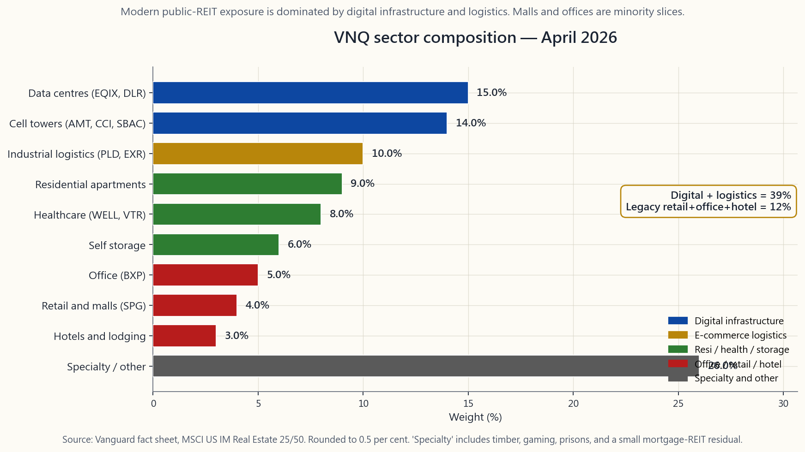
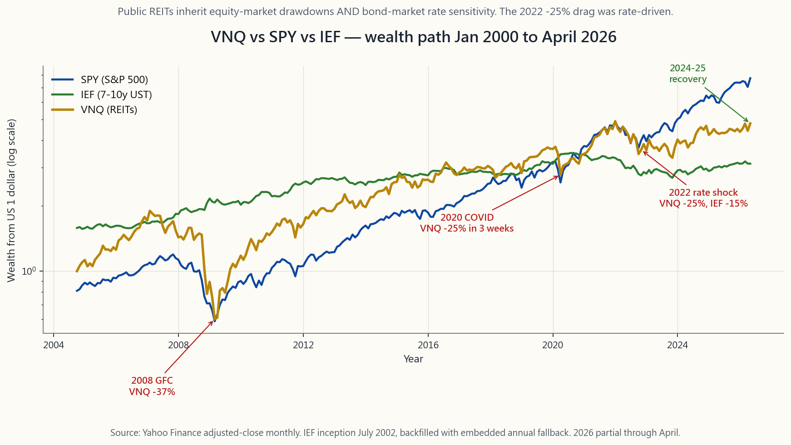

# 附加課 07：房地產信託基金——可投資的房地產資產類別

---

## 第一部分：閱讀材料

---

### 1. 為何此課題值得重視

大多數散戶投資者對房地產抱持兩個看法，各有半分道理，但合在一起卻暗藏危機。其一是「房地產可對沖通脹」，其二是「房地產信託基金讓你毋須成為業主也能持有房地產」。兩句話各有可取之處，也廣為人所引用，然而公開上市的房地產信託基金的實際表現，與這些半真半假的說法之間存在明顯落差——這正是新投資者在2022年式加息衝擊中蝕錢的根源所在。

此附加課獨立成篇，有三個原因：

1. **房地產信託基金是股票，不是房地產。** 先鋒房地產信託基金交易所買賣基金（VNQ）是由約160隻持有物業的上市公司組成的一籃子股票。其日常股價走勢與標普500的貝塔值約為0.85，而非追蹤凱斯-席勒樓價指數。當股市恐慌，VNQ亦隨之恐慌。當利率急升，VNQ因旗下派息形同長債票息，須承受存續期衝擊。2022年的事件正是典型案例：VNQ全年跌幅約25%，而私人商業房地產價格在同期幾乎持平。資產包裝形式至關重要。
2. **稅務架構獨特，直接影響稅後收益率。** 房地產信託基金是一種直通實體，必須將至少90%的應課稅收入分派給股東，方可免繳公司稅。作為代價，投資者所收取的派息須按**普通收入**稅率課稅，而非較低的合資格股息稅率。《2017年稅務削減與就業法案》中的第199A條款（已於2025年永久化）允許投資者就房地產信託基金派息扣除20%，可顯著提升稅後收益率，但此優惠僅適用於應課稅帳戶。資產存放位置而非配置比例的法則在此同樣適用：在條件許可下，房地產信託基金應優先存放於個人退休帳戶。
3. **板塊構成在過去十五年已徹底改變。** 現代VNQ的構成大致為：數據中心約15%、電話鐵塔約14%、工業物流約10%，而購物中心及辦公樓的佔比均已跌至個位數。2010年的VNQ恰好相反。大多數散戶投資者腦海中「房地產信託基金＝商場＋辦公室＋住宅」的固有印象，已足足落後十五年。時至今日，買入VNQ實際上是在購買數字基礎設施，加上一小部分倉庫屋頂。

本附加課的目標，是讓投資者對包裝形式、稅務、利率敏感度及板塊構成有足夠清晰的認識，從而判斷房地產信託基金是否值得在投資組合中佔有一席之地——若值得，應放在哪個投資板塊及哪個帳戶類型。

---

### 2. 必須掌握的知識

#### 2.1 房地產信託基金架構——分派90%、毋須繳納公司稅

房地產投資信託是一種公司制實體，根據美國《國內稅收法典》第856至859條選擇受特定稅務待遇規管。要符合資格，須持續通過四項測試。**資產測試：** 至少75%的總資產須為房地產、現金或美國國債。**收入測試：** 至少75%的總收入須來自租金、房地產抵押貸款利息或房地產出售收益。**分派測試：** 每年須將至少90%的應課稅收入以股息形式分派給股東。**持股測試：** 須有至少100名股東，且任何五名投資者合計持股不得超過50%。

若符合上述條件，房地產信託基金毋須繳納聯邦公司所得稅。代價是股東收取的是**普通收入**派息，而非按較低資本增值稅率課稅的合資格股息。第199A條款允許非公司制納稅人就房地產信託基金派息扣除20%，實際上將大部分房地產信託基金收入的聯邦最高稅率由37%降至29.6%。此外還須疊加州稅。

對投資者而言，具體影響如下：由於已移除壓低普通股股息收益率的公司稅層面，房地產信託基金的**稅前**收益率高於普通股票。然而在應課稅帳戶中，投資者須親自承擔相當於公司稅的稅務，因此**稅後**收益率往往低於表面數字。資產存放法則因此明確：在個人退休帳戶中持有房地產信託基金，可消除普通收入的稅務拖累；若在應課稅帳戶持有，則須在明確比較稅後收益率與其他選擇後方作決定。

90%分派規定亦意味著房地產信託基金無法保留盈利來資助增長，須每年透過發行股本及債務來收購新物業。此結構性特點使房地產信託基金的資產負債表更接近公用事業，而非普通股票，亦是其對利率異常敏感的根本原因，詳見第2.3節。

#### 2.2 股權型與按揭型、廣泛型與單一板塊型——認清自己持有什麼

第一個分類是**股權型房地產信託基金與按揭型房地產信託基金**。股權型房地產信託基金（佔市值約90%）持有物業並收取租金。按揭型房地產信託基金（mREITs，如AGNC、NLY、ABR）持有按揭證券，賺取長期收益率與短期融資成本之間的息差。按揭型房地產信託基金在任何實質意義上都不屬於房地產；它們是披著房地產標籤的槓桿固定收益套息交易，在1998年、2008年及2020年均曾崩潰。其雙位數收益率是波動性的代價，而非免費午餐。對大多數投資者而言，正確的選擇是只持有股權型房地產信託基金，VNQ、SCHH、USRT及IYR均追蹤此類別。

第二個分類是**廣泛型與單一板塊型**。四隻美國股權型房地產信託基金交易所買賣基金（括號內為2026年4月費用）如下：

- **VNQ**（0.13%）——先鋒旗艦產品，追蹤摩根士丹利資本國際美國可投資市場房地產25/50指數，持有165隻股份，資產管理規模達300億美元。適合大多數投資者作為默認選擇。
- **SCHH**（0.07%）——嘉信理財的競爭產品，追蹤道瓊斯美國精選房地產信託基金指數，按構建方式排除按揭型房地產信託基金，費用略低。
- **USRT**（0.08%）——iShares Core美國房地產信託基金，追蹤富時全國房地產投資信託協會股權房地產信託基金指數，與SCHH相近。
- **IYR**（0.39%）——iShares房地產，覆蓋範圍較廣（包括部分房地產服務公司），費用較高，為舊式產品。

2015年以來，單一板塊房地產信託基金的發展更為引人關注。現代公開上市房地產信託基金市場由四個二十年前尚不存在的板塊主導：

- **數據中心**（EQIX、DLR）——出租予大型科技平台及企業的伺服器機房。佔VNQ約15%。受惠於所有人工智能基礎設施趨勢。
- **電話鐵塔**（AMT、CCI、SBAC）——佔VNQ約14%。運作方式類近基礎設施公用事業；與四大美國電訊商簽訂長期合約。
- **工業物流**（PLD、EXR）——倉庫及自助儲存，電子商務建設的受益者。佔VNQ約10%。
- **醫療**（WELL、VTR）——老人院、醫療辦公室、生命科學大樓。佔VNQ約8%。

目前已幾乎消失的板塊：購物中心（SPG及持續萎縮的同類企業，佔VNQ約4%）、辦公室（BXP及折讓深重的同類企業，佔約5%）以及酒店（具周期性，佔比甚小）。重點在於，現今買入VNQ，主要是買入數字及物流基礎設施，附帶少量住宅及醫療的類債券底倉，而非購買1995年的商場指數。

單一板塊交易所買賣基金讓你可以增加或減少特定板塊比重：SRVR（數據及電話鐵塔）、INDS（工業）、REZ（住宅）、VPN（數據及連接）。大多數散戶投資者應默認選擇VNQ；對特定板塊趨勢有強烈觀點的投資者，可在核心VNQ倉位上疊加5至10%的單一板塊交易所買賣基金。

#### 2.3 利率敏感度——房地產信託基金是六至八年期債券的偽裝

決定房地產信託基金在數月至數年周期內價格走勢的單一最重要因素，在於它們的**交易方式與長存續期債券相似**。VNQ在2010年後的實證存續期約為6至8，介乎5年期與10年期國債之間的利率敏感度。機制十分直接：房地產信託基金的派息流是一長串現金支出，其現值與折現率成反比變動。2022年10年期國債收益率上升250個基點，VNQ全年總回報約跌25%，與7年存續期的估算基本吻合。

2022年事件值得銘記，是房地產信託基金利率衝擊的典型案例。美國整體消費物價指數於2022年6月達9.1%峰值。聯邦基金利率在十一個月內由0.25%升至4.50%。10年期國債收益率由1.5%升至4.0%。以資本化率衡量，私人商業房地產的交易價格大致持平——物業在十二個月內並未損失25%的價值。但VNQ下跌了。公開包裝即時傳導利率敏感度；私人資產只在下次出售時才傳導。「波動性尾巴搖動狗」的框架在此適用：當長存續期現金流有公開報價時，無論基礎資產是否跟隨，公開報價都會隨利率波動。

由此引申出一個令大多數投資者驚訝的推論：儘管教科書如此描述，房地產信託基金在通脹急升階段**並非**可靠的通脹對沖工具。在超過十五年的長期視野下，它們確是通脹對沖工具，因為租金會重置、替代成本隨物價水平上升。但在通脹率上升、聯儲局作出反應的十二個月內，房地產信託基金通常下跌。附加課06（通脹）對各資產類別有更全面的排名論述；就房地產信託基金而言，對沖邏輯體現在營運層面，而非定價層面，兩者之間的時間差可以長達數年。

就投資組合配置而言，房地產信託基金應在收益或價值儲存板塊佔較小比重（通常5至10%），其規模應以如下假設為基礎——它們在股市下跌時與股票同步下跌，在利率上升時與債券同步下跌，即在最需要它們分散風險時，往往適得其反。數十年期的分散投資效益確實存在；但在單季度衝擊中，應視其與當時波動最劇烈的風險資產高度相關。

#### 2.4 房地產信託基金的歸屬——投資板塊、帳戶類型與規模

綜合以上各點，配置決策可歸結為幾個機械性步驟。

**投資板塊。** 房地產信託基金屬於**收益**類資產，而非價值儲存類資產。派息是持有它們的原因；背後的實體房地產是支持派息的類債券抵押品。它們應與附加課10所述的股息股票（SCHD、VYM）放在同一板塊，而非第06週所述的黃金及商品板塊。默認投資者的收益板塊配置比例為5至10%。只有明確希望押注特定板塊（數據中心、電話鐵塔）的投資者，才宜加大比重。

**帳戶類型。** 個人退休帳戶優先於應課稅帳戶，毫無例外。房地產信託基金派息屬普通收入，199A的20%扣除雖有幫助但不足以彌補差距，且資產的派息率足夠高，令帳戶存放決策的複利效應相當顯著。順序如下：優先在個人退休帳戶中用盡房地產信託基金的配額；只有在個人退休帳戶已滿額或特別希望以應課稅現金流收取折舊抵銷部分派息時，才考慮在應課稅帳戶持有。

**規模（槓鈴視角）。** 5至10%的VNQ倉位屬核心板塊持倉，而非槓鈴策略的尾部資產。它不是在政策環境轉變時拯救你的資產。2022年的事件表明，以公開包裝形式持有的房地產信託基金，既無法抵禦利率衝擊，亦無法抵禦股市下跌。它們的價值在於長期收益及適度分散，而非危機中的阿爾法。若你發現自己打算將房地產信託基金的比重增至15%以上，那你實際上是在押注房地產作為一個資產類別；這個押注通常應透過以固定利率按揭直接持有物業來實現，而非透過公開上市的房地產信託基金。

最後一句話點出了包裝陷阱的精髓：**公開上市的房地產信託基金讓你持有房地產，就如同交易所買賣基金讓你持有股票。交易所買賣基金繼承的是包裝的波動性，而非基礎資產的耐心。** 按此原則決定規模。

---

### 3. 常見誤解

1. **「房地產信託基金就是房地產。」** 它們是持有房地產的股票。其日常股價由股票市場決定，即時對利率及風險偏好轉變作出反應。凱斯-席勒指數以實體交易速度移動，需時數月。VNQ則在數秒內波動。兩者並非同一資產。

2. **「房地產信託基金的派息享有稅務優惠，與股息相同。」** 並非如此。房地產信託基金的派息屬普通收入。第199A條款的20%扣除有所幫助，但仍無法使其降至合資格股息的稅率水平。在高稅階的應課稅帳戶中，SCHD 3.6%的合資格股息稅後價值，明顯優於VNQ 3.8%的普通收入收益率。

3. **「房地產信託基金可對沖通脹。」** 在超過十五年的長期視野下，確實如此——租金重置、替代成本上升、租約滾動。但在利率急升的單一年度內，它們會大幅下跌。2022年是典型的反例。

4. **「按揭型與股權型房地產信託基金大同小異。」** 它們是不同的資產類別。按揭型房地產信託基金是槓桿套息交易；股權型房地產信託基金持有物業。按揭型房地產信託基金在2020年及2008年因融資利差崩潰而暴跌；股權型則未受同等衝擊。

5. **「VNQ現時主要持有商場和辦公室。」** 它主要持有電話鐵塔、數據中心及工業物流。1995年的固有印象已落後十五年。

6. **「由於90%分派規定，房地產信託基金的派息有保障。」** 90%規定適用於**應課稅收入**，而房地產信託基金可透過折舊將其向下調節。在深度衰退期間（2008年、2020年），多間大型房地產信託基金雖未觸犯法律底線，仍削減了派息。

7. **「公開上市的房地產信託基金與私人房地產表現應大致相同。」** 在數十年的長期視野下，確實如此。在數月的短期視野下，則否。包裝形式是關鍵，而公開包裝具有流動性、與股票貝塔掛鉤，且逐筆報價重新定價。

---

### 4. 問答環節

**問：我是否應該持有VNQ？**
答：對於擁有個人退休帳戶空間、投資期限至少十年、採用默認60/40風格的投資者，建議持有——佔股票板塊的5至10%。對於只有應課稅帳戶、且稅階最高的投資者，稅後收益率的論據較弱；許多投資者改以較高收益率的合資格股息交易所買賣基金（SCHD）替代，完全放棄房地產信託基金。

**問：VNQ還是SCHH——選哪個？**
答：對於買入持有的投資者而言，兩者功能上可互換。SCHH費用略低（0.07%對0.13%），且按構建方式排除按揭型房地產信託基金。VNQ資產管理規模更大，差價更窄。任何一個都合適。選擇與你其餘基金系列相符的一個，以保持份額類別的一致性。

**問：我是否應以O（Realty Income）或AMT（American Tower）取代交易所買賣基金？**
答：持有單一房地產信託基金股份，意味著放棄分散投資。O是一間優質公司；但它也只是VNQ 160隻成分股中的其中一隻。若你想押注某個主題（電話鐵塔、數據中心），正確的工具是單一板塊交易所買賣基金（SRVR、VPN），而非單一股份。

**問：2022年的回撤與2008年及2020年相比如何？**
答：2008年最為嚴峻——VNQ全年跌約38%，因金融危機爆發、房地產信託基金債務的信用利差急升。2020年是3月數週內急跌25%，年底前大致收復。2022年是由利率主導的緩慢25%下跌。機制各異，跌幅相近。

**問：國際房地產信託基金如何？**
答：VNQI是國際對應產品。默認做法是只投資在美國上市、可投資的美國房地產信託基金；國際房地產信託基金增加了匯率風險、企業管治差異，以及拖累表現長達四十年的日本物業比重。對大多數投資者而言，應將房地產信託基金配額集中於VNQ，跳過VNQI。

**問：房地產信託基金與附加課06的通脹對沖有何配合？**
答：它們無法取代抗通脹債券或商品作為通脹對沖工具。它們參與長期實體資產的投資命題，但在短期內承受利率衝擊之痛。清晰的答案是：以抗通脹債券作為機械性通脹保護，以黃金或商品填補信念型資產的配額，以房地產信託基金作為收益板塊的一部分——三種不同職能，三個不同板塊。

**問：第199A條款20%扣除現已永久化？**
答：已於2025年稅務立法中永久化。無論持有人的W-2收入水平如何，均可就合資格的房地產信託基金股息申請扣除，且無退減安排（有別於第199A條款對直通企業收入的處理方式）。此扣除不適用於資本增值分派或資本返還部分，僅適用於1099-DIV表格中普通股息部分。

**問：房地產信託基金的FFO與盈利有何分別？**
答：房地產信託基金的按公認會計原則計算的盈利，被物業的非現金折舊所壓低——折舊是損益表上最大的費用項目，且並不反映實際經濟損耗。行業通行做法是採用經營性現金流（FFO＝淨利潤＋折舊－物業出售收益）及調整後經營性現金流（AFFO＝FFO－經常性資本開支）。評估房地產信託基金估值時，務必採用AFFO倍數，而非市盈率。

**問：互動實驗室的功能是什麼？**
答：以下的`side07_reit_lab`面板設有三個滑桿，分別設定房地產信託基金配置比例、利率衝擊幅度及通脹率，並顯示在60/30/10股票-債券-房地產信託基金投資組合中，相應的收益貢獻及回撤貢獻。其目的是在板塊層面呈現取捨關係：更多房地產信託基金意味著更高收益率和更大的利率衝擊回撤，兩者均與配置比例成線性比例。

---

## 第二部分：YouTube 腳本

---

**影片標題：** 房地產信託基金——沒有實體房地產的房地產投資 | 附加課 第7集

**目標片長：** 約11分鐘

**主持人：**
- **陳馬**（導師）：資深投資者，自2000年以來三度親歷公開上市房地產信託基金包裝與實體房地產脫鉤。
- **小魚**（學員）：持有401(k)目標日期基金的散戶投資者，正考慮是否在現有基礎上額外買入VNQ。

---

**[片頭序幕]**

[VISUAL: 動畫標誌「附加課 第7集——房地產信託基金」]

[VISUAL: image/side07_reit_sectors.png — VNQ板塊構成。]

**陳馬：** *(手持一張購物商場照片和一張數據中心照片)* 小魚，快問快答。如果我在2010年買入VNQ——先鋒的房地產信託基金交易所買賣基金——我主要持有的是哪一種？

**小魚：** 商場，應該吧？

**陳馬：** 沒錯。2010年確實如此。但今天，同一隻交易所買賣基金主要持有的是**這一種**——數據中心、電話鐵塔、工業物流。現代VNQ約有四成是數字基礎設施。商場的比重現在已跌至個位數。大多數散戶投資者對「房地產信託基金」的既有印象，已足足落後十五年了。

**小魚：** 好，所以不是商場。那它們是什麼？

**陳馬：** 股票。這就是整堂課的重點。房地產信託基金是持有物業的股票。它們在股票交易所買賣，股市恐慌時它們跟著恐慌，而且它們跟隨利率波動，存續期大約七年。它們不是大多數人口中所說的「房地產」。

---

**[第一節：架構——分派90%，毋須繳納公司稅]**

**陳馬：** 讓我用三十秒說清楚架構。房地產信託基金是一種公司制實體，根據第856至859條選擇特定稅務待遇。四項測試。75%的資產須為房地產。75%的收入須來自租金或按揭利息。每年須將90%的應課稅收入分派出去。以及至少需要一百名股東。

**小魚：** 作為回報呢？

**陳馬：** 毋須繳納公司所得稅。代價是你這個投資者，收到的派息須按**普通收入**稅率課稅，而非合資格股息稅率。2017年稅務法案的第199A條款——已於2025年永久化——讓你可以就這些派息扣除20%。所以如果你在37%的稅階，房地產信託基金收入的聯邦實際最高稅率是29.6%。高於合資格股息的20%。低於全額普通收入的37%。

**小魚：** 所以在稅務上，它們比SCHD差。

**陳馬：** 是的。這正是資產存放位置而非配置比例在此至關重要的原因。房地產信託基金應優先放在個人退休帳戶。應課稅帳戶只在你明確比較稅後收益率與其他選擇之後才考慮。

---

**[第二節：板塊構成——數據中心、電話鐵塔、物流]**

[VISUAL: image/side07_reit_sectors.png — VNQ板塊餅圖。]

**陳馬：** 以下是截至2026年4月VNQ的實際持倉。電話鐵塔——14%。數據中心——15%。工業物流——10%。住宅——9%。醫療——8%。自助儲存——6%。零售——4%。辦公室——5%。酒店及其他——剩餘部分。

**小魚：** 這看起來更像基礎設施，不像房地產。

**陳馬：** 沒錯。American Tower、Crown Castle、SBA Communications——這三家公司佔據了美國電話鐵塔所有權的絕大部分，而它們都是房地產信託基金，因為聯邦通信委員會和國稅局在2012年同意鐵塔屬於不動產。Equinix和Digital Realty也進行了同類轉換。因此，現代公開上市的房地產信託基金市場主要由數字基礎設施主導，附帶一部分倉庫屋頂。如果你想要商場指數，你得單獨買入SPG——而且你過去十年都虧損了。

**小魚：** 所以單一板塊交易所買賣基金——SRVR追蹤電話鐵塔，VPN追蹤數據——這就是押注現代主題的工具。

**陳馬：** 這正是工具箱的用法。大多數投資者應默認選擇普通VNQ，跳過疊加。若你想要單一板塊傾斜，在核心VNQ倉位上疊加5至10%才是合適的規模，而非百分之百替換。

---

**[第三節：利率敏感度——2022年案例]**

[VISUAL: image/side07_reit_vs_stocks.png — VNQ對比SPY對比IEF財富路徑圖（2000年至2026年4月）。]

**陳馬：** 這張圖是本課最重要的一張。三條線。藍色是SPY——標普500的總回報。綠色是IEF——7至10年期國債交易所買賣基金。金色是VNQ。從2000年1月至2026年4月，三者均以一美元為基準。

**小魚：** VNQ大部分時間跟SPY走得挺近的。

**陳馬：** 然後就不一樣了。看2008年——VNQ跌38%，比SPY更深。看2020年3月——VNQ在三週內跌25%。再看2022年——這個最重要——SPY因利率因素跌18%。VNQ跌了**25%**。IEF跌約15%。VNQ同時承受兩種衝擊：股市下跌時的股票回撤，以及利率上升時的存續期回撤。

**小魚：** 為什麼？

**陳馬：** 因為房地產信託基金是一長串派息，而一長串派息的現值與折現率成反比。VNQ的實證存續期是6至8。就利率衝擊而言，等同於7年期國債的敏感度。2022年10年期收益率上升250個基點，存續期計算預測約跌25%。結果正好如此。

**小魚：** 與此同時，私人房地產呢？

**陳馬：** 那年大致持平。交易市場的資本化率有所變動，但遠遠不足以解釋負25%。物業本身並沒有在十二個月內損失四分之一的價值。損失的是包裝。這就是「波動性尾巴搖動狗」的框架——當長存續期現金流有公開報價時，無論基礎資產是否跟隨，公開報價都會隨利率波動。

---

**[第四節：規模與配置]**

**陳馬：** 最後一節。這個東西到底應該放在哪裡？

**小魚：** 收益板塊、個人退休帳戶、5至10%。

**陳馬：** 完全正確。第三板塊配置——收益板塊，不是價值儲存板塊，不是增長板塊。帳戶配置——在有空間時，個人退休帳戶永遠優先於應課稅帳戶。規模——佔投資組合股票部分的5至10%，設定上限。如果你發現自己想將房地產信託基金的比重加至15%以上，那你想要的不是公開上市的房地產信託基金。你想要的是一個以三十年固定利率按揭持有的出租物業。那是一個不同的資產類別，具有不同的波動性特徵，我們在第14個附加課討論私人市場時會詳細介紹。

**小魚：** 那我們應該給觀眾留下什麼誤解需要糾正？

**陳馬：** 公開上市的房地產信託基金讓你持有房地產，就如同交易所買賣基金讓你持有股票。交易所買賣基金繼承的是包裝的波動性，而非基礎資產的耐心。你承受股市波動性，你承受存續期風險，你放棄了合資格股息的稅務優惠。作為回報，你以13個基點的費用，獲得對160幢物業的分散、流動、專業管理的敞口。這就是這筆交易的全貌。值得參與，以適當規模，放在正確的帳戶。但切勿誤以為自己擁有一幢樓。

---

**[互動面板提示]**

[VISUAL: interactive/side07_reit_lab.html — 滑桿面板。]

**小魚：** 影片下方的實驗室呢？

**陳馬：** 三個滑桿。投資組合中的房地產信託基金配置比例。利率衝擊幅度（基點）。通脹率。輸出結果顯示房地產信託基金配額的收益貢獻，以及在衝擊下的回撤貢獻。將配置設為10%，衝擊設為加250個基點——那就是2022年。看看回撤數字。再將通脹設為4%，期限設為二十年——看看收益如何複利增長。兩個不同的時間框架，兩個不同的答案，兩者都是真實的。實驗室的設計讓你能夠同時記住這兩個數字，而這正是本課的核心要義。

---

**[結尾]**

**陳馬：** 房地產信託基金。股票，不是房地產。普通收入稅，以第199A條款稍作緩解。六至八年存續期，2022年痛苦異常。現代構成是15%數據中心、14%電話鐵塔、10%物流——不是商場。默認規模5至10%。默認帳戶：個人退休帳戶。默認交易所買賣基金：VNQ。

**小魚：** 第七個附加課，完結。第八個附加課，基金費用。

**陳馬：** 到時見。

[VISUAL: 附有附加課路線圖的結尾卡片]

---

*附加課 07 完。*