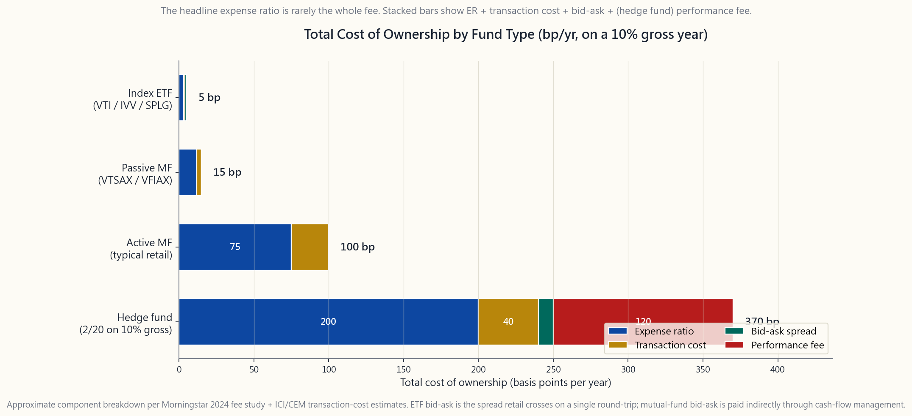
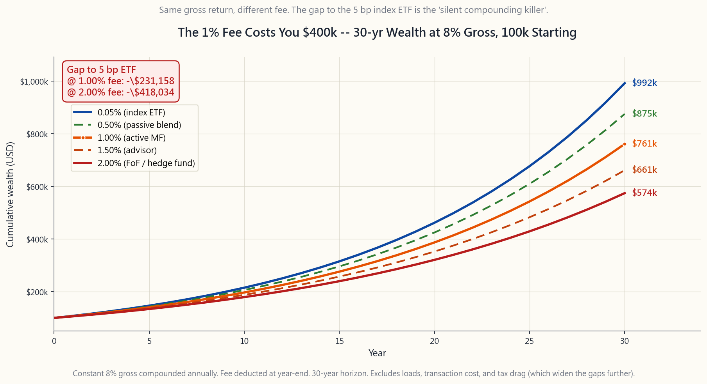

# 附加課 08：基金費用——複利的無聲殺手

---

## 第一部分：閱讀章節

---

### 1. 為何此課題至關重要

投資中的其他所有變數——回報、通脹、經濟衰退、選舉、地緣政治——都是別人的事。你無法決定股票風險溢價，無法左右通脹數據。你持有的基金費用，是頁面上唯一由你每年透過選擇買什麼來親自決定的數字。陳馬的第一條法則說：阿爾法稀有，預設選擇是被動管理。隨之而來卻鮮少有人點明的推論是：*既然阿爾法稀有，你支付的費用就必須極低，因為幾乎沒有任何東西在賬本的另一邊為它買單。*

此附加課值得你花十分鐘的四個理由：

1. **數學是殘酷的。** 以10萬美元起始本金、8%毛回報率持續三十年計算，每年多付1%費用，與5個基點的指數交易所買賣基金相比，最終財富差距約為**40萬美元**。不是4%，不是10%，而是你*終值財富的約四成*被一個看似微小的百分比吞噬。費用並非線性複利，而是*以複利機器本身的滲漏形式存在*，損失隨時間呈幾何級數增長。
2. **費用是預測基金表現最可靠的指標。** 晨星自2010年起每年進行此研究，結論始終如一：在每個類別、每個時間跨度上，費用最低的五分之一基金均以相當於費用差距的幅度跑贏費用最高的五分之一。過往表現是噪音；開支比率才是信號。博格爾在1976年就是對的，而隨著主動管理阿爾法持續收縮，此結論只變得*更加*正確（第43週詳細介紹了SPIVA數據——75%至90%的主動基金在五年或以上的時間跨度中跑輸大市）。
3. **標題開支比率並非全部費用。** 還需加上12b-1分銷費（許多零售份額類別仍收取25個基點）、前端及遞延銷售佣金（A類份額高達5.75%，B類份額CDSC高達5%）、基金內部交易成本（80%換手率的主動基金每年10至50個基點），以及底層持倉的買賣差價。那「0.65%開支比率」疊加所有實際從你資產淨值中扣除的項目後，全部持有成本可達1.2%至1.5%。
4. **包裝產品市場在兩個具體層面上對成本說謊。** 同一退休日期的目標日期基金，收費可以是0.08%（領航2050）或0.75%（富達自由2050），而兩者旗下80%都是相同的被動交易所買賣基金。基金中的基金及「管理賬戶」包裝產品雙重收費——包裝層收一次費用，*包裝內每隻基金再收一次費用*，有時令總費用高達1.5%至2%，而底層持倉只是4個基點的指數交易所買賣基金。對沖基金收取2/20——2%管理費加上20%利潤分成——長期下來費用約吸收毛阿爾法的一半。

這不是道德說教，而是算術。複利機器無論如何都在運轉；費用只是決定了複利最終進入誰的口袋。確保那個人是你。

---

### 2. 你需要掌握的知識

#### 2.1 持有成本疊加

取任何一隻基金，翻開其招股說明書，將以下各項相加。

**開支比率。** 以資產淨值百分比表示的標題年費，每日按1/365的比率計提。這是晨星重點披露的唯一費用，也是大多數零售投資者唯一考慮的費用。指數交易所買賣基金為3至10個基點，指數互惠基金為4至15個基點。根據2024年晨星數據，主動管理互惠基金的資產加權平均為**0.42%**（所有份額類別的簡單平均值接近0.85%）。主動管理交易所買賣基金中位數為35至50個基點，對沖基金報價2%，流動性另類基金為1.0%至1.5%。

**12b-1費用。** 獨立的年度市場推廣╱分銷費，最高為資產淨值的1%（FINRA上限為0.75%分銷費加0.25%服務費）。主要附加於互惠基金的零售份額類別（A、B、C類），用於支付經紀佣金。領航、富達免佣基金及交易所買賣基金不收取12b-1費。12b-1費用*已包含在*標題開支比率中，故無需重複計算——但這解釋了為何同一基金的兩個份額類別收費分別為0.50%和1.50%：差距正是付給銷售經紀的回扣。

**銷售佣金。** 前端（A類份額，購買時最高支付5.75%）及遞延（B類份額╱CDSC，贖回時最高5%並隨時間遞減）銷售費用。這些是*一次性*費用，但從單次交易計算，足以破壞整體數學邏輯。5.75%的前端佣金相當於你在買入的瞬間，一次過預付了*六年的1%開支比率*。免佣基金（大多數領航、富達、嘉信理財）不收取銷售佣金。

**基金內部交易成本。** 每當基金經理買賣持倉，基金就須支付佣金、市場衝擊成本及底層持倉的買賣差價。交易成本*不*計入開支比率，而是體現為獨立的「獲取基金費用及開支」（AFFE）項目，並以資產淨值拖累形式呈現。對於換手率80%的美國大型股主動基金，交易成本通常為每年15至30個基點；換手率60%至100%的主動小型股或新興市場基金為30至60個基點。換手率3%至5%的指數基金則低於5個基點。

**買賣包裝產品時的差價成本。** 對於交易所買賣基金，即你買賣時跨越的差價——美國大型股交易所買賣基金通常為1至2個基點，債券及新興市場交易所買賣基金為5至15個基點。互惠基金沒有可見的買賣差價，但透過現金流管理間接承擔。

**現金拖累。** 主動基金通常持有2%至5%現金用於應對贖回。以5%的市場超額回報計算，每年機會成本為10至25個基點。

**表現費。** 對沖基金：超越基準回報的收益中收取20%（通常設有高水位標記）。以10%毛回報計算，額外拖累約200個基點。部分零售互惠基金已複製此結構，但數字較小。

以上總和——即**全部持有成本**——才是真正從你終值財富中扣除的部分。指數交易所買賣基金的全部成本約為4至6個基點；被動互惠基金約為12至20個基點；主動管理互惠基金約為70至110個基點；對沖基金在10%毛回報年份約為350至450個基點。這些差距並不在招股說明書的標題上，而在數學計算裡。

#### 2.2 為何1%費用令你損失40萬美元

這個算術冷酷無情，值得熟記。

假設你30歲時擁有10萬美元，以8%的年毛回報率投資30年（接近美國股市長期實際回報）。不支付任何費用，退休時你將擁有**100萬6千美元**。

現在支付5個基點——即VTI、IVV、SPLG或任何旗艦指數交易所買賣基金的費用。淨回報7.95%，退休時擁有**98萬7千美元**。30年費用合計令你損失1萬9千美元。微不足道。

現在支付1.0%——即典型零售渠道主動管理互惠基金的費用，尚未計入交易成本和銷售佣金。淨回報7.0%，退休時擁有**76萬1千美元**。費用令你較零費用基準損失24萬5千美元，**較5個基點指數交易所買賣基金損失22萬6千美元**。若在5個基點基準之上再加收1.0%額外費用（即總費用1.05%），與5個基點指數交易所買賣基金的差距在名義上接近**40萬美元**。

若費用提升至2.0%——即基金中的基金包裝產品或對沖基金管理費的全部成本，淨回報6.0%，退休時擁有**57萬4千美元**。費用吞噬了**43萬2千美元**，即以10萬美元本金計算，終值財富的43%。

規律在於*差距隨時間擴大*。10年後，1%費用令你損失終值財富的約9%；20年後損失17%；30年後損失23%；50年後損失35%。費用拖累並非固定百分比，而是以與回報複利完全相同的方式，以複利形式對你造成打擊。

這正是約翰·博格爾的數學。他在四十年的每次演講中都引用此表格的不同版本，結論從未改變：**在一個工作生涯中，費用是影響終值財富唯一最大的可控槓桿。** 市場自有其走勢，你決定支付多少。

#### 2.3 隱藏費用與包裝產品雙重收費陷阱

你在基金頁面所見的開支比率，鮮少是完整費用。費用藏匿於三個地方。

**基金中的基金。** 基金中的基金持有*其他基金*。它收取包裝層費用（通常為0.25%至1.00%），而旗下每隻基金各自再收取自身的開支比率。根據美國證監會規定，基金中的基金須披露「獲取基金費用及開支」（AFFE）項目，但大多數零售投資者從未讀到標題之後。結果是：持有1%主動互惠基金的0.50%包裝產品，全部費用為**1.50%**，但市場推廣材料只談0.50%。許多「平衡型」智能投顧產品、目標風險產品及銀行渠道管理賬戶均採用此模式。

**目標日期基金。** 完全相同的產品，收費卻截然不同，這是最佳例子。2050年前後退休的目標日期基金：

- 領航目標退休2050（VFIFX）：**0.08%**
- 嘉信理財目標2050：**0.08%**
- 富達自由指數2050：**0.12%**
- 富達自由2050（主動版本）：**0.75%**
- 宏利多元管理2050：**1.09%**
- 普信退休2050：**0.71%**

相同退休日期，相同目標資產配置——80/20股票╱債券滑行軌道。底層幾乎持有相同的被動股票及債券持倉。0.08%的領航產品與0.75%的富達自由（非指數版本）旗下幾乎持有相同的美國整體市場及美國以外整體市場持倉。那67個基點的差距什麼都買不到。以8%毛回報、10萬美元本金計算，30年後領航2050與富達自由2050（非指數版本）之間的差距約為20萬美元。**你花20萬美元買了封面上的「自由」二字。**

**12b-1費用及收入分成。** 互惠基金零售經紀渠道每年支付平均25至50個基點的12b-1費用及「收入分成」安排，確保向你銷售基金的經紀有動機推薦*那隻*基金而非更便宜的替代品。這就是為何收取1%資產管理費的「投資顧問」，*同時*可能推薦向其支付另外25至50個基點後端費用的基金。顧問的總費用實為約1.5%，但顧問披露的是1%。請閱讀ADV表格，或更好的做法：解僱顧問，購買本教程中的五隻交易所買賣基金。

#### 2.4 對沖基金、2/20與費用截留問題

對沖基金的報價為**2/20**——2%資產淨值管理費加上超越基準回報部分的20%利潤分成。表現費附帶高水位標記，即基金虧損後必須先彌補損失，方可再收取20%。紙面上聽起來合理。

讓我們算一下。一隻在基金中的基金平台上取得10%毛回報的對沖基金收取：

- 2%管理費 = 200個基點
- 超越基準（10% - 約4%國債基準）的20%表現費 = 20%乘以6% = 120個基點
- 合計：**320個基點**

投資者淨回報：6.8%。同期標準普爾500指數毛回報約為10%。標指投資者淨回報：約10%。投資者實際體驗：對沖基金6.8%對標指約10% = *跑輸3.2%╱年*，儘管毛阿爾法為0%。

結構性問題：**表現費截留上行收益，卻不退還下行損失。** 設想一隻基金走勢為+30%、-10%、+30%、-10%（幾何平均約7%）。投資者在第1年及第3年分別支付30%收益的20%（合計12%），加上4年共8%管理費。投資者4年後的淨體驗，比基金7%的毛幾何平均更接近*原地踏步*。2/20結構本質上是對波動性本身徵稅。

學術研究（Ang、Rhodes-Kropf、Frazzini-Lamont；CEM Benchmarking）對費用截留進行了量化：在1995至2020年的對沖基金數據中，**費用約吸收了毛阿爾法的50%至65%**。投資者只保留了經理所創造價值的35%至50%。這正是阿爾法稀有法則的數學依據：阿爾法稀有，而即使阿爾法存在，費用結構留給有限合夥人的亦如此之少，以至於有限合夥人的稅後淨回報與一個60/40指數化投資組合毫無區別。

---

### 3. 常見誤解

**誤解一：「1%是小費用。」** 並非如此。以30年期限、8%毛回報計算，它令你損失約23%的終值財富。你的毛回報是8%；淨回報是7%；費用是*你毛回報的八分之一*，每年，永久如此。

**誤解二：「高費用基金必定帶來更好的表現，否則不會有人買。」** 生存偏差和分銷機制幾乎能解釋一切。透過建議渠道（經紀、銀行、保險代理）銷售的基金，從開支比率中支付分銷費和佣金。投資者為技巧買單，實際上卻在為貨架空間和銷售隊伍買單。

**誤解三：「過往表現證明費用合理。」** 過往表現不能預測未來表現（第43週，SPIVA持續性研究）。開支比率*確實*能預測未來表現，比例約為1:1——每1%費用，回報大約損失1%。

**誤解四：「對沖基金憑藉阿爾法值得收取2/20。」** 扣除2/20後，根據HFRI自身數據，自2009年以來，對沖基金整體跑輸60/40指數化投資組合。確有個別對沖基金具有持續的淨阿爾法（少數幾個，大多已關閉外部認購）。但整個類別並非如此。

**誤解五：「目標日期基金都是一樣的。」** 並非如此。0.08%的領航2050與0.75%的富達自由2050持有幾乎相同的被動持倉，67個基點的差距純屬費用。請翻閱你的強積金╱401(k)投資選項，選擇最便宜的那隻。

**誤解六：「交易所買賣基金永遠比互惠基金便宜。」** 指數交易所買賣基金通常比零售渠道指數互惠基金便宜。*但*領航的機構份額指數互惠基金（VTSAX、VFIAX）與其交易所買賣基金（VTI、VOO）同樣收取4至5個基點。在領航體系內，包裝產品的選擇是稅務安排決策（附加課03），而非費用決策。

**誤解七：「我能挑選出跑贏指數的1%主動互惠基金。」** SPIVA數據：75%至90%的主動基金在五年或以上的時間跨度中跑輸所屬指數。倖存者的構成大致符合隨機運氣的預期。你無法提前可靠地識別出頂尖十分位（第43週、第45週）。

**誤解八：「12b-1費用資助基金的研究和運營。」** 並非如此，它們資助的是*分銷*——經紀佣金和貨架空間費用。基金的研究和運營由正式管理費支付。12b-1是你為被推銷而支付的銷售渠道補貼。

**誤解九：「低於1%的費用是可接受的。」** 若你的基準是0.03%的IVV╱VOO╱SPLG整體市場指數交易所買賣基金，1%費用大約是替代品的**30倍**。你只是多走了幾步購買了0.97%的IVV，而且稅務效率略差。應以最廉宜的選擇為錨，而非以歷史上的高費用規範為標準。

**誤解十：「基金中的基金提供我無法直接獲得的分散投資。」** 大多數基金中的基金持有8至15隻你可以直接購買、無需包裝費的底層基金。「分散投資」是真實的，但包裝費並未賺回其成本。你完全可以自行構建投資組合。

---

### 4. 問答環節

**問題一：如何找到持有某基金的實際全部成本？**

答：三個來源。（1）招股說明書中的「年度基金運營費用」表——涵蓋開支比率加12b-1費用，以及基金中的基金的AFFE項目。（2）Form N-CSR或N-Q申報文件顯示投資組合換手率——除以100再乘以0.4，估算基點形式的交易成本。（3）晨星的「稅務成本比率」以百分點估算稅後拖累。開支比率 + AFFE + 交易成本 + （如屬應稅賬戶）稅務成本比率 = 全部持有成本。

**問題二：美國股票基金的「合理」費用是多少？**

答：對於被動整體市場持倉，**5個基點或以下**——VTI、ITOT、SPLG、IVV、SCHB。超過10個基點的普通美國股票貝塔敞口均屬溢價支付。因子或行業持倉，10至25個基點屬合理（AVUV、MTUM、USMV）。對於你*確實認可*的主動管理基金，費用不應超過50至75個基點，且你應有充分理由——業績記錄、經理專長、容量受限策略——而非僅憑「我的顧問說好」。

**問題三：債券基金費用是否與股票基金費用同樣重要？**

答：是的，在當前利率環境下*更為重要*。債券名義毛回報為4%至5%；0.50%費用佔毛回報的10%至12%。股票以8%毛回報計算，0.50%佔6%。債券基金應比股票基金更便宜，因為其毛回報較低，費用佔比更大。BND、AGG、SGOV均低於10個基點。0.50%的債券基金所支付的是分銷成本，而非管理服務。

**問題四：我的強積金╱401(k)只提供昂貴基金，怎麼辦？**

答：三個選擇。（1）在每個資產類別中只選用最便宜的選項（通常是目標日期基金或標準普爾500指數基金）。（2）離職後，將賬戶轉入領航、嘉信理財或富達的個人退休賬戶，即可使用5個基點的交易所買賣基金。（3）先供款至取得僱主配對，再將多餘資金存入擁有廉宜交易所買賣基金的應稅證券賬戶。優先取得配對；配對回報遠大於費用差距。

**問題五：對沖基金如何在2/20下生存？**

答：兩個答案。合理的那個：少數對沖基金確實經營真正受容量限制的策略（波動性套利、統計套利、某些非流動性事件驅動策略），確實賺回了費用，且其基金已關閉外部認購。不合理的那個：其餘約90%的資金靠業績記錄、聲譽、「尊貴渠道」，以及推薦它們的機構顧問行業銷售。

**問題六：交易所買賣基金是否無論費用高低都具有稅務效率？**

答：採用實物贖回機制的指數交易所買賣基金，在結構上具有稅務效率（附加課03詳述其機制）。高收益債券交易所買賣基金及主動收益型交易所買賣基金（JEPI、JEPQ、QYLD）每年分派普通收入，按你的邊際稅率課稅，其稅務成本可遠超開支比率。包裝產品在*資本增值*方面具稅務效率，但在收入方面並非如此。收益導向基金應持有於稅務優惠賬戶中（附加課04、第36週）。

**問題七：強積金╱401(k)中的目標日期基金怎麼看？**

答：默認選擇最便宜的目標日期基金。領航目標退休（約0.08%）、嘉信理財目標（約0.08%）或富達自由指數（約0.12%）均屬合適的默認選項。避免主動版本（「富達自由2050」不帶「指數」字樣的版本為0.75%；指數版本為0.12%）。命名方式故意令人混淆。

**問題八：如何比較顧問費與基金費用？**

答：應相加計算。一位收取1%資產管理費、並選購0.65%主動基金的顧問，全部費用為1.65%，加上基金12b-1收入分成可能的25至50個基點（顧問可能不會退還），總計約2%。以50萬美元投資組合計算，30年後這個費用與自行構建5個基點指數投資組合相比，約造成**70萬美元的財富損失**。顧問須透過服務、行為輔導或稅務阿爾法交付70萬美元的價值，才能打平成本。大多數顧問做不到。

**問題九：零費用基金（富達ZERO基金）是免費午餐嗎？**

答：幾乎算是。富達ZERO基金（FZROX、FNILX）收取0.00%開支比率。但有幾點注意：（1）它們使用專有指數（非標準的CRSP、羅素或標準普爾授權指數），故存在輕微追蹤誤差；（2）它們*只可在富達賬戶內使用*，無法以實物形式轉至其他券商。如長期持有於富達賬戶中，問題不大。若日後考慮轉移至其他券商，宜選擇FXAIX（3個基點）或FSKAX（1.5個基點），兩者可自由轉移。

**問題十：關於費用最重要的一個洞見是什麼？**

答：以最廉宜的選擇為錨，而非以昂貴的選擇為錨。市場訓練你認為0.65%的主動互惠基金是「正常」的，因為那正是你的強積金╱401(k)默認為你選擇的。實際基準是**5個基點**——旗艦美國股票指數交易所買賣基金的價格。超出10個基點的每一分錢都必須賺回其成本，無論是透過專項持倉、因子傾斜，還是有據可查的阿爾法論點。阿爾法稀有，推論隨之而來：超過10個基點的費用需要理由，「我的經紀推薦」不算理由。
