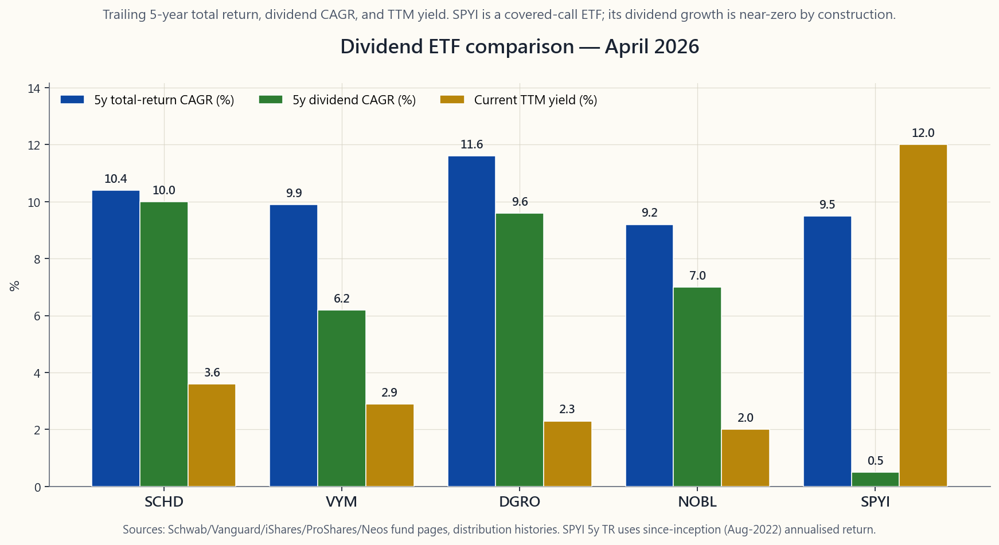
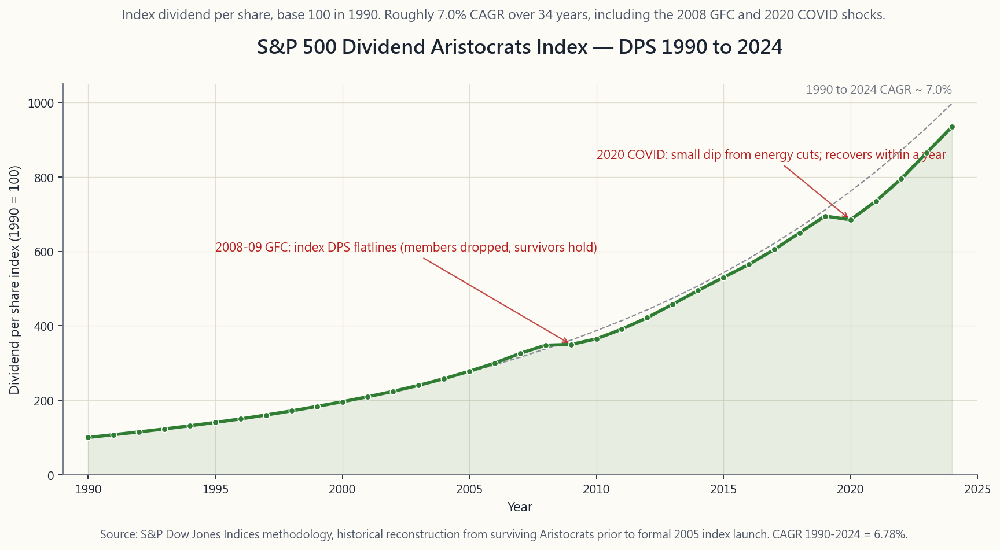

# 附加課程10：股息——合資格與普通股息、股息增長，以及SCHD/VYM/DGRO版圖

---

## 第一部分：閱讀章節

---

### 1. 為何此課題至關重要

股息是一個民間智慧與數學結論激烈交鋒的題目。從長遠來看，標普500指數約30至40%的總回報來自再投資股息；一旦計入複利效應，以1930年為基準計算的累計終值中，這個比例更超過80%。如此龐大的股票回報份額，不容輕描淡寫。與此同時，任何一所像樣的金融學院的學者都會告訴你——在一個無摩擦的世界裡——派息與留存現金之間的選擇根本無關緊要，因為你可以通過沽出股份或再投資來複製其中任一結果。這兩種說法同時成立。本課的任務，就是在這種張力之中自處，而非假裝它並不存在。

即使你已讀過莫迪利安尼-米勒定理，仍有四個理由值得認真對待股息：

1. **稅務處理*並非*無關緊要。** 按15%徵稅的合資格股息，遠優於按32%聯邦稅加5%州稅徵收的普通股息。莫迪利安尼-米勒假設不存在稅項；而你生活的世界恰恰相反。一筆款項落在美國國稅局兩條並行稅率表的哪一欄，每年的稅後現金流差異可達數百個基點。
2. **股息*增長*是質素信號，而非收益率信號。** 一隻連續25年提高股息的股票，必須靠盈利增長來支撐。貴族股名單及追蹤它的基金（NOBL、SCHD、DGRO）傾向持有盈利穩健、低槓桿、低貝塔的股份。收益率不過是副產品，財務紀律才是核心。
3. **行為勝於理論。** 一位週五停薪的70歲退休人士，無法靠「數學告訴你每年可以沽出4%」過活。對許多散戶投資者而言，一筆無需主動沽售即自動到帳的派息，往往是在30%回撤中堅守還是在底部認輸的分水嶺。這種偏好並非非理性，只是教科書裡沒有寫明而已。那句老話——*市場維持非理性的時間，可以比你維持償付能力更長*——對投資者本身同樣適用。
4. **股息基金是真實的資產配置，並非噱頭。** 單是SCHD一隻，至2025年的資產管理規模已突破700億美元，VYM、DGRO及NOBL合計再添約1,200億美元。這是交易所買賣基金市場中規模最大的單一策略類別之一。了解這四只指標性基金的差異——SCHD的質素篩選、VYM的市值加權收益率、DGRO的增長率過濾、NOBL的25年連續紀錄——是在四分法投資組合的收入板塊中具備基本認知的必備條件。

本課是四分法投資組合中收入板塊的操作手冊。你不會得到股息「好」或「壞」的答案——那是個錯誤的問題。你將學到哪些款項符合較低稅率的條件、股息增長實際上能帶來什麼、如何區分各指標性交易所買賣基金，以及哪些情況下數學確實說「無關緊要」，而哪些情況下美國稅法說「不，這會讓你多付17個百分點。」

網站上的互動面板讓你設定起始收益率、股息增長率、持有年期及聯邦稅率級距，系統將返回第N年的成本收益率、累計所收股息，以及稅後現金。請在讀完本文後使用它。

---

### 2. 你需要掌握的知識

#### 2.1 合資格股息與普通股息——60天持股視窗

當以下**三個條件全部**符合時，股息屬於*合資格股息*，可適用優惠的長期資本增值稅率（0%、15%或20%，200,000美元（單身）/250,000美元（已婚合併報稅）以上需額外加徵3.8%的淨投資收益稅）：

1. 派息方為**美國C類公司**，或**合資格外國公司**（稅務協定國，或透過美國預託憑證在美國認可交易所上市）。
2. 你在**以除息日為中心的121天視窗內，持股超過60天**（即股票須在你的帳戶中持有至少61天，且在該121天範圍之內）。
3. 在持股期間，你未以深度價內的認購期權沽空倉位或合成淡倉對沖該持倉。（美國《國內稅收法典》第1259條的推定性出售規則；美國國稅局將已對沖的長倉視為並未「真正」持有。）

不符合上述任一條件的股息屬於**普通股息**，按你的常規薪俸稅率徵稅——聯邦稅高達37%，加上州稅及淨投資收益稅，總計最高可達44.6%。最常見的普通股息來源包括：

- **房地產信託基金的分派**（絕大多數屬此類；199A條款的20%合資格業務收入扣減可降低實際稅率，但不會將其劃入長期資本增值稅率計算範疇）。
- **主有限合夥企業的分派**（大多為資本返還，其餘部分依K-1表格按普通收入稅率徵稅）。
- **非在美國交易所上市的外國公司**（若你直接透過外國券商購買當地上市股份，股息通常屬普通收入）。
- **債券交易所買賣基金派發的「股息」**（本質上是利息收入，以分派形式呈現；一律按普通收入徵稅）。
- **貨幣市場基金及高息儲蓄帳戶的「股息」**（即利息）。

最常令散戶中招的是*60天持股*規定。在除息日前一天買入股票，兩週後賣出——該股息並不合資格，須按普通稅率繳稅，即便這家公司是一間完全正常的美國C類公司。嘉信理財和富達均會在1099-DIV表格中標示，但系統只報告金額的分拆（1a欄對1b欄），並不會追溯修正你的成本基礎。60天規定正是除息日交易策略在稅後幾乎從不奏效的根本原因。

#### 2.2 2026年稅率結構

對同一筆投資收入，根據其所屬類別，適用兩條並行的稅率計算方式。

**普通稅率**（薪俸、利息、房地產信託基金分派、不合資格股息、短期資本增值；2026年單身申報人）：

| 稅率級距 | 應課稅收入 |
|---|---|
| 12% | 12,150至50,400美元 |
| 22% | 50,400至107,825美元 |
| 24% | 107,825至206,000美元 |
| 32% | 206,000至262,000美元 |
| 35% | 262,000至657,000美元 |
| 37% | 657,000美元以上 |

**長期資本增值稅率／合資格股息稅率表：**

| 稅率 | 應課稅收入（單身） |
|---|---|
| 0% | 49,450美元以下 |
| 15% | 49,450至545,750美元 |
| 20% | 545,750美元以上 |

此外，收入超過200,000美元（單身）/250,000美元（已婚合併報稅）的家庭，需在上述任一稅率基礎上額外加徵**3.8%淨投資收益稅**。

兩個實際推論：

- 一位32%稅率的退休人士，收取4,000美元的SCHD股息，可保留3,200美元（15%長期資本增值稅加5%州稅）。同一退休人士收取4,000美元的VNQ（房地產信託基金）分派，可保留2,624美元（32%乘以199A條款後的0.80係數，加5%州稅）。相同的帳面收益率，家庭實際到手現金相差近18%。
- 12%稅率的投資者，對合資格股息須繳**零**稅。這是美國稅法為低至中等收入退休人士提供的最大*合法*免費午餐。在應課稅收入不超過49,450美元之前，你所收到的SCHD股息完全免稅。*資產放置*（哪個帳戶持有這些股息）是讓你維持在該稅率級距的槓桿所在。

#### 2.3 收益率與股息增長——兩個截然不同的問題

股息投資中最常見的思維謬誤，是將**過去十二個月收益率（TTM）**當作回報率來解讀。它並不是。收益率只是其中一個變數：

$$ \text{總回報} \approx \text{股息收益率} + \text{資本增值} $$

對於一個增長緩慢的股息派發者，第二個變數通過股息*增長*與第一個掛鉤：一間每年將股息提高8%的公司，在長期內其股價的複利增長率往往大致相當，因為派息政策以盈利為錨。

四只指標性交易所買賣基金的篩選邏輯及各自的優化目標：

| 交易所買賣基金 | 追蹤指數 | 收益率（2026年4月） | 5年股息複合年增長率 | 篩選重點 |
|---|---|---|---|---|
| **SCHD** | 道瓊斯美國股息100指數 | 約3.6% | 約10% | 質素+10年股息紀錄+現金流股本回報率 |
| **VYM** | 富時高收益（不含房地產信託基金）指數 | 約2.9% | 約6% | 標普500收益率前半部，市值加權 |
| **DGRO** | 晨星美國股息增長指數 | 約2.3% | 約10% | 連續5年提高股息，派息率低於75% |
| **NOBL** | 標普500股息貴族指數 | 約2.0% | 約7% | **連續25年**提高股息 |
| **SPYI** | 標普500加月度認購期權覆蓋 | 約12.0% | 約0% | 期權金收入，非股息增長 |

將SPYI納入同一圖表的目的在於對比。SPYI是一只備兌認購期權交易所買賣基金（`course/week27_covered_calls.md`）；其12%的分派來自期權金，而非來自企業現金流的增長。SPYI的股息增長列接近零——其分派隨引伸波幅升跌，而非隨企業盈利變化。這是一種*截然不同*的收入來源，稅務處理亦有別（大部分屬短期資本增值及資本返還，均不合資格），在四分法投資組合中應歸入不同板塊，而非與SCHD或VYM並列。

**成本收益率（YoC）。** 一個起始收益率為3.6%、股息每年增長10%的持倉，其**成本收益率**為：

$$ \text{成本收益率}_N = y_0 \cdot (1+g)^N $$

十年後，即3.6% × 1.10^10 = 9.34%。二十年後則達到原始成本的24.2%。這正是股息增長投資在情感上具備持久力的數學基礎：一位在2046年手持SCHD的退休人士，若她在2026年以當時價格買入，紙面上每年收取的現金股息接近其原始投資金額的25%，即便SCHD的*當前*收益率根本沒有移動。成本收益率作為績效歸因指標帶有一定的虛榮成分，但對生活規劃而言，確實具有實質意義。

#### 2.4 莫迪利安尼-米勒的觀點——為何有人反對股息

以下是這個經典論點的一段話。在一個沒有稅收或交易成本的世界裡，一隻100美元的股票在除息日派發4美元股息後，變成96美元的股票加上4美元現金。你持有的資產在派息前是100美元；派息後仍是100美元。如果你不想收取股息，把4美元再投資，你重新持有100美元的股票。如果你的鄰居持有一隻不派息的100美元股票，卻想套取4美元現金，她賣出4美元的股票，同樣持有96美元加4美元現金。兩種政策在財富角度而言完全相同；唯一的差異是*路徑*。莫迪利安尼和米勒在1961年正式証明了這一點，並因此獲得諾貝爾獎。

在*現實*世界中，這個假設在三個地方失效：

1. **稅項。** 強制派息是強制性的應稅事件。選擇沽出4美元股票的投資者，可以自行決定*何時*實現收益；收取4美元股息的投資者則別無選擇。以32%的普通稅率計算（不合資格股息），這相當於每年*強加於你*1.28%的摩擦成本。帳戶類型至關重要。
2. **交易成本。** 在免佣金的券商賣出100美元股票中的4美元，不涉及任何費用，但需要*注意力*——這對許多投資者而言是真實的資源。股息是自動到帳的。「自己把4美元從頂部取走」的方案理論上無懈可擊，但行為上卻脆弱易折。
3. **資訊信號。** 董事會提高股息，同時也在傳遞「我們預期能持續賺取這筆收入」的信號。削減股息則傳達相反的信息。市場將派息*變化*解讀為對未來現金流的預測，實證文獻（Lintner，1956年；Brav-Graham-Harvey-Michaely，2005年）亦確認管理層深知此點並據此管理。純粹的無關緊要理論意味著董事會不在乎股息政策；但他們顯然非常在乎。

誠實的綜合結論是：在無摩擦模型中，股息是中性的；在現實世界中，稅務摩擦是真實且可量化的，而自動派息的行為價值亦是真實存在的，只是教科書裡沒有寫明。雙方各有道理。

#### 2.5 外國預扣稅——加拿大及歐洲案例

持有外國股息派發股票的美國投資者，在現金到達券商帳戶前，已被預扣外國稅款。散戶投資者實際上會遇到的兩種情況：

- **加拿大股息派發股票（ENB、BCE、RY、TD）。** 根據美加稅務協定，加拿大在來源地**預扣15%**（無協定情況下為25%）。該15%在1099-DIV表格的第7欄顯示為「已繳外國稅款」，可透過**外國稅額抵免（FTC）**在1116表格中申請退回。
- **歐洲股票（雀巢、諾華、透過美國預託憑證持有的蜆殼B類股份）。** 大多數協定稅率為15%；瑞士預扣35%，但可透過88號表格申請退款（大多數散戶從不花這功夫）。

外國稅額抵免有兩個結構性限制，初學者常會中招：

1. **這是抵免，不是退稅。** 你只能以此抵銷應繳美國稅款。若某年你的美國應繳稅額為零（例如你主要靠羅斯帳戶分派生活），外國預扣稅便成為純粹的損耗。這正是在羅斯個人退休帳戶持有外國股息股票比在應稅帳戶持有*更差*的原因：在應稅帳戶，你可以取回那15%；在羅斯帳戶，你只能白白損失。
2. **抵免按收入類別劃分。** 被動類別的外國稅額抵免只能抵銷被動類別的美國應繳稅款。超額抵免可向前一年追溯，或向後十年結轉，但對於外國投資額不大的大多數散戶而言，當年的抵免通常可完全沖銷。

總結規則，重申如下：**外國股息股票應置於應稅帳戶**，以便收回外國稅額抵免；廣泛持有的美國股息交易所買賣基金可放置於任何帳戶；房地產信託基金和債券類應進入個人退休帳戶。（`course/side04_tax_efficiency.md` 有完整的資產放置矩陣。）

---

### 3. 常見誤解

1. **「高收益率＝高回報。」** 並非如此。備兌認購期權交易所買賣基金12%的收益率，與股息增長股3%的收益率截然不同。對照交易所買賣基金表格中的股息增長一欄；SPYI過去五年的總回報大幅落後於SCHD，儘管其帳面收益率高出四倍。
2. **「股息是『白來的錢』。」** 股息在除息日從股價中扣除，分毫不差。莫迪利安尼-米勒在這一點上是對的。
3. **「在應稅帳戶再投資股息是免稅的。」** 並非如此。股息在派發當年須繳稅，*無論你是否再投資*。股息再投資計劃並非稅務庇護所，它只是再投資環節的自動駕駛，僅此而已。
4. **「房地產信託基金股息屬合資格股息。」** 幾乎從不。房地產信託基金分派大多屬普通收入；199A條款的20%扣減是部分抵銷，並非重新分類。
5. **「外國股息應放入羅斯帳戶，因為那裡有稅務優惠。」** 恰恰相反。把外國股息放入羅斯帳戶，會損失外國預扣稅且無從抵銷。外國股票應置於應稅帳戶。
6. **「股息股票比標普500指數更安全。」** 有時如此。KO、JNJ、PEP、PG等貴族股確實傾向於貝塔較低。但「安全」受市場環境影響：2022年標普500指數跌約18%，許多高收益板塊（尤其是公用事業）跌幅更深，因為它們是長存續期的債券替代品（`course/week34_rate_shock_grid.png`）。
7. **「你應該追逐某板塊中收益率最高的股票。」** 某板塊中收益率最高的股票，通常是因為市場在為股息削減定價。美國電話電報（2021年）和通用電氣（2018年）在削減股息前，均曾被篩選出為各自板塊中「收益率最佳」的股票。收益率是*結果*；質素才是投入。
8. **「NOBL是最好的股息交易所買賣基金，因為有貴族股。」** 25年篩選標準是機械性的，並不具預測性。NOBL排除了微軟（2003年才開始派息）和蘋果（2012年恢復派息）等公司，而它們是過去十年最主要的資本回報故事。篩選規則存在副作用。

---

### 4. 問答章節

**問題一：如果我在除息日當天買入股票，我能收到股息嗎？**
不能。除息日是截止日；在除息日或之後買入的投資者，購入的是*不附帶*下次派息權利的股票。股票在除息日的股價下跌，正是因為這個原因。

**問題二：持股期間規定用簡單的話怎麼說？**
你必須在橫跨除息日的121天視窗內（前60天、後60天加除息日本身），持股超過60天。持股不足，即便該公司是完全正常的美國C類公司，股息也會按普通稅率徵稅。

**問題三：為什麼我的SCHD分派在去年第二季有所下跌？**
分派因各成分公司按各自時間表宣佈而季度有所不同。SCHD的年度總額以約10%的過去複合年增長率增長，但單個季度可能比平滑後的趨勢線高或低30%。

**問題四：主有限合夥企業分派算股息嗎？**
不算。它們是*合夥人分派*，以K-1表格而非1099-DIV表格呈現。大部分現金在技術上屬於資本返還，會降低你的成本基礎，直到你賣出時以普通收入形式被追繳。對散戶並不友好。

**問題五：股息增長型投資與股息收益率型投資有何區別？**
收益率型投資優化今日的現金；增長型投資優化增長軌跡。SCHD兼顧兩種篩選條件。VYM更傾向收益率。DGRO更傾向增長。NOBL的增長篩選最嚴格（25年連增紀錄），因此帳面收益率較低。

**問題六：股息交易所買賣基金在科技股主導的市場中會否跑輸？**
往往如此。在2020至2024年期間，SCHD年度回報落後VOO達7至10個百分點，因為主要贏家（英偉達、微軟、Google、Meta、亞馬遜）要麼不派息，要麼通不過SCHD的質素篩選。這是其設計特點，而非缺陷；你買SCHD，並非為了在增長型市場中跑贏。你買它是為了收入板塊。

**問題七：SCHD應該放在哪個帳戶？**
應稅帳戶（合資格股息按長期資本增值稅率徵稅）或羅斯帳戶（永久免稅）均可。傳統個人退休帳戶可以，但略次優化，因為提款時你會將長期資本增值稅率的現金流轉化為普通收入。放置損失大約為每年5至10個基點。

**問題八：房地產信託基金應該放在哪個帳戶？**
傳統個人退休帳戶或羅斯帳戶。在高稅率情況下，如能避免，絕不要放在普通應稅帳戶。199A扣減有所幫助，但不能完全解決普通稅率的問題。

**問題九：什麼是「成本收益率」？為何股息投資者喜歡談論它？**
成本收益率是當年股息除以你的*原始*成本基礎。在3.6%起始收益率的情況下，經過20年的10%股息增長，你的成本收益率達24%。對退休人士而言，這在心理上極具說服力，因為它使長期複利增長變得具體可感——即便它對未來預期回報並無影響。

**問題十：股息交易所買賣基金在美國以外是否適用？**
適用，但美國投資者應堅持選用在美國上市的基金。美國是唯一一個散戶可以有信心操作的股票市場，兼具流動性、公司治理及交易所買賣基金基礎設施。SCHD、VYM、DGRO、NOBL及SPYI均在美國上市並於美國注冊。不要購買愛爾蘭注冊的「國際版本」——你會用外國預扣稅換來被動外國投資公司的噩夢。

**問題十一：四分法投資組合中，收入板塊的合理規模是多少？**
對於一位擁有15年積累跑道的50歲投資者，金融資產中約25%配置於收入板塊是合理的預設值。對於65歲的退休初期人士，35至45%更為常見。板塊*內部*在股息交易所買賣基金、債券及期權金收入之間的分配，詳見`course/week36_income_portfolio.md`。

**問題十二：股息投資中有沒有「市場對這隻股票判斷有誤」的情況？**
有——這被稱為**股息陷阱**。在同業收益率為3%的板塊中，一隻收益率達9%的股票，代表市場認為其有67%的機率削減股息。市場有時判斷有誤；但通常判斷準確。在假設收益率是真實的之前，務必核實派息率、自由現金流覆蓋率及資產負債表的槓桿水平。

---

## 第二部分：YouTube腳本

---

**影片標題：** 2026年股息全攻略——合資格與普通股息、增長對比收益率，以及SCHD/VYM/DGRO/NOBL/SPYI完整分析
**目標片長：** 約12分鐘
**主持人：** 陳馬、小魚

---

**[開場——0:00至1:00]**

[VISUAL: image/side10_div_etf_compare.png]

小魚：今天的課題是股息。具體來說：何時美國國稅局按較低稅率徵稅，何時按較高稅率，以及SCHD、VYM、DGRO、NOBL和備兌認購期權基金SPYI這幾只指標性股息交易所買賣基金，實際上有何分別？

陳馬：今天有三個要點帶走。第一：令股息成為「合資格」的規定——你必須在除息日前後超過60天持有股票。第二：SCHD約10%的股息增長率與VYM約6%之間的差距——這一個數字就能說明SCHD和VYM的核心差異。第三：成本收益率——為何一位二十年前買入3.6%收益率股票的投資者，今天按原始成本計算收取了約24%的現金股息，即便SCHD的*當前*收益率根本沒有動過。

小魚：這是附加課程，所以我們保持簡潔。十二分鐘。

---

**[第一節——合資格與普通股息，60天規定，1:00至3:30]**

陳馬：這節課最重要的一個事實，就是美國稅法對投資收入設有*兩條並行的稅率計算方式*。普通稅率適用於薪俸、債券利息、房地產信託基金分派及短期資本增值。另一條——長期資本增值稅率——適用於長期資本增值及*合資格股息*，稅率低得多。

小魚：低多少？

陳馬：在32%稅率級距——也就是美國大多數年收入超過約20萬美元的單身家庭——普通稅率是32%，合資格股息稅率是15%。再加上州稅。200,000美元以上還要加3.8%的淨投資收益稅。差距大概是17個百分點。

小魚：那麼問題來了：什麼令一筆股息成為「合資格」的？

陳馬：三項測試。派息方必須是美國C類公司或合資格外國公司。你必須在以除息日為中心的121天視窗內，持股超過60天。另外，持股期間不能以深度價內的認購期權沽空對沖。三項全部通過，股息才進入長期資本增值稅率的計算範疇。任何一項不符合，便是普通收入。

小魚：60天規定最容易踩雷。

陳馬：對。如果你在除息日前一天才買入股票，收了股息，一週後就賣出——那筆股息*並不合資格*。按普通稅率，沒有商量餘地。這就是除息日交易策略稅後幾乎從不奏效的根本原因。

小魚：那房地產信託基金呢？

陳馬：房地產信託基金分派幾乎從不合資格。它們屬於普通收入。199A扣減將有效稅率降低20%——所以一個32%稅率級距的房地產信託基金投資者，實際繳稅約25.6%，而非32%——但這並不會將分派移入長期資本增值稅率的計算範疇。這正是為何房地產信託基金應放入個人退休帳戶，而非應稅帳戶。

---

**[第二節——收益率與增長，SCHD/VYM/DGRO/NOBL/SPYI對比表，3:30至7:00]**

[VISUAL: image/side10_div_etf_compare.png]

小魚：讓我看看那張五只指標性股息交易所買賣基金的對比圖。

陳馬：每只基金三條數據欄。第一條是過去五年的總回報。第二條是過去五年的股息複合年增長率——分派本身增長了多快。第三條是當前過去十二個月的收益率。

小魚：SPYI是明顯的異類——12%收益率。

陳馬：對，而這正是今天的關鍵所在。SPYI是一只備兌認購期權交易所買賣基金。它的分派來自對標普500投資組合出售期權金，而非來自企業盈利增長。所以SPYI的*增長*欄基本上是零。帳面收益率很高，但這是另一種性質的收入——是期權金，按短期資本增值稅率徵稅，並不合資格。

小魚：那SCHD對比VYM對比DGRO呢？

陳馬：SCHD是嘉信理財的質素與收益率混合基金，追蹤道瓊斯美國股息100指數。收益率約3.6%，股息每年增長10%。VYM是先鋒的純收益率篩選——標普500收益率前半部——收益率2.9%，增長6%。DGRO是iShares的增長篩選——連續五年提高股息的公司——收益率2.3%，增長10%。NOBL篩選最嚴格——連續25年提高股息——收益率2%，增長7%。

小魚：所以哪一只最「好」？

陳馬：這是個錯誤的問題。它們並非可相互替換。SCHD是若你只想持有一只兼顧收益率與增長的收入交易所買賣基金的預設選擇。NOBL的質素篩選最嚴格，但對過去十年才開始派息的新經濟複利增長股有所低配。DGRO是對微軟和蘋果更友好的版本。VYM在不涉及垃圾債券的情況下收益率最高。SPYI根本不是股息交易所買賣基金——它是備兌認購期權交易所買賣基金；應將其視為期權金收入板塊的一部分，而非股息板塊。

---

**[第三節——貴族股與股息增長的投資理由，7:00至9:00]**

[VISUAL: image/side10_aristocrats_growth.png]

陳馬：看這張圖。這是標普500股息貴族指數1990年至2024年的每股股息。

小魚：這條線非常平穩。

陳馬：年均增長約7%，貫穿整個時期。留意2008年——全球金融危機。指數的每股股息*停滯不前*。但並未崩潰。被削減股息的公司被剔出貴族股名單，但留存的成員繼續派息，新加入的替代成員也繼續派息。到2010年，上升趨勢恢復。

小魚：新冠疫情期間呢？

陳馬：2020年有小幅下跌，主要因為一些能源類股削減股息。一年內便恢復了。

小魚：這種穩定性，就是股息增長作為投資策略的論據所在。

陳馬：對。貴族股篩選是機械性的——必須連續25年提高股息。這一篩選，在過去40年兩次最嚴峻的宏觀衝擊中，給你帶來了每年約7%的複利收入增長。這正是SCHD/DGRO/NOBL系列背後的實證基礎。

---

**[第四節——莫迪利安尼-米勒與「無關緊要」的爭論，9:00至10:30]**

小魚：有些學者會告訴你股息無關緊要。除息日股價按股息金額下跌，所以在「經濟上等同於」沽出股份。

陳馬：莫迪利安尼-米勒，1961年。在他們的模型裡，他們是對的。在一個無摩擦的世界裡，派息與留存之間的選擇確實是中性的。但在現實世界中，三個摩擦打破了這個模型。第一，稅項——股息是強制性的應稅事件；你無法選擇何時實現。第二，行為——大多數散戶不會像兌現一張股息支票那樣，嚴格執行「每年自行沽出4%」的方案。第三，信號——董事會提高股息，正在傳遞對未來現金流的預期；市場讀取這個信號。

小魚：先保持償付能力，再嘗試做對的事。

陳馬：對——市場維持非理性的時間，可以比你維持償付能力更長，這對投資者本身同樣成立。一位週五停薪的70歲老人，無法靠「數學告訴你可以沽出股份」過活。股息在操作層面的可靠性，是「自行提取」方案無法比擬的。

---

**[第五節——外國預扣稅與資產放置，10:30至11:30]**

小魚：還有一個複雜因素：外國股息股票。

陳馬：加拿大和大多數歐洲國家在現金到達你的券商帳戶前，按協定稅率預扣15%。你可在1116表格中以外國稅額抵免的形式申請取回。但抵免只能用來抵銷你應繳的美國稅款。所以如果你把外國股息股票放在*羅斯個人退休帳戶*，那15%你就只能白白承受，無從抵銷。這與通常的資產放置直覺相反。

小魚：也就是說，外國股息應該放在哪裡？

陳馬：應稅帳戶。這樣才能取回外國稅額抵免。債券和房地產信託基金放入個人退休帳戶。SCHD等國內股息交易所買賣基金可放置於任何帳戶。附加課程4有完整的資產放置矩陣。

---

**[結尾——11:30至12:00]**

小魚：三個要點帶走。

陳馬：第一，在除息日前後持股超過60天，否則股息不合資格。第二，收益率不等於回報；股息*增長*才是真正的信號。第三，SCHD/VYM/DGRO/NOBL並非可互換的替代品——各有不同的篩選邏輯，服務不同的目標。SPYI不是股息基金，它是備兌認購期權基金。

小魚：打開互動面板。設定3.6%的起始收益率、10%增長率、20年持有年期，以及你的稅率級距。看看成本收益率如何攀升至24%。那就是令股息增長投資在情感上具備持久力的圖表。

陳馬：下一節附加課程是關於外國上市交易所買賣基金的運作機制，以及被動外國投資公司規則。到時見。