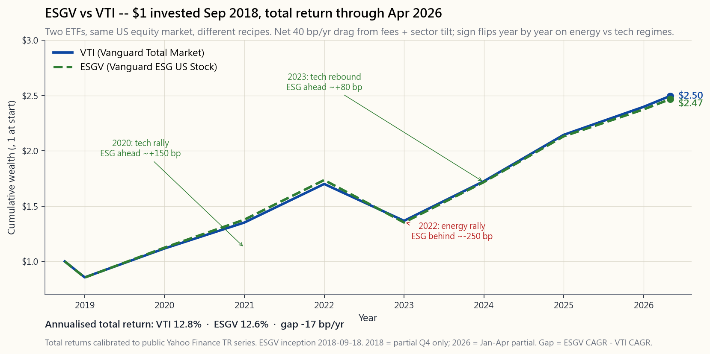

# 附加課程 12：ESG 投資 — 價值觀、阿爾法，還是市場推廣？

---

## 第一部分：閱讀章節

---

### 1. 為何此課題重要

ESG — 環境、社會、管治 — 是自指數基金誕生以來，「品牌化」指數化投資中規模最大的類別。截至 2026 年 4 月，全球持有 ESG、可持續或負責任標籤的資產已逾五十萬億美元。你現在閱讀的每份招股章程都包含一段可持續發展說明。每個智能投資顧問都提供「價值觀」投資組合切換選項。每位誠實的投資者都必須回答同一個問題，而這也是任何主動產品所要面對的問題：*這究竟是真正的阿爾法來源，還是我花了二十個基點，只是為別人的偏好披上業績的外衣？*

以下四個原因，說明為何此課題值得獨立成一節附加課程，而非僅以一段文字帶過：

1. **評級互相矛盾。** 同一家公司，同一週，同一份數據，在某個 ESG 供應商眼中是「領先者」，在另一家眼中卻是「落後者」。不同供應商對相同公司的評級相關性約為 0.40 至 0.55 — 在尾部結果上幾乎與擲硬幣無異。若輸入數據本身是雜訊，輸出結果便不可能是阿爾法。
2. **業績爭議多屬雜訊。** ESG 基金與其普通版對應產品（`ESGV` 對比 `VTI`、`SUSL` 對比 `IVV`）每年回報相差不超過 50 至 100 個基點，且差距的正負方向會隨板塊周期而轉換。2022 年能源板塊反彈拖累 ESG；2020 年及 2023 年科技板塊反彈則對其有利。八年下來淨回報：大致打平。既無「ESG 溢價」，亦無「ESG 懲罰」— 有的只是板塊傾斜帶來的雜訊。
3. **費用是實實在在的。** 先鋒全市場交易所買賣基金收費 3 個基點。`ESGV` 收費 9 個基點。`SUSL` 收費 10 個基點。`DSI` 收費 25 個基點。主動管理型 ESG 互惠基金動輒收費 60 至 100 個基點。以絕對值而言，費用溢價雖然不大，但卻是*確定的*，且每年都在累積。費用是你唯一能預測的部分；阿爾法則不然。
4. **你的價值觀依然重要，它們是可以有代價的。** 本課程並非反對 ESG 投資。論點在於 *不要將其視為阿爾法*。買入 ESG，是因為這些外部效應對你而言是真實重要的，並將約 15 至 25 個基點的費用溢價加上約 50 個基點的追蹤誤差，視為表達這些價值觀所須付出的金錢代價。這是一個合理、成熟的立場。假裝它能在回報上自給自足，則不然。

---

### 2. 你需要掌握的知識

#### 2.1 ESG 實際衡量什麼（以及不衡量什麼）

ESG 是三個獨立支柱拼湊而成的一個縮寫：

- **環境。** 碳排放（範疇一、二、三）、能源及用水強度、廢物、土地使用、氣候轉型風險。此支柱的定量數據最多，可量化的分歧也最大。
- **社會。** 勞工待遇、供應鏈審計、多元化指標、社區影響、產品安全。主要為定性數據，且多屬企業自行申報。
- **管治。** 董事會構成及獨立性、高管薪酬一致性、會計透明度、審計質量、股東權利。此支柱對財務重要性的實證支持最強 — 管治不善可靠地損耗股東資本。

主要供應商 — MSCI ESG、Sustainalytics（晨星）、標普全球、彭博 — 各自採用專屬的權重、重要性圖譜及公司披露調整方式，將三個支柱合併為一個綜合評分。計算方法屬專有機密，部分輸入數據來自企業自行申報，且隨著方法論更新而不時調整。ESG 沒有公認會計準則可言。

這並不意味著 ESG 毫無價值。管治評分在違約風險、重述頻率及欺詐偵測的橫截面分析中確實顯示出實質效力。但 *綜合* ESG 評分是四家不同供應商之一所提供的三種不同信號的黑箱加權總和，期望它成為純粹的阿爾法信號，本身就是概念上的錯誤。

#### 2.2 評級分歧問題

這是 ESG 領域最重要的單一事實，也是最常被埋沒的一個。四大主要供應商對相同公司在同一年的 ESG 整體評分，兩兩之間的相關性從 0.38（標普對比 Sustainalytics）到 0.71（MSCI 對比彭博）不等。廣泛引用的 Berg-Kolbel-Rigobon（麻省理工，2022 年）研究顯示，平均兩兩相關性為 0.54。

對比信用評級。穆迪與標普在長期發行人評級上的相關性約為 0.99。兩位分析師審視同一份資產負債表，參考同一份違約率歷史，得出的結論基本一致。ESG 供應商則截然不同。

分歧的三個來源：

- **範圍。** 不同供應商對「重要」議題的定義各異。MSCI 對能源公司的氣候風險賦予較高權重；標普在科技行業對人力資本賦予較高權重。同一家公司正在被以不同標準衡量。
- **計量方式。** 部分供應商主要依賴公司自行披露；其他供應商則抓取新聞、監管文件及非政府組織報告。同一個碳足跡，取決於你相信公司的數字還是自行建模，結果可以大相逕庭。
- **加總方式。** 各支柱的權重以及支柱內部的子項權重因供應商而異。如何在「範疇三排放」、「董事會多元化」及「數據隱私」之間取得平衡，目前尚無共識。

實際影響：切勿僅憑單一 ESG 評分作出投資組合決策。若 `XOM` 在 MSCI 的評分處於第四百分位，而在標普卻處於第六十百分位（確有此事），那你實際上持有的是*無立場*。

#### 2.3 常見 ESG 交易所買賣基金菜單

截至 2026 年 4 月，零售 ESG 市場由三款主流產品及一大批細分主題基金主導：

| 代碼 | 發行商 | 追蹤指數 | 開支比率 | 資產管理規模（2026 年 4 月） |
|--------|-----------|--------------------------------|--------|----------------|
| `ESGV` | 先鋒 | FTSE 美國全市值精選指數 | 0.09% | 約 130 億美元 |
| `SUSL` | iShares | MSCI 美國擴展 ESG 領先指數 | 0.10% | 約 80 億美元 |
| `DSI` | iShares | MSCI KLD 400 社會指數 | 0.25% | 約 50 億美元 |
| `EFIV` | SPDR | 標普 500 ESG 指數 | 0.10% | 約 20 億美元 |
| `SUSA` | iShares | MSCI 美國 ESG 精選指數 | 0.25% | 約 40 億美元 |

各產品的剔除範疇大致相同：煙草、民用槍械、爭議性武器、熱煤，以及每個行業中評分最低的公司。*納入*方法則差異更大 — `DSI` 為精選 400 隻股份的名單；`ESGV` 以類別剔除，保留約 1,400 隻股份；`SUSL` 則更接近對母指數的優化重新加權。

有兩個規律值得關注。第一，相對於 `VTI`（3 個基點）的費用溢價，系統化 ESG 交易所買賣基金為 6 至 22 個基點，主動管理型 ESG 互惠基金則高出更多。第二，所有這些產品相對於市值加權市場，均*低配*能源、*高配*科技 — 這是驅動大部分追蹤誤差的結構性板塊傾斜。

#### 2.4 業績 — `ESGV` 對比 `VTI` 自成立以來

`ESGV` 於 2018 年 9 月成立，截至 2026 年 4 月，提供約七年半的樣本外數據。足以作出部分判斷，但亦有不少問題尚無定論。

可以說的是：

- 年化總回報相差不超過 50 個基點。在整個觀察期內，`VTI` 約為每年 12.4%，`ESGV` 約為每年 12.0% — 40 個基點的差距，大致等同於費用差異加結構性板塊傾斜的拖累。
- 逐年表現正負隨周期轉換。2020 年（科技反彈）：`ESGV` 領先約 150 個基點。2022 年（能源反彈、科技下挫）：`ESGV` 落後約 250 個基點。2023 年（科技反彈）：`ESGV` 領先約 80 個基點。2024 至 25 年（市場廣化）：大致打平。
- 相對於 `VTI` 的追蹤誤差，年化為 50 至 80 個基點。高於板塊中性傾斜，低於細價股傾斜。

不能說的是：

- ESG 篩選是否*改善*了風險調整後的回報。在此樣本上，夏普比率在統計上無從區分。
- ESG 未來十年是否會跑贏大市。驅動因素是板塊構成及科技動量，而非 ESG 信號本身。

#### 2.5 漂綠行為與市場推廣問題

漂綠是指將 ESG 標籤貼在實際投資流程幾乎毫無改變的產品上的做法。以下三種類型值得了解：

- **重新包裝。** 基金公司將一隻現有的全球股票基金更名為「可持續全球股票」，調整少量持倉，並將費用提高 15 至 20 個基點。2021 至 2022 年美國證券交易委員會的執法行動，已針對多家大型基金公司採取這類行動。
- **同類最佳漂綠。** 基金持有每個板塊中「最不壞」的公司。因此，「ESG 能源基金」仍然持有 `XOM` 及 `CVX`，因為它必須在能源板塊中持有*某些東西*。你對那些你本想迴避的外部效應的曝險，幾乎沒有改變。
- **主題稀釋。** 一隻「清潔能源」基金，其主要持倉卻是只有邊際可再生能源曝險的公用事業公司。標籤承諾一回事；持倉交付另一回事。

防禦方法是機械式的：閱讀持倉名單。若你的「無化石燃料」基金的前 25 大持倉中出現 `XOM`、`CVX`、`COP`、`OXY`、`EOG` 中的任何一隻，你持有的就不是一隻無化石燃料的基金。宣傳冊是錯的；持倉才是對的。

#### 2.6 參與倡議對比撤資

兩種合理的 ESG 理念，各有不同的運作機制：

- **撤資。** 出售問題公司股份，將曝險降至零。論據在於道德層面（不讓壞的行為者獲得資金）及信號層面（買家減少推高資本成本）。反駁論點是：每一個賣家都有一個買家，而邊際買家通常比你更不受約束 — 因此股票最終落入*不會*進行倡議的人手中。
- **參與倡議。** 持有問題公司股份*並行使投票權*。提交股東決議案，對不稱職的董事會投票反對，推動信息披露。論據在於影響力 — 先鋒、貝萊德及道富集團合計控制標普 500 指數約 20% 的投票權，積極投票行動可改變企業行為。反駁論點是：三大機構的實際投票記錄偏保守，影響力往往未被使用。

大多數零售 ESG 交易所買賣基金是純粹的撤資型產品。以倡議參與為主導的策略，主要集中在主動型管理人（Engine No. 1 於 2021 年著名地在 `XOM` 董事會選出三名董事）及部分退休基金中。兩種方式均未展示出清晰的阿爾法；但兩者各有合理的影響力理論。

#### 2.7 ESG 在四大分層框架中的定位

若 ESG 對你而言是重要的，它應如何融入四大分層投資組合？

- **增長倉位** — 以 `ESGV` 替代 `VTI`，接受約 40 個基點的拖累，即告完成。這是 ESG 交易所買賣基金最具實用價值之處：被動管理、覆蓋廣泛、費用低廉、剔除標準透明。
- **收益倉位** — 以 `SUSC`（可持續公司債）替代 `LQD`，或以 `EFAX` 替代剔除煙草的國際基金。影響更為細微。
- **價值儲存** — 黃金及國債無法進行 ESG 篩選。黃金礦業公司（`SBSW`、`NEM`）*可以*，但礦業行業甚少與多頭 ESG 相符。此處略去篩選。
- **機會性倉位** — 大多數阿爾法來源（波動性收割、因子傾斜、期權收益）並非天然的 ESG 產品。若你運作主動管理的分倉，將其視為與 ESG 問題無關的獨立範疇。

不必對每一分錢都進行 ESG 篩選。篩選在投資組合中最廣泛、流動性最強、費用最低的部分最具說服力，在你為技能付費而非為剔除付費的阿爾法分倉中最欠說服力。

---

### 3. 常見誤解

1. **「ESG 基金表現較好，因為管理完善的公司業績更佳。」**
   實證數據並不支持此說。`ESGV` 對比 `VTI` 的八年記錄，差距在費用加雜訊的範圍之內。「優質公司表現更佳」的效應，即便存在，也被較高的費用及結構性板塊傾斜所抵銷。
2. **「各大 ESG 評級基本上意見一致。」**
   實則截然不同。四大主要供應商的平均兩兩相關性約為 0.54，而信用評級之間的相關性約為 0.99。同一家公司，同一年，評分可以大相逕庭。
3. **「ESG 是免費午餐 — 兼顧價值觀與回報。」**
   它是一個*小而可量化的代價*（約 15 至 25 個基點的費用加約 50 個基點的追蹤誤差），換取將持倉與既定價值觀對齊的能力。應如此看待之。
4. **「撤資能源股可打擊壞的行為者。」**
   影響有限。股份以略低的價格重新成交至受限更少的買家手中。資本成本的影響是真實存在的，但幅度微小。主要影響在於*你自己的*投資組合，而非 `XOM`。
5. **「ESG 交易所買賣基金是無化石燃料的。」**
   大多數並非如此。它們是「同類最佳」或「剔除熱煤」，這仍留有相當的化石燃料曝險。請閱讀持倉名單。
6. **「我的 ESG 基金高昂的費用是用於參與倡議的。」**
   通常並非如此。大多數大型 ESG 交易所買賣基金（`ESGV`、`SUSL`、`DSI`）是被動型指數追蹤基金，在大多數決議上跟隨管理層投票。你所付的是指數授權費，而非社會活動費。
7. **「主動型 ESG 基金管理人能找到可持續發展的贏家。」**
   SPIVA 對 ESG 標籤主動型基金的數據，與非 ESG 主動型基金如出一轍：60 至 85% 在五年以上的周期中跑輸基準。
8. **「迴避化石燃料是表達氣候關切的唯一方式。」**
   持有市值加權廣泛市場基金、積極行使投票代理權，以及在投資組合之外直接資助氣候解決方案，同樣是合理的做法，且論據充分，或許每一美元的影響力更大。
9. **「罪惡股基金（`VICEX` 等）因逆向 ESG 溢價而跑贏大市。」**
   歷史上的優勢微乎其微，且自 2018 年後已未再顯現。任何曾經存在的超額收益，已被 ESG 資金流本身的增長所套利。
10. **「我的指數基金已為我進行 ESG 篩選。」**
    普通 `VTI`、`VOO`、`SPY` *不進行*任何 ESG 篩選。它們持有指數中的所有成份股。如需篩選，必須明確要求。

---

### 4. 問答環節

**問：我應使用 ESG 交易所買賣基金，還是自行建立篩選標準？**
答：使用交易所買賣基金，除非你有一份極為具體的剔除名單，而沒有任何交易所買賣基金與之匹配。`ESGV` 或 `SUSL` 的稅務效率、低費用及分散投資，在自行管理的賬戶中難以複製。自行篩選還會令你每次有公司從名單中剔除時，都面臨稅務批次的換手問題。

**問：ESG 投資會損害我的退休回報嗎？**
答：根據 `ESGV` 對比 `VTI` 的八年記錄，每年約少賺 40 個基點，主要來自費用及板塊傾斜。以 50 萬美元的本金複利計算 30 年，差距約為 6 至 9 萬美元 — 不可忽視，但也非災難性的。若這些價值觀對你而言是重要的，這便是你為之付出的代價。

**問：我應信任哪家 ESG 評級供應商？**
答：不應單獨信任任何一家。若必須選擇其一，MSCI ESG 是最廣泛被用作基準的，在方法論更新上亦最為透明。但正確答案是「參考至少兩家供應商的評分，並將大幅分歧視為該評級本身對該公司而言不可靠的信號。」

**問：ESG 交易所買賣基金的稅務效率是否高於主動型 ESG 基金？**
答：是的，高出許多。交易所買賣基金採用實物申購/贖回機制（詳見附加課程 03），鮮少分派資本增值。主動型 ESG 互惠基金按一般互惠基金的方式分派增值。在應課稅賬戶中，交易所買賣基金的結構具有 30 至 80 個基點的稅務拖累優勢。

**問：美國證券交易委員會是否監管 ESG 基金標籤？**
答：力度日益加強。美國證券交易委員會依據《1940 年投資公司法》第 35d-1 條的命名規則，已於 2023 年延伸至要求名稱中含有「ESG」、「可持續」或類似字眼的基金，須將至少 80% 的資產按照相應政策配置。執法行動已針對多家大型基金集團展開。

**問：我退休計劃中的默認 ESG 基金是否存在漂綠風險？**
答：請閱讀持倉。若你「可持續美國股票」基金的前 25 大持倉，看起來與 `VTI` 的前 25 大持倉基本相同，你正在為掛羊頭賣狗肉的指數追蹤支付 ESG 費用。請向你的退休計劃管理人索取費用比較表。

**問：ESG 篩選的債券基金是否合理？**
答：不及股票 ESG 基金。主權債及國債在任何有意義的層面上均無法進行 ESG 篩選。公司債的 ESG 篩選在費用上有所增加，但剔除帶來的實質效益有限。若你希望在固定收益中體現可持續發展理念，綠色債券（`BGRN`）是比廣泛 ESG 債券基金更為清晰的工具。

**問：ESG 如何與因子傾斜（價值、質量、動量）相互作用？**
答：主要體現為板塊傾斜。質量因子與 ESG 有相當大的重疊 — 兩者均偏好盈利能力強、管治完善的公司。價值因子與 ESG 呈弱負相關 — 價值傾斜偏向估值低廉、往往較具爭議的板塊。動量因子與 ESG 大致無關。將 ESG 與因子傾斜結合可行，但預期追蹤誤差會更高。

**問：「主題式」ESG（清潔能源、水資源、性別平等）是否優於廣泛 ESG？**
答：平均而言更差。主題式 ESG 基金（`ICLN`、`PHO`、`SHE`）的追蹤誤差更高、費用更高、分散程度更低。2020 至 2022 年清潔能源的暴漲暴跌周期是典型案例：`ICLN` 於 2021 年 2 月見頂，其後下跌 60%，至今仍未復原。廣泛 ESG 交易所買賣基金幾乎未受影響。

**問：若 ESG 評級不可靠，為何它們仍能推動股價？**
答：納入指數能做到。當 MSCI 將一隻股票加入其 ESG 領先指數，`SUSL` 等 ESG 交易所買賣基金便須買入，無論評級本身是否「正確」。這與任何指數重組所驅動的被動資金流動機制相同。價格影響是真實的；觸發它的評級仍可能是雜訊。

**問：較為全面的總結立場是什麼？**
答：若價值觀對你而言是重要的，以低費用的廣泛 ESG 交易所買賣基金（`ESGV` 或 `SUSL`）作為核心美國股票曝險。接受約 15 至 25 個基點的費用溢價及約 50 個基點的追蹤誤差，視之為表達價值觀的代價。不要期望阿爾法。不要為 ESG 支付主動管理費用。每年閱讀持倉名單兩次。阿爾法依然稀缺；篩選不能改變這一點。

**問：陳馬個人如何操作？**
答：他不對核心倉位進行 ESG 篩選。他運作 `VTI` 加上四大分層分倉。價值觀的表達發生在投資組合之外 — 透過直接慈善捐款、行使投票代理權，以及選擇不沽空他存在道德異議的公司。投資組合的目的是最大化風險調整後的回報；價值觀是獨立的帳目。兩本帳目都重要；混為一談只會令兩者都更難閱讀。

---

## 第二部分：YouTube 腳本

---

**影片標題：** ESG 投資 — 價值觀、阿爾法，還是市場推廣？
**目標片長：** 約 12 分鐘
**主持：** 陳馬、小魚

---

**[片頭 — 0:00 至 1:00]**

**小魚：** 歡迎回來。今天的附加課程是 ESG — 環境、社會、管治 — 我們將做一件宣傳冊不會做的事，就是真正跑一遍數字。

**陳馬：** 十二分鐘內要釐清三件事。第一，ESG 評級在什麼算數這個問題上，究竟有沒有共識？第二，ESG 投資能否在回報上自給自足，還是要付出代價？第三，它如何融入真實的投資組合？

**小魚：** 劇透：答案分別是*沒有*、*要付出一點點代價*，以及*如果你想要的話，放在增長倉位*。

**陳馬：** 今天有一個核心概念貫穿全程。阿爾法是稀缺的。默認產品是廣泛市場被動基金。任何其他東西都必須越過一道門檻。

---

**[第一節 — 1:00 至 3:30 — 評級互相矛盾]**

**小魚：** 先從評級供應商說起。MSCI ESG、Sustainalytics、標普全球、彭博。四個大名字，全都在出售評分。問題在這裡。

[VISUAL: image/side12_rating_disagreement.png]

**小魚：** 這張圖，橫軸是 MSCI ESG 評分，縱軸是 Sustainalytics ESG 風險評分（已翻轉方向以便比較），樣本為三十家美國大型公司。若兩家供應商意見一致，你應看到一條緊密的對角線。你所看到的，是一片相關性約為 0.45 的散點雲。

**陳馬：** 讓我放個對比。穆迪與標普對同一隻債券的信用評級，相關性達 0.99。兩位分析師審視同一份資產負債表，得出的結論基本相同。ESG 供應商做不到這一點。Apple 在 MSCI 屬第一四分位，在 Sustainalytics 則處於中間位置。Tesla 在 MSCI 的管治評分一塌糊塗，在標普的環境評分卻是領先者。同一家公司，同一年，答案截然不同。

**小魚：** 而原因並非什麼見不得光的事。他們使用不同的重要性圖譜。他們使用不同的數據來源 — 有些依賴公司自行披露，有些則抓取新聞。他們以不同的權重加總三個支柱。

**陳馬：** 三個分歧來源，一個綜合評分。實際影響是：你不能僅憑單一 ESG 評級作出投資組合決策。若你眼中的「領先者」是別人眼中的「落後者」，你實際上持有的是無立場。

---

**[第二節 — 3:30 至 6:00 — 交易所買賣基金菜單與費用]**

**小魚：** 從評級說到產品。截至 2026 年 4 月，零售 ESG 市場由三個主要名字加上一大批細分基金主導。

**陳馬：** 先鋒的 `ESGV`，9 個基點。貝萊德的 `SUSL`，10 個基點。貝萊德的 `DSI`，25 個基點。這是合理的那一端。主動型 ESG 互惠基金收費 60 至 100 個基點，那才是你必須非常謹慎的地方。

**小魚：** 相對於普通 `VTI` 的費用溢價，被動型 ESG 交易所買賣基金為 6 至 22 個基點。真實存在，但金額不大。

**陳馬：** 真實存在，且是確定的。這才是正確的框架。你可以預測費用；你無法預測阿爾法。

**小魚：** 另一個值得注意的地方，是這些基金實際持有什麼。相對於市值加權市場，它們全都低配能源、高配科技。這是驅動大部分追蹤誤差的結構性板塊傾斜。

**陳馬：** 這意味著當能源反彈 — 如 2022 年 — ESG 就跑輸。當科技反彈 — 如 2020 年及 2023 年 — ESG 就跑贏。並非 ESG 信號本身在起作用，只是板塊曝險而已。

---

**[第三節 — 6:00 至 8:30 — 業績]**

**小魚：** 這就帶我們到業績問題。`ESGV` 於 2018 年 9 月成立。八年的數據。以下是財富路徑。

[VISUAL: image/side12_esgv_vs_vti.png]

**小魚：** 兩條線。`VTI` 與 `ESGV`，同樣從 2018 年 9 月的 1 美元出發，同樣再投資股息。走勢基本平行。`VTI` 的年化回報約為 12.4%。`ESGV` 約為 12.0%。差距 40 個基點，大致等同於費用差異加板塊傾斜拖累。

**陳馬：** 逐年來看，可以清楚看到對周期的敏感性。2020 年，ESG 領先 150 個基點 — 科技反彈。2022 年，ESG 落後 250 個基點 — 能源反彈加科技下挫。2023 年，ESG 領先 80 個基點。2024 至 25 年，大致打平。

**小魚：** 從這張圖我們無法得出的結論是，ESG 改善了風險調整後的回報。夏普比率在統計上無從區分。我們能說的是，差距微小、取決於周期，且大致與費用溢價加追蹤誤差相符。

**陳馬：** 這一直是整個 ESG 學術文獻的故事。在某些樣本中也許存在微小溢價，在另一些樣本中也許存在微小損失，大多是費用附近的雜訊。這裡沒有藏著免費午餐。

---

**[第四節 — 8:30 至 10:30 — 互動實驗室]**

**小魚：** 打開實驗室。這是你的沙盒，用來觀察 ESG 傾斜對 20 年投資組合的影響。

[VISUAL: interactive/side12_esg_lab.html]

**小魚：** 三個滑桿。第一個滑桿：你偏離能源板塊的程度。零代表市值加權市場。100% 代表完全剔除。第二個滑桿：偏離公用事業板塊的程度。刻度相同。第三個滑桿：預期 ESG 拖累，從每年負一個百分比（你認為 ESG 有幫助）到正一個百分比（你認為 ESG 有害）。

**陳馬：** 輸出項目是真正重要的三件事：相對於市場的追蹤誤差、預期回報差距，以及 10 萬美元投資組合在 20 年後的期末財富缺口。

**小魚：** 默認設置 — 適度剔除、預期拖累中性 — 帶來約 50 個基點的追蹤誤差及數千美元的期末財富差距。大幅提高剔除程度，追蹤誤差便迅速攀升。

**陳馬：** 關鍵結論不在於確切數字。關鍵結論在於*形狀*。追蹤誤差隨傾斜幅度非線性增長。適度、廣泛的剔除代價極低。激進的板塊剔除則要付出大量追蹤誤差，卻不能明顯改善結果。

---

**[第五節 — 10:30 至 11:30 — ESG 在四大分層框架中的定位]**

**小魚：** 最後一部分。四大分層投資組合。ESG 應放在哪裡？

**陳馬：** 增長倉位，當然可以。以 `ESGV` 替代 `VTI`，接受 40 個基點的拖累，你已在規模最大的分倉以最低的代價表達了你的價值觀。這是 ESG 交易所買賣基金真正有用武之地的地方。

**小魚：** 收益倉位，影響有限 — 你可以將部分債券換成綠色債券或可持續公司債基金，但效果更微，費用溢價依然存在。

**陳馬：** 價值儲存？黃金沒有 ESG 篩選可言。國債沒有 ESG 篩選可言。這裡略去篩選。

**小魚：** 機會性倉位？大多數阿爾法來源 — 波動性收割、因子傾斜、期權收益 — 並非天然的 ESG 產品。將其視為與 ESG 問題無關的獨立範疇。你在為技能付費，不是為剔除付費。

**陳馬：** 不必對每一分錢都進行 ESG 篩選。在投資組合最廣泛、流動性最強的部分最具說服力。在阿爾法分倉最欠說服力。

---

**[結語 — 11:30 至 12:00]**

**小魚：** 本課重點。ESG 評級的分歧程度遠超信用評級。業績是費用附近的雜訊。費用雖小但真實存在。價值觀是真實的，它們是可以有代價的。

**陳馬：** 最後的想法。阿爾法是稀缺的。ESG 不是阿爾法。它是一種價值觀表達，代價是每年約 15 至 25 個基點的費用，加上另外 50 個基點的追蹤誤差。就是這筆交易。若這些價值觀對你而言重要，就接受這筆交易。若它們不重要，你省下了約半個百分點，可以把這些錢花在別的地方。

**小魚：** 閱讀持倉。行使投票代理權。不要買 ESG 卻期望阿爾法。就這樣。

[END]