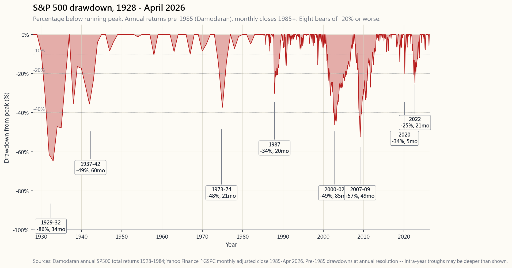
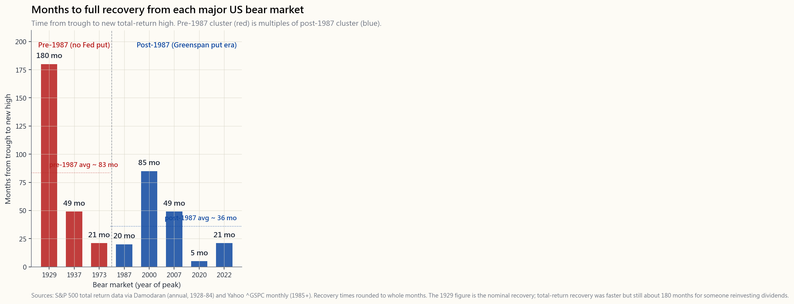

# 番外課 16：百年市場歷史——每次熊市教曉我們的事

---

## 第一部分：閱讀章節

---

### 1. 為何這一課如此重要

標準普爾500指數自1928年以來，共經歷八次跌幅達兩成或以上的熊市，每一次均已*永久*收復失地——以美元計，按總回報基準計算。這是本教程中最重要的一句話——同時也是最具誤導性的一句，因為當中每個字所發揮的作用，身處下一次熊市的投資者是感受不到的。

這堂番外課之所以獨立成篇，而非附在市場周期主題的腳注，有以下四個原因：

1. **熊市的形態比跌幅更有參考價值。**每次熊市都有相同的四幕結構：否認期、強制拋售期、絕望期，以及復甦期。辨認自己身處哪一幕，並不能讓你把握底部時機——沒有任何方法能做到——但這能告訴你*不應*做什麼，而這已經足夠。

2. **復甦時間才是真正影響退休計劃的變數。**同樣是兩成五的回撤，五個月收復（2020年）是一種問題；二十一個月收復（2022年）是另一種問題；八成六的回撤用了二十五年才收復（1929年）又是截然不同的問題。跌幅體現在圖表上；復甦時間則體現在你的行為上。

3. **每次崩盤的成因各異，但政策回應卻趨於一致。**1929年的教訓是：美聯儲*不行動*，會將崩盤演變成蕭條。1987年是美聯儲首次*立即回應*，使復甦時間從二十五年縮短至兩年。2008年及2020年是1987年模式的延伸，只是動用了更大的力度。隱性的「美聯儲護盤機制」——也正是「只投美股」這一前提的部分依據——正是在這些事件中逐步建立的。

4. **「總會收復」這一說法並非保證——它只是關於一個特定指數、以一種特定貨幣、在一個特定國家、於特定一百年時間窗口內的倖存者陳述。**日本日經指數於1989年在38,915點見頂，直至2024年2月才重上該水平——等待了三十五年。2022年，俄羅斯股市對非俄羅斯投資者而言幾乎歸零。本課程主張投資美股，是針對*唯一*一個收復故事成立的市場所作的判斷；並非對市場整體的判斷。理解當中的分別，正是這一課的核心。

---

### 2. 你需要掌握的內容

#### 2.1 八大熊市，各用一句話概括

長線投資者應能將這些事件倒背如流。每一次都是不同*類型*的壓力測試，而四分倉投資組合應對每一次的方式各有不同。

- **1929至1932年（-86%，名義上需十五年回到平衡點，總回報計需二十五年）。**保證金債務、銀行欺詐、無存款保障計劃、無證券交易委員會，美聯儲在通縮時期仍收緊政策。這是「政策主動惡化後果如何」的基準。
- **1937至1942年（-49%，歷時四年）。**美聯儲過早收緊及戰時情緒衝擊。這是被遺忘的熊市，但它恰恰印證了1929年的教訓——過早重啟收緊政策，便會迎來第二波下跌。
- **1968至1970年、1973至1974年（-48%，歷時兩年）。**第一次石油危機、布雷頓森林體系終結，以及將延續至1981年的通脹週期序幕。股票*與*長期債券均錄得實質虧損——正是我們在番外課06所探討的通脹應對策略。
- **1987年（峰谷跌幅-34%，單日跌幅-22.6%，二十個月全面收復）。**投資組合保險的回饋迴路所致，並未對實體經濟造成根本損傷。時任主席格林斯潘上任僅兩個月，即連夜向市場注入流動性——此為美聯儲首次*立即*回應崩盤事件，成為日後所有應對措施的藍本。
- **2000至2002年（-49%，歷時七年）。**科網泡沫爆破、2001年經濟衰退，加上9/11事件。緩慢磨蝕型熊市——從峰值至谷底歷時二十八個月。教訓是：並非每次熊市都是突發事件；有些是*持續侵蝕*。
- **2007至2009年（-57%，歷時四年）。**按揭信貸危機、雷曼兄弟倒閉，為1929年以來最嚴峻的熊市。全面考驗了美聯儲的現代應對機制，結果（大體上）奏效。零利率政策、量化寬鬆、問題資產救助計劃——2008年後整套貨幣政策體系，正是對這次熊市的回應。
- **2020年（二十三個交易日內跌-34%，五個月後收復——史上最急跌同時也是史上最快收復）。**COVID疫情，2020年3月。形態有別於以往任何一次熊市：垂直下跌，垂直反彈，毫無整固。政策回應（美聯儲兩週內減息至零、財政刺激規模超過2008年）主導了反彈速度。
- **2022年（-25%，歷時二十一個月）。**美聯儲衝擊——四十年來最急進的加息週期，以打壓疫後通脹。自1973年以來首次股票與長期債券同步受挫的熊市。60/40投資組合錄得史上最差實質回報年。令整整一代投資者意識到：他們所熟悉的股債負相關性，是2000年後特定市場週期的產物，而非自然規律。

本課頂部的完整回撤圖，將上述每一次事件都標示在同一坐標軸上。1929年的走線遠深於其他所有事件——這是正確的。這也是為何1933至1940年間所有監管法規——存款保障計劃、證券交易委員會、格拉斯-斯蒂格爾法案、1934年《證券交易法》——以現在的形式存在的原因。

#### 2.2 復甦時間才是真正重要的變數

對於投資期長達三十年的投資者而言，熊市的跌幅在心理上固然痛苦，但在財務上微不足道——一次跌幅五成、四年內收復的熊市，在複利曲線的數學計算中不過是微小誤差。但對投資期只有三年的投資者而言，同樣的五成跌幅，足以令退休計劃推遲。

需要牢記的關鍵數字是**復甦時間**——從*谷底*重返前期峰值所需的月數（以總回報計）。`side16_recovery_times`圖表呈現了自1929年以來每次美國重大熊市的這一數據：

- **1929年：約180個月**（名義上需十五年收復；以股息再投資計算的總回報收復較快，但仍需約十年）。
- **1937年：49個月。**
- **1973至74年：21個月。**
- **1987年：20個月。**
- **2000至02年：85個月**——現代時期最長。科網峰值直至2007年10月才重新觸及，且僅屬短暫。
- **2007至09年：49個月**（從2009年3月谷底至2013年3月創出新高）。
- **2020年：5個月**——史上最快收復，屬離群值，未必能重演。
- **2022年：21個月**（2022年1月見頂，2024年1月創出新高）。

由此呈現的形態是：1987年前，收復需要數年；1987年後，收復只需數月至一兩年。分水嶺正是*格林斯潘護盤機制*——美聯儲對足夠嚴重的回撤提供托底的隱性承諾。這一承諾在格林斯潘、伯南克、耶倫和鮑威爾任內一脈相承。它並非自然規律，但已是三十八年一貫的政策取向。

這對投資的啟示令人不安：年輕投資者的股票配置，隱含着對美聯儲護盤機制延續的押注。一旦該機制失效——例如因通脹阻礙美聯儲在下次熊市中寬鬆——復甦時間將回歸1987年前的分佈，「長期持股」的常規數學假設便需大幅調整。框架很簡單：市場周期會變；現代應對模式是一種周期，而非公理。

#### 2.3 是什麼終結了每次熊市（以及什麼沒有）

縱觀八次熊市，有一個規律：*觸發*熊市的因素，幾乎從來不是*終結*熊市的因素。

- **1929年**由保證金債務平倉觸發，由財政貨幣制度變革終結（羅斯福、1933年美元貶值、存款保障計劃、1934年《銀行法》）。並非因為股票變得便宜而終結。
- **1973至74年**由歐佩克石油衝擊觸發，由沃爾克1981年的加息終結——*整整八年之後*。股市於1974年10月見底，但熊市所代表的通脹週期，直至沃爾克才得以打破。
- **1987年**由投資組合保險觸發，在四十八小時內透過美聯儲單次流動性注入終結。或許是整個數據集中因果關係最清晰的一次。
- **2000至02年**由科網泡沫破裂觸發，待美聯儲積極減息*且*房地產信貸週期為經濟提供下一輪借貸驅動增長後才告終結（而後者又埋下了2008年的種子）。
- **2007至09年**由按揭信貸崩潰觸發，由零利率政策加量化寬鬆加問題資產救助計劃終結——規模堪比1933年羅斯福新政的*政策回應*，在九個月內執行完畢。
- **2020年**由COVID觸發，數週內因美聯儲降息至零、財政部直接派發支票，以及國會通過相當於本地生產總值約十二個百分點的財政支持而終結。根本風險（病毒）並未解除；政策托底令其對市場而言無關痛癢。
- **2022年**由美聯儲*主動*觸發（加息），當市場消化加息週期將見頂於某一已知水平時終結。熊市在通脹回落*之前*便已結束，這是一個信號——市場定價的是二階導數，而非絕對水平。

規律如下：當政策停止惡化，熊市便告終結。不是當根本原因獲得解決；不是當估值變得便宜；不是當情緒被洗滌乾淨。**而是當政策停止惡化。**這是橫跨所有八次事件唯一奏效的信號，也是實時最難識別的信號。

#### 2.4 投資者應該怎麼做

幾乎所有熊市的誠實答案都是**什麼都不要做**。或更準確地說：繼續平均成本法買入，不要拋售，不要加槓桿，並在回撤跨越明顯心理關口（-20%、-30%、-40%）時機動進行再平衡。

歷史紀錄如下：

- 一名在每一次熊市中*什麼都不做*的投資者，持有100%標準普爾500指數股票並再投資股息，自1928年至2026年4月，名義年化複利約為9.6%。
- 嘗試把握熊市時機的投資者——下跌時出貨，等待底部——複利回報則遠遜，差距主要集中在*錯過反彈週的損失*上。摩根大通對1990年至2024年第一季的分析顯示，在整個時間窗口內僅錯過表現最佳的十個交易日，年化回報約折半。而表現最佳的十個交易日中，有六個出現在表現最差的十個交易日前後十五個交易日內。兩者不可分割。
- 採用四分倉投資組合的投資者，複利回報略低於100%標準普爾500（大約為名義7至8%），但峰谷回撤約縮減一半——這是有意為之的取捨。增長倉承擔熊市衝擊；價值儲存倉與收益倉吸收衝擊；機動操作倉則在跌幅達-30%時，將現金重新部署進場。以上均無需預測市場走勢。

本課底部的互動工具——`side16_history_explorer`——讓你點擊任一重大時期，查看跌幅、持續時間、收復情況、觸發因素、終結政策，以及教科書式的「應對方法」。請將其作為記憶輔助工具，而非操作工具。

---

### 3. 常見誤解

1. **「市場總會收復。」** 對美股而言成立，以美元計，按總回報基準，在1933年後的監管制度下。對於1989年後的日本，此說不成立；對於2022年的俄羅斯，此說不成立；對於兩次世界大戰期間的德國市場，此說不成立；對於1929至1944年實質回報角度下的美國本身，此說亦不成立。「只投美股」的規則，正是這一說法的精確版本。

2. **「熊市持續十二至十八個月。」** 那是*現代*的平均數。1987年前的熊市平均接近三十個月；1929年的熊市從峰值至谷底歷時四十三個月。「十二至十八個月」這一規律是1987年後美聯儲護盤機制的特徵，並非熊市的固有屬性。

3. **「低吸策略永遠奏效。」** 低吸策略*在整體上，平均而言，在1987年後的市場周期內*奏效。1930至1932年間並不奏效（低位後繼續再低三年），1989年後的日本同樣不奏效（低位從未收復）。低吸策略是一種市場周期判斷。

4. **「這次不一樣。」** 在當下感覺總是不一樣，因為觸發因素總是不同的。*回應形態*才是相同的。當你因觸發原因而認為「這次不一樣」，你是正確的；當你因最終能否收復而認為「這次不一樣」，歷史表明你很可能是錯的（儘管日本是例外）。

5. **「美聯儲總能救市。」** 美聯儲*自1987年以來*確實總能救市。從1929至1987年，美聯儲曾多次令情況主動惡化（1930年、1937年、1973年）。產生美聯儲護盤機制的制度文化本身是一種市場周期，而市場周期會改變。2022年的事件呈現了這一點的早期版本——美聯儲正是熊市的*成因*，而非終結者。

6. **「60/40永遠是有效對沖。」** 60/40所依賴的股債負相關性，是2000年後的現象。整個1970年代，股票與債券呈正相關。2022年再次呈正相關。波動率周期會改變。

7. **「你可以提前識別泡沫。」** 事後回看，有些泡沫顯而易見（1929年、2000年、2021年的特殊目的收購公司）。事前亦有少數人看穿，但遭到漠視（博瑞看空房市、巴菲特在2003年談衍生工具風險）。在泡沫判斷上*採取行動*——調整倉位以規避的實際記錄，遠比識別記錄遜色。大多數唱淡泡沫者離場過早，因而錯過最後的升浪。

8. **「回撤是好的買入機會。」** 是的——*前提是你有現金且有足夠的心理素質*。難點在於兩者同時兼備，因為令-30%回撤看起來令人恐慌的心理，正是令你在見底前一年就把「乾糧」用光的同一種心理。事先制定規則。分批部署資金。

9. **「分散投資在危機中能保護你。」** 在真正的流動性危機中，跨資產類別的相關性會趨向1.0。2020年3月的崩盤中，股票、債券、黃金、房地產信託基金，甚至美國國債，在長達兩週的時間內同步沽售。分散投資在*一般*回撤中奏效；在尾部風險事件中，只有現金和美元流動性有效，這正是槓鈴策略存在的原因。

10. **「我會知道什麼時候該賣。」** 在數百項問卷調查中，聲稱會在下一次熊市前賣出的散戶投資者群體，與*上一次沒有賣出*的群體大致重疊。個人對回撤的承受能力存在系統性高估。請為一個更差版本的自己做好規劃。

---

### 4. 問答環節

**問：本課最實用的圖表是哪一張？**
答：頂部的回撤圖。打印出來，貼在你的屏幕上。每當市場下跌一成、你感到恐慌時，對照圖表，看看一成跌幅在歷史分佈中處於哪個位置。標準普爾500指數大約每年發生一次一成跌幅，每三至五年發生一次兩成跌幅，每十五年左右發生一次四成跌幅。請以此校準你的預期。

**問：我應預期一次熊市持續多久？**
答：1987年後的現代平均數，從峰值至谷底約十四個月，此後再需約十至二十個月全面收復——總計約兩至三年。對投資期三十年的投資者而言，這只是個微小誤差；對投資期兩年的投資者而言，這便是全部。請根據你的投資期相應調整股票配置。

**問：2020年的收復是個特例嗎？**
答：很可能是。非金融成因觸發（病毒）、美聯儲在兩週內降息至零，以及規模相當於本地生產總值十二個百分點的財政刺激，這三者結合的速度不大可能重演。請將2020年視為單一數據點，而非新的平均標準。

**問：為什麼2022年的感受比數字所呈現的更糟糕？**
答：因為那是二十年來首次，債券倉與股票倉同步下跌。一名習慣於在純股票熊市損失兩成的60/40投資者，眼見*整個*投資組合下跌-17%。以歷史標準而言，整體回撤並不算嚴峻，但它打破了2000年後一代投資者所建立的分散投資假設。

**問：隨著年齡增長，我是否應該增加現金配置？**
答：是——但並非因為現金是好資產。現金是保證錄得實質虧損的資產。持有現金，是因為現金是*唯一*在熊市中不出現回撤的東西，意味着它是退休初期兩年內，唯一能讓你無需虧本出售股票便可動用的資金。這是槓鈴邏輯，應用於退休規劃。

**問：日本的情況呢？**
答：日經指數於1989年12月在38,915點見頂，直至2024年2月才重上該水平——需時三十五年收復。日本是「股市總會收復」論點的現實反例，也是「只投美股」的可投資範圍論點如此狹窄的原因。只投資本國市場，是一種倖存者押注；而投資美國（本身也是一種倖存者押注，只是有更長的歷史記錄支持）是本框架的折衷選擇。

**問：我怎麼知道自己不是活在日本版的困局，而非2008年版的復甦？**
答：你不會知道。將日本從可收復轉變為三十五年困局的信號，是銀行危機未能迅速解決（殭屍銀行延續運作至1990年代末）、人口結構下行，以及通縮周期。截至2026年4月，美國並不具備上述特徵，但症狀的缺失並不等於風險的缺失。請留意下一次銀行危機的*解決速度*；這是早期預警信號。

**問：在熊市中實行平均成本法買入，真的是最優策略嗎？**
答：從理論上並非最優——完美把握底部時機的效果更佳。但從*實踐*角度而言，確是最優，因為平均成本法是唯一一種在情緒促使你投降時仍能維持機械式執行的策略。「擁有一套凌駕恐慌情緒的規則」所帶來的行為溢價，正是平均成本法存在的根本原因。番外課05對此有深入探討。

**問：如果我可以做空或對沖呢？**
答：那麼你擁有普通投資者所沒有的風險管理工具箱。尾部風險對沖策略（第47週）、認沽期權保護（第27週），或趨勢跟蹤疊加策略（第51週），在歷史上的各次熊市中均*奏效*，即最大回撤可降低十至二十個百分點。但在順風時，這些策略每年也會消耗五十至兩百個基點的成本。這是用費用換取形態的取捨。值得為部分倉位採用，但不宜覆蓋整個投資組合。

**問：在不被迫賣出股票的前提下，我需要持有多少最低現金緩衝才能撐過熊市？**
答：仍在積累財富且有收入的投資者，三至六個月的支出即可。正在消耗財富的退休人士，最少需要兩年支出，理想為三年。計算邏輯如下：1987年後的平均熊市從峰值至谷底約需十四個月；你需要足夠現金度過*整個*回撤期，加上緩衝，確保你不會在底部被迫出售。兩年現金緩衝是標準答案。

**問：我如何在情緒上為下一次熊市做準備？**
答：*現在*就寫下，以具體金額計算，你的投資組合在當前水平分別下跌-25%、-40%及-55%後的價值。大聲讀出這些數字。感受那份不安。熊市中的未來自己，會比現在的你更容易堅持不動搖——前提是你的現在已在心理上預演過那段回撤。這不是優化策略，而是情緒資本的配置。「非理性能維持的時間比你的流動性更長」這一規律針對的是*別人*；這條問答針對的是*你自己*。

**問：「總會收復」的論點究竟基於什麼？**
答：三個條件。第一，1944年布雷頓森林體系確立後美國在全球資本市場的主導地位——資本流向最深廣的市場，意味着美元儲備貨幣地位形成自我強化。第二，在整個時間窗口內對美國有利的人口及生產力趨勢。第三，一套對危機以政策托底作出回應的制度文化（存款保障計劃、證券交易委員會、美聯儲護盤機制）。若上述三者中任何一項發生重大改變，收復分佈亦將隨之改變。市場周期轉變是警示；只投美股是押注。

---

## 第二部分：YouTube 腳本

---

**影片標題：** 百年市場歷史——每次熊市、每次收復，十六分鐘全解讀｜番外課 16

**目標片長：** 約16分鐘

**主持人：**
- **陳馬**（導師）：資深投資者，親歷1987年、2000年、2008年、2020年及2022年各次熊市。
- **小魚**（學員）：注重風險的散戶投資者，只在牛市環境下投資過。

---

**[片頭序幕]**

[VISUAL: 動畫標誌「番外課 16 — 百年市場歷史」]

[VISUAL: image/side16_century_drawdowns.png — 全屏展示。]

**陳馬：** 這張圖貫穿整堂課。標準普爾500指數回撤——即距前期峰值的百分比跌幅——自1928年至上月，每一天的數據。左側那道深溝是1929年。其他深溝依序是1937年、1968年、1973年、1987年、2000年、2007年、2020年及2022年。九十八年間，跌幅達兩成或以上的熊市，共八次。

**小魚：** 那條線每次都回到零。

**陳馬：** 每次都是。這是整個教程中最重要的一句話——同時也是最具誤導性的，因為*回到零的速度*才是真正的變數，而這個速度的差異可以達到一個數量級。1929年以總回報計需二十五年。2020年只需五個月。同樣是「收復」這兩個字，背後所代表的意義截然不同。

---

**[第一節：八大熊市]**

[VISUAL: image/side16_century_drawdowns.png，標注各次熊市。]

**陳馬：** 讓我逐一介紹這八次熊市。每一次都是不同*類型*的壓力測試，而四分倉投資組合應對每一次的方式各有不同。

**小魚：** 從最嚴重的說起。

**陳馬：** 1929年。道瓊斯指數於9月3日在381點見頂，於1932年7月8日在41點觸底。道指跌幅達89%，當時的標普綜合指數跌86%。道指直至1954年11月才重返1929年高位。整整二十五年。

**小魚：** 什麼導致了崩盤？

**陳馬：** 保證金債務。投資者最多借入股票購買金額的九成。市場下跌後，追繳保證金通知引發連鎖反應，銀行相繼倒閉，存款化為烏有，因為當時沒有存款保障計劃；美聯儲竟在通縮環境下*收緊*政策——這是美聯儲最具代表性的政策失誤——霍利-斯穆特關稅法案令國際貿易崩潰，整個實體經濟隨之崩塌。失業率高達25%。

**小魚：** 好，那下一次？

**陳馬：** 1937年。美聯儲過早收緊，將法定準備金率翻倍，復甦的勢頭就此斷裂，進入第二輪跌浪。市場下跌49%，歷時四年收復。1937年是那場*被遺忘的*熊市，被遺忘是有原因的——2008年的美聯儲曾仔細研讀這段歷史。伯南克在雷曼危機後將利率維持在零長達七年，正是因為他讀過這張圖表。

[VISUAL: 回撤圖，1973至74年谷底標注放大。]

**陳馬：** 1973至1974年。歐佩克將油價翻了四倍，布雷頓森林體系已於1971年瓦解，通脹早已升溫，越戰行將結束，電視上播放着水門事件。市場下跌48%。表面看收復很快——二十一個月重返前期峰值——但以*實質*購買力計，要到1992年才算真正收復。在名義上看似橫行的指數之內，是長達十八年的負實質回報。我們在番外課06的通脹專題中已探討過這一點。

**小魚：** 所以圖表掩蓋了通脹對購買力的侵蝕。

**陳馬：** 永遠如此。在通脹週期下，名義收復的數字往往粉飾太平。

[VISUAL: 回撤圖放大至1987年10月。]

**陳馬：** 1987年10月。單日跌幅22.6%——史上最大單日百分比跌幅。電腦化的投資組合保險是導火線，市場自我拋售，全程自動化。翌日，格林斯潘——上任僅兩個月——連夜向市場注入流動性。美聯儲的貼現窗口以最低利率、不設上限向市場開放。市場在兩個月內見底，並在二十個月內重返崩盤前水平。

**小魚：** 那就是美聯儲護盤機制。

**陳馬：** 是的，第一個案例。此後每次熊市都有類似回應，規模逐步升級。這就是那個市場周期。

[VISUAL: 回撤圖，科網泡沫谷底標注。]

**陳馬：** 2000至2002年。科網泡沫破裂、2001年經濟衰退，加上9/11事件。標準普爾500指數峰谷跌幅49%，納斯達克跌80%。從峰值至谷底歷時二十八個月——這是*緩慢型*熊市。科網高峰直至2007年10月才再次觸及，且僅屬曇花一現。這次熊市告訴我們：並非所有熊市都是突發事件，有些是*持續侵蝕*。

**小魚：** 那2008年呢？

**陳馬：** 2007至2009年。峰谷跌幅57%。按揭信貸危機、雷曼兄弟倒閉、AIG危機、整個影子銀行體系崩潰。美聯儲以零利率政策、量化寬鬆——以新增資金購買債券——以及問題資產救助計劃作出回應。這套回應模式構成了整個2008年後的貨幣政策體系。股市於2009年3月觸底，直至2013年3月才重返高位——歷時四年。

[VISUAL: 回撤圖放大至2020年3月。]

**陳馬：** 2020年3月。史上最急跌——二十三個交易日內下跌34%。然後是史上最快收復。從谷底到創出歷史新高，僅需五個月。美聯儲在兩週內將利率降至零，開始買入企業債——此前從未有過——國會通過的財政刺激規模約相當於本地生產總值的十二個百分點。病毒並未消失；政策回應令其對市場而言無關痛癢。

**小魚：** 那2022年呢？

**陳馬：** 2022年是現代時期最值得深思的一次熊市。標準普爾500指數下跌25%，歷時二十一個月收復。*但是*——而且這是最少人談論的部分——長期美國國債同期下跌31%。60/40投資組合的債券倉與股票倉*同步*下跌，這是自1970年代以來第一次。傳統60/40投資組合錄得史上最差實質回報年。美聯儲此次是熊市的*成因*，而非終結者——他們為打壓疫後通脹而積極加息。

---

**[第二節：復甦時間圖表]**

[VISUAL: image/side16_recovery_times.png — 月數柱狀圖。]

**陳馬：** 現在看復甦時間圖表。縱軸是從谷底到創出新高所需的月數。1929年的柱狀高出其他所有事件整整三倍。2020年的柱狀極短，幾乎看不見。1987年後的群組，明顯短於1987年前的群組。

**小魚：** 為什麼？

**陳馬：** 格林斯潘護盤機制。美聯儲會對嚴重回撤作出回應的隱性承諾。這一承諾在格林斯潘、伯南克、耶倫和鮑威爾任內一直得以兌現。它並非自然規律，而是一段長達三十八年的政策周期。

**小魚：** 如果這個周期改變了呢？

**陳馬：** 那麼復甦時間將回歸1987年前的分佈，「長期持股」的常規數學假設便需大幅調整。市場周期會改變——這是基本框架。一名假設年化複利9%的年輕投資者，隱含地押注美聯儲護盤機制會延續。大多數時候，這個押注有回報。偶爾——如1929年後的美國、1989年後的日本——它不奏效。

---

**[第三節：是什麼終結了每次熊市]**

**陳馬：** 縱觀所有八次熊市，有一個規律。*觸發*熊市的因素，幾乎從來不是*終結*熊市的因素。

**小魚：** 舉個例子？

**陳馬：** 1929年由保證金債務觸發，由羅斯福、黃金貶值、存款保障計劃及1934年《證券交易法》所帶來的*財政貨幣制度變革*終結。1973年由石油危機觸發，由沃爾克1981年打破通脹終結——整整八年之後。1987年由投資組合保險觸發，由美聯儲單次流動性注入在一天之內終結。2008年由按揭問題觸發，由零利率政策加量化寬鬆終結。2020年由病毒觸發，由美聯儲降息至零加財政刺激終結。2022年*由*美聯儲觸發，當市場消化加息週期見頂時終結。

**小魚：** 所以答案永遠是政策。

**陳馬：** 當*政策停止惡化*，熊市便告終結。不是當成因解決；不是當估值便宜；不是當情緒洗底。是當政策停止惡化。這是橫跨所有八次熊市唯一奏效的信號。

---

**[第四節：你應該怎麼做]**

**小魚：** 那投資者在每次熊市中應該怎麼做？

**陳馬：** 幾乎所有情況下——*什麼都不做*。或者更具體地說：繼續按計劃平均成本法買入，不要拋售，不要加槓桿，在回撤跨越明顯心理關口時機動再平衡。

**小魚：** 這聽起來像是在偷懶。

**陳馬：** 感覺像偷懶，是因為這件事極難做到。看看摩根大通對1990至2024年的分析。全程滿倉持有的投資者，年化複利約為10%。而在整個時間窗口內僅錯過*表現最佳的十個交易日*的投資者，複利回報折半。而那表現最佳的十個交易日中，有六個出現在表現最差的十個交易日前後十五個交易日內。兩者無法分割。

**小魚：** 所以試圖躲避熊市的代價，是錯過反彈。

**陳馬：** 正是。*就在*你確信自己正確判斷了底部的那一刻，你已經在底部附近賣出了。複利的計算方式對錯過的交易日毫不留情。

---

**[第五節：互動工具]**

[VISUAL: 切換至互動面板 `interactive/side16_history_explorer.html`。]

**陳馬：** 十個重大時期的資料都收錄在本課底部的互動工具中。點擊任一時期——1929年、1937年、1968年、1973年、1987年、2000年、2007年、2020年、2022年，或我們當前2026年4月的牛市。每個時期，你都能看到跌幅、持續時間、收復時間、觸發因素、終結因素，以及投資者應採取的行動。

**小魚：** 所以這更像是記憶輔助工具，而不是操作工具。

**陳馬：** 是的。重點是要能夠將這些資料倒背如流，以備下次熊市來臨時——屏幕一片紅、朋友們紛紛恐慌——隨時調取。頂部的圖表告訴你自己在歷史分佈中處於哪個位置。互動工具告訴你對應時期的應對方案是什麼。兩者都不能告訴你底部在哪裡。沒有任何工具能做到。

---

**[第六節：日本的例外]**

**小魚：** 那日本的情況呢？

**陳馬：** 日本是我過去十四分鐘所說的一切的現實反例。日經指數於1989年12月在38,915點見頂，直至2024年2月才重上該水平。三十五年。一個完整的投資生涯，從峰值到峰值。

**小魚：** 為什麼那套應對方案在日本行不通？

**陳馬：** 三個原因。銀行危機未能迅速解決——殭屍銀行延續運作至1990年代末。人口結構下行——工作年齡人口於1995年見頂，此後持續下降。以及通縮週期，日本央行多次過早收緊，極似1937年的情形。三者疊加，便是三十五年的困局。

**小魚：** 美國有可能變成日本嗎？

**陳馬：** 從機制上看，有可能。從概率上看，目前不大——美國當前並沒有凍結的銀行體系，也沒有下滑的工作年齡人口。但「這次不一樣」這句話可以雙向使用。「只投美股」的論點，是對使美國收復故事成立的各項條件能夠延續的*押注*，而非保證。理解其中的分別，正是這堂課的意義所在。

---

**[結語]**

[VISUAL: 回撤圖與復甦時間圖並排展示。]

**陳馬：** 三個要點。

第一：過去一百年，美股每次熊市均以美元、總回報計全面收復。跌幅有差異；復甦時間差異可達一個數量級。這個規律成立至今。

第二：復甦*速度*才是與你的退休計劃直接掛鉤的變數。1987年前，收復需要數年乃至數十年。1987年後，收復只需數月至一兩年。分水嶺是美聯儲護盤機制，而這本身是一個市場周期，而非自然規律。

第三：當政策停止惡化，熊市便告終結。不是當成因解決；不是當估值便宜。留意政策的二階導數。

**小魚：** 那熊市期間我實際上*應該*做什麼？

**陳馬：** 按計劃繼續定期買入。在明顯關口機動再平衡——跌兩成、跌三成、跌四成。備好兩年現金，讓你不必在底部被迫出售。不要嘗試把握底部時機；沒有人能做到兩次。每一次市場下跌一成、你感到恐慌時，看看那張回撤圖，提醒自己：一成跌幅大約每年發生一次，兩成每三至五年，四成每十五年左右。你身處一個已知的分佈之中。請以此校準。

[VISUAL: 結尾卡片「番外課 16 — 百年市場歷史」]

**陳馬：** 下一堂番外課，我們轉到一個較為平靜的話題——互惠基金、交易所買賣基金與封閉式基金的結構，以及為何投資工具本身與投資策略同樣重要。到時見。