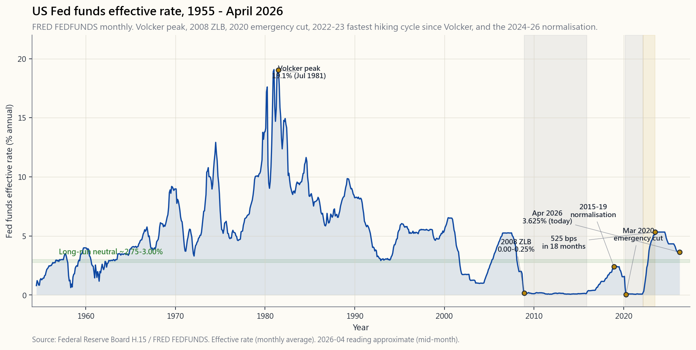
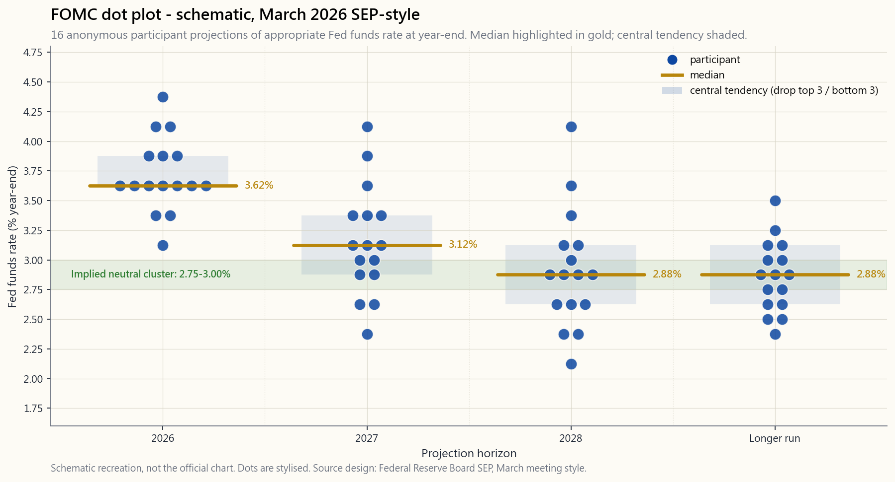

# 附加課17：美聯儲 — 雙重使命、點陣圖，以及對你投資組合的連鎖影響

---

## 第一部分：閱讀材料

---

### 1. 為何這課如此重要

美聯儲為全球最大儲備貨幣設定資金成本。全球系統中其他所有收益率——2年期國債、10年期國債、30年期按揭、BBB級公司債，乃至高登增長模型中的折現率——皆建基於這一成本之上。每當美聯儲行動，每位投資者戶口結單上的每一類資產均會重新定價。大多數散戶將聯邦公開市場委員會（FOMC）議息週視為背景噪音，這是一個錯誤。

以下四點說明為何本附加課值得獨立成章，而非僅作為債券章節的一個段落：

1. **一個長達四十年的時代在你眼前終結。** 自1981年8月沃爾克時代高峰（聯邦基金利率19%）至2022年3月加息啟動，每一輪收緊周期的終端利率均低於上一輪。這長達四十年的債券牛市已告終結。2022至23年的加息周期於十八個月內累計加息525個基點——為沃爾克時代以來最急速的加息步伐——而2024年後的正常化過程正在將「中性利率」穩定於接近3%的水平，而非2008年後那一代人所熟悉的0%。任何思維框架仍停留在2009年至2021年之間的投資者，其校準均已失準。
2. **傳導機制是機械性的，而非玄妙的。** 美聯儲設定一個利率，該利率流向擔保隔夜融資利率（SOFR，隔夜，一對一傳導），再流向2年期國債（傳導率約0.85），再流向10年期國債（取決於曲線斜率加期限溢價），再流向30年期按揭（10年期國債加約175個基點的一級與二級市場利差），最終影響每一個股票估值模型中的折現率。整條傳導鏈每天都被數以千計的交易台研究、回歸分析並納入定價。你可以運用同一套數學方法。
3. **點陣圖是市場上最重要的前瞻指引信號。** 聯邦公開市場委員會每年四次公布《經濟預測摘要》——十六個匿名點，每位參與者一點，各自顯示其預計未來三年每年年底及「較長期」聯邦基金利率的適當水平。市場在數秒內便開始對這些點位進行交易。若你看不懂點陣圖，等同在全年波動性最高的四個星期中盲目交易。
4. **資產負債表政策是新的調控槓桿，而幾乎沒有散戶留意。** 當美聯儲縮減國債及按揭抵押證券（QT）時，即使不調整政策利率，也在收緊政策。反之，當其購入資產（QE）時，即使不降息，也在放寬政策。2008至2014年的擴張（8,700億美元至4.5萬億美元）、2020年的激增（4.2萬億至9.0萬億美元），以及2022至2026年的縮表（9.0萬億至6.5萬億美元），均在獨立於聯邦公開市場委員會新聞稿的情況下改變了資產價格。波動性尾部亦對資產負債表發揮影響：長存續期資產的邊際買家至關重要。

這是一套實用工具，而非公民知識。本課結束後，你將掌握每項美聯儲調控槓桿的作用、在何處讀取信號，以及如何將由此產生的市場走勢納入你自己的四組別投資組合之中。

---

### 2. 你需要掌握的內容

#### 2.1 雙重使命——兩個目標，一個旋鈕

國會於1977年《聯邦儲備改革法案》中列明兩項目標：「最大就業」及「穩定物價」，即雙重使命。這是兩個目標、一個主要槓桿（聯邦基金利率），意味著當兩個目標相互矛盾時，美聯儲必須作出取捨。2022年，美聯儲選擇物價優先於就業——鮑威爾在傑克遜霍爾發表的「承受一定痛苦」演講——並在勞動市場每月仍新增40萬個職位的情況下持續收緊。2008年，美聯儲選擇就業優先於物價，在整體消費物價指數（CPI）仍達5%之際將利率削減至零。

「穩定物價」被具體化為**核心個人消費支出（PCE）通脹目標2%**，自2012年貝南克聲明起實施，並在2020年靈活平均通脹目標（FAIT）框架下獲得重申。「最大就業」沒有明確數字——美聯儲估計非加速通脹失業率（NAIRU，目前約4.0%），並力求避免實際失業率在不引發通脹的情況下持續低於這一水平。

投資要點：**將雙重使命視為判斷政策取向的指標。** 當美聯儲對抗通脹時，預期收益率曲線趨平甚至倒掛，實際利率上升，長存續期資產（增長股、房地產信託基金、長期債券）承壓。當美聯儲對抗失業時，預期收益率曲線陡化，實際利率下降，長存續期資產受追捧。第6課涵蓋通脹的一面；本課涵蓋調控槓桿本身。

#### 2.2 聯邦公開市場委員會、《經濟預測摘要》與點陣圖

聯邦公開市場委員會由十二名有投票權的成員組成：七位聯邦儲備委員會理事、紐約聯邦儲備銀行行長（常任），以及其餘十一位地區聯邦儲備銀行行長中的四位按一年輪換制參與。他們每年召開八次會議，其中四次——3月、6月、9月、12月——附有**《經濟預測摘要》**：每位參與者提交其對本地生產總值增長、失業率、PCE通脹、核心PCE以及最重要的未來三年每年年底及「較長期」適當聯邦基金利率的預測。

這些利率預測的圖表即為**點陣圖**。十六或十七個點，每位參與者（有投票權及無投票權）各一，不標示姓名，以25個基點為間距縱向排列。市場從中解讀三件事：中位數、中心趨勢（去掉最高三個及最低三個）以及分散程度（點位集中代表共識，分散代表委員會意見分歧，從而意味著更大的不確定性）。

兩個解讀原則。第一，**中位數牽動市場，尾部點位無足輕重**。2027年欄位中那個在5.5%的單一點，是某位在委員會內寸步不讓的鷹派成員。市場對此打折扣。第二，**較長期點位是「中性利率」的隱含估計**。2026年4月，較長期點位集中於2.75%至3.00%，高於2010年代大部分時間所維持的2.5%估計值。這25個基點的單一調整，是整份文件中最重要的數字——正是本課一直追蹤的政策取向轉變。

#### 2.3 工具——聯邦基金利率目標、超額準備金利率、隔夜逆回購與資產負債表

2008年前，美聯儲只有一個工具：通過回購市場買賣國債，將隔夜聯邦基金利率維持在單一目標值附近。2008年後，工具箱變得更為複雜。

**聯邦基金利率目標區間。** 自2008年12月起，聯邦公開市場委員會公布25個基點的區間而非單一點位（例如「3.50-3.75%」）。有效利率在該區間內浮動，由兩個管理利率形成上下限。

**準備金利率（IORB／IOER）。** 美聯儲向商業銀行存放於美聯儲的準備金所支付的利率。銀行不會低於此利率進行隔夜拆借，因此它構成聯邦基金利率的軟性*下限*。2026年4月，IORB為3.65%。

**隔夜逆回購（ON-RRP）。** 美聯儲向更廣泛的交易對手——貨幣市場基金、政府資助機構——提供的隔夜存款利率，低於IORB 5個基點，構成*硬性下限*：凡有資格使用的機構均不會低於此利率進行拆借。ON-RRP規模在2022年高峰時由零激增至2.4萬億美元，原因是貨幣市場資金無處可去。截至2026年4月，規模已回落至約2,000億美元——流動性正常化的重要信號。

**貼現窗口**是最後貸款人利率，設定於目標區間上限以上25個基點，供危機中面臨污名化的銀行使用。

**資產負債表（QE／QT）。** 當常規利率在2008年及2020年觸及零下限時，美聯儲直接購入國債及機構按揭抵押證券，壓低長端收益率，迫使投資者從債券轉向風險資產。2022年8月高峰時，資產負債表規模達8.97萬億美元（佔本地生產總值35%）。自2022年6月起，美聯儲以受控速度任由到期證券自然滾出而不再續期——初期上限每月950億美元，近期已放緩至450億，國債及按揭抵押證券合計計算。截至2026年4月，資產負債表規模約為6.5萬億美元（佔本地生產總值24%）。根據美聯儲工作人員估算，每縮減1萬億美元，大致相當於傳統收緊25個基點。這正是為何必須同時解讀點陣圖與資產負債表計劃。

#### 2.4 傳導機制——降息25個基點如何傳遞至你的投資組合

美聯儲設定一個隔夜利率，而資產價格取決於收益率曲線的長端。從前者到後者的路徑，即**傳導機制**。五個步驟，每個均可實證衡量。

1. **聯邦基金利率 → 擔保隔夜融資利率（SOFR，隔夜）**。SOFR以國債作抵押；其利率低於聯邦基金利率目標區間上限5至10個基點，傳導近乎一對一。美聯儲行動後，SOFR隔天早上即跟隨調整。
2. **SOFR → 2年期國債**。2年期國債本質上是「市場預期未來八個季度短期利率的平均值」。實證傳導率約為0.85：預期聯邦基金利率未來兩年移動100個基點，2年期國債約移動85個基點，餘下15個基點為不確定性折扣。
3. **2年期 → 10年期國債（曲線斜率）**。10年期與2年期利差在擴張期平均約+110個基點，在周期末段接近0，並在衰退前倒掛。2026年4月，10年期與2年期利差在十八個月倒掛後回升至+40個基點。短期利率對長期利率的傳導率僅約0.5，期限溢價及增長預期消化了其餘部分。
4. **10年期 → 30年期按揭**。一級與二級市場利差平均約175個基點；在壓力時期可擴大至250至300個基點（2020年3月、2022年10月）。以2026年4月10年期國債收益率4.20%計算，30年期按揭平均利率為6.0%，即借款人實際面對的利率。
5. **10年期 → 股票折現率 → 市盈率**。高登模型指出：$市盈率 = 1/(k - g)$，其中$k$為股票折現率（實際10年期收益率加股票風險溢價），$g$為盈利長期實際增長率。假設股票風險溢價為5%，實際增長為2%，實際10年期收益率為1.5%，合理市盈率約為22倍。10年期收益率移動100個基點，市盈率約移動4個倍數點。

第18週（`week18_rate_cascade.md`）以單一圖表呈現步驟1至4；第31週（`week31_yield_curves.md`）涵蓋2年期/10年期曲線斜率動態。本課是上述內容的上層框架：探討美聯儲如何推動第一步。

#### 2.5 近代歷史——二十五年間的三個政策取向

2000年後的時期可分為三個截然不同的政策取向，每個取向均培育出對美聯儲抱有不同預期的投資者群體。

**2000至2007年——傳統取向。** 格林斯潘／貝南克時代。聯邦基金利率從6.5%降至1.0%，再升至5.25%。資產負債表維持在8,700億美元不變。此即教科書所描述的世界，亦是於2008年終結的世界。

**2008至2021年——零利率下限。** 雷曼兄弟事件後，2008年12月降息至0至0.25%，持續至2015年12月。首輪正常化於2018年12月達到2.25至2.50%的高峰。2019年周期中段調整三度降息。其後是新冠疫情，2020年3月：兩週內緊急降息至0至0.25%，三個月內進行2.3萬億美元量化寬鬆（QE）。持續維持零利率至2022年3月。**那十四年中的十三年，聯邦基金利率均低於1%。** 2010年入行的交易員直至2023年才首次親歷正實際聯邦基金利率。

**2022至2026年——急速加息與正常化。** 2022年3月啟動加息。十八個月累計525個基點：沃爾克時代以來最急速。2023年7月達到5.25至5.50%的終端利率，維持十五個月，2024年9月首次降息。截至2026年4月，聯邦基金利率為3.50至3.75%，點陣圖指向2027年底約3.0%，較長期「中性」水平約2.75至3.00%。本輪周期已告終結，新均衡正在確立。

投資解讀：**停止假設美聯儲將永遠拯救長存續期資產**。2008至2021年養成的習慣性思維認為，每次10%的回撤都會帶來降息。2022至23年的周期已證明，對抗通脹的美聯儲可以容忍股票回撤25%、債券回撤30%而毫不動搖。建立你的槓鈴策略，應假設美聯儲的「保護傘」比過去低20%，而非5%。

---

### 3. 常見誤解

1. **「美聯儲在印鈔。」** 美聯儲以自行創造的準備金購買金融資產。準備金存放於商業銀行在美聯儲的帳戶中，只有銀行將其貸出，才會成為流通貨幣。2008至2014年間，準備金增加了3萬億美元，而廣義貨幣（M2）增幅遠小於此，消費物價指數平均僅1.5%。2020至22年的情況不同，因為財政轉移（派發支票）直接進入住戶帳戶，這才是真正的流通貨幣——產生通脹的是此因素，而非量化寬鬆本身。
2. **「美聯儲設定按揭利率。」** 美聯儲只設定一個隔夜利率。30年期按揭利率由債券市場、提前還款期權溢價及一級與二級市場利差共同決定。美聯儲對其的影響，是聯邦基金利率每移動100個基點，按揭利率約移動50個基點，並非一對一。
3. **「點陣圖是承諾。」** 點陣圖是各參與者認為在其預測成立的前提下，利率適當應在何處的**快照**。鮑威爾一再表示：「點位並非委員會的承諾。」數據一旦改變，點位亦隨之改變。將點陣圖當作遠期曲線進行交易，已令不少人損失慘重。
4. **「獨立意味著不受政治影響。」** 獨立的意思是美聯儲無需白宮批准才能採取政策行動，並不意味著美聯儲忽視政治——主席由總統重新提名，委員會成員由參議院確認，每年兩次的《漢弗萊-霍金斯》聽證也是政治表演。請將政治因素納入對數據與行動之間滯後的解讀。
5. **「量化寬鬆製造通脹。」** 準備金不是貨幣。2010至2019年間進行了4萬億美元的量化寬鬆，消費物價指數平均僅1.5%。2020至22年的通脹源於財政轉移加供應鏈中斷；量化寬鬆是助因，而非主因。切勿在政策取向數據中混淆相關性與因果關係。
6. **「美聯儲盯住10年期國債。」** 日本銀行盯住長端收益率（收益率曲線控制）。美聯儲已明確拒絕如此，儘管屢有呼聲。美聯儲只盯住一個隔夜利率，讓市場自行決定三個月以後的一切。
7. **「收益率曲線平坦意味著衰退將至。」** 收益率曲線*倒掛*有良好的預測記錄（第10週）。曲線平坦只意味著市場存在不確定性，兩者截然不同。
8. **「美聯儲希望股市下跌。」** 美聯儲的目標是物價穩定及最大就業。股價走勢只在影響金融狀況，進而反饋至物價和就業的範圍內才引起關注。備受引用的「美聯儲保護傘」很大程度上是2010年代政策取向的產物；2022年，美聯儲對股票拋售**表示歡迎**，因為這免費地收緊了金融狀況。
9. **「前瞻指引只是說說而已，不算政策。」** 2011至2014年的「日曆指引」及2020年的「結果導向指引」均僅憑語言便令2年期國債移動30至40個基點——未進行任何公開市場操作。當其改變預期時，語言本身即是政策。
10. **「我無法在聯邦公開市場委員會議息週交易。」** 你無法可靠地預測決策，但你可以可靠地為政策取向進行**佈局**。持有由廉價安全資產加有限潛在收益彩票組成的槓鈴組合。公告前後的波動性尾部影響顯著——應在會議*前*沽出短期引伸波幅，而非之後。

---

### 4. 問答環節

**問：美聯儲降息25個基點，對標普500指數的影響有多大？**
答：在公告當日，預期中的降息25個基點對指數的影響接近零——已反映在價格中。*出乎意料的*降息25個基點，指數約上漲1%。當市場預期降息而美聯儲出乎意料地維持不變（「鷹派維持」），指數則約下跌1.5%。這一幅度遠遜於點陣圖及新聞發佈會的影響。

**問：聯邦基金利率與擔保隔夜融資利率（SOFR）有何分別？**
答：聯邦基金利率是銀行間無抵押隔夜拆借利率；SOFR是以國債作抵押的有擔保隔夜回購利率。2018年後，SOFR取代倫敦銀行同業拆息（LIBOR），成為逾200萬億美元衍生工具的參考利率。SOFR低於聯邦基金利率目標區間上限5至10個基點，並緊密跟蹤。

**問：既然只有十二位成員有投票權，點陣圖為何有十六或十七個點？**
答：七位聯邦儲備委員會理事加上全部十二位地區聯邦儲備銀行行長（全員到位時共十九人，目前因空缺而為十六至十七人）均提交預測，無論當年是否有投票權。沒有投票權的地區銀行行長在會議上仍可影響共識。

**問：何謂「中性利率」，為何重要？**
答：中性利率（亦稱r-star或自然利率）是既不刺激也不抑制經濟的實際聯邦基金利率。美聯儲的估計從1990年代的約3%實際利率（2%通脹下名義利率約5%），降至2010年代的約0.5%實際利率（名義利率2.5%），現正回升至約1%實際利率（名義利率3.0%）。中性利率的位置是影響長期股票估值的最重要數字：市盈率取決於（實際利率加股票風險溢價）的倒數。

**問：我應該留意美聯儲主席的新聞發佈會嗎？**
答：應該——而且要逐字對照前次準備好的聲明細讀，追蹤哪些措辭發生了變化。2018年「耐心」一詞消失，是2019年政策轉向的信號；2022年出現「承受一定痛苦」，是加速加息的信號。新聞發佈會的問答環節大約在10%的情況下會與聲明相矛盾，只有同時閱讀兩者才能察覺。

**問：如何在聯邦公開市場委員會議息週交易而不被大幅波動掃出局？**
答：在FOMC會議前後七十二小時內不要增加倉位。波動性尾部影響顯著。會議當日的引伸波幅通常高於已實現波幅30至40%；大手沽出這部分引伸波幅是較為清晰的短期交易。若需要方向性交易，等待新聞發佈會結束、收益率曲線穩定後再行動。

**問：美聯儲是獨立的嗎？**
答：操作上是——聯邦公開市場委員會無需白宮批准即可制定政策。政治上則部分是——委員會成員須經國會確認，主席由總統重新提名，且美聯儲的授權法規可被修訂。1951年的《財政部-美聯儲協議》鞏固了操作獨立性；這一架構歷經八位總統，其中兩位（尼克遜、特朗普）曾公開向美聯儲施壓，仍得以維持。

**問：何謂量化收緊（QT），為何無人談論？**
答：量化收緊即美聯儲通過不再對到期證券進行再投資，從而縮減資產負債表規模。自2022年6月起，美聯儲已從9萬億美元的高峰縮減約2.5萬億美元。每縮減1萬億美元大致相當於收緊25個基點，因此整個計劃相當於在傳統加息周期之上額外加息約60個基點。此議題之所以鮮少被討論，是因為聯邦公開市場委員會的新聞稿以晦澀的「每月X億美元」腳注加以描述，而非在標題數字中呈現。

**問：美聯儲降息時，所有資產都會上漲嗎？**
答：長存續期資產（長期債券、房地產信託基金、增長股、黃金）獲得最直接的提振。短存續期資產（價值股、短期債券）獲益較少。若降息釋放衰退信號（就業使命優先），信用利差會擴大，即使國債上漲，高收益債券和周期性股票仍可能下跌。解讀降息的*原因*，而非只看降息本身。

**問：點陣圖與《經濟預測摘要》的通脹預測有何關聯？**
答：兩者是同一份文件的兩個部分。若2026年PCE中位預測為2.4%，2026年聯邦基金利率中位為3.5%，隱含實際利率為+1.1%——屬收緊性質。若這兩個數字分別變為2.0%及3.0%，隱含實際利率為+1.0%——緊縮程度大致相同。務必以扣除通脹預測後的實際利率解讀點陣圖，切勿單看名義數字。

**問：美聯儲開始降息時，我應該買入長期債券嗎？**
答：實證上，10年期國債收益率往往在首次降息前約三個月*見底*，並在整個降息周期中震盪。「在美聯儲降息前買入債券」這一教科書式交易，在過去六個周期中的四個奏效（1989、2001、2008、2019），但在兩個周期中失敗（1995、2024年局部失效）。四組別框架建議持有長期戰略性存續期倉位；切勿嘗試擇時周期。

**問：美聯儲掌握了哪些我不知道的信息？**
答：關於未來，美聯儲與你掌握的數據相同，另外對銀行壓力及勞動力市場細節（職位空缺與勞動力流動率調查、每週薪酬數據）有更即時的掌握，但並無水晶球。2007年的會議記錄顯示，在貝爾斯登倒閉前十一週，聯儲員工仍預測經濟軟著陸。交易時應著眼於美聯儲的**反應函數**，而非其預測能力。

互動**美聯儲實驗室**讓你輸入自己對2026年底及2027年底聯邦基金利率的假設，以及資產負債表縮減的速度，然後觀察隱含的2年期、10年期、30年期按揭利率及標普500市盈率如何從各交易台所採用的同一套傳導係數中得出。將你的假設與委員會中位點位進行比對。若你的數字與委員會的偏差超過50個基點，你正在進行的是預測性押注——以任何預測性押注應有的方式管理規模：少而精、有節制、且有損失上限。

---

## 第二部分：YouTube劇本

---

**影片標題：** 13分鐘看懂美聯儲：點陣圖、雙重使命，以及降息25個基點如何傳遞至你的投資組合
**目標片長：** 約13分鐘
**主持：** 陳馬、小魚

---

**[開場——陳馬坐於桌前，顯示器顯示聯邦基金利率圖表及點陣圖]**

陳馬：歡迎回來。今天的主題是為你戶口結單上每一項資產定價的機構——美聯儲。我們將涵蓋四個範疇：雙重使命、點陣圖、工具箱，以及單一隔夜利率如何傳遞至你的退休儲蓄帳戶。十二分鐘，只講實用知識，沒有公民課。

小魚：我會在中間插問散戶最常問的問題。

---

**[第一節——雙重使命]**

**[VISUAL: image/side17_ffr_history.png]**

陳馬：首先，美聯儲的目標是什麼？兩件事：最大就業和穩定物價。穩定物價被具體化為核心個人消費支出通脹目標2%——自2012年貝南克聲明起實施的目標。最大就業沒有明確數字，但美聯儲估計非加速通脹失業率，即NAIRU，目前約4%，並力求避免在不引發通脹的情況下讓失業率持續低於這一水平。

當兩個目標一致，會議就好開。當兩者相互矛盾，美聯儲就必須取捨。2008年選擇就業優先於物價，在整體消費物價指數仍達5%之際降息至零。2022年選擇物價優先於就業，在勞動市場每月仍新增40萬個職位的情況下持續加息。這個取捨，就是美聯儲的政策取向立場。

小魚：所以我應該把雙重使命當作判斷政策取向的指標？

陳馬：完全正確。對抗通脹的美聯儲：收益率曲線趨平、實際利率上升、長存續期資產承壓。對抗失業的美聯儲：收益率曲線陡化、實際利率下降、長存續期資產受追捧。第6課涵蓋通脹數據；本課涵蓋調控槓桿本身。

---

**[第二節——聯邦公開市場委員會與點陣圖]**

**[VISUAL: image/side17_dot_plot.png]**

陳馬：聯邦公開市場委員會由十二名有投票權的成員組成：七位聯邦儲備委員會理事，紐約聯邦儲備銀行行長常任，以及其餘十一位地區聯邦儲備銀行行長中四位按一年輪換。他們每年召開八次會議。其中四次——3月、6月、9月、12月——附有《經濟預測摘要》。

《經濟預測摘要》裡就有點陣圖。十六或十七個點，每位參與者（有投票權或無投票權）各一，不標姓名。每個點顯示該人認為未來三年每年年底及較長期的適當聯邦基金利率應在哪個水平。

小魚：十六個點，十二位投票成員——為什麼對不上？

陳馬：所有人都要提交預測，但只有十二位有投票權。解讀中位數、中心趨勢——去掉最高三個及最低三個——以及分散程度。點位集中代表共識，點位分散代表委員會意見分歧，從而意味著更大的不確定性。

兩個解讀原則。中位數牽動市場，尾部點位無足輕重。較長期點位是「中性利率」的隱含估計。2026年4月，較長期點位集中於2.75至3.00%。這高於2010年代大部分時間維持的2.5%估計。這單一25個基點的調整，是整個影片中最重要的數字，正是本課一直追蹤的政策取向轉變。

---

**[第三節——工具箱]**

陳馬：2008年前，美聯儲只有一個工具：通過回購市場買賣國債，將隔夜利率維持在單一目標附近。現在有更多工具了。

聯邦基金利率*目標區間*——自2008年12月起，聯邦公開市場委員會公布25個基點的區間而非單一點位。現在是3.50至3.75%。有效利率在該區間內浮動，由兩個管理利率形成上下限。

準備金利率（IORB）——美聯儲向銀行持有的準備金支付的利率。軟性下限。今日為3.65%。

隔夜逆回購（ON-RRP）——美聯儲向貨幣市場基金及政府資助機構支付的隔夜存款利率。硬性下限，低於準備金利率5個基點。ON-RRP規模在2022年高峰時由零激增至2.4萬億美元。截至2026年4月，已回落至約2,000億美元。這一大幅縮減是流動性正常化的重要信號。

貼現窗口——最後貸款人利率，高於目標區間上限25個基點，供危機中面臨污名化的銀行使用。

還有資產負債表。當2008年及2020年利率觸及零時，美聯儲直接購入國債及按揭抵押證券，壓低長端收益率。資產負債表高峰：2022年8月達8.97萬億美元。現為6.5萬億美元且仍在下降。根據美聯儲工作人員估算，每縮減1萬億美元大致相當於傳統收緊25個基點。

小魚：所以我需要同時解讀點陣圖和資產負債表計劃？

陳馬：一定要。

---

**[第四節——傳導機制]**

陳馬：美聯儲設定一個隔夜利率。資產價格取決於收益率曲線長端。從前者到後者的路徑，就是傳導機制。五個步驟。

第一：聯邦基金利率至擔保隔夜融資利率——有抵押隔夜。傳導近乎一對一，SOFR低於聯邦基金利率目標區間上限5至10個基點。

第二：SOFR至2年期國債。傳導率約0.85。

第三：2年期至10年期國債，即曲線斜率。短端利率對長端利率的傳導率僅約0.5——期限溢價及增長預期消化了其餘部分。

第四：10年期至30年期按揭。一級與二級市場利差平均175個基點；在壓力時期可擴大至250至300個基點，如2020年3月及2022年10月。

第五：10年期至股票市盈率，通過高登模型傳導。假設股票風險溢價為5%，實際增長為2%；10年期收益率每移動100個基點，合理市盈率約移動4個倍數點。

**[VISUAL: interactive/side17_fed_lab.html]**

頁面上的互動美聯儲實驗室讓你輸入自己對2026年底及2027年底聯邦基金利率以及縮表速度的假設，同一套傳導係數便會輸出隱含的2年期、10年期、30年期按揭利率及標普500市盈率。好好研究一下。將你的數字與點陣圖中位數對比。若偏差超過50個基點，你正在進行的是預測性押注。

---

**[第五節——三個政策取向]**

陳馬：二十五年，三個政策取向。

2000至2007年：傳統取向。格林斯潘、貝南克。聯邦基金利率從6.5%降至1%再升至5.25%。資產負債表維持在8,700億美元不變。教科書式的世界。

2008至2021年：零利率下限。雷曼兄弟事件後，2008年12月降息至零。持續至2015年12月。首輪正常化於2018年12月達到2.5%高峰。2019年周期中段調整三度降息。然後是新冠疫情，2020年3月：兩週內緊急降至零，三個月內量化寬鬆2.5萬億美元。持續零利率至2022年3月。

那十四年中的十三年，聯邦基金利率均低於1%。2010年入行的人，直至2023年才首次親歷正實際聯邦基金利率。整整一代交易員，校準完全失準。

2022至2026年：急速加息與正常化。525個基點，十八個月——沃爾克時代以來最急速。2023年7月達到5.50%終端利率。2024年9月首次降息。今日：3.625%。點陣圖指向2027年底3.0%，較長期中性利率約2.75至3.00%。

小魚：這給我們什麼啟示？

陳馬：長達四十年的債券牛市在你眼前終結。建立你的槓鈴策略，應假設美聯儲的「保護傘」比過去低20%，而非5%。2008至2021年養成的習慣性思維——「美聯儲必在回撤10%時降息拯救長存續期資產」——在未來十年並不適用。

---

**[結語]**

陳馬：美聯儲的核心知識，十二分鐘說完。三個重點。

第一：以扣除通脹預測後的實際利率解讀點陣圖，切勿單看名義數字。

第二：雙重使命是你的政策取向指標。對抗通脹，長存續期資產下行；對抗失業，長存續期資產上行。

第三：議息週不要增加倉位。若能承擔風險，沽出引伸波幅；若不能，就靜觀其變。波動性尾部影響顯著。

下一課附加內容：交易所買賣基金對比互惠基金，過去二十年贏得結構性優勢的原因所在。下次見。

**[完]**