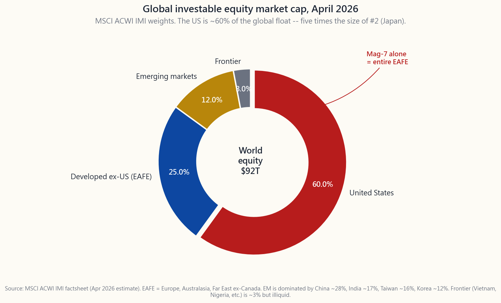
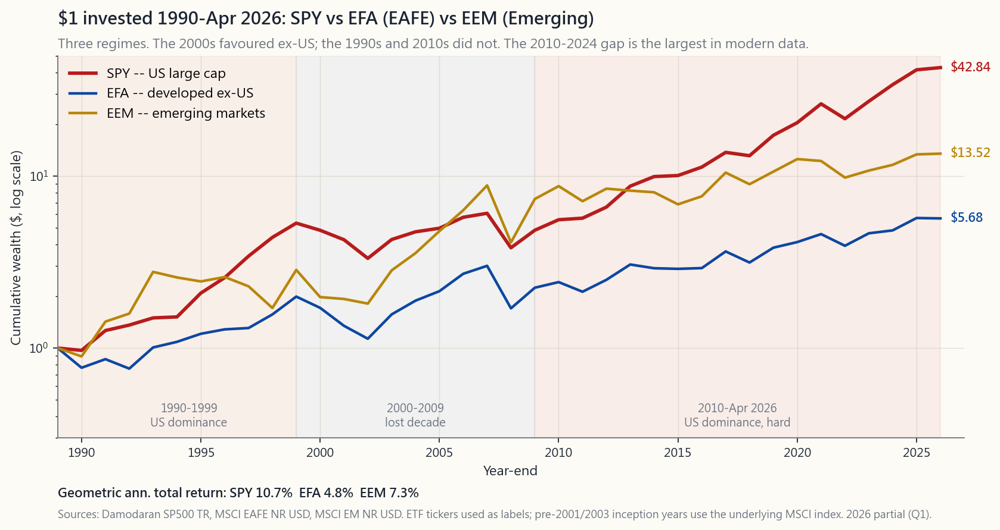

# 附加課 18：環球市場——國際分散投資的正反論據

---

## 第一部分：閱讀材料

---

### 1. 為何這一課如此重要

翻開任何一本入門級投資組合教科書，你都會看到同一句話：*美國約佔全球市值的60%，因此一個經過妥善分散的股票投資組合，應持有其餘40%的海外資產。* 聽起來顯而易見，幾乎是老生常談。本課程對這一結論持不同意見。附加課18將解釋分歧所在，並為你說明貫穿整個課程的基本原則。

以下四個原因說明這值得單獨用一課來講，而非一筆帶過：

1. **本土偏好之爭，是大多數散戶投資者在資產配置上面對的最重大問題。** 它比採用哪種因子傾斜更重要，比主動管理與被動管理的取捨更重要——因為它主導著你約四十個百分點的股票敞口。把這個問題答對，其重要性幾乎超過一切。
2. **「再平衡至國際資產」的反射動作，建立在一個倖存者樣本之上。** 現代投資組合理論在1950至1980年代確立，彼時美國、英國、德國和日本市場在教科書所重視的維度上（自由流通、會計準則、法治）看起來大致相當。如今的投資環境已截然不同。2022年的俄羅斯事件和2021年的中國事件，並非例外個案——放諸足夠長的時間軸，它們才是外國股票投資的常態結果。
3. **2010年至2024年美國與全球股市之間的表現差距，並非雜訊。** 這是盈利增長、資本形成和公司治理方面的結構性分歧。那些建議「持有40%國際資產」的教科書模型，是在一個已不復存在的市場環境下校準的。
4. **本課程的可投資範圍規則，正源於此。** 其他每一課——從第三週的風險回報溢價，到第二十四週的機構資金配置框架——都隱含地將自身限制於美國上市證券。本附加課解釋了*箇中原因*，使這條規則在往後各週出現時不顯得突兀。

教科書的立場並無錯誤，只是不夠完整。誠實的答案是：國際分散投資確實帶來真實的數學效益——*但前提是*你所投資的外國市場與美國同樣具備四項特質：法治、會計透明度、少數股東權益保護，以及成熟的二級市場。按指數權重計算，「國際資產」中約有一半未能達到這個標準。

---

### 2. 你需要掌握的知識

#### 2.1 全貌：美國以外的「世界」有多大？

MSCI全球可投資市場指數（ACWI IMI）是全球覆蓋最廣的可投資股票基準。截至2026年4月，其權重大致如下：

- **美國——約60%。** 市值約55萬億美元，光是「七巨頭」的自由流通市值，已相當於整個EAFE指數。
- **已發展市場（美國除外）（EAFE）——約25%。** 日本約6%、英國約4%、法國約3%、加拿大約3%、瑞士約2.5%，另有德國、澳洲、荷蘭、瑞典、香港、新加坡、西班牙、意大利、丹麥、比利時、芬蘭、挪威、以色列、愛爾蘭、葡萄牙、奧地利、新西蘭。
- **新興市場——約12%。** 中國約佔新興市場板塊的25-30%，印度約17%，台灣約16%，韓國約12%，巴西約5%，沙特阿拉伯約4%，南非約3%，墨西哥約3%。
- **前沿市場——約3%。** 越南、尼日利亞、肯雅、孟加拉國、斯里蘭卡、羅馬尼亞、科威特（在晉升前）、巴基斯坦、摩洛哥。前沿市場規模太小且流動性太低，即便是機構投資者也鮮少視之為真正的配置標的。

這張圖應該帶給你的核心直覺是：*全球市值由一個國家主導。* 這並非一直如此——1989年日本泡沫頂峰時，日本曾短暫成為全球最大股票市場，美國緊隨其後。四十年後，兩者之比約為一比五。這一制度性轉變，比任何回測結果都更值得重視。

#### 2.2 表現記錄，1990-2024：兩個十年，兩個故事

支持國際分散投資的教科書論點，很大程度上倚賴2000至2009年的「失落十年」——在那段時間裡，標普500指數原地踏步，而EAFE和新興市場則大幅跑贏。教科書說這段時期確實存在，這是對的。但從中推而廣之，則是錯的。

審視同一數據的更清晰方式是：**1990年至2026年4月**這段時期，大致可分為三個市場環境。

- **1990-1999：美國稱霸。** 標普500年均複合增長約18%，EAFE約7%，新興市場約11%（末段受1997年亞洲金融風暴拖累）。美國科技股的強勢，令其他每一個股票市場都顯得遲緩。
- **2000-2009：國際領先。** 標普500年均回報-1%（科技泡沫爆破加上環球金融危機）。EAFE未對沖年均回報+1%（受美元走軟提振）。新興市場+10%/年（金磚國家商品超級週期）。這是現代史上唯一一個持有美國以外股票有回報的十年。
- **2010-2024：美國強勢壓倒一切。** 標普500年均約+14%。EAFE年均約+6%。新興市場年均約+4%。這一差距是現代數據中最懸殊的——比1990年代更大——由三個或許持續、或許不持續的因素所驅動：軟件吞噬世界（利好美國科技複合體）、頁岩油革命（利好美國能源自主）、美元走強（打擊未對沖的美國以外持倉）。

對這張圖誠實的解讀是：**領導地位曾經輪換，而沒有人知道下一個十年鹿死誰手。** 這也是陳馬的第一原則：*阿爾法稀缺；工具箱是投資組合構建本身。* 若你無法預測哪個地區贏得下一個十年，標準教科書的回應是*按市值比例持有一切。* 本課程的回應有所不同，將在§2.4中詳述。

#### 2.3 貨幣層面

國際資產的回報由兩個部分構成：以外幣計算的標的股票回報，加上外幣兌美元的匯率變動。在單一年度內，這兩個部分的波動性大致相當——各約7-9%——而匯率部分可將正數的本地回報轉為負數的美元回報，反之亦然。2014至2016年（美元強勢）及2022年（美元極強）對未對沖的美國以外持倉造成損失；2002至2007年（美元弱勢）及2017年（美元弱勢）則帶來助益。

你可以對沖貨幣風險。HEFA（對沖版EAFE）和DBEF等工具透過滾動遠期合約來對沖匯率敞口。對沖成本大致等於利率差——對歐元約每年1%，當美國利率高於外國利率時，對日元的成本更高。從經驗上看，在10年期視窗內，*貨幣效應平均接近零*，但會使未對沖國際股票的波動性增加約30至40%。因此取捨是明確的：若你在意逐年的雜訊，就選擇對沖；若你的投資期限超過10年並希望持有非美元資產以達至分散，就保留未對沖。大多數零售級別的研究最終傾向於「股票部分保留未對沖」。

本課程對這個問題不置可否，因為美國獨有原則讓這一問題根本不成立。

#### 2.4 政治風險溢價與可投資範圍規則

教科書沒有提出的論點，正是決定本課程配置規則的論點。國際股票——尤其是新興市場股票——帶有一類在任何標準的標準差/風險值/回撤統計中都不會出現的風險：*徵收風險*。教科書隱含地假設你隨時可以賣出。

以下是過去十年內這一假設被打破的若干案例：

- **中國2021年。** 中共的「共同富裕」運動在六個月內令中國科技股蒸發約1.5萬億美元。滴滴在首次公開招股後數月即從紐交所退市。以盈利為目的的補習行業在一夜之間被監管命令宣告非法。持有FXI/KWEB的散戶親眼目睹50至70%的回撤，而無任何基本面催化劑——只是一次政策轉向。
- **俄羅斯2022年。** 烏克蘭戰爭爆發後，莫斯科交易所對外國賣家關閉長達數月。及至交易恢復，西方制裁已令美國持有人持有的每一張俄羅斯上市股票實際上變為廢紙。指數提供商將俄羅斯權重標記為零。外國持有的俄羅斯股票中，約500億美元付之東流——這不是市場驅動的回撤，而是政治命令。這是自1959年古巴革命以來最大規模的單一國家資產沒收事件。
- **香港2020-2024年。** 《國家安全法》及其後的資本管控收緊，侵蝕了香港過往所享有的法治溢價。在港上市的股票，如今定價已反映出五年前尚不存在的中國內地政策風險。
- **土耳其2018-2024年。** 埃爾多安的非常規貨幣政策令里拉購買力蒸發約90%。一隻以里拉計算升值一倍的土耳其股票，換算成美元後仍損失三分之二。

四個案例呈現同一模式：*美國上市投資者無法對沖、未出現在歷史風險模型中、且無法以任何價格平倉的事件。* 這就是政治風險溢價，而標準的股票風險溢價數學無法捕捉它。

本課程的應對方式——「可投資範圍」規則——是**將整個建議投資組合限制於美國上市股票。** 這條規則有四根支柱：

1. **法治。** 美國法院執行合約，包括對政府的合約。憲法第五修正案的徵收條款已歷經考驗，且確實有效。
2. **會計透明度。** 在SEC登記的發行人提交10-K和10-Q財務報表，並接受PCAOB監督下的審計。以本國制度申報的外國私人發行人，無法獲得同等的審計保障。
3. **少數股東權益保護。** 特拉華州公司法擁有200年的案例法，保護少數股東免受控股股東的自利行為侵害。中國無此保障，俄羅斯亦然，韓國正在改善但尚未達標。
4. **成熟的二級市場。** 在任何交易日、任何市場環境下，你都能以窄幅差價賣出美國上市股票。這一點不適用於越南、尼日利亞或阿根廷。

這四根支柱是分散投資效益的*替代品*。你放棄了全球可投資機會集的約40%；換來的，是一個在危機中真正可以套現的投資組合，且無人能透過政治決策加以沒收。

#### 2.5 折衷路線：美國上市存託憑證

拒絕持有EFA/VXUS/VWO，並不等於拒絕持有非美國公司的股票。折衷方案——也是本課程其餘部分默認採用的方案——是**美國上市的美國存託憑證（ADR）。**

ADR是外國公司在美國上市的股票，已在SEC登記、由美國銀行托管，並受美國法律管轄。在紐交所買入台積電（TSM）的安全性，實質上高於在台北交易所買入2330.TW——標的業務相同，但美國上市迫使其遵從SEC申報要求，美國法院擁有管轄權，股份亦透過與蘋果公司相同的DTC結算基礎設施進行清算。

本課程可投資範圍內的高質素ADR精選名單：

- **TSM** — 台積電。實際上壟斷了先進邏輯芯片製造。全球最重要的半導體企業。
- **ASML** — 荷蘭極紫外光刻機製造商。所有先進芯片所用機器的唯一供應商。自1995年起於納斯達克上市。
- **SAP** — 德國企業軟件龍頭。
- **NVO** — 諾和諾德，丹麥Ozempic製造商。
- **TM/SONY/HMC** — 高質素日本出口商。
- **SHOP** — Shopify，在加拿大註冊，但於紐交所上市。

第二梯隊因政治風險因素需加以說明：**BABA、JD、PDD、BIDU、NIO**均為美國上市的中國ADR。它們披著美國的外殼，但標的資產位於中國內地，且採用可變利益實體（VIE）架構——這一架構從未在全面的中國資產沒收事件中接受過考驗。應將其定位為風險投機性持倉，而非核心股票。

需要內化的機制是：*可投資範圍由上市地點定義，而非由公司業務所在地決定。* 台積電（TSM）在範圍之內，而台北上市的2330.TW則在範圍之外。兩者都是對同一條生產線的索取權。

---

### 3. 常見誤解

1. **「美國佔全球市值60%，意味著我應持有60%美國資產。」** 這是教科書的配方。它隱含地假設全球市值中的每一分錢都同等可投資。事實並非如此。
2. **「國際資產因相關性低而提供免費的分散效益。」** 過去十年，標普500指數與EAFE的相關性達0.85——如此之高，分散投資的數學只能帶來約1至2%的波動性降低，而非教科書所言的5%以上。
3. **「新興市場增長更快，因此必然跑贏。」** 數十年數據顯示，本地生產總值增長與股票回報基本上毫無相關性。中國在2000至2020年間本地生產總值增長了10倍，而同期MSCI中國指數的年回報率約為5%。
4. **「不持有VXUS，我就是分散不足。」** 你是*集中於美國法律管轄範圍。* 這是一個蓄意的選擇，而非疏忽。這是取捨，不是錯誤。
5. **「貨幣對沖太複雜，懶得理會。」** 它已被打包進交易所買賣基金之中。HEFA的開支比率為35個基點。這就是對沖的成本——有需要的話，使用即可。
6. **「俄羅斯2022年是一次性事件。」** 它是現代史上規模最大的單一事件，但中國2021年及香港自2020年起的緩慢重新定價，都屬同一風險族系。這類事件的基礎發生率比表面看起來要高。
7. **「ADR與本地上市股份沒有分別。」** 兩者的經濟敞口相同，但法律敞口存在實質差異。美國上市是一層真實的保護。
8. **「中國A股納入MSCI，代表它們已具備可投資性。」** MSCI的指數決策涉及的是基準覆蓋範圍，並不賦予法治。2017年A股納入MSCI，並未改變2021至2022年監管打壓期間YY、滴滴或網易持有人的遭遇。
9. **「買EAFE是安全的——全都是已發展市場。」** EAFE比新興市場安全，但仍帶有貨幣風險及集中的單一國家風險（1989年日本佔EAFE的70%；2000年英國佔30%）。EAFE內部的分散程度並不均衡。
10. **「國際分散投資能保護我免受美國股市崩盤衝擊。」** 2008年環球金融危機中，EAFE下跌43%，新興市場下跌53%，而標普500跌37%——三者中跌幅*最大*的恰恰是美國以外的資產。分散效益恰恰在你最需要它的時候失靈。

---

### 4. 問答環節

**問：若我遵循美國獨有原則，台積電、ASML、阿里巴巴是否允許持有？**
答：台積電和ASML是肯定的——它們在SEC登記、於美國上市，你對存託股份享有類似特拉華州法律的索取權。阿里巴巴則視情況而定——外殼是美國的，但標的VIE結構位於中國內地，且從未在全面資產沒收事件中接受考驗。應將阿里巴巴類股票定位為機會性持倉，而非核心股票。

**問：VXUS或VEU作為核心持倉如何？先鋒集團正是為散戶投資者而售。**
答：它們都是功能完善的產品。本課程的規則並不是說它們不好，而是本課程的風險回報數學刻意將其排除在外。若你選擇持有10至20%的VXUS，你的年複合增長率將大致如本課1990至2024年圖表所示——即過去15年低於純美國配置，但在2000年代初略高。你是在採用教科書的取捨。

**問：若我擔心美國可能像2000至2009年那樣跑輸十年，應如何對沖純美國組合的集中風險？**
答：三個答案。第一，四層架構已包含一個價值儲藏倉位——黃金、實物資產——這些資產對貨幣是中性的。第二，美國跨國企業（蘋果、微軟、寶潔、可口可樂）逾50%的收入來自海外，因此標普500本身在經濟敞口上已有一半是國際的。第三，若你確實希望獲得完整的匯率/地區分散，最簡潔的表達方式是黃金加小額商品倉位，而非VXUS。

**問：美國上市的外國公司ADR是否需繳交外國預扣稅？**
答：是的。托管銀行將按外國來源稅率預扣（大多數稅務協議下為15%，部分情況下為30%）。在應稅賬戶中，你可透過美國聯邦稅表1116申請外國稅收抵免。在個人退休賬戶（IRA）中，預扣稅是永久性的，無法取回——這也是本課程建議在應稅賬戶而非遞延納稅賬戶中持有具國際敞口股份的原因之一。稅務規劃課將詳細介紹。

**問：VWO和EEM有何分別？兩者均是新興市場交易所買賣基金。**
答：資產類別相同，指數提供商不同。VWO跟蹤富時指數（包含韓國），EEM跟蹤MSCI指數（不含韓國）。VWO的開支比率為0.08%，EEM為0.70%，費用差距已足夠影響長期結果。若你確實持有新興市場，VWO是正確的工具。

**問：MSCI在2018至2019年納入的中國A股，是否比香港上市的中國股票更安全？**
答：恰恰相反，安全性*更低*。A股在上海和深圳交易所交易，受中國內地法律管轄，程度甚至比香港上市股票更深。2017年納入MSCI是一項基準覆蓋範圍決策，並非可及性升級。資本管控限制了你在危機中的出售能力。堅決迴避。

**問：本課的論點如何與陳馬的槓鈴原則相符？**
答：槓鈴原則說的是*結合廉價安全的資產與彩票式持倉，中間甚麼也不要。* 美國獨有原則適用於廉價安全那一端：VTI/SCHD/TLT——全部美國上市。彩票式持倉那一端，允許包含非美國股票（小量台積電或ASML倉位），因為它們的定位如同期權，而非核心持倉。槓鈴的中間部分——以40%權重持有國際指數基金——正是本框架所排除的。

**問：哪一個數字能讓你改變主意？**
答：美國與次大市場（姑且以日本或英國為例）之間政治風險溢價的持續收窄。具體而言：若英國的公司治理評級、會計透明度和合約執行程度收斂至美國水平，同時匯率對沖成本大幅下降，加上出現持續逾20%的估值折讓，那麼這筆交易才變得有吸引力。上述條件目前均不成立。

**問：美國本身不也帶有政治風險嗎？聯邦貿易委員會、反壟斷、加密貨幣監管、關稅政策？**
答：是的——美國並非零政治風險。但量級差距是顯著的。反壟斷訴訟會歷經多年訴訟，且受《謝爾曼法》和特拉華州案例法約束；它看起來不像中國2021年的監管打壓。本課程的論點不是「美國是安全的」——而是「在法治這個維度上，美國實質上比其他選擇安全得多。」

**問：我的強積金/退休賬戶已持有VXUS，難以輕易調整。現在怎麼辦？**
答：不要為此打亂大局。賬戶的稅務優惠（稅務包裝的價值高於選股）實際上可帶來50%以上的回報提升；不要為了執行5個百分點的配置規則而犧牲它。若你的計劃選項提供VXUS但沒有純美國平衡基金，就在退休賬戶中持有VXUS，並將*應稅賬戶*傾向於美國獨有配置，使家庭整體持倉接近目標。

**問：最後一問——若我使用互動面板的全球配置模擬器，應預期看到甚麼？**
答：三件事。第一，在1990至2024年的回測中，幾乎任何以美國為主的合理組合（70至100% VTI），在年複合增長率上均優於按市值加權的組合（60% VTI/28% VXUS/12% VWO），差距約為每年1至2%。第二，夏普比率的差距窄於年複合增長率的差距——國際資產確實抑制了部分波動性。第三，最大回撤線的變動幅度比你預期的小：環球金融危機和新冠疫情的回撤無處不在。即便在疊加政治風險溢價之前，數據已支持更多美國配置，而非更少。

---

## 第二部分：YouTube腳本

---

**視頻標題：**「為何本課程只投美國——以及篩選罕有例外的四個標準。」
**目標時長：** 約12分鐘
**主持人：** 陳馬、小魚

---

**[開場——0:00-1:00]**

`[VISUAL: image/side18_global_market_cap.png]`

**小魚：** 好，陳馬，YouTube上其他每一條配置視頻都用同一個開場白：「全球分散投資，持有VXUS，美國只佔全球市值的60%。」但本課程的做法不同。我們不推薦VXUS，不推薦EFA，甚至不推薦對沖版國際交易所買賣基金。為甚麼？

**陳馬：** 因為教科書是在一個已不存在的世界中校準的。它誕生於七八十年代，那時美國、英國、德國和日本的市場看起來大致相當。今天已截然不同——而且差距已擴大了十五年。這就是今天要談的話題。

**小魚：** 而且我們要在最後給觀眾一條明確的規則。可投資範圍規則。

**陳馬：** 對。看完這個，你會知道我們為甚麼這樣寫，它排除了甚麼，以及那份短短的例外名單長甚麼樣。

---

**[第一段——全貌——1:00-3:00]**

`[VISUAL: image/side18_global_market_cap.png — 餅狀圖]`

**小魚：** 先看這張圖。2026年4月，全球可投資股票，按地區劃分。

**陳馬：** 美國60%。美國以外已發展市場25%——即EAFE。新興市場12%。前沿市場3%。美國這個數字以前更低——1989年時約為40%，當時日本曾短暫與美國並駕齊驅。今天美國是日本的五倍。

**小魚：** 教科書說：按各地區的權重持有。

**陳馬：** 對。教科書說，每一塊錢投資中，六毛在美國，四毛在海外。這是標準配方。

**小魚：** 為甚麼不行？

**陳馬：** 因為教科書隱含地假設那四毛的海外資產每一分都同樣可以使用。事實並非如此。

---

**[第二段——表現記錄——3:00-5:30]**

`[VISUAL: image/side18_us_vs_world.png]`

**小魚：** 這是財富累積路徑圖。1990年各投入一美元，分三個籃子——標普500指數、EFA、EEM——一直到2026年4月。

**陳馬：** 三個時期。1990年代——標普500年均跑18%，EAFE跑7%，新興市場大起大落。2000年代——標普500在整個十年居然是虧錢的，EAFE基本上持平，新興市場趕上商品繁榮，年均回報10%。然後是2010年到現在——標普500年均14%，EAFE六個點，新興市場四個點。是現代數據中最懸殊的差距，而且是美國贏的那邊。

**小魚：** 所以如果你按十五年前的回測權重買「全世界」，你就等於為了分散投資而白白犧牲了差不多一半的年複合增長率。

**陳馬：** 是的。而且分散投資在壞年頭根本沒幫到你。看2008年——EAFE跌了43%，新興市場跌了53%，標普500跌了37%。國際倉位的回撤*更深。*

**小魚：** 這有點像是整個論點的點睛之筆。

**陳馬：** 就是這個數學。過去十年，標普500與EAFE的相關性大約是0.85。這樣的相關性，分散投資只能給你帶來大約一到兩個百分點的波動性降低——遠不是教科書聲稱的五個百分點。

---

**[第三段——政治風險論點——5:30-8:00]**

**小魚：** 但本課程說「只投美國」，真正的理由其實不是表現的論點，而是政治風險的論點。

**陳馬：** 對。而這正是教科書沉默的地方。標準的風險數學——標準差、風險值、回撤——無法捕捉*資產沒收風險*。教科書隱含地假設你隨時可以賣出。

**小魚：** 說說那些具體案例。

**陳馬：** 俄羅斯，2022年2月。莫斯科交易所對外國賣家關閉。等到重開，制裁已令每一張俄羅斯上市股票對美國持有人來說變成廢紙。外國持有的俄羅斯股票，大約五百億美元一筆勾銷——不是市場下跌，是政治命令。指數提供商把俄羅斯權重直接標記為零。

**小魚：** 那是最戲劇性的。中國呢？

**陳馬：** 中國2021年。補習行業一夜之間被監管命令宣告非法。螞蟻集團首次公開招股在定價前一天被叫停。滴滴在首次公開招股後數月退市。外國持有的中國科技股，在一次政策轉向中回撤五到七成。再有香港自《國家安全法》以來的緩慢重新定價。還有土耳其，埃爾多安的貨幣政策在五年內令里拉貶值九成。

**小魚：** 所以論點不是「國際股票是壞的」，而是「全球市值中，有一部分在可投資性方面存在根本缺陷，而這缺陷不會出現在標準模型中」。

**陳馬：** 正是。而且數字不小。光是中國就佔新興市場指數的約三分之一。在全球市值中，未能通過法治測試的那部分，大約佔總量的15至25%。

---

**[第四段——四個篩選標準——8:00-9:30]**

**小魚：** 那就說說這條規則。可投資範圍規則。

**陳馬：** 將建議投資組合限制於美國上市股票。這條規則有四根支柱。

第一——法治。美國法院執行合約，包括對政府的合約。徵收條款已歷經考驗。

第二——會計透明度。在SEC登記的發行人提交10-K和10-Q財務報表，並接受PCAOB監督下的審計。

第三——少數股東權益保護。特拉華州公司法擁有兩百年的案例法，保護少數股東。

第四——成熟的二級市場。在任何交易日、任何市場環境下，你都能賣出。這一點不適用於越南、尼日利亞或阿根廷。

**小魚：** 而代價是放棄全球市值中約40%的海外部分。

**陳馬：** 對。這是明確的取捨。我們是*刻意*承擔集中於美國法律管轄範圍的風險。這是特性，不是疏漏。

---

**[第五段——折衷路線——9:30-11:00]**

**小魚：** 但你確實允許持有非美國公司的股票，透過ADR。

**陳馬：** 對。可投資範圍是由*上市地點*定義的，不是由公司業務所在地決定。台積電——TSM——在紐交所上市。在SEC登記。受PCAOB審計。由美國銀行托管。你對存託股份享有類似特拉華州法律的索取權。同一條芯片生產線，不同的法律包裝。台積電在範圍之內。同一家公司的台北上市股票在範圍之外。

**小魚：** 精選名單？

**陳馬：** 台積電、ASML、SAP、NVO，高質素日本出口商——豐田、索尼、本田。Shopify作為加拿大敞口。第二梯隊需加說明：阿里巴巴、京東、拼多多。它們穿著美國的外殼，但標的VIE架構從未在全面的中國資產沒收事件中接受過考驗。把這類股票的倉位定位為機會性投機持倉，而非核心股票。

**小魚：** 互動工具讓觀眾可以親眼看到這種取捨。

`[VISUAL: interactive/side18_global_blender.html]`

**陳馬：** 三條滑桿——VTI、VXUS、VWO——總和為100。內嵌1990至2024年的年度回報數據。撥動這些滑桿，看年複合增長率、波動性、夏普比率和最大回撤如何變化，同時看相關性矩陣即時更新。

**小魚：** 而你將看到的核心結論——

**陳馬：** 幾乎任何以美國為主的組合，在過去三十五年的回測中，年複合增長率都優於按市值加權的組合。夏普比率的差距較窄——國際資產確實降低了一些波動性。回撤線幾乎紋絲不動，因為環球金融危機和新冠疫情的衝擊無處不在。*即便在*疊加政治風險溢價之前，數據已支持更多美國配置，而非更少。

---

**[結尾——11:00-12:00]**

**小魚：** 三個重點。

第一——全球市值比例是60%、25%、12%、3%。
第二——「按權重持有一切」的教科書配方，是在全球股票市場四個角落大致相當的環境下校準的。那個世界已不復存在。
第三——本課程刻意選擇只投美國，並以一份ADR精選名單作為折衷路線。

**陳馬：** 最後是底層原則。第一——阿爾法稀缺；工具箱是投資組合構建本身。第二——一個你能真正套現的投資組合，其價值遠勝於一個在試算表上分散得漂亮、卻在危機中凍結失靈的投資組合。

**小魚：** 附加課18完成。下次——附加課19。

---