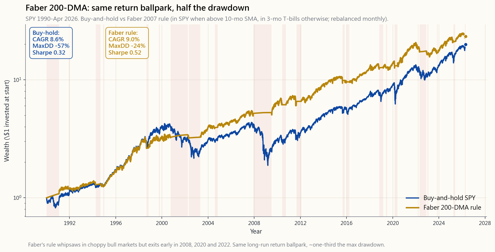
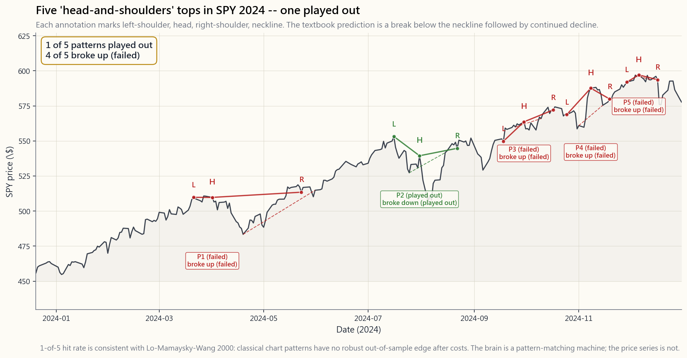

# 補充課 23：技術分析——有效的（少數）、無效的（多數）及學術界的裁決

---

## 第一部分：閱讀章節

---

### 1. 為何這一課重要

技術分析是金融界最龐大的「家庭工業」。坊間有數以萬計的相關書籍、數以百計附有三字縮寫的指標、數十個販賣形態識別課程的 YouTube 頻道，以及一支由 CMT（特許市場技術師）組成的小型軍隊——其認證機構自 1973 年起運作至今。然而，四十年來，學術文獻的結論始終如一：**絕大部分無效，只有兩個狹義的範疇確實有用。** 補充課 23 就是對此作出誠實的梳理。

1. **「技術分析有效」的說法，大多源於倖存者偏差與曲線擬合。** Andrew Lo、Jegadeesh、Pedersen、Bessembinder 等學者對「經典」圖表形態的全域進行了嚴謹測試——頭肩頂、雙頂、三角形、旗形、楔形——結論一致：扣除交易成本後，毫無系統性優勢。這些形態之所以事後顯而易見，是因為大腦本身就是一台形態識別機器，但它們對未來並無預測能力。
2. **然而，技術分析確有兩個範疇*經得起*考驗。** 時間序列動量（一隻證券過去 12 個月的回報，能預測未來 1 至 12 個月的走向）已由 Moskowitz、Ooi 及 Pedersen 於 2012 年的研究在 58 個市場中加以記錄，是規模達 3,000 億美元的管理期貨行業（第 51 週）的核心驅動力。Faber（2007）提出的 200 日移動平均線作為風險開啟/關閉篩選器，長期回報與買入持有大致相當，但最大回撤約減半。這兩者毫不花哨，卻是例外，而非通例。
3. **行為層面的應用是真實的，即使預測層面的應用並不存在。** 一位交易者說「當 50 日線跌穿 200 日線時我就賣出」，最起碼擁有一套*規則*——一個預先承諾的二元觸發機制，能夠凌駕損失厭惡（補充課 15）。這個觸發機制的預測能力或許微弱，但*紀律*是真實的。市場保持非理性的時間，可以遠超你維持償付能力的時間。一套糟糕但持之以恆執行的規則，勝過一個在恐慌中被放棄的好論點。
4. **你每天都會在金融媒體上看到這些東西。** CNBC 嘉賓會在螢幕上畫趨勢線。X/Twitter 帳號會發帖說「這個三角形正在突破」。YouTube 頻道會以 1,997 美元向你出售艾略特波浪理論課程。你需要能夠分辨 95% 裝飾性的內容與 5% 真實有效的內容，尤其因為前者往往借用後者的語言來包裝自己。

本課涵蓋圖表形態的聲稱（失敗之處）、兩個在樣本外成功複製的技術分析策略（倖存者），以及即使預測價值微弱，仍然使用技術分析式規則的行為紀律論據。兩大基石：阿爾法難得，因此預設立場應為被動管理；動量＋均值回歸＋波動性開啟/關閉，是僅有的一批穩健市場規律。

網站上的互動實驗室讓你將移動平均線窗口從 50 天滑動至 365 天，並選擇避險資產（國債、黃金或 0% 現金），在整個 1990 至 2026 年 4 月的樣本中，對比買入持有的年複合增長率、波動性、夏普比率及最大回撤。

---

### 2. 你需要掌握的內容

#### 2.1 技術分析究竟聲稱什麼

技術分析是利用過去的價格和成交量數據——而且*僅限於*過去的價格和成交量數據——來預測未來回報。其基本主張通常包含以下某些組合：

1. 價格反映所有已知信息（這奇怪地正是一個強式效率市場的主張）。
2. 價格按趨勢運行，且趨勢持續。
3. 歷史重複，因為人類心理是不變的——同樣的恐懼與貪婪模式，產生同樣的圖表形狀。

第一個主張與被動指數投資者的信念完全相同，意味著你無法以*任何*方法跑贏市場。第二和第三個主張是可供檢驗的經驗性命題。它們已被檢驗，結果好壞參半。

技術分析的範疇大致分為四類：

- **圖表形態** ——頭肩頂/底、雙頂/雙底、三角形、旗形、楔形、杯柄形、楔形。基於視覺形狀。
- **指標** ——RSI、MACD、隨機指標、布林帶、ADX、CCI、ATR。價格的數學變換。
- **趨勢/動量規則** ——移動平均線交叉、12 個月回報排名、唐奇安通道、突破系統。時間序列趨勢跟蹤。
- **玄學類** ——艾略特波浪、江恩角度、斐波那契回調、蠟燭圖形態（十字星/錘頭/吞噬）。高度主觀。

文獻發現：第三類有一定真實訊號；第一、二、四類在扣除成本後則沒有。

#### 2.2 失敗之處：圖表形態與指標

最嚴謹的圖表形態研究是 Lo、Mamaysky 及 Wang 在《金融學報》2000 年發表的《技術分析基礎》。他們以*核回歸*演算法，在 1962 至 1996 年的美國股票上辨識 10 種經典形態（頭肩頂、擴張頂、三角形等）——以數學方式定義「什麼算作形態」，從而剔除主觀因素。結果：少數形態顯示出微弱的統計訊號（頭肩形態的條件回報分佈與無條件回報分佈之間有*非零*差異），但幅度甚小，扣除交易成本後差異消失。隨後的樣本外測試（Bessembinder & Chan，以及 Brock-Lakonishok-LeBaron 的延伸研究）發現，微弱訊號在 1996 年後無法複製。

指標的情況同樣不樂觀。Park 及 Irwin 於 2007 年對 95 篇技術交易學術研究進行綜述，發現 56 篇報告正面結果，20 篇負面，19 篇混合——但正面結果的研究嚴重集中在 1990 年前的外匯和商品市場（當時摩擦成本極大，訊號幾乎肯定與成本相關），而在 1990 年後的股票樣本中，失敗率急劇攀升。到 2010 年代，主流共識是：經典指標（RSI、MACD、隨機指標）在流動性充裕的美國股票市場中，並無穩健的樣本外優勢。

蠟燭圖形態方面，Marshall、Young 及 Rose（2006 年），以及隨後的 Horton（2009 年），對美國大型股進行了全套日式蠟燭圖形態測試，結果顯示扣除成本後無利可圖。「十字星代表猶豫」的說法，與「硬幣正反面代表猶豫」的說法一樣正確——確實如此，但對你的交易毫無幫助。

艾略特波浪和斐波那契回調幾乎得不到任何學術支持。艾略特波浪原理要求你識別當前的「浪數」——但該方法論允許在任何反轉後重新計數，這意味著它在實時中無法被證偽。Bhattacharya 及 Kumar（2006 年）等人對斐波那契回調水平（38.2%、50%、61.8%）進行了測試，用作者的話說，結果是：「不具統計顯著性的預測內容。」

#### 2.3 倖存者一：時間序列動量（Moskowitz-Ooi-Pedersen）

第一個在市場和年代之間穩健複製的技術分析相關發現，是**時間序列動量**——即*一隻證券自身過去 12 個月的回報，平均而言能以相同方向預測未來 1 至 12 個月的回報*。Moskowitz、Ooi 及 Pedersen 在 2012 年的論文《時間序列動量》中，對 1985 至 2009 年間 58 個流動性期貨市場（股票指數、貨幣、商品、債券）進行測試，發現買入過去 12 個月上漲的資產、沽空下跌的資產，在分散化投資組合層面能產生約 1.0 至 1.2 的夏普比率——遠高於各基礎資產本身。

這正是**管理期貨/CTA** 行業（第 51 週）的驅動引擎。DBMF、KMLM、FMF、AHLT 都在分散化期貨籃子上運行某種形式的時間序列趨勢。2008 年標準普爾指數下跌 37% 之際，法興 CTA 指數錄得 +13.1%；2022 年 60/40 投資組合下跌 17% 之際，法興 CTA 指數錄得 +20.5%——這實質上就是時間序列動量訊號，捕捉了利率、外匯和股票的延伸趨勢，而其他資產則全面沽售。

時間序列動量在嚴格意義上屬於技術分析策略——唯一的輸入是過去價格。但它與「日線圖上的頭肩頂」*截然相反*。它在長時間框架（3 至 12 個月）上運作，跨越分散化籃子（而非單一股票），採用明確規則（按 12 個月回報排名並每月再平衡），幾乎可以肯定捕捉了市場對資訊反應不足的行為偏差——這種偏差需要時間才能完全反映在價格中。動量是兩大穩健市場規律之一，而它正是在此體現。

#### 2.4 倖存者二：200 日移動平均線（Faber GTAA）

第二個倖存者是**200 日移動平均線作為風險開啟/關閉篩選器**，由 Mebane Faber 在其 2007 年的 SSRN 論文《戰術資產配置的量化方法》（曾是 SSRN 史上下載量最高的論文之一）中推廣。

規則如下：

- 月末時，查看 SPY 的價格是否高於其 10 個月（約 200 日）的簡單移動平均線。
- 如是，持有 SPY。
- 如否，持有 3 個月國債。

就是這樣。毫無酌情空間，無需篩選，無需疊加。

結果，以 1990 年至 2026 年 4 月的美國大型股回測（本課圖像腳本中的確切回測，股票端使用 ^GSPC 價格除息調整收市價，退場期間通過 FRED DGS3MO 使用 3 個月國債）：

- 買入持有標普 500：約 8.6% 年複合增長率，最大回撤 -57%（2009 年）。
- Faber 200 日移動平均線規則：約 9.0% 年複合增長率，最大回撤 -24%。
- 夏普比率：買入持有約 0.32，Faber 規則約 0.52。

（加回約每年 1.8 個百分點的標普 500 股息收益率，買入持有的總回報年複合增長率接近約 10.4%。應用於股息再投資交易所買賣基金時，規則的年複合增長率也相應提升；而*最大回撤的差距*才是關鍵，且無論哪種方式均穩健。）年複合增長率大致相當；最大回撤不到一半。風險調整後回報明顯更佳。

這是大多數學者願意在公開刊物上為之辯護的唯一「技術分析」工具。它在數十年間、在不同市場（在 EAFE 和 EEM 上同樣有效）以及在合理的參數選擇下（任何 100 至 250 天的移動平均線窗口均能給出相似結果——結果並非專門針對「200」進行參數擬合）均表現穩健。

它*不*做的事：在長期牛市中產生超額回報。2010 至 2019 年間，買入持有每年跑贏 200 日移動平均線規則約 1.5 個百分點，因為規則在 2011 年 8 月、2015 年 8 月、2016 年 2 月及 2018 年 12 月的假突破期間持有國債。該規則的代價，是在每十年一兩次的事件中，將 -55% 的回撤削減至 -20%，從而得到回報。這是「波動尾部搖動狗身」的框架。你並非為上行空間付費；你是為截斷左尾付費。

#### 2.5 為何有效：行為學解釋

兩個倖存者最簡潔的行為學解釋是*反應不足*。新信息需要時間才能反映在價格中——部分原因是注意力有限（Hong & Stein 1999），部分原因是處置效應賣盤早早壓制了升幅（Frazzini 2006），部分原因是機構資金流動緩慢（再平衡滯後、授權約束、互惠基金現金緩衝）。

當信息正在緩慢消化時，價格會朝著新聞方向趨勢運行。兩個月前公佈業績超預期的股票，仍在被賣方分析師上調評級，仍在被納入增長策略授權，仍在被散戶追捧。兩個月前業績不及預期的股票，仍在被下調評級、被剔除、被沽售。時間序列動量和 200 日移動平均線，都在捕捉這種趨勢。

當信息被完全消化後，價格停止趨勢運行——均值回歸接管（另一個穩健的市場規律）。這正是趨勢規則在橫盤/震蕩市場中反覆被觸發、在方向性市場中大放異彩的原因。

與圖表形態的對比發人深省。「雙頂」是一個*形狀*，而非資金流動。沒有任何行為學故事能說明「高位的視覺對稱性」如何產生下一步走勢的預測訊號。這個形態吸引大腦的眼球，卻無法吸引機構資金。這正是它無法複製的原因。

#### 2.6 行為用途：技術分析作為紀律工具

以下是即使技術分析的預測價值微弱，仍值得使用的誠實理由。

一個沒有規則的散戶投資者，往往會：
- 在股票急升時買入（來自補充課 15 的近期效應/FOMO）。
- 在股票下跌 30% 時持倉，期待反彈（損失厭惡/處置效應）。
- 在消息最黑暗時於底部賣出（恐慌性拋售，參閱 Dalbar 每年 1.5 至 2 個百分點的行為差距）。

一個遵循哪怕*微弱*技術規則的散戶投資者——「當 50 日線跌穿 200 日線時我賣出，沒有例外；當 50 日線反穿 200 日線時我買回」——則會：
- 在重大回撤的早期賣出（規則於 2008 年 8 月、2020 年 2 月、2022 年 1 月觸發——每次崩跌的早中期）。
- 在復甦途中部分買回（2009 年 6 月、2020 年 5 月、2023 年 3 月）。
- 在關鍵時刻毫無酌情空間——而這正是酌情判斷最糟糕的時刻。

技術規則的預測能力或許微弱，但它是*二元且預先承諾*的——這兩點正是克服行為偏差的關鍵（補充課 15 §2.5）。一套糟糕但持之以恆執行的規則，勝過一個在底部被放棄的好判斷。市場保持非理性的時間可以遠超你維持償付能力的時間——這套規則是在你與市場同時失衡時，對抗自身大腦的保險。

這也是**戰術配置行業**（規模逾 1,500 億美元的 200 日移動平均線式規則）能夠持續存在的原因，儘管其年複合增長率優勢有限。客戶購買的是*行為保險*，而非回報提升。

#### 2.7 誠實的裁決

綜合文獻，結論如下：

| 類別 | 裁決 | 備註 |
|---|---|---|
| 時間序列 12 個月動量（期貨籃子） | **有效** | MOP 2012，分散化夏普比率約 1.0，是規模 3,000 億美元 CTA 行業的基礎 |
| 200 日移動平均線/10 個月移動平均線風險開啟/關閉 | **有效（溫和）** | Faber 2007——相近回報，約一半最大回撤 |
| 截面動量（單一股票） | **有效（學術層面）** | Jegadeesh-Titman 1993；2009 年崩跌 -45%；此後每年衰退 -1 個百分點 |
| 圖表形態（頭肩頂、雙頂、三角形） | **無優勢** | Lo-Mamaysky-Wang 2000；2000 年後複製失敗 |
| RSI/MACD/隨機指標 | **無優勢** | Park-Irwin 2007 年綜述 |
| 蠟燭圖形態 | **無優勢** | Marshall-Young-Rose 2006 |
| 艾略特波浪/江恩/斐波那契 | **無證據** | 實時中無法證偽 |
| 技術分析作為紀律機制 | **真實價值** | 行為保險——在危機中勝過酌情判斷 |

如果你打算使用技術分析，請用在有效之處：對分散化籃子進行趨勢跟蹤，對大盤指數使用 200 日移動平均線，以及作為一套*規則體系*來克服自身的行為偏差。跳過圖表形態和指標大雜燴，它們不過是裝飾。

#### 2.8 新冠疫情後的市場環境：為何波幅曲面在大規模資金面前勝過圖表

本課其餘部分有一點說得不夠響亮。經典技術分析——每一個圖表形態、每一個教科書指標、整套蠟燭圖體系——都是在期權賬簿尚是現貨股票的小型衍生工具之時建立的。那個市場已不復存在。自大約 2020 年起，零日到期期權開始主導美國主要指數的盤中資金流，而圖表上看似「價格行為」的相當一部分，實際上是莊家對期權敞口進行對沖，從而推動相關資產波動。期權尾部搖動股票現貨。在新冠疫情後的環境中，不參考期權資金流而單純讀圖，就是在不了解成因的情況下解讀表面現象，而且你工具箱中的形態越舊，在新環境中的訊號就越弱。

這對圖表師而言是令人不安的含義——作為一個曾經畫線的人，我直說：引伸波幅、偏斜、期限結構以及莊家伽瑪分佈，現在所傳遞的信息，比價格本身的德爾塔更為豐富。波幅曲面告訴你，誰*必須在*哪個水平*採取什麼行動*，無論持倉是否明智。圖表讓你看到狗在搖動，波幅曲面讓你知道為何搖動。補充課 20 是希臘字母和波幅曲面的深度解析；這段話是提示你何時去閱讀它的指針。

成本效益取決於資金規模，這一點至關重要，因為本課程的大多數讀者尚未達到新工具箱能夠物有所值的規模。對於擁有第一份投資組合的初學者而言，波幅曲面分析的認知負擔是真實的，尚未物有所值——從圖表開始，運行 200 日移動平均線規則，讓紀律發揮作用。對於擁有六位數後段或七位數投資組合的認真散戶投資者而言，個別倉位的結果能夠左右全年表現而不僅僅是某個月份，忽視波幅曲面就不再是小小的劣勢，而會成為結構性盲點。低於這個門檻，圖表仍然物有所值——主要作為行為錨點，那個在 2020 年 3 月能夠戰勝自身大腦的二元且預先承諾的東西。高於這個門檻，圖表是前菜，波幅曲面才是主菜。

---

### 3. 常見誤解

1. **「技術分析全是廢話。」** 並非完全如此。時間序列動量和 200 日移動平均線篩選器，均已在數十年間跨越多個市場實現樣本外複製。其中兩個狹義範疇有效。其餘 95% 則無效。誠實的立場是「大多數無效，有兩個例外」——而非一概否定。
2. **「技術分析有效，因為所有人都在看——自我實現的預言。」** 這是最常見的辯護，卻站不住腳。如果某個水平真的能夠自我實現，精明的交易者早就會搶先入場，從而消除優勢。實證測試顯示，在交易者實際關注的水平（50 日、200 日、前高/前低），扣除成本後並無優勢。這個故事頗具吸引力，但數據並不支持。
3. **「頭肩頂可靠——我經常看到它奏效。」** 你之所以看到它奏效，是因為確認偏誤（補充課 15）。當形態奏效時，你記住了。當它失敗時，你說「那不是一個*真正的*頭肩頂」。Lo-Mamaysky-Wang 正是為了克服這一點，通過核回歸將形態定義客觀化——而優勢就此消失。
4. **「RSI 低於 30 意味著超賣，股票會反彈。」** 自 1990 年以來對美國股票的測試顯示，扣除成本後在統計上並無顯著優勢。在下跌趨勢中，RSI 低於 30 往往會繼續低於 30。所謂「反彈」，不過是大腦在少數幾個引人注目的案例中進行形態匹配的結果。
5. **「移動平均線無效，因為訊號觸發時，行情已經結束了。」** 從實證上看，這是錯的。Faber 200 日移動平均線規則分別在 2008 年 10 月（距頂部 -25%，在最後 -30% 跌幅來臨之前）、2020 年 3 月（距頂部 -15%，在 -34% 底部之前）以及 2022 年 1 月（距頂部 -5%，在 -25% 低谷之前）觸發。規則*提早*離場，而非滯後。
6. **「趨勢跟蹤只在趨勢市中有效。」** 確實，但趨勢市正是買入持有面臨最大回撤的時候。趨勢規則的作用，恰恰是捕捉買入持有無法迴避的下跌趨勢。在震蕩的牛市中，它每年會損失 1 至 2 個百分點——這是你為左尾保險支付的溢價。
7. **「截面動量（Jegadeesh-Titman）已死。」** 並非已死，而是衰退了。自 2003 年學術論文發表後，溢價已收縮（McLean-Pontiff 2016，發表後約 50% 衰退）。2009 年的動量崩盤在一個季度內達到 -45%，因為受重創的週期股強力反彈。單一股票動量真實存在，但對散戶而言難以收割（換手率高、回撤大、稅務效率低）。時間序列動量在期貨上更為穩健。
8. **「成交量確認價格。」** 有時如此。能量潮指標（Granville 1963）在現代美國股票中並無統計優勢。圍繞業績發佈和企業事件的成交量*形態*確實攜帶信息，但泛泛的「上升日成交量增加即為買入訊號」，扣除成本後並不具預測性。
9. **「艾略特波浪理論在你正確計算浪數的情況下是有效的。」** 無法證偽這一點，本身就說明了問題。任何允許你在任何走勢後重新計數的方法論，都可以在事後擬合任何數據。Robert Prechter（最著名的艾略特波浪倡導者）從 1990 年代後期到 2010 年代，一直公開預測道指將跌至 1,000 至 3,000 點，而道指在此期間從 7,000 點漲至 14,000 點再漲至 36,000 點。
10. **「技術分析無法回測，因為形態是主觀的。」** Lo-Mamaysky-Wang 的貢獻，正是通過核回歸使形態變得客觀。一旦形式化，形態就可以接受測試。測試結果顯示沒有優勢。主觀性是技術分析對抗證偽的*防線*，而非其優勢。

---

### 4. 問答環節

**問題一：那麼技術分析是否值得學習？**
其中兩個部分值得：（a）對分散化籃子進行時間序列動量——閱讀 Moskowitz-Ooi-Pedersen 2012，再看 DBMF/KMLM 作為實施方式（第 51 週）。（b）200 日移動平均線作為大盤指數的風險開啟/關閉篩選器——Faber 2007，即補充課 23 §2.4 的實施方式。其餘部分——圖表形態、RSI/MACD 大雜燴、蠟燭圖、艾略特波浪——不過是裝飾，跳過即可。

**問題二：200 日移動平均線規則的年複合增長率略低於買入持有。為何還要使用它？**
你購買的不是年複合增長率，而是左尾保險。該規則將最大回撤約削減一半（2008 至 2009 年約 -19% 對比約 -55%）。對於接近退休的投資者，或在賬面虧損達 -40% 時行為失控的投資者而言，這種左尾截斷值得每年損失 1 至 1.5 個百分點的上行回報。「波動尾部搖動狗身」就是這個框架。

**問題三：截面動量（買入贏家/沽空個股輸家）與時間序列動量是否相同？**
相關但有所不同。截面動量將股票相互排名比較——買入過去 12 個月回報排名前十分位的股票，沽空後十分位的。時間序列動量將每項資產與自身進行比較——當其 12 個月回報為正時做多，為負時做空。截面版本在 2009 年第一至二季度出現 -45% 的崩盤（著名的「動量崩盤」），而在分散化期貨上的時間序列版本則未出現。時間序列動量對散戶/較小型基金更為穩健。

**問題四：如果這些方法無效，為何那麼多 CMT 和圖表師能夠賺錢？**
原因有幾點：（1）部分人在基本面上做投資決策，只將技術分析用於入場時機——超額回報來自基本面判斷，而非圖表。（2）部分人使用趨勢規則（確實有效，雖然溫和），並稱之為「技術分析」。（3）倖存者偏差——虧損出局的人沒有播客。（4）對於 2000 年前的場內交易員，優勢在於*提供流動性*，而非形態識別；圖表是做市操作的可見部分。（5）部分人純粹是在販賣課程；他們的損益來自課程收入，而非交易。

**問題五：我是否應該根據技術水平設置止蝕？**
對個股而言，設置在入場價以下 2 至 3 個平均真實波幅的止蝕是合理的——它能強制執行倉位層面的風險紀律。對指數基金而言，不建議——指數均值回歸，在指數上設置止蝕，通常會導致在底部賣出後被反覆觸發。對指數持倉的正確風險控制是*倉位規模*，而非止蝕盤（補充課 15 §3 第 6 條）。

**問題六：200 日移動平均線規則在 2026 年仍然有效嗎？**
截至 2026 年 4 月，答案是肯定的——該規則在 2022 年 1 月 -25% 的回撤中正確觸發（持有國債並賺取 4 至 5% 的利息，於 2023 年 3 月重新入場），並在 2024 至 2025 年全程持有多倉。規則的年複合增長率和最大回撤，與買入持有的關係仍與歷史記錄一致——最大回撤明顯較低，年複合增長率略遜。網站上的互動實驗室讓你可以自行重新運行回測並驗證數字。

**問題七：為何學術文獻將趨勢跟蹤視為「與技術分析不同」，而它顯然就是技術分析？**
是品牌問題。學者將趨勢跟蹤稱為「時間序列動量」，因為這個術語有清晰的計量經濟學定義，文獻發表在期刊上（《金融學報》、《金融研究評論》）。從業者將同樣的東西稱為「趨勢跟蹤」，並在行業刊物上發表。其機制——上升時買入，下跌時賣出——完全相同。用學術名稱稱呼時，文獻的敵意就少了一些。

**問題八：成交量/能量潮/積累分佈指標呢？**
*事件性*時刻（業績發佈、併購、FDA 審批）周圍的成交量是有信息量的——它反映了信息流動。安靜交易日通過指標轉換（能量潮、積累/分佈線）過濾出的成交量，並未顯示穩健的預測優勢。對任何成交量聲稱都要問的問題是：*這在行為機制上如何預示價格方向？* 如果沒有答案，請對該聲稱保持懷疑。

**問題九：圖表形態是否有任何用處？**
有兩個狹義用途。（1）作為*風險管理*提示——如果一隻股票在大成交量下決定性跌破多年支撐位，這*確實*是機構沽售的信息，即使具體的「頭肩頂」框架只是裝飾。（2）作為趨勢和波動率環境的*心理速記*。這兩種用途本身並不產生超額回報——它們只是幫助你不以明顯的方式蒙受損失。「形態即預測」的聲稱，才是無法複製的部分。

**問題十：技術分析如何融入四檔框架？**
第一至三檔（增長、收入、價值儲存）採用被動配置，完全無需技術分析——買入持有指數基金並每年再平衡。第四檔（機會性/5% 空間）是技術分析式規則能夠物有所值之處——股票倉位上的 200 日移動平均線覆蓋、通過 DBMF 或 KMLM 的時間序列動量敞口，或個別持倉的規則化入場時機。將技術分析限制在小份額中，你就無法因一次錯誤的圖表解讀而毀掉整個投資組合。

**問題十一：散戶投資者應從本課採納的唯一規則是什麼？**
要麼不採納任何（只持有指數——預設被動管理，超額回報難得），要麼採納一條：在月末對標普 500 指數價格應用 200 日移動平均線篩選器，且不作任何酌情覆蓋，用於股票倉位。從歷史上看，這一條規則將最大回撤削減一半，每年損失約 1 個百分點的年複合增長率，並在危機中為你提供行為錨點。超出此範圍的任何事情，最多是邊際改進，最壞是令人分心。

**問題十二：這對艾略特波浪和 CMT 資格有何意義？**
艾略特波浪：零學術支持，方法論無法證偽，視之為金融占星術即可。CMT（特許市場技術師）資格：*內容*涵蓋技術分析的全貌，包括那些無效的部分；*資格本身*表明對市場微觀結構的認真態度，但並非預測技能的保證。如果你在聘用 CMT，請問他們交易 §2.1 中四類的哪一類。如果他們說第一、二或四類，請迅速離開。

---

## 第二部分：YouTube 腳本

---

**影片標題：** 「技術分析：有效的（少數）、無效的（多數）——補充課 23」
**目標時長：** 約 12 分鐘
**主持人：** 陳馬、小魚

---

**[00:00 — 冷開場]**

**陳馬：** 小魚，給你說一個數字。關於技術分析的書籍有數以萬計。附有三字縮寫的指標有數以百計——RSI、MACD、ADX、CCI、ATR。還有一個認證資格 CMT，自 1973 年起存在至今。

**小魚：** 而學術界對其中大部分的裁決是？

**陳馬：** 無效。經過四十年的測試，只有兩個狹義範疇的技術分析能夠在樣本外複製。其餘的都是裝飾。我們今天就來逐一梳理哪些有效、哪些無效。

**小魚：** 誠實作答，不打馬虎眼。

**陳馬：** 不打馬虎眼。

**[00:50 — 介紹]**

**陳馬：** 補充課 23。技術分析。誠實的梳理。我們會講四個類別——圖表形態、指標大雜燴、趨勢動量規則，以及玄學類——並告訴大家文獻真正支持哪個類別。

**小魚：** 劇透：是第三類。

**陳馬：** 劇透，第三類。優勢並不在其他三類，無論你訂閱的那位影響者在你的時間線上多大聲喊「QQQ 正在形成頭肩頂」。

**[02:00 — 失敗之處：圖表形態]**

**小魚：** 先說圖表形態。頭肩頂、雙頂、三角形、旗形、楔形。經典的那些。

[VISUAL: image/side23_pattern_failure.png]

**陳馬：** 這是 2024 年的 SPY。我們標出了五個地方，圖表*看起來像*頭肩頂——左肩、頭部、右肩、頸線、預測的跌破。五個中有四個反而向上突破頸線，而非向下。五中取一奏效。

**小魚：** 五中取一。扣除成本後，大致與拋硬幣相當。

**陳馬：** 大致如此。嚴謹版本是 Lo、Mamaysky 及 Wang 在 2000 年發表的論文《技術分析基礎》。他們用數學方法將形態偵測規範化——核回歸——所以不存在主觀性。他們發現少數形態有可偵測的統計訊號，但幅度很小，2000 年後的樣本外複製更是將其完全抹去。

**小魚：** 那指標大雜燴呢——RSI、MACD、隨機指標？

**陳馬：** Park 及 Irwin 在 2007 年綜述了 95 篇學術研究。正面結果嚴重集中在 1990 年前的商品和外匯市場，當時交易成本極大。在 1990 年後流動性充裕的美國股票中，這些指標並無穩健優勢。

**小魚：** 蠟燭圖呢？

**陳馬：** Marshall-Young-Rose 在 2006 年對美國大型股測試了全套日式蠟燭圖形態，結果扣除成本後無利可圖。「十字星代表猶豫」的說法，與「硬幣正反面代表猶豫」的說法一樣正確。確實如此，但幫不了你交易。

**[04:30 — 倖存者一：時間序列動量]**

**陳馬：** 現在講*確實*有效的部分。第三類——時間序列動量。Moskowitz、Ooi、Pedersen 2012 年的《時間序列動量》。他們對 1985 至 2009 年間 58 個流動性期貨市場——股票指數、貨幣、商品、債券——進行測試。規則是：如果資產自身過去 12 個月的回報為正，買入；如果為負，沽空。

**小魚：** 結果如何？

**陳馬：** 分散化投資組合的夏普比率約為 1.0 至 1.2，遠高於各基礎資產本身，並在 2009 年後的樣本中穩健複製。

**小魚：** 這就是 CTA 行業的驅動引擎。

**陳馬：** 正是這個引擎。DBMF、KMLM、FMF、AHLT——都在分散化期貨籃子上運行某種形式的時間序列趨勢。2008 年標普跌 37% 之際，法興 CTA 指數升 13%。2022 年 60/40 投資組合跌 17% 之際，法興 CTA 指數升 20.5%。

**小魚：** 動量和均值回歸是兩大穩健的市場規律。動量正是在這裡體現。

**陳馬：** 沒錯。時間序列動量是學術記錄最清晰的技術分析策略。

**[06:30 — 倖存者二：200 日移動平均線]**

[VISUAL: image/side23_200dma_strategy.png]

**陳馬：** 第二個倖存者是 200 日移動平均線規則。Mebane Faber，2007 年，《戰術資產配置的量化方法》。規則就一行。月末時，如果 SPY 高於其 10 個月——即約 200 日——移動平均線，持有 SPY。如果沒有，持有國債。

**小魚：** 就這樣？

**陳馬：** 就這樣。沒有酌情空間，沒有篩選，沒有疊加。

**小魚：** 1990 年至 2026 年 4 月的結果如何？

**陳馬：** 買入持有標普 500，純價格年複合增長率 8.6%，2009 年最大回撤 -57%。Faber 規則，年複合增長率 9.0%，最大回撤 -24%。夏普比率，買入持有 0.32，Faber 規則 0.52。把兩邊各加回約 1.8 個百分點的股息收益率，股息再投資的數字各高幾個點，但回撤差距不變。

**小魚：** 年複合增長率略低，最大回撤大幅降低。

**陳馬：** 年複合增長率略低，最大回撤*大幅*降低。「波動尾部搖動狗身」就是這個框架。你並非為上行空間付費，而是為截斷左尾付費。對於接近退休的投資者，或賬面虧損達 -40% 時行為失控的投資者，這種左尾保險值得損失那一個半百分點的年複合增長率。

**小魚：** 而且這是大多數學者唯一願意公開為之辯護的技術分析工具。

**陳馬：** 唯一一個。在數十年間、在不同市場——EAFE 和 EEM 上同樣有效——以及在合理的參數選擇下均表現穩健。100 至 250 天之間的任何窗口都能給出相似結果。它並非專門針對「200」進行參數擬合。

**[09:00 — 為何有效]**

**小魚：** 機制是什麼？為何倖存者能倖存下來？

**陳馬：** 反應不足。新信息需要時間才能反映在價格中。注意力有限，賣方分析師的調整緩慢，互惠基金的資金流動緩慢，散戶再平衡緩慢。在信息被消化的過程中，價格沿新聞方向趨勢運行。

**小魚：** 完全消化後呢？

**陳馬：** 均值回歸接管。另一個穩健的市場規律。這正是趨勢規則在震蕩市中反覆被觸發、在方向性市場中大放異彩的原因。

**小魚：** 圖表形態呢？

**陳馬：** 雙頂是一個*形狀*，不是資金流動。沒有任何行為學故事說明「高位的視覺對稱性」能夠產生下一步走勢的預測訊號。形態吸引大腦的眼球，卻無法吸引機構資金。這正是它無法複製的原因。

**[10:30 — 行為用途]**

**小魚：** 即使大多數技術分析並無預測作用，你之前也提過它有*價值*。

**陳馬：** 確實有。作為行為保險。一個沒有規則的散戶投資者，往往在底部賣出、在頂部買入——補充課 15 提到的 Dalbar 差距。而一個*持之以恆執行糟糕規則*的散戶——比如「50 日線跌穿 200 日線我就賣出」——會在重大回撤的早期賣出，在復甦途中部分買回，最關鍵的是在那個時刻*毫無酌情空間*。

**小魚：** 而那個時刻，正是酌情判斷最糟糕的時刻。

**陳馬：** 正是酌情判斷最糟糕的時刻。市場保持非理性的時間，可以遠超你維持償付能力的時間。一套微弱的規則*就是*對抗自身大腦的保險。規則的預測能力或許有限，但它是二元且預先承諾的，而這兩點正是克服損失厭惡和 FOMO 的關鍵。

**[11:00 — 新冠疫情後的市場環境]**

**小魚：** 有一件事我們說得不夠響亮。經典技術分析是在零日到期期權主導市場之前建立的。

**陳馬：** 沒錯。教科書中的每一個圖表形態、每一個指標、整套蠟燭圖體系——全都是在期權賬簿尚是現貨股票的小型衍生工具之時建立的。自大約 2020 年起，這一情況已經逆轉。主要指數盤中「價格行為」的相當一部分，實際上是莊家對期權敞口進行對沖，從而推動相關資產波動。期權尾部搖動股票現貨。在這種環境下不參考期權資金流而單純讀圖，就是在不了解成因的情況下解讀表面現象。

**小魚：** 含義是什麼？

**陳馬：** 引伸波幅、偏斜、期限結構、莊家伽瑪——波幅曲面——現在所傳遞的信息，比價格本身的德爾塔更為豐富。圖表讓你看到狗在搖動，波幅曲面讓你知道*為何*搖動。補充課 20 是深度解析。

**小魚：** 這適用於所有人嗎？

**陳馬：** 不，而這正是誠實的部分。成本效益取決於資金規模。對於擁有第一份投資組合的初學者，波幅曲面分析的認知負擔是真實的，尚未物有所值。先從圖表開始，運行 200 日移動平均線，讓紀律發揮作用。對於擁有六位數後段或七位數投資組合的散戶投資者，一個倉位的結果能夠左右全年表現而不僅僅是某個月份，忽視波幅曲面就不再是小小的劣勢，而會成為結構性盲點。低於這個門檻，圖表仍然物有所值，主要作為行為錨點。高於這個門檻，圖表是前菜，波幅曲面才是主菜。

**[VISUAL: interactive/side23_ma_lab.html]**

**小魚：** 我們在網站上有一個實驗室供大家試玩。把移動平均線窗口從 50 天滑動至 365 天。選擇避險資產——國債、黃金或零息現金。在整個 1990 至 2024 年樣本中，對比買入持有查看年複合增長率、波動性、夏普比率及最大回撤。

**陳馬：** 先試 200 天的預設值。然後調到 50——太短，反覆被觸發。調到 350——太長，反應緩慢，回撤更大。150 至 250 的範圍是甜蜜點，這也正是文獻為何最終收斂於大約 200 的原因。

**[11:30 — 結語]**

**小魚：** 那麼散戶投資者應如何處理這一切，陳馬？

**陳馬：** 兩個選擇之一。選項一——什麼都不做。只持有指數。預設立場是被動管理，超額回報難得。選項二——採納一條規則，在股票倉位上使用 200 日移動平均線篩選器，月末應用，且不作任何酌情覆蓋。從歷史上看，這將最大回撤約削減一半，每年損失約 1 個百分點的年複合增長率，並在危機中為你提供行為錨點。

**小魚：** 超出此範圍的呢？

**陳馬：** 跳過。如果你想要時間序列動量敞口，買 DBMF 或 KMLM，讓他們在分散化籃子上運行——那是第 51 週的內容。跳過圖表形態、指標大雜燴、蠟燭圖、艾略特波浪，它們不過是裝飾。兩個有效的狹義範疇，是你唯一需要的。

**小魚：** 兩個有效。其餘大多數是裝飾。誠實作答。

**陳馬：** 誠實作答。

[結束]