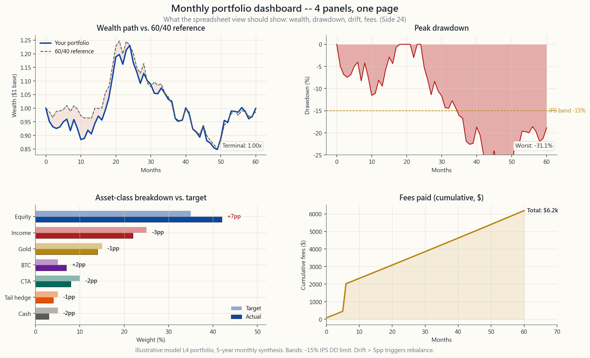

# 補充課 24：投資組合監察工具

---

## 第一部分：閱讀材料

---

### 1. 為何此事重要

第 52 週的模型在「建立投資組合」一步結束。真實的人生從那裡才開始。看不清楚的投資組合，就是管不好的投資組合。簽署投資政策說明書之後的工作，是檢查——最多每月一次，絕不每天——你所寫下的，是否就是你實際持有的。這正是監察工具的用途。

1. **偏移會毀掉好計劃。** 按第 52 週重建的 35/25/15/5/10/5/5 模型 L4 投資組合，會自行偏移。經歷一個強勁的股票年度後，增長組別膨脹至 42%，現金組別收縮至 3%。若沒有能逐組別量度偏移幅度、並與目標比較的工具，你根本無從判斷是否已突破觸發削減操作的正負 5 個百分點區間。

2. **單靠眼睛看看不出重疊。** 同時持有 VTI、VOO、SPY、QQQ 和 SCHD，看起來像五隻基金。X-Ray 分析卻顯示這基本上是一隻基金：AAPL、MSFT、NVDA、AMZN、META、GOOG 全部高比重地出現在這五隻基金中。板塊重複計算是散戶投資組合最常見的隱性失誤，若不逐項核查持倉，根本看不出來。

3. **費用是按固定比率計算的複利稅。** 一個 50 萬美元投資組合的 0.50% 開支比率，意味著每年自動靜靜扣除 2,500 美元——從不開發票。能夠整合所有帳戶並計算**費用加權平均開支比率**的工具，才能將抽象的「費用很重要」，變成一個你可以決定是否繼續支付的具體美元數字。

4. **行為護欄來自自動化。** 矛盾地，監察**愈好**，反而讓你看**得愈少**。當警報只在突破區間時才觸發，而儀表板按固定的每月節奏運作，每天早上登入經紀戶口的衝動便會消退。工具代你守望，你安心生活。這正是保持足夠長的投資年期、讓策略複利增長的那種紀律。

---

### 2. 你需要掌握的內容

#### 2.1 Portfolio Visualizer——免費的機構級終端

[portfoliovisualizer.com](https://www.portfoliovisualizer.com) 是散戶工具箱中最有用的免費工具。五個模組值得你深入了解：

- **回測投資組合（Backtest Portfolio）。** 輸入比重和代碼列表，選擇起始日期，工具便會返回年化回報、波動性、最大回撤、夏普比率、索提諾比率、卡爾馬比率，以及逐年數據表。大多數交易所買賣基金最遠可回測至 1985 年的月度數據，部分系列透過互惠基金代理可追溯更早。你可以並排比較三個投資組合——這正是第 4、15 及 52 週在更改比重前要求你做的事。
- **資產類別回測（Asset Class Backtest）。** 同一引擎，但使用重建的廣泛資產類別（美國大型股、美國小型價值股、已發展市場國際股票、新興市場、房地產信託基金、黃金、長期債券、短期國債），追溯至 1972 年。藉此可以將 60/40 或全天候組別，放在 ETF 時間窗口不涵蓋的 1970 年代通脹環境下進行壓力測試。
- **因子回歸（Factor Regression）。** 針對任何代碼或投資組合，運行 Fama-French 三因子、Carhart 四因子，以及 FF 五因子加動量模型。輸出結果包括：阿爾法（附 t 統計量）、以及對市場、規模、價值、動量、質量、低波動性的貝塔暴露。這正是你**證明**因子傾斜確實發揮你所付出的較高開支比率應有效用的方法。
- **蒙地卡羅模擬（Monte Carlo）。** 以你可以自行調整的資本市場假設進行前瞻模擬。適用於安全提款率壓力測試和回報次序的尾部測試。
- **資產相關性（Asset Correlations）。** 提供滾動及全期相關性矩陣，窗口可由用戶自行調整。快速直觀地呈現第 19 週討論的相關性崩潰問題。

免費版已涵蓋以上所有功能。付費版（每月 30 美元）額外提供優化功能和滾動夏普比率歷史圖表；對散戶投資者而言，免費版已足夠長期使用。

#### 2.2 Morningstar Instant X-Ray——重疊偵測器

X-Ray 是免費工具，隱藏在 Morningstar 帳戶內。貼上你的代碼列表和比重，系統會返回：

- **資產類別細分** ——將基金展開至持倉後，你實際持有多少美國股票、國際股票、債券、現金及其他。
- **板塊配置** ——十一個全球行業分類標準（GICS）板塊，並附上標準普爾 500 指數作參考。
- **地區配置** ——北美、歐洲、日本、亞洲（日本除外）、拉丁美洲、中東、非洲。
- **前十大持倉** ——經基金穿透後，整個投資組合的前十大持股。這正是「我持有 VTI 和 SCHD」變成「我的股票倉位有 27% 集中在七隻美國超大型股」的地方。
- **股票重疊率** ——一個介乎 0% 至 100% 的數字，量化兩隻基金加權持倉中相同名稱的比例。

若你在這堂課只學到一件事，就應該是這個重疊率數字。持有 VTI + VOO + SPY + IVV 的散戶投資組合，看起來是四隻基金，實際上是一隻基金，重疊率高達 99.5%。圖片腳本 `side24_overlap_detection.py` 以一個 5 隻基金的例子，展示兩兩之間的重疊熱力圖，在對角線群集上顯示約 60% 的前十大持倉重疊。

#### 2.3 Empower（前身為 Personal Capital）——帳戶整合平台

Empower 的免費工具包括帳戶整合功能，可透過 Plaid 連結大多數美國經紀、銀行及 401(k) 供應商。連結後，它會運行三項重要的分析功能：

- **退休規劃（Retirement Planner）。** 根據你的實際當前結餘和供款比率，進行蒙地卡羅前瞻推算。
- **投資檢查（Investment Checkup）。** 一次過覽**所有**帳戶的資產類別細分——這是單一經紀平台無法提供的跨帳戶視圖。與目標配置比較，並標示差距。
- **費用分析（Fee Analyzer）。** 殺手級功能。按持倉規模加權整合每隻基金的開支比率，並報告在你投資年期內的費用美元影響。這個功能呈現出 0.65% 顧問費與 0.05% 自主管理投資組合在三十年間的差距，已讓比任何博客文章都更多的散戶投資者，選擇放棄全方位服務的顧問。

注意：Empower 的商業模式是財富管理的潛在客戶漏斗。預期會有電話跟進。禮貌地拒絕即可；工具仍然免費使用。

#### 2.4 經紀商內置工具——Schwab、Fidelity、Vanguard

2020 至 2025 年間，每家主要美國經紀商都推出了投資組合分析儀表板：

- **Schwab Portfolio Checkup** ——透過合作關係接入 X-Ray 引擎，在你的 Schwab 登入頁面內提供板塊、資產類別及重疊視圖。
- **Fidelity Portfolio Analysis** ——在稅務批次視圖和未實現盈虧報告方面表現出色。其「與基準比較」面板提供整潔的滾動回報對比，可對比任何指數。
- **Vanguard Portfolio Watch** ——基本功能，但免費；若投資組合純為先鋒基金，十分實用。

當你要查看**該**經紀商帳戶時，使用其內置工具。當你需要完整的跨帳戶視圖時，使用 Empower 或 X-Ray。

#### 2.5 自製試算表——你實際使用的工具

儘管有各種精緻的網絡工具，我所認識的大多數有紀律的散戶投資者，仍以 Google 試算表或 Excel 工作簿作為每月主要儀表板。原因有三：它對你的資產類別沒有任何預設立場，其使用介面絕不會在你不知情下更改，而且可以離線使用。

一個最精簡可行的每月試算表有六欄：代碼、目標比重、目標美元金額、當前美元金額、偏移百分點、行動（削減/增持/持有）。其下方有三個計算格：投資組合總值、費用加權開支比率，以及過去十二個月回報對比 60/40 基準。如此而已。圖片腳本 `side24_dashboard_template.py` 展示了以四個面板呈現的效果：財富路徑、回撤、資產類別細分，以及滾動費用支出。

`GOOGLEFINANCE("VTI", "price")` 等函數可免費、永久地以 20 分鐘延遲將即時價格導入 Google 試算表。付費工具儀表板的所有功能，一列 `=GOOGLEFINANCE()` 函數都能複製。

#### 2.6 每月檢查清單

工具若沒有配合節奏使用，毫無用處。每月固定一天：

1. **年初至今及過去 12 個月的總回報。** 對比 60/40 基準。在備注欄寫一句話。
2. **已實現波動性及過去峰值回撤。** 從試算表或 Portfolio Visualizer 取得。對比投資政策說明書所列的最大回撤。
3. **組別偏移。** 對第 52 週七個組別的每一個：是否在目標正負 5 個百分點以內？任何突破都觸發對**該**組別的削減/增持操作，最好先透過新增資金注入，才考慮沽出。
4. **因子暴露。** 此項每季度做一次已足夠——對你的傾斜組別（MTUM、AVUV、QUAL、USMV）在 Portfolio Visualizer 進行因子回歸，確認對目標因子的貝塔仍 > 0.5 且 t 統計量 > 2。連續兩個季度低於此門檻，觸發半倉止損規則。
5. **年初至今已付費用。** 費用加權開支比率 × 投資組合價值，按年份比例攤算。留意 401(k) 目標日期默認基金悄然帶入的費用。
6. **再平衡區間突破。** 超出 5 個百分點區間的**當天**執行。未達突破的，下個月再說。

每月節奏才是正確選擇、而非每天，原因並非懶惰，而是結構性的。一個現代投資組合——第 52 週的四層架構正正符合這個描述——在形態上是一個槓鈴：一端是高確信度的安全資產（現金、短期國債、黃金、你真正想持有的股票的深度價內長期認購期權），另一端是非對稱投機（機會性組別、尾部對沖組別、期權倉位）。槓鈴的運作前提，是讓安全端**真正保持安全**。每天查看會將來自補充課 15 的處置效應——削減盈利倉位、加碼虧損倉位的衝動——重新引入一個本應不受干擾的組別。更糟的是，這會讓尾部對沖組別——那些存在目的就是九成五機率到期歸零的小型期權倉位——變成一台定價焦慮機器：一旦每天都看損益，這個倉位就會在每個季度都令人心碎。每月節奏正是讓投資組合的整體形態持續發揮功效的政策。儀表板的存在，是為了**強制執行**檢視日之間的空白，而非填滿它。

互動工具 `side24_dashboard.html` 讓你從 12 隻基金的下拉選單中組建一個 5 隻基金的投資組合，並即時查看資產類別細分、費用加權平均值，以及兩兩前十大持倉重疊情況——是上述散戶工具箱的實用縮影。

---

### 3. 常見誤解

1. **「工具愈多，洞察愈深。」** 並非如此。五個互相重疊的儀表板，不過是同一組數字的五種不同呈現框架，你早上 9 時看的那個才是真正被使用的，其餘四個會慢慢荒廢。選一個主要工具（試算表或 Empower）、一個深度分析工具（Portfolio Visualizer）、一個重疊檢查工具（Morningstar X-Ray），然後停下來。

2. **「我的經紀商已向我展示一切。」** 僅限於**該**經紀商的帳戶。跨帳戶視圖——包括配偶的 IRA、前僱主的 401(k)、以及健康儲蓄帳戶——正是沒有任何單一經紀商能提供的。整合平台或試算表是唯一的解決方法。

3. **「每天查看讓我保持消息靈通。」** 它只會讓你焦慮。主動散戶交易者的研究發現，登入頻率與跑輸大市之間幾乎呈單調正相關關係（Barber & Odean 2000）。設定固定的每月日期，完成清單，關掉標籤頁。

4. **「X-Ray 是給基金中的基金用的，我的交易所買賣基金投資組合很乾淨。」** 錯。SCHD、VYM、DGRO 和 NOBL 看起來像四個不同的收益策略。把它們放進 X-Ray：持倉重疊率超過 50%，因為它們都在相同的標普 500 成分股範圍內篩選派息特徵。

5. **「開支比率是我支付的唯一費用。」** 並非如此。完整的費用清單包括：開支比率 + 12b-1 費用 + 基金內部交易成本 + 買賣差價 + 顧問費 + 帳戶費。Empower 的費用分析器呈現第一項；其餘項目只能透過閱讀 Form ADV 和查閱稅務申報表才能找到。

6. **「蒙地卡羅顯示 87% 成功率——我很安全。」** 蒙地卡羅假設未來回報分佈與歷史分佈相同。宏觀環境每 30 至 40 年就會改變一次，所以未來**不會**如此。將模擬視為敏感性分析工具，而非概率預測。

7. **「免費工具有限制；付費版才顯示真相。」** Portfolio Visualizer 的付費版增加了優化功能（容易過擬合）和一些便利功能。真相其實就在免費版中。只有在窮盡免費版所能提供的一切之後，才考慮付費。

8. **「再平衡區間是任意設定的；我每年再平衡一次就好。」** 只按日曆再平衡，在平靜市場中尚可接受。但在 2008 年或 2020 年，嚴格按日曆操作的投資組合，錯過了年中 25 至 30% 的區間突破——而真正的再平衡溢價正蘊藏其中。混合策略（每年一次加 5 個百分點區間觸發）兩者兼顧。

---

### 4. 問答環節

**問題 1：我實際上應該多久登入一次？**
答：每月一次做儀表板清單檢查；每季度一次做更深入的因子回歸和止損規則檢查；每年一次全面重寫投資政策說明書。如此而已。超過這個頻率是徒增成本而無益處。

**問題 2：Portfolio Visualizer 的數據準確嗎？**
答：對於美國上市交易所買賣基金自成立以來的月度總回報，答案是肯定的——數據來源為 CRSP 及各基金自身的申報文件。追溯至 1972 年的資產類別重建，使用了學術指數（Fama-French 及 Damodaran 式拼接），形態準確，但在現實中並非可直接投資的。參考其形態，而非用作預測。

**問題 3：選 Empower 還是試算表？**
答：兩者都用。Empower 用於跨帳戶整合和費用分析；試算表用於每月偏移檢查和組別行動計劃。兩者用途不同：試算表是你的操作工具，Empower 是你的審計工具。

**問題 4：多少重疊率算太多？**
答：作為實用準則，任何兩隻基金前十大持倉重疊率 > 50%，即屬重複計算。要麼捨棄其中一隻，要麼接受你在共同持有的名稱上有一個更大的倉位。持有五隻標普 500 交易所買賣基金的投資組合是最極端的例子：99.5% 重疊率，卻支付了 4 倍的開支比率買同一敞口。

**問題 5：我應該訂閱 Morningstar Premium 嗎？**
答：不需要，監察用途不用。X-Ray 工具只需基本帳戶即可免費使用。Premium 增加的是分析師星級評級（Morningstar 自身研究顯示其前瞻預測能力有限）和篩選器功能。免費的 X-Ray 面板是 Morningstar 產品中唯一值得定期納入工作流程的。

**問題 6：經紀商的「風險評分」有意義嗎？**
答：沒有。Schwab、Fidelity 和 Empower 各自有專有的「風險評分」，將波動性、貝塔和集中度合併成一個 0 至 100 的數字。其加權方式不透明，方法論未經核實，評分主要是用作標記帳戶、以便推銷管理服務的工具。忽視它。

**問題 7：如何追蹤稅務虧損收割機會？**
答：使用經紀商稅務批次視圖加試算表。按未實現虧損由高至低排列批次；任何成本以下超過 500 美元、且持有期在 30 天洗售規則限制窗口以外的批次，都是候選對象。詳見補充課 04 的完整稅務虧損收割機制。主流監察工具均未能有效呈現稅務虧損收割機會——經紀商稅務批次頁面是你的主要資料來源。

**問題 8：可以設置自動警報嗎？**
答：可以。大多數經紀商允許設定價格警報；配合 Google 試算表在偏移 > 5 個百分點時以條件格式標示，並透過 10 行 Apps Script 於觸發時發送電郵通知。這已是全部所需的自動化預算。超出此範圍（實時觸發、手機推送通知）正是那種破壞紀律、讓你難以保持足夠長投資年期的多巴胺誘導機器。

**問題 9：加密貨幣持倉怎麼辦——這些工具都不支援比特幣吧？**
答：Empower 可整合 Coinbase。大多數其他工具忽視加密貨幣。最簡單的解決方法：在試算表中為比特幣組別設一個手動格，每月更新一次。補充課 09 建議的 5% 比重，不需要精確到秒的實時數據。

**問題 10：儀表板顯示我超配股票 8 個百分點，應該沽出還是等待？**
答：沽出——部分。5 個百分點區間觸發意味著**立即**行動，而非「等到年底」。先將新增資金注入低配組別；若此舉在一個月內未能彌合差距，則沽出足夠的超配組別，讓其回落至區間以內。在應稅帳戶中選擇成本基礎最高的稅務批次；在 IRA 中則沒有稅務成本，可以自由削減。

---

## 第二部分：YouTube 腳本

---

**視頻標題：** 真正有效的投資組合儀表板（補充課 24）
**目標時長：** 約 11 分鐘
**主持人：** 陳馬、小魚

---

**陳馬：** 歡迎回來。補充課 24。我們花了五十二週設計一個投資組合。今天我們談的是沉悶的那一半——讓它持續運作。你每個月用來看清這件事的工具。

**小魚：** 而我想讓觀眾首先記住的一個原則是：工具若沒有節奏配合，毫無用處。選定一個日子，完成清單，關掉標籤頁。

**陳馬：** 就是這個。今天的計劃：四個值得使用的免費工具，然後是六項每月清單，再看看我們的兩張圖片和互動儀表板。

---

**[VISUAL: image/side24_dashboard_template.png]**

**陳馬：** 先看儀表板圖片。四個面板。左上，財富路徑對比 60/40 基準——這是你的「策略是否奏效」那條線。右上，回撤——問題是，你是否仍在投資政策說明書所列的最大回撤數字以內，還是已經突破了？左下，資產類別細分對比目標——即偏移情況。右下，年初至今已付費用。

**小魚：** 而且這四個面板全部都可以用 `GOOGLEFINANCE` 函數在 Google 試算表中重現。你不需要任何 SaaS 產品來看到這些。

---

**陳馬：** 四個工具。

工具一：Portfolio Visualizer。免費。免費版包含回測、資產相關性、因子回歸、蒙地卡羅模擬，以及追溯至 1972 年的資產類別數據。這是機構級終端——為散戶而設，免費，永久使用。

工具二：Morningstar Instant X-Ray。只需基本 Morningstar 帳戶即可免費使用。這是重疊偵測器。貼上你的基金列表，取回資產類別細分、板塊細分、整個投資組合穿透後的前十大持倉，以及兩兩股票重疊率。

**小魚：** 這正是大多數散戶投資組合不知道自己存在的問題。

**[VISUAL: image/side24_overlap_detection.png]**

**陳馬：** 看這張圖。五隻基金——VTI、VOO、SPY、QQQ、SCHD。感覺像五個不同的押注。熱力圖顯示的是兩兩之間的前十大持倉重疊率。VTI 對 VOO：99%——它們是同一隻基金。VTI 對 QQQ：約 50%——蘋果、微軟、英偉達、亞馬遜、Meta、Alphabet 同時出現在兩者中。VOO 對 SCHD：約 30%——即使是「價值收益」交易所買賣基金，也與標普 500 共享三分之一的頂部名稱。這個五隻基金投資組合的平均兩兩重疊率：約 60%。

**小魚：** 即是說你在押一個集中的超大型股賭注，為此支付四份開支比率，卻**以為**自己持有了一個分散投資的投資組合。

**陳馬：** 正是。X-Ray 十秒鐘就能找出這個問題。靠眼睛看代碼根本看不出來。

---

**陳馬：** 工具三：Empower，前身為 Personal Capital。免費整合平台。三個重要功能——跨帳戶資產類別視圖、費用分析器，以及退休蒙地卡羅模擬。費用分析器是殺手級功能。它告訴你 60 個基點在你**實際**投資組合上，三十年複利下來累積成多少。這個數字讓散戶從全方位服務顧問身邊轉走的效果，比任何博客文章都更顯著。

**小魚：** 注意：Empower 是財富管理的潛在客戶漏斗。他們會打電話給你。禮貌地拒絕。工具仍然免費。

**陳馬：** 工具四：你的經紀商內置工具。Schwab Portfolio Checkup、Fidelity Portfolio Analysis、Vanguard Portfolio Watch。查看**該**經紀商帳戶時使用。你配偶在另一家公司的 IRA，它看不到。這時就要由 Empower 或試算表接手。

---

**陳馬：** 現在說說大多數有紀律的散戶投資者實際使用的工作流程——不是上述四個工具中的任何一個。而是一份 Google 試算表。六欄：代碼、目標比重、目標美元金額、當前美元金額、偏移百分點、行動。三個計算格：總值、費用加權開支比率、過去十二個月回報。

**小魚：** 這是操作工具。Empower 是審計工具。Portfolio Visualizer 是深度分析工具。X-Ray 是重疊檢查工具。四個角色，各司其職，不重複。

---

**陳馬：** 每月清單。六個項目。

一。年初至今及過去十二個月總回報，對比 60/40 基準。在備注欄寫一句話。

二。已實現波動性及過去峰值回撤。是否在投資政策說明書規定的數字以內？

三。組別偏移。第 52 週七個組別的每一個——是否在目標正負 5 個百分點以內？

四。因子暴露。每季度做一次已足夠。對你的傾斜組別在 Portfolio Visualizer 進行因子回歸。對目標因子的貝塔仍高於 0.5 嗎？t 統計量高於 2 嗎？

**小魚：** 若不是的話，那就觸發了第 50 週的半倉止損規則。

**陳馬：** 五。年初至今已付費用。費用加權開支比率乘以投資組合價值，按年份比例攤算。留意 401(k) 的目標日期默認基金——它們悄悄帶入 0.6% 的費用。

六。再平衡區間突破。超出 5 個百分點的**當天**執行。新增資金先注入低配組別。

---

**陳馬：** 現在是互動部分。從十二隻基金的下拉選單中選五隻。看儀表板填充：資產類別細分、板塊細分、費用加權平均值、兩兩重疊矩陣。試試看。

**小魚：** 先試試全標普 500 的投資組合。VTI 加 VOO 加 SPY 加 IVV 加 SCHX。看重疊熱力圖變紅。

**陳馬：** 然後試試第 52 週的模型 L4。VTI、BND、GLDM、IBIT、DBMF。重疊率接近零，資產類別細分分散在五個組別，費用加權開支比率約為 15 個基點。

**小魚：** 這就是**看起來**分散投資的投資組合，與真正分散投資的投資組合之間的分別。

---

**小魚：** 為什麼是每月，而不是每天？數據明明就在那裡。

**陳馬：** 因為現代投資組合的形態是一個槓鈴——一端是安全資產，另一端是非對稱投機，第 52 週的四層架構正好符合這個形態。槓鈴的前提是讓安全端**真正保持安全**。每天查看會將來自補充課 15 的處置效應，重新引入一個本應不受干擾的組別。而且它會讓尾部對沖組別——那些存在目的就是九成五機率到期歸零的小型期權倉位——變成一台定價焦慮機器。每月節奏正是保護投資組合整體形態、不受執行它的人所干擾的政策。

**陳馬：** 最後一點。儀表板的意義不在於給你一些可以看的東西。而是在於給你**不看**的許可——在每次檢視日之間。工具守望區間，你安心生活，而在固定的每月日子，你完成六項清單。這就是讓複利運作的紀律。

**小魚：** 有工具沒節奏，只是一個興趣愛好。有節奏沒工具，只是在猜測。兩者都需要。

**陳馬：** 補充課 24，監察工具。就說到這裡。

---