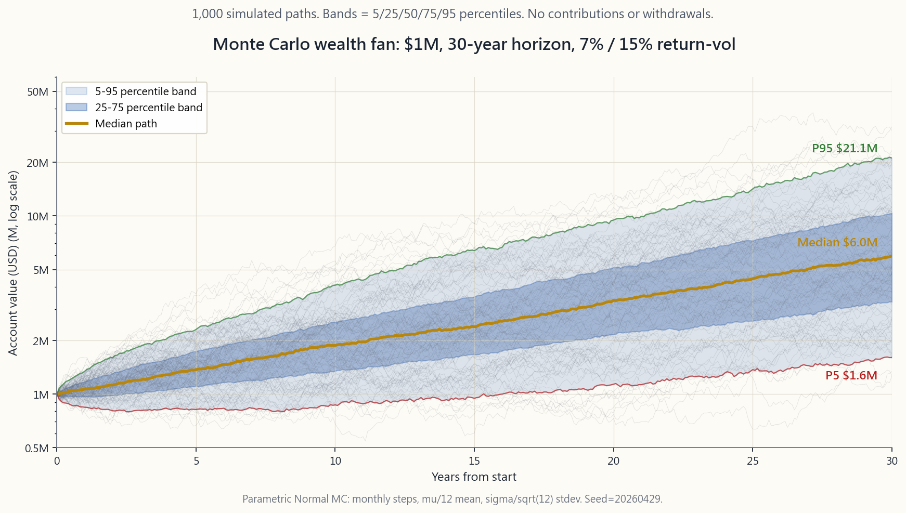
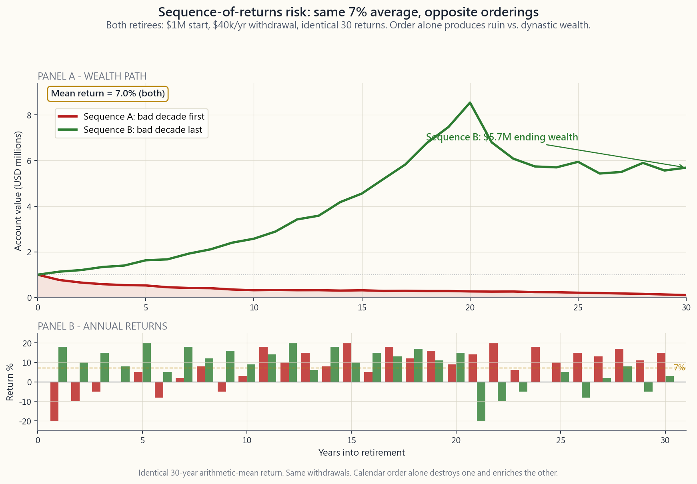

# 附加課 28：蒙地卡羅模擬——退休預測與回報次序風險陷阱

---

## 第一部分：閱讀章節

---

### 1. 為何這至關重要

你在網上看到的每一個退休預測——銀行的規劃工具、401(k)供應商的「你65歲時將擁有X元」小工具、財務顧問的幻燈片——都用同一套運算邏輯。輸入初始結餘、假設回報率、投資期限，按下按鈕，得出一個數字。*「以每年7%複利計算，30年後你的100萬美元將變成760萬美元。」*

這個數字是個謊言。不是因為數學算錯了——`1.07^30` 確實等於7.61——而是因為你實際生活的市場並非一個固定回報的儲蓄帳戶。它在某些年份帶來+30%的回報，在另一些年份則是-25%。時序至關重要：壞年頭**先來**還是**後到**，可以是你在銀行存款中安然離世，還是在78歲便彈盡糧絕的分別。單一數字的預測暗地裡假設平均回報以平穩、循規蹈矩的方式依序到來，但現實從未如此。

學習蒙地卡羅模擬有四大理由：

1. **相同的平均值可產生截然不同的結果。** 兩位退休人士的30年平均回報完全相同，但最終結果可能是分文不剩，或是累積400萬美元——差別僅在於回報到來的*次序*。這是個人理財中最被低估的風險。
2. **班根4%法則只是一個數字，源自一種技術** ——以美國1926至1976年數據為基礎的歷史自助抽樣法。Pfau（2020年）、Kitces及晨星採用較低的前瞻性回報所作的現代更新，將安全提款率壓低至**3.0%至3.5%**。若你的計劃假設4%，可能激進了50個基點。
3. **第95百分位的最差結果比中位數低30%至40%。** 按中位數規劃，即接受50%的成功概率。蒙地卡羅給你的是結果的*分佈*——形態與尾部——而非一個單點估計。
4. **波動的尾部主宰全局。** 尾部並非無足輕重的細節；它是提款階段的核心所在。累積期間30%的回撤是買入良機。退休後第三年的同等回撤，則是對終身消費能力的永久性削減。

---

### 2. 你需要掌握的知識

#### 2.1 假設回報與假設波動性，對比蒙地卡羅模擬

傳統退休預測是一條直線：

$$ W_T = W_0 \cdot (1 + \mu)^T - C \cdot \frac{(1+\mu)^T - 1}{\mu} $$

其中 $W_0$ 為初始結餘，$\mu$ 為假設回報率，$T$ 為投資期限，$C$ 為年度提款額。代入 $W_0 = 100萬美元$、$\mu = 7\%$、$T = 30$、$C = 4萬美元，公式輸出大約350萬美元的期末結餘。完畢。

問題在於，$\mu$ 並非一個固定數字，而是一個*分佈*。標普500指數的長期名義回報大約是10%，標準差為16%。在任何單一年份，回報最常落在-22%至+42%之間（一個標準差區間）。30年下來，*平均值*聚攏在10%附近，但*路徑*——各年回報到來的次序——卻變化萬千。

蒙地卡羅模擬以**數千條隨機路徑**取代那條單一直線。每次模擬：

1. 從符合假設回報率和波動性的分佈中，生成30個隨機年度回報（或360個月度回報）。
2. 以相同的初始結餘及供款／提款計劃，沿路徑複利計算。
3. 記錄期末結餘。

經過1,000至10,000次模擬後，你得到的是一個結果*分佈*。第50百分位是你的預期財富中位數。第5和第95百分位界定現實的預期範圍。路徑中期末結餘高於零的比例，即是你的**成功概率。**

對於每年提款4萬美元的計劃，95%成功率遠比「你的預期結餘是350萬美元」來得誠實。前者告訴你計劃可行；後者只告訴你*平均而言*可行，卻讓你自行發現——平均而言，人只死一次。

#### 2.2 回報次序風險——致命殺手

兩位退休人士同樣在65歲以100萬美元退休，計劃相同：每年提取4萬美元（按通脹調整）。兩人經歷的*30年年度回報完全相同*，唯一的分別是次序。甲先迎來艱難的第一個十年；乙則把艱難十年留到最後。

從數學角度來看，兩人的*算術*平均回報相同——日曆可以任意重排而不影響均值。但財富路徑卻截然不同。原因殘酷無情：**從下跌的投資組合提款，賣出的股份比從高位提款多。** 結餘70萬美元時提取4萬美元，被迫賣出5.7%的剩餘股份；同樣的4萬美元在結餘140萬美元時，僅佔2.9%。在低位賣出的股份*永久消失*——它們無法參與最終的反彈。

以一個構造的例子說明：頭十年平均每年-5%，後二十年平均每年+13%。30年算術均值達到7%。反轉次序：先有20年的+13%，再有10年的-5%。均值相同，波動性相同，歷史累計回報相同。

- **次序甲（先差後好）：** 投資組合迅速失血。第10年結餘約為27.8萬美元。隨後的回彈來得太遲——投資組合在**大約第24年耗盡**，即30年計劃結束前6年。甲身無分文而終。
- **次序乙（先好後差）：** 投資組合在20年間大幅複利增長至約800萬美元，其後在最後差劣十年中失血，但**以數百萬美元的家族財富收場。** 乙留下了一筆遺產。

均值相同。波動性相同。提款相同。初始結餘相同。**窮困而終與留下數代財富之間的差距，僅在於日曆次序。** 這就是回報次序風險，任何單一數字預測都無法捕捉它。

最易受到回報次序風險衝擊的退休人士，是提款初期五至十年內的人——此時結餘最大，提款正在蠶食本金。在第15至20年後，次序風險逐漸減弱——存活下來的投資組合通常已足夠龐大，進一步的回撤不足以令其崩潰。

#### 2.3 班根4%法則及其現代更新

1994年，加州南部的財務規劃師威廉·班根在《財務規劃期刊》上發表了《利用歷史數據確定提款率》一文。他進行了一項當時頗為新穎的研究：**對美國1926至1976年的實際歷史回報次序進行自助抽樣，模擬30年退休場景。** 他針對每個起始年份提出同一問題：在整個30年期間都能維持的最高固定通脹調整提款率是多少？

答案是50/50股債組合的**4.15%**。班根將其下調至**4.0%作為「安全」的經驗法則。** 該法則迅速取代了行業早前的慣例（大多數基於平均回報假設6%至7%的提款率，忽略了次序風險）。

4%法則是以**美國數據中最差的歷史30年期**為準則，而非中位數。班根樣本中最差的情況，是1966年開始退休——恰在1968至1981年滯脹十年前夕。這一次序——頭15年艱難，1982年後才見回升——是回報次序風險的典型惡夢。一個在1966年至1995年間倖存的投資組合，按班根邏輯，足以抵禦樣本中任何其他30年期。

三一研究（Cooley、Hubbard、Walz，1998年）在更寬廣的日期範圍和略有不同的投資組合上進行了相同研究，並以50/50股債組合的**96%歷史成功率**印證了4%這個數字。此後該法則廣為流傳。

但是：4%法則是**基於歷史自助抽樣得出的**，隱含了兩個巨大的前提假設：

1. 大約6.5%的歷史股票溢價將持續。
2. 大約5%的歷史30年期國債收益率將持續。

在2026年4月，這兩個假設均缺乏充分依據。來自嚴謹來源（先鋒、貝萊德、GMO、Research Affiliates）的前瞻性預期回報，美國股票集中在**名義5%至7%**，10年期國債約**4%至5%**——遠低於班根所用的歷史數據。韋德·Pfau的2020年更新研究《安全提款率：全面審視》利用前瞻性預期回報重新計算了班根研究，發現安全提款率下降至**3.0%至3.5%**。晨星2024年《退休收入現狀》報告，按當前估值對新退休人士得出的結論是**3.7%**。

實際意義：若你以4%法則設定退休目標，**你的儲備可能不足15%至30%。** 一位希望每年提取8萬美元的退休人士，在4%法則下需要200萬美元。在3.5%法則下，目標是229萬美元——所需退休儲備增加14%。在3.0%法則下，目標是267萬美元——增加33%。

#### 2.4 自助抽樣法對比參數蒙地卡羅法

蒙地卡羅模擬有兩種形式，選擇哪種比人們意識到的更為重要。

**參數蒙地卡羅法。** 假設回報服從參數分佈——最常見的是以假設的 $\mu$ 和 $\sigma$ 為參數的正態分佈。從分佈中生成隨機樣本，向前推算。

- 優點：簡單、快速、可無限延伸，數學清晰。
- 缺點：**分佈假設有誤。** 真實股票回報呈肥尾分佈（第42週——標普500月度回報的峰度約為7至15，而非正態分佈預測的3.0）。正態假設下的參數蒙地卡羅法系統性地低估了災難性結果的概率。

**自助抽樣蒙地卡羅法。** 從實際歷史回報次序中有放回地抽樣，無需分佈假設——由數據本身生成分佈。

- 優點：捕捉肥尾、捕捉資產類別間的實際相關結構、捕捉實際序列相依性（長期均值回歸）。
- 缺點：受限於歷史樣本。美國數據集中只有約三個獨立的30年窗口。未來未必重複過去。

一個實用的折中方案：採用**5至10年的區塊自助抽樣法。** 這保留了區塊內的實際相關性和序列結構，同時仍允許重新組合。這是Pfau、Kitces及大多數學術研究者的默認技術。

零售工具（先鋒的預測工具、嘉信理財的工具、典型的智能投顧）通常採用參數正態分佈蒙地卡羅，因為它更快、更簡單。尾部風險的低估是真實存在的，但在30年投資期限下通常影響較小（中央極限定理有所幫助），而安全提款率3%與5%之間的差距，主要取決於*回報假設*，而非抽樣方法。

#### 2.5 解讀輸出結果——成功概率

蒙地卡羅模擬的實際輸出，不是期末財富的中位數，而是**成功率**——計劃在整個投資期限結束前不耗盡資金的模擬比例。

業界慣例：

| 成功率 | 評估 |
|---|---|
| ≥ 95% | 計劃資金過於充裕。考慮增加支出或提早退休。 |
| 85-95% | 計劃穩健。正常目標區間。 |
| 70-85% | 計劃風險偏高。在提款安排上保留彈性。 |
| < 70% | 計劃存在根本問題。需增加儲蓄、延長工作年期或減少支出。 |

兩個關鍵細節：

1. **成功率是二元指標；** 它不能告訴你失敗的計劃是在第23年失敗（可透過兼職工作補救）還是在第5年失敗（災難性的）。失敗條件下的分析與成功率的標題數字同樣重要。
2. **第5百分位期末結餘**才應與第50百分位比較，而非與目標比較。一個成功率95%但第5百分位期末結餘僅5萬美元的計劃，在最差情景下幾乎沒有緩衝空間。一個成功率90%但第5百分位期末結餘達100萬美元的計劃，對突發情況的抵禦能力強得多。

本頁互動實驗室同時展示兩個數字——成功率及第5、50、95百分位終端財富。練習將它們配對閱讀。

#### 2.6 常見陷阱

幾乎所有零售退休預測中都會出現三個建模錯誤：

1. **假設回報服從正態分佈。** 真實股票回報呈負偏態和肥尾。以 $\sigma = 16\%$ 的正態模型計算，單年-32%的回報（-2個標準差）平均每44年才出現一次。但實際記錄顯示平均每15至20年就會發生一次，而且偶爾出現-45%的極端情況（1931年、2008至09年的累計跌幅）。詳見第42週。
2. **假設波動性恆定。** 波動性具有聚集效應。2017年的平靜市況實現波動性為6%；2008年則達40%。以恆定的 $\sigma = 16\%$ 建模，完全抹平了市況轉換，隱藏了「你的投資組合在開始提款那年下跌35%」的聯合事件。波動性的波動性（vol-of-vol）是真實風險，但參數蒙地卡羅完全忽略。
3. **忽略相關性的市況轉換。** 2003至2021年的股債負相關，令60/40投資組合在模擬中看起來固若金湯。2022年相關性翻轉至**+0.3**，實時推翻了所有60/40的回測。採用靜態相關矩陣的模型會低估危機時期的相關性，高估分散投資的效益——這對退休規劃而言恰好是最錯的方向。

三者的解決方法相同：**對真實歷史數據採用自助抽樣或區塊自助抽樣法**，並以最差歷史市況作為起點重新計算，對輸出結果進行壓力測試。問一問規劃師：「如果我在1966年那種環境下退休，成功率是多少？」

#### 2.7 在計劃中建立抗回報次序風險的能力

三種在現實生活中有效抵禦回報次序風險的結構性防禦：

1. **現金緩衝／雙桶策略。** 在股票倉以外持有2至3年的開支，以現金及短期國債形式存放。在熊市中，從緩衝部分提款，而非低價賣出股票。在好年頭補充緩衝。減少在低位被迫賣出；對長期回報的拖累較小（約30至50個基點）。
2. **浮動提款規則。** 不再固定每年提取4萬美元（按通脹調整），而是讓提款額隨投資組合結餘調整。最簡單的版本（Guyton-Klinger護欄規則）在某個差劣年份後提款率超過投資組合5%時，削減提款額10%；當提款率降至4%以下時，則提升10%。Pfau的研究發現，這可將安全初始提款率從3.5%提升至4.5%至5%，而成功概率保持不變。
3. **股票滑翔路徑。** 退休初期持有40%股票，在首15年內逐步提升至70%。這看似違反常規——大多數人會隨時間降低風險——但它明確*降低*了在回報次序風險最高的窗口期內的股票暴露，並在回報次序風險已減弱的退休後期*增加*股票暴露。Kitces與Pfau（2014年）的研究顯示，在相同提款率下，此策略可將成功概率提升2至4個百分點。

啞鈴策略應用於退休：保留兩年現金，穩如磐石；讓股票部分積極進取。現金及債券一側是為了*生存*；股票一側是為了*回報*。在整個退休期維持60/40的混合配置，兩者的好處都得不到——早期波動性太高，後期增長潛力太低。

---

### 3. 常見誤解

**1. 「蒙地卡羅模擬提供精確答案。」** 它提供的是概率分佈，遠比單點估計誠實，但分佈的質量取決於輸入假設。垃圾回報假設，產出垃圾蒙地卡羅結果。

**2. 「如果我平均每年7%回報，我就會達到7%的那條線。」** 並非如此。30年7%均值路徑的*中位數*大約在7%那條線附近，但*你的*特定路徑將偏離中位數2至3倍，不論上下。

**3. 「回報次序風險只在退休初期幾年才重要。」** 它在那時影響最大，但第5至15年的差劣十年同樣是致命的。風險窗口大約延伸至提款後的第15至20年。

**4. 「模擬次數越多，結果越準確。」** 超過約1,000至5,000次模擬後，蒙地卡羅誤差主要來自*模型誤差*（錯誤的分佈、錯誤的相關性），而非*抽樣誤差*。對一個設定有誤的模型進行10萬次模擬，只會讓你用更多小數位得出錯誤答案。

**5. 「4%法則是自然法則。」** 它只是一個特定自助抽樣研究、基於一個特定數據集所得出的特定結果。以前瞻性回報為基礎的現代更新，將安全提款率定在3.0%至3.5%。

**6. 「如果我的計劃成功率達95%，我便安全了。」** 成功率是二元指標。5%失敗路徑可以是災難性的失敗（第5年），也可以是邊緣性的失敗（第28年）。務必在關注標題成功率的同時，留意失敗條件下資金耗盡的年份。

**7. 「蒙地卡羅模擬涵蓋了所有因素。」** 它涵蓋了假設模型範圍內的回報波動性。它不涵蓋：模型風險、市況轉換、你自己的行為失誤（在2020年3月恐慌性拋售）、壽命不確定性、醫療費用衝擊或離婚。真正的退休規劃是蒙地卡羅模擬加上壓力測試再加上安全邊際。

**8. 「降低提款率就能解決計劃問題。」** 在數學上確實如此。但它無法解決實際的生活問題——你為每年8萬美元的退休生活而儲蓄，現在卻要靠6萬美元過活。修正計劃最好在*退休前*進行，而非退休後。

**9. 「如果回報不理想，我到時再調整。」** 有時可以，有時不行。健康狀況、家庭責任及勞動市場，都限制了晚年收入調整的彈性。浮動提款規則（Guyton-Klinger）將這種調整結構性地納入計劃，而非依賴臨時應對。

**10. 「蒙地卡羅模擬取代了回測。」** 兩者互補。回測顯示過去實際發生了什麼；蒙地卡羅顯示在假設動態下*可能*發生什麼。一個能同時通過1929至1959年自助抽樣回測，以及以前瞻性回報為基礎的參數蒙地卡羅壓力測試的計劃，才是經過雙重驗證的計劃。只能通過其中一項的，根本未經充分測試。

---

### 4. 問答環節

**問1：我應該進行多少次模擬？**

**1,000至10,000次。** 低於1,000次，百分位估計的噪聲太大（100條路徑的模擬中，第5百分位的置信區間很寬）。超過10,000次，邊際信息量很小，而運行時間線性增長。大多數零售工具運行1,000次；機構規劃師運行10,000次或更多。

**問2：我應該使用什麼回報假設？**

美國股票在2026年4月：**預期名義回報5%至7%**（先鋒資本市場假設：4.5%至6.5%；貝萊德：6%至7%；GMO 7年預測：美國大型股約3%實質回報，國際股及價值股較高）。債券方面：大約以當前10年期收益率（2026年4月約4.0%至4.3%）加0至50個基點信用風險溢價計算。請勿使用標普500歷史10%的均值——它包含了1980至2000年估值擴張的成分，此後難以重演。

**問3：應採用什麼波動性假設？**

**標普500長期名義波動性約為16%。** 平衡的60/40投資組合約為10%至11%。本頁實驗室預設15%——對100%股票而言略顯樂觀，但對大多數退休人士實際持有的偏重股票組合而言算是合理的。

**問4：我應該將通脹納入模型嗎？**

應該。最簡單的方法是以今天的購買力折算一切：使用*實質*預期回報（從名義回報中扣除預期通脹2%至2.5%），並以今天的美元維持固定提款額。輸出結果可直接與你當前的消費對比。實驗室隱含地這樣做——將輸入改為實質回報，分析即可成立。

**問5：如何在預測中處理稅務？**

對大多數預測而言，稅務是一個固定的拖累——從個人退休帳戶提取的4萬美元稅前收入，在22%稅率下僅有3.1萬美元可供消費。你可以（a）將提款目標調整為稅後金額，或（b）使用稅後預期回報。對於混合稅務帳戶（應稅帳戶＋401k＋Roth），提款次序至關重要，最好以稅務感知型預測工具處理（如NewRetirement、ProjectionLab，或美國稅務局的精算試算表）。

**問6：社會保障金應如何處理？**

將其視為固定的通脹調整收入流，可減少投資組合所需的提款額。假設在8萬美元生活開支需求中，每年3萬美元社會保障金讓投資組合只需提供5萬美元——即100萬美元投資組合的5%提款率，遠比4%標題規則激進得多。投資組合承擔的是*邊際*支出；社會保障金是底線保障。

**問7：我應該使用參數蒙地卡羅法還是自助抽樣法？**

**區塊自助抽樣法**是學術標準。大多數零售工具因速度和便捷而採用參數正態分佈法。在30年投資期限下，兩者在成功率上的差異不大（約1至2個百分點）。回報*假設*的影響遠大於抽樣方法的選擇。

**問8：我應該多久重新運行一次模擬？**

至少每年一次，任何重大人生變化後，以及市場任何方向超過15%的波動後。2019年合理的計劃（預期回報8%、利率0%）在2026年已不再合理（股票回報較低、利率4%）。靜態蒙地卡羅是快照；計劃是一個持續的過程。

**問9：美國歷史上最差的次序是什麼，我應該據此進行壓力測試？**

**1966年開始退休的情景。** 1968至1981年的滯脹、1982年前以實質計算的失落十年，其後才見回升。60/40投資組合以4%通脹調整提款率，從1966年退休後存活了30年，但期末結餘極低。5%提款率則宣告失敗。1966年退休群體是班根研究中最差的情形，也是回報次序風險的典型惡夢場景。

**問10：哪裡可以免費進行嚴肅的蒙地卡羅模擬？**

本頁的互動實驗室是教育版本。若要做真實規劃：**Portfolio Visualizer**（免費，可在零售層面運行參數及自助抽樣蒙地卡羅法）、**NewRetirement**（免費版；具稅務感知功能）、**ProjectionLab**（付費；靈活性最高）。避免使用單一數字預測工具——若不顯示分佈，即代表完全未對回報次序風險建模。

**問11：第95百分位最差結果真的重要嗎？**

**重要。** 那就是你90歲時僅剩5萬美元的情景。按中位數規劃，即接受在死亡前耗盡資金的50%概率——這是一個你在生活其他任何方面都不會明知故犯去接受的災難性結果。運行蒙地卡羅的全部意義，就在於*看見*分佈的底部，並設計計劃以抵禦最差情景。

**問12：用一句話總結的要點是什麼？**

單一數字退休預測是錯誤且危險的；蒙地卡羅以誠實的結果分佈取代它；回報到來的次序與其平均值同等重要；現代安全提款率更接近3.5%而非4.0%；而現金緩衝、浮動提款及股票滑翔路徑等防禦措施，可在維持成功概率的前提下將提款率拉回較高水平。
