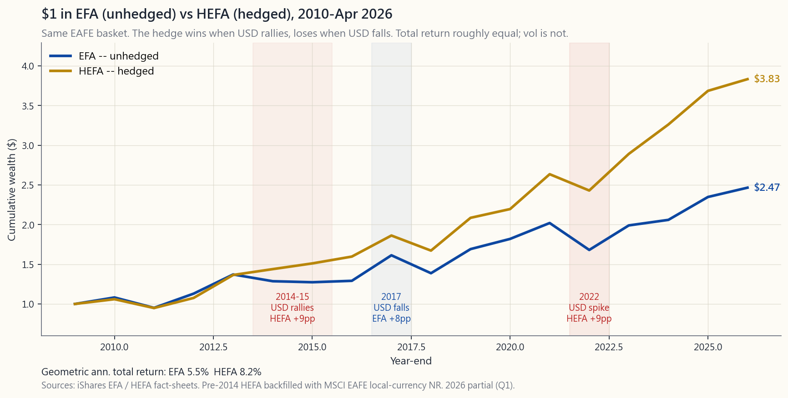
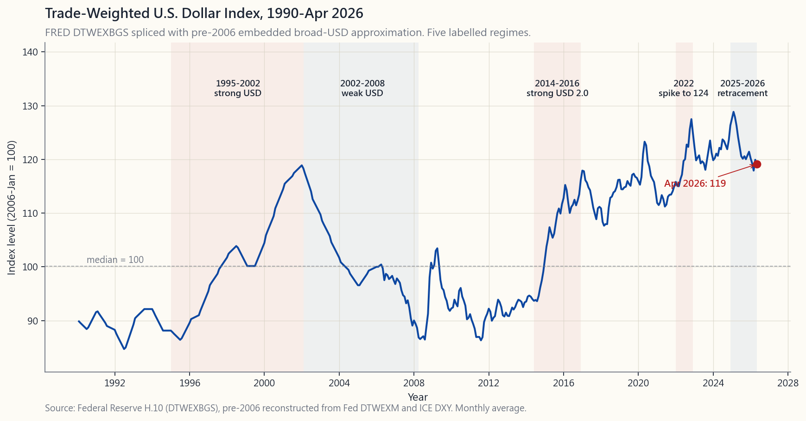

# 附加課程29：貨幣對沖——何時對沖、如何對沖，以及保險的成本

---

## 第一部分：閱讀章節

---

### 1. 為何此課題至關重要

附加課程18已先給出結論：本課程推薦的投資組合僅限美國上市股票。那麼為何還要專門用一整節附加課程講解貨幣對沖？因為**美國專一原則針對的是股票，而非債券，且存在例外情況。**一旦你將資金投向美國以外的任何資產——EAFE板塊、國際債券基金、外幣存款、持有美國存託憑證的瑞士控股公司——無論你是否願意，貨幣計算就已重新進入你的投資組合。

以下四個原因說明此課題值得單獨一節課深入講解，而非一筆帶過：

1. **「國際投資不作對沖」的慣性反應，對國際債券而言是錯誤的預設立場。**對於股票，這一通說大致上尚可接受（貨幣波動性約為每年7-9%，相對於股票波動性約每年16%尚屬輕微，且10年以上的外匯回報預期大致為零）。對於投資級別境外債券，貨幣波動性**超過資產本身的波動性**——一隻收益率4%、貨幣波動性達8%的德國聯邦債券，其夏普比率比美國國債更低。若你持有非美國債券而不作對沖，你實際上已不知不覺地將固定收益板塊變成了外匯交易。
2. **對沖成本並非無關痛癢，而是可量化的確實費用。**拋補利率平價使一年期貨幣對沖的成本大致等於*利率差*。當美國國庫券收益率為4.3%、日本國庫券收益率為0.3%時，一年期美元/日圓對沖實際上可*為你帶來*約4個百分點的回報；當歐元區利率在2008-2009年短暫超越美國利率時，對沖則*耗費*你約50個基點。掌握這個數字，將「是否應該對沖」從一種感覺變成一道計算題。
3. **對沖交易所買賣基金既有且價格低廉。**HEFA（iShares EAFE對沖版本）開支比率為35個基點；HEDJ（歐洲對沖）和HEWJ（日本對沖）亦在同一水平。對沖機制——滾動一個月遠期合約——並非什麼深奧工具，而是一項你可以透過一個代碼選擇買入或放棄的現成功能。零售工具包已完全配備。
4. **美元走勢呈長期週期性波動，而非隨機噪音。**美元指數（DXY）在2002-2008年下行，2008-2014年橫盤整理，2014-2022年急升，2024-2026年回落。這些是*六至十年*的週期——長到足以讓一次判斷失誤就耗盡你一段投資生涯的複利優勢。你無需預測下一個週期，但可以根據過去三個週期調整規模。

本課程並非要你一定對沖，而是讓你清楚看到取捨在哪裡、邊緣情況在哪裡，以及在你決定值得對沖時應選用哪些交易所買賣基金。

---

### 2. 你需要掌握的知識

#### 2.1 雙重投注的分解

你每投入外國資產的一美元，實際上是在下兩個注：

1. **資產的本幣回報** — 以本國貨幣計算的股票或債券回報。
2. **貨幣回報** — 持倉期間該本幣對美元匯率的變動。

以美元計算的實際回報為兩者的乘積：

$$
1 + R_{\text{USD}} \;=\; (1 + R_{\text{本幣}}) \times (1 + R_{\text{外匯}})
$$

當回報較小時，交叉項可忽略不計，分解近似為加法：$R_{\text{USD}} \approx R_{\text{本幣}} + R_{\text{外匯}}$。舉個實例：2024年日經225指數以日圓計算回報約為+19.2%；日圓對美元貶值約11%；因此未對沖的美元回報約為$(1.192)(0.89) - 1 \approx +6.1\%$。日本投資者看到的是+19%，持有同一股票而未作對沖的美國人看到的是+6%，而持有對沖版本的美國人看到的則大約是+19%減去對沖成本。

在外匯與本幣回報相互獨立的假設下，波動性的分解公式為：

$$
\sigma^2_{\text{USD}} \;=\; \sigma^2_{\text{本幣}} + \sigma^2_{\text{外匯}}
$$

對於未對沖的已發展市場股票，大約是$16^2 + 8^2 = 17.9\%$——比本幣波動性高出約12%。對於未對沖的已發展市場七年期債券，則是$5^2 + 8^2 = 9.4\%$——波動性是基礎資產的**兩倍**。外匯因素對債券的影響在性質上遠比對股票重大。

#### 2.2 對沖交易所買賣基金的實際運作

「貨幣對沖」交易所買賣基金持有境外一籃子資產，*同時*賣出等值名義本金的一個月期境外貨幣遠期合約。每逢月底，遠期合約到期，已實現的外匯盈虧以美元結算，並開立新的遠期合約。機械效果如下：在每次滾動之間的一個月內，美元回報幾乎與本幣回報一致，僅略有因遠期定價而產生的小幅拖累。

這一拖累即**利率差**，由拋補利率平價決定，等於即期匯率與遠期匯率之間的百分比差距：

$$
\text{遠期}/\text{即期} \;\approx\; \frac{1 + r_{\text{境外}}}
{1 + r_{\text{美國}}}
$$

換算為年化對沖成本：

$$
\text{對沖成本（每年）} \;\approx\; r_{\text{美國}} - r_{\text{境外}}
$$

這是一個有符號的數字。若美國短期利率超過境外利率（2026年4月的現況：美國4.3%、歐元區2.0%、日本0.5%、英國4.0%），對沖將**賺取正向利差**——對歐元約2.3%，對日圓約3.8%——費用扣除交易所買賣基金自身開支比率之前皆如此。若利差倒掛（美國零利率時代2009-2015年對比全球大部分地區），對沖會消耗利差——但此情況罕見且幅度較淺，對主要貨幣通常在0至50個基點之間。

三個必須了解的工具：

- **HEFA** — iShares貨幣對沖MSCI EAFE。開支比率35個基點。資產管理規模約80億美元。EFA的對沖版本，可與未對沖版本並列作比較。
- **HEDJ** — WisdomTree歐洲對沖股票。開支比率58個基點。資產管理規模約20億美元。傾向歐洲出口導向型企業（西門子、阿斯麥、路易威登、賽諾菲）。
- **HEWJ** — iShares貨幣對沖MSCI日本。開支比率35個基點。資產管理規模約4億美元。EWJ的對沖版本。

35個基點的開支比率是在基礎一籃子資產本身成本之上額外收取的。對沖機制本身還會在任何利差信號之外，再增加約5至10個基點的磨耗成本（每月滾動、遠期合約的買賣差價）。

#### 2.3 長期等效定理

一項穩健的實證規律：在滾動的10至20年窗口內，**對沖與未對沖國際股票回報每年相差大約僅10至30個基點。**機制顯而易見——在足夠長的時間跨度上，實際匯率向購買力平價回歸，因此未對沖回報中外匯部分的累積貢獻平均大約為零，兩種方式最終都只剩資產回報本身。

**不**會趨同的是：**波動性與回撤。**對沖板塊自2002年以來一直保持較低的實際波動性（EAFE約16%對18%）和較淺的最大回撤。因此，長期取捨歸結為：預期回報相同，波動性更低——即對沖板塊的夏普比率更高。這是數據中罕見的「免費午餐」，而獲取它的成本僅為35個基點的開支比率。

大多數零售顧問仍建議「國際投資不作對沖」，原因在於行為因素而非數學邏輯。在美元貶值週期中持有HEFA意味著*跑輸*EFA的表現，而客戶即使在總回報夏普比率更高的情況下，也會因跑輸基準而解僱顧問。不受此制約的機構資金，會對大約50%至75%的非美國股票敞口進行對沖。

#### 2.4 短期視角：五個影響重大的週期

以十年為單位的窗口，才是對沖與否的決策真正體現於投資賬單的地方。1990年後的紀錄：

- **1995-2002年——美元強勢。**DXY從80升至120。未對沖的非美國投資相對對沖版本承受損失。未對沖的淨代價：每年約3至4%，持續七年。
- **2002-2008年——美元弱勢。**DXY從120跌至71。未對沖版本每年*勝出*約3至4%。正是這個週期鎖定了教科書上「國際投資不作對沖」的建議。
- **2014-2016年——美元強勢2.0。**聯儲局縮減購債與歐洲央行量化寬鬆政策分化，DXY在18個月內從80升至100。HEFA累積跑贏EFA約9個百分點。
- **2017年——美元弱勢。**特朗普稅改樂觀情緒消退，DXY下跌10%。未對沖EFA回報25%；HEFA回報17%。未對沖版本在單一年度勝出8個百分點。
- **2022年——美元強勢3.0。**聯儲局在全球衰退背景下累計加息525個基點，DXY創2002年以來高位114。HEFA錄得-7.8%；EFA錄得-16.8%。對沖減少了9個百分點的回撤。
- **2024-2026年——美元回調。**DXY從107逐步回落至99。未對沖EFA表現略勝。目前2026年4月的格局，是兩者均無明顯優勢的典型週期。

規律顯示：週期持續時間長（5至10年），期間幅度大（每年累積3至4%），且事前無從預判。這正是為何對沖是一個真正的資產配置問題，而非純粹的「永遠要」或「永遠不要」。

#### 2.5 美國專一原則的豁免情況：國際債券

附加課程18的美國專一股票原則有一個重要的例外：**若你持有任何非美國固定收益資產，你應該對其進行對沖。**

根據第2.1節的數學推導：一個收益率4至5%的非美國投資級別債券板塊，本幣價格波動性約為5%，貨幣波動性約為8%。合計後，未對沖板塊的波動性*超過*債券的當期收益率——意味著外匯因素佔主導地位。你持有的工具，宣傳材料稱之為「固定收益」，但其表現卻如同一個附帶票息的外匯交易工具。

對沖國際債券交易所買賣基金：

- **BNDX** — 先鋒全球國際債券基金。開支比率7個基點。資產管理規模約500億美元。美元對沖。若有意持有任何非美國固定收益，這是首選。
- **IAGG** — iShares核心國際綜合債券。開支比率7個基點。美元對沖。BNDX的主要競爭對手。

請注意，兩者均在產品層面*預設進行對沖*——市場上沒有任何有意義的資產管理規模的未對沖國際投資級別債券交易所買賣基金，因為這些產品的買家正是已在本節所講內容上做過功課的機構。

本課程的實際立場：持有VGIT / IEF / TLT作為存續期管理，只有在需要非美國信用/存續期分散投資時才考慮BNDX。對大多數零售投資組合而言，答案是「完全略過BNDX；一旦兩種工具均以美元對沖後，分散投資效益其實很小。」但若你決定持有，切勿選擇未對沖版本。對於以美元消費的投資者而言，未對沖的非美國投資級別債券板塊在任何情況下都不是最優選擇。

#### 2.6 最優對沖比率：決策樹

你不必在0%對沖或100%對沖之間二選一。令投資組合波動性最小化的對沖比率$h$，由未對沖回報對外匯回報的回歸係數給出——有其封閉形式解：

$$
h^* \;=\; 1 + \rho \cdot \frac{\sigma_{\text{本幣}}}{\sigma_{\text{外匯}}}
$$

其中$\rho$為本幣資產回報與外匯回報之間的相關性。對已發展市場股票而言，$\rho$通常略為正值（約+0.1至+0.2），因此$h^*$略高於1.0——即完全對沖。對商品及新興市場股票而言，$\rho$通常為負值（本地市場在本幣貶值時也會下跌），因此$h^*$遠低於1.0——即部分對沖或不對沖。

本課程採用的實用決策準則：

| 板塊 | 建議對沖比率 | 工具 |
| --- | --- | --- |
| 美國上市股票 | 不適用 | VTI/SPY |
| 美國上市存託憑證 | 0% | TSM、ASML等 |
| 非美國投資級別債券 | **100%** | BNDX、IAGG |
| 非美國已發展市場股票 | 50-100% | HEFA + EFA組合 |
| 新興市場股票 | 0-50% | EEM未對沖或HDEM部分對沖 |
| 以美元計價的商品 | 0% | DBC、PDBC |
| 以美元計價的黃金 | 0% | GLD、IAU |

非美國股票50-100%的範圍故意設得較寬。這反映了在本課程框架內，你本就不應持有大規模非美國板塊——若你確實持有，在50/50與100/0之間如何選擇，主要取決於你對行為層面追蹤誤差的容忍度，而非預期回報的差異。

---

### 3. 常見誤解

1. **「對沖很昂貴。」**當美國利率超過境外利率（2008年以來的常態），對沖實際上*賺取*正向利差。所謂「費用」只是交易所買賣基金本身約35個基點的開支比率。
2. **「對沖是在賭美元走勢。」**恰恰相反。*不*對沖才是在對美元押注。對沖消除外匯風險，讓你只持有基礎資產。
3. **「遠期匯率可預測未來即期匯率。」**並不能。遠期匯率由拋補利率平價中的利率差決定。實證顯示，到期時的即期匯率與遠期匯率零相關——即所謂的「遠期溢價之謎」。
4. **「貨幣波動性在10年內會相互抵消。」**累積外匯回報的貢獻在10年以上確實大致趨近零。但波動性的貢獻並不如此——它在整段持倉期間持續加大你的月度回撤。
5. **「國際債券提供貨幣分散投資。」**它們提供的是貨幣*風險*。若你想要貨幣分散投資，應直接買外匯產品，而非債券+外匯的組合。
6. **「對沖交易所買賣基金使用了槓桿。」**並沒有。遠期合約部分由基礎一籃子資產提供完整抵押。交易對手風險存在，但通常只佔資產淨值的極小百分比。
7. **「DXY衡量美元對所有貨幣的走勢。」**DXY是ICE美元指數，包含六種貨幣（歐元57.6%、日圓13.6%、英鎊11.9%、加元9.1%、瑞典克朗4.2%、瑞士法郎3.6%）。美聯儲的廣義DTWEXBGS指數涵蓋26個貿易夥伴，包括人民幣和墨西哥比索，是衡量美元經濟強度更準確的指標，也是對沖EAFE交易所買賣基金的管理人實際交易所追蹤的指數。
8. **「我是長期投資者，無需對沖。」**這只對非美國股票成立，且前提是在長期視角下資產波動性佔主導地位。對非美國債券則不然——在任何時間跨度下，外匯波動性都是*更大*的組成部分。
9. **「對沖使我損失了利率差帶來的收益。」**恰恰相反。利率差成為對沖利差。你無法在不承擔外匯敞口（而該敞口平均會抵消收益）的情況下，獲取較高的境外收益率。
10. **「直接買幾隻外國股票就好，保持簡單。」**你將面臨分散投資不足、繳納境外預扣稅，且沒有簡便方式進行對沖等問題。持有任何非美國敞口，應使用美國上市交易所買賣基金（對沖或未對沖）。

---

### 4. 問答環節

**問題1：我的強積金帳戶持有VXUS，是否應轉換為對沖版本？**
對於持有10年以上的股票板塊，對沖與未對沖的長期預期回報幾乎相同。若你的強積金提供開支比率低於50個基點的對沖已發展市場選項，夏普比率會稍好。若沒有，繼續持有VXUS即可——最差的做法是「賣出以追逐近期贏家」。本課程的立場不變：首先應盡量減少非美國股票板塊的比重。

**問題2：美國利率4.3%，日本利率0.5%，現在是對沖日圓敞口的好時機嗎？**
就狹義而言，是的——利差約為每年+3.8%，對你有利。但這一利差*已計入遠期匯率*，而對沖交易所買賣基金正是按此遠期匯率買入。利差體現為對沖比率每個月機械性地對你有利，這也是為何HEWJ在日本央行維持近零利率以來，能夠與以日圓計算的EWJ走勢高度吻合。

**問題3：DTWEXBGS與DXY有何分別？**
DXY是ICE美元指數，涵蓋六種貨幣，歐元權重約58%，1973年推出。DTWEXBGS是美聯儲的貿易加權廣義商品+服務指數，涵蓋26種貨幣（包括人民幣和墨西哥比索），每年重新校準。DTWEXBGS是衡量美元經濟強度的更佳指標；DXY則是金融市場密切關注的指標（也是對沖EAFE交易所買賣基金管理人實際交易的參考）。

**問題4：我可以自行用期貨對沖貨幣敞口嗎？**
可以，但並不值得。/6E（歐元期貨）每份合約名義價值12.5萬美元；按季滾動會產生追蹤誤差，且按照第1256條款享有稅務處理（60/40長期/短期資本增值，詳見第39週）。對於規模低於500至1,000萬美元的板塊，35個基點的HEFA開支比率比自行操作的運作成本更划算。

**問題5：為何對沖交易所買賣基金有時在美元上升期間仍跑輸未對沖版本？**
原因有三：（1）對沖每月重置，因此在美元整體趨勢內，月內的外匯波動可能出現與預期相反的情況；（2）交易所買賣基金的開支比率比未對沖版本高出30至40個基點；（3）遠期滾動產生小幅買賣差價成本。

**問題6：課程說美國專一，為何還要教我如何對沖？**
美國專一原則針對的是股票建議。豁免情況包括：（甲）美國上市存託憑證（已以美元計價，無需對沖）；（乙）若你選擇持有的國際投資級別債券（此時應永遠對沖）；（丙）堅持配置10至20%非美國股票板塊的少數投資者（此時對沖決策至關重要）。本課程的設立是為了完整性，而非建議增加非美國敞口。

**問題7：新興市場貨幣（印度盧比、巴西雷亞爾、南非蘭特）又如何？**
大多數主要新興市場貨幣在零售規模下沒有流動性充裕的遠期市場。EEM等新興市場股票交易所買賣基金因結構原因是未對沖的。少數對沖新興市場產品（HEEM已於2018年退市）最終失敗，原因是新興市場貨幣對美元的利差為*正*——即對沖每年令你損失3至5%的收益率，而新興市場股票與新興市場外匯的相關性極為負向，意味著未對沖的部位本身已有一定的自我分散效果。

**問題8：巴郡哈撒韋會對沖其外匯敞口嗎？**
出了名地幾乎從不對沖。巴菲特的觀點是，購買力平價在長期內會回歸，因此在巴郡數十年的持倉期內，對沖成本最終是一種無謂損失。以巴郡的規模和時間跨度而言，此論點尚屬合理。對於持倉期10年、且對十年內最大回撤有一定容忍上限的零售投資者，則不然。

**問題9：在貨幣危機中，我的對沖會發生什麼？**
遠期合約部分在到期時以美元結算，即使境外貨幣貶值50%亦然。交易對手風險極小（遠期合約由主要交易商提供充足抵押）。更大的風險在於，危機期間境外基礎資產也同樣崩潰——1998年亞洲金融危機令新興市場債券下跌約30%，無論是否對沖皆然，因為本幣板塊本身才是災難所在。

**問題10：為何拋補利率平價在極端壓力下不會崩潰？**
確實會。2008年底美元融資壓力令拋補利率平價偏差擴大至數百個基點（即所謂「美元基差」）。這對零售投資者影響不大，因為對沖交易所買賣基金的市場價格會實時反映此壓力，你可以按資產淨值賣出而無需自行滾動遠期合約。這一問題影響的是從事跨貨幣附買回交易的優先證券商，與普通投資者無關。

**問題11：第1256條款的稅務處理如何適用於貨幣對沖？**
對於部分對沖交易所買賣基金內部使用的期貨，確實適用——但交易所買賣基金的架構已全部處理完畢。你從對沖交易所買賣基金收到的1099表格，與其他任何交易所買賣基金一樣，只顯示普通分配及資本增值。你不會直接看到第1256條款的機制。（自行操作期貨的相關版本詳見第39週。）

**問題12：有沒有供非美元投資者使用的「對沖標準普爾500」產品可以了解？**
有——歐洲交易所有IWDA的對沖變體，亞洲投資者也有類似的美元對沖標準普爾500產品，讓他們持有的美國股票可換算回本國貨幣。這是HEFA的鏡像版本。對於居住在美國的投資者而言（消費以美元計算）並不適用，但若你在向非美國朋友提供建議時，了解這一點會有所幫助。

---

## 第二部分：YouTube影片腳本

---

**影片標題：** 貨幣對沖——當外匯尾巴搖動債券狗的時候

**目標片長：** 約14分鐘

**主持人：** 陳馬、小魚

---

**[開場]**

小魚：歡迎回來。今天的附加課程是貨幣對沖——何時對沖、如何對沖，以及它究竟需要付出多少成本。陳馬，你說了28週這個課程只限美國上市股票。那為何我們要用整整一節課來講對沖境外敞口？

陳馬：兩個原因。第一，美國專一原則針對的是*股票*。豁免情況是債券——如果有觀眾在投資組合中持有國際固定收益，他們需要聽清楚我們接下來要講的數學。第二，即使在美國專一的框架內，你有時也會不經意地持有非美元敞口：一家瑞士控股公司、一隻收入以日圓計算的日本存託憑證、一處境外物業。本課程的思維框架能讓你準確評估這些風險的規模。

小魚：所以這是「邊緣情況」的課程，而不是「建立全球投資組合」的課程。

陳馬：正是。我們並非在推翻附加課程18的內容，而是為邊緣情況提供工具箱。

---

**[第一節：雙重投注的分解]**

小魚：先帶我了解數學。我買了一隻日本股票。

陳馬：你下了兩個注。一個押股票，一個押日圓。美元回報可以分解為：一加上本幣回報，乘以一加上外匯回報，再減去一。以2024年為例：日經指數以日圓計上漲了19%。日圓對美元貶值11%。因此未對沖的美元回報為1.19乘以0.89再減去1，約等於+6.1%。日本投資者看到19%，美國投資者看到6%，差距就是外匯那一腳。

小魚：單是貨幣就帶來了13個百分點的差距。

陳馬：在一年之內，在一隻已發展市場股票上。波動性也以同樣的方式分解。假設兩腳大致獨立，把方差相加。對已發展市場股票而言，本幣波動性16%，外匯波動性8%，總波動性是16的平方加上8的平方開根號，約17.9%。比本幣波動性高出約12%。對於投資級別境外債券，是5的平方加上8的平方，得出9.4%。外匯那一腳令債券的波動性*翻倍*。

小魚：所以對股票而言，貨幣是配菜。對債券而言，它才是主菜。

陳馬：這就是關鍵所在。任何持有非美國債券而不作對沖的人，實際上已不知不覺地將固定收益板塊變成了外匯交易。外匯波動性與資產波動性的比值，是這裡唯一重要的指標。

---

**[第二節：對沖交易所買賣基金的運作原理]**

小魚：對沖交易所買賣基金的實際運作是怎樣的？說說具體機制。

陳馬：它持有境外一籃子資產——與EFA的股票相同——並在每月底就每種境外貨幣按籃子權重賣出一個月期遠期合約。遠期合約到期後，外匯盈虧以美元結算，再開立新合約。機制上，那個月的美元回報幾乎與本幣回報一致，誤差只有幾個基點。

小魚：那成本呢？

陳馬：這正是精妙之處。拋補利率平價說，遠期價格等於即期價格乘以一加境外利率除以一加美國利率的比值。換算過來，年化對沖成本大約就是美國利率減去境外利率。以2026年4月的數字為例：美國短期國庫券收益率4.3%，歐元區利率2.0%，日本利率0.5%。對沖歐元賺取+2.3%的利差。對沖日圓賺取+3.8%的利差。加上交易所買賣基金35個基點的開支比率。2008年以來的常態是正向淨利差。

小魚：等等——對沖竟然是在*賺錢*？

陳馬：當美國利率高於境外利率時，是的。「對沖很昂貴」這個誤解，源於美國利率低於境外利率的那個時代。那個時代短暫存在——2008至2009年對歐元區，當時歐元區利率比美國高出50個基點。成本也許只是每年50個基點，微不足道。

小魚：那有哪些產品？

陳馬：EAFE用HEFA，歐洲用HEDJ，日本用HEWJ。開支比率都在35至58個基點範圍內。國際投資級別債券用BNDX和IAGG——兩者預設均已對沖，開支比率7個基點。

[VISUAL: image/side29_hedged_vs_unhedged.png]

小魚：這張圖比較了EFA和HEFA從2010年至今的走勢。我看到了什麼？

陳馬：兩個分叉再匯合的週期。2014至2015年，美元指數從80升至100。HEFA累積跑贏EFA約9個百分點。然後2017年，歐元走強，HEFA在單一年度跑輸8個百分點。然後2022年，美元指數急升至114，HEFA幫你減少了約9個百分點的回撤。到2026年4月，兩條路徑最終相差幾個百分點以內。整段期間波動性持續較低，但過程中的路徑才是真正的考驗。

---

**[第三節：美元的歷史週期]**

[VISUAL: image/side29_dxy_history.png]

小魚：這是美元的長期走勢，從1990年到2026年4月。

陳馬：五個週期。1995至2002年美元強勢，廣義指數高峰約120。2002至2008年美元弱勢，一路跌至71——這就是教科書建議「國際投資不作對沖」的案例。2008至2014年橫盤整理。2014至2016年美元強勢2.0——聯儲局縮減購債與歐洲央行量化寬鬆政策的分化。然後是2022年加息週期下的急升至114。現在是2024至2026年的回調。關鍵在於：週期*很長*，五至十年。幅度很大，每年累積三至四個百分點。且事前無從預判。

小魚：所以策略問題是「我們現在正在進入哪個週期」。

陳馬：不管你是否意識到，你都在下這個賭注。對沖比率的決策，是你有意識地調整這個賭注規模的唯一方式。

---

**[第四節：債券的豁免規則]**

小魚：閱讀材料的第2.5節是實操上的關鍵結論。規則是什麼？

陳馬：若你持有任何非美國投資級別債券，一律對沖。100%對沖。用BNDX或IAGG，兩者均為7個基點。對於以美元消費的投資者，未對沖的非美國投資級別債券在任何情況下都不是正確選擇。

小魚：其餘的配置矩陣呢？

陳馬：美國股票——不適用，你已持有美元資產。存託憑證——已以美元計價，無需對沖。新興市場股票——本地市場與本地貨幣之間的相關性極為負向，未對沖的部位一定程度上已自我分散，0至50%對沖均合理。以美元計價的商品、以美元計價的黃金——已是美元資產。若你堅持持有非美國已發展市場股票——若必須持有，對沖50至100%，而在本課程框架內，你本來就不應持有大規模板塊。

小魚：讓我挑戰一下你。教科書說「股票板塊的國際投資不作對沖」。教科書錯了嗎？

陳馬：教科書在長期預期回報方面是對的，在夏普比率方面是錯的。對沖與未對沖在10至20年的總回報上趨近。對沖版本在整段期間的波動性*更低*。夏普比率更高。顧問建議不對沖的原因是行為因素——客戶因追蹤誤差而解僱你，而不是因夏普比率低而解僱你。不受此制約的機構資金，對沖50至75%。跟隨機構，而非零售宣傳冊。

---

**[第五節：互動環節]**

小魚：帶我們走一遍互動實驗室。

陳馬：四個滑桿：境外資產在投資組合中的比重、預期美元走勢、境外利率、美國利率。實驗室會給出四個輸出：對沖回報、未對沖回報、對沖成本或利差，以及令波動性最小化的對沖比率。把境外利率拖至低於美國利率，你會看到利差轉為正值——那就是2026年的常態格局。把美元走勢拖至強勢正向，未對沖的路徑會崩潰；拖至負向，未對沖版本勝出。把境外資產比重拖至零，整個計算歸零，因為根本沒有需要對沖的東西。

小魚：玩過之後有什麼體會？

陳馬：兩點。第一，對沖成本那條線大致與利率差呈線性關係——這是拋補利率平價的視覺化呈現。第二，最優對沖比率對你對美元方向的*預測*幾乎不敏感——它是由*波動性*決定的，而非方向性判斷。人們以為對沖是在賭美元走向。數學卻說，對沖是在追求*更低的方差*。

---

**[結語]**

小魚：幫我總結一下。三條規則。

陳馬：第一——美國股票和美國上市存託憑證，對沖比率為零，因為根本沒有東西需要對沖。第二——非美國投資級別債券，永遠100%對沖；外匯那一腳比資產本身還大。第三——若你確實持有非美國已發展市場股票，對沖50至100%，但根據美國專一原則，你本就不應大規模持有。

小魚：那成本呢？

陳馬：大約等於利率差。2026年4月，對主要境外貨幣每年產生約2至4%的正向利差。對沖不只是免費——在2008年以來的常態格局中，它實際上帶來小幅正向利差。35個基點的交易所買賣基金開支比率在這個背景下只是四捨五入的誤差。

小魚：下一節是附加課程30。

陳馬：那是總結課——談倖存者偏差，以及這個課程中*刻意未說*的事情。到時見。

[完]