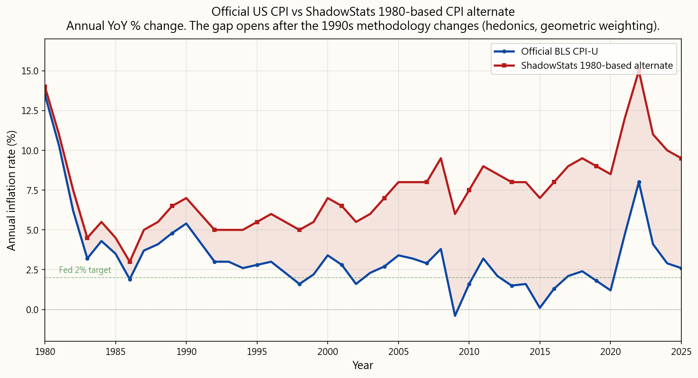
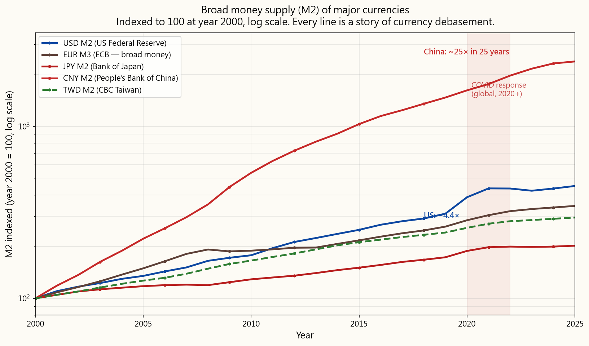
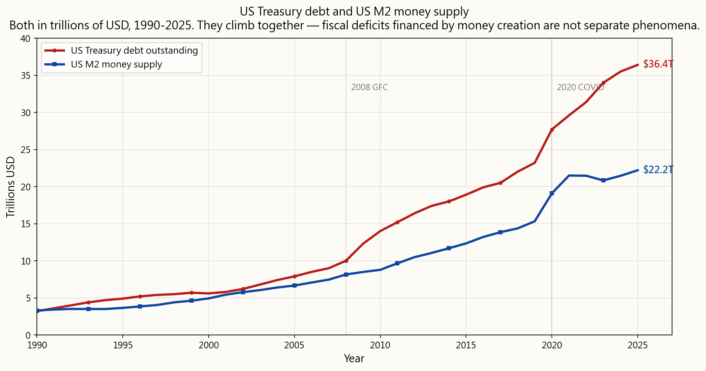

# 第一週：為何投資？擊敗通脹才是關鍵

---## 第一部分：閱讀章節

---

### 1. 為什麼這很重要

打開任何一本入門財經教科書，你都會看到同一張圖表：一條平滑的曲線，標示為「以每年8%投資10,000美元」。三十年後，你成為百萬富翁。四十年後，你變得富有。複利造就了這一切。

**那張圖表是童話故事。** 在2026年，你在哪裡能找到穩定、無風險的每年8%收益？根本找不到。2008年後的大部分十年裡，國庫券的收益率大約只有半個百分點。投資級公司債在2022年遭受重創。即使是標普500指數，雖然*平均*每年約有10%的回報，但它是經歷了30%的上漲年和40%的下跌年，以及幾乎停滯的十年期——從來不是一條平滑的線。教科書裡那條直線，是用來把投資包裝成一個有保證答案的數學問題。事實並非如此。沒有無風險的8%。從來沒有。

**72法則** 也一樣——「你的資金每九年翻倍，年利率8%」。毫無用處。穩定的8%根本不存在，一旦你用實際的逐年回報取代常數，這條規則就失效了。這個「法則」只是教科書為你畫好的虛構增長路徑上的一個戲法。

那麼，為什麼還要投資？因為替代方案更糟。**你已經在一場你沒選擇的賭局中**——賭的是你銀行賬戶中的現金能否保持購買力。它不會。通脹是每個投資者必須對抗的引力，否則只能原地踏步。問題從來不是「我應不應該承擔風險？」——你無論如何都已經承擔了通脹風險。問題是：**哪種風險會付錢給你承擔？**

本課程就是為了誠實回答這個問題。簡短版本，以下課程將詳細展開：

- **你必須擊敗通脹，否則即使賬戶數字增長，實際購買力也會下降。**
- **股票（以及少數實物資產如黃金和生產性房地產）是唯一可靠做到這一點的資產。**
- **債券*曾經*能擊敗通脹，在1982年至約2020年的通縮環境中。但現在不行了**——這是貨幣印刷和政府壓低利率以維持自身債務可控的故事。我們會在§2.3再談這個。

為了具體說明，做一個55年的思想實驗，假設三位儲蓄者從1971年開始，每年存入完全相同的10,000美元——名義金額相同，每年不變。唯一不同的是*他們的投資去向*。

- **A先生** 把錢放現金裡。不存銀行，不計息。純粹放在抽屜裡。
- **B先生** 投資於短期美國國庫券，最安全的有息資產。
- **C先生** 投資於標普500，所有股息均再投資。

同樣的紀律，同樣的金額，三種截然不同的結果：

55年後，每人都存入了相同的**550,000美元**。但最終餘額天差地別：

- **C先生 — 標普500**：名義42,041,000美元，折合1971年美元**5,079,000美元**——實際購買力大幅增長。
- **B先生 — 國庫券**：名義1,725,000美元，折合1971年美元**208,000美元**——通脹後勉強正回報。且這還包括1980年代國庫券付出兩位數收益的時期。剔除那段時期，現況更糟，這正是我們現在所處的環境。
- **A先生 — 現金**：名義550,000美元，折合1971年美元**66,000美元**——55年勤儉儲蓄，實際購買力只剩約六年半的存款。現金不是沒增長，而是通脹在負增長，儘管A先生很負責任。

這就是你應該記在心裡的圖景。C先生贏不是因為標普500給了神奇平滑的10%回報——它沒有，那條路經歷了1973-74熊市、1987股災、2000-02網絡泡沫、2008全球金融危機和2020年新冠疫情崩盤——而是因為**股票是三者中唯一可靠跑贏貨幣貶值的資產**。競賽不是對零的競賽，而是對抗通脹。贏了，複利就會接管剩下的路。輸了，再多「紀律」和「儲蓄」也救不了你。

---

### 2. 你需要知道的事

#### 2.1 通脹：他們給你的數字不是你實際支付的數字

你在電視上看到的頭條數字——「本月消費物價指數（CPI）為2.6%」——是美國勞工統計局公佈的**消費物價指數**。美聯儲的目標是每年約2%。退休金生活成本調整、社會保障增加、稅階調整以及與通脹掛鉤的債券（TIPS）都是以此為指標。

問題是，**CPI的計算方法多次被修改，且每次修改都傾向於降低公佈的數字。** 有三個特定的「遊戲」值得了解。

**遊戲1：享樂調整（「新iPhone有更多功能」）。** 勞工統計局認為，如果新款iPhone價格與去年相同，但相機更好，這就是*通縮*——你用同樣的價錢買到了更多產品。汽車（更多安全功能）、雪櫃（容量更大）、手提電腦（CPU更快）亦同理。勞工統計局會在CPI中將價格向下調整以反映「額外價值」。這稱為**享樂調整**，自1990年代末開始實施。

問題是，**消費者買的不是iPhone的功能，而是一部iPhone。** 一輛車就是一輛車，不論是否有車道保持輔助。新手提電腦就是一部手提電腦，不論晶片快30%與否。你仍然需要買一件東西，而你實際付出的價格是貨架上的標價——而非某個虛構的「功能調整後」較低價格。將質量提升視為價格下降，享樂調整系統性地令公佈的CPI低於你在收銀機前實際體驗的價格。波斯金委員會1996年的估計是，享樂調整和替代效應合計每年降低公佈CPI約**0.5至1.0個百分點**——每年複利累積。

目前沒有廣泛發佈的美國CPI系列能單獨剔除享樂調整。最接近的流行替代是約翰·威廉斯的**ShadowStats**「1980年基準CPI替代指數」——嘗試用1980年前的勞工統計局方法重建CPI，該方法將享樂調整與其他後來變更合併。ShadowStats通常比官方數字高出5至7個百分點。主流經濟學家批評該系列基本上是加了一個近乎固定的偏移量，而非從原始數據完整重算消費籃子，這個批評有其道理。但即使採取保守看法——ShadowStats稍微高估了幾個百分點——方向性信息依然成立：**你在新聞上看到的數字明顯低於家庭實際體驗的通脹，勞工統計局已知此事超過30年。**

**遊戲2：核心通脹（「忽略食品和能源」）。** 美聯儲偏好的通脹指標是**核心個人消費支出指數（Core PCE）**——剔除食品和能源，理由是這些類別「波動大」。撇開食品和能源或許是家庭*最重要*價格這一點不談，剔除它們的結構性效果與享樂調整相同：公佈數字低於人們實際體驗。PCE本身因消費籃權重不同，平均比CPI低約0.3個百分點。核心PCE在此基礎上再加一層。美聯儲的貨幣政策就是根據這個指標制定。

**遊戲3：替代效應（「牛肉貴了，你會買雞肉」）。** 當消費籃中某項商品相對變貴，現代CPI假設家庭會轉向較便宜的替代品——並減少該昂貴商品在消費籃中的權重。數學上：你買得少的東西在通脹計算中佔比*更少*，正因為它變貴了。這稱為**幾何加權**，於1990年代末引入。1980年前的方法用的是算術權重，不會因為你買不起而懲罰你。

**這對你實際金錢的影響：**

- 你的**退休金**生活成本調整、**社會保障**加幅、**稅階**調整——全都掛鉤於這個人為偏低的官方CPI。如果政府每年低估通脹2%，持續20年，對任何收入掛鉤CPI的人來說，這是*累積49%的實質減薪*。
- **通脹保護債券（TIPS）**的收益率掛鉤同一個被低估的CPI。它們宣稱的「實質回報」只有在你信任這個通脹平減指數的前提下才是真實的。
- **工資談判**以官方CPI為基準。整個職業生涯中，報告CPI與實際通脹的差距會累積成一筆龐大的隱形減薪。
- **美聯儲的利率決策**基於核心PCE。當美聯儲說「通脹達標」時，他們指的是*被操控的指標*達標。在6%實質通脹環境下，儲蓄賬戶只付0.5%利息，這是測量差距的結果，不是系統錯誤。

作為投資者，你的實際啟示很簡單：**不要以官方CPI作為你的最低回報門檻。** 無論你認為需要多少回報才能「跑贏通脹」，誠實地多加幾個百分點。如果官方CPI是2.5%，你應該計劃需要至少4.5–5%的實質回報才能真正保持購買力。本課開始的圖表已展示，即使以官方CPI計算，現金在職業生涯中表現也很差——實際情況更糟。

#### 2.2 通脹從何而來：印鈔票

教科書上對通脹的解釋是——「太多貨幣追逐太少商品」——技術上正確，但並未告訴你*為何*會有太多貨幣。誠實的答案是：**中央銀行創造了貨幣，政府花掉了貨幣。** 現代通脹，始終是一種貨幣現象。

看看過去25年主要貨幣的廣義貨幣供應量（M2），以2000年為基準指數100：

所有主要貨幣在此期間均被大幅貶值。**2020年後的垂直上升**在每條線上都清晰可見——新冠疫情期間的應對是全球同步擴大貨幣供應，為現代史上除戰時外最大規模。圖表使用的是**M2**（流通貨幣+可支票存款+儲蓄存款+小額定期存款+零售貨幣市場基金），而非M1。M1低估了實際情況；M2更接近「實際在經濟中流通的貨幣」。

故事的另一半是**政府債務**。當政府赤字（支出超過稅收）時，會發行債券。當中央銀行用新創造的準備金購買這些債券——這正是2008年以來量化寬鬆的本質——這就是**貨幣化債務**：今天花錢，明天用印出來的錢還。美國國債和M2幾乎同步增長，因為它們是同一貨幣行為的兩面：

這就是現行體制，並對你的投資選擇有直接影響：

1. **政府無法允許實質利率明顯上升**，因為自身債務利息成本將爆炸性增長。聯邦債務達36兆美元，平均收益率每上升1%，就意味著約3600億美元額外年度利息支出——約佔美國整個國防預算的60%。政治上有巨大動力保持利率人為*偏低*，包括透過中央銀行買債。
2. **債券因此不再是可靠的通脹對沖工具。** 當政府既有手段（被俘獲的中央銀行）又有動機（債務利息數學）將名義利率壓低於真實通脹率，債券的*實質*收益率會系統性地為負。這稱為**金融壓制**，也是1982年至2020年「60/40股票與債券」投資組合成功的結構性原因，但未來將不再可靠。
3. **實質資產——生產性股票、黃金、房地產、商品——成為剩餘價值儲存手段，** 因為它們以*實物*計價，而非政府貶值的貨幣。我們將在課程中深入探討如何擁有它們及其合理價格。

複利，作為數學概念，是真實且重要的——利滾利確實呈指數增長，代數是正確的。*不真實*的是教科書中那條平滑、無風險的8%線。該線所用貨幣每年被創造7–15%。不存在教科書中所說的無風險實質回報。真正的問題是：哪些資產能跟上印鈔速度？以什麼價格值得持有？

#### 2.3 實質回報與名義回報：唯一誠實的標尺

**名義回報**是頭條數字——「標普去年回報26%」。**實質回報**是名義回報扣除通脹後的數字——你實際獲得的購買力增長。

快速近似公式：

$$ r_{\text{real}} \approx r_{\text{nominal}} - i $$

精確關係（**費雪方程式**）為：

$$ r_{\text{real}} = \frac{1 + r_{\text{nominal}}}{1 + i} - 1 $$

在低通脹下，近似足夠心算；高通脹或高回報時，精確公式更重要。名義26%、通脹7%時，近似得19%，精確為17.8%。正常通脹水平下差距小，但隨兩者增大而擴大。

**誠實的表格——美國歷史各資產類別實質回報（扣除通脹後）：**

| 資產類別 | 名義回報（長期平均） | 實質回報（扣除通脹） | 是否跑贏通脹？ |
|---|---:|---:|---|
| 美國股票（標普500，股息再投資） | 約10% | 約7% | **是，可靠** |
| 黃金 | 約7% | 約3–4% | 是，長期（1971年後） |
| 房地產（廣義，含租金） | 約9% | 約3–4% | 是，長期 |
| 美國債券（10年期國債，長期平均） | 約5% | 約1–2% | 勉強——**2010及2020年代除外** |
| 美國國庫券（現金等價物） | 約3.5% | 約0% | **否，2008年後** |
| 儲蓄賬戶 | 約1–2% | 約−2至−5% | **否** |
| 現金（床墊） | 0% | 約−3至−7% | **否** |

標題說「長期平均」，長期在此表中作用很大。債券*平均*有正實質回報，但平均被1982–2020年債券降息牛市拉高——40年利率下降期使債券成為總回報引擎。**2020年代，10年期國債實質回報深度為負；債券牛市結束，產生牛市的體制（見§2.2）已逆轉。**

因此，誠實看待*當前*體制，表格縮減為少數可靠跑贏通脹的資產：

- **股票**（廣義，包括你透過指數基金或直接持有的生產性企業）
- **黃金及其他貨幣金屬**
- **生產性房地產**（有現金流，不是空地）
- **特定商品**（處於周期合適階段）

**其他一切，實質上都是賠錢的賭注。** 在6%實質通脹環境下，4%利息的「高收益」儲蓄賬戶仍每年損失2%。同環境下5%收益的國庫券損失1%。賬戶數字上升與購買力無關。唯一重要的問題是：**我是否跑贏了印鈔機？**

這是本課程其餘內容的基礎紀律。我們檢視的每項資產、教導的每種策略，都將以此唯一標準評估。名義回報只是表演，實質回報才是支付你未來買菜錢的真相。

---### 3. 常見誤解

**誤解一：「我應該把錢放在儲蓄戶口，這樣比較安全。」**

在實際通脹率超過5%的環境下，儲蓄戶口只付1–2%的利息，是你能持有的最激進的負實際回報投資之一。它感覺安全，因為*名義*數字不會下跌。但它並不安全——這是一種緩慢、幾乎察覺不到的資產流失。正是這種緩慢才使它危險：那些「玩得安全」的人，在意識到遊戲被操控之前，已經失去了數十年的購買力。

**誤解二：「教科書上的8%複利圖表顯示了投資會發生什麼。」**

它顯示的是如果存在8%實際、無風險回報會發生什麼。但事實並非如此。2008年後的大部分十年，國債的實際回報約為0%。標普500指數*平均*約10%名義回報，但實際上是30%上升年和40%下跌年及平淡十年的波動組合——絕非平滑曲線。教科書上的圖表被畫成直線，是為了讓複利看起來像數學；實際上，它是一條充滿波動和回撤的攀升路徑，需要*心理*能力在回撤期間持續買入。這才是真正的難點，而教科書圖表隱藏了這一點。

**誤解三：「債券是我投資組合中對沖通脹的安全部分。」**

債券*曾經*是1982年至2020年通縮環境下的通脹對沖工具——這是歷史上最長的債券牛市。但這個時代已經結束。隨著中央銀行被政府債務服務算術所束縛（§2.2），高評級債券的實際收益率在2010年代和2020年代大部分時間都是負的。「債券安全」的規則是基於過去時代的近期偏誤。現今債券是存續期賭注，而非通脹對沖。

**誤解四：「新聞上的消費者物價指數（CPI）數字就是實際的通脹率。」**

CPI是一種測量選擇，而非事實。它使用享樂調整（新款iPhone功能更好被視為價格*下降*）、替代權重（你買不起的東西在籃子中權重降低，因為你被價格擠出）以及在聯儲局偏好的核心個人消費支出（Core PCE）版本中排除食品和能源。這三種不同的方法選擇都使公布的數字低於家庭實際經歷的通脹率。將你的投資門檻率錨定於*實際經歷*的通脹率，而非政治上的數字。

**誤解五：「72法則告訴我錢翻倍需要多久。」**

它告訴你在*恆定*回報率下錢翻倍需要多久。恆定回報率只存在於教科書範例中。實際回報是帶有波動、回撤和體制變化的序列；72法則中「8%回報9年翻倍」的估算，對於中間有2008年金融危機的序列毫無意義。這條規則只是個可愛的心算工具，只適用於教科書中已經為你畫好的想像世界。

**誤解六：「先賺10%，再跌10%，我會回到原點。」**

這在數學上是錯誤的。$100 + 10% = $110，然後 $110 − 10% = $99，你實際上虧損了1%。損失比同等幅度的收益傷害更大，因為收益百分比是基於損失後較小的基數。50%的損失需要100%的收益才能回本，90%損失則需要900%收益。

| 損失 | 需要回復的收益 |
|---:|---:|
| −10% | +11.1% |
| −20% | +25.0% |
| −30% | +42.9% |
| −50% | +100.0% |
| −75% | +300.0% |
| −90% | +900.0% |

數學上，損失大小為 \(L\) 時，所需回復收益為

$$ G = \frac{L}{1 - L} $$

當 \(L\) 變大時，\(G\) 增長速度遠超 \(L\) 本身。這就是為什麼管理下行風險比最大化上行回報更重要，以及為什麼「安全」的國債路徑（從不出現50%回撤）在心理層面上不一定比股票路徑差——即使股票路徑在長期實際回報上勝出。

**誤解七：「投資就是賭博。」**

賭博有*負*期望回報——莊家永遠贏，數學期望是你輸錢。投資於生產性資產（代表對真實企業現金流的權益）歷史上有*正*期望回報——你是因資本提供和承擔風險而獲得報酬。短期個股投機可能像賭博，但長期分散持有生產性股票本質上不同，數學也反映了這點。

**誤解八：「我需要很多錢才能開始投資。」**

不需要。大多數經紀行提供零最低入金額和零碎股份。限制你的通常不是首次入金額，而是**在不可避免的回撤期間持續入金的紀律**。一個從25歲開始每月投入100美元於廣泛指數基金的人——並且在未來四十年每次30%熊市中都堅持投入——最終會遠遠超過一個25歲時一次性投入5萬美元，然後在第一次回撤時恐慌退出且再也不回來的人。行為勝於資產規模。

---### 4. 問答環節

**問1：如果課本上說的8%回報率是童話故事，我實際應該預期什麼回報？**

答：兩個誠實且有用的答案：

- **對於廣泛的美國股票（標普500，股息再投資），長期名義平均回報約為10%，長期實際平均回報（扣除官方消費者物價指數）約為7%。** 如果你相信影子消費者物價指數的批評，實際數字應該下調1–2%，約為5–6%的實際回報。
- **回報路徑並不平滑。** 在任何一年，市場可能回報+30%或−30%。10%的平均回報只會在長期（20年以上）出現，即使在這些長期期間，也曾有多年的停滯或負回報（例如2000年代的「失落十年」，實際回報低於起點）。計劃以平均值為基準；規劃時要考慮波動。

對於債券、國庫券和儲蓄賬戶：在當前環境下，假設實際回報為零或負值。任何更好的回報都是額外獎賞。

**問2：為什麼你說72法則沒用？它數學上是正確的。**

答：數學上對於*固定回報率*是正確的。問題是固定回報率並不存在——那只是課本上的抽象。在現實中，回報是有順序、波動性和體制變化的序列，而*順序*很重要：序列早期的−40%損失比後期的−40%損失傷害更大，因為早期資本更多。72法則對序列風險沒有任何說明，而序列風險才是你真正承擔的風險。作為對引用平均回報率的理智檢查，72法則還可以；作為規劃工具，則容易誤導。

**問3：為什麼我不能完全相信官方消費者物價指數？**

答：三個方法論選擇，都是逐步引入，且都使公布的數字偏低：

- **享樂主義調整**（新產品功能更多被視為價格下降，即使你仍支付全價）；
- **替代效應／幾何加權**（你買得少的商品在籃子中的權重降低，理論是你會買得更少）；
- **核心通脹**（美聯儲偏好的個人消費支出價格指數中排除食品和能源——即最直接影響家庭的價格被排除在政策相關數字之外）。

博斯金委員會（1996年）估計這些方法合計使報告的消費者物價指數每年低估約0.5–1.0個百分點。ShadowStats基於1980年的消費者物價指數系列估計差距更大——通常為5–7個百分點。真相可能介於兩者之間，但方向明確：實際通脹遠高於官方數字，且差距會複利累積。

**問4：如果債券不再跑贏通脹，為什麼經紀仍然推薦？**

答：有兩個原因。首先，這些建議是基於1982–2020年債券*確實*大幅跑贏通脹的體制——經紀培訓、財務規劃模型和整個60/40投資組合正統理論都是在那個體制下建立，尚未完全更新。其次，債券仍有一項優勢：它們能降低投資組合的*短期波動性*。債券是波動性對沖，而非通脹對沖。如果你的心理承受力是限制投資行為的關鍵，債券仍有其地位——只是不應誤以為它們是當前體制下的通脹對沖工具。

**問5：「印鈔」和政府赤字支出有什麼區別？**

答：現在幾乎是一回事。政府赤字時會發行債券。歷史上，這些債券賣給私人投資者——養老基金、外國中央銀行、儲戶——用現有資金資助支出。這*不是*印鈔。但自2008年起，中央銀行（美聯儲、歐洲央行、日本央行）經常用新創造的準備金大量購買新發行的政府債券。這**就是**印鈔——赤字由新錢而非現有儲蓄融資。區別很重要：債券融資的赤字不會直接貶值貨幣；中央銀行融資的赤字會。現代赤字主要是後者。

**問6：通脹對每個人影響一樣嗎？**

答：不一樣。官方消費者物價指數是全國平均的代表性籃子；你的*個人*通脹率取決於你實際消費的項目。有三類人感受到的通脹比官方數字更高：

- **租客**（大多數週期中住房通脹高於消費者物價指數）；
- **退休人士和長期病患者**（醫療和處方藥通脹遠高於消費者物價指數）；
- **有子女就讀私校或美國大學的家庭**（教育通脹過去二十年約為消費者物價指數的兩倍）。

相反，電子產品和服裝名義價格常常*下跌*，這對低收入家庭有利，因為他們在這些類別的支出比例較高——這也是享樂主義調整對降低報告消費者物價指數影響最大的部分。你的投資組合應該根據*你的*消費籃子調整，而非全國平均。

**問7：我應該先還債還是先投資？**

答：比較債務的稅後利率與你預期的實際投資回報。信用卡債務年利率20%以上是金融緊急情況——還清它是保證20%的回報，勝過任何股票投資。房貸利率4–5%，在6%的實際通脹環境下是*負實際利率*——通脹在替你還債，積極還清並非最佳策略。常見規則是：先還清利率高於約7%的債務，再投資。（並檢查債務是否可扣稅——某些司法區的房貸利息可扣稅，進一步降低實際利率。）

**問8：複利會對我不利嗎？**

答：會，而且這是避免高利率債務最被低估的原因。未還的5,000美元信用卡餘額，年利率24%，五年後會增長到14,615美元。複利不分方向；長期持有股票的複利力量能創造財富，未還債務的複利力量則會摧毀財富。消除高利率債務是大多數人可獲得的最高回報且無風險的「投資」。

**問9：如果只有股票能可靠跑贏通脹，為什麼還要持有其他資產？**

答：因為*路徑*和*終點*同樣重要。純100%股票組合，在某個十年會出現50%以上的回撤。如果你在低點賣出——大多數人會這樣，因為他們無法安心睡覺——你就失去了持有股票的長期實際回報優勢。分配部分資產於黃金、現金和（對某些投資者、某些體制）債券是*行為保險*：它減少你必須承受的回撤幅度，讓你在最重要的時候能持續持有股票。我們後面幾週會深入講資產配置。現在先記住：**股票是回報引擎；其他資產是平滑器。**

**問10：黃金不派息，怎麼跑贏通脹？**

答：黃金不是靠*收益*跑贏通脹——它沒有收益。黃金靠的是**貨幣貶值中的價格升值**。自1971年美國放棄金本位後，黃金價格從約35美元/盎司升至今日超過2,500美元/盎司——名義上約70倍，實際（扣除通脹）約4–5倍，歷時55年。黃金本質上是對貨幣貶值的多頭：美聯儲創造的每一美元新錢，最終都要找到去處，而其中一個歷史性重要的去處是貨幣金屬。我們在課程中會多次回到黃金和價值儲存資產的話題。

---## 第二部分：YouTube 影片腳本

---

**影片標題：** 為何要投資？教科書上的圖表是謊言｜投資課程第一週

**時長目標：** 約 25 分鐘

**主持人：**
- **陳馬**（老師）：經驗豐富的散戶投資者，從多年市場經驗中講解概念
- **小魚**（學生）：剛畢業的大學生，學習如何投資儲蓄，提出觀眾可能想問的問題

---

**[開場序列]**

[VISUAL: 動畫標誌，文字「投資基礎 -- 第一週」]

[ANIMATION: 一本教科書打開。頁面上畫出一條完美平滑的指數曲線，標示「每年 8% 增長的 10,000 美元」。線條隨即像玻璃般破裂，碎成一張鋸齒狀的真實價格走勢圖。]

**陳馬：** 歡迎來到第一週。我是陳馬，這堂課我要用鐵鎚敲碎每本個人理財書開頭都會出現的那張圖。

**小魚：** 我是小魚。我剛畢業，銀行帳戶裡有些儲蓄，我想知道到底該怎麼做。所以我會問出你們可能也在想的問題。

**陳馬：** 今天我們要回答金融中最基本的問題：為什麼要投資？我想先把教科書給你的答案燒掉，因為那答案是錯的，從我開始投資以來一直都是錯的。

**小魚：** 開場就很有力。

**陳馬：** 那我們開始吧。

[VISUAL: 標題卡 —「第一節：教科書上的圖表是謊言」]

---

**[第一節：教科書上的圖表是謊言]**

**小魚：** 好，那在我們開始錄影前，你叫我拉出每本投資書都會開頭用的那張圖。我這裡就有。1 萬美元，每年 8%，30 年後變成百萬富翁。線條很漂亮，永遠往上彎。

[ANIMATION: 平滑的「1 萬美元以 8% 年利率持續 30 年」教科書圖表在螢幕上畫出，並帶有「你是百萬富翁」的滿意標語。]

**陳馬：** 那張圖是童話故事。我想讓你在 2026 年找到哪裡能穩定無風險地拿到每年 8%。

**小魚：** 呃，國庫券？

**陳馬：** 國庫券在 2008 年後的十年大部分時間只付約半個百分點。投資級債券在 2022 年遭受重創——那是現代史上最差的債券年度。標普 500 平均約 10%，沒錯——但它是經歷三成漲、四成跌，還有整個十年停滯不前的波動。從來不是平滑的線。

**小魚：** 所以圖表不是錯，只是……不真實？

**陳馬：** 它被畫得很直，是為了讓投資看起來像數學題，有保證答案。事實不是這樣。沒有無風險的 8%。從來沒有。你一旦以為有，你就會做出所有錯誤決策——低估風險，第一個回撤就恐慌，然後覺得教科書騙你。教科書確實騙你，但不是你想的那種騙法。

**小魚：** 好，那 72 法則也可以丟了？

**陳馬：** 直接丟垃圾桶。72 法則說你錢每九年翻倍，年利率 8%。數學上沒錯——針對恆定回報率。但問題是恆定回報率不存在。它是教科書的抽象概念。一旦你用真實回報的實際序列替代恆定值——中間有 2008 年，有 2022 年——規則就失效。回報順序很重要，而規則根本沒提。它只是教科書已經畫好的假想成長路徑上的把戲。

**小魚：** 那為什麼它會出現在每本理財書裡？

**陳馬：** 因為它讓教科書作者輕鬆，也讓讀者覺得自己很聰明。但當市場跌四成的時候，這兩點都幫不了你。

[VISUAL: 標題卡 —「第二節：你已經在跑的賽跑」]

---

**[第二節：你已經在跑的賽跑]**

**小魚：** 好，如果圖表是謊言，72 法則沒用，那為什麼還要投資？真的。為什麼不乾脆把錢放銀行就算了？

**陳馬：** 因為不投資更糟。這是沒人跟你說的，當你畢業開第一個支票帳戶時：你已經在下注了。你沒選擇。賭注是你銀行帳戶裡的現金能保持購買力。

**小魚：** 但它不會。

**陳馬：** 不會。通脹是每個投資者必須對抗的引力，否則只能原地踏步。比賽不是對抗零，也不是「我的帳戶數字有沒有變多？」比賽是對抗通脹。所以問題從來不是「我應不應該承擔風險？」——因為你已經承擔風險了。不管你做不做決定，你都承擔通脹風險。真正的問題是，哪種風險會給你報酬。

[ANIMATION: 一個跑者在標示「通脹」的跑步機上。跑步機以每年 3-5% 的速度往後移動。標示「現金」的跑者原地踏步，卻被帶著往後移出畫面。標示「債券」的跑者以與跑帶相同速度慢跑，幾乎保持原地。標示「股票」的跑者跑得比跑帶快，向前移動。]

**小魚：** 所以通脹是對手，不是市場。

**陳馬：** 通脹是唯一重要的對手。本課程的其他一切——每種資產類別、每種策略、每個持倉規模——都要用一個問題來評估：扣除稅費後，在我能持有的時間範圍內，它能否打敗通脹？如果能，它就能進入投資組合。如果不能，就不行。接下來這堂課就是講哪些東西真的能打敗通脹。答案比你想像的簡短。

[VISUAL: 標題卡 —「第三節：你看到的 CPI 不是你付出的通脹」]

---

**[第三節：你看到的 CPI 不是你付出的通脹]**

**小魚：** 好，那在談打敗通脹之前——我們先倒帶一下？新聞說「通脹率是 2.6%」——那個數字是什麼？

**陳馬：** 那是消費者物價指數，CPI。由勞工統計局發布。美聯儲目標是每年約 2%。你的退休金生活費調整、社會保障調整、稅率級距、通脹保護債券——全都以 CPI 為指標。

**小魚：** 明白了。那那個數字是真實的？

**陳馬：** 那個數字是測量方法的選擇。這個選擇不斷改變，而且改法都傾向讓公布的數字偏低。有三個特定的「遊戲」你要知道。

**小魚：** 三個遊戲。說來聽聽。

**陳馬：** 第一個遊戲，享樂調整。新款 iPhone 有更好的相機、更大儲存、更快晶片。價格跟去年一樣。勞工統計局說：你用同樣價格買到更多產品——這是「通縮」。所以他們在 CPI 裡把 iPhone 的價格往下調，反映「額外價值」。

**小魚：** 等等。貨架上的價格一樣，但在通脹數字裡算作價格下降？

**陳馬：** 沒錯。車子也是一樣——新安全配備讓車子在 CPI 裡「更便宜」，即使標價更高。筆電、冰箱、洗衣機也是。問題是，你買的不是 iPhone 的功能，而是整支 iPhone。你付的是全額標價。享樂調整把品質提升當成價格下降，從九十年代末就開始用。博斯金委員會 1996 年估計，享樂調整和替代調整合起來每年讓 CPI 低估約半個到一個百分點。且是複利。

**小魚：** 那你覺得官方數字實際低了多少？

**陳馬：** 有個服務叫 ShadowStats，用 1980 年前的方法重建 CPI。它通常比官方數字高 5 到 7 個百分點。主流經濟學家批評 ShadowStats 只是加了個近乎恆定的偏移，而沒有完全重算籃子。這批評有道理——我不認為實際經歷的通脹比 CPI 高出六個百分點。但方向是對的：你真實生活中的通脹遠高於官方數字。

[VISUAL: Shadow CPI 疊加圖 — image/week01_shadow_cpi.png。1980 到 2025 年兩條線：官方 CPI 約 2-4%，ShadowStats 高出 5-7 個百分點，1990 年代初方法改變後差距擴大。]

**小魚：** 好，第二個遊戲。

**陳馬：** 核心通脹。美聯儲其實不以總 CPI 為目標，而是以核心個人消費支出物價指數（Core PCE）為目標。PCE 是個稍微不同的籃子，通常比 CPI 低約 0.3 個百分點。然後「核心」是指剔除食品和能源，因為它們「波動大」。

**小魚：** 剔除食品和能源。這兩樣可是每個家庭每週都買的東西。**陳馬：** 每個家庭最先支付的兩樣東西。爭論點在於它們每個月都會波動。結構性影響與享樂調整相同：公布的數字比人們實際感受到的要低，而美聯儲就是根據這個數字來設定利率。

**小魚：** 那第三點呢？

**陳馬：** 替代效應。如果牛肉價格上升，勞工統計局假設你會改買雞肉。所以他們會降低牛肉在消費籃子中的*權重*。數學上來說：你買得起的東西變少了，那些東西在通脹指標中的權重就會降低，正因為它們變貴了。這叫做幾何加權法。九十年代末引入。1980年前的方法用的是算術權重，不會因為你買不起而懲罰你。

**小魚：** 真不可思議。最貴的東西反而權重最低。

**陳馬：** 沒錯。那現在想想看，誰為這種低估付出代價？你的退休金生活成本調整是以這個人為低估的CPI為指標。你的社會保障加薪也是以此為基準。你的稅階也是以此調整。通脹保護債券（TIPS）的收益率也與同一個低估的CPI掛鉤。你的薪資談判都以它為錨。美聯儲根據它來設定利率。如果他們每年低估兩個百分點，持續二十年，這會導致任何以CPI為指標收入者的實質收入約被削減四十九個百分點。

**小魚：** 所以當你設定投資的障礙報酬率——你實際上需要的回報率來保持購買力——你不應該以官方CPI為基準。

**陳馬：** 拿官方數字，加上至少兩個百分點的誠實調整。如果他們說CPI是2.5%，你應該計劃需要至少4.5%到5%的實質回報，才能保本。這才是障礙率。低於這個，你就是在倒退，你銀行結單上的圖表在騙你。

[VISUAL: Title card -- "Segment 4: Where Inflation Comes From -- Money Printing"]

---

**[第四節：通脹從何而來]**

**小魚：** 好，我們知道官方通脹數字低估了現實。但通脹本身從哪裡來？它的源頭是什麼？

**陳馬：** 教科書答案是「太多貨幣追逐太少商品」。技術上正確，但沒告訴你什麼。老實說：是中央銀行創造了貨幣，政府花掉了。現代通脹，歸根究底，是貨幣現象。他們印鈔票。

**小魚：** 「他們印鈔票。」給我看看。

**陳馬：** 看看廣義貨幣供應量——這是M2，包括貨幣、支票存款、儲蓄存款和零售貨幣市場基金——過去二十五年每個主要貨幣的走勢，以2000年為100指數。

[VISUAL: Global M2 chart -- image/week01_money_supply.png。五條線以對數刻度從2000年到2025年：美元、歐元、日圓、人民幣、台幣。每條線都在上升。人民幣升幅最快。2020年每條線都有明顯的垂直跳升。]

**小魚：** 都在上升。

**陳馬：** 每一個主要貨幣都是。2020年後的垂直跳升，是COVID時代的反應。全球同步印鈔，現代史上最大規模的和平時期擴張。

**小魚：** 等等。連港元？台幣？

**陳馬：** 連港元。港元掛鈎美元，所以美國印鈔，香港基本上是進口這個印鈔行為。台灣也是類似，但稍微獨立一點。日圓、歐元、人民幣——大家都印了。沒有「誠實」的主要貨幣可以避險。這就是現行體制。

**小魚：** 那如果所有貨幣同時貶值，價格會怎樣？

**陳馬：** 意味著用這些貨幣計價的東西——資產、實物商品、黃金——看起來像是在漲價。其實並沒有漲。尺子在縮小。故事的後半段是這樣。

[VISUAL: US M2 + US Treasury debt chart -- image/week01_us_debt_m2.png。兩條線從1990到2025年一起上升，單位為兆美元。2008年和2020年兩個拐點明顯。債務約36兆美元，M2約22兆美元。]

**陳馬：** 美國國債和M2，兩者同軸繪圖，單位都是兆美元。它們一起攀升。拐點相同——2008年全球金融危機，2020年COVID。兩者是同一件事的兩面。政府赤字時發債，中央銀行用新創造的準備金買債券——這就是量化寬鬆——這是貨幣化債務。今天花錢，明天用印鈔票付帳。

**小魚：** 債務現在是三十六兆？

**陳馬：** 三十六兆。重點是，這決定你未來十年能不能投資什麼。債務平均收益率每上升一個百分點，政府每年多付約三千六百億美元利息，約是美國整個國防預算的六成。所以政治上有強烈動機保持名義利率*低*，包括中央銀行買自家政府債券。

**小魚：** 他們不能讓利率上升。

**陳馬：** 他們不能讓*實質*利率明顯上升。這就是重點——債券不再是可靠的通脹對沖工具。當政府既有手段、有被俘虜的中央銀行、又有動機（債務服務成本），讓名義利率低於真實通脹率，債券的實質收益率就會系統性地變負。這叫做*金融壓抑*。這也是為什麼從1982年到2020年有效的60/40股票與債券投資組合，未來結構上值得懷疑。

**小魚：** 等等。債券*以前*不是能跑贏通脹嗎？我父母那代買債券還不錯。

**陳馬：** 你父母那代經歷了史上最長的債券牛市。1982年到約2020年，利率從15%降到接近零。利率下降代表債券價格上升，加上票息。這是四十年的順風。這個時代結束了。利率不會從這裡大幅負利率。讓債券成為通脹對沖的通縮順風已經反轉。所以當你的經紀人，受過八九十年代訓練，告訴你「債券安全」——他們是在背誦一個已不適用的規則。

[VISUAL: Title card -- "Segment 5: The Three Savers -- What Actually Beats Inflation"]

---

**[第五節：三種儲蓄者]**

**小魚：** 好。我們有了教科書圖表的謊言，有了通脹這個真正的敵人，有了CPI被低估，有了中央銀行印鈔。現在請告訴我，到底什麼*真的*能跑贏通脹？我開始緊張了。

**陳馬：** 好，抓緊這個感覺，因為這是正確反應。讓我用實際市場歷史的五十五年，做三種不同的模擬。三種儲蓄者。他們從1971年開始——美國脫離金本位的那年，這是個重要年份，我們後面會再提。

**小魚：** 三種儲蓄者，同一計劃？

**陳馬：** 同一計劃。每年存一萬美元。每年同樣的名義金額，連續五十五年。不挑時機，不耍花招，只是紀律性儲蓄。唯一不同的是*存在哪裡*。

**小魚：** 好。A先生？

**陳馬：** A先生放現金。不存銀行，不計利息。純現金，放抽屜裡。B先生買短期美國國庫券——地球上最安全的有息工具。C先生買標普500，所有股息都再投資。

[VISUAL: Three Portfolios chart -- image/week01_three_portfolios.png。對數刻度圖表，1971到2025年。現金線平直線性上升，斜上到55萬美元。國庫券線曲線上升到173萬美元。標普500線爆炸性上升到4200萬美元。]

**小魚：** 同樣的投入。五十五年。

**陳馬：** 每人都投入了55萬美元本金。現在看他們的結果。A先生，現金儲蓄者，最後是55萬美元——就是本金總和，沒有增長。B先生，國庫券儲蓄者，最後約173萬美元。C先生，標普500，最後4200萬美元。

**小魚：** 四千二百萬。每年同樣一萬美元。

**陳馬：** 就是同樣每年一萬美元。但這裡有個教訓，因為名義數字會騙人。讓我把三者都換算成1971年的購買力——實質貨幣。

**小魚：** 好。**陳馬：** C先生，標普投資者：名義上四千二百萬，折合1971年美元約為*五百萬*。實際購買力增長：巨大。B先生，國庫券儲蓄者：名義上一百七十三萬，折合1971年美元約為*二十萬八千*。通脹後幾乎是微弱正回報。記住，這還包括1980年代，那時國庫券的收益率是兩位數。剔除那些年份，情況會更糟——這正是我們現在所處的環境。

**小魚：** 那A先生呢？

**陳馬：** A先生，現金儲蓄者，自掏腰包存了五十五萬。經過五十五年的通脹，折合1971年美元的實際購買力約為*六萬六千*。勤儉儲蓄五十五年，最終實際購買力只相當於約六年半的存款。現金並非沒有增長，而是在A先生負責任地儲蓄期間，通脹實際上*縮水*了他的資產。

**小魚：** 這真是殘酷。現金儲蓄者因為做了看似安全的事而被懲罰。

**陳馬：** 所謂「安全」的事反而是最危險的。這是一種緩慢、幾乎察覺不到的流血。正因為緩慢，才更危險——那些選擇安全的人，在意識到遊戲被操控之前，已經失去了數十年的購買力。

**小魚：** C先生也不是因為標普給了神奇且穩定的十％回報才達到這結果吧？

**陳馬：** C先生經歷了1973-74年熊市、1987年股災、2000-2002年科技股泡沫破裂、2008年金融危機和2020年新冠疫情股災——但他一直持續存入並持有。股票之所以勝出，不是因為路徑平坦，而是因為它們是三者中唯一能可靠跑贏貨幣貶值的人。

**小魚：** 如果我從這條影片帶走一個重點，那就是這張圖表。

**陳馬：** 這張圖是你整個課程中要牢記的畫面。比賽是對抗通脹。贏了這場比賽，複利就會為你工作。輸了，無論多有紀律都救不了你。

**小魚：** 老實看這張圖表：只有股票在這個體制下可靠地跑贏通脹。

**陳馬：** 股票。還有我們後面幾週會談到的少數實物資產——黃金、生產性房地產、某些商品。它們能跑贏通脹，是因為它們以*實物*計價，而非政府貶值的貨幣。債券*曾經*在1982年至約2020年的通縮環境中屬於這類資產，但現在不再是。這就是全部的短名單。

[VISUAL: 螢幕上動畫顯示一個縮小的清單。
 今日可靠跑贏通脹的資產：
 - 股票（廣泛持有生產性企業）
 - 黃金及貨幣金屬
 - 生產性房地產（有現金流，不是原始土地）
 - 精選商品（處於週期合適階段）
 灰色並刪除線標示：「債券（曾經，1982-2020）」
 灰色標示：「現金」
 灰色標示：「儲蓄賬戶」]

**陳馬：** 其他一切，實際上都是輸錢的賭注。一個「高收益」儲蓄賬戶在六％實際通脹環境下給四％利率，實際仍然每年虧損兩％。同樣環境下，國庫券給五％利率，仍虧損一％。賬戶數字上升並不重要，唯一問題是：我是否跑贏了印鈔機？

[VISUAL: 標題卡——「第6節：三個重點帶走」]

---

**[第6節：總結]**

**陳馬：** 好，讓我們總結一下。第一週你要帶走的三件事。

[VISUAL: 三張編號卡動畫出現。]

**陳馬：** 第一。教科書上的圖表是童話故事。不存在無風險的八％回報。任何向你展示平滑指數曲線作為預測的人，都在賣你東西。

**小魚：** 把那平滑的圖表丟掉。

**陳馬：** 第二。你已經在一場賭注中——賭現金能保值。事實上不能。通脹是對手。比賽不是對抗零，而是對抗中央銀行的印鈔機。官方通脹數字每年低估了這場比賽幾個百分點。

**小魚：** 所以我的實際門檻回報率比新聞數字高。

**陳馬：** 沒錯。計劃至少需要四至五％的實際回報才能保本。第三。看過過去五十五年的實際數據，只有股票——加上一些我們稍後會談的實物資產——可靠贏得這場比賽。債券曾經贏過，但現在不行了。現金從未贏過。這門課的任務，就是教你如何持有那些能跑贏印鈔機的資產，以及它們值得持有的價格。

**小魚：** 那張三個儲蓄者的圖怎麼辦？A先生五十五年後實際資產六萬六千，B先生二十萬八千，C先生五百萬。那是我會記住的。

**陳馬：** 那是核心。如果你從這條影片截圖一張圖，就截那張。貼在你的螢幕上。每次你想把「多一點」錢放現金，因為感覺比較安全，就看看它。

**小魚：** 好，那下週呢？

**陳馬：** 下週我們開始回答*怎麼做*。對普通投資者來說，持有廣泛生產性企業股份最便宜、最簡單、最有效的方法是指數基金和交易所買賣基金（ETF）。為什麼大多數專業基金經理打不贏它們。它們實際如何運作。該買什麼、不該買什麼。這就是第二週內容。

**小魚：** 明白了，下週見。

**陳馬：** 多謝收看。如果你覺得這是你畢業時希望有人教你的投資課程，記得訂閱，別錯過第二週。下次見。

[ANIMATION: 結尾卡。開頭被砸爛的教科書重新組合，但頁面上的曲線變得崎嶇且真實，而非平滑。訂閱按鈕圖示。「下週：指數基金與ETF」預告卡。]

**[完]**

---

*本集動畫參考：開場教科書破碎、通脹跑步機、M2擴張地球、債務與M2同步攀升、三儲蓄者競賽。引用圖表：`image/week01_three_portfolios.png`、`image/week01_shadow_cpi.png`、`image/week01_money_supply.png`、`image/week01_us_debt_m2.png`。*
*下一課程：`course/week02_index_funds_etfs.md`*