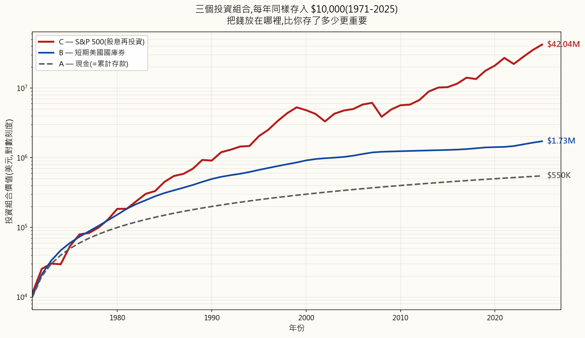
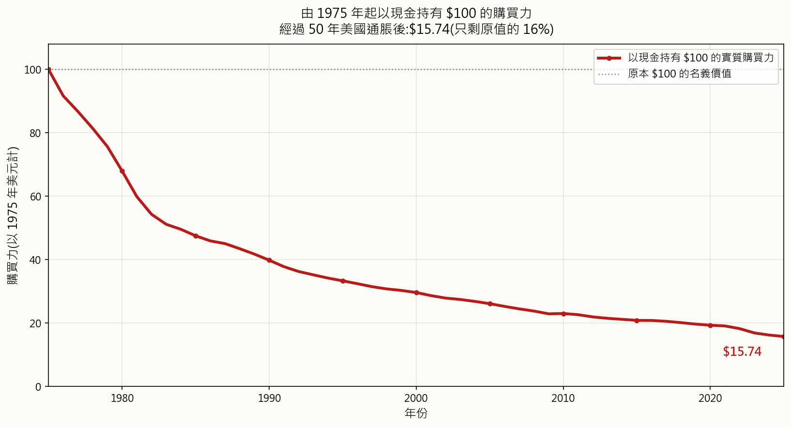
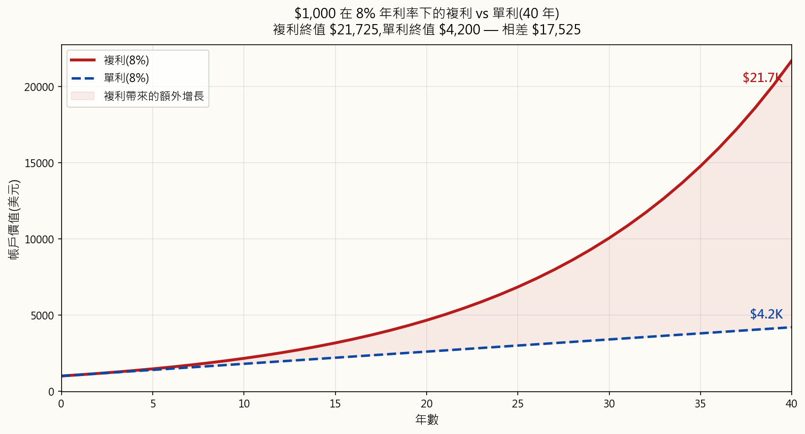
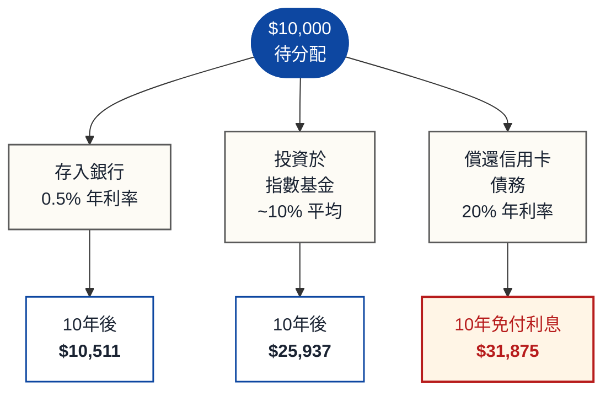

# 第一週：為何要投資？貨幣時間價值

---

## 第一部分：閱讀章節

---

### a) 為何這很重要

閒置的金錢就是不斷貶值的金錢。每一天，通脹都在蠶食塞在床墊底下、或存放在零利息往來戶口的現金購買力。明白*為何*需要投資，不僅是一項財務技能——在現代經濟體系中，這更是一種生存技能。

想想這個例子：1990年，一杯咖啡大約售$0.75。到了2025年，同一杯咖啡要$5.00甚至更貴。咖啡並沒有變得好六倍。是你的美元變得弱了六倍。這就是通脹在運作，而且從未停止。

貨幣時間價值（TVM）是所有金融學的基礎原則。它指出，今天的一元比明天的一元更值錢。這有三個原因：

1. **通脹** —— 物價隨時間上升，因此未來的元購買力更低。
2. **機會成本** —— 現在可用的資金可以用於投資以賺取回報。
3. **風險** —— 承諾的未來款項可能永遠不會到來。

若你明白貨幣時間價值，你就明白投資並非可選項目。這是確保你的財富增長速度快過經濟侵蝕速度的唯一途徑。

回望過去55年，以三位儲蓄者做一個思想實驗。由1971年起，每人每年存入剛好$10,000——相同的名義金額，年年如此，無一例外。唯一的分別在於他們把錢*放在哪裡*。

- **甲** 將錢保留為現金。沒有銀行，沒有利息。純粹的貨幣，放在抽屜裡。
- **乙** 把錢存入短期美國國債——最安全的生息工具。
- **丙** 把錢投入標普500指數，並將所有股息再投資。

同樣的紀律，同樣的金額，三種截然不同的結果：

經過55年，每人累計存入同樣的**$550,000**。但最終結餘根本不在同一個水平：

| 工具 | 年化回報（複合年增長率） | 最終價值（名義） | 最終價值（以1971年計） |
|---|---|---|---|
| **丙 — 標普500** | **11.24% / 年** | **$42,041,000** | **$5,079,000** |
| **乙 — 國債** | 4.38% / 年 | $1,725,000 | $208,000 |
| **甲 — 現金** | 0.00% / 年 | $550,000 | $66,000 |

「年化回報」一欄即**複合年增長率（CAGR）**——這是一個恒定利率，若以相同的55年複利計算，將產生與標的資產實際逐年路徑相同的增長倍數。這是正確的引用數字，因為年度回報的簡單算術平均值會高估實際複利表現。作為參考，同一時段美國消費物價指數（CPI）平均每年**3.92%**——任何低於此水平的投資，在計稅前均屬實際購買力的虧損。

丙的名義財富是乙的**24倍**、甲的**76倍**，儘管三人每年投入的$10,000完全相同。再細看甲：那筆$550,000的現金，歷經55年的美國通脹積累，其*實際*購買力僅相當於**以1971年計約$66,000**。甲不僅未能令財富增長——在他們盡責儲蓄的同時，通脹主動令其縮水。

差異完全源於貨幣時間價值與複利增長在數十年間的作用。複利獎勵能夠賺取回報的資本，懲罰靜止不動的資本。

本週課程為本課程的一切後續內容奠定概念基礎。掌握這些概念，未來每個課題都會更容易理解。

---

### b) 你需要了解的知識

#### 1. 通脹：無聲的財富殺手

通脹是物價隨時間普遍上升的現象。中央銀行（如美國的美聯儲）以每年約2%的通脹為目標，但實際通脹可以大幅波動。

不要輕信教科書中使用平滑假設利率的例子——讓我們使用真實的美國CPI數據。想像你在1970年1月1日把一張嶄新的$100鈔票塞到床墊下，從此不再碰它。以下是從此以後每五年初的購買力：

| 年份 | 已過年數 | 購買力 | 佔原始比例 |
|------|--------------:|-----------------:|--------------:|
| 1970 | 0 | $100.00 | 100.0% |
| 1975 | 5 | $74.49 | 74.5% |
| 1980 | 10 | $50.65 | 50.6% |
| 1985 | 15 | $35.39 | 35.4% |
| 1990 | 20 | $29.66 | 29.7% |
| 1995 | 25 | $24.81 | 24.8% |
| 2000 | 30 | $22.06 | 22.1% |
| 2005 | 35 | $19.44 | 19.4% |
| 2010 | 40 | $17.13 | 17.1% |
| 2015 | 45 | $15.51 | 15.5% |
| 2020 | 50 | $14.37 | 14.4% |
| 2025 | 55 | $11.73 | 11.7% |

1970年的$100如今的購買力只剩**$11.73**——通脹在一個完整工作生涯內已蠶食了**88.3%的實際價值**。光是1970年代的滯脹，到1980年便已將其購買力腰斬至$50.65，而此後相對溫和的25年（1980至2005年）又再削去了三分之二。即使在你的有生之年，過去25年同樣說明了相同的故事——**2000年1月的$100如今只值$53.16，短短一代人間購買力損失了46.8%**。而2020年後的加速更是在五年內單獨削去了美元約**18%的價值**。

這就是貨幣的「實際」價值——它實際能買到什麼，與「名義」價值（鈔票上印的數字）相對。現金並不安全。什麼都不賺的現金，是一種穩定的、幾近察覺不到的虧損。虧損的緩慢性正是使它如此危險的原因：那些把錢留在往來戶口來「保護」財富的人，正在上圖中做出最激進的押注之一——而且在輸掉它。

**如何衡量通脹：**

- **消費物價指數（CPI）** —— 追蹤典型家庭購買的一籃子商品及服務的成本（食品、住房、交通等）。
- **個人消費支出（PCE）** —— 美聯儲的首選指標；比CPI範圍更廣。
- **核心通脹** —— 剔除波動性較高的食品及能源價格，以呈現潛在趨勢。

**美國歷史通脹率（以十年計平均值）：**

| 時期 | 平均年度CPI |
|---|---:|
| 1930–1940 | −2.0% |
| 1940–1950 | +5.6% |
| 1950–1970 | +2.3% |
| 1970–1980 | +7.8% |
| 1980–2000 | +3.8% |
| 2000–2020 | +2.1% |
| 2020–2025 | +4.8% |

留意通脹如何在1970年代（石油危機）及2020年代初（疫情供應衝擊）急升。這些衝擊可以迅速摧毀購買力。

#### 2. 複利：世界第八大奇蹟

複利意味著你在利息上賺取利息。這是個人理財中最強大的單一力量。

**複利公式：**

\[ FV = PV \cdot (1 + r)^n \]

其中：

- \(FV\) = 終值（你的錢增長到的金額）
- \(PV\) = 現值（你的起始金額）
- \(r\) = 每期利率（以小數表示）
- \(n\) = 期數

**例子：$1,000以8%年回報計算**

| 年份 | 期初結餘 | 所賺利息 | 期末結餘 |
|---:|---:|---:|---:|
| 1 | $1,000.00 | $80.00 | $1,080.00 |
| 2 | $1,080.00 | $86.40 | $1,166.40 |
| 3 | $1,166.40 | $93.31 | $1,259.71 |
| 5 | $1,360.49 | $108.84 | $1,469.33 |
| 10 | $1,999.00 | $159.92 | $2,158.92 |
| 20 | $4,315.70 | $345.26 | $4,660.96 |
| 30 | $9,317.27 | $745.38 | $10,062.66 |
| 40 | $20,106.85 | $1,608.55 | $21,715.40 |

留意第40年所賺的利息（$1,608）已超過原始投資額（$1,000）。這就是複利的威力。

**複利與單利的視覺對比：**

以單利計算，你每年賺取原始$1,000的8%（即$80/年）。以複利計算，你賺取的是*當前結餘*的8%，而結餘每年都在增長。長期而言，差距變得巨大——上述例子最終結果為**$21,725（複利）對$4,200（單利）**，相差五倍，完全是因為將先前的利息留在戶口而非提取所帶來的。

**複利頻率同樣重要。**
同樣$10,000，同樣12%年利率，10年期，只改變複利頻率：

| 複利頻率 | 最終價值 |
|---|---:|
| 每年 | $31,058.48 |
| 每半年 | $32,071.35 |
| 每季 | $32,620.38 |
| 每月 | $33,003.87 |
| 每日 | $33,194.62 |
| 連續 | $33,201.17 |

複利頻率越高，回報越高，但邊際收益迅速遞減。從每年到每月的躍升是顯著的；從每日到連續幾乎沒有分別。

#### 3. 72法則

72法則是估算在給定年利率下，資金翻倍所需時間的心算捷徑：

$$ \text{翻倍所需年數} \approx \frac{72}{r} \quad \text{（其中 } r \text{ 為以百分比表示的年利率）} $$

| 年化回報 | 翻倍所需年數 |
|---:|---|
| 2% | \(72 / 2 = 36\) 年 |
| 4% | \(72 / 4 = 18\) 年 |
| 6% | \(72 / 6 = 12\) 年 |
| 8% | \(72 / 8 = 9\) 年 |
| 10% | \(72 / 10 = 7.2\) 年 |
| 12% | \(72 / 12 = 6\) 年 |

**為何有效？** 這是從自然對數推導出的數學近似值。精確公式為

$$ t = \frac{\ln 2}{\ln(1 + r)} $$

但72在心算上已足夠準確，且具有能被2、3、4、6、8、9及12整除的實用優點——正好涵蓋大多數你實際關心的利率。

**72法則反向應用——通脹讓你的購買力在同一時間表上腰斬。** 將「年化回報」換成「年通脹率」，「翻倍所需年數」就變成「購買力減半所需年數」：

| 通脹率 | 購買力減半所需年數 |
|---:|---|
| 3% | \(72 / 3 = 24\) 年 |
| 4% | \(72 / 4 = 18\) 年 |
| 6% | \(72 / 6 = 12\) 年 |
| 9% | \(72 / 9 \approx 8\) 年 |

這讓通脹變得具體可感。若通脹平均4%，每18年你的錢只能買到原來一半的東西。這正是年息1-2%的「安全」儲蓄戶口實際上在令你虧損的原因。

#### 4. 機會成本

機會成本是你在做決定時放棄的次優選擇的價值。在投資中，它意味著每一元都有競爭性用途，選擇其一就意味着放棄其他。

**決策樹——如何處置$10,000：**

在此例子中，償還高息信用卡債務的「回報」最高，因為你正在消除20%的年度成本。這正是財務顧問通常建議先償還高息債務再投資的原因。

**關鍵洞見：** 機會成本同樣適用於時間，而不僅是金錢。每一年延遲投資都有可量化的代價，因為你永遠失去了那一年的複利增長機會。

**等待的代價——每年$5,000以10%平均回報投資至65歲：**

| 起始年齡 | 投資年數 | 累計投入 | 65歲時的最終價值 |
|---:|---:|---:|---:|
| 20 | 45 | $225,000 | $3,616,635 |
| 25 | 40 | $200,000 | $2,212,963 |
| 30 | 35 | $175,000 | $1,355,122 |
| 35 | 30 | $150,000 | $822,470 |
| 40 | 25 | $125,000 | $491,735 |
| 45 | 20 | $100,000 | $286,375 |

從20歲而非30歲開始，只多投入$50,000，最終卻多出$226萬。早年的複利效果具有不成比例的巨大價值。

#### 5. 實際回報與名義回報

**名義回報**是投資的原始升幅百分比，未經通脹調整。**實際回報**是名義回報減去通脹，代表實際購買力的增長。

快速近似公式：

$$ r_{\text{實際}} \approx r_{\text{名義}} - i $$

精確關係（**費雪方程式**）為：

$$ r_{\text{實際}} = \frac{1 + r_{\text{名義}}}{1 + i} - 1 $$

例子——名義回報10%，通脹3%：

$$ \begin{aligned}
r_{\text{實際，近似}} &= 10\% - 3\% = 7\% \\
r_{\text{實際，精確}}  &= \frac{1.10}{1.03} - 1 = 6.80\%
\end{aligned} $$

在低通脹情況下，近似值已足夠作心算；在高通脹或高回報時，應使用精確公式。

**各資產類別的歷史實際回報（美國，約計）：**

| 資產類別 | 名義回報 | 通脹 | 實際回報 |
|---|---:|---:|---:|
| 美國股票（標普500） | ~10.0% | ~3.0% | ~7.0% |
| 美國債券（10年期） | ~5.0% | ~3.0% | ~2.0% |
| 黃金 | ~7.0% | ~3.0% | ~4.0% |
| 儲蓄戶口 | ~2.0% | ~3.0% | ~−1.0% |
| 現金（床墊） | 0.0% | ~3.0% | ~−3.0% |

**關鍵結論：** 在3%通脹環境下賺取2%的儲蓄戶口，每年正在*損失*1%的購買力。床墊下的現金每年損失3%。只有回報高於通脹率的資產，才能真正增長你的實際財富。

#### 6. 終值與現值

這是貨幣時間價值的兩個核心計算。

**終值（FV）：** 今日某筆金額在未來的價值。

\[ FV = PV \cdot (1 + r)^n \]

例子——$5,000在8%回報下20年後的價值？

\[ \begin{aligned}
FV &= 5{,}000 \cdot (1.08)^{20} \\
   &= 5{,}000 \cdot 4.6610 \\
   &= \$23{,}305
\end{aligned} \]

**現值（PV）：** 未來某筆金額在今日的價值。

\[ PV = \frac{FV}{(1 + r)^n} \]

例子——15年後的$50,000在7%折現率下今日的價值？

\[ \begin{aligned}
PV &= \frac{50{,}000}{(1.07)^{15}} \\
   &= \frac{50{,}000}{2.7590} \\
   &= \$18{,}126
\end{aligned} \]

**這意味著：** 若有人向你承諾15年後給你$50,000，而你的資金可賺取7%回報，這個承諾對你今日而言只值$18,126。若他們同時提供你現在立刻$20,000，現在的$20,000才是更划算的選擇。

**年金終值（定期供款）：**

\[ FV = PMT \cdot \frac{(1 + r)^n - 1}{r} \]

其中 \(PMT\) = 定期供款金額。

例子——每月$500，供30年，年利率8%（月利率0.667%）：

\[ \begin{aligned}
FV &= 500 \cdot \frac{(1.00667)^{360} - 1}{0.00667} \\
   &= 500 \cdot 1{,}491.57 \\
   &= \$745{,}785
\end{aligned} \]

累計供款：\(500 \times 360 = \$180{,}000\)。總增長：\(\$745{,}785 - \$180{,}000 = \$565{,}785\)。

你的投資增長（$565,785）是實際投入金額（$180,000）的三倍以上。這就是持續投資結合複利的威力。

**對未來現金流串流進行折現。** 五筆$100款項，在未來五年每年末各收取一筆，以7%折現：

$$ PV = \sum_{t=1}^{5} \frac{\$100}{(1.07)^t} $$

| 年份 | 未來款項 | 折現因子 | 現值 |
|---:|---:|---:|---:|
| 1 | $100 | \(1 / 1.07^{1} = 0.9346\) | $93.46 |
| 2 | $100 | \(1 / 1.07^{2} = 0.8734\) | $87.34 |
| 3 | $100 | \(1 / 1.07^{3} = 0.8163\) | $81.63 |
| 4 | $100 | \(1 / 1.07^{4} = 0.7629\) | $76.29 |
| 5 | $100 | \(1 / 1.07^{5} = 0.7130\) | $71.30 |
| | | **現值合計** | **$410.02** |

每筆未來的$100在今日都價值較低，正是因為貨幣時間價值的存在。未來款項距今越遠，今日的價值就越低——第5年的$100今日只值$71.30，而第1年的$100今日值$93.46。

#### 7. 融會貫通：投資的必要性

**30年三條路** （起始$10,000，每年追加$5,000）：

| 指標 | 無所作為（0%） | 儲蓄戶口（1.5%） | 投資標普500（10%） |
|---|---:|---:|---:|
| 累計投入 | $160,000 | $160,000 | $160,000 |
| 最終名義價值 | $160,000 | $192,760 | $987,174 |
| 實際價值（3%通脹） | $65,890 | $79,379 | $406,392 |
| 購買力 | **損失59%** | **損失50%** | **增長154%** |

只有投資者的財富在實際意義上真正增長。儲蓄者勉強保本。無所作為者損失了逾半的購買力。

---

### c) 常見誤解

**誤解一：「投資等同賭博。」**

賭博的預期回報為負（莊家常贏）。投資於多元化資產在歷史上具有正預期回報。標普500在過去一個世紀的年化回報約為10%，期間歷經大蕭條、二次世界大戰、2008年金融危機及新冠疫情。對個別股票的短線投機或許與賭博相近，但紀律嚴明地長期投資於多元化基金，性質根本不同。

**誤解二：「我需要大量資金才能開始投資。」**

許多經紀現已提供零門檻及碎股買賣。你可以用$10購買標普500指數基金。最重要的因素不是起始金額，而是何時開始及供款是否持續。即使每月$50，從22歲開始，以10%平均回報計算，到65歲也能增長至逾$350,000。

**誤解三：「儲蓄與投資是一回事。」**

儲蓄是把錢存起來。投資是讓錢為你工作。在3%通脹環境下，年息0.5%的儲蓄戶口意味著每年損失2.5%的購買力。儲蓄對於緊急備用金及短期目標固然重要，但要建立長期財富，投資不可或缺。

**誤解四：「我應該等待『適當時機』再投資。」**

擇時入市極為困難。研究一再顯示，「在市場中持守」勝過「擇時入市」。嘉信理財的研究發現，即使每年在最糟糕的時機（市場頂部）投資的人，仍顯著跑贏把資金留在現金等待更佳入市點的人。

**誤解五：「複利只對大額資金有意義。」**

百分比的效果與金額無關。$100以10%增長40年變為$4,526。倍數（45倍）無論你起始$100還是$100,000都完全一樣。關鍵在於增長率和時間跨度。

**誤解六：「通脹始終維持在2-3%左右。」**

雖然中央銀行以2%為目標，但實際通脹可以高得多。美國在1980年曾出現13.5%的通脹。阿根廷近年見過逾100%的通脹。即使在穩定的經濟體中，通脹也可能因供應衝擊、貨幣政策改變或地緣政治事件而急升。你的投資策略需要考慮通脹可變的情景。

**誤解七：「上升10%再下跌10%就能回到原點。」**

數學上這是錯誤的。$100 + 10% = $110。然後$110 - 10% = $99。你實際上虧損了1%。虧損的傷害大於等幅盈利的得益，這正是在投資中管理下跌風險的重要原因。下跌50%需要上升100%才能回到原點。

**虧損/盈利的不對稱性——從回撤中恢復所需的升幅：**

| 虧損 | 恢復所需升幅 |
|---:|---:|
| −10% | +11.1% |
| −20% | +25.0% |
| −30% | +42.9% |
| −40% | +66.7% |
| −50% | +100.0% |
| −75% | +300.0% |
| −90% | +900.0% |

從數學角度，虧損 \(L\) 後，所需恢復升幅為
\(G = \frac{L}{1 - L}\)——當 \(L\) 增大時，增速遠快於 \(L\) 本身。

**誤解八：「72法則是精確的。」**

這只是近似值。它在6%至10%的利率範圍內效果最佳。在極低或極高利率時，準確度會下降。以2%計，實際翻倍時間為35.0年（72法則估計36年）。以20%計，實際時間為3.8年（72法則估計3.6年）。對於快速心算已足夠，但不應用於精確財務規劃。

---

### d) 問答環節

**問1：用簡單語言解釋貨幣時間價值是什麼？**

答：今天的一元比未來的一元更值錢，原因有三：（1）通脹降低了未來那一元的購買力，（2）今天的一元可以拿去投資賺取回報，（3）承諾的未來款項始終存在無法兌現的風險。這正是為什麼貸款方收取利息、投資者要求回報——他們在為放棄現在使用資金的機會索取補償。

**問2：複利與單利有何分別？**

答：單利只按原始本金計算。若你以5%單利投資$1,000，每年賺取$50，無論已累積多少均如此。複利則按本金加所有已累積利息計算。因此在第2年，你是按$1,050而非$1,000計算利息。長期而言，這個差別變得相當顯著。30年後，$1,000以5%單利變成$2,500，而以5%複利則變成$4,322。

**問3：72法則為何有效？**

答：它源於 ln(2) / ln(1 + r) 的數學關係，其中 ln 是自然對數，r 是利率。對於接近8%的利率，72/r 與此公式非常接近。之所以選用72，是因為它能被2、3、4、6、8、9及12整除，令心算更方便。有些人在低利率時使用「70法則」，或在連續複利時使用「69.3法則」，但72在日常使用中最為實用。

**問4：名義回報與實際回報有何分別？**

答：名義回報是標題數字——「股市今年回報10%」。實際回報調整通脹後，顯示你購買力的實際增幅。若股市回報10%但通脹為4%，你的實際回報約為6%。在評估長期投資表現時，應始終以實際回報思考，因為在高通脹環境中，名義回報可能產生誤導。

**問5：如何計算未來款項的現值？**

答：使用公式 PV = FV / (1 + r)^n。選擇適當的折現率（r）——通常是你在其他投資中能夠賺取的回報。例如，若有人承諾10年後給你$10,000，而你在其他地方能賺取7%：PV = $10,000 / (1.07)^10 = $10,000 / 1.9672 = $5,083。那筆未來的$10,000對你今日而言只值約$5,083。

**問6：投資可以預期什麼樣的年化回報？**

答：美國股市（標普500）歷史上名義年化回報約10%，扣除通脹後約7%。然而，每年的回報差異極大。在任何一年，市場可能回報+30%或-30%。10%的平均值只在長期（20年以上）才會浮現。債券歷史名義回報約5%（實際約2%）。平衡的投資組合或許以7-8%名義回報為目標。切勿假設任何特定回報是有保證的。

**問7：應該先還債還是先投資？**

答：比較你的債務利率與投資預期回報。若債務利率為20%（信用卡），還清債務等同賺取有保證的20%回報——勝過任何投資。若債務利率為4%（按揭），而你預期投資可得10%，投資或許更划算，但還債的「回報」是有保證的，投資回報則不然。常見策略：先還清所有6-7%以上的債務，再將其餘資金投資。

**問8：通脹對所有商品的影響一樣嗎？**

答：不一樣。不同類別的通脹率各有不同。過去20年在美國，醫療及教育費用的升幅遠高於整體CPI，而科技產品及服裝價格則往往有所下降。CPI是一籃子商品的平均值，因此你個人的實際通脹率取決於你實際的消費模式。例如，退休人士往往面對較高的有效通脹率，因為醫療在他們的開支中佔比更大。

**問9：一次性投資與每月定期供款有何分別？**

答：從統計學角度，一次性投資約有三分之二的時間跑贏平均成本法（定期供款），因為市場整體趨勢向上。然而，平均成本法降低了在市場高位一次性買入的風險，而且對大多數定期領薪的人而言更為實際。最佳策略通常是：在每次收到薪金時立即投資，不要持有現金等待「更好的時機」。

**問10：複利會對我產生不利影響嗎？**

答：絕對會。債務上的複利正是投資複利的鏡像。$5,000信用卡結餘以24%年利率計算，若不還款，5年內便增長至$14,615。這正是高息債務是財務緊急情況的原因。同樣的數學力量，在投資中建立財富，在未償還的債務中則摧毀財富。

---

## 第二部分：YouTube 影片劇本

---

**影片標題：** 為何要投資？貨幣時間價值｜投資課程第一週

**目標片長：** 約25分鐘

**主持：**
- **陳馬**（導師）：資深散戶投資者，從多年市場經驗中講解概念
- **小魚**（學生）：剛畢業的大學生，正在學習投資她的積蓄，提出觀眾心中的問題

---

**[開場序幕]**

[VISUAL: 動畫標誌，顯示「投資基礎——第一週」]

[ANIMATION: 時鐘滴答作響，紙幣慢慢縮小]

**陳馬：** 歡迎來到我們投資基礎課程的第一週。我是陳馬，今天這堂課，將會永遠改變你看待金錢的方式。

**小魚：** 我是小魚。我會提出所有初學者的問題，所以如果你是完全的新手，放心，我跟你一樣。

**陳馬：** 今天我們要回答你這輩子面對的最重要財務問題之一：為什麼要投資？

**小魚：** 是啊，說真的，投資感覺很有風險。為什麼不直接把錢存在銀行戶口，安全不就好了？

**陳馬：** 這正正是我們要開始的地方。因為令人驚訝的真相是，把錢「安全地」存在銀行戶口，其實是你對它能做的最危險的事之一。

**小魚：** 等等，這怎麼可能？

[VISUAL: 標題卡——「第一部分：無形的小偷——通脹」]

---

**[段落一：通脹]**

**陳馬：** 讓我告訴你一個此刻正在搶劫你的無形小偷。它叫做通脹。

[ANIMATION: 一籃子雜貨。價格標籤從$50慢慢跳升至$75，再到$100，而籃子本身保持不變。參考：animation/week01_compound_growth.py -- inflation_scene()]

**小魚：** 通脹。這個詞我聽過，但它對我的錢包究竟意味著什麼？

**陳馬：** 通脹是指物價隨時間上升。不是因為產品變得更好，而是貨幣在貶值。1995年，一張電影票大約要四元。現在要十五元。同樣的觀影體驗，但你的元買得到的東西少了。

**小魚：** 所以即使我不花錢，我的錢也在變弱？

**陳馬：** 正是。而且讓它變得危險的，正是這一點。

[VISUAL: 分屏顯示兩個瓶子。左瓶標示「2005年的$10,000」。右瓶標示「2025年的$10,000」。右瓶中的物品逐一被移走，代表失去的購買力。]

**陳馬：** 假如你在2005年把一萬元塞進床墊底，到2025年才拿出來，你仍然有一萬元。但那一萬元，只能買到2005年大約六千元能買到的東西。你什麼都沒做，就損失了大約四成的購買力。

**小魚：** 四成？這真的很驚人。但銀行會付利息吧？這有幫助嗎？

**陳馬：** 讓我給你看看數字。

[ANIMATION: 條形圖對比「儲蓄戶口利率：0.5%」與「通脹率：3%」，差距標示為「實際虧損：每年-2.5%」]

**陳馬：** 近年美國的平均儲蓄戶口大約付0.5%利息。同時，通脹平均約為3%。這意味著每年，你的儲蓄戶口在實際購買力方面損失約2.5%。

**小魚：** 所以我存錢其實是在虧損？

**陳馬：** 從實際層面來說，是的。而這正引領我們去到金融學中最重要的概念。

[VISUAL: 標題卡——「第二部分：貨幣時間價值」]

---

**[段落二：貨幣時間價值]**

**陳馬：** 貨幣時間價值——簡稱TVM——是指今天的一元比明天的一元更有價值。

**小魚：** 為什麼？一元就是一元，不是嗎？

**陳馬：** 這樣想想看。若我現在給你一千元，或者一年後給你一千元，你選哪個？

**小魚：** 當然是現在啦。

**陳馬：** 為什麼？

**小魚：** 因為……我現在就可以用？而且誰知道一年後會發生什麼？

**陳馬：** 你剛剛說出了三個原因中的兩個。

[VISUAL: 三根柱子圖：
第一柱——「機會：現在投資，賺取回報」
第二柱——「通脹：未來的元買得到的東西更少」
第三柱——「風險：未來的款項可能無法兌現」]

**陳馬：** 第一，機會。若你現在有錢，可以拿去投資賺取回報。第二，通脹。那筆未來的錢能買到的東西比今天的少。第三，風險。承諾未來給你錢的人，可能不會兌現。

**小魚：** 所以時間真的讓錢變得不值錢？

**陳馬：** 除非你讓它去工作。而這正是投資的用途所在。投資是你對抗貨幣時間價值的方式。你不是讓時間侵蝕你的財富，而是駕馭時間令財富增長。

**小魚：** 怎麼做到？

**陳馬：** 兩個字：複利。

[VISUAL: 標題卡——「第三部分：複利——第八大奇蹟」]

---

**[段落三：複利]**

[ANIMATION: 參考 animation/week01_compound_growth.py -- compound_scene()。由一枚硬幣開始，它複製了。然後每個複製品再複製。那堆硬幣一開始增長緩慢，然後急速膨脹。]

**陳馬：** 愛因斯坦據說稱複利為世界第八大奇蹟。無論他是否真的說過，數學本身已完全支持這個說法。

**小魚：** 複利與普通利息有什麼分別？

**陳馬：** 好問題。單利是每年按原始金額計算固定百分比。複利是在你的利息上賺取利息。

[ANIMATION: 並排對比。
左方：「單利」——$1,000每年增長剛好$80，以相同大小的方塊堆疊。
右方：「複利」——$1,000每年增長的金額不斷增加，方塊隨堆疊而變大。]

**陳馬：** 假設你以8%投資一千元。以單利計算，你每年賺取八十元。十年後，你有一千八百元。

**小魚：** 這樣感覺還不錯。

**陳馬：** 現在以複利計算，第一年你仍然賺取八十元。但第二年，你賺取的是一千零八十元的8%，即八十六元四角。第三年，你賺取的是一千一百六十六元四角的8%。

**小魚：** 所以每年的利息收入都在增加？

**陳馬：** 正是。十年後，你不是有一千八百元，而是有兩千一百五十九元。

[VISUAL: 螢幕上的表格：
單利：$1,000 → 10年後 $1,800
複利：$1,000 → 10年後 $2,159
差距：$359]

**小魚：** 多了三百五十九元。這很不錯，但談不上改變人生。

**陳馬：** 你說得對。十年後，這只是個不錯的額外收益。但當你拉長時間線，事情就變得瘋狂了。

[ANIMATION: 圖表顯示兩條曲線延伸至40年。複利曲線在大約第20年開始與單利線急速拉開距離，到第40年已遠遠超越。]

**陳馬：** 二十年後，複利總額為四千六百六十一元，單利為二千六百元。三十年後，是一萬零六十三元對三千四百元。四十年後……

**小魚：** 讓我猜——變得瘋狂了？

**陳馬：** 二萬一千七百一十五元。對比單利的四千二百元。你的錢增長至起始金額的逾二十一倍。

**小魚：** 從一千元？

**陳馬：** 從一千元。而且這中間沒有多存一分一毫。只是讓複利做它的事，持續四十年。

[VISUAL: 最終對比圖：
$1,000以8%計算40年：
單利：$4,200
複利：$21,715]

**小魚：** 好的，這真的令人印象深刻。但誰有四十年時間？

**陳馬：** 任何在二十多歲開始投資、六十多歲退休的人。而且大多數人並非只投資一次性的金額，他們是定期供款的。讓我示範一下，當定期供款結合複利，會發生什麼事。

[ANIMATION: 一個豬仔錢箱每月收到硬幣。旁邊的增長計量器加速上升。數字從$0跳至$500,000，再至$1,000,000。]

**陳馬：** 若你從二十五歲開始，每月投資五百元，以10%平均年回報計算，到六十五歲你將擁有大約二百六十萬元。

**小魚：** 二百六十萬？從每月五百元？

**陳馬：** 你累計供款二十四萬元。其餘二百三十六萬是純粹的複利增長。

**小魚：** 那是九成增長、只有一成是自己的供款。難以置信。

**陳馬：** 這就是時間加複利的威力。而這正是為什麼盡早開始如此重要。

**小魚：** 這是數學理論。但在現實世界中真的行得通嗎？

**陳馬：** 問得好。讓我用真實的美國市場歷史數據來說明——不是假設性的10%，而是1971年至2025年的實際回報。

[VISUAL: 三個投資組合圖表——image/week01_three_portfolios.png。三條線在對數刻度圖表上從1971年攀升至2025年：現金以直線增長至$550K（即每年存款的滾動總和）、國債曲線升至$1.73M、標普500爆炸性飆升至$42M。]

**陳馬：** 三位儲蓄者。每人每年存入一萬元，堅持五十五年。唯一的分別是把錢放在哪裡。甲把錢保留為現金，沒有利息，就放在抽屜裡。乙存入短期國債——最安全的生息工具。丙投入標普500，並將股息再投資。

**小魚：** 存入的錢一樣。所以拿出來的也一樣，對吧？

**陳馬：** 甲，那位現金儲蓄者，最後恰好有五十五萬元——就是五十五筆存款的總和，沒有增長。乙，國債儲蓄者，最後有約一百七十三萬元。丙，股市投資者，最後有四千二百萬元。

**小魚：** 四千二百萬？！從同樣的每年一萬元？

**陳馬：** 從同樣的每年一萬元。丙的財富是國債儲蓄者的二十四倍，是現金儲蓄者的七十六倍。同樣的紀律，同樣的投入，截然不同的結果。而甲的情況更慘——若你調整五十五年的美國通脹，那五十五萬的現金，購買力只相當於1971年的約六萬六千元。

**小魚：** 所以現金儲蓄者其實是在倒退？

**陳馬：** 不投資的儲蓄並不安全。這只是一種較慢的虧損方式。這就是這個課程存在的全部原因。

[VISUAL: 標題卡——「第四部分：等待的代價」]

---

**[段落四：等待的代價]**

[ANIMATION: 兩個角色並肩而行。「早起阿芬」從25歲開始。「拖延阿強」從35歲開始。兩人同向65歲走去。阿芬的財富條形遠高於阿強。]

**陳馬：** 讓我介紹兩位假設性的投資者。早起阿芬從二十五歲開始，每年投資五千元。拖延阿強從三十五歲才開始相同金額。兩人都投資至六十五歲，平均年回報都是10%。

**小魚：** 所以阿芬投資四十年，阿強投資三十年？

**陳馬：** 對。阿芬累計投資二十萬元，阿強累計投資十五萬元。所以阿芬多投了五萬元。但看看結果。

[VISUAL: 對比條形圖：
阿芬（25歲起）：投資$200,000 → 最終價值$2,212,963
阿強（35歲起）：投資$150,000 → 最終價值$822,470]

**小魚：** 阿芬的錢幾乎是阿強的三倍？只因為多供了五萬元？

**陳馬：** 多供五萬元，最終價值卻多出一百四十萬元。這是28比1的比率。阿芬在最初十年投資的每一元，在其後三十年裡以倍數倍增。

**小魚：** 所以早年的投資是最有價值的？

**陳馬：** 遠遠最有價值。你最初投資的那些錢，有最長的時間去複利增長。二十五歲投資的一元有四十年去增長。五十五歲投資的一元只有十年。那個二十五歲的一元可以增長到四十五元，那個五十五歲的一元只能增長到約二元六角。

[VISUAL: 標題卡——「第五部分：72法則」]

---

**[段落五：72法則]**

**小魚：** 這一切都很好，但在腦海中做複利計算聽起來根本不可能。

**陳馬：** 確實如此，但有一個漂亮的捷徑叫做72法則。

[VISUAL: 大大的「72」顯示在螢幕上，旁邊有除號]

**陳馬：** 要估算資金翻倍所需的年數，只需用七十二除以年化回報率。

**小魚：** 就這樣？

**陳馬：** 就這樣。以6%回報計算，資金十二年翻倍。以8%計算，九年。以12%計算，只需六年。

[ANIMATION: 一元紙幣翻倍變成兩元，再變四元，再變八元，再變十六元，旁邊顯示以8%回報的年份時間戳：0、9、18、27、36年]

**小魚：** 所以以8%計算，一元在九年後變兩元、十八年後變四元、二十七年後變八元、三十六年後變十六元？

**陳馬：** 完全正確。三十六年內翻倍四次。而這個法則有個很好的反向應用。你可以估算通脹以多快摧毀你的錢。

**小魚：** 怎麼用？

**陳馬：** 以3%通脹計算，七十二除以三等於二十四。你的錢每二十四年購買力減半。

**小魚：** 所以如果我現在三十歲，距離退休還有三十五年，若我只持有現金，購買力可能損失一半以上？

**陳馬：** 一半以上。以3%通脹計算，三十五年後一元只值約三角五分。你將損失約六成五的購買力。

[VISUAL: 一元紙幣，65%部分被淡化/褪色，標示「三十五年通脹（年率3%）的購買力損失」]

**小魚：** 這太嚇人了。

**陳馬：** 它應該令你有動力。因為一旦你明白這一點，你就明白不投資才是真正的風險。

[VISUAL: 標題卡——「第六部分：實際回報與名義回報」]

---

**[段落六：實際回報與名義回報]**

**陳馬：** 在結束前，我想釐清一個讓很多人困惑的概念。當你聽到股市每年回報10%，那是名義回報。

**小魚：** 名義，即是標題數字？

**陳馬：** 對。扣除通脹前的實際數字。但對你購買力真正重要的，是實際回報——名義回報減去通脹。

[ANIMATION: 溫度計式圖形。「名義回報」顯示10%。「通脹」顯示扣除3%。「實際回報」顯示7%。]

**陳馬：** 若股市回報10%而通脹為3%，你的實際回報約為7%。那7%代表你購買力的真實增長——你現在多能負擔到的額外商品和服務。

**小魚：** 所以我應該永遠以扣通脹後的回報來思考？

**陳馬：** 在長期規劃方面，絕對是。而以下就是它為何重要的原因。看看這個對比。

[VISUAL: 螢幕上的表格：
資產類別         | 名義回報 | 扣3%通脹後 | 實際回報
股票             |   10%    |            |    7%
債券             |    5%    |            |    2%
儲蓄戶口         |    2%    |            |   -1%
現金             |    0%    |            |   -3%]

**陳馬：** 一個2%回報的儲蓄戶口看起來像是在令你的錢增長。但在3%通脹之後，你每年實際上損失了1%。床墊下的現金每年損失3%。

**小魚：** 所以股票真的是唯一能顯著增長財富的選擇？

**陳馬：** 從長期來看，股票一直是普通投資者最強的財富增長工具。債券同樣有重要的作用，我們稍後在課程中會講到資產配置。但是，要取得長期增長，股票確實是主要引擎。

[VISUAL: 標題卡——「第七部分：終值與現值」]

---

**[段落七：終值與現值]**

**陳馬：** 讓我給你兩個會一再出現的公式。

[VISUAL: 兩張公式卡並排：
左方：「終值：FV = PV x (1 + r)^n」
右方：「現值：PV = FV / (1 + r)^n」]

**陳馬：** 終值回答的問題是：「如果我現在投資這筆錢，之後會有多少？」現值回答的是反向問題：「未來的款項今日對我值多少？」

**小魚：** 可以給我一個實際例子嗎？

**陳馬：** 當然。假設你有一萬元，年化回報8%，持續二十五年。終值是一萬元乘以1.08的二十五次方，等於六萬八千四百八十五元。

[ANIMATION: $10,000在25年間以條形圖增長至$68,485。關鍵里程碑標示：第10年$21,589、第20年$46,610。]

**小魚：** 幾乎是原始金額的七倍。不錯。

**陳馬：** 現在反過來。你的公司提出給你一筆二十年後支付的十萬元花紅。假設你自己投資可以賺取8%，那筆錢今日值多少？

**小魚：** 讓我想想。十萬除以1.08的二十次方……

**陳馬：** 等於……

**小魚：** 我根本不知道怎麼在腦海中算出來。

**陳馬：** 等於二萬一千四百五十五元。那筆未來的十萬元今日只值約二萬一千元。

[VISUAL: $100,000時光倒流縮小至$21,455]

**小魚：** 所以如果有人現在提供我二萬五千元，我應該要接受那筆現金？

**陳馬：** 從純粹的貨幣時間價值角度，是的。若你能賺取8%，現在的二萬五千元比二十年後的十萬元更值錢。

**小魚：** 這完全改變了我看待金錢的方式。

**陳馬：** 而這正正是這堂課的目的所在。

[VISUAL: 標題卡——「重點回顧」]

---

**[段落八：總結與要點]**

[ANIMATION: 總結幻燈片逐點呈現]

**陳馬：** 讓我們回顧今天學到的內容。

[VISUAL: 要點逐一出現]

**陳馬：** 第一：通脹無聲地摧毀你的購買力。以3%通脹計算，金錢約每二十四年損失一半的價值。

**小魚：** 無形的小偷。

**陳馬：** 第二：複利是建立財富最強大的力量。你在利息上賺取利息，數十年後，這創造出指數級增長。

**小魚：** 第八大奇蹟。

**陳馬：** 第三：72法則。用七十二除以回報率，估算翻倍所需時間。快捷、簡便，而且出奇地準確。

**小魚：** 七十二除以利率。明白了。

**陳馬：** 第四：盡早開始比投入大金額更重要。你最初投資的那些錢有最長的時間複利增長，創造最大的財富。

**小魚：** 早起阿芬把拖延阿強遠遠拋在後面。

**陳馬：** 第五：永遠以實際回報而非名義回報來思考。重要的是扣除通脹後的購買力，而非戶口內的原始數字。

**小魚：** 10%名義回報減3%通脹等於7%實際增長。

**陳馬：** 第六：終值與現值是評估任何財務決定的基礎工具。每一項投資、每一筆借貸、每一個財務選擇，都可以用這些概念來評估。

[VISUAL: 動畫圖形顯示一條時間線，從「今日」延伸至「未來」，箭頭顯示終值向前，現值向後]

**小魚：** 那麼，看完這個影片後，人們今日立刻應該做什麼？

**陳馬：** 三件事。第一，查查你的儲蓄戶口在付多少利息。若低於通脹率，要明白你正在虧損。第二，若你還沒有投資戶口，立刻開一個。現在很多經紀都有零門檻、零佣金。第三，開始投資，哪怕只是每月五十元。金額不是最重要的，習慣才是。

**小魚：** 因為時間是最重要的材料。

**陳馬：** 正是。每一天你等待，就是你永遠找不回來的一天複利機會。

[VISUAL: 結尾卡附課程標誌]

**陳馬：** 下週，我們將談到初學者最簡單、最有實證支持的投資方式：指數基金和交易所買賣基金。你將了解為何大多數專業基金經理跑不贏一隻簡單的指數基金，以及你如何以幾乎零成本開始投資。

**小魚：** 聽起來很棒。下週見！

**陳馬：** 感謝收看。若你覺得這個影片有用，請訂閱並開啟通知鈴，以免錯過第二週的內容。到時見！

[ANIMATION: 結尾動畫，附訂閱按鈕圖示及「下週：指數基金與交易所買賣基金」預告卡]

**[完]**

---

*本集動畫參考：`animation/week01_compound_growth.py`*
*下一課：`course/week02_index_funds_etfs.md`*