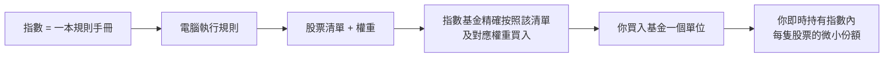
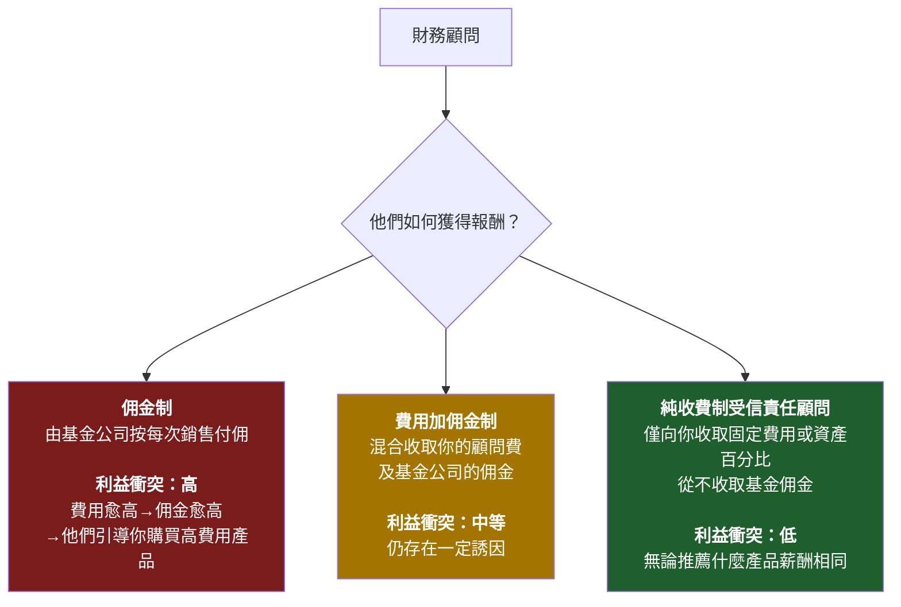
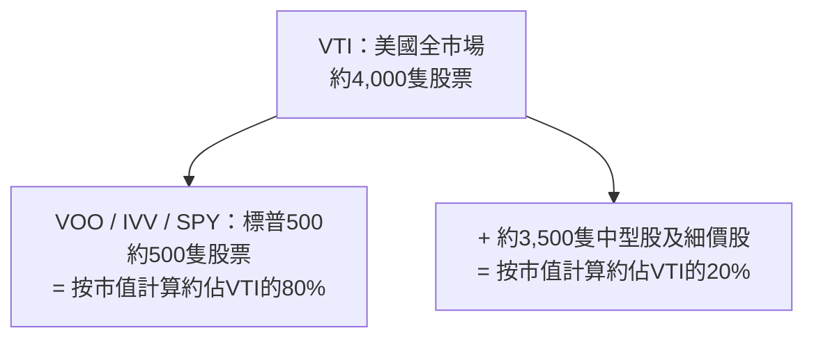
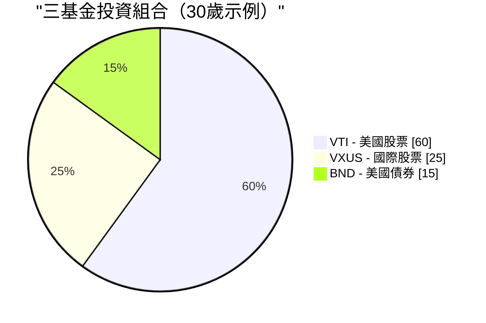

# 第二週：指數基金與交易所買賣基金

動畫參考：`animation/week02_active_vs_passive.py`

---

## 第一部分：閱讀章節

---

### 1. 為何這至關重要

上週我們確立了一個殘酷的事實：**通脹是地心引力，不投資才是你能做的最昂貴之事。** 現在的問題是*如何*投資。而這個答案，投資界花了四十年才肯承認：對幾乎所有人而言，正確答案是**低成本指數基金或交易所買賣基金。** 不是選股。不是你銀行的「財富管理顧問」。不是你姐夫的「必勝貼士」。也不是你保險代理人迫不及待要賣給你的結構性產品。

這是整個課程最重要的一課，而且它確實簡單。如果你在第二週看完就停下來，設定每月自動購買一隻覆蓋廣泛市場的指數交易所買賣基金，此後不再讀任何一本財務書籍，**你的表現仍將超越這個星球上絕大多數投資者——包括那些拿著數百萬薪酬管理他人資金的專業人士。**

這不是推銷辭令。這是四十年來數據所呈現的結論：

- **美國大型股主動管理基金中，大約九成在二十年內跑輸標普500指數**——每年由標普道瓊斯指數發布的SPIVA記分卡均有記錄。
- **預測基金未來表現的最佳單一指標是開支比率。** 不是基金經理的學歷背景，不是品牌，不是過往回報。是費用。費用愈低→平均而言未來回報愈高。（晨星已在一項又一項研究中反覆確認這一點。）
- **華倫·巴菲特——史上最著名的主動投資者——在遺囑中指示，他妻子的遺產應投入「一隻極低成本的標普500指數基金」。** 如果這位有史以來最偉大的選股者告訴自己的遺孀放棄選股，這本身就說明了一切。

因此，我們本週將圍繞三件事展開。第一，指數基金究竟是什麼，以及它如何誕生的那段帶點離經叛道色彩的歷史。第二，金融行業剝奪散戶財富的四大手法——高費用主動基金、佣金驅動的顧問、以保險包裝的「投資」產品，以及慢慢侵蝕財富的傳統互惠基金——以及如何繞開每一個陷阱。第三，你實際需要的那幾隻股票代號。

最後還有一個誠實的伏筆：**指數基金的共識已運作了四十年。但這並不保證它永遠有效。** 它在何時、以何種方式可能失效，以及你該如何應對，是我們在後面許多週才會回頭探討的話題。現在，我們先打好地基。進階的操作日後才來——是建立在這個地基之上，而非取而代之。

> *「投資是必須。這門課裡的其他一切工具，都是錦上添花。」*

---

### 2. 你需要了解的內容

#### 2.1 什麼是指數？

**指數**是一份按照一套規則篩選股票（或其他資產）的清單。沒有人「管理」這個指數——它就是其規則所定義的那個樣子。標普500是「符合特定流動性、盈利能力及上市標準的500家最大型美國公司，按市值加權」。這就是完整的定義。一台電腦就能執行它。

當新聞說*「今天市場上升了2%」*，他們幾乎總是指標普500上升了2%。

你將會聽到的主要指數：

| 指數 | 追蹤對象 | 持倉數目 |
| --- | --- | --- |
| **標普500** | 500家最大型美國公司 | 約500 |
| **CRSP美國全市場** | 整個美國股票市場 | 約4,000 |
| **道瓊斯工業平均指數** | 30家大型美國公司（按價格加權，屬舊式設計） | 30 |
| **納斯達克綜合指數** | 納斯達克上市全部股票 | 約3,000 |
| **納斯達克100指數** | 100家最大型非金融類納斯達克股票（科技股為主） | 100 |
| **羅素2000指數** | 2,000家美國小型公司 | 約2,000 |
| **MSCI歐澳遠東指數** | 美國及加拿大以外的已發展市場 | 約800 |
| **MSCI新興市場指數** | 新興市場國家 | 約1,400 |
| **富時100指數** | 100家最大型英國公司 | 100 |

**大多數主要指數均按市值加權。** 這意味著一家公司在指數中的權重，與其總市值成正比。市值約三兆美元的蘋果公司，在標普500中佔約7%的權重；而市值約100億美元的最小成分股，則只佔約0.02%。排名前十的公司，佔整個指數的**30至35%左右。** 當你「買入標普500」時，你買到的大型股集中度，遠遠高於「500隻股票」這個名稱所暗示的程度。

這就是整個運作機制。其中毫無天才之處。這恰恰是它奏效的原因。

---

#### 2.2 指數基金——博格的離經叛道之舉

指數基金直到1976年才誕生。在那之前，美國每一隻互惠基金都是主動管理的：穿著西裝的聰明人挑選股票，每年收取1至2%的費用。當年的數學和現在一樣——大多數人跑輸市場平均水平——但這個學術發現尚未轉化為一個真實的產品。

**把這個數學變成產品的人，是約翰·博格。** 博格曾在1974年被迫離開威靈頓管理公司。1975年，他創立了一家奇特的新型共同基金公司，名為**先鋒集團（Vanguard）**，以互惠結構運作——由其基金持有人共同擁有，沒有外部牟利動機。1976年，先鋒推出了**第一指數投資信託**，這是首隻零售指數基金：它將按指數權重買入標普500全部500隻成分股，並收取極低的費用。

業界嘲笑了它。媒體稱之為**「博格的蠢行」。** 經紀人拒絕銷售它（因為無佣金可賺）。該基金在首次公開招股時只籌得1,100萬美元——僅為博格目標1.5億美元的零頭。競爭對手稱此想法**「不愛國」**，**「是平庸的保證書」。**

競爭對手說它保證平庸是對的——*如果「平庸」的定義是「市場平均水平減去幾個基點的費用」的話。* 他們沒有算到的是：市場平均水平減去幾個基點，二十年後仍然跑贏了大約九成的專業人士。

今天，先鋒集團管理著逾**八兆美元**的資產，而指數基金及交易所買賣基金這個類別在全球合共管理著**逾二十兆美元**。博格的「蠢行」已成為全球零售股票投資的主流形式。他本人在2019年辭世，但他從未像其他八兆美元資產管理公司創辦人那樣讓自己致富——先鋒的互惠結構意味著節省下來的費用流回基金持有人，而非他個人。在金融界，他是極少數值得被稱為*英雄*而無需打引號的人。

> 「不要在草堆裡尋找針。直接把整個草堆買下來。」——約翰·C·博格

---

#### 2.3 互惠基金對比交易所買賣基金——互惠基金依然存在的原因（以及你為何應主要選用交易所買賣基金）

**指數基金**是一種*策略*——追蹤指數。這個策略可以包裝在兩種不同的*結構*中：

- **互惠基金**，每天以收市後的資產淨值報價及交易一次。
- **交易所買賣基金（ETF）**，在交易所即時買賣，如同一隻股票。

| 特點 | 互惠基金 | 交易所買賣基金 |
| --- | --- | --- |
| 交易時間 | 每天**收市後**按資產淨值交易一次 | **全日**即時交易，如同股票 |
| 最低投資額 | 通常需要**1,000至3,000美元** | **一個單位的價格**（或碎股） |
| 稅務效率（應稅賬戶） | **較差**——資本增值分派強制發放予所有持有人 | **較好**——實物贖回機制保護持有人 |
| 佣金 | 在基金自身的券商平台為零 | 大多數券商為零 |
| 方便自動定投 | **是**（任意金額，任意日期） | 有時較困難（除非支持碎股否則需要整數單位） |

**在2026年，交易所買賣基金在幾乎每個重要維度上都勝出**——更低的投資門檻、即時報價、顯著更好的稅務效率，以及平均更低的開支比率。互惠基金仍然具有真正優勢的情況只有：

1. **401(k)及其他僱主退休計劃。** 大多數美國401(k)菜單仍以互惠基金為主。計劃管理員尚未完成轉換，你通常無法自行將交易所買賣基金帶入計劃。在401(k)中，互惠基金的稅務問題基本上無關痛癢（賬戶本身享有稅務優惠），因此結構選擇是被動接受的，也無傷大雅。
2. **按固定金額設置並忘記的自動定投。** 先鋒的互惠基金允許你設定「每月1號投入500美元」，他們會精確執行，包括購買碎股單位。交易所買賣基金的自動定投功能雖然存在，但取決於具體的券商。

**基本上就這樣。** 在2026年的普通應稅券商賬戶中，同一指數的交易所買賣基金版本，對幾乎每一位散戶而言，在成本和稅後回報上都將勝過互惠基金版本。**默認選擇交易所買賣基金。** 如果你只能透過401(k)投資，互惠基金也沒問題——在菜單中選擇最便宜的廣泛市場指數選項，繼續前進即可。

互惠基金之所以仍以龐大規模存在，並非因為它們*更好*。而是因為**數兆美元的既有資金正躺在401(k)、個人退休賬戶及舊有券商結單中**，若要轉換出來，將產生應稅的資本增值。是惰性，不是優勢。新投入的資金幾乎應該永遠選擇交易所買賣基金。

---

#### 2.4 主動對比被動——九成的統計數據

**主動投資**意味著基金經理（或你自己）嘗試挑選贏家股票，規避輸家。研究、分析、頻繁交易、堅定押注。這正是每一隻主動管理型互惠基金和對沖基金所做的事，也是他們向你收費的理由。

**被動投資**意味著買入整個指數並接受平均水平。沒有預測，沒有押注，沒有個人魅力。

正統的問題是*「主動基金經理能否跑贏指數？」* 標普道瓊斯指數發布的SPIVA記分卡連續二十多年給出的正統答案是**大致不能。** 時間跨度愈長，情況愈差：

| 類別（美國） | 5年跑輸比例 | 10年跑輸比例 | 20年跑輸比例 |
| --- | --- | --- | --- |
| **美國大型股** | 78% | 85% | **90%** |
| **美國中型股** | 74% | 83% | 89% |
| **美國細價股** | 68% | 79% | 88% |
| **國際股票** | 71% | 82% | 87% |
| **新興市場** | 69% | 80% | 85% |
| **美國投資級債券** | 72% | 81% | 86% |

*（根據近期SPIVA報告的大致數字；確切數字逐年略有波動，但定性規律保持不變。）*

> 翻譯成白話：每100位美國大型股基金經理中，**90位在二十年內輸給了一台運行500個名字簡單清單的電腦。**

接下來是更致命的一個問題：**這贏的10位，下一個十年並非同一批人。** 標普的持續性研究反覆顯示，過去五年位居前四分之一的基金，在接下來五年跌出前四分之一的機率往往超過一半。過往的超額表現無法預測未來的超額表現——每份基金招股說明書底部的那句警示語是真的，而大多數投資者視而不見。

主動基金經理總體上無法跑贏指數，有五個原因：

1. **費用。** 主動基金每年收取0.5至1.5%。指數交易所買賣基金收取0.03%。基金經理每年必須跑贏指數**超過整整一個百分點**，才能在費用層面打平廉價選項。
2. **交易成本。** 每一次買賣都有摩擦——買賣差價、市場衝擊、機構端的佣金。高換手率策略持續流血。
3. **稅務。** 高換手率在互惠基金中觸發資本增值分派，無論你是否賣出，均須在分派當年繳稅。
4. **市場基本上是有效的。** 數以萬計的專業人士在讀同樣的年報，聽同樣的業績發布會，使用同樣的衛星數據。真正的優勢極為罕見。
5. **存活者偏差。** 表現差的基金被悄悄清盤或合併入其他基金。剩餘的「主動基金」整體看起來比實際更好，因為最差的輸家已被掩埋。

---

#### 2.5 開支比率——你能掌控的最大單一槓桿

**開支比率**是基金每年收取的費用，每天從基金資產中自動扣除。你永遠看不到賬單。它只是以略低的回報形式呈現。

這種隱形性，正是它作為財富提取機制得以奏效的根本原因。**1%的費用聽起來微不足道。三十年後，它將吞噬你最終財富的大約25至30%。** 複利是一把雙刃劍：它讓你的錢增長，也讓費用增長。

10萬美元以10%的毛回報投資三十年：

| 基金類型 | 開支比率 | 淨回報 | 第30年末價值 | 相對指數損失的費用 |
| --- | --- | --- | --- | --- |
| **指數交易所買賣基金**（如VOO） | **0.03%** | 9.97% | **$1,721,686** | — |
| 低費用主動基金 | 0.50% | 9.50% | $1,526,688 | **−$194,998** |
| 平均水平主動基金 | 1.00% | 9.00% | $1,326,768 | **−$394,918** |
| 高費用主動基金 | 1.50% | 8.50% | $1,152,309 | **−$569,377** |
| 保險產品包裝 | 2.00% | 8.00% | $1,006,266 | **−$715,420** |

再讀一遍最後一行。**一個2%的包裝結構，令10萬美元的投資損失逾70萬美元。** 這不是費用。那是一套房子。視乎城市，可能是兩套。它從你的退休金流向了基金公司的薪酬、市場推廣預算、辦公室租約，以及行政總裁的薪酬方案。

**費用在每種市場環境下都在複利積累。** 市場下跌30%的那一年，你仍然要繳費。基金經理跑贏指數0.4%的那一年，你仍然欠繳1.0%。費用是基金招股說明書上唯一有保證的數字。

還有兩個業界不希望你真正內化的事實：

- **在任何基金類別中，費用較低的基金平均而言跑贏費用較高的基金。** 這是基金研究中被複製次數最多的發現——晨星已在不同資產類別和不同年代中反覆驗證。某個類別中最便宜的基金，平均而言就是該類別中最好的基金。
- **費用是*確定*的拖累。基金經理的超額表現是*期望中*的補償。** 以確定性換取希望，在任何其他領域都被公認為一筆壞買賣。

---

#### 2.6 財務顧問陷阱

如果主動基金表現如此差勁，為何每家銀行、每家券商、每個「財富管理」部門仍在持續銷售它們？因為**財務顧問的薪酬結構，使得向你銷售它們對*顧問*而言是理性的**，即使對你而言是非理性的。

你會遇到三種薪酬模式：

**向任何顧問提問的最重要一句話：*「你是否具有受信責任，並且採用純收費制？」*** 具有受信責任的顧問在*法律上*必須以你的最大利益行事。非受信責任的銷售人員只須推薦「合適」的產品——這是一個低得多的門檻，歷史上曾允許將高費用垃圾產品賣給任何有資格簽名的人。

你銀行的「私人財富管理顧問」之所以如此積極地想把一隻1.5%開支比率、5%前端手續費的主動基金塞給你，是因為銀行兩頭賺錢：它在你買入時賺取手續費，*並且*在你持有期間持續收取12b-1行銷費的分成。**你不是他們的客戶；你是他們的產品。** 基金公司正在付錢讓他們把你「交付」過去。

應對非受信責任顧問推銷主動基金，最乾淨的回應是：*「請以書面形式向我展示，持有這隻基金十年的全部成本——開支比率、銷售手續費、12b-1費用、顧問費、賬戶管理費。同時請告知我貴公司從該基金家族獲得的薪酬。」* 如果他們拒絕或拖延，你已得到答案。

> **默認原則：** 除非你已擁有數百萬美元且面臨真正複雜的稅務狀況，否則你幾乎肯定不需要財務顧問。你需要的是一隻交易所買賣基金和一個每月自動轉賬。

---

#### 2.7 保險「投資」幾乎都是騙局

我希望在這裡說得格外直接。**變額萬用壽險、指數型萬用壽險、以「投資」名義銷售的終身壽險、股票掛鈎儲蓄產品、向散戶推銷的結構性年金——這些幾乎無一例外，都是設計用來從不知自己正被收費的人身上提取費用的掠奪性產品。**

推銷話術永遠是以下幾種組合：

- *「稅務優惠增長。」*
- *「本金保護。」*
- *「股市升幅，無需承擔跌幅。」*
- *「強制儲蓄紀律。」*

現實幾乎總是：

- **若在首5至10年退出，須繳付5至10%的退保費用。**
- **每年全部費用合計高達2至4%**，藏在晦澀的語言之中（「死亡及費用風險費」、「附加保障費」、「行政費」、「基金管理費」，層層疊加）。
- **扣除費用後的回報遠遜於基本指數交易所買賣基金**——往往在市場給出8至10%的情況下，只帶來2至4%的淨回報。
- **向代理人支付的佣金，有時相當於你第一年保費的80至100%**，這正是它們被如此賣力推銷的原因。

保護你終身的簡單原則：

> **保險是用於轉移風險的。投資是用於創造財富的。永遠不要將兩者混為一談。**

如果你有受養人，而他們的財務狀況在你離世後將受到損害，**購買定期壽險**——純粹、廉價、固定期限的保障，不含任何投資成分。一位身體健康的三十歲人士，可以大約每月25至35美元買到一份20年、100萬美元保額的定期保單。然後把定期保費與代理人原本向你收取終身壽險的差額，**投入指數交易所買賣基金。** 這是教科書級別的策略：**「買定期險，投資差額。」** 在任何二十年的區間內，這個策略在稅後淨資產方面都以數量級優勢勝過終身壽險——而且你保有對投資部分的完全控制權和完全流動性。

代理人會告訴你終身壽險「強制你儲蓄」。每月向券商賬戶自動轉賬同樣如此，而且那個方法不需要向他們支付80%的佣金。

---

#### 2.8 誠實的反例——確實奏效的主動基金

我在過去幾個章節裡猛烈抨擊了主動管理。為了保持知識誠信，我必須坦白說明：**確實有一小部分主動基金經理跑贏了指數，而且是果斷地、持續數十年地跑贏。** 數量不多——但足以值得正視。

值得關注的例子：

- **沃倫·巴菲特和查理·芒格掌舵下的巴郡哈撒韋。** 從1965年至2020年代初，巴郡的每股賬面值複合增長率約為**每年20%**，相對標普500的約10%——這是現代金融史上最令人印象深刻的長期業績記錄。巴菲特是「部分主動管理確實有效」的教科書例證。同時，他也正是那位在遺囑中指示遺孀把遺產投入標普500指數基金的巴菲特。他是那個例外，而他在告訴你——你不是那個例外。
- **彼得·林奇執掌富達麥哲倫基金，1977至1990年。** 林奇執掌麥哲倫13年，年均回報率約**29%**，在這13年中有11年跑贏標普500——可說是有記錄以來最優秀的互惠基金業績。他在46歲退休。林奇離任後，麥哲倫基金大致回歸了追蹤指數的水準。
- **文藝復興科技的獎章基金，約始於1988年。** 一隻高頻、高數學含量、僅供員工參與的量化基金，據報導在**扣除其5%及44%的費用結構後**，三十多年來每年回報率約40%。獎章基金自1993年起已對外部投資者關閉，而文藝復興旗下*面向外部投資者*的基金（RIEF、RIDA）表現則差得多——有時在獎章基金盈利70%的年份虧損。**獎章基金是真實、持久的阿爾法存在的證明。同時也是真實的阿爾法被封閉、永遠無法觸及你的證明。**
- **賽斯·卡拉曼的鮑波斯特集團。** 數十年來，藉由堅守深度價值框架，並在沒有合適機會時持有極大比例的現金，實現了股票般的回報，且結構性波動低於市場。卡拉曼的著作《安全邊際》的二手售價超過1,000美元，因為他拒絕重印。
- **喬爾·格林布拉特在戈坦資本，1985至1994年。** 在一個小型特殊情況投資組合上，十年間每年回報率約50%，之後將外部資本悉數歸還。格林布拉特其後在《你也可以成為股市天才》和《股市穩賺》兩書中公開了他的操盤手冊——他明確押注這個策略*「市值太小、太令人不舒服、所需耐性太長」*，大多數讀者根本無法真正執行。

請注意其中的規律。數十年來確實能跑贏指數的基金，要麼是**對新資金關閉**（獎章基金），要麼是**在巔峰期間歇性關閉**（麥哲倫基金的頂峰時期），要麼是**一家本身就是獨特存在的控股公司**（巴郡），要麼是**規模小到擴大就會摧毀優勢**（格林布拉特的早期年份），要麼是**極度集中且需要在多年最大回撤中持倉，而大多數投資者根本無法承受**（卡拉曼）。

這個教訓不是「主動管理從不奏效」。而是**真正有效的主動策略，很少是你能從銀行產品菜單上買到的那種。** 而你*能*從銀行產品菜單上買到的主動基金，整體而言就是SPIVA記分卡追蹤的那九成輸家。

如果你有時間、氣質，並且在市場某個特定角落確實擁有真實且持久的優勢，盡管在那裡集中倉位。大多數讀者沒有。**大多數讀者應該把大部分資金做指數投資，把時間花在其他地方。**

---

#### 2.9 你實際需要的基金

你不需要記住市面上數以千計的交易所買賣基金。你只需要這份短名單：

| 代號 | 基金 | 開支比率 | 追蹤對象 |
| --- | --- | --- | --- |
| **VOO** | 先鋒標普500交易所買賣基金 | **0.03%** | 500家最大型美國公司 |
| **VTI** | 先鋒美國全市場股票交易所買賣基金 | **0.03%** | 整個美國市場（約4,000隻股票） |
| **IVV** | iShares安碩核心標普500交易所買賣基金 | 0.03% | 標普500（貝萊德版本的VOO） |
| **SPY** | SPDR標普500交易所買賣基金 | 0.09% | 標普500（歷史較久，費用較高，交易員愛用） |
| **VXUS** | 先鋒全球（美國以外）股票交易所買賣基金 | 0.07% | 所有非美國已發展及新興市場 |
| **VT** | 先鋒全球股票交易所買賣基金 | 0.07% | 全球股市（美國加非美國，一隻基金搞定） |
| **BND** | 先鋒美國全債市交易所買賣基金 | 0.03% | 美國投資級債券 |
| **QQQ** | 景順納斯達克100交易所買賣基金 | 0.20% | 100家最大型非金融類納斯達克股票（科技股為主） |

**VOO對比VTI對比SPY**是問得最多的問題。簡短版本：

- **VOO**和**IVV**追蹤同一指數（標普500），費用相同（0.03%）。任選其一都可以。
- **SPY**同樣追蹤標普500，但費用**高出三倍**（0.09%）。它的存在是因為它是美國第一隻交易所買賣基金（1993年），因此擁有最深厚的流動性——機構交易員在乎這一點，長期投資者不需要在乎。**不要為你不需要的流動性多付三倍費用。**
- **VTI**持有整個美國市場（約4,000個標的），而非僅僅是最大的500家。實際上，VOO和VTI的回報幾乎相同，因為標普500佔美國市值的約80%。如果你想選一隻基金同時獲得略多的分散投資，選VTI。如果你想選一隻基金且追蹤所有人都在引用的那個最主流的指數，選VOO。**這兩者之間沒有錯誤答案。**

---

#### 2.10 如何實際買入一隻

這是整個操作流程，只需15分鐘：

1. **開設一個券商賬戶。** 美國居民：富達（Fidelity）、嘉信理財（Schwab）或先鋒（Vanguard）——三者均免費，三者的平台均合理易用。香港／台灣／新加坡居民：盈透證券（Interactive Brokers）是廉價購買美國上市交易所買賣基金的標準跨境選擇。
2. **連結銀行賬戶並轉入資金。** ACH電子轉賬需要1至3個工作日。
3. **搜索代號。** 輸入「VOO」。基金資料頁面彈出。
4. **下達買入盤。** 市價盤即按當前價格買入。輸入股份數量或金額（大多數券商現已支持碎股）。
5. **設定每月自動定投。** 例如，每月1號投入500美元。然後忘記它的存在。

就這樣。**五步。十五分鐘。你現在持有了美國500家最大型公司的一小部分份額。** 不需要看CNBC。不需要盯著投資組合。不需要選股的焦慮。

按下買入後最重要的事，是**關掉應用程式，停止盯著它看。** 市場每天上下波動。每天觀察走勢，是導致投資者行為失當的最大單一原因——恐慌性拋售，亢奮時追入。指數交易所買賣基金策略那些能跑贏SPIVA的長期回報，每一分錢都來自於*在噪音中持倉*，而非圍繞噪音交易。

---

#### 2.11 三基金投資組合

對大多數讀者而言，一個博格式的**三基金投資組合**確實就是整個投資組合：

| 基金 | 代號 | 建議配置比例（30歲） |
| --- | --- | --- |
| 美國全市場股票 | **VTI** | 60% |
| 全球（美國以外）股票 | **VXUS** | 25% |
| 美國全債市 | **BND** | 15% |

關於債券比例，大致的**傳統經驗法則**是：**債券佔比 ≈ 你的年齡減20**，前後浮動。30歲持有約10至15%的債券。65歲持有約45至55%的債券。教科書的邏輯是：債券是*壓艙石*：當股票下跌時債券上漲，它們降低投資組合的波動性，並在臨近退休的年份保護你免受股票50%最大回撤之苦——那時你已等不起十年讓它恢復。

> **我欠你一個提前聲明，哪怕在這個基礎課節也要說清楚：** 那個傳統邏輯是在一個已不復存在的世界裡建立的。
>
> 「債券作為壓艙石」的框架建立在兩個假設之上：（a）債券提供高於通脹的實際收益率；（b）債券在股票下跌時上漲。**這兩個假設在2020年代均已打破。** 在各國政府以印鈔融資赤字的背景下（第一週第2.2節），以及中央銀行將實際收益率刻意壓低至通脹以下作為政策手段（即「金融抑制」），在通脹週期中持有長期債券基金並非壓艙石——而是購買力的緩慢流失。2022年，股票和債券雙雙下跌約20%，這恰恰是60/40含債券組合應該保護你免受的那種情境。
>
> 因此，請將上表中的債券比例視為**本課程其餘部分將挑戰的教科書起點。** 我們將在課程後續回頭探討，在一個貨幣超發的世界裡，真正扮演壓艙石角色的是什麼：
>
> - **第5週（債券）**深入分析債券究竟是什麼，歷史上的對沖效果為何有效，以及它在何種條件下失效。
> - **第6週（黃金與商品）**介紹另一種抗通脹資產——黃金在人類有史以來每一種貨幣體制下都是價值儲存手段，而2020年代支持黃金的論據遠比支持長期債券的論據更為充分。
> - **第47週（尾部風險對沖）**和**第5級整體**，才是真正重新構建投資組合安全側的地方——使用現金／短期國債、黃金和長波動性期權結構的組合，而非傳統的長存續期債券倉位。
>
> 就你今天建立的基礎投資組合而言，三基金模板是合理的，遠好過不投資。**只是要明白，債券比例是這個投資組合中「保質期」最短的部分，我們將會回頭替換它。**

這個整體投資組合的混合開支比率：**每年約0.04%。** 即每10,000美元每年*四美元*。涵蓋所有主要資產類別的全球分散投資組合。

---

#### 2.12 直至它不再有效——一個伏筆

我花了整個章節告訴你指數交易所買賣基金是答案。我希望以一個讓我成為誠實老師而非推銷員的限定語作結。

**買入持有的被動指數策略在過去四十年——大致自1980年代初——表現非凡。** 它之所以奏效，是因為一套特定條件的組合：比退休人口規模更大的在職人口在每個發薪週期機械性地買入；利率持續下降；美元的儲備貨幣地位；全球化；以及2008年以來，每當金融條件收緊過度，美聯儲就會持續出手干預。

**這些順風因素沒有一個是永遠保證會繼續吹的。**

當人口結構翻轉到來——當嬰兒潮一代從淨買入者（積累期）轉變為淨賣出者（提取期）——四十年來機械性推高指數的同一條管道，可以反向運作。被動基金並非自主運轉；它們對其終端投資者的淨流入或淨流出作出反應。一個在上行過程中由價格不敏感資金流主導的市場，在下行過程中同樣容易受到價格不敏感資金流的衝擊。

**這不是預測指數明天就會停止有效。而是誠實地承認「它過去四十年有效」與「它永遠有效」並不是同一回事。**

對*你*而言，今天，建立你的第一個投資組合：**指數交易所買賣基金是正確的答案。** 打好地基。讓每月自動轉賬跑起來。在你學習課程其餘部分的未來幾年，讓它複利增長。

關於指數何時及如何可能失效，以及你到時該向何處遷移的詳細討論——這是我們在本課程其餘部分共同建立的內容：

- **第23週（因子投資）**介紹了純市值加權指數之外的第一批替代方案——價值、動量、質量、低波動性傾斜，這些因子歷史上捕捉到了市值加權指數所遺留的回報。
- **第43週（主動投資組合管理）**深入探討主動管理*確實*物有所值的情況，以及不值的情況。
- **第5級（第47至52週）**是我們真正建立「槓鈴式」投資組合形態的地方——一端是高確信度的安全資產，另一端是不對稱的投機倉位，中間那個廣泛市值加權的核心被刻意*移除*。那是進階形態，建立在第2至46週所有內容之上。

現在：**投資是必須。指數交易所買賣基金是地基。這門課裡的其他一切，都是建立在上面的錦上添花。** 如果你無法跑贏指數——而大多數人，在大多數時候，都無法做到——那就不要浪費你的人生去嘗試。讓指數替你完成工作，把你的時間花在能在你的人生而非你的試算表中產生複利的事情上。

但要理解，「買入持有指數」是一個條件性策略，在特定的四十年窗口期內奏效。我們將回頭探討這個窗口關閉後會發生什麼。現在，這個地基已經足夠。

---

### 3. 常見誤解

**誤解一：「指數基金只適合初學者。」**

指數基金和交易所買賣基金被主權財富基金、大學捐贈基金、退休基金和億萬富翁使用。加州公共僱員退休基金（CalPERS）——全球最大的退休基金之一——運行大規模的指數基金委託投資。沃倫·巴菲特，*那位*史上最著名的主動投資者，2008至2017年公開贏得了一筆100萬美元的賭注，賭的是一隻標普500指數基金將跑贏一籃子精心挑選的對沖基金，並以明顯優勢獲勝。指數投資不是初學者的選擇；它是經過理性選擇的選項，恰好也是最容易的。

**誤解二：「一分錢一分貨——費用愈高代表管理愈好。」**

在幾乎所有其他消費品類中，這是真的。在投資中，**這個關係是顛倒的。** 晨星已在不同資產類別和不同年代中反覆證明，**開支比率是預測未來基金表現的最佳單一指標**——比過往回報更好，比星級評級更好，比基金經理任期更好。費用愈高→預期未來回報愈低。便宜的基金平均而言是更好的基金。

**誤解三：「但我的財務顧問推薦了一隻主動基金。」**

許多財務顧問靠銷售特定基金賺取佣金——有時公開，更多時候藏在你永遠不會看到的不透明分成安排中。他們的誘因是推薦對*他們*報酬最豐厚的產品，而非讓*你*複利增長最快的產品。**務必詢問：「你是否為純收費制的受信責任顧問，以及你對你推薦的任何產品有何報酬？」** 如果他們不是，或者無法或不願以書面回答，請離開。

**誤解四：「指數基金在市場下跌時無法保護你。」**

正確——它無法保護你。它也不應該這樣做。指數在市場下跌時同樣下跌。相關的比較不是「指數對比現金」，而是「指數對比主動基金」。2008年標普500下跌約37%；平均主動管理美國股票基金下跌約39%。主動基金經理並未在崩市中保護你；平均而言，他們讓情況更差了一點。**在下跌市況中的保護，來自你的*資產配置*（股票對比債券對比現金的比例）以及你的行為（不要恐慌性拋售），而非你的基金選擇。**

**誤解五：「我應該選擇過去五年業績最好的基金。」**

這是散戶投資者最常犯、代價最昂貴的錯誤。**表現最優秀的基金會均值回歸。** 標普的持續性研究，在數十年間一再重複，顯示前四分之一的基金，五年後仍留在前四分之一的比例遠低於一半。過往業績無法預測未來業績；每份基金招股說明書底部的那句警示語不是法律樣板文字，而是一句被所有人忽視的真話。追逐過去的贏家，在預期值上*比隨機選擇更差*。

**誤解六：「SPY和VOO追蹤同一指數，所以選哪個無所謂。」**

它們追蹤同一指數。但費用不同。SPY收取0.09%；VOO收取0.03%。500,000美元的投資組合持有三十年，這0.06%的差距複利累積後，損失的財富超過**25,000美元。** SPY唯一的結構性優勢是其交易流動性，這只對移動大規模資金的機構或日內交易者有意義——對買入持有的投資者沒有意義。**對於長期持有者，VOO或IVV在成本上永遠勝過SPY。**

**誤解七：「我需要通過持有許多不同的指數基金來分散投資。」**

VTI這樣的單一全市場基金本身已持有約4,000隻股票。加上VXUS，又增加了約7,000隻國際股票。**兩隻交易所買賣基金已覆蓋全球每個主要經濟體約11,000隻股票——在股票層面已沒有什麼剩下可以分散的了。** 持有10隻以上的指數交易所買賣基金，通常只會製造重疊（同一隻蘋果、微軟和輝達在多隻基金中以不同權重重複出現）和虛假的分散感。兩至三隻基金足夠。超過五隻，通常是思路混亂的信號，而非老練的體現。

**誤解八：「指數基金很危險，因為你無法迴避差劣的公司。」**

指數基金確實持有那些最終破產的公司。2001年安然公司崩潰時，它在標普500中佔約0.7%——聽起來痛苦，但對整個投資組合而言無足輕重。其餘499家公司繼續複利增長。**指數內的分散投資——數百甚至數千個標的，沒有一個大到足以單獨毀掉你——正是保護所在。** 一位恰好重倉安然的集中選股者，在這個標的上血本無歸。指數投資者損失了0.7%。

**誤解九：「終身壽險是好的投資，因為現金值可以免稅增長。」**

並非如此，而現金值的推銷正是這個產品被銷售的方式。終身壽險現金值的實際回報，在扣除代理人佣金、退保費用計劃和層層疊加的年費後，通常只有**淨2至4%**，而同期指數交易所買賣基金原本可給你7至10%。**為實際身故保障需求購買定期壽險，然後把定期保費與終身壽險保費的差額投入指數交易所買賣基金。** 這就是教科書式的「買定期險，投資差額」策略。在幾乎所有現實情境下，它都在比較中勝出；代理人的佣金正是他們永遠不會推薦這個策略的原因。

---

### 4. 問答

**問1：交易所買賣基金究竟是什麼，它與股票有何不同？**

**交易所買賣基金（ETF）**是把一籃子證券打包成一個單一工具，像股票一樣在交易所買賣。買入一個單位的VOO，就是買入了標普500全部500家公司的一個微小比例份額。**一隻股票代表一家公司；一隻交易所買賣基金代表一個定義好的組合。** 交易機制相同——股票代號、即時報價、在交易時段買賣——但你同時獲得了即時的分散投資。

**問2：VOO、VTI還是SPY——哪一個？**

對於長期買入持有：**VOO或VTI**，兩者均為0.03%。VOO = 標普500（約500個標的）；VTI = 整個美國市場（約4,000個標的）。它們的表現幾乎相同，因為標普500按市值計算佔美國市場的約80%。任選其一都可以。**SPY是給交易員的，不是給投資者的**——相同的風險暴露，費用高出三倍。

**問3：我的投資組合中應有多少比例放在指數交易所買賣基金？**

對於二十至四十歲正在建立第一個投資組合的大多數讀者：**股票倉位的80至100%**放在廣泛市場指數交易所買賣基金。股票與「安全資產」的確切比例，取決於年齡和風險承受能力：

| 年齡 | 股票佔比 | 安全資產佔比 |
| --- | --- | --- |
| 20–35歲 | 80–90% | 10–20% |
| 35–50歲 | 70–80% | 20–30% |
| 50–65歲 | 50–70% | 30–50% |
| 退休後 | 30–50% | 50–70% |

**關於「安全資產」而非「債券」的說明：** 教科書上平衡股票倉位的傳統選擇是債券配置，前提是債券在股票下跌時上漲。正如第2.11節所標記的，這個假設在2020年代已打破——2022年股票和債券雙雙下跌，而在金融抑制下債券也不再提供高於通脹的實際收益率。**因此，「安全資產」倉位應理解為一籃子與股票市場不相關（或負相關）的資產，而不僅僅是債券。** 傳統債券配置是其中一個組成部分，但現代的安全資產倉位還包括短存續期國債和現金等價物、黃金及其他貨幣金屬（第6週），以及——在更進階的層面——長波動性期權結構和尾部對沖覆蓋（第47週，第5級）。對於你今天建立的第一個投資組合，BND這樣的廣泛債券交易所買賣基金是一個合理的起點；課程的其餘部分將告訴你如何隨著學習深入替換和補充它。

在股票配置內，常見的大致分配是約70%美國（VTI）和約30%國際（VXUS）。

**問4：開支比率對比銷售手續費——有何區別？**

**開支比率**是每年的費用，每天從基金資產中扣除。10,000美元的0.03% = 每年3美元。**銷售手續費**是在你買入（前端手續費）或賣出（後端手續費）時收取的一次性佣金。10,000美元買入，收取5%前端手續費，意味著500美元立即消失，只有9,500美元真正被投入。**現代指數交易所買賣基金沒有銷售手續費。** 任何你看到的確實收取手續費的基金，幾乎都不值得購買。

**問5：如果九成主動基金經理跑輸，為何主動基金依然存在？**

因為它們對基金公司而言**利潤豐厚得驚人。** 一隻100億美元的基金按1%開支比率每年賺取1億美元的費用，無論業績如何。投資者輸給指數對投資者而言是壞買賣，但對基金公司而言是一門出色的經常性收入業務。加上購買CNBC黃金時段廣告的市場推廣預算、分銷它們的銀行網點、受薪銷售它們的財務顧問，以及相信那位能說善道的基金經理能跑贏平均水平的投資者心理——**主動基金行業得以延續，是因為它向價值鏈中除你以外的每個人付錢。**

**問6：指數基金會歸零嗎？**

理論上，只有在指數中的每一家公司同時破產的情況下才會如此——而那意味著整個美國經濟已崩潰，屆時任何金融資產的價值都不過是紙面數字。實際上，歷史上最嚴重的廣泛指數最大回撤（1929至1932年、2007至2009年、2020年新冠病毒閃崩），在峰值至谷底之間下跌了50至80%，並在十年內反彈至歷史新高。**一隻個別股票確實可以歸零，許多股票也確實歸零了。廣泛指數實際上不可能歸零。** 這種不對稱性，正是分散投資奏效的全部原因。

**問7：國際指數基金——我也應該持有嗎？**

大多數合理的資產配置都包含一定的國際風險暴露。美國按市值計算佔全球股票市場的約60%；其餘40%分布在歐洲、日本、新興市場及其他地區。國際分散投資可以降低投資組合的波動性，因為各地區市場並非完全同步移動。**VXUS**（先鋒全球（美國以外）股票交易所買賣基金），費用0.07%，一隻基金即覆蓋約7,000隻已發展及新興市場股票。常見的大致分配是**70%美國（VTI），30%國際（VXUS）**。

**問8：什麼是平均成本法，我應該用它投資指數交易所買賣基金嗎？**

**平均成本法（DCA）** = 無論市場走勢如何，定期投入固定金額。每個月500美元，每個月如此，不管市場在做什麼。當價格低時，500美元買到更多單位。當價格高時，500美元買到更少單位。結果是平均成本略低於持有期間的簡單平均市場價格，加上更重要的行為學好處：**你在恐慌的月份繼續投資，而不是等待那個感覺永遠不對的「最佳時機」。** 對於從薪酬中進行投資的人，平均成本法是自動實現的。對於持有一大筆錢的人，學術文獻結論不一——歷史上，一次性投入平均而言略微跑贏平均成本法（因為市場大多數時候是上漲的），但平均成本法在心理上更容易承受。

**問9：指數基金會派發股息嗎？**

會。指數內的公司向基金派發股息，基金收集後每季度轉發給持有人。VOO目前的股息收益率約為1.3至1.5%。大多數券商允許你開啟**股息再投資計劃（DRIP）**，自動將每次股息用於購買同一基金的更多單位。數十年來，**再投資的股息在股票總回報中佔了相當大的比例**——默認開啟股息再投資計劃。

**問10：我聽說過「智能貝塔」或「因子」交易所買賣基金——它們和指數基金一樣嗎？**

不完全是。傳統指數基金使用**市值加權**（公司越大，指數權重越大）。**智能貝塔**或**因子**交易所買賣基金仍然是基於規則的，並按系統性方式再平衡——因此類似指數——但它們按市值以外的某種*因子*加權：價值（基本面偏低估）、動量（近期贏家）、質量（健康的資產負債表）、低波動性（不起眼的股票）、小規模等等。開支比率高於純指數基金（通常為0.10至0.40%），因為再平衡規則更為複雜，但仍比主動基金便宜得多。**因子投資是一個重要的話題，我們將在第23週深入討論。** 不過，對於你的第一個投資組合，純市值加權指數交易所買賣基金是正確的起點。

**問11：我應該在指數交易所買賣基金之外購買個股嗎？**

如果你在某家特定公司或某個行業確實擁有持久的優勢——來自本職工作的領域專業知識，或對你所處行業的結構性洞察——那麼**在以指數為核心的同時，用一小部分「衛星」倉位持有個股是說得通的。** 一個常見的形態是80至90%放在廣泛市場指數交易所買賣基金，10至20%放在個股確信倉位。**你不應該做的**，是因為在社交媒體上看到了股票貼士、因為品牌熟悉，或是因為它上個月表現不錯而去買個股。SPIVA的九成統計，對散戶選股者的適用程度，比對職業基金經理更為殘酷——大多數散戶個股投資組合的表現，都大幅*跑輸*他們本可直接買入的指數。如果你無法用一句話說清楚為何一隻股票相對其基本面被錯誤定價，你就沒有優勢——你只有觀點。觀點本身沒有問題；只是不要按照優勢的規模去下注。

**問12：我不斷聽說指數「過度集中於大型科技股」——這是個問題嗎？**

這是一個真實的觀察。2026年，標普500前十大持倉（主要是大型科技股——蘋果、微軟、輝達、Alphabet、亞馬遜、Meta等），按權重計算佔整個指數的約**30至35%。** 買入VOO，所獲得的大型科技股集中度，遠超「500隻股票」這個名稱所暗示的程度。這是否構成*問題*，取決於你對這些公司的看法。覆蓋面更廣的VTI集中度略低一些（因為它把前十大標的的比重稀釋到約4,000個標的中），而明確按等權重追蹤標普500的交易所買賣基金（RSP，開支比率約0.20%）則走向另一個極端——同樣500個標的，但等權重配置。**現在，市值加權指數仍然是最簡單且歷史上表現最好的默認選擇。** 這個集中度問題，以及它對風險的影響，正是我們在第23週及其後發展出的那種有體制意識的思維方式。

---

## 第二部分：YouTube腳本

---

**視頻標題：** 這一隻交易所買賣基金跑贏九成華爾街專業人士 | 第二週

**目標時長：** 約30分鐘

**主持人：**
- **陳馬**（教師角色）：資深散戶投資者，以第一身講述數十年管理自身投資組合的經驗
- **小魚**（學生角色）：剛畢業的大學生，正在學習如何投資積蓄，提出觀眾心中所想的問題

---

**[開場 / 第0段：承諾]**

[VISUAL: Cold-open title card -- "$700,000. That's what your fees cost you."]

[ANIMATION: Hundreds of stock tickers swirling chaotically, then being swept into
a single basket labeled "ONE ETF". A subtitle fades in: "And it beats 90% of
the pros."]

**陳馬：** 如果你看完這一條視頻，此後在財務生活上什麼都不做——不買書，不聽播客，不用選股應用——你仍然會跑贏幾乎每一位華爾街的職業基金經理。

**小魚：** 這個說法可真大膽。

**陳馬：** 這不是我的說法。這是四十年來數據所呈現的結論。答案是低成本廣泛市場指數交易所買賣基金。不是你銀行的財富管理顧問。不是你姐夫的「必勝貼士」。不是保險代理人迫不及待要賣給你的結構性產品。

**小魚：** 但幾乎沒有人真的這樣做。

**陳馬：** 因為有一個規模數兆美元的行業，其生計依賴於你不這樣做。今天我想向你展示我自己投資組合的地基——然後，在最後，我會告訴你一件其他同類頻道永遠不會承認的誠實之事：這個策略過去四十年奏效，但這不保證它永遠有效。

**小魚：** 伏筆記下了。我們先從基礎開始。

[VISUAL: Title card -- "1. 什麼是指數？"]

---

**[第1段：什麼是指數？]**

**陳馬：** 在討論基金之前，我們先要定義指數。指數就是一份按照一套規則篩選股票的清單。沒有人管理它。標普500是「符合特定流動性及上市規則的500家最大型美國公司，按市值加權」。這就是完整的定義。一台電腦就能執行它。

**小魚：** 當新聞說「今天市場上升了2%」，他們是指標普500。

**陳馬：** 幾乎總是。標普500是美國的頭條指數，代表著約80%的美國市場總市值。

[VISUAL: Quick table flashes the major indices -- 標普500, CRSP美國全市場, 道瓊斯（30個標的，按價格加權，「屬舊式設計」），納斯達克綜合指數，納斯達克100，羅素2000，MSCI歐澳遠東，MSCI新興市場，富時100。]

**小魚：** 五百家公司的權重是平均分配的嗎？

**陳馬：** 不是，而這正是大多數人忽略的部分。標普500按市值加權。市值三兆美元的蘋果公司，佔約7%的權重。最小成分股的市值約為百億美元，只佔約0.02%。

[ANIMATION: Bar chart, top of week02_active_vs_passive.py -- 蘋果約7%，微軟約6.5%，向右側遞減至微小的一條。]

**陳馬：** 而前十大公司——蘋果、微軟、輝達、Alphabet、亞馬遜、Meta及其他幾家——合共佔整個指數的約30至35%。

**小魚：** 所以當我「買入標普500」時，我實際上是在買一個集中的大型股倉位。

**陳馬：** 比「500隻股票」這個名稱所暗示的，集中得多的大型科技股倉位。記住這一點。我們在課程後面還會回頭討論。

[VISUAL: Title card -- "2. 博格的離經叛道之舉"]

---

**[第2段：博格的離經叛道之舉]**

**陳馬：** 指數基金直到1976年才誕生。在那之前，美國每一隻互惠基金都是主動管理的——穿著西裝的聰明人挑選股票，每年收取1至2%的費用。當年的數學和現在一樣：大多數人輸給了市場平均水平。學術發現是有的，但沒有人把它包裝成一個產品。

**小魚：** 直到有人這樣做了。

**陳馬：** 一個名叫約翰·博格的人。博格在1974年被迫離開威靈頓管理公司。1975年，他創立了一家奇特的新型基金公司，名為先鋒集團（Vanguard），以互惠結構運作——由其基金持有人共同擁有，沒有外部牟利動機。1976年，先鋒推出了第一指數投資信託。它將按指數權重買入標普500全部500個標的，並收取極低的費用。

**小魚：** 華爾街怎麼反應？

**陳馬：** 華爾街嘲笑了它。媒體稱之為「博格的蠢行」。經紀人拒絕銷售它，因為無佣金可賺。首次公開招股只籌得1,100萬美元——僅為博格目標1.5億美元的零頭。競爭對手稱之為「不愛國」和「平庸的保證書」。

**小魚：** 而今天？

[VISUAL: Bold text card -- "先鋒今天：8兆美元。指數交易所買賣基金類別：20兆美元。" 博格的照片，生卒年份1929-2019。]

**陳馬：** 先鋒管理著逾八兆美元的資產。指數基金及交易所買賣基金這個類別在全球超過二十兆美元。博格的「蠢行」成為了全球零售股票投資的主流形式。而讓我視他為英雄的，是這一點：因為先鋒是互惠式所有，節省下來的費用流回了基金持有人，而非他個人。其他每一位八兆美元資產管理公司的創辦人都登上了福布斯榜單。博格沒有。他在2019年辭世。

**小魚：** 一位沒有令自己致富的金融界英雄。那是個很短的名單。

**陳馬：** 名單上只有一個人。他自己說的話是最好的總結：「不要在草堆裡尋找針。直接把整個草堆買下來。」

[VISUAL: Title card -- "3. 互惠基金對比交易所買賣基金"]

---

**[第3段：互惠基金對比交易所買賣基金]**

**陳馬：** 快速說明一下結構區別，因為很多人搞混。指數基金是一種*策略*——追蹤指數。這個策略可以用兩種不同的*結構*來銷售：互惠基金，每天以收市後的資產淨值報價及交易一次；或交易所買賣基金，在交易所即時買賣，如同一隻股票。

[VISUAL: Side-by-side comparison table -- 互惠基金對比交易所買賣基金，五行比較：交易時間、最低投資額、稅務效率、佣金、自動定投。]

**小魚：** 哪個勝出？

**陳馬：** 在2026年的普通應稅券商賬戶中，交易所買賣基金在幾乎每個重要維度上勝出——更低的投資門檻、即時報價、通過實物贖回機制實現的顯著更好的稅務效率，以及平均更低的開支比率。互惠基金仍能勝過交易所買賣基金的地方只有：401(k)賬戶內，選擇是被迫的且稅務問題無關痛癢；以及設定並忘記的固定金額自動定投，先鋒的互惠基金在這方面做得極好。

**小魚：** 那互惠基金為何依然到處都是？

**陳馬：** 惰性。數兆美元的既有資金正躺在401(k)、個人退休賬戶及舊有券商結單中，轉換出來會產生巨大的應稅資本增值。它們之所以存在，是因為移動它們的成本，而非因為它們更好。**新投入的資金幾乎應該永遠選擇交易所買賣基金。**

[VISUAL: Title card -- "4. 主動對比被動——九成的統計數據"]

---

**[第4段：主動對比被動——九成的統計數據]**

**陳馬：** 這是核心數據點。每年，標普道瓊斯指數發布SPIVA記分卡——「標普指數對比主動管理基金」。在二十年的時間窗口內，**大約九成的美國大型股基金經理跑輸標普500。**

[ANIMATION: image/week02_spiva.png animated in -- 柱形圖從五年的78%，攀升至十年的85%，再至二十年的90%。底部依次出現各類別：美國大型股、中型股、細價股、國際股票、新興市場、投資級債券。]

**小魚：** 100人中有90人。帶著一整隊分析師和金融博士。輸給了一份清單。

**陳馬：** 而更致命的後續：贏的那10人，下一個十年並不是同一批人。標普的持續性研究顯示，前四分之一的基金，在接下來的五年期間跌出前四分之一的機率往往超過一半。過往業績無法預測未來業績。每份基金招股說明書底部的那句警示語是真的。

**小魚：** 那他們為什麼贏不了呢？他們顯然很聰明。

**陳馬：** 五個原因，而且是結構性的——不是努力程度的問題。

[VISUAL: 五張卡片隨陳馬逐一列舉時依次堆疊出現。]

**陳馬：** 第一——費用。主動基金每年收取0.5至1.5%。指數交易所買賣基金收取0.03%。主動基金經理每年必須跑贏指數*超過整整一個百分點*，才能在費用層面打平廉價選項。第二——交易成本。買賣差價、市場衝擊、機構端的佣金。高換手率策略持續流血。第三——稅務。高換手率在互惠基金中觸發資本增值分派，無論你是否賣出，均須在分派當年繳稅。第四——市場基本上是有效的。數以萬計的專業人士在讀同樣的年報，聽同樣的業績發布會，使用同樣的衛星數據。真正的優勢極為罕見。第五——存活者偏差。表現差的基金被悄悄清盤或合併入其他基金。剩餘的「主動基金」整體看起來比實際更好，因為最差的輸家已被掩埋。

**小魚：** 翻譯成白話：每100位職業選股者中，90位在二十年內輸給了一台運行500個名字清單的電腦。

**陳馬：** 二十年的時間窗口內。是的。

[VISUAL: Title card -- "5. 開支比率——七十萬美元那張牌"]

---

**[第5段：開支比率——七十萬美元那張牌]**

**陳馬：** 現在我想讓費用這個問題無法被忽視。假設你在三十歲投入十萬美元，每年獲得10%的毛回報，持續三十年。唯一改變的變量是費用。

[ANIMATION: image/week02_expense_drag.png animated in -- 五條財富曲線在三十年間逐漸分叉。最上方是0.03%的指數交易所買賣基金，然後依次是0.50%、1.00%、1.50%，最下方是2.00%的保險產品包裝。]

[VISUAL: 最終金額卡片依次印在螢幕上：
0.03% -> $1,721,686
0.50% -> $1,526,688
1.00% -> $1,326,768
1.50% -> $1,152,309
2.00% -> $1,006,266
最後一行的「-$715,420」以紅色突出顯示。]

**陳馬：** 看最後一行。**一個2%的包裝結構，令十萬美元的投資損失逾七十萬美元。** 這不是費用。那是一套房子。視乎城市，可能是兩套。

**小魚：** 而那筆錢去了——

**陳馬：** 基金公司的薪酬。市場推廣預算。辦公室租約。行政總裁的薪酬方案。那是你的退休金，被轉移走了。

**小魚：** 市場下跌那幾年怎麼算？

**陳馬：** 你仍然要繳費。市場下跌30%的那一年，你仍然繳費。基金經理跑贏指數0.5%的那一年，你仍然欠繳整個1或2%。**費用是基金招股說明書上唯一有保證的數字。**

**小魚：** 而低費用基金的數據呢？

**陳馬：** 晨星已在不同資產類別和不同年代中反覆確認。在任何基金類別中，**費用最低的基金，平均而言就是該類別中最好的基金。** 費用愈低，預期未來回報愈高。這是基金研究中被複製次數最多的發現。大多數消費者的直覺是「一分錢一分貨」。在基金中，這個關係是顛倒的。

[VISUAL: Title card -- "6. 財務顧問陷阱"]

---

**[第6段：財務顧問陷阱]**

**陳馬：** 如果主動基金表現如此差劲，為何每家銀行、每家券商、每個「財富管理」部門仍在持續銷售它們？因為顧問的薪酬結構，使得向你銷售它們對*顧問*而言是理性的——即使對你而言是非理性的。

[ANIMATION: 三個框框出現——佣金制（紅色），費用加佣金制（琥珀色），純收費制受信責任顧問（綠色）。]

**陳馬：** 三種薪酬模式。佣金制——顧問靠每次銷售從基金公司獲得佣金。利益衝突：高。費用愈高，佣金愈高，他們越引導你購買高費用產品。費用加佣金制——混合收取你的顧問費及基金公司的佣金。利益衝突：中等。純收費制受信責任顧問——僅向你收取固定費用或資產百分比，從不收取基金公司費用。利益衝突：低。無論推薦什麼產品薪酬都相同。

**小魚：** 所以有一個問題能一刀切穿所有問題？

**陳馬：** **一個問題。背熟它。向每一位坐在你對面的顧問提問：「你是否具有受信責任，並且採用純收費制？」** 具有受信責任的顧問在*法律上*必須以你的最大利益行事。非受信責任的銷售人員只須推薦「合適」的產品——一個低得多的門檻，歷史上曾允許將高費用垃圾產品賣給任何有資格簽名的人。

**小魚：** 那銀行的「私人財富管理顧問」呢？

**陳馬：** 兩頭賺錢。銀行在你買入時賺取前端手續費，*並且*在你持有期間持續收取12b-1行銷費的分成。**你不是他們的客戶。你是他們的產品。** 基金公司正在付錢讓他們把你「交付」過去。

**小魚：** 如果我真的想回擊其中一位顧問？

**陳馬：** 這樣說，要求以書面回答：「請向我展示，持有這隻基金十年的全部成本——開支比率、銷售手續費、12b-1費用、顧問費、賬戶管理費。同時請告知我貴公司從該基金家族獲得的薪酬。」如果他們拒絕或拖延，你已得到答案。

**小魚：** 對其他人的默認原則是？

**陳馬：** 除非你已擁有數百萬美元且面臨真正複雜的稅務狀況，否則你不需要財務顧問。**你需要的是一隻交易所買賣基金和一個每月自動轉賬。**

[VISUAL: Title card -- "7. 保險「投資」幾乎都是騙局"]

---

**[第7段：保險「投資」幾乎都是騙局]**

**陳馬：** 我在這裡想說得格外直接。變額萬用壽險。指數型萬用壽險。以「投資」名義銷售的終身壽險。股票掛鈎儲蓄產品。向散戶推銷的結構性年金。**幾乎無一例外，這些都是設計用來從不知自己正被收費的人身上提取費用的掠奪性產品。**

**小魚：** 這話說得很重。

**陳馬：** 但這是真話。推銷話術永遠是一樣的——稅務優惠增長、本金保護、股市升幅無需承擔跌幅、強制儲蓄紀律。現實也永遠是一樣的。

[VISUAL: 四張紅色要點卡片依次印在螢幕上。]

**陳馬：** 若在首五至十年退出，須繳付五至十%的退保費用。每年全部費用合計高達2至4%，藏在晦澀的語言之中——「死亡及費用風險費」、「附加保障費」、「行政費」、「基金管理費」，層層疊加。扣除費用後的淨回報遠遜於基本指數交易所買賣基金——往往在市場給出8至10%的情況下，只帶來2至4%的淨回報。還有——這是關鍵——向代理人支付的佣金，有時**相當於你第一年保費的80至100%。** 這正是它們被如此賣力推銷的原因。

**小魚：** 那規則是什麼？

**陳馬：** 一句話，寫在牆上：**「保險是用於轉移風險的。投資是用於創造財富的。永遠不要將兩者混為一談。」**

**小魚：** 那真正需要人壽保險的人怎麼辦？

**陳馬：** 如果你有受養人，而他們的財務狀況在你離世後將受到損害，**購買定期壽險。** 純粹、廉價、固定期限的保障，不含任何投資成分。一位身體健康的三十歲人士，可以大約每月25至35美元買到一份20年、100萬美元保額的定期保單。

[ANIMATION: image/week02_buy_term_invest_difference.png -- 兩條財富曲線延伸二十年。終身壽險現金值沿底部緩慢爬行。「定期險加交易所買賣基金」的曲線攀升至高出許多倍的水平。]

**陳馬：** 然後把定期保費與代理人原本向你收取終身壽險的差額——投入指數交易所買賣基金。**這是教科書式的策略：買定期險，投資差額。** 在任何二十年的區間內，這個策略在稅後淨資產方面都以數量級優勢勝過終身壽險。

**小魚：** 而代理人的回應永遠是——

**陳馬：** 「終身壽險強制你儲蓄。」每月向券商賬戶自動轉賬同樣如此。而且那個方法不需要向他們支付80%的佣金。

[VISUAL: Title card -- "8. 誠實的反例"]

---

**[第8段：誠實的反例——確實奏效的主動基金]**

**陳馬：** 我在過去幾段中猛烈抨擊了主動管理。為了保持知識誠信，我必須坦白說明：**確實有一小部分主動基金經理跑贏了指數，而且是果斷地、持續數十年地跑贏。** 數量不多。但足以值得正視。

[VISUAL: 五個名字卡片隨陳馬逐一說出時依次動態出現。]

**陳馬：** 巴菲特和芒格掌舵下的巴郡哈撒韋——從1965年至2020年代初，每年複合增長率約20%，相對標普500的約10%。「部分主動管理確實有效」的教科書例證。同樣是那位巴菲特，在遺囑中指示遺孀把遺產投入低成本標普500指數基金。他是那個例外，而他在告訴你——你不是那個例外。

**陳馬：** 彼得·林奇在富達麥哲倫基金，1977至1990年——在13年間，年均回報率約29%。他在46歲退休。林奇離任後，麥哲倫大致回歸了追蹤指數的水準。

**陳馬：** 文藝復興科技的獎章基金——據報導，在**扣除其5%及44%的費用結構後**，三十多年來每年回報率約40%。而獎章基金自1993年起已對外部投資者關閉。文藝復興旗下外部投資者可以買到的基金，有時在獎章基金盈利70%的年份虧損。獎章基金是真實、持久的阿爾法存在的證明。也是真實的阿爾法被封閉、永遠無法觸及你的證明。

**陳馬：** 賽斯·卡拉曼的鮑波斯特集團——數十年來，藉由堅守深度價值框架，並在沒有合適機會時持有極大比例的現金，實現了股票般的回報，且結構性波動低於市場。他的著作《安全邊際》的二手售價超過1,000美元，因為他拒絕重印。

**陳馬：** 還有喬爾·格林布拉特在戈坦資本，1985至1994年——在一個小型特殊情況投資組合上，十年間每年回報率約50%。然後他將外部資本悉數歸還。格林布拉特其後在兩本書中公開了他的操盤手冊——他明確押注這個策略「市值太小、太令人不舒服、所需耐性太長」，大多數讀者根本無法真正執行。

**小魚：** 有沒有一個規律？

**陳馬：** 非常清晰。數十年來確實能跑贏指數的基金，要麼對新資金關閉，如獎章基金。要麼在巔峰期間歇性關閉，如麥哲倫基金的頂峰時期。要麼是一家本身就是獨特存在的控股公司，如巴郡。要麼規模小到擴大就會摧毀優勢，如格林布拉特的早期年份。要麼極度集中且需要在多年最大回撤中持倉，而大多數投資者根本無法承受，如卡拉曼。

**小魚：** 所以教訓不是「主動管理從不奏效」。

**陳馬：** 教訓是：**真正有效的主動策略，很少是你能從銀行產品菜單上買到的那種。** 而你*能*從銀行產品菜單上買到的主動基金，整體而言就是SPIVA記分卡追蹤的那九成輸家。

[VISUAL: Title card -- "9. 你實際需要的基金"]

---

**[第9段：你實際需要的基金]**

**陳馬：** 你不需要記住市面上數以千計的交易所買賣基金。你只需要這份短名單。

[VISUAL: 整潔的代號表格——VOO，VTI，IVV，SPY，VXUS，VT，BND，QQQ——附開支比率和一行描述。]

**陳馬：** 美國大型股：VOO和IVV均以0.03%追蹤標普500。任選其一都可以——VOO是先鋒，IVV是貝萊德。**SPY同樣追蹤標普500，但收取0.09%——相同的風險暴露，費用高出三倍。** SPY的存在是因為它是1993年推出的美國第一隻交易所買賣基金，因此擁有最深厚的流動性。機構交易員在乎這一點。長期投資者不需要在乎。**不要為你不需要的流動性多付三倍費用。**

**小魚：** 那VTI呢？

**陳馬：** VTI持有整個美國市場——約4,000個標的——而非僅僅是最大的500家。實際上，VOO和VTI的回報幾乎相同，因為標普500按市值計算佔美國市場的約80%。如果你想選一隻基金同時獲得略多的分散投資，選VTI。如果你想選一隻基金且追蹤所有人都在引用的那個最主流的指數，選VOO。**這兩者之間沒有錯誤答案。**

**小魚：** 名單上的其他基金呢？

**陳馬：** VXUS以0.07%讓你持有所有非美國市場——已發展市場*加上*新興市場。VT是一隻基金搞定全球，同樣0.07%。BND是美國全債市。QQQ是納斯達克100——科技股為主，0.20%，更為集中，適合作為傾斜倉位而非核心持倉。

[VISUAL: Title card -- "10. 如何實際買入一隻"]

---

**[第10段：如何實際買入一隻]**

**陳馬：** 五步。十五分鐘。然後關掉應用程式。

[ANIMATION: A countdown bar across the bottom -- 15:00 -- 隨著陳馬逐步講解每個步驟而倒數，每個節拍配合券商應用程式截圖。]

**陳馬：** 第一步——開設一個券商賬戶。美國居民：富達、嘉信理財或先鋒。三者均免費，三者的平台均合理易用。香港、台灣或新加坡居民：盈透證券是廉價購買美國上市交易所買賣基金的標準跨境選擇。

**陳馬：** 第二步——連結銀行賬戶並轉入資金。ACH電子轉賬需要1至3個工作日。

**陳馬：** 第三步——搜索代號。輸入V-O-O。基金資料頁面彈出。

**陳馬：** 第四步——下達買入盤。市價盤即按當前價格買入。輸入股份數量或金額。大多數券商現已支持碎股，所以你可以投入任意金額。

**陳馬：** 第五步——設定每月自動定投。每月1號投入500美元。然後忘記它的存在。

**小魚：** 就這樣？

**陳馬：** 就這樣。你現在持有了美國500家最大型公司的一小部分份額。不需要看任何財經新聞頻道。不需要盯著投資組合。不需要選股的焦慮。

**小魚：** 按下買入後我要做什麼？

**陳馬：** **按下買入後最重要的事，是關掉應用程式，停止盯著它看。** 市場每天上下波動。每天觀察走勢，是導致投資者行為失當的最大單一原因——恐慌性拋售，亢奮時追入。指數策略那些能跑贏SPIVA的長期回報，每一分錢都來自於*在噪音中持倉*，而非圍繞噪音交易。

[VISUAL: Title card -- "11. 三基金投資組合"]

---

**[第11段：三基金投資組合——以及為何債券比例有「保質期」]**

**陳馬：** 對大多數讀者而言，一個博格式的三基金投資組合確實就是整個投資組合。

[ANIMATION: 餅圖填入：VTI 60%，VXUS 25%，BND 15%——BND的那塊以琥珀色標注。]

**陳馬：** 美國全市場股票——VTI——約60%。全球（美國以外）股票——VXUS——約25%。美國全債市——BND——對一個三十歲的人來說約15%。傳統經驗法則：債券佔比大致等於你的年齡減20。整個投資組合的混合開支比率？約0.04%。**每年每10,000美元四美元。** 涵蓋所有主要資產類別的全球分散投資組合。

**小魚：** 這就是所有人的答案嗎？

**陳馬：** 這是*傳統*答案，遠好過不投資。但即使在這個基礎課節，我也欠你一個提前聲明，因為我不打算向你推銷一個已經出現裂縫的形態。

**小魚：** 請繼續。

**陳馬：** **「債券作為壓艙石」的框架是在一個已不復存在的世界裡建立的。** 它建立在兩個假設之上：債券提供高於通脹的實際收益率，以及債券在股票下跌時上漲。**這兩個假設在2020年代均已打破。** 各國政府正以印鈔融資的赤字龐大。中央銀行已將實際收益率刻意壓低至通脹以下作為政策手段——這被稱為金融抑制。在通脹週期中持有長期債券基金不是壓艙石。那是購買力的緩慢流失。

**小魚：** 還有2022年——

**陳馬：** 股票和債券*雙雙*下跌了約20%。那恰恰是含債券的60/40投資組合應該保護你免受的那種情境。它沒能做到。

**小魚：** 那你怎麼看待BND那塊？

**陳馬：** **視之為本課程其餘部分將挑戰的教科書起點。** 第5週深入分析債券究竟是什麼，以及歷史上的對沖效果何時有效。第6週介紹黃金作為另一種抗通脹資產——黃金在人類有史以來每一種貨幣體制下都是價值儲存手段。第47週和第5級才是真正重新構建投資組合安全側的地方，使用現金、短期國債、黃金和長波動性期權結構的組合，而非傳統的長存續期債券倉位。

**小魚：** 但對今天而言——

**陳馬：** 對今天建立的基礎投資組合而言，三基金模板是合理的。只是要明白，**債券比例是這個投資組合中「保質期」最短的部分，我們將會回頭替換它。**

[VISUAL: Title card -- "12. 直至它不再有效"]

---

**[第12段 / 結尾：直至它不再有效——一個伏筆]**

**陳馬：** 我花了整個視頻告訴你指數交易所買賣基金是答案。我想以一個讓我成為誠實老師而非推銷員的限定語作結。

[ANIMATION: A long timeline rolls across the screen -- 1980至2025 -- 配合一條向上的指數曲線。一條標注「人口結構翻轉」的垂直線出現在接近未來的末端。曲線在其後延伸至一個問號。]

**陳馬：** **買入持有的被動指數策略在四十年間——大致自1980年代初——表現非凡。** 它之所以奏效，是因為一套特定條件的組合：比退休人口規模更大的在職人口在每個發薪週期機械性地買入。利率持續下降。美元的儲備貨幣地位。全球化。以及2008年以來，每當金融條件收緊過度，美聯儲就會持續出手干預。

**小魚：** 而這些沒有一個是永遠保證的。

**陳馬：** 都不是。當人口結構翻轉到來——當嬰兒潮一代從積累期的淨買入者轉變為提取期的淨賣出者——四十年來機械性推高指數的同一條管道，可以反向運作。被動基金並非自主運轉。它們對其終端投資者的淨流入或淨流出作出反應。一個在上行過程中由價格不敏感資金流主導的市場，在下行過程中同樣容易受到價格不敏感資金流的衝擊。

**小魚：** 所以這是一個預測嗎？

**陳馬：** **不。這不是預測指數明天就會停止有效。而是誠實地承認「它過去四十年有效」與「它永遠有效」並不是同一回事。** 而那些在YouTube上告訴你把100%的淨資產放入VOO然後永遠不用思考的人，對體制風險的問題並不誠實。

**小魚：** 對今天觀看這條視頻的人，這意味著什麼？

**陳馬：** **對你，今天，建立你的第一個投資組合：指數交易所買賣基金是正確的答案。** 打好地基。讓每月自動轉賬跑起來。在你學習課程其餘部分的未來幾年，讓它複利增長。進階形態——第23週的因子投資，第43週關於主動管理*確實*物有所值的情況，第5級以廣泛市場核心被刻意移除的槓鈴式投資組合——那些是我們建立*在*這個地基之上的內容。不是取而代之。

**小魚：** 快速回顧一下，陳馬。

**陳馬：** 六點。**第一：** 指數是一份股票清單；指數交易所買賣基金以幾乎為零的費用按比例買入所有股票。**第二：** 九成職業基金經理在二十年內輸給了這份清單。**第三：** 費用是你能掌控的最大單一槓桿——一個2%的包裝結構，令十萬美元的三十年投資損失逾七十萬美元。**第四：** 如果你的顧問不是純收費制的受信責任顧問，他們就是銷售員。**第五：** 保險投資幾乎都是騙局；買定期險，投資差額。**第六：** VOO或VTI加上VXUS，再加上目前的BND——這就是大多數人完整的基礎投資組合。

**小魚：** 那個伏筆呢？

**陳馬：** **指數奏效，直至它不再奏效。** 人口結構、被動資金本身的主導地位侵蝕了市場的價格發現功能、美聯儲救市機制終有一天失效——這些都是真實的風險，而本課程其餘部分正是關於如何在四十年被動投資共識落幕*之後*，建立一個能夠存活的投資組合。現在先打好地基。我們將一起建造上面的樓層。

**小魚：** 下週講什麼？

**陳馬：** **下週是第三週——風險與回報。** 你剛買入的指數交易所買賣基金會劇烈波動。有時下跌30%、40%、甚至50%。我們將精確定義風險，把能讓你獲得補償的風險與不能的風險區分開來，並開始建立一套框架——讓你在基礎投資組合下跌三分之一、頭條新聞一片恐慌時，仍然能坐穩不動。

**小魚：** 訂閱，不要錯過。把問題留在評論區——我們每一條都會讀。

**陳馬：** 下週見。

[ANIMATION: 結尾——「下週：風險與回報」預告卡，訂閱按鈕，以及「投資是必須。其他一切都是錦上添花。」這行字在螢幕上停留片刻。]

**[完]**

---

*本集動畫參考：`animation/week02_active_vs_passive.py`*
*上一課：`course/week01_why_invest.md`*
*下一課：`course/week03_risk_and_return.md`*