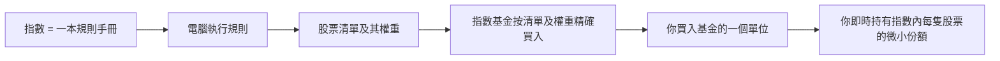
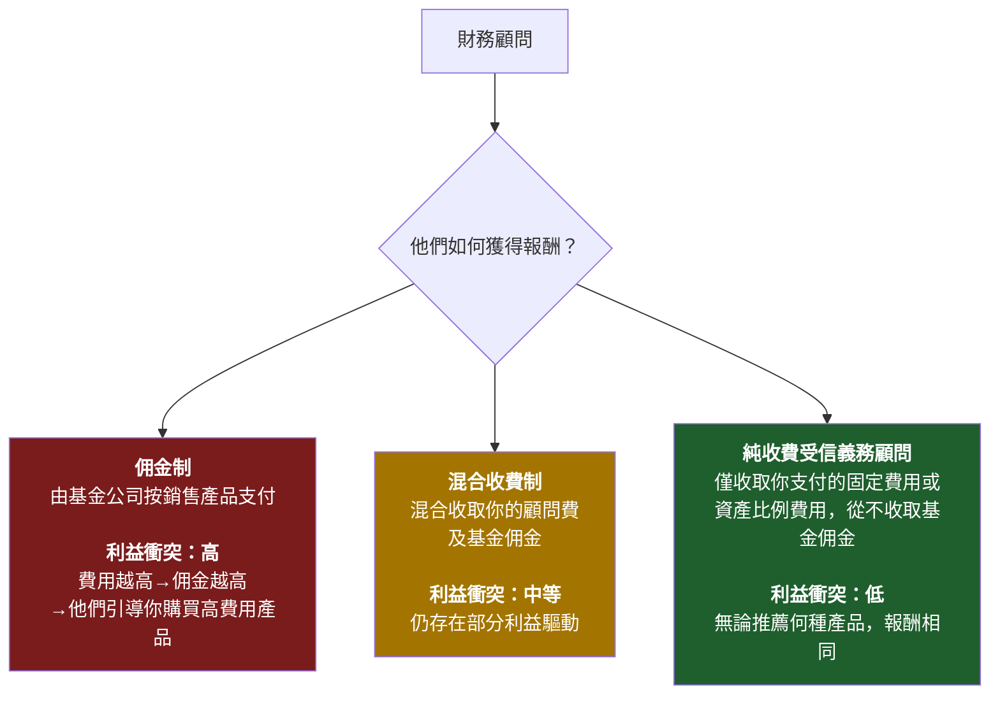
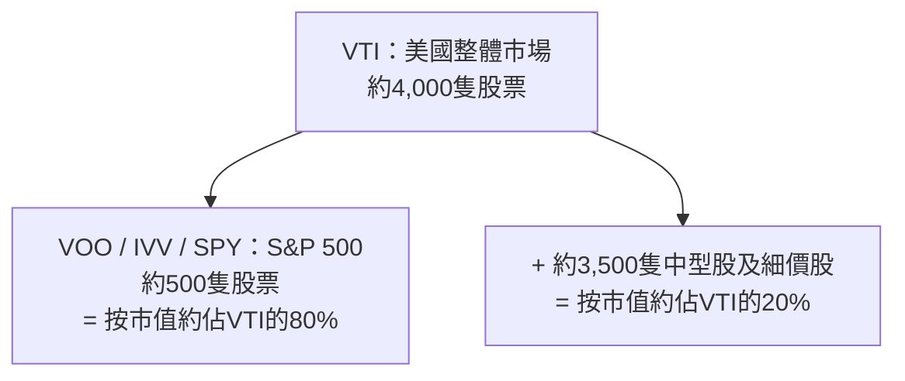
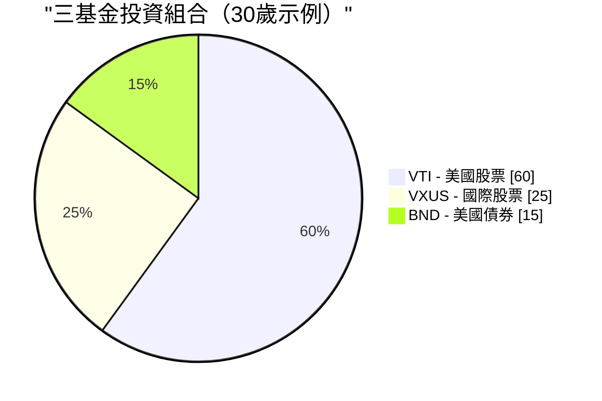

# 第二週：指數基金與交易所買賣基金

動畫參考：`animation/week02_active_vs_passive.py`

---

## 第一部分：閱讀章節

---

### 1. 為何此課題至關重要

上週我們揭示了一個殘酷的真相：**通脹如同地心引力，不投資才是你所能做的最昂貴的事。** 現在的問題是*如何*投資。以下是投資界花了四十年才承認的答案：對幾乎所有人而言，正確的答案是**低成本指數基金或交易所買賣基金。** 不是選股。不是你銀行的「財富管理經理」。不是你姐夫的內幕消息。不是你保險代理人拼命向你推銷的結構性產品。

這是整個課程中最重要的一課，而且它確實簡單明瞭。如果你在第二週後停止閱讀，設定每月自動定期買入一隻覆蓋廣泛市場的指數交易所買賣基金，並且此後再不讀任何一本理財書，**你的投資回報將勝過這個星球上絕大多數投資者——包括那些靠管理別人的錢領取數百萬薪酬的專業人士。**

這不是推銷話術。這是四十年來數據所呈現的一個理性陳述：

- **在20年的時間跨度內，大約90%的主動管理美國大型股基金跑輸標普500指數**——此數字每年由標普道瓊斯指數的SPIVA計分卡公佈。
- **預測基金未來表現的最佳單一指標是開支比率。** 不是基金經理的資歷，不是品牌，不是過往回報。是費用。費用越低→未來平均回報越高。（晨星在一項又一項的研究中均已證實此點。）
- **沃倫·巴菲特——史上最著名的主動投資者——在遺囑中指示其妻子的遺產投資於「一隻非常低成本的標普500指數基金」。** 如果有史以來最偉大的選股者告訴自己的遺孀放棄選股，這本身就是一個明確的信號。

因此，本週我們將涵蓋三個主題。第一，指數基金究竟是什麼，以及它如何在一段略帶離經叛道的歷史中誕生。第二，金融業從散戶投資者口袋裡取錢的四大途徑——高費用主動基金、佣金驅動的顧問、以保險為包裝的「投資」產品，以及緩慢蠶食財富的舊式互惠基金——以及如何繞開每一個陷阱。第三，你實際上需要的幾個具體股票代號。

最後還有一個誠實的懸念：**指數基金的主流共識已運行了四十年。它不保證永遠有效。** 它在何時、以何種方式可能失靈，以及你該如何應對，是我們在後面幾週才會回頭探討的課題。現在，我們先打好地基。進階操作日後再談——是在這個地基*之上*，而不是取而代之。

> *「投資是必須的。本課程中的其他所有工具都只是加分項。」*

---

### 2. 你需要了解的知識

#### 2.1 什麼是指數？

**指數**是一份按照一套規則篩選的股票（或其他資產）清單。沒有人「管理」指數——它就是其規則所定義的那個樣子。標普500就是「符合特定流動性、盈利能力和上市標準、按市值加權的500家最大美國公司」。這就是完整的定義。一台電腦即可執行。

當新聞說*「今天市場上升了2%」*，他們幾乎總是指標普500上升了2%。

你將會常常聽到的主要指數：

| 指數 | 追蹤對象 | 持股數目 |
| --- | --- | --- |
| **標普500** | 500家最大的美國公司 | 約500隻 |
| **CRSP美國全市場指數** | 整個美國股票市場 | 約4,000隻 |
| **道瓊斯工業平均指數（DJIA）** | 30家大型美國公司（以股價加權，屬舊式設計） | 30隻 |
| **納斯達克綜合指數** | 納斯達克上市的全部股票 | 約3,000隻 |
| **納斯達克100指數** | 納斯達克100家最大非金融類股票（科技股為主） | 100隻 |
| **羅素2000指數** | 2,000家美國小型公司 | 約2,000隻 |
| **MSCI歐澳遠東指數** | 美國及加拿大以外的已發展市場 | 約800隻 |
| **MSCI新興市場指數** | 新興市場國家 | 約1,400隻 |
| **富時100指數** | 100家最大的英國公司 | 100隻 |

**大多數主要指數採用市值加權。** 這意味著某公司在指數中的權重與其總市值成正比。蘋果公司市值約3萬億美元，在標普500中佔約7%的權重；而市值約100億美元的最小成份股，其權重僅約0.02%。市值最大的10家公司通常佔**整個指數的30至35%。** 當你「買入標普500」時，你所承受的大型股集中風險，遠比「500隻股票」這個名稱所暗示的要高得多。

這就是整個運作機制。其中沒有任何天才成分。這恰恰是它有效的原因。

---

#### 2.2 指數基金——柏格的離經叛道之舉

指數基金直到1976年才出現。在此之前，美國的每一隻互惠基金都是主動管理的：西裝革履的聰明人負責選股，每年收取1至2%的費用。當時的數學邏輯與現在相同——大多數人跑輸市場平均水平——但這一學術發現尚未轉化為一個具體的產品。

**將這個數學邏輯轉化為產品的人是約翰·柏格。** 柏格於1974年被威靈頓管理公司解僱。1975年，他創辦了一家結構奇特的新互惠基金公司，名為**先鋒集團（Vanguard）**，採用共同擁有制——由基金持有人共同擁有，沒有外部盈利動機。1976年，先鋒推出了**第一指數投資信託**，即首隻零售指數基金：它只需按照標普500的指數權重買入全部500隻成份股，並收取極低的費用。

業界對此嘲笑不已。媒體稱之為**「柏格的愚行」。** 經紀人拒絕銷售它（因為沒有佣金可賺）。該基金在首次公開招股中僅籌集到1,100萬美元——遠低於柏格原定1.5億美元的目標。競爭對手稱這個想法**「不符合美國精神」**，是**「保證平庸的處方」。**

競爭對手說它保證平庸是對的——*如果平庸意味著「市場平均水平減去少許費用」的話。* 他們沒有想到的是，市場平均水平減去少許費用，在20年內能跑贏大約90%的專業人士。

時至今日，先鋒管理的資產超過**8萬億美元**，指數基金與交易所買賣基金這一類別在全球合計管理**逾20萬億美元**。柏格的「愚行」已成為全球散戶股票投資的主流形式。他本人於2019年辭世，從未像其他管理8萬億資產的公司創辦人那樣致富——先鋒的共同擁有制結構意味著節省下來的費用流回基金持有人，而非流入他個人的口袋。他是金融界極少數值得不加引號地使用*英雄*一詞的人。

> 「不要在草堆裡找針。直接買下整個草堆。」——約翰·C·柏格

---

#### 2.3 互惠基金與交易所買賣基金之比較——為何互惠基金仍然存在（以及為何你大多數時候應選擇交易所買賣基金）

**指數基金**是一種*策略*——「追蹤指數」。這一策略可以透過兩種不同的*包裝形式*呈現：

- **互惠基金**，每天收市後以資產淨值定價及交易一次。
- **交易所買賣基金（ETF）**，在交易所實時買賣，與股票相同。

| 特點 | 互惠基金 | 交易所買賣基金 |
| --- | --- | --- |
| 交易時間 | 每天**一次**，以收市資產淨值計算 | **全日**，如同股票 |
| 最低投資額 | 通常為**1,000至3,000美元** | **一個單位的價格**（或碎股） |
| 稅務效益（應稅賬戶） | **較差**——資本增值分派強制分給所有持有人 | **較佳**——實物贖回機制保護持有人 |
| 佣金 | 在基金自家券商平台為0美元 | 大多數券商為0美元 |
| 輕鬆自動投資 | **是**（按金額，任何日期） | 有時較困難（需要整數單位，除非支持碎股） |

**在2026年，交易所買賣基金在幾乎所有重要維度上均勝出**——較低的最低投資額、實時定價、在稅務效益上大幅領先、平均開支比率更低。以下是互惠基金仍具真實優勢的少數情況：

1. **401(k)及其他僱主退休計劃。** 大多數美國401(k)菜單仍以互惠基金為主。計劃管理人尚未完成轉型，而你通常無法自行將交易所買賣基金引入計劃。在401(k)中，互惠基金的稅務問題基本上不重要（因為賬戶享有稅務優惠），所以包裝形式的選擇是被動的，也無傷大雅。
2. **按固定金額設定自動定期投資。** 先鋒的互惠基金允許你設定「每月1日投資500美元」，並精確執行，包括購買碎股。交易所買賣基金的自動投資功能雖然存在，但視乎券商而定。

**以上基本上就是全部了。** 在2026年的普通應稅券商賬戶中，同一指數的交易所買賣基金版本，在成本和稅後回報上，幾乎對所有散戶投資者而言都優於互惠基金版本。**預設選擇交易所買賣基金。** 如果你只能透過401(k)投資，那麼互惠基金也無妨——在菜單中選擇費用最低的廣泛市場指數選項，繼續前進即可。

互惠基金之所以仍以龐大規模存在，並非因為它們*更優越*。而是因為**數以萬億計的舊有資金積存在401(k)、個人退休賬戶（IRA）及舊有券商賬戶中**，從互惠基金轉出將會觸發應稅的資本增值。這是惰性使然，而非實力使然。新投入的資金幾乎應一律選擇交易所買賣基金。

---

#### 2.4 主動管理與被動管理——那個90%的統計數字

**主動投資**指基金經理（或你自己）嘗試挑選優勝股票並迴避落後股票。研究、分析、頻繁交易、基於信念的判斷。這是每一隻主動管理的互惠基金和對沖基金所做的事，也是他們向你收費的原因。

**被動投資**指買入整個指數，接受平均回報。不作預測，不作基於信念的判斷，無需任何個人魅力。

正統的問題是*「主動基金經理能否跑贏指數？」* 由標普道瓊斯指數的SPIVA計分卡超過二十年來每年重複給出的正統答案是：**大多數時候不能。** 時間跨度越長，情況越差：

| 類別（美國） | 5年跑輸比例 | 10年跑輸比例 | 20年跑輸比例 |
| --- | --- | --- | --- |
| **美國大型股** | 78% | 85% | **90%** |
| **美國中型股** | 74% | 83% | 89% |
| **美國小型股** | 68% | 79% | 88% |
| **國際股票** | 71% | 82% | 87% |
| **新興市場** | 69% | 80% | 85% |
| **美國投資級債券** | 72% | 81% | 86% |

*（數字取自近期SPIVA報告的大約值；確切數字每年略有波動，但定性規律保持不變。）*

> 換言之：在每100位美國大型股基金經理中，**90位在20年的時間跨度內輸給了一台執行500個名字的簡單清單的電腦。**

以下是更致命的後續發現：**這10位勝出者，在下一個十年並非同一批人。** 標普的業績持續性研究反覆顯示，在五年內排名前四分之一的基金，在接下來五年內往往跌出前四分之一。過往的超額回報並不預示未來的超額回報——每份基金招股說明書底部的那句警告是真實的，而大多數投資者都忽視了它。

主動管理基金整體上無法跑贏指數，有五個原因：

1. **費用。** 主動基金每年收取0.5至1.5%。指數交易所買賣基金收取0.03%。基金經理每年必須跑贏指數**超過一個百分點**，才能與低成本選項打平手。
2. **交易成本。** 每一次買賣都有摩擦成本——買賣差價、市場衝擊、機構層面的佣金。高換手率策略持續消耗回報。
3. **稅務。** 高換手率會在互惠基金中觸發資本增值分派，無論你是否出售，均須在分派當年繳稅。
4. **市場大體有效。** 數以萬計的專業人士在閱讀相同的年報、相同的業績發布會記錄、相同的衛星數據。真正的優勢極為罕見。
5. **倖存者偏差。** 業績不佳的基金會被悄然清盤或併入其他基金。現存的「主動基金」全集看起來比實際表現更好，因為最差的輸家已被埋葬。

---

#### 2.5 開支比率——你能掌控的最大單一槓桿

**開支比率**是基金每年收取的費用，每日自動從基金資產中扣除。你永遠看不到賬單。它只是以略微偏低的回報呈現出來。

這種無形性，正是它作為財富提取機制得以奏效的關鍵所在。**1%的費用聽起來微不足道。但在三十年後，它大約吞噬你最終財富的25至30%。** 複利是雙刃劍：它既讓你的錢增長，也讓費用增長。

以10%的稅前回報將10萬美元投資30年：

| 基金類型 | 開支比率 | 淨回報 | 第30年末價值 | 與指數相比損失於費用 |
| --- | --- | --- | --- | --- |
| **指數交易所買賣基金**（如VOO） | **0.03%** | 9.97% | **$1,721,686** | — |
| 低費用主動基金 | 0.50% | 9.50% | $1,526,688 | **−$194,998** |
| 普通主動基金 | 1.00% | 9.00% | $1,326,768 | **−$394,918** |
| 高費用主動基金 | 1.50% | 8.50% | $1,152,309 | **−$569,377** |
| 保險產品包裝 | 2.00% | 8.00% | $1,006,266 | **−$715,420** |

請再看一遍最後一行。**一個2%的包裝費用，令一筆10萬美元的投資損失逾70萬美元。** 那不是一筆費用。那是一套房子。視乎城市，可能是兩套。那筆錢從你的退休儲備，流向了基金公司的薪酬、市場推廣預算、辦公室租金和行政總裁薪酬。

**費用在每一種市場環境中都持續複利。** 在市場下跌30%的那一年，你仍要支付。在基金經理跑贏指數0.4%的那一年，你仍需支付1.0%的費用。費用是基金招股說明書上唯一有保證的數字。

還有兩個業界寧願你不要內化的事實：

- **在同一基金類別內，費用較低的基金平均而言勝過費用較高的基金。** 這是基金研究中重複次數最多的發現——晨星已在不同資產類別和不同年代反覆證實此點。某一類別中費用最低的基金，平均而言是該類別中最優秀的基金。
- **費用是*有保證的*拖累。基金經理的超額回報是*寄望中的*抵消。** 以確定性換取希望，在其他任何領域都被公認為是一筆壞買賣。

---

#### 2.6 財務顧問的陷阱

如果主動基金如此糟糕，為何每家銀行、券商和「財富管理」部門仍在持續推銷它們？因為**財務顧問的薪酬結構，令推銷這些產品對顧問而言是理性的**，即便對你而言是非理性的。

你將會遇到三種薪酬模式：

**詢問任何顧問最重要的一個問題：*「您是否承擔受信義務，且是否為純收費制？」*** 受信義務顧問在法律上*必須*以你的最佳利益行事。非受信義務的銷售人員只需推薦「適合」你的產品——門檻低得多，這在歷史上為向任何年齡足夠大、能夠簽署文件的人銷售高費用垃圾產品提供了空間。

你的銀行「私人財富經理」如此熱衷於將你引入收取1.5%開支比率、附帶5%前端手續費的主動基金，原因在於銀行可以兩頭獲益：既賺取前端手續費，又可在你持有期間持續收取12b-1市場推廣費的分成。**你不是他們的客戶；你是他們的產品。** 基金公司付費給他們，讓他們把你帶來。

應對非受信義務顧問推銷主動基金的最直接方式是：*「請以書面形式向我展示，持有這隻基金十年的全部費用——開支比率、銷售手續費、12b-1費用、顧問費、賬戶費用。並請向我展示貴公司從該基金系列所獲得的報酬。」* 若他們拒絕或拖延，你便已得到答案。

> **預設原則：** 除非你已擁有數百萬美元且稅務狀況真正複雜，否則你幾乎肯定不需要財務顧問。你需要的是一隻交易所買賣基金和一個每月自動轉賬的設定。

---

#### 2.7 保險「投資」幾乎全是騙局

我想在這裡說得特別直接。**可變萬能壽險、指數型萬能壽險、以「投資」為賣點的終身壽險、股票掛鈎儲蓄產品、面向散戶銷售的結構性年金——這些產品無一例外（極罕見情況除外）都是掠奪性產品，設計目的是向不知情的人收取費用。**

推銷話術通常是以下組合：

- *「稅務優惠增長。」*
- *「本金保障。」*
- *「享受股市升幅，規避跌幅。」*
- *「強制儲蓄紀律。」*

現實幾乎總是：

- **在首5至10年退出須繳付5至10%的退出費用。**
- **每年2至4%的全包費用**隱藏在晦澀的語言中（「死亡及費用收費」、「附加保障費」、「行政費」、「基金管理費」，層層疊加）。
- **扣費後的回報遠遜於基本的交易所買賣基金**——在相關市場提供8至10%回報時，這些產品往往僅能帶來2至4%的淨回報。
- **給代理人的佣金最高可相當於你首年保費的80至100%**，這正是這些產品被如此賣力推銷的確切原因。

保護你終身的黃金法則：

> **保險是用來轉移風險的。投資是用來創造財富的。永遠不要將兩者混為一談。**

如果你有受養人，其財務狀況將因你的離世而受損，請**購買定期壽險**——純粹、低廉、有固定期限、不含投資成分的保障。一位健康的30歲人士，每月大約25至35美元即可購買一份20年、100萬美元的定期壽險保單。然後將定期壽險保費與保險代理人向你收取的終身壽險保費之間的差額，**投入指數交易所買賣基金。** 這是教科書式的策略：**「購買定期保險，投資差額。」** 在任何20年的時間跨度內，這一策略在扣除成本後的淨資產上，遠勝於終身壽險保單——而且你完全掌控投資端的所有權及流動性。

代理人會告訴你終身壽險「強迫你儲蓄」。向你的券商賬戶設定每月自動轉賬同樣能做到，而且那個設定不會給他們帶來80%的佣金。

---

#### 2.8 誠實的反例——確實奏效的主動基金

在過去幾節中，我對主動管理批評甚多。為保持思維誠實，我必須坦率地說：**確實有少數主動管理基金經理跑贏了指數，而且是決定性地跑贏，且持續數十年。** 數量不多——但足以令人重視。

值得關注的例子：

- **沃倫·巴菲特及查理·芒格領導下的巴郡哈撒韋公司。** 從1965年到2020年代初，巴郡的賬面價值以每年約**20%**的速度複合增長，對比標普500的約10%——這是現代金融史上最令人印象深刻的長期業績記錄。巴菲特是主動管理*有時確實奏效*的教科書級明證。他同樣是那位告訴自己遺孀把遺產投入標普500指數基金的巴菲特。他是那個例外，也在告訴你：你不是那個例外。
- **彼得·林奇主理富達麥哲倫基金，1977至1990年。** 林奇主理麥哲倫基金13年，年均回報約**29%**，在13年中有11年跑贏標普500——堪稱有記錄以來最傑出的互惠基金業績。他在46歲退休。林奇離任後，麥哲倫基金的表現回歸至大致追蹤指數的水平。
- **文藝復興科技公司的大獎章基金，約1988年起。** 一隻高頻交易、數學驅動、僅供僱員認購的量化基金，據報在超過三十年間，扣除其5%管理費和44%業績費後，年均回報約**40%**。大獎章基金自1993年起已停止接受外部投資者，而文藝復興旗下面向外部投資者的基金（RIEF、RIDA）的業績遠遜於此——有時在大獎章大賺70%時反而虧損。**大獎章基金是真實、持久的阿爾法確實存在的明證。它同時也證明，真正的阿爾法會被隔絕起來，永遠不會到達你的手中。**
- **賽斯·卡拉曼的包浦斯集團。** 數十年來，透過堅守深度價值框架、在缺乏符合標準的投資機會時持有異乎尋常的大量現金，實現了與股票相當的回報，同時結構性地低於市場波動性。卡拉曼的著作《安全邊際》二手書售價逾1,000美元，因為他拒絕再版。
- **喬爾·格林布拉特在哥譚資本，1985至1994年。** 在一個小型特殊情況投資賬簿上，十年間年均回報約50%，之後歸還外部資本。格林布拉特隨後在《你可以成為股市天才》及《打敗大盤的小書》中公開了投資方法——明確認為這一策略*涉及市值過小、過於令人不適，且需要大多數讀者實際上無法堅持的耐心*。

留意其中的規律。那些在數十年間確實跑贏指數的基金，要麼**已關閉接受新資金**（大獎章基金），要麼**曾定期關閉**（麥哲倫基金在巔峰時期），要麼是**自成一體的單一控股公司**（巴郡），要麼是**規模明確太小、一旦擴張便會摧毀優勢**（格林布拉特的早期歲月），要麼是**高度集中、需要承受大多數投資者無法忍受的多年回撤**（卡拉曼）。

教訓並非*「主動管理從不奏效」*。教訓是**真正奏效的主動管理策略，鮮少是你能在銀行產品菜單中買到的那些。** 而你*能夠*從銀行產品菜單中買到的主動基金，整體上正是SPIVA計分卡所追蹤的那90%跑輸指數的基金。

如果你有時間、有心態，並在市場某個特定角落擁有真實且持久的優勢，大可在那裡集中佈局。大多數讀者並不具備這些條件。**大多數讀者應該將大部分資金做指數投資，將時間花在其他地方。**

---

#### 2.9 你真正需要的基金

你不需要記住市面上數以千計的交易所買賣基金。你只需要這份簡短清單：

| 代號 | 基金 | 開支比率 | 追蹤對象 |
| --- | --- | --- | --- |
| **VOO** | Vanguard S&P 500 交易所買賣基金 | **0.03%** | 美國500家最大企業 |
| **VTI** | Vanguard 美國整體股票市場 | **0.03%** | 整個美國市場（約4,000隻股票） |
| **IVV** | iShares Core S&P 500 | 0.03% | S&P 500（貝萊德版本，等同VOO） |
| **SPY** | SPDR S&P 500 | 0.09% | S&P 500（較舊、費用較高、交易員最愛） |
| **VXUS** | Vanguard 國際整體股票 | 0.07% | 所有非美國已發展市場及新興市場 |
| **VT** | Vanguard 全球股票 | 0.07% | 全球整體（美國及非美國合二為一的交易所買賣基金） |
| **BND** | Vanguard 美國整體債券 | 0.03% | 美國投資級債券 |
| **QQQ** | Invesco 納斯達克100 | 0.20% | 納斯達克100家最大非金融股（科技股為主） |

**VOO 對 VTI 對 SPY** 是被問得最多的問題。簡短版本如下：

- **VOO** 與 **IVV** 追蹤相同指數（S&P 500），收費相同（0.03%）。兩者皆可。
- **SPY** 同樣追蹤 S&P 500，但收費是 **前者的3倍**（0.09%）。它的存在是因為它是*第一隻*美國交易所買賣基金（1993年），流動性最深——機構交易員在乎這一點，長線投資者則不然。**不要為你不需要的流動性多付3倍費用。**
- **VTI** 持有整個美國市場（約4,000隻股票），而非只持有最大的500隻。實際上，VOO 和 VTI 的回報幾乎一致，因為 S&P 500 大約佔美國市值的80%。如果你只想持有一隻基金並希望稍微提高分散投資程度，選 VTI。如果你只想持有一隻基金，並偏好所有人都引用的最具代表性指數，選 VOO。**這兩者之間沒有錯誤答案。**

---

#### 2.10 如何實際買入

整個流程如下，只需15分鐘：

1. **開立經紀帳戶。** 美國居民：Fidelity、Schwab 或 Vanguard——三者均免佣，三者的平台皆合理易用。香港／台灣／新加坡居民：盈透證券（Interactive Brokers）是買入美國上市交易所買賣基金的標準跨境選擇，費用低廉。
2. **連結銀行帳戶並轉帳。** ACH 轉帳需時1至3個工作天。
3. **搜尋代號。** 輸入 *"VOO"*，基金資料即會彈出。
4. **落盤買入。** 市價盤 = 以當前價格買入。輸入股份數量或金額（大多數經紀現已支持碎股）。
5. **設定每月自動投資。** 例如每月1日自動投入500美元，然後忘記它的存在。

就這樣。**五個步驟，十五分鐘，你現在已持有美國500家最大企業的一份。** 無需看CNBC，無需盯著投資組合，無需為選股而焦慮。

按下買入後最重要的事，就是**關掉應用程式，停止查看。** 市場每天都在波動。盯著每日走勢，是導致投資者行為失當的最大原因——恐慌性沽出、狂喜時追入。在能跑贏SPIVA的指數交易所買賣基金策略中，所有長線回報都來自*撐過*噪音，而非在噪音中反覆操作。

---

#### 2.11 三基金投資組合

對大多數讀者而言，以博格爾（Bogle）推廣的風格構建**三基金投資組合**，已足以成為完整的投資組合：

| 基金 | 代號 | 建議配置（30歲） |
| --- | --- | --- |
| 美國整體股票市場 | **VTI** | 60% |
| 國際整體股票 | **VXUS** | 25% |
| 美國整體債券市場 | **BND** | 15% |

債券比例的粗略**傳統經驗法則**：**債券% ≈ 你的年齡 − 20**，大約如此。30歲的人持有約10至15%債券；65歲的人持有約45至55%債券。教科書的邏輯是，債券是*壓艙石*：股票跌時債券升，減低投資組合波動性，並在臨近退休時保護你免受股票50%回撤之苦——因為那時你等不起十年讓市場復原。

> **我必須提前告知你一點，即使在這節基礎課中：** 那套傳統邏輯建立於一個已不復存在的世界。
>
> 「債券作為壓艙石」的框架假設（a）債券提供高於通脹的實質收益率，以及（b）股票下跌時債券上漲。**這兩個假設在2020年代均已失效。** 在各國政府以印鈔融資龐大財政赤字（第1週，第2.2節）、中央銀行刻意將實質收益率壓低至通脹之下（「金融壓抑」）的環境下，在通脹周期中持有長期債券基金並非壓艙石——而是購買力的緩慢流失。2022年，股票和債券*同時*各自下跌約20%，而這恰恰是60/40配置理應保護你免受的情景。
>
> 因此，請將上表中的債券配置視為**教科書的起點，本課程其餘部分將對此提出挑戰。** 我們稍後會回到在印鈔時代真正發揮壓艙石作用的資產：
>
> - **第5週（債券）** 深入剖析債券的本質、歷史對沖在有效時的原因，以及令其失效的條件。
> - **第6週（黃金與商品）** 介紹另類通脹對沖工具——黃金是人類有史以來每一個貨幣體制中的價值儲存手段，其在2020年代的投資理據遠比長存續期債券更為充分。
> - **第47週（尾部風險對沖）** 及**第5級整體** 以現金/短存續期國債、黃金以及長波動性期權結構的組合，重新正確構建投資組合的安全端，而非沿用傳統長存續期債券配置。
>
> 對於你今天構建的基礎投資組合，三基金模板已然可行，遠比不投資好得多。**只需明白，債券配置是這個投資組合中保質期最短的部分，我們將會回來替換它。**

這整個投資組合的混合開支比率：**每年約0.04%。** 也就是說，每10,000美元每年僅需*四美元*。而這是一個涵蓋所有主要資產類別的全球分散投資組合。

---

#### 2.12 直至失效為止——一個懸念

我在整章都告訴你，指數交易所買賣基金就是答案。最後，我想以一個免責說明作結，這讓我成為一個誠實的老師，而非推銷員。

**買入持有被動指數策略在過去40年表現極為出色——大約從1980年代初開始。** 它之所以奏效，是因為一系列特定條件的組合：勞動年齡人口多於退休人口，每個薪資周期都機械性地持續買入；利率下降；美元儲備貨幣地位；全球化；以及自2008年以來，美聯儲在金融環境過度收緊時持續介入。

**上述這些順風條件，沒有一項是保證持續的。**

當人口結構轉折到來——當嬰兒潮一代從淨買家（積累期）轉為淨賣家（提取期）——曾令指數在40年間持續上升的那條機械管道，可能反向運行。被動基金並非自主運作，它們反映的是終端投資者究竟在供款還是提款。一個在上漲途中被價格不敏感資金主導的市場，同樣容易受到價格不敏感資金在下行途中的衝擊。

**這並非預測指數明天就會失效。這是誠實地承認，「它奏效了40年」並不等同於「它將永遠奏效」。**

對於*你*，今天，構建第一個投資組合：**指數交易所買賣基金是正確答案。** 打好基礎，設定每月自動轉帳，讓它在你研習本課程其餘部分的未來數年間持續複利增長。

關於指數何時及如何可能失效，以及屆時你應遷移至何處的詳細論述，正是本課程其餘部分所要構建的內容：

- **第23週（因子投資）** 介紹純市值加權指數化的第一批替代方案——價值、動量、質素、低波動性傾斜，這些因子在歷史上捕捉了市值加權指數未能體現的回報。
- **第43週（主動投資組合管理）** 深入探討主動管理*確實*物有所值的時候，以及它不值得的時候。
- **第5級（第47至52週）** 是我們實際構建「槓鈴」投資組合形態的地方——一端是高確信度的安全資產，另一端是不對稱的投機部位，中間的廣泛市值加權核心被刻意*移除*。這是進階形態，建立在第2至46週所有內容的基礎之上。

現在：**投資是必須的。交易所買賣基金是基礎。本課程其他所有內容都是錦上添花，疊加於基礎之上。** 如果你跑不贏指數——而大多數人、在大多數時候確實跑不贏——那就不要浪費一生去嘗試。讓指數做工，把你的時間用在能讓你的人生增值的事情上，而非你的試算表。

但請明白，*「買入持有指數」*是一種依賴特定環境的策略，它在特定的40年窗口內奏效。我們將回來探討那個窗口關閉後會發生什麼。現在，打好基礎已足夠。

---

### 3. 常見誤解

**誤解一：「指數基金只適合初學者。」**

指數基金和交易所買賣基金被主權財富基金、大學捐贈基金、退休基金及億萬富翁廣泛使用。CalPERS——全球最大退休基金之一——持有龐大的指數基金授權。巴菲特（Warren Buffett），*有史以來*最著名的主動投資者，於2008至2017年間公開下注100萬美元，賭一隻S&P 500指數基金能跑贏一籃子精心挑選的對沖基金，最終大獲全勝。指數化投資不是初學者的選項，而是理性選擇的結果，只是碰巧也是最簡便的。

**誤解二：「一分錢一分貨——費用越高代表管理越好。」**

在幾乎所有其他消費品類中，此話不假。在投資領域，**關係恰恰相反。** 晨星（Morningstar）跨資產類別、歷時數十年的研究顯示，**開支比率是預測基金未來表現的最佳單一指標**——優於過往回報、優於星級評級、優於基金經理任期。費用越高→預期未來回報越低。廉價基金平均而言是更好的基金。

**誤解三：「但我的財務顧問推薦了一隻主動基金。」**

許多財務顧問靠銷售特定基金收取佣金——有時是公開的，往往是以不透明的收入分成安排進行，你永遠不會在月結單上看到。他們的動機是推薦對*他們*報酬最豐厚的產品，而非令*你*複利增長最多的產品。**務必詢問：「你是純收費制受信人嗎？你從你推薦的任何產品中獲得的全部報酬是什麼？」** 若他們不是，或者他們不能、不願以書面回答，請轉身離開。

**誤解四：「指數基金在市場下跌時無法保護你。」**

正確——它們確實無法。它們也不應該這樣做。市場跌，指數就跌。相關比較*不是*「指數對現金」，而是「指數對主動基金」。2008年S&P 500下跌約37%；平均主動管理美國股票基金下跌約39%。主動基金經理在崩市中沒有保護你，平均而言反而令情況略為惡化。**在市場下跌時提供保護的，是你的*資產配置*（股票、債券、現金各佔多少比例）以及你的行為（不要恐慌性沽出），而非你的基金選擇。**

**誤解五：「我應該選過去5年業績最好的基金。」**

這是散戶投資者最常見、代價最高昂的錯誤。**表現最佳的基金會均值回歸。** 標普（S&P）的持續性研究一再重複，十年又十年，顯示排名首四分位的基金中，五年後仍維持首四分位的不足十分之一。過往表現不能預測未來表現；每份基金招股說明書底部的那句警告並非法律套語，而是一句每個人都忽視的真話。追逐過去的贏家，從預期值來看，*比隨機選擇更差。*

**誤解六：「SPY 和 VOO 追蹤相同的東西，買哪個都無所謂。」**

它們追蹤相同指數。但收費並不相同。SPY收費0.09%；VOO收費0.03%。對於持有30年、價值500,000美元的投資組合，0.06%的差距複利累積後，大約相當於**25,000美元以上的財富損失。** SPY唯一的結構性優勢是其交易流動性，這只對機構大額交易者或短炒者有意義——對買入持有投資者則不然。**對長線持有者而言，VOO或IVV在成本上永遠勝過SPY。**

**誤解七：「我需要分散買入多隻不同的指數基金。」**

單一全市場基金如VTI已持有約4,000隻股票。加入VXUS再給你額外約7,000隻國際股票。**兩隻交易所買賣基金已涵蓋全球所有主要經濟體約11,000隻股票——在股票層面已無任何分散空間。** 持有10隻以上指數交易所買賣基金，通常只會造成重疊（相同的蘋果、微軟和英偉達以不同權重出現在多隻基金中），以及虛假的分散感。兩至三隻基金已足夠。超過五隻通常是混亂的跡象，而非老練的表現。

**誤解八：「指數基金很危險，因為你無法迴避爛公司。」**

指數基金確實持有破產的公司。2001年安然（Enron）倒閉時，它約佔S&P 500的0.7%——抽象地看令人痛心，對投資組合而言微不足道。其餘499家公司繼續複利增長。**指數*內部*的分散投資——數以百計乃至數以千計的成份股，任何單一成份股的比重都不足以單獨摧毀你——才是保護所在。** 一位集中持股的選股者若重倉安然，在那隻股票上損失慘重。指數投資者只損失了0.7%。

**誤解九：「終身壽險是良好的投資，因為它的現金值可免稅增長。」**

並非如此，而現金值的宣傳恰恰是這類產品的銷售手法。終身壽險現金值的實際回報，在扣除代理人佣金、退保費用時間表及各層年費後，通常只有**每年淨2至4%**，遠低於你在同期指數交易所買賣基金中可獲得的7至10%。**購買定期人壽保險以滿足實際身故賠償需求，並將定期保費與終身壽險保費之間的差額，投入指數交易所買賣基金。** 這就是教科書式的*「買定期，投差價」*策略。在幾乎所有實際情境中，它都勝出；代理人的佣金，正是他們永遠不會推薦它的原因。

---

### 4. 問與答

**問1：交易所買賣基金究竟是什麼？它與股票有何不同？**

**交易所買賣基金**（ETF，即Exchange-Traded Fund）是一籃子證券，打包成一個單一工具，像股票一樣在交易所買賣。買入一股VOO，即買入S&P 500所有500家公司的微小比例份額。**股票代表一家公司；交易所買賣基金代表一個界定好的籃子。** 交易機制相同——代號、實時價格、在市場開放時段買賣——但你即時獲得分散投資效果。

**問2：VOO、VTI 還是 SPY——選哪個？**

長線買入持有：**VOO 或 VTI**，兩者均收費0.03%。VOO = S&P 500（約500隻股票）；VTI = 整個美國市場（約4,000隻股票）。兩者表現幾乎一致，因為S&P 500按市值約佔美國市場的80%。任何一個都可以。**SPY 是給交易員的，不是給投資者的**——與VOO相同的風險敞口，但收費是其3倍。

**問3：我的投資組合應有多少比例投入指數交易所買賣基金？**

對大多數在二三十至四十多歲構建第一個投資組合的讀者：**股票部分的80至100%** 投入廣泛市場指數交易所買賣基金。股票與「安全資產」之間的確切比例，視乎年齡和風險承受能力：

| 年齡 | 股票% | 安全資產% |
| --- | --- | --- |
| 20–35 | 80–90% | 10–20% |
| 35–50 | 70–80% | 20–30% |
| 50–65 | 50–70% | 30–50% |
| 退休後 | 30–50% | 50–70% |

**關於「安全資產」而非「債券」的說明：** 股票部分的傳統壓艙石歷來是債券配置，前提是債券與股票呈反向走勢。如第2.11節所述，這一假設在2020年代已告失效——2022年股票與債券同步下跌，且在金融壓抑下債券不再提供高於通脹的實質收益率。**因此，「安全資產」部分應理解為一籃子與股票市場不相關（或負相關）的資產，而非單純的債券。** 傳統債券配置是其中一個組成部分，但現代的安全資產部分亦包括短存續期國債及現金等價物、黃金及其他貨幣金屬（第6週），以及在較進階層面的長波動性期權結構和尾部風險對沖覆蓋（第47週，第5級）。對於你今天的第一個投資組合，廣泛債券交易所買賣基金如BND是合理的起點；本課程其餘部分，是你如何隨著進步而替換和補充它的指引。

在股票配置內，典型分配約為70%美國（VTI）、30%國際（VXUS）。

**問4：開支比率與銷售費用——有何分別？**

**開支比率**是年費，每日從基金資產中扣除。0.03%對應10,000美元 = 每年3美元。**銷售費用**是買入（前端費用）或賣出（後端費用）時一次性收取的佣金。5%前端費用對應10,000美元的買入，即500美元即時消失，實際只有9,500美元真正投入。**現代指數交易所買賣基金收取零銷售費用。** 你所看到的任何*確實*收取銷售費用的基金，幾乎毫無例外，都不值得買入。

**問5：若90%的主動基金經理跑輸大市，主動基金為何仍然存在？**

因為它們對基金公司而言**利潤極為豐厚。** 一隻規模100億美元、收費1%開支比率的基金，不論業績如何，每年賺取1億美元費用。投資者跑輸指數對投資者而言是壞交易，但對基金公司而言是極佳的經常性收入業務。再加上購買CNBC廣告時間的市場推廣預算、分銷它們的銀行網點、獲付費銷售的財務顧問，以及投資者相信口才出眾的基金經理能跑贏均值的心理——**主動基金業之所以存在，是因為它付錢給價值鏈上除你之外的每一個人。**

**問6：指數基金會歸零嗎？**

理論上，只有當指數中每一家公司同時破產才會發生——這意味著整個美國經濟已崩潰，屆時任何金融資產的價值都只是學術討論。實際上，歷史上最嚴重的廣泛指數回撤（1929至1932年、2007至2009年、2020年新冠病毒閃崩）的峰值至谷底跌幅均在50至80%之間，且均在十年內收復至歷史新高。**個別股票絕對可以歸零，且已有許多先例。廣泛指數實際上不能。** 這種不對稱性，正是分散投資奏效的全部原因所在。

**問7：國際指數基金——我也應該持有嗎？**

大多數合理的資產配置都包含一定的國際風險敞口。美國按市值約佔全球股票市場的60%；另外40%分布在歐洲、日本、新興市場及其他地區。國際分散投資可降低投資組合波動性，因為各地區市場並非完全同步波動。**VXUS**（Vanguard 國際整體股票）收費0.07%，單一交易所買賣基金涵蓋已發展及新興市場約7,000隻股票。常見的粗略分配為 **70%美國（VTI），30%國際（VXUS）**。

**問8：什麼是平均成本法？我應該用它投資指數交易所買賣基金嗎？**

**平均成本法（DCA）** = 不論市況如何，定期投入固定金額。每月500美元，每月不間斷，無論市場走勢如何。當價格低時，500美元買入更多股份；當價格高時，500美元買入較少。結果是平均成本略低於該期間的簡單平均市場價格，加上更重要的行為層面好處：**你在恐慌的月份繼續投資，而非等待那個永遠感覺不對的「合適時機」。** 對以薪資收入投資的人而言，平均成本法自動發生。對持有整筆資金的人而言，學術文獻結論不一——歷史上，一次過投入平均略優於平均成本法（因為市場多數時候是上漲的），但平均成本法在心理上更易於執行。

**問9：指數基金會派股息嗎？**

會。指數成份股公司向基金派發股息，基金收取後每季按比例轉付給持有人。VOO目前的股息收益率約為1.3至1.5%。大多數經紀讓你開啟**股息再投資計劃（DRIP）**，自動將每次股息用於買入同一基金的更多股份。數十年下來，**再投資的股息佔股票總回報相當大比例**——預設開啟DRIP。

**問10：我聽說過「智能貝塔」或「因子」交易所買賣基金——它們與指數基金相同嗎？**

不完全相同。傳統指數基金採用**市值加權**（市值越大，指數權重越高）。**智能貝塔**或**因子**交易所買賣基金仍然以規則為基礎、系統性再平衡——因此類似指數——但它們按市值*以外*的某個因子加權：價值（基本面便宜）、動量（近期強者）、質素（財務狀況良好）、低波動性（平淡無奇的股票）、小市值等。開支比率高於普通指數基金（通常為0.10至0.40%），因為再平衡規則更為複雜，但仍遠比主動基金便宜。**因子投資是一個重要課題，我們在第23週深入探討。** 但對於你的第一個投資組合，普通市值加權指數交易所買賣基金是正確的起點。

**問11：我應該在指數交易所買賣基金之外同時持有個別股票嗎？**

如果你在某家特定公司或行業確實擁有持久優勢——來自本職工作的專業知識、對你所身處行業的結構性洞察——那麼**在指數核心之外持有少量個別股票的「衛星」部分可以說得通。** 常見的形態是80至90%持有廣泛市場指數交易所買賣基金，10至20%持有個別高確信度股票。**你不應該做的**，是因為在社交媒體上看到選股貼士、因為品牌熟悉，或因為它上個月表現良好，就去買個別股票。SPIVA的90%統計數字，對散戶選股者的打擊遠比對專業基金經理更為嚴酷——大多數散戶個別股票投資組合，表現遠*遜於*他們本可直接買入的指數。如果你無法用一句話清楚說明一隻股票相對其基本面為何被錯誤定價，你就沒有優勢——你只有一個看法。看法無可厚非，只是不要以擁有優勢的規模去押注看法。

**問12：我一直聽說指數「過度集中在超大型科技股」——這是問題嗎？**

這是真實的觀察。2026年，S&P 500十大持股（主要是超大型科技股——蘋果、微軟、英偉達、Alphabet、亞馬遜、Meta等）按權重約佔**整個指數的30至35%。** 買入VOO，比「500隻股票」這個名字所暗示的，對超大型科技股的集中敞口要高得多。這是否構成*問題*，取決於你對這些公司的看法。覆蓋更廣的VTI集中程度稍低（因為它把十大持股的比重分散至約4,000隻股票），而明確的等權重S&P 500交易所買賣基金（RSP，開支比率約0.20%）走另一個極端——相同的500隻股票，等權重分配。**目前，市值加權指數仍是最簡單、歷史表現最佳的預設選擇。** 這個集中度問題及其對風險的影響，正是我們在第23週及以後進一步培養的環境感知思維。

---

## 第二部分：YouTube 腳本

---

**影片標題：** 一隻跑贏九成華爾街基金的交易所買賣基金 | 第二週

**目標片長：** 約30分鐘

**主持人：**
- **陳馬**（導師）：資深散戶投資者，以第一身分享數十年自行管理投資組合的經驗
- **小魚**（學員）：剛畢業的大學生，正學習如何投資儲蓄，代觀眾發問

---

**[片頭 / 第0節：承諾]**

[VISUAL: Cold-open title card -- "$700,000. That's what your fees cost you."]

[ANIMATION: Hundreds of stock tickers swirling chaotically, then being swept into
a single basket labeled "ONE ETF". A subtitle fades in: "And it beats 90% of
the pros."]

**陳馬：** 如果你只看這一條影片，其他什麼都不做——不讀書、不聽播客、不用選股App——你依然能跑贏幾乎所有華爾街的專業基金經理。

**小魚：** 這個講法也太大膽了。

**陳馬：** 這不是我的說法，而是數據說了四十年的結論。答案就是一隻低費用的廣市場指數交易所買賣基金。不是你銀行的理財經理，不是你姐夫的內幕消息，也不是保險代理人拼命向你推銷的結構性產品。

**小魚：** 但偏偏幾乎沒有人真的這樣做。

**陳馬：** 因為有一個規模以萬億計的行業，他們的糧單取決於你不這樣做。今天我想讓你們看看我自己投資組合的基礎——然後在最後，我會講一件這個領域裡其他人都不願承認的老實話：這個策略過去四十年行之有效，但不保證永遠奏效。

**小魚：** 伏筆已記下。我們先從基礎講起。

[VISUAL: Title card -- "1. What Is an Index?"]

---

**[第1節：什麼是指數？]**

**陳馬：** 在講基金之前，我們先要弄清楚指數是什麼。指數就是一份按規則篩選出來的股票名單，沒有人主動管理它。標普500就是「符合特定流動性和上市規定的500間最大型美國公司，按市值加權」。就這麼簡單，一部電腦就能運行。

**小魚：** 所以新聞說「市場升了兩個百分點」，指的就是標普500。

**陳馬：** 幾乎都是。標普500是美國的頭條指數，代表整個美國市場約八成的市值。

[VISUAL: Quick table flashes the major indices -- S&P 500, CRSP US Total Market,
Dow Jones (30 names, price-weighted, "an antique"), Nasdaq Composite, NASDAQ-100,
Russell 2000, MSCI EAFE, MSCI Emerging Markets, FTSE 100.]

**小魚：** 那五百間公司的比重是一樣的嗎？

**陳馬：** 不一樣，而且這正是大多數人忽略的地方。標普500是按市值加權的。蘋果公司市值三萬億美元，佔大約七個百分點的比重；最小的成分股市值約一百億，佔比只有百分之零點零幾。

[ANIMATION: Bar chart, top of week02_active_vs_passive.py -- Apple ~7%,
Microsoft ~6.5%, descending to a tiny sliver at the right end.]

**陳馬：** 排名最前的十間公司——蘋果、微軟、英偉達、Alphabet、亞馬遜、Meta等——合計佔整個指數大約三成到三成半的比重。

**小魚：** 所以我「買入標普500」，其實是買了一個集中在超大市值股的倉位。

**陳馬：** 而且集中程度遠比「500隻股票」這個名字所暗示的要高，尤其集中在大型科技股。記住這一點，我們課程後面還會回頭討論。

[VISUAL: Title card -- "2. Bogle's Heretical Idea"]

---

**[第2節：博格的異端想法]**

**陳馬：** 指數基金要到1976年才出現。在此之前，美國每一隻互惠基金都是主動管理的——一班西裝筆挺的精英選股，每年收取一至兩個百分點的費用。數學邏輯跟今天一樣：大多數人跑輸市場平均水平。學術界的研究結論早就在那裡，只是沒有人將它包裝成產品。

**小魚：** 直到有人這樣做了。

**陳馬：** 這個人叫Jack Bogle。Bogle在1974年被Wellington Management趕走，1975年他創立了一間與眾不同的基金公司——先鋒集團，以共同擁有制運作，由基金持有人共同擁有，沒有外部股東牟利。1976年，先鋒推出了首隻指數投資信託基金，按指數比重買入標普500的全部五百隻成分股，收費極低。

**小魚：** 華爾街是怎麼反應的？

**陳馬：** 嘲笑。媒體稱之為「博格的愚行」。經紀拒絕銷售，因為根本沒有佣金可賺。首次公開招股只籌得一千一百萬美元——遠低於Bogle目標的一億五千萬。競爭對手說它「不像美國人」，是「保證平庸的配方」。

**小魚：** 今天呢？

[VISUAL: Bold text card -- "Vanguard today: $8 trillion. Index ETF category:
$20 trillion." Photo of Bogle, dates 1929-2019.]

**陳馬：** 先鋒集團管理的資產超過八萬億美元。全球指數基金及交易所買賣基金類別合計超過二十萬億。博格的「愚行」成為全球散戶股票投資的主流形式。令他成為我心目中英雄的原因在於：由於先鋒是共同擁有制，所有節省下來的成本都回流給基金持有人，而不是流入他個人口袋。任何其他管理八萬億資產的公司創辦人，早已上了《福布斯》富豪榜。Bogle沒有。他於2019年辭世。

**小魚：** 一個沒有以此致富的金融界英雄，這份名單確實很短。

**陳馬：** 名單上只有他一個人。他自己有句話是最好的總結：*「不要在草垛裡找針，直接把整個草垛買下來。」*

[VISUAL: Title card -- "3. Mutual Fund vs ETF"]

---

**[第3節：互惠基金與交易所買賣基金的比較]**

**陳馬：** 簡單說一下兩種包裝的分別，因為很多人混淆了。指數基金是一種*策略*——追蹤指數。這個策略可以用兩種不同的*包裝*出售：互惠基金，每天以收市時的資產淨值定價和交易一次；或交易所買賣基金，像股票一樣在交易所實時買賣。

[VISUAL: Side-by-side comparison table -- Mutual Fund vs ETF on five rows:
trading hours, minimum investment, tax efficiency, commissions, auto-invest.]

**小魚：** 哪一種更好？

**陳馬：** 在2026年的普通應稅經紀賬戶裡，交易所買賣基金在幾乎所有重要指標上都勝出——門檻更低、實時定價、透過實物贖回機制實現顯著更高的稅務效率、平均開支比率更低。唯一互惠基金仍勝過交易所買賣基金的情況，是在401(k)退休計劃內（基金選擇是固定的，稅務問題也不適用），以及定額自動投資的場景——先鋒的互惠基金在這方面做得非常好。

**小魚：** 那為什麼互惠基金還是無處不在？

**陳馬：** 慣性。數萬億美元的舊資金積存在401(k)、個人退休賬戶和舊經紀賬戶裡，轉移出來就要即時確認龐大的應課稅收益。它們留在那裡，是因為移走要付代價，而不是因為它們更好。**新投入的資金幾乎永遠應該買交易所買賣基金。**

[VISUAL: Title card -- "4. Active vs Passive -- The 90% Statistic"]

---

**[第4節：主動管理與被動管理——九成的統計數據]**

**陳馬：** 現在說核心數據。標普道瓊斯指數每年都會發布SPIVA記分卡——指數對比主動基金。在二十年的時間窗口內，**大約九成的美國大型股基金經理跑輸標普500。**

[ANIMATION: image/week02_spiva.png animated in -- bars climb from 78% over
five years, to 85% over ten, to 90% over twenty. Categories tick across the
bottom: US large-cap, mid-cap, small-cap, international, EM, investment-grade
bond.]

**小魚：** 一百個人裡有九十個。手下有一班分析師和金融學博士，卻輸給一份名單。

**陳馬：** 還有一個更致命的後續數據：那跑贏的十個，下一個十年不見得還是同一批。標普的持續性研究顯示，排名頂四分之一的基金，在接下來五年通常會跌出頂四分之一。過往表現無法預測未來表現。每份基金招股書底部的那句警告，是真的。

**小魚：** 那為什麼他們跑不贏？他們明明很聰明。

**陳馬：** 五個原因，而且是結構性的，不是努力不夠的問題。

[VISUAL: Five cards stack on screen as Horace lists them.]

**陳馬：** 第一——費用。主動基金收取半個百分點到一個半百分點。指數交易所買賣基金只收三個百分點的百分之一。主動管理人每年必須跑贏指數*超過一個百分點*，才能與低費選項打成平手。第二——交易成本。買賣差價、市場衝擊、佣金。高換手率就是在流血。第三——稅務。換手率在互惠基金中觸發資本增值分派，當年即時課稅。第四——市場基本上是有效率的。數以萬計的專業人士在看同一份10-K年報、同一批衛星數據。真正的優勢非常罕見。第五——倖存者偏差。表現差的基金被悄悄清盤或合併。留下來的「主動基金」看起來比實際表現更好，因為最差的輸家已經被埋葬了。

**小魚：** 翻譯過來就是：每一百個職業選股人裡，有九十個輸給一部電腦跑出來的五百名單。

**陳馬：** 二十年內，是的。

[VISUAL: Title card -- "5. Expense Ratios -- The $700,000 Card"]

---

**[第5節：開支比率——那張七十萬美元的帳單]**

**陳馬：** 現在我要讓費用的影響變得不可忽視。假設你三十歲時投入十萬美元，每年獲得十個百分點的總回報，持續三十年。唯一改變的變量是費用。

[ANIMATION: image/week02_expense_drag.png animated in -- five wealth curves
diverging over thirty years. Index ETF at 0.03% on top, then 0.50%, 1.00%,
1.50%, and the insurance-product wrapper at 2.00% on the bottom.]

[VISUAL: Final value cards stamp onto the screen one by one:
0.03% -> $1,721,686
0.50% -> $1,526,688
1.00% -> $1,326,768
1.50% -> $1,152,309
2.00% -> $1,006,266
"-$715,420" highlighted in red against the bottom row.]

**陳馬：** 看最下面那行。**一個收費兩個百分點的包裝，讓你在十萬美元的投資上蒸發超過七十萬美元。** 那不是一筆費用，那是一間房子，甚至可能是兩間，視乎城市而定。

**小魚：** 而那筆錢去了——

**陳馬：** 基金公司的薪水單。市場推廣預算。辦公室租金。行政總裁的薪酬方案。那是你的退休金，被轉走了。

**小魚：** 那市場下跌的年份呢？

**陳馬：** 你照樣要付費用。市場跌三成的那一年，你要付。基金經理跑贏指數半個百分點的那一年，你照樣欠足一至兩個百分點的全額費用。**費用是基金招股書上唯一有保證的數字。**

**小魚：** 那低費基金的數據呢？

**陳馬：** 晨星研究已在不同資產類別和不同年代中反復確認這一點。在任何基金類別內，**最便宜的基金平均而言是該類別中表現最好的基金。** 費用越低，預期未來回報越高。這是基金研究中獲得最多複製驗證的發現。消費者的本能是「一分錢一分貨」，但在基金這件事上，關係恰好相反。

[VISUAL: Title card -- "6. The Financial Advisor Trap"]

---

**[第6節：理財顧問的陷阱]**

**陳馬：** 既然主動基金表現這麼差，為什麼每家銀行、每間經紀行、每個「財富管理」部門還在不停銷售？因為顧問的薪酬結構讓銷售這些產品對*顧問*而言是理性的——即使對你而言是不理性的。

[ANIMATION: Three boxes appearing -- Commission-based (red), Fee-based (amber),
Fee-only Fiduciary (green).]

**陳馬：** 三種薪酬模式。佣金制——顧問由基金公司按銷售的每個產品付錢。利益衝突：高。費用越高，佣金越高，他們就越傾向推介。混合收費制——一部分向你收費，一部分從基金拿佣金。利益衝突：中等。純費用受信人制——按固定費用或資產比例向你收費，從不從基金收取任何費用。利益衝突：低。不論推介什麼，收入都一樣。

**小魚：** 所以有一個問題可以一刀切中要害？

**陳馬：** **一個問題。背下來。以後每次跟任何顧問坐下來，都問這一句：「你是受信人，而且只收費用嗎？」** 受信人在*法律上*有義務以你的最佳利益行事。非受信人的銷售員只需要推介「合適」的產品——門檻低得多，歷史上讓高費垃圾產品得以賣給任何能簽名的人。

**小魚：** 那銀行的「私人財富管理」呢？

**陳馬：** 兩邊都收錢。你買入時銀行收取前端認購費，你持有期間還要持續抽取12b-1行銷費的一份。**你不是他們的客戶，你是他們的產品。** 基金公司付錢給他們，為了把你送過去。

**小魚：** 如果我真的想跟其中一個顧問抗爭，怎麼說？

**陳馬：** 以書面形式說這句話：*「請列出持有這隻基金十年的全部費用——開支比率、認購費、12b-1費用、顧問費、賬戶費。同時列明你的公司從這個基金系列收到的所有薪酬。」* 如果他們拒絕或拖延，你已經得到答案了。

**小魚：** 那對我們其他人來說，預設規則是什麼？

**陳馬：** 除非你有幾百萬美元資產，加上真正複雜的稅務狀況，否則你根本不需要理財顧問。**你需要的是一隻交易所買賣基金和一個每月自動轉帳。**

[VISUAL: Title card -- "7. Insurance 'Investments' Are Almost All Scams"]

---

**[第7節：保險「投資」幾乎全是騙局]**

**陳馬：** 我在這裡要特別直接。變額萬能壽險。指數連結萬能壽險。以「投資」名義銷售的終身壽險。股票掛鈎儲蓄產品。向散戶推銷的結構性年金。**除了極少數例外，這些都是專門設計來從不知情者身上抽取費用的掠奪性產品。**

**小魚：** 這個說法很強烈。

**陳馬：** 但這是實話。推銷說辭永遠一樣——稅務優惠增長、本金保障、參與股市升幅但不受跌市拖累、強制儲蓄紀律。現實也永遠一樣。

[VISUAL: Four red bullet cards stamping on screen.]

**陳馬：** 頭五至十年提前退出要付五至十個百分點的退保費。每年兩至四個百分點的全包費用，隱藏在晦澀的文字之中——「死亡率及費用費」、「附加保障費」、「行政費」、「基金管理費」，全部疊加。扣除費用後的淨回報遠遠落後於基本的交易所買賣基金——當市場給出八至十個百分點的時候，這些產品往往只能交出兩至四個百分點的淨回報。還有——重點來了——代理人佣金可高達**你第一年保費的八成至全額。** 這正是它們被大力推銷的原因。

**小魚：** 那原則是什麼？

**陳馬：** 一句話，寫在牆上：**「保險是用來轉移風險的，投資是用來創造財富的，永遠不要把兩者混在一起。」**

**小魚：** 那真的需要人壽保險的人呢？

**陳馬：** 如果你有家庭成員在財務上依賴你，你去世後他們會受到影響，**就買定期壽險。** 純粹、便宜、有固定保障期限，沒有任何投資成分。一個健康的三十歲人士，可以用大約每月二十五至三十五美元的保費，買到二十年保障期、保額一百萬美元的定期壽險。

[ANIMATION: image/week02_buy_term_invest_difference.png -- two wealth curves
over 20 years. Whole-life policy cash value crawling along the bottom. "Term +
ETF" curve climbing many multiples higher.]

**陳馬：** 然後把定期壽險保費與代理人向你推銷終身壽險所收費用之間的差額——用來買指數交易所買賣基金。**這是教科書級別的策略：買定期，投資差額。** 在任何二十年的時間窗口內，以稅後淨資產計，這個策略都以倍數勝過終身壽險。

**小魚：** 代理人的反駁永遠是——

**陳馬：** 「終身壽險強制你儲蓄。」設立一個每月自動轉帳到你的經紀賬戶也能做到同樣的事。而且那個不會付給他們八成佣金。

[VISUAL: Title card -- "8. The Honest Counter-Examples"]

---

**[第8節：誠實的反例——曾跑贏大市的主動基金]**

**陳馬：** 我花了好幾節的篇幅批評主動管理。為了保持思想誠實，我必須清楚說明：**確實有一小部分主動管理人，在幾十年的時間內決定性地跑贏了指數。** 數量不多，但足以被認真對待。

[VISUAL: Five name cards animate in as Horace speaks them.]

**陳馬：** 巴菲特和芒格掌舵下的巴郡哈撒韋——從1965年到2020年代初，年複合回報率約二十個百分點，對比標普500的十個百分點。這是*某些*主動管理確實有效的教科書級證明。同一個巴菲特，卻在遺囑中指示將妻子的遺產投入低費標普500指數基金。他本人是例外，但他正在告訴你，你不是那個例外。

**陳馬：** 富達麥哲倫基金的彼得·林奇，1977年至1990年——十三年間年回報率約二十九個百分點。他在四十六歲退休。林奇離開後，麥哲倫基金的表現回歸到大致追蹤指數的水平。

**陳馬：** 文藝復興科技公司的大獎章基金——據報在收取五和四十四的費用結構之後，三十多年間年回報率約四十個百分點。而且——**大獎章基金自1993年起已不接受外部投資者。** 文藝復興旗下面向公眾的基金，也就是你我能夠買到的那些，有時在大獎章大賺七成的年份反而虧損。大獎章是真實持久阿爾法存在的證明，同時也是一個鐵證：真正的阿爾法會被圍起來，永遠不會流到你手上。

**陳馬：** Baupost的Seth Klarman——在結構性較低波動性的前提下取得媲美股票的回報，靠的是堅守深度價值投資，並在沒有合適機會時持有大量現金。他的著作《安全邊際》二手書售價超過一千美元，因為他拒絕重印。

**陳馬：** 還有Gotham Capital的Joel Greenblatt，1985年至1994年——在一本小型特殊情況投資組合上，十年間年回報率約五十個百分點。之後他把外部資本還回去了。Greenblatt後來在兩本書裡公開了他的投資方法，明顯是賭大多數讀者無法真正執行這套策略——因為它*太細價股、太難受、也太需要耐性。*

**小魚：** 有沒有一個規律？

**陳馬：** 非常清晰。那些在幾十年間跑贏指數的基金，要麼像大獎章一樣已不接受新資金；要麼像麥哲倫一樣在巔峰期定期關閉；要麼像巴郡一樣是一間自成一格的控股公司；要麼像Greenblatt早年一樣刻意保持規模細小；要麼像Klarman一樣倉位如此集中、如此需要耐性，令普通投資者根本無法在深度回撤中持守。

**小魚：** 所以結論不是「主動管理從來不奏效」。

**陳馬：** 結論是：**真正能跑贏的主動策略，很少是你能從銀行產品目錄裡買到的那種。** 而你*能*從銀行產品目錄買到的主動基金，整體而言，正是SPIVA記分卡追蹤到的那九成輸給指數的基金。

[VISUAL: Title card -- "9. The Funds You Actually Need"]

---

**[第9節：你真正需要的基金]**

**陳馬：** 你不需要記住市面上數以千計的交易所買賣基金，你只需要這份短名單。

[VISUAL: Clean ticker table -- VOO, VTI, IVV, SPY, VXUS, VT, BND, QQQ -- with
expense ratios and one-line descriptions.]

**陳馬：** 美國大型股方面：VOO和IVV都追蹤標普500，開支比率均為百分之零點零三。兩者都可以——VOO是先鋒旗下，IVV是貝萊德旗下。**SPY同樣追蹤標普500，但收費百分之零點零九——相同的風險敞口，費用卻是三倍。** SPY之所以存在，是因為它是美國1993年推出的第一隻交易所買賣基金，流動性最深。機構交易員在意這一點，長線投資者不需要在意。**不要為你用不上的流動性付三倍費用。**

**小魚：** 那VTI呢？

**陳馬：** VTI持有整個美國市場——約四千隻股票——而不只是最大的五百隻。實際上，VOO和VTI的回報幾乎完全相同，因為標普500本來就佔美國市場總市值約八成。如果你想要一隻基金同時獲得略多的分散投資效果，選VTI。如果你想要一隻基金貼近所有人引用的核心指數，選VOO。**這兩者之間沒有錯誤答案。**

**小魚：** 名單上的其他呢？

**陳馬：** VXUS讓你涵蓋美國以外的全球市場——包括已發展市場*和*新興市場——開支比率百分之零點零七。VT是一隻包含全球所有市場的交易所買賣基金，同樣百分之零點零七。BND是美國整體債券市場。QQQ追蹤納斯達克100——科技比重高，開支比率百分之零點二，集中度更高，可以作為加注工具，但不適合作核心持倉。

[VISUAL: Title card -- "10. How to Actually Buy One"]

---

**[第10節：實際操作：如何買入]**

**陳馬：** 五個步驟，十五分鐘，然後關掉App。

[ANIMATION: A countdown bar across the bottom -- 15:00 -- ticking down as
Horace walks through each step, with screenshots of a brokerage app for each
beat.]

**陳馬：** 第一步——開設經紀賬戶。美國居民可選Fidelity、Schwab或先鋒，三者均免費，平台都很實用。香港、台灣或新加坡居民，盈透證券是買入美國上市交易所買賣基金的標準跨境選擇，費用低廉。

**陳馬：** 第二步——連結銀行賬戶並轉入資金。ACH電子轉賬一般需要一至三個工作日。

**陳馬：** 第三步——搜索代碼。輸入V-O-O，基金資料就會彈出來。

**陳馬：** 第四步——下買入盤。市價盤即按當前價格買入，輸入股數或金額。現在大多數經紀商支持碎股交易，你可以投入任意金額。

**陳馬：** 第五步——設定每月自動投資。每個月一號自動投入五百美元，然後忘記它的存在。

**小魚：** 就這樣？

**陳馬：** 就這樣。你現在持有了美國五百間最大公司的一份。不用看CNBC，不用盯著投資組合，不用為選股而焦慮。

**小魚：** 按下買入之後應該做什麼？

**陳馬：** **按下買入之後，最重要的一件事就是關掉App，停止看它。** 市場每天都在波動，每天盯著價格是導致投資者行為失誤的最大原因——在恐慌時沽出，在亢奮時追入。SPIVA研究中跑贏大市的指數策略所帶來的每一分長線回報，都來自於*在噪音中持守*，而不是來自於頻繁交易。

[VISUAL: Title card -- "11. The Three-Fund Portfolio"]

---

**[第11節：三基金投資組合——以及債券部分的有效期限]**

**陳馬：** 對大多數讀者來說，以博格風格構建的三基金投資組合，就是整個投資組合的全部。

[ANIMATION: Pie chart fills in: VTI 60%, VXUS 25%, BND 15% -- with the BND
slice flagged in amber.]

**陳馬：** 美國整體股票市場——VTI——大約六成。全球（美國以外）股票——VXUS——大約二成半。美國整體債券市場——BND——對一個三十歲的人來說大約一成半。傳統的經驗法則：債券佔比大致等於你的年齡減二十。這個整體投資組合的混合開支比率是多少？大約百分之零點零四。**每一萬元每年收費四元。** 同時實現全球分散投資。

**小魚：** 這就是所有人的答案？

**陳馬：** 這是*傳統*答案，而且遠比不投資要好得多。但即使是在基礎課程裡，我也有義務提醒你——因為我不是要把一個已經出現裂縫的框架賣給你。

**小魚：** 說吧。

**陳馬：** **「以債券作壓艙石」這個框架，是為一個已不復存在的世界而建的。** 它建立在兩個假設之上：債券提供高於通脹的實際收益率，以及股市下跌時債券會上升。**兩者都在2020年代失效了。** 各國政府正在以印鈔方式應付龐大財赤。各大中央銀行一直刻意將實際收益率壓低至通脹以下——這叫做金融壓制。在通脹周期中持有長期債券基金，不是壓艙石，而是購買力的緩慢流失。

**小魚：** 而2022年——

**陳馬：** 股票和債券*同時*各自下跌了約兩成。這恰恰是六四分配加債券的組合應該要保護你免受的情境，但它沒有做到。

**小魚：** 那你怎麼看待BND這個部分？

**陳馬：** **把它當成教科書的起點，而這門課程的其餘部分將挑戰它。** 第五週剖析債券的本質，以及歷史上對沖效果何時奏效。第六週介紹黃金作為替代性通脹對沖工具——黃金在人類歷經過的每一個貨幣體制中都是價值儲存手段。第四十七週和第五級課程將用現金、短存續期國債、黃金和長波動性期權結構的組合，徹底重建投資組合的防守部分，而不再依賴傳統的長存續期債券配置。

**小魚：** 但就今天而言——

**陳馬：** 就今天你建立的基礎投資組合而言，三基金框架完全沒問題。只是要明白，**債券部分是有效期最短的那塊，我們以後會回來替換它。**

[VISUAL: Title card -- "12. Until It Stops Working"]

---

**[第12節 / 片尾：直到它不再奏效——懸念]**

**陳馬：** 我整集都在告訴你指數交易所買賣基金是答案。我想以一個補充說明來結尾——這讓我成為一個誠實的老師，而不是一個銷售員。

[ANIMATION: A long timeline rolls across the screen -- 1980 to 2025 -- with an
upward index curve. A vertical "DEMOGRAPHIC FLIP" line appears around the
near-future end. The curve dips into a question mark beyond it.]

**陳馬：** **買入持有被動指數策略在過去四十年——大約自1980年代初以來——取得了非凡的成效。** 它奏效，是因為一組特定條件同時存在：在職人口數量多於退休人口，機械式地在每個薪酬周期持續買入；利率持續下降；美元儲備貨幣地位；全球化；以及自2008年以來，每當金融環境收緊過頭，美聯儲就一貫出手干預。

**小魚：** 而這些都不是永久保證的。

**陳馬：** 沒有一個是。當人口結構翻轉到來——當嬰兒潮一代從累積期的淨買家，轉變為提取期的淨賣家——過去四十年把指數推高的那條機械式管道，可能反向運行。被動基金不是自主運作的，它們反映的是終端投資者的供款還是提款行為。一個由對價格不敏感的資金流在上行途中主導的市場，同樣容易受到對價格不敏感的資金流在下行途中的衝擊。

**小魚：** 那這是一個預測嗎？

**陳馬：** **不，這不是預測指數明天會停止運作。這是誠實地承認，「過去四十年有效」和「永遠有效」是兩回事。** 那些在YouTube上叫你把百分之百的資產都投入VOO然後永遠不用再想的人，他們對你不誠實，沒有告訴你體制風險的存在。

**小魚：** 那對今天看這條影片的人來說，意味著什麼？

**陳馬：** **對你而言，就是今天，建立你的第一個投資組合：指數交易所買賣基金是正確答案。** 建立這個基礎，讓每月自動轉帳運行起來，在你學完課程其他部分的這幾年間讓它複利增長。進階的架構——第二十三週的因子投資、第四十三週主動管理*真正*值回票價的情況、第五級以刻意*移除*廣市場核心後建構的槓鈴投資組合——那些都是要在這個基礎*之上*建立的，而不是取而代之。

**小魚：** 快速總結一下，陳馬。

**陳馬：** 六點。**第一：** 指數是一份股票名單；指數交易所買賣基金以接近零的費用按比重買入所有成分股。**第二：** 九成職業基金經理在二十年內輸給這份名單。**第三：** 費用是你能控制的最大槓桿——一個收費兩個百分點的包裝，讓你在三十年內損失了十萬美元投資的逾七十萬美元。**第四：** 如果你的顧問不是純費用受信人，他就是銷售員。**第五：** 保險投資幾乎全是騙局；買定期壽險，把差額用來投資。**第六：** VOO或VTI，加上VXUS，再加上目前的BND——這就是大多數人的完整基礎投資組合。

**小魚：** 那個懸念呢？

**陳馬：** **指數有效，直到它不再有效為止。** 人口結構、被動資金自身主導地位導致的價格發現機制失效、終有一天失手的美聯儲托市機制——這些都是真實存在的風險，而這門課程的其餘部分，正是關於我們如何建立一個能在四十年被動投資共識終結之後依然存活的投資組合。現在建好基礎，我們一起建上層樓。

**小魚：** 下週是什麼？

**陳馬：** **下週是第三週——風險與回報。** 你剛買入的指數交易所買賣基金會有很大的波動，有時會下跌三成、四成甚至五成。我們將精確地定義風險，區分那種讓你得到回報的風險和那種不會的風險，並開始建立一套框架——讓你在基礎投資組合下跌三分之一、頭條新聞鋪天蓋地時，仍能穩坐不動。

**小魚：** 訂閱我們，不要錯過。在評論區留下你的問題——我們每一條都會看。

**陳馬：** 下週見。

[ANIMATION: Outro -- "Next Week: Risk and Return" preview card, subscribe
button, and the line "Investing is a must. Everything else is a nice-to-have."
holding on screen for a beat.]

**[完]**

---

*本集動畫參考檔案：`animation/week02_active_vs_passive.py`*
*上一課：`course/week01_why_invest.md`*
*下一課：`course/week03_risk_and_return.md`*