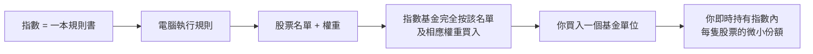
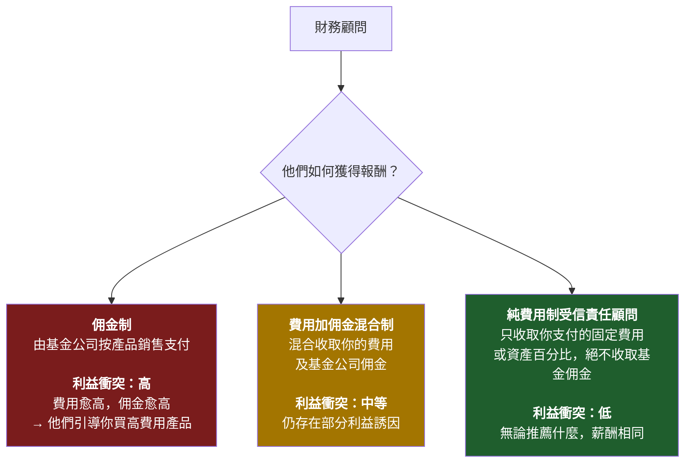
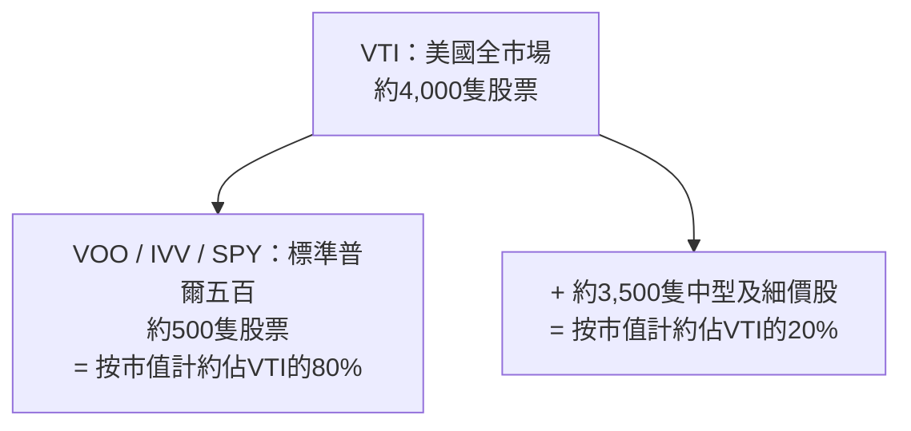
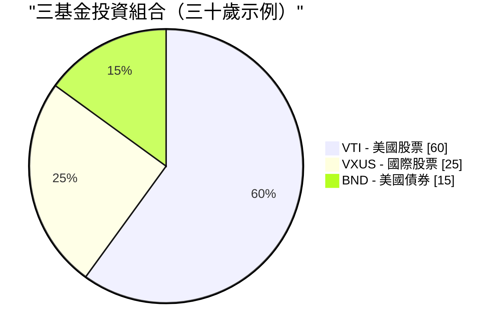

# 第二週：指數基金與交易所買賣基金

動畫參考：`animation/week02_active_vs_passive.py`

---

## 第一部分：閱讀章節

---

### 1. 為何此課題至關重要

上週我們確立了一個殘酷的事實：**通脹是地心引力，不投資才是你最昂貴的選擇。** 現在的問題是*如何*投資。而以下這個答案，投資界花了整整四十年才肯承認：對幾乎所有人而言，正確答案是**低成本指數基金或交易所買賣基金。** 不是選股。不是你銀行的「財富管理顧問」。不是你姻親的內幕貼士。也不是你保險代理人迫不及待要賣給你的結構性產品。

這是整個課程中最重要的一課，而且它確實簡單明瞭。如果你讀完第二週後便停止閱讀，設定好每月自動買入一隻廣泛市場指數交易所買賣基金，此後再也不翻閱任何財經書籍，**你的投資表現仍將超越這個星球上絕大多數的投資者——包括那些領取數百萬薪酬替人管理資產的專業人士。**

這不是推銷話術。這是四十年來數據所呈現的準確陳述：

- **在二十年的視窗內，約九成主動管理的美國大型股基金跑輸標準普爾五百指數**——此數據每年由標準普爾道瓊斯指數的SPIVA記分卡公布。
- **預測基金未來表現的最佳單一指標是開支比率。** 不是基金經理的學歷背景，不是品牌，不是過往回報。而是費用。費用愈低，平均而言未來回報愈高。（晨星已在一項又一項研究中加以印證。）
- **畢非德——史上最著名的主動投資者——在遺囑中指示，其妻子的遺產應投入「一隻非常低成本的標準普爾五百指數基金」。** 如果有史以來最偉大的選股者告訴自己的遺孀放棄選股，這本身就是一個訊號。

因此，本週我們將圍繞三個主題展開。其一，指數基金究竟是什麼，以及它如何在略帶異端色彩的歷史背景下誕生。其二，金融業從散戶手中榨取財富的四種主要手段——高費用主動基金、佣金驅動的顧問、以保險包裝的「投資」產品，以及緩慢蠶食資產的舊式互惠基金——以及如何從容地繞開它們。其三，你實際需要的幾個具體代號。

最後還有一個誠實的伏筆：**指數基金共識已運作了四十年。但這並不保證它能永遠有效。** 它何時以及如何可能失效，以及你應對此的方法，是我們在後面章節才回頭討論的話題。現在，我們先奠定基礎。進階操作稍後再談——是建立在這個基礎*之上*，而非取而代之。

> *「投資是必需品。本課程中的其他所有工具都只是錦上添花。」*

---

### 2. 你需要掌握的知識

#### 2.1 什麼是指數？

**指數**是一份按照特定規則組成的股票（或其他資產）名單。沒有人在「管理」這個指數——它就是其規則所界定的那樣。標準普爾五百指數就是「五百家符合特定流動性、盈利能力及上市標準的美國最大型公司，按市值加權」。這就是完整的定義。電腦即可執行。

當新聞說*「今日市場上升了百分之二」*，幾乎總是指標準普爾五百指數上升了百分之二。

以下是你將經常聽到的主要指數：

| 指數 | 追蹤範圍 | 成分股數目 |
| --- | --- | --- |
| **標準普爾五百** | 五百家最大型美國公司 | 約500 |
| **CRSP美國全市場** | 整個美國股票市場 | 約4,000 |
| **道瓊斯工業平均指數** | 三十家大型美國公司（按股價加權，一個舊式設計） | 30 |
| **納斯達克綜合指數** | 納斯達克所有股票 | 約3,000 |
| **納斯達克一百指數** | 一百家最大型非金融類納斯達克股票（以科技股為主） | 100 |
| **羅素二千指數** | 二千家美國細價股公司 | 約2,000 |
| **MSCI歐澳遠東指數** | 美國及加拿大以外的已發展市場 | 約800 |
| **MSCI新興市場指數** | 新興市場國家 | 約1,400 |
| **富時一百指數** | 一百家最大型英國公司 | 100 |

**大多數主要指數均以市值加權。** 這意味著某公司在指數中的權重，與其總市值成比例。蘋果公司約三萬億美元的市值，在標準普爾五百指數中佔約百分之七的權重；市值約一百億美元的最小成分股則只佔約百分之零點零二。前十大公司的比重往往高達**整個指數的百分之三十至三十五。** 當你「買入標準普爾五百」時，你所獲得的大型科技股集中度，遠比「五百隻股票」這個名字所暗示的要高得多。

這就是整個運作機制。其中並無任何天才之處。這正是它奏效的原因。

---

#### 2.2 指數基金——博格的異端構想

指數基金直到一九七六年才問世。在此之前，美國每一隻互惠基金都是主動管理的：西裝革履的聰明人負責選股，每年收取百分之一至二的費用。那時的數據與現在相同——他們中的大多數都輸給了市場平均水平——但這一學術發現尚未被轉化為產品。

**將這一數學結論付諸實踐的人是傑克·博格。** 博格於一九七四年被威靈頓管理公司驅逐。一九七五年，他創辦了一家奇特的新型互惠基金公司，名為**先鋒集團**，採用互助結構——由其自身的基金持有人擁有，沒有外部盈利動機。一九七六年，先鋒推出了**第一指數投資信託**，這是首隻面向散戶的指數基金：它只需按照指數權重買入標準普爾五百指數的全部五百隻股票，並收取極低的費用。

業界對此嗤之以鼻。媒體稱之為**「博格的蠢事」。** 經紀人拒絕銷售（因為沒有佣金可賺）。該基金在首次公開招股中僅籌得一千一百萬美元——遠低於博格目標的一億五千萬美元。競爭對手稱這個構想**「不符合美國精神」**，是**「保證平庸的配方」。**

競爭對手說它保證平庸倒是說對了——*如果平庸的意思是「市場平均水平減去幾個基點的費用」。* 他們沒有意識到的是，市場平均水平減去幾個基點的費用，在二十年內跑贏了大約九成的專業人士。

今天，先鋒管理逾**八萬億美元**的資產，指數基金及交易所買賣基金合計在全球管理**逾二十萬億美元**。博格的「蠢事」成為了全球散戶股票投資的主流形式。他本人於二零一九年辭世，卻從未像其他創辦八萬億資產管理規模公司的創辦人那樣中飽私囊——先鋒的互助結構意味著節省的費用回流給了基金持有人，而非他本人。在金融界，他是少數幾個可以不加引號地稱之為*英雄*的人之一。

> 「不要在草堆裡尋找針。直接買下整堆草。」——約翰·C·博格

---

#### 2.3 互惠基金與交易所買賣基金——互惠基金為何仍然存在（以及為何你大多數時候應選擇交易所買賣基金）

**指數基金**是一種*策略*——追蹤指數。這種策略可以包裝在兩種不同的*外殼*中：

- **互惠基金**，每天僅在收市時按收市資產淨值一次性定價及交易。
- **交易所買賣基金**，在交易所全天實時交易，與股票相同。

| 特點 | 互惠基金 | 交易所買賣基金 |
| --- | --- | --- |
| 交易時段 | **每天一次**，按收市資產淨值 | **全天**，與股票相同 |
| 最低投資額 | 通常**一千至三千美元** | **一個單位的價格**（或碎股） |
| 稅務效益（應稅賬戶） | **較差**——資本增值分派強制攤及所有持有人 | **較佳**——實物贖回機制保護持有人 |
| 佣金 | 在基金自家經紀處為零 | 在大多數經紀處為零 |
| 自動投資便利性 | **是**（任意日期、任意金額） | 有時較困難（需整股，除非支援碎股） |

**在二零二六年，交易所買賣基金在幾乎所有重要維度上均勝出**——最低投資額較低、實時定價、稅務效益顯著更佳、平均開支比率更低。互惠基金仍然具備真正優勢的情況只有以下幾種：

1. **四零一(k)及其他僱主退休計劃。** 大多數美國四零一(k)計劃的選擇仍以互惠基金為主。計劃管理人尚未完成轉換，你通常也無法自行將交易所買賣基金帶入計劃。在四零一(k)中，互惠基金的稅務問題基本上無關緊要（賬戶本身已有稅務優惠），因此外殼的選擇是被動決定的，也並無大礙。
2. **按固定金額設定定期自動投資。** 先鋒的互惠基金允許你設定「每月一號投資五百美元」，並精確執行，包括買入碎股。交易所買賣基金的自動投資功能雖然存在，但因經紀而異。

**以上基本上就是全部情況。** 在二零二六年的普通應稅經紀賬戶中，同一指數的交易所買賣基金版本，在成本及稅後回報方面，幾乎對每位散戶都優於互惠基金版本。**默認選擇交易所買賣基金。** 如果你只能通過四零一(k)投資，互惠基金也完全可行——從菜單中選擇最低成本的廣泛市場指數選項，繼續前行即可。

互惠基金之所以仍然大量存在，並非因為它們*更好*。而是因為**數以萬億計的舊有資金停留在四零一(k)、個人退休賬戶及舊式經紀賬戶中**，贖回將觸發應稅資本增值。是慣性，而非優點，讓它們延續至今。新增資金幾乎應一律投入交易所買賣基金。

---

#### 2.4 主動對決被動——九成比例的統計數據

**主動投資**指基金經理（或你本人）嘗試挑選勝出的股票並規避輸家。研究、分析、頻繁交易、重倉持股。這正是每一隻主動管理的互惠基金及對沖基金所做的事，也是他們向你收費的理由。

**被動投資**指買入整個指數，接受平均水平。無需預測，無需重倉，無需魅力。

核心問題是*「主動基金經理能否跑贏指數？」* 標準普爾道瓊斯指數SPIVA記分卡連續二十多年每年重複給出的標準答案是**大多數不能。** 時間視窗愈長，情況愈差：

| 類別（美國） | 五年跑輸比例 | 十年跑輸比例 | 二十年跑輸比例 |
| --- | --- | --- | --- |
| **美國大型股** | 78% | 85% | **90%** |
| **美國中型股** | 74% | 83% | 89% |
| **美國細價股** | 68% | 79% | 88% |
| **國際股票** | 71% | 82% | 87% |
| **新興市場** | 69% | 80% | 85% |
| **美國投資級債券** | 72% | 81% | 86% |

*（數字來自近期SPIVA報告的近似值；確切數字每年略有浮動，但定性規律始終如一。）*

> 換句話說：每一百位美國大型股基金經理中，**九十位在二十年間輸給了一台執行五百個名字簡單列表的電腦**。

更致命的後續發現是：**勝出的那十位，在下一個十年並非同一批人。** 標準普爾的持續性研究反覆顯示，五年內排名前四分之一的基金，在接下來五年中跌出前四分之一的頻率高於留在其中。過往的出色表現無法預測未來的表現——每份基金說明書底部的這句警告是真實的，而大多數投資者對此視而不見。

主動管理人整體上無法跑贏指數，有五個原因：

1. **費用。** 主動基金每年收取百分之零點五至一點五。指數交易所買賣基金收取百分之零點零三。基金經理每一年必須跑贏指數**超過整整一個百分點**，才能與廉價選項打平。
2. **交易成本。** 每一次買賣都有摩擦——買賣差價、市場衝擊、機構層面的佣金。高換手率策略持續失血。
3. **稅務。** 高換手率在互惠基金中觸發資本增值分派，無論你是否沽貨，均須在當年繳稅。
4. **市場大致有效。** 數以萬計的專業人士在閱讀同樣的年報、同樣的業績電話會議紀錄、同樣的衛星數據。真正的優勢十分罕見。
5. **倖存者偏差。** 表現不佳的基金被悄然清盤或合併入其他基金。現存的「主動基金」整體看起來比實際情況更好，因為最差的輸家已被埋葬。

---

#### 2.5 開支比率——你能掌控的最大槓桿

**開支比率**是基金每年收取的費用，每天自動從基金資產中扣除。你永遠不會看到賬單。它只是讓你的回報略微降低。

這種隱形性正是它作為財富提取機制有效運作的全部原因。**百分之一的費用聽起來微不足道。但在三十年內，它大約會吞噬你最終財富的百分之二十五至三十。** 複利是雙刃劍：它讓你的資金增長，也讓費用增長。

十萬美元投資，以百分之十的毛回報持續三十年：

| 基金類型 | 開支比率 | 淨回報 | 第三十年末價值 | 相對指數損失的費用 |
| --- | --- | --- | --- | --- |
| **指數交易所買賣基金**（如VOO） | **0.03%** | 9.97% | **$1,721,686** | — |
| 廉價主動型 | 0.50% | 9.50% | $1,526,688 | **−$194,998** |
| 平均主動型 | 1.00% | 9.00% | $1,326,768 | **−$394,918** |
| 昂貴主動型 | 1.50% | 8.50% | $1,152,309 | **−$569,377** |
| 保險產品包裝 | 2.00% | 8.00% | $1,006,266 | **−$715,420** |

再看一次最後一行。**百分之二的包裝，令你在十萬美元的投資上損失逾七十萬美元。** 這不是費用。這是一棟房子。視乎城市，甚至可能是兩棟。這筆錢從你的退休積蓄流向基金公司的薪酬、市場推廣預算、辦公室租金及行政總裁薪酬。

**費用在每一種市場環境下都持續複利增長。** 市場下跌百分之三十的那一年，你仍然要付。基金經理跑贏指數百分之零點四的那一年，你仍然欠下百分之一的費用。費用是基金說明書上唯一有保證的數字。

還有兩個業界寧願你不要內化的事實：

- **在任何基金類別中，費用較低的基金平均表現優於費用較高的基金。** 這是基金研究中複製次數最多的發現——晨星已在不同資產類別及數十年的時間跨度中加以證明。某一類別中費用最低的基金，平均而言就是該類別表現最好的基金。
- **費用是*確定*的拖累。基金經理的超額表現是*期望中*的抵消。** 用確定性換取希望，在其他任何領域都被視為一筆劣質交易。

---

#### 2.6 財務顧問的陷阱

如果主動型基金的成績如此糟糕，為什麼每家銀行、每家經紀、每個「財富管理」分支機構仍在不斷推銷它們？因為**財務顧問的薪酬結構使得銷售這些產品對顧問而言是理性的**，即便這對你而言毫無道理。

你會遇到三種薪酬模式：

**向任何顧問提問的最重要問題：*「您是受信責任顧問嗎？您是純費用制嗎？」*** 受信責任顧問在*法律上*有義務以你的最佳利益行事。非受信責任的銷售員只需推薦「適合」的產品——這是一個低得多的門檻，歷史上允許向任何能簽名的人銷售高費用的劣質產品。

你銀行的「私人財富管理顧問」如此急於將你引入一隻開支比率百分之一點五、附帶百分之五認購費的主動型基金，是因為銀行兩頭都有收益：認購時賺取認購費，*並且*在你持有期間持續收取12b-1市場推廣費的分成。**你不是他們的客戶，你是他們的產品。** 基金公司付錢給他們，讓他們把你送上門。

應對非受信責任顧問推銷主動型基金，最乾淨俐落的回應是：*「請以書面形式告訴我，我持有這隻基金十年的全部費用——開支比率、認購費、12b-1費用、顧問費、賬戶費用。同時請告訴我，貴公司從該基金家族獲得的所有報酬。」* 如果他們拒絕或拖延，你已經得到了答案。

> **默認原則：** 除非你已擁有數百萬美元資產及真正複雜的稅務狀況，否則你幾乎可以確定不需要財務顧問。你需要的是一隻交易所買賣基金和一個每月自動轉賬指示。

---

#### 2.7 保險「投資」幾乎全是騙局

我想在此表達得格外直接。**可變萬用人壽保險、指數型萬用人壽保險、以「投資」為賣點的人壽保險、股票掛鈎儲蓄產品、向散戶推銷的結構性年金——這些產品極少有例外，幾乎全是為了向不知道自己正在被收費的人榨取費用而設計的掠奪性產品。**

推銷話術永遠是以下某種組合：

- *「稅務優惠增長。」*
- *「本金保障。」*
- *「享有股市升幅而無需承擔跌幅。」*
- *「強迫儲蓄紀律。」*

現實情況幾乎永遠是：

- **若你在首五至十年內退出，將承受百分之五至十的退出費用。**
- **每年隱藏在晦澀術語下的全部費用高達百分之二至四**——「死亡及費用保障費」、「保障費用」、「行政費用」、「基金管理費」，全部疊加在一起。
- **扣除費用後的回報遠遠落後於基本的交易所買賣基金**——在底層市場回報百分之八至十的情況下，淨回報往往只有百分之二至四。
- **支付給代理人的佣金可高達你首年保費的百分之八十至一百**，這正是這些產品被如此大力推銷的確切原因。

終身保護你的簡單原則：

> **保險是用於風險轉移的。投資是用於財富創造的。永遠不要將兩者混為一談。**

如果你有受撫養人，其財務狀況會因你的離世而受損，請**購買定期壽險**——純粹、廉價、固定期限的保障，不含任何投資成分。一個健康的三十歲人士，每月約二十五至三十五美元便可購入一份二十年、一百萬美元的定期壽險。然後，將定期保費與代理人向你收取的人壽保費之間的差額，**投入一隻指數交易所買賣基金。** 這是教科書級別的策略：**「買定期保險，將差額用於投資。」** 在任何二十年期間，按稅後淨資產計算，這一策略均以數量級的優勢勝過人壽保險——而且你對投資部分保有完全的掌控和流動性。

代理人會告訴你人壽保險「強迫你儲蓄」。你在經紀賬戶設定的每月自動轉賬同樣如此，而且那個不會向他們支付百分之八十的佣金。

---

#### 2.8 誠實的反例——那些確實奏效的主動型基金

在過去幾個章節中，我一直在批評主動管理。為了保持學術誠信，我必須坦率地說：**少數主動基金經理確實跑贏了指數，而且決定性地，持續了數十年。** 數量不多，但足以重要。

以下是值得關注的例子：

- **畢非德與芒格領導下的巴郡·哈撒韋。** 從一九六五年至二零二零年代初，巴郡的賬面值每年複利約**百分之二十**，而標準普爾五百指數約為百分之十——這是現代金融界最令人印象深刻的長期業績記錄。畢非德是主動管理*可以奏效*的教科書級別證明。而他也正是同一個告訴遺孀將遺產投入標準普爾五百指數基金的畢非德。他是例外，並且在告訴你，你並非例外。
- **彼得·林奇主理的富達麥哲倫基金，一九七七至一九九零年。** 林奇管理麥哲倫基金長達十三年，年回報率約**百分之二十九**，十三年中有十一年跑贏標準普爾五百——堪稱有史以來最偉大的互惠基金業績記錄。他在四十六歲退休。林奇離任後，麥哲倫基金大致回到跟蹤指數的狀態。
- **文藝復興科技的獎章基金，約一九八八年至今。** 一隻高頻率、高數學含量的量化基金，僅限員工參與，據報在逾三十年間的年回報率，在扣除其五厘及四十四厘的費用後仍高達**約百分之四十**。獎章基金自一九九三年起便不再接受外部投資者，而文藝復興科技面向*外部投資者*的基金（RIEF、RIDA）表現則遠遜——有時在獎章基金回報高達百分之七十的年份錄得虧損。**獎章基金是真實、持久阿爾法存在的明證。它同時也是真實阿爾法如何被封存、永遠無緣於你的明證。**
- **塞思·卡拉曼的鮑博斯特集團。** 數十年間，在市場波動性顯著較低的情況下取得接近股票水平的回報，方法是堅守深度價值框架，在沒有符合標準的機會時持有極高比例的現金。卡拉曼的著作《安全邊際》二手售價高達逾一千美元，因為他拒絕重印。
- **喬爾·格林布拉特在哥譚資本，一九八五至一九九四年。** 在一個規模較小的特殊情況投資組合上，每年回報約百分之五十，持續十年，之後將外部資本退還。格林布拉特後來在《你也可以成為股市天才》及《戰勝華爾街的小書》中發表了完整策略——他公開押注，這個策略*太偏重細價股、太令人不舒服、也需要太多耐性*，讓大多數讀者無法真正執行。

請留意這個規律。數十年來確實跑贏指數的基金，要麼**已向新資金關閉**（獎章基金），要麼**在巔峰時期定期關閉**（麥哲倫基金），要麼**是一個本身就是獨特存在的單一控股公司**（巴郡），要麼**規模刻意保持較小以免影響優勢**（格林布拉特的早期），要麼**倉位高度集中、需要在多年回撤中堅持持有，而大多數投資者無法承受**（卡拉曼）。

這個教訓並非*「主動管理永遠無效」。* 教訓是：**真正奏效的主動策略，鮮少是你能在銀行產品菜單上購買到的那種。** 而你*能*從銀行產品菜單上買到的主動型基金，整體而言，正是SPIVA記分卡追蹤的那九成輸給指數的基金。

如果你擁有足夠的時間、合適的心態，以及在市場某個特定角落真正持久的優勢，盡可以在那裡集中資源。大多數讀者並不具備這些條件。**大多數讀者應該將主要資金指數化，將時間用於其他地方。**

---

#### 2.9 你實際需要的基金

你不需要記住數以千計的交易所買賣基金。你只需要這份簡短的名單：

| 代號 | 基金 | 開支比率 | 追蹤範圍 |
| --- | --- | --- | --- |
| **VOO** | 先鋒標準普爾五百交易所買賣基金 | **0.03%** | 五百家最大型美國公司 |
| **VTI** | 先鋒美國全市場股票 | **0.03%** | 整個美國市場（約四千隻股票） |
| **IVV** | iShares核心標準普爾五百 | 0.03% | 標準普爾五百（貝萊德版VOO） |
| **SPY** | SPDR標準普爾五百 | 0.09% | 標準普爾五百（歷史最悠久，費用較高，為交易者偏好） |
| **VXUS** | 先鋒全球國際股票 | 0.07% | 所有非美國的已發展市場及新興市場 |
| **VT** | 先鋒全球股票 | 0.07% | 全球整體市場（美國及非美國合一） |
| **BND** | 先鋒美國全債券市場 | 0.03% | 美國投資級債券 |
| **QQQ** | Invesco納斯達克一百 | 0.20% | 一百家最大型非金融類納斯達克股票（以科技股為主） |

**VOO對比VTI對比SPY**是最常被問及的問題。簡短版本：

- **VOO**和**IVV**追蹤同一指數（標準普爾五百），費用相同（百分之零點零三）。任選其一均可。
- **SPY**同樣追蹤標準普爾五百，但費用**是前者的三倍**（百分之零點零九）。它的存在是因為它是美國*第一隻*交易所買賣基金（一九九三年），因此流動性最強——機構交易者在意這一點，長線投資者則不需要在意。**不要為你不需要的流動性支付三倍費用。**
- **VTI**持有整個美國市場（約四千隻股票），而非僅限最大的五百家公司。在實際操作中，VOO和VTI的回報幾乎相同，因為標準普爾五百佔美國市場總市值的約百分之八十。如果你想要一隻基金加上略多一點的分散投資，選VTI。如果你想要一隻基金加上所有人都在引用的最清晰指數，選VOO。**這兩者之間沒有錯誤答案。**

---

#### 2.10 如何實際買入

整個操作流程如下，只需十五分鐘：

1. **開設一個經紀賬戶。** 美國居民：富達、嘉信理財或先鋒——三者均免費，三者均有合理的平台。香港、台灣或新加坡居民：盈透證券是廉價買入美國上市交易所買賣基金的標準跨境選擇。
2. **連結銀行賬戶並轉入資金。** ACH轉賬需一至三個工作日。
3. **搜索代號。** 輸入*「VOO」*。基金資料隨即顯示。
4. **下買入盤。** 市價盤 = 按當前價格買入。輸入股數或金額（大多數經紀現已支援碎股）。
5. **設定每月自動投資。** 例如，每月一號投資五百美元。然後忘記它的存在。

就這樣。**五個步驟。十五分鐘。你現在持有了美國五百家最大型公司的一小份。** 無需CNBC。無需盯著投資組合。無需選股焦慮。

買入後最重要的事，是**關閉應用程式並停止查看。** 市場每天都在波動。每天盯著漲跌，是造成投資者糟糕行為的最大單一原因——恐慌拋售、亢奮追高。跑贏SPIVA的指數交易所買賣基金策略所帶來的每一分長線回報，都來自*持守度過*市場雜音，而非圍繞它頻繁交易。

---

#### 2.11 三基金投資組合

對大多數讀者而言，以博格普及的**三基金投資組合**，確實就是整個投資組合的全部：

| 基金 | 代號 | 建議配置（三十歲） |
| --- | --- | --- |
| 美國全市場股票 | **VTI** | 60% |
| 全球國際股票 | **VXUS** | 25% |
| 美國全債券市場 | **BND** | 15% |

關於債券比例，傳統的**粗略經驗法則**是：**債券佔比 ≈ 你的年齡減二十**，大致如此。三十歲持有約百分之十至十五的債券。六十五歲持有約百分之四十五至五十五的債券。教科書的邏輯是，債券起到*壓艙石*的作用：當股票下跌時它們上升，降低投資組合的波動性，並在你臨近退休、無法等待十年讓股市復原的關鍵時刻，保護你免受股票百分之五十回撤的衝擊。

> **我必須在這個基礎課提前給你一個重要提示：** 這個傳統邏輯是建立在一個已不再存在的世界之上的。
>
> 「債券作為壓艙石」的框架假設（a）債券提供高於通脹的實際收益率，以及（b）股票下跌時債券上升。**這兩個假設在二零二零年代均已打破。** 隨著各國政府以印鈔方式為龐大的財政赤字融資（第一週第二點二節），以及中央銀行將實際收益率壓制在通脹以下作為政策手段（「金融壓制」），在通脹周期中持有長期債券基金並非壓艙石——而是購買力的緩慢流失。而在二零二二年，股票和債券*同時*下跌了約百分之二十，這正是六四開含債券的投資組合結構本應保護你免於遭遇的場景。
>
> 因此，請將上表中的債券比例視為**本課程其餘部分將予以挑戰的教科書起點。** 我們將在後面回頭探討在印鈔時代，真正扮演壓艙石角色的是什麼：
>
> - **第五週（債券）**將深入剖析債券的實質，說明歷史對沖策略何時奏效，以及在何種條件下失效。
> - **第六週（黃金與商品）**將介紹另類通脹對沖工具——黃金在人類經歷過的每一種貨幣體制下都是價值儲存手段，而在二零二零年代，支持黃金的論據遠比支持長存續期債券的論據更為有力。
> - **第四十七週（尾部風險對沖）**及**第五級別整體**將重新正確建構投資組合的安全端，使用現金/短存續期國債、黃金及長波動性期權結構的組合，取代傳統的長存續期債券配置。
>
> 對於你今天建立的基礎投資組合而言，三基金模板已然可行，且遠優於不投資。**只需明白，債券部分是這個投資組合中保質期最短的環節，我們將會回頭加以替換。**

這整個投資組合的混合開支比率：**每年約百分之零點零四。** 即每一萬美元每年*四美元*。一個觸及所有主要資產類別的全球多元化投資組合。

---

#### 2.12 直至它失效為止——一個伏筆

本章我花了大量篇幅告訴你指數交易所買賣基金就是答案。我想以一個讓我成為誠實老師而非銷售員的補充說明來作結。

**買入並持有被動指數策略在過去四十年間表現非凡——大約從一九八零年代初開始。** 它之所以奏效，是因為一套特定條件的組合：工作年齡人口多於退休人口，每個發薪周期機械性地持續買入；利率持續下降；美元儲備貨幣地位；全球化；以及二零零八年以來，美聯儲在金融環境收緊時始終如一地介入。

**這些順風沒有一個是有保證的永遠繼續吹動的。**

當人口結構翻轉到來——當嬰兒潮一代從淨買入（積累期）轉向淨賣出（提款期）——長達四十年持續推高指數的同一條機械管道，可能會反向運作。被動基金並非自主運作的；它們對其終端投資者是在供款還是提款作出反應。一個在上漲過程中由對價格不敏感的資金流主導的市場，在下跌過程中同樣脆弱於對價格不敏感的資金流。

**這不是預測指數明天將停止運作。這是對「它已奏效了四十年」與「它將永遠有效」並非同一回事的誠實承認。**

對於*你*，今天，正在建立你的第一個投資組合：**指數交易所買賣基金是正確答案。** 建立基礎。啟動每月自動轉賬。在你學習課程其餘部分的未來幾年裡，讓它複利增長。

指數何時以及如何可能停止運作的詳細分析——以及屆時你如何調整——正是我們在本課程其餘部分所建立的內容：

- **第二十三週（因子投資）**介紹了超越簡單市值加權指數化的第一套替代方案——價值、動量、質量、低波動性等因子傾斜，它們在歷史上捕捉到了市值加權指數所遺漏的回報。
- **第四十三週（主動投資組合管理）**深入探討主動管理*確實*值回票價的情況，以及不值的情況。
- **第五級別（第四十七至五十二週）**是我們實際建立「槓鈴」投資組合結構的地方——一端是高信念的安全倉位，另一端是不對稱投機，廣泛市值加權核心被刻意*移除*。那是進階結構，建立在第二至四十六週涵蓋的一切之上。

現在：**投資是必需品。交易所買賣基金是基礎。本課程中的其他一切都是錦上添花，疊加其上。** 如果你無法跑贏指數——大多數人在大多數時候無法做到——就不要浪費你的人生嘗試。讓指數代勞，將你的時間投放在讓你的生命複利增長的事情上，而非你的試算表。

但要明白，*「買入並持有指數」*是一個條件性策略，在特定的四十年窗口內奏效。我們將回頭討論這個窗口關閉後的應對方案。眼下，這個基礎已然足夠。

---

### 3. 常見誤解

**誤解一：「指數基金只是給初學者的。」**

主權財富基金、大學捐贈基金、退休金基金以及億萬富翁都在使用指數基金及交易所買賣基金。加州公務員退休系統——全球最大的退休金基金之一——就有龐大的指數基金授權。畢非德，*最著名的*主動投資者，在二零零八至二零一七年間公開押注一百萬美元，賭標準普爾五百指數基金將跑贏由精心挑選的對沖基金組成的籃子，並以決定性優勢贏得賭注。指數化不是初學者的選項；它是理性選擇的結果，恰好也是最簡單的。

**誤解二：「一分錢一分貨——費用愈高，管理愈好。」**

在幾乎所有其他消費品類別中，這句話是對的。在投資領域，**這個關係是相反的。** 晨星已在不同資產類別及數十年間證明，**開支比率是預測基金未來表現的最佳單一指標**——優於過往回報、優於星級評級、優於基金經理任期。費用愈高，預期未來回報愈低。廉價基金平均而言是更好的基金。

**誤解三：「但我的財務顧問推薦了一隻主動型基金。」**

許多財務顧問因銷售特定基金而獲得佣金——有時是公開的，往往則藏在你永遠不會出現在賬單上的不透明收入分享安排中。他們的利益誘因是推薦*對他們*佣金最高的產品，而非讓*你*複利增長最多的產品。**務必詢問：「您是純費用制受信責任顧問嗎？您從您推薦的任何產品中獲得什麼全部報酬？」** 如果答案是否定的，或者他們無法或不願以書面回答，請離開。

**誤解四：「指數基金無法在市場下跌時保護你。」**

正確——它們無法做到。它們也不應該這樣做。指數下跌時市場隨之下跌。相關比較*不是*「指數對比現金」，而是「指數對比主動型基金」。二零零八年標準普爾五百下跌約百分之三十七；平均主動管理的美國股票基金下跌約百分之三十九。主動型基金經理沒有在崩盤中保護你；平均而言，他們讓情況稍微更差。**下跌時的保護來自你的*資產配置*（股票對債券對現金的比例）及你的行為（不要恐慌拋售），而非你選擇的基金。**

**誤解五：「我應該選擇過去五年業績最好的基金。」**

這是散戶投資者最常犯、也最代價高昂的錯誤。**表現優秀的基金會向均值回歸。** 標準普爾十年又十年重複的持續性研究顯示，前四分之一的基金中，不足十分之一在五年後仍留在前四分之一。過往表現不能預測未來表現；每份基金說明書底部的這句警告不是法律樣板文，而是一句每個人都忽略的真實陳述。追逐過往優勝者，預期結果*比隨機選擇更差*。

**誤解六：「SPY和VOO追蹤同一事物，買哪個都無所謂。」**

它們追蹤同一指數。但它們的費用不同。SPY收取百分之零點零九；VOO收取百分之零點零三。在五十萬美元的投資組合持有三十年的情況下，百分之零點零六的差距複利下來，相當於大約**逾二萬五千美元**的財富損失。SPY唯一的結構性優勢是其交易流動性，這只對移動大量資金的機構或日內交易者有意義——對買入並持有的投資者而言毫無意義。**對長線持有者而言，VOO或IVV在費用上永遠優於SPY。**

**誤解七：「我需要分散投資於多隻不同的指數基金。」**

一隻全市場基金如VTI已持有約四千隻股票。加入VXUS後，你又獲得了約七千隻國際股票。**兩隻交易所買賣基金即涵蓋所有主要經濟體的約一萬一千隻股票——股票層面已無更多分散投資的空間。** 持有十隻以上指數交易所買賣基金，通常只是製造重複（同樣的蘋果、微軟和英偉達以不同權重出現在多隻基金中）以及一種虛假的分散投資感。兩至三隻基金已足夠。超過五隻通常是混亂的表現，而非成熟的體現。

**誤解八：「指數基金很危險，因為你無法避開不良公司。」**

指數基金確實持有走向破產的公司。安然於二零零一年崩潰時，它佔標準普爾五百指數約百分之零點七——抽象地說令人痛苦，但對投資組合而言微不足道。其餘四百九十九家公司繼續複利增長。**指數*內部*的分散投資——數百甚至數千個名字，沒有一個個體大到足以單獨摧毀你——才是保護所在。** 恰好重倉安然的集中式選股者在那個名字上損失殆盡。指數投資者損失了百分之零點七。

**誤解九：「人壽保險是好的投資，因為它免稅積累現金價值。」**

它不是，而現金價值的推銷恰恰是這個產品的銷售手法。扣除代理人佣金、退出費用時間表及層疊的年費後，人壽保險現金價值的實際回報，通常只有**百分之二至四的淨回報**，而同期指數交易所買賣基金的回報可能達到百分之七至十。**為實際的死亡保障需求購買定期壽險，然後將定期保費與人壽保費之間的差額投入指數交易所買賣基金。** 這就是教科書式的「買定期保險，將差額用於投資」策略。在幾乎所有現實情景中，它均勝出；代理人的佣金正是他們永遠不會推薦這個策略的確切原因。

---

### 4. 問答環節

**問題一：交易所買賣基金到底是什麼？它與股票有何不同？**

**交易所買賣基金**（ETF，即交易所買賣基金）是將一籃子證券打包成一個單一工具，像股票一樣在交易所上市交易。買入一個VOO單位，即等於按比例持有標準普爾五百指數五百家公司各一小份。**股票代表一家公司；交易所買賣基金代表一個定義好的籃子。** 交易機制相同——代號、實時價格、在交易時段買賣——但你同時獲得即時的分散投資。

**問題二：VOO、VTI或SPY——選哪個？**

對長期買入並持有的投資者而言：**VOO或VTI**，兩者均為百分之零點零三。VOO = 標準普爾五百（約五百個名字）；VTI = 整個美國市場（約四千個名字）。它們的表現幾乎相同，因為標準普爾五百按市值計算*就是*約百分之八十的美國市場。任選其一均可。**SPY是給交易者的，不是給投資者的**——與VOO相同的敞口，但費用是三倍。

**問題三：我的投資組合中應有多少比例投入指數交易所買賣基金？**

對大多數二十至四十歲正在建立第一個投資組合的讀者：**股票部分的百分之八十至一百**投入廣泛市場指數交易所買賣基金。股票與「安全資產」的具體比例取決於年齡和風險承受能力：

| 年齡 | 股票比例 | 安全資產比例 |
| --- | --- | --- |
| 20–35歲 | 80–90% | 10–20% |
| 35–50歲 | 70–80% | 20–30% |
| 50–65歲 | 50–70% | 30–50% |
| 退休後 | 30–50% | 50–70% |

**關於「安全資產」而非「債券」的說明：** 股票部分的傳統壓艙石歷來是債券配置，前提是假設債券與股票反向波動。如第二點一一節所述，這個假設在二零二零年代已經打破——二零二二年股票和債券同時下跌，而在金融壓制下債券已無法提供高於通脹的實際收益率。**「安全資產」部分因此應理解為一籃子與股票市場不相關（或負相關）的資產，而不僅僅是債券。** 傳統債券配置是其中一個組成部分，但現代的這個部分還包括現金及短存續期國債等價物、黃金及其他貨幣金屬（第六週），以及在更進階的層面——長波動性期權結構和尾部對沖覆蓋（第四十七週，第五級別）。對於你今天的第一個投資組合，像BND這樣的廣泛債券交易所買賣基金是一個合理的起點；課程的其餘部分就是你如何隨著進步來替換和補充它。

在股票配置內，典型的比例為約百分之七十的美國（VTI）及百分之三十的國際（VXUS）。

**問題四：開支比率與認購費——有什麼區別？**

**開支比率**是每年從基金資產每日扣除的費用。百分之零點零三作用於一萬美元 = 每年三美元。**認購費**是你買入（前端費）或賣出（後端費）時一次性收取的佣金。一筆一萬美元投資附帶百分之五的前端費，意味著五百美元即時消失，只有九千五百美元真正被投資。**現代指數交易所買賣基金的認購費為零。** 你查閱的任何*確實*收取認購費的基金，幾乎無一例外都不值得購買。

**問題五：如果九成主動型基金經理輸了，主動型基金為何還存在？**

因為它們**對基金公司而言利潤豐厚。** 一隻百億美元的基金，以百分之一的開支比率，每年賺取一億美元的費用，與業績無關。投資者輸給指數對投資者而言是壞事，但對基金公司而言卻是一門出色的經常性收益業務。再加上購買CNBC廣告時間的市場推廣預算、分銷這些基金的銀行分行網絡、獲付佣金出售它們的財務顧問，以及投資者相信善辯的基金經理能跑贏平均水平的心理——**主動基金行業的持續存在，是因為它向價值鏈上的每個人付款，唯獨除了你。**

**問題六：指數基金可能歸零嗎？**

從理論上說，只有當指數中的每一家公司同時破產——這意味著整個美國經濟已崩潰，在此情況下任何金融資產的價值都是學術問題。在實踐中，歷史上最嚴重的廣泛指數回撤（一九二九至三二年、二零零七至零九年、二零二零年新冠病毒閃崩）在峰值至谷底間下跌了百分之五十至八十，並在十年內回升至歷史新高。**個別股票完全可以歸零，也有許多已然如此。廣泛指數在實際上無法歸零。** 這種不對稱性正是分散投資有效的全部原因。

**問題七：國際指數基金——我也應該持有嗎？**

大多數合理的資產配置都包括一定程度的國際敞口。美國按市值計算約佔全球股票市場的百分之六十；另外百分之四十分布在歐洲、日本、新興市場及其他地區。國際分散投資可以降低投資組合的波動性，因為各地區市場並非完全同步波動。**VXUS**（先鋒全球國際股票）以百分之零點零七的費用，在一隻交易所買賣基金中涵蓋橫跨已發展及新興市場的約七千隻股票。常見的粗略比例是**百分之七十美國（VTI），百分之三十國際（VXUS）**。

**問題八：什麼是平均成本法？我應該用它投資指數交易所買賣基金嗎？**

**平均成本法（DCA）**= 無論市場如何表現，定期以固定金額投資。每月五百美元，風雨無阻，不管市場走勢。價格低時，五百美元買入更多單位。價格高時，五百美元買入較少。結果是平均成本略低於該期間的簡單平均市場價格，加上更重要的行為好處：**你在那些令人恐懼的月份繼續投資，而不是等待一個永遠感覺不對的「正確時機」。** 對任何以薪金收入投資的人來說，平均成本法是自動發生的。對持有一筆現金需要投入的人來說，學術文獻說法不一——從歷史上看，一次性投入平均略微優於平均成本法（因為市場大多數時候都在上漲），但平均成本法在心理上容易得多。

**問題九：指數基金派發股息嗎？**

是的。指數內的公司向基金派發股息，基金收取後每季度轉交股東。VOO目前的股息收益率約為百分之一點三至一點五。大多數經紀允許你啟用**股息再投資計劃（DRIP）**，自動將每次股息用於買入同一基金的更多單位。數十年後，**再投資的股息佔股票總回報的相當大一部分**——默認啟用股息再投資計劃。

**問題十：我聽說過「聰明貝塔」或「因子」交易所買賣基金——它們與指數基金相同嗎？**

不完全相同。傳統指數基金使用**市值加權**（公司愈大，指數權重愈高）。**聰明貝塔**或**因子**交易所買賣基金仍然基於規則，並系統性地再平衡——因此類似指數——但它們按*市值以外*的某個因子加權：價值（估值便宜的基本面）、動量（近期表現優異者）、質量（資產負債表健康的企業）、低波動性（波動較小的股票）、規模小等等。開支比率高於普通指數基金（通常為百分之零點一至零點四），因為再平衡規則更為複雜，但與主動型基金相比仍便宜得多。**因子投資是一個重要話題，我們將在第二十三週深入討論。** 但對你的第一個投資組合而言，普通市值加權指數交易所買賣基金是正確的起點。

**問題十一：我應該在指數交易所買賣基金之外購買個別股票嗎？**

如果你在某個特定公司或板塊中確實擁有持久優勢——來自本職工作的行業專長、對你身處的行業的結構性洞察——那麼**在指數核心之外配置一小部分個別投資是合理的。** 一個常見的結構是百分之八十至九十投入廣泛市場指數交易所買賣基金，百分之十至二十投入個別高信念名字。**你不應該做的**是因為在社交媒體上看到股票貼士、因為品牌熟悉、或因為它上個月表現不錯而買入個別股票。SPIVA的九成比例，對散戶股票選手的殺傷力遠比對專業基金經理更大——大多數散戶個股組合的表現遠遜於他們本可以直接買入的指數。如果你無法用一句話清楚說明某隻股票相對其基本面被錯誤定價的原因，你就沒有優勢——你只有一個觀點。觀點並沒有什麼不好；只是不要像對待優勢一樣重倉持有。

**問題十二：我不斷聽說指數「集中在大型科技股」——這是個問題嗎？**

這是一個真實的觀察。在二零二六年，標準普爾五百前十大持股（大多是大型科技名字——蘋果、微軟、英偉達、Alphabet、亞馬遜、Meta等）按權重計算佔整個指數約**百分之三十至三十五。** 買入VOO比「五百隻股票」這個名字所暗示的，集中在大型科技股的程度要高得多。這是否構成*問題*，取決於你對這些公司的看法。更廣泛市場的VTI集中度稍低（因為它將前十大股票稀釋至約四千個名字），而明確的等權重標準普爾五百交易所買賣基金（RSP，開支比率約百分之零點二）則走向另一個極端——同樣的五百個名字，均等權重。**目前，市值加權指數仍然是最簡單、歷史表現最佳的默認選擇。** 這個集中度問題及其對風險的影響，正是我們在第二十三週及以後進一步發展的體制感知思維類型。

---

## 第二部分：YouTube腳本

---

**影片標題：** 一隻跑贏九成華爾街的交易所買賣基金 | 第二週

**目標片長：** 約三十分鐘

**主持人：**
- **陳馬**（導師）：資深散戶投資者，以親身數十年管理自身投資組合的第一人稱視角發言
- **小魚**（學生）：剛畢業的社會新鮮人，正在學習投資積蓄，提出觀眾心中的疑問

---

**[開場 / 第零節：承諾]**

[VISUAL: 冷開場標題卡——「七十萬美元。這是你的費用所付出的代價。」]

[ANIMATION: 數以百計的股票代號混亂地旋轉，然後被掃入一個標有「一隻交易所買賣基金」的籃子中。字幕淡入：「而它跑贏了九成的專業人士。」]

**陳馬：** 如果你看完這一個影片，此後在財務生活上什麼也不做——沒有書籍、沒有播客、沒有選股應用程式——你仍然能跑贏華爾街幾乎所有專業基金經理。

**小魚：** 這個說法很大膽。

**陳馬：** 這不是我的說法。這是數據四十年來一直在告訴我們的。答案是一隻低成本廣泛市場指數交易所買賣基金。不是你銀行的財富管理顧問。不是你親戚的內幕貼士。也不是保險代理人迫不及待要賣給你的結構性產品。

**小魚：** 然而幾乎沒有人真的這樣做。

**陳馬：** 因為有一個規模以萬億計算的行業，他們的薪酬取決於你不這樣做。今天我想向你展示我自己投資組合的基礎——然後在最後，我會告訴你一件本類別中其他人都不願承認的誠實事情：這個策略已奏效了四十年，但並不保證永遠有效。

**小魚：** 伏筆收到。那我們就從基礎開始吧。

[VISUAL: 標題卡——「1. 什麼是指數？」]

---

**[第一節：什麼是指數？]**

**陳馬：** 在討論基金之前，我們必須先定義什麼是指數。指數只是一份按照特定規則組成的股票名單。沒有人管理它。標準普爾五百就是「五百家符合特定流動性及上市規則的美國最大型公司，按市值加權」。這就是完整的定義。電腦就能執行。

**小魚：** 當新聞說「市場今天上升了百分之二」，他們指的就是標準普爾五百。

**陳馬：** 幾乎總是如此。標準普爾五百是美國的頭條指數，代表美國市場總市值的大約百分之八十。

[VISUAL: 快速閃過主要指數的表格——標準普爾五百、CRSP美國全市場、道瓊斯工業平均指數（三十個名字，按股價加權，「一個舊式設計」）、納斯達克綜合指數、納斯達克一百指數、羅素二千指數、MSCI歐澳遠東指數、MSCI新興市場指數、富時一百指數。]

**小魚：** 五百家公司的權重是平均分配的嗎？

**陳馬：** 不是，而這正是大多數人忽略的部分。標準普爾五百按市值加權。蘋果公司約三萬億美元的市值，獲得約百分之七的權重。最小的成分股約百分之零點零二。

[ANIMATION: 條形圖，week02_active_vs_passive.py頂部——蘋果約7%，微軟約6.5%，從左至右遞減至右端的微小條狀。]

**陳馬：** 前十大公司——蘋果、微軟、英偉達、Alphabet、亞馬遜、Meta及其他幾家——合計佔整個指數約百分之三十至三十五。

**小魚：** 所以當我「買入標準普爾五百」，我實際上是在買一個集中的大型股倉位。

**陳馬：** 比「五百隻股票」這個名字所暗示的，集中在大型科技股上的程度要高得多。記住這一點。我們在課程後面會回到這個問題。

[VISUAL: 標題卡——「2. 博格的異端構想」]

---

**[第二節：博格的異端構想]**

**陳馬：** 指數基金直到一九七六年才問世。在此之前，美國每一隻互惠基金都是主動管理的——西裝革履的聰明人負責選股，每年收取百分之一至二的費用。那時的數據與現在相同：他們中的大多數都輸給了市場平均水平。學術發現雖已存在，但尚未被包裝成產品。

**小魚：** 直到有人做到了。

**陳馬：** 一個叫做傑克·博格的人。博格於一九七四年被威靈頓管理公司驅逐。一九七五年，他創辦了一家奇特的新型基金公司，名為先鋒集團，採用互助結構——由其自身的基金持有人擁有，沒有外部盈利動機。一九七六年，先鋒推出了第一指數投資信託。它只需按照指數權重買入標準普爾五百的全部五百個名字，並收取極低的費用。

**小魚：** 華爾街怎麼看？

**陳馬：** 華爾街嘲笑它。媒體稱之為「博格的蠢事」。經紀人拒絕銷售，因為沒有佣金可賺。首次公開招股只籌集到一千一百萬美元——遠低於博格目標的一億五千萬。競爭對手稱之為「不符合美國精神」，是「保證平庸的配方」。

**小魚：** 而今天呢？

[VISUAL: 粗體文字卡——「先鋒今日：八萬億美元。指數交易所買賣基金類別：二十萬億美元。」博格的照片，生卒年1929-2019。]

**陳馬：** 先鋒管理逾八萬億美元的資產。指數基金及交易所買賣基金類別在全球超過二十萬億美元。博格的「蠢事」成為全球散戶股票投資的主流形式。而令我奉他為英雄的是：因為先鋒採用互助所有制，節省的費用回流給了基金持有人，而非他本人。所有其他創辦八萬億美元資產管理規模公司的創辦人都會登上富豪榜。博格沒有。他於二零一九年辭世。

**小魚：** 一個沒有中飽私囊的金融英雄。這個名單很短。

**陳馬：** 這個名單只有一個人。他自己說的話是最好的總結：*「不要在草堆裡尋找針。直接買下整堆草。」*

[VISUAL: 標題卡——「3. 互惠基金對比交易所買賣基金」]

---

**[第三節：互惠基金對比交易所買賣基金]**

**陳馬：** 快速釐清一下外殼的區別，因為人們常常混淆。指數基金是一種*策略*——追蹤指數。這種策略可以裝在兩種不同的*外殼*中：互惠基金，每天僅在收市時按收市資產淨值一次性定價及交易；或交易所買賣基金，在交易所全天實時交易，與股票相同。

[VISUAL: 並排比較表——互惠基金對比交易所買賣基金，五個維度：交易時段、最低投資額、稅務效益、佣金、自動投資便利性。]

**小魚：** 哪個勝出？

**陳馬：** 在二零二六年的普通應稅經紀賬戶中，交易所買賣基金在幾乎所有重要維度上都勝出——最低投資額較低、實時定價、通過實物贖回機制獲得顯著更佳的稅務效益、平均開支比率更低。互惠基金仍然優於交易所買賣基金的情況，只有在四零一(k)計劃內（菜單是被動決定的，稅務問題也無關緊要），以及按固定金額設定定期自動投資（先鋒的互惠基金在這方面做得非常好）。

**小魚：** 那互惠基金為何仍然到處都是？

**陳馬：** 慣性。數以萬億計的舊有資金停留在四零一(k)、個人退休賬戶及舊式經紀賬戶中，轉出會觸發龐大的應稅資本增值。它們存在是因為轉移的代價高昂，而非因為它們更好。**新增資金幾乎應一律投入交易所買賣基金。**

[VISUAL: 標題卡——「4. 主動對決被動——九成比例的統計數據」]

---

**[第四節：主動對決被動——九成比例的統計數據]**

**陳馬：** 以下是核心數據。標準普爾道瓊斯指數每年發布SPIVA記分卡——標準普爾指數對比主動管理。在二十年的視窗內，**約九成的美國大型股基金經理跑輸標準普爾五百指數。**

[ANIMATION: image/week02_spiva.png動態呈現——條形從五年的78%攀升，至十年的85%，再至二十年的90%。類別從底部依次滾過：美國大型股、中型股、細價股、國際股票、新興市場、投資級債券。]

**小魚：** 一百個人中有九十個。帶著一整隊分析師和金融博士。輸給了一份名單。

**陳馬：** 而最致命的後續發現是：勝出的那十個，在下一個十年並非同一批人。標準普爾的持續性研究顯示，前四分之一的基金在接下來五年跌出前四分之一的頻率高於留在其中。過往表現不能預測未來表現。每份基金說明書底部的那句警告是真實的。

**小魚：** 那他們為何無法勝出？他們明顯很聰明。

**陳馬：** 有五個原因，而且是結構性的——與努力程度無關。

[VISUAL: 五張卡片依次出現，配合陳馬逐一列出。]

**陳馬：** 第一——費用。主動型基金每年收取百分之零點五至一點五。指數交易所買賣基金收取百分之零點零三。基金經理每一年必須跑贏指數*超過整整一個百分點*，才能與廉價選項打平。第二——交易成本。買賣差價、市場衝擊、機構層面的佣金。高換手率持續失血。第三——稅務。高換手率在互惠基金中觸發資本增值分派，無論你是否沽貨，均須在當年繳稅。第四——市場大致有效。數以萬計的專業人士在閱讀同樣的年報、同樣的業績電話會議紀錄、同樣的衛星數據。真正的優勢十分罕見。第五——倖存者偏差。表現不佳的基金被悄然清盤或合併。現存的「主動基金」整體看起來比實際情況更好，因為最差的輸家已被埋葬。

**小魚：** 換句話說：每一百位專業選股者中，有九十位在二十年間輸給了一台執行五百個名字列表的電腦。

**陳馬：** 對。

[VISUAL: 標題卡——「5. 開支比率——七十萬美元那張牌」]

---

**[第五節：開支比率——七十萬美元那張牌]**

**陳馬：** 現在我要讓費用問題變得無可忽視。想象你在三十歲投入十萬美元。每年賺取百分之十的毛回報，持續三十年。唯一的變數是費用。

[ANIMATION: image/week02_expense_drag.png動態呈現——五條財富曲線在三十年內逐漸分叉。0.03%的指數交易所買賣基金在最上方，然後依次是0.50%、1.00%、1.50%，最下方是2.00%的保險產品包裝。]

[VISUAL: 最終數值卡一張張印在屏幕上：
0.03% -> $1,721,686
0.50% -> $1,526,688
1.00% -> $1,326,768
1.50% -> $1,152,309
2.00% -> $1,006,266
「-$715,420」以紅色突出顯示於最後一行。]

**陳馬：** 看最後一行。**百分之二的包裝，令你在十萬美元的投資上損失逾七十萬美元。** 這不是費用。這是一棟房子。視乎城市，甚至可能是兩棟。

**小魚：** 而這筆錢流向了——

**陳馬：** 基金公司的薪酬。市場推廣預算。辦公室租金。行政總裁的薪酬方案。這是你的退休積蓄被轉走了。

**小魚：** 那在市場下跌的年份呢？

**陳馬：** 你仍然要付費用。市場下跌百分之三十的那一年，你仍然要付。基金經理跑贏指數百分之零點五的那一年，你仍然欠下全部的百分之一或二。**費用是基金說明書上唯一有保證的數字。**

**小魚：** 而關於費用較低的基金的數據呢？

**陳馬：** 晨星已在不同資產類別及數十年間加以印證。在任何基金類別中，**費用最低的基金，平均而言就是該類別表現最好的基金。** 費用愈低，預期未來回報愈高。這是基金研究中複製次數最多的發現。大多數消費者的直覺是「一分錢一分貨」。在基金領域，這個關係是相反的。

[VISUAL: 標題卡——「6. 財務顧問的陷阱」]

---

**[第六節：財務顧問的陷阱]**

**陳馬：** 如果主動型基金成績如此糟糕，為什麼每家銀行、每家經紀、每個「財富管理」分支機構仍在不斷推銷它們？因為顧問的薪酬結構使得銷售這些產品*對顧問而言*是理性的——即便這對你而言毫無道理。

[ANIMATION: 三個框依次出現——佣金制（紅色）、費用加佣金混合制（琥珀色）、純費用制受信責任（綠色）。]

**陳馬：** 三種薪酬模式。佣金制——顧問由基金公司按每個產品銷售支付報酬。利益衝突：高。費用愈高，佣金愈高，他們就愈引導你買高費用產品。費用加佣金混合制——混合收取你的費用及基金公司的佣金。利益衝突：中等。純費用制受信責任顧問——只收取你支付的固定費用或資產百分比，絕不收取基金公司的報酬。利益衝突：低。無論推薦什麼，薪酬相同。

**小魚：** 所以有一個問題能穿透一切？

**陳馬：** **一個問題。背熟它。向任何與你對坐的顧問提問：「您是受信責任顧問嗎？您是純費用制嗎？」** 受信責任顧問在*法律上*有義務以你的最佳利益行事。非受信責任的銷售員只需推薦「適合」的產品——這是一個低得多的門檻，歷史上允許向任何能簽名的人銷售高費用的劣質產品。

**小魚：** 那銀行的「私人財富管理顧問」呢？

**陳馬：** 兩頭都有收益。銀行在你買入時賺取前端費，*並且*在你持有期間持續收取12b-1市場推廣費的分成。**你不是他們的客戶。你是他們的產品。** 基金公司付錢給他們，讓他們把你送上門。

**小魚：** 如果我真的想向這樣的顧問反駁呢？

**陳馬：** 以書面形式這樣說：*「請以書面形式告訴我，我持有這隻基金十年的全部費用——開支比率、認購費、12b-1費用、顧問費、賬戶費用。同時請告訴我，貴公司從該基金家族獲得的所有報酬。」* 如果他們拒絕或拖延，你已經得到了答案。

**小魚：** 那我們其他人的默認原則是什麼？

**陳馬：** 除非你已擁有數百萬美元資產及真正複雜的稅務狀況，否則你不需要財務顧問。**你需要的是一隻交易所買賣基金和一個每月自動轉賬指示。**

[VISUAL: 標題卡——「7. 保險『投資』幾乎全是騙局」]

---

**[第七節：保險「投資」幾乎全是騙局]**

**陳馬：** 我想在此表達得格外直接。可變萬用人壽保險。指數型萬用人壽保險。以「投資」為賣點的人壽保險。股票掛鈎儲蓄產品。向散戶推銷的結構性年金。**極少有例外，這些幾乎全是為了向不知道自己正在被收費的人榨取費用而設計的掠奪性產品。**

**小魚：** 這句話很直接。

**陳馬：** 這句話是真的。推銷話術永遠是同樣的組合——稅務優惠增長、本金保障、享有股市升幅而無需承擔跌幅、強迫儲蓄紀律。現實情況也永遠是一樣的。

[VISUAL: 四張紅色子彈卡依次印上屏幕。]

**陳馬：** 若你在首五至十年內退出，將承受百分之五至十的退出費用。每年隱藏在晦澀術語下的全部費用高達百分之二至四——「死亡及費用保障費」、「保障費用」、「行政費用」、「基金管理費」，全部疊加在一起。扣除費用後的淨回報遠遠落後於基本的交易所買賣基金——在底層市場回報百分之八至十的情況下，淨回報往往只有百分之二至四。而且——這才是關鍵——支付給代理人的佣金可高達你首年保費的**百分之八十至一百**。這正是這些產品被如此大力推銷的確切原因。

**小魚：** 所以原則是什麼？

**陳馬：** 一句話，寫在牆上：**「保險是用於風險轉移的。投資是用於財富創造的。永遠不要將兩者混為一談。」**

**小魚：** 那些真的需要人壽保險的人呢？

**陳馬：** 如果你有受撫養人，其財務狀況會因你的離世而受損，請**購買定期壽險。** 純粹、廉價、固定期限的保障，不含任何投資成分。一個健康的三十歲人士，每月約二十五至三十五美元便可購入一份二十年、一百萬美元的定期壽險。

[ANIMATION: image/week02_buy_term_invest_difference.png——兩條財富曲線跨越二十年。人壽保險現金價值在底部緩慢爬行。「定期保險+交易所買賣基金」曲線攀升至高出許多倍的水平。]

**陳馬：** 然後，將定期保費與代理人向你收取的人壽保費之間的差額——投入一隻指數交易所買賣基金。**這是教科書式的策略：買定期保險，將差額用於投資。** 在任何二十年期間，按稅後淨資產計算，這一策略均以數量級的優勢勝出。

**小魚：** 而代理人的回應永遠是——

**陳馬：** 「人壽保險強迫你儲蓄。」在你的經紀賬戶設定的每月自動轉賬同樣如此。而且那個不會向他們支付百分之八十的佣金。

[VISUAL: 標題卡——「8. 誠實的反例」]

---

**[第八節：誠實的反例——那些確實奏效的主動型基金]**

**陳馬：** 在過去幾節中，我一直在批評主動管理。為了保持學術誠信，我必須坦率地說：**少數主動基金經理確實跑贏了指數，而且決定性地，持續了數十年。** 數量不多，但足以重要。

[VISUAL: 五張名字卡配合陳馬逐一說出時動態呈現。]

**陳馬：** 畢非德與芒格領導下的巴郡·哈撒韋——從一九六五年至二零二零年代初，每年複利約百分之二十，而標準普爾五百約為百分之十。主動管理*可以奏效*的教科書級別證明。順帶一提，這正是同一個在遺囑中指示將妻子的遺產投入低成本標準普爾五百指數基金的畢非德。他是例外，並且在告訴你，你並非例外。

**陳馬：** 彼得·林奇在富達麥哲倫基金，一九七七至一九九零年——每年約百分之二十九，持續十三年。他在四十六歲退休。林奇離任後，麥哲倫大致回到跟蹤指數的狀態。

**陳馬：** 文藝復興科技的獎章基金——據報在逾三十年間，在扣除其五厘及四十四厘的費用結構後，每年回報仍約達百分之四十。而且——**獎章基金自一九九三年起便不再接受外部投資者。** 文藝復興科技面向*外部投資者*的基金，有時在獎章基金回報高達百分之七十的年份錄得虧損。獎章基金是真實、持久阿爾法存在的明證。它同時也是真實阿爾法如何被封存、永遠無緣於你我的明證。

**陳馬：** 塞思·卡拉曼在鮑博斯特集團——數十年間，在市場波動性顯著較低的情況下取得接近股票水平的回報，方法是堅守深度價值框架，在沒有符合標準的機會時持有龐大的現金儲備。他的著作《安全邊際》二手售價逾一千美元，因為他拒絕重印。

**陳馬：** 喬爾·格林布拉特在哥譚資本，一九八五至一九九四年——在一個小型特殊情況投資組合上，每年回報約百分之五十，持續十年，之後將外部資本退還。格林布拉特後來在兩本書中發表了完整策略，他公開押注，這個策略*太偏重細價股、太令人不舒服、也需要太多耐性*，讓大多數讀者無法真正執行。

**小魚：** 有什麼規律嗎？

**陳馬：** 規律非常清晰。數十年來確實跑贏指數的基金，要麼已向新資金關閉，像獎章基金。要麼在巔峰時期定期關閉，像麥哲倫基金。要麼是一個本身就是獨特存在的單一控股公司，像巴郡。要麼刻意保持較小規模以免影響優勢，像格林布拉特的早期。要麼倉位高度集中且需要超長耐性度過多年回撤，而大多數投資者無法承受，像卡拉曼。

**小魚：** 所以教訓不是「主動管理永遠無效」。

**陳馬：** 教訓是：**真正奏效的主動策略，鮮少是你能在銀行產品菜單上購買到的那種。** 而你*能*從銀行產品菜單上買到的主動型基金，整體而言，正是SPIVA記分卡追蹤的那九成輸給指數的基金。

[VISUAL: 標題卡——「9. 你實際需要的基金」]

---

**[第九節：你實際需要的基金]**

**陳馬：** 你不需要記住數以千計的交易所買賣基金。你只需要這份簡短的名單。

[VISUAL: 整潔的代號表格——VOO、VTI、IVV、SPY、VXUS、VT、BND、QQQ——附帶開支比率及一行描述。]

**陳馬：** 美國大型股：VOO和IVV均以百分之零點零三追蹤標準普爾五百。任選其一均可——VOO是先鋒，IVV是貝萊德。**SPY同樣追蹤標準普爾五百，但費用是百分之零點零九——相同的敞口，費用是三倍。** SPY的存在是因為它是美國第一隻交易所買賣基金，一九九三年推出，因此流動性最強。機構交易者在意這一點。長線投資者不需要在意。**不要為你不需要的流動性支付三倍費用。**

**小魚：** VTI呢？

**陳馬：** VTI持有整個美國市場——約四千個名字——而非僅限最大的五百家公司。在實際操作中，VOO和VTI的回報幾乎相同，因為標準普爾五百按市值計算*就是*約百分之八十的美國市場。如果你想要一隻基金加上略多一點的分散投資，選VTI。如果你想要一隻基金加上所有人都在引用的最清晰指數，選VOO。**這兩者之間沒有錯誤答案。**

**小魚：** 名單上的其他呢？

**陳馬：** VXUS以百分之零點零七涵蓋所有非美國地區——已發展市場*及*新興市場。VT是一隻交易所買賣基金涵蓋全世界，同樣是百分之零點零七。BND是美國全債券市場。QQQ是納斯達克一百——以科技股為主，百分之零點二，較為集中，可用作傾斜配置但不適合作為核心持倉。

[VISUAL: 標題卡——「10. 如何實際買入」]

---

**[第十節：如何實際買入]**

**陳馬：** 五個步驟。十五分鐘。然後關閉應用程式。

[ANIMATION: 屏幕底部的倒計時條——15:00——隨陳馬逐步介紹而倒數，每個步驟配合經紀應用程式的截圖。]

**陳馬：** 第一步——開設一個經紀賬戶。美國居民：富達、嘉信理財或先鋒。三者均免費，三者均有合理的平台。香港、台灣或新加坡居民：盈透證券是廉價買入美國上市交易所買賣基金的標準跨境選擇。

**陳馬：** 第二步——連結銀行賬戶並轉入資金。ACH轉賬需一至三個工作日。

**陳馬：** 第三步——搜索代號。輸入VOO。基金資料隨即顯示。

**陳馬：** 第四步——下買入盤。市價盤即按當前價格買入。輸入股數或金額。大多數經紀現已支援碎股，因此你可以投入任意金額。

**陳馬：** 第五步——設定每月自動投資。每月一號五百美元。然後忘記它的存在。

**小魚：** 就這樣？

**陳馬：** 就這樣。你現在持有了美國五百家最大型公司的一小份。無需CNBC。無需盯著投資組合。無需選股焦慮。

**小魚：** 按下買入之後呢？

**陳馬：** **按下買入後最重要的事，是關閉應用程式並停止查看。** 市場每天都在波動。每天盯著漲跌，是造成投資者糟糕行為的最大單一原因——恐慌拋售、亢奮追高。跑贏SPIVA的指數策略所帶來的每一分長線回報，都來自*持守度過*市場雜音，而非圍繞它頻繁交易。

[VISUAL: 標題卡——「11. 三基金投資組合」]

---

**[第十一節：三基金投資組合——以及為何債券部分有其保質期]**

**陳馬：** 對大多數讀者而言，以博格風格建立的三基金投資組合，確實就是整個投資組合的全部。

[ANIMATION: 餅圖逐漸填入：VTI 60%、VXUS 25%、BND 15%——BND部分以琥珀色標示。]

**陳馬：** 美國全市場股票——VTI——約百分之六十。全球國際股票——VXUS——約百分之二十五。美國全債券市場——BND——三十歲的話約百分之十五。傳統的粗略法則：債券佔比大致等於你的年齡減二十。整個投資組合的混合開支比率？約百分之零點零四。**一萬美元每年四美元。** 全球多元化。

**小魚：** 這對所有人都是答案？

**陳馬：** 這是*傳統*答案，而且遠優於不投資。但我必須在這個基礎課中給你一個提前的說明，因為我不是在推銷一個已出現裂縫的結構。

**小魚：** 請說。

**陳馬：** **「債券作為壓艙石」的框架是建立在一個已不再存在的世界之上的。** 它假設兩件事：債券提供高於通脹的實際收益率，以及債券在股票下跌時上升。**這兩個假設在二零二零年代均已打破。** 各國政府正以印鈔方式為龐大的財政赤字融資。中央銀行長期將實際收益率壓制在通脹以下作為政策手段——這叫做金融壓制。在通脹周期中持有長期債券基金並非壓艙石。那是購買力的緩慢流失。

**小魚：** 而二零二二年——

**陳馬：** 股票和債券*同時*下跌了約百分之二十。這正是六四開含債券的結構本應保護你免於遭遇的場景。它沒有做到。

**小魚：** 那你怎樣對待BND那一部分？

**陳馬：** **作為本課程其餘部分將予以挑戰的教科書起點。** 第五週深入剖析債券的實質，以及歷史對沖策略何時奏效。第六週介紹黃金作為另類通脹對沖——黃金在人類經歷過的每一種貨幣體制下都是價值儲存手段。第四十七週及第五級別將重新正確建構投資組合的安全端，使用現金、短存續期國債、黃金及長波動性期權結構的組合，而非傳統的長存續期債券配置。

**小魚：** 但就今天而言——

**陳馬：** 對於你今天建立的基礎投資組合，三基金模板已然可行。只需明白，**債券部分是其中保質期最短的環節，我們將會回頭加以替換。**

[VISUAL: 標題卡——「12. 直至它失效為止」]

---

**[第十二節 / 結語：直至它失效為止——伏筆]**

**陳馬：** 我在整個節目中都在告訴你指數交易所買賣基金就是答案。我想以一個讓我成為誠實老師而非銷售員的說明來作結。

[ANIMATION: 一條長時間軸橫跨屏幕——一九八零年至二零二五年——配合向上的指數曲線。一條垂直的「人口結構翻轉」線出現在接近未來的位置。曲線在其後方陷入一個問號。]

**陳馬：** **買入並持有被動指數策略在過去四十年間表現非凡——大約從一九八零年代初開始。** 它之所以奏效，是因為一套特定條件的組合：工作年齡人口多於退休人口，每個發薪周期機械性地持續買入。利率持續下降。美元儲備貨幣地位。全球化。以及二零零八年以來，美聯儲在金融環境收緊時始終如一地介入。

**小魚：** 而這些沒有一個是永遠有保證的。

**陳馬：** 沒有一個。當人口結構翻轉到來——當嬰兒潮一代從積累期的淨買入，轉向提款期的淨賣出——長達四十年持續推高指數的同一條機械管道，可能會反向運作。被動基金並非自主運作的。它們對其終端投資者是在供款還是提款作出反應。一個在上漲過程中由對價格不敏感的資金流主導的市場，在下跌過程中同樣脆弱於對價格不敏感的資金流。

**小魚：** 所以這是一個預測嗎？

**陳馬：** **不。這不是預測指數明天將停止運作。這是對「它已奏效了四十年」與「它將永遠有效」並非同一回事的誠實承認。** 而那些在YouTube上告訴你將全部淨資產投入VOO然後永遠不用思考的人，對體制風險並沒有對你誠實。

**小魚：** 那對今天在看這個影片的人意味著什麼？

**陳馬：** **對你，今天，正在建立你的第一個投資組合：指數交易所買賣基金是正確答案。** 建立基礎。啟動每月自動轉賬。在你學習課程其餘部分的未來幾年裡讓它複利增長。進階結構——第二十三週的因子投資、第四十三週關於主動管理*確實*值回票價的情況、第五級別中廣泛市場核心被刻意*移除*的槓鈴投資組合——那是我們*在*這個基礎*之上*建立的內容，而非取而代之。

**小魚：** 快速回顧一下，陳馬。

**陳馬：** 六點。**第一：** 指數是一份股票名單；指數交易所買賣基金幾乎不收費地按照相應權重全部買入。**第二：** 九成的專業基金經理在二十年間輸給了那份名單。**第三：** 費用是你能掌控的最大槓桿——百分之二的包裝令你在十萬美元的三十年投資上損失逾七十萬美元。**第四：** 如果你的顧問不是純費用制受信責任顧問，他就是銷售員。**第五：** 保險投資幾乎全是騙局；買定期保險，將差額用於投資。**第六：** VOO或VTI加VXUS，以及目前的BND——這就是大多數人的整個基礎投資組合。

**小魚：** 還有那個伏筆呢？

**陳馬：** **指數奏效，直至它不再奏效。** 人口結構、被動投資自身主導地位帶來的價格發現機制消失、終有一天失效的央行救市保護——這些都是真實的，而本課程的其餘部分，就是我們如何建立一個能在四十年被動共識結束*之後*仍然存活的投資組合。現在先建立基礎。我們將一起建造上面的樓層。

**小魚：** 下一週是什麼？

**陳馬：** **下一週是第三週——風險與回報。** 你剛剛買入的指數交易所買賣基金波動幅度很大。有時下跌百分之三十、四十、五十。我們將精確定義風險，區分值得承受的風險與不值得的風險，並開始建立框架，讓你在基礎投資組合下跌三分之一、頭條新聞一片嘩然時仍能穩坐其中。

**小魚：** 訂閱我們，不要錯過。把你的問題留在評論區——我們每一條都會看。

**陳馬：** 下週見。

[ANIMATION: 結語——「下週：風險與回報」預覽卡、訂閱按鈕，以及「投資是必需品。其他一切都只是錦上添花。」這行字在屏幕上停留片刻。]

**[完]**

---

*本集動畫參考：`animation/week02_active_vs_passive.py`*
*上一課：`course/week01_why_invest.md`*
*下一課：`course/week03_risk_and_return.md`*