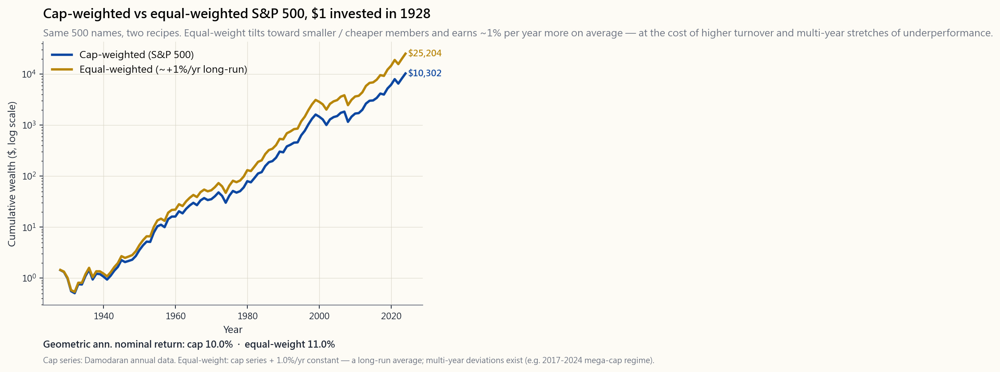
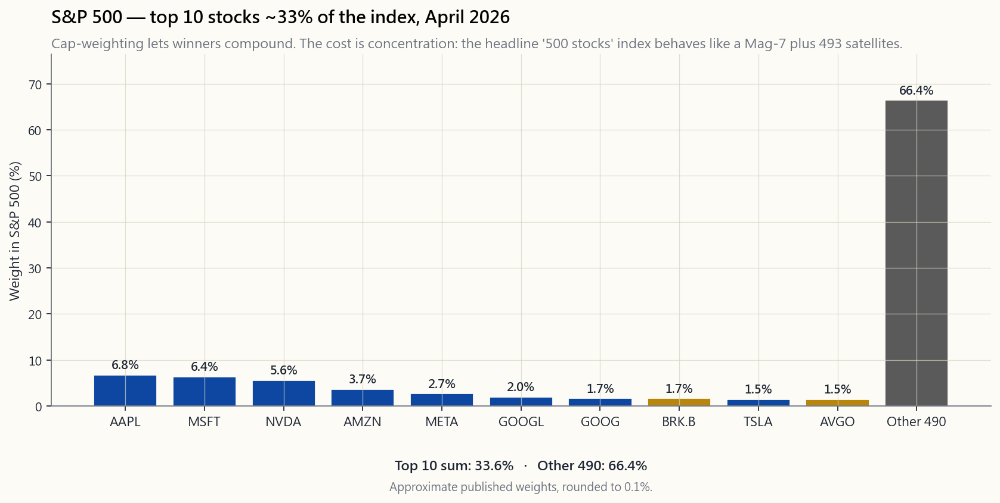

# 第九週：市場指數——計分板是如何建構的

---

## 第一部分：閱讀章節

---

### 1. 為何這個議題至關重要

每一個財經新聞報道都以指數點數來概括當天的市況。「標普500指數上升半個百分點。羅素2000指數下跌百分之一。納斯達克100指數由科技股帶領上揚。」就是這四五個數字，讓數以百萬計的投資者知道自己的投資組合「表現如何」——但從來沒有人解釋指數究竟是什麼。指數並不等同於市場，它是一份**食譜**：哪些股票納入、每隻股票佔多少比重、何時換入換出成分股。兩份從同一個廚房取材的食譜，可以烹調出截然不同的菜式。

每一位成年投資者都應該對指數有充分認識，原因有四。

1. **你幾乎肯定已經持有一隻。** 大約15萬億美元的資產，投資於直接按指數指示買入股票的工具。光是標普500指數，就有超過11萬億美元以其為基準或直接追蹤。你的401(k)目標日期基金的費用、你在券商戶口持有的交易所買賣基金、你那隻「主動型」互惠基金私下緊跟的隱形指數——全都繫於某個指數的規則。持有一隻指數基金卻不了解其規則，就如同擁有一間餐廳卻從未看過餐牌。

2. **食譜會悄悄決定你的因子投資曝險。** 市值加權令你傾向已經勝出的股票。等權重令你傾向規模較小、估值較低的股份。價格加權（道指）則令你傾向名義股價較高的股票——這只是幾十年前公司拆細決定所遺留的偶然結果。以上三種方式本身均無對錯，但它們並不可以互換。一個以錯誤指數為基準的六四分配投資組合，可能因純粹機械性的原因，看起來光彩奪目，也可能顯得一敗塗地。

3. **指數機制會產生真實的資金流動。** 當一隻股票被納入標普500指數或羅素1000指數，每一隻追蹤該指數的被動型基金都必須在指定日期買入。被剔除時，它們必須賣出。這些被動性資金流動，往往會在再平衡日前後幾個百分點地推動股價。羅素指數六月底的年度重組，更是全球最大型的定期交易事件之一。如果你會圍繞指數成分股變動進行交易，這一點至關重要；即使你不會，了解重組日的股價波動屬於機械性而非資訊性，依然大有裨益。

4. **誠實的投資方式，就是接受指數。** 本課程的核心立場是：真正的阿爾法極為罕見，且難以持續。標普500指數扣除費用後，在十五年的時間窗口內，跑贏了80至90%的大型股主動管理型基金。這並非因為指數本身有什麼過人之處，而是因為主動管理型基金的費用和換手率複利累積，形成了一道他們難以克服的逆風。對於本課程絕大多數讀者而言，默認做法就是持有指數，按四個配置板塊（第十三課）持倉，並將省下的決策精力用於稅務結構（第十五課），而非選股。要以清醒的眼光做到這一點，你需要知道箱子裡裝的究竟是什麼。

本週，我們就來打開這個箱子。

---

### 2. 你需要掌握的知識

#### 2.1 三種加權方式——同一成分，三種不同指數

任何指數在設計上最重要的選擇，就是如何為成分股加權。同樣的30隻股票，可以構成三種截然不同的指數系列。

- **價格加權。** 每隻股票的權重，等於其股價除以所有成分股股價之和。道瓊斯工業平均指數是目前唯一仍採用此方式的主要指數。一隻400美元的股票，其權重是40美元股票的十倍，即使後者的市值遠大於前者。股票拆細、股份回購以及名義股價的選擇（這是市場推廣決策，而非經濟決策），都會扭曲結果。

- **市值加權。** 每隻股票的權重，等於其流通量調整後市值佔指數總市值的比例。標普500指數、納斯達克綜合指數、羅素1000/2000/3000指數、MSCI全球股票市場指數（ACWI）——幾乎每一個運營真實基金業務的指數，都採用這種方式。其邏輯合理：若英偉達的市值為3萬億美元，而一家小型工業股的市值為300億美元，英偉達在股票經濟體中所代表的份量是後者的百倍，理應擁有百倍的權重。代價是集中度。截至2026年4月，**標普500指數前十大成分股合計佔指數約33%**，「七巨頭」單獨佔比逾30%。你買入的並非任何有意義上的「500隻股票」；你買的是七隻股票，加上493隻衛星股。

- **等權重。** 在再平衡日，每隻成分股均獲分配`1/N`的權重。標普500等權重指數（由RSP交易所買賣基金追蹤）是其中最具代表性的版本。等權重自動傾向規模較小、估值較低的股份，因為最大型的股份被壓低至0.2%，而最小型的股份則被拉升至0.2%。在極長的時間跨度內，其回報略高於市值加權版本，每年大約高出0至2%，但代價是更頻繁的換倉、應稅帳戶中更高的稅務拖累，以及較長時期的跑輸表現（尤其是2017至2024年，超大型科技股全面壓倒其他板塊）。

market cap加權與等權重標普500指數的累積財富圖表（1928至2024年）載於`image/week09_cap_vs_equal.png`。兩條線均呈上升趨勢，等權重版本的終值略高，但在任何單一年代均非絕對佔優。

#### 2.2 七巨頭集中度問題

2026年4月，標普500指數的前十大成分股權重大致如下：

- 蘋果 約6.8%
- 微軟 約6.4%
- 英偉達 約5.6%
- 亞馬遜 約3.7%
- Meta 約2.7%
- Alphabet（GOOGL+GOOG）合計約3.7%
- 伯克希爾哈撒韋 約1.7%
- 特斯拉 約1.5%
- 博通 約1.5%

十家公司合計佔指數約33%，七巨頭（蘋果、微軟、英偉達、亞馬遜、Meta、Alphabet、特斯拉）合計約佔30%。這是標普500指數自1960年代末「漂亮五十」高峰以來最高的集中度。`image/week09_top_concentration.png`的長條圖呈現了這一形態：前十大成分股佔比急劇下降，其餘490隻股票分享剩餘的三分之二。

這並非自動構成問題。指數只是在按市值加權的指示行事：讓贏家持續複利增長。但這帶來三個實際後果。

1. **你的股票投資主要是七巨頭的押注。** 若你只持有VOO或SPY，你大約三分之一的股票資金都集中在七家科技相關巨頭。「500家公司！」的分散投資說法，低估了實際的因子投資風險。
2. **回撤同樣集中。** 2022年的回撤，主要由帶動2020至2021年牛市的同一批龍頭股所主導；等權重指數的跌幅相對較小。2000至2002年科網股泡沫爆破是教科書式的先例。
3. **等權重如今是顯而易見的分散工具。** 同時持有RSP和VOO，不會大幅改變你的板塊曝險，但可以將前十大成分股的集中度從約33%降至約17%。這對於處於提款期的退休人士，比年輕的積累者更為重要。

#### 2.3 流通量調整——為何「市值」並非真正的市值

每一個現代的市值加權指數，使用的都是**流通量調整後**的市值，而非總市值。流通量是指實際可供公開交易的股份數量——即已發行股份總數，扣除創辦人、政府、母公司及其他策略性持有人所持股份後的餘額。

以下是2026年4月的估算例子：

- Meta擁有兩類股份；A類股份的流通量約為99%，但Mark Zuckerberg持有的超級投票權B類股份被鎖定。標普500只計入A類股份。
- Alphabet的GOOGL（A類）和GOOG（C類）均可公開交易；創辦人持有的B類股份被排除在外。兩類上市股份均納入指數。
- 伯克希爾哈撒韋的流通量調整，令其指數權重相較於總市值低了數百個基點，因為巴菲特的持股不被視為可供買賣。

流通量調整的原因在於流動性，而非公平性：若要求追蹤基金購買100%的已發行股份，將迫使它們去爭奪根本無意出售的股票。流通量加權回答的，正是指數基金實際需要面對的問題——「我實際上能買到什麼？」

#### 2.4 羅素指數年度重組——一個真實的交易日

羅素指數系列（羅素3000/1000/2000）每年重組一次，時間定在六月的最後一個星期五。以五月三十一日的市值排名為截止標準，決定各公司歸屬哪個規模板塊，並設有緩衝區間以減少頻繁換倉。從緩衝公告日（六月中旬）到星期五收市，兩件事情會同步發生：

1. 對沖基金估算哪些股票將被納入羅素2000指數，哪些將晉升至羅素1000指數，並提前買入推高這些股票的價格。
2. 在重組當日，每一隻被動型羅素基金——以及每一隻擔心與基準偏差過大的「隱形羅素」主動型基金——都必須執行成分股調整。部分受影響股份的單日成交量，可超過其日均成交量的30%。

這是美國股市最大型的定期交易事件，也是「市場可以長時間非理性」這一原則最清晰的佐證之一：股價波動屬於機械性，但可能持續數週，因為沽空需要支付借貨費用並承受按市值計算的損失。標普500的季度再平衡和納斯達克100的年度再平衡規模較小，但性質相近。

#### 2.5 倖存者偏差——指數捨棄了什麼

指數會悄悄剔除成分股。破產、被收購或低於規模門檻的公司將被移除；新的名字填補其空缺。歷史指數系列——你在圖表書籍中看到的——是一系列**倖存者加替換股**的紀錄，已退市的股票早已消失於無形。

對於長期回報的聲稱，這一點的影響遠比人們意識到的更大：

- 「股票自1928年以來每年回報9至10%」這一標題，已不包含1930年代消失的鐵路公司、1970年代崩潰的企業集團，以及安然、世通、雷曼、昔日的通用電氣。它們的完整跌幅記錄於歷史中，但其退市後的表現（歸零）並未被納入「假設1928年買入所有股票」的回報序列。
- 實證研究顯示，對於運行時間最長的指數，倖存者偏差每年高估回報約1至2個百分點。本課程第三週採用的達摩達蘭數據集，已在廣泛市場層面對此作出修正，這也是其「1928年以來股票」回報略低於標普500成立以來標題數字的原因。
- 對於個股選擇決策而言，這種偏差更為嚴重。若以今天指數成分股回測「2000至2010年表現最佳股票」的策略，結果必然亮麗奪目，因為那個十年的真實輸家根本不在測試的股票池中。

實際結論：**永遠要問清楚哪些股票被捨棄了**，尤其當有人向你展示回測結果時。一如既往的原則——乾淨的回測，遠比乾淨的外表難得。

#### 2.6 主要指數一覽

- **標普500指數。** 約500家美國大型股公司，由委員會按盈利能力和流通量門檻篩選，流通量調整後市值加權，季度再平衡。市值約佔美國可投資股票的80%。追蹤工具包括：VOO（先鋒，開支比率0.03%）、SPY（道富，0.0945%）、IVV（貝萊德，0.03%）。是默認的美國股票曝險。

- **標普500等權重指數。** 相同的500隻股票，等權重，季度再平衡。RSP（景順，開支比率0.20%）。換倉頻率約為市值加權版本的7倍，在應稅帳戶中會帶來一定但真實的稅務拖累。

- **羅素2000指數。** 美國市值排名約第1,001至3,000位的2,000隻股票，是細價股的標準基準。IWM（貝萊德，0.19%）是主要工具。盈利質素遠低於標普500指數——羅素2000的相當一部分公司的淨利潤為負數——這在一定程度上解釋了為何細價股回報自2014年以來持續落後於大型股。

- **納斯達克100指數。** 100隻規模最大的在納斯達克上市的非金融股，採用經修正的市值加權，設有重新加權規則，確保單一股票不會超過約24%。QQQ（景順，0.20%）。科技股比重偏重，但它**並非**科技指數，而是一個納斯達克上市指數。

- **道瓊斯工業平均指數。** 30隻股票，價格加權，由委員會篩選。更多是文化符號，而非嚴肅的投資組合基準。DIA（道富，0.16%）。不建議作為投資組合的構建基礎。

- **MSCI全球股票市場指數（ACWI）。** 橫跨47個已發展及新興市場的約3,000隻大型股及中型股，流通量調整後市值加權。ACWI（貝萊德，0.32%）是主要的交易所買賣基金。**注意：** 對於本課程的香港或中國內地讀者，ACWI中可投資的部分，僅限於約60%的美國權重，加上可通過交易所買賣基金持有的非美國已發展市場部分。直接曝險於A股、內地房地產開發商及大多數新興市場上市股份，要麼受資本管制，要麼在操作上存在很大困難。本課程的默認做法是：超配美股上市曝險，若有需要則少量配置ACWI作為分散工具，而非嘗試構建一個現實中根本無法交付的「全球市值加權」投資組合。

#### 2.7 指數期貨——最真實的流動性基準

若你想知道指數在現貨市場開市之間「真正」處於什麼水平，請觀察近月期貨：ES（E-mini標普500）、NQ（E-mini納斯達克100）、RTY（E-mini羅素2000）、YM（E-mini道指）。這些期貨每日交易約23小時，名義價值達數百億美元。交易所買賣基金在市場壓力下可能出現偏離資產淨值的情況；期貨則無法在不被套利糾正的情況下大幅偏離指數。

對於長線讀者而言，了解這一點的意義，並非要你去交易期貨（你幾乎肯定不應該這樣做）。而是要明白：

- 財經電視節目引述的盤前股市變動，通常是近月期貨，而非指數本身。
- 在危機期間（2020年3月、2024年8月），期貨往往會在現貨交易所買賣基金尚未開市之前率先反映價格，後者只能在下一個開市時段才能追上。期貨並非在說謊——它只是在現貨市場休市時依然開放。
- 對於極大規模的配置（機構層面），期貨加短期國債有時比持有SPY更具成本效益，因為期貨中隱含的融資利率，有時低於交易所買賣基金的全包成本。

#### 2.8 自建指數——試試互動工具

本課的互動示範`interactive/week09_index_builder.html`是一個沙箱。它提供30隻具代表性的標普500成分股，附有真實的股價、股份數量及過去12個月回報。你可以在市值加權、等權重和價格加權之間切換，觀察：

- **成分股餅圖**重新繪製（市值加權高度集中，等權重完全平均，價格加權由股價主導），以及
- **12個月指數回報**重新計算。

這個練習的要點是：親手撥動旋鈕，親眼看到同樣的30隻股票，僅僅因為食譜不同，就能產生三個不同的回報數字——有時相差幾個百分點。這就是本週的課題所在。

---

### 3. 常見誤解

1. **「道指告訴我今天市場的表現。」** 道指只有30隻股票，且因名義股價的偶然性而採用價格加權。任何一天，道指與標普500指數的差距可能純粹因結構性原因超過50個基點。把它視為文化參考，而非投資組合基準。

2. **「標普500指數分散投資於500隻股票。」** 它分散於500隻股票的**名稱**。截至2026年4月，七巨頭約佔30%，前十大佔約33%。你的股票資金所實現的分散程度，遠低於標題所暗示的水平。

3. **「等權重永遠優於市值加權。」** 從長遠來看確實略勝，但存在多年跑輸的階段——最近一次是2017至2024年——且換倉頻率更高。這是不同的投資押注，並非免費午餐。

4. **「指數基金是被動型的。」** 基金對其規則是被動的，但這些規則本身是委員會主動作出的選擇。標普500委員會主動決定哪些股票獲納入。羅素的重組是機械性的，但時間安排製造了可預測的交易機會。真正被動的指數並不存在——有的只是「主動決策在上游已預先烘焙」。

5. **「被納入標普500只是行政手續。」** 實際數據顯示，公告發出後至生效日期之間，被納入股票的股價上漲約3至8%，且持續數週。被剔除的股票則出現相應跌幅。這是股票金融中記錄最翔實的異常現象之一。

6. **「納斯達克等於科技股。」** 納斯達克是一個**上市交易所**。納斯達克100指數之所以科技股比重偏高，是因為科技公司歷來選擇在此上市，並因此在市值加權指數中佔據主導地位。百事可樂和Costco同樣是納斯達克100的成分股。

7. **「倖存者偏差只適用於主動型基金。」** 它同樣適用於指數本身。1928年的標普500系列悄悄以新名字替換了舊成分股；退市成分股此後的歸零表現，並未出現在那條歷史曲線上。

8. **「MSCI全球股票市場指數給予我真正的全球曝險。」** 在回測中確實如此。但在實際操作上，對於通過香港或新加坡經紀商進行交易的非美國居民投資者，很大一部分新興市場權重並不容易、廉價或以稅務高效的方式持有。只有真正可投資的部分才算數。

9. **「流通量調整只是細微的技術性問題。」** 對於內部持股集中的公司（Meta、伯克希爾、創辦人主導的公司），這是4%指數權重與1.5%指數權重之間的差距。這並非細節。

10. **「我的主動型基金跑贏了指數。」** 在任何一年內或許可以。但十五年下來，扣除費用後，大約只有七分之一的大型股主動型美股基金跑贏標普500指數。阿爾法的基礎成功率本來就很低——這正是「阿爾法稀缺」原則的核心，也是本課程的首要立場。

---

### 4. 問答環節

**問題一：我是否應該持有RSP而非VOO，以避免七巨頭的集中度問題？**
答：可能不應該全部換成RSP。一個常見的折衷方案是70至80%持有VOO，加上20至30%持有RSP。這可以將前十大成分股的集中度從約33%降至約25%，同時不放棄市值加權的自然複利增長。RSP的換倉頻率也是前者的7倍，而且每年多出17個基點的開支比率。在遞延稅項帳戶中，這個成本微不足道；在應稅帳戶中，則會侵蝕部分分散投資的好處。

**問題二：為何主動型基金難以跑贏標普500指數？**
答：三個結構性原因。第一，費用：大型股主動型基金的平均費率約為70個基點，而VOO只需3個基點，意味著基金經理每年一開始就已落後67個基點。第二，指數的市值加權讓贏家自動複利增長；基金經理傾向於在贏家達到一定水平後減持（再平衡紀律），並將資金重新投入落後股，這在趨勢市場中表現欠佳。第三，指數無需繳付資本增值稅；主動型基金的換倉卻需要。複利計算十五年，差距十分驚人。

**問題三：那些「下一個蘋果」但最終沒落的股票，後來怎樣了？**
答：它們離開了指數。寶麗來、伊士曼柯達、西爾斯、雷曼、縮水版通用電氣、貝爾斯登、MCI、安然、世通、太平洋燃氣電力（多次進出）、AIG（2004年納入，2008年剔除，後再度納入）——每一家公司曾經都是標普500指數中佔若干百分比的重要成分股。它們的虧損只在它們仍是成分股期間計入歷史序列。此後，空出的位置由新股填補，而那些退市股份持續歸零的走勢，並不會出現在歷史曲線上。

**問題四：我可以直接投資標普500指數本身嗎？**
答：不能。指數是一個計算結果。你可以購買持有成分股的交易所買賣基金（VOO、SPY、IVV）、追蹤指數的互惠基金（VFIAX），或以指數結算的期貨（ES）。三者均是同一食譜的不同包裝；選擇哪種包裝，取決於費用、稅務及可取性的考量。

**問題五：標普500委員會如何決定納入哪些股票？**
答：符合資格的條件包括——在美國註冊、市值高於門檻（2026年4月約為180億美元）、連續至少四個季度錄得GAAP盈利、公眾流通量不低於50%——達到上述條件方可列入候選名單。在此基礎上，委員會再根據板塊均衡及替換需求（剔除一隻股票才產生空缺）作出選擇。委員會的酌情決定權，正是特斯拉比預期晚得多才被納入的原因，也是為何納斯達克綜合指數（按上市交易所的規則制定）和羅素1000指數（純粹按市值排名）在邊際上與標普500指數有所差異。

**問題六：為何本課沒有涉及恒生指數？**
答：受制於可投資範圍的限制。對於本課程的香港或內地讀者，理論上可通過2800.HK持有恒生指數的曝險，但其成分股主要由內地上市銀行和房地產開發商主導，其會計準則和政治風險與美國投資者所定價的資產在性質上截然不同。本課程的立場是：若你居住在香港，可少量持有恒生指數追蹤基金作為消費貨幣對沖，但不應將其視為美股指數的替代品。標普500是引擎；港股曝險只是對沖油箱。

**問題七：五年後七巨頭的權重可能是多少？**
答：沒有人知道，這才是誠實的答案。有兩個歷史類比：「漂亮五十」的龍頭股在1972年達到相似的集中度高峰，在1973至74年間大約腰斬；科網時代的超大型股在2000年初觸頂，指數花了整整十年才完成板塊輪動。兩次去集中化的過程都十分痛苦。第三種可能——也正是市值加權所押注的——是人工智能帶動的生產力增益，令這些公司的盈利增長持續超越指數其餘成分股，集中度因此進一步上升。如果你不想對哪種情景下注，可以同時持有VOO和RSP。

**問題八：如何為六四分配的投資組合設定基準？**
答：最清晰的基準是60%的VTI（或VOO）加上40%的AGG（或BND），按季度再平衡。計算基準回報後，再與你的實際投資組合比較。若想更精細，可在股票部分加入少量國際配置（通過ACWX，佔股票投資的5至15%），以配合你的實際持倉。若以100%標普500指數來比較六四分配組合，在股票牛市年份會讓你深感挫敗，在熊市年份又會讓你產生虛假的優越感——這是錯誤的基準設定。

**問題九：為何專業交易者不直接交易羅素指數的重組？**
答：他們確實這樣做，而且這個交易早已廣為人知，容易套利的部分已所剩無幾。剩餘的風險溢價，來自承擔雙向倉位的風險（在公告前兩週，你不能確定哪些股票將被納入，而沽空被剔除股票需要支付借貨費用）。擁有適當基礎設施的對沖基金，每年仍可從中賺取幾百個基點的回報——但代價是散戶投資者無法複製的風險和複雜度。

**問題十：哪一個指數對我最重要？**
答：標普500指數。它是約11萬億美元美股資本的基準，是每一個401(k)的默認選項，是每一隻主動型基金被衡量的比較標準，也是「阿爾法稀缺」原則最清晰的體現：持有指數、接受市場回報，並將寶貴的決策精力用於配置板塊和稅務結構，而非選股。本課其他所有內容，都只是這一核心事實的延伸。
