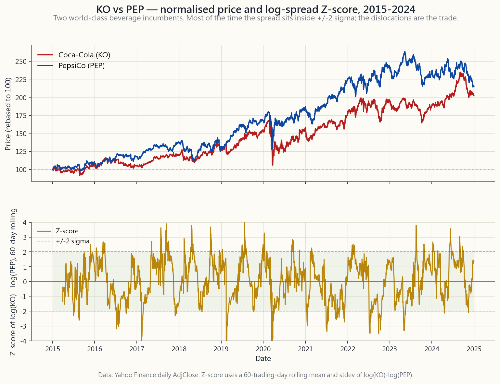
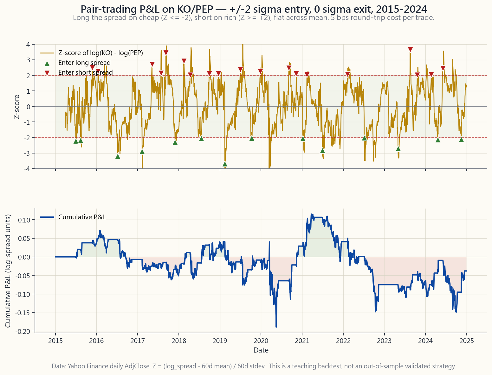

# 第十四週：配對交易——相對價值、均值回歸，以及最簡單的股票對沖基金策略

---

## 第一部分：閱讀章節

---

### 1. 為何此課題至關重要

第13週介紹了長短倉的架構。本週將把該架構應用於其最精簡、最易於講解的形式：**兩隻股票，一長一短，等額美元，按兩者之間的差價定位。** 配對交易。這是業內最簡單的股票對沖基金策略，也是散戶投資者在進階至更複雜策略之前，學習相對價值操作機制最清晰的切入點。

你需要學習這課的原因有四個。

1. **這是你剛學會的長短倉工具箱最清晰的測試。** 以等額美元做長倉可口可樂、短倉百事可樂，從結構上而言是美元中性的，由於兩隻股票對消費必需品因子的敏感度幾乎相同，在貝塔上亦接近中性，整個損益只剩下*差價阿爾法*——兩個近似替代品之間的差異。方向性觀點無處藏身。交易奏效，你就是交易了差價；不奏效，你就沒有。配對交易是一個實驗室，讓你發現自己究竟是否具備任何相對價值優勢。

2. **這是進入真正、持久阿爾法來源的切入點——而非虛構的那種。** 在扣除成本後確實能複利增長的結構性阿爾法，包括流動性、板塊輪動、長期趨勢，以及買入被被動機制所放棄的資產。配對交易屬於結構性阿爾法的類別，原因在於配對交易者是在*向暫時錯位的那隻腳提供流動性*。當百事可樂因季績欠佳而跳空下跌，而可口可樂紋風不動之時，買入錯位的配對交易者，正是站在被迫賣家（互惠基金贖回、因子平倉、指數再平衡）的對立面。差價回歸至其長期關係，就是對提供流動性的結構性回報。

3. **這讓你明白為何「看似真實」的配對會衰退——制度轉變問題。** 制度轉變是本課程反覆響起的警鐘：制度往往在毫無預兆下改變，而一個行之有效達十年的策略，可能在一個季度內突然失靈。配對交易是這一原則以散戶可理解的形式呈現的最清晰案例研究。兩隻一起移動了十五年的股票，可能會永久脫鉤——可口可樂與百事可樂就曾出現部分脫鉤，原因在於百事的零食業務複合增長速度，快過可口可樂純飲品業務。若有配對交易者無視這一基本面分歧，不斷把差價擴闊視為回歸至10年平均值的機會，就會連續六年犯錯。**協整是一個有條件的、視制度而定的屬性，並非永久性的。**

4. **這為2007年8月的量化基金震盪奠定了框架——這是關於擁擠因子風險最具典範意義的案例研究。** 當過多量化基金運行本質上相同的配對交易及統計套利策略時，配對本身便成為一個因子——一個可能在關聯性恐慌中同步平倉的因子。在2007年8月的四個交易日內，一兩家大型多策略基金被迫平倉，引發了標準配對交易因子的同步逆轉，而業內大多數基金，在原本應屬獨立的交易上，損失了兩至四個標準差。這一教訓——你的阿爾法只有在執行相同策略的人不被迫同時退場時才是阿爾法——是現代金融中最重要的風險管理課題之一，而配對交易正是最初學習此課題的地方。

本課在四分倉結構的*機會性*倉位中，也在啞鈴組合的阿爾法一端。你的大部分財富在安全端（現金、國債、黃金、你本來也願意持有的標的之深度價內長期認購期權）。阿爾法端的小型配置，就是配對交易賬本所在之處——用陳馬的說法，是一個「風車」，在投資組合其餘部分靜止時轉動。

---

### 2. 你需要掌握的內容

#### 2.1 相對價值——核心思維轉換

做多方向的投資提出的是一個絕對問題：「可口可樂是否便宜？」這個問題的答案，需要對可口可樂的盈利、估值倍數、增長、資產負債表以及更廣泛的股票風險溢價有所看法。其中任何一個判斷出錯，即使可口可樂在你的模型中「便宜」，交易也可能虧損。

配對交易把絕對問題替換為相對問題：**「可口可樂相對於百事可樂是否便宜？」** 這兩家飲料巨頭共享同一客戶群、同一監管制度、同一對糖和鋁的商品價格周期敞口、同一消費必需品因子敞口、同一對美元強勢的敞口，以及大致相同的估值倍數制度。消費必需品宏觀環境不佳，兩者同受影響；含糖飲料稅恐慌，兩者同受影響；強美元季度，兩者同受影響。然而，*非對稱*影響兩者的，是各公司特有的業務差異——可口可樂的裝瓶商重組、百事的零食業務利潤率、對某一特定國家造成衝擊的匯率波動、只落在某一品牌上的召回事件。差價把公司特有的差異，從其他一切因素中剝離出來。

你所消除的方向性風險非常巨大。持有2,000股可口可樂的六四組合投資者，大約有五十萬美元暴露於「若消費必需品因子明天因避險情緒下跌10%」的風險。美元中性配對交易者做多1,000股可口可樂、做空1,000股百事可樂，對該因子的敞口約為*零*。配對交易者所持有的，是淨值為零但總值約20萬美元的賬本，暴露於**兩個看似相近的故事之間的差異**。這個差異，就是他們所獲得的回報——或者，當差異被證明是永久性而非均值回歸性時，所承受的懲罰。

這就是配對交易作為清晰教學範例的原因：它完全剔除了市場貝塔，讓你在孤立的環境下，看清相對價值押注究竟是否存在任何信號。

#### 2.2 差價構建與Z值

選定配對後，你需要一種方法來衡量其*錯位程度*。標準方法是**對數差價的滾動Z值**。

分三步建構：

1. **建立對數差價**，方式為 `s_t = log(P^A_t) - log(P^B_t)`。以對數空間計算是慣例，因為它使差價不受美元標準化影響，並具有乘法詮釋：常數的 `s_t` 代表恆定的價格*比率*，而與絕對水平無關。
2. **計算滾動均值與標準差**，使用一個回望窗口——日線數據常用60個交易日作為起點。記為 `mu_t` 和 `sigma_t`。
3. **對差價進行Z值轉換**：`z_t = (s_t - mu_t) / sigma_t`。在穩定的協整關係中，`z_t` 的分佈近似均值為零、單位方差，大多數觀測值落在-2至+2之間。

下圖顯示的是2015年至2024年可口可樂與百事可樂的情況——上方面板為標準化價格，下方面板為滾動60日Z值，並附有+/-2倍標準差帶狀區。

配對交易者注視下方面板，並提問：*當該線觸及+2時，我是否相信它會回歸至零，以及需要多長時間？* 答案來自協整，而非相關性。

#### 2.3 相關性與協整——為何此區別至關重要

兩個隨機遊走序列可能具有高度相關性，卻仍會分歧至無窮大。這正是殺死幼稚配對交易的陷阱。

- **相關性**衡量兩個收益率序列是否在*短期*內一同波動。兩隻股票的月度相關性為0.85，僅表示它們的月度收益率方向一致；這對其*水平差價*是否均值回歸毫無指示意義。
- **協整**更為嚴格。兩個價格序列若協整，意味著存在一個令其成為*平穩序列*的線性組合——即差價本身具有穩定的均值與方差，並在偏離後回歸。協整是「兩者共享一個長期均衡關係」的數學形式化表達。

在實踐中，協整通過恩格爾-格蘭傑兩步法或對水平序列進行約翰森檢驗來測試；細節屬於次要考量。*直覺*才是你必須內化的部分：**只有當差價是均值回歸時，你才能交易配對，而相關性本身並不能保證這一點。** 教科書反例是處於不同長期趨勢中的兩種資產——兩者可能一同上漲多年（高相關性），而兩者之間的*差距*卻單調擴大（無協整）。逆勢而為、押注差距縮窄的配對交易者，十年來每個季度都在虧損。

一個實用法則：在交易配對之前，繪製5至10年窗口的差價Z值，並捫心自問：「這個東西每次偏離後，是否都明顯地回歸？」若是，協整測試在很大程度上只是確認你的眼睛所見。若否，任何統計工具都無法拯救這筆交易。

#### 2.4 經典配對及其奏效原因

四組具典範意義、散戶可操作的美股上市配對，以及各配對差價均值回歸的結構性原因：

| 配對 | 板塊 | 為何差價均值回歸 |
|---|---|---|
| **KO / PEP** | 消費必需品——飲料 | 兩家業務幾乎相同的全球飲料巨頭；相同客戶群、相同商品成本結構、相同防禦性估值倍數制度。差價僅在其中一家公司進行策略性業務組合調整時才會突破（百事可樂的零食業務擴張是經典例子）。 |
| **V / MA** | 金融——支付雙寡頭 | Visa與Mastercard是擁有相同經濟特性的監管雙寡頭：卡片交換費、網絡效應、寡頭定價權。差價僅在公司特有訴訟或地區業務組合敞口（中國、俄羅斯）上出現突破。 |
| **XOM / CVX** | 能源——綜合超級石油公司 | 兩者均擁有類似儲量、地理分佈及資本分配紀律的上下游綜合業務。差價在特有運營事件——煉油廠意外、項目成本超支——時出現突破。 |
| **GLD / SLV** | 貴金屬交易所買賣基金 | 黃金與白銀共享貨幣貶值的敘事，但白銀一半工業、一半貨幣屬性；差價（「金銀比率」）在50至90之間循環，均值回歸由兩種需求驅動因素的相對比重所驅動。 |

*共同*特點是兩隻腳共享一個結構性驅動因素，在一個*有限*的個別維度上存在差異。交易者因這個有限維度而獲得回報（差價均值回歸），並免受結構性驅動因素影響（兩者相互抵消）。

#### 2.5 進出場規則與實際回測

教科書規則是**+/-2倍標準差進場，0倍標準差出場，並設+/-3至+/-4的硬止蝕**。

- 當 `z` 低於-2時：差價相對便宜兩個標準差，A相對B異常便宜。以等額美元做多A、做空B。
- 當 `z` 高於+2時：差價相對昂貴兩個標準差。做空A、做多B，以等額美元計。
- 當 `z` 穿越零時：差價已回到滾動均值。出場。不要等待相反的尾端；再多持有一個標準差的邊際預期回報微小，而制度轉變風險則隨持倉時間增長。
- 若 `z` 繼續以錯誤方向超越+/-3或+/-4：**斬倉並重新評估協整假設**——更多時候，這意味著關係已出現結構性突破，而非隨機性錯位。

下圖顯示上述規則在2015年至2024年可口可樂/百事可樂上的應用。上方面板是Z值，標有做多差價進場的向上箭頭和做空差價進場的向下箭頭；下方面板是每次換邊扣除5個基點成本後，對數差價的累計損益。

圖表的教訓：**大多數配對交易是小額獲利，但偶發的制度突破所帶來的損失，超過多次獲利的總和。** 這正是結構性阿爾法回報流的形態。這也是配對交易以*多個配對組成的賬本*而非單一配對來運作的原因——大數定律才是令每個配對邊際優勢較低的模型得以可行的關鍵。散戶的單一配對操作更多是教育意義而非阿爾法；在實際生產層面，需同時分散至三十至五十個配對。

#### 2.6 2007年量化基金震盪——擁擠風險是真實存在的

2007年8月第一週，標準股票統計套利賬本——大致定義為「在許多配對中，同時做多便宜腳、做空昂貴腳」——連續四個交易日損失了預期每日回報的4至12個標準差。這場平倉在運行類似模型的主要多策略對沖基金中蔓延：AQR、文藝復興股票市場中性基金、高盛全球股票機會基金。部分基金在一週內損失過半。

事後分析現已有充分記錄。其中一家最大的多策略基金——大多數公開重建指向高盛的量化賬本，儘管具體主角不如機制重要——被迫突然去槓桿，很可能是由無關的次按抵押貸款賬本觸發的追繳保證金所致。平倉股票賬本需要大規模賣出其統計套利的多頭倉（同時買回空頭倉）。由於所有其他主要量化基金都以*相同因子數據運行著相同的配對*，這些配對同時對所有其他人的賬本造成不利影響。隨著損失加劇，更多基金被迫去槓桿，令配對進一步移動，再迫使更多基金去槓桿。**標準配對交易因子敞口已成為一筆擁擠的交易——而擁擠的交易一旦平倉，就會集體發生。**

這一教訓是根本性的，也是制度轉變原則在金融領域最清晰的說明。**一個阿爾法來源，只有在運行它的群體規模足夠小，以致任何被迫退場都無法同時令你所有交易逆向移動時，才能持續是阿爾法。** 一旦太多人運行同一策略，策略本身就變成了風險因子。這正是現代統計套利運行持續「擁擠度因子」疊加層的原因——衡量有多少其他基金可能持有相同交易——並在擁擠度上升時降低總敞口。散戶配對交易者繼承了同樣的紀律，以微型形式呈現：不要過度持倉於一個廣為人知的標準配對，因為該交易中的每一分錢，都在隱性上與你的倉位相關聯。

#### 2.7 配對交易在啞鈴組合中的定位

啞鈴組合是將你的大部分財富置於安全端，小型配置則用於真正的不對稱優勢。**配對交易屬於優勢端。** 若大小適當，配對交易配置的佔比為總投資組合的個位數百分比，在美元中性配對中，總敞口為配置規模的兩至三倍，淨值則約為零。該配置對總投資組合回報的預期貢獻較小（*配置本身*年化3-8%，若配置佔10%則換算為總投資組合的0.3-0.8%）；但對總投資組合*夏普比率*的潛在貢獻則可能大得多，因為該配置的回報與純多頭賬本大致正交。

對散戶投資者而言，這才是思考配對交易的正確方式：**並非作為複利財富的途徑，而是作為降低財富路徑波動性的工具。** 這是一個夏普比率的博弈，而非回報的博弈。任何人承諾你配對交易策略能帶來雙位數總回報且回撤低，不是過度回測，就是加了槓桿，就是在賣課程。

---

### 3. 常見誤解

**誤解一：「高相關性代表良好的配對。」**

相關性衡量收益率的共同移動；協整衡量水平值的均值回歸。高相關性但無協整，就是經典的差價持續擴大的陷阱。

**誤解二：「若一個配對在過去十年有效，它就會繼續有效。」**

可口可樂/百事可樂的關係，在過去二十年因百事的零食業務擴張而兩度轉變。協整取決於標的公司的業務組合保持穩定。業務組合改變時，差價會重新定價至*新的*均衡水平，而逆勢押注舊均衡的交易者，會連續虧損數年。制度已轉變。

**誤解三：「+/-2倍Z值標準差是一條硬性規則。」**

這些閾值是校準選擇，而非定律。在低波動性制度下，+/-1.5倍標準差觸發更多交易，可能是正確的截斷點；在高波動性制度下，+/-2.5倍可減少假信號。應根據配對、回望窗口和實際波動性制度進行校準——而非照搬教科書數字。

**誤解四：「我只交易一個配對來學習。」**

單一配對賬本並非配對交易；它只是一筆操作開支高昂的交易。真正的配對交易策略同時運行三十個以上的配對，以使大數定律發揮作用。單一配對練習是教育；切勿將其與阿爾法混淆。

**誤解五：「配對交易因市場中性而沒有風險。」**

配對交易存在差價風險、制度突破風險、擁擠風險（2007年）、空頭倉位的借券成本風險，以及保證金和股息的操作風險。淨值美元為零，並不等於淨值風險為零——長期資本管理公司是市場中性的，卻仍損失了90%。

**誤解六：「若差價持續擴大，我的倉位就更大，最終的回歸利潤就更豐厚。」**

這是馬丁格爾謬誤應用於配對上。隨著差價擴大，你的按市值計算損失增加，經紀提高你的保證金要求，而在理論上應令交易更有利可圖的機制，在實際上成了在回歸到來之前迫使你出局的機制。先保持償付能力——市場保持非理性的時間可能超過你所能承受的——而這一紀律就是此處的錨點。

**誤解七：「借券成本小到可以忽略。」**

對於超大型配對（可口可樂、百事可樂、Visa、萬事達卡）而言，通常如此——僅數個基點。對於較小市值或專門配對，則不然，借券利率可能因一則新聞稿而從1%跳升至30%。在確定交易大小前，務必核實空頭腳的借券情況。

**誤解八：「2007年量化基金震盪是遠古歷史。」**

同樣的機制一再重演。2018年2月出現了波動性目標因子的平倉。2020年3月出現了多策略基金的去槓桿週。每隔幾年，因子擁擠就會引發另一次為期四天的關聯性平倉。這場震盪是最清晰的案例研究，而非唯一一次。

**誤解九：「若使用期權來表達配對，就能避免借券問題。」**

你同樣放棄了線性差價損益。基於期權的配對，對波動性具有非線性敞口，且定額的期權金會侵蝕差價阿爾法。這並非免費升級——而是一筆具有不同希臘值的不同交易。

**誤解十：「配對交易就是阿爾法，句號。」**

配對交易是*在差價協整且策略不擁擠的前提下*的阿爾法。兩個條件都可能失效。它是視制度和擁擠度而定的結構性阿爾法——並非永久的免費午餐。

**誤解十一：「策略奏效是因為我選對了配對。」**

策略奏效是因為*許多*配對同時輕微回歸，而微小的每配對優勢在賬本層面累積成可用的回報流。單一配對的回報大多是噪音；賬本層面的回報才是阿爾法可辨認之處。

---

### 4. 問答

**問1：擁有10萬美元投資組合的散戶投資者，實際上應該運行一個配對交易賬本嗎？**

答：作為認真的損益來源，可能並不應該。一個配對交易賬本要在統計上有意義，最低規模是同時持有二十至三十個配對，並在借券、保證金和股息上保持嚴格的操作紀律。低於這個規模，你擁有的只是一個高開支的玩具。*以小額倉位進行一兩個配對的交易以作學習*——佔投資組合的幾個百分點——並把結果視為學費。若你想要阿爾法但不想承擔操作開支，買一隻市場中性互惠基金或交易所買賣基金，讓別人去管理賬本。

**問2：Z值應使用哪個回望窗口？**

答：60個交易日是日線數據的合理起點；40個交易日反應更快但噪音更多；120個交易日更穩定但對制度突破的偵測較慢。正確答案取決於你*特定配對*的協整往往多快重置。對於超大型配對（可口可樂/百事可樂），60至90天。對於波動性較高的配對（細價股、生物科技），30至60天。進行校準，不要盲目沿用預設值。

**問3：在一個配對上可以持有多大的倉位？**

答：機構常見規則是每個配對佔配置的2-5%，硬性上限為10%。對於散戶投資者，在10萬美元投資組合、1萬美元配對交易配置的情況下，每個配對的總敞口為200至500美元（即最小端為200美元多倉+200美元空倉=400美元總值）。感覺很小。的確很小。配對交易在設計上，就是每個配對規模微小、通過多個配對聚合的策略。

**問4：何時應斬倉一個配對並承認協整已打破？**

答：當 `z` 延伸超過+/-3至+/-4且沒有回歸跡象，*並且*你能找到一個突破的基本面理由——其中一家公司的業務組合出現策略性轉變、影響其中一方而非另一方的監管事件、收購要約。在*沒有基本面故事*的情況下，差價跌至-3.5，比在*有明確故事*支撐下跌至-2.5，更可能出現回歸。交易基本面，而不僅僅是Z值。

**問5：配對交易如何與稅務互動？**

答：在美國應稅賬戶中，效果不佳。配對交易的平均持倉期較短（數週至數月），因此已實現盈利屬短期性質——按普通收入稅率課稅，而非長期資本增值稅率。配對交易賬本的稅務拖累是最大的隱性成本之一。這是機構配對交易者在免稅賬戶（退休金資金、保險獨立賬戶）內操作的原因之一，在這些賬戶中，結構性稅務劣勢並不存在。

**問6：股息如何處理空頭倉位？**

答：你需要支付。若你在除息日持有百事可樂的空倉，股息將在付款日從你的賬戶中扣除，並貸記給出借方。沒有抵銷機制。對於股息豐厚的配對（公用事業、房地產信託基金），這是一項重大拖累，必須計入每筆交易的成本計算中。

**問7：配對交易與統計套利有何區別？**

答：統計套利是配對交易的規模化版本：相同的Z值邏輯，但同時應用於數百至數千個配對，配以多因子分解（板塊中性化、因子中性化）、優化執行（成交量加權平均價格/時間加權平均價格、暗盤），並以更短的持倉期持有（日內至數天）。配對交易是教育單位；統計套利是實際生產層面的實施。

**問8：為何2007年量化基金震盪專門打擊了配對交易者？**

答：因為標準協整篩選所識別的「配對」宇宙，在各基金之間幾乎相同——相同的板塊配對、相同的因子中性化、相同的優化。當一家大型基金需要清盤時，他們平倉的*正是所有人都持有的相同交易*。交易數目的分散化並無幫助，因為交易本身在因子層面是相關聯的。

**問9：我可以用期權代替股票來做空頭腳嗎？**

答：可以，對散戶而言這通常更便捷——買入昂貴腳的認沽期權，而非做空股票。你避免了借券、定位和股息義務。你承擔了時間值損耗和依賴波動性的期權金，線性差價損益被扭曲為更類似期權的形態。對於操作簡便性優先於一切的小型散戶配置而言，基於期權的配對是一個合理的選擇。啞鈴組合的邏輯自然指向這裡。

**問10：配對交易如何與四分倉結構配合？**

答：配對交易屬於*機會性*——它位於第三分倉，與特定結構性阿爾法交易並列。它不屬於基石（波動性太高、操作要求太苛刻）、核心（不以長期風險溢價為目標）或不對稱投機（無凸性回報）。它之所以佔有一席之地，在於其回報與投資組合其餘部分大致正交。

**問11：典型的配對交易配置損益是什麼樣子？**

答：許多小額獲利（每次換倉總值的50-150個基點），偶發的制度突破損失（200-500個基點），以及截面波動性受壓期間的橫向整理。配置的年化回報通常在扣除費用前的4-8%範圍內，已實現波動性為5-10%。扣除費用及散戶稅務後，將大幅減少。圖表形態是「許多小步上升，偶發的斷崖式下跌」，而夏普比率才是重要的指標——而非絕對回報。

**問12：若我想真正建立這個策略，下一步應該讀什麼？**

答：三件事。（a）Gatev-Goetzmann-Rouwenhorst（2006年）關於配對交易的原始論文——學術基準。（b）Khandani-Lo（2007年），2007年8月量化基金震盪的事後分析。（c）Lopez de Prado所著《金融機器學習進階》中關於協整和三重屏障標記的章節。按此順序閱讀——學術基礎、戰爭故事，然後是現代工具箱。
