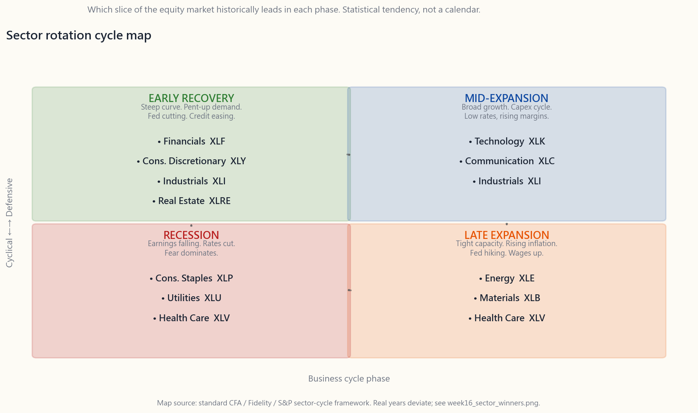

# 第十六週：板塊輪動 — 每個周期階段誰主沉浮

---

## 第一部分：閱讀章節

---

### 1. 為何此題重要

標普500指數並非鐵板一塊，而是由十一個板塊拼接而成，共用同一個代碼。任何一個日曆年度裡，表現最佳與最差的GICS板塊之間，差距可達60至90個百分點。2022年，能源板塊回報+64%，通訊服務回報-38%，同一個指數之內，差距達100個百分點。「大市」全年回報-18%，但十一個板塊中，沒有一個真的做出這個數字。

若你能掌握哪個板塊在哪個經濟周期階段勝出，你便掌握了其中一個有跡可循的超額回報來源的大致輪廓：**板塊輪動**。資金在板塊之間循著可預見的宏觀與利率轉換而流動。順勢而為，周期便是你的利器；逆勢而行，你便要花上整整十年，落後於一個從不開應用程式的被動標普500投資者。

即使你決定不做輪動，以下四個理由說明此題仍與你息息相關。

1. **這是真實存在的超額回報來源。** 有別於選股——學術實證對此殊不樂觀——板塊傾斜確有實證支持。防禦性板塊在周期後段及衰退環境中跑贏；周期性板塊在周期早段及中段跑贏。規律凌亂，時機難掌，但自1960年代有數據以來，這個結構性故事已反覆上演。
2. **它告訴你市場正在「思考」什麼。** 當公用事業與必需消費品板塊連續三個月領漲，而金融與非必需消費品板塊落後，市場正在為經濟放緩投票——而且往往早於任何經濟學家確認。解讀板塊領漲，就是實時解讀宏觀資金的取態。
3. **它為你的股票回撤提供背景。** 當你的科技股跌30%，能源板塊升50%，問題並非「科技股出了問題」，而是長存續期現金流的折現率剛剛翻了一番。了解周期，可防止你在錯誤時機沽出錯誤的板塊。
4. **大多數散戶輪動均錄得虧損。** 超額回報是罕見的例外，而非理所當然——散戶板塊輪動者的數據，持續差於買入持有指數的投資者。了解這套框架是嘗試輪動的必要條件，即便如此，大多數嘗試仍以失敗告終。請誠實審視自己：你是把輪動當興趣，還是真的具備實質優勢。

本課涵蓋十一個GICS板塊及其SPDR交易所買賣基金、標準周期圖示、周期圖示為何失靈（2020年在四個星期內顛覆了劇本）、板塊層面的動量與均值回歸之辯，以及散戶輪動損益的殘酷真相。

---

### 2. 你需要掌握的知識

#### 2.1 十一個GICS板塊及其SPDR交易所買賣基金

全球行業分類標準（GICS）由標普與MSCI聯合維護，將每一家上市公司劃入十一個板塊之一。道富的SPDR系列為每個板塊設有一隻交易所買賣基金，開支比率均低於0.10%，合計資產規模逾2,000億美元。它們是散戶進行板塊配置的標準工具。

| 板塊 | 交易所買賣基金 | 主要成分 |
|---|---|---|
| 科技 | XLK | 微軟、蘋果、NVIDIA、博通、半導體、軟件 |
| 金融 | XLF | 摩根大通、巴郡、銀行、保險商、交易所 |
| 醫療保健 | XLV | UnitedHealth、禮來、強生、製藥商、醫療器械、醫院 |
| 非必需消費品 | XLY | 亞馬遜、特斯拉、家得寶、汽車、酒店、餐飲、零售 |
| 通訊服務 | XLC | Meta、Alphabet、Netflix、電訊、媒體（2018年從科技板塊分拆） |
| 工業 | XLI | GE、卡特彼勒、波音、國防、鐵路、航空、機械 |
| 必需消費品 | XLP | 寶潔、Costco、沃爾瑪、可口可樂、百事可樂、家庭用品、煙草 |
| 能源 | XLE | 埃克森美孚、雪佛龍、油氣勘探開採、服務商、煉油商 |
| 公用事業 | XLU | NextEra、杜克能源、電力及水務公用事業、受監管壟斷企業 |
| 房地產 | XLRE | 美國鐵塔、Prologis、房地產信託基金（2016年從金融板塊分拆） |
| 原材料 | XLB | 林德、宣偉、化工、金屬、紙業、包裝 |

關於板塊結構，有兩點值得留意。

首先，**XLRE與XLC均屬新近設立。** 房地產於2016年9月從金融板塊分拆；通訊服務於2018年9月從科技與非必需消費品板塊分拆。因此，我們所掌握的大部分長期歷史數據均只涵蓋九個板塊，而非十一個。在本課稍後進行的2010至2024年回測中，XLRE與XLC應視為「數據由本世紀中段方才開始」，切忌過度依附其有限的歷史規律。

其次，**GICS的分類並非總是符合直覺。** 亞馬遜屬非必需消費品，而非科技；特斯拉屬非必需消費品，而非工業；Visa與Mastercard屬科技，而非金融；沃爾瑪與Costco同屬必需消費品，但Target卻屬非必需消費品。「科技 = 軟件 + 芯片」的概念比實際XLK籃子更為精確；「金融 = 銀行 + 保險商 + 交易所」則在XLRE分拆後大致吻合。

#### 2.2 標準周期圖示

民間智慧——在每一本特許財務分析師教材及大多數策略師報告中反覆出現——是板塊依照可預測的順序，在經濟周期四個階段中輪番領漲和落後。圖示如下：

圖示背後的邏輯。

- **早期復甦** — 利率已大幅下調，收益率曲線陡峭，信貸鬆動，消費者積壓需求開始釋放。**金融**板塊受惠於陡斜的收益率曲線及貸款損失下降。**非必需消費品**板塊隨薪資上升與信心反彈而受益。**工業**板塊受益於庫存補充。
- **中期擴張** — 增長全面，資本開支啟動，企業軟件與基礎設施投資加速。**科技**與**通訊服務**板塊領漲，因為在利率仍低的環境下，長存續期現金流估值重估向上。**工業**板塊持續發力。
- **後期擴張** — 產能緊張，通脹升溫，美聯儲加息。**能源**與**原材料**板塊領漲，因為它們本身便是通脹的輸入端。**醫療保健**開始發力，因投資者開始追求優質及穩定需求的資產。
- **衰退** — 盈利下滑，利率被下調，恐懼主導市場情緒。**必需消費品**、**公用事業**與**醫療保健**領漲——這些是人們需要而非想要的產品。長期國債、黃金與現金是跨資產的贏家。

這張圖示並非虛構，但現實遠比教材所繪的整齊版本複雜得多，下一節將作說明。

#### 2.3 年度熱力圖——圖示與現實的落差

下圖是2010至2024年的實際記錄：每隻SPDR板塊交易所買賣基金每年的年度總回報，按當年十分位排名著色。綠色格代表該板塊位於當年的頂部十分位；紅色格代表位於底部十分位。

閱讀此圖時，請帶著三個問題。

第一，**標準圖示是否成立？** 在圖中選取任何一個清晰的周期階段加以驗證。2010至2011年是教科書式的早期復甦，而金融板塊卻**嚴重跑輸**（XLF 2011年下跌17%），原因是歐洲債務危機重創美國銀行股。這一點不在周期圖示的預測之內。2018至2019年是教科書式的後期擴張，而能源板塊在兩年間均是表現最差的板塊。圖示同樣未能預見。

第二，**圖示在哪些年份奏效？** 2017年——中期擴張——科技領漲，原材料與工業表現良好，必需消費品落後。清晰吻合。2022年——與後期擴張相仿的通脹衝擊——能源大幅跑贏一切，原材料與必需消費品守穩，科技與非必需消費品崩潰。同樣吻合。

第三，**哪些年份使圖示失效？** 2020年在四個星期內打破了一切。新冠疫情引發的衰退於2020年2月展開，公用事業與必需消費品如圖示所示率先領漲。但到了4月，美聯儲已將利率降至零，國會通過了5萬億美元的財政刺激，科技板塊已反轉為年度領漲板塊，能源板塊全年以-33%收場。衰退在官方口徑上於4月結束。「衰退板塊」的操作手冊，在一場以週計而非以年計重估的衰退中，只有三個月的有效期。

客觀的解讀：**周期圖示是一種統計規律，而非行事曆。** 它在平均周期的平均年份中奏效。個別年份受個別催化劑主導——2008年的金融系統危機、2014至2016年的油價崩潰、2020年的新冠衝擊、2022年的利率衝擊、2023年的人工智能狂熱——每當這些催化劑出現，便會凌駕于周期之上。

#### 2.4 板塊層面的動量與均值回歸

這是動量與均值回歸之辯，從整體市場縮窄至十一個板塊。兩種操作方式均有實證支持：

- **動量。** 買入正在發力的板塊。持有3至12個月。待其動力減退時賣出。趨勢跟蹤文獻顯示，板塊層面的動量策略在過去數十年間產生了正的風險調整回報——與資產類別層面的情況相同。
- **均值回歸。** 買入去年人人嫌棄的板塊，賣出人人追捧的板塊。在超過一年的時間跨度上，板塊排名趨於回歸均值。能源在2020年（最差板塊，隨後於2021年成為最佳）；科技在2022年（最差，隨後於2023年成為最佳）。領漲板塊的輪換周期如此。

兩者均成立。難處——與第8課完全相同——在於識別當下處於哪個市場環境。某些市場環境獎賞動量；另一些獎賞均值回歸。大部分學術實證指向**3至12個月動量和3至5年均值回歸**，大致是兩者有所區隔的時間跨度。在這個區間之內，兩種策略相互抵消。

實際操作上，買入「去年表現出色的板塊」的散戶，往往是在表達均值回歸式的錯誤判斷——他們在一段12個月動量即將反轉的頂部買入。買入「過去十年中最慘烈的板塊」的投資者，在更多情況下是對的，*前提是*他們能熬過在復甦前常見的額外回撤。無論哪種操作方式，都需要以能夠生存的倉位管理為紀律，並對何種情況證明論點有誤設定清晰的止蝕點。

#### 2.5 散戶輪動的殘酷損益

以下是教材所略去的部分。本課下方的互動實驗室讓你選取最多四個板塊，並透過單一切換鍵，將其2010至2024年的累計回報與標普500對比。試驗幾個組合：

- **全押科技輪動（只持XLK）。** 在整個時間窗口內，大幅跑贏標準普爾500指數ETF（SPY）。最終財富約為指數的2.0倍。看似天才之舉。但逐年細看，2022年虧損-28%，而指數同期跌-18%，而且大多數受注意力驅動的散戶輪動交易，都發生在+50%大漲之後，而非之前。
- **每年買入上一年的最佳板塊。** 在2010至2024年間，每年落後標普500約4至6個百分點。教科書式的動量交易，若執行方式粗糙，反而輸給被動投資。
- **每年買入上一年的最差板塊。** 大致與標普500持平，但波動性高得多。教科書式的均值回歸交易，若執行方式粗糙，只能打個平手。
- **十一個板塊等權重配置。** 在整個時間窗口內，略遜於以市值加權的標普500指數ETF。在大型股未大幅拋離的年份奏效（2014至2016年、2022年）；在大型股大幅跑贏的年份落後（2020至2021年、2023至2024年）。

過去十年，散戶輪動者的虧損，並非因為輪動本身有問題，而是因為他們的操作方式是：追逐上一季的贏家，在首次10%回撤時賣出，周而復始。這不是輪動，而是穿著華麗外衣的追高殺低。

輪動的專業版本——疊加在被動核心之上，根據周期與倉位數據進行小幅傾斜，從不把整個投資組合押注在單一板塊——才是超額回報的所在。散戶版本，若用以取代被動核心，幾乎必然跑輸。

坦誠的框架：**大多數散戶讀者最好持有標普500，加上最多10至15%的板塊傾斜。** 這種傾斜可讓你在周期中分享板塊輪動的收益，同時避免把整個投資組合押注在來年領漲板塊圖示的系統性風險。

#### 2.6 實用工具組合

散戶投資者實際運用板塊交易所買賣基金的三種方式：

1. **傾斜，而非下注。** 相對於標普500的板塊權重，超配一至兩個板塊5至10%。若傾斜判斷錯誤5個百分點的回報，投資組合影響為25至50個基點——尚可承受。若傾斜判斷正確，在一個周期內可獲得適度的溢價。這是唯一能夠通過大多數散戶心理考驗的輪動紀律。
2. **在硬性信號出現時轉向防禦。** 收益率曲線倒掛、採購經理指數跌破50、初請失業救濟人數趨升——這些都是後期周期信號。部分投資者只在這些觸發點執行輪動：傾斜至必需消費品、公用事業、醫療保健，並降低股票貝塔。持有防禦性傾斜，直至收益率曲線恢復正常形態及美聯儲開始減息。這是陳馬偏好的形態：不對稱的風險偏好/風險規避切換，而非持續輪動。
3. **在有信念的板塊中配置阿爾法份額。** 在你深入了解的板塊內，可持有資深層（市值加權的交易所買賣基金）、中間層（中型股標的）及探索層（小型股期權或個股）。當該板塊在周期中進入受追捧的階段，各層次標的依序重估，而探索層的回報倍數最大。能源板塊2020至2022年是教科書式的例子——XLE升1.6倍，中型市值勘探開採公司升3至5倍，陷入困境的頁岩油倖存者升10至30倍。這是板塊信念的操作手冊，*並非*泛泛輪動的方案。

本課下方的互動實驗室讓你混搭板塊，觀察每種組合相對於標普500指數ETF的表現。多試幾個組合。圖表所能教你的紀律，比任何教材都快：靠傾斜跑贏標普500，比周期圖示所呈現的要難得多。

---

### 3. 常見誤解

1. **「周期圖示就是行事曆。」** 它是一種統計規律。在任何一個個別年份，板塊回報均受當年的特定催化劑主導（石油衝擊、銀行危機、新冠疫情、人工智能狂熱）。周期只是其中一個變數，而且鮮少是最主導的那一個。
2. **「科技板塊永遠是贏家。」** 科技板塊在2013至2021年及2023至2024年領漲，但在2022年是*最差*板塊，在2008年是*最差*板塊，在2000至2002年亦是最差之列。「永遠」這個說法，是在利率持續下行的十年中形成的近期偏見。
3. **「防禦性板塊從不增長。」** 醫療保健板塊在2010至2019年累計回報逾200%，且波動性明顯低於標普500。「防禦性」意味著低貝塔，而非零增長。複利效應是真實的，只是走勢較為平穩。
4. **「能源板塊已死。」** 能源板塊在2014至2020年的大部分時間是最差板塊，但在2021年和2022年是*最佳*板塊。在下跌途中因ESG授權而拋售的資金，只能在更高價位買回。買入被被動資金流棄守的板塊，正是那筆交易的關鍵。
5. **「我會根據頭條新聞進行輪動。」** 頭條新聞較股價滯後3至6個月。等到CNBC在字幕欄播出「衰退來臨」的時候，防禦性板塊已領漲了兩個季度。輪動奏效的前提是搶先市場共識行動，而這恰恰是大多數散戶交易者的弱項，而非強項。
6. **「所有板塊均回歸均值。」** 能源板塊從2014年至2020年並未回歸——它連續六年維持最差板塊的地位。均值回歸是一種長期趨勢，可能需要十年才能實現，而「判斷正確但時機太早」在操作上與「判斷錯誤」無異——市場保持非理性的時間，可能比你保持償債能力的時間更長。
7. **「板塊交易所買賣基金已充分分散投資。」** XLK中微軟+蘋果+NVIDIA合計佔45%。XLC中Meta+Alphabet合計佔40%。XLY中亞馬遜+特斯拉合計佔25%。所謂的「板塊」，往往是對三隻股票的槓桿押注。標普500比其大多數板塊切片更為分散。
8. **「板塊輪動與因子投資是同一回事。」** 並非如此。因子（價值、動量、優質、低波動）跨板塊存在。你可以做多價值因子，同時持有全部十一個板塊。板塊輪動是一種特定的傾斜；因子投資是另一套框架，往往與周期圖示產生*相反*的板塊押注。

---

### 4. 問答環節

**問：在標普500核心倉位之上，我能執行的最簡單的板塊傾斜是什麼？**
答：將80至90%持有於標普500指數ETF（SPY或VOO），餘下10至20%用於根據信念超配一至兩個板塊。若認為當前處於後期周期，這10至20%配置至XLV與XLP。若處於早期周期，則配置至XLF與XLY。每年再平衡一次。投資組合風險影響維持在可控範圍，同時你在邊際上參與了輪動。

**問：如何判斷當前處於周期的哪個階段？**
答：收益率曲線斜率、採購經理指數水平、初請失業救濟人數趨勢，以及美聯儲政策方向，合併起來可提供超過70%置信度的判斷。我們在第10週詳細介紹這些指標。粗略而言：收益率曲線倒掛+採購經理指數低於50+初請人數上升+美聯儲減息=後期周期進入衰退。收益率曲線陡斜+採購經理指數上升+初請人數下降+美聯儲大幅減息=早期復甦。大多數信號從不呈現教科書式的完美配置；以指標多數派的指向為準。

**問：我可以直接買入去年表現最佳的板塊嗎？**
答：那是粗糙的動量交易，在2010至2024年間，其表現略遜於標普500。原因在於選擇偏差——上一年的贏家往往最可能在下一年均值回歸。學術界所記錄的12個月動量信號，在1至3個月再平衡周期下有效，而非年度周期。

**問：槓桿板塊交易所買賣基金如何？**
答：敬而遠之。每日再平衡的2倍和3倍交易所買賣基金，因波動性拖累而隨時間消耗，即使相關板塊大致持平，往往也會虧損。它們是日內投機工具，而非投資工具。

**問：2026年能源板塊是買入時機嗎？**
答：本課程不作個股或板塊推薦。框架如下：能源板塊自2022年高峰以來表現遜色，油價區間震盪，ESG拋售壓力已減退，且在標普500中的權重低於4%。根據「買入被被動資金流棄守的板塊」原則，其結構性配置吸引力高於2010至2020年的十年。能否轉化為明年的回報，取決於需求、地緣政治及匯率走向。

**問：板塊輪動如何與四層次框架相互配合？**
答：一旦你對某個板塊有信念，四層次框架告訴你*如何*表達。交易所買賣基金用於資深層配置。你已深入研究的中型股標的用於中間層。小型股標的的長期期權或收入前期股票用於探索層，倉位規模以虧損可承受為限。周期為你指明板塊，四層次框架為你提供表達方式。

**問：輪動至必需消費品與公用事業以應對衰退，有什麼問題？**
答：兩點。其一，等到衰退成為市場共識，這些板塊的升幅已大半實現；你已慢了一步。其二，在通縮式衰退中（1929至1932年、2008至2009年），即使必需消費品與公用事業也會下跌；它們只是在*相對*層面跑贏。防禦性板塊操作手冊在衰退短暫且美聯儲反應迅速的情況下效果最佳（2001年、2020年）。在一切齊齊下跌的漫長熊市中，則可能帶來虧損。

**問：為何2020年的周期打破了圖示？**
答：新冠疫情從市場角度而言是一場為期四週的衰退。美聯儲在9天內減息至零，國會在6週內通過了5萬億美元的刺激方案，長存續期現金流的折現率隨即崩落。科技板塊（長存續期）立即完成重估；能源板塊（商品短期需求）崩潰，因為沒有人在開車。周期圖示假設過渡期為數個季度。2020年沒有給出這個過渡期。未來的衝擊可能同樣不會。

**問：美國板塊分類與國際市場有何不同？**
答：GICS是全球性標準。同樣的十一個板塊存在於歐洲和亞洲市場。板塊權重有所不同——美國科技板塊約佔30%，歐洲約佔5%；歐洲金融與工業板塊的比重更高。但這套框架可以移植。本課程僅限於美國市場；海外板塊傾斜不在討論範圍之內。

**問：板塊交易所買賣基金應在稅務優惠帳戶還是應稅帳戶中使用？**
答：兩者均可。板塊交易所買賣基金的稅務效率高——大多數以受監管投資公司架構組成，換手率低。可操作的優勢在於：在應稅帳戶中輪換板塊交易所買賣基金會觸發資本增值事件；在401(k)或個人退休帳戶中則不會。若確實打算主動輪動，在稅務遞延帳戶中進行較為合適。

**問：對於遵循結構性資金流論點的投資者，單一最高信念的板塊傾斜是什麼？**
答：陳馬的偏好是買入被被動資金流棄守的板塊。截至2026年4月，這是能源（自2022年高峰後遭拋售，ESG資金撤離）、小型股價值股（沉寂逾十年）及金融板塊（2023年地區銀行恐慌後）之間的難以抉擇。以上均非教科書式推薦；它們是建立在廣義指數核心倉位之上的持倉，規模以連續兩年判斷失誤也不會危及投資組合其餘部分為限。核心倉位始終是標普500。

---

## 第二部分：YouTube腳本

---

**視頻標題：** 板塊輪動 — 每個周期階段誰主沉浮
**目標時長：** 約18分鐘
**主持人：** 陳馬、小魚

---

### 開場（0:00 – 1:30）

**[VISUAL: title card "Week 16 — Sector Rotation"]**

**小魚：** 歡迎回到《投資入門》。上週我們講了資產類別之間的相關性——股票對債券、債券對黃金，諸如此類。今週我們再深入一層，打開股票這個箱子，看看裡面有什麼。

**陳馬：** 標普500裡面有十一台不同的機器，各自靠不同的燃料運作。在指數回報15%的年份，這十一台機器的個別回報，可以由+50%到-30%不等。「15%」只是加權平均值，沒有一台機器真的做出這個數字。

**小魚：** 今天的問題就是——我們能預測哪台機器在哪一年、或哪個周期階段勝出嗎？

**陳馬：** 部分可以。在統計層面上。但有很多注意事項。我們開始吧。

### 第一部分 — 十一個板塊（1:30 – 4:00）

**小魚：** 十一個板塊，按GICS分類。逐一介紹一下。

**陳馬：** 先說三個大的——科技、金融、醫療保健。科技是XLK，微軟、蘋果、NVIDIA、軟件、芯片，約佔標普500的30%。金融是XLF——摩根大通、巴郡、銀行、保險商，約佔13%。醫療保健是XLV——UnitedHealth、禮來、強生、製藥商、醫療器械，約佔12%。

**小魚：** 三個板塊已佔了指數的55%。

**陳馬：** 對。接下來一批——非必需消費品XLY、通訊服務XLC、工業XLI。非必需消費品包含亞馬遜、特斯拉、家得寶。通訊服務是Meta、Alphabet、Netflix；這個板塊在2018年從科技和非必需消費品分拆出來，所以如果你看2018年前的板塊數據，XLC是不存在的。

**小魚：** 那小的板塊呢？

**陳馬：** 必需消費品XLP——Costco、沃爾瑪、寶潔、可口可樂。能源XLE——埃克森美孚、雪佛龍、油氣。公用事業XLU——NextEra、杜克能源。房地產XLRE——房地產信託基金，這個在2016年從金融板塊分拆出來。原材料XLB——化工、金屬、包裝。最後這五個板塊各佔指數2至6%。

**[VISUAL: image/week16_cycle_map.png]**

### 第二部分 — 標準周期圖示（4:00 – 7:00）

**小魚：** 好，教科書的說法是，這十一個板塊各自在經濟周期的不同階段領漲。

**陳馬：** 對。圖示是這樣的。早期復甦——美聯儲已減息，經濟正在見底，收益率曲線陡峭。銀行短借長貸，陡峭的曲線對它們大有裨益。消費者積壓的需求開始釋放——非必需消費品發力。製造業補庫存——工業發力。利率崩落——房地產反彈。所以左側象限是XLF、XLY、XLI、XLRE。

**小魚：** 中期擴張呢？

**陳馬：** 增長全面，資本開支啟動，企業升級軟件和基礎設施。科技與通訊服務領漲，工業持續發力。右上方是XLK、XLC、XLI。

**小魚：** 後期擴張。

**陳馬：** 後期擴張是通脹階段。產能緊張，薪資上升，美聯儲加息。能源和原材料是通脹的輸入端，所以它們勝出。醫療保健開始發力，因為投資者開始追求優質資產。右上方的XLE、XLB、XLV。

**小魚：** 衰退。

**陳馬：** 衰退是人們必需品的階段。必需消費品、公用事業、醫療保健。XLP、XLU、XLV。即使失業，人們仍然要買牙膏和付電費。這些板塊的盈利在周期性板塊崩潰時大致穩定。那是圖示右下方的象限。

**小魚：** 漂亮的圖示。那現在告訴我為什麼它行不通。

### 第三部分 — 打破圖示的熱力圖（7:00 – 10:30）

**[VISUAL: image/week16_sector_winners.png]**

**陳馬：** 這是十五年的實際板塊回報，2010至2024年。每行是一個板塊，每列是一個年份。綠色格是當年的領漲板塊，紅色格是墊底板塊。橫向閱讀。

**小魚：** 先看2011年。那是早期周期嗎？

**陳馬：** 大致上。2008至2009年谷底後的第二年。圖示說金融板塊應該領漲。結果呢？

**小魚：** XLF跌17%。

**陳馬：** 當年最差板塊。歐洲債務危機重創美國銀行股。意大利和西班牙主權債務的壓力，蔓延至美國銀行資產負債表。周期圖示沒有預見到這一點。周期圖示根本預見不到*任何東西*——它只是一個長期平均值。

**小魚：** 2017年呢？

**陳馬：** 2017年是教科書式的中期擴張年份。科技升34%，金融升22%，工業升23%，原材料升24%。必需消費品升13%，公用事業升12%——防禦性板塊落後。圖示奏效。

**小魚：** 2020年呢？

**陳馬：** 2020年是圖示失靈的時候。2月：新冠疫情，市場崩跌35%，公用事業與必需消費品如圖示所示率先領漲。到了4月，美聯儲已降息至零，國會通過了五萬億美元刺激方案。到12月，科技板塊全年升44%，能源板塊跌33%，而官方宣布的衰退在4月便已結束。整個「衰退板塊領漲」的操作手冊，只有約十週的有效期。圖示假設過渡期為數個季度，但2020年的周期根本沒有給出這個過渡期。

**小魚：** 2022年？

**陳馬：** 2022年是通脹衝擊。能源+64%。通訊服務-38%，科技-28%，非必需消費品-36%。標普500全年回報-18%。十一個板塊中，沒有一個真的做出-18%。六個更差，五個更好。

**小魚：** 那圖示算是——對了一半？

**陳馬：** 圖示是一種統計規律。在平均周期的平均年份中奏效。個別年份受個別催化劑主導——石油衝擊、銀行危機、疫情、利率衝擊、人工智能狂熱。當催化劑的力量大於周期，催化劑勝出。

### 第四部分 — 動量與均值回歸（10:30 – 13:00）

**小魚：** 每個市場都有兩種解讀——動量或均值回歸。板塊層面也一樣嗎？

**陳馬：** 是的。而且實證答案是：在3至12個月的時間跨度，動量奏效；在3至5年的時間跨度，均值回歸奏效。在這個區間之內，兩種策略相互抵消。

**小魚：** 用白話說一次。

**陳馬：** 如果一個板塊在過去六個月持續跑贏大市，學術實證顯示它傾向於在往後六個月繼續跑贏。那是板塊動量。如果一個板塊連續三年墊底，它傾向於在往後三年成為表現最佳板塊之一。那是均值回歸。

**小魚：** 那散戶「買去年最佳板塊」的操作——是什麼？

**陳馬：** 那是追高殺低，用了錯誤的時間跨度。以日曆年份邊界捕捉的12個月動量，在你買入的時候，大部分已處於均值回歸的初期。學術界記錄的動量信號在3個月再平衡周期下有效，而非年度周期。在過去十五年間，以去年最佳板塊為依據、每年輪換一次，略遜於標普500。

**小魚：** 那買去年最差的板塊呢？

**陳馬：** 大致與標普500持平，但波動性高得多。教科書式的均值回歸交易，若執行方式粗糙，只能打個平手。

### 第五部分 — 殘酷的損益真相（13:00 – 16:00）

**[VISUAL: interactive/week16_sector_lab.html]**

**小魚：** 給我看看實驗室。

**陳馬：** 這個互動工具讓你切換最多四個板塊，查看它們從2010年至2024年與標普500指數ETF的累計回報對比。點選只持有XLK。

**小魚：** 單獨持有XLK這段時間——資產約增至6.2倍。

**陳馬：** 標普500指數ETF約為4.5倍。所以單獨持有XLK，在十五年的累計回報上明顯跑贏標普500。看起來是贏家策略。

**小魚：** 但有什麼問題？

**陳馬：** 兩點。其一，這是後見之明——2010年你不知道科技板塊會主導全場。現在回頭挑選很容易。其二，這個6.2倍的累計回報中，藏著一個-28%的年份（2022年），而大多數散戶科技股持有者在接近最低位時已賣出。單一板塊的持有，回撤比指數更深，行為性出貨的比率也更高。

**小魚：** 加上XLE。

**陳馬：** 2010至2024年單獨持有能源板塊——資產約增至1.7倍。標普500指數ETF是4.5倍。能源板塊在這個十年的大部分時間是最差板塊，然後在2021年和2022年連續大升54%和65%，從遠遠落後的位置，追回至過去三年與累計指數大致持平。能源板塊的輪動交易是真實的——但你要熬過六年的跑輸才能等到回報。

**小魚：** 再加上XLU和XLP。

**陳馬：** 現在選了四個板塊。防禦性板塊加科技加能源。每年等權重再平衡，這個組合的回報與標普500大致相若，波動性也相近。所以四個板塊的傾斜，相對於直接買指數，基本上毫無貢獻。

**小魚：** 這就是今天的核心結論，對吧。

**陳馬：** 這就是核心結論。周期圖示是真實的，在長期平均層面奏效。但散戶版本的輪動——追逐上一季的贏家，在首次10%回撤時賣出，周而復始——每年落後買入持有策略4至6個百分點。專業版本的輪動——小幅傾斜、多板塊分散、以信號驅動——或許能增加1至2個百分點的阿爾法。大多數散戶不具備執行專業版本所需的紀律。

### 第六部分 — 實際應用（16:00 – 17:30）

**小魚：** 好，那我從這課實際上學到什麼，應該怎麼做？

**陳馬：** 三件事。第一——了解圖示。把板塊領漲態勢作為實時的宏觀信號來解讀。當公用事業板塊連漲一個季度，市場在告訴你它很害怕。要聆聽。第二——傾斜，而非下注。根據周期，在一至兩個板塊超配5至10%。風險影響是有界的，上行空間是真實的。第三——當你對某個板塊真正有信念時，用四層次框架表達。交易所買賣基金用於資深層，中型股用於中間層，期權或個股投機用於探索層。周期為你指明板塊，四層次框架給你表達方式。

**小魚：** 那我們不建議大家做的是什麼？

**陳馬：** 不要把板塊輪動用來*取代*標普500核心倉位。數據是殘酷的。大多數散戶輪動跑輸大市，而且越活躍，跑輸幅度越大。把輪動作為10至20%的疊加策略。核心倉位保持平淡、廣泛分散。

### 結語（17:30 – 18:00）

**小魚：** 下週——我們看細價股溢價。或者說，*曾經*存在的溢價，以及它現在是否還在。劇透：細價股溢價已經收窄，我們會解釋為什麼。

**陳馬：** 在那之前——了解周期圖示，但不要奉若神明。

**小魚：** 下週見。

**[VISUAL: outro card with "Next week: Small-cap premium — alive or dead?"]**