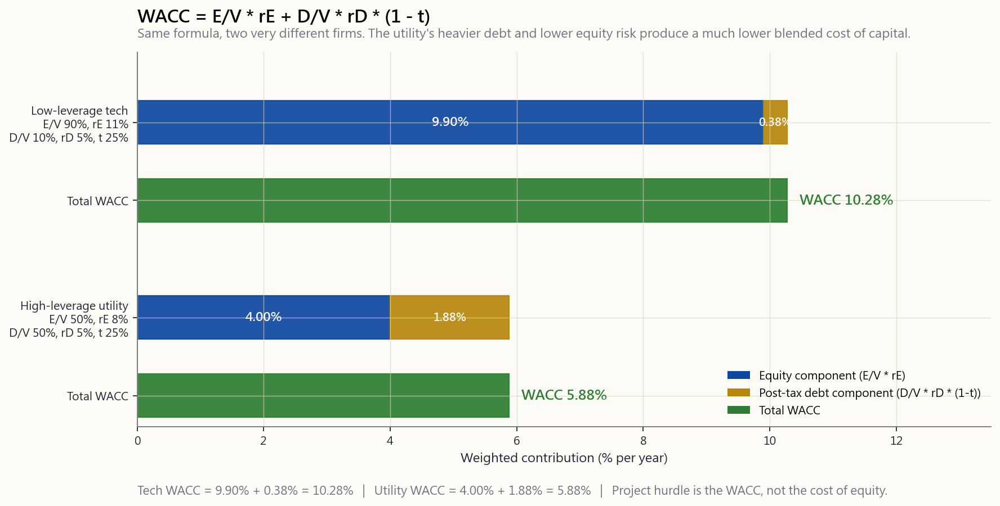
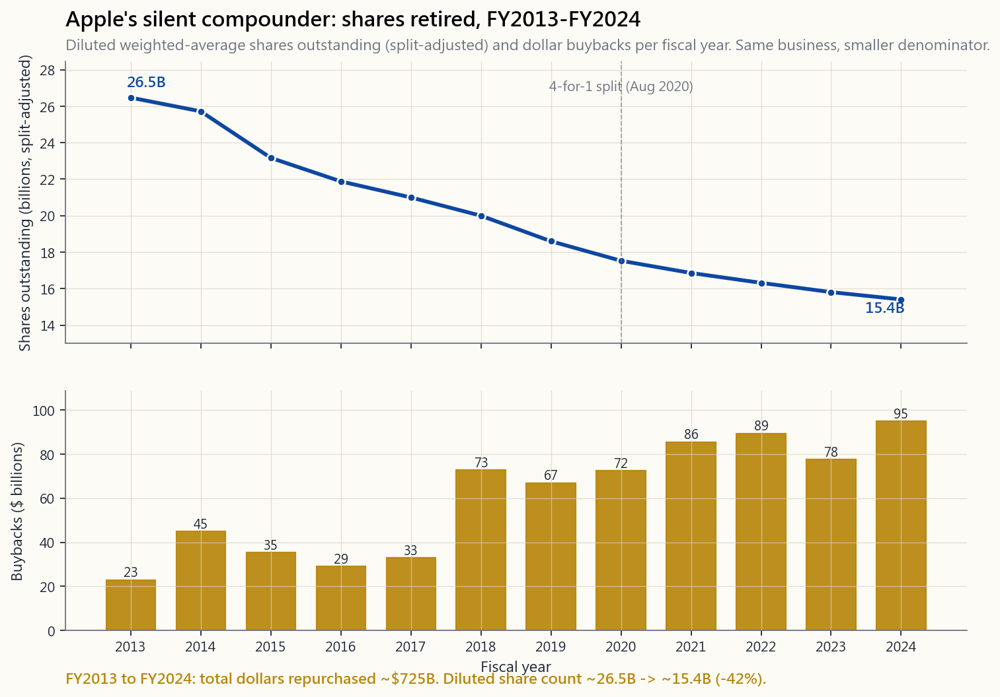

# 第十九週：投資者的企業財務——資本結構、加權平均資本成本、股份回購及併購

---

## 第一部分：閱讀材料

---

### 1. 為何這一課至關重要

當你買入一間上市公司的股份，你其實是在聘用一支管理團隊，代你配置資本。在十年之間，一間每年賺十億美元的公司，將部署一百億美元。這一百億美元究竟投入回報率達 20% 的項目，還是流入回報率僅 4% 的收購，對你長期回報的影響，遠遠大於任何一個季度的盈利超出預期。企業財務就是這些資本配置決策所使用的語言，也是公開市場所能給予你的、最接近觀察行政總裁真實工作的一扇窗。

以下四個理由說明這一課屬於投資者的學習課程，而非僅屬會計師的範疇：

1. **資本結構改變的是股權的形態，而非只是顏色。** 一間完全以股權融資的公司，與一間一半以債務融資的公司，擁有相同的經營業務，但股權持有人面對的回報分佈卻截然不同。槓桿版本在正常年份的預期股本回報率更高，在壞年份的回撤幅度也更大——有時甚至全盤歸零。不先了解兩間公司各自的槓桿程度，根本無從比較它們的市盈率。
2. **資本成本是每個項目必須跨越的門檻。** 加權平均資本成本聽起來像教科書上的抽象概念，但它非常實際：若一位行政總裁批准一個回報率 6% 的項目，而公司的加權平均資本成本是 9%，該項目每運作一年便在摧毀價值，不論新聞稿措辭多麼精妙。同一個折現率也是你估值試算表中現金流折現法所採用的數字，因此加權平均資本成本有誤，目標股價亦必然有誤。
3. **股份回購與股息並非換湯不換藥。** 教科書說在完美市場下兩者等價。現實世界加入了稅務、信號效應、高管薪酬攤薄，以及價格紀律等因素。蘋果自 2013 年以來已動用逾七千億美元進行股份回購——金額超過地球上絕大多數公司的整體市值——而股份數量的悄然減少，正是推動每股盈利增長的無聲複利引擎。
4. **併購是行政總裁最常摧毀價值的一環，學術界的證據毫不留情。** 目標公司股東通常獲益 20% 至 30%；收購方股東在公告日通常損失 1% 至 5%。身為收購方的持股人，看到一則併購公告，應該伸手拿起核查清單，而非舉杯慶祝。

本課只針對投資者視角。我們不涵蓋資本預算試算表、最優資本結構的數學推導，或審計師眼中的跨公司抵銷。我們涵蓋的是：怎樣閱讀、怎樣尋找關鍵訊號，以及哪些危險信號值得警覺。

---

### 2. 你需要掌握的內容

#### 2.1 債務與股權——購入同一資產的兩種方式

每間公司都以債務（借貸人）與股權（所有人）的某種組合來融資。借貸人的索償權具有合約保障：固定票息、按期支付、清盤時優先受償。所有人的索償權是剩餘性的：在借貸人、員工、供應商及稅務機關獲得清償後，剩下什麼才屬於所有人。借貸人優先受償，上行空間受限；所有人最後受償，上行空間無限。

對投資者的啟示：相同的經營現金流，以不同方式融資，會為股權持有人帶來截然不同的結果。

| 項目                   | 純股權公司 | 50% 債務公司 |
| ---------------------- | ---------- | ------------ |
| 總資產                 | 10億美元   | 10億美元     |
| 利率 6% 的債務         | 0          | 5億          |
| 股權                   | 10億       | 5億          |
| 經營收入（好年份）     | 1.5億      | 1.5億        |
| 減：利息               | 0          | 3,000萬      |
| 減：25% 稅項           | 3,750萬    | 3,000萬      |
| 淨利潤                 | 1.125億    | 9,000萬      |
| **股本回報率**         | **11.25%** | **18.0%**    |

在*好*年份，槓桿公司的所有人在資本上的回報高出 60%。同樣的槓桿，若在經營收入跌至 2,000 萬美元的年份，槓桿持有人出現虧損，非槓桿持有人則錄得小額盈利。槓桿不改變業務本身，它改變的是股權回報的波動性。正如陳馬所言，「市場可以在你耗盡流動性之前保持非理性」——而槓桿股權持有人耗盡流動性的速度，遠比非槓桿持有人快得多。

#### 2.2 莫迪利亞尼-米勒定理，以及打破它的現實摩擦

1958 年，莫迪利亞尼與米勒證明：在一個無稅、無破產成本、資訊對稱的世界裡，公司的總價值與其融資方式無關。把同一塊披薩切成不同比例的債務與股權組合，並不會改變披薩的大小。每位財務學生都被要求記住這個結論，然後立即學習它在現實中為何不成立——這正是重點所在。莫迪利亞尼-米勒定理是一條基準線，它精確地告訴你，哪些現實摩擦使資本結構真正重要。

主要有三大摩擦：

- **稅盾效應。** 利息支出可以稅前扣除；股息則不能。一間以 25% 企業稅率支付 100 美元利息的公司，實際上只支出了 75 美元。這個稅盾是真實的金錢，它推動最優資本結構走向*更多*債務，超出莫迪利亞尼-米勒定理的預測。
- **財務困境成本。** 過多的債務提高了違約和重組的可能性。直接成本（法律費用、重組顧問費用、資產低價出售）和間接成本（客戶流失、供應商收緊條款、核心員工離職）巨大且不對稱——只有在公司已身陷困境時才會出現。這將最優結構推回*更少*債務的方向。
- **資訊不對稱與代理問題。** 管理層對公司的了解遠多於外部投資者。發行股票被市場解讀為管理層認為股票被高估的信號；發行債務則被解讀為對未來現金流充滿信心。這就是融資優先順序理論——公司優先使用內部資金，其次是債務，最後不得已才發行股票。

最優資本結構是債務邊際稅收收益等於財務困境成本邊際增量的那個水平。對於現金流穩定的成熟企業，這通常是 30% 至 50% 的負債率。對於現金流波動的行業（科技、生物科技、任何週期性行業），最優點遠低於此；對於穩定的公用事業公司和房地產信託基金，則遠高於此。沒有放諸四海皆準的答案，只有針對底層業務的校準。

#### 2.3 加權平均資本成本——一個統領所有決策的門檻利率

加權平均資本成本是公司所有已部署資金的綜合成本。只要慢慢讀，公式並不可怕：

$$
\text{加權平均資本成本} = \frac{E}{V}\cdot r_E + \frac{D}{V}\cdot r_D \cdot (1 - t)
$$

其中 $E$ 是市值，$D$ 是市場價值的債務，$V = E + D$ 是總資本，$r_E$ 是股權成本（通常透過資本資產定價模型估算：$r_f + \beta \cdot \text{股票風險溢價}$），$r_D$ 是債務成本（公司債券的收益率），$t$ 是邊際稅率。$(1 - t)$ 因子是稅盾效應的體現：稅後債務成本比稅前便宜，差距恰好是稅率。

下圖顯示了兩間截然不同公司的相同計算——低槓桿科技公司與高槓桿公用事業公司：

解讀簡單而直接：公司批准的每個項目，在經風險調整後，必須至少達到加權平均資本成本，才能為股東創造價值。一個在加權平均資本成本 9% 的公司內回報率 7% 的項目，每年摧毀 2% 的價值，無論財務總監如何包裝幻燈片。**投入資本回報率高於加權平均資本成本**，是衡量行政總裁究竟在創造還是摧毀價值的最簡潔測試。

幾點實務提示：

- 加權平均資本成本是*當前*數字，而非歷史數字。利率上升時，加權平均資本成本機械式地隨之上升。
- 使用*市場*價值，而非賬面價值。一間回購股份十年的公司，其賬面股東權益毫無意義——對某些公司而言（波音、星巴克在某些時期）甚至是負值。
- 加權平均資本成本是公司層面的平均值。風險高於公司基礎業務的項目應以更高的折現率折算；風險較低的項目則以較低的折現率折算。以單一加權平均資本成本套用於整個資本計劃的財務總監，會系統性地過度投資於風險較高的項目，並對較安全的項目投資不足。

#### 2.4 股息、股份回購，以及它們為何*幾近*等價

在無摩擦的世界裡，1 美元的股息與 1 美元的股份回購完全相同：兩者均將 1 美元企業現金轉移給股東。股息以現金形式存入你的帳戶，並在除息日令股價下跌 1 美元。股份回購用 1 美元企業現金買入並注銷股份，令剩餘股份的每股價值恰好上升 1 美元。價值守恆定律表明兩者等價。

三項現實摩擦打破了這種等價性，並對投資者至關重要：

- **稅務。** 在美國，合資格股息每年收到時即須繳稅。股份回購則將收益遞延至資本增值範疇，由持有人自行選擇何時變現（或不變現——死後資產承接可抹去稅務負擔）。對於高收入的美國應稅持有人，這種遞延在數十年複利之下價值不菲。陳馬的更廣泛原則——投資組合的構建，既取決於稅務效益和期權/保證金工具，也取決於標的選擇本身——在此直接適用：兩種現金回報機制對同一投資者而言，稅後並*不*可互換。
- **價格紀律。** 在每股 30 美元、內在價值 50 美元時進行股份回購，是一筆絕佳交易——每投入一美元，便為剩餘持有人購入 1.67 美元的價值。在每股 50 美元、內在價值 30 美元時進行回購，則是將 0.40 美元的價值從剩餘持有人手中*轉移*給賣出的人。大多數公司進行回購時，完全沒有明確的估值紀律，這正是為何回購的實證結果參差不齊，儘管其背後的數學原理十分簡單。
- **攤薄抵消陷阱。** 最常見的濫用手法：一間公司宣布 50 億美元的股份回購，股份數量卻幾乎紋絲不動，因為公司同時向高管發行了 40 億美元的股份薪酬。股份回購於是僅僅是在*抵消*攤薄，而非回饋資本。核查方法很機械——調出過去五年的股份數量，看它是否真正下降。

蘋果是正面示範的典型案例。自 2013 年中重啟回購計劃以來，蘋果已動用**逾七千億美元**回購股份，將攤薄後股份數量從約 265 億股（以 2020 年四合一拆細後調整計算）減少至 2024 財年的約 154 億股。下圖追蹤了這一軌跡：

同一門業務。同一部 iPhone。同一毛利率。蘋果在這十年的每股盈利複利增長，既是*分子*增長的故事，也同樣是*分母*收縮的故事。股份數量是無聲的複利引擎，而大多數散戶投資者對此幾乎毫不關注。

本節的互動工具讓你即時調整加權平均資本成本的各項輸入（股權比重、股權成本、債務成本、稅率），觀察其對一個一億美元、為期五年的項目淨現值的影響，並與蘋果、微軟、摩根大通、可口可樂、福特的大概加權平均資本成本作比較。試著在業務風險不變的情況下提高槓桿，看看項目淨現值如何上升——直到你推得太遠，隱含的財務困境成本（簡單公式並*未*納入）將抵銷甚至超過收益。

#### 2.5 併購——大多數收購方股權的墳場

兼併與收購是企業財務中研究最深入的事件，其實證規律在數十年和各個地域都保持一致：目標公司股東獲益，收購方股東受損，合並後的整體價值在公告日大致持平或略為負面。

溢價的數學邏輯：

- 目標公司以 40 美元交易，市值 40 億美元。
- 收購方在激烈競購中出價 52 美元——溢價 30%——以贏得交易。
- 收購方必須相信，自己至少能提取 12 億美元的淨協同效益（成本削減加上收入提升，折現後計算，扣除整合成本），才能達到*收支平衡*。
- 公告時宣稱的協同效益平均約佔合並企業價值的 6%；三年後實際實現的協同效益平均不足一半。差距由收購方股東承擔。

屢見不鮮的失敗模式：

- **贏家詛咒。** 在競爭性程序中，勝出的競購方是將目標公司估值最高的一方——而這恰恰是預測最為樂觀的競購方。從結構上看，勝出的競購方最有可能出價過高。
- **整合摩擦。** 兩套薪資系統、兩套企業資源規劃系統、兩種企業文化、兩套客戶服務流程。整合永遠比協同效益幻燈片所承諾的耗費更多、耗時更長。
- **帝國建造。** 行政總裁薪酬與公司規模的相關性，往往高於與公司*價值*的相關性。一宗經濟效益平庸、卻令員工人數倍增的收購，可以令行政總裁薪酬倍增，即使股價隨之下跌。
- **週期時機。** 併購活動在市場高峰時達到頂峰。收購方偏偏在融資成本最低、樂觀情緒最高的時候支付最高的價格——從價值角度來看，這恰恰是最錯誤的時機。

當你持有的股票公告一宗併購時，投資者核查清單如下：

1. **溢價與價格。** 以息稅折舊攤銷前盈利、收入或自由現金流計算的估值倍數是多少？是否高於或低於可比交易？
2. **融資組合。** 全現金從資產負債表支出最佳（收購方以自己的錢下注）。以低迷股價全股份支付最差（收購方用被高估或合理估值的股份換取實際資產）。大量債務融資將徹底改變合並實體的整體資本結構——需重新計算加權平均資本成本。
3. **協同效益聲稱。** 成本協同效益（裁員、關閉設施）具有可信度且可量化。收入協同效益（「交叉銷售機會」）通常是幻想。若逾一半的溢價是以收入協同效益作為理由，應保持懷疑。
4. **往績記錄。** 這支管理團隊是否有過往交易經驗？調出交易後的投入資本回報率。連續收購且長期勝出的管理層鳳毛麟角，值得給予溢價；連續收購且長期失敗的管理層，不過是在用收購掩蓋核心業務的停滯。
5. **「變革性」的警示。** 若管理層形容這宗交易具有「變革性」，說明現有業務已停滯不前，他們在購入一個尚未能評估的故事。出售一門停滯的業務來資助一個你無從評估的故事，這筆交易幾乎從不值得你參與。

---

### 3. 常見誤解

1. **「無債務永遠更安全。」** 零債務公司放棄了稅盾效應，往往承受比實際需要更高的加權平均資本成本，有時更反映的是缺乏資本紀律，而非謹慎。適度的債務，與業務現金流穩定性相匹配，在結構上比股權更便宜。
2. **「股息是免費的錢。」** 在除息日，股價大約下跌股息金額。股息是從企業現金轉移到你口袋的價值，而非創造價值。它所提供的是強制派發和稅務分級，而非免費午餐。
3. **「7% 的股息率是極佳的收入。」** 異常高的收益率，更多時候是市場在判斷股息即將被削減，而非公司慷慨的信號。在追逐高收益率之前，先看自由現金流覆蓋率和派息率趨勢。「收益率陷阱」是追求收入的投資者最常見的錯誤之一。
4. **「股份回購對股東永遠是好事。」** 只有在低於內在價值時回購，且股份數量確實下降，才算是好事。在每股 50 美元、內在價值僅 30 美元時進行的回購，是包裝在新聞稿裡的財富摧毀。務必核查攤薄後流通股份數量是否真正下降。
5. **「加權平均資本成本是固定不變的。」** 加權平均資本成本會隨利率、槓桿率和底層業務風險的變化而變動。把歷史加權平均資本成本代入當前估值，得出的是一個看似精確、實則錯誤的數字。
6. **「行政總裁的工作是提升盈利。」** 行政總裁的工作是將資本部署到回報超過加權平均資本成本的地方。盈利可以透過不斷疊加摧毀價值的收購來無限增長，直到有一天，核心業務已不再健康到足以掩蓋這一切。
7. **「併購對收購方是順風。」** 平均而言，並非如此。公告日合並價值大致持平或略為負面；收購方通常將自身市值的 1% 至 5% 拱手相讓給目標公司的持有人。
8. **「莫迪利亞尼-米勒定理在實踐中毫無意義。」** 它作為*處方*毫無意義，但作為*基準線*不可或缺。每一個與莫迪利亞尼-米勒定理的現實偏離，都指向某個具體的摩擦——稅務、困境、資訊不對稱、代理問題——而命名這個偏離，正是你推理哪些資本結構變化對股權真正重要的方式。

---

### 4. 問與答

**問題一：如何快速計算我正在研究的美國大型股的加權平均資本成本？**
從最近一次債券發行或市場數據終端中調取長期債務收益率，乘以 $(1 - t)$，使用 21% 至 25% 的實際稅率。股權成本方面，以十年期國債收益率作為無風險利率，從任何數據終端取得公司的貝塔，股票風險溢價使用 5% 至 6%。以債務和股權的當前市值（而非賬面價值）加權計算兩者。達摩達蘭每年發布一次行業加權平均資本成本表，是一個有用的核對參考。

**問題二：我能直接比較不同公司的加權平均資本成本，挑選最便宜的嗎？**
不能，因為低加權平均資本成本反映的是業務較為安全，而非投資更佳。正確的比較是每間公司的**投入資本回報率對比加權平均資本成本**——投入資本回報率高、加權平均資本成本也高的公司，比投入資本回報率低、加權平均資本成本也低的公司創造更多價值。

**問題三：什麼是「合理的」派息率？**
沒有單一的標準數字。成熟低增長公司（公用事業、必需消費品）可以輕鬆維持 60% 至 80% 的派息率，因為它們沒有更好的現金用途。以高投入資本回報率再投資的增長公司，應該支付*零*股息——亞馬遜在以 30% 以上回報率再投資的數十年間，確實從未派發股息。錯誤的數字是靠債務或已不足以覆蓋的自由現金流維持的高派息率；那是一次削減股息的前奏。

**問題四：作為持有人，我應偏好股份回購還是股息？**
作為處於高稅率級距的美國應稅持有人，股份回購（將收益遞延至資本增值範疇，由你自行控制）在結構上遠比股息（每年按你的稅務安排徵稅）更有效率。作為在稅務遞延帳戶中以股息提取收入的退休人士，股息及其提供的現金流可預測性更有價值。同一間公司，不同持有人有不同的最優答案。

**問題五：衡量資本配置質量最簡潔的一行測試是什麼？**
在五至十年的時間窗口內，投入資本回報率持續高於加權平均資本成本，同時攤薄後股份數量下降。前者證明行政總裁在以邊際資金創造價值；後者證明這些價值流向了現有股東，而非被循環用於高管薪酬。

**問題六：蘋果為何回購了逾七千億美元的股票？**
因為：（甲）蘋果產生的現金遠超其經營業務能以高增量回報吸收的數量；（乙）管理層足夠自律，沒有用剩餘現金去追逐一宗「變革性」的收購；（丙）蒂姆·庫克明確的資本計劃是將淨現金倉位降至接近零。結果是一個收縮速度超過大多數增長公司分子增速的分母——以及一個遠超底層收入增速的每股複利增長率。

**問題七：當我持有的公司宣布收購時，我應如何反應？**
預設立場是保持懷疑。閱讀四項內容：支付的價格（相對可比交易的估值倍數）、融資組合（現金對比股份對比債務）、協同效益聲稱（成本對比收入，佔溢價的比例）、管理團隊在過往交易的往績。若四項中有三項不利，應減倉或對沖。收購方股票在公告日的第一反應，通常在方向上是正確的。

**問題八：為何雙重股權結構具有爭議性？**
它讓創辦人能以少數經濟利益保留投票控制權——馬克·朱克伯格持有 Meta 約 13% 的經濟利益，卻透過 B 類股份擁有多數投票權。支持者的論點是：有遠見的創辦人需要免受短視股東的干擾。反對者的論點是：當創辦人不再正確時，這種結構令管理層免於被問責。學術文獻顯示，雙重股權公司的估值存在可量化的管治折讓；這個折讓是否對所提供的保護作出合理補償，是一個實證問題。

**問題九：加權平均資本成本與我在課程後期將使用的現金流折現法折現率有何關係？**
當被折現的現金流是公司層面的現金流（自由現金流）時，兩者是同一個數字。當現金流是股權層面的現金流（股權自由現金流或股息）時，折現率應使用純股權成本，而非加權平均資本成本。許多實務中的現金流折現法估值，恰恰在這個匹配步驟上出錯。

**問題十：陳馬你在掃描美國大型股時，實際上最先關注哪個企業財務指標？**
攤薄後流通股份數量在五年和十年的變化，以及投入資本回報率。若股份數量持平或上升，而管理層同時公告股份回購，說明這些回購不過是攤薄的抵消，股權持有人正在被薪酬委員會悄悄做空。若股份數量下降且投入資本回報率高於加權平均資本成本，複利效應是真實的，其餘的分析都是這兩個事實的下游。

---

## 第二部分：YouTube 腳本

---

**影片標題：** 投資者的企業財務——資本結構、加權平均資本成本、股份回購，以及為何大多數併購摧毀價值

**目標片長：** 約 18 分鐘

**主持人：** 陳馬、小魚

---

**[開場 — 0:00]**

**陳馬：** 歡迎回來。今天我們講企業財務，但不是教科書版本。我們講的是股東需要的那個版本——告訴你，你聘用的行政總裁究竟是在為你好好配置資本，還是在悄悄把它燒掉。

**小魚：** 我一直以為企業財務是財務總監的事，跟我這個持股人沒太大關係。

**陳馬：** 這正是我們今天要糾正的誤解。當你持有一股股份，你其實是在聘用管理層，幫你把每一元股息對應的十元留存盈利部署出去。十年下來，那是一筆很大的錢。這些錢是流入回報率 20% 的項目，還是流入回報率 5% 的收購，才是你長期回報的最大驅動力。比季度盈利超出預期更重要。比新聞稿更重要。

**小魚：** 比估值倍數擴張還要重要？

**陳馬：** 在十年的維度上，是的。估值倍數有漲有縮；資本配置是在複利。

---

**[第一節 — 債務與股權 — 1:30]**

**陳馬：** 先從最基本的決策說起：公司如何融資？債務還是股權？兩間一模一樣的連鎖餐廳——相同的經營利潤、相同的業務——一間全部用股權融資，一間一半債務一半股權。在好年份，槓桿持有人的資本回報率是 18%；非槓桿持有人是 11%。同一門業務。

**小魚：** 那為什麼不是每間公司都把槓桿加到九成呢？

**陳馬：** 因為在壞年份，槓桿持有人的股份歸零，而非槓桿持有人只是過了個難熬的年。槓桿不改變業務，它改變的是股權回報的波動性。同樣的道理——市場可以在你耗盡流動性之前保持非理性——而槓桿股權耗盡流動性的速度快得多。

[VISUAL: 並排條形圖，「好年份對比壞年份的股本回報率」，對比純股權公司與半債務公司，顯示槓桿一方的更大波動。]

**小魚：** 那公司實際上怎樣選擇？

**陳馬：** 現金流穩定的可以承受更多債務。一間有可預測收入的受監管公用事業公司，可以安穩地以 50% 債務運營。一間結果二元對立的生物科技公司，應該做到零債務。最優點是邊際稅盾效益等於財務困境成本邊際增量的地方。

---

**[第二節 — 莫迪利亞尼-米勒定理 — 4:00]**

**陳馬：** 1958 年，莫迪利亞尼與米勒證明，在一個無稅、無困境成本、無資訊不對稱的世界裡，資本結構並不重要。現實世界三者俱備。

**小魚：** 那為什麼在現實中不成立，還要教莫迪利亞尼-米勒定理？

**陳馬：** 因為它精確地告訴你哪些摩擦是重要的。稅盾效應拉向更多債務。財務困境成本拉回更少債務。資訊不對稱創造了融資優先順序——先用內部現金，再用債務，最後萬不得已才發行股票作為最後的信號。莫迪利亞尼-米勒定理是基準線；偏離它的地方*才是*課程的重點。

---

**[第三節 — 加權平均資本成本 — 6:00]**

**陳馬：** 現在是每位分析師都背得出的公式。加權平均資本成本等於股權比重乘以股權成本，加上債務比重乘以債務成本再乘以一減稅率。那個減稅的部分，就是稅盾效應。

[VISUAL: image/week19_wacc_diagram.png — 低槓桿科技公司加權平均資本成本約 10.3%，高槓桿公用事業公司加權平均資本成本約 5.9%，以加權貢獻堆疊條形圖呈現。]

**小魚：** 所以科技公司的加權平均資本成本比公用事業公司高？

**陳馬：** 是的——一方面因為科技公司業務風險更高，股權成本因而更高；另一方面因為科技公司債務較少，獲得的稅盾效益也較少。公用事業公司 5.9% 的加權平均資本成本對比科技公司的 10.3%，意味著公用事業公司可以批准一個 7% 回報率的項目，而同樣的項目放在科技公司卻是在摧毀價值。

**小魚：** 加權平均資本成本和現金流折現法裡的折現率是同一回事嗎？

**陳馬：** 當你在折現公司層面的自由現金流時，是的——同一個數字。當你直接折現股權現金流時，折現率只用股權成本，而非加權平均資本成本。大多數業餘現金流折現法估值，就是在這個匹配步驟上出軌的。

**小魚：** 那投入資本回報率對比加權平均資本成本，告訴我的是……

**陳馬：** 每一元留存資金是在創造還是摧毀價值。高於加權平均資本成本，創造。低於，摧毀。年復一年，那個差距就是複利的利差。

[VISUAL: interactive/week19_capital_lab.html — 股權比重、股權成本、債務成本、稅率的調節滑桿；即時顯示加權平均資本成本及項目淨現值，並附蘋果、微軟、摩根大通、可口可樂、福特的對比條形圖。]

---

**[第四節 — 股份回購與無聲的複利引擎 — 9:00]**

**陳馬：** 現在是有趣的部分。讓我向你展示企業史上最積極進取的股份回購計劃。

[VISUAL: image/week19_aapl_buybacks.png — 蘋果股份數量從 2013 至 2024 年由 265 億股降至 154 億股，以及每年回購金額峰值超過 900 億美元。]

**小魚：** 這真的是很多錢。

**陳馬：** 十二個財年累計逾七千億美元。超過地球上絕大多數公司的整體市值。而股份數量——以拆細後調整計算——從大約 265 億股，降到大約 155 億股。分母收縮了超過四成。

**小魚：** 所以就算蘋果的收入是零增長，每股盈利也會增長。

**陳馬：** 大幅增長。分母才是沒有人追蹤的無聲複利引擎。大多數散戶投資者看的是盈利增長。幾乎沒有人去拉十年的攤薄後流通股份數量。

**小魚：** 為什麼更多公司不這樣做？

**陳馬：** 大多數公司確實在嘗試。只是大多數做得很糟糕。最常見的濫用手法是：公司宣布 50 億元的股份回購，股份數量幾乎紋絲不動，因為公司同時向高管發行了 40 億元的股份薪酬。股份回購於是僅僅是在抵消攤薄。這份「回饋股東的資本」，只存在於新聞稿上。在實際的股份登記冊裡，高管拿走了現金，你什麼也沒有得到。

[VISUAL: 餅圖示意圖，顯示流通股份被回購削減，同時被股份薪酬增補，淨變化接近零。]

**小魚：** 我怎麼發現這種情況？

**陳馬：** 調出年報，找到攤薄後加權平均流通股份數量，畫出過去五年的走勢。若在宣布回購期間股份數量持平或上升——你正在被薪酬委員會悄悄做空。核查很機械。九十秒就夠了。

---

**[第五節 — 股息對比股份回購 — 12:00]**

**小魚：** 那股份回購只是股息換了個包裝嗎？

**陳馬：** 在無摩擦的世界裡，是的——一塊錢就是一塊錢。現實世界加入了三個摩擦。其一：稅務。在美國，合資格股息每年收到時即須繳稅。股份回購則將收益遞延至資本增值範疇，由你自行掌控。對於處於高稅率級距的應稅持有人，這種遞延在數十年複利之下是真實的金錢。稅務效益是工具箱的一部分，不是附注。

**小魚：** 第二和第三呢？

**陳馬：** 第二：價格紀律。在低於內在價值時進行回購，對剩餘持有人而言是一筆絕佳交易。在高於內在價值時回購，是財富從留下的人轉移到離開的人手中。大多數回購都在毫無明確估值紀律的情況下進行。第三：我們剛才說的攤薄抵消陷阱。同樣的頭條新聞，三種截然不同的結果。

**小魚：** 那我應該偏好哪一種？

**陳馬：** 作為處於高稅率的美國應稅持有人，股份回購在結構上更佳。作為從稅務遞延帳戶提取收入的退休人士，股息和它提供的現金流可預測性更有價值。同一間公司，不同持有人有不同的最優答案。

---

**[第六節 — 併購 — 14:30]**

**陳馬：** 最後一個話題。兼併與收購。企業財務中被研究最透徹的事件。

**小魚：** 結論是？

**陳馬：** 毫不留情。目標公司股東平均獲益 20% 至 30%。收購方股東損失 1% 至 5%。合並後的整體價值在公告日大致持平或略為負面。大多數併購摧毀了買家持股人的價值。

**小魚：** 那為什麼行政總裁還是一直在做？

**陳馬：** 四個原因。贏家詛咒——要贏得競購，你必須把目標公司估值得最高，這意味著你的預測最為樂觀，因此最有可能出價過高。整合摩擦——兩套企業資源規劃系統、兩種企業文化、兩套客戶服務流程，從來不像幻燈片說的那麼便宜。帝國建造——行政總裁薪酬與公司規模的相關性，比與公司價值的相關性更為穩定。以及週期時機——併購活動在市場頂峰時達到頂峰，恰恰是最錯誤的時機。

[VISUAL: 雙欄條形圖，目標公司 +25% 對比收購方 -3%，標籤為「美國五十年併購的平均水平」。]

**小魚：** 當我持有的公司宣布收購時，我該怎麼做？

**陳馬：** 預設立場是保持懷疑。看四件事。支付的價格是否高於可比交易。融資組合——用資產負債表的現金最好，以低迷股價全股份支付最差。協同效益聲稱——成本協同效益具有可信度，收入協同效益幾乎永遠是幻想。以及這支管理團隊在過往交易的往績。若四項中有三項不利，減倉或對沖。

**小魚：** 最簡單的一個警示信號？

**陳馬：** 當新聞稿用上「變革性」這個詞，說明現有業務已停滯不前，他們在購入一個故事。這個詞本身，就是一枚你可以撿起的硬幣。

---

**[結語 — 17:30]**

**陳馬：** 整合一下。資本結構改變的是股權的波動性，而非業務本身。加權平均資本成本是每個項目必須跨越的門檻。股份回購做對了，是每股盈利背後的無聲複利引擎；做錯了，只是攤薄的抵消陷阱。併購是大多數收購方股權的墳場。而我在研究任何美國大型股時，最先看的指標——是五年和十年的攤薄後流通股份數量，以及投入資本回報率。兩欄數字，九十秒，提供的信號比整份新聞資料套件加起來還要多。

**小魚：** 下週呢？

**陳馬：** 下週，盈利質量與自由現金流——如何分辨報告的利潤是真實的現金，還是會計手法。是今天的直接延伸。

[VISUAL: 訂閱結尾卡片]