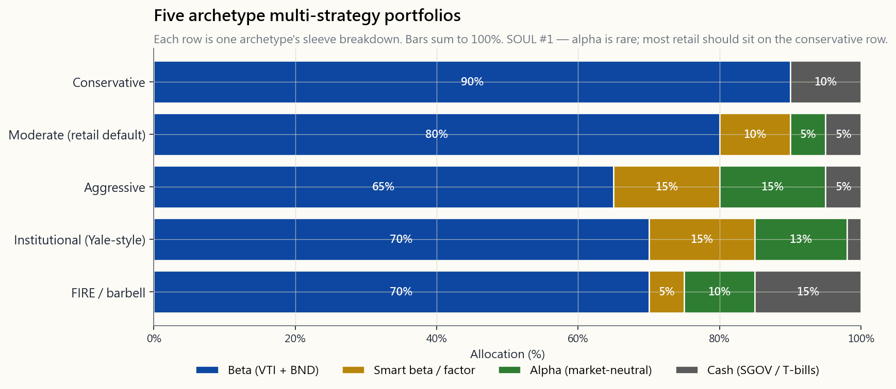
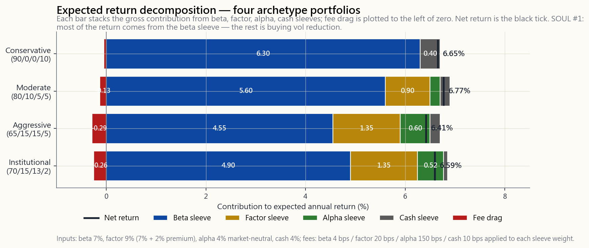

# 第24週：多策略——將貝塔、因子及阿爾法組合整合成一本投資組合

---

## 第一部分：閱讀章節

---

### 1. 為何此課題重要

本課為L2核心總結。過去二十三週，課程一直逐一交付各個組件：第4週的貝塔、第23週的因子傾斜、第13週的多空阿爾法、第16週的板塊輪動、第10週及第18週的戰術性覆蓋策略。本週的任務，就是將這些組件重新整合成一本你實際管理的投資組合。

你需要這堂綜合課，原因有四。

1. **大多數嘗試整合策略的散戶投資者都做錯了。** 他們將五個100%股票策略堆疊在一起——全市場加價值傾斜、加股息傾斜、加超大型增長股、加「精選個股」——然後稱之為「分散投資」。實際上並非如此。這只是一本擁有五種費用結構的大型貝塔投資組合。真正的多策略，是將本質上截然不同的回報驅動因素結合起來——廣泛市場貝塔、聰明貝塔因子溢價，以及市場中性阿爾法——而非五種相同貝塔風險的變體。

2. **機構投資的框架已相當成熟，值得部分借鑑。** 捐贈基金式配置者大致採用70-80%貝塔、10-15%聰明貝塔、10-15%絕對回報的結構。這個框架本身無誤；然而對於大多數散戶而言，**執行方式**才是真正的問題——若要在六位數規模的投資組合上複製，費用很可能將回報侵蝕殆盡。L2的核心問題，在於哪些部分可以落地應用於散戶層面，哪些部分應留給機構。

3. **阿爾法極為罕見，大多數散戶不應追求。** 本課將坦誠面對這一點。預設建議是：80%或以上的讀者應直接採用純貝塔策略——第4週的60/40，或第12週的生命周期投資組合原型——止於此。多策略框架僅適用於那10-20%具備相應心態、時間、資金規模，且有紀律在策略失效時果斷停手的投資者。

4. **四級架構在更高層次再度適用。** 第16週的四個組合是板塊周期配置。本週則是**策略**配置：貝塔（實物/指數核心）、聰明貝塔（高級別——成熟因子溢價）、阿爾法（初級別——依靠技巧獲取）、以及戰術/自主判斷（探索層——充滿機遇與風險的倉位）。框架形態相同，應用領域不同。

本週將所有知識融會貫通。新增的只有一張圖——分組合別的堆疊條形圖——以及一個新工具——策略混合器，讓你設定每個組合的比重，即時查看預期回報、波動性及夏普比率。本課新理論較少，重在綜合應用。

---

### 2. 你需要掌握的知識

#### 2.1 三個（加一個）組合

一本多策略投資組合最多包含四個組合。清楚區分各組合，有助於你對每個部分所承擔的職能保持清醒認識。

| 組合 | 回報驅動因素 | 典型工具 | 預期回報 | 預期波動性 | 費用預算 |
|---|---|---|---:|---:|---:|
| **貝塔** | 市場本身 | VTI + BND，或60/40 | 約7%（名義） | 約10-12% | 0.03-0.05% |
| **聰明貝塔/因子** | 持續性因子溢價（價值、動量、質量） | VLUE、MTUM、QUAL、AVUV | 約8-9%（較貝塔高約1-2%） | 約13-15% | 0.15-0.30% |
| **阿爾法** | 基金經理/流程技巧——市場中性 | 多空股票、合併套利、市場中性基金 | 約3-5%絕對回報 | 約3-5% | 1-2%（通常另加績效費） |
| **戰術** | 自主判斷的市況/板塊/周期性押注 | 板塊交易所買賣基金（XLE、XLF等）、CTA趨勢跟蹤 | 區間寬廣，淨值常近0% | 8-15% | 0.10-1.0% |

有兩點結構性認識必須牢記。

**貝塔是成本最低的回報來源。** 四十年的指數投資已為大多數投資者買下大半張賬單。你從貝塔組合中挪出的每一元，必須在扣除所有費用及相關性效益後，仍能**賺回其更高的費用**，才有資格留在投資組合中。

**阿爾法的特性在於低相關性，而非高回報。** 機構願意為絕對回報策略支付「2%管理費加20%績效費」，**並非**因為這些策略的預期回報高於股票——事實恰恰相反。這筆賬之所以合算，是因為阿爾法組合與投資組合其他部分的相關性近乎為零——一個年回報3%、波動性4%、與年回報7%/波動性16%的貝塔投資組合相關性為零的組合，可大幅提升**整個投資組合**的夏普比率，儘管阿爾法組合本身的回報遠遜於股票指數。

#### 2.2 機構框架——為何70/10/10/10有效

耶魯、哈佛、挪威主權財富基金、加拿大退休金計劃，以及每一個大型捐贈基金式配置者，都趨向採用大致相同的結構：

| 組合 | 目標比重 | 此規模的理由 |
|---|---:|---|
| 貝塔（廣泛股票及存續期） | 70-80% | 預期回報最低廉，是衡量超額表現的基準線 |
| 聰明貝塔/因子傾斜 | 10-15% | 有文獻記載的溢價，費用低，可規模化，因子衰減風險低 |
| 絕對回報（阿爾法） | 10-15% | 分散工具，通過低相關性提升夏普比率，而非靠高回報 |
| 戰術/機會性 | 0-5% | 投資總監真正有高信心的自主判斷性覆蓋策略 |

本課底部的互動工具允許你設定這些比重，即時查看預期回報及夏普比率。

機構框架呈現**此形態**而非50/25/25，原因在於管治架構。即使再優秀的投資團隊，每年能形成的高信心判斷也是有限的。將阿爾法組合比重推高至15%以上，意味著要麼押注於欠缺信心的自主判斷，要麼對根本無法有效部署的資金支付績效費。70-80%的貝塔核心，正是對一個誠實命題的坦然承認：即便最精明的配置者，也無法以大部分資金持續跑贏市場。10-15%的阿爾法組合，才是他們認為真正具備優勢的部分。

#### 2.3 落地到散戶層面——80/10/10預設框架

機構框架落地到散戶層面時，需作出一項重要調整：以六位數資金規模管理阿爾法組合，**難度遠高於**以六十億美元規模管理。散戶的替代選擇並非「去找對沖基金」，而是以下三者之一：

1. **市場中性互惠基金或交易所買賣基金**（BTAL、MERFX、FTLS）。在散戶層面表達阿爾法組合最簡潔的方式。費用1-2%，滾動5年窗口的回報2-4%，與標普500的相關性確實較低。
2. **集中式純多頭組合**（主動研究的5-15隻個股，每隻倉位1-3%）。嚴格而言，這是高主動比率的股票組合，而非市場中性阿爾法。前提是你確實具備優勢——阿爾法極為罕見。
3. **有紀律的多空對沖股票組合**（第14週的對沖交易，加上一兩個覆蓋策略）。真正的阿爾法，但需要時間管理，並需要保證金賬戶。

散戶多策略預設框架：

| 組合 | 比重 | 工具 | 約費用 |
|---|---:|---|---:|
| 貝塔——廣泛美國股票 | 60% | VTI | 0.03% |
| 貝塔——債券 | 20% | BND或短期國債 | 0.03% |
| 聰明貝塔——因子傾斜 | 10% | VLUE、MTUM、QUAL、AVUV其中之一 | 0.15-0.25% |
| 阿爾法組合 | 10% | 集中精選個股**或**市場中性基金 | 0.5-2% |

若你無法清晰闡述因子傾斜及阿爾法組合的投資論據，兩者均應歸零，改為以75/25比例持有VTI及BND。這並非失敗，而是誠實的答案。大多數人並不具備阿爾法，本課並非鼓勵任何人自欺欺人。

下圖展示此框架與其他四種原型（保守型、穩健型、進取型、機構型、FIRE式槓鈴型）的對比，每行代表一種原型的組合構成。



#### 2.4 各組合的實際貢獻——分層回報視角

多策略投資組合的計算邏輯比表面上簡單。預期投資組合回報是各組合預期回報的加權總和；預期波動性則是考慮相關性後的加權波動性矩陣計算。直覺在於各組成部分。

以上述穩健型散戶框架（80%貝塔/10%因子/10%阿爾法/0%現金）為例，假設貝塔回報7%、因子回報9%（7%貝塔+2%因子溢價）、市場中性阿爾法4%：

```
各組合對投資組合回報的貢獻：
  貝塔組合：    80% × 7%  = 5.60%（總回報）
  因子組合：    10% × 9%  = 0.90%（總回報）
  阿爾法組合：  10% × 4%  = 0.40%（總回報）
                -------
  總回報：                 = 6.90%
  扣除費用：
    貝塔費用 0.04% × 80%  = -0.03%
    因子費用 0.20% × 10%  = -0.02%
    阿爾法費用 1.50% × 10% = -0.15%
                -------
  淨回報：                 = 6.70%
```

與100%持有VTI的純貝塔投資組合對比：7%總回報，扣除0.04%費用後為6.96%淨回報。多策略版本的**預期回報每年低0.26%**，尚未計算相關性帶來的任何收益。真正的收益體現於波動性：

```
全VTI投資組合（單一組合，波動性=16%）：              16.00%
穩健型框架（貝塔-因子相關性=0.95，
   貝塔-阿爾法=0.05，因子-阿爾法=0.10）：          約12.85%
```

這就是這筆交易的本質：以0.26%的回報讓步，換取約3個百分點的波動性下降。夏普比率從約7%/16%=0.44，提升至約6.7%/12.85%=0.52。儘管絕對回報更低，投資組合的風險調整表現**實際上更優**——因為阿爾法組合發揮了分散風險的作用，而因子組合所帶來的預期回報提升，也大致抵消了其自身費用。

下圖分解了四種原型的分層回報構成。



此圖的核心啟示：**無論其他組合多高明，絕大部分回報仍來自貝塔組合。** 因子增添幾十個基點，阿爾法再增添幾十個基點，費用大約侵蝕其中一半。淨收益約在零至30個基點之間——而採用多策略的全部理由，在於波動性的改善，而非回報的提升。

#### 2.5 為何大多數散戶不應採用此策略

阿爾法極為罕見。大多數建立多策略投資組合的散戶，至少會犯以下其中一個錯誤。

1. **他們在根本沒有阿爾法的領域運作阿爾法組合。** 若你的多空損益在三年內與零無統計顯著差異——在散戶規模下幾乎無一例外——那你實際上是在為一個拖累回報的策略支付真實費用、耗費真實精力。
2. **他們混淆複雜性與分散投資。** 持有十隻基金，並不等同於擁有十個回報驅動因素。其中三隻可能都是以不同包裝呈現的標普500指數。
3. **他們停不下來。** 當阿爾法組合某年跑輸3%，正確的做法是按既定策略繼續執行（或依預設標準關閉組合）。大多數散戶兩者皆做不到——他們要麼加倉，要麼恐慌性清倉，兩者皆錯。
4. **他們低估了稅務成本。** 阿爾法組合的換手率高於貝塔組合。在30%以上的邊際稅率下，稅務拖累往往大於總阿爾法優勢。

誠實的決策樹：

- 你的投資組合規模是否達到六位數（中段以上），且每週有充裕時間管理？若否，請直接採用純貝塔，止於此。
- 你是否設有「阿爾法組合失效，關閉」的預設統計標準？若否，你持有的不是一個組合，而是一個興趣嗜好。
- 你是否追蹤扣除費用、稅務及時間成本後的真實表現，而非只看總回報？若否，請回到第一點。

三個問題的答案均為「是」，§2.3的框架則屬合理。若任何一個答案為「否」，第24週應是你放下多策略投資組合的時刻。這並非失敗。令L1畢業生財富穩健的那份謙遜，正是讓大多數L2躍躍欲試者最終虧蝕而歸的原因所在。

#### 2.6 四級架構的再度應用

第16週，四個層級是**板塊周期**配置——實物、高級別、初級別、探索——貫穿整個商品牛市周期。本週，同樣的框架在更高層次重現，應用於**策略本身**。

| 層級 | 板塊周期（第16週） | 策略架構（本週） |
|---|---|---|
| **實物** | 商品本身 | 市場——廣泛指數貝塔 |
| **高級別** | 成熟生產商 | 聰明貝塔——有文獻記載的因子溢價 |
| **初級別** | 中型生產商 | 阿爾法——市場中性技能組合 |
| **探索** | 尚未盈利的勘探商 | 戰術——自主判斷的市況/板塊押注 |

兩個方向傳遞的啟示相同。大部分資金置於最低波動性、最高流動性、最基本的層級（實物/貝塔）。每個更高的層級規模更小、更依賴技巧、波動性更高。探索/戰術層充滿機遇，也是大多數爆倉的源頭，因此其規模應設定在即使全數虧損也不影響你生活的水平。金字塔形態——寬廣底部、收窄頂部——是穩健的結構。倒置金字塔——大部分資金置於探索層——正是「市場在你失去償付能力之前，可以持續非理性」這句話化為個人傳記的路徑。

槓鈴型是這個金字塔的特殊情形：中間層（因子及阿爾法）趨近於零，投資組合兩端分別是最保守的部分（現金及債券）與最進取的部分（集中多頭或阿爾法）。一個對FIRE退休計劃有興趣、且人力資本風險較高的投資者，往往採用此形態：30%現金加50% VTI加20%集中持股。這在嚴格意義上並非機構式多策略，但它是一個連貫的策略架構——對應其情況而言，也是一個誠實的選擇。

---

### 3. 常見誤解

1. **「更多組合等於更多分散投資。」** 只有在各組合相關性較低的情況下才成立。五種美國股票的變體並非五個組合；那是一個組合套上五層包裝。

2. **「阿爾法組合能提升回報。」** 阿爾法組合通過降低相關性來提升夏普比率，而非通過提高回報。阿爾法組合的預期回報通常**低於**貝塔組合。

3. **「只要基金經理夠好，費用就值得。」** 只有在扣除費用、稅務及相關性效應後的阿爾法仍為正值時，這才成立。大多數主動管理至少在其中一項測試中失敗。

4. **「聰明貝塔就是阿爾法。」** 並非如此。聰明貝塔是有文獻記載的因子溢價（價值、動量、質量、低波動性）。它是對某個**因子**的貝塔，而非基金經理技巧所產生的阿爾法。其費用應為0.15-0.30%，而非1-2%。

5. **「捐贈基金跑贏市場是因為另類投資。」** 捐贈基金跑贏60/40，部分原因是另類投資，部分是流動性溢價，部分是規模優勢。散戶獲得了另類投資，卻沒有流動性溢價，也沒有規模，這正是散戶版「另類投資」基金往往跑輸機構版同類產品的原因。

6. **「我會一直運作阿爾法組合，直到它不再有效為止。」** 大多數投資者根本無法判斷阿爾法組合是已經失效，還是僅處於正常的回撤期。沒有預設標準，「不再有效」這個門檻就會不斷被重新界定。

7. **「機構框架是普遍最優的。」** 它是針對機構管治而優化的——長期投資視野、大規模資金、專業管理、激勵一致的績效費結構。這些條件在散戶層面均不具備。在不具備相應條件的情況下複製框架形態，是一種貨物崇拜。

8. **「市場中性基金並不真正市場中性。」** 許多基金確實如此——其因子敞口及做空波動性的敞口，在市場壓力期間以隱性貝塔的形式顯現。請仔細閱讀持倉報告，查看其在2008年、2020年及2022年的回撤情況。若該基金在上述任何一段期間與標普500同向波動，其「中性」的說法便存疑。

9. **「若你有優勢，戰術組合應佔30%以上。」** 不應如此，而且你未必真有優勢。即使是有文獻記載戰術優勢的基金經理，也將戰術組合規模設在個位數百分比。原因在於管治：你高估了自己的信心，也高估了自己的勝率；較小的倉位是最廉價的糾正機制。

10. **「多策略意味著你不會虧錢。」** 它意味著你在預期上每單位波動性的虧損會較少。在市場壓力期間——2008年、2020年3月——相關性趨向一致，多策略投資組合的回撤幾乎與純貝塔投資組合同樣劇烈。分散效果在平常時期有效，在你最需要它的時候卻往往失效。波動性尾部主導全局，而市場在你失去償付能力之前可以持續非理性——這兩種情況都集中在那些窗口期發生。

---

### 4. 問答環節

**問：我的投資組合規模需要達到多少，多策略才有意義？**
答：大致需要達到25萬美元以上。低於這個規模，費用拖累及時間成本將佔主導。一個5萬美元的投資組合，其10%阿爾法組合每年需為5,000美元的資金支付75至150美元的費用——費用在交易啟動前已將阿爾法侵蝕殆盡。

**問：退休人士應該採用多策略嗎？**
答：大多數情況下不應該。阿爾法組合在人生中最不適合承擔額外不確定性及稅務拖累的階段，帶來了波動性風險與稅務成本。有意獲取分散效益的退休人士，應通過債券及通脹掛鉤債券實現（第5週、第18週），而非透過市場中性對沖基金。

**問：如何為聰明貝塔組合選擇因子？**
答：選擇你能用一句話清晰闡述其機制、且已研究過其回撤特徵的那個因子。價值因子（VLUE、AVUV）適合持續均值回歸。動量因子（MTUM）適合持續趨勢跟蹤——但需接受2009年及2020年的動量崩潰。質量因子（QUAL）費用最低、回撤最小，但因子溢價最弱。多因子（USMV、BAB）在犧牲因子純粹性的前提下，實現跨因子分散。

**問：我可以用槓桿放大阿爾法組合嗎？**
答：技術上可行，實操上不建議，除非你已在壓力測試中以無槓桿版本存活過一段時期。市場在你的槓桿倉位失去償付能力之前可以持續非理性——這是警示。在你尚未充分信任的策略上加槓桿，是經典的爆倉路徑。

**問：在散戶層面，運作阿爾法組合最簡便的方式是什麼？**
答：以投資組合5-10%的比重持有單一市場中性基金（BTAL、MERFX、FTLS，或合併套利類型的基金）。費用較高但可預期，與股票的相關性確實較低，且無需逐筆作出交易決策。

**問：這個框架在2026年的市場環境下仍然有效嗎？**
答：框架形態有效，但輸入數據需要更新。在短期國庫券利率達4%以上的環境下，現金組合不再是回報拖累——債券組合的收益率亦高於2010年代。阿爾法組合的門檻相應提高：一隻淨回報3%的市場中性基金，對比5%的現金，實際上**落後**200個基點。現金門檻改變了整體算式；每當短端利率重新定價時，均應重新評估。

**問：如何對多策略投資組合進行再平衡？**
答：每年進行一次日曆式再平衡，並設置容忍區間（例如任何組合偏離目標超過5個百分點時觸發再平衡）。切勿依靠直覺進行再平衡。第7週涵蓋具體操作細節。

**問：若阿爾法組合某年表現出色，是否應該加大比重？**
答：不應。單年度表現對下一年的阿爾法幾乎沒有預測能力。機構的紀律是在出色年份**縮減**阿爾法組合（因為你已更接近可有效部署資金的上限），而非加大比重。

**問：這個框架如何與只投資美國市場的策略銜接？**
答：銜接順暢。貝塔組合是VTI加BND，均為美國市場。因子組合是在美國上市的因子交易所買賣基金（VLUE、MTUM、QUAL）。阿爾法組合使用在美國上市的市場中性基金，或美國本地個股的多空交易。框架的任何部分均不需要海外上市敞口，從而保持托管、稅務及披露的簡潔性。

**問：每週應花多少時間管理這個投資組合？**
答：若運作主動阿爾法組合，實際需要每週2-4小時；若阿爾法組合以單一市場中性基金表達，則每月約30分鐘；若決定採用純貝塔，則時間為零。請誠實判斷自己屬於哪個類別。

**問：L3版本的這個課題是什麼？**
答：L3在此基礎上加入衍生工具——用於尾部對沖的期權覆蓋策略（第47週）、波動性套利（第49週），以及通過期權及保證金更有效率地實現相同風險敞口的稅務優化表達方式。L3的投資組合保持相同的四個組合架構，只是每個組合的表達方式更具資本效益。先完成L2。

---

## 第二部分：YouTube 影片腳本

---

**影片標題：** 多策略投資組合——捐贈基金如何分層構建貝塔、因子及阿爾法（以及為何大多數散戶不應效仿）

**目標片長：** 約18分鐘

**主持人：** 陳馬、小魚

---

**開場（0:00-1:30）**

[VISUAL: 標題卡「第24週——多策略：L2核心總結」]

**小魚：** 二十四週了。陳馬，這一週終於是我們承諾過的、把所有東西串聯起來的一週。

**陳馬：** 沒錯。我們花了六個月逐一交付各個組件。第四週的貝塔、第二十三週的因子傾斜、第十三週的多空阿爾法、第十六週的板塊輪動。本週我們把這些組件重新整合成一本你實際管理的投資組合。這是L2的核心總結。

**小魚：** 那先把最重要的警示說清楚。

**陳馬：** 阿爾法極為罕見。對於大多數正在收看的觀眾，誠實的答案是：止於貝塔組合。持有VTI加BND，每年再平衡一次，然後去過你的生活。本集接下來介紹的所有內容，只適用於那10至20%具備足夠規模、時間，以及——最重要的——在策略失效時不自欺欺人的紀律的L2畢業生。

**小魚：** 清楚了。在這個前提下，讓我們從每個人都想複製的機構框架說起。

---

**第一部分——三個加一個組合（1:30-4:30）**

[VISUAL: image/week24_sleeve_breakdown.png]

**陳馬：** 每本多策略投資組合最多包含四個組合：貝塔、聰明貝塔、阿爾法、戰術。螢幕上的條形圖展示五種原型投資組合——保守型、穩健型、進取型、機構型，以及FIRE式槓鈴型——各自按組合分解。

**小魚：** 逐一說說機構型那行。

**陳馬：** 70%貝塔、15%因子、13%阿爾法、2%現金。這大致就是耶魯、哈佛、挪威主權財富基金及加拿大退休金計劃共同趨向的形態。這並非巧合——它們都是在相同約束條件下回答同一個問題。

**小魚：** 為何趨向這個形態？

**陳馬：** 因為貝塔是成本最低的回報來源——指數基金收費三至五個基點。每一元從貝塔挪出，都必須在相關性效益扣除後賺回更高的費用；而聰明貝塔組合的前10至15%，以及阿爾法組合的前10至15%，才能通過這個數字測試。超出這個範圍，你支付的是溢價費用，換取的是遞減的分散效益。

**小魚：** 那戰術那行呢？

**陳馬：** 那是自主判斷性的覆蓋策略——投資總監真正的高信心判斷。它保持在個位數百分比，是因為沒有任何投資團隊每年能形成超過幾個真正的信心判斷，而假裝有，只是昂貴的雜音。

---

**第二部分——落地到散戶層面（4:30-7:30）**

**小魚：** 現在說說最實際的部分。散戶無法複製耶魯的阿爾法組合。那麼機構框架在六位數規模下實際上是什麼樣子？

**陳馬：** 形態相同，工具不同。散戶預設框架是：60% VTI加20% BND作為貝塔核心；10%因子——選一個，價值、動量或質量，不要三個疊加；10%阿爾法組合——在散戶層面，阿爾法是以下三者之一：市場中性互惠基金或交易所買賣基金、真正進行研究的集中式純多頭持倉，或是有紀律的多空對沖股票組合。

**小魚：** 這三者中哪個最切實可行？

**陳馬：** 對大多數人而言，市場中性基金。BTAL、MERFX、FTLS這類產品。費用1至2%，滾動5年窗口的回報2至4%，與標普500的相關性確實較低。你不需要自己作交易決策，而是付費請基金經理代勞，分散效益會體現在投資組合的夏普比率上。

**小魚：** 那集中式純多頭組合呢？

**陳馬：** 若你確實具備優勢，這是可行的——但阿爾法極為罕見。如果你能對5至15隻個股清晰表達投資論據、每隻倉位設為1至3%、且有時間持續跟蹤，這就是一個合理的阿爾法組合。大多數嘗試此路線的人，實際上並不具備他們以為自己擁有的優勢。三年的損益記錄會告訴你答案。若你的集中持倉在扣除費用及稅務後，三年內無法跑贏標普500，那這個組合並不具備阿爾法——只是一個興趣嗜好。

---

**第三部分——各組合的實際貢獻（7:30-11:00）**

[VISUAL: image/week24_layered_returns.png]

**小魚：** 這張圖將預期回報按組合分解。請逐一說明。

**陳馬：** 四種原型——保守型、穩健型、進取型、機構型。每條形的分段分別是：貝塔貢獻、因子增益、阿爾法增益，以及費用拖累。黑色刻度線是淨回報。

**小魚：** 那個出乎意料的發現是什麼？

**陳馬：** 無論其他組合表現如何，絕大部分回報仍來自貝塔組合。看穩健型那行：貝塔貢獻約5.6%。因子增添約20個基點。阿爾法增添約40個基點。費用拿走約20個基點。淨回報約6.7%，而純貝塔扣除四個基點費用後約為6.96%。

**小魚：** 所以多策略版本的預期回報反而**更低**？

**陳馬：** 低26個基點。這筆交易換來的不是回報，而是波動性。全VTI投資組合的年化波動性是16%。穩健型框架約13%。你讓出四分之一個百分點的回報，換取三個百分點的波動性下降，夏普比率從0.44提升至0.52。這就是整個交易的核心。

**小魚：** 進取型和機構型呢？

**陳馬：** 形態相同，幅度更大。支付更多費用，獲得更多分散效益。淨回報大致相當——這也並非巧合。扣除費用及相關性後，同等風險層級的投資組合之間差距甚小。你真正優化的是風險調整後的回報，而非絕對回報。

---

**第四部分——為何大多數散戶不應嘗試（11:00-14:00）**

**小魚：** 說說紀律的那部分吧。為什麼大多數散戶不應這樣做？

**陳馬：** 四個原因，都不是理論上的——是我實際見到會發生的情況。

**小魚：** 第一個。

**陳馬：** 他們在根本沒有阿爾法的領域運作阿爾法組合。三年損益記錄是唯一的測試。若扣除費用及稅務後三年內無法跑贏指數，你沒有阿爾法組合，只有一個昂貴的興趣嗜好。

**小魚：** 第二個。

**陳馬：** 他們混淆複雜性與分散投資。持有十隻基金不等於擁有十個回報驅動因素。我見過一些散戶投資組合，表面看起來多元分散，但在每一次回撤中與標普500的相關性都是0.9。

**小魚：** 第三個。

**陳馬：** 他們停不下來。阿爾法組合表現不佳，正確的做法是按策略繼續執行，或依預設標準關閉。大多數散戶兩者皆做不到——他們要麼加倉，要麼恐慌性清倉，兩者皆錯，往往還在同一年內都犯。

**小魚：** 第四個。

**陳馬：** 他們低估了稅務成本。阿爾法組合換手率高，集中持股也是。在30%邊際稅率下，5%阿爾法組合的稅務拖累侵蝕了1.5%的總回報。對比買入持有的貝塔組合——可無限期遞延資本增值稅——阿爾法同時在對抗費用**和**稅務。解決方案與本課程其他部分一致——通過長期期權及保證金表達策略，讓稅務時機為你所用。這在衍生工具課程中同樣適用。

---

**第五部分——四級架構的再度應用（14:00-15:30）**

**陳馬：** 四個層級。我們在第十六週以板塊周期框架教授它——實物、高級別、初級別、探索——貫穿整個商品牛市。同樣的框架在這裡以更高層次重現，應用於策略本身。

**小魚：** 對應關係是什麼？

**陳馬：** 實物對應市場本身——指數、貝塔。高級別對應聰明貝塔——成熟的因子溢價。初級別對應阿爾法——基金經理技能組合。探索對應戰術——自主判斷的覆蓋策略。

**小魚：** 核心啟示是什麼？

**陳馬：** 金字塔形態。寬廣底部，收窄頂部。大部分資金置於最基本、最低波動性、費用最低的層級。每個更高的層級規模更小、更依賴技巧、波動性更高。探索層充滿機遇，也是大多數爆倉的源頭，你設定的倉位規模，必須是即使全數虧損也不影響你生活的水平。倒置金字塔——大部分資金押在戰術組合上——正是「市場在你失去償付能力之前可以持續非理性」這句話化為個人傳記的路徑。

---

**第六部分——互動工具（15:30-17:00）**

[VISUAL: 切換至互動工具 interactive/week24_strategy_blender.html]

**小魚：** 本週工具——策略混合器。

**陳馬：** 四個滑桿：貝塔、因子、阿爾法、現金，總和為一百。頁面即時重新計算預期投資組合回報、預期波動性及預期夏普比率，並已內置阿爾法組合的費用拖累。這個工具的目的，是讓你親自感受各項取捨，驗證圖表中的直覺——貝塔組合承擔大部分回報工作，阿爾法組合購買的是波動性下降而非回報提升，以及將阿爾法組合比重推高至20%以上時算式開始失效，因為費用壓倒了分散效益。

**小魚：** 試試機構型預設和FIRE型預設。

**陳馬：** 機構型——70%貝塔、15%因子、13%阿爾法、2%現金。夏普比率約為0.55。FIRE槓鈴型——70%貝塔、5%因子、10%阿爾法、15%現金。夏普比率相近，波動性明顯更低，預期回報也明顯更低，因為要承受那部分現金的拖累。不同的問題，有不同的最優解。

---

**結語（17:00-18:00）**

**小魚：** 總結一下這個L2核心課題。

**陳馬：** 三個要點。第一——機構框架真實、清晰，且可以移植。70至80%貝塔，10至15%聰明貝塔，10至15%阿爾法。第二——數字告訴我們，大部分回報來自貝塔組合，阿爾法組合換取的是波動性下降，而非回報提升。第三——大多數嘗試此策略的散戶，最終將這筆交易輸給費用、稅務及紀律缺口。阿爾法極為罕見，這是規律。除非你具備規模、時間，以及預設的關閉標準，否則不要運作阿爾法組合。

**小魚：** 那下週呢？

**陳馬：** 第二十五週——L3啟動。我們開始衍生工具課程。期權。期貨。以更具資本效益的方式表達所有這些策略的工具包。同樣的四個組合架構，以不同的方式表達。

**小魚：** L2里程碑到達。

**陳馬：** L2完結。如果你走到了這裡，你已具備管理一本完整多策略投資組合的工具。現在花一年時間**不去**運作它——先跑純貝塔，觀察自己的紀律，只有在你能證明自己沒有搞砸最簡單的版本之後，才回來開始L3。市場在你失去償付能力之前可以持續非理性。帶著這句話結束L2。

[VISUAL: 結束卡「第25週——L3啟動：期權（一）」]