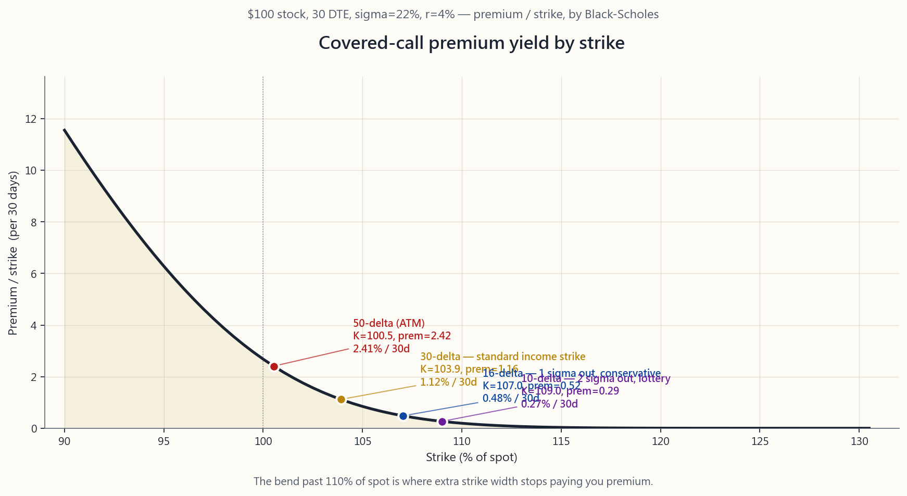
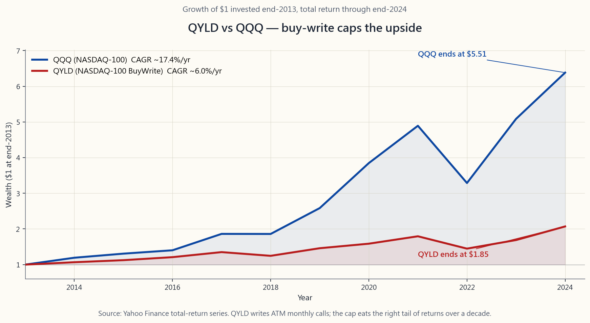

# 第二十七週：備兌認購期權深度剖析——行使價選擇、引伸波幅收割與滾輪策略

---

## 第一部分：閱讀內容

---

### 1. 為何這至關重要

第26週將沽出認購期權重新定義為「有薪限價賣盤」。這種思維轉變是必要的，但並不足夠。真正月復一月執行備兌認購期權的投資者會很快發現，這個*策略*本身很簡單，而*參數選擇*才是一切。兩位投資者在同一個SPY倉位上沽出備兌認購期權，若他們在行使價、期限及沽出時機的選擇上有所不同，五年後的結果可能截然各異。本週的重點正在於此。

**首先，行使價決定整個損益結構。** 30 delta的認購期權所收取的期權金大約是10 delta期權的三倍，但被行使的機率也大約是三倍。兩者本身都沒有「對錯」之分。正確的選擇取決於你是否真的樂意以該行使價出售股份，以及額外的期權金是否足以補償你所放棄的上行潛力。大多數散戶投資者只盯著期權金收益率，而忽略了這筆交易的另一面，結果偏偏在最需要享受上行回報的月份，股份被悉數行使走。

**其次，期限並非中性因素。** 時間值衰減（Theta）——即期權外在價值的衰減速率——是非線性的。一張30天期的期權並不會以60天期期權兩倍的速度衰減；實際上每天的衰減速度約為1.4倍。這種非線性正是30至45天到期日是收息沽出者「甜蜜區間」的原因。比這更短，相對於gamma風險而言期權金太少；比這更長，持倉期間放棄給對方的Theta又太多。

**第三，引伸波幅排名（IV-rank）告訴你何時沽出、何時等待。** 期權金並非免費午餐，它是承擔引伸波幅另一面的補償。當IV-rank高企，你能以豐厚報酬沽出波動性。當IV-rank低企——市場自滿、波動率指數低至十幾——備兌認購期權的期權金幾乎縮水至無，而放棄上行潛力的代價卻毫不遜色。陳馬的第六原則正在於此：*尾巴搖狗*，而引伸波幅就是那條尾巴的價格。

**第四，稅務可能蠶食表面收益率。** 在應稅帳戶中執行備兌認購期權策略，可能會將原本屬於長期資本增值（稅率約15-20%）的回報，轉化為以短期資本增值（稅率最高約37%）徵稅的期權金收入。對大多數讀者而言，此策略應置於個人退休帳戶（IRA）或其他稅務優惠帳戶中運作。長期投資中最大的隱性費用是稅，而在錯誤帳戶中執行高換手率的收息覆蓋策略，是你所能做到的最低稅務效率之事。

本課將教授這套策略的紀律版本：如何用 delta 挑選行使價、如何用 theta 選擇期限、如何解讀 IV-rank、如何展期，以及備兌認購期權在槓鈴策略中的定位。

---

### 2. 你需要掌握的知識

#### 2.1 以 Delta 選擇行使價

按*價格*挑選行使價是業餘做法，按*delta*挑選才是機構標準。Delta同時具備三種實用的解讀方式，這正是期權交易部門將其視為通用標尺的原因：

1. **對沖比率。** 0.30 delta的認購期權，每當股票移動1.00美元，期權相應移動約0.30美元（短距離內適用）。
2. **到期時處於價內的概率近似值。** 0.30 delta的認購期權，到期時處於價內的機率約為30%。（這在技術上是*風險中性*概率，而非現實世界概率，但對於短期行使價而言差異甚微。）
3. **按波動性調整後的價外程度近似值。** 0.50 delta對應等價；0.16 delta大約對應一個標準差價外；0.025 delta大約對應兩個標準差價外。

最後一種解讀最為關鍵。**0.16 delta並非神奇數字——它代表1σ。** 一個1σ價外的認購期權，按構造而言，到期時落於價內的機率約為16%。這正是「16 delta認購期權」成為保守型收息沽出者預設選擇的原因。

以下是一個股價100美元、σ=22%、30天到期日的股票，備兌認購期權沽出者的四個標準delta水平：

| Delta | 行使價（約）| 期權金（約）| 期權金／行使價 | 年化收益 | 被行使機率 |
|------:|----------:|----------:|-------------:|---------:|---------:|
| 0.50  | $100       | $2.55      | 2.55%         | 約31%    | 約50%    |
| 0.30  | $103-104   | $1.35      | 1.31%         | 約16%    | 約30%    |
| 0.16  | $107       | $0.55      | 0.51%         | 約6.2%   | 約16%    |
| 0.10  | $109-110   | $0.30      | 0.27%         | 約3.3%   | 約10%    |

這張表格中的轉折點，正是本課的核心所在。從0.10上升至0.16 delta，期權金幾乎翻倍，但被行使風險僅增加6個百分點。從0.30上升至0.50 delta，期權金再度翻倍，但被行使風險卻額外增加20個百分點。**30 delta認購期權是標準收息行使價**，因為它位於該曲線的有利轉折點。16 delta認購期權則是真正不想出售股份的沽出者的保守預設選擇。

上圖展示了一隻股價100美元、σ=22%、30天到期日的股票的完整曲線。留意曲線在現貨價格110%以上如何趨於平坦——一旦超過1σ價外，你便是以大量努力換取微薄期權金。

#### 2.2 期限——為何選擇30至45天到期日

Theta是每個沽出期權金策略的隱藏引擎。短期期權的價值大致按到期時間的平方根衰減，意味著30天期期權所含外在價值約為60天期期權的70%。推論如下：通過每月沽出30天期認購期權並按月展期，即使每張合約的表面期權金較小，所收取的年化期權金也約比沽出60天期期權並每兩個月展期高出約*1.4倍*。

然而，你不能將這個邏輯推至週期期權而不付出代價。週期期權具有巨大的gamma——股票的小幅波動可在一天內令期權的delta翻倍甚至三倍，這意味著股票在週三短暫突破你的行使價、週五收回，仍可能令你被行使。無論是BXM指數的方法論，還是我與多個收息交易部門的交流，大家認同的機械甜蜜點均為**30至45天到期日**。

在這個區間內，兩個合理的預設選擇為：

- **月度週期（28至35天到期日）。** 在到期週五沽出下一個月度到期日的期權。每年十二次。與大多數個股的月度業績日曆吻合。
- **45天到期日滾動。** 沽出45天到期日，於21天到期日時展期。每年約九次，每次被行使風險略低，但年化期權金也略少。

兩者均合理可行。選定一個，保持紀律。

#### 2.3 IV-rank——何時沽出、何時等待

IV-rank衡量當前引伸波幅在過去52週範圍內所處的位置。IV-rank為50，表示當前引伸波幅恰好處於中位數；IV-rank為90，表示接近高位；IV-rank為10，表示接近低位。

規則比大多數人想象的更清晰。**當IV-rank高於30時沽出期權金；低於30時等待。** 期權金是承擔波動性另一面的補償。當波動性便宜（IV-rank低），你為幾乎沒有價值的上行上限買單；當波動性高企（IV-rank高），你因承擔同樣的上行上限而獲得豐厚報酬。

一個實際含義：2017年平靜市場中SPY的備兌認購期權年化收益率約為4%；而在2022年底，波動率指數高達20多，同一策略的年化收益率約為14%。行使價相同、delta相同，卻是截然不同的交易。無視IV-rank、每月機械沽出的投資者，所收割的*優勢*比他們自以為的更差。

這是「尾巴搖狗」的實踐版本：尾巴（引伸波幅）就是那條狗。盯緊IV-rank，而非股票價格。忽視IV-rank的備兌認購期權沽出者，就如同忽視價格的價值投資者——無論市場提供什麼條件，他們都在做同一筆交易。

#### 2.4 展期——兩條規則

當股票接近你的行使價時，你有三個選擇：接受行使、買回認購期權，或展期。展期是指買回當前認購期權，同時沽出一張期限更長、行使價可能更高的新期權。做得好的話，展期讓你在不實現標的股份收益的情況下維持倉位（與稅務規劃相關——你希望保留股票部分的長期資本增值處理）。

**規則一：當認購期權處於價內而你不希望被行使時，向上並向外展期。** 買回當前的價內行使價，沽出期限更長的更高行使價。通常需要新期限至少比當前長一個週期（例如，將30天價內期權展至更高行使價的60天期權），才能以收取期權金而非支付期權金的方式展期。若無法以收取期權金的方式展期，則接受行使——付錢捍衛備兌認購期權幾乎總是比以原有行使價被行使更差的交易。

**規則二：當股票大幅下跌、認購期權深度價外時，向下並向外展期。** 以幾分錢買回當前接近毫無價值的認購期權，沽出期限更長的更低行使價。這鎖定了原有期權金的大部分，並重置倉位以收取新的期權金。這也是備兌認購期權在平淡至下行市場中發揮作用的操作——隨著股票下漂，你不斷將行使價下調。

第三個選項——僅向外展期、維持相同行使價——很少是正確的選擇。若認購期權處於等價或接近等價，延伸相同行使價只是將行使決定推遲30天，通常只換取微薄的期權金收入。更好的做法是接受行使（股份反正都會被行使）或向上並向外展期以獲得真正的喘息空間。

#### 2.5 稅務處理與帳戶選擇

在美國應稅帳戶中，沽出認購期權所收取的期權金被視為短期資本增值，除非合約持倉超過一年——而在30至45天到期日的沽出策略中，這幾乎從不發生。對頂稅階投資者而言，聯邦稅率為37%加上州稅，而標的股份若單純持有所獲得的長期資本增值稅率為20%（加上3.8%的淨投資收益稅）。這意味著粗略而言，表面期權金的一半流向了稅務。

此外還需注意**行使機制**。若股份被行使走，股票部分的收益根據*該批股份*的持有期間確認，而非期權的持有期間。若股份已達長期持有期間，股票增值部分仍享有長期資本增值待遇。然而，期權金本身仍為短期資本增值。

還有一個陷阱：根據美國稅局的「合格備兌認購期權」規則，若行使價過深入價內，在持倉不足一年的股票上沽出的備兌認購期權，可能會暫停持有期間計時器。機械解決方案是：對於持倉未滿一年的股份，只沽出價外認購期權。

簡潔的解決方案是稅務帳戶錨定：**在IRA或401(k)中執行備兌認購期權策略，而非在應稅帳戶中。** 所有期權金均遞延納稅（或在羅斯帳戶中免稅），行使不產生應稅事件，整個策略靈活性——展期、調整行使價、接受行使——均可自由運用而無需承擔稅務摩擦。對於應稅帳戶，天平更傾向於單純持有股份，並在多年後收割長期資本增值。

#### 2.6 買入沽出型交易所買賣基金與自主管理——為何QYLD跑輸QQQ

美國最大的備兌認購期權交易所買賣基金包括QYLD（Global X NASDAQ 100 BuyWrite，規模約80億美元）和JEPI（JPMorgan Equity Premium Income，規模約330億美元）。它們將這個策略推銷為「高收益兼備下行緩衝」。收益率是真實的——QYLD每年派息約11-12%。問題在於交易所買賣基金的機制悄然侵蝕了上行潛力。

QYLD**每月在整個NASDAQ 100投資組合上沽出等價認購期權**。等價意味著delta約0.50——每個月，策略幾乎封頂了全部上行潛力。在2014年至2024年間，QYLD年化總回報約為6%，而簡單持有QQQ的年化回報約為17%。QYLD的投資者收到了表面收益率，而基金的資產淨值在十年間由於數學效應的複利作用而緩緩下滑。QYLD的資產淨值在2014年約為25美元；2026年初約為17美元。

JEPI的結構侵略性較低——它使用類似在標普500指數上沽出5至10%價外認購期權的股票掛鈎票據——因此上行上限較為溫和。過去十一年的年化回報約為9-10%，而標普500交易所買賣基金約為13%，但回撤明顯較小。對於希望平穩運作的退休人士而言，JEPI是合理的產品；QYLD在我看來是一個披著高收益外衣的結構性劣質產品。

自主執行策略的意義，正在於**你掌控行使價和期限**。買入沽出型交易所買賣基金必須使用固定的機械規則，因為它們管理的是數十億美元的他人資金，無法在IV-rank低迷的月份暫停沽出。你可以。這種靈活性正是自主操作的備兌認購期權長期跑贏買入沽出型交易所買賣基金的全部原因。

#### 2.7 滾輪策略——第30週預覽

以下是將第26、27、28週串聯起來的策略，稱為「滾輪策略」，第30週將為此專設一課詳細講解。

1. 確定一隻你樂意以折讓價買入的股票。
2. 以目標買入價沽出現金擔保認沽期權（第28週）。
3. **若被行使**（你買入了股份），隨即每月對股份沽出備兌認購期權，直至股份被行使走。
4. **若被行使走**（股份以高於行使價出售），返回第2步。

滾輪策略是價值投資者一直以手工方式操作的機構版本：低於內在價值買入，高於內在價值賣出。期權只是讓你在兩端等待時都獲得報酬。對於一隻你真心希望以90美元買入、以115美元賣出的股票，滾輪策略純粹從期權金即可產生12-18%的年化收益，加上期間的股票損益。這是第25至30週正在悄然引導的目的地。

備兌認購期權是滾輪策略的其中一條腿，正是本課所教授的策略。在此掌握它，在第28週掌握現金擔保認沽期權，第30週便只是組裝說明書。

#### 2.8 完整示例，由頭到尾

你持有100股SPY，成本為480美元，當前價格510美元。IV-rank為45——尚可接受，不算豐厚也不算偏低。

- **行使價選擇。** SPY 30 delta認購期權，30天到期日，為522美元行使價。期權金約5.80美元。收益率 = 5.80 / 522 = 30天內1.11% = 年化約13.5%。
- **你所同意的條款。** 若SPY在30天後收於522美元以上，你的股份以522美元被行使走。加上5.80美元期權金，有效售出價為527.80美元。相對於480美元成本，這是+9.96%的收益——一個你樂意接受的結果。
- **若SPY維持在522美元以下。** 你保留580美元期權金，並對同一批股份沽出新一張30天期認購期權。每年十二次 × 1.11% = 年化期權金收益約13%，疊加在SPY正常的股價升幅和股息之上。
- **若SPY在兩週內急升至545美元。** 你的認購期權現已深度價內，距到期尚有約14天。你向上並向外展期至下個月的540美元行使價，收取少量期權金。你放棄了522至540美元之間的升幅（約3.4%的上行潛力），但保持倉位開放並避免了被行使。
- **若SPY下跌至470美元。** 你的認購期權接近毫無價值。你以0.20美元買回，鎖定5.60美元的已實現期權金，並在下個月對你的股份以485美元行使價沽出新的認購期權。你現在正對較低的股票收取新的期權金，這正是該策略所標榜的緩衝作用。

這就是整個策略。本課末尾的互動工具讓你調整所有這些參數。

---

### 3. 常見誤解

1. **「30 delta對所有人都是正確的行使價。」** 對於無強烈方向性看法的收息型沽出者，這是正確的行使價。若你不希望出售股份，就沽出16 delta。若你購入這隻股票正是為了對其沽出認購期權，且樂意以行使價出售，就沽出50 delta。行使價並無放諸四海皆準之說。
2. **「週期期權的年化收益最高，所以應該沽週期。」** 週期期權每天的Theta最高，但gamma也最高。週期期權的實際被行使風險和滑點遠比月度期權嚴重。大多數顯示「週期期權佔優」的散戶回測均忽略了執行成本和gamma爆倉的情況。
3. **「備兌認購期權提供下行保護。」** 並非如此。你所收取的期權金僅能緩衝約1-2%的跌幅。在20%的回撤中，你的股份淨虧損18%。認購期權並不能保護你——那是認沽期權的職能。沽出認購期權是收息，不是保險。請停止將兩者混淆。
4. **「QYLD的12%收益率是真實回報。」** 那是真實的現金派息，而非真實的總回報。QYLD的總回報約為每年6%；部分派息實際上由資產淨值侵蝕來支撐。請看總回報圖表，而非收益率標題。
5. **「我應該永遠展期而非接受行使。」** 不對。若你無法以收取期權金的方式展期，接受行使嚴格而言優於付錢捍衛倉位。有時正確的答案是讓股份被行使走。
6. **「備兌認購期權在任何市場都有效。」** 在強勁上漲的市場中，策略表現顯著落後（放棄的上行潛力超過所收取的期權金），在平淡及溫和下行的市場中大致持平或略優。在急劇熊市中，它*無法*保護你。
7. **「期權金是無風險收入。」** 那是對尾部風險和有限上行潛力的補償。表現良好月份所放棄的上行潛力，支撐了你在平淡月份所保留的期權金。天下沒有免費午餐。
8. **「我可以忽視IV-rank，因為我每個月都會沽出期權。」** 若你在意預期回報，就不能忽視。歷史數據顯示，跳過IV-rank最低五分之一月份，策略的夏普比率可提升約25%。
9. **「滾輪策略是與備兌認購期權不同的策略。」** 它是同一個策略，只是在前端加入了買入決策（現金擔保認沽期權）。掌握其一，另一個也基本掌握了。

---

### 4. 問答環節

**問：如何在經紀平台的介面上找到delta？**
答：大多數散戶平台（富達、嘉信理財、盈透證券、ThinkOrSwim）在期權鏈介面切換至「希臘字母」或「分析」視圖時，均以列的形式顯示delta。若找不到，說明當前鏈只顯示價格欄——請切換視圖。Robinhood和Webull均在期權詳情頁面顯示delta。

**問：若期權存續期間股票派發股息，該如何處理？**
答：期權市場已將預期股息計入定價，因此你在鏈上看到的行使價收益率是*計入*預期除息日下跌後的數值。若股息意外上調，你的認購期權可能在除息日前一天被提前行使——這是美式認購期權唯一常見的提前行使情形。請留意此點。

**問：我可以在交易所買賣基金上沽出備兌認購期權嗎？**
答：可以。對大多數散戶收息沽出者而言，合適的標的為SPY、QQQ和IWM。單一個股的備兌認購期權增添了個別風險，但對大多數讀者而言，額外的期權金收益並不足以彌補。

**問：需要多少資本才能開始？**
答：一張合約 = 100股。SPY在510美元，即需51,000美元的股份。QQQ在440美元，即需44,000美元。IWM在三者中最便宜，每張合約約需22,000美元。若帳戶金額較小，最接近的替代品是XSP（迷你標普500指數）期權，規模為SPX的十分之一。

**問：若我沒有100股，仍然可以沽出認購期權嗎？**
答：不能以備兌認購期權的形式。沒有股份作為備兌，這將成為*裸賣*認購期權，理論上承擔無限風險，且需要保證金帳戶。大多數經紀不允許散戶帳戶進行裸賣認購期權。請先購入100股，或使用垂直價差（第29週）構建同等的有限風險替代策略。

**問：我應該提前平倉盈利頭寸嗎？**
答：業界經驗法則：於最大利潤50%時平倉。若你以2.00美元沽出認購期權，能以1.00美元買回，即表示你已收取一半期權金，而所用時間遠少於一半（Theta在到期日附近加速衰減）。提前平倉讓股份可更早沽出新的認購期權，並消除在到期週持有短期期權的gamma風險。

**問：這適用於低價股嗎？**
答：機械上可行，但期權金通常太少而不值得。一隻20美元的股票沽出30 delta月度認購期權，期權金可能只有0.20至0.30美元。扣除佣金和買賣差價後，實際收益幾乎微乎其微。請選擇每股80至100美元以上的標的。

**問：這與槓鈴策略如何配合？**
答：備兌認購期權屬於槓鈴策略的*被動股票*一端，而非投機端。它將長期股票持倉轉化為「略少股票敞口+收息」——並不取代投機期權倉位。若你對SPY持倉沽出備兌認購期權，該SPY倉位仍在發揮原有作用，只是加上了一個收息覆蓋層。

**問：為何不直接買QYLD或JEPI？**
答：若你真的沒有時間管理策略，JEPI是合理的選擇。QYLD則不然，因為其等價行使價規則封頂了過多的上行潛力。自主操作優於兩者，因為你可以根據IV-rank靈活調整行使價和期限，而這兩個交易所買賣基金均無法做到。

**問：最壞的情況是什麼？**
答：V型反彈——股票先跌30%後升50%。你的備兌認購期權在下跌途中無法保護你（期權金只能緩衝30%跌幅中的約2%），而你在回升途中以更低行使價沽出的新認購期權，將你的回報上限封頂在10-15%。你在鎖定虧損的同時，也放棄了反彈收益。這正是QYLD投資者在2020至2021年間所經歷的情況，也是IV-rank篩選規則（見第2.3節）最有力的論據。

**問：本課對第26週的內容假設了多少前提？**
答：本課假設你接受沽出認購期權即是有薪限價賣盤的概念。若這個框架尚未內化，請重讀第26週。本課是建立在這個思維模型上的參數調整層。

---

## 第二部分：YouTube腳本

---

**影片標題：** 正確執行備兌認購期權——行使價、期限，以及為何QYLD悄悄跑輸QQQ
**目標時長：** 約18分鐘
**主持人：** 陳馬、小魚

---

**[片頭 — 0:00]**

**小魚：** 歡迎回來。上週陳馬帶我們梳理了思維框架：沽出認購期權是有薪限價賣盤，沽出認沽期權是有薪限價買盤。這週我們深入一層。你究竟如何選擇行使價？如何選擇期限？何時沽出，何時等待？

**陳馬：** 今天我們還會花相當篇幅討論一個幾乎每週都出現在我收件箱的問題：為何QYLD派息率12%，年回報卻只有6%？因為這個差距解釋了自主操作備兌認購期權跑贏買入沽出型交易所買賣基金的全部原因。

**小魚：** 精彩內容。我們先從行使價問題說起。

---

**[以 DELTA 選擇行使價 — 1:30]**

**小魚：** 陳馬，我打開SPY的期權鏈，看到的是字面上三十個行使價。我怎麼選？

**陳馬：** 停止按價格選。按 delta 選。Delta 是通用標尺。30 delta 的認購期權，到期時落於價內的機率約為30%。16 delta 的認購期權，機率約為16%——也就是一個標準差。10 delta 是兩個標準差價外。一旦你用 delta 思考，行使價就能跨越不同股票、不同波動性、無論任何情況下互相比較。

**小魚：** 那麼慣常的選擇是？

**陳馬：** 三個。50 delta——等價，期權金最高，被行使風險最高。30 delta 是收息沽出者的標準。16 delta 是真正不想出售股份的保守型沽出者的選擇。

[VISUAL: image/week27_strike_yield.png]

**陳馬：** 這是一隻100美元的股票，30天到期日，σ=22%。縱軸是認購期權金除以行使價——即你每一美元行使價所能收取的金額。看這條曲線。從等價行使價到現貨價格約110%，曲線急速下降。超過110%後，幾乎變得水平。這個轉折點就是整個故事的所在。

**小魚：** 所以超過1σ價外，你付出大量努力換取微薄收益。

**陳馬：** 完全正確。30 delta 的認購期權恰好位於有利的轉折點。50 delta 的認購期權收取更多期權金，但你有一半的時間封頂了全部上行潛力。16 delta 位於一個標準差之外，放棄了約三分之二的30 delta期權金，但被行使的機率也減半。從這三個中選一個，停止按價格選。

---

**[期限 — 5:00]**

**小魚：** 那沽出多遠的期限呢？

**陳馬：** Theta 是非線性的。30天期期權的衰減速度並不比60天期快一倍——每天約快1.4倍。這種非線性正是月度沽出在年化收益上優於兩個月沽出的全部原因。

**小魚：** 那週期期權呢？

**陳馬：** 週期期權理論上聽起來很好，實際上卻很糟糕。它們提供了最高的每日Theta，但也帶來巨大的 gamma——股票一天的走勢就可能令你的delta在一夜之間翻倍。週期期權在現實中的實際被行使風險遠比數學計算所示的嚴重。機構公認的甜蜜點是30至45天到期日，你也應該使用這個區間。

**小魚：** 兩個合理的預設選擇？

**陳馬：** 要麼月度週期——在到期週五沽出下一個月度到期日的期權——要麼在45天到期日沽出，於21天到期日時展期。選一個，保持紀律。

---

**[IV-RANK — 7:30]**

**小魚：** 何時沽出？

**陳馬：** 留意IV-rank。它告訴你當前引伸波幅在過去一年範圍內所處的位置。IV-rank高於30就沽出，低於30就等待或縮減規模。期權金是承擔波動性另一面的補償——當波動性便宜，補償太少，不值得放棄上行潛力。

**小魚：** 這跟你所有其他教導的邏輯相同——價格不好的時候不交易。

**陳馬：** 完全正確。尾巴搖狗——那條尾巴就是引伸波幅。若你忽視IV-rank，你在每個月份所獲得的交易條件都比市場所提供的更差。歷史數據顯示，跳過IV-rank最低五分之一月份的備兌認購期權沽出者，夏普比率可提升約25%。

---

**[展期 — 10:00]**

**小魚：** 當股票接近你的行使價時，怎麼辦？

**陳馬：** 兩條規則。若認購期權進入價內而你不想被行使，向上並向外展期——買回當前行使價，在期限更長的合約上沽出更高行使價。新期限至少要比當前長一個週期，否則你無法以收取期權金的方式展期。若無法以收取期權金的方式展期，就接受行使——付錢捍衛備兌認購期權幾乎總是比讓股份按原有行使價被行使更差的交易。

**小魚：** 反方向呢？

**陳馬：** 若股票下跌、認購期權深度價外，就向下並向外展期——以幾分錢買回，在期限更長的合約上沽出更低行使價。這鎖定了大部分原有期權金並重置倉位。這正是備兌認購期權在平淡至下行市場中發揮作用的機制——隨著股票下漂，你不斷將行使價下調。

---

**[稅務 — 12:00]**

**小魚：** 稅務影響呢？

**陳馬：** 在美國應稅帳戶中，期權金屬於短期資本增值。頂稅階聯邦稅率為37%加州稅。所以若你的表面收益率是12%，稅後收益率大約只有6-7%。長期投資中最大的隱性費用是稅。在應稅帳戶中執行高換手率的收息覆蓋策略，是你所能做到的最低稅務效率之事。

**小魚：** 解決方案？

**陳馬：** 在IRA或401(k)中執行這個策略。期權金遞延納稅，或在羅斯帳戶中完全免稅。行使不產生應稅事件。你可以完全自由地運用所有策略靈活性。對大多數讀者而言，備兌認購期權屬於退休帳戶，而非應稅帳戶。

---

**[買入沽出型交易所買賣基金 — 14:00]**

**小魚：** 有人問：為何不直接買QYLD或JEPI？

**陳馬：** 看看這張圖。

[VISUAL: image/week27_qyld_vs_spy.png]

**陳馬：** 2014年，1美元投入QYLD對比1美元投入QQQ。QYLD最終約為1.85美元，QQQ約為5.50美元。QYLD每年派息11-12%——那是真實現金——但資產淨值緩緩下滑，因為QYLD每月對整個NASDAQ 100投資組合沽出等價認購期權。等價意味著 delta 0.50，也就是說策略每個月幾乎封頂了全部上行潛力。十年下來，這個數學效應相當殘酷。

**小魚：** JEPI呢？

**陳馬：** JEPI的結構侵略性較低。它使用類似在標普500指數上沽出5至10%價外認購期權的股票掛鈎票據，因此上行上限較為溫和。年化回報約為9-10%，相比標普500交易所買賣基金的約13%，但回撤明顯較小。對於希望平穩運作的退休人士而言，JEPI是合理的產品。QYLD我不推薦。但兩者都跑不贏自主操作，因為買入沽出型交易所買賣基金無法在IV-rank低迷的月份暫停沽出，而你可以。

---

**[互動示範 — 16:00]**

**小魚：** 跟我們說說期權金計算工具。

**陳馬：** 本課末尾的互動工具讓你選擇SPY、QQQ或IWM，選擇目標delta——10、16、30或50——以及期限——7、14、30、45或60天到期日。它使用歷史引伸波幅通過Black-Scholes計算期權金、年化現金收益率、盈虧平衡點，以及到期時的價外機率。計算器下方有一個 delta 階梯，並排比較相同的五個行使價。

**小魚：** 調整一下各個參數。

**陳馬：** 調調看。注意QQQ的50 delta、30天到期日顯示年化收益約30%，但被行使機率為50%。這正是買入沽出型交易所買賣基金每個月在做的事。然後看16 delta、30天到期日——年化5-7%，被行使機率16%，大多數月份保留全部上行潛力。這才是紀律性散戶沽出的真實面貌。

---

**[結語 — 17:30]**

**小魚：** 滾輪策略呢？

**陳馬：** 第30週。我們將第28週的現金擔保認沽期權加裝在本週備兌認購期權的前端，就構成了我真心認為大多數散戶帳戶應該在IRA內執行的策略。在你樂意買入的價格沽認沽期權；若被行使，在你樂意賣出的價格沽認購期權；如此循環。備兌認購期權是滾輪的其中一條腿，現在你已知道如何正確執行這條腿。

**小魚：** 下週——現金擔保認沽期權。到時見。