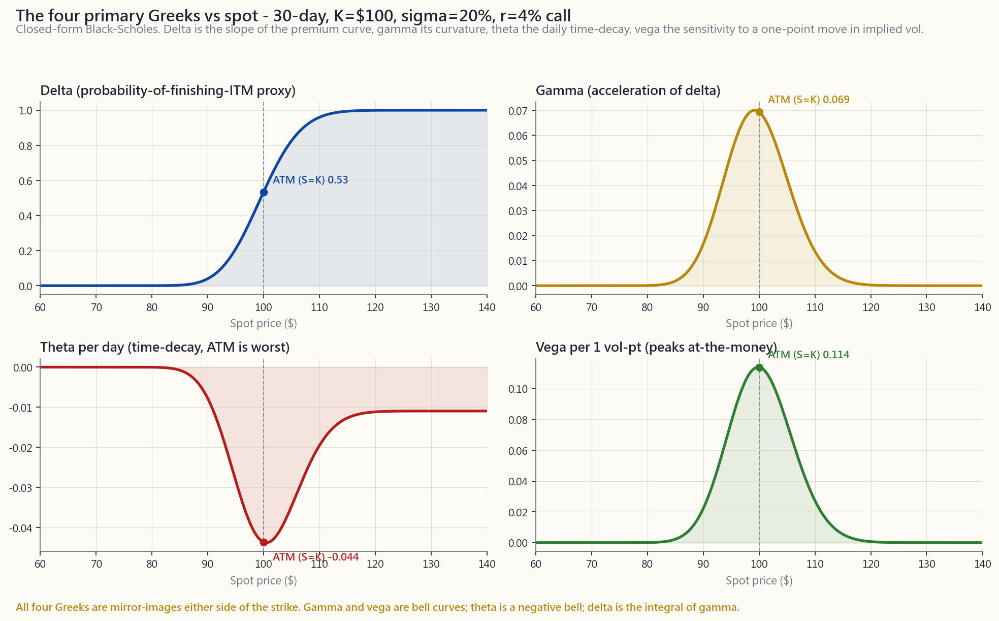
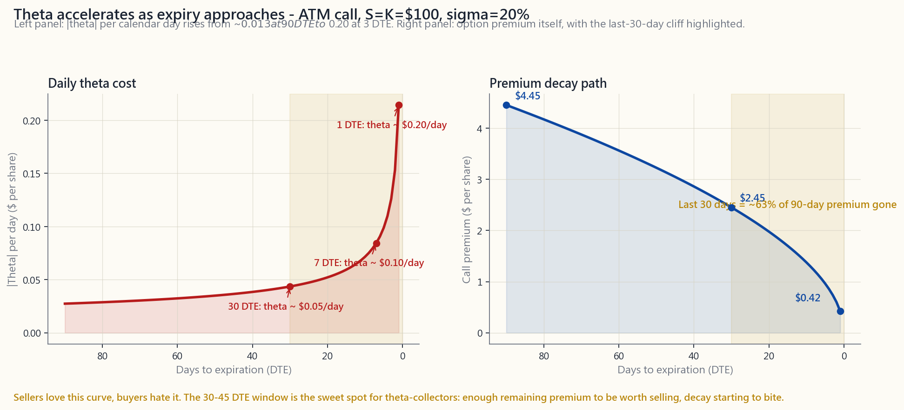

# 第29週：希臘字母 — Delta、Gamma、Theta、Vega、Rho

---

## 第一部分：閱讀材料

---

### 1. 為何此課題至關重要

第25至28週教你了期權的*運作機制*：什麼是認購期權，什麼是認沽期權，如何針對自己持有的股票沽出備兌認購期權，如何針對原本打算動用的現金沽出現金擔保認沽期權。你已能開倉，也明白到期時的損益圖。但你尚未能回答倉位在*到期前*向你提出的問題：今天正股升了2美元，為何我的認購期權只升了0.40美元？我兩週前沽出了一份認沽期權，正股毫無動靜，為何我已賺了一半期權金？標普指數持平，波動率指數急跌五點，為何我的長倉認購期權被打殘？每一個問題都是希臘字母的問題，而希臘字母都有明確的答案。

希臘字母是期權金相對於Black-Scholes模型各項輸入參數的偏微分。這句話是微積分學生能理解的語言；對其他人而言，實際的詮釋是：*當某一項輸入參數變動，其餘不變時，期權價格會改變多少？*有五項輸入參數影響期權金（現貨價、時間、波動率、利率及行使價，行使價不會變動），因此對應五個希臘字母。它們不是選讀材料——到了第30週，我們會把多個期權組合成價差及鐵鷹式策略，而價差正是*希臘字母風險敞口的組合*，目的是隔離某種風險，同時對沖另一種風險。沒有把delta、gamma、theta及vega銘記於心，根本無法清晰理解垂直價差或鐵鷹式策略。

投入精力鑽研的四個理由：

1. **希臘字母將困惑化為清晰的會計帳目。** 當倉位的表現出乎意料時，希臘字母能將驚喜分解為各項明細：*delta損益加gamma損益加theta損益加vega損益加rho損益，等於今天你賬戶的實際變動。* 這種分解，正是「期權很奇怪」與「期權是可量度的」之間的分別。
2. **希臘字母讓你按風險而非合約數量來控制倉位大小。** 「我沽出了三份認購期權」並非倉位描述。「我持有-150 delta長倉、每天+9美元theta、每個波動率點-40美元vega」才是。前者無法告訴你倉位如何「呼吸」；後者讓你在相同維度上，將該交易與你的帳簿上每一筆交易作比較。
3. **希臘字母揭示了期權沽出者致命的二階風險。** Theta收集策略（備兌認購期權、現金擔保認沽期權、鐵鷹式策略）聽起來像收入策略，感覺也像收入策略，直至波動性擴大為止。該倉位處於short vega及short gamma的狀態；當實際波動率上升時，兩者都對你不利。波動率尾部牽動股票，而這個說法從根本上涉及gamma及vega風險——希臘字母分解使其機制清晰可見。
4. **希臘字母是此後所有進階課題的語言。** 價差（第30週）、長期期權（第38週）、波動率指數（第40週）、波動率曲面，以及整個side25關於二階希臘字母的課題，都假設你能以Δ、Γ、Θ、ν*原生*思考。本週正是這些課題的基礎。

我們將從Black-Scholes模型推導每個希臘字母，以一隻100美元股票的30天等價認購期權為例，由頭到尾計算出一個完整例子，研究每個希臘字母如何隨現貨價及時間變化，然後將希臘字母特性轉化為第25至28週四種穩健策略在你帳戶中的實際「呼吸」方式。

---

### 2. 你需要掌握的知識

#### 2.1 五個希臘字母概覽

主要希臘字母共有五個。每個都是期權金$P$相對於某一項輸入參數的偏微分，其餘四項固定不變。標準符號及其量度的內容如下：

$$
\Delta = \frac{\partial P}{\partial S} \qquad
\Gamma = \frac{\partial^2 P}{\partial S^2} \qquad
\Theta = \frac{\partial P}{\partial t} \qquad
\nu = \frac{\partial P}{\partial \sigma} \qquad
\rho = \frac{\partial P}{\partial r}
$$

用淺白的語言，依次說明：delta是期權的*速度計*（每1美元現貨變動，期權金的變化量），gamma是期權的*加速度*（每1美元現貨變動，delta本身的變化量），theta是期權的*時間衰減時鐘*（每個日曆日，期權金的消耗量），vega是期權的*波動性敏感度*（每一個百分點的引伸波幅變動，期權金的變化量），而rho是期權的*利率敏感度*（每一個百分點的無風險利率變動，期權金的變化量）。

在進一步討論前，先說明單位的注意事項。經紀的交易平台按*每個日曆日*報價theta（年化theta除以365），按*每個波動率點*報價vega（vega除以100），按*每一個百分點利率*報價rho（同樣除以100）。Black-Scholes公式以連續時間、每單位的形式呈現；本課所有內容均採用*經紀報價的實際*形式，因為那才是你交易屏幕顯示的數字。

#### 2.2 Black-Scholes引擎，一覽無遺

對於一份無股息歐式認購期權，現貨價$S$、行使價$K$、到期時間$T$（以年計）、引伸波幅$\sigma$及無風險利率$r$：

$$
d_1 = \frac{\ln(S/K) + (r + \tfrac{1}{2}\sigma^2)T}{\sigma \sqrt{T}}, \qquad
d_2 = d_1 - \sigma \sqrt{T}
$$

$$
C = S \, N(d_1) - K e^{-rT} N(d_2)
$$

其中$N(\cdot)$為標準正態累積分布函數。每個希臘字母均有封閉形式：

$$
\Delta_{\text{認購期權}} = N(d_1), \qquad
\Gamma = \frac{\varphi(d_1)}{S \sigma \sqrt{T}}
$$

$$
\Theta_{\text{認購期權}} = -\frac{S \varphi(d_1) \sigma}{2\sqrt{T}}
                       - r K e^{-rT} N(d_2)
$$

$$
\nu = S \varphi(d_1) \sqrt{T}, \qquad
\rho_{\text{認購期權}} = K T e^{-rT} N(d_2)
$$

其中$\varphi(x) = \frac{1}{\sqrt{2\pi}} e^{-x^2/2}$為標準正態密度函數。對於認沽期權，delta變為$N(d_1) - 1$，rho項的符號改變並使用$-N(-d_2)$，theta的第二項符號亦改變；gamma及vega在相同行使價的認購期權及認沽期權中*完全相同*（這是期權定價中最簡潔的事實之一——相同行使價的認購期權與認沽期權之間的任何不對稱，必然存在於delta、theta（透過利率）或rho之中）。

你無需背誦這些公式。你只需認識到，每個希臘字母不過是一項輸入參數變動而其餘固定的結果——封閉形式使本課每張圖表的每個面板，都只是兩行Python函數。

#### 2.3 計算例子——100美元股票，30天等價認購期權

現貨價$S = \$100$，行使價$K = \$100$，到期日為30個日曆日後（$T = 30/365 \approx 0.0822$年），引伸波幅$\sigma = 20\%$，無風險利率$r = 4\%$。代入公式：

| 數量 | 數值 |
| --- | --- |
| $d_1$ | $0.086$ |
| $d_2$ | $0.029$ |
| $N(d_1)$ | $0.534$ |
| $N(d_2)$ | $0.511$ |
| 認購期權期權金 $C$ | $\$2.45$ |
| **Delta** | **+0.534** |
| **Gamma** | **+0.069** |
| **Theta / 日** | **-$0.044** |
| **Vega / 1個波動率點** | **+0.114** |
| **Rho / 1%利率** | **+0.042** |

像閱讀倉位簡報一樣讀取這些數字。認購期權成本為2.45美元。正股每升1美元，認購期權大約獲益0.53美元（delta）。在首個1美元升幅之後，每額外1美元的升幅，期權所獲得的收益比前一美元多約0.07美元（gamma）。即使其他一切不變，每過一天便損耗4.4美仙每股（theta）。如果引伸波幅由20%升至21%，你可獲得11美仙（vega）。假如美聯儲在隔夜突然加息100個基點（實際上不會），你大約可獲得4美仙（rho）。每一美元乘以100，因為一份合約控制100股份：這份2.45美元的期權是一張245美元的認購單，方向性風險敞口為每1美元正股變動對應53美元。

#### 2.4 Delta——方向性及「價內概率」

Delta是最常用的希臘字母。它告訴你期權表現得像等量的股票倉位，同時也可作為期權到期時處於價內的概率的快速粗略估算。

讀取同一數字的三種方式：

- **作為對沖比率。** Delta為0.50的認購期權，其走勢如同持有半股股份。對沖10份此類認購期權（相當於1,000股份），你需沽出500股份以實現delta中性。
- **作為方向性風險敞口。** 一個期權組合的淨delta為+150，則對小幅波動的表現如同持有150股份的正股。正股每升1美元，你獲益約150美元；每跌1美元，你損失約150美元。
- **作為概率參考。** 在Black-Scholes模型下，$N(d_1)$與$N(d_2)$*並非同一概率*；價內到期的真實風險中性概率是$N(d_2)$，而非delta（即$N(d_1)$）。但對於等價期權，兩者相近——相近到交易員以「30-delta認沽期權」和「30%機會到期價內」互換使用，這對快速決策而言尚可接受，但若要精確到小數點後三位則並不適用。

Delta對認購期權而言介乎0至+1，對認沽期權而言介乎0至-1。等價期權的$|\Delta| \approx 0.5$。深度價內認購期權趨近於+1（走勢如同正股）。深度價外認購期權趨近於0（近乎毫無反應）。

#### 2.5 Gamma——令沽出者吃虧的曲率

Gamma是delta相對於正股每1美元變動的*變化率*。關於gamma，有兩個事實主導了大部分具希臘字母意識的風險管理：

1. **Gamma在等價時達到峰值。** 期權最接近「到期價內」與「到期價外」之間的臨界點時，delta變化最為迅速。深度價內及深度價外期權的delta穩定（分別接近1和0）；等價期權的delta隨每一美元現貨波動而急劇變化。
2. **Gamma在臨近到期時急增。** 當$T \to 0$，等價期權的gamma發散。30天等價認購期權的gamma約為0.07；1天等價認購期權的gamma可超過1.0。這正是為何到期前最後一週與更早的任何一週在性質上截然不同，也是期權沽出者在進入到期週前，寧可平倉或換倉，也不願持有short等價行使價倉位的原因。

Long gamma（你買入期權）在正股波動時是好消息——你的delta隨你同行。正股上升→你的認購期權delta由0.50升向0.70，讓你更多地參與進一步的升幅。正股下跌→delta降至0.30，你在進一步下跌中的損失減少。*Long gamma使損失減速，使收益加速。* 這正是你支付theta的代價。

Short gamma（你沽出期權）是另一面。正股對你的short認購期權不利地上升→你的delta變得*更加偏空*，每一個額外的升幅都帶來更多損失。正股對你的short認沽期權不利地下跌→你的delta變得*更加偏多*，每一個額外的跌幅都帶來更多損失。波動率尾部牽動股票，其機制正是short gamma。這個倉位在低實際波動率下看似穩定收入，但當波動率出現時，便以複利速度大幅虧損。

#### 2.6 Theta——持有時間的成本

Theta對持有長倉期權者為負值（每個日曆日損失價值），對持有短倉期權者為正值（每個日曆日收取）。關於theta，有三點需要了解：

1. **Theta在等價時最大。** 原理與gamma相同——等價期權的外在價值最多，因此以絕對金額計算，每日消耗最大。價內及價外期權的外在價值較少，因此theta較小。
2. **Theta隨著到期臨近而加速。** 90天等價認購期權每天大約損失0.013美元的theta；30天等價認購期權每天損失0.04美元；7天等價認購期權每天損失0.10美元；1天等價認購期權每天可損失0.20美元或以上。衰減是非線性的——大約*三分之二*的90天等價認購期權期權金，在距到期還有30天時已蒸發。
3. **Theta與gamma形影不離。** 一個倉位不可能long gamma而不支付theta，也不可能short gamma而不收取theta。持有gamma的套利無關成本正是theta。*這種取捨正是期權沽出收入策略的本質。*

30至45天到期窗口是theta收集者的慣用甜蜜點。早於此窗口，相對於收取的期權金，每日衰減太小；晚於此窗口，gamma開始大幅影響，倉位會因輕微的現貨波動而劇烈搖擺。第27及28週使用30至45天到期，正是出於這個原因——現在你可以在圖表上看到背後的理由。

#### 2.7 Vega——隱藏於眾目睽睽之下的希臘字母

Vega是每*一個百分點*引伸波幅變動對應的期權金變化。對long認購期權及long認沽期權而言均為正值（買入者在波動率擴大時獲益），對short認購期權及short認沽期權而言均為負值（沽出者在波動率收縮時獲益）。

三項特性：

1. **Vega在等價時達到峰值**——形狀與gamma相同。
2. **Vega對*長期*期權而言最大。** 這是「所有希臘字母行為與gamma相同」這一說法最清晰的反例：gamma在臨近到期時達到峰值，vega則在遠離到期時達到峰值。1年期等價期權的vega約為0.40美元；30天等價期權約為0.11美元；1天等價期權約為0.02美元。長期期權幾乎更像波動率工具，而非方向性工具。
3. **波動率壓縮是一個vega事件。** 當你在業績公告前買入一份期權，而引伸波幅排名處於第90百分位時，你正在買入30至50個vega點的「業績溢價」，而市場將在業績公佈的瞬間把它蒸發。正股可以完全按你預期的方向移動，你仍然可能虧損，因為方向性獲益（delta加gamma）不足以抵消vega損失。初學者只會犯這個錯誤一次。

具備vega意識的倉位管理，正是*收入策略*與*波動率策略*的分野。在平靜市場以15%引伸波幅沽出的備兌認購期權，vega敞口很小；相同的備兌認購期權在市場恐慌時以40%引伸波幅沽出，則持有大量負vega，即使正股不動，也能在波動率均值回歸時快速獲利。Side25將進一步深入探討這一點。

#### 2.8 Rho——你大多可以忽略的希臘字母

Rho量度對無風險利率的敏感度。對於100美元股票的30天等價認購期權，每1%利率變動對應的rho約為0.04美元——因此即使美聯儲在某日議息後利率變動25個基點，期權金的移動也只有約*一美仙*。對於大多數零售期權倉位在大多數月份的大多數日子，rho都只是捨入誤差。

何時rho才真正重要？

1. **長期期權**——1至3年到期的股票期權，rho大到足以引起注意。100美元股票的2年期等價長期期權認購期權，rho接近每1%利率變動1.40美元——*這確實有意義*。
2. **政策轉變時期。** 當美聯儲在一次議息中移動75個基點（試想2022年第一季或2025年第三季），即使是短期rho，在一個帳簿的所有倉位上積累起來，也達到至少應有所認識的程度。

除此之外，rho處於儀表板的後排。我們提及它是為了完整性；我們不會針對它作優化。

#### 2.9 希臘字母如何驅動你已知的策略

第25至28週的四種穩健策略各有其特有的希臘字母特徵。了解它，讓你能預測每種策略如何「呼吸」。

**Long認購期權（第25/26週）：** $\Delta > 0$，$\Gamma > 0$，$\Theta < 0$，$\nu > 0$。你每天支付theta及rho消耗，換取參與升幅*以及*從波動率擴大中獲益的權利。這是一個方向性加波動率的押注，披著槓桿的外衣。

**Long認沽期權（第25週）：** $\Delta < 0$，$\Gamma > 0$，$\Theta < 0$，$\nu > 0$。希臘字母形狀與long認購期權相同，但delta為負值——你正在買入對抗回撤的*保險*，vega的部分正好解釋了認沽期權在下跌期間*變得更貴*的原因（波動率擴大，vega對你有利，但你已在行情出現前買入了認沽期權）。

**備兌認購期權（第27週）：** 股票加short認購期權。淨希臘字母：每股份對中，$\Delta \approx 100 - 50 = +50$；$\Gamma < 0$（輕微）；$\Theta > 0$（你每日收取）；$\nu < 0$（輕微）。你的升幅被壓縮，幾乎全承受下跌風險，兩者換來穩定的theta收入。收入*應*被視為一種稅務轉移工具，而非超額回報。

**現金擔保認沽期權（第28週）：** Short認沽期權加現金。淨希臘字母：每份合約$\Delta \approx +50$（與備兌認購期權相近的方向性風險敞口），$\Gamma < 0$，$\Theta > 0$，$\nu < 0$。根據認購認沽期權平價原理，這筆交易*等同於*備兌認購期權——相同的希臘字母骨架、相同的風險特性、相同的theta引擎。經紀保證金處理方式不同，策略邏輯並無差異。

**鐵鷹式策略及垂直價差（第30週，預覽）：** 組合設計目標為*delta中性*及*short gamma加short vega加long theta*。這個交易的邏輯是「我認為實際波動率將低於引伸波幅」。希臘字母讓你精確量度需要多少波動率優勢才能收支平衡。

本課結尾的互動工具讓你設定現貨價、行使價、距到期天數、波動率及利率，並即時觀察滑桿移動時五個希臘字母的變化——包括一張在現貨價上掃描所選希臘字母的圖表。*拖動距到期天數滑桿，觀察gamma在行使價處的攀升；這正是沽出每週期權的整個風險特性，盡在一個動畫之中。*

[interactive: interactive/week29_greeks_lab.html]

---

### 3. 常見誤解

1. **「Delta是到期時處於價內的概率。」** 它只是*接近*，並不相等。價內到期的風險中性概率是$N(d_2)$，而非$N(d_1) = \Delta$。當波動率或時間較大時，兩者出現差異。以delta作快速參考尚可；切勿在要求三位小數的計算上依賴它的精確性。

2. **「Theta每天都相同。」** 不對。90天期權的theta很小；7天期權的theta很大。你在開倉時讀到的數字，是*今天*的theta，並非整個持倉期的平均值。theta衰減圖表的重點，正在於它是加速的。

3. **「如果gamma為正，我在任何波動中都能獲益。」** Long gamma對*任何*波動都有利，但你仍需支付theta來持有它。如果實際波動率低於引伸波幅（即波動幅度小於期權所定價的水平），theta勝出，你便虧損。只有當實際波動率在持倉期間超過引伸波幅時，long gamma才能盈利。*每一筆long gamma的交易，本質上都是一筆long波動率的交易。*

4. **「Vega和gamma是同一個希臘字母。」** 它們在相同行使價（等價）時達到峰值，相對於現貨價有相似的鐘形形狀，但相對於時間的表現*截然相反*：gamma隨到期臨近而上升，vega則下降。1天等價期權主要是gamma工具；1年等價期權主要是vega工具。混淆兩者，在距到期天數重要時便會付出代價。

5. **「Short期權有無限風險，因為theta的緣故。」** Theta對short期權而言是*正值*——它是你的盟友，而非敵人。裸short認購期權的無限風險，來自*delta*（正股可以脫韁）加上*gamma*（你的delta隨之越來越偏空）。Theta是你為承擔這種風險而收取的報酬，而非風險的來源。

6. **「對認購期權買家而言，delta越高越好。」** 更高的delta意味著更多的方向性參與，但同時意味著*更大的資本投入*（深度價內認購期權的成本幾乎與股票相當），以及*更低的vega*（你放棄了引伸波幅擴大的押注）。0.30至0.40的delta範圍是傳統「投機性多倉」的甜蜜點，正是因為它在方向性風險敞口、資本效率及凸性vega回報之間取得平衡。

7. **「Vega只在業績公告前後才重要。」** 每當引伸波幅遠離長期平均水平時，vega每天都重要。以30%引伸波幅買入long期權，而美聯儲議息後的現實是18%引伸波幅，不論正股走勢如何，都保證緩慢虧損。持續的引伸波幅壓縮，正是大多數零售方向性期權交易虧損的原因——即使方向性判斷是正確的。

8. **「Rho無關緊要。」** 對短期期權而言幾乎正確；對長期期權而言則不然。200美元股票的2年期等價認購期權有顯著的rho。如果你交易長期期權而不查看rho，你便留下了未受監控的風險敞口。

9. **「只要經紀顯示損益圖，我就可以忽略希臘字母。」** 到期時的損益圖只是五維曲面的一個截面。希臘字母告訴你今天至到期日之間的*路徑*。損益圖只告訴你*當你持倉至到期鈴聲響起時*的情況。大多數倉位在此之前便已平倉。

10. **「希臘字母對零售交易員而言太數學化了。」** 公式是數學化的；*概念*只是算術。如果你能讀懂速度計（delta），接受速度計本身在你腳下移動（gamma），支付停車場租金（theta），並擁有一個恐慌溫度計（vega），你便理解了希臘字母。你無需推導Black-Scholes便能運用它們。

---

### 4. 問答環節

**問：如果沒有計算器，最簡單估算delta的方法是什麼？**
答：對於等價期權，delta對認購期權約為0.50，對認沽期權約為-0.50。每1美元的價值（價內或價外），delta大約移動$0.05 / (\sigma \sqrt{T})$——對於30天、20%波動率的期權，大約是$0.05 / 0.057 \approx 0.88$每1美元的價值，上限為$\pm 1$。實際操作中，直接從你的經紀讀取即可。

**問：為何我的long認購期權在平靜的一天虧損？**
答：Theta。即使現貨價、波動率及利率不變，每過一個日曆日便消耗外在價值。對於30天等價認購期權，大約是每股0.04美元。如果你買入5份合約，那一天的theta便是20美元——在一個平靜的星期二，這便是全部損益。

**問：何時最需要警惕gamma？**
答：兩種情況。第一，當你在到期前最後兩週*持有short期權*，且正股接近你的行使價——那時的gamma足夠大，一則新聞標題便可令你從「交易獲勝」翻轉至「交易虧損」。第二，當你在同一正股持有多個short期權倉位——gamma累加，short 30 gamma的投資組合與short 5 gamma在性質上截然不同。

**問：Gamma和vega是同一回事嗎？**
答：不是，但兩者共享等價峰值。它們的*時間特性*相反：gamma隨到期臨近而上升，vega則下降。短期等價期權主要是gamma工具；長期等價期權主要是vega工具。這正是「沽出每週期權」與「沽出長期期權認沽期權」是截然不同的策略的原因，即使兩者都是沽出期權金。

**問：什麼是「波動率壓縮」，哪個希臘字母能解釋它？**
答：Vega。引伸波幅在已知事件日期前（業績公告、美聯儲議息、生物科技FDA審批決定）往往偏高，並在事件過後即時崩潰。如果你在事件前後持有long期權，你在方向性波動（delta及gamma）中獲益，但同時承受引伸波幅崩潰帶來的損失（vega損失）。最終損益取決於哪方勝出。初學者以為「正股按預期方向移動→我賺了錢」；希臘字母分解使虧損可被診斷。

**問：Rho到底有多大？我是否應該擔心？**
答：對於30天等價認購期權，每1%利率變動每股rho約為0.04美元。因此25個基點的美聯儲行動大約只是一美仙。短期交易無需擔心。對於長期期權（1至3年到期），每1%每股的rho可達1至3美元——大到足以令美聯儲政策轉向即使在正股不動的情況下也能顯著影響長期期權金。結論：長期期權需關注，每週期權則無需。

**問：如果我沽出備兌認購期權，我的淨希臘字母特性是什麼？**
答：股票加short認購期權。每100股份加一份short認購期權：delta約為+50（你已將一半的delta上行風險讓渡給short認購期權），gamma輕微為負，theta為正（你在收取），vega輕微為負。這個倉位的升幅被壓縮，幾乎全承受下跌風險，同時享有穩定的theta收入。每日theta是收入，而非超額回報。

**問：如果我改沽現金擔保認沽期權，有何不同？**
答：根據認購認沽期權平價原理，希臘字母骨架與備兌認購期權完全相同——相同的delta、gamma、theta、vega。*經紀保證金處理*方式不同（一種佔用股份，另一種佔用現金），但風險特性是同一交易的兩種形態。

**問：Short期權倉位是否有可能為long gamma？**
答：單一short期權不可能。*組合*可以建立任何希臘字母特性——long日曆價差（沽出近月、買入遠月相同行使價）是short gamma但long vega；long跨式組合（在同一行使價買入一份認購期權及一份認沽期權）則同時long gamma和long vega。一旦開始組合倉位，希臘字母相加，你幾乎可以建立任何你想要的特徵組合。

**問：在真實市場中，希臘字母的變化速度有多快？**
答：Delta隨現貨價持續變化（這正是gamma）。Gamma隨到期臨近而漂移上升，並在最後一週急速攀升。Theta的加速是非線性的——第2.6節的圖表顯示了這條曲線。Vega隨引伸波幅的任何變動而改變，股票期權每天都在變，事件驅動的股票更是每小時都在變。Rho隨利率曲線變化，在大多數日子較為緩慢。五個希臘字母合在一起，構成一個*時間上不斷變化的*儀表板；在開倉時，它們沒有任何一個是固定的。

**問：股息在哪裡？**
答：我們刻意使用無股息版本的Black-Scholes，以使本課保持簡潔。對於派息股票，已知的離散股息會降低認購期權價值並提高認沽期權價值（遠期價格因股息現值而下降）。希臘字母隨之相應移動，連續股息收益率$q$以$S \to S e^{-qT}$的形式貫穿整個公式。每個希臘字母特性的形狀不變；數值略有移動。對於大多數零售期權交易而言，忽略股息的誤差很小。

**問：希臘字母在實際操作中最重要的用途是什麼？**
答：倉位規模控制。「三份short認沽期權」不具任何信息量；「+150 delta，每日+8美元theta，每個波動率點-35美元vega，-12 gamma」才是對這筆交易的描述。有了這些數字，你可以問：*正股要移動多少，我才會損失所有已收取的theta？波動率要擴大多少，vega損失才會超過兩週收取的theta？如果正股下跌5%，我的delta會變成多少？* 這些是具備希臘字母意識的交易員在開倉前回答的問題；初學者則在虧損實現後才回答。

---

## 第二部分：YouTube腳本

---

**影片標題：** 希臘字母——Delta、Gamma、Theta、Vega、Rho，無需微積分
**目標時長：** 約18分鐘
**主持：** 陳馬、小魚

---

**[開場 — 0:00-1:30]**

**小魚：** 歡迎回到chanmainvest教學頻道。我是小魚。

**陳馬：** 我是陳馬。今天是第29週，我們要講希臘字母。

**小魚：** 我們已學過四週期權。可以買認購期權、買認沽期權、沽出備兌認購期權、沽出現金擔保認沽期權。但我們仍無法*解釋*倉位在任何一個星期二的具體表現。希臘字母就是那個解釋。

**陳馬：** 五個字母。Delta、gamma、theta、vega、rho。每一個都是期權金相對於某一項輸入參數的偏微分。如果「偏微分」令你卻步，這裡有非微積分的說法：*一項輸入參數變動，其他一切固定不變，期權金改變了多少？* 這就是一個希臘字母。

**小魚：** Black-Scholes模型有五項輸入參數——現貨價、時間、波動率、利率、行使價。行使價不會移動。所以有五個敏感度，五個希臘字母。我們將用同一份期權作為參考，逐一說明每一個。

**陳馬：** 100美元股票，100美元行使價，距到期30天，引伸波幅20%，無風險利率4%。我們將針對這一份合約計算全部五個希臘字母，然後看看它們如何隨現貨價及時間變化。

**[VISUAL: image/week29_greeks_vs_spot.png]**

**小魚：** 這是我們的錨定圖表。四個格——delta、gamma、theta、vega——全部針對同一份30天等價認購期權，全部以現貨價60至140美元為橫軸繪製。把這張圖記在腦海中；我們將逐一說明每個格。

---

**[第一部分：DELTA — 1:30-4:30]**

**陳馬：** 左上格。Delta。一條由左邊0延伸至右邊1的S形曲線，恰好在行使價處越過0.5。讀取這個數字有三種方式。

**小魚：** 第一，作為對沖比率。Delta為0.5的認購期權，走勢如同持有半股股份。買入10份此類認購期權，你相當於合成地持有500股份長倉。

**陳馬：** 第二，作為方向性風險敞口。投資組合的淨delta告訴你每1美元正股變動對應的損益金額。淨+200 delta？指數每升1美元，你獲益200美元。

**小魚：** 第三——而這正是初學者只猜對了一半的地方——delta*大約*等於期權到期時處於價內的概率。只是大約。真實的風險中性概率是$N(d_2)$，而非$N(d_1)$。兩者相近，所以交易員在交易台上互換使用「30-delta認沽期權」和「30%機會到期價內」。

**陳馬：** 但差距足以讓你不能把它寫在稅務文件上。在我們的計算例子中，delta為+0.534。真實的價內概率是+0.511。相近，不相等。

**小魚：** 實際要點：delta是倉位的*方向性*維度。後面的一切都是二階效應——當某些東西移動時，delta本身會發生什麼。

---

**[第二部分：GAMMA — 4:30-7:30]**

**陳馬：** 右上格。Gamma。以行使價為中心的鐘形曲線。有兩個事實需要記住。

**小魚：** 一：gamma在等價時達到峰值。深度價內和深度價外期權有穩定的delta。等價期權的delta隨正股的每一美元波動而急劇變化。

**陳馬：** 二：gamma在臨近到期時急增。我們的30天期權gamma為0.07。同一份期權的1天版本，gamma可超過1。這個差異，正是到期前最後一週與其他任何一週在性質上截然不同的全部原因。

**小魚：** 而gamma的正負取決於你是買入者還是沽出者。*Long* gamma——你買入了期權——是友好的。正股上升，你的delta由0.5升向0.7，你更多地參與進一步的升幅。正股下跌，delta降至0.3，你在進一步下跌中的損失減少。Long gamma使損失減速，使收益加速。

**陳馬：** Short gamma則是另一面。正股對你的short認購期權不利地上升，你的delta變得*更加偏空*，每一個額外的升幅都帶來更多損失。波動率尾部牽動股票，從根本上說就是short gamma的問題。這個倉位在低實際波動率下呈現穩定收入，在波動率出現時以複利速度大幅虧損。

**小魚：** Long gamma在波動中是好消息。你用theta來換取它。這正好引出下一個格。

---

**[第三部分：THETA — 7:30-11:00]**

**陳馬：** 左下格。Theta——每日時間衰減。對long期權者為負值，對short期權者為正值。看這個格：theta在等價時最為負值，就像gamma在等價時達到峰值一樣。價內和價外期權的外在價值較少可以消耗，因此以絕對值計算，theta較小。

**小魚：** 而theta隨到期臨近而加速。

**[VISUAL: image/week29_theta_decay.png]**

**陳馬：** 這張圖的左側——以每個日曆日|theta|為縱軸，距到期天數為橫軸。在90天到期時，theta約為每天一美仙。在30天到期時，四美仙。在7天到期時，十美仙。在1天到期時，二十美仙。同一份期權的theta，在最後90天裡移動了20倍。

**小魚：** 右側：期權金本身。期權在90天到期時以4.05美元起步，在30天到期時跌至2.45美元，並在最後一週趨近於零。橙色色帶是最後30天，大約63%的原始期權金在此蒸發。

**陳馬：** 這條曲線正是第27及28週整個收入策略論點的所在。30至45天到期窗口，是theta收集對沽出者承受short gamma提供足夠補償的地方。早於此窗口，相對於收取的期權金，每日theta太小。晚於此窗口，任何有意義的波動都足以令gamma大幅壓過theta。

**小魚：** Theta與gamma形影不離。你不可能long gamma而不支付theta。你不可能收取theta而不承受short gamma。持有其中一個的套利無關成本正是另一個。這種取捨*就是*期權沽出收入策略的本質。

---

**[第四部分：VEGA — 11:00-13:30]**

**陳馬：** 右下格。Vega——對引伸波幅每一個百分點變動的敏感度。有三點需要了解。

**小魚：** 一：vega在等價時達到峰值。形狀與gamma相同。

**陳馬：** 二：vega對*長期*期權而言最大——這是「所有希臘字母行為與gamma相同」最清晰的反例。Gamma隨到期臨近而上升。Vega隨到期臨近而下降。1年期等價期權的vega約為每個波動率點四十美仙。我們的30天期權有十一美仙。1天期權有兩美仙。長期期權幾乎更像波動率工具，而非方向性工具。

**小魚：** 三：波動率壓縮是一個vega事件。在業績公告前、引伸波幅處於第90百分位時買入認購期權——你擁有三四十個vega點的「業績溢價」，市場將在業績公佈的瞬間把它蒸發。正股可以完全按你預期的方向移動，你仍然可能在期權上*虧損*。初學者只會犯這個錯誤一次。

**陳馬：** Vega正是*收入策略*與*波動率策略*的分野。在平靜市場以15%引伸波幅沽出的備兌認購期權，vega敞口很小。相同的備兌認購期權在恐慌時以40%引伸波幅沽出，則持有大量負vega，即使正股不動，也能在波動率均值回歸時快速獲利。

---

**[第五部分：RHO — 13:30-14:30]**

**小魚：** Rho只得一分鐘，已算慷慨。對於30天等價認購期權，每1%利率變動每股rho約為0.04美元。25個基點的美聯儲行動就是一美仙。對於短期零售期權，rho只是捨入誤差。

**陳馬：** 兩種情況下rho才真正重要。長期期權——2年期期權每1%每股的rho接近1.40美元，大到足以引起注意。以及政策轉變時期——當美聯儲在一次議息中移動75個基點，跨整個帳簿積累的rho便值得至少有所認識。除此之外，可以忽略。

---

**[第六部分：互動工具 — 14:30-16:30]**

**[VISUAL: interactive/week29_greeks_lab.html]**

**小魚：** 打開希臘字母實驗室。五個滑桿——現貨價、行使價、距到期天數、波動率、利率。認購期權與認沽期權的切換按鈕。六個按鈕讓你選擇繪製哪個希臘字母。

**陳馬：** 有三件事可以用這個工具做。第一：在現貨價等於行使價的情況下，把距到期天數滑桿向零拖動，選擇gamma圖表，看看鐘形如何塌陷再急速上升。這就是令每週期權成為截然不同風險格局的gamma急增現象。

**小魚：** 第二：選擇theta，然後向下拖動距到期天數滑桿。看看行使價處的theta井如何非線性地加深。你可以*親眼看到*靜態圖表所展示的theta加速——現在在你手指之間。

**陳馬：** 第三：選擇vega，把距到期天數滑桿拖至365。Vega的鐘形變大。長期期權*就是*波動率工具。與gamma對比，gamma走向相反。這個對比是你能建立的最清晰的心智模型——「我持有的是哪種期權。」

**小魚：** 頂部數字條上的即時數字隨每個滑桿更新。期權金、全部五個希臘字母，按各自的顏色標示。那就是你的儀表板。

---

**[結語 — 16:30-18:00]**

**陳馬：** 五個希臘字母。每個輸入參數各一個。

**小魚：** Delta是方向性。Gamma是加速度。Theta是時間的租金。Vega是恐慌的溫度計。Rho是儀表板後排緩慢移動的利率敏感度。

**陳馬：** 帶走兩句話。*Long gamma只有在持倉期間實際波動率超過引伸波幅時才能盈利——每一筆long gamma的交易，本質上都是一筆long波動率的交易。* 以及：*theta與gamma形影不離，你不能收取其中一個而不承受另一個的short倉。*

**小魚：** 下週我們把多個期權組合成價差及鐵鷹式策略——而價差正是*希臘字母風險敞口的組合*，目的是隔離某種風險，對沖另一種風險。沒有本週的基礎，那一切都無從理解。

**陳馬：** Side25會深入探討二階希臘字母——vanna、vomma、charm。我們會到達那裡。現在，先熟悉這五個。

**小魚：** 閱讀誤解清單。運行互動工具。我們第30週見。

**[完]**