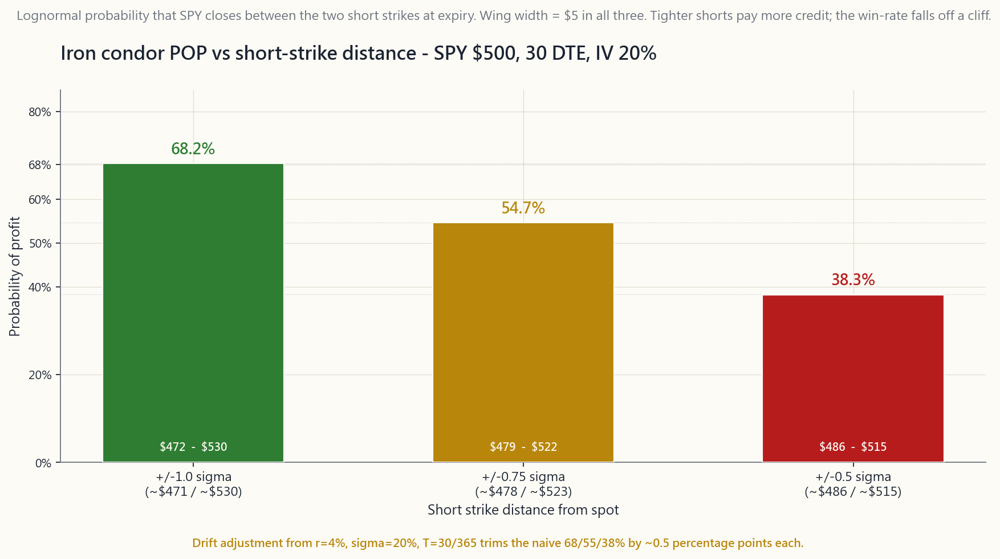

# 第三十週：價差、鐵鷹及蝶式策略——用期權構建槓鈴組合

---

## 第一部分：閱讀章節

---

### 1. 為何這一課至關重要

過去四週教你掌握了單腿期權的詞彙：以認購期權和認沽期權作廉價方向性押注、以備兌認購期權收取出售費用、以現金擔保認沽期權收取買入費用，以及希臘字母作為整個定價機制的偏微分。單腿期權直接了當，但也相當粗糙。在五萬美元的帳戶上，對SPY的$500行使價裸沽認沽期權，需要佔用五萬美元的抵押品，若市場歸零便暴露於五萬美元的虧損風險中。這不是倉位規模的決定——這是一個等同於*整個帳戶*規模的倉位。

價差可以解決這個問題。價差是在同一標的上將兩條腿（或四條腿）期權縫合在一起，使長倉腿*封頂*短倉腿的虧損。倉位從入場當天便有一個列印在單上的最大虧損、一個列印在單上的最大盈利，以及一個等於價差闊度減去所收期權金的保證金要求——通常每份合約只需一至三百美元，而非五位數的現金。同一個五萬美元的帳戶可以同時運行*五十個*這樣的倉位，而無需將整個帳戶押注在單一尾部風險上。

這在四個具體層面上至關重要：

**(1) 界定風險的期權正是槓鈴策略本身。** 槓鈴策略的一端持有高度確信的安全性，另一端持有非對稱、有上限虧損的投機性部位。長期SPY認購期權價差、QQQ的鐵鷹式策略、AAPL業績公布前的蝶式策略——每一個均具備槓鈴策略要求的*確切*結構特性：以已知的、小額的、預付的最大虧損，換取無需與標的呈線性關係的回報。L3（「非對稱」）倉位並非由槓桿ETF和彩票式押注構成；它由價差策略構成。

**(2) 信用價差是L2收入倉位的工程化版本。** 第27週沽出備兌認購期權、第28週沽出現金擔保認沽期權；兩者均有效，但均屬資本密集型。以5點寬的牛市認沽期權價差替代現金擔保認沽期權，保留了相同的方向性邏輯（「我願意在更低價買入這隻股票」），保留了相同的正時間值套利特性，並將資本要求縮減80-95%。*實際風險資本上的*月度毛收益率上升；美元收入下降；存活能力大幅提升。大多數專業期權金沽出者正是為了這種取捨，選擇運行價差而非裸期權。

**(3) 鐵鷹式策略將市場在大約70%的時間內於已實現波動範圍內均值回歸的特性變現。** 鐵鷹式策略在到期時SPY收市價介於兩個短倉行使價之間時獲利。在短倉行使價設於±1個標準差、到期日30天的情況下，對數正態盈利概率約為68%；短倉設於±0.75σ時約為55%；設於±0.5σ時約為38%。交易者在概率曲線上選取自己願意承受的位置，並調整翼幅以封頂尾部風險。這是*已定價並已對沖的*均值回歸——而非接住下跌中刀的零售版本。

**(4) 蝶式策略和破翼蝶式策略是表達*精確*觀點的工具。** 以$100為中心的多頭蝶式策略，在到期時股票恰好收於$100時達到最大盈利，在其他任何地方均損失一個小的固定金額。這是對*水平位置*的押注，而非方向性押注。一個已對某隻股票的業績反應或期權到期日釘盤做過充分研究的交易者，可以以一至兩百美元的風險和四比一的回報表達這一觀點，而持有正股或裸期權版本則需花費五位數，且不提供任何此類非對稱性。

價差也是一個具有波動率意識的交易者開始認真關注的地方：借方價差是負波動率（你買入了波動率），信用價差是正時間值和負波動率（你賣出了波動率），蝶式策略是負波動率*且*負伽馬值。選擇正確的結構不再是「看漲還是看跌」的問題——而是「在我的方向性判斷的前提下，我認為未來三十天已實現波動率與引伸波幅的關係如何」。這是專業期權部門使用的語言；本週正是你開始運用這種語言的起點。

---

### 2. 你需要掌握的內容

#### 2.1 四種垂直價差——一張幻燈片，四種交易

垂直價差使用兩個*同類型*（全為認購期權或全為認沽期權）、*相同到期日*、*不同行使價*的期權。持有其中一個並沽出另一個，形成四種命名的結構：

- **牛市認購期權價差**（借方）。買入較低行使價認購期權，沽出較高行使價認購期權。支付淨期權金。最大盈利 = 闊度減去借方金額。最大虧損 = 借方金額。看漲、有上限、負時間值。
- **熊市認沽期權價差**（借方）。買入較高行使價認沽期權，沽出較低行使價認沽期權。支付淨期權金。最大盈利 = 闊度減去借方金額。最大虧損 = 借方金額。看跌、有上限、負時間值。
- **牛市認沽期權價差**（信用）。沽出較高行使價認沽期權，買入較低行使價認沽期權。收取淨期權金。最大盈利 = 所收期權金。最大虧損 = 闊度減去所收期權金。輕度看漲至中性、正時間值。
- **熊市認購期權價差**（信用）。沽出較低行使價認購期權，買入較高行使價認購期權。收取淨期權金。最大盈利 = 所收期權金。最大虧損 = 闊度減去所收期權金。輕度看跌至中性、正時間值。

闊度是行使價之間的距離——5元、10元、25元，視乎期權鏈所提供的為準。闊度越大 = 風險資本越多、最大盈利金額越大、形狀不變。兩個具有相同delta但不同闊度的交易，以不同規模表達相同觀點。

四種到期時的回報形狀——牛市認購、熊市認沽、鐵鷹式及蝶式策略同呈一圖——繪製於
[course/image/week30_spread_payoffs.py](course/image/week30_spread_payoffs.py)。
圖表上標注了每種策略的最大盈利、最大虧損及損益平衡點，讓你可以在圖表上而非在書頁上驗證公式。

#### 2.2 實例——AAPL $150的牛市認購期權價差

AAPL報$150。你預期未來30天股價將溫和上漲。期權鏈顯示：

- $150認購期權：中間價$5.00（delta約0.55）。
- $155認購期權：中間價$2.50（delta約0.35）。

牛市認購期權價差：

- **買入** 1份AAPL $150認購期權：支付$5.00。
- **沽出** 1份AAPL $155認購期權：收取$2.50。
- **淨借方：** 每股$2.50 = 每份價差**$250**。

三個數字直接從結構中得出：

- **最大盈利：** 闊度減去借方金額 = ($155 - $150) - $2.50 =
  **每股$2.50 = 每份價差$250**，在到期時AAPL收市於或高於$155時實現。
- **最大虧損：** 所支付的借方金額 = **$250**，在到期時AAPL收市於或低於$150時承受。
- **損益平衡點：** 較低行使價加借方金額 = **$152.50**。

風險/回報為**1比1**：以$250博取$250。同一觀點若以單獨買入$150認購期權表達，需花費$500，且需要AAPL漲過$155才能翻倍——目標相同，資本倍增，長倉認購期權的時間值損耗也是兩倍。價差是相同想法在資本上更為高效的版本，且尾部風險有精確上限。

價差版本的代價是$155以上的上行空間：若AAPL急升至$170，長倉認購期權版本盈利$1,500，而價差版本僅盈利$250。這就是取捨——以設置上限換取設置下限。

#### 2.3 鐵鷹式策略——將兩個信用價差縫合成一筆交易

鐵鷹式策略是在同一標的和同一到期日上，將一個牛市認沽期權價差*和*一個熊市認購期權價差結合在一起。四條腿，全部價外，全部收取期權金。若標的在到期時收市於兩個短倉行使價之間，該倉位獲利。

實例：SPY報$500，到期日30天，引伸波幅20%，利率4%。

一個月的一個標準差波動為
$500 \times 0.20 \times \sqrt{30/365} \approx \$28.65$。取整為$30。
在±1σ設置短倉，翼部再往外5點：

- **沽出** $470認沽期權，**買入** $465認沽期權：期權金約$0.95。
- **沽出** $530認購期權，**買入** $535認購期權：期權金約$0.85。
- **合計期權金：** 約每股$1.80 = **每份鐵鷹式策略$180**。
- **每個翼部闊度：** $5；**最大虧損** = $5 - $1.80 = **每股$3.20 = $320**。（到期時只有一個翼部會虧損。）
- **所需資本：** 翼部闊度減去期權金，即約$320（經紀以翼部闊度作保證金）。
- **損益平衡點：** $470 - $1.80 = $468.20，以及$530 + $1.80 = $531.80。
- **盈利概率（POP）：** SPY在到期時收市於[$470, $530]之間的對數正態概率，約**68%**。

風險/回報1.78比1（以損失320博取盈利180），盈利概率68%——只要已實現波動率收窄至期權鏈所定價的20%或以下，這筆交易便具正面預期值。最後這個條件說明了一切：鐵鷹式策略本質上是一種*沽出波動率*的交易。當已實現波動率超過引伸波幅時，無論股價走勢如何，這個結構都會喪失優勢。波動率的影響先於一切。

SPY $500鐵鷹式策略在三種短倉行使價距離下的盈利概率曲線，繪製於
[course/image/week30_condor_pop.py](course/image/week30_condor_pop.py)。
較緊的短倉在*時間值*層面提供較寬的利潤區間，但盈利概率大幅下降；圖表展示了1σ、0.75σ和0.5σ三個水平的取捨關係。

#### 2.4 蝶式策略——釘住水平位置

以行使價$K為中心的多頭蝶式策略由三條腿組成：

- **買入** 1份$K - w認購期權。
- **沽出** 2份$K認購期權。
- **買入** 1份$K + w認購期權。

兩翼$w等距，中間的兩份空頭認購期權吸收了大部分成本。若標的在到期時恰好收市於$K，倉位獲得最大盈利，在其他任何地方則損失一個小的固定金額。

實例：AAPL報$150，到期日30天，引伸波幅25%：

- **買入** $140認購期權：支付$11.00。
- **沽出 2份** $150認購期權：收取$5.00 × 2 = $10.00。
- **買入** $160認購期權：支付$1.20。
- **淨借方：** $11.00 - $10.00 + $1.20 = **每股$2.20 = $220**。
- **最大盈利：** 闊度減去借方金額 = $10 - $2.20 = **每股$7.80
  = $780**，僅在到期時AAPL恰好收市於$150時實現。
- **最大虧損：** 借方金額 = **$220**，在$140以下或$160以上均如此。
- **損益平衡點：** $142.20和$157.80。

風險/回報**3.5比1**，但利潤區間遠比鐵鷹式策略窄。到期時的盈利概率較低（*峰值*是單一點位），但倉位具有正的波動率相對隱含波幅排名的套利：隨著到期日臨近，若股票維持在中間行使價附近，蝶式策略的按市值計算的損益以非線性方式增長，因為短倉中間行使價的價值損耗速度快於長倉翼部。專業術語稱之為「蝶式策略的伽馬剝頭皮」——這是對*時間流逝而股票維持釘盤*的方向性押注。

蝶式策略最適合的情景包括：在期權到期日週五的整數行使價附近進行最大持倉量釘盤；對過度拉伸股票表達「向公允價值漂移」的觀點；在引伸波幅被壓縮後押注業績公告後的平靜反應；或在已知催化劑面前以有限尾部風險持倉。

#### 2.5 選擇闊度、距離和到期日——三個調節旋鈕

每個界定風險的結構都有相同的三個旋鈕，而且這是唯一重要的旋鈕：

- **闊度**（翼部或腿部的行使價距離）：使風險金額和期權金金額翻倍，但*形狀*不變。闊度是*規模*旋鈕。
- **距離現貨的遠近**（短倉行使價距現貨多遠）：盈利概率旋鈕。靠近現貨 = 更多期權金、更低盈利概率、更高delta。遠離現貨 = 更少期權金、更高盈利概率、更低delta。短倉上的delta是一個簡潔的代理指標：30 delta短倉 ≈ 30%價內概率 ≈ 每條腿70%盈利概率。
- **到期日天數（DTE）**：30-45天到期日是信用價差的最佳區間（已在第27週介紹）。時間值在21天到期日以內加速損耗；波動率值縮減。到期日越短 = 時間值衰減越快、伽馬風險越大；到期日越長 = 套利越穩定、佔用資本越多。

運行穩定倉位組合的零售交易者，通常固定這三個旋鈕中的兩個（例如30 delta短倉、30天到期日），並通過調整闊度來為倉位定規模。專業人士則根據波動率曲面調整全部三個旋鈕。

互動工具 [interactive/week30_spread_builder.html](interactive/week30_spread_builder.html)
讓你即時切換結構（垂直價差 / 鐵鷹式策略 / 蝶式策略），並實時移動全部三個旋鈕，同步觀察淨期權金、最大盈利、最大虧損、損益平衡點、盈利概率及回報圖的更新。

#### 2.6 資本效率——本章核心的並排比較

以同一SPY論點（「市場在30天後收市於$470至$530之間」）為基礎，五種表達方式：

| 結構 | 資本 | 最大盈利 | 最大虧損 | 盈利概率 | 資本收益率 |
|---|---|---|---|---|---|
| 持有正股（持平） | $50,000 | 約$1,000套利 | 約$50,000 | 約50% | 約2% / 30天 |
| 沽出跨式組合，1σ | 約$15,000 | 約$3,200 | 無限 | 約68% | 約21% / 30天 |
| 鐵鷹式策略，1σ短倉，5點寬 | 約$320 | $180 | $320 | 約68% | 約56% / 30天 |
| 鐵鷹式策略，0.75σ短倉，5點寬 | 約$280 | $220 | $280 | 約55% | 約78% / 30天 |
| 以$500為中心的多頭蝶式策略 | 約$220 | $780 | $220 | 約25% | 峰值約355% / 30天 |

資本收益率一欄是本章的核心結論。界定風險的結構在資本效率上比同一觀點的正股或沽出跨式組合版本*高出一至兩個數量級*。鐵鷹式策略和蝶式策略並不複雜——它們是在槓鈴策略中表達非方向性觀點的*正確*方式。

你付出的代價是精確度。每一種界定風險的交易都有一個特定的生效視窗；在這個視窗之外，它便支付最大虧損。這是結構對交易者施加的紀律，也正是本章成為通往L3門戶的原因。

#### 2.7 稅務、行使及實際操作注意事項

垂直價差作為一個整體幾乎從不會被提前行使——長倉腿在短倉被行使時始終覆蓋短倉腿。真正的風險是信用認購期權價差的短倉認購期權在除息日前後被*單腿*提前行使；若發生這種情況，你將醒來持有股票空倉而長倉認購期權仍然有效，這雖然可以接受，但需要當天採取行動。鐵鷹式策略和蝶式策略在翼部層面具有相同的特性。

從稅務角度而言：在廣基指數（SPX、NDX、RUT，*不包括* SPY/QQQ/IWM ETF）上的界定風險期權價差屬於1256合約，無論持有期限如何，均按60%長期/40%短期稅率徵稅。對於在高稅率等級運行月度鐵鷹式策略的美國交易者而言，這在稅後回報方面具有約10個百分點的結構性優勢。代價是指數期權相對其ETF同類的買賣差價較寬。對於大多數零售帳戶，SPY/QQQ/IWM鐵鷹式策略是正確的起點，而稅務差異在年度期權收入達到六位數時才值得為之承受較大的滑點，而非更早。

在個人退休帳戶（IRA）中，界定風險價差通常在3級期權批准下獲准交易；裸期權則不獲許可。這是零售交易者升級至價差的一個被低估的原因——它開啟了在稅務優惠帳戶內合法運行期權收入組合的唯一途徑。第31週將介紹引伸波幅排名、波動率環境，以及如何根據已實現波動率環境調整所有這些策略的規模。

---

### 3. 常見誤解

**1. 「信用價差比借方價差『更安全』。」** 信用價差的盈利概率較高，但風險/回報較差。以$1.80沽出一個5點寬的信用價差，盈利概率約70%，虧損幅度是最大盈利的1.78倍。在多筆交易中，預期值取決於引伸波幅是否高於已實現波動率；*任何一種*結構都不會自動更安全。

**2. 「在1σ短倉的鐵鷹式策略是免費的68%勝率交易。」** 68%是基於定價引伸波幅下對數正態回報的條件概率。當引伸波幅低估已實現波動率（波動率膨脹、跳空日、業績公告），真實盈利概率便會崩潰。1σ鐵鷹式策略是一個具有1.78比1風險的沽出波動率交易，而非附帶額外傭金的拋硬幣遊戲。

**3. 「蝶式策略範圍太窄，沒有實際用途。」** 它在*價格*上範圍窄，但在*時間*上範圍寬。一個在21天到期日前建立於已知釘盤標的上的蝶式策略，在距到期日7天時定期按市值計算達到100-200%的回報，而標的無需恰好收市於中間行使價。「最大盈利僅在$K」的規則適用於*到期時*；價格路徑同樣重要。

**4. 「界定風險價差沒有追繳保證金的風險。」** 它們沒有*行使*追繳保證金的風險（長倉腿覆蓋短倉腿）。但在交易進行中，若經紀在倉位存續期間重新定價，它們*確實*面臨按市值計算的保證金扣減；在快速波動時，保證金要求可能在經紀重新定價之前短暫超過最大虧損。

**5. 「更寬的翼部總是更安全。」** 更寬的翼部按相同的闊度倍數同時提高期權金金額和風險金額。概率分佈不變；只有倉位規模改變。翼部闊度是規模旋鈕，而非安全旋鈕。

**6. 「我應該在期權鏈上沽出期權金最高的價差。」** 期權金最高的價差是短倉最靠近價位的那個，即盈利概率最低的那個。最大化期權金就是最小化勝率。先選定目標盈利概率，讓期權金從中自然得出。

**7. 「引伸波幅90%的模因股的鐵鷹式策略是絕佳機會。」** 90%的引伸波幅是市場在告訴你，已實現波動即將大幅上升。在波動率膨脹時沽出期權金，是在沽出波動率結構上虧錢的教科書式方法。應在引伸波幅排名高*且*催化劑已過去時沽出。

**8. 「牛市認購期權價差是看漲交易。」** 大致上是。它是一個*帶有波動率折扣*的看漲交易。若標的上漲但引伸波幅崩潰（業績公告後、聯儲局決議後），價差的盈利可能低於預期，因為兩條腿在相反方向上均具有負波動率特性，而長倉腿在仍然價外時佔主導。方向性判斷是必要的；波動率是其中的變數。

**9. 「我應該總在50%盈利時平倉。」** 50%最大盈利規則是信用價差沽出者常用的經驗法則，以捕捉早期衰減的最佳時機。對於*借方*價差，這個規則意義要小得多；正確的退出時機是長倉腿的delta達到0.85+，或距到期日7天，以先到者為準。

**10. 「界定風險意味著無風險。」** 界定風險意味著虧損在*入場時即有上限*。這並不意味著虧損金額小。一個在隔夜跳漲30%的股票上建立的10點寬熊市認購期權價差，在一個上午便損失其$1,000最大虧損的全部。有上限不等同於規模合適。

---

### 4. 問答環節

**問題1. 根據特定觀點選擇結構的最簡潔方法是什麼？**
從兩個問題開始：我是否有方向性判斷，以及我是多頭還是空頭波動率？方向性 + 多頭波動率 = 借方認購期權/認沽期權價差。方向性中性 + 空頭波動率 = 鐵鷹式策略。強烈水平位置判斷 + 空頭波動率 = 多頭蝶式策略。方向性 + 空頭波動率 = 信用認沽期權/認購期權價差。這四個組合涵蓋了約80%的實際操作設置。

**問題2. 是否存在最優闊度？** 不存在。闊度控制倉位規模，而非優勢。選擇使每筆交易的美元最大虧損佔帳戶淨值1-2%的闊度；這便成為你的默認設置。只有在經紀佣金對於廉價標的的緊窄翼部變得重要時才調整。

**問題3. 盈利概率實際上是如何計算的？** 對數正態封閉公式：鐵鷹式策略的盈利概率 =
$\Phi(d^{\text{up}}_2) - \Phi(d^{\text{down}}_2)$，其中d值為標準BSM項，使用與期權鏈相同的$r$、$\sigma$、$T$。互動工具以JavaScript為你完成這一計算。

**問題4. 保證金帳戶中的購買力削減情況如何？** 對於信用價差，購買力削減 = 翼部闊度減去期權金，對於鐵鷹式策略，適用於認購期權或認沽期權兩側中較寬的一側（到期時只能在一側虧損，因此經紀不會雙重計算）。對於借方價差，購買力削減 = 借方金額。對於蝶式策略，購買力削減 = 借方金額。

**問題5. 借方價差何時優於長倉認購期權？** 當你不需要短倉行使價以上的上行空間時。若你的目標是「AAPL在30天內漲至$155」，且你不認為它會漲至$170，借方價差成本減半且時間值損耗減半。若你認為它會漲至$200，買入認購期權。

**問題6. 如何展期一個受測試的信用價差？** 標準規則：以少量額外期權金*往後*展期（較晚的到期日）並*向下/向上*調整（進一步遠離當前現貨）。切勿支付借方將虧損中的價差在時間上展期而不移動行使價；這會將虧損複利至下個月。若唯一可用的展期需要支付借方，就直接認虧平倉並重新入場。

**問題7. 鐵鷹式策略與鐵蝶式策略相同嗎？** 不同。鐵鷹式策略有兩個*不同的*短倉行使價（認購期權和認沽期權）。鐵蝶式策略的認購期權和認沽期權使用*相同的*短倉行使價，均在價位附近沽出。鐵蝶式策略更接近帶翼部的沽出跨式組合——期權金更大、利潤區間更窄、盈利概率更低、最大盈利更高。大多數零售部門將鐵蝶式策略視為一種獨立結構。

**問題8. 「破翼」是什麼意思？** 指翼部不等寬的蝶式策略。買入1份$140認購期權、沽出2份$150認購期權、買入1份$165認購期權，是一個上翼較寬的破翼蝶式策略。這種不對稱性使回報傾斜：最大盈利移位，一側的最大虧損縮小，另一側則增大。用於在單一筆交易中表達「水平位置加上方向性偏向」的觀點。

**問題9. 如果我只是一個L1指數投資者，為何需要了解這些？** 今天不需要。當你在平靜的一週持有閒置現金且有方向性判斷時，或當高引伸波幅排名的業績事件誘使你建立過大的裸沽認沽期權時，你就需要了解。一個5條腿的牛市認沽期權價差，可以將那種誘惑轉化為一個規模合適、有上限、專業化的交易。這些結構就是紀律本身。

**問題10. 對於美國報稅人，SPY鐵鷹式策略與SPX鐵鷹式策略在稅務上有何差異？** SPY（以及QQQ、IWM）鐵鷹式策略按普通短期資本增值徵稅（持有不足1年）。SPX（以及NDX、RUT）鐵鷹式策略屬於1256合約：無論持有期限如何，均按60%長期/40%短期混合稅率計算。對於在35%稅率等級每年運行5萬美元鐵鷹式策略收入的交易者，SPX每年可節省約5,000至7,000美元的聯邦稅——這是完全由稅法決定的L2阿爾法中的一筆可觀金額。

**問題11. 我應該交易每週期權還是每月期權？** 每月期權（30-45天到期日）。每週期權的時間值衰減更陡峭，但伽馬值更高、買賣差價噪音更大。對於學習和穩定的零售收入，每月周期是正確的節奏。每週期權是一個進階延伸，在倉位組合運行順暢後才予以考慮。

**問題12. 如何判斷我的盈利概率估算是否合理？** 將期權鏈的引伸波幅與標的的20天和60天已實現波動率進行比較。若引伸波幅處於或低於已實現波動率，你的盈利概率被高估；市場在告訴你，它預期的波動幅度大於對數正態模型所示。若引伸波幅遠高於已實現波動率（高引伸波幅排名），盈利概率是真實的，且交易具有正的結構性套利。第31週將使這一判斷成為常規操作。
