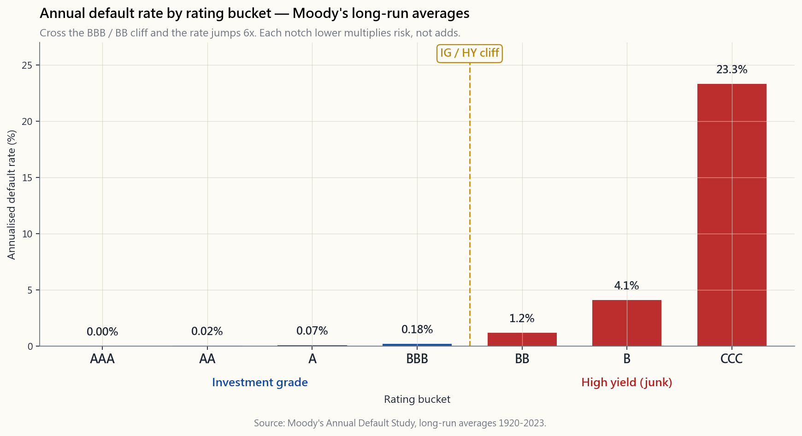
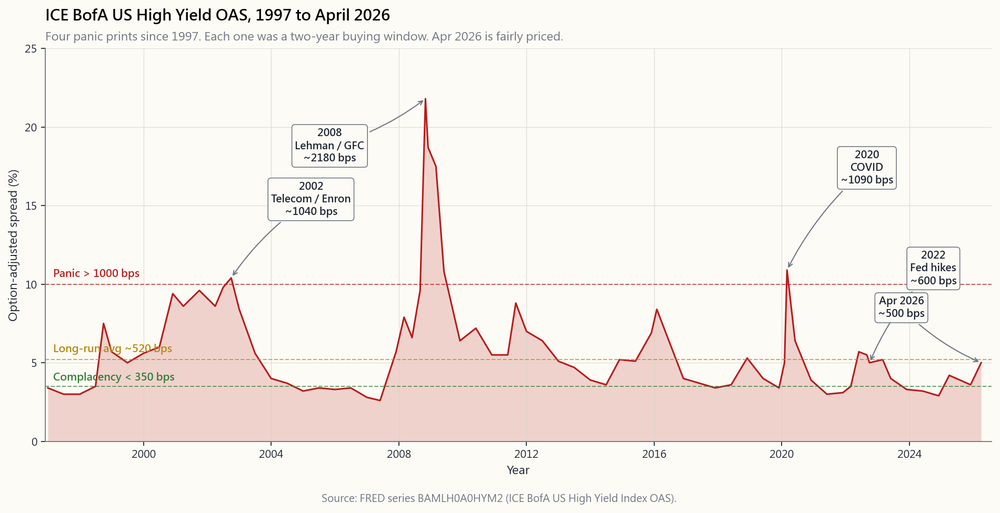

# 第三十三週：信用分析——投資級、高收益與利差

---

## 第一部分：閱讀材料

---

### 1. 為什麼這個話題重要

第5週介紹了債券合約與價格-收益率曲線。第8週研究了為票息提供資金的損益表。本週我們將兩者結合，並提出公司信用領域唯一真正重要的問題：**借款人究竟會不會還錢，而承擔其違約風險的合理補償是多少？**

信用是固定收益領域中數學從算術轉向概率的部分。以4.4%持有的10年期國債，以名義美元計算，是一筆無風險現金流。一隻10年期BB評級債券，以4.4% + 320個基點 = 7.6%的收益率計算，卻是一個現金流的**分佈**——右尾是「每一期票息和本金悉數收回」，左尾是「發行人在第4年申請破產重組，重組後每元只回收40仙」。320個基點的利差，就是市場為這個分佈所定的價格。

以下四點說明本課的意義所在。

1. **利差是債券市場的波動率指數。** 股票波幅常常佔據頭條（如波動率指數），但高收益期權調整利差——FRED上的`BAMLH0A0HYM2`——可以說是更好的領先指標。它在2008年11月突破2,000個基點，遠早於股市在2009年3月觸底。它在2020年3月達到1,100個基點，正好是股市低點的前幾天。波動率的尾部牽著狗——當信用尾部在哀嚎，股票這條狗很快也要跟上。
2. **投資級與高收益的邊界不是漸變，而是斷崖。** 評級為BBB-的債券被世界上每一個退休基金、互惠基金和保險公司持有，通常是出於授權要求。評級一降至BB+，一波被迫賣家隨即湧現。評級機構的邊界（Baa3/BBB-）是固定收益市場中最重要的價格不連續點。
3. **高收益是阿爾法來源，而不僅僅是票息流。** 真正的阿爾法來源——資訊、結構、投資期限、流動性不足和行為偏差——在這裡全都體現。高收益債券同時補償你這五項——研究不足、被僅限投資級授權的資金在結構上迴避、在壓力下流動性不足，以及在最糟糕的時候被情緒化拋售。在利差1,000個基點時買入高收益，是散戶投資者不需要槓桿也能找到的為數不多的不對稱交易之一。
4. **不了解債券組合在評級曲線上的位置，就無法理解任何「平衡型」投資組合。** 大多數「核心債券」基金（AGG、BND）100%持有投資級。大多數「收益型」基金（HYG、JNK）100%持有高收益。在經濟衰退下，這兩個組合的風險狀況相差甚遠。將兩者混淆——只追求收益率而不看評級——正是退休人士在第一年便蒙受重創的原因。

---

### 2. 你需要掌握的內容

#### 2.1 評級階梯

三家機構——穆迪、標普和惠譽——發布字母評級，將每個發行人劃入約二十個類別之一。對美國投資者而言，真正重要的類別如下：

| 層級               | 標普／惠譽           | 穆迪              | 通俗含義                                                     |
|--------------------|---------------------|------------------|--------------------------------------------------------------|
| 投資級             | AAA、AA、A、BBB     | Aaa、Aa、A、Baa   | 正常情況下違約可能性極低。符合退休基金持有資格。              |
| 高收益（「垃圾」） | BB、B、CCC          | Ba、B、Caa        | 違約是真實的概率。屬投機性質。                                |
| 困境級             | CC、C、D            | Ca、C、D          | 違約迫在眉睫或已經發生。                                      |

BBB-與BB+之間的界線，就是**投資級與高收益的分水嶺**。指數供應商和大多數受監管的投資者將這條線視為二元斷崖。一次在周五下午發生的跨線降級，可以在單一交易時段內令一隻債券的利差飆升100至300個基點——並非因為業務有所改變，而是因為**持有人基礎**必須改變。

在本課其餘部分，我們將評級階梯簡化為七個類別（AAA、AA、A、BBB、BB、B、CCC）——這正是違約統計數據中實際呈現的粒度。

#### 2.2 評級所預測的內容：年度違約率

穆迪每年發布一份按評級類別劃分的歷史違約率研究報告，追溯至1920年。長期平均值頗為驚人：

AAA評級債券在任何一年的違約率基本上為**零**。BBB評級債券——最低的投資級類別——每年違約率約為0.18%，即不到五百分之一。一旦跨越斷崖進入BB，違約率便跳升至約1.16%，單B則升至4.1%，CCC更高達23.3%。**這一遞進是非線性的**——每往下一個評級並非只是疊加風險，而是成倍放大風險。

有三點需要注意。第一，這些是**長期平均值**。在經濟衰退年份，BB違約率可達4%-6%，CCC可達35%-45%。尾部效應主導一切。第二，這些平均值假設週期重複——其中包含了1932年和2008年的數據。以此作為基準利率，而非預測。第三，違約≠全部損失。回收率是第二個關鍵因素。

#### 2.3 回收率與預期損失

當發行人違約時，債券持有人並非血本無歸。他們會經歷重組（美國的第11章破產保護），並根據資本結構中的**優先順序**回收部分本金：

- 有擔保債務：約65%-70%回收率
- 優先無擔保債務：約38%-42%回收率（即典型的「40%」）
- 次級債務：約25%-30%回收率
- 優先股／股票：0%-10%回收率

分析師實際使用的計算公式是每年的**預期損失（EL）**：

$$ EL = PD \times LGD = PD \times (1 - R) $$

其中$PD$為年化違約概率，$R$為回收率。對於優先無擔保的單B評級債券：

$$ EL = 4.1\% \times (1 - 40\%) = 4.1\% \times 0.60 = 2.46\%\ \text{（每年）}。 $$

這2.46%是債券名義收益率所需承擔的**信用損失稅**。若B評級債券的收益率為國債+425個基點，則**預期**超額回報為425 - 246 = 179個基點。餘下的179個基點是流動性溢價加風險溢價——是你**承擔**違約分佈而非僅支付其均值所獲得的補償。

#### 2.4 利差的構成

綜合以上分析，公司債券相對於相同到期日國債的利差可分解為三個組成部分：

$$ \text{利差} = \underbrace{PD \cdot (1-R)}_{\text{預期損失}} + \underbrace{\pi_{\text{流動性}}}_{\text{流動性溢價}} + \underbrace{\pi_{\text{風險}}}_{\text{風險溢價}}。 $$

對於投資級債券，預期損失極小（AA不到10個基點，BBB約30個基點），利差的大部分是流動性加風險溢價。一隻BBB債券在國債基礎上交易於130個基點，是在向你支付約25個基點的預期損失補償，以及約105個基點的「我必須在2008年不被強制賣出的情況下持有這隻債券」的溢價。

對於高收益債券，預期損失部分在正常時期佔利差的**大多數**。一隻B評級債券在425個基點的利差下，大致分拆為250個基點的損失與175個基點的溢價。在經濟衰退時期，比例則反轉：利差擴大至800至1,500個基點，但實際損失只是翻倍，因此風險溢價佔主導，對於在恐慌中買入的人而言，前瞻回報相當可觀。

#### 2.5 BAA和高收益系列：讀懂市場訊號

兩個FRED系列讓你實時掌握信用週期動態：

- **`BAA10Y`**——穆迪BAA（最低投資級）公司債收益率相對10年期國債的利差。長期平均值約190個基點。低於150個基點為「信用自滿」；高於350個基點為衰退定價。
- **`BAMLH0A0HYM2`**——ICE美銀美國高收益指數期權調整利差。長期平均值約520個基點。低於350個基點為「追逐收益率」；高於1,000個基點為真正的恐慌。

下圖為1997年以來的高收益系列走勢。注意四次利差飆升事件：

- **2002年**，約1,000個基點。電信和財務造假危機（世界通訊、安然）。高收益債券在1998年至2001年間大量向電信和能源行業發行；崩盤迫使市場按真實價值重新定價。
- **2008年**，11月峰值約2,180個基點。雷曼兄弟破產、貨幣市場凍結、風險資產無人問津。本系列的歷史最高點。
- **2020年**，3月中旬約1,100個基點。新冠疫情封鎖；利差在90天內完全收復，因為美聯儲宣佈將買入投資級和高收益交易所買賣基金。
- **2022年第四季**，約600個基點。40年來最快的美聯儲加息週期，令高收益存續期損失與利差擴大同時發生——罕見的「利率和信用同步下跌」局面。

2026年4月讀數：高收益期權調整利差接近長期平均水平——既非2020年「雙手買入」的1,000個基點水平，也非2007年或2021年「追逐收益率」的350個基點水平。一個沉悶但定價合理的信用市場。

#### 2.6 對散戶投資者的啟示

三點實際要點。

1. **不要在利差低於400個基點時買入高收益。** 那是「自滿區」——你所獲得的補償低於B評級債券的歷史預期損失。槓鈴策略的答案：當高收益估值偏貴時，正確做法是一端持有國債，另一端持有股票貝塔，而非在垃圾債券中勉強多搶50個基點。
2. **在利差達到800個基點以上時，大量買入高收益。** 1997年以來，每一次800個基點以上的寬幅均是一個長達2年的買入機會。行為阿爾法真實存在；在恐慌中買入高收益，是不需要期權或沽空就能找到的最純粹的行為阿爾法表達方式。
3. **使用交易所買賣基金，而非單一名稱。** 單隻B評級債券的違約風險是二元的；但對於由1,500隻債券組成的指數而言，違約風險是平滑的統計過程。HYG和JNK是典型的高收益交易所買賣基金；LQD是典型的投資級交易所買賣基金。堅持使用在美國上市的工具——那些才是散戶投資者實際上能夠使用的。

互動工具讓你調整每個槓桿——到期日、票息、國債收益率、利差、違約概率、回收率——並實時觀察隱含價格、信用調整後到期收益率、預期回報和損益平衡違約率的變化。試試2008年的預設情景：10年期、6%票息、4%國債、1,800個基點利差、6%違約概率、40%回收率。預期回報仍達每年+9%。這就是恐慌在數學上的面目。

[開啟互動式信用定價工具→](interactive/week33_credit_pricer.html)

---

### 3. 常見誤解

1. **「投資級是安全的。」** 投資級違約罕見，但回收率並非100%。雷曼兄弟在歸零的18個月前仍獲A評級。投資級保護你免受違約**頻率**的影響，而非違約**嚴重性**。
2. **「高收益的風險補償始終過高。」** 長期而言，高收益在扣除違約損失後，每年相對國債的超額回報約為200至300個基點。並不驚人，但確實存在，且與股票溢價的相關性以一種有用的方式保持低位。
3. **「BBB和BB基本相同。」** BBB進入每個退休基金的持倉範圍；BB則一個也沒有。這個斷崖是機構性的，而非信用基本面造成的，但它決定了交易動態。
4. **「信用利差能預測經濟衰退。」** 它能預測**信用壓力**。有時那是經濟衰退（2008年），有時是板塊崩盤（2002年），有時是波動率衝擊（2020年3月）。把它當作壓力指標，而非本地生產總值預測。
5. **「40%回收率是一個常數。」** 這是長期平均值。2008至2009年的回收率約為25%（大量債券同時進入重組），而2003至2007年約為55%（違約量少，回收速度較快）。
6. **「更高的收益率意味著更高的回報。」** 更高的**名義**收益率。扣除預期損失稅後，一隻CCC債券以超出國債1,500個基點的收益率交易，其**預期回報**可能低於一隻以350個基點交易的BB債券——因為25%的違約概率所吞噬的，遠超利差所補償的。
7. **「國債沒有信用風險，所以沒有任何風險。」** 存續期風險並非信用風險。2022年的國債在價格上損失了17%。這兩種風險性質不同，但都不是零。
8. **「高收益交易所買賣基金總會回升。」** 基金本身通常會——底層債券通常也會——但在恐慌低點賣出的持有人則不然。市場可以在你保持償付能力的時間之外繼續非理性運作——根據路徑而非終點來確定高收益倉位規模。

---

### 4. 問答環節

**問題1：信用利差與收益率利差有什麼區別？**
答：兩者是同一個數字的不同表達方式。「利差」通常指債券的期權調整收益率減去相同到期日的國債收益率，以基點報價。「收益率利差」有時指兩個公司債收益率之間的差值（例如高收益減投資級）。閱讀時留意圖例說明。

**問題2：為什麼BAA利差即使在違約率為零時也在150個基點附近觸底？**
答：流動性溢價和風險溢價不會降至零。即使是一隻絕對安全的公司債，也必須向你補償其流動性不及國債的溢價，以及你無法即時再融資的現實。150個基點大致是1980年以來跨越週期的底部水平。

**問題3：我應該偏好個別債券還是債券交易所買賣基金？**
答：對於國債，差別不大（無信用風險，流動性充裕）。對於公司債，散戶投資者應使用交易所買賣基金。個別債券的買賣差價寬、違約風險集中，而且信息優勢有利於交易商。阿爾法機會稀少——個別名稱的信用阿爾法是最稀缺的形式之一。

**問題4：在經濟衰退期間持有HYG的最大風險是什麼？**
答：在利差峰值時被迫賣出。基金本身運作正常（它可以持有違約債券直至重組完成），但如果你在1,500個基點的寬幅時恐慌性賣出，就會在回升之前實現損失。根據市場環境而非平均值來確定倉位規模。

**問題5：信用評級可靠嗎？**
答：整體尚算可靠，但有三點注意事項。（1）評級具有滯後性——評級變動跟隨市場利差，而非領先。（2）2007年的結構性產品評級存在嚴重錯誤。（3）主權評級存在政治偏見。對於普通美國公司債，評級是一個有用的起點。

**問題6：「墮落天使」是什麼意思？**
答：指發行時為投資級但其後被降級至高收益的債券。有趣之處在於技術性斷崖：僅限投資級授權的基金宇宙必須賣出，而高收益宇宙正在靜靜吸納。在下行過程中，利差通常會過度調整——這對有耐心的買家而言是一個結構性阿爾法來源。

**問題7：如何分解320個基點的利差？**
答：查找評級類別的年化違約率（例如BB約1.2%），乘以(1 - 40%)用於優先無擔保債券 = 72個基點的預期損失。餘下的248個基點是流動性加風險溢價。若債券有擔保，預期損失約為36個基點，溢價則相應增加。

**問題8：為什麼高收益利差以期權調整方式計算？**
答：大多數高收益債券是可贖回債券。在利率下降時，發行人的贖回期權會減少持有人的收益，因此單純的到期收益率會高估預期回報。期權調整利差（OAS）剔除贖回期權的價值，使你能夠在同等基礎上比較不同債券。`BAMLH0A0HYM2`和現代投資級指數均以期權調整利差報價。

**問題9：投資組合中高收益的合適比重是多少？**
答：將投資組合視為四個層次。高收益屬於「收益型」層次，與BBB投資級、房地產信託基金和期權收益策略並列——而非國債組合。對於中等風險的投資組合，5%至15%的高收益比重是合理的；僅在利差高於800個基點時才加碼。

**問題10：2022年的高收益回撤是否符合預期劇本？**
答：並不完全符合。利差僅擴大至約600個基點，但利率上升4%，令存續期損失與利差損失同時疊加。實際違約損失維持在長期平均水平附近（2023年約3%）。教訓在於：高收益的利率存續期也偏短——2022年的走勢將利率因素與信用因素分離，以一種教科書有時未必強調的方式。

**問題11：槓桿貸款能否替代高收益？**
答：信用風險相近（主要是B評級借款人），但票息是浮動利率。在利率上升時表現優於高收益（2022年），在利率下降時則遜於高收益（2020年第一季）。利率存續期不同，信用存續期相同。BKLN是散戶可用的工具。

**問題12：當信用利差收窄而股票波動性上升，這意味著什麼？**
答：通常是一個偽裝成利好的信號。信用領先於股票波動性——如果高收益不為所動，股票的波動性衝擊可能只是倉位調整，而非基本面問題。相反的背離（信用擴大、股票平靜）才是紅旗——這正是2007年7月實時發生的情況。
