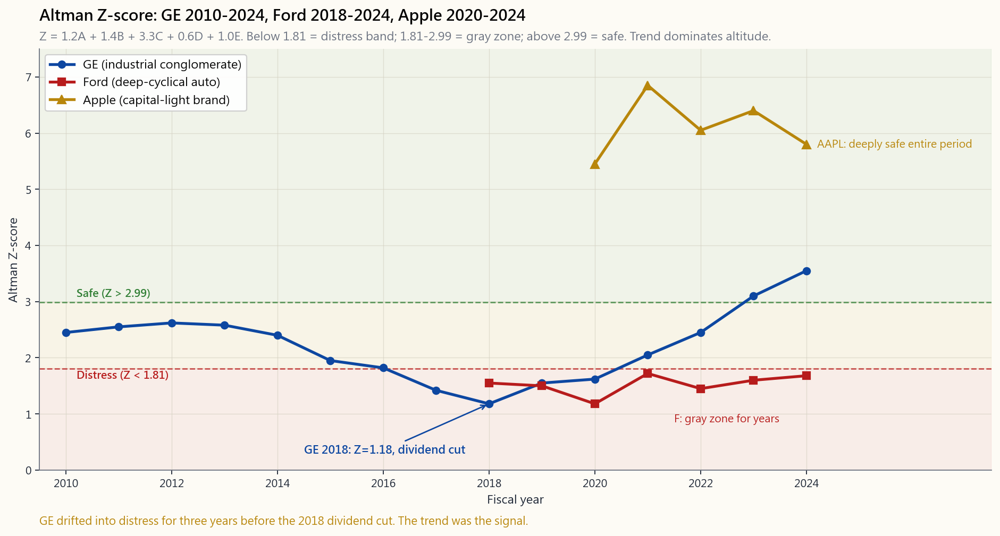

# 第三十五週：進階財務報表分析——杜邦分析、營運資金及財務困境模型

---

## 第一部分：閱讀章節

---

### 1. 為何此主題至關重要

第8週教你閱讀三張財務報表。第19週教你理解其背後的資本結構。第20週教你信任現金流多於盈利。第21週教你折現現金流。本週是操盤者的工具箱——專業分析師每個季度、針對每一隻股票，實際使用的少數精簡比率與評分模型，用以回答四個非常實際的問題：

1. **這家公司的股本回報率究竟從何而來？** 摩根大通17%的股本回報率，與福特汽車17%的股本回報率，本質上是截然不同的生物。前者建立在12倍資產負債表與4%利潤率之上，後者建立在7倍資產負債表與3%利潤率之上，各自做著性質迥異的事。杜邦分解將股本回報率拆分為三個（或五個）驅動因素，讓你能夠區分利潤率驅動型業務、�槓桿驅動型業務與資產周轉驅動型業務，並在其中任何一條腿開始搖晃時及時察覺。

2. **營運資金是順風還是阻力？** 一家在收到貨款前便已出貨、持有九十天庫存、三十天內付款給供應商的製造商，即使損益表看起來一切正常，也正在流失現金。現金轉換週期——應收帳款週轉天數加存貨周轉天數減應付帳款周轉天數——將這一切化為一個可逐季追蹤、並與競爭對手橫向比較的單一數字。

3. **盈利有否被人為調整？** Beneish M評分將八個比率合併為一個概率值，反映一家公司操控盈利的可能性。它無法捕捉所有舞弊（Wirecard的謊言屬於另一類），但Beneish在1997年便已標記出安隆，早於其崩潰整整三年。作為投資者，你不需要完美的探測器。你需要的，是一個能夠以足夠的頻率觸發警報、讓你切實打開10-K年報仔細審閱的工具。

4. **這家公司是持續經營的企業，還是正在走向破產保護？** 紐約大學教授愛德華·奧特曼於1968年發表的奧特曼Z評分，自發布以來幾乎未作修改，對未來兩年內破產風險的預測準確率約達80至90%。其門檻區間——1.81以下為困境區、1.81至2.99為灰色區、2.99以上為安全區——粗略而言，這正是其優點所在。粗略的規則能夠跨越不同市場環境存活；精密調校的規則則未必。阿爾法難得一見，但**避免負阿爾法**代價低廉，而一張零成本的十行試算表，正是最廉價的來源之一。

下方圖表展示了將五家性質迥異的企業並排比較時，杜邦分析所呈現的面貌。蘋果是利潤率機器，憑藉股份回購獲得顯著槓桿效應。摩根大通是槓桿機器，利潤率極薄，資產周轉率幾近於零。福特是周轉率機器，利潤率薄且槓桿不低。相同的13至17%股本回報率，卻以三種截然不同的方式製造出來，而每家公司走向0%股本回報率的路徑，也各有不同。

---

### 2. 你需要掌握的知識

#### 2.1 杜邦分解——三因素與五因素

最初的杜邦公式，以1920年代杜邦公司分析部門命名，是一個恆等式的數學運算：

$$ \text{股本回報率} \;=\; \frac{\text{純利}}{\text{股東權益}}
   \;=\; \underbrace{\frac{\text{純利}}{\text{銷售額}}}_{\text{淨利潤率}}
   \;\times\; \underbrace{\frac{\text{銷售額}}{\text{資產}}}_{\text{資產周轉率}}
   \;\times\; \underbrace{\frac{\text{資產}}{\text{股東權益}}}_{\text{權益乘數}} $$

中間兩個比率在代數上相互抵消。留存下來的，是對一家公司**如何**達致其股本回報率的描述。利潤率乘以周轉率是營運效率；權益乘數是槓桿。高股本回報率建立在利潤率之上，代表品牌或護城河業務；建立在周轉率之上，代表物流或規模業務；建立在槓桿之上，代表金融業務——或者，當非金融業務的槓桿上升時，則是一個早期預警信號。

五因素擴展版將利潤率進一步拆分為三個部分——稅務負擔、利息負擔與經營利潤率——以隔離盈利能力在何處受到擠壓：

$$ \text{股本回報率} \;=\; \frac{\text{純利}}{\text{稅前盈利}} \times \frac{\text{稅前盈利}}{\text{息稅前盈利}}
   \times \frac{\text{息稅前盈利}}{\text{銷售額}} \times \frac{\text{銷售額}}{\text{資產}}
   \times \frac{\text{資產}}{\text{股東權益}} $$

稅務負擔（純利/稅前盈利）與利息負擔（稅前盈利/息稅前盈利）均介於零與一之間，各是一個漏損。當股本回報率正在變動而你無法判斷是經營業務、稅制、債務成本、資產基礎，還是股份回購在起作用時，五因素版本便是你該使用的工具。答案幾乎總是不止一個因素。

以蘋果2024財年為例，三因素讀數大致為：淨利潤率24%×資產周轉率1.07×權益乘數6.4→股本回報率約165%。這個權益乘數並非惡意槓桿——它是自2013年以來7,250億美元股份回購的結果（第19週）。蘋果縮減分母的速度快於縮減分子。在此情況下，股本回報率已不再是衡量業務質素的指標；它衡量的是公司積極回購資本的力度。如需更清晰的讀數，請使用投入資本回報率（第21週）。

#### 2.2 現金轉換週期與營運資金效率

現金轉換週期（CCC）是一美元的投入支出在業務中被困多少天，才能以客戶現金的形式回流：

$$ \text{現金轉換週期} \;=\; \text{應收帳款週轉天數} + \text{存貨周轉天數} - \text{應付帳款周轉天數} $$

- **應收帳款週轉天數** = 應收帳款 / 收入 × 365。客戶需要多長時間才付款給你。
- **存貨周轉天數** = 存貨 / 銷售成本 × 365。產品在售出前擱置多長時間。
- **應付帳款周轉天數** = 應付帳款 / 銷售成本 × 365。你需要多長時間才付款給供應商。

負的現金轉換週期——蘋果、好市多、亞馬遜——意味著供應商為你的存貨提供融資。你在使用浮存金運營。正的現金轉換週期則意味著**你**在為供應鏈提供融資，這是一種隨收入增長而擴大的營運資金稅。觀察趨勢比關注絕對水平更為重要。應收帳款週轉天數連續三個季度上升，是收入確認問題最可靠的預警信號之一。

每位分析師最終都會內化的第二個營運資金比率，是**應計項目比率**：

$$ \text{應計項目比率} \;=\; \frac{\Delta\text{營運資金} - \Delta\text{現金}}
                                       {\text{平均總資產}} $$

這是Sloan（1996）應計項目異象的概括形式（見第20週，[image/week20_accruals_anomaly.png](../image/week20_accruals_anomaly.png)）。高正值意味著損益表領先於現金流量表——公司確認收入和盈利的速度快於現金到達的速度。Sloan的五分位差距平均每年約9%，三十年來從未逆轉。

#### 2.3 Beneish M評分——盈利操控探測器

Daniel Beneish於1999年的論文將八個單年度變化比率合併為一個類概率得分。助記法：DSRI、GMI、AQI、SGI、DEPI、SGAI、LVGI、TATA。你很少需要手動計算——你的數據提供商會代勞——但直覺至關重要：

| 變量 | 所捕捉的信號 |
|---|---|
| **DSRI** 應收帳款天數指數 | 應收帳款增速快於銷售增速 |
| **GMI** 毛利率指數 | 毛利率逐年惡化 |
| **AQI** 資產質素指數 | 非流動非固定資產上升（資本化成本） |
| **SGI** 銷售增長指數 | 激進增長誘使管理層平滑業績 |
| **DEPI** 折舊指數 | 折舊放緩（延長使用年限） |
| **SGAI** 銷售及行政費用指數 | 銷售及行政費用增速快於銷售增速 |
| **LVGI** 槓桿指數 | 槓桿上升 |
| **TATA** 總應計項目佔總資產比 | Sloan異象的應計項目部分 |

綜合評分公式為：

$$ M \;=\; -4.84 + 0.92 \cdot \text{DSRI} + 0.528 \cdot \text{GMI} + 0.404 \cdot \text{AQI}
   + 0.892 \cdot \text{SGI} + 0.115 \cdot \text{DEPI} - 0.172 \cdot \text{SGAI}
   - 0.327 \cdot \text{LVGI} + 4.679 \cdot \text{TATA} $$

評分高於−1.78的公司被歸類為「可能的操控者」。Beneish以74家已知操控者進行回測，命中率約76%，誤報率約17%。此模型曾在1997至1998年標記安隆、1999年標記世通，以及2014年標記Valeant。它錯過了Wirecard，原因在於Wirecard的舞弊並非盈利操控——它只是捏造了現金結餘，屬於不同類型的謊言，在M評分上不留任何痕跡。教訓在於：M評分是一個**篩選過濾器**——幫你找到應該深入閱讀的數字，而非裁決。當它亮起紅燈，你就仔細閱讀10-K年報；當它沒有亮燈，你依然要閱讀，只是緊迫性稍低而已。

#### 2.4 奧特曼Z評分——破產預測

紐約大學愛德華·奧特曼，1968年。針對33家破產與33家非破產製造商進行多元判別分析。適用於上市公司的原始公式：

$$ Z \;=\; 1.2 \, A + 1.4 \, B + 3.3 \, C + 0.6 \, D + 1.0 \, E $$

| 項目 | 定義 | 解讀 |
|---|---|---|
| A | 營運資金 / 總資產 | 短期流動性緩衝 |
| B | 留存盈利 / 總資產 | 累計盈利能力 |
| C | 息稅前盈利 / 總資產 | 資產的經營生產力 |
| D | 股票市值 / 總負債 | 經市場驗證的償付能力緩衝 |
| E | 銷售額 / 總資產 | 資產周轉率 |

臨界值如下：

- **Z > 2.99** — 「安全」區。未來兩年內破產屬罕見。
- **1.81 ≤ Z ≤ 2.99** — 灰色區。列入觀察名單。
- **Z < 1.81** — 困境區。破產概率顯著上升。

兩點警示。其一，奧特曼以擁有公開股票的美國製造商為樣本對模型進行校準。變體版本——Z'適用於非上市公司，Z''適用於非製造業及新興市場——會調整係數與臨界值，請使用正確的版本。其二，Z評分是一個雜訊較多的單點估計；**趨勢**比任何單次讀數更為重要。通用電氣的Z評分從2012年的2.6逐步下滑至2018年的1.2，比股息削減與分拆早了三年。趨勢線才是信號；絕對水平不過是雜訊。

下方圖表呈現三條走勢曲線：通用電氣2010至2024年（惡化後復甦的曲線）、福特2018至2024年（長期停留在灰色區，對一家週期性企業而言大致貼切），以及蘋果2020至2024年（深處安全區，品牌業務配以乾淨資產負債表的典型形態）。同一模型，同一臨界值，卻講述了三個截然不同的故事。

#### 2.5 融會貫通——兩頁健康檢查清單

在實際操作中，對一個新持倉進行初步盡職調查的精簡清單如下：

1. **過去5年的杜邦三因素與五因素分析。** 各因素中是否有任何一個正在朝著管理層故事無法解釋的方向移動？
2. **過去8個季度的現金轉換週期。** 方向比水平更重要。與兩家指名競爭對手作比較。
3. **過去5年的應計項目比率。** 持續正值是黃旗警示。
4. **最新財年的Beneish M評分。** 高於−1.78是黃旗。高於−1.0是紅旗。
5. **過去5年的奧特曼Z評分。** 連續兩年低於1.81是一個倉位規模問題。穿越灰色區持續下行是一個研究問題。

這一切都不是傳統意義上的阿爾法生成。它的本質恰恰相反：它是**負阿爾法過濾器**。大多數業餘投資組合跑輸大市，並非因為未能找到下一個蘋果，而是因為他們持有了貝爾斯登、Valeant或2017年前後的通用電氣——而只需五分鐘的篩選，便足以讓他們停下來三思。本週課程末尾的[互動實驗室](interactive/week35_fsa_lab.html)，讓你選擇預設公司或輸入自己的數字，實時觀察Z評分區間分類的變化。

**陳馬的觀點——這項工作本質上是防禦性的，而非進攻性的，而教科書悄悄地誤導了我們的理解框架。** 正統的CFA框架將現金流折現法、質素篩選與Z評分置於**阿爾法生成**的一側——彷彿一位細心的分析師，手持這些工具與一張乾淨的試算表，便能系統性地挑出其他市場參與者所遺漏的贏家。以我個人的經驗，這種解讀方式是錯誤的。市場對的次數，遠多於我對的次數。真正清晰可表述的錯誤定價——那些我能夠指出群眾究竟在哪裡錯了、以及為何如此的罕見時刻——並非現金流折現法所能產生的；現金流折現法所產生的，是一個大致與股票現價重疊（在一個寬泛區間內）的公允價值範圍。誠實的解讀是：整套工具箱都是**負阿爾法過濾**——它阻止你站在一個其餘市場參與者已經定價在內的不對稱錯誤定價的錯誤一方。

這種重新定位改變了你分配時間的方式。如果你把財務報表分析工作視為阿爾法生成，你會在邊際標的上更費力氣，尋找一個很可能根本不存在的優勢，並在說服自己找到了優勢時過度交易。如果你把它視為負阿爾法過濾器——作為決定哪些標的**從不進入**投資組合的篩選器——你就能以同樣的時間做更有意義的事。本課程的真正優勢在別處：宏觀分析、板塊輪動、結構性資金流錯誤定價，以及偶爾出現的稅務或工具結構優勢。自下而上的工具箱，是讓你避免持有下一個Valeant的防線，**而非**幫你找到下一個蘋果的指南針。值得認真對待，但不值得誤以為是回報的來源。

---

### 3. 常見誤解

1. **「高股本回報率永遠是好事。」** 完全建立在上升的權益乘數之上的高股本回報率，是偽裝的槓桿。先作分解，再加以欣賞。
2. **「杜邦不過是簿記算術。」** 它是恆等式算術，但每個因素的**變化**才是信息。利潤率在壓縮而周轉率和槓桿保持不變，準確地告訴你應該調查損益表的哪一行。
3. **「負的現金轉換週期是追求的目標。」** 它是供應商議價能力與客戶付款條款的**結果**，無法憑空為之；通過激進地拖延付款來追逐負的現金轉換週期，會損害供應商關係，並在經濟衰退時崩潰瓦解。
4. **「Beneish M評分是舞弊探測器。」** 它探測的是會計操控的**痕跡**——應收帳款、應計項目與利潤率的變化。完全繞過帳簿的舞弊（捏造現金餘額、偽造發票、關聯交易）不會留下任何M評分痕跡。
5. **「奧特曼Z低於1.81意味著破產。」** 它意味著未來兩年破產的**概率顯著上升**，而非必然。許多公司在困境區停留多年後成功脫困。許多灰色區的公司也歸零倒閉。請將其用作倉位規模與研究信號，而非孤立使用的退出信號。
6. **「這些模型對銀行和保險公司同樣適用。」** 並非如此。銀行的資產負債表主要由金融資產構成；資產周轉率毫無意義，Z評分必須使用變體版本。應改用有形股本回報率（ROTCE）和有形帳面價值趨勢。
7. **「你需要Bloomberg終端才能做這些分析。」** 你需要一個美國證監會EDGAR帳戶，它是免費的，以及一個計算器。本週課程中的每個比率，都可以在三十分鐘內從10-K年報計算出來。
8. **「如果M評分和Z評分看起來都正常，公司就是安全的。」** 它們是必要條件，而非充分條件。Wirecard兩項評分均正常。伯尼·麥道夫的「基金」亦然。這些模型評分的是**帳簿上的內容**，無法審計帳簿是否真實。

---

### 4. 問答環節

**問：我應該使用三因素杜邦還是五因素杜邦？**
答：在對多個標的進行篩選時，從三因素開始。當其中一個因素正在移動而你需要判斷是稅務、利息，還是經營利潤率在起作用時，再使用五因素版本。五因素對於跨國比較也必不可少，因為各司法管轄區的稅務負擔存在顯著差異。

**問：我應該多久重新計算一次這些比率？**
答：每個季度當10-Q季報發布時計算一次，並於每年一月對10-K年報進行一次完整覆核。營運資金比率季度間波動較大；過去4至8個季度的趨勢，遠比任何單一數據點更重要。

**問：一家乾淨的藍籌股，M評分的典型範圍是多少？**
答：對於成熟、增長緩慢的美國大型股，M評分通常在−2.5至−3.0之間。蘋果、微軟、可口可樂、摩根大通均輕鬆低於−1.78的門檻。激進增長型標的通常評分在−2.0至−1.5之間，僅僅因為銷售增長指數（SGI）偏高；這是模型的特性，不一定是操控信號。

**問：四個模型中，哪個最有用？**
答：坦白說，是現金轉換週期。它對報告風格最為穩健，最容易計算，最難在不於其他地方留下痕跡的情況下造假，且與業務的實際運營現實最為直接相關。M評分和Z評分是綜合評分；現金轉換週期是對業務實際情況的量度。

**問：我可以對交易所買賣基金或互惠基金使用Z評分嗎？**
答：不行。Z評分需要單一企業的資產負債表。對於基金或交易所買賣基金，你需要匯總持倉——Bloomberg等工具會報告指數交易所買賣基金的加權平均Z評分，但解讀較為寬泛。該模型是為單一企業的財務困境預測而設計的，並非用於投資組合風險。

**問：應收帳款週轉天數和存貨周轉天數的正確基準是什麼？**
答：10-K年報競爭章節中點名的競爭對手，以及行業中位數。方向比水平更重要。一家零售商存貨周轉天數90天而競爭對手為60天應當警惕；一家零售商自身存貨周轉天數在四個季度內從60天增至90天，則應更加警惕。

**問：為何蘋果的權益乘數看起來如此極端？**
答：股份回購所致。蘋果自2013年以來已回購約7,250億美元的股份（見第19週圖表）。股本回報率分母的縮減速度快於分子。股本回報率逾150%的讀數是真實的算術結果，但在這種情況下，它並非衡量業務質素的有意義指標。請改用投入資本回報率或有形資產回報率。

**問：M評分在發表25年後是否仍然有效？**
答：有效性較發表之初有所下降，但並未崩潰。它所捕捉的機械關係——應收帳款增速快於銷售增速、毛利率惡化、應計項目持續正值——依然是盈利操控的實際物理痕跡。公式的公開披露**提高了粗糙操控的成本**，這本身就是一種有效性的體現。

**問：這與陳馬的四組別框架如何銜接？**
答：主要與第二組別（因子/質素倉）和第三組別（主動管理/個股阿爾法）相關。第一組別（被動指數）不需要這些；你已買入一籃子股票。第四組別（現金及備用彈藥）也不需要。中間兩個組別是「關注現金、關注質素」的阿爾法來源所在，而這些正是使這種關注具體化的比率。

**問：我持有一隻Z評分偏低的股票。我應該賣出嗎？**
答：不應單憑評分便作此決定。首先檢查趨勢（是持續惡化、趨於穩定，還是正在復甦？）。其次核實公司是否被正確分類——銀行、房地產信託基金、保險及輕資產科技股，其行為與1968年的製造商並不相同。第三，觀察債券市場：若該公司債務的信用利差並未擴大，則債券市場不認同股票模型的判斷。Z評分趨勢惡化與信用利差同步擴大的組合，才是可採取行動的信號，而非兩者之一單獨出現。

**問：管理層可以對這些比率進行美化嗎？**
答：可以，均可部分美化。營運資金可在季末進行橱窗粉飾（應收帳款保理、拖延付款給供應商）。利潤率可通過更改存貨會計方法加以平滑。即使破產概率也可通過債轉股交易提升帳面股東權益而在一個季度內暫時降低。防禦之道在於趨勢，而非單點數據。一家持續美化某一比率的公司，最終必然會在另一個比率上露出馬腳。
