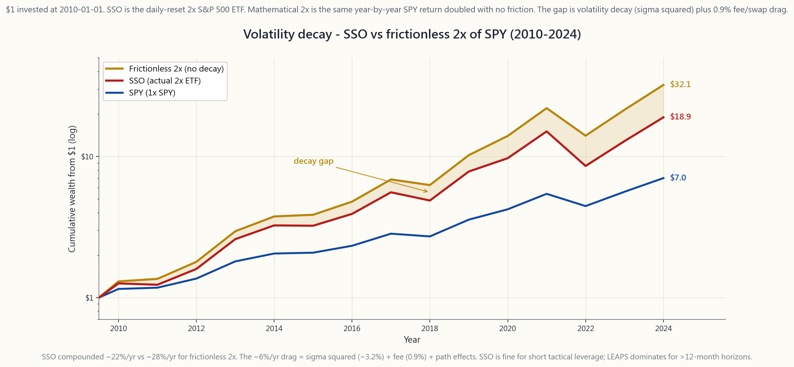

# 第三十七週：期權作為槓桿——以深度價內認購期權替代股票

---

## 第一部分：閱讀材料

---

### 1. 為什麼這一課至關重要

大多數散戶投資者一聽到「期權是槓桿」，腦海中浮現的便是彩票——在業績公布前買入價外認購期權，一週暴漲500%，下一週歸零。這只是期權世界的一個角落，而且幾乎所有人都在這個角落虧損。機構投資者的做法截然不同：一張深度價內長期期權可以以25-35%的資本，複製約90%的股票經濟敞口，同時將餘下65-75%的現金投入無風險國債賺取收益。這不是賭博，而是**股票替代策略**，也是槓鈴式構建——沉悶的核心加上集中的阿爾法策略袖，以稅務高效的期權槓桿融資——在真實賬戶中最典型的呈現方式之一。

這堂課位於L3課程核心，有四個原因。

1. **資本效率，無需保證金。** 深度價內認購期權沒有維持保證金追繳、沒有隔夜融資額度，也沒有強制平倉風險。最大虧損僅限於期權金。保證金可以令你蒙受超過賬戶價值的損失；但長倉期權不會。
2. **稅務幾何效益。** 持有長期期權超過一年，所得收益可按長期資本增值徵稅，稅率為15-20%，與持有股票相同。雖然沒有股息，但亦無保證金或2倍槓桿交易所買賣基金那樣的年度融資成本拖累。期權是美國散戶投資者可使用的最具稅務效率的槓桿工具；本課將以數據證明這一點。
3. **相對槓桿交易所買賣基金的清晰優勢。** 像SSO（2倍標普500）和QLD（2倍納斯達克）這類產品每日重置，在任何非單調上行的走勢中都會出現**波動性損耗**。2010至2024年間，SSO年複合回報率約22%，而無摩擦的數學2倍標普理應達約28%——每年約6個百分點的最終財富拖累。深度價內長期期權不會每日重置，也不會以同樣方式損耗。
4. **風險認知。** 使0.90Δ認購期權高效的相同機制，也帶來了大多數投資者從未定價的新風險：價差短腿的被行使風險、放棄股息的成本、長期期權小而真實的時間值，以及在波動率飆升後買入時面臨的引伸波幅急跌風險。了解如何調整和滾動股票替代認購期權，正是區分彩票交易者與槓桿投資者的分水嶺。

本課是這種區分的操作手冊。

---

### 2. 你需要掌握的知識

#### 2.1 貝塔Δ是槓桿的調節器

認購期權的貝塔Δ是期權價格相對於正股的一階導數。0.50Δ的期權，正股每上漲1元，期權約上漲50仙；0.90Δ的期權約上漲90仙。就股票替代策略而言，**貝塔Δ是槓桿的調節器**：

- **0.90Δ深度價內12個月認購期權** ≈ 90%的股票敞口，約佔股票資本的25-30%。
- **0.70Δ中度價內6個月認購期權** ≈ 70%的股票敞口，約佔股票資本的12-18%。
- **0.30Δ接近等價3-6個月認購期權** ≈ 30%的股票敞口，約佔股票資本的3-6%。
- **0.10Δ價外短期認購期權** ≈ 10%的股票敞口，不足股票資本的1%——即彩票式投機。

隨著貝塔Δ往下走，資本減少、槓桿上升，但時間值損耗加劇、波動率風險上升，期權到期時價內的概率也降低。股票替代策略幾乎只在0.80-0.95Δ區間、9至15個月到期日運作。在這個區間，外在價值相對於所控制的美元敞口而言較小。

以數字作錨點：SPY報$520，2027年1月（2026年4月起約9個月後）行使價$416的認購期權（行使價為現價的80%），在σ=19%、r=4.3%時，定價約$123，貝塔Δ為0.92。每張合約控制$52,000的SPY敞口，期權金僅需$12,300——約為正股的24仙。

#### 2.2 你釋放的資本是真實的回報

股票替代策略中較安靜的一半，是你**不需要**動用的現金。若一張0.92Δ長期期權以$12,300複製$52,000 SPY敞口的92%，剩餘$39,700便留在賬戶中。2026年4月，3個月短期國庫券收益率約4.3%，貨幣市場基金（SGOV、BIL）追蹤同一水平，這些現金並非閒置——每年帶來約$1,700的票息，雖按一般收入徵稅，但這是**額外回報**，買入持有股票的投資者無法獲得，因為他們的$52,000已全部部署。

持有9個月期間，釋放現金的套息回報約為總經濟回報增加3.0-3.3個百分點，足以全部或部分抵銷所放棄的SPY股息（SPY過去12個月股息率約1.3%），以及期權的外在價值損耗（0.92Δ長期期權9個月內約1.5-2.5%）。扣除三者後，深度價內長期期權在**純價格回報**上與直接持股大致相當，但僅動用四分之一的資本。其餘四分之三可投入短期國庫券，或用於資助四档槓鈴策略的其他部分。

#### 2.3 你所承擔的風險

1. **時間值損耗（Theta）。** 深度價內長期認購期權的時間值損耗較小——通常每日約為正股的0.02-0.05%——但它真實存在，是槓桿的成本。行使價愈接近現價、到期日愈近，這個數字便愈大。
2. **引伸波幅急跌。** 若你以25%引伸波幅買入長期期權，而引伸波幅回落至18%，即使股票不動，你也因波動率損失。解決方法：除非明確做多波動率，否則不要在VIX高於25時買入長期期權。
3. **放棄股息。** 長倉認購期權持有者不獲正股的股息。對SPY（1.3%）而言影響較小；對高息股如KO（3%）或VZ（6%）而言，這是結構性成本——高息股的長期期權替代策略的昂貴程度，若不仔細核查，模型無法完全反映。
4. **短腿被提早行使。** 純長倉認購期權不會被行使（你是持有方）。但若你在長期期權上配搭沽出短期認購期權以降低成本（「對角價差」），短腿可能在高息正股除息日前一天被提早行使。
5. **流動性。** SPY、QQQ、蘋果、微軟、英偉達、亞馬遜的長期期權流動性充裕；細價股及大多數國際預托證券的長期期權則流動性不足。在流動性差的標的上進行股票替代，利潤將被買賣差價侵蝕殆盡。

#### 2.4 稅務全景

對美國應稅投資者而言，長期期權作為槓桿工具在稅務方面的優勢，在整個期權世界中是最清晰的。

- **持有超過365天，獲利平倉 → 長期資本增值。** 稅率與股票相同，均為15-20%。
- **虧損平倉 → 一般資本虧損**，可抵銷其他資本增值，每年最多$3,000可抵銷一般收入，餘額可結轉。
- **無按市值計算規則。** 與第1256條款（廣基指數期貨及部分指數期權）不同，個股及大多數交易所買賣基金期權遵循標準股票期權稅務規則——收益僅在平倉時確認。
- **無融資成本稅務申報。** 保證金利息只能抵扣投資收入，一般而言摩擦成本不划算。長期期權定價中隱含的融資成本**不可扣稅**，但對任何人而言亦非應稅收入——這是合約的特性，而非稅務事件。

與2倍交易所買賣基金（SSO、QLD）相比：每年ProShares均會傳遞來自掉期對手方的虛擬利息收入及資本增值分派，按一般或短期稅率徵稅。長期期權讓你以更優惠的稅務結構享有槓桿。

#### 2.5 與2倍槓桿交易所買賣基金的比較

散戶最常選擇的指數槓桿替代品是每日重置的2倍交易所買賣基金：SSO（2倍標普500）、QLD（2倍納斯達克100），以及UPRO/TQQQ（3倍）。它們有一個重大問題——**路徑依賴性**。

每日重置2倍交易所買賣基金的年化回報率約為：
$$ r_{\text{2x},\text{年化}} \approx 2 r - \sigma^2 $$
其中$r$為正股年化回報，$\sigma^2$為已實現方差。標普500的$\sigma \approx 18\%$，$\sigma^2$項每年造成約3.2%的機械性拖累。實際上，2010至2024年間，SSO年複合回報率約22%，而無摩擦的數學2倍SPY應約達28%。SSO並未崩潰——只是跑輸數學結果的幅度，使任何超過12個月的持倉成本高昂。

0.92Δ長期期權沒有這個問題。它以約0.92倍正股價格回報複利增長，加減小幅外在價值損耗，無需每日重置，因此亦無$\sigma^2$拖累。這是機構交易台在槓鈴策略中使用長期單一標的期權而非槓桿交易所買賣基金的最重要原因。

2倍交易所買賣基金確有一項優勢：它支付（微薄的）股息，可在任何賬戶持有，且無需滾動。對於想要適度槓桿且不需要主動管理的被動管理投資者而言，SSO尚可接受。但對於主動運作L2/L3策略袖的任何人，長期期權在資本效率、稅務及路徑獨立性上均勝出。

#### 2.6 如何為股票替代倉位定規模

交易台的三條準則。

1. **以名義敞口計算，而非期權金。** 按合約所控制的美元敞口（貝塔Δ × 100 × 現價）計算規模，而非以現金支出計算。單張0.92Δ SPY長期期權控制約$48,000的SPY敞口。若策略袖目標為$100,000 SPY，應買入2張合約，而非8張。
2. **將到期日與投資主題匹配。** 若你的觀點為12-18個月，買入15個月的長期期權。若觀點為3個月，買入5個月期並接受30%的外在價值。不要買入每週期權並稱之為槓桿；那是以Theta作為持倉成本的方向性押注。
3. **按日曆滾動，而非按價格滾動。** 當長期期權剩餘90天時滾動，切勿更遲。任何期權存續期最後60天，外在價值損耗最快，Gamma風險也最大。在90天到期時滾動，可保留深度價內的特性。

請嘗試[替代策略實驗室](interactive/week37_replacement_lab.html)互動工具——選擇目標股票敞口，觀察資本、盈虧平衡點、釋放現金收益率及總回報如何隨直接持股、三種長期期權貝塔Δ及SSO的變化而移動。

---

### 3. 常見誤解

1. **「期權槓桿是賭博。」** 價外短期認購期權才是賭博。深度價內長期認購期權是有定義最大虧損的槓桿。同一類工具，行使價和到期日決定了你買的是哪種。
2. **「我應該買等價認購期權，因為較便宜。」** 等價期權的外在價值佔期權金比例最高——你正在為相同敞口支付最大的時間值損耗，而0.90Δ的認購期權僅需三分之一的外在價值。
3. **「長期期權是用來長期持有多年的。」** 長期期權是用來每9至15個月在剩餘90天以上時**滾動**的。持有至到期的長期期權，不過是買股票的昂貴方式。
4. **「SSO與長期期權相同，但更簡單。」** SSO在多年持有期間有每年3-6%的波動性損耗，長期期權則沒有。5至10年後，這一差距主導一切其他因素。
5. **「保證金與期權槓桿相同。」** 保證金可以令你整個賬戶爆倉；長倉期權不會。保證金的稅務處理不同。保證金需要維持比率。兩者並非替代品，而是不同的工具。
6. **「我只需在業績前買入槓桿認購期權。」** 業績公布後的引伸波幅急跌，通常在業績發布翌日早上即使股票朝有利方向移動，也會蒸發期權30-50%的價值。這種工具不適合這一投資主題。
7. **「長期期權流動性差。」** 在SPY、QQQ、前50名單一股票及大多數大型交易所買賣基金上，長期期權差價為1-3%。在此範圍以外的標的，差價可達10-20%。
8. **「釋放的現金應放在活期賬戶。」** SGOV和BIL是1天結算的短期國庫券交易所買賣基金，2026年4月收益率約4.3%。不賺取無風險利率的現金是永久性的收益損失。
9. **「股息無關緊要。」** 對於一年期長期期權而言，一隻6%股息率的股票意味著你放棄了6%的回報。這已超過期權的外在價值。股票替代策略適用於低息股。
10. **「只要持有長期期權超過365天便算長期。」** 對於單獨持有的長倉長期期權而言確實如此。但若與任何短腿期權組合，或與相關股票倉位產生洗售，持有期規則可能重置。若你進行滾動操作，請做好記錄。

---

### 4. 問答環節

**問1. 行使價應該設多深？**
現價的80-85%是最佳區間。在正常波動率下，12個月到期的情況下，貝塔Δ約為0.85-0.95，這個區間的外在價值最少，卻能提供接近股票的敞口。

**問2. 如果我買入長期期權後翌日股票下跌10%，怎麼辦？**
你的0.92Δ長期期權將損失約92%的跌幅，即正股價值的約9.2%。以期權金計算的百分比損失大於10%——這正是槓桿效應。最大虧損仍限於所支付的期權金。

**問3. 應該在個股還是指數上操作？**
個股長期期權適用於前50名美國大型股，流動性較好。指數（SPY、QQQ、IWM）是典型使用場景，因流動性最佳，且個股跳空缺口風險較低。

**問4. 到期日應該選多長？**
買入時選12至18個月，剩餘90天時滾動。不足9個月的時間值損耗過重；超過24個月在典型行使價的流動性通常不足。

**問5. 這與四档策略框架如何配合？**
股票替代策略將L1貝塔策略袖的資本從100%壓縮至約25%，釋放75%用於資助L2和L3策略袖，同時不減少股票敞口。這正是槓鈴策略背後的操作機制。

**問6. 在SPY上運行此策略的全部成本是多少？**
大約：放棄SPY股息（1.3%/年）+ 長期期權外在價值損耗（2-3%/年）- 賺取的釋放現金短期國庫券收益（釋放75%現金約3.0%/年）= 淨成本約0-0.5%/年。加上佣金及每12個月一次的買賣差價（約0.3%）。

**問7. 可以在羅斯個人退休賬戶中操作嗎？**
可以——大多數經紀（Schwab、Fidelity、IBKR）允許在個人退休賬戶中買入包括長期期權在內的長倉認購期權。個人退休賬戶不能進行裸賣空期權或使用保證金，但股票替代長倉認購期權是允許的，釋放的現金在羅斯個人退休賬戶內免稅賺取國庫券收益。

**問8. 引伸波幅值得追蹤嗎？**
值得。在標的的引伸波幅排名低於50時（最好低於30）買入長期期權。高引伸波幅的長期期權包含昂貴的波動率溢價，即使股票不動，隨著引伸波幅均值回歸，溢價也會損耗。

**問9. 應該在長期期權上加賣認購期權以降低成本嗎？**
那是窮人備兌認購期權策略（PMCC）——第30週已涵蓋。這確實可降低持倉成本，但也封頂了上行空間，並引入短腿被行使的風險。純股票替代策略應保持長期期權的單純長倉。

**問10. 與在IBKR使用組合保證金相比如何？**
組合保證金可達4-6倍槓桿，但2026年借款利率為6-7%，且在跳空下跌時會面臨強制平倉風險。長期期權沒有追繳保證金風險。對於能承受追繳保證金風險且交易規模足夠達到組合保證金資格的投資者，每單位槓桿的成本可能相近；對其他所有人而言，長期期權在操作風險上勝出。

**問11. TQQQ/UPRO（3倍）又如何？**
與SSO相同，但更嚴峻。年化損耗約為$3\sigma^2 - \text{融資成本}$，在納斯達克100上意味著每年8-12%的拖累。5年以上，TQQQ的表現遠遜於QQQ上的3倍長期期權組合。3倍交易所買賣基金僅應作短期戰術性工具使用。

**問12. 此策略在什麼情況下失效？**
三種市況：（1）持續多年的回撤——長期期權可能在你能夠滾動之前歸零；（2）高波動率反覆震盪市場——在波動率飆升後買入，引伸波幅急跌可能蒸發20-30%的期權金；（3）任何流動性差的標的，買賣差價侵蝕全部釋放現金套息回報。請堅守前50名標的，並確保引伸波幅排名低於50。

---

## 第二部分：YouTube 腳本

---

**視頻標題：** 以深度價內認購期權替代股票——真實資本、真實數學、真實風險

**目標時長：** 約18分鐘
**主持：** 陳馬、小魚

---

**[片頭 — 0:00-1:30]**

**小魚：** 歡迎回到Chan Investing頻道。我是小魚，今天我們進入第37週——以期權作為槓桿。具體而言，是以一張深度價內認購期權替代100股股票的交易。陳馬，你說過這是散戶投資者能運行的最乾淨的槓桿交易。為什麼？

**陳馬：** 因為這是難得一見的槓桿交易——不需要保證金、跳空下跌也不會爆倉，而且稅務處理幾乎與直接持股相同。大多數散戶聽到「期權是槓桿」，以為自己明白其中的意思——買入每週認購期權，祈望一飛衝天。那是賭博。機構的版本截然不同，叫做股票替代策略，數學邏輯一旦深入研究，是非常引人入勝的。

**小魚：** 今天我們將分三部分講解：這筆交易的實質內容、與直接持股及槓桿交易所買賣基金的資本對比數學，以及相關風險。我們有兩張圖表和一個互動工具。先看資本對比圖。

**[第一節 — 替代策略資本圖表，1:30-5:00]**

**[VISUAL: image/week37_replacement_capital.png]**

**陳馬：** 這張圖提出了一個問題：如果我想獲得$10,000的SPY敞口，需要多少成本？第一條柱——直接持股——答案顯而易見：$10,000的敞口需要$10,000，持有SPY約19股，如此而已。

**小魚：** 第二條柱呢？

**陳馬：** 12個月深度價內認購期權。行使價為現價的80%，即$416，貝塔Δ約0.92。每張合約的期權金約為每股$123，即$12,300，控制$52,000的SPY敞口。換算回$10,000的敞口，你只需支付約$2,400。以24仙的成本，複製92%的SPY走勢。

**小魚：** 釋放出的$7,600怎麼辦？

**陳馬：** 買入短期國庫券。SGOV截至2026年4月的滾動分派收益率約4.3%。所以那$7,600在未來一年帶來約$325——與SPY倉位完全分開的額外收益。這就是每條柱上橙色陰影所代表的部分。

**小魚：** 第三條柱是70貝塔Δ 6個月認購期權。

**陳馬：** 對。資本更少——每$10,000敞口約需$1,200——但你持有的貝塔Δ較低，期權金中外在價值的佔比較高，而且因為期限較短，倉位需要更多關注。這是同一理念的廉價版，但它不是買入持有；它是一個6個月的戰術性倉位。

**小魚：** 30貝塔Δ短期認購期權呢？

**陳馬：** 那就是彩票式押注區間了。每$10,000名義敞口只需$300期權金，但期權每美元只移動30仙，到期時價內的概率約30%，時間值損耗也很快。那不是股票替代策略，而是一個以Theta作為持倉成本的方向性押注。我不會將其稱為槓桿，就像我稱那張90貝塔Δ長期期權為槓桿一樣。

**小魚：** 所以這張圖的核心訊息是：槓桿的調節器是貝塔Δ，你選擇的貝塔Δ決定你是在執行股票替代策略，還是在進行方向性投機。

**陳馬：** 對。而且釋放出的現金至關重要。如果你忽略每條柱的橙色部分，就錯過了這個策略奏效的一半原因。你沒有動用的資本，不是放在活期賬戶賺零利息——而是在貨幣市場基金或短期國庫券交易所買賣基金中賺取無風險利率。這是一個結構性回報，而買入持有股票的投資者無法獲得，因為他們的$10,000已全部部署。

**[第二節 — 槓桿交易所買賣基金損耗，5:00-9:30]**

**小魚：** 我們看第二張圖。這張圖比較SSO——2倍標普500交易所買賣基金——與假設無摩擦的數學2倍標普，以及普通SPY。

**[VISUAL: image/week37_lev_etf_decay.png]**

**陳馬：** 這是L3課程中最重要的圖表之一。藍色線是2010至2024年15年間SPY的總回報——1美元增長至約7美元，年複合回報率約13.9%。

**小魚：** 金色線呢？

**陳馬：** 那是數學上的2倍——每年年末，取當年SPY回報的兩倍並複利滾動。無摩擦、無每日重置、無開支比率。1美元增長至約32美元，年複合回報率約26-28%。

**小魚：** 紅色線是實際的SSO交易所買賣基金。

**陳馬：** 對。同期SSO在每日重置、0.90%開支比率及隱含融資的拖累下，1美元增長至約21美元——年複合回報率約22%。與無摩擦2倍相比，差距約為每年6個百分點的複合回報。15年後複利累積，最終財富少了約三分之一。

**小魚：** 拖累來自哪裡？

**陳馬：** 兩個來源。較小的一個是開支比率加隱含掉期融資，每年約1.5%。更大的一個是波動性損耗。每日重置的2倍槓桿，年化回報約等於兩倍年回報減去已實現方差。標普500年化波動率約17-18%，方差項每年帶來約3%的機械性拖累。這不是任何人的錯——這就是每日重置槓桿的運作方式。

**小魚：** 長期期權沒有這個問題？

**陳馬：** 不會以同樣的方式出現。長期期權以貝塔Δ乘以正股價格回報的方式移動，並隨時間有小幅外在價值損耗。沒有每日重置，也沒有方差懲罰。如果你持有一張0.92Δ長期期權一年，SPY上漲了20%，已實現波動率為25%，你的長期期權捕獲約18.4%——而不是SSO公式中的「2×20% - 25%²」。

**小魚：** 核心訊息是什麼？

**陳馬：** SSO適合短期戰術性槓桿。對於12個月以上的敞口，深度價內長期期權在路徑獨立性及稅務上均勝出。通過期權進行槓桿是美國散戶投資者可使用的最具稅務效率的槓桿形式——這張圖正是以美元數字告訴你這一點。

**[第三節 — 互動工具演示，9:30-13:30]**

**小魚：** 我們打開替代策略實驗室。互動工具在`interactive/week37_replacement_lab.html`。

**陳馬：** 實驗室頂部是一個滑桿——目標股票敞口（美元）。預設為$50,000的SPY。下方顯示五行：直接持股、0.90Δ 12個月長期期權、0.70Δ 6個月認購期權、0.30Δ 3個月認購期權，以及SSO 2倍交易所買賣基金。

**小魚：** 每行顯示所需資本、盈虧平衡移動幅度、最大上行空間、最大下行風險、釋放現金的短期國庫券收益，以及淨預期回報。

**陳馬：** 對。長期期權那行是最具參考價值的。在預設設置下——SPY $520、σ=19%、r=4.3%、行使價為現價80%、12個月到期——實驗室顯示$50,000敞口所需資本約$11,800，釋放現金$38,200，每年在短期國庫券賺取約$1,640，正股盈虧平衡點約為一年內上漲3.4%，最大下行風險等於所支付的期權金。

**小魚：** 與SSO那行對比。

**陳馬：** SSO需要$25,000來獲得等效的$50,000敞口（因為是2倍，你只需投入一半），釋放現金$25,000賺取$1,075。但SSO每年在波動性損耗上消耗約3%，加上0.90%的開支比率。實驗室將此建模為-3.9%的拖累。扣除釋放現金套息後，SSO相對於直接持股每年的純價格回報約-1.7%；長期期權約-0.3%。

**小魚：** 30貝塔Δ短期認購期權那行呢？

**陳馬：** 不要將它當作股票替代策略來運行。實驗室會顯示最大上行空間達數百個百分點，獲利概率約30%。那是一個投機倉位，不是替代策略。放在那裡是作對比用的，不是用來操作的。

**小魚：** 主題觀察器和四個語言設定。

**陳馬：** 對。切換父頁面主題，實驗室會重新渲染。使用`?lang=cn`或`?lang=hk`切換語言，所有標籤均會翻譯。postMessage調整大小支援父頁面的iframe嵌入，可無縫整合到課程頁面中。

**[第四節 — 風險與稅務，13:30-16:30]**

**小魚：** 風險。主要的幾個。

**陳馬：** 五件事需要追蹤。Theta——深度價內長期期權較小，但它是槓桿的成本；每月檢查一次。引伸波幅急跌——不要在VIX高於25時買入長期期權；你會看到倉位在波動率均值回歸中單純因波動率損失5-10%。放棄股息——對高息股而言影響重大；對SPY而言影響較小。短腿被提早行使——只有在你配搭了賣出認購期權時才相關；第30週已涵蓋。流動性——堅守前50名標的和指數。

**小魚：** 稅務方面呢？

**陳馬：** 持有超過一年的長期期權可享長期資本增值稅率，與股票相同。2倍交易所買賣基金每年傳遞一般收入分派，且每次分派後你的成本基礎都會調整。長期期權讓你以更優惠的稅務結構享有槓桿。在羅斯個人退休賬戶中，釋放的現金免稅賺取無風險利率——這是執行此交易最乾淨的版本。

**小魚：** 這與四档策略框架如何配合？

**陳馬：** L1是你的貝塔策略袖——VTI、SPY，或你使用的任何指數核心。股票替代策略將該策略袖的資本從100%壓縮至約25%。釋放出的75%用於資助L2策略袖——備兌認購期權、現金擔保認沽期權、因子傾斜——同時不減少貝塔敞口。這正是槓鈴策略背後的操作機制。槓鈴策略只有在你能以低於全額資本持有完整貝塔的情況下才能奏效。

**[片尾 — 16:30-18:00]**

**小魚：** 帶走三件事。第一——貝塔Δ是槓桿的調節器；今天我們涵蓋的策略在0.85-0.95貝塔Δ區間。第二——釋放的現金是真實的回報；不要讓它放在活期賬戶。第三——槓桿交易所買賣基金有損耗；長期期權沒有。長期期權是機構默認選擇，自有其道理。

**陳馬：** 還有一個原則——只在流動性充裕的標的上、在引伸波幅合理時操作；只在剩餘90天時嚴守紀律地滾動；並且不要將股票替代策略與彩票式交易混為一談。它們使用同一類工具，但並非同一筆交易。

**小魚：** 下週我們將深入研究窮人備兌認購期權策略——也就是今天建立的長期期權與賣出認購期權的自然配對。下週見。

**陳馬：** 下週見。