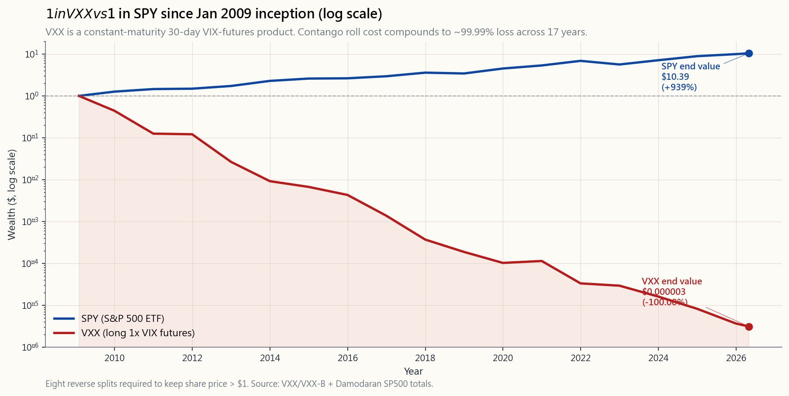

# 第四十週：波動率指數及波動性產品複合體

---

## 第一部分：閱讀章節

---

### 1. 為何此課題至關重要

波動率指數是金融界被引用最多、卻最少人真正理解的數字。CNBC報道「恐慌指標飆升至28」，觀眾紛紛點頭，但幾乎沒有人能夠告訴你28究竟代表什麼意思、它能預測什麼，以及——最關鍵的——為何所有基於它構建的零售產品都傾向於持續虧損。波動性才是主宰市場的核心力量：在真正的危機中，它是*最先*作出反應的指標，其他一切都圍繞它重新排列。如果你對波動性複合體的運作方式沒有一個清晰的認識，你將是最後一個知道自己投資組合發生了什麼事的人。

一個嚴肅的投資者需要徹底了解波動率指數，原因有四：

1. **波動率指數是一個資產類別的價格，而非預測**：波動率指數是一個30天引伸波幅的數字，由一系列標普500指數期權價格以無模型方式計算得出。它告訴你的是期權市場*當前*收取的保障費用，而非實際已實現的波動性。兩者之間的溢價——方差風險溢價——是市場上最純粹、最持久的回報來源之一，並體現在每一份你交易的期權之中。

2. **期限結構通常與直覺相反**：波動率指數期貨在約85%的交易日處於期貨升水狀態。三個月的引伸波幅幾乎總是高於即期波動率指數。這一單一的結構性事實，正是長波動性產品（VXX、UVXY）每年蒸發約30%以上的原因，也是每一個「買入波動性作保險」的推介都應受到與1981年4%按揭利率同等程度審視的原因。

3. **波動性是以最低成本持有強烈錯誤信念的方式**：做多波動性的押注在災難中獲得回報。但持有成本極為殘酷——每天世界沒有崩潰，你就在付出代價，而且往往在市場觸底後數週內，收益便會回吐，因為期限結構已重置。大多數零售「尾部對沖」都是在波動率指數見頂時買入，在低谷時賣出，這與其應有的運作方式恰恰相反。

4. **做空波動性的交易摧毀的名譽比做多波動性更多**：沽空波動性在數年間看起來像白撿的錢，直至噩夢來臨。2018年2月的波動性崩潰（Volmageddon）在單一下午便將XIV交易所買賣票據清零——在連年錄得約30%/年回報後，收市跌幅達96%。波動性的爆倉正是整個投資組合在衝擊下全面崩潰的根源。不了解波動性曲面在那幾週發生了什麼，你便無法理解2008年、2018年、2020年或2022年的市場。

本課提供計算公式、期限結構、相關產品、歷史慘況紀錄，以及一個將波動性作為工具而非老虎機使用的框架。

---

### 2. 你需要掌握的知識

#### 2.1 波動率指數的真實面貌——方差掉期公式

芝加哥期權交易所於2003年將波動率指數重新定義為無模型的計算方式。它不假設Black-Scholes模型，不假設任何模型。它是一系列標普500指數期權價格的加權計算結果，用以複製30天方差掉期。

正式定義如下：

$$\text{波動率指數}^2 = \frac{2}{T} \sum_i \frac{\Delta K_i}{K_i^2} e^{rT} Q(K_i) - \frac{1}{T}\left(\frac{F}{K_0} - 1\right)^2$$

其中 $T = 30/365$，$K_i$ 為標普500指數期權的掛牌行使價，$Q(K_i)$ 為行使價 $K_i$ 的價外期權中間報價，$F$ 為遠期合約價格，$K_0$ 為低於 $F$ 的最近行使價。結果以年化表示——波動率指數為20，意味著期權市場隱含標普500指數回報在未來一年的標準差為20%，即未來一個月約為 $20/\sqrt{12} \approx 5.8\%$。

大多數零售交易者忽略的兩個重要推論：

- **波動率指數並非「預期波動性」，而是方差掉期的價格**。它會系統性地高於已實現波動性，因為期權賣家要求對不可對沖的跳躍風險收取溢價。長期溢價約為3至4個波動性點（即方差風險溢價）。這一溢價正是每一個備兌認購期權及認沽期權沽出策略所收割的利潤。
- **標普500指數每日預期波動幅度 = 波動率指數 ÷ sqrt(252)**。波動率指數為20，意味著每日標準差為1.26%。波動率指數為40，意味著每日標準差為2.52%。這是最值得牢記的單一換算公式。

#### 2.2 期限結構——為何期貨升水蠶食VXX

波動率指數本身是即期指數，無法直接交易。你能夠交易的是波動率指數期貨，其交割價格為到期月份第三個週三早上的波動率指數特別開盤報價。期貨曲線幾乎總是向上傾斜：近月可能是16，次月17，第三個月17.8。這就是期貨升水。

原因何在？因為期權市場知道波動性均值回歸至約16至18，但同時知道未來90天*有一定機會*出現恐慌。往曲線越遠端看，所保障的「尾部」風險越多。曲線每天為這一保障收取的費用，前端約為每交易日+0.05至+0.10個波動性點，每月合計約+1.5個波動性點。

再看VXX、UVXY等類似產品的實際操作：它們持有恒定到期30天的波動率指數期貨倉位，每日將近月合約滾動至次月合約。在期貨升水狀態下，每次滾動都是以低價賣出、以高價買入。歷史上，在平靜市場中，這一滾動的年化成本為-25%至-40%，在完整周期平均則為-10%至-20%。

這並非巧合，而是數學必然。波動性主導一切這一規律有其推論：**波動性曲面正在支付你做空的報酬，直至那一天它不再如此**。

#### 2.3 產品慘況紀錄

零售投資者在波動性交易所買賣產品中的完整傷亡名錄：

- **VXX（做多1倍波動率指數期貨，iPath發行）**：2009年1月30日上市。原版VXX於2019年1月到期。B系列於2018年1月開始（重疊年份）。自2009年成立以來，經八次合股調整後的累計回報：約**-99.99%**。投資1美元，如今價值不足0.0001美元。
- **UVXY（做多1.5倍——曾為2倍——波動率指數期貨）**：情況更差。衰減幅度約為VXX的1.5倍，在平靜市場每年損失約45至55%。合股次數：11次且仍在增加。
- **XIV（做空1倍波動率指數期貨，瑞士信貸交易所買賣票據）**：曾是大贏家——直至2018年2月5日。波動率指數在單一下午翻倍，系統性波動性做空者被迫平倉。XIV的資產淨值在兩小時內下跌約96%。瑞士信貸觸發加速條款並將其關閉。隔夜持倉者換回的只剩分文。
- **SVXY（做空0.5倍波動率指數期貨，ProShares）**：2018年2月同一事件後，ProShares將槓桿從1倍削至0.5倍以求存活，原名稱不變。總回報仍為正，但遠不及XIV在波動性崩潰前的輝煌。
- **波動率指數本身**：無法持有。即期波動率指數僅是一個計算數字，非可交易資產。每一個「波動率指數」產品實際上都是波動率指數*期貨*產品，而期貨所處的曲線與即期指數有所不同。

一般規律：**若一個產品持有恒定到期做多波動性倉位，它就是一塊慢慢融化的冰塊**。將其作為「投資」買入，在結構上必然虧損。作為*交易*，在確認波動性飆升期間以小倉位持有數日，或可奏效——但時機把握極為困難。

#### 2.4 波動率指數水平及飆升特徵

每位理智投資者都應熟記的校準錨點：

- **波動率指數中位數（1990至2026年）：約16.5**。歷史最低為9.14（2017年11月）。第25百分位約13，第75百分位約22。
- **平靜：12至15**。牛市常態。標普500指數每日波動低於1%。
- **正常：15至20**。長期平均水平。健康市場，間有業績噪音。
- **偏高：20至30**。調整、地緣政治衝擊、選舉年。
- **緊張：30至50**。熊市、銀行業事件、經濟衰退恐慌。2024年8月套利交易平倉、2022年9月美聯儲衝擊均觸及30多的高位。
- **恐慌：50至80**。真正危機。2008年（峰值約89）、2010年閃崩（約48）、2011年8月美國債務上限／歐洲債務危機（約48）、2018年2月波動性崩潰（盤中約50）。
- **極端：80以上**。歷史最高位82.69出現於2020年3月16日（新冠封城宣布當日）。在36年歷史中，只有另一個交易日超越80（2008年雷曼周）。

飆升特徵：波動率指數上升速度約為標普500指數下跌速度的3至5倍。兩者1日相關係數約為-0.75。經典關係為：

$$\Delta\text{波動率指數} \approx -1.0 \times \Delta\text{標普500指數}\%$$

適用於正常波動（即標普500指數跌1%，波動率指數約加1個點），但在尾部具有顯著凸性——標普500指數單日跌5%，可能令波動率指數上升10至15點，而非5點。這一凸性正是做多波動性回報所收割的利潤。

#### 2.5 VVIX——波動性的波動性

VVIX是波動率指數*本身*的引伸波幅，由波動率指數期權計算得出。正常市場中通常在70至110之間，危機時飆升至150至200。VVIX是衡量期權市場對波動性曲面緊張程度預期的最清晰指標。當VVIX處於80且你正獲得12%的收益沽出標普500指數認沽期權時，市場定價尚算合理。當VVIX處於150且你正獲得30%的收益時，你並非獲得超額回報——你是在為波動率指數本身再飆升50%的真實風險獲得補償。

實用規律：**當VVIX快速上升時，切勿沽出波動性**。即使波動率指數已處於高位。波動性的波動性是二階導數，也是系統槓桿的所在。

#### 2.6 波動性風險溢價及其收割方式

衍生工具界最能成就職業生涯的實證事實：**在標普500指數中，引伸波幅平均每年高於已實現波動性約3至4個點**。這一差距即為方差風險溢價。它是真實存在的、持久的，並解釋了每一個做空波動性策略的長期回報，從PUTW（標普500指數現金擔保認沽期權）到JEPI（標普500指數備兌認購期權加股票掛鉤票據），乃至SVXY本身。

在不引爆自身的前提下收割方差風險溢價的三種方式：

1. **標普500指數或行業交易所買賣基金的現金擔保認沽期權**——下跌風險有限，上升潛力有限，規模與投資組合相稱。詳見第28週。
2. **持有股票時賣出備兌認購期權**——放棄右尾回報，保留主體。詳見第27週。
3. **標普500指數鐵鷹式策略，設有已知最大虧損**——同時做空兩翼，並在外側買入保護性期權。入市時最大虧損已確定。詳見第30週。

對長期投資者而言*不適用*的做法：做多VXX、做多UVXY、做空SVXY，或任何最大虧損超出倉位規模的結構。槓鈴式策略才是正確框架：你可以持有90%的貝塔投資組合及5至10%的做空波動性配置，但不能持有95%的做空波動性投資組合。爆倉日需要2至3年的持有收益才能彌補，而持有收益的規模根本無法支撐這樣的槓桿。

#### 2.7 2018年波動性崩潰案例研究

2018年2月5日，是波動性尾部主導市場的教科書案例。背景：標普500指數數月來持續走高，已實現波動性低於6%。波動率指數被壓制在9至11之間。做空波動性產品吸引了約20億美元零售資金。與此同時，大型機構投資者——養老基金、家族辦公室、波動性控制授權——正系統性地持續沽出更多波動性，因為已實現波動性持續低企——正是多年來在平靜環境下有效運作的風險平價邏輯。

其後，標普500指數在當週一正常交易時段下跌4%。波動率指數從17飆升至收市時的37。XIV及SVXY產品須在盤後稀薄市場中補回其做空期貨倉位。這一被迫買入將波動率指數期貨進一步推高。至下午4時15分東部時間，XIV的盤中資產淨值隱含96%的虧損。瑞士信貸當晚觸發加速條款。隔夜持倉的投資者換回的幾乎是一文不值。

這一教訓並非「不要沽空波動性」。教訓是：**對波動性加槓桿是致命的，因為波動性本身就是槓桿**。1倍做空波動性倉位已是方差風險溢價的槓桿押注。再在其上疊加1倍基金槓桿，即在峰度超過30的序列上形成2倍有效槓桿。數學上無法承受真正的波動性飆升。

---

### 3. 常見誤解

1. **「波動率指數衡量實際市場波動性。」** 不對——它衡量的是從期權價格推導出的*預期*（引伸）波動性。市場為不可對沖風險支付溢價，這一溢價通常比已實現波動性高3至4個點。
2. **「波動率指數高意味著股票將下跌。」** 通常意味著股票*剛剛*下跌。波動率指數更多是同步或滯後指標，而非領先指標。波動率指數對未來30天標普500指數回報的預測能力較弱，對未來已實現波動性的預測能力中等。
3. **「VXX是做多波動性的交易所買賣基金；波動性上升，VXX就上升。」** 僅在短期如此。持有一年，VXX因期貨升水滾動及複利拖累，每年落後波動率指數25至40%。
4. **「我將買入VXX作為投資組合的對沖。」** 今天買入VXX並持有一年，通常損耗名義價值30%以上。同等尾部保障的標普500指數認沽期權通常每年僅需2至4%。認沽期權幾乎總是更便宜的保險。
5. **「XIV爆倉是因為算法交易。」** XIV爆倉是因為它是1倍做空波動性產品，在峰度超過30的序列上提供1倍槓桿。算法是近因，不是根本原因。
6. **「波動率指數50意味著市場即將崩跌50%。」** 波動率指數50意味著期權市場預期標普500指數回報的一個月標準差為14.4%。預期大幅波動，方向未定。
7. **「在業績公布前買入波動性很聰明，因為引伸波幅總是上升。」** 引伸波幅在業績公布*前*確實上升，但通常在公布後立即大幅收縮——引伸波幅崩塌正是做空跨式組合策略在業績前後奏效的全部原因。
8. **「沽空SVXY等同於沽空波動性。」** SVXY是做空0.5倍波動率指數期貨。它並非純粹的做空波動性；它是做空嵌入了期貨升水的期貨曲線。方向相同，希臘字母不同。
9. **「波動率指數自2010年以來結構性下降。」** 並非如此。自1990年以來，無條件中位數大致穩定。發生變化的，是微型飆升（1至2天）的頻率相對於持續30以上區制的比例。
10. **「波動率指數低時應買入VXX，因為它很便宜。」** 低波動率指數是一種狀態，而非價格水平。波動率指數為12但曲線陡峭的期貨升水，衰減速度可能與波動率指數為18但曲線平坦時同樣快速。應關注的是*滾動成本*，而非絕對水平。

---

### 4. 問答環節

**問題1：我在日常決策中應如何實際運用波動率指數？**
答：三種用途。（1）倉位規模——當波動率指數高於25時，新增股票長倉規模較波動率指數低於15時減半。（2）期權定價——若你即將沽出認沽期權而波動率指數低於14，你的回報不足；等待。若波動率指數高於30而你已持有股票，這是通過備兌認購期權收取期權金的機會。（3）市場區制——波動率指數高於30連續超過5個交易日，即為確認的緊張區制；按四個配置類別進行再平衡，不要逆勢而為。

**問題2：為何更多投資者不持有做多波動性產品作投資組合保險？**
答：因為它們是有史以來最昂貴的保險。持有成本每年-25%至-40%。同等尾部保障的標普500指數認沽期權每年僅需2至4%。買入VXX作保險，就像購買一份每年保費佔房屋價值30%的火險——即使失火時獲得賠償，每年300元的保費早已更合算。

**問題3：我能否把握波動率指數的時機？**
答：*水平*的均值回歸是真實存在的（中位數約16至18）。但時機把握極為困難——在熊市中，波動率指數可能持續數月高企。「波動率指數高於30時沽出波動性」這一簡單規律在2010年、2011年、2018年、2020年、2022年均奏效。但在2008年（波動率指數高於30持續7個月）會令你深陷泥沼，在任何真正的系統性危機中亦可能如此。

**問題4：波動率指數與VVIX有何分別？**
答：波動率指數是標普500指數的30天引伸波幅。VVIX是波動率指數*本身*的30天引伸波幅。VVIX告訴你波動率指數期權市場有多緊張——即曲面的凸性有多大。波動率指數上升同時VVIX上升，是恐慌疊加。波動率指數上升同時VVIX下跌，則可能是均值回歸。

**問題5：原版VXX為何於2019年退市？**
答：它有10年期限（2009年1月作為iPath交易所買賣票據發行，並非交易所買賣基金）。巴克萊於2019年1月按資產淨值贖回。iPath將其轉換為VXX B系列（2018年1月推出，有重疊設計）。兩者在經濟上幾乎相同——均採用相同的恒定到期30天波動率指數期貨方法論。

**問題6：2018年波動性崩潰後，做空波動性的交易已死？**
答：不，但規模縮小了。XIV式1倍交易所買賣票據結構已消失。如今的做空波動性敞口存在於：（1）備兌認購期權交易所買賣基金（JEPI、JEPQ、QYLD），是這一交易的稀釋版本；（2）現金擔保認沽期權策略（PUTW）；（3）SVXY的0.5倍槓桿版本。2026年做空波動性交易所買賣產品的總資產管理規模約為500億美元，為2018年前高峰的一半。

**問題7：如何通過閱讀波動率指數期限結構來把握入市時機？**
答：經典指標是VX1/VX2比率（近月/次月波動率指數期貨）。當比率小於1（期貨貼水），即處於緊張狀態——*不*是沽空波動性的時機。當比率大於1且正常期貨升水（約0.95）時，市場平靜，沽出有限風險認沽期權較為合理。VIX Central或芝加哥期權交易所期限結構頁面可實時顯示此數據。

**問題8：波動率指數與信用利差有何關係？**
答：關係密切，但有滯後。波動率指數是「快速」風險指標（盤中，由期權驅動）。高收益信用利差（美銀美林高收益期權調整利差）是「慢速」指標（每日，由交易商驅動）。波動率指數飆升而高收益利差未有相應移動，通常是噪音；兩者同步移動則是區制轉換信號。請交叉參考第33週的高收益利差圖表。

**問題9：我應否在只做多的退休投資組合中加入任何波動性敞口？**
答：直接波動性敞口，不宜。間接則可以——通過備兌認購期權交易所買賣基金（最多10至15%配置）或PUTW式現金擔保認沽期權基金。這些方式收割方差風險溢價而無需使用槓桿。以槓鈴式策略操作，將波動性風險以已知最大虧損的期權金形式承擔，而非持有VXX長倉。

**問題10：我的投資組合中應有多少比例用於做多VXX或UVXY？**
答：對大多數投資者而言：0%。對於持有明確事件主題的成熟戰術交易者（例如「明天召開聯邦公開市場委員會議，波動性處於12，期限結構平坦」），或許可以用資產淨值的0.5至1.5%持有2至7天。絕對不能作為戰略性倉位。絕對不能規模大到一天跌50%對整體影響重大的程度。

**問題11：為何波動率指數歷史最高記錄出現在2020年3月16日而非3月9日（實際市場低點）？**
答：波動率指數衡量的是*未來*30天的預期波動性。到3月16日，期權市場已在為下月的全面封城情景定價——這正是為何最高記錄出現在最惡劣的單日跌幅*之後*。波動率指數的後視性比人們通常認為的更強。

**問題12：是否有任何可靠方法預測波動率指數飆升？**
答：沒有。唯一的結構性預測因子是波動率指數在異常低位持續異常長的時間，這提高了飆升的*概率*，但對時機毫無預測力。觸發波動性崩潰的波動性控制去槓桿機制需要標普500指數出現超過2%的跌幅才能啟動；而你無法用波動率指數預測這一跌幅。如果你能，你就根本不需要波動率指數了。
