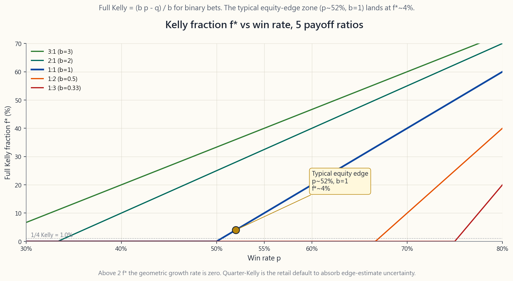
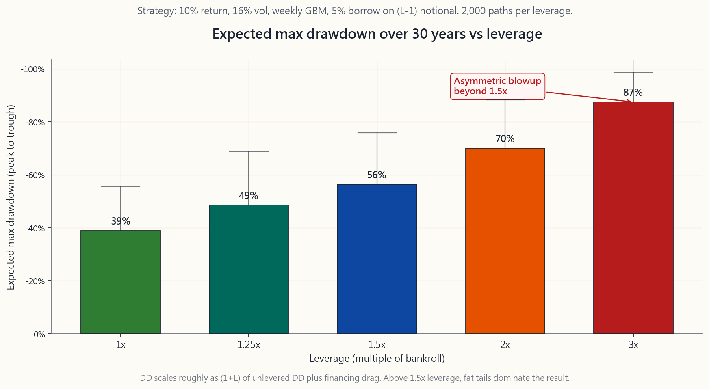

# 第四十一週：風險管理 — 倉位大小、止蝕、凱利公式與本金保存

---

## 第一部分：閱讀材料

---

### 1. 為何此課題至關重要

你讀過的每一個散戶爆倉故事，形狀都一樣。投資者通常對*方向*判斷正確，卻在*規模*上嚴重失誤。那張Reddit截圖顯示「每週SPY認沽期權虧損5萬美元」，鮮少是因為論點出錯；幾乎永遠是一個尚算合理的論點，用了本金四倍的倉位。倉位大小是投資界最被低估的紀律。它正是令人複利三十年與三年內爆倉的分水嶺。

你需要掌握此課題，原因有四。

1. **倉位大小是你唯一能完全掌控的旋鈕。** 你無法令市場上漲，無法強迫自己的優勢成真。但在你點擊買入之前，你絕對可以選擇把多少比例的資本投入這筆交易。這單一決定對長期財富的影響，遠超任何觀點、選股或時機判斷。
2. **回撤的數學是不對稱的。** 下跌50%需要上漲100%才能回本；下跌75%需要上漲300%；下跌90%則需要上漲900%。倉位大小決定你最深的回撤有多深；回本的代價以非線性方式增長。若不妥善控制倉位，你就無法在市場維持非理性的時間內保持償付能力。
3. **優勢是不確定的，凱利公式同樣不確定。** 凱利準則在你的優勢估算準確的前提下，給出最大化幾何增長率的下注規模。在股票市場，你的優勢估算從不精準到小數點後第三位。分數凱利——四分之一甚至八分之一的完整凱利——才是面對這種不確定性的誠實答案。
4. **槓桿是每個錯誤的無聲倍增器。** 兩倍槓桿既使你的回報翻倍，也使你的波動性翻倍。但對最大回撤而言，其影響更接近乘數關係：1倍下的-25%回撤，在2倍槓桿下大約變成-50%。對一個年化波動性16%的股票組合使用三倍槓桿，足以把一個可以承受的熊市變成追繳保證金事件。爆倉是非線性的。

本課將逐一講解凱利公式、分數凱利、每筆交易1-2%規則、止蝕與對沖的取捨、多倉位組合的相關性調整規模，以及槓桿與回撤的數學。最後，本課將把所有內容與此前所學聯繫起來——波動性具有肥尾特徵，以及償付能力比「正確」更重要。

---

### 2. 你需要掌握的知識

#### 2.1 凱利準則 — 最優幾何增長下注規模

約翰·凱利（貝爾實驗室，1956年）提出了一個簡單問題：如果我有一個帶有優勢的重複下注，每次應把多少比例的本金投入，才能最大化長期的*幾何*財富增長率？對於二元勝負結果，答案是：

$$ f^* = \frac{b p - q}{b} $$

其中：

- $p$ = 勝出概率，
- $q = 1 - p$ = 落敗概率，
- $b$ = 勝出時的淨賠率（1:1賠率則 $b = 1$，2:1賠率則 $b = 2$）。

代入一個55%正面的硬幣翻轉，賠率1:1：$f^* = (1 \cdot 0.55 - 0.45) / 1 = 0.10$。凱利公式建議每次投入本金的10%。超過10%，幾何增長率便會下降。超過20%——即兩倍凱利——你的預期長期增長率變為*零*。超過 $f = 2 f^*$，即便擁有正優勢，在足夠多的試驗次數下，你在數學上必然走向破產。

對於股票策略，勝率鮮少超過55%，平均盈虧比鮮少超過1.5。典型設置或許是 $p = 0.52$，$b = 1$，得出 $f^* = 0.04$——約為本金的4%。這才是你所處的現實世界。你不是在1956年的賽馬場；你身處一個近乎公平硬幣的世界，而凱利公式的輸出是個位數百分比。

此圖呈現五種賠率下，完整凱利 $f^*$ 隨勝率 $p$ 的變化。留意三點。第一，在典型股票優勢點（$p \approx 0.52$，$b = 1$），完整凱利約為4%。第二，曲線比人們預期的更陡——將勝率從50%提高到55%，凱利值增加近三倍。第三，當 $p < q / b$（無優勢邊界），凱利值變為負數——這是數學在委婉告訴你不應進行這筆交易。

#### 2.2 分數凱利 — 面對優勢不確定性的誠實答案

完整凱利假設你*知道*自己的優勢。實際上，你是從有限的記錄中估算 $p$ 和 $b$，而該估算的標準誤差相當大。數學家愛德華·索普憑藉計牌打敗拉斯維加斯，並管理對沖基金長達二十年，他對自己所做的一切都採用**半凱利**。$k$ 分數凱利的通用公式為：

$$ f_k = k \cdot f^* $$

$k$ 通常選擇 $0.5$（半凱利）、$0.25$（四分之一凱利）或 $0.125$（八分之一凱利）。有兩個事實使分數凱利成為預設選擇，而非完整凱利。

第一，**低估下注的幾何增長懲罰輕微**。半凱利約能捕捉最優增長率的75%；四分之一凱利仍能捕捉約44%。然而，*高估下注*的懲罰卻嚴酷且不對稱：兩倍凱利增長為零，超過此水平在預期中虧損。因此，偏向低於最優的倉位是廉價保險。

第二，**波動性降幅極為顯著**。與完整凱利相比，半凱利的回撤大約減半；四分之一凱利再度減半。對於年化波動性30%的策略，完整凱利的回撤可達80%；四分之一凱利將其控制在25%以下。在市場維持非理性的時間內保持償付能力，正是四分之一凱利成為股票策略業界標準的全部原因。

散戶的誠實規則：對個股有方向性觀點時，**採用四分之一凱利或更小的規模**。對指數有觀點時，同樣原則適用。完整凱利是用於數過牌的21點賭桌，並非你的稅務遞延賬戶。

#### 2.3 每筆交易虧損1-2%規則

專業交易員在日常操作中很少以凱利術語思考，他們採用更簡單的框架：*這筆倉位我願意承受的最大美元虧損是多少？* 公認的規則是**本金的1%至2%**。

具體操作：若你的本金是10萬美元，每筆交易的最大虧損為1%，即願意在這筆交易中虧損1,000美元。若止蝕位在100美元股票的買入價以下5美元，則倉位規模為 $1{,}000 / 5 = 200$ 股，即2萬美元的名義價值。若止蝕位低於買入價2美元，則倉位規模為 $1{,}000 / 2 = 500$ 股，即5萬美元。驅動股份數量的是美元風險敞口，而非反過來由股份數量決定美元風險敞口。

1-2%範圍的合理性：

- 每次虧損2%，連續二十次虧損產生約 $1 - 0.98^{20} \approx 33\%$ 的回撤，尚可承受。
- 每次虧損5%，連續二十次虧損產生約 $1 - 0.95^{20} \approx 64\%$ 的回撤，足以終結投資生涯。
- 每次虧損10%，連續二十次虧損後剩餘約 $0.9^{20} \approx 12\%$ 的起始資本，遊戲結束。

1-2%規則不假設你是出色的交易員，它假設你是一個遲早會遭遇連敗的普通交易員。以2%規模，你能挺過那段連敗；以10%規模，你撐不住。

#### 2.4 止蝕與對沖 — 兩種不同的工具

**止蝕**是一個退出機制。在建倉之前，你決定一個價格，一旦觸及便平倉接受虧損。交易就此結束——無後續升幅，亦無後續跌幅。具體操作：在經紀處設置止蝕盤，或設定一個你確實會遵守的心理止蝕位。

**對沖**是一個保留倉位的有限虧損覆蓋工具。以520美元買入100股SPY，配合500美元的保護性認沽期權：最大虧損上限為每股20美元加上期權金，*同時*保留520美元以上（扣除期權金後）的所有升幅。倉位依然存在，只是尾部風險被截去。

三個選擇準則：

1. **論點取決於事件時，使用止蝕。** 若關鍵業績數字、FDA決定或聯儲局會議可能使論點失效，消息公布時平倉止蝕。已被推翻的論點沒有持倉的意義。
2. **論點正確但路徑波動劇烈時，使用對沖。** 若你認為NVDA以12個月為期合理估值，但無法承受-30%的中途回撤，則可為其設立價差（持有股票＋沽出價外認購期權＋買入價外認沽期權）。多年期論點得以保留，同時把路徑層面的痛苦限制在可承受範圍。
3. **倉位已足夠小，兩者均不需要時，則不使用任何工具。** 這是最常被忽視的選項。1%的倉位無需止蝕，亦無需對沖；25%的倉位兩者都需要。倉位管理是你所能買到的最廉價保險。

止蝕有一個已知的失效情形：跳空風險。若隔夜消息令股票以低於止蝕位20%開盤，你將在開盤價成交，而非止蝕價。以期權進行的對沖則不存在此問題，因為認沽期權已在賬戶中。

#### 2.5 多倉位組合的相關性調整規模

每筆交易1-2%規則假設各交易是*獨立*的。實際上並非如此。若你持有十隻科技股，納斯達克下跌5%時，十隻股票將同步下跌。你的有效單筆交易風險敞口遠高於每筆交易規則所示。

解決方法是以**相關性美元風險桶**而非個別交易來思考。一個簡單框架：

- 同一板塊的所有股票視為一個桶，該桶的總風險敞口上限為6-10%。
- 與同一宏觀因素（利率、美元、油價）高度相關的所有倉位視為一個桶，同樣上限。
- 在桶上限之後，在桶*內*應用1-2%規則。

具體而言：若你想同時持有六隻半導體股，不要每隻各佔2%；而是將整個科技板塊桶設為8%，再分攤至六隻股票，約各佔1.3%。當板塊逆轉時，你的虧損受到桶的上限約束，而非各倉位加總。機構版本是**風險平價**：按波動性的倒數為倉位加權，再應用協方差矩陣縮小相關性較高的下注。散戶不需要矩陣代數；桶規則已能捕捉80%的效益。

#### 2.6 槓桿與回撤 — 不對稱的爆倉

槓桿既放大回報，也放大波動性，但其對回撤的影響是**非線性且不對稱的**。直覺上：

$$ \text{回撤}_{\text{槓桿}} \approx (1 + L) \cdot \text{回撤}_{\text{無槓桿}} \quad \text{（加上融資成本拖累）} $$

一個分散投資的股票組合，在1倍下的峰值至谷底回撤為-25%，在2倍槓桿下約為-50%，3倍槓桿下約為-75%。再加上借貸成本——散戶保證金利率目前約為5%的年化——而且這個成本會在回撤期間侵蝕你的資本，偏偏是你最承受不起的時候。

此圖模擬預期回報10%、年化波動性16%的策略，在1.0至3.0倍槓桿下的30年期預期最大回撤。留意其形狀。從1.0至1.5倍，曲線近似線性上升——尚可控制。從1.5至2.0倍，曲線向上彎曲。超過2.0倍後，曲線幾乎垂直：在3倍槓桿下，三十年內預期最大回撤約為-85%，委婉地說就是*追繳保證金、在最壞時機被強制平倉、賬戶被關閉*。

教訓：1.5倍以上的槓桿是另一種運動。你可以使用，但必須大幅縮小*基礎*倉位規模，才能使*加槓桿後*的回撤保持可承受。這反而抵消了槓桿的意義。肥尾波動性在此全力發揮：波動性在教科書中呈正態分佈，在現實中卻呈肥尾分佈，而槓桿使肥尾變成無法生存的尾部風險。

#### 2.7 本金保存的思維模式

本課所有內容建立在一個單一的心智模型之上：**你的本金才是資產**。交易只是本金增減的工具。你的工作不是「贏得這筆交易」，而是*持續參與*——在市場可能產生的任何結果序列中保持償付能力，讓長期優勢有足夠時間複利增長。

這正是「市場維持非理性的時間可以長過你保持償付能力的時間」這句話的含義。在2022年爆倉的投資者，不是那個對聯儲局判斷失誤的人。爆倉的是這樣的人：對聯儲局判斷正確，卻以完整凱利押注，加上3倍槓桿，又沒有設置對沖。論點是對的，倉位管理卻失敗了。

本金保存規則，按優先級排列：

1. 任何單筆交易的虧損絕不超過本金的1-2%。
2. 任何單一板塊或因子的虧損絕不超過本金的6-10%。
3. 股票槓桿絕不超過1.5倍；若基礎策略本身波動劇烈（期權、加密貨幣、單一股票），則不超過1.0倍。
4. 在有十年樣本外業績證明你的優勢估算之前，始終採用四分之一凱利或更小的規模。
5. 始終清楚什麼情況會令你破產，並為預防該情況的期權定價。

這五條規則不會令你致富。技能、時間和真實的優勢才能。但這些規則會讓你*在遊戲中停留足夠長的時間*，讓技能、時間和優勢發揮作用。這才是全部的意義所在。

---

### 3. 常見誤解

1. **「更大的倉位＝更大的利潤。」** 在預期值上是線性的，在現實中是幾何的。超過 $2 f^*$，增長率為零；超過 $3 f^*$，即便擁有正優勢，你也在虧損。
2. **「我有優勢，所以應該用完整凱利下注。」** 你並不*知道*你的優勢。半凱利能捕捉75%的增長並將回撤減半；四分之一凱利是散戶的預設選擇。
3. **「止蝕意味著虧錢。」** 止蝕意味著你*控制*虧損的規模。不止蝕的後果是讓市場決定你的虧損。
4. **「對沖很貴。」** 與追繳保證金相比，對沖是你賬單上最廉價的項目。正確的比較是對沖成本與概率加權的爆倉成本，而非對沖成本與零的比較。
5. **「2倍槓桿令我的回報翻倍。」** 同時也令你的波動性翻倍，回撤大約翻倍。預期幾何回報為 $L \mu - 0.5 L^2 \sigma^2$——對 $L$ 並非線性。
6. **「槓桿交易所買賣基金提供永久的2倍風險敞口。」** 它們提供的是每日2倍風險敞口。隨時間推移，波動率損耗每年大約扣除 $0.5 (L^2 - L) \sigma^2$。詳見第37週。
7. **「我的倉位之間沒有相關性。」** 同一板塊的股票在正常情況下相關性為0.6-0.9，在崩盤時升至0.95以上。在你最需要分散投資的時刻，相關性趨向一致。
8. **「我可以設心理止蝕。」** 心理止蝕在交易虧損時失效，而那是唯一需要它的時候。使用經紀的止蝕盤，否則就不設止蝕。
9. **「風險管理是失敗者的事。」** 風險管理是讓贏家持續獲勝的關鍵。那些運營了三十年的對沖基金，正是因為有說「不」的風險主任。
10. **「連勝後我會加大風險。」** 這與正確規則恰好相反。在*本金增長後*才加大風險，而非在*連勝之後*。兩者是不同的信號。

---

### 4. 問答環節

**問題1：我有50,000美元，想每筆交易冒1%的風險。股票報價80美元，止蝕位在76美元。應買多少股？**
每筆交易風險 = 500美元。觸及止蝕時每股虧損 = 4美元。倉位 = $500 / 4 = 125$ 股，名義價值10,000美元（佔本金20%）。倉位佔賬戶20%，但*風險*僅為1%。這就是倉位管理的意義所在。

**問題2：為何是四分之一凱利而非半凱利？**
半凱利假設你的優勢估算誤差適中。對於自主裁量的股票交易，優勢估算誤差較大（你從小樣本猜測52%-54%的勝率）。四分之一凱利已將這種不確定性納入考量。若你擁有一個真正的系統性策略，並有數千次交易及穩定參數，半凱利是可以接受的。

**問題3：應使用移動止蝕還是固定止蝕？**
固定止蝕更適合短線交易——你已界定論點，界定了使論點失效的條件，並在失效時退出。移動止蝕更適合趨勢跟蹤倉位，讓盈利的部分持續運行，同時隨倉位向有利方向移動來鎖定利潤。移動止蝕有一個已知的失效情形：噪音令你在趨勢恢復前過早被止出。

**問題4：賣出現金擔保認沽期權算是「對沖」嗎？**
不算。賣出認沽期權是一個*沽空波動性*的收息交易，有確定的上限（期權金）和較大的下行風險（行使價減期權金）。這不是對沖——它增加了風險。買入認沽期權才是對沖。

**問題5：如何確定期權交易的規模？**
期權倉位規模應以**最大虧損**為基礎，而非名義價值。認購期權的最大虧損等於期權金，將期權金規模設為本金的1-2%。認沽期權的最大虧損等於行使價減期權金，將*此金額*設為本金的1-2%——這遠小於所收期權金的1-2%。

**問題6：我朋友做TSLA翻了一倍，我應該加大倉位嗎？**
不應。他進行了一筆未控制規模的押注，並在單次抽籤中走運。正確的比較是*一千次抽籤後*，沒有規模控制的策略以概率一趨向零。把他的結果視為倖存者偏差的數據點，而非倉位管理的參考。

**問題7：買入持有投資者的合理最大槓桿是多少？**
稅務遞延賬戶為1.0倍；應稅保證金賬戶使用箱式價差融資時為1.0至1.25倍；只有在有書面回撤計劃及明確流動性儲備的情況下才用1.5倍。超過1.5倍屬於槓桿交易，而非買入持有投資。

**問題8：如何判斷自己倉位過重？**
睡眠測試。若倉位單日下跌3%會影響你當晚的情緒，則倉位過重。倉位應小至最差的合理單日跌幅只令你感到煩惱，而非痛苦。

**問題9：同時持有多個倉位時凱利公式如何應用？**
對於獨立倉位，將各倉位的 $f^*$ 值相加。對於相關性較高的倉位，將 $f^*$ 之和除以有效相關性因子。第2.5節的桶規則是實際操作的捷徑。

**問題10：1-2%規則適用於長線指數投資嗎？**
不適用——它適用於有明確失效條件的主動交易。你退休賬戶中100%的指數配置並非「違反規則」；它屬於不同類別的資本，有不同的投資期限。此規則適用於你的*交易部分*，而非買入持有部分。槓鈴策略從設計上就將這兩部分分開。

**問題11：這與四組別框架有何關聯？**
每個組別有其自身的規模規則。增長組別：追蹤指數，無每筆交易規則。收息組別：倉位規模 = 目標收益率÷資產收益率。價值儲存組別：固定配置，定期再平衡。選擇性組別（Opt）：凱利公式、分數凱利和1-2%規則在此適用。風險管理紀律在選擇性組別最為重要，因為未受控的爆倉就發生在這裡。

**問題12：凱利公式可以用於加密貨幣嗎？**
可以計算。問題在於你的 $p$ 和 $b$ 估算遠不如股票可靠，而且加密貨幣回撤分佈的左尾比凱利公式所基於的正態模型更肥。使用八分之一凱利或更小，並將所有倉位規模視為暫定，直至你有跨越多個週期的追蹤記錄。
