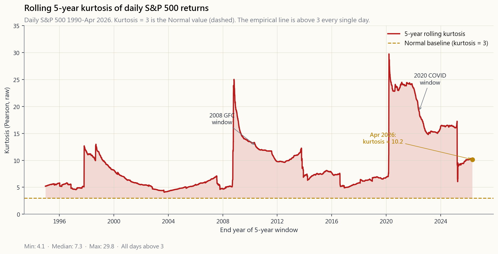

# 第四十二週：風險值與風險模型——參數法、歷史法、蒙地卡羅法，以及為何三種方法在尾部均告失效

---

## 第一部分：閱讀章節

---

### 1. 為何此議題至關重要

上週我們建立了風險管理的概念框架：倉位管理、止蝕規則、情景思維，以及如何在各倉位之間分配投資組合的潛在損失。本週我們將為此賦予具體數字。

**風險值（VaR）** 是全球引用最廣泛的單一風險指標。每家銀行、對沖基金、退休基金與保險公司的資產負債表，某處都在運行一套風險值系統。**條件風險值（CVaR）/ 預期損失（Expected Shortfall）** 是其更精密的表親——自2016年起已獲巴塞爾協議III強制採用，原因正是普通風險值在2008年災難性地失效了。兩者源自同一理念：建構投資組合可能結果的概率分佈，審視壞日子究竟有多壞，並以單一美元數字呈現。

理解這兩個指標有四個原因。

1. **共同語言。** 當交易對手說「我們的1日99%風險值為四千萬」，這是一個精確、可證偽的陳述。若你無法將其解讀為「每一百個交易日中，他們預期有九十九日的損失低於4,000萬美元，而我們對最壞那一天的損失一無所知」，你便無法評估這個說法。
2. **三種計算方法，三套謊言。** 參數法風險值假設回報呈正態分佈——這本身就是錯的，尤其在尾部更甚。歷史法風險值對過去重新取樣——這只能反映你所選取的那段歷史。蒙地卡羅法風險值要求你指定一個模型——而你的模型不過是猜測。三種方法在最關鍵之處分歧最大：在99%及99.9%分位，以及每十年最糟糕的一週。
3. **肥尾問題。** 自1990年以來，在5年滾動窗口中，美國股市日回報的峰度介乎7至15之間，從未接近正態分佈的標準值3。參數法風險值在95%置信水平下低估實際損失約10至30%；在99%水平下低估2至5倍；在99.9%水平下，基本上是科幻小說。
4. **CVaR是監管機構現行採用的標準，亦應是你的選擇。** 巴塞爾委員會在2016年《交易賬簿基本審查》中以預期損失取代風險值，正是因為CVaR對整條尾部取平均，而非只讀取分佈上的一個點。它更為保守，更難被操弄，且在數學意義上具有風險值所欠缺的一致性。

本課的核心結論：*參數法風險值在95%置信水平尚算可用，在99.9%水平則毫無用處，而這兩者之間的差距，正是1998年長期資本管理公司、2008年結構性信貸部門，以及2020年3月槓桿波動率目標基金相繼崩潰的根源。*

---

### 2. 你需要掌握的知識

#### 2.1 定義——一句話，三個參數

風險值是**在給定概率及給定時間範圍內，不被超過的最大損失**。三個參數，缺一不可：

1. **置信水平** $\alpha$。常見值：95%、99%、99.5%、99.9%。補數 $1-\alpha$ 是我們所量度的尾部概率——在99%水平下，我們審視的是最差的1%結果。
2. **時間範圍** $T$。常見值：1日、10日、1個月、1年。銀行交易部門使用1日。巴塞爾協議採用10日。資產配置者使用1個月或1年。
3. **貨幣金額。** 風險值本身，以美元計。

教科書式的表述：

> *1日99%風險值 = 5,000,000美元* 意味著：在每100個交易日中，有99天我們預期投資組合在單日損失低於5,000,000美元。在其餘1天，損失可能更大——而風險值對「大多少」一字不提。

最後一句才是關鍵。風險值告訴你的是損失超過 $1-\alpha$ 概率的*門檻*，對門檻被突破時損失究竟多嚴重，完全沉默。兩個投資組合可以擁有相同的99%風險值，卻有截然不同的99.9%風險值——一個上限為負1,000萬美元，另一個則毫無上限。

#### 2.2 方法一——參數法（方差-協方差法）

最快速、最古老，也最常出錯的方法。假設日回報呈正態分佈，均值為 $\mu$，標準差為 $\sigma$。則在置信水平 $\alpha$ 及時間範圍 $T$ 下，風險值為：

$$ \text{VaR}_\alpha = -\big(\mu T - z_\alpha \,\sigma\sqrt{T}\big)\,V $$

其中 $V$ 為投資組合價值，$z_\alpha$ 為標準正態分位數。經典 $z$ 值：

| $\alpha$ | $z_\alpha$ | 尾部概率 |
|---|---:|---:|
| 90% | 1.282 | 10% |
| 95% | 1.645 | 5% |
| 97.5% | 1.960 | 2.5% |
| 99% | 2.326 | 1% |
| 99.5% | 2.576 | 0.5% |
| 99.9% | 3.090 | 0.1% |
| 99.99% | 3.719 | 0.01% |

代入標普500的每日數據：$\mu \approx 0.04\%$/日，$\sigma \approx 1.1\%$/日。以1,000,000美元投資組合計算：

- 1日95%風險值：$-(0.0004 - 1.645 \times 0.011) \times 1{,}000{,}000 \approx \$17{,}700$。
- 1日99%風險值：$\approx \$25{,}200$。
- 1日99.9%風險值：$\approx \$33{,}600$。

這些是1990年代銀行試算表所生成的數字。現在看看實際發生了什麼：1987年10月19日，標普500單日暴跌 **20.5%**。在參數模型下，這是一個 $z = 19$ 的事件——其概率為 $10^{-79}$，換言之，*從現在到宇宙熱寂之前都不應發生*。但它就是發生了。在一個星期一。當時是里根執政。

單憑這一個觀測值，便足以告訴你這個模型是錯的。

參數法風險值的**優勢**：快速、可加性強，易於應用至擁有數千個倉位的投資組合。方差可加，相關性為線性，可在試算表中完成計算。

**劣勢**：$\sigma$ 在平靜窗口中計算，卻用於預測動盪時期；而正態分佈的薄尾，是任何人的投資組合從未真正見過的。*在95%水平，它是估算。在99%水平，它是猜測。在99.9%水平，它是虛構。*

#### 2.3 方法二——歷史模擬法

完全拋棄正態假設。取過去 $N$ 日的投資組合回報（通常250至1,000個交易日），排序，直接從排序後的列表讀取 $1-\alpha$ 分位數的實證值。若 $N=1000$，$\alpha=99\%$，則99%風險值即為樣本中第10差的回報。

實例演示。取SPY最近1,000個交易日並排序，第10差的回報約為 $-3.6\%$。以100萬美元投資組合計算，1日99%歷史法風險值為36,000美元——約比上述參數法數字**高出40%**。歷史數據「記得」新冠疫情，記得2018年第四季的波動性，並對每一天給予同等權重。

**優勢**：無需參數假設。若過去的數據有肥尾，你的風險值便自動擁有肥尾。

**劣勢**：你只能看到已發生的事情。若你的1,000天窗口在2007年10月結束，數據中並無2008年，而你的99%風險值在制度突變的那一刻，讀起來會像95%。窗口不是太短（不穩定，無尾部），便是太長（混合了不再適用的制度）。

補救方案有限：**年齡加權自助法**（近期數據權重更高）或**過濾歷史模擬法**（按今日波動性重新調整昨日回報）。兩者都將模型推向從業者在看圖時憑直覺已在做的事情。

#### 2.4 方法三——蒙地卡羅模擬法

指定一個模型。從中模擬 $M$ 條路徑。計算每條路徑的投資組合損益。排序。讀取分位數。

模型可以是正態分佈（此時蒙地卡羅與參數法一致，加上取樣噪聲）。也可以是自由度較低的Student-t分佈（更厚的尾部）。或是制度轉換混合模型（平靜日來自一個正態分佈，動盪日來自另一個）。或GARCH（今日波動性取決於昨日波動性）。或跳躍擴散模型（正態噪聲加上偶發的泊松跳躍）。

靈活性是全面的。針對美國股票日內投資組合的典型「現代」蒙地卡羅，採用自由度為5至7的Student-t分佈——其尾部與實證分佈大致吻合。這是銀行自營部門在2008年後採用的模型。

**優勢**：可捕捉非線性特性（期權、結構性產品）、路徑依賴性收益（障礙、可贖回債券），以及任何你能寫下的非正態分佈。

**劣勢**：*垃圾進，垃圾出*。若你的模型在尾部出錯，蒙地卡羅風險值在尾部也出錯——卻帶著精確的假象。以錯誤模型跑100,000條路徑，給你的是一個信心十足的錯誤答案。

誠實的從業者會並行運行三種方法，將它們之間的差距視為數字中不可化解的不確定性，並呈報最保守（最大）的一個。

#### 2.5 CVaR / 預期損失——尾部的平均值

CVaR（亦稱預期損失，ES）回答了風險值所迴避的問題：*既然損失已超過風險值門檻，平均損失是多少？*

$$ \text{CVaR}_\alpha = \mathbb{E}[L \mid L \geq \text{VaR}_\alpha] $$

對於正態分佈及連續損失 $L$，CVaR存在封閉形式：

$$ \text{CVaR}_\alpha = \mu + \sigma\,\frac{\phi(z_\alpha)}{1-\alpha} $$

其中 $\phi$ 是正態概率密度函數。在正態模型假設下，$\text{CVaR}/\text{VaR}$ 的比率在95%時約為 **1.25**，在99%時約為 **1.15**——意味着在正態假設下，超限損失的平均值僅比風險值門檻大15至25%。實證上，美國股市的這一比率更接近 **1.30至1.50**，尤其在99%以上水平。尾部不僅比正態分佈預測的更厚；*超限損失的深度*亦更大。

CVaR具有**一致性**（在Artzner-Delbaen-Eber-Heath，1999年的正式意義上）——即滿足任何合理風險度量所應具備的四個屬性：單調性、次加性、正齊次性及平移不變性。**風險值不具一致性**——對於重尾分佈，風險值的次加性不成立，意味著兩個合併投資組合的風險值可能*大於*各自風險值之和。這一數學缺陷有實際後果：風險值可能激勵隱性尾部風險集中，而CVaR會對此進行懲罰。巴塞爾協議III正是基於此原因，在2016年以97.5%預期損失取代風險值。

#### 2.6 為何三種方法均在尾部失效

根本問題可用一個數字概括：**峰度**。

正態分佈的峰度恰好為3（或超額峰度為零）。峰度越高，尾部越厚——在±3σ以外的概率密度多於正態分佈所允許的程度。

數據如何說？計算自1990年以來標普500日回報的滾動5年峰度，答案是：*從未接近3*。多數介乎7至15之間。含1987年的窗口峰度超過30。2008年窗口約為12。即便是2003至2007年等平靜窗口，峰度也約為5。

對風險值的影響：

- **在95%水平：** 參數法風險值低估5至15%。尚可接受。
- **在99%水平：** 參數法風險值低估30至100%。影響重大。
- **在99.9%水平：** 參數法風險值低估 **2至5倍**。毫無用處。
- **在99.99%水平：** 參數法風險值是彬彬有禮的虛構。

1998年長期資本管理公司的崩潰，在其模型下並非百萬分之一的事件；回看這不過是一個合理的50年一遇情景，只是模型看不見而已。2008年的按揭債券損失，時任高盛首席財務官David Viniar稱之為「連續數日的二十五個標準差事件」——這等於承認模型的形狀是錯的，而非世界出了問題。2020年3月，SPY單日下跌12%，而參數模型給出的概率約為 $10^{-25}$。

正確的教訓並非「使用更複雜的風險值」。正確的教訓是：*風險數字都是估算，全部如此，而尾部正是估算謊言最深的地方*。尾部搖動著整隻狗。你的風險系統必須包含在量化風險值倍數水平上的明確壓力測試，無論模型宣稱什麼是「不可能」的。

#### 2.7 融會貫通——實用框架

嚴謹的投資者如何使用這些工具：

1. **同時運行三種方法。** 參數法、歷史法、蒙地卡羅法（自由度5至7的Student-t是標準選擇）。審視它們之間的差距。
2. **報告CVaR，而非風險值。** 97.5% CVaR在薄尾分佈下大致等同於99%風險值，對厚尾分佈則更為保守。巴塞爾協議採用97.5% CVaR；你亦應如此。
3. **始終進行壓力測試。** 計算以下情景的損失：1987年（單日-22%）、2008年（單日-9%，全年-38%）、2020年3月（單日-12%，單月-34%）、2022年（股債同步回撤）。這些不是風險值事件；這些是*需要預先規劃*的事件。
4. **以尾部而非均值為倉位調整依據。** 採用槓鈴策略。大部分持倉以正常波動性調整規模；少量高確信度倉位置於限制損失的工具中（長期期權、大量現金緩衝、限定風險的垂直價差）。
5. **對頭條數字打折扣。** 無論平台報告的99%風險值是多少，*為安眠起見，將其翻倍*。過於保守的代價是損失幾個基點的機會。過於進取的代價則是《華爾街日報》的訃聞版。

**陳馬的觀點——風險值是機構劇場，零售端的解決方案是結構性的，而非統計性的。** 在親眼目睹1998年、2008年及2020年3月這些模型接連失效之後，我自己的看法是：風險值的存在，主要是因為監管機構和風險委員會需要一個數字放在幻燈片上。這是劇場。它系統性地低報了你最需要風險數字的那些制度——波動性尾部擴張、從壓縮到擴張的制度轉折、期權尾部搖動股票狗導致模型稱之為「不可能」的走勢的那些日子。峰度從假設的3飆升至7至15，這不是小幅度的校準問題；這是模型形狀根本錯了。大型銀行每個週期都在哭聲中發現這一點，而回應永遠是為模型添加更多鈴鐺，而非承認整個模型類別是錯的。

零售端的答案不是更好的風險值，而是更好的*投資組合形態*。我運行一個槓鈴策略，配備小型持續性長波動性及尾部對沖倉，其規模使對沖後持倉的最壞情況損失是我為對沖所支付的*已知*期權金——而非事後Student-t告訴我的數字。非對稱倉是由結構限定的（長期期權、限定風險的垂直價差、大量現金緩衝），因此最差一週的CVaR是我在倉位調整時選定的數字，而非Student-t事後告知的數字。這就是倒置：不再是計算一個毫無防護的投資組合形態的風險，而是選擇一個*由構造本身限定最壞情況*的投資組合形態，讓風險值成為理智檢查，而非承力的輸入。

---

### 3. 常見誤解

1. **「99%風險值意味著最大損失受風險值限制。」** 不對。99%風險值是有1%結果超過的門檻。它對超過多少一字不提。最壞情況的損失是無上限的。
2. **「置信水平越高，估算越保守。」** 就門檻本身而言是對的，但對估算的*質量*而言並非如此。在1,000個交易日上計算的99.9%實證風險值，字面上只使用一個觀測值。估算器的方差極大。更高的置信度≠更多的知識。
3. **「若參數法和歷史法風險值一致，模型便沒問題。」** 它們通常在95%水平一致，在99%以上水平分歧。平靜時期令分歧看起來很小，即使底層模型是錯的。
4. **「風險值是監管標準。」** 曾經是。巴塞爾協議III在2016年轉向97.5%預期損失，並在2023年於《交易賬簿基本審查》中全面落實。若你仍在引用原始風險值，你已落後7年以上。
5. **「蒙地卡羅100,000條路徑比1,000條更準確。」** 只是*取樣噪聲*更小而已。*模型誤差*——所選分佈的錯誤程度——絲毫不變。從正態模型跑一百萬條路徑，仍然給你正態尾部的答案。
6. **「分散投資總能降低風險值。」** 對薄尾投資組合而言降低風險值。對具有極端聯合依賴性的重尾投資組合（相關尾部事件），風險值可能不滿足次加性——合併風險值可能超過各個風險值之和。CVaR沒有這個缺陷。
7. **「1日風險值可以用 $\sqrt{N}$ 縮放至N日風險值。」** 只在獨立同分佈正態回報的情況下成立。真實回報在壓力時期存在波動性聚類和序列相關性。平方根法則高估了風險的時間分散化收益。
8. **「風險值回測能告訴你模型是否正確。」** 只是粗略地。一個模型可以在250日回測中通過違規次數的驗證，同時卻擁有截然錯誤的CVaR——*門檻*吻合，但*尾部密度*不符。
9. **「壓力測試是主觀的；風險值是客觀的。」** 兩者都是主觀的。風險值的主觀性隱藏在分佈選擇和回測窗口中；壓力測試的主觀性則在情景設定中公開聲明。
10. **「CVaR只是風險值的小幅調整。」** 對正態分佈而言是，95%時比率約1.25。但對實證股市而言，CVaR在99%時可高達風險值的1.5倍——這個「小幅調整」是可承受損失與被追繳保證金之間的差距。

---

### 4. 問答環節

**問：我的經紀平台顯示1日95%風險值。我應該在意嗎？**
答：它是一個基準錨——當它顯示200美元時，你不應對200美元的損失感到震驚。但不要止步於此。心理上將其翻倍以估算99%（零售平台鮮少顯示），再乘以三估算99.9%，並手動進行情景模擬：「如果標普500單日下跌10%會怎樣？」最後那個數字才是讓你安然入睡所需的唯一數字。

**問：為何巴塞爾協議III採用97.5%而非99%？**
答：兩個原因。首先，在典型的重尾股票分佈下，97.5% CVaR在保守程度上大致等同於99%風險值，因此監管力度保持相近。其次，97.5%的CVaR估算比99%具有更低的取樣方差，因為它對更多觀測值取平均。這是保守性與統計穩健性的最佳平衡點。

**問：風險值適用於期權投資組合嗎？**
答：參數法風險值對期權表現很差，因為期權的損益對標的資產是非線性的。「德爾塔-伽馬」近似（線性加二次方）對小幅波動有所幫助，但對尾部事件失效。蒙地卡羅法若應用得當是正確工具——模擬標的路徑，在每條路徑下重新估值期權，排序損益。歷史模擬法亦適用。

**問：歷史法風險值的回測窗口應有多長？**
答：存在取捨。較短的窗口（250天）對當前制度反應靈敏，但遺漏了較久遠的危機。較長的窗口（1,000至2,500天）涵蓋更多危機，但混合了不再適用的制度。巴塞爾標準是250天的未縮放窗口加上壓力時期疊加。從業者通常以500至750天作為默認設置。

**問：時間平方根縮放可靠嗎？**
答：對均值回歸序列（波動性、信用利差），它高估了N日風險。對趨勢性序列（牛市中的多頭股票），它低估了風險。對獨立同分佈序列，它是精確的。真實序列在壓力時期均非以上任何一種。將其視為粗略指引，而非計算依據。

**問：為何銀行偏好1日風險值，而退休基金偏好1年風險值？**
答：行動頻率不同。銀行可以在一天內改變其持倉，並以1日為管理範圍。退休基金的負債跨越數十年，再平衡週期為年度；對於無法像自營部門那樣交易的首席投資官而言，1日風險值在操作上毫無意義。

**問：風險值與凱利準則的關係是什麼？**
答：它們回答不同的問題。凱利準則是*基於已知優勢的前瞻性倉位調整*。風險值是*對當前倉位的後顧性風險量化*。一個按凱利準則調整大小的倉位，其預期損失和破產概率有已知的關係；風險值給出該損失分佈的分位數。兩者都應在你的工具箱中。

**問：對於嵌入賣出期權的投資組合，CVaR/風險值如何變化？**
答：CVaR/風險值可能急劇上升。賣出價外認沽期權的預期損失有限（若行使價較遠，對風險值有利），但當行使價被突破時，尾部損失無上限（對CVaR極為不利）。兩個95%風險值相同的策略，若一個是賣尾部、另一個不是，其99.9% CVaR可能天差地別。這正是巴塞爾協議試圖根除的「隱性尾部」類型。

**問：為何每當窗口中最差的一天滾出，我的歷史法風險值就會跳動？**
答：因為歷史法字面上是讀取有限樣本的分位數。當2020年4月從1,000天窗口中滾出（2024年中），99%風險值機械性地下降約30%——*儘管實際投資組合毫無改變*。這是方法的人為產物，並非風險的真實降低。使用年齡加權或壓力時期疊加來平滑這一現象。

**問：是否存在將風險值、CVaR和壓力測試合而為一的單一數字？**
答：並沒有，而這正是重點。風險是多維度的。一個投資組合有正常日風險（波動性）、分位數風險（風險值）、平均尾部風險（CVaR）、最壞情況風險（壓力測試）、尾部依賴風險（聯合極值）和流動性風險（你能否實際平倉？）。將這些壓縮成一個數字，恰恰扔掉了你在事情出差錯時最需要的那些信息。

**問：我在家中能計算的最簡單「夠用」的風險值是什麼？**
答：取你投資組合最近500個交易日的日回報，排序，讀取第5百分位數（99%風險值）和第25百分位數（95%風險值）。計算最差5個回報的平均值——那就是你的99% CVaR。你將比90%的專業風險值系統更為保守，而且只需使用Excel。

---

## 第二部分：YouTube腳本

---

**視頻標題：** 風險值、CVaR，以及為何三種方法均在尾部失效——去掉謊言的風險管理（第42週）

**目標片長：** 約18分鐘

**主持人：** 陳馬、小魚

---

**[開場——0:00至1:20]**

**小魚：** 歡迎回到第42週。上週我們講了風險管理的概念面——倉位大小、何時止蝕、如何在各倉位之間分配潛在損失。本週我們為其賦予具體數字。

**陳馬：** 而本週的主角，是華爾街上被引用最多、被誤用最多的風險數字。風險值。VaR。全球每家銀行都在運行。每份基金報表都會顯示。而且每一個在尾部都是錯的。所以今天我們要學習三種計算方法，為何三種都是錯的，以及聰明的人實際上怎麼做。

**小魚：** 聽起來已經是棉花糖結論的前奏了。

**陳馬：** 沒錯。波動性尾部搖動整隻狗。95%置信水平的參數法風險值是個有用的數字。99%水平是猜測。99.9%水平是虛構。這三句話之間的差距，吃掉了長期資本、2008年的結構性信貸部門，以及2020年3月的波動率目標基金。所以要認真聽。

**[1:20——第1節：定義]**

**陳馬：** 先慢慢講清楚定義。風險值是**在給定概率及給定時間範圍內，不被超過的最大損失**。三個旋鈕。置信水平——通常是95或99。時間範圍——通常是一日或十日。貨幣金額——風險值本身。

**小魚：** 用句子表達？

**陳馬：** 「我們的1日99%風險值是五百萬美元。」意思是：在每100個交易日中，有99天我們預期單日損失低於五百萬。在第一百天，損失可能更大——而風險值對「大多少」無任何說明。最後那一句，比今天我們要講的任何其他內容都重要。

**[2:30——第2節：方法一，參數法]**

**小魚：** 方法一。參數法。

**陳馬：** 假設回報呈正態分佈——你統計學課上的鐘形曲線。均值μ，標準差σ。那麼風險值就是 $z_\alpha$ 乘以σ減去μ，再乘以你的投資組合價值。Z值：95%對應1.645，99%對應2.326，99.9%對應3.090。Excel就能做到。

**小魚：** 優勢？

**陳馬：** 快如閃電。方差可加，相關性為線性，你可以用試算表處理千個倉位的投資組合。

**小魚：** 劣勢？

**陳馬：** 正態假設是*錯的*。1987年10月19日，標普500單日暴跌20.5%。在參數模型下，這是一個19個標準差的事件。概率 $10^{-79}$。從現在到宇宙熱寂之前都不應發生。但它就是發生了。在一個星期一。

**小魚：** 所以95%水平尚可，99%水平說謊，99.9%水平是科幻小說。

**陳馬：** 這就是棉花糖的精華。

**[4:00——第3節：方法二，歷史法]**

**陳馬：** 方法二。歷史模擬法。拋棄正態假設。直接取你投資組合過去一千天的損益數據，排序，讀取分位數。一千天中第10差的日子就是你的99%風險值。無需模型，只需數據。

**小魚：** 優勢？

**陳馬：** 免費的肥尾。若2008年在你的窗口中，你的風險值就包含2008年。若新冠疫情在你的窗口中，你的風險值就包含新冠疫情。數學不需要去*猜測*尾部；它*記得*尾部。

**小魚：** 劣勢？

**陳馬：** 你只能看到你已見過的。若你的窗口在2007年10月結束，數據中沒有2008年，而你的99%風險值在雷曼兄弟倒閉的那一刻，讀起來像95%。這正是2008年秋季許多銀行部門的遭遇——他們的風險值以2003至2007年的平靜樣本作校準，所以違規在發生的瞬間之前都是「不可能」的。

**[VISUAL: image/week42_var_methods.png]**

**小魚：** 顯示三格圖表。

**陳馬：** 左格：1990年至2026年4月標普500日回報的直方圖。藍色柱是實證分佈；金色曲線是相同均值和標準差的正態分佈。看看肩部。正態曲線無法到達數據實際所在的地方。實證直方圖在低於-2%的區間有更厚的肩部，並有一條延伸至-10%及以下的長左尾。正態曲線在那裡基本上為零。

**小魚：** 中格？

**陳馬：** 年度回報，Damodaran數據集1928年至2024年。標有95%、99%和99.9%實證風險值水平的垂直標記。注意正態擬合的參數法風險值位於歷史99%門檻的*右側*——意味著參數估算*比數據所顯示的更不保守*。

**小魚：** 右格？

**陳馬：** 三個置信水平的實證CVaR對風險值比率。95%時CVaR約為風險值的1.20倍。99%時約1.35倍。99.5%時約1.45倍。越深入尾部，*超限損失*越嚴重——不只是門檻，而是超過門檻時平均損失的規模。這是這張圖的核心信息。

**[7:00——第4節：方法三，蒙地卡羅法]**

**陳馬：** 方法三。蒙地卡羅法。你寫下一個模型。模擬一萬或十萬條投資組合路徑。計算每條路徑的損益。排序。讀取分位數。

**小魚：** 模型裡放什麼？

**陳馬：** 任何你能寫下的東西。可以是正態分佈——此時蒙地卡羅與參數法一致，加上取樣噪聲。可以是自由度為五的Student-t分佈——重尾，更接近數據。可以是GARCH——今日波動性取決於昨日。可以是跳躍擴散——正態噪聲加上偶發的泊松跳躍應對崩潰日。可以是制度轉換高斯混合。

**小魚：** 優勢？

**陳馬：** 全面的靈活性。可捕捉非線性收益——期權、結構性產品。可捕捉路徑依賴性——障礙、可贖回債券。你能構建任何你想要的世界。

**小魚：** 劣勢？

**陳馬：** 你構建任何你想要的世界。垃圾進，垃圾出。若你的模型在尾部出錯，蒙地卡羅風險值在尾部也出錯——帶著*精確的假象*。以錯誤模型跑十萬條路徑，給你的是一個信心十足的錯誤答案。

**[9:00——第5節：CVaR / 預期損失]**

**陳馬：** 現在講更好的數字。CVaR。條件風險值。也叫預期損失。

**小魚：** 定義？

**陳馬：** *既然損失已超過風險值門檻，平均損失是多少？* 你先計算風險值，然後對所有超過風險值的結果取平均。那就是CVaR。

**小魚：** 為何它更好？

**陳馬：** 兩個原因。第一，它回答了風險值所迴避的問題——超限損失有多嚴重。第二，它有一個叫做*一致性*的屬性。風險值在重尾分佈中可能不滿足次加性——合併兩個投資組合可能得到比各自風險值之和更大的風險值。這在數學上是病態的，會激勵隱性的尾部風險集中。CVaR沒有這個問題。

**小魚：** 監管機構轉向了CVaR嗎？

**陳馬：** 是的。巴塞爾協議III在2016年《交易賬簿基本審查》中以97.5%預期損失取代風險值。大型銀行已使用CVaR多年。零售平台大多仍報告風險值——作為基準尚可，但若你的平台顯示CVaR，就要看那個數字。

**[11:00——第6節：肥尾問題]**

**陳馬：** 顯示峰度圖表。

**[VISUAL: image/week42_kurtosis_history.png]**

**小魚：** 這是1990年至2026年4月標普500日回報的滾動5年峰度。

**陳馬：** 注意三那條水平虛線。那是若回報真正呈正態分佈時峰度的值。注意實證折線在*三以上*——樣本的每一天都是如此。三十六年從未觸及正態值。多數時間介乎七至十二之間。含1987年的窗口超過三十。2008年窗口約十二。即便是2003至2007年的平靜窗口也超過五。

**小魚：** 影響是什麼？

**陳馬：** 參數法風險值低估了真實損失。95%水平低估5至15%，99%水平低估30至100%，而99.9%水平低估*2至5倍*。過去四十年每一家依賴參數法風險值的銀行，都在哭聲中發現了這一點。1998年長期資本管理公司。2008年結構性信貸部門。2020年3月的波動率目標基金。模型說這不可能發生。世界說它剛剛發生了。

**[13:00——第7節：實用框架]**

**陳馬：** 實際上應該怎麼做。

**小魚：** 帶我們走一遍。

**陳馬：** 五個步驟。第一：同時運行三種方法。參數法、歷史法、Student-t的蒙地卡羅法。審視差距。第二：報告97.5% CVaR，而非99%風險值。相同的監管保守程度，更誠實的數學。第三：始終進行明確的壓力測試。1987年、2008年、2020年3月、2022年。這些不是風險值事件；這些是*需要預先規劃*的事件。第四：以尾部而非均值為倉位調整依據。槓鈴策略——大部分持倉以正常波動性確定規模，少量限定風險的結構性持倉。第五：對頭條數字打折扣。無論平台報告的99%風險值是多少，*為安眠起見翻倍*。過於保守的代價是損失幾個基點。過於進取的代價是訃聞版。

**[14:30——第8節：互動實驗室]**

**小魚：** 互動演示環節。

**陳馬：** 本週的實驗室是一個風險值計算器。三個滑桿：投資組合價值從一萬到一千萬美元。波動性假設從年化5%至40%。置信水平——90、95、99、99.5、99.9。以及方法切換：正態、帶自由度滑桿的Student-t，或基於過去五年標普數據重新取樣的歷史法。

**小魚：** 我們讀取哪些輸出？

**陳馬：** 五個輸出。1日風險值、1日CVaR、1個月風險值（平方根縮放），以及在所選置信水平下並排顯示三種方法的比較柱，加上所選回報分佈的直方圖並標示陰影尾部。

**小魚：** 建議嘗試什麼。

**陳馬：** 從99%水平開始。比較正態與自由度5的Student-t。僅憑切換分佈，就看到風險值跳升30至50%。現在移至99.9%。正態與Student-t之間的差距擴大至2倍或以上。*那個差距就是長期資本管理公司的交易。* 然後運行歷史法並再次比較。歷史法的數字將介於正態和Student-t之間，取決於你的5年窗口包含什麼。現在把置信水平降回95%。三種方法幾乎收斂。這就是重點：參數法在*主體部分有效*，在*尾部失效*。

**[16:30——結尾]**

**小魚：** 總結。

**陳馬：** 三個要點。第一。風險值是*門檻*。CVaR是*平均超限損失*。盡可能使用CVaR。第二。三種方法均在尾部失效——真實股票數據的峰度介乎7至15，從未是3，越深入尾部，各方法的分歧越大。第三。正確的風險系統同時運行三種方法加上明確的壓力測試，並將差距視為數字中不可化解的不確定性。波動性尾部搖動整隻狗。模型不是世界。世界終將讓模型感到意外。在那之前就做好準備。

**小魚：** 更深層的異議呢？

**陳馬：** 在我自己的投資組合中，風險值是機構劇場。它的存在是因為風險委員會需要一個數字放在幻燈片上，而它恰恰在你最需要風險數字的制度中低報——波動性尾部擴張、期權尾部搖動股票狗導致「不可能」走勢的那些日子。零售端的解決方案不是更好的模型；而是更好的投資組合形態。運行一個槓鈴策略，配備小型持續性尾部對沖倉，其規模使對沖後持倉的最壞情況是你所支付的*已知*期權金——而非Student-t事後才告訴你的數字。選擇一個*由構造本身限定最壞情況*的形態，讓風險值成為理智檢查，而非承力的輸入。

**小魚：** 下週——第43週，對沖策略。如何以非全價零售方式，實際買入尾部保險。

**陳馬：** 不要爆倉。

**[完]**