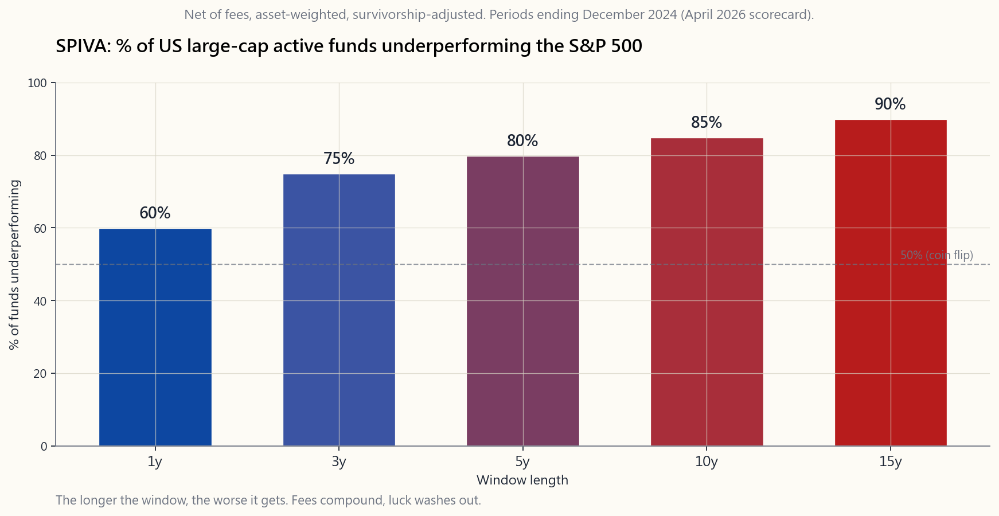
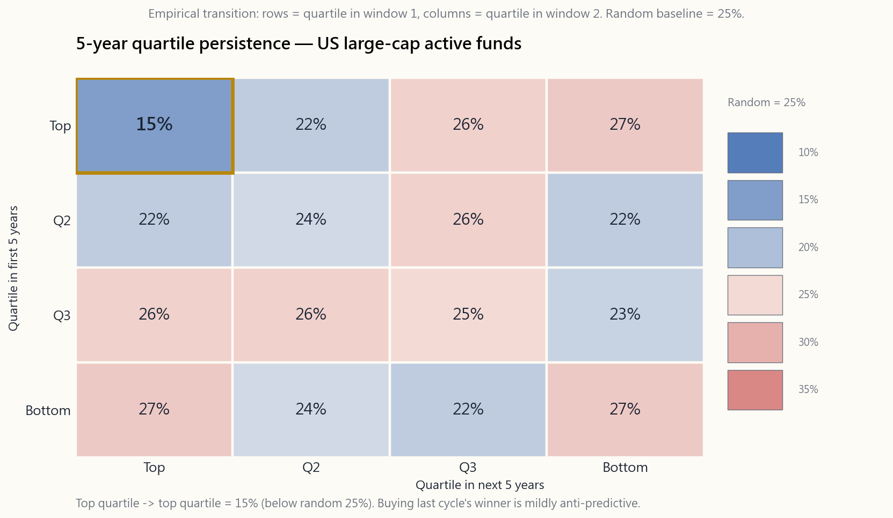

# 第四十三週：主動管理——SPIVA、持續性，以及極少數基金經理真正做到的事

---

## 第一部分：閱讀材料

---

### 1. 為何本課題至關重要

幾乎每位投資者，在某個時刻，都會聽到同一套說辭：*這隻基金去年跑贏了市場、這位基金經理有獨特的投資流程、這套策略行之有效已逾十年，你應該每年支付1%（或2+20）的費用。* 這套說辭有時確有其事，但從數據來看，幾乎永遠是假的。本課是「冷水澆頭」的一週。在我們探討那些*確實*能產生阿爾法的罕見策略之前，必須正視基準概率——基金經理真正具備技巧有多罕見、過往表現對未來表現的預測力有多差，以及每份基金廣告中根深柢固的倖存者偏差如何系統性地欺騙你。

你需要掌握這些內容，原因有四。

1. **基準概率慘不忍睹。** *市場大多數時候都是對的，阿爾法是罕見的缺口*——這不是口號，而是一個數字上的主張。SPIVA評分卡令這一點具體化。在15年的時間跨度內，大約90%的美國大型股股票基金跑輸標準普爾500指數。默認採用被動管理不是一種偏好，而是在你能夠說出這位基金經理屬於倖存的10%的具體理由之前，數據所迫使你做出的結論。
2. **持續性比隨機還要差。** 即使那些在某個五年窗口*確實*跑贏市場的基金，也極少能夠再次重複。SPIVA的持續性報告顯示，只有約15%的第一四分位基金在隨後五年維持第一四分位。隨機的話應有25%。過往表現不僅僅是*不具預測性*——對於頂尖表現者而言，由於均值回歸和基準偏移對上一週期的明星不利，它甚至略帶*反向*預測性。
3. **你將被帶有倖存者偏差的數字所推銷。** 當晨星告訴你大型股基金在過去二十年平均回報9%時，這個平均數只計算了*仍然存在*的基金。因表現不佳而關閉或合併的30-40%基金，已被剔出計算。一旦將其重新納入，與指數的差距進一步擴大。若你不懂得問「這是否經過倖存者調整？」，你將系統性地高估基金經理的技巧。
4. **一小撮策略確實奏效。** SPIVA並不是說*沒有人*跑贏市場。它說的是普通主動型互惠基金做不到。在這個平均數背後，藏著一條由策略組成的尾部——深度價值主義行動主義、量化系統化、事件驅動、高接觸商品交易顧問——這些策略數十年來都有可記錄的持續性。它們無法透過先鋒基金的代碼購買，需要資金、鎖定期或特定專業知識，而且四者之中有三個並非大多數散戶投資者在聘請「主動型」基金經理時所想像的那回事。陳馬本人所使用的阿爾法來源正是這些結構性的機會；本課將介紹機構分類學中它們各自的位置。

本週是*我應該主動還是被動？*（幾乎永遠是被動）與後續課程*如果我打算在投資組合的一部分採用主動管理，我實際上需要做什麼？*之間的橋樑。

---

### 2. 你需要掌握的知識

#### 2.1 SPIVA評分卡——情況究竟有多糟？

標準普爾道瓊斯每年發布兩次SPIVA（標準普爾指數對比主動管理）評分卡。這是業界最接近經審計、經倖存者調整的主動基金經理表現帳本的東西。其方法論簡單明瞭：對每個晨星基金類別，將期初存在的所有基金的資產加權（及等權重）扣費後回報，與相應的標準普爾基準進行比較，並報告跑輸的百分比。

2026年4月的評分卡（涵蓋截至2024年12月的各期間），對**美國大型股股票基金**呈現以下圖像：

- 1年窗口：約60%的基金跑輸標準普爾500指數。
- 3年窗口：約75%。
- 5年窗口：約80%。
- 10年窗口：約85%。
- 15年窗口：約90%。

這個規律毫不含糊。隨著窗口拉長，跑輸基金經理的百分比單調上升。為何如此？因為在單一年度，運氣主導一切。十五年後，費用複利累積，高費用的尾部因純粹的開支而被拖至指數以下，而經倖存者調整的計算也開始發揮作用。從8%的總回報中每年抽走100個基點，就是抽走了超過八分之一的總回報——而這正是你每年支付給普通互惠基金的代價，是它們對你所做的，而非為你所做的。

其他類別呈現類似規律。小型股對主動管理稍微友善（市場效率較低，15年跑輸率約80%）。已發展市場國際股票類似。新興市場對指數稍微不利，但調整貨幣對沖後差距收窄。主動管理*持續*佔優的地方，令人意外，正是市場中最昂貴的角落：可流通對沖基金及非流動性私人信貸，但兩者都存在選樣偏差和按模型估值問題，令數字顯得過於亮麗。我們將在後續課週仔細審視這些問題。

#### 2.2 持續性問題

對SPIVA的一個合理回應是：「好吧，*平均*水平的基金經理很差。但必定有*一些*持續的贏家。我只要挑選那些就好了。」這正是每一隻基金中的基金、每一位私人銀行顧問和大多數退休基金顧問賴以維生的工作。但數據顯示，這樣做同樣行不通。

標準普爾也發布持續性評分卡。取所有美國大型股基金，按五年表現排名，並將第一四分位的基金單獨列出。五年後，看看這些基金在*下一個*五年窗口中排在哪裡。隨機機率預測其中25%應留在第一四分位。經過多個年份平均後，實際數字接近**15%**。

這不僅低於隨機，而且是有意義地低於隨機。上一週期的明星*系統性地*跑輸純粹的隨機選擇。原因是機械性的，並非神秘莫測：

- **風格漂移／均值回歸。** 一隻因2015至2020年超配美國科技股而大獲全勝的基金，在結構上對下一輪該因子的逆轉過度暴露。令它在第一窗口躋身第一四分位的，正是令它在第二窗口易受衝擊的。
- **資產膨脹。** 成功帶來資金流入。一隻以精準流程管理2億美元小型股價值股的基金，大約在資產達到10億美元時開始撐不住，被迫擴大投資宇宙並稀釋優勢。大多數成功基金最終管理逾100億美元，看起來像它們曾經跑贏過的指數。
- **基金經理離職。** 建立業績記錄的組合經理退休，或被挖走。你購買的「基金」現在是一個不同的團隊。
- **費用。** 第一四分位基金往往是在表現亮眼後加費的，蠶食了未來的相對表現。

下方的轉換圖展示了這幅圖景。對角線——頂部維持頂部、底部維持底部——幾乎僅略高於非對角線。上一週期的四分位排名幾乎不帶任何關於下一週期排名的信息。

#### 2.3 倖存者偏差——為何平均數看起來比實際好

你所見到的每則基金廣告，往往在無意間都犯了同一個會計把戲。當一個基金家族審視「過去10年旗下股票基金的平均回報」時，他們只納入了*仍然存在*的基金。那些因表現太差而被清盤、合併至另一隻基金或悄然清算的基金，均被剔出數據集。

在15年的時間跨度內，大約30-40%的美國股票互惠基金，在期末已不再存在。它們消失，並非因為它們太優秀。它們消失，是因為它們太糟糕。從平均數中剔除它們，等同於在去掉後三分之一學生後才對畢業班進行排名。

當SPIVA按*倖存者調整*方式重新計算相同數字——即以最後申報的資產淨值納入已消亡的基金——跑輸差距每年進一步擴大50至150個基點。這正是為何§2.1所引用的SPIVA百分比是誠實的，而基金家族的市場推廣則不然。

倖存者偏差同樣侵蝕：

- **對沖基金指數回報。** 主要對沖基金數據庫採用自願申報機制。基金在表現好時申報，表現差時停止申報。估計業界平均回報的向上偏差：每年200至400個基點。
- **回測數據庫。** 來自CRSP的股票回報是乾淨的。策略層面的回測則不然——能倖存的信號被發表，死掉的被放進抽屜。
- **基金經理業績記錄。** 一位管理過兩隻基金、一隻消亡一隻倖存的組合經理，在推廣材料上只會提及倖存的那隻。

每當你從任何非SPIVA來源聽到*平均*回報數字，你的第一個問題應該是：*是否經過倖存者調整？*

#### 2.4 確實能產生阿爾法的四個類別

如果主動管理整體而言是一場輸的遊戲，我們為何還要在接下來十週教授它？因為SPIVA的尾部是真實存在的。隱藏在那個平均數背後，有四種截然不同、持久、有記錄的策略，確實能產生持續的阿爾法——但它們看起來並不像你在聽到「主動型基金經理」時所想像的選股。以下是機構分類學的框架。

**1. 深度價值行動主義。** 在被錯誤定價的上市公司建立大型集中倉位，然後與管理層或董事會接觸，強制實現價值釋放——出售、分拆、股份回購、策略轉向。巴菲特1990年前的年代、ValueAct、Paul Singer的Elliott Management、Pershing Square、Trian。容量本質上有限（一家公司只能容納這麼多行動主義者），持有期為3至7年，持續性有據可查。巴菲特1969年前的合夥人基金年複合毛回報約30%。Singer的Elliott自1977年以來每個週期均實現約13%的年淨複合回報。這是*買入被動流資金所拋棄的資產*並附以行動主義——一個結構性的阿爾法來源。

**2. 量化系統化。** 大規模統計驅動的模型交易。文藝復興科技的Medallion基金（不對外開放，自1988年以來年淨回報約40%）、AQR的市場中性及管理期貨系列、Two Sigma、DE Shaw、現代多策略平台（Citadel、Millennium、Point72）。這些機構挖掘數千個微弱信號並加以整合。優勢來源：速度、數據、基礎設施、人才，以及毫不留情的風險管理。*無法*透過1%費率的互惠基金獲取。零售可接觸的同類產品（AQR因子基金、BTAL、MTUM）在扣除費用和限制後，只能帶來總優勢的一小部分。即使結構性阿爾法存在，*你仍需要相應的工具包*——這些策略需要大多數投資者所不具備的資金、基礎設施和紀律。

**3. 事件驅動。** 併購套利、困境信用及重組後股票、特殊情況、資本結構套利。經典案例是併購價差交易：當A公司宣布以50元收購B公司，而B公司交易價格為48元，2元的差價是你為承擔交易破裂風險所收取的報酬。歷史上交易破裂頻率約為5-10%；扣除損失後的剩餘是套利者的工資。Davidson Kempner、Farallon、Apollo和橡樹資本的困境信貸部門。這些回報並非股票貝塔——它們是倉儲事件風險的保費。夏普比率為0.7至1.2，正常環境下回撤類似債券，危機時則類似股票。

**4. 高接觸商品交易顧問及酌情宏觀。** 趨勢追蹤者（Man AHL、全盛時期的Winton、Aspect、Lynx）及酌情宏觀交易者（索羅斯昔日的Quantum、Brevan Howard、Caxton）。這些機構在商品、外匯和利率趨勢上建倉，按波動性調整規模，並提供凸性的*危機阿爾法*——在股票崩盤時賺錢。商品交易顧問在1990至2024年間的長期平均淨回報約5-8%，夏普比率為0.4至0.6，但與風險資產回撤呈強烈負相關，這使它們作為一個配置區段而非獨立押注時具有價值。

四者的共同點：各自都有*結構性*的回報理由。行動主義者因參與而獲得報酬。量化基金因比任何人都更快處理數據而獲得報酬。事件驅動因倉儲交易風險而獲得報酬。商品交易顧問因提供凸性保險而獲得報酬。沒有一個是「我只是比賣方分析師更聰明的基本面分析師」。誠實的主動投資者會問：*我在為什麼事情獲得報酬？* 如果你無法用一句話加上結構性理由來回答，你就是在為噪音付費。

#### 2.5 這對你意味著什麼

將數據轉化為行動。

- **默認被動管理。** 你的貝塔配置區段——四個配置區段框架中的增長區段——應採用指數基金。三至四隻交易所買賣基金便能覆蓋大多數投資者所需的90%。其他任何東西都必須通過更高的門檻。
- **若你聘請主動管理，要求結構性故事。** 要麼是上述四個類別之一（而且你有獲取渠道——大多數散戶並沒有），要麼是這位特定基金經理具有可記錄、持久的優勢的具體理由。「流程健全」不是理由。「我們是集中型行動主義者，持有期5年，管理資產40億美元」才是理由。
- **關注費用。** 費用的每個基點都是確定無疑的跑輸。SPIVA的跑輸百分比，在與*毛回報*的主動回報比較時會大幅收窄。費用是差距的主要來源。
- **誠實評估你自己的主動配置區段。** 如果你操作一個小型期權或單一股票倉位——四個配置區段框架中約10%的機會性配置——就為其建立基準。三年後，如果你的信息比率低於0.3，就將資金轉移到指數。同樣的SPIVA邏輯適用於*你*。
- **不要追逐上一週期的贏家。** 在2020至2024年大放異彩的基金，從統計上看，在2025至2029年跑輸的可能性，比隨機選取的基金更大。在靚麗的五年業績後才買入，是散戶最常犯的錯誤。

我們將在第44週討論阿爾法分解（Brinson歸因），第45週討論主動型基金經理用於發掘罕見優勢的工具，第46週討論如何在家庭層面構建一個簡單、可評估的主動配置區段。

---

### 3. 常見誤解

1. **「過往表現必定有*一定*參考價值。」** 確實——它告訴你過去發生了什麼。但持續性數據顯示，它對於預測未來幾乎毫無用處，對於表現異常好的基金尤其如此。
2. **「主動管理在熊市中會跑贏被動管理。」** SPIVA按年度報告跑輸百分比，包括熊市年份。主動管理在熊市中並不系統性地跑贏。持有大量現金的基金可能在單一下跌年份勝出，但隨後拖累十年的表現。
3. **「1%的費用沒什麼大不了。」** 以7%的總回報計算，1%的費用在30年的複利下，大約侵蝕25%的最終財富。這是長線投資組合中最大的可控拖累因素。
4. **「夏普比率永遠反映真相。」** 賣出深度價外認沽期權能產生亮麗的夏普比率——直到某一天突然不行了。許多「技巧型」業績記錄其實是偽裝成阿爾法的沽空波動性策略。
5. **「對沖基金指數回報證明業界帶來價值。」** 對沖基金數據庫的自願申報偏差如此之大，以至於業界平均數字每年被高估200至400個基點。
6. **「被動管理不可能永遠持續增長。」** 也許，但被動管理在美國股票中的份額已從2010年的20%增至2025年逾50%，指數並未因此失靈。那套「被動管理是泡沫」的條件反射式論點已被證明是錯誤的，持續了十五年。只有真正的多年期體制轉變才能將其扭轉。
7. **「貼近指數的基金是安全選擇。」** 它們收取主動管理費用，卻提供接近指數的投資組合。主動份額研究（Cremers及Petajisto）發現，低主動份額基金跑輸的情況幾乎無一例外。
8. **「我挑選了好的基金——我屬於那15%。」** 幾乎每個人都這樣想。從構成上看，只有15%的人是對的。
9. **「巴菲特證明了選股是可行的。」** 巴菲特是單一樣本，在「行動主義」這個標籤出現之前就已是深度價值行動主義者，運用了你無法複製的資本（保險浮存金），且在過去十五年已基本上不再有意義地跑贏標準普爾500指數。
10. **「如果大多數基金經理跑輸，其餘的必然跑贏——所以我可以挑選那些。」** 不對。大多數基金經理的回報聚集在基準附近，加上一條由表現糟糕者拉低的左尾。右尾很小，而且你無法從過往回報中事前識別它。

---

### 4. 問答環節

**問：SPIVA究竟是什麼？**
答：標準普爾指數對比主動管理（S&P Indices Versus Active）。由標準普爾道瓊斯自2002年起每半年發布一次的評分卡，按晨星類別將互惠基金和交易所買賣基金的扣費後主動管理回報與標準普爾基準進行比較，並進行倖存者調整。這是業界關於主動基金經理跑輸問題最具公信力的公開數據集。

**問：為何跑輸百分比隨時間跨度拉長而上升？**
答：原因有三。費用複利累積。隨著樣本規模擴大，運氣成分縮小，負的平均阿爾法得以顯現。而且，早期表現良好的基金往往因資產增加而侵蝕其優勢。

**問：小型股或國際主動型基金經理表現更好嗎？**
答：稍微好一點。小型股主動管理在15年的跑輸率仍達75-80%。已發展市場國際股票類似。新興市場主動管理以本幣計算稍有優勢，但在加入貨幣對沖成本後差距縮窄。「市場效率低，主動管理在那裡勝出」這一論點，大體上只是民間說法。

**問：文藝復興科技Medallion基金年回報40%，如果阿爾法如此罕見，這怎麼可能？**
答：它不對外開放，容量有限（約100億美元），由物理和統計學博士組成的團隊管理，以閃電速度運作。該策略在結構上無法獲取，這正是它得以持續的原因。他們的公開基金（RIEF、RIDA）只取得其中一小部分的回報，且曾出現多年回撤。

**問：什麼是「高主動份額」基金？**
答：持股與基準存在重大偏差的基金——從構成上看，按權重超過約80%的差異。Cremers和Petajisto（2009年）發現高主動份額基金略微跑贏指數。貼近指數型基金（主動份額低於60%）則幾乎無一例外地跑輸。大多數基金家族現已公布這一數字。

**問：如果我無法事前識別具備技巧的基金經理，我應該怎麼做？**
答：將90%以上的股票配置用於指數基金。如果你想要主動配置區段，優先考慮（甲）費用低廉的因子交易所買賣基金（第23週）而非酌情決策型基金，（乙）你確實能獲取的上述四個有據可查的阿爾法類別，或（丙）一個由*你*誠實地對照指數進行基準測試的小型自主主動倉位。同樣的SPIVA邏輯也適用於你的帳戶。

**問：被動管理的崛起本身是否會破壞SPIVA的適用性？**
答：在任何有意義的時間跨度內，似乎不會。被動管理使得定價者更加集中和激烈地相互競爭；主動管理的規模縮小，但並不因此變得更容易。即使被動管理的佔比從20%升至美國股票資產管理規模的50%，跑輸基金的比例在十五年間一直穩定在70-90%左右。

**問：SPIVA是否包括對沖基金？**
答：不包括。SPIVA只涵蓋互惠基金和交易所買賣基金。對沖基金表現有其自身（更嚴重）的申報偏差，無法直接比較。

**問：有沒有家庭層面的SPIVA equivalent？**
答：有——DALBAR的QAIB（第11週）。普通個人投資者因行為失誤，每年跑輸標準普爾500指數買入持有策略約4至5%。DALBAR是家庭層面的SPIVA：大多數自主主動投資者也輸給了被動管理。

**問：那我應如何看待自己的自主交易倉位？**
答：將其視為一個有明確基準（美國單一股票用SPY，債券交易用AGG）和明確資金上限的主動配置區段（槓鈴法則——通常為淨資產的5-15%）。運作三年，誠實計算信息比率，如果未能達到0.3，就將資金歸還指數配置區段。

**問：為何持續性低於隨機，而不只是等於隨機？**
答：均值回歸加上費用驅動的資金流入。表現最好的基金，通常對上一週期勝出的風格過度配置；該風格隨後均值回歸。其資產規模翻倍，費用往往上升，策略被稀釋。這種組合在頂部四分位在結構上具有反向預測性。

**問：頂部五分位或頂部十分位呢？持續性是否更好？**
答：情況更糟。切片越窄，原始排名的運氣成分越大，均值回歸越劇烈。SPIVA的持續性報告顯示，頂部十分位維持頂部十分位的比例在5-10%的範圍——遠低於10%的隨機基準。

**問：我是否應該完全放棄主動管理？**
答：對於你的大部分財富，是的——這正是*默認被動管理*的意思。但理解四個類別，以及槓鈴式配置如何在大型*被動管理*核心之上加入一個小型明確的*機會性*配置區段，能讓你在真正存在優勢的地方參與，而不危及核心倉位。

---

## 第二部分：YouTube影片腳本

---

**影片標題：** 為何90%的基金經理輸給指數——以及真正賺得到費用的極少數

**目標時長：** 約18分鐘

**主持人：** 陳馬、小魚

---

**[開場白]**

**小魚：** 歡迎回來。陳馬，這是「冷水澆頭」的一週。我們用了四十二週建立一套工具包，現在我們要花整整一課告訴大家，幾乎所有人根本不應該做主動投資。

**陳馬：** 沒錯。在我們審視那些確實能產生阿爾法的罕見策略之前——我們接下來幾週會這樣做——我們必須先看基準概率。因為如果你不了解基準概率，每一個主動管理的說辭都聽起來合理。一旦你了解了，你的默認選擇就必須是被動管理，而主動管理就變成只有在非常具體的理由下才會做的事情。

**小魚：** 我們先從最重要的數字開始。

**陳馬：** SPIVA。標準普爾指數對比主動管理。2026年4月的評分卡，涵蓋截至2024年12月的期間，美國大型股基金。把圖表放出來。

**[VISUAL: image/week43_spiva_chart.png]**

**陳馬：** 五條長條，按時間跨度排列。一年，60%的大型股基金跑輸標準普爾500指數。三年，75%。五年，80%。十年，85%。十五年，90%。窗口越長，情況越差。為何如此？費用複利累積，運氣隨時間消退，而經倖存者調整的計算也開始發揮作用。

**小魚：** 而且這是扣費後的數字。

**陳馬：** 扣費後、資產加權、經倖存者調整。這是業界關於自身跑輸問題最乾淨的數據集，二十三年來一直在講述同一個故事。

**小魚：** 大家會說「好吧，平均水平很差，但我只要挑選好的就行了。」

**陳馬：** 這就涉及持續性問題。答案比大多數人預期的更糟。把轉換矩陣放出來。

**[VISUAL: image/week43_persistence_table.png]**

**陳馬：** 取任何五年窗口中大型股基金的第一四分位。純粹的機率說，它們中有25%應在接下來五年維持第一四分位。按SPIVA持續性報告的多個年份平均，實際數字接近15%。低於隨機。

**小魚：** 為何低於隨機？

**陳馬：** 風格均值回歸、資產膨脹、基金經理離職，以及亮眼表現後的加費。令一隻基金躋身第一四分位的，正是令它在下一個窗口易受衝擊的因素。上一週期的贏家，在結構上對下一輪逆轉過度暴露。

**小魚：** 所以過往表現不僅是不具預測性——在頂部甚至略帶反向預測性。

**陳馬：** 正確。在亮麗的五年業績後才買入，是散戶最常犯的錯誤。這也是基金中的基金和大多數顧問賴以維生的工作。

**小魚：** 講講倖存者偏差。

**陳馬：** 你在基金推廣材料中讀到的每一個平均回報數字，都是以現存基金計算的。在十五年的跨度內，30至40%的美國股票互惠基金會關閉、合併或悄然清算。它們並非因為表現太好而消失。它們是因為表現太差而消失。剔除它們，你的「平均數」只是倖存者的平均數。SPIVA對此進行了調整。推廣材料沒有。

**小魚：** 對沖基金也一樣？

**陳馬：** 更糟。對沖基金數據庫採用*自願*申報。基金在表現好時申報，表現不好時停止申報。業界平均對沖基金回報的估計向上偏差是每年兩至四個百分點。「對沖基金跑贏市場」這一說法，在調整後大部分都消失了。

**小魚：** 好，平均水平很差，持續性也很差。但我們接下來幾週要講主動策略。為什麼？

**陳馬：** 因為SPIVA的尾部是真實的。有四種截然不同的策略類別，數十年來產生了有記錄、持久的阿爾法。它們看起來不像大多數散戶在說「主動管理」時所想像的那種管理模式。

**小魚：** 逐一介紹。

**陳馬：** 第一，深度價值行動主義。在被錯誤定價的上市公司建立大型集中倉位，然後與董事會或管理層接觸，強制實現價值釋放。分拆一個部門、出售公司、進行股份回購。1969年前的巴菲特合夥人基金、Paul Singer的Elliott、ValueAct、Pershing Square、Trian。持有期為三至七年。持續性有據可查。容量本質上有限，因為一家公司只能容納這麼多行動主義者。

**小魚：** 第二。

**陳馬：** 量化系統化。大規模統計驅動的模型交易。文藝復興科技的Medallion基金。AQR。Two Sigma。DE Shaw。多策略方面的Citadel和Millennium。這些機構挖掘數千個微弱信號並加以整合。優勢來源是速度、數據、基礎設施、人才，以及毫不留情的風險管理。Medallion自1988年以來的年淨複合回報率約40%。它也不對外開放。零售可接觸的同類產品——AQR因子基金、MTUM、BTAL——在扣費和限制後只帶來總優勢的一小部分。

**小魚：** 第三。

**陳馬：** 事件驅動。併購套利、困境信用、重組後股票、特殊情況。A公司宣布以50元收購B公司，B公司交易價格為48元，2元的差價就是你為承擔交易破裂風險所收取的工資。Davidson Kempner、Farallon、Apollo的困境信貸部門、橡樹資本。夏普比率在0.7至1.2之間。正常環境下的回撤類似債券，危機時則類似股票。

**小魚：** 第四。

**陳馬：** 高接觸商品交易顧問及酌情宏觀。趨勢追蹤者——Man AHL、全盛時期的Winton、Aspect、Lynx——以及酌情宏觀交易者——索羅斯昔日的Quantum、Brevan Howard、Caxton。他們在商品、外匯和利率趨勢上建倉，按波動性調整規模，並提供凸性的*危機阿爾法*。他們在股票崩盤時賺錢。商品交易顧問的長期年淨回報約5至8%，夏普比率0.4至0.6，但與風險資產回撤呈強烈負相關，這使它們作為一個配置區段而非獨立押注時具有價值。

**小魚：** 四者有什麼共同點？

**陳馬：** 每一個都有回報的*結構性*理由。行動主義者因參與而獲得報酬。量化基金因比任何人都更快處理數據而獲得報酬。事件驅動因倉儲交易風險而獲得報酬。商品交易顧問因提供凸性保險而獲得報酬。沒有一個是「我只是比賣方更聰明的基本面分析師」。誠實的主動投資者會問：*我在為什麼事情獲得報酬？* 如果一個基金經理無法用一句話加上結構性理由來回答，你就是在為噪音付費。

**小魚：** 帶我們看看互動工具。

**陳馬：** 好的。開啟它。

**[VISUAL: interactive/week43_active_evaluator.html]**

**陳馬：** 三個輸入項。基金開支比率。對照基準的五年年化超額回報。以及基金的追蹤誤差——主動回報的標準差。

**小魚：** 輸出項是什麼。

**陳馬：** 信息比率——超額回報除以追蹤誤差。T統計量等於信息比率乘以年數的平方根。這是第17週的標準誤邏輯。以及最關鍵的結論：觀察到的超額回報是運氣而非技巧的隱含概率。等於一減去t值在真實阿爾法為零的零假設下超過觀察值的概率。

**小魚：** 以一隻典型的互惠基金為例。

**陳馬：** 開支比率1%。毛超額回報1.5%——扣費後0.5%。追蹤誤差4%。信息比率為0.125。T統計量為0.125乘以5的平方根，約為0.28。這是運氣而非技巧的概率——約39%。這跟拋硬幣相差無幾。

**小魚：** 現在換一隻優秀的基金。

**陳馬：** 扣費後超額回報5%，追蹤誤差6%，開支比率1%。信息比率0.83。T統計量0.83乘以5的平方根，約為1.86。是運氣的概率約3%。*這*是統計上有意義的技巧——而且在數據中也屬罕見。

**小魚：** 這對普通投資者意味著什麼？

**陳馬：** 對於貝塔配置區段，默認採用被動管理。這是第一條規則。那是你的增長區段、收入區段、價值儲存區段。如果你在任何地方聘請主動管理，要求一個結構性的故事——上述四個類別之一，以及你確實擁有的獲取渠道。關注費用。不要追逐上一週期的贏家。並且像對待基金經理一樣，對自己的自主交易倉位進行基準測試。三年，信息比率低於0.3，就將資金轉移到指數。同樣的SPIVA邏輯也適用於你。

**小魚：** 還有其他要補充的嗎？

**陳馬：** 還有一點。SPIVA並不是說*沒有人*跑贏市場。它說的是*平均*主動基金做不到，而且互惠基金世界裡*持續性*並不存在。確實奏效的罕見策略——四個類別——看起來不像大多數散戶在說「主動管理」時所想的那種。它們是專業化的、容量有限的，而且四者中有三個無法透過1%費率的互惠基金獲取。接下來幾週將逐一講解罕見案例的實際運作原理。

**[結尾]**

**陳馬：** 三個要點。第一，默認被動管理。在十五年的跨度內，90%的美國大型股基金跑輸標準普爾500指數。基準概率慘烈且穩定。第二，頂部四分位的持續性低於隨機。上一週期的贏家，在統計上比隨機選取的基金更可能跑輸。停止追逐業績。第三，真正的阿爾法存在於四個有記錄的類別——深度價值行動主義、量化系統化、事件驅動、高接觸商品交易顧問——但每一個都有結構性理由，而且大多數不能以低費用的零售管道獲取。如果你在沒有結構性故事的情況下為主動管理付費，你就是在為噪音付費。

**小魚：** 下週，我們打開引擎蓋，審視歸因問題：當一位基金經理*確實*跑贏時，回報中有多少來自資產配置，有多少來自選股？下週見。

---