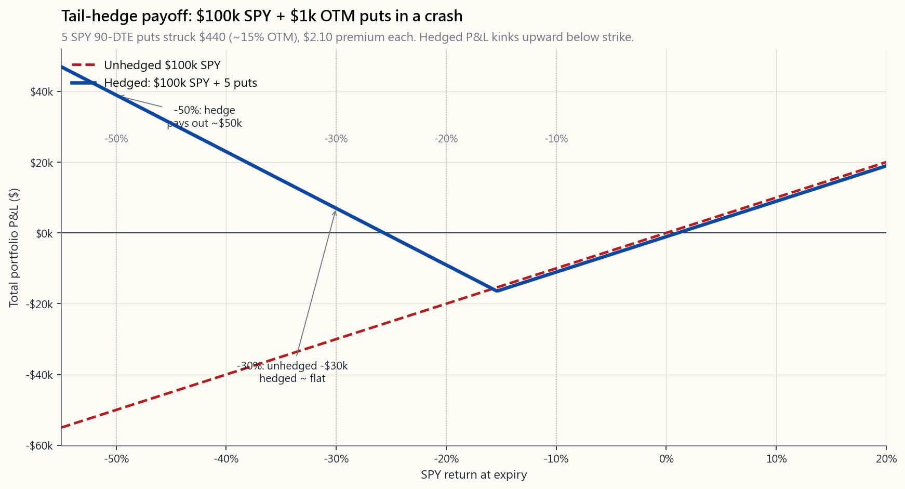
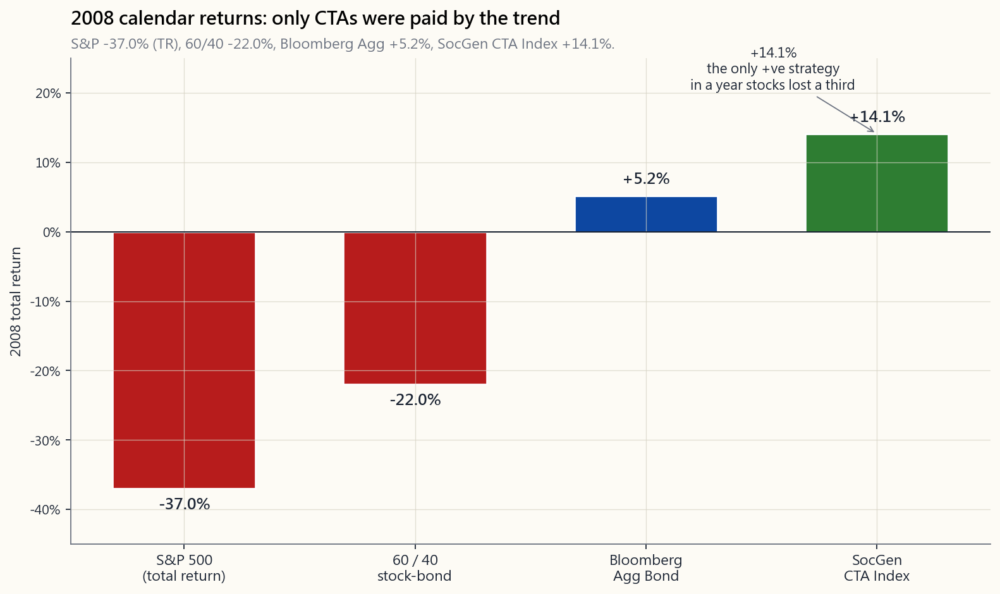

# 第47週：尾部風險——Universa、認沽期權保護，以及CTA作為長波幅分散投資工具

---

## 第一部分：閱讀材料

---

### 1. 為何此課題至關重要

教科書所定義的「黑天鵝」，是指偏離均值五個標準差的事件——即正態分佈尾端的5σ事件。根據鐘形曲線，這種事件每14,000年才發生一次。然而，單是1987年至2020年之間，標準普爾500指數便出現了三次。

市場並不遵從正態分佈。1987年那次單日收跌22.6%的事件，按照當時金融學者所採用的參數假設，其發生概率相當於每10⁵⁰年一次——遠遠超過宇宙的年齡，差距達多個數量級。然而這件事發生在一個星期一。2020年3月16日單日下跌12.0%，被標記為「5.6σ」走勢。2018年2月5日的「波動率末日」（Volmageddon）事件中，VIX相關產品單日暴跌115%——根據為這些產品定價的模型，這是一個太陽壽命之內才出現一次的事件。也就是說，短短三十年內，同一批投資者親歷了相當於四個宇宙壽命的極端事件。

尾部風險，正是教科書所抹去的那部分分佈。本課探討的，是投資組合中一個小型配置，其存在意義正是在教科書的「抹除」現身時獲得回報。

你需要理解尾部風險對沖，原因有四：

1. **回撤的算術是非線性的。** 跌50%需要漲100%才能回本；跌75%則需要漲300%。一個在長期投資過程中能夠規避最差5%月份的投資組合，從機械計算的角度而言，其最終財富將高於一個平均回報略高但缺乏保護的組合。尾部風險對沖是一種製造這種算術優勢的方式——買入在價格崩潰時才發揮作用的賣出權利。

2. **分散投資恰恰在最需要它的時候失效。** 在正常市況下，股票與債券、美國與新興市場、價值與增長之間的相關性處於中等水平。一旦危機爆發，相關性便會急速趨近+1。第4週所討論的60/40組合在2022年損失約22%，正因為分散投資的負相關性在那一刻消失殆盡。唯有尾部對沖，才具備在損失愈大時愈呈負相關的「負凸性」特性——而這恰恰是其他一切工具均告失敗的屬性。

3. **持有長波幅的期權金成本雖小但有限，尾部波幅的回報雖大但罕見。** 這是投資組合層面的槓鈴策略。以每年50至150個基點的已知小額拖累，換取在市場崩潰時巨大而未知的回報。這與第26至30週的賣出期權金策略恰好相反：賣出策略是以已知小額風險換取已知小額期權金，承擔一條大尾巴；尾部對沖則是同一交易的買方立場。其核心主張——波動率尾巴主宰整條狗——在於少數崩潰日主導了整個回報分佈，因此即使期權金造成持續拖累，為站在那些日子的正確一方而付費，仍屬理性之舉。

4. **CTA及管理期貨是系統性的、天然持有長波幅的替代方案。** 趨勢跟蹤者不購買認沽期權。他們在下跌過程中根據趨勢信號建立短倉。2008年，法興銀行CTA指數回報約+14%，而同期標準普爾500指數下跌38%，60/40組合下跌22%。其機制有所不同——透過多條趨勢合成的長跨式組合，而非字面意義上的期權——但在崩潰時的凸性回報形態卻頗為相似。這正是配置者將CTA與股票配對的原因，其方式與將價外認沽期權與股票配對如出一轍：作為一種在平靜年份收益甚微、卻在相關性崩潰時拯救投資組合的長波幅分散投資工具。

---

### 2. 你需要掌握的知識

#### 2.1 市場中「尾部」的真正含義

1928年至2024年標準普爾500指數的日回報分佈，並非正態分佈。它是厚尾的——專業術語稱為「尖峰態」，峰度超過20，而鐘形曲線的峰度僅為3。尾部事件的發生頻率並非抽象概念，以日度數據為例：

- **3σ日**（單日波動約±3%）：正態分佈預測約每1.5年出現一次。實際觀測：平均每年約5至8次，且在危機期間呈現集群分佈。
- **5σ日**：正態分佈預測每14,000年出現一次。實際觀測：大約每3至5年出現一次。
- **相當於10σ的日子**，如1987年或2020年3月16日：正態分佈預測幾乎永不出現。實際觀測：一個投資生涯中可遭遇數次。

由於實際尾部遠比參數尾部厚重，由此引申出兩個結論。第一，任何採用正態分佈作風險計量的模型——風險值、夏普比率、基於資本資產定價模型的定價——均系統性地低估崩潰風險。第二，這些尾部日子對長期投資組合的實際**預期**美元貢獻，**並非**微不足道。少數幾個-10%的日子，主宰了數十年的平均回報。尾巴主宰整條狗。

#### 2.2 保險成本的取捨

經典的尾部對沖工具是持有指數的價外認沽期權。以2026年4月為例，SPY交易價約$520，90日期限認沽期權的大概報價如下：

| 行使價 | 價外程度 | 期權金（$） | 期權金/名義金額 | 若SPY跌至$364（-30%）時的回報 |
|---|---:|---:|---:|---:|
| $500  | 4%   | $9.30 | 1.79% | 每張合約$13,600 |
| $470  | 10%  | $4.50 | 0.96% | 每張合約$10,600 |
| $440  | 15%  | $2.10 | 0.48% | 每張合約$7,600  |
| $400  | 23%  | $0.65 | 0.16% | 每張合約$3,600  |
| $360  | 31%  | $0.20 | 0.06% | 每張合約$0      |

（Black-Scholes定價，σ = 19%，r = 4.3%，q = 1.3%。）

價外15%的認沽期權，90日的費用約佔名義金額的0.48%——若按季滾動，每年約為名義金額的2%。在市場暴跌30%的情況下，每$1的期權金大約帶來$36的回報（對沖配置的~36倍投資回報倍數），若以50個基點的配置計算，**整個**投資組合約獲得+18%的回報。

然而，正常年份2%/年的拖累，正是大多數散戶嘗試此策略時功虧一簣的原因所在。每年花費2%對沖一個十年一遇的事件，到事件真正發生之前，你相對無對沖股票組合已累積虧損20%。這正是Universa採用不同框架的原因：在更深度價外合約上花費更少（每年50至150個基點），這些合約在正常時期極為廉價，但一旦崩潰便會爆發出巨大的凸性。

#### 2.3 Universa式架構

Universa Investments——Mark Spitznagel創辦的公司，Nassim Taleb擔任顧問——推廣了他們所稱的**資本效率型尾部對沖**。根據公開披露，其架構如下：

- **對沖規模**：每年佔資產淨值的0.5%至2%，視乎市況而定。
- **行使價**：深度價外（通常為指數價格的25至35%以下）。
- **期限**：滾動持倉，重點配置於波動率的波動性最高的1至3個月期限段。
- **正常市況下的表現**：成本緩慢消耗——大多數期權到期歸零。
- **崩潰時的表現**：深度價外認沽期權的Gamma值呈拋物線式上升。Universa公開披露，其對沖配置在2020年3月錄得+4,144%的回報，該公司及Taleb稱，在對沖配置佔3.3%、風險資產佔96.7%的比例下，原本應下跌約30%的股票組合，最終整體月回報轉為約+0.4%。

下圖展示了一個假設情景的幾何形態：$100,000的標準普爾500持倉，配合每季$1,000的尾部對沖預算。在-30%的情景下，無對沖的$100,000虧損$30,000；而以$1,000配置於5至10%價外、按季滾動的認沽期權，回報約為25至50倍——將-$30,000的回撤轉化為合併損益接近持平甚至略為正數。

需要內化的取捨是：每個市場**未有**崩潰的季度，那$1,000便會蒸發。折算為年率，你放棄的約為對沖配置的4%，即整體投資組合的約1%。這就是持有凸性保險的代價。實證問題在於：這1%/年的拖累，能否在歷史上每7至10年出現一次的崩潰中得到補償，且有所盈餘。

#### 2.4 CTA及管理期貨：無期權金消耗的長波幅工具

建立尾部長倉的第二條路，在結構上截然不同，那就是做多**趨勢**。管理期貨計劃——有時稱為CTA（商品交易顧問）——在約50至200個流動性期貨市場（股票指數、利率、貨幣、商品及波動率本身）上系統性地執行趨勢跟蹤。信號的基本邏輯是「買入上升品種，沽出下跌品種，並根據實際波動性調整倉位規模」。

趨勢跟蹤者在一次**持續不間斷**的六個月下跌中，其回報圖形在結構上類似於標的資產的長跨式組合——在平靜市況中小幅震盪（因趨勢出現鞭打），在持續方向性走勢中獲得巨大正回報。這恰恰正是崩潰所創造的市況。以2008年為例：

| 策略 | 2008年全年回報 |
|---|---:|
| 標準普爾500（總回報） | −37.0% |
| 60/40股票債券 | −22.0% |
| 彭博綜合債券指數 | +5.2% |
| **法興銀行CTA指數（管理期貨）** | **+14.1%** |
| Universa式尾部對沖（模擬） | +50%至+100%以上 |

CTA的機制**並非**持有崩潰保險。而是在崩潰發生之前，趨勢信號已令其建立了股票短倉、債券長倉及美元長倉。他們的收益來自走勢的持續性，而非引伸波幅曲面的形態。這使其成為一種不同類型的長波幅敞口——長**實際**波幅，而非長**引伸**波幅——且有一個關鍵優勢：在正常年份的持有成本遠低於直接買入認沽期權計劃（往往接近零，甚至略為正數）。

值得注意的是：CTA在危機後快速反彈的市況下表現欠佳，因為趨勢信號會出現鞭打效應。2018年第四季度、2020年3月的V形反彈，以及2022至23年的走勢，都是CTA在底部附近持有股票短倉，繼而在反彈途中反覆進出的典型案例。直接的認沽期權對沖在單一下跌行情中能夠乾淨利落地兌現保護，並即時結算。CTA則需要走勢**持續**。兩者均是長波幅敞口，但失效情境各有不同。

#### 2.5 投資組合層面的槓鈴策略

這就是投資組合層面的槓鈴策略。投資組合的大部分配置於緩慢複利增長的基礎資產——指數股票、短期國債、黃金，即枯燥乏味的部分。而一個小型配置，佔1%至5%，則是凸性尾部對沖：深度價外認沽期權、波動率指數認購期權，或CTA計劃。對沖配置在任何單一年份的預期回報，對於認沽期權而言是**負數**，對CTA在震盪市況中則約為零。但**以崩潰為條件**的預期回報卻極為可觀。

槓鈴策略的邏輯：

- **對沖配置的虧損有上限。** 認沽期權最多虧損期權金。沒有追繳保證金、沒有流動性危機、沒有被迫平倉。對沖不會以傷及組合其餘部分的方式爆倉。
- **對沖配置的回報無上限。** 在崩潰中取得30至50倍的對沖回報並非罕見。2020年部分一週期限深度價外SPY認沽期權錄得超過1,000%的回報，均有案可查。
- **整體投資組合的敞口呈正偏態。** 你放棄了小額**已知**預期回報，換取左尾時**大得多**的預期回報。這與第14週的槓鈴策略如出一轍——以小額已知損失換取大額未知收益——只不過這次應用的是投資組合的**保險**配置，而非上行配置。

#### 2.6 對沖規模的設定——三條實用原則

1. **將每年的持有成本上限設為總資產淨值的1%。** 這大約是回測支持長期崩潰回報所能回收的**上限**。超過此水平，對沖便從保險演變為方向性看空押注。
2. **按季滾動，而非按年滾動。** 按月滾動過於昂貴（時間值消耗令對沖配置殆盡），按年滾動則在快速下跌期間損失太多Gamma值。60至90個交易日期限配合季度滾動，是Universa公開採用的節奏。
3. **行使價選擇：選擇期權金/名義金額≤0.5%的最廉價行使價。** 在中等引伸波幅水平下，這通常是價外15至25%的水平；在高波動率指數市況下，則為價外5至15%。行使價愈低，凸性回報愈高；行使價愈高，期權金預算消耗愈快。

對於大多數散戶投資者而言，實際操作方式為：持有SPY（或VTI，但SPY/SPX期權鏈流動性更佳），劃撥1%作對沖配置，每季買入90日、行使價對應期權金/名義金額約0.4%的SPY認沽期權，並在同一日曆時間滾動。在引伸波幅約18%的情況下，每年持有成本約為1.6%，引伸波幅較低時成本更少。指數認沽期權按60/40長/短期規則（1256條款合約）課稅，對大多數投資者而言，稅後優勢約達200個基點。

#### 2.7 此策略**不是**什麼

- **不是市場時機策略。** 對沖持續存在，而非在預判崩潰前才買入。「崩潰預測」的信噪比過低，難以用於交易決策。
- **不能取代資產配置。** 沒有基礎資產的槓鈴，不過是一個深度價外認沽期權組合。能夠複利增長的，是基礎資產——指數股票、短期國債、黃金。對沖保護的是這個複利增長引擎。
- **不是免費的。** 每年0.5%至2%的持有成本是真實的資金開支。對沖規模必須設定在即使7至10年內沒有崩潰事件，仍可持續承受的水平。互動實驗室可讓你壓力測試這一取捨。

互動工具`week47_tail_lab.html`讓你設定預算、行使價、剩餘到期日及崩潰情景，並逐一顯示對沖成本、對沖回報、正常年份的拖累，以及無對沖與有對沖的回撤對比。

---

### 3. 常見誤解

1. **「黑天鵝等於5σ事件。」** 並非如此——按照Taleb本人的定義，黑天鵝是一個**未被納入模型**的事件。5σ的說法，是教科書用正態分佈來近似描述其稀有程度的語言。真實市場所產生的「5σ」事件，其發生時程與鐘形曲線毫無關係。

2. **「尾部對沖與買入認沽期權是同一回事。」** 買入平價認沽期權是投資組合保險——成本高昂（每年約6至8%的拖累），且你所付出的大部分費用，是你實際上並不需要的**引伸波幅**。尾部對沖是深度價外的凸性配置，屬於不同的產品、不同的成本結構、不同的回報幾何形態。

3. **「如果認沽期權持續虧損，為何還要買？」** 因為在它們兌現的那一年，回報可達30至100倍。一個分佈中帶有一次大型正回報、其餘為小額負回報的配置，其幾何平均數**並非**該配置的算術平均數——而是整個投資組合的複利路徑。添加一個負相關的凸性配置，即使該配置本身的算術平均數為負，也能提升整體組合的幾何平均數。

4. **「CTA只是收費高昂的對沖基金策略。」** CTA確實收取費用，但長波幅的凸性回報是其結構性特徵，而非費用結構本身。目前較為合適的散戶替代工具已有流通：美國市場有KMLM、DBMF、CTA等流動性強的交易所買賣基金，年化費用接近交易所買賣基金水平（50至100個基點），遠低於對沖基金的2%管理費加20%表現費模式。

5. **「波動率指數認購期權才是正確的尾部對沖工具。」** 波動率指數認購期權在崩潰飆升期間的Gamma值更為劇烈，但其均值回歸速度也極快，數日之內便會回落。許多知名的波動率指數認購期權回報，在散戶來得及兌現之前便已消失。SPY/SPX認沽期權以**標的資產**結算，而非以均值回歸的波動率指數結算，因此回報能夠乾淨清晰地捕獲。

6. **「60/40自身已提供對沖。」** 在1990年至2021年股債相關性為負的時期，確實如此。但2022年兩個配置同步下跌約18%。一個沒有明確尾部對沖的60/40組合，在利率與股票同時拋售的市況下——即通脹驅動的左尾市況——毫無保護可言。

7. **「尾部對沖持續跑輸，只在一次事件中兌現。」** 更接近現實的描述是：尾部對沖在長時間平靜期跑輸，並在重要的5至10%的月份兌現。你所購買的，正是那些月份的**累計**貢獻。複利的特點在於路徑依賴性。

8. **「Universa只是在2020年3月碰巧走運。」** 這種可能性存在。但同一家公司在2008年、2011年、2015年及2018年均錄得強勁的尾部回報——這一規律更符合結構性策略的特徵，而非單一事件的運氣。該策略的機制——深度價外認沽期權的滾動持有——可公開複製，且數學原理廣為人知。

9. **「我只需在市場下跌時沽出便可。」** 散戶擇時的歷史記錄慘不忍睹（第11週）。對沖配置是**自動運作**的——在恐慌最盛、投資者最難以理性行事的時刻，無需作出任何決定。

10. **「尾部對沖只屬富人專利。」** 一個$100,000投資組合的1%配置，每年不過$1,000。深度價外行使價的SPY期權，期權金以分計。最低可行的實施方式是：每季買入一張行使價$440、期權金約$2的SPY認沽期權，即約$200，一年四次約$800。任何已獲批期權交易資格的散戶經紀賬戶均可實現。

---

### 4. 問答環節

**問題1：散戶投資者可執行的最簡單尾部對沖方案是什麼？**
答：持有SPY（或VTI，但SPY/SPX期權鏈流動性更佳）。每季買入一至兩張90日期限、行使價約為價外15%的SPY認沽期權，規模設定為全年期權金總支出佔投資組合的1%。每季在相同的日曆時間滾動——即使市況平靜，也不得跳過某季。

**問題2：以波動率指數認購期權替代SPY認沽期權如何？**
答：波動率指數認購期權在崩潰飆升期間的Gamma值更為劇烈，但數日之內便強烈均值回歸。變現的窗口極短，大多數散戶投資者缺乏在波動率指數達到60以上時賣出的紀律。SPY認沽期權以標的資產結算，而非以均值回歸的指數結算，因此更易管理。部分基金經理會兩者兼用——波動率指數認購期權捕捉飆升，SPY認沽期權對應持續性回撤。

**問題3：對沖應針對整個投資組合，還是僅針對股票配置？**
答：僅針對具有股票Beta特徵的部分。若你的配置為60% SPY、20%債券、10%黃金、10%短期國債，對沖規模應按60% SPY的部分計算（以及20%債券中屬於長存續期的部分，因其自身也面臨回撤風險）。

**問題4：費用如何隨波動率指數水平變化？**
答：大致與引伸波幅呈線性關係。當波動率指數為12時，深度價外行使價極為廉宜（期權金/名義金額約0.2%）；當波動率指數為30時，相同行使價的費用則為2至3倍。Universa式計劃在高引伸波幅市況下**減少**對沖支出，在低引伸波幅市況下**增加**支出。保險廉價之時，正是購買保險的最佳時機。

**問題5：為何CTA在震盪市中虧損，卻在趨勢市中獲利？**
答：趨勢信號需要價格在同一方向呈現**持續性**。一個在三個月內上漲10%、下跌10%、再上漲10%的市場，會造成鞭打損失——策略在拉升時買入卻遭止蝕，在下跌時沽出又遭止蝕。而一個在三個月內持續下跌30%的市場，則是算法全程做空所跟蹤的乾淨趨勢。2008年是乾淨趨勢的典範；2018年第四季度及2020年3月，則更接近快速回彈的震盪市況。

**問題6：認沽期權與CTA可以同時使用嗎？**
答：可以，且這是常見的機構配置方式。5%配置於CTA交易所買賣基金（KMLM、DBMF或同類產品），加上1%的認沽期權對沖配置，同時提供長**實際**波幅及長**引伸**波幅的敞口。兩者的回報特徵互為補充：CTA覆蓋緩慢發展的趨勢，認沽期權覆蓋認沽期權可能已到期的跳空下跌事件。

**問題7：尾部對沖作為獨立策略，其預期回報是否為正？**
答：在正常市況下，對沖配置本身的算術預期回報為**負**——這是保險的代價。然而，**投資組合層面**的預期幾何回報是有可能上升的，因為左尾月份的凸性回報改變了整體賬簿的複利路徑。關於獨立尾部對沖計劃的實證記錄顯示，在完整週期內，其絕對回報大致持平至略為負數，但對宿主投資組合的複利增長的**貢獻**卻明顯為正。

**問題8：尾部對沖配置的最壞情景是什麼？**
答：一段漫長的牛市緩慢上漲，且毫無波動性事件。2017年是典型例子——標準普爾500錄得+21.8%的回報，實際波動性低於7%。1%的認沽期權對沖配置在那個年度幾乎全部虧損，對整體組合回報貢獻約-1%。賭的是：你放棄1%的那一年，股票已上漲22%，因此淨敞口尚可接受。若連續出現十個2017年，這個賭注便告失敗——這在歷史上從未發生，但理論上並非不可能。

**問題9：尾部對沖如何與槓桿互動？**
答：尾部對沖**賦予**槓桿存在的條件。使用槓桿的股票多頭倉位若缺乏崩潰保護，可能因單次下跌而被清算。一旦持有深度價外認沽期權，有對沖的槓桿倉位的最大回撤便有明確上限——大致等於行使價距離加上對沖成本。這是含尾部對沖的風險平價基金及部分退休金配置的公開架構。

**問題10：現在是購買尾部對沖的好時機嗎？**
答：答案永遠是**按計劃買入**。基於預判崩潰信號而購買尾部保險，會將策略從對沖轉化為方向性押注，而方向性押注的勝算極差。Universa的論點是：當波動率指數**低**、保險廉價之時，你應該購買**更多**保護，而非更少。截至2026年4月，波動率指數約為14，這在歷史上是購買深度價外SPY認沽期權保護的有利環境。

**問題11：此策略在美國以外的股票市場有效嗎？**
答：最成熟的深度價外期權市場是SPX/SPY。EFA/IWM/IEFA亦有可行的期權鏈，但流動性較薄。新興市場認沽期權對於系統性計劃而言流動性不足。就美國上市的可投資範疇而言，散戶的實際操作是：以美國股票為基礎的投資組合，配合美國股票指數的認沽期權對沖。

**問題12：本課與第40週（波動率指數）及第42週（風險值）有何關聯？**
答：第40週解釋了為何波動率指數是引伸波幅的前瞻性衡量工具——即為這些認沽期權定價的輸入值。第42週解釋了為何風險值系統性地低估尾部風險——本課所要解決的實證問題。本週則是對以上兩者的**回應**：嚴肅對待風險值低估問題，並以波動率指數定價的期權加以應對的實用架構。

---

## 第二部分：YouTube腳本

---

**影片標題：** 尾部風險——Universa式對沖、認沽期權保護，以及CTA作為長波幅分散投資工具
**目標時長：** 約18分鐘
**主持人：** 陳馬、小魚

---

**[開場 — 0:00–1:30]**

**陳馬：** 歡迎回來。這是第47週——尾部風險。在四十六堂課的謹慎資產配置之後，今天我們來談談投資組合中那個**專門**在其他一切都虧損的那天賺錢的部分。

**小魚：** 而我們希望觀眾帶走的標題數字是：2020年3月，Mark Spitznagel的公司Universa公開披露對沖配置錄得+4,144%的回報。在3.3%的配置比例下，一個原本應該下跌30%的投資組合，整個月的回報轉為約**持平**。

**陳馬：** 這就是尾部風險對沖做得正確的幾何形態。今天我們解釋**如何做到**——以及如何在普通經紀賬戶中，以散戶規模複製同一交易。

---

**[第一節 — 「尾部」的真正含義 — 1:30–4:30]**

**陳馬：** 小魚，金融教科書在教授風險時，假設的是什麼分佈？

**小魚：** 正態分佈。鐘形曲線。均值和標準差足以完整描述回報分佈。

**陳馬：** 對。而在鐘形曲線的假設下，1987年10月19日——標準普爾單日收跌22.6%的那天——大約每10的50次方年才會發生一次。比宇宙的年齡長出許多個數量級。然而那件事發生在一個星期一。

**小魚：** 然後2020年3月16日出現了單日12%的跌幅，2015年8月24日出現了單日8%的跌幅，2018年2月5日出現了Volmageddon，還有——

**陳馬：** 重點是教科書是錯的。市場是厚尾的。鐘形曲線說每14,000年才出現一次的5σ日——在真實數據中每3至5年就出現一次。教科書說每18個月出現一次的3σ日——每年出現5至8次，且集中在危機期間。

**小魚：** 所以如果教科書的風險數字是錯的，問題就是投資者應該**怎麼做**。

**陳馬：** 兩件事。第一，不要把夏普比率當作風險的完整描述。第二，在投資組合中劃撥一個小配置，專門用於在教科書最錯的時候**獲利**。

---

**[第二節 — 保險成本的取捨 — 4:30–7:30]**

**陳馬：** [VISUAL: image/week47_tail_hedge_payoff.png] 來看看這個幾何形態。我們有$100,000在SPY，以及每季$1,000的尾部對沖預算。看那條無對沖線——筆直的斜線，在市場崩潰30%時虧損30,000美元。再看有對沖的線。

**小魚：** 它出現了彎折。在大約負10%的位置急劇向上彎折——到負30%時接近持平，甚至略為正數。

**陳馬：** 那個彎折，正是凸性為你帶來的東西。每季滾動一張$1,000的深度價外認沽期權，行使價約為價外15%——當市場下跌30%，那$1,000會變成$50,000甚至更多。認沽期權的回報是你所花費金額的三十、四十、五十倍。

**小魚：** 那正常年份的成本呢？

**陳馬：** 這是關鍵數字。$100,000投資組合，每季$1,000，每年$4,000——這是對沖配置4%的支出，但在任何正常年份，其餘部分的複利增長基本上都能回收甚至超額回收。整體資產淨值的淨**拖累**接近1%。這就是你的保險費。

**小魚：** 而問題在於，你能否在崩潰年份回收這1%。

**陳馬：** 這是實證問題，歷史記錄的答案是肯定的——而且差距極大——前提是你不在崩潰到來之前放棄計劃，而這恰恰是最難的部分。

---

**[第三節 — Universa架構 — 7:30–10:00]**

**陳馬：** 讓我明確地描述一下Universa式架構。

**小魚：** 對沖規模？

**陳馬：** 每年佔資產淨值的0.5%至2%，視乎市況。引伸波幅高時少配，引伸波幅低時多配。保險便宜時買，不是貴時買。

**小魚：** 行使價？

**陳馬：** 深度價外。低於現貨價25至35%。這些合約在美元金額上幾乎是免費的，卻在崩潰時爆發出巨大的凸性。平價認沽期權太貴——每年6至8%的拖累。深度價外認沽期權只有每年0.2至1%的拖累。

**小魚：** 期限？

**陳馬：** 60至90日，按季滾動。按月滾動太貴——時間值把對沖配置蠶食殆盡。按年滾動太遠——Gamma值走平。60至90日的窗口是Universa公開使用的最佳區間。

**小魚：** 那作為槓鈴策略的框架呢？

**陳馬：** 正是。投資組合大部分配置於緩慢複利增長的枯燥基礎資產——指數、短期國債、黃金。小型配置是凸性尾部對沖。對沖的虧損有上限——最多虧損期權金。回報無上限——崩潰時30至100倍的回報。

**小魚：** 波動率尾巴的論點呢？

**陳馬：** 波動率尾巴主宰整條狗。少數崩潰日主導了整個回報分佈。規避它們，你以更高的速度複利增長，即使扣除保險費之後亦然。不規避它們，你便得到教科書的算術——而教科書的算術是錯的。

---

**[第四節 — CTA及管理期貨 — 10:00–13:00]**

**陳馬：** 現在說第二條長波幅路徑。CTA。

**小魚：** 商品交易顧問。趨勢跟蹤者。

**陳馬：** 對。在50至200個流動性期貨市場上系統性執行趨勢跟蹤——股票指數、利率、貨幣、商品。買入上升品種，沽出下跌品種，根據實際波幅調整倉位規模。

**小魚：** [VISUAL: image/week47_cta_2008.png] 這是2008年。標準普爾下跌38%。60/40下跌22%。債券上漲5%。法興銀行CTA指數——**正14%**。

**陳馬：** 2008年是CTA歷史上最乾淨的一年。每個宏觀市場都出現趨勢：股票全年下跌，債券全年上漲，美元升值，商品在下半年崩潰。趨勢跟蹤者做空股票、做多債券、做多美元、做空商品——並在每一個走勢中全程持倉。

**小魚：** 但CTA在震盪市中會虧損？

**陳馬：** 是的。2018年第四季度、2020年3月的V形反彈、2022至23年的走勢——都是典型的鞭打案例。趨勢信號在拉升時買入卻遭止蝕，在下跌時沽出又遭止蝕。策略需要價格的**持續性**。乾淨的下跌趨勢是天堂。波動性飆升後快速反彈則是地獄。

**小魚：** 所以如果你兩者都想要——跳空下跌保護加上慢趨勢保護？

**陳馬：** 那就兩者兼用。1%的認沽期權對沖配置，加上5%的CTA配置。認沽期權覆蓋趨勢信號來不及捕捉的跳空下跌事件。CTA覆蓋認沽期權可能已到期之前的緩慢熊市。不同的失效情境，不同的捕獲特徵。

**小魚：** 散戶工具？

**陳馬：** KMLM、DBMF、CTA——這些都是美國上市的管理期貨交易所買賣基金，開支比率在90至100個基點左右。不是對沖基金的2%加20%。純粹美國上市——這些產品均符合此條件。

---

**[第五節 — 規模設定與實用原則 — 13:00–15:30]**

**陳馬：** 設定尾部對沖規模的三條實用原則。

**小魚：** 第一條。

**陳馬：** 將每年的持有成本上限設為總資產淨值的1%。超過這個水平，對沖便從保險演變為方向性看空押注，而方向性看空押注面對美國股票長期向上的漂移，勝算極差。

**小魚：** 第二條。

**陳馬：** 按季滾動，而非按年。60至90個交易日期限，行使價對應期權金/名義金額約0.4%，每季在同一日曆時間滾動。市場平靜也不得跳過某季。紀律本身就是全部的優勢。

**小魚：** 第三條。

**陳馬：** 按**價格**而非按距離選擇行使價。反推至期權金佔名義金額0.4%的行使價。這個數值會隨引伸波幅浮動——波動率指數為12時，你可以用0.4%買到價外25%的行使價；波動率指數為30時，則只能買到價外5至10%的行使價。無論如何，對沖配置的**規模**保持不變；行使價的**距離**隨之調整。

**小魚：** [VISUAL: interactive/week47_tail_lab.html] 這裡的互動實驗室讓觀眾輸入自己的投資組合規模、對沖預算、行使價及剩餘到期日，並並排顯示持有成本與崩潰回報的對比。

**陳馬：** 試試在1%預算、15%價外行使價下的負30%情景。看無對沖的數字——$100,000虧損3萬——再看有對沖的數字，結果接近持平。這一張圖，就是這個策略的全部投資論點。

---

**[第六節 — 此策略不是什麼 — 15:30–17:00]**

**陳馬：** 三件此策略**不是**的事，因為每個散戶在實施時都會在這幾點上出錯。

**小魚：** 第一——它不是市場時機策略。

**陳馬：** 對沖是**持續存在**的。我們不試圖預測崩潰。每季照常支付期權金，無論如何。大多數季度，期權金蒸發。這就是交易的本質。

**小魚：** 第二——它不能取代資產配置。

**陳馬：** 沒有基礎資產的槓鈴，只是一個深度價外認沽期權組合，其預期回報本身是深度負數。能夠複利增長的是基礎資產——指數、短期國債、黃金。對沖保護的是這個複利增長引擎。

**小魚：** 第三——它不是免費的。

**陳馬：** 每年0.5%至2%資產淨值的持有成本，是真實的資金開支。在承諾之前，確保規模在7至10年無崩潰窗口內仍可持續。如果你無法承受持有成本而中途放棄，那就縮小配置，或者乾脆不做。

---

**[結語 — 17:00–18:00]**

**小魚：** 下週——第48週，資本效率：機構配置者如何疊加槓桿敞口，讓同一筆資本同時承擔兩份工作。

**陳馬：** 而我們本週所涵蓋的：尾部事件以教科書無法模型化的頻率出現的事實，為站在這些事件正確一方而付費的Universa架構，作為系統性長實際波幅分散投資工具的CTA，以及應用於投資組合**保險**配置的槓鈴邏輯。

**小魚：** 打開`interactive/week47_tail_lab.html`。設定預算，設定行使價，按下負30%的按鈕。那個算術，就是本課的精髓。

**陳馬：** 下週見。