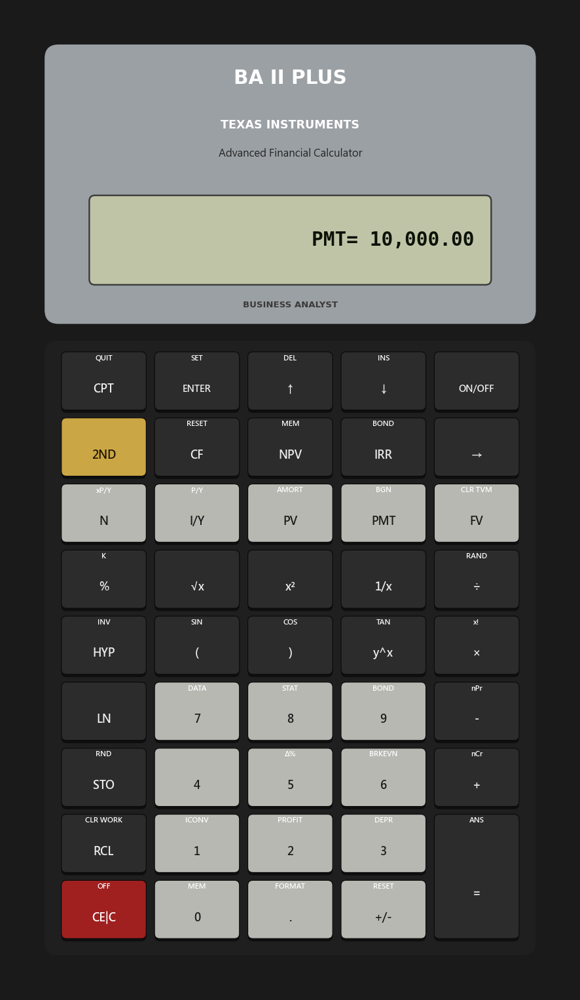

# 補充課 01：TI BA II Plus — 你的實戰工具

---

## 第一部分：閱讀篇

---

### 1. 為什麼這很重要

在 CFA 考場、債券交易席位、估值面試室，以及認真自行建模的散戶投資人桌上，只有**一款**硬體設備始終如一地出現：**德州儀器 BA II Plus**。自 1980 年代起，它便是業界的預設標準，也是每個認證機構明確核准（CFA、CMT、CIPM）或直接點名指定的計算機（尤其是 CFA）。

一個誠實的問題是：*既然試算表能做到這一切，為什麼我還要學計算機？* 原因有三：

1. **建立現金流量符號慣例的直覺。** 試算表隱藏了資金流動的方向，而 BA II Plus 讓你無從逃避。按錯按鍵，它會回傳 `Error 5`——「無解」。這個回饋機制，正是初學者最需要的。
2. **說專業人士的語言。** 所有關於**貨幣時間價值**的金融對話，都使用計算機強制建立的五鍵詞彙：`N`、`I/Y`、`PV`、`PMT`、`FV`。一旦這五個鍵成為反射動作，每一筆貸款、每一檔債券、每一個股利折現模型，都能用一句話說清楚。
3. **找出自己試算表中的錯誤。** 計算機與試算表是同一套數學的兩套獨立實作。如果你的 Excel **現金流量折現法**模型與 BA II Plus 在相同輸入下得出不同答案，其中一個是錯的——通常是試算表，因為在那裡更容易犯期數差一的錯誤。

這堂補充課教你使用計算機的方式，就像學習一件樂器：先有足夠的理論知識讓你知道自己在做什麼，然後在經典題型上大量反覆練習，直到你的雙手不需要大腦拼出按鍵步驟。

網站上的互動面板是本裝置的完整模擬器——你可以直接在瀏覽器中執行本課的每個範例，無需購買實體機。上方的靜態圖片是你的參考資料；網站上的即時計算機則是你的練習場地。

---

### 2. 你需要知道的內容

#### 2.1 五個貨幣時間價值按鍵——核心詞彙

金融領域中每一道貨幣時間價值問題，都符合同一個代數恆等式，以計算機的五個按鍵表示：

$$ PV \cdot (1+i)^N + PMT \cdot \frac{(1+i)^N - 1}{i} \cdot (1 + i \cdot \text{BGN}) + FV = 0 $$

該等式的五個變數，正好對應計算機第二排的五個按鍵：

- **`N`** — 複利**期數**。不是年數，不是月數，而是與支付頻率相對應的**期數**。一筆按月還款的 30 年房貸，`N = 360`，而非 `30`。
- **`I/Y`** — 年利率，以百分比輸入（8% 輸入 8，而非 0.08）。計算機內部會將其除以 `P/Y` 以得出每期利率。
- **`PV`** — 現值，即今日的資金價值。
- **`PMT`** — 定期重複現金流量。
- **`FV`** — 終值，即期末的資金價值。

計算機的基本法則：**輸入五個變數中的任意四個，然後按 `CPT` 再按第五個，計算機即自動求解。** 整個操作就是這樣。

第二排上方還有兩個輔助設定：

- **`P/Y`**（`2ND` 再按 `I/Y`）—— 每年支付次數（月付為 12，季付為 4，半年付為 2，年付為 1）。
- **`BGN`/`END`**（`2ND` 再按 `PMT`）—— 付款發生在每期**期末**（普通年金，如房貸還款）還是**期初**（預付年金，如預付租金）？預設值為 `END`。切換至期初模式時，螢幕顯示 `BGN`。

#### 2.2 符號慣例——初學者常在此卡關

BA II Plus 採用嚴格的現金流量符號慣例。

- **負號**（`-`）＝ 資金離開你的口袋（流出）。
- **正號**（`+`）＝ 資金進入你的口袋（流入）。

從你的角度來看：

| 操作 | 符號 |
|---|---|
| 今日投入 $1,000 | `PV = -1000` |
| 5 年後收回 $1,500 | `FV = +1500` |
| 每月繳納 $500 房貸 | `PMT = -500` |
| 每月收取 $2,000 租金 | `PMT = +2000` |
| 向銀行借款 $300,000 | `PV = +300000`（錢進入你的口袋） |
| 貸款全數還清 | `FV = 0`（貸款清償） |

若 `PV` 與 `FV` 符號相同，計算機會認為資金在時間軸兩端流動方向一致——這對幾乎所有實際問題而言都不具備經濟意義——並回傳 `Error 5`。這個錯誤是一項**功能**：計算機在告訴你，你所輸入的問題因現金流量邏輯矛盾而無解。重新閱讀題目，確認符號。

#### 2.3 三個經典題型——計算機的 Hello World

以下三種模式將反覆出現。網站上的互動示範已將每題預載為「立即試算」預設題，你可以觀察按鍵操作並讀取相同答案。

**題型一——一次性投入的終值。**
你今日投入 $10,000，年報酬率 8%，持有 20 年。結果為何？

| 步驟 | 按鍵操作 | 螢幕顯示 |
|---|---|---|
| 重置 | `2ND` `FV`（`CLR TVM`） | `0.00` |
| | `2ND` `I/Y` 設定 `P/Y = 1` | `P/Y=1` |
| 期數 | `20` `N` | `20.00` |
| 利率 | `8` `I/Y` | `8.00` |
| 今日流出 | `10000` `+/-` `PV` | `-10,000.00` |
| 無定期支付 | `0` `PMT` | `0.00` |
| 求解 | `CPT` `FV` | **`46,609.57`** |

這個數字——$46,609.57——是在名目美元下，以 8% 複利成長 20 年的代價。（第 1 週的課程說明了為何*8% 實質報酬*是虛構的；然而這個計算的**數學**本身，正是如此。）

**題型二——房貸還款金額。**
你以年利率 6.5% 借款 $300,000，分 30 年按月還款。每月還款金額為何？

| 步驟 | 按鍵操作 | 螢幕顯示 |
|---|---|---|
| 重置 | `2ND` `FV` | `0.00` |
| 設為月付 | `2ND` `I/Y` 設定 `P/Y = 12` | `P/Y=12` |
| 期數（30 × 12） | `360` `N` | `360.00` |
| 年利率 | `6.5` `I/Y` | `6.50` |
| 銀行撥款給你 | `300000` `PV` | `300,000.00` |
| 期末還清貸款 | `0` `FV` | `0.00` |
| 求解 | `CPT` `PMT` | **`-1,896.20`** |

負號提醒你，這筆款項每月從你的口袋流出。乘以 360，你共支付了約 $682,632 以還清 $300,000 的貸款——其餘皆為利息，這也是多數屋主在第一次簽約時未能深刻體會的重點。

**題型三——債券到期殖利率。**
一檔債券今日售價 $950，每年支付 $50 票面利率，持有 10 年，到期償還 $1,000。其到期殖利率為何？

| 步驟 | 按鍵操作 | 螢幕顯示 |
|---|---|---|
| 重置 | `2ND` `FV` | `0.00` |
| 年付 | `2ND` `I/Y` 設定 `P/Y = 1` | `P/Y=1` |
| 期數 | `10` `N` | `10.00` |
| 今日支付 | `950` `+/-` `PV` | `-950.00` |
| 票面利率流入 | `50` `PMT` | `50.00` |
| 到期面額 | `1000` `FV` | `1,000.00` |
| 求解 | `CPT` `I/Y` | **`5.66`** |

為何答案高於 5% 的票面利率？因為你以低於面額的價格購入。你在買入時獲得的 $50 折價（$1,000 面額減去支付的 $950），將在十年持有期間體現為額外報酬。計算機完成代數運算；你則需具備這樣的直覺：只要價格不等於面額，票面利率就不等於殖利率。

#### 2.4 現金流量工作表——當期款不均等時

五個貨幣時間價值按鍵處理的是**等額**年金——每期支付金額相同。現實投資問題鮮少如此整齊。專案評估、不規則股利、分散的資本支出計畫——這些都需要使用 **CF 工作表**（最上排的 `CF` 鍵）。

按鍵流程：

1. 按 `CF` 進入工作表，螢幕顯示 `CF0`。
2. 輸入期初現金流量（投資通常為負數），按 `ENTER`。
3. 按 `↓` 方向鍵，螢幕顯示 `C01`。
4. 輸入第 1 期現金流量，按 `ENTER`。再按 `↓`，螢幕顯示 `F01`——即該現金流量的**頻率**（重複發生的連續期數）。若只發生一次輸入 `1` 再按 `ENTER`；若某固定金額連續重複則輸入對應次數。
5. 再按 `↓` 進入 `C02`，依此類推，最多可輸入至 `C24`。

現金流量輸入完畢後：

- **淨現值（NPV）。** 按 `NPV`，螢幕詢問 `I`——以百分比表示的每期折現率。輸入後按 `ENTER`，按 `↓`，再按 `CPT`。螢幕顯示的數字即為該折現率下的淨現值。
- **內部報酬率（IRR）。** 按 `IRR`，再按 `CPT`。螢幕顯示的數字即為內部報酬率——使淨現值等於零的折現率。

**實際範例。** 一個專案今日成本 $1,000，第 1 年回收 $300，第 2 年 $400，第 3 年 $500。在 10% 的必要報酬率下，是否應接受此專案？

- `CF0 = -1000`、`C01 = 300`、`C02 = 400`、`C03 = 500`。
- 按 `NPV`，設定 `I = 10`，求解。結果為 **$36.91**。
- 正的淨現值表示此專案在 10% 的門檻率下仍多出 $36.91 的價值。應接受此專案（假設輸入數據正確）。
- 按 `IRR`，再按 `CPT`。結果約為 **12.0%**——使淨現值恰好為零的折現率。由於 12% > 10%，從不同角度得出相同結論。

網站上的互動模擬器已將此題預載為預設題；點擊後，操作步驟將逐一呈現。

#### 2.5 避免計算機失誤的五個習慣

以下五個習慣，按順序執行，可防止最常見的錯誤。

1. **每道題前先重置。** `2ND` `FV` 清除五個貨幣時間價值暫存器。答案錯誤最常見的原因，是上一道題遺留在 `FV` 或 `PMT` 中的數值。
2. **決定 P/Y 後始終一致。** 許多專業人士將 `P/Y = 1` 設為永久值，手動調整 `N`（年數乘以頻率）和 `I/Y`（年利率除以頻率）。也有人偏好每題更換 `P/Y`。兩種方式都可行；**混用才會出錯**。
3. **按鍵前先確認每個現金流量的符號。** 閱讀題目，從**你的角度**判斷每筆現金流量的方向，然後毫不猶豫地輸入符號。
4. **確認 BGN 旗標。** 若問題涉及租金、租約或任何在每期**期初**支付的現金流量，必須切換至 `BGN` 模式（`2ND` `PMT`）。啟用時螢幕顯示 `BGN`；若無顯示，則為 `END` 模式。
5. **對答案做合理性檢查。** 計算機完成代數運算，但不會確認代數是否回答了你真正想問的問題。$300,000 的房貸每月還款 $-189.62，直覺上顯然有誤——那等於每天十幾分錢在還一間市區公寓。你某處多輸入了一個零。

#### 2.6 計算機的適用範疇與試算表的起點

BA II Plus 是處理**封閉解**貨幣時間價值問題的正確工具——任何符合五鍵貨幣時間價值恆等式的問題，加上透過 CF 工作表處理的不均等現金流量，再加上債券工作表（`2ND` `9`）處理整數價格對殖利率的換算，以及統計功能（`2ND` `7`、`2ND` `8`）快速計算平均數與標準差。

以下情況則**不適用**：

- **任何需要迭代或路徑相依的運算。** 蒙地卡羅、情境分析、假設模擬——請用試算表。
- **任何需要同時看到所有輸入的情況。** 試算表可以一次顯示 360 期房貸還款；計算機一次只顯示一個數字。
- **任何最佳化問題。** Excel 的規劃求解、Python 的最佳化函式庫——計算機沒有對應功能。

專業工作流程是以計算機**驗算**試算表，而非**取代**它。兩者是相同數學的獨立實作，因此同時執行兩者能找出任何一方單獨執行時可能遺漏的錯誤。

---

### 3. 常見迷思

**迷思一：「我會用 Excel，所以不需要計算機。」**

Excel 更強大也更靈活，但它抽象化了計算機強制你面對的符號慣例。跳過計算機直接使用 Excel `=PMT()` 和 `=NPV()` 的初學者，往往建出符號顛倒、看起來合理卻答案錯誤的模型。計算機是一種訓練紀律的工具。一旦操作成為反射，試算表才能更安全地使用。

**迷思二：「`N` 是年數。」**

`N` 是**複利期數**，與支付頻率相對應。5 年期按月還款的汽車貸款，`N = 60` 而非 `5`。10 年期半年付息債券，`N = 20` 而非 `10`。搞錯這個，所有貨幣時間價值的答案都會出錯。

**迷思三：「`I/Y` 是每期利率。」**

`I/Y` 是**年利率**。計算機內部會除以 `P/Y`。若月付問題設定 `P/Y = 12`，且年利率為 6%，輸入 `I/Y = 6` 而非 `0.5`。（若你保持 `P/Y = 1` 手動調整，則確實應輸入 `0.5`。選定一種慣例，始終一致。）

**迷思四：「符號不重要，數值對就好。」**

符號是計算機判斷現金流量方向的整套機制。`PV` 和 `FV` 符號相同，通常會產生 `Error 5`，或更糟——看起來合理卻完全錯誤的數字。輸入任何貨幣時間價值問題前，務必先寫下每筆現金流量的符號。

**迷思五：「BGN 模式很少用，可以忽略。」**

只要付款發生在每期**期初**，`BGN` 就至關重要：預付租金、租約款項、年初支付的退休年金、預繳保費。預設值為 `END`。若題目說「預付年金」或「每期期初支付」，請切換至 `BGN` 模式（`2ND` `PMT`）。啟用時螢幕顯示 `BGN`。

**迷思六：「淨現值和內部報酬率的接受/拒絕決策一定一致。」**

對於具有傳統現金流量（一次流出後接連流入）的獨立專案，兩者確實一致。但對於**互斥專案**或非傳統現金流量（多次符號變換），兩者可能相左——且內部報酬率可能產生**多個根**，沒有一個是「正確」的報酬率。**當淨現值與內部報酬率相矛盾時，以淨現值為準。** 這既是 CFA 的標準答案，也是實務金融的標準答案。

**迷思七：「內部報酬率越高，專案越好。」**

內部報酬率有三個結構性缺陷：它隱含假設中間現金流量以**內部報酬率本身**再投資（現實中幾乎不成立）；當現金流量符號變換超過一次時可能產生多個解；且它忽略專案規模。$100 資本的 50% 內部報酬率，並不優於 $1,000,000 資本的 20% 內部報酬率——後者的盈餘以數量級計算遠超前者。

**迷思八：「計算機的精確度不如試算表。」**

BA II Plus 內部運算精度達 13 位有效數字，在一般金融問題上與試算表計算精度相當甚至更高。螢幕顯示四捨五入至小數點後兩位只是呈現方式，而非計算結果。在日常貨幣時間價值問題上，若兩者出現差異，試算表出錯的機率遠高於計算機——通常是期數差一或公式中符號錯置。

---

### 4. 問與答

**Q1：按 `CPT I/Y` 時計算機顯示 `Error 5`，問題出在哪裡？**

答：`Error 5` 表示*依照你輸入的條件，此問題無解*。十次有九次，原因是符號錯誤：`PV` 和 `FV`（或 `PV` 和 `PMT`）符號相同，告訴計算機資金在時間軸每個節點都是同向流動。這對付息工具而言在經濟上不可能成立。將其中一個符號反轉後重新計算。

**Q2：應該永久保持 `P/Y = 1`，還是每題調整？**

答：兩種方式都可行。「永久 `P/Y = 1`」慣例更為穩健，因為它能防止整部計算機最常見的錯誤：做完月付問題後忘記將 `P/Y` 改回，導致下一道題以錯誤頻率計算。許多專業人士單憑這個理由就採用此慣例。代價是你必須自行手動將 `N` 乘以頻率（`30 年 × 12 = 360 個月`），並將 `I/Y` 除以頻率（`6.5% ÷ 12 = 0.5417%`）。

**Q3：如何計算半年付息債券的價格？**

答：兩種方式，結果相同。

- *設定 `P/Y = 2`*：`N` = 年數 × 2、`I/Y` = 年度殖利率、`PMT` = 年票面利率的一半、`FV` = 面額（通常為 1000），然後 `CPT PV`。結果為（視慣例）含息價格或除息價格。
- *設定 `P/Y = 1`*：`N` = 年數 × 2、`I/Y` = 年度殖利率 ÷ 2、`PMT` = 年票面利率的一半、`FV` = 面額。答案相同，帳務處理方式不同。

**Q4：CF 工作表與貨幣時間價值按鍵有何不同？**

答：貨幣時間價值按鍵處理**等額**（固定）年金。CF 工作表處理**不均等**現金流量。等額房貸、標準面額或溢價債券、定期儲蓄計畫，使用貨幣時間價值按鍵。專案評估、逐年變化的股利流、含分散資本支出的不動產現金流量，以及任何每期金額不固定的情況，則使用 CF 工作表。淨現值和內部報酬率只存在於 CF 工作表中。

**Q5：如何處理遞延年金（第 5 年才開始支付）？**

答：分兩個貨幣時間價值步驟。第一步：計算**以付款開始日為基準**的年金現值——即第 4 年（首筆現金流量前一期）的年金價值。第二步：再透過另一個貨幣時間價值計算，將該價值以 `PMT = 0` 折現回今日。計算機沒有內建遞延年金功能；這個兩步分解法是所有從業者的處理方式。

**Q6：BA II Plus 能計算馬考爾存續期間和修正存續期間嗎？**

答：可以——透過債券工作表（`2ND` `9`）。輸入結算日、票面利率、到期日、贖回價值、天數計算基準，以及殖利率或價格。向下捲動 `YLD`/`PRI` 之後，可看到 `AI`（應計利息）、`DUR`（修正存續期間）及其他欄位。**凸性**未直接顯示；需從當前殖利率兩側的兩個價格點手動計算，或在試算表中完成。

**Q7：就計算機操作而言，普通年金與預付年金有何不同？**

答：普通年金 = 每期**期末**支付 = `END` 模式（預設值）。預付年金 = 每期**期初**支付 = `BGN` 模式（以 `2ND` `PMT` 切換）。在正利率下，預付年金的價值總是略高於名目上相同的 `END` 模式年金，差距恰好是一期的利息——這也是持有人提前取得資金所支付的折價。

**Q8：為什麼我的房貸還款金額是負數？**

答：因為它每月從你的口袋流出。負號是計算機告訴你資金流動方向。金額的**絕對值**是你開支票的金額；**符號**是計算機的帳務記錄。若你將 `PV` 輸入為正數（銀行撥款給你），則 `PMT` 必須為負數（你將錢還給銀行）。若兩者皆為正或皆為負，表示某處有符號錯誤。

**Q9：BA II Plus 與 Excel 的精確度相比如何？**

答：13 位有效數字的內部精度，在貨幣時間價值問題上與試算表精度相當甚至更高。螢幕顯示格式可依你的設定四捨五入（預設小數點後兩位；`2ND` `.` 可設定 0 至 9 位）。在日常貨幣時間價值問題上，若計算機與 Excel 結果不同，幾乎都是試算表的問題——通常是期數差一或儲存格公式中符號錯置。

**Q10：有免費方式可以練習而無需購買實體機嗎？**

答：有。本課嵌入網站的互動面板是 BA II Plus 的完整模擬器，包含五個貨幣時間價值按鍵、現金流量工作表、淨現值、內部報酬率、P/Y 設定、BGN/END 切換，以及本課所有經典範例的一鍵預設題。它足以完成本課程其餘所有題目。若你計劃參加 CFA 考試，實體機仍值得購買——考場內只允許攜帶真實設備。

---

## 第二部分：YouTube 腳本

---

**影片標題：** 認真投資人真正需要的唯一計算機｜補充課 1

**目標片長：** 約 14 分鐘

**主持人：**
- **陳馬**（教師角色）：資深散戶投資人，手持實體 BA II Plus。
- **小魚**（學生角色）：剛畢業的社會新鮮人，第一次見到這台設備。

---

**[開場序列]**

[VISUAL: 動態標誌「補充課 1 — BA II Plus」]

**陳馬：** *(拿起計算機，舉向鏡頭)* 這是地球上最重要的一台 40 美元金融硬體設備。全球每位 CFA 考生都有一台。每個債券交易台都備有兩台——一台在用，一台放在抽屜裡備用，以防濺到咖啡就掛了。今天課程結束後，你也會擁有一台——或者至少對按鍵操作熟悉到可以用網站上的模擬版完成同樣的工作。

**小魚：** 這看起來跟我高中數學課用的計算機一模一樣耶。

**陳馬：** 這是刻意的設計。德州儀器從 1991 年起幾乎沒有改變過外觀。你手機上那個銀幕計算機已經重新設計了三十次；這台一次都沒有，因為它本來就是為這份工作量身打造的最佳形狀。讓我給你看**一排**按鍵，就是這一排讓它有資格待在金融專業人士的桌上。

[VISUAL: 鏡頭推近至第二排按鍵。]

**陳馬：** 五個鍵。`N`、`I/Y`、`PV`、`PMT`、`FV`。這一排就是**貨幣時間價值**的完整詞彙。房貸、債券、退休金計算、折現、複利。你的銀行賣給你的每一份退休規劃。全都藏在這五個鍵裡。

**小魚：** 五個鍵就能解決所有事情？

**陳馬：** 五個鍵，加上一條規則——輸入其中四個，計算機替你解出第五個。你看。

---

**[第一段：核心方程式]**

[VISUAL: 標題卡「五鍵恆等式」]

**陳馬：** 從數學角度來看，這五個鍵都代入同一個方程式。

[ANIMATION: animation/side01_tvm_identity.mp4 — 五鍵方程式逐項建構，每個變數出現時對應的計算機按鍵以顏色高亮顯示。]

**陳馬：** `PV` 乘以 `(1+i)^N` 是一次性投入的複利成長。`PMT` 乘以年金係數，是定期現金流量的複利成長。`FV` 是期末的價值。整個恆等式加總為零——那只是會計學在說：你投入的，必須等於你取出的，以時間調整後計算。

**小魚：** 然後計算機就幫我解出我沒填的那個？

**陳馬：** 正確。輸入其中四個，按 `CPT`，再按第五個，代數運算就執行了。你不需要推導任何東西。你只需要**正確標示現金流量的符號**。這才是讓初學者卡關的地方。

---

**[第二段：符號慣例]**

[VISUAL: 標題卡「負號 = 錢出去。正號 = 錢進來。」]

**陳馬：** 從你的角度想。錢離開你的口袋是負號。錢進入你的口袋是正號。整個慣例就這樣。

**小魚：** 如果我搞錯了會怎樣？

**陳馬：** 計算機會回傳 `Error 5`——「無解」。這不是 bug。這是計算機在告訴你，你輸入的問題是不可能的，因為現金流量不可能在時間軸兩端都往同一個方向流。重新讀題，把有問題的符號翻轉，重新計算。

[ANIMATION: animation/side01_sign_demo.mp4 — 三個現金流量時間軸範例（房貸、債券、退休年金），流入以綠色標示，流出以紅色標示。]

---

**[第三段：你將解一千次的三道題]**

[VISUAL: 標題卡「三道 Hello World 題型」]

**陳馬：** 我要在模擬器上走過三道題。你以後碰到的每一道貨幣時間價值問題，都是這三道題的變形。

[VISUAL: 切換至網站互動模擬器，全螢幕顯示。]

**陳馬：** 第一題。你今日投入 $10,000，年報酬率 8%，持有 20 年。求 `FV`。

*(邊輸入按鍵，LCD 螢幕即時顯示每個數值)*

`20` `N`。`8` `I/Y`。`10000` `+/-` `PV`。`0` `PMT`。`CPT` `FV`。結果——$46,609.57。

**小魚：** 這將近是最初存款的五倍耶。

**陳馬：** 那就是複利的力量。這也是第 1 週說的謊言——你在現實中找不到穩定無風險的 8% 報酬率。這個數學是真實的；8% 實質殖利率的**可得性**才是童話。你在每一本個人理財書裡都會看到這個計算。現在你知道怎麼**做**了。輸入數字是否值得**相信**，是另一個問題。

**小魚：** 了解。下一題？

**陳馬：** 第二題。房貸。以年利率 6.5% 借款 $300,000，分 30 年按月還款。求 `PMT`。

*(輸入按鍵)*

`2ND` `I/Y` 設定 `P/Y = 12`。`360` `N`。`6.5` `I/Y`。`300000` `PV`——*正號*，因為銀行把錢給我。`0` `FV`——貸款期末還清。`CPT` `PMT`。結果——每月*負* $1,896.20，持續三十年。

**小魚：** 如果我乘以 360 個月……

**陳馬：** $682,632。所以我借了 $300,000，卻還了將近七十萬。另外那 $382,000 都是利息。這個計算，就是每個準屋主在簽約前應該先看的數字。

**小魚：** 最後一題？

**陳馬：** 債券殖利率。我今日以 $950 買入一檔債券，每年收取 $50 票面利率，持有十年，到期取回 $1,000。我的到期殖利率是多少？

*(輸入按鍵)*

`10` `N`。`950` `+/-` `PV`。`50` `PMT`。`1000` `FV`。`CPT` `I/Y`。結果——5.66%。

**小魚：** 票面利率是 5%，但殖利率是 5.66%？為什麼？

**陳馬：** 因為我以低於面額的價格買入。買入時獲得的 $50 折價，在十年持有期間被攤銷，體現為額外報酬。這就是為什麼只要價格不等於面額，票面利率就不等於殖利率。這也是**債券定價**的完整直覺——後面會有整整一週的課程專門講這個。

---

**[第四段：不均等現金流量——CF 工作表]**

[VISUAL: 標題卡「當期款不均等時：淨現值與內部報酬率」]

**陳馬：** 五個貨幣時間價值按鍵假設每期現金流量*相同*。現實生活不是這樣。所以還有第二個工作表——最上排的 `CF` 鍵。

*(在模擬器上逐步輸入 CF0=-1000、C01=300、C02=400、C03=500，然後在折現率 10% 下計算淨現值，結果為 $36.91)*

**陳馬：** 在 10% 折現率下，淨現值為 $36.91。這意味著在 10% 的必要報酬率下，此專案多出了 $36.91 的現值。內部報酬率——淨現值恰好為零的報酬率——約為 12%，告訴我若接受這個專案，年報酬率約為 12%。

**小魚：** 如果我的門檻報酬率更高呢？

**陳馬：** 那淨現值就會縮小。超過 12% 之後就會變成負值——同一個專案、同樣的現金流量，但因為機會成本高於專案能帶來的報酬，就不值得做了。

---

**[第五段：讓你遠離麻煩的五個習慣]**

[VISUAL: 編號列表隨陳馬說出每項習慣逐一出現在螢幕上]

**陳馬：** 五個習慣。把它們練成反射。

1. 每道題前先重置。`2ND` `FV`。清除所有五個暫存器。整台計算機最常見的錯誤，就是上一道題殘留的數值。
2. 選定 `P/Y` 慣例後始終一致。我永久保持 `P/Y = 1`，手動調整 `N` 和 `I/Y`。
3. 按鍵**前**先確認每筆現金流量的符號。流出為負，流入為正。
4. 若題目提到租金、租約、保費或「期初支付」，確認 `BGN` 旗標。
5. 對答案做合理性確認。數字合理嗎？$300,000 的房貸每月還款 $189，絕對哪裡出錯了——差了十倍。

---

**[第六段：何時用計算機，何時用 Excel]**

**小魚：** 計算機什麼時候就不是正確的工具了？

**陳馬：** 任何需要迭代或路徑相依的問題——蒙地卡羅、情境分析、最佳化——請改用 Excel 或 Python。任何想同時看到所有期數的情況——房貸完整攤銷時間表、逐年現金流量——請用試算表。專業人士的工作流程是兩者並用：計算機**驗算**試算表的封閉解問題，因為兩者是相同數學的獨立實作，任何差異都指向一個 bug。而那個 bug 幾乎都在試算表裡。

---

**[結尾]**

**陳馬：** 這是課程中最無聊的補充課，也是槓桿最高的一堂。花一個週末在網站的模擬器上練習。跑過三道預設題。然後自己出題——設計一個儲蓄目標、一筆房貸、一檔債券——然後計算。一旦你的雙手不需要大腦拼出按鍵步驟，金融從此對你來說都會更容易。

**小魚：** 然後下一課，網站上就有真正的模擬器了？

**陳馬：** 就在靜態圖片的正下方。點擊任何一個「立即試算」預設題，觀察按鍵操作逐步執行。然後盡情玩吧。

---

**結尾畫面：** 「下一課：補充課 2——如何閱讀 10-K 財務報告」