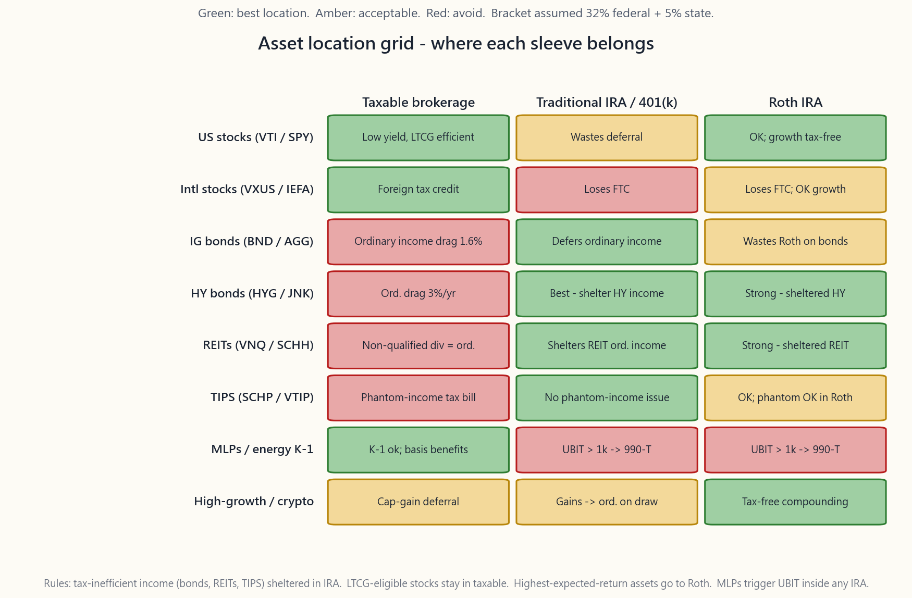
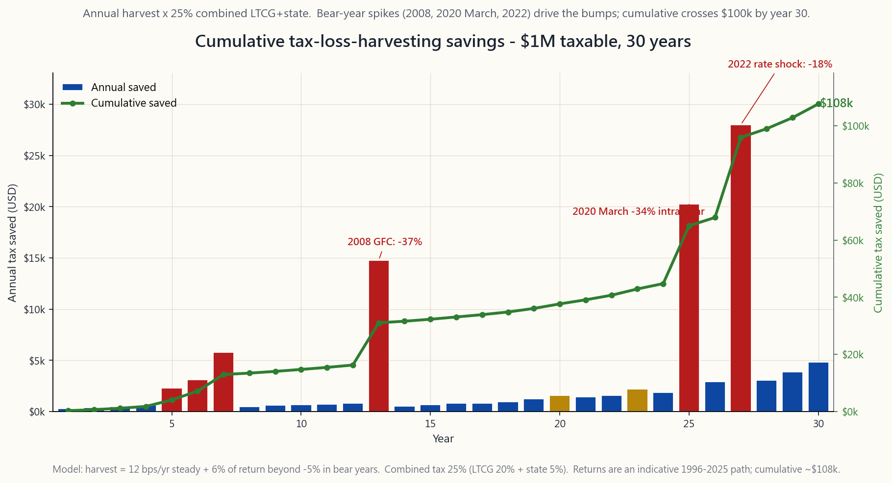

# 補充課程 04：稅務效率——資產配置、稅損收割與 IRA/401(k) 組合策略

---

## 第一部分：閱讀章節

---

### 1. 為何這很重要

對於年收入介於約 20 萬至 75 萬美元的美國家庭而言，**稅務幾乎始終是終身投資成本明細表中最大的一筆支出**。其金額遠超基金費用率、顧問費與交易成本的總和——差距甚至達到一個數量級。在 32% 聯邦稅率加上典型的 5% 州稅率下，一個均衡配置的應稅投資組合每年將悄悄損失 1.0% 至 1.7% 的稅務拖累，因為券商對帳單所呈現的是稅前數字，投資人往往渾然不覺。以 7% 實質報酬複利計算三十年，**稅後**的最終財富將比試算表上的粗估數字低 25% 至 40%。

好消息是，稅法規則都是公開的，稅率白紙黑字寫得清清楚楚，大多數可獲取的效率純屬機械操作。前 80% 的效率根本不需要稅務律師，只需四個步驟，依序執行：

1. **了解稅率級距。** 長期資本利得與合格股利適用獨立且較低的稅率級距，而非與薪資所得共用。清楚自己落在哪個級距，將改變投資組合的哪個部分應存放在哪種帳戶。
2. **將正確的資產放在正確的帳戶。** 一筆 10 萬美元的 BND 部位，在任何帳戶中產生的稅前利息完全相同。放在券商帳戶中，每年 4 月報稅時，32% 以上的利息將繳給國稅局；放在傳統型 IRA 中，提領前不需繳一分錢稅。資產本身完全相同，**放置位置**卻改變了稅後的成長曲線。
3. **有系統地進行稅損收割。** 當某個部位處於虧損狀態時，出售並重新建立相似的曝險部位，可以實現一筆稅務損失，用來抵銷投資組合其他部分的任何已實現利得。大多數散戶投資人白白放棄這筆錢，因為他們對洗售規則望而生畏，但實際上沒那麼複雜。
4. **以正確的順序疊加帳戶。** Roth、傳統型、健康儲蓄帳戶（HSA）、401(k)、應稅券商帳戶——每種帳戶在存入時、投資期間及提領時的稅務處理各不相同。以錯誤的順序填充，到退休時可能損失六位數的財富。

本課程是上述四個步驟的操作手冊。更深層的原則——「最大的隱性費用是稅務；善用選擇權與保證金來管理它」——位於整個策略的最末端。待基本結構性紅利全數獲取後，邊際稅務效率便來自於**如何持有部位**（長期資本利得持有期間、第 1256 條合約的 60/40 稅率拆分、以選擇權作為遞延收入），而非買了哪支基金。

---

### 2. 必備知識

#### 2.1 2026 年稅率級距——必須熟記的數字

美國對投資收益課徵三套獨立的稅率。請將 2026 年的數字（《減稅與就業法案》延長後版本）牢記於心：

**長期資本利得與合格股利**——持有超過 12 個月。

| 級距 | 已婚合併申報（MFJ）應稅所得（2026） | 單身應稅所得 |
|---|---|---|
| 0% | 最高 $96,700 | 最高 $48,350 |
| 15% | $96,701 至 $600,050 | $48,351 至 $533,400 |
| 20% | 超過 $600,050 | 超過 $533,400 |

此外，**3.8% 淨投資收益稅（NIIT）** 將在 MFJ 調整後總收入（MAGI）超過 25 萬美元（單身 20 萬美元）時觸發。適用範圍涵蓋利息、股利、資本利得、版稅、租金及大多數被動收入。對於調整後總收入約 30 萬美元的典型雙薪專業人士而言，**實際**長期資本利得稅率因此為 15% + 3.8% = **18.8%**，而非 15%。超過 60 萬美元時，聯邦最高稅率為 20% + 3.8% = **23.8%**。

**短期資本利得**（持有 12 個月以內）及**非合格股利**（不動產投資信託、大多數商業發展公司（BDC）、許多外國股票）——按**普通所得**的邊際薪資稅率課稅：22% / 24% / 32% / 35% / 37%。NIIT 仍須另外加計。

**國庫券利息**——聯邦普通所得，**免州稅**。在加州，一張 4.2% 的 10 年期國庫券的應稅等值殖利率約為 4.4%；在免州稅的州，標示的 4.2% 就是實際殖利率。

**市政債券利息**——免聯邦稅；本州市政債券亦免州稅。視發行條件而定，通常也免替代最低稅（AMT）。

最重要的結論在於**稅率差距**：在 32% 聯邦稅率加 5% 州稅的情況下，每一美元的普通所得損失 37%，而每一美元的合格股利所得僅損失 20%（15% 長期資本利得 + 5% 州稅）。差距為**同一美元毛收益上 17 個百分點的稅後殖利率**。這正是資產配置策略所能撬動的槓桿。

#### 2.2 資產配置——免費的午餐

原則只需一句話：**將稅務效率低的資產放在遞延稅款帳戶，將稅務效率高的資產放在應稅帳戶。** 這是機械操作，不需要多聰明。以下是八大標準資產類別的摘要：

1. **美國廣基股票指數（VTI / SPY）。** 殖利率約 1.4%，大部分為合格股利，資本利得僅在**你**出售時才實現。在應稅券商帳戶中，每年稅務拖累約 0.3% 至 0.4%。**最佳位置：應稅帳戶。**（Roth 尚可接受，但浪費了罕見的長期資本利得優勢。）
2. **廣基國際股票（VXUS / IEFA）。** 殖利率結構相同，另加上海外繳納股利中 7% 至 9% 的**外國稅額抵減**——但此抵減僅在部位置於**應稅**帳戶時方可申報。將 VXUS 放入 IRA 將喪失這項抵減。**最佳位置：應稅帳戶。**
3. **投資等級債券與全債券指數股票型基金（BND / AGG / VTEB）。** 殖利率 4% 至 5%，全部以利息形式徵收，按聯邦加州稅率課徵普通所得稅。在 32% 聯邦加 5% 州稅的應稅券商帳戶中，一檔殖利率 4.5% 的債券基金每年稅務拖累約 1.6%。**最佳位置：傳統型 IRA / 401(k)。**
4. **高收益公司債（HYG / JNK）。** 問題與投資等級相同，但殖利率達 7% 至 8%，拖累相應更大（約每年 3.0%）。**最佳位置：傳統型 IRA。**
5. **不動產投資信託（VNQ / SCHH）。** 分配屬**非合格普通股利**。第 199A 條 20% 的穿透式扣除將有效稅率降至邊際稅率的約 80%，但仍遠差於長期資本利得稅率。**最佳位置：傳統型 IRA**，其次為 Roth。
6. **抗通膨公債（SCHP / VTIP）。** 通膨累積調整屬每年**虛計**普通所得，即使尚未以現金形式收到（「幽靈收入」）。在應稅券商帳戶持有抗通膨公債，保證每年收到一張尚未拿到錢的稅單。**最佳位置：傳統型 IRA / 通膨連結儲蓄債券（I-Bond）（I-Bond 版本會自動遞延至贖回時）。**
7. **主有限合夥與能源合夥事業（EPD、MPLX、ET）。** 分配中包含部分資本返還（對應稅帳戶有利），但會產生合夥事業資訊申報表（K-1）。若置於 IRA 內，K-1 超過 1,000 美元的收入將觸發無關業務所得稅（UBIT）——按信託稅率最高課徵 37%，且 IRA 本身須單獨申報。**最佳位置：應稅帳戶。最差位置：任何 IRA。**
8. **高成長資產與加密貨幣（小型股、比特幣指數股票型基金、單一股票投機部位）。** 報酬主要來自資本利得，在應稅券商帳戶可無限期遞延。但由於**預期複合報酬最高**，每一美元的成長在免稅環境下最為珍貴。**最佳位置：Roth。** 一個在 Roth 中持有比特幣 IBIT 或投機性單一股票部位，複利 30 年至 65 歲後全額提領，是散戶投資人能採取的最強力單一稅務操作。

本課程開頭的圖表即為視覺摘要。綠色格子代表該資產的正確位置；紅色為錯誤；琥珀色為可接受。

#### 2.3 稅損收割與洗售規則

稅損收割（TLH）是機械操作：任何當前交易價格低於成本基礎的部位，均可出售以實現帳面損失，用來抵銷投資組合其他部分的任何已實現利得，**以及**每年最多 3,000 美元的普通所得。未用完的損失可無限期向後結轉。在正常波動率的年份，一個典型的 100 萬美元應稅投資組合每年可節省約 3,000 至 5,000 美元，複利計算後，**在 30 年期間約可節省 10 萬美元稅款**，如下方圖表所示。

**洗售規則（IRC §1091）** 是唯一真正的限制。若以虧損出售一項證券，你在出售日前後 **30 天內**，不得在你控制的任何帳戶（包括 IRA 及配偶帳戶）買入「實質上相同」的證券，否則損失將被不予認列，並加計至替代標的的成本基礎。

以下三條經驗法則在實務上通過檢驗：

1. **配對相似但非完全相同的指數股票型基金。** VTI ↔ ITOT（不同發行人、不同指數），VOO ↔ IVV，BND ↔ AGG。對於追蹤**不同指數**的兩檔指數股票型基金之間的互換，即使兩者指數重疊度超過 95%，美國國稅局從未提出質疑。
2. **持有替代標的至少 31 天。** 第 31 天後，若偏好原標的，可換回。大多數稅損收割平台（Wealthfront、Betterment、嘉信理財稅損收割服務）會自動完成這一來回操作。
3. **在窗口期內勿於 IRA 買入相同證券。** 這是最昂貴的意外洗售：大多數散戶投資人不知道此規則跨帳戶適用，甚至延伸至配偶的 IRA。

收割在**毛額**層面是「免費的」。在**淨額**層面，你降低了替代標的的成本基礎，等於原始成本減去已收割損失。因此節省的稅實際上是**遞延**的稅。複利效益確實存在（你讓更多資金持續投資更長時間），但你並非真正消除了稅務負擔——你是在延後它，理想情況下，延後到你能掌控稅率級距的那一年（提早退休、空窗年、慈善轉讓，或身後以墊高成本基礎的方式處理）。

#### 2.4 Roth 轉換與超額後門 Roth

兩項在職業生涯中複利效果極為顯著的進階操作。

**Roth 轉換。** 你將資金從傳統型 IRA 或 401(k) 移至 Roth IRA。轉換金額在移轉當年按普通所得課稅。此後，Roth 中的資金永久免稅成長，且無需進行最低提領要求（RMD，根據 SECURE 2.0，目前從 75 歲起強制執行）。**只要你的當前邊際稅率低於同一美元預期未來邊際稅率，此操作在數學上即是有利的。**

典型案例：一位 60 歲退休人士持有 150 萬美元傳統型 IRA，若等到 75 歲時 RMD 強制每年提領約 6 萬美元，疊加社會安全福利金後，這些被迫提領將以 22% 以上的稅率課稅。相對地，若在 60 至 70 歲的**低收入空窗期**，每年轉換 5 萬美元，以 12% 至 22% 的稅率繳稅，提領時完全免稅。轉換金額的終身稅單可因此下降 5 至 10 個百分點。

**超額後門 Roth。** 部分 401(k) 計畫允許在一般 23,500 美元員工上限之外，再進行**稅後**（非 Roth）供款，直到每年合計最高 7 萬美元（2026 年）的年度添加上限。這些稅後資金可立即轉出——透過計畫內轉換或滾入 Roth IRA——進入 Roth 狀態，每年最多將額外 **4.65 萬美元**放入 Roth 體系。但有一個前提：約僅 50% 的計畫支援計畫內轉換，此規則是人力資源部門的問題，而非稅務律師的問題。若你的計畫支援此操作，這是整個美國稅制中單一槓桿最高的稅務操作。

#### 2.5 健康儲蓄帳戶——三重免稅帳戶

健康儲蓄帳戶（HSA）是美國境內唯一一個**存入時免稅、成長時免稅、提領時免稅**的帳戶（前提是提領用於合格醫療費用）。2026 年供款上限：單身 4,400 美元 / 家庭 8,750 美元。HSA 僅適用於參加符合資格之高自付額健康計畫（HDHP）者。

高槓桿操作是：**為 HSA 供款，投入全市場股票指數基金，並以自有資金支付當前醫療費用**——同時保留收據。在 30 年複利成長後，HSA 可累積至 30 萬美元以上，你可隨時以**舊**醫療收據進行報銷，完全免稅。這將一個看似醫療帳戶的工具，轉變成隱形的 Roth IRA，且無收入限制、無與薪資掛鉤的供款上限，也無強制提領年齡（HSA 在 65 歲後的非醫療提領將按普通所得課稅——與傳統型 IRA 相同——因此最差情況下也與「傳統型 IRA」無異」）。

HSA 是供款順序中**第一個應填滿的帳戶**，適用於任何有資格使用的投資人，甚至優先於 401(k) 雇主配比。

#### 2.6 帳戶填充順序

2026 年新增一美元儲蓄的完整優先順序：

1. **401(k) 至雇主配比上限。** 第一天即獲得 100% 報酬，不容商量。
2. **HSA 至上限（若符合資格）。** 三重免稅。
3. **401(k) 至 23,500 美元員工上限。** 依稅率選擇傳統型或 Roth——若當前稅率低於預期退休稅率，選 Roth；反之，選傳統型。
4. **後門 Roth IRA，7,000 美元。** 適用於超過 Roth 直接供款收入上限的高收入者（2026 年，單身 MAGI 超過 16.5 萬美元、MFJ 超過 24.6 萬美元）。
5. **超額後門 Roth，最高 4.65 萬美元（若計畫支援）。**
6. **應稅券商帳戶。** 稅務優惠帳戶上限用盡後，剩餘資金進入應稅帳戶——這正是資產配置紀律與稅損收割發揮作用之處。
7. **529 計畫**，與步驟 1 至 6 同步進行，適用於有就讀大學需求的被扶養人——上限因州而異，每位受益人 1 萬至 1.5 萬美元是典型的最佳甜蜜點。

#### 2.7 提領順序——分配端稅務規劃

累積端的順序，在分配端有其對應的鏡像。典型的退休提領順序：

1. **最低提領要求（RMD）優先**（傳統型 IRA 從 75 歲起，繼承 IRA 另有規定）。
2. **應稅帳戶次之。** 從應稅帳戶出售的資產，可受益於你積累的成本基礎（以及任何已收割的損失）。資本利得實現可刻意為之——可挑選高成本基礎的持倉批次，只要應稅所得低於門檻，便可維持在 0% 長期資本利得稅率區間。
3. **傳統型 IRA / 401(k) 第三。** 提領屬普通所得；透過將年度提領控制在下一稅率級距門檻以下，主動管理稅率級距。
4. **Roth 最後。** Roth 免稅成長，無 RMD，提領時無稅。將其留至最後，可最大化免稅複利，並留作晚年支出、慈善轉讓或遺產傳承（根據 SECURE 2.0，繼承人享有 10 年免稅期）。

一個微妙且有力的變體：在退休至 75 歲（或更早開始領取社會安全福利）的空窗期，維持低普通所得，利用這些年份**將傳統型轉換為 Roth**（見 §2.4），同時從應稅帳戶提領生活費。這是提早退休者可採取的終身最有效單一稅務管理操作。

#### 2.8 透過選擇權與保證金節稅

一旦 §2.2 至 §2.7 的步驟成為例行操作，邊際稅務效率便來自於**如何持有部位**。以下四項曝險層面的操作：

- **使用第 1256 條合約（SPX / NDX 指數選擇權、/ES 期貨、/MES、/MNQ）。** 無論持有期間長短，一律按 60% 長期資本利得 / 40% 短期資本利得課稅——最高混合稅率約 26.8%，相較於短期股票選擇權的 37% 更為優惠。對於活躍的選擇權賣方而言，這是一個全面降低 10 個百分點的折扣。
- **以覆蓋代替出售。** 若某股票有 20 萬美元的內嵌利得，不要出售來降低曝險——覆蓋一個空頭買權（掩護性買權）或保護性領口策略（多頭賣權 + 空頭買權）。你可收取或少付權利金，部位的 Delta 下降，而內嵌利得維持未實現狀態。
- **以合成多頭取代持股。** 相同履約價的多頭買權加空頭賣權，可複製 100 股的曝險，但使用的資金僅約十分之一。出售標的股票同時持有合成部位，若處於虧損狀態，**可實現稅務損失**（需注意合成部位的洗售考量——請稅務專業人士確認架構），並釋放資金用於其他用途。
- **盒式價差與投資組合保證金貸款。** 以投資組合為擔保，以低於國庫券的利率借款，使用現金，永遠不出售。部位持續免稅複利成長，直到你最終出售或於身後以墊高成本基礎的方式處置。

這些是在 30 年期間將稅後報酬從「優秀」提升至「卓越」的關鍵操作。它們並非獲取 80% 可用效率所必需——§2.2 至 §2.7 的組合已能處理——但這正是縮小最後 20% 差距的方法。

---

### 3. 常見迷思

**1. 「所有股利的課稅方式都一樣。」** 錯。持有超過 60 天的美國 C 類公司合格股利，按長期資本利得稅率課稅。不動產投資信託分配、商業發展公司分配、主有限合夥保證支付，以及大多數外國股利，均為**非合格**股利，按普通所得課稅。

**2. 「我可以將全部投資損失扣抵所得。」** 每年僅能扣抵 3,000 美元的普通所得（已婚分開申報為 1,500 美元）。更大的損失首先抵銷已實現利得，剩餘部分可無限期向後結轉，抵銷未來的利得。

**3. 「債券放 Roth 很聰明，因為它們『安全』。」** 完全相反。債券產生普通所得，適用最差的稅務處理方式。將債券放入 Roth，等於將 Roth 的免稅成長浪費在整個投資組合中**預期報酬最低**的資產上。債券應置於傳統型 IRA，讓利息遞延至低稅率級距的退休年份。

**4. 「抗通膨公債（TIPS）和通膨連結儲蓄債券（I-Bond）是一樣的。」** 它們不同。在應稅券商帳戶持有 TIPS，每年須就通膨累積調整繳納幽靈收入稅。I-Bond 則將稅款遞延至贖回時。TIPS 只能放在 IRA 中；I-Bond 在任何帳戶中持有皆可。

**5. 「我需要在出售後等 30 天才能買回相同證券。」** 洗售窗口是出售日**前** 30 天與**後** 30 天——以出售日為中心的完整 61 天窗口。而且涵蓋 IRA、配偶 IRA，以及任何聯名帳戶。

**6. 「Roth 總是優於傳統型。」** 錯。Roth 在你**當前**邊際稅率**低於**退休邊際稅率時勝出。大多數高收入者在收入高峰期適用 32% 至 37% 的稅率；傳統型供款在此稅率下進行扣除，而退休時的提領通常適用 22% 至 24%。在這種情況下，傳統型勝出。

**7. 「主有限合夥放在 IRA 裡沒問題，因為 IRA 不繳稅。」** 它們會觸發無關業務所得稅（UBIT）——按信託稅率課稅，為稅法中**最高**的稅率。若你的主有限合夥 K-1 申報超過 1,000 美元的無關業務應稅所得（UBTI），你的 IRA 本身須申報 990-T 表格並繳稅。將主有限合夥遠離所有稅務優惠帳戶。

**8. 「稅損收割可以永久消除稅款。」** 它是遞延稅款。替代標的的成本基礎較低，等於原始成本減去已收割損失。當你最終出售替代標的時，利得因你所收割的金額而增加。其效益在於遞延稅款的貨幣時間價值，加上選擇在低稅率級距年份實現的選擇權（或永遠不實現，透過身後墊高成本基礎處置）。

**9. 「若未來稅率更低，Roth 轉換毫無意義。」** 是的——這正是你**不應**進行轉換的情況。每年執行一次稅率比較。當前稅率低於未來稅率時，進行轉換；未來稅率低於或等於當前稅率時，按兵不動。

**10. 「健康儲蓄帳戶是醫療帳戶，與我的投資無關。」** 健康儲蓄帳戶是美國系統中最強大的稅務優惠**投資**帳戶。「健康」這個標籤只是歷史遺跡。若你的健康儲蓄帳戶放在只賺 0.05% 利息的「儲蓄帳戶」中，你正在白白浪費三重免稅的效益。

---

### 4. 問答

**Q1：我今年 35 歲，適用 24% 稅率，有 40 萬美元應稅帳戶、15 萬美元傳統型 IRA，以及 5 萬美元 Roth IRA。新的供款應放哪裡？**

A：依填充順序：401(k) 至雇主配比 → HSA → 401(k) 傳統型至上限（24% 扣除相當不錯）→ 後門 Roth IRA → 超額後門 Roth（若計畫支援）→ 應稅帳戶。針對現有餘額，將應稅帳戶中的債券與任何不動產投資信託部位移至傳統型 IRA；將廣基市場指數基金與國際股票留在應稅帳戶。Roth 則用於任何投機性高成長曝險（小型股、加密貨幣指數股票型基金、成長型個股）。

**Q2：我實際上能期待多少稅損收割的超額報酬？**

A：根據實證，在 32% 聯邦加 5% 州稅的均衡股票投資組合中，每年稅後超額報酬約 30 至 60 個基點。隨著投資組合成本基礎上升（長期多頭市場後可收割的標的減少），效益下降；在 2008 年、2022 年、2020 年 3 月等高波動年份則大幅飆升（在單一稅務年度內，一個 100 萬美元帳簿可節省 1.5 萬美元以上）。以 100 萬美元起始餘額計算，30 年累積約節省 10 萬美元，視市場路徑而定。

**Q3：我的收入超過 Roth IRA 的供款限制。我還能供款嗎？**

A：可以，透過**後門 Roth IRA**：先以非扣除方式向傳統型 IRA 供款 7,000 美元，然後立即轉換為 Roth。若你沒有其他稅前傳統型 IRA 餘額，轉換免稅（**按比例計算規則**是唯一的陷阱——若你的傳統型 IRA 餘額僅為剛供款的那筆，則不適用）。對於超過 23,500 美元員工上限的 401(k)，超額後門 Roth 是類似的操作。

**Q4：Roth 轉換的數學邏輯在什麼情況下成立？**

A：每年執行一次比較。若轉換金額的**當前**邊際稅率低於同一美元的**預期退休**邊際稅率（計入社會安全福利金、退休金及 RMD 後），則進行轉換。若更高，則不轉換。最可靠的轉換年份是提早退休的空窗期（60 至 70 歲），此時普通所得較低，可以較低成本填滿 12%/22% 的稅率級距。

**Q5：市政債券在應稅帳戶中是否永遠優於國庫券？**

A：比較**應稅等值殖利率**：市政債券殖利率 ÷（1 - 聯邦稅率 - 州稅率（若為本州發行））。在 32% 聯邦加 5% 州稅的情況下，一檔 3.5% 的本州市政債券應稅等值殖利率為 3.5% ÷（1 - 0.37）= **5.55%**。一張 4.2% 的國庫券應稅等值殖利率為 4.2% ÷（1 - 0.32）= **6.18%**（已計入州稅豁免）。本案例中，國庫券勝出。交叉點通常在聯邦 35% 至 37% 稅率級距。

**Q6：我能在 IRA 中進行稅損收割嗎？**

A：不行——IRA 內部無須繳稅，因此沒有損失可以收割。更糟的是，IRA 購入實質上相同的證券，可能會**觸發**你在應稅帳戶虧損出售的洗售認定，永久不予認列扣除（成本基礎調整無法應用於 IRA 部位）。

**Q7：州所得稅是否影響資產配置決策？**

A：影響顯著。國庫券免州稅，因此在高稅州（加州 13.3%、紐約州 10.9%、夏威夷 11%），在**應稅帳戶**持有國庫券的理由更加充分，因為你節省了 IRA 原本未能單獨省下的州稅。在免州稅的州，市政債券在聯邦 35% 以上稅率時優於國庫券；在高州稅州，則在 32% 以上時即可勝出。

**Q8：抗通膨公債的「幽靈收入」是什麼？為何重要？**

A：抗通膨公債的本金每月隨消費者物價指數（CPI）調整。美國國稅局將此調整視為當年應課稅的普通所得，即使你僅在到期時才以現金形式收到。在應稅券商帳戶中，你每年須就虛計收入繳稅；在 IRA 中，調整與稅務完全無關，因為 IRA 內部的任何收益在提領前均不課稅。抗通膨公債應放在 IRA 中。

**Q9：我在 AAPL 有 20 萬美元的內嵌利得，出售的稅務成本超過 4 萬美元。如何在不出售的情況下降低曝險？**

A：三種選擇。**掩護性買權**——出售 30 Delta、到期期間 60 天的買權，收取 1% 至 2% 的權利金，利得維持未實現，放棄部分上行空間（第 27 週）。**領口策略**——買入 25 Delta 賣權加賣出 25 Delta 買權，以賣權的權利金中和成本，將部位鎖定在一個區間內而不實現利得（第 30 週）。**合成空頭覆蓋**——做空等量的指數期貨對沖市場 Beta；AAPL 的個股曝險仍保留。三種方法均在不產生稅務的情況下降低曝險。以選擇權節稅。

**Q10：我應該優先選擇 Roth 還是健康儲蓄帳戶供款？**

A：健康儲蓄帳戶優先——它是三重免稅（存入扣除、免稅成長、醫療提領免稅），優於 Roth 或傳統型帳戶。其次是 401(k) 至雇主配比上限。再來是 Roth 或 Roth 401(k)，視稅率計算而定。健康儲蓄帳戶唯一的限制是：65 歲前的非醫療提領需繳 20% 罰款加普通所得稅——65 歲後罰款豁免，最差情況下與傳統型 IRA 相同。

**Q11：3.8% 淨投資收益稅（NIIT）在實務上如何運作？**

A：適用於（a）淨投資收益，或（b）超過門檻的 MAGI（MFJ 25 萬美元 / 單身 20 萬美元）——兩者取**較小值**。以 MAGI 30 萬美元、投資收益 4 萬美元為例，應繳 3.8% × min（4 萬美元，5 萬美元）= 1,520 美元。解方與任何其他稅務相同：降低投資收益（資產配置）、降低 MAGI（傳統型 401(k) 供款），或兩者並行。實際效果是將受影響家庭的**實際**長期資本利得稅率推升至 18.8% / 23.8%。

**Q12：本課程中的稅務最佳化工具實際上能做什麼？**

A：它接受你的聯邦稅率級距、州稅率、應稅 / 傳統型 / Roth 餘額及當前年齡作為輸入。它即時計算：（1）八大標準資產類別的最佳資產配置位置；（2）在各帳戶類型合理成長假設下，65 歲時的預估稅後財富；（3）根據應稅餘額與假設股票波動性，建議的年度稅損收割目標金額；（4）建議的年度 Roth 轉換金額，規模設定為填滿當前邊際稅率級距而不跨越下一個分界點。這不是稅務建議——這是對本課程所描述操作的粗略試算工具。

---

## 第二部分：YouTube 腳本

---

**影片標題：** 長期投資者的稅務效率——資產配置、稅損收割、Roth 與健康儲蓄帳戶 | 補充課程 4

**目標片長：** 約 14 分鐘

**主持人：**
- **陳馬**（講師）：手持 1040 稅表與券商對帳單。
- **小魚**（學生）：收入首次讓她開始認真思考稅率級距。

---

**[片頭]**

[VISUAL: 動態標誌「補充課程 4——稅務效率」]

**陳馬：** 小魚，我想讓你跟我一起看一個數字。一個 100 萬美元的投資組合，股債比大約 60/40，每年可能損失 1 萬至 1.7 萬美元在你毫不知情的稅務上——因為你的券商對帳單呈現的是稅前數字。以 7% 實質報酬複利計算三十年，你的稅後財富比你從試算表上讀到的數字少了 25% 至 40%。

**小魚：** 等一下——是**每年**嗎？

**陳馬：** 每年。好消息是，幾乎全部都是可以修正的。今天我們會帶你走過四個步驟：了解稅率級距、將資產放在正確的帳戶、有系統地進行稅損收割，以及按正確順序疊加帳戶。結束後，你應該有一份週一就能開始執行的計畫。

---

**[第一段：三套稅率]**

[VISUAL: 標題卡「三套稅率，一位投資人」]

**陳馬：** 美國稅法對投資收益課徵三套獨立的稅率。

**小魚：** 三套？

**陳馬：** 三套。**長期資本利得與合格股利**適用第一套——0%、15%、20%，高收入者另加 3.8% 的淨投資收益稅。**短期資本利得與普通股利**適用第二套——也就是你的薪資級距：22%、24%、32%、35%、37%。**國庫券利息與市政債券利息**適用第三套，有其特殊規則——國庫券免州稅，市政債券免聯邦稅，有時甚至完全免稅。

**小魚：** 所以同樣一美元，根據來源不同，繳的稅可以差很多。

**陳馬：** 完全正確。在 32% 聯邦加 5% 州稅的情況下，一美元合格股利能保留 80 分；一美元債券票息只能保留 63 分。差距是 17 分。在一個殖利率 4% 的 100 萬美元投資組合上，**這**大約是每年 7,000 美元可以避免的稅——每年如此。

---

**[第二段：資產配置]**

[VISUAL: image/side04_asset_location_grid.png]

**陳馬：** 這就是速查表。縱軸列出八大資產類別，橫軸三欄分別是應稅帳戶、傳統型 IRA、Roth IRA。綠色代表正確位置，琥珀色代表可接受，紅色代表錯誤。

**小魚：** 美國股票在應稅帳戶欄是綠色。債券在傳統型欄是綠色。不動產投資信託在傳統型欄是綠色。主有限合夥在兩個 IRA 欄都是紅色。加密貨幣在 Roth 欄是綠色。

**陳馬：** 看懂顏色，你就掌握了 80% 的資產配置。股票與國際股票指數股票型基金放在應稅帳戶，讓合格股利稅率和外國稅額抵減為你工作。債券、高收益、不動產投資信託、抗通膨公債——任何產生普通所得的資產——放入傳統型 IRA，讓收入遞延至低稅率級距的退休年份。

**小魚：** Roth 呢？

**陳馬：** Roth 是你預期報酬最高的資產的家。無論你認為什麼在三十年內複利成長最快——小型股因子部位、比特幣指數股票型基金、單一股票投機部位——那就是最能從免稅包裝中獲益的資產。Roth 中 5 萬美元以每年 12% 複利成長 30 年，變成 150 萬美元，全部免稅。放在 Roth 外，以 32% 加 5% 的利得稅率計算，約剩 94 萬美元。Roth 讓你多了 56 萬美元。

**小魚：** 只是因為選對了帳戶。

**陳馬：** 只是因為選對了帳戶。稅務是你投資生涯中最大的隱性費用。資產配置是開始少繳稅最低廉的方式。

---

**[第三段：稅損收割]**

[VISUAL: image/side04_tlh_savings.png]

**陳馬：** 這是一個正常市場波動率下，100 萬美元應稅投資組合進行稅損收割 30 年的樣子。每根柱子代表一年的已收割損失換算成節省的稅款。大多數年份是 2,000 至 4,000 美元。大型峰值——現實中的 2008 年、2022 年、2020 年 3 月——在單一年度可產生 1 萬至 1.5 萬美元的節稅，因為同時有大量部位跌破水位。

**小魚：** 那條線呢？

**陳馬：** 累積線。到第 25 至 30 年，在 100 萬美元起始投資組合上突破 10 萬美元節稅。這是實實在在的錢，而且你不需要很聰明才能獲取——智能投顧或內建稅損收割功能的券商會自動執行交易。

**小魚：** 有什麼限制嗎？

**陳馬：** 洗售規則。若你以虧損出售，在出售日前後 30 天內——而且這 30 天窗口涵蓋你的 IRA 和配偶的 IRA——不能買入「實質上相同」的證券。解法是換成**相似但非完全相同**的指數股票型基金——VTI 換 ITOT、VOO 換 IVV、BND 換 AGG——並持有至少 31 天。之後若想換回，再換就好。大多數平台會自動完成這一來回操作。

**小魚：** 節省的稅是永久性的？

**陳馬：** 是遞延的。替代標的的成本基礎較低，等於原始成本減去已收割損失。當你最終出售時，利得因你所收割的金額而增加。所以**稅**是遞延的，而非消除——但遞延的資金持續投資並複利，而且你可以選擇最終實現的年份。在 0% 長期資本利得稅率的空窗年實現，或在身後以墊高成本基礎方式處置，遞延的稅務負擔就歸零了。

---

**[第四段：Roth 轉換與超額後門 Roth]**

[VISUAL: 標題卡「Roth 轉換」]

**陳馬：** 再兩個操作。首先——Roth 轉換。你將資金從傳統型 IRA 移至 Roth IRA，在移轉當年繳納普通所得稅，之後 Roth 永久免稅成長，且永遠無需最低提領要求。

**小魚：** 我為什麼要主動現在就繳稅？

**陳馬：** 因為稅率套利。若你的**當前**稅率低於同一美元的**未來**稅率，你就贏了。典型案例：一位持有 150 萬美元傳統型 IRA 的 60 歲退休人士，若等到 75 歲時 RMD 強制每年提領約 6 萬美元，疊加社會安全福利金後，這些被迫提領將以 24% 或 32% 課稅。相對地，若在 60 至 70 歲的**低收入**空窗期，每年轉換 4 萬至 8 萬美元，以 12% 或 22% 繳稅，提領時完全免稅。每轉換一美元，終身稅單可節省 5 至 10 個百分點。

**小魚：** 超額後門 Roth 呢？

**陳馬：** 部分 401(k) 計畫——約一半——允許在一般 23,500 美元員工上限之外，再存入額外的**稅後**資金，直到每年合計 7 萬美元的上限。這些稅後資金可立即滾入 Roth——計畫內或轉至 Roth IRA——每年最多將額外 **4.65 萬美元**注入 Roth 體系，超越一般上限。前提是：你的計畫是否支援，這是人力資源部門的問題，不是稅務律師的問題。若你的計畫支援，這是整個美國稅制中槓桿最高的單一稅務操作。

---

**[第五段：健康儲蓄帳戶]**

[VISUAL: 標題卡「健康儲蓄帳戶——三重免稅帳戶」]

**陳馬：** 再一個帳戶。健康儲蓄帳戶（HSA）是美國系統中唯一存入時免稅、成長時免稅、提領時免稅的帳戶——三重全中。

**小魚：** 這不可能合法吧？

**陳馬：** 合法的——前提是提領用於合格醫療費用。而且有個訣竅：你不必在費用發生當年就**報銷**自己。若你為健康儲蓄帳戶供款，投入全市場股票指數基金，並以自有資金支付醫療費用，你可以保留收據，在**數十年後**再向自己報銷——完全免稅。

**小魚：** 所以健康儲蓄帳戶變成了隱形的 Roth。

**陳馬：** 它變成隱形的 Roth，無收入限制，無與薪資掛鉤的供款上限。健康儲蓄帳戶是供款順序中**第一個**應填滿的帳戶——甚至優先於 401(k) 雇主配比。大多數人不知道這件事，因為表格上寫的是「健康」兩個字。

---

**[第六段：填充順序]**

[VISUAL: 七種帳戶類型的優先順序編號清單]

**陳馬：** 把它整合在一起。新增一美元儲蓄的順序：

1. 401(k) 至雇主配比。第一天即獲得 100% 報酬。
2. 健康儲蓄帳戶至上限（若符合資格）。三重免稅。
3. 401(k) 至 23,500 美元上限。若當前稅率高於退休稅率，選傳統型；若低於，選 Roth。
4. 後門 Roth IRA——7,000 美元。
5. 超額後門 Roth——最高 4.65 萬美元（若計畫支援）。
6. 應稅券商帳戶。資產配置與稅損收割在這裡發揮作用。
7. 529 計畫，與步驟 1 至 6 同步進行（若有就讀大學需求的孩子）。

**小魚：** 這是很多帳戶啊。

**陳馬：** 確實。但你不必一次全部開設。每多開一個帳戶，就少損失一分本可避免的永久性稅款。先從簡單的開始——健康儲蓄帳戶、401(k)、Roth IRA——隨著收入成長再逐步補上其他帳戶。

---

**[第七段：互動工具]**

[VISUAL: image/side04_tax_optimizer.png——互動面板截圖]

**陳馬：** 網站上的稅務最佳化工具讓你輸入聯邦稅率、州稅率、應稅餘額、IRA 餘額、Roth 餘額和當前年齡。它即時計算——八大資產類別的最佳資產配置位置、在合理成長假設下 65 歲時的預估稅後財富、建議的年度稅損收割目標金額，以及建議的年度 Roth 轉換金額。

**小魚：** 它告訴我該怎麼做。

**陳馬：** 它告訴你數學計算的結果。決策是你的。但它設定了底線——一旦你看到最佳化工具建議的配置網格，你就知道只要照著做，就能獲取 80% 最低成本的效率。超過這個的 20% 是選擇權、保證金、以及針對集中單一股票部位進行收割的進階領域。我們在第 26 至 31 週介紹了這套語彙，課程接下來也會持續深入。

---

**[片尾]**

[VISUAL: 結尾卡「下一集：補充課程 5——定期定額投資 vs. 單筆投入」]

**陳馬：** 稅務效率是散戶投資中最廉價的免費午餐，也是最被忽視的——一部分是因為規則很枯燥，一部分是因為每家券商的對帳單都報稅前數字，還有一部分是因為你這輩子最大的稅，是唯一一筆你永遠看不到明細的稅。四個步驟——稅率、配置、收割、疊加——獲取了 80% 的可用效率。選擇權與保證金獲取剩餘的 20%。兩個部分都重要，兩個部分一旦看清規則，都是機械操作。

**小魚：** 而且沒有人會替我做這些事。

**陳馬：** 不付費的話，不會有人替你做。網頁上的最佳化工具是免費的。週一早上就去用它。

[VISUAL: 最終卡「補充課程 4——稅務效率。最大的隱性費用。」]

[END]