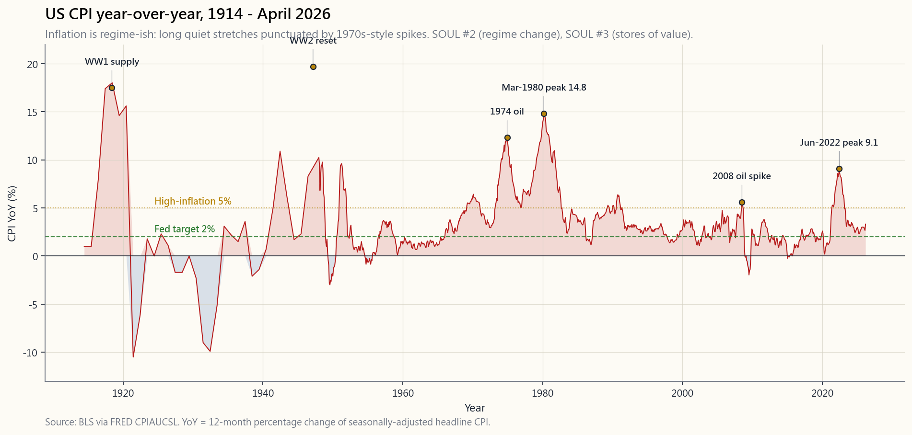
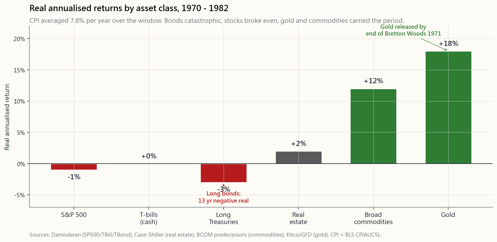

# 番外篇第06課：通膨——殺死現金的元凶，以及（有時）能保護你的資產

---

## 第一部分：閱讀章節

---

### 1. 為何值得重視

本教程中的其他所有風險——回撤、違約、波動性、相關性崩潰——都*會自我宣告*。通膨不會。通膨是唯一一種持續向你收費的風險，計費單位（購買力）不會出現在任何帳戶報表上，也沒有任何券商會為此寄來1099表格。你可能在長達十五年的通膨環境下損失一半的實質財富，卻在券商螢幕上從未見到任何一個負號。

以下三個原因，說明本課值得單獨開設番外篇，而非只是一段附在債券章節後面的補充：

1. **1970年代並非舊教科書裡的遺跡——它是每一份退休計畫的活生生最壞情境。** 美國標題消費者物價指數（CPI）於1980年3月攀至14.8%的高峰；標普500指數經通膨調整後的實質報酬，從1968年高點到1982年低點約為負50%。名目指數在這十四年間幾乎*持平*。用美元衡量財富的人看起來沒事；用食品雜貨衡量財富的人則正在被摧毀。
2. **2021至2022年的通膨插曲提醒整個體系，1970年代並非只是歷史。** 美國標題CPI於2022年6月達到9.1%——四十年來的高峰。長期國庫券從高點到低點約下跌三成。黃金——教科書承諾能保護你的東西——在第一年的通膨飆升期間*毫無作用*。2008年後那一代人熟記的大部分通膨應對劇本，都是錯的。
3. **在通膨環境下，各資產類別的排名與大家過度套用的排名截然不同。** 債券，即60/40配置中的「安全」那條腿，表現災難性。股票的實質報酬偏弱，因為利潤率受壓縮。黃金*不可靠*——有時璀璨奪目（1971至1980年），有時毫無用處（2022年）。原物料與不動產表現尚可。抗通膨債券（TIPS）是唯一在機制上可靠的避險工具。現金則是保證賠錢的那一個。這些資產都被視為「價值儲存工具」——但所謂的價值儲存工具，不過是下一代人*相信*它能儲存價值的東西，這也是為何答案會不斷輪替。

本番外篇的目標，是為你提供半打關鍵數字，以及一個關於政策環境轉換的核心框架——通膨環境可能在四十年的時間尺度上翻轉——將通膨從一種模糊的恐懼，轉變為四軌投資組合中一個可量化、可避險的風險。

---

### 2. 你需要了解的內容

#### 2.1 CPI vs PCE vs 核心——三個數字並不相同

你在新聞上看到的標題數字是**CPI**（消費者物價指數，由勞工統計局發布）。聯準會實際鎖定的目標是**核心個人消費支出（PCE）**（扣除食品與能源的個人消費支出，由經濟分析局發布）。兩者長期存在分歧，每年穩定差距約30至50個基點，而這個差距是有意義的。

CPI使用一個*固定籃子*，每兩年更新一次；PCE則每季重新調整籃子權重，以反映家庭實際購買的商品。當牛肉漲價，CPI沿用舊籃子並回報較高數字；PCE注意到消費者改買雞肉，因而回報較低數字。PCE的醫療保健權重也高出許多（因為涵蓋雇主支付的保險），而住房權重則較低。

此外還有「核心」指標——即同一指數扣除食品與能源這兩個最波動的分項之後的數字。聯準會盯住核心指標，因為它反映趨勢訊號；媒體報導標題數字，因為它反映選民在加油站的真實感受。兩個數字都是真實的；兩個都重要；它們只是在回答不同的問題。

第三個值得了解的指標是**截尾平均PCE**（由達拉斯聯準銀行編製），每月剔除波動最大的極端分項。它的變動速度最慢，是衡量潛在漂移最乾淨的讀數。2026年4月，標題CPI約3.2%、核心PCE約2.8%、截尾平均約2.6%，聯準會感到自在；2022年中，三者均高於5%時，它則坐立難安。

投資意涵：**切勿將以CPI計算的實質報酬數字與以PCE計算的數字直接比較，而不先做調整**。Damodaran的歷史股權溢酬是以CPI平減的序列。聯準會的首選通膨圖表則以PCE平減。在數十年的複利累計下，兩者每年差距0.4%——這是一個真實的差距。

#### 2.2 1970年代——典型的通膨創傷

每一位長期投資人都應當在心裡對標的單一政策環境，是**1970年代的美國**。它之所以在本教程中一再出現，是因為它打破了當時所有盛行的資產配置正統觀念，而這種破壞方式，是2008年金融危機和2020年新冠肺炎崩盤所沒有的。

以整數呈現的數字：從1970年到1982年，標題CPI年均7.8%。1980年3月峰值14.8%（那是沃克爾賭上整個主席任期所鎖定的單一數據點）。標普500在此期間*名目*年報酬約6%；扣除通膨後，實質報酬約為負2%，從1968年高點到1982年低點的實質最大回撤約為負50%。長期國庫券的實質年報酬約為負3%——連續十五年負實質固定收益報酬。定義現代退休計畫預設值的「均衡型」60/40投資組合，在整整十年間的實質報酬約為*零*。

兩項資產脫穎而出。黃金，從1971年美元脫離金本位後，從每盎司35美元漲至850美元——十二年間實質年報酬約十八個百分點。原物料整體的實質年報酬約12至13%。兩者都是從被壓制的政策環境中解脫出來（黃金被布列頓森林體系壓制，原物料被戰後價格管制壓制），這正是典型的四十年政策環境轉換設定：當一個舊環境崩潰時，被重新定價的資產，往往是那個在舊環境下被迫維持低價的資產。

最後這一點正是陷阱所在。1970年代的黃金故事並非「黃金抵禦通膨」。1970年代的黃金故事是「黃金在通膨開始的那一年*獲釋出籠*」。2022年，通膨捲土重來，而黃金市場並未發生類似的政策環境斷裂，黃金*在第一年毫無作為*。更清晰的框架：價值儲存工具，就是下一代人相信能儲存價值的東西。1972年那是黃金。2022年，短暫地，那是比特幣（然後又不是了）。其機制是*信念的重新定價*，而非金屬本身。

#### 2.3 2021至2022年的飆升——現代劇本哪裡錯了

美國標題CPI於2022年6月觸及9.1%，是1981年11月以來的最高讀數。有三件事讓它有別於大多數主動型投資人一直奉行的教科書通膨章節：

第一，**債券以教科書預測的方式被摧毀**——長期國庫券（TLT）從高點到低點下跌約31%，是有史以來該資產類別最糟糕的日曆年。劇本的這一部分應驗了。60/40投資組合的實質報酬年損約17%，是現代史上最差的實質報酬年。

第二，**股票與債券同步下跌，打破了「股票與債券是避險工具」的假設——這一假設定義了2009至2021年的政策環境**。股債相關性從負值（2000年後的預設值）翻轉為正值（2000年前的預設值，也是通膨環境的預設值）。60/40的分散投資效益，恰恰在你最需要它的時候消失了。波動率的尾巴搖動整條狗。

第三，**黃金失靈了**——至少在2022年是如此。隨著10年期實質殖利率從負1%攀升至正2%，持有一種無收益金屬的機會成本暴漲，黃金在2022年名目報酬幾乎持平——以實質計算則明顯*下跌*。「通膨=買黃金」的1970年代劇本，在四十年後的首次實戰測試中落敗。黃金最終在2024至2025年間確實重新定價，但那些在2021年專門以通膨保險為由買入的投資人，卻先承受了三年的持有成本。

2022年奏效的是：短期TIPS、廣泛原物料（彭博原物料指數當年報酬約正14%）、石油生產商，以及租金能快速調整的部分不動產。沒有奏效的是：長期債券、長存續期間科技股、2021年以3%利率買進的固定利率房貸（這些是絕佳的*負債*，卻是糟糕的*資產*），以及黃金這個通膨避險工具。

#### 2.4 通膨環境下的資產表現——誠實的排名

綜合1970至1982年的紀錄（長期通膨環境）、2021至2023年的飆升（短期通膨環境），以及學術實質報酬文獻，下列為誠實的排名，以高通膨環境*期間*的約略實質年化報酬呈現：

- **TIPS／抗通膨債券：** 實質報酬約0%，*由合約保證*。無聊，但在機制上可靠。
- **原物料（廣泛指數）：** 歷史上在通膨期間實質報酬約+6至12%，因為原料本身*就是*通膨。在一般環境下波動劇烈，這也是為何鮮少投資人持有。
- **不動產（直接持有，非不動產投資信託）：** 實質報酬+0至4%，地域分散度大。陽光帶優於鐵鏽帶。租金隨租約重設，因此時間差至關重要。
- **黃金：** 好壞參半。1970至1980年實質年報酬+18%；2021至2023年實質報酬約0%；2024至2025年小幅補漲。視為*信念*資產，而非機械式避險工具。
- **股票：** 在飆升期間實質報酬偏弱（利潤率壓縮），通膨過後則表現強勁（經營槓桿發揮作用）。整個通膨環境周期下來，實質報酬約在負1%至正2%之間，路徑依賴性極強。
- **短期國庫券（現金）：** 若聯準會積極升息，實質報酬約0%；若聯準會未積極升息，則實質報酬*嚴重*為負。2021至2022年的現金部位，十二個月內實質損失約6%。
- **長期國庫券：** 最差的主要資產類別。1970至1982年實質年報酬約負3%，2022年最大回撤負30%。

一句話道破核心：**通膨是唯一一種政策環境，在此環境下，每本教科書投資組合的「安全」那條腿是殺死你的腿，而「風險」那條腿（實質資產）才是拯救你的腿**。槓鈴策略與設有明確價值儲存軌道的四軌架構，正是為此而設計。

#### 2.5 薪資滯後於物價，地域分散了兩者

每位投資人在設計通膨避險策略之前，應當內化兩個微觀機制。

**薪資滯後物價十二至十八個月。** 2021至2022年的通膨飆升將CPI推至2022年6月的9.1%；名目時薪直到2023年底才趕上。對投資人而言，其意涵是：在通膨環境的早期，實質薪資*下滑*——正是在那個階段，消費性非必需品企業開始不達預期，而「必需消費品作為防禦性配置」的交易才真正奏效，因為家庭首先縮減的是邊際性消費。對一個*員工*（大多數投資人同時也是員工）而言，其意涵是：即使媒體談論著「韌性十足的消費者支出」，你的實際薪資仍在縮水。及早規劃：在飆升的那一年提高儲蓄*率*，趁名目薪資尚未跟上之前。

**地域差異比標題數字更重要。** 2022年6月美國標題CPI為9.1%；這個單一數字，是鳳凰城房市年漲30%與舊金山房市*下跌*的平均值。1970年代，能源生產地區（德州、亞伯達省）的實質薪資成長為正；製造業地帶（底特律、克里夫蘭）的實質薪資成長，則*明顯低於*全國數字。住房通膨、醫療通膨和薪資通膨的地域分散程度，現在是全國標題數字任何一年變動幅度的數倍。實際結論：影響*你的*投資組合計畫的通膨率，是你所在地的CPI，而非全國數字。

本課底部的互動面板（`side06_inflation_lab`），讓你設定個人通膨率，並觀察它如何影響你在股票、債券、黃金、原物料、不動產、TIPS與現金任意組合下的實質最終財富。在你決定2% CPI「無關緊要」之前，先把滑桿設到4%，讓它跑三十年。

---

### 3. 常見誤解

1. **「通膨對所有人來說都是同一個數字。」** 不是。標題CPI是以城市籃子計算的全國平均值。你個人的通膨率取決於你的住房狀況、醫療保健曝險與所在地域，可能比全國數字高出或低出兩至三個百分點，並持續多年。

2. **「股票是通膨避險工具。」** 只在長期而言，且效果有限。在通膨環境的*飆升*階段，股票的實質報酬為負（利潤率壓縮，折現率隨利率上升而導致本益比壓縮）。若你能撐過飆升期、回落期與通膨後復甦期，持有超過十五年，避險故事才成立。大多數投資人做不到。

3. **「黃金保護你免受通膨侵害。」** 黃金在1970年代保護了投資人，因為它在1971年前被布列頓森林體系的美元釘住政策強制壓制，正在重新定價。這次重新定價恰好與通膨同步發生。2022年，黃金在CPI達到9%的十二個月內毫無作為。請將黃金視為*信念*資產，而非機械式避險工具。

4. **「TIPS只給你通膨率。」** TIPS給你的是你買入時鎖定的實質殖利率，*加上*CPI調整。若你在負1%實質殖利率時買入TIPS（這正是2020至2021年大部分時間的情況），即便在通膨飆升期間，你也保證獲得負1%的實質報酬。*何時*買入，與買哪種資產同樣重要。

5. **「我的薪水會跟上。」** 在每一個有紀錄的通膨插曲中，薪資都滯後物價十二至十八個月。無論名目上調薪了多少，在任何飆升的第一年，你的*實質*實得薪資都會下滑。

6. **「現金是安全的。」** 在任何通膨高於短期國庫券利率的環境下，現金是保證賠錢的資產。2021年，這個差距約為6%；持有現金的人在十二個月內損失了6%的實質財富，卻感到完全安全。

7. **「只有惡性通膨才重要。」** 錯。5%的年通膨持續十年，你的購買力就減半了。你不需要威瑪共和國；你只需要一個緩慢穩定的政策環境轉換。

8. **「聯準會會解決它。」** 最終會，是的。聯準會於1981年將聯邦基金利率升至19%，並引發深度衰退，這才解決了1970年代的問題。那次修復花了十五年和兩次經濟衰退。「聯準會會解決它」是一個長期視野的陳述，而非一個投資組合層面的陳述。

9. **「不動產在通膨下必然勝出。」** 只有在租金重設速度快於融資成本、且當地供給受限的情況下，不動產才勝出。在供給不受限（美國大部分陽光帶地區）且利率急升的地方，即便CPI飆升，不動產的實質報酬也可能為負。

10. **「比特幣是數位黃金，能避險通膨。」** 2022年它沒有做到。比特幣在CPI達到9.1%的同一年，從高點到低點下跌約65%。無論它最終是否成為一種價值儲存資產，2022年的插曲是它至今唯一一次樣本外實測，而它失敗了。信念資產，而非機械式避險工具。

---

### 4. 問答

**Q：一般投資人為了做好通膨準備，最簡單的投資組合調整是什麼？**
A：將債券配置中的部分，從名目國庫券（TLT、IEF）移至短期TIPS（VTIP、STIP）。VTIP是一筆交易就能完成的操作，沒有存續期間風險，並鎖定當下提供的實質殖利率。2026年4月，這大約是正1.5%的實質報酬，作為通膨避險工具完全夠用。

**Q：為什麼選TIPS而不是黃金？**
A：TIPS依合約支付給你*實際的CPI數字*，加上已知的實質殖利率。黃金支付給你的，是下一代決定願意為它付多少錢，這在結構上是一個對下一代選擇何種價值儲存工具的信念賭注。對於投資組合中應當*保證*通膨保護的那部分（通常是債券軌道），TIPS才是正確答案。黃金屬於價值儲存軌道，配置比例在5至10%。

**Q：2022年的60/40為何失靈？**
A：60/40依賴股票與債券呈負相關。這個相關性在歷史上，於通膨環境下（1970年代）為*正值*，於通縮／反通膨環境下（2000年代至2010年代）為*負值*。2022年，通膨打破了2000年後的負相關性，兩條腿同步下跌，60/40創下有史以來最糟的實質報酬年。政策環境轉換*本身*就是那個風險。

**Q：我應該從2021年的貨幣供給數據預測到2022年嗎？**
A：M2從2020年2月到2021年2月增長約26%——是二次世界大戰以來最大的單年跳升。那是一個真實的訊號。2008年後類似的量化寬鬆插曲*並未*產生CPI通膨，因為銀行將準備金停放在那裡而非放款出去。所以，在2021年這次真陽性出現之前，M2訊號已有14年的偽陽性紀錄。「從M2預測它」之所以困難，正是因為傳導依賴貨幣流通速度，而流通速度取決於行為。寧可從結構上做避險，也不要試圖預測。

**Q：TIPS和I-bonds有什麼差別？**
A：I-bonds是美國財政部的儲蓄債券，設有固定實質票面利率加上CPI調整，每人每年上限10,000美元，有一年鎖定期及五年提前贖回罰則。在該上限之內，I-bonds*優於*TIPS（通常能拿到略高的固定實質利率，且稅務處理更友善）。TIPS則可無限擴大規模，並在公開市場交易。大多數家庭的正確做法是*兩者都持有*：先把I-bonds買足上限，再疊加TIPS。

**Q：1970年代怎麼結束的？是什麼訊號讓它翻轉？**
A：10年期國庫券殖利率於1981年9月達到15.8%的高峰。聯邦基金利率達到19%。沃克爾在兩次衰退中維持那些水準，直到通膨預期崩潰。標誌政策環境已翻轉的投資訊號，是債券市場：1981年底，長期債券隨著市場對未來通膨降低進行定價而急劇反彈，那次反彈演變成一場*長達四十年的固定收益多頭市場*，直到2021年才結束。框架如下：你不是在*押注*通膨；你是在認知自己身處某個政策環境之中，並且應當知道什麼訊號標誌著下一次政策環境翻轉。

**Q：TIPS的稅務有什麼奇特之處？**
A：有——而且對持有人不利。本金的CPI調整部分，在*累積的當年*就以一般所得課稅，即便你要到債券到期才實際收到現金。這稱為「幽靈收益」。大多數家庭最誠實的答案是：在個人退休帳戶或401(k)中持有TIPS（幽靈收益在稅務上無關緊要），並在應稅帳戶中使用I-bonds。位置而非配置，在這裡應用得乾淨俐落。

**Q：不動產作為通膨避險工具如何？**
A：直接持有的不動產（你的自用住宅、一棟出租物件），若以長存續期間的*固定利率*房貸買進，是不錯的通膨避險工具。在此配置下，你是放空現金、做多底層實質資產；通膨侵蝕負債，而資產則跟上通膨腳步。上市的不動產投資信託則*較差*——它們的交易特性類似長存續期間債券，並在2022年隨其他利率敏感型資產一同遭殃。「不動產對沖通膨」的1970年代劇本，說的是*直接持有*版本，而非不動產投資信託版本。

**Q：我的投資組合中應有多少比例用於通膨避險？**
A：對於投資期間長達三十年的預設型投資人：在債券軌道中配置5至10%的TIPS或I-bonds，在價值儲存軌道中配置5%的黃金或原物料，並刻意傾向具有定價能力的企業（必需消費品、能源、基礎設施）。這是槓鈴的那一側，在政策環境轉換時被啟動，而不是在正常環境中持有指數基金的那一側。配置量要小，但要始終持有。

**Q：我能不能就買一檔「實質資產」指數股票型基金了事？**
A：也許可以。RAAX、INFL或PRPFX等基金，將原物料、貴金屬、能源基礎設施與TIPS打包成一張票。對於不想單獨管理各部分的人來說，這是合理的選擇。買進前請先讀持股明細：有些「通膨型指數股票型基金」60%持有的是能源股，那主要是石油的賭注，並非通膨的賭注。

**Q：通膨實驗互動計算機在什麼時候最有用？**
A：當有人告訴你「2%的通膨無關緊要」，把滑桿調到4%、期間三十年，讓他們看看實質財富的差異。當有人告訴你「我持有現金很安全」，把通膨設到4%，他們的實質財富在三十年後縮減七成。這個計算機的用意，是讓購買力的衰退，在它真正運作的尺度上變得清晰可見——那是地質般的時間尺度，而非週為單位的尺度。
