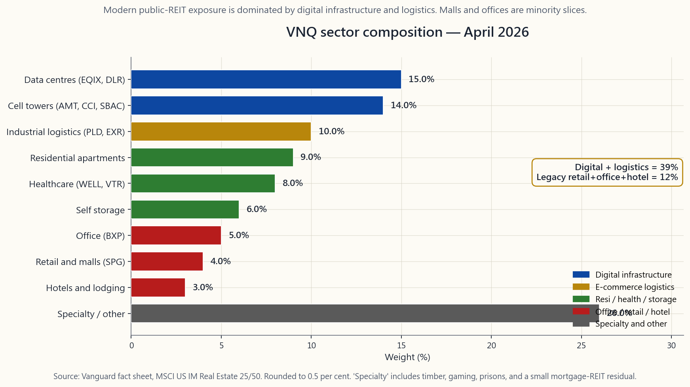
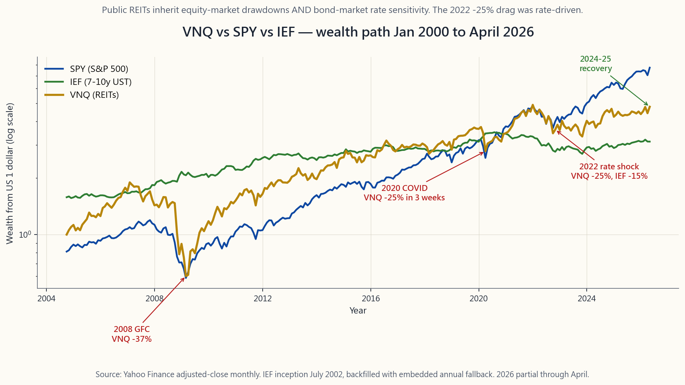

# 補充課程 07：不動產投資信託——可投資的不動產資產類別

---

## 第一部分：閱讀章節

---

### 1. 為什麼這很重要

多數散戶投資人對不動產抱持兩種半真半假、合在一起卻相當危險的認知。第一是「不動產是通膨避險工具」，第二是「不動產投資信託讓你無須當房東就能持有不動產」。這兩種說法都有部分正確，也廣泛流傳，而公開交易不動產投資信託的實際行為與這些片面說法之間的落差，正是新投資人在 2022 年式升息衝擊中蒙受損失的根源。

這個補充課程值得單獨一堂課的三個理由：

1. **不動產投資信託是股票，不是不動產。** 先鋒不動產投資信託指數股票型基金（VNQ）是一籃子約 160 檔恰好持有建築物的公開交易股票。它的每日價格走勢貼近標準普爾 500 指數，貝塔值約 0.85，而非凱斯-席勒房價指數。股市恐慌時，VNQ 同樣恐慌。利率驟升時，VNQ 因其配息被視同長債票面利率而承受存續期間衝擊。2022 年的事件是最典型的案例：同年私人商業不動產價格大致持平，VNQ 卻在一年內下跌約 25%。資產包裝形式至關重要。
2. **稅務結構獨特，深刻影響稅後殖利率。** 不動產投資信託是導管型實體，必須將至少 90% 的應稅所得以股利形式分配給股東，方可免繳公司所得稅。作為交換，投資人收到的配息依**一般所得稅率**課稅，而非較低的合格股利稅率。《2017 年減稅與就業法案》中的第 199A 條款（已於 2025 年永久化）允許投資人扣除 20% 的不動產投資信託配息，可顯著提升稅後殖利率，但此效果只在應稅帳戶中才適用。「帳戶選擇優先於資產配置」的原則在此同樣適用：只要個人退休帳戶有空間，不動產投資信託應優先放入其中。
3. **類股組成在十五年內已徹底改變。** 現代 VNQ 的組成大致為：資料中心 15%、電信鐵塔 14%、工業物流 10%，購物中心與辦公大樓僅佔個位數比重。2010 年的 VNQ 則恰好相反。多數散戶投資人腦中「不動產投資信託 = 購物中心 + 辦公大樓 + 公寓」的印象已過時十五年。現在買入 VNQ，你實際持有的是數位基礎建設，附帶一些倉儲屋頂。

本補充課程的目標，是讓你對包裝形式、稅務、利率敏感度與類股組成有足夠清晰的認識，從而判斷不動產投資信託是否值得在你的投資組合中佔有一席之地——若值得，應放入哪個部位與哪種帳戶。

---

### 2. 你需要知道的事

#### 2.1 不動產投資信託包裝——分配 90%，免繳公司所得稅

不動產投資信託是一種公司型態的實體，選擇依《美國國內稅收法典》第 856 至 859 條規定課稅。要取得資格，須持續通過四項測試。**資產測試：** 至少 75% 的總資產為不動產、現金或國庫券。**收入測試：** 至少 75% 的總收入來自租金、不動產抵押貸款利息或不動產出售收益。**分配測試：** 每年至少將 90% 的應稅所得以股利形式分配給股東。**持股測試：** 至少 100 名股東，且任何五名投資人合計持股不超過 50%。

若符合上述條件，不動產投資信託無需繳納聯邦公司所得稅。代價是股東收到的配息依**一般所得**課稅，而非適用較低資本利得稅率的合格股利。第 199A 條款允許非公司納稅人扣除 20% 的不動產投資信託配息，這實際上將大部分不動產投資信託收入的頂級聯邦稅率從 37% 降至 29.6%。州稅另計。

對投資人而言，其機械式含義為：不動產投資信託的**稅前**殖利率高於一般股票，因為壓低普通股利殖利率的公司稅層已被移除。然而，在應稅帳戶中，其**稅後**殖利率低於表面數字，因為投資人需個人負擔相當於公司稅的稅率。帳戶選擇原則說的是：只要個人退休帳戶有空間，就將不動產投資信託放入其中，讓一般所得的拖累消失；若確實評估過稅後殖利率相對於替代方案的競爭力，才考慮放入應稅帳戶。

90% 的分配要求也說明了為何不動產投資信託無法保留盈餘支應成長。它們每年必須發行股票與債務以收購新物業。這一結構性特徵使不動產投資信託的資產負債表更接近公用事業而非一般股票——也是其對利率異常敏感的原因，此議題將於第 2.3 節討論。

#### 2.2 權益型與抵押型、廣泛型與類股型——了解你持有的是什麼

第一個區分是**權益型不動產投資信託與抵押型不動產投資信託**。權益型不動產投資信託（佔市值約 90%）持有建築物並收取租金。抵押型不動產投資信託（mREITs——AGNC、NLY、ABR）持有不動產抵押貸款證券，賺取長期利率與短期融資成本之間的利差。抵押型不動產投資信託在任何實質意義上都不是不動產；它們是掛著不動產標籤的槓桿固定收益套利交易。它們在 1998 年、2008 年和 2020 年均慘遭重創。其雙位數殖利率是承擔波動性的補償，並非免費的錢。對多數投資人而言，正確的曝險應僅限於權益型不動產投資信託，而 VNQ、SCHH、USRT 和 IYR 追蹤的均為此類。

第二個區分是**廣泛型與類股型**。四檔廣泛型美國權益型不動產投資信託指數股票型基金（括號內為 2026 年 4 月費用率）：

- **VNQ**（0.13%）——先鋒旗艦產品，追蹤 MSCI 美國可投資市場不動產 25/50 指數，165 檔持股，資產管理規模 300 億美元。多數投資人的預設選擇。
- **SCHH**（0.07%）——嘉信理財的競爭產品，追蹤道瓊美國精選不動產投資信託指數，不含抵押型不動產投資信託，費用略低。
- **USRT**（0.08%）——iShares 核心美國不動產投資信託，追蹤富時 NAREIT 權益型不動產投資信託指數，與 SCHH 相近。
- **IYR**（0.39%）——iShares 不動產，範疇較廣（含部分不動產服務公司），費用率較高，為舊型產品。

自 2015 年以來，類股型不動產投資信託才是更精彩的故事。現代公開交易不動產投資信託市場由四個二十年前尚未以不動產投資信託形式存在的類股主導：

- **資料中心**（EQIX、DLR）——租給超大規模雲端業者與企業的伺服器機房。佔 VNQ 約 15%。受益於每一波人工智慧基礎建設趨勢。
- **電信鐵塔**（AMT、CCI、SBAC）——佔 VNQ 約 14%。運作方式類似基礎建設公用事業；與美國四大電信業者簽訂長期合約。
- **工業物流**（PLD、EXR）——倉儲與自助倉儲，電商建設擴張的受益者。佔 VNQ 約 10%。
- **醫療保健**（WELL、VTR）——高齡照護、醫療辦公室、生命科學建築。佔 VNQ 約 8%。

目前**已不再**佔有重要比重的：購物中心（SPG 及日益萎縮的同業，佔 VNQ 約 4%）、辦公室（BXP 及估值大幅折價的同業，約 5%），以及旅館（週期性，比重甚小）。重點是，今日買入 VNQ，你主要買入的是數位與物流基礎建設，輔以少量兼具債券替代性質的住宅和醫療保健配置——而非 1995 年的購物中心指數。

類股指數股票型基金讓你得以增加或減少特定配置：SRVR（資料中心與鐵塔）、INDS（工業）、REZ（住宅）、VPN（資料中心與連線基礎建設）。多數散戶投資人應以 VNQ 為預設選擇；對特定類股趨勢有強烈看法的投資人，可在核心 VNQ 部位之上，疊加 5% 至 10% 的單一類股指數股票型基金。

#### 2.3 利率敏感度——不動產投資信託是偽裝成股票的六至八年期債券

在數月至數年的時間窗口內，驅動不動產投資信託價格行為的單一最重要事實，是它們的交易走勢**類似長存續期間債券**。VNQ 在 2010 年後的樣本期間，實證存續期間約為 6 至 8，介於五年期與十年期國庫券之間的利率敏感度。機制直截了當：不動產投資信託的配息流是一長串現金支付，其現值與折現率呈反向變動。2022 年，十年期國庫券殖利率上升 250 個基點，VNQ 下跌約 25%（全年總報酬約 -25.0%），與七年存續期間估計所預測的結果大致相符。這正是存續期間的隱含反應。

2022 年的事件值得作為典型不動產投資信託利率衝擊案例牢記。美國 CPI 年增率於 2022 年 6 月達到 9.1%。聯邦基金利率在十一個月內從 0.25% 升至 4.50%。十年期國庫券殖利率從 1.5% 升至 4.0%。私人商業不動產按資本化率計算，交易價格大致持平——這些建築物在十二個月內並未蒸發 25% 的價值。但 VNQ 確實如此。公開包裝形式能即時傳遞利率敏感度；私人資產只有在下一次成交時才會反映。這呼應了「波動率尾端搖動本體」的框架：當一個長存續期間現金流量流有公開報價時，無論標的資產是否變動，該公開報價都會隨利率移動。

這讓多數投資人感到意外的推論是：儘管教科書上有如此論述，不動產投資信託**並非**在利率驟升階段的乾淨通膨避險工具。在長達十五年以上的時間窗口內，不動產投資信託確實是通膨避險工具，因為租金會重設，重置成本隨物價水準上升。但在 CPI 上升、聯準會被迫反應的十二個月內，不動產投資信託通常下跌。補充課程 06（通膨）涵蓋更完整的資產類別排名；不動產投資信託的特定要點在於：避險故事作用於營運面，而非定價面，兩者之間的時間落差可能長達數年。

其投資組合含義是：不動產投資信託值得在收益部位或價值儲存部位獲得小額配置（通常 5% 至 10%），配置規模應以如下假設為基礎——它們在股市回撤時與股票同向移動，在利率回撤時與債券同向移動，亦即在你最需要分散投資時，它們幾乎不會提供分散效果。從數十年的角度看，分散投資效益是真實的；在單季衝擊期間，應將其視為與任何正在波動的風險性資產高度相關。

#### 2.4 不動產投資信託的定位——部位、帳戶與配置規模

統整以上各點，定位決策便近乎機械式。

**部位。** 不動產投資信託是**收益型**資產，而非價值儲存型資產。持有它的理由是配息；底層不動產是支撐配息的債券型擔保品。它們應與補充課程 10 所介紹的股利股票選單（SCHD、VYM）放在同一部位，而非第 06 週所介紹的黃金與原物料部位。預設投資人的配置規模為收益部位的 5% 至 10%。只有在投資人明確想對特定類股（資料中心、電信鐵塔）進行押注時，才考慮更大的配置。

**帳戶。** 個人退休帳戶優先於應稅帳戶，無例外。不動產投資信託配息屬一般所得，199A 的 20% 扣除雖有助益，但無法彌補全部差距，且其殖利率夠高，使帳戶選擇決策的複利效果相當可觀。順序如下：先將個人退休帳戶的不動產投資信託配額用盡；僅當個人退休帳戶已滿或你明確想要以應稅現金流形式獲得折舊遮蔽部分的配息時，才考慮放入應稅帳戶。

**配置規模（槓鈴觀點）。** 5% 至 10% 的 VNQ 部位是核心部位配置，而非槓鈴策略的尾端。它並非在政策轉換時拯救你的資產。2022 年的事件顯示，公開包裝形式的不動產投資信託既無法在利率衝擊中保護你，也無法在股市回撤中保護你。它們憑藉長期的收益貢獻與適度的分散效果獲得一席之地，而非憑藉危機中的超額報酬。若你發現自己想將不動產投資信託配置到 15% 以上，你實際上是在對不動產資產類別下注；這種押注通常應以持有實體物業並搭配固定利率抵押貸款的方式實現，而非透過公開交易不動產投資信託。

最後這句話道盡了包裝形式的陷阱：**公開交易不動產投資信託讓你持有不動產，就像指數股票型基金讓你持有股票一樣。指數股票型基金繼承的是包裝形式的波動性，而非標的資產的耐心。** 據此配置規模。

---

### 3. 常見誤解

1. **「不動產投資信託就是不動產。」** 它們是持有不動產的股票。其每日價格由股票市場決定，並即時對利率以及風險偏好或規避的情緒變化做出反應。凱斯-席勒指數以實體交易的速度移動，存在數月的延遲。VNQ 在數秒內即有反應。兩者並非相同資產。

2. **「不動產投資信託殖利率享有股利的稅務優惠。」** 並非如此。不動產投資信託配息屬一般所得。199A 的 20% 扣除有所幫助，但無法將其降低至合格股利稅率。在高稅級應稅帳戶中，SCHD 3.6% 的合格股利殖利率，稅後表現明顯優於 VNQ 3.8% 的一般所得殖利率。

3. **「不動產投資信託可對沖通膨。」** 在十五年以上的時間窗口內確實如此——租金重設，重置成本上升，租約滾動。但在利率驟升期間的單一年度內，其跌幅相當劇烈。2022 年是典型的反例。

4. **「抵押型不動產投資信託與權益型不動產投資信託大同小異。」** 它們是不同的資產類別。抵押型不動產投資信託是槓桿套利交易；權益型不動產投資信託持有建築物。抵押型不動產投資信託在 2020 年和 2008 年因融資利差崩潰而慘遭重創；權益型不動產投資信託則未如此。

5. **「VNQ 現在主要是購物中心和辦公大樓。」** 它主要是電信鐵塔、資料中心和工業物流。1995 年的舊有印象已過時十五年。

6. **「因為有 90% 的規定，不動產投資信託配息是有保障的。」** 90% 的規定適用於**應稅所得**，而不動產投資信託本身可透過折舊向下管理應稅所得。在嚴重衰退期間（2008 年、2020 年），儘管有法定下限，數家大型不動產投資信託仍削減了配息。

7. **「公開交易不動產投資信託與私人不動產的表現應相近。」** 數十年來確實如此。數月內則不然。包裝形式的差異就是關鍵，而公開交易的包裝形式具有流動性、有股票貝塔的槓桿，且逐筆重新定價。

---

### 4. 問答環節

**問：我到底應不應該持有 VNQ？**
答：對於時間跨度至少十年、且個人退休帳戶有空間的預設 60/40 型投資人而言，應該——配置於股票部位的 5% 至 10%。對於純應稅帳戶且稅級最高的投資人而言，稅後殖利率的理由較弱；許多投資人選擇以較高殖利率的合格股利指數股票型基金（SCHD）替代，完全跳過不動產投資信託。

**問：VNQ 與 SCHH，選哪個？**
答：對於買進持有的投資人而言，功能上可互換。SCHH 費用略低（0.07% 對比 0.13%），且依設計排除抵押型不動產投資信託。VNQ 資產管理規模更大，價差更緊。兩者皆可。選擇與你其他基金家族相符的，以維持份額類別的一致性。

**問：我應該以 O（Realty Income）或 AMT（美國鐵塔）取代指數股票型基金嗎？**
答：持有單一不動產投資信託個股等於放棄分散投資。O 是一家優秀的公司；但它只是 VNQ 160 檔持股中的一檔。若你想進行主題式配置（電信鐵塔、資料中心），正確的工具是類股指數股票型基金（SRVR、VPN），而非單一個股。

**問：2022 年的回撤與 2008 年和 2020 年相比如何？**
答：2008 年最為慘烈——金融危機爆發、不動產投資信託債務信用利差驟升，VNQ 全年下跌約 38%。2020 年是 3 月數週內急跌 25%，但年底前大致收復失地。2022 年則是一場由利率驅動、緩慢消磨的 25% 跌勢。機制不同，幅度相近。

**問：國際不動產投資信託呢？**
答：VNQI 是對應的國際版產品。預設立場是留在美國上市、僅投資美國的產品；國際不動產投資信託增加了匯率風險、治理差異，以及長達四十年拖累整體表現的日本不動產比重。對多數投資人而言，答案是將不動產投資信託配額集中於 VNQ，跳過 VNQI。

**問：不動產投資信託如何與補充課程 06 的通膨避險工具搭配？**
答：它們不能取代抗通膨債券或原物料作為通膨避險工具。它們參與長期實質資產的投資邏輯，但在短期內承受利率衝擊的痛苦。簡潔的答案是：抗通膨債券用於機械式的通膨保護，黃金或原物料用於信念型資產配置，不動產投資信託作為收益部位的組成——三種不同的功能，三個不同的部位。

**問：199A 的 20% 扣除現在是永久性的嗎？**
答：已於 2025 年稅法中永久化。無論持有人的薪資所得多寡，皆適用於合格的不動產投資信託股利，且無逐步退出機制（不同於傳遞型企業所得的 199A 待遇）。此扣除不適用於資本利得配息或返還資本部分，僅適用於 1099-DIV 中的一般股利部分。

**問：不動產投資信託的運營資金與盈餘有何差異？**
答：不動產投資信託的 GAAP 盈餘因建築物的非現金折舊而被壓低，折舊是損益表上最大的費用項目，且並不反映實際的經濟耗損。業界使用運營資金（FFO = 淨利 + 折舊 - 出售收益）及調整後運營資金（AFFO = FFO - 定期資本支出）。評估不動產投資信託估值時，務必使用 AFFO 倍數，而非本益比。

**問：互動實驗室是做什麼用的？**
答：下方的 `side07_reit_lab` 面板讓你設定不動產投資信託配置比例、利率衝擊幅度與通膨率，並顯示在 60/30/10（股票-債券-不動產投資信託）投資組合中，不動產投資信託配置所貢獻的殖利率與回撤。其目的是讓取捨關係在部位層級變得清晰可見：更多不動產投資信託意味著更高的殖利率與更大的利率衝擊痛苦，兩者皆隨配置比例線性擴大。
