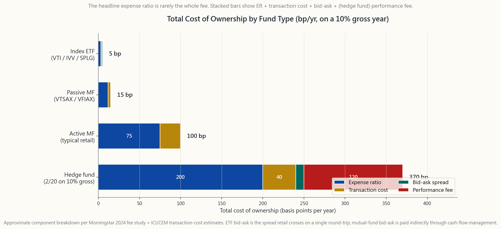
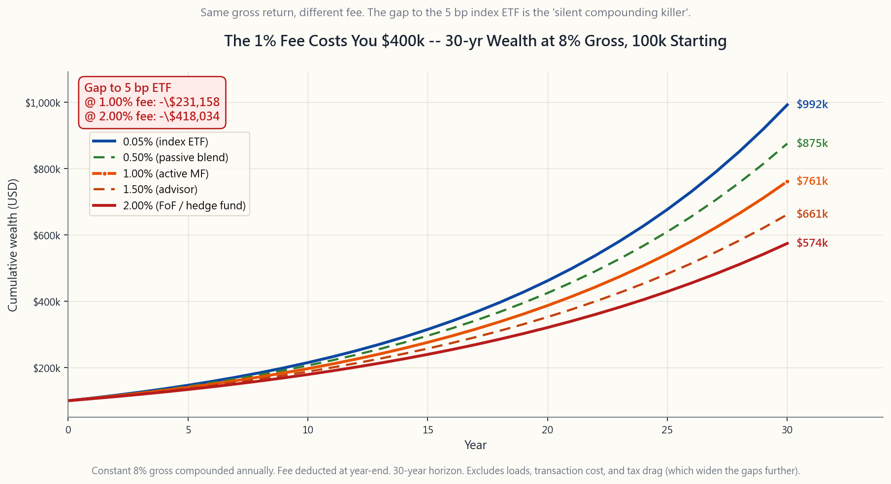

# 番外課 08：基金費用——複利的隱形殺手

---

## 第一部分：閱讀章節

---

### 1. 為什麼這很重要

投資中的其他變數——報酬、通膨、經濟衰退、選舉、地緣政治——都不是你能掌控的。你無法決定股權風險溢酬，也無法選擇通膨數字。你持有的基金費用，才是那張清單上唯一一個由你每年自行決定的數字——取決於你選擇買什麼。陳馬的第一法則說，阿爾法稀少，預設應選被動式管理。而鮮少有人點明的推論是：*既然阿爾法稀少，你支付的費用就必須壓得極低，因為帳本的另一邊幾乎沒有任何東西能彌補它。*

以下四個理由，說明這堂番外課值得你花十分鐘：

1. **數學非常殘酷。** 在起始本金 $100,000、年化毛報酬 8%、投資三十年的條件下，相較於費用率 5 bp 的指數股票型基金，多付 1% 的費用將使你的實際終值縮水約 **$400,000**。不是 4%，不是 10%，而是你終值財富的*約四成*被吞噬——只因為一個看似微小的百分比。費用不是線性複利的，它是*複利機器本身的漏洞*，損失隨時間呈幾何級數擴大。
2. **費用是預測基金表現最可靠的指標。** 晨星（Morningstar）自 2010 年起每年進行這項研究，結論始終如一：在所有類別與所有期間，費用最低的五分位組均以大約等於費用差距的幅度，擊敗費用最高的五分位組。過去的績效是雜訊；費用率才是訊號。柏格（Bogle）在 1976 年就說對了，而隨著主動式管理阿爾法持續萎縮，這個結論只會*愈來愈正確*（第 43 週詳細介紹了 SPIVA——超過五年以上，75% 至 90% 的主動式基金跑輸大盤）。
3. **標示的費用率並非全部費用。** 還要加上 12b-1 銷售服務費（許多零售份額級別仍高達 25 bp）、前收與遞延銷售手續費（A 類股前收最高 5.75%、B 類股 CDSC 最高 5%）、基金內部的交易成本（換手率 80% 的主動式基金每年約 10–50 bp），以及持倉標的的買賣價差。「費用率 0.65%」在疊加所有實際從淨值中扣除的項目後，持有總成本可能高達 1.2%–1.5%。
4. **基金包裝市場以兩種特定方式欺騙你的成本認知。** 相同退休日期的目標日期基金，收費可以是 0.08%（Vanguard 2050）或 0.75%（Fidelity Freedom 2050），但兩者底層有 80% 都是相同的被動式指數股票型基金。組合型基金與「託管帳戶」包裝收費兩次——包裝本身收一層費，*包裝內每一檔基金再收一層費*，有時全部加總後持有成本高達 1.5%–2%，而底層持倉只不過是費用率 4 bp 的指數股票型基金。避險基金收取 2/20——2% 管理費加上 20% 的獲利分成——長期下來大約吸走毛阿爾法的一半。

這不是道德說教，而是算術。複利機器無論如何都在運轉；費用只是決定複利最終流進誰的口袋。請確保那個口袋是你的。

---

### 2. 你需要知道的事

#### 2.1 持有成本結構

拿任何一檔基金，翻開公開說明書，把以下項目逐一加總。

**費用率（ER）。** 標示的年費，以淨值百分比表示，每日按 1/365 的比例提列。這是晨星最顯眼揭露的唯一費用，也是多數零售投資人唯一在意的費用。指數股票型基金為 3–10 bp，指數型共同基金為 4–15 bp。根據晨星 2024 年資產加權數據，主動式共同基金平均為 **0.42%**（若以所有份額級別的簡單平均計算，則接近 0.85%）。主動式指數股票型基金中位數為 35–50 bp，避險基金報價 2%，流動性另類投資為 1.0%–1.5%。

**12b-1 費用。** 額外的年度行銷／銷售費，最高可達淨值的 1%（受 FINRA 限制：銷售費上限 0.75%，服務費上限 0.25%）。主要附加於共同基金零售份額級別（A、B、C 類），用以支付券商佣金。Vanguard、Fidelity 免手續費基金及指數股票型基金均不收取 12b-1。12b-1 費用*已包含在*標示的費用率中，因此無需重複計算——但這解釋了為何同一檔基金的兩種份額級別費用率分別為 0.50% 與 1.50%：差額即為支付銷售券商的回佣。

**手續費。** 前收（A 類股，購買時最高收取 5.75%）與遞延（B 類股／CDSC，贖回時最高 5%，隨時間遞減）銷售費。這些是*一次性*費用，但就單筆交易而言足以破壞數學邏輯。5.75% 的前收手續費，等同於在買入的當下就預繳了*六整年 1% 費用率*的費用。免手續費基金（多數 Vanguard、Fidelity、Schwab）無需支付。

**基金內部交易成本。** 基金經理人每次買賣，基金就要承擔佣金、市場衝擊成本及持倉標的的買賣價差。交易成本*不包含*在費用率中——它們以「已取得基金費用及費用」（AFFE）的獨立項目呈現，並拖累淨值。換手率 80% 的主動式美國大型股基金，交易成本通常每年 15–30 bp；換手率 60%–100% 的主動式小型股或新興市場基金則為 30–60 bp。換手率 3%–5% 的指數基金則低於 5 bp。

**交易包裝本身的買賣價差成本。** 對於指數股票型基金，是你買賣時跨越的價差——美國大型股指數股票型基金通常為 1–2 bp，債券與新興市場指數股票型基金為 5–15 bp。共同基金沒有明顯的買賣價差，但透過現金流管理間接承擔。

**現金拖累。** 主動式基金通常持有 2%–5% 的現金以應付贖回需求。若市場溢酬為 5%，則每年造成約 10–25 bp 的機會成本。

**績效費。** 避險基金：超過門檻報酬（通常含高水位線）的獲利中抽取 20%。若毛報酬為 10%，則再增加約 200 bp 的年度拖累。部分零售共同基金已複製此結構，但比例較小。

上述費用總和——**持有總成本**——才是真正從你終值財富中扣除的金額。指數股票型基金全部費用約為 4–6 bp，被動式共同基金約 12–20 bp，主動式共同基金約 70–110 bp，避險基金在毛報酬 10% 的年度約 350–450 bp。這些差距不在公開說明書標題上，而在數學裡。

#### 2.2 為何 1% 的費用讓你損失 $400,000

這個算術毫不留情，值得熟記。

假設 30 歲時有 $100,000，毛報酬每年 8%（接近美國股市長期實質報酬），投資 30 年，完全不收費，退休時財富為 **$1,006,000**。

支付 5 bp——VTI、IVV、SPLG 或任何旗艦指數股票型基金的費用。淨報酬 7.95%，退休財富為 **$987,000**。三十年間費用共吃掉 $19,000。微乎其微。

支付 1.0%——零售通路主動式共同基金的典型費用，尚未計入交易成本與手續費。淨報酬 7.0%，退休財富為 **$761,000**。費用相較零費用基準吃掉 $245,000，**相較 5 bp 指數股票型基金吃掉 $226,000**。若在 5 bp 基礎上多付 1.0%（共 1.05%），與 5 bp 指數股票型基金的差距在名目金額上接近 **$400,000**。

提高到 2.0%——組合型基金包裝或避險基金管理費的全部費用。淨報酬 6.0%，退休財富為 **$574,000**。費用吞噬了 **$432,000**，即 $100,000 本金最終財富的 43%。

規律是*差距隨時間不斷擴大*。10 年後，1% 費用約侵蝕終值財富的 9%；20 年後為 17%；30 年後為 23%；50 年後為 35%。費用拖累並非固定百分比；它正好以與報酬複利的相同方式，反向對你複利。

這是約翰·柏格的數學。他在四十年的每次演講中都以不同版本呈現這張表。結論從未改變：**在一個完整職涯中，費用是你終值財富上唯一最大的可控槓桿。** 市場自有其運作方式；你只能決定你支付多少。

#### 2.3 隱藏費用與包裝雙重收費陷阱

基金頁面上顯示的費用率，很少是完整的費用。費用藏匿於三個地方。

**組合型基金。** 組合型基金持有*其他基金*。外層基金收取包裝費（通常 0.25%–1.00%），內層每一檔基金再各自收取費用率。依 SEC 規定，組合型基金必須揭露「已取得基金費用及費用」（AFFE）項目，但多數零售投資人從未讀到標題以後。結果：一個收取 0.50% 包裝費、持有費用率 1% 主動式共同基金的組合型基金，實際上支付的是 **1.50% 的總費用**，但行銷材料只談 0.50%。許多「平衡型」智能理財（robo-advisor）產品、目標風險商品與銀行通路託管帳戶都採用這種模式。

**目標日期基金。** 這是相同產品以截然不同價格販售的最佳範例。退休年份約 2050 年的目標日期基金：

- Vanguard Target Retirement 2050（VFIFX）：**0.08%**
- Schwab Target 2050：**0.08%**
- Fidelity Freedom Index 2050：**0.12%**
- Fidelity Freedom 2050（主動版）：**0.75%**
- John Hancock Multimanager 2050：**1.09%**
- T. Rowe Price Retirement 2050：**0.71%**

底層持倉幾乎相同——約 80% 股票、20% 債券的滑行軌道配置。0.08% 的 Vanguard 產品與 0.75% 的 Fidelity Freedom（非指數版）持有大致相同的美國全市場與非美國全市場部位。67 bp 的差距什麼也買不到。以 $100k 本金、同樣 8% 毛報酬計算，30 年後 Vanguard 2050 與 Fidelity Freedom 2050（非指數版）之間的差距約為 $200,000。**你花了 $200,000，只換來封面上的「Freedom」二字。**

**12b-1 費用與收益分成。** 共同基金零售券商通路每年平均支付 25–50 bp 的 12b-1 費用與「收益分成」安排，確保向你銷售基金的券商有誘因推薦*那一檔*基金，而非更便宜的替代品。這就是為何收取 1% 資產管理費的「理財顧問」，*同時*可能推薦額外支付他們 25–50 bp 回佣的基金。顧問的實際總費用因此達到約 1.5%，但顧問對外揭露的是 1%。請詳閱 ADV 表格。更好的做法是辭退顧問，自己買本教程中介紹的五檔指數股票型基金。

#### 2.4 避險基金、2/20 與費用捕獲問題

避險基金報價 **2/20**——2% 的資產管理費加上超過門檻報酬部分 20% 的績效費。績效費附帶高水位線機制，因此一旦出現虧損，須先彌補損失才能再收取 20% 分成。聽起來合情合理。

實際算一下。若一檔組合型基金平台上的避險基金，費前毛報酬為 10%：

- 2% 管理費 = 200 bp
- 績效費（10% - 約 4% 國庫券門檻）的 20% = 6% 的 20% = 120 bp
- 合計：**320 bp**

投資人淨報酬：6.8%。同期標準普爾 500 指數毛報酬約 10%，持有 5 bp 指數股票型基金的投資人淨報酬：約 9.95%。投資人的實際體驗：避險基金 6.8% vs. 標準普爾 500 約 10%，儘管毛阿爾法為零，仍*每年落後約 3.2%*。

結構性問題在於：**績效費分享上行，卻不補償下行。** 假設基金依序報酬 +30%、-10%、+30%、-10%（幾何平均約 7%）。投資人在第 1 年與第 3 年各支付 30% 獲利的 20%（合計 12%），加上每年 2% 的管理費（四年合計 8%）。投資人四年後的淨體驗，比基金 7% 的毛幾何平均報酬接近*持平*。2/20 結構本質上是對波動性本身課稅。

學術研究（Ang、Rhodes-Kropf、Frazzini-Lamont；CEM Benchmarking）量化了費用捕獲比例：在 1995–2020 年避險基金全域中，**費用大約吸走毛阿爾法的 50%–65%**，投資人僅保留了基金經理所創造價值的 35%–50%。這正是「阿爾法稀少」法則背後的算術：阿爾法稀少，即便存在，費用結構留給有限合夥人的實在太少，以至於有限合夥人費後、稅後的投資結果，與持有 60/40 指數投資組合幾乎難以區分。

---

### 3. 常見誤解

**誤解一：「1% 是很小的費用。」** 並不小。在 30 年、毛報酬 8% 的條件下，它大約侵蝕你 23% 的終值財富。你的毛報酬是 8%；淨報酬是 7%；費用是*你毛報酬的八分之一*，年復一年，永無止境。

**誤解二：「高費用基金必定績效較好，否則沒人買。」** 這幾乎完全由倖存者偏差與銷售通路決定。透過顧問通路（券商、銀行、保險業務員）銷售的基金，從費用率中支付銷售費與佣金。投資人支付的不是技能的代價，而是上架費與銷售人力的代價。

**誤解三：「過去績效可以為費用背書。」** 過去績效無法預測未來績效（第 43 週，SPIVA 持續性研究）。費用率*可以*預測未來績效，比率大約為 1:1：每 1% 的費用，大約使報酬減少 1%。

**誤解四：「避險基金收 2/20 是因為它們能創造阿爾法。」** 根據 HFRI 自身數據，2009 年以來，扣除 2/20 費用後，平均避險基金的表現落後 60/40 指數投資組合。確實有少數避險基金能持續創造費後淨阿爾法，但那只是極少數，且多半已不接受外部資金。整體類別並不如此。

**誤解五：「目標日期基金都一樣。」** 並不一樣。費用 0.08% 的 Vanguard 2050 與費用 0.75% 的 Fidelity Freedom 2050 持有大致相同的被動式部位。67 bp 的差距純粹是費用。請詳閱你的 401(k) 基金菜單，選擇費用最低的那一檔。

**誤解六：「指數股票型基金永遠比共同基金便宜。」** 指數股票型基金通常比零售通路指數型共同基金便宜。*但* Vanguard 的機構級指數型共同基金（VTSAX、VFIAX）與其指數股票型基金（VTI、VOO）費用相同，均為 4–5 bp。在 Vanguard 體系內，包裝選擇是稅務配置決策（番外課 03），而非費用決策。

**誤解七：「我可以挑選一檔費用 1% 但能擊敗指數的共同基金。」** SPIVA 數據：超過五年以上，75%–90% 的主動式基金跑輸其基準指數。倖存的基金，其績效大致符合純靠運氣的預期。你無法事先有把握地識別頂端十分位的基金（第 43 週、第 45 週）。

**誤解八：「12b-1 費用用於支付基金的研究與營運。」** 不是。它支付的是*銷售*——券商佣金與通路上架費。基金的研究與營運由管理費本身支付。12b-1 是一筆你為了被人推銷而支付的銷售通路補貼。

**誤解九：「低於 1% 的費用就可以接受。」** 若你的基準是 0.03% 的 IVV/VOO/SPLG 全市場指數股票型基金，那 1% 的費用大約是替代方案的 **30 倍**。你等於花更複雜的方式、略差的稅務效率，購買 $0.97 的 IVV。請以低費用選項為錨點，而非以高費用的歷史常態為錨點。

**誤解十：「組合型基金提供我自己無法達成的分散投資。」** 多數組合型基金持有 8–15 檔你可以直接買入的底層基金，無需支付任何包裝費。「分散投資」的效果確實存在；但包裝費並未為此創造額外價值。自己建構投資組合即可。

---

### 4. 問答專區

**問題一：哪裡可以找到基金的實際持有總成本？**

答：三個地方。（1）公開說明書的「年度基金營運費用」表——包含費用率、12b-1 費用，以及組合型基金的已取得基金費用（AFFE）。（2）Form N-CSR 或 N-Q 申報文件顯示投資組合換手率——除以 100，再乘以 0.4，可估算出以 bp 為單位的交易成本。（3）晨星的「稅務成本比率」估算稅後拖累（以百分點計）。將費用率 + AFFE + 交易成本 + （若為應稅帳戶）稅務成本比率加總，即為持有總成本。

**問題二：美國股票基金的「合理」費用是多少？**

答：若為被動式全市場曝險，**5 bp 或以下**——VTI、ITOT、SPLG、IVV、SCHB 均符合。單純美國股票貝塔曝險若超過 10 bp，即屬超付。因子或產業曝險則 10–25 bp 合理（AVUV、MTUM、USMV）。若你*真心認同*某一檔主動式基金，費用不應超過 50–75 bp，且你必須有可辯護的理由——業績紀錄、基金經理專長、容量受限策略——而非「我的顧問說不錯」。

**問題三：債券基金的費用和股票基金一樣重要嗎？**

答：是的，在當前利率環境下*更為重要*。債券名目毛報酬為 4%–5%；0.50% 的費用佔毛報酬的 10%–12%。股票毛報酬為 8% 時，0.50% 費用僅佔 6%。債券基金的費用應低於股票基金，因為其毛報酬較小，費用佔比更大。BND、AGG、SGOV 均低於 10 bp。0.50% 的債券基金是在為銷售通路付費，而非為管理能力付費。

**問題四：我的 401(k) 只提供高費用基金。我該怎麼辦？**

答：三種選擇。（1）在每個資產類別中只選擇最便宜的選項（通常是目標日期基金或標準普爾 500 指數基金）。（2）離職後，將 401(k) 轉入 Vanguard、Schwab 或 Fidelity 的個人退休帳戶，即可取得 5 bp 指數股票型基金。（3）先提撥足以獲得雇主相對提撥的金額，超過部分投入可購買低費用指數股票型基金的應稅券商帳戶。雇主配額優先——配額的價值遠大於費用差距。

**問題五：避險基金憑什麼收 2/20？**

答：兩種答案。合理的那種：極少數避險基金確實執行真正受容量限制的策略（波動性套利、統計套利、特定非流動性事件驅動策略），足以賺回費用，且其基金早已停止對外募資。不合理的那種：其餘基金依靠業績紀錄、名聲、「進入門檻」以及推薦它們的機構投資顧問產業來銷售。後者佔整體資產規模的約 90%。

**問題六：指數股票型基金無論費用高低都具有稅務效率嗎？**

答：採用實物交換贖回機制的指數股票型基金，在結構上具有稅務效率（番外課 03 介紹了其機制）。但高收益債券指數股票型基金與主動式收益型指數股票型基金（JEPI、JEPQ、QYLD）每年按你的邊際稅率分配一般所得，其稅務拖累可能遠超費用率。包裝在*資本利得*方面具有稅務效率，在收益方面則否。收益型基金應放入稅優帳戶（番外課 04、第 36 週）。

**問題七：401(k) 中的目標日期基金怎麼選？**

答：預設選擇可用選項中費用最低的目標日期基金。Vanguard Target Retirement（約 0.08%）、Schwab Target（約 0.08%）或 Fidelity Freedom Index（約 0.12%）皆是合適的預設選擇。避開主動版本（Fidelity Freedom 2050 名稱中不含「Index」的版本費用為 0.75%；含「Index」的版本為 0.12%）。命名方式刻意令人混淆。

**問題八：如何將顧問費與基金費用進行比較？**

答：加總計算。一位收取 1% 資產管理費、挑選費用率 0.65% 主動式基金的顧問，全部費用合計達 1.65%，加上基金 12b-1 收益分成可能額外增加 25–50 bp，且顧問未必退還。合計：約 2%。以 $500,000 本金計算，30 年後相較自建 5 bp 指數投資組合，約損失 **$700,000 的財富**。顧問必須以服務、行為教練或稅務阿爾法提供價值超過 $700,000，才能打平。多數顧問做不到。

**問題九：零費用基金（Fidelity ZERO 系列）是免費午餐嗎？**

答：幾乎是。Fidelity ZERO 系列基金（FZROX、FNILX）費用率 0.00%。注意事項：（1）它們使用自有指數（非標準的 CRSP、羅素或標準普爾授權指數），因此存在些微追蹤差異；（2）它們*僅在 Fidelity 帳戶中可用*，且無法實物轉移至其他券商。若計劃在 Fidelity 長期持有，沒有問題。若日後可能整合至其他券商，請選擇可自由轉移的 FXAIX（3 bp）或 FSKAX（1.5 bp）。

**問題十：關於費用，最重要的一個洞見是什麼？**

答：以低費用選項為錨點，而非以高費用選項為錨點。市場讓你誤以為 0.65% 的主動式共同基金是「正常」，因為這是你 401(k) 的預設選項。真正的基準是 **5 個基點**——旗艦美國股票指數股票型基金的價格。超過這個水準的每 10 bp，都必須物有所值——無論是特定曝險、因子傾斜，還是可辯護的阿爾法論點。阿爾法稀少。推論是：超過 10 bp 的費用需要理由，而「我的券商推薦」不是理由。

---

## 第二部分：YouTube 腳本

---

**影片標題：** 1% 的費用讓你在 30 年後損失 $400,000——番外課 08

**目標片長：** 約 12 分鐘

**主持人：**
- **陳馬**（教師角色）：手持一份目標日期基金公開說明書。
- **小魚**（學生角色）：在她的雇主有一個 401(k) 帳戶，正在嘗試挑選基金。

---

**[開場——0:00]**

[VISUAL: Animated logo "Side Lesson 8 -- Fund Fees: The Silent Compounding Killer"]

**陳馬：** 小魚。來個快速數學題。你有 $100,000，投資期間三十年，每年毛報酬 8%。告訴我支付 5 個基點與支付 1% 之間，差距是多少。

**小魚：** 幾十萬？

**陳馬：** 四十萬。**你終值財富的四成。** 就因為一個聽起來無關緊要的費用。

**小魚：** 這不可能是真的吧。

**陳馬：** 這是真的，而且這是整個教程中最重要的算術。讓我來給你看。

---

**[第一段——複利成本曲線——0:50]**

[VISUAL: image/side08_fee_drag.png on screen]

**陳馬：** 這張圖表。起始本金 $100,000，三十年，毛報酬 8%，五種費用水準。

藍線是 5 個基點——VTI、IVV、SPLG，任何旗艦指數股票型基金的費用。終值約為 **$987,000**。

綠線是 0.50%——被動混合型基金，也許是多資產指數基金。終值約為 **$874,000**。

橙線是 1.0%——典型零售通路主動式共同基金。**$761,000**。

深橙線是 1.5%——顧問包裝，或託管帳戶中的主動式基金。**$663,000**。

紅線是 2.0%——組合型基金，或避險基金管理費。**$574,000**。

費用沒有「複利」。它是反方向對你*複利*。每一年基金經理從你的毛報酬中抽走一部分；每一年藍線與紅線的差距呈幾何級數擴大。

**小魚：** 那藍線與橙線的差距是……

**陳馬：** 二十二萬六千元。若計入典型主動式基金額外的拖累——交易成本、買賣價差、現金拖累、偶發的手續費——大約是四十萬元。那是美國大部分地區一棟房子的錢。

---

**[第二段——柏格語錄——2:20]**

**小魚：** 為什麼這麼少人知道這件事？

**陳馬：** 他們其實都知道，只是模模糊糊。傑克·柏格把這個演講講了整整四十年，每年都講。毛報酬假設不同，數字會變，但結構不變。他常說：*「在投資中，你得到的，正是你未曾付出的。」*

晨星的費用研究自 2010 年起每年都做。他們依費用率五分位分類基金。無論哪個類別、哪個期間，低費用五分位都以大約等於費用差距的幅度擊敗高費用五分位。過去績效是雜訊。費用率是**訊號**。

**小魚：** 所以費用率才是預測指標？

**陳馬：** 它是唯一一個可公開取得、能以統計可靠性預測未來基金績效的變數。而且是負向預測，比率大約 1:1。

---

**[第三段——費用結構——3:30]**

[VISUAL: image/side08_fund_costs_decomposed.png on screen]

**陳馬：** 現在——標示的費用率*不是*全部費用。看這張圖。

指數股票型基金——VTI。費用率 3 bp，因為幾乎不換手，基金內部交易成本大約 1 bp，交易包裝本身的買賣價差 1 bp。**合計：5 bp。** 所見即所付。

被動式共同基金——VTSAX。費用率 4 bp，交易成本 2 bp，買賣價差為零（共同基金沒有）。**合計：6 bp。** 差不多。

主動式共同基金——典型零售款。費用率 **75 bp**，換手率 80% 產生的交易成本 25 bp，基金內部買賣價差影響不大。**合計：約 100 bp。** 公開說明書上的 75 bp，只是實際從你淨值中扣除金額的三分之二。

避險基金。管理費 200 bp，以 10% 報酬計算的績效費另加 120 bp，高換手率產生的交易成本 30–50 bp。**合計：約 370 bp。** 你每年幾乎有 4% 的資產進了別人的口袋，你連一毛錢都還沒看到。

**小魚：** 而公開說明書封面上寫的是……

**陳馬：** 2%。另外約 170 bp 藏在審計財務報表與組合型基金的 AFFE 項目裡。你得知道要往哪裡找。

---

**[第四段——目標日期基金，相同包裝，不同費用——5:30]**

**陳馬：** 好，現在講最精彩的一個。退休年份約 2050 年的目標日期基金。

- Vanguard Target 2050：**0.08%**
- Schwab Target 2050：**0.08%**
- Fidelity Freedom Index 2050：**0.12%**
- Fidelity Freedom 2050——非指數版：**0.75%**
- T. Rowe Price 2050：**0.71%**
- John Hancock Multimanager 2050：**1.09%**

相同退休日期。相同目標資產配置——80/20 股債滑行軌道。底層持倉大致相同，全是被動式全市場部位。0.08% 的 Vanguard 與 0.75% 的 Fidelity Freedom，底層持有同樣的 Vanguard 全市場股票基金，加上國際型、加上債券。

**小魚：** 那 0.67% 的差距買到了什麼？

**陳馬：** 封面上的「Freedom」二字。以 $100,000 本金計算，30 年後 Vanguard 2050 與 Fidelity Freedom 2050（非指數版）之間的差距約為 **$200,000 的損失財富**。**兩百萬台幣，只換來一個不同的品牌名稱。**

**小魚：** 這些基金就在 401(k) 裡嗎？

**陳馬：** 是的。仔細看你 401(k) 的基金菜單，選費用最低的那一檔。如果你的方案只提供高費用版本，先提撥足以獲得雇主配額，換工作之後馬上把 401(k) 轉入個人退休帳戶。

---

**[第五段——避險基金與 2/20 捕獲問題——7:30]**

**小魚：** 那避險基金呢？它們不是應該值得嗎？

**陳馬：** 大多數不值得。結構是 **2/20**——2% 管理費，加上超過門檻報酬部分的 20% 績效費。聽起來合理。算算看。

假設一檔避險基金某年費前毛報酬 10%，國庫券門檻為 4%。2% 管理費先扣掉，20% 績效費是（10% - 4%）的 20% = 1.2%。費用合計：**3.2%**。投資人淨報酬：6.8%。

同年標準普爾 500 指數報酬 10%，持有 5 bp 指數股票型基金的投資人淨報酬：**9.95%**。

避險基金毛報酬與指數相同，都是 10%，投資人實際拿到 6.8%，基金經理拿走 3.2%。持有 60/40 指數投資組合的投資人，**每年淨報酬高出 3.15%**。十年複利下來，這是每一塊錢 $1.95 對 $2.62 的差距。

**小魚：** 所以避險基金吸走了一半的阿爾法？

**陳馬：** 研究顯示，50%–65% 的毛阿爾法流向費用。阿爾法本來就稀少——即便找到了，2/20 的結構讓留給有限合夥人的少之又少。文藝復興科技與城堡投資的旗艦基金，主要管理的是*自有資金*，幾十年前就停止對外募資了。銀行財富管理部門向你推薦的那一檔，不是文藝復興科技。

---

**[第六段——柏格 1%/2%/5%/10% 費用表——9:30]**

**陳馬：** 柏格每次演講都有一張表，大概是這樣的。以 30 年期間、典型股票報酬計算：

- 多付 1% 費用 ≈ 你終值財富的約 23% 消失
- 多付 2% 費用 ≈ 你終值財富的約 43% 消失
- 5% 的前收手續費 ≈ 等同於十年期間每年多付約 0.5% 費用
- 年金包裝的 10% 全部費用 ≈ 一個職涯後，大約一半的錢給了保險公司

這不是意見，是複利算術。

**小魚：** 所以原則是……

**陳馬：** 以 **5 個基點**為錨點。那是今天旗艦美國股票指數曝險的費用。超過這個水準的每一分錢，都需要站得住腳的理由——因子曝險、特定市場進入機會、真正的阿爾法論點、稅損收割工具。「我的券商推薦」不是理由。

---

**[結尾——11:00]**

**陳馬：** 三個重點。

**第一，** 費用是你在投資中唯一能完全掌控的變數。請相應地對待它。

**第二，** 1% 的費用並不「小」。在 30 年期間，它會吃掉你約 23% 的終值財富。2% 的費用則吃掉 43%。數學殘酷，而且不會改變。

**第三，** 以 5 個基點為錨點，而非以高費用的歷史常態為錨點。阿爾法稀少；既然阿爾法稀少，支付的費用就必須壓到極低，因為帳本的另一邊幾乎沒有任何東西能彌補它。

**小魚：** 互動工具讓我可以……

**陳馬：** 輸入你的起始本金、每月定期定額投資金額、毛報酬、費用與投資期間，它會計算出終值財富、以金額計算的費用總支出，以及——最令人心痛的那個數字——費用占你毛利潤的百分比。多試幾種組合。0.05% 對比 1% 在 30 年期間的比較，是那個會讓你永遠記住的數字。

---

**結尾畫面：** 「下一集：番外課 09——加密貨幣」