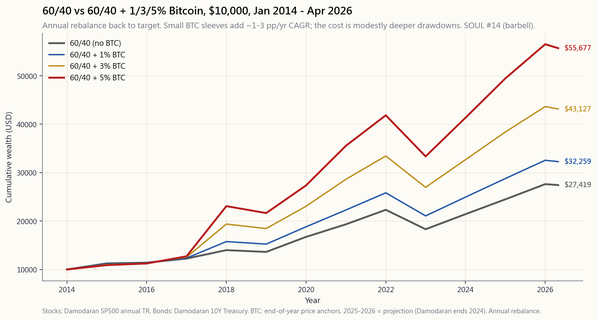

# 附加課程 09：加密貨幣與投資組合——比特幣、以太幣，以及 1-5% 配置的邏輯

---

## 第一部分：閱讀材料

---

### 1. 為什麼這堂課很重要

比特幣已誕生十六年。在這十六年間，其價格從不到一美分漲至逾十萬美元，途中經歷兩次跌幅約負八十五%的完整崩盤。這不是一個正常資產類別的生命週期，而是一場全新貨幣實驗在公開帳本上即時運行的生命週期。它是否「真實」，是一個價值儲存的問題（所有價值儲存工具都建立在信念之上），但以其市值規模、流動性，以及如今可透過 SEC 核准的現貨指數股票型基金在券商帳戶中直接買入的事實來看，*忽視*它已不再是中性立場，而是一個主動的資產配置決策。

這堂課存在的四個理由：

1. **這個資產類別現在可透過一般券商帳戶以標的代碼投資，無需接觸任何私鑰。** 2024 年 1 月核准的現貨比特幣指數股票型基金（IBIT、FBTC、ARKB 及其他八檔），以及 2024 年 7 月核准的現貨以太幣指數股票型基金（ETHA、FETH），是加密貨幣短暫歷史中最重要的一次監管事件。認真的投資人預設使用美國掛牌標的；現貨指數股票型基金將「加密貨幣作為資產類別」的問題，折疊進了與本課程其他所有標的相同的交易架構。2024 年以前，加密貨幣需要獨立的交易所、錢包與保管決策；2024 年後，它只是一個代碼。
2. **比特幣的波動性約為年化七十%——是標普 500 的四倍。** 光是這個數字，就使部位規模的決定成為一道*數學*題，而非觀點題。買加密貨幣不能像買指數基金那樣；你買的是極小的一塊，規模要控制在即便發生負八十%的回撤，對*整體*投資組合的衝擊也在可接受範圍內。「波動率尾巴搖動狗身」的框架最為清晰：一個佔五%的比特幣部位，在七十%波動性下，對投資組合整體波動性的貢獻約為三點五個百分點，幾乎等同於一個六四分配投資組合中股票部分的貢獻。
3. **2017/2021/2025 三個週期的模式，現在已足夠清晰，可以客觀討論。** 每個週期歷時約四年（峰值到峰值），每次都以槓桿和山寨幣的爆炸性行情收尾，且每次都以歷時十八至二十四個月、跌幅約八十%的回撤告終。2024-2025 年這個週期是第一個有美國機構資金流入現貨指數股票型基金的週期，也是第一個*高點*不需要交易所爆倉清洗便結束的週期——它以更有秩序的方式緩步退燒。三個週期還不足以構成一個像 1970 年代通膨那樣的「體制」，但足以讓「比特幣沒有歷史紀錄」的說法成為過去式。
4. **稅務與產品架構創造了真實的優勢，也埋下了真實的陷阱。** IRS 將加密貨幣視為*財產*，而非有價證券：這意味著沒有合格股利、沒有第 1256 條的六四混合稅率、*目前沒有洗售規則*，以及持有實幣時沒有自動的 1099-B 成本基礎追蹤。現貨指數股票型基金部分解決了這些問題——它們的交易方式與指數股票型基金相同，成本基礎也有追蹤——但底層資產仍屬財產。在此，選對架構帶來的稅後優勢，比在股票市場中更為顯著，正是因為稅法尚未完整。選對架構，稅後結果會是一個截然不同的資產類別。

這堂附加課的目標，是給你幾個關鍵數字和一條規模原則，讓「我該不該持有比特幣」從哲學辯論，變成四部位投資組合中一個規模明確、深思熟慮、配置在正確子帳戶的小型部位。

---

### 2. 你需要知道的事

#### 2.1 比特幣論題一頁說明——二千一百萬枚與減半機制

你可以對比特幣的價格爭論十年。但你無法對其供應時間表提出異議，因為供應時間表就是協議本身。整個論題由兩個數字支撐：

- **最大供應量為 21,000,000 枚，永久不變。** 這個上限由網路上的每個節點通過共識強制執行。截至 2026 年 4 月，已開採約 1,985 萬枚。剩餘的約 115 萬枚將在未來百餘年間以漸近線方式緩慢釋出。沒有任何委員會可以投票提高上限；這樣做等同於硬分叉，而根據十五年的實際偏好揭示，網路將予以拒絕。
- **每四年新幣發行量減半。** 區塊獎勵從 2009 年的每區塊 50 枚比特幣起算，2012 年 11 月降至 25 枚，2016 年 7 月降至 12.5 枚，2020 年 5 月降至 6.25 枚，2024 年 4 月降至 3.125 枚，2028 年將降至 1.5625 枚。當前的年新增供應量約為現有流通量的 0.85%——已低於黃金約 1.5% 的年礦產供應增長，且仍在持續下降。

這就是整個「數位黃金」的論題：一種固定上限、類大宗商品的資產，其新供應速率被機械式地設計為低於黃金，背後是一個全球分散式驗證網路，且沒有中央發行者。所有其他的加密貨幣辯論，都是從你是否接受這個論題而衍生出來的。誠實的框架是：這是一種*信念*資產，就像黃金和法幣一樣。唯一的問題是這種信念的持久性，而唯一可用的證據是十五年的價格發現、三個完整的榮枯週期，以及一個約兩兆美元的市值——法律與機構體系已選擇不壓制它。

同樣的框架也適用於以太幣（ETH），但有所折扣。以太坊並非固定供應——其發行速率是可變的，2022 年「合併」（The Merge）後甚至短暫出現*負*發行——但它擁有第二大的網路效應、第二大的驗證者集合，以及比特幣以外唯一通過的現貨指數股票型基金。如果你持有任何一種，請將以太幣視為比特幣核心的一個較小、更高波動、更具「科技色彩」的衛星部位。其他所有標的（所謂的「山寨幣」）尚未展現出同等的持久性，就投資組合課程的目的而言，皆屬雜訊。

#### 2.2 2017/2021/2025 的週期——規律，而非巧合

比特幣的價格歷史，最好解讀為三個完整的四年週期，各以一次減半為錨，各以約負八十%的回撤告終：

- **第一週期（2013-2015）及暖身期。** 價格從 2013 年 1 月的約 13 美元漲至 2013 年底的 1,150 美元，隨後在 2015 年初跌至 200 美元——回撤幅度負八十三%。這是 Mt. Gox 時代，大部分流通量集中在單一一家東京交易所，而該交易所隨即倒閉。
- **第二週期（2017-2018）。** 價格從 2017 年 1 月的 1,000 美元漲至 2017 年 12 月的 19,800 美元（原始的散戶狂熱），隨後在 2018 年 12 月跌至 3,200 美元——回撤幅度負八十四%。期貨在頂部附近推出（芝加哥期權交易所/CME，2017 年 12 月），為機構提供了第一個可做空的工具；這與頂部時機的巧合並非偶然。
- **第三週期（2020-2022）。** 價格從 2020 年初的 9,000 美元漲至 2021 年 11 月的 69,000 美元，隨後在 FTX/三箭資本/Luna 崩潰事件中，於 2022 年 11 月跌至 15,500 美元——回撤幅度負七十七%。這個週期摧毀了加密貨幣中最糟糕的中介機構（中心化借貸平台、槓桿「收益」平台），並將倖存者推向受監管的架構。
- **第四週期（2024-2025）。** 價格從 2024 年 1 月現貨指數股票型基金推出時的 42,000 美元漲至 2025 年底的約 145,000 美元，隨後在 2026 年 4 月回落至約 112,000 美元——目前回撤幅度較溫和的負二十三%，是第一個有大量美國機構資金流入受監管架構的週期。本週期是否將以傳統的負八十%清洗告終，還是結構性的較淺回撤，是 2026 年仍待回答的問題。

從這個規律中，有三件事值得特別記取。**第一**，峰值大約每四年出現一次，以減半為錨。這種規律性終將打破，但目前尚未發生，而日曆本身就是資訊。**第二**，回撤是災難性的。每個週期結束時，負八十%是*眾數*結果，而非尾部事件。一個無法忍受看著部位在十二至十八個月內蒸發五分之四的散戶投資人，不應持有這個資產類別。**第三**，每個週期的反彈都將價格推至*高於*前一個週期峰值的新高。2017 年頂部（2017 年 12 月，19,800 美元）進場的買家虧損三年後翻倍；2021 年頂部（69,000 美元）進場的買家同樣虧損約三年後翻倍。這個規律殘酷，但具有遍歷性——*如果*網路論題持續成立的話。

#### 2.3 波動性與回撤，就是整個部位規模的核心問題

決定加密貨幣是否適合納入投資組合的關鍵數字，是其年化波動性，且這個數字毫不留情：

- **比特幣日波動性，十五年平均：** 年化約七十%。作為對比：標普 500 為 16-19%；那斯達克 100 為 22-26%；黃金為 15%；長期國庫券（TLT）為 14%；表現最差時的梗概股票為 60-80%。比特幣在所有流動資產類別的波動性排名中位居榜首。
- **比特幣最大回撤，十五年歷史：** -85%（2014 年）、-84%（2018 年）、-77%（2022 年）。三次回撤均深於*標普 500 自 1932 年以來任何一次的單次回撤*。
- **以太幣日波動性，八年平均：** 年化約九十%，且每個週期谷底的回撤均深於比特幣。

你無法迴避的數學：一個佔 5% 的比特幣部位，波動性 70%，與其餘 95% 的股債投資組合（假設波動性約 11%）並存，總投資組合波動性——將各部分平方加總後開根號——約為 $\sqrt{(0.95 \times 0.11)^2 + (0.05 \times 0.70)^2}$ ≈ 11.5%，較無加密貨幣的基準高出約五十個基點。同樣的計算在 10% 比特幣部位時，投資組合波動性超過 13%——你為了容納這個部位，已大幅改變了整個投資組合的風險特徵。*超過十%，比特幣部位就不再是衛星，而是投資組合風險的*共同驅動者*，這對幾乎所有投資人的風險預算來說，都違背了四部位的邏輯。

這就是為什麼標準散戶配置為**可投資資產的 1-5%，以 3% 為重心**。這不是猜測；這是比特幣在增加預期報酬的同時，不淹沒整個投資組合變異數貢獻的規模。以槓鈴策略來說：比特幣部位位於槓鈴的右端，短期國庫券在左端，中間的指數基金部分不承擔任何一方的波動性。

#### 2.4 支持 1-5% 的凱利公式邏輯

1-5% 的範圍並非憑空而來。進行分數凱利計算，得出的答案相同。取比特幣的歷史夏普比率（全樣本約 0.7-0.9，在滾動五年窗口期間較低），假設前瞻預期報酬為年化 15-25%（低於已實現的報酬，這是針對樣本期間市值翻倍資產的標準調整），並假設波動性維持在 60-70%。全額凱利公式要求的部位規模為*預期超額報酬除以變異數*：約（0.20 - 0.04）/ 0.65² ≈ 38%。

沒有人在單一資產上押滿凱利。標準折扣是四分之一至八分之一凱利，落點約為投資組合的 5% 至 10%。再對*參數不確定性*施加第二重折扣（你的預期報酬數字不是事實，而是對十五年樣本的猜測），實際部位就落在 1-5%。這與機構顧問（黑岩、富達）各自得出的數字相同，也與分數凱利計算得出的數字相同。這不是三個不同的答案；這是用三種方法得出的同一個答案。

另一個紀律是**再平衡**。若不再平衡，一個在一個週期內翻三倍的 5% 比特幣部位，在頂部可能成長為 13% 的部位——恰好是四個週期的歷史告訴你應該減倉的時候。透過每季或每年再平衡回目標，你會機械式地在週期峰值賣出，在谷底買入，部位維持在你實際預算的規模。1-5% 比特幣部位對投資組合年化複合成長率的大部分長期貢獻，來自再平衡流量，而非買入持有。

#### 2.5 現貨指數股票型基金與自我保管——IBIT、FBTC、ETHA 及架構選擇

2024 年 1 月以前，透過美國券商持有比特幣需要：GBTC（一檔相對淨值存在 ±40% 溢折價的封閉型基金），或透過交易所直接持有（保管風險、私鑰管理）。現貨指數股票型基金的核准一夜之間改變了這一切。

四種值得了解的架構：

- **IBIT（iShares Bitcoin Trust）**——黑岩旗下基金。截至 2026 年 4 月，管理資產規模（AUM）最大（約 580 億美元）。費用率 0.25%（初始十二個月費率減免已到期）。保管人：Coinbase。機構的實際預設選擇。
- **FBTC（Fidelity Wise Origin Bitcoin Fund）**——富達旗下基金。自行保管（富達數位資產，自建）。AUM 約 200 億美元。費用率 0.25%。適合已有富達生態偏好的投資人。
- **ETHA（iShares Ethereum Trust）**——黑岩旗下的現貨以太幣指數股票型基金，2024 年 7 月核准。AUM 約 50 億美元，費用率 0.25%。現貨以太幣基金中規模最大的。
- **GBTC（Grayscale Bitcoin Trust）**——舊有產品，2024 年 1 月轉換為指數股票型基金。費用率 1.50%——是 iShares 費率的六倍。持有它的唯一理由，是你有未實現的長期資本利得不想觸發。否則，請轉換至 IBIT。

架構選擇之所以重要，有三個原因。**稅務處理**：四者均為 1099-B 申報，成本基礎有追蹤，在任何應稅或退休帳戶中的交易方式均與指數股票型基金相同——省去直接持幣的稅務核算麻煩。**保管**：你將私鑰管理問題外包給受監管的保管人；對 99% 的投資人而言，這是正確答案，以小額持續費用取代了一個重大的尾部風險（自管損失、交易所倒閉）。**架構純粹性**：現貨指數股票型基金以一比一的比例持有底層幣，不同於期貨型 BITO（2021 年推出的產品），後者每年因正價差而遭受約 8-10% 的拖累。現貨指數股票型基金是買入持有的正確架構；期貨架構適合交易者。

適合自我保管的情況很少：大規模部位（超過 100 萬美元，0.25% 費率才顯著）、與比特幣原始論題的意識形態契合（「沒有你的私鑰，就不是你的幣」），或需要鏈上交易的使用情境（DeFi、支付）。對於在稅務優惠退休帳戶中配置 1-5% 的部位，現貨指數股票型基金是明確無誤的正確架構。美國掛牌架構是預設選擇。

#### 2.6 稅務處理——財產，而非有價證券

IRS 將加密貨幣分類為**財產**（2014-21 號公告，至 2026 年未有更動）。其後果如下：

- **沒有合格股利稅率。** 加密貨幣本就不派發股利，因此這只影響質押獎勵（在收到時按普通收入課稅）和礦工（按公平市值計算的區塊獎勵按普通收入課稅）。
- **沒有第 1256 條的六四分割。** 與標普 500 選擇權或期貨不同，加密貨幣的資本利得是純粹的短期或長期資本利得，依標準一年持有期計算。
- **目前沒有洗售規則。** 第 1091 條涵蓋「股票或有價證券」。截至 2026 年 4 月，IRS 尚未將其延伸至加密貨幣。這意味著你可以在十二月以虧損賣出比特幣進行稅損收割，然後在 1 月 2 日重新買入——這在股票市場是違法的。已有多個立法提案提出封閉這個漏洞；不要假設它會一直存在。
- **若直接持有實幣，成本基礎的追蹤是你自己的責任。** 直接交易所對質押收益發出 1099-MISC，但不一定對交易發出 1099-B；IRS 最終將強制要求成本基礎申報（2025 年 1099-DA 表格），但在此之前，舉證責任在你身上。現貨指數股票型基金完全避免了這個問題——它們是在指數股票型基金架構內以 1099-B 申報的有價證券。
- **直接持有實幣不能自動存入個人退休帳戶（IRA）。** 大多數 IRA 保管人不允許直接持有加密貨幣。*現貨指數股票型基金可在任何標準券商 IRA 中持有。* 帳戶位置很重要：考量到其波動性特徵，將比特幣部位放在 Roth IRA 中，未來的任何利得均可免稅，因此它是特別適合 Roth 的候選標的。

最具可操作性的稅務洞見只有一條：**目前洗售規則的缺席，使加密貨幣成為美國稅法中最乾淨的稅損收割資產。** 在任何虧損時賣出，立即重新買入，實現損失以抵扣每年最高 3,000 美元的普通收入，以及無上限的資本利得抵扣。這個優勢不會永遠存在。在它存在的時候好好利用。

#### 2.7 加密貨幣做不到的事——沒有現金流、沒有底部、沒有殖利率

誠實列舉加密貨幣*無法*為投資組合做到的事：

- **沒有內含底部。** 股票有盈餘，不動產有租金，債券有票面利率和到期還本。比特幣一樣都沒有。價格完全由信念支撐，而足夠協調的信念轉移，原則上可以將其送至零。十五年的樣本外測試令人鼓舞，但並不完整。
- **沒有合格股利或票息收入。** 需要現金流的退休人士，無法直接從比特幣獲得任何收入。解決方案不是「比特幣提供殖利率」，而是「在再平衡時修剪比特幣部位回目標，修剪所得的現金支應退休預算。」
- **沒有明確的相關性對沖效果。** 比特幣本應是低相關資產。但在 2022 年的風險規避行情中，比特幣跌了 -65%，標普跌了 -25%，TLT 跌了 -31%；相關性高且為正。近期樣本（2023-2025 年）顯示相關性較低（約 0.3-0.4），但比特幣尚未贏得趨勢跟隨或長波動性選擇權那樣的長期波動性角色。將其視為高波動性的報酬增強工具，而非分散投資工具。
- **沒有消費者保護兜底機制。** 直接持有的加密貨幣不受 SIPC 保障。穩定幣不受 FDIC 保障。自管損失是永久性的。現貨指數股票型基金在券商層面受 SIPC 保障（針對券商倒閉，而非底層幣歸零）。

正確的心智模型是：比特幣是一種高波動性、高預期報酬的*報酬型*資產。它屬於價值儲存部位，配置比例 1-5%，在可能的情況下放在稅務優惠架構中，規模控制在回撤貢獻可接受的範圍內，並按固定時間表再平衡。它不是對沖工具。它不是現金流來源。它不是儲蓄帳戶。根據十五年的證據，它是一個可投資的資產類別——而尊重這些證據的部位規模，是小的。

---

### 3. 常見迷思

1. **「比特幣是詐騙/毫無價值。」** 比特幣擁有兩兆美元的市值、十五年持續的價格發現歷史，並由在 SEC 核准的現貨指數股票型基金中擔任保管的機構持有。「詐騙」的說法在 2014 年尚可站得住腳，在 2018 年就已較弱，到了 2026 年根本站不住腳。它是一種信念資產——就像黃金和法幣一樣——唯一誠實的問題是信念的持久性。

2. **「比特幣是對抗通膨/美元的對沖工具。」** 2022 年的證據直接否定了這一點。CPI 達到 9.1%，美元走強（美元指數 +8%），而比特幣下跌 65%。無論比特幣是什麼，它不是機械式的通膨或美元對沖工具。它是信念資產，不是結構性對沖工具。

3. **「應該把投資組合的 20-50% 放入加密貨幣。」** 不。在 70% 的波動性下，20% 的部位使比特幣成為投資組合變異數的主導貢獻者。數學（和槓鈴邏輯）支持的範圍是 1-5%。更大的部位是集中賭注，不是分散持有。

4. **「你需要購買實幣才算是真正的投資人。」** 對於 1-5% 的部位，現貨指數股票型基金（IBIT、FBTC、ETHA）是更好的架構：摩擦更低、成本基礎有追蹤、IRA 適用、沒有自管的尾部風險。直接持有實幣適合 0.25% 費率顯著的大規模部位，或需要鏈上交易的使用情境。

5. **「加密貨幣與股票不相關。」** 廣告上是這樣說的；但證據充其量是混雜的。2020-2022 年間，與那斯達克的滾動相關性約為 0.5-0.7。2023-2025 年平均約為 0.3-0.4。有*一些*分散投資效益，但遠低於行銷所暗示的程度。

6. **「以太幣只是更小的比特幣。」** 不是。以太坊有可變的發行時間表、從根本上不同的安全模型（2022 年起採用權益證明），以及截然不同的論題（它是智能合約平台，不是固定供應的大宗商品）。它*波動性更大*，每個週期谷底的回撤均更深，且尚未展現比特幣的網路持久性。將其視為較小的衛星部位，而非替代品。

7. **「減半必定帶來新高。」** 確實發生了三次，大約在減半事件後十二至十八個月。這不是保證；這只是三次的樣本。每個週期都有不同的驅動力（2017 年散戶狂熱、2021 年機構 + COVID、2024 年現貨指數股票型基金）。下一次未必如此。

8. **「沒有洗售規則，所以我可以永遠利用這個漏洞。」** IRS 多次發出信號，打算將 §1091 延伸至數位資產。2026 年有多個立法提案仍在審議中。在漏洞存在時使用它；不要以其為基礎制定長期計畫。

9. **「比特幣的波動性會隨著成熟而收斂。」** 確實從早年的 100%+ 收斂至近期的 60-70%。但這仍是股票波動性的四倍。期待它在五到十年內收斂至類似股票的波動性，是信念聲明，而非有證據支撐的判斷。按其現有的波動性而非你期望的波動性來規模化部位。

10. **「穩定幣是安全的現金。」** 有些是，有些不是。USDC（Circle）和 USDT（Tether）承載的交易對手與準備金品質風險，與 FDIC 保障的現金毫無相似之處。2023 年的 USDC 脫鉤事件（矽谷銀行曝險）是典型的警示案例。將穩定幣視為支付通道，而非儲蓄帳戶。

---

### 4. 問答

**問：我三十五歲，有 401(k) 和 Roth IRA。我應該持有比特幣嗎？**
答：1-5% 的部位，根據整體風險預算確定規模，透過 IBIT 或 FBTC 持有在 Roth IRA 中，每年再平衡回目標。Roth 加現貨指數股票型基金的組合，意味著未來任何利得均可免稅，且現貨指數股票型基金由受監管機構保管。從 1% 開始，觀察自己在一個週期中的感受，如果你能撐過負八十%的回撤而不賣出，再擴展至 3-5%。

**問：為什麼特別是 Roth IRA，而不是應稅券商帳戶？**
答：帳戶位置很重要。比特幣是大多數散戶投資人可以接觸到的、預期報酬最高、波動性最大的資產。在 Roth 中，上漲的收益免稅；在應稅帳戶中，你在最終出場時需繳長期資本利得稅，而且洗售規則缺席的優惠只在應稅帳戶中有意義。最優的分配方式是：將*核心*比特幣部位放在 Roth 中，在應稅帳戶中持有較小的*交易性*部位，以便在每個週期的回撤中進行稅損收割。

**問：IBIT 與 FBTC——有差別嗎？**
答：功能上沒有。兩者都是 0.25% 費用率的現貨比特幣指數股票型基金，採用受監管保管。IBIT 的 AUM 更大，買賣價差更緊（零點幾個基點）；若你傾向富達自建的保管方式，FBTC 採用富達內部保管。對於長期持有的 Roth IRA 部位，兩者均可。除非有未實現的資本利得不想觸發，否則避開 GBTC——其 1.50% 費用率是 iShares 費率的六倍。

**問：比特幣應該定期定額投資還是一次性買入？**
答：Vanguard 關於一次性買入對決定期定額投資的研究（附加課程 5 中提到）適用於此——一次性買入在約三分之二的情況下更優，就股票而言。加密貨幣的高波動性使樣本較不穩定，但同樣的原則適用：如果你有現金且已決定好配置，就直接部署。例外情況是如果你的信念程度較低；在這種情況下，分攤六至十二個月的定期定額投資，是一個防止你在早期回撤時產生過多後悔的行為工具。

**問：關於以太幣呢？只持有比特幣？還是兩者都持有？**
答：對於前 1-3% 的配置，只持有比特幣——它有最長的歷史紀錄、最清晰的論題、最深的流動性，以及最大的現貨指數股票型基金架構。如果你想推進到 5%，可透過 ETHA 加入以太幣，大約以比特幣部位的四分之一至三分之一的比重配置。因此，5% 的加密貨幣部位可能是 4% 比特幣 / 1% 以太幣。以太坊以外，沒有其他標的展現出投資組合等級的持久性。

**問：我朋友把 30% 的淨資產放在比特幣，賺了五倍。我應該效仿嗎？**
答：倖存者偏差。你朋友賺了五倍所以在說；那些在 2017 或 2021 年用類似規模進場，然後縮水至五分之一的朋友，沒有在發帖。1-5% 的規則是針對*完整的結果分佈*而設計的，而非針對幸運的尾部。超額報酬很稀缺，而在單一高波動資產上的集中超額報酬，同樣是集中虧損的方式。

**問：什麼信號告訴我週期已到頂？**
答：四個週期的規律暗示：（a）拋物線式的價格行動，出現兩位數的週漲幅；（b）山寨幣季——非比特幣代幣在六十至九十天內大幅跑贏比特幣；（c）期貨市場的槓桿（未平倉合約超過 300 億美元，資金費率持續高於每八小時 0.05%）；（d）散戶情緒指標（Coinbase 進入 App Store 前十名）。這四個特徵在 2017 和 2021 年的頂部均出現。沒有一個精確到足以用於擇時，但*四者的組合*是一個可信的「修剪回目標」訊號。

**問：什麼會讓我改變持有任何比特幣的想法？**
答：三個體制性的破壞會使案例終結：（1）網路遭受成功的 51% 攻擊或重大協議失敗；（2）美國/歐盟/英國協調一致地禁止受監管的加密貨幣架構；（3）長達十年的回撤，且價格無法反彈（即網路效應瓦解）。以上任何一點都不是不可能發生的；目前也都沒有跡象。在其中一件發生之前，1-5% 的部位對於已最大化 401(k) 繳款並建立緊急預備金的投資人來說，是合理的曝險。

**問：「比特幣是數位黃金」是真實的論題還是行銷口號？**
答：兩者皆是。論題本身——固定供應、受網路效應保護的非主權價值儲存工具——是真實的，並在十五年間站穩腳跟。行銷口號則將論題與可靠的通膨對沖混為一談，而這*不是*黃金所扮演的角色（參見附加課程 6）。將黃金和比特幣都視為價值儲存部位中的信念資產，按風險預算確定規模，不要期望兩者在實際通膨體制中扮演抗通膨債券（TIPS）的角色。

**問：像 BITO 這樣的期貨型產品，與 IBIT 等現貨指數股票型基金相比如何？**
答：BITO 持有 CME 比特幣期貨，通常處於正價差狀態。滾倉成本——賣出到期的近月期貨並以更高價格買入較遠期的期貨——平均每年達 8-12%，這基本上侵蝕了長期的大部分報酬。BITO 是可接受的*戰術性*工具（短期幾週的多頭曝險）；對於買入持有，現貨指數股票型基金（IBIT、FBTC）才是正確的架構。

**問：這堂課底部的互動工具有什麼用？**
答：在你買入*之前*確定部位規模，而不是之後。將「比特幣占投資組合%」滑桿從 0 移至 10。觀察預期報酬、波動性、夏普比率，以及——最重要的——最大回撤的變化。對大多數散戶投資人來說，甜蜜點是 2-4%；超過 5%，比特幣部位主導了風險；低於 1%，影響微乎其微。這個工具的設計，就是為了讓這個取捨在實際複利的尺度上清晰可見。

---

## 第二部分：YouTube 腳本

---

**影片標題：** 比特幣與投資組合——為什麼 3% 是正確答案 | 附加課程 09

**目標時長：** 約 16 分鐘

**主持人：**
- **陳馬**（老師）：資深投資人，親歷 2013、2017、2021 年三個比特幣週期的實帳操作。
- **小魚**（學生）：風險意識強的散戶投資人，聽過正反兩方的論述，想了解背後的數學邏輯。

---

**[開場序列]**

[VISUAL: 動畫標誌「附加課程 09——加密貨幣與投資組合」]

[VISUAL: image/side09_btc_history.png——比特幣對數刻度走勢圖，2010 年至 2026 年 4 月，標注四個週期峰值。]

**陳馬：** *(在攝影棚螢幕上拉出對數刻度的比特幣走勢圖)* 十六年。三個完整的週期。四次減半。三次跌幅逾負八十%的回撤。小魚，在我們說任何關於比特幣的事情之前，我想請你看這張圖十秒鐘，然後告訴我你看到了什麼。

**小魚：** 一個往上走的階梯。旁邊有懸崖。

**陳馬：** 這就是整個現象。每個週期創下新高，然後吐回五分之四的漲幅。週期大約每四年一次，以減半為錨——這是 2012 年的減半，這是 2016、2020、2024 年的。每個週期的低點都高於上一個週期的低點，高點也高於上一個週期的高點。所以，這是真實的嗎？從十五年的證據來看，有東西確實存在。它的波動幅度像一般資產類別嗎？不，波動性是標普 500 的四倍。

**小魚：** 那一般投資人怎麼持有它？

**陳馬：** 謹慎地。一到五%。放在 Roth IRA。透過現貨指數股票型基金。每年再平衡。這是核心答案。這堂課的其餘部分解釋的是*為什麼*是這四個數字，而不是別的數字。

---

**[第一段：論題——二千一百萬枚與減半機制]**

[VISUAL: image/side09_btc_history.png——全螢幕，四個減半標記突出顯示。]

**陳馬：** 比特幣的論題可以寫在一張名片背面。二千一百萬枚，永久上限，硬編碼進協議。每四年新幣發行量減半。截至 2026 年 4 月，約有一千九百八十五萬枚比特幣存在。剩餘的約一百一十五萬枚將在未來百餘年間以漸近線方式緩慢釋出。每年新增供應量目前低於流通量的一%——已低於黃金的礦產供應增長。

**小魚：** 這就是整個「數位黃金」的說法？

**陳馬：** 這就是整個說法。一種固定上限、類大宗商品的資產，背後是全球分散式驗證網路，且沒有中央發行者。你是否接受這個論題，就是整個決策的核心。思考它最清晰的框架是信念資產的框架：所有價值儲存工具都建立在信念之上。黃金的信念持續了五千年。純法幣——布列敦森林體系之後，1971 年以來——持續了五十五年。比特幣的信念持續了十六年。唯一誠實的標準是持久性。

**小魚：** 所以你是說它是一種信仰式的資產。

**陳馬：** 我是說*三者*都是信仰式的資產。黃金也沒有內含價值；它有共識。法幣也沒有內含價值；它有共識。唯一的區別是共識被檢驗了多久。比特幣的檢驗時間最短，但它有十五年在公開市場持續進行的價格發現，沒有任何中心方能夠壓制它。這是一個真實的考驗，只是較短而已。

---

**[第二段：三個週期，以及第四個]**

[VISUAL: image/side09_btc_history.png 放大——聚焦在 2017、2021、2025 年週期峰值，標注回撤幅度。]

**陳馬：** 現在看週期。第一週期——2013 年，暖身期。價格從 13 美元漲至 2013 年底的 1,150 美元，然後跌至 200 美元。這是負八十三%。第二週期——2017 年。Mt. Gox 時代已過，期貨推出。價格從 1,000 美元漲至 20,000 美元，然後跌至 3,200 美元。負八十四%。第三週期——2021 年。COVID 資金、散戶採用、槓桿收益平台。價格從 9,000 美元漲至 69,000 美元，然後跌至 15,500 美元。FTX 崩潰把底部打穿了。負七十七%。

**小魚：** 現在這個週期呢？

**陳馬：** 不一樣。2024 年 1 月現貨指數股票型基金推出；價格從 42,000 美元漲至 2025 年底的約 145,000 美元。我們在 2026 年 4 月坐在這裡，大約是 112,000 美元。距高點回撤約負二十三%——還不是傳統週期結束時的八十%大清洗。*本週期是以傳統的大清洗告終，還是以結構性的較淺回撤結束，是 2026 年仍在開展中的問題。* 新因素是在受監管架構中流入的機構資金；這是前三個週期所沒有的「黏性」資金。

**小魚：** 從這個規律中可以學到什麼？

**陳馬：** 三件事。峰值大約每四年出現一次，以減半為錨。每個週期結束時的回撤，*眾數*是負八十%，而非尾部事件。每個週期的反彈都帶價格至高於前一個週期*峰值*的新高。殘酷但具有遍歷性——如果網路論題持續成立的話。這個條件很重要。

---

**[第三段：波動性問題]**

**小魚：** 好，所以這個資產在十五年週期內是上漲的。持有它有什麼問題？

**陳馬：** 波動性。比特幣全歷史的年化波動性約為七十%。標普 500 是十六到十九%。那斯達克是二十二到二十六%。黃金是十五%。TLT 是十四%。比特幣是股票波動性的*四倍*。就這個單一數字，讓你無法像對待一般資產類別那樣規模化這個部位。

**小魚：** 幫我算一下。

**陳馬：** 拿一個波動性約十一%的 95% 股債投資組合。加上一個波動性七十%、占比五%的比特幣部位。總投資組合波動性——各部分平方加總後開根號——約為十一點五%。較無加密貨幣的基準高出五十個基點。這個增幅是可接受的。現在用*十%*的比特幣部位做同樣的計算。投資組合波動性超過十三%。你為了單一部位，對整個投資組合增加了兩個百分點的波動性。超過十%，比特幣就不再是衛星，而是投資組合風險的*共同驅動者*。這對幾乎所有散戶投資人的風險預算來說，都違背了四部位的邏輯。

**小魚：** 所以一到五%就是這樣來的？

**陳馬：** 是的。而且分數凱利計算也得出同樣的數字。取比特幣的歷史夏普比率——約 0.7 到 0.9——假設前瞻預期報酬為十五到二十五%，波動性為六十到七十%。全額凱利公式給出約三十八%。沒有人在單一資產上押滿凱利；標準折扣是四分之一到八分之一。這讓你落在五到十%。再對參數不確定性施加第二重折扣——你的預期報酬數字是猜測，不是事實——你就落在一到五%。三種方法得出同一個答案。數學、機構共識、槓鈴邏輯，全部匯聚。

---

**[第四段：投資組合回測]**

[VISUAL: image/side09_btc_in_portfolio.png——六四分配對比六四分配加入 1%/3%/5% 比特幣，2014 年至 2026 年 4 月。]

**陳馬：** 這是實際數據呈現的結果。從 2014 年 1 月到 2026 年 4 月，四條線。深藍色是純六四分配。加入一%比特幣的六四分配。加入三%的。加入五%的。全部每年再平衡回目標。

**小魚：** 它們都在無加密貨幣的那條線上方結束。

**陳馬：** 是的。五%的那條線在十二年後，大約比無加密貨幣的那條線高出四十%。三%的線高出約二十%。一%的線高出約七%。所以*預期報酬*的貢獻是真實的。*回撤*的貢獻也是真實的——五%那條線在 2022 年空頭市場的最深回撤，比純六四分配大約差五個百分點。相較於長期報酬的提升，這是合理的代價。不是免費的午餐，但是清晰可見的午餐。

**小魚：** 為什麼圖表在 2017 或 2021 年比特幣峰值期間沒有大幅跳動？

**陳馬：** 因為再平衡的關係。不再平衡的話，2017 年底，五%的比特幣部位可能已成長至投資組合的約二十五%——屆時 2018 年負八十四%的回撤，會抹去大部分先前的收益。透過每年再平衡，你在每年底都修剪回五%。你機械式地在週期峰值賣出，在谷底買入。這個再平衡流量，才是持有比特幣對投資組合長期年化複合成長率貢獻的*大部分*。不是買了就忘記；而是買了然後再平衡。

---

**[第五段：架構——IBIT、FBTC、ETHA]**

**陳馬：** 好，規模的問題解決了。現在談架構。2024 年 1 月以前，透過美國券商持有比特幣是件麻煩事——GBTC 存在四十%的溢折價，或是在交易所自行保管，承擔保管風險和私鑰管理。現貨指數股票型基金的核准一夜之間改變了這一切。

**小魚：** 我該買哪一個？

**陳馬：** IBIT 或 FBTC。費用率都是二十五個基點。都是現貨型——以一比一的比例持有底層幣，沒有正價差拖累。都在你的券商帳戶中以 1099-B 申報。都可用於 IRA。IBIT 是黑岩旗下、Coinbase 保管，且 AUM 最大。FBTC 是富達旗下、富達數位資產保管，適合已有富達生態偏好的人。對於長期持有而言，兩者功能上等同。

**小魚：** ETHA 呢？

**陳馬：** 現貨以太幣指數股票型基金，又是黑岩旗下，2024 年 7 月核准，費用率二十五個基點。如果你想推進到完整的五%加密貨幣部位，就做四%比特幣加一%以太幣。超出比特幣和以太幣的範圍——沒有其他標的展現出投資組合等級的持久性。待在受監管的架構中，待在按網路效應排名的前兩名。

**小魚：** 期貨型產品 BITO 呢？

**陳馬：** 買入持有的話，跳過它。正價差的滾倉成本平均每年 8-12%。它是幾週之內可接受的戰術性工具；但長期持有是財富毀滅機器。

**小魚：** 那舊版的 GBTC？

**陳馬：** 除非你有未實現的長期資本利得不想觸發，否則換成 IBIT。GBTC 的費用率是一點五%——是 iShares 費率的六倍。六倍的費率，那就是不同的資產類別了。

---

**[第六段：稅務優勢]**

**陳馬：** 這是大多數人忽略的部分。IRS 將加密貨幣分類為*財產*，而非有價證券。五個後果。沒有合格股利稅率。沒有第 1256 條的六四分割——只是普通的資本利得。*目前沒有洗售規則*，因為第 1091 條涵蓋股票和有價證券，而加密貨幣兩者都不是。直接持有實幣時，成本基礎追蹤是你自己的責任。而 IRA 適用性只適用於現貨指數股票型基金，不適用於實幣。

**小魚：** 等等。沒有洗售規則？我可以在虧損時賣出，然後當天重新買入？

**陳馬：** 可以。截至 2026 年 4 月。你可以在十二月以虧損賣出比特幣，收割損失抵扣資本利得和最多三千美元的普通收入，然後在 1 月 2 日重新買入部位。在股票市場，這是違法的——你必須等待三十天才能扣除損失。在加密貨幣市場，目前是合法的。*這*才是一個在美國資本市場其他地方都找不到等值的真實稅務優勢。

**小魚：** 這個優勢能維持嗎？

**陳馬：** 可能不行。2026 年有多個立法提案仍在審議，要將第 1091 條延伸至數位資產。用這個漏洞；但不要以它為基礎制定長期計畫。

**小魚：** 那質押獎勵呢？

**陳馬：** 按收到時的公平市值以普通收入課稅。ETHA 的投資人不會看到質押獎勵被傳遞——指數股票型基金架構將任何質押收入內部化（截至 2026 年，因 SEC 的限制，大多數以太幣現貨指數股票型基金尚未進行質押）。透過現貨指數股票型基金長期持有時，稅務情況很簡單：出場時繳資本利得稅，沒有幽靈收入。

---

**[第七段：比特幣做不到的事]**

**小魚：** 最後一件事。比特幣*不能*做什麼？

**陳馬：** 三件事。它不能產生現金流。它不是通膨對沖工具——2022 年解決了這個問題，CPI 達到九%，比特幣跌了六十五%。它不是強意義上的投資組合分散工具——它與那斯達克的滾動相關性，在風險規避時期高達 0.5 到 0.7。比特幣是一種高波動性的報酬型資產。它屬於價值儲存部位，規模控制在風險預算範圍內。它不能取代抗通膨債券（TIPS），不能取代黃金，不能取代現金。它與它們並存。

**小魚：** 那底部的問題呢？

**陳馬：** 股票有盈餘。不動產有租金。債券有票面利率和到期還本。比特幣一樣都沒有。價格完全由信念支撐。每種價值儲存工具都建立在信念之上，這就是框架。十五年的樣本外測試令人鼓舞，但並不完整。足夠協調的信念轉移，原則上可以將價格送至零。這個尾部風險，就是為什麼部位規模是一到五%，而不是十五到二十%。

---

**[第八段：互動工具]**

[VISUAL: 切換至互動介面 `interactive/side09_btc_sizer.html`。]

**陳馬：** 所有這些都在這堂課底部的互動工具中。四個滑桿。最上面是比特幣的比重，從零到十%。下面依序是前瞻預期報酬、波動性、以及與股票的相關性。上方四個大數字是投資組合年化複合成長率、投資組合波動性、投資組合夏普比率，以及最大回撤。

[VISUAL: 手在滑桿上，將比特幣比重從零移至五%。]

**陳馬：** 把比特幣從零移到三%。年化複合成長率上升約一個百分點。波動性上升約三十個基點。夏普比率提升。最大回撤略微惡化。現在推進到五%——方向相同，幅度略強。現在推進到十%——觀察波動性那個數字。突然間，比特幣部位對整個投資組合波動性的貢獻高達兩點五個百分點；夏普比率不再提升，而是開始*下降*；最大回撤明顯惡化。甜蜜點是二到四%。這個工具讓這個取捨一目了然。

**小魚：** 如果我把預期報酬調低到零，會怎樣？

**陳馬：** 那麼任何配置都說不通了。夏普比率的貢獻變為負值，任何比特幣比重都會降低投資組合的風險調整後報酬。這個工具的重點，就是讓你去*檢驗*自己假設的報酬。如果你無法支持比特幣十%的前瞻預期年報酬，你可能不該持有它。如果你可以支持二十%，那麼最優比重大約是三到五%。

---

**[結語]**

**陳馬：** 帶走三個數字。第一，比特幣的年化波動性約為七十%——是股票的四倍。第二，標準散戶配置是一到五%，這從三個獨立的計算中都能得出：凱利分數、對投資組合波動性的貢獻、以及機構共識。第三，架構很重要：現貨比特幣選 IBIT 或 FBTC，現貨以太幣選 ETHA，放在 Roth IRA，每年再平衡。

**小魚：** 那哲學層面的答案呢？

**陳馬：** 信念。每種價值儲存工具都建立在信念之上。黃金延續了五千年。法幣延續了五十五年。比特幣延續了十六年。你持有它，不是因為你相信其中一種是真實的而其他是假的。你持有它，是因為你相信支撐它的共識還有另外十五年的生命，且規模控制在即便你判斷錯誤，也不會毀掉你的退休計畫。

**小魚：** 如果我無法承受負八十%的回撤呢？

**陳馬：** 那你的比重就是零。這也是一個值得尊重的答案。錯誤的答案是介於兩者之間的那個——持有一個十五%的部位，然後你會在下一個週期的底部恐慌賣出。要嘛把部位規模控制在小到可以忽視回撤的程度，要嘛就完全不持有它。

[VISUAL: 結尾卡片「附加課程 09——加密貨幣與投資組合：1-5%，現貨指數股票型基金，Roth IRA，每年再平衡」]

[END]