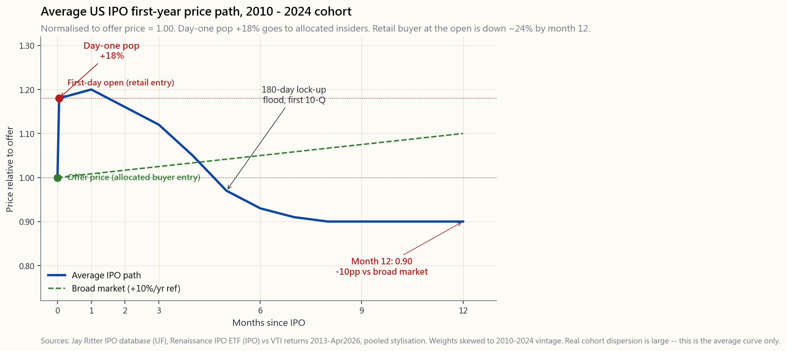
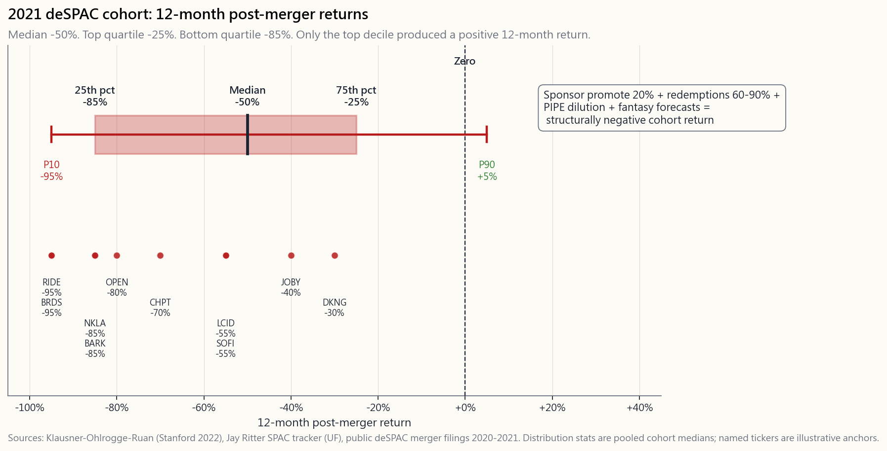

# 補充課程 13：首次公開發行與特殊目的收購公司——數字與炒作

---

## 第一部分：閱讀章節

---

### 1. 為何重要

在正常年份，美國交易所每年約有 150 至 250 家公司上市。在泡沫年份，這個數字接近 600 家。行銷材料——精緻的法說會簡報、CNBC 上激情洋溢的播報、券商平台上關於「樂透籤」配股的耳語——都是為了讓每一次上市看起來像是下一個亞馬遜。然而，出自佛羅里達大學 Jay Ritter 首次公開發行資料庫、涵蓋逾五千筆美國發行案例的數據，卻說了完全不同的故事：**在第一天買進的平均首次公開發行投資人，在隨後一年的表現落後大盤約 10 個百分點**，而且個別差異極為懸殊。

這是本課程中，兩個殘酷現實碰撞最為清晰的案例之一——*阿爾法極為罕見*，而且*非理性的你，可以把理性的你清算出局*。首次公開發行窗口的設計，就是要在有價證券交易史上最危險的價格點，從散戶投資人身上榨取亢奮情緒。了解這部機器如何運作，才能讓你不再成為它的原料。

這堂課獲得一個席位，有四個理由：

1. **第一天的漲幅不是給你的。** 2019 至 2024 年美國首次公開發行平均 +18% 的漲幅，幾乎全部流向了以發行價*獲配*股份的承銷商客戶。在股票掛牌開盤後才買進的散戶，是以*漲幅後*的價格買進——也就是說，他們才是支付那 +18% 的人。
2. **一年後的表現落後並非偶然。** 自 1980 年以來，在 Ritter 衡量的每個五年期間，這個現象都曾出現。文藝復興首次公開發行指數股票型基金（代號 IPO）——以系統化方式持有新掛牌股票——自 2013 年成立以來，每年表現落後 VTI 約 5%。
3. **特殊目的收購公司更糟糕，而且差距懸殊。** 2020 至 2021 年完成借殼合併的特殊目的收購公司，合併後 12 個月的中位數報酬約為 *-50%*。最差的四分之一接近 -85%。這不是雜訊；這是這種工具的結構性缺陷。
4. **散戶有一套清晰的操作手冊。** 等六個月。至少讀完一個季度的財報週期。然後像評估任何其他上市公司一樣評估這檔股票——以第 8 週（財務報表）和第 21 週（估值）的工具箱作為基礎。首次公開發行窗口是為交易員、配股者和保薦人設計的。*首次公開發行後*的市場，才是為投資人設計的。

---

### 2. 你需要了解的事

#### 2.1 傳統首次公開發行的實際運作方式

教科書版本是「公司向大眾出售股份」。真實的機制有六個步驟，以及三組理解價格行為不可或缺的誘因：

1. **公司聘請承銷商**——通常是由高盛、摩根士丹利、摩根大通或美國銀行領銜的承銷團隊。主承銷商從發行中抽取 5% 至 7% 的總承銷費用，並實際上決定定價。
2. **詢價建簿。** 在大約兩週的法說會期間，承銷商向約 100 至 200 家機構投資人展示簡報——包括大型共同基金、避險基金、主權財富基金。這些機構在不同價格水準提交認購意向。承銷商彙整「簿冊」——一條需求曲線。
3. **定價。** 掛牌前夕，承銷商與公司設定發行價。關鍵在於，承銷商*始終將發行價定在簿冊所能支撐的水準之下*——通常低估 10% 至 20%。這稱為刻意低估定價。
4. **配股。** 承銷商隨後*分配*股份——這是一個裁量性過程。股份流向受惠客戶：向券商支付最多佣金的機構、參與下一筆交易的機構、長期持有而不翻轉的機構。熱門交易中，散戶配股通常占簿冊不到 10%，且偏向承銷商的財富管理部門。
5. **掛牌日。** 股票在交易所開始公開交易，開盤價由交易所委託簿所能成交的價格決定。如果發行價定在 20 美元，且有真實需求，開盤價可能是 24 美元——漲幅 20%。機構配股帳面上即時獲得 20% 的報酬。
6. **閉鎖期。** 內部人士——創辦人、員工、首次公開發行前投資人——在合約上不得出售其持有股份，期間為 90 至 180 天。閉鎖期屆滿時，大量內部人士供給湧入市場。閉鎖期屆滿日在統計上與平均 1% 至 3% 的負報酬有關；最知名的首次公開發行有時跌幅更大。

承銷商的經濟邏輯是：收取 5% 至 7% 的承銷費用，將平均 +18% 的即時漲幅作為禮物送給受惠客戶，透過下一筆交易的手續費獲得回報，且從不承擔誠實造市商所應承擔的庫存風險。公司的經濟邏輯是：以首日市值 18% 的讓利，換取法說會、法規保護，以及機構股東基礎。在開盤後買進的散戶的經濟邏輯是：以漲幅後的價格買進，然後發現這個年份的*平均*首次公開發行在隨後一年將落後大盤 10 個百分點。

#### 2.2 第一天漲幅——為何存在，誰獲益

「平均 +18%」的首日漲幅，是資本市場中最穩定的實證事實之一。Ritter 對美國首次公開發行的持續追蹤平均值為：

- **1980 至 2000 年：** 平均首日報酬 +21%
- **2001 至 2018 年：** 平均首日報酬 +14%
- **2019 至 2021 年：** 平均 +37%（新冠疫情/特殊目的收購公司泡沫相關）
- **2022 至 2024 年：** 平均 +12%（泡沫後正常水準）

此現象持續存在的原因已有充分研究：

1. **資訊不對稱（Rock，1986）。** 承銷商無法在其簿冊中區分「知情」與「不知情」的買家。低估定價補償了不知情機構在被分配冷門交易時所承擔的風險。
2. **防止交易失敗的保險。** 一筆收盤價低於發行價的交易——「破發的首次公開發行」——會損害承銷商的商譽。低於公平價值 18% 的定價是廉價的保險。
3. **配股作為一種貨幣。** 承銷商將漲幅作為*禮物*送給受惠客戶。這將首次公開發行業務與手續費收入、主經紀商關係及未來交易參與捆綁在一起。散戶不向投資銀行支付手續費；因此散戶得不到這份禮物。

檢驗散戶是否能獲得漲幅的清晰測試：看*從首日開盤價*——散戶實際能買到的價格——到一年後的報酬。在 1980 至 2024 年的美國匯總數據中，這個數字約為**相對大盤 -10%**。+18% 的漲幅是公司付給獲配機構客戶的優惠券。散戶支付全額價格。

#### 2.3 一年表現落後的模式

Ritter 資料集的美國首次公開發行匯總紀錄，以首日*收盤價*衡量至 12 個月後，相對於相符規模/風格基準：

- **平均值：** 相對大盤三年累計表現落後 -10%，其中約一半落在第一年。
- **中位數：** 相對指數表現落後 -15% 以上——分布呈右偏態（少數大贏家拉高平均值）。
- **成功率：** 僅約 35% 在首日收盤價買進的首次公開發行投資人，在隨後 12 個月跑贏大盤。
- **工具代理：** 文藝復興首次公開發行指數股票型基金（代號 IPO）在首日收盤後買進所有美國首次公開發行股票，自 2013 年 9 月成立以來年複合報酬率約為 **9%**，而 VTI 在同一期間約為 14%——每年 5% 的差距，費用尚未計入。

首次公開發行表現不佳的原因並不神秘：

1. **時機選擇效應。** 公司在*對自身有利*的時機進行首次公開發行。當其所在類股正熱、近期營運數字亮眼時，它們選擇上市。而這兩個條件往往都會均值回歸。
2. **揭露但尚未消化的資訊。** 股票公開說明書（S-1）通常超過 200 頁，涵蓋風險、關係人交易及會計選擇。散戶不會閱讀。首次公開發行後的第一次法說會，通常是現實降臨的時刻。
3. **閉鎖期庫存壓力。** 內部人士持有大量無法出售的未實現獲利。市場對此心知肚明，並提前在閉鎖期屆滿前將賣壓計入價格。
4. **樂觀的預測。** 承銷銀行的賣方分析師須等待 25 天才能發布研究報告，而其初始覆蓋幾乎清一色為買入評等。主要銀行的第一次下調評等，往往是股價跌破的時刻。

陳馬的架構：首次公開發行市場是一場選美比賽，參賽者——公司——可以自行選擇登台的日子，他們的髮型師可以控制燈光。評審——在公開市場買入的散戶——是在表演已被精心安排後才到場的。這裡有承銷商、獲配機構，以及公司本身的阿爾法。對於漲幅後的買家而言，平均而言是*負*阿爾法。

同一論點有更深層的版本，將這堂課與整門課程連結起來。能帶來獲利的逆向交易，不是在第一天買進全新上市股票。而是買進*被拋棄*的名字：被指數剔除的股票、模型投資組合剛剛賣出的類股、本季無人問津的默默耕耘型企業。那些才是被動機器本身所創造、最清晰的錯誤定價，出現在生命週期的*另一端*，與首次公開發行截然相反。首日首次公開發行買進，是一種*看似*逆向——小型、新興、尚未被發現——但實際上是最擁擠的交易，整個法說會都是為了在有價證券交易史上最高的價格點，榨取你的熱情。相同的本能，卻是錯誤的方向。

再談規模的問題。任何特定年份中，大多數首次公開發行的市值低於 10 億美元，即使名義市值更高的公司，許多也尚未成熟——買賣價差寬、流通股本可被操縱、揭露薄弱、主要參與者並非投資人。這是我的「不碰低價股」原則，換了一個不同的標籤。無論是透過店頭市場掛牌、熱門首次公開發行，或借殼合併進入市場，10 億美元以下的範疇都是賭場等級；這條規則不在乎它從哪扇門走進來。如果你不會在公開交易所買進一家市值 4 億美元的微型股，你就不應該因為有人在上週把法說會簡報放在你面前，就買進一家市值 4 億美元的公司。標價一樣；只有行銷不同。

#### 2.4 特殊目的收購公司：2020 至 2021 年泡沫

特殊目的收購公司（SPAC）是一個空殼實體，以每股 10 美元的價格進行普通首次公開發行，將現金存放於國庫券，然後有長達兩年的時間尋找一家私人公司進行合併。合併完成後——即「借殼上市」事件——私人公司透過空殼公司成為上市公司。

重要的結構性特點：

1. **保薦人促銷股份。** 特殊目的收購公司的保薦人（組織空殼的團隊）以名義上的資本獲得首次公開發行後股權的 20%。這是一筆龐大的價值轉移，由目標公司的股東買單。
2. **贖回權。** 特殊目的收購公司股東可以在合併投票時以 10 美元贖回其持股，*並同時*保留附屬於原始首次公開發行單位的認股權證。這意味著，複雜的特殊目的收購公司套利交易基本上是無風險的：以 10 美元買入，在 10 美元加上國庫券利息後贖回，免費保留認股權證。避險基金主導這筆交易。到合併投票時，資產負債表上的現金往往已被贖回 60% 至 90%——這意味著借殼上市公司所宣傳的現金，實際上只剩下一小部分。
3. **預測。** 與傳統首次公開發行不同，特殊目的收購公司合併可以在委託書中納入前瞻性財務預測。這個監管漏洞在 2020 至 2021 年催生了驚人的幻想預測——尚未有任何營收的公司預測五年後的獲利高達數千萬美元。
4. **私募配股。** 私募股權投資（PIPE）通常在合併同時安排，以填補被贖回的現金。私募配股投資人通常以折扣價格獲得（每股 8 或 9 美元，相較於名義上的 10 美元），進一步稀釋公開股東的持股。

2020 至 2021 年的特殊目的收購公司熱潮，**僅 2021 年就產生了 613 筆特殊目的收購公司首次公開發行**，相較於同年 248 筆傳統首次公開發行。這些特殊目的收購公司大多以清算收場（未能找到合併對象），或完成了表現慘烈的合併。de Bakker / Klausner / Ohlrogge 的「SPAC 法律與迷思」論文，以及 Jay Ritter 的特殊目的收購公司追蹤研究，將 2020 至 2021 年世代借殼上市後 12 個月中位數報酬定在約 **-50%**，最差四分之一超過 **-85%**。

這個啟示是結構性的，而非週期性的：即使在沒有狂熱的情況下，特殊目的收購公司也會在標的業務有機會表現之前，將公開股東約 20% 至 30% 的價值轉移給保薦人和私募配股投資人口袋。2021 年的狂熱只是讓這筆轉移變得巨大。*理性*的交易，是避險基金所做的特殊目的收購公司套利；*散戶*的交易，是買進合併後的普通股，而那是結構性虧損的一方。

#### 2.5 直接上市——繞過承銷商的漲幅

Spotify（2018 年 4 月）、Slack（2019 年 6 月）、Palantir（2020 年 9 月）、Coinbase（2021 年 4 月）和 Roblox（2021 年 3 月）均透過**直接上市**公開發行——無承銷商、無配股、無首日漲幅、閉鎖期架構也與傳統方式不同。機制如下：

1. 公司像普通首次公開發行一樣提交 S-1 申請。
2. 現有股東可以在掛牌日直接在市場上出售持股。沒有發行價；交易所透過開盤競價決定第一筆成交。
3. 沒有承銷商買入股票以支撐交易，但銀行仍以財務顧問身分受聘，費用較低（通常為 1%，相較於 5% 至 7% 的首次公開發行承銷費用）。

經濟論據：直接上市避免了將 +18% 的漲幅留在桌上。在 Spotify 的案例中，公司估計，在傳統首次公開發行模式下，近 10 億美元的價值將流向承銷商的獲配客戶；直接上市將這部分價值留給了現有股東。

直接上市的實證記錄簡短且褒貶不一：

- **Spotify：** 開盤 165 美元，2018 年底跌至最低 109 美元（-34%），後來復甦，目前約 700 美元——自掛牌以來大致與那斯達克同步。
- **Slack：** 開盤 42 美元，2.5 年後被 Salesforce 以相當於 26.79 美元的現金收購。被收購前，其表現落後整體軟體指數約 30%。
- **Coinbase：** 開盤 381 美元，2022 年加密寒冬期間跌至 50 美元以下，跌幅超過 80%，此後隨加密貨幣市場復甦。
- **Palantir：** 開盤 10 美元，目前約 130 美元——此族群中少數明確的掛牌後贏家之一。

對於首次公開發行後的散戶投資人而言，直接上市的機制並不能改變*評估*問題。第一個財報週期仍然必須發生。估值仍然必須以未來現金流來合理化。新上市公司在首 12 個月表現不佳的基準機率依然適用。

#### 2.6 散戶操作手冊

三條規則。

**規則一：等待六個月。** 讓閉鎖期屆滿（90 或 180 天）。讓至少一個季度的財報以上市公司身分發布。讓賣方分析師啟動覆蓋，並讓第一次評等下調落地。大多數結構性庫存壓力在 90 至 180 天內消散；其餘在第一次財報不如預期後消散。從首日開盤到六個月後的預期報酬，在匯總數據中大致為*零*——等待並不會讓你錯過上漲；你只是略過了最嘈雜的窗口。

**規則二：像評估任何其他股票一樣評估這檔股票。** 一旦一個標的公布了一到兩季的公開財務數據，你就可以套用第 8 週（財務報表）和第 21 週（現金流量折現法）的工具箱。如果數據看起來不錯，且價格體現了可以捍衛的成長路徑，就像買任何其他股票一樣買進。如果價格仍然反映著首次公開發行當天的亢奮本益比，就放棄。

**規則三：如果你非得參與首次公開發行窗口，就把它當作彩券一樣定規模。** 任何單一新上市股票不超過投資組合的 1% 至 2%。視為第四層次/機會型配置。永遠不要使用槓桿。永遠不要用保證金帳戶買進首次公開發行股票。永遠不要用近期首次公開發行的一籃子股票取代你的指數化核心持股。

文藝復興首次公開發行指數股票型基金是一個可選工具，或許優於手工挑選首次公開發行股票（它分散投資於整個世代）。其記錄——相對 VTI 每年 5% 的差距——是*系統性*首次公開發行策略的最佳情境。典型散戶手工挑選的首次公開發行投資組合，在統計上更差，因為選擇偏差將選股推向最令人興奮（因此也是最高估）的名字。

---

### 3. 常見誤解

**1. 「我可以透過我的券商以首次公開發行價格買進。」** 幾乎肯定不行。熱門交易中的散戶配股遠低於簿冊的 10%，且集中在承銷商自己的財富管理部門。散戶平台上的「首次公開發行參與」功能是盡力而為；你通常只能在沒有其他人要的交易中獲得配股。

**2. 「首日漲幅證明公司被低估。」** 它只是證明*承銷商*刻意低估了交易定價——作為送給受惠客戶的禮物。這筆漲幅由公司支付，由獲配機構捕獲，而散戶幾乎錯過了。

**3. 「如果錯過首次公開發行，就錯過了漲幅。」** 文藝復興首次公開發行指數股票型基金在首日收盤後買進——與散戶投資人相同的進場點——且每年落後大盤約 5%。沒有任何系統性的「首次公開發行漲幅」是散戶能捕捉的；那 +18% 的漲幅在你能下單之前就已發生。

**4. 「特殊目的收購公司就像我能買進的私募股權基金。」** 不是。特殊目的收購公司保薦人以名義上的資本獲得 20% 的股權。真正的私募股權基金的普通合夥人收取 2% 管理費加 20% 績效費，隨時間歸屬，且普通合夥人與有限合夥人並肩投資。保薦人促銷股份是一次性的 20% 禮物，在合併首日就打擊了公開股東。

**5. 「贖回權保護特殊目的收購公司股東。」** 它保護的是*原始*特殊目的收購公司首次公開發行股東，他們可以在合併投票前以 10 美元取回資金。它不保護合併後的普通股股東——那些在次級市場以 15 美元買進借殼上市股票的人。到那個時候，現金已經不在了，認股權證已發出，稀釋已然確定。

**6. 「直接上市比首次公開發行風險更高。」** 它們*不同*，而非風險更高。沒有承銷商在早期買入股票以支撐交易，但也沒有第 90 天的閉鎖期供給洪流，以及沒有分配給獲配內部人士的禮物轉移。掛牌後的基本面在任何一種機制下都承擔了全部重量。

**7. 「我應該買下一個亞馬遜、谷歌或特斯拉的首次公開發行。」** 倖存者偏差。每一個亞馬遜背後，有 100 個 Pets.com、Webvan、eToys.com 和 Vonage。手工挑選首次公開發行的基準散戶報酬是負數；少數登月股票無法彌補。

**8. 「分拆就像首次公開發行。」** 不是，而且實證記錄截然相反：來自大型母公司的分拆股票，在隨後兩年中*跑贏大盤* 3% 至 5%（Cusatis-Miles-Woolridge，1993 及後續研究）。分拆有其專屬的補充課程；首次公開發行和特殊目的收購公司是本課程的主題。

**9. 「閉鎖期屆滿已在市場定價中反映。」** 部分是。當天本身通常與 -1% 至 -3% 的報酬有關；在最糟糕的標的——流通股本在閉鎖期前極少、內部人持股比例大的公司——進入閉鎖期屆滿前的拋售可達 10% 至 20%。市場知道它即將到來，但這並不能消除價格效應。

**10. 「只要透過指數股票型基金買進首次公開發行然後忘掉就好。」** 這是一個可以捍衛的立場。文藝復興首次公開發行指數股票型基金（代號 IPO）至少是分散且機械化的。只是要了解：你正在支付 0.60% 的費用率，以系統性地每年落後 VTI 約 5%。分散投資是真實的；阿爾法是負的。如果你想獲得因子曝險而不帶負阿爾法，直接持有 VTI 就好——下一個微軟已經在裡面了。

---

### 4. 問答

**Q1：2024 年首次公開發行的平均首日漲幅是多少？**

傳統首次公開發行約為 **+12%**，遠低於 2020 至 2021 年泡沫時期的 +37%，但與 1980 至 2024 年約 +18% 的長期平均值相符。

**Q2：典型的閉鎖期有多長？**

對於直接上市和越來越多的傳統首次公開發行，**90 天**現在已很常見。**180 天**仍是傳統首次公開發行的歷史慣例，也是最常見的。部分交易採用分階段解鎖——例如，90 天時解鎖 25%，其餘在 180 天時解鎖。

**Q3：文藝復興首次公開發行指數股票型基金是什麼，我應該買嗎？**

代號 IPO。在首日收盤後持有最大型的美國首次公開發行股票，每季再平衡，約兩年後剔除標的。費用率 0.60%。自 2013 年 9 月以來年複合報酬率約 9%，相較於 VTI 的約 14%——每年 5% 的差距。作為「首次公開發行作為一種資產類別」的診斷，答案是：不要超配。作為主動部位，除非你確實想要新上市公司的主題傾斜，且願意每年讓渡 5% 的報酬。

**Q4：我可以放空首次公開發行股票嗎？**

第一天不行——股票通常需要幾天才能完成交割並開放借券。等到你可以放空時，容易獲利的均值回歸交易往往已經發生了。部分避險基金透過個股選擇權或標的指數期貨來廣義地做空首次公開發行漲幅。一般而言，散戶不應放空新上市股票；熱門標的的借券成本可飆升至年化 50% 以上，且上漲風險是無限的。

**Q5：首次公開發行和現金增資有什麼區別？**

首次公開發行是公司*第一次*向大眾出售股份。現金增資（或二次增資）是公司已上市後的後續募資。現金增資通常以接近市價小幅折扣（3% 至 5%）定價，且*不會*出現首次公開發行 +18% 漲幅的模式，因為已經存在市場成交價格。選擇效應也不同——公司在需要現金時進行現金增資，這可能是一個負面訊號。

**Q6：當避險基金從特殊目的收購公司中獲利時，為何散戶卻虧損？**

它對買進*合併後普通股*的散戶（在次級市場以 15 美元買進借殼上市股票的人）是糟糕的。對於在 10 美元進行特殊目的收購公司套利的避險基金而言，它是*有利的*（贖回你的資金，保留免費認股權證）。這是兩種完全不同的交易。使套利奏效的結構——保薦人促銷股份、稀釋性認股權證、私募配股支撐——正是打擊合併後普通股的那個結構。

**Q7：在美國交易所上市的外國公司首次公開發行呢？**

外國發行人在美國掛牌的首次公開發行（尤其是中國公司——阿里巴巴、滴滴、瑞幸咖啡）大致具有相同的首日漲幅模式，但一年後表現更差，且財報造假風險顯著更高。你的可投資宇宙應以美國市場為基準；如果你必須碰外國首次公開發行，請將其視為第四層次機會型部位，並以更嚴格的規模限制配置。

**Q8：如何閱讀 S-1？**

如果你只讀三個部分：（1）風險因素——法律規定須揭露的所有可能出錯事項清單。（2）募資用途——公司計畫如何使用你所給予的資金（用於償債和套現讓內部人離場是壞事；成長性資本支出是好事）。（3）管理層的討論與分析——對財務狀況的文字說明，包括任何關於非經常性項目的說明。補充課程 02（解讀年度報告）的工具箱直接適用於 S-1；結構相似。

**Q9：稅務優惠帳戶中的首次公開發行呢？**

單一首次公開發行部位正是那種高波動性的機會型賭注，如果你打算持有，*應該*放入羅斯個人退休帳戶（Roth IRA）（稅務配置很重要）。預期報酬平庸，但波動性極大；在羅斯個人退休帳戶中的十倍報酬是永久免稅的。在應稅帳戶中的十倍報酬，在你出售時須支付 23.8% 的長期資本利得稅。話雖如此：這是你無論如何都會進行的部位的規模建議，而不是採取該部位的理由。

**Q10：互動實驗室能讓我看到什麼？**

它比較兩種策略：一位*獲配*投資人（以發行價獲得股份，捕獲 +18% 的漲幅），以及一位*散戶首日*投資人（以漲幅後的開盤價買進）。你可以設定假設的首日漲幅、第 6 個月閉鎖期屆滿的漂移，以及持有期間。實驗室計算在每種策略下，投入 10,000 美元的最終財富。預設設定重現了實證模式：獲配投資人在年末獲利，散戶首日投資人在年末虧損，幅度大致符合歷史上的 10%。

---

## 第二部分：YouTube 腳本

---

**影片標題：** 為何散戶在首次公開發行中虧損——而特殊目的收購公司的數字更糟 | 補充課程 13

**目標播放時長：** 約 14 分鐘

**主持人：**
- **陳馬**（教師）：解析結構與數據。
- **小魚**（學生）：提出散戶實際會問的問題。

---

**[開場]**

[VISUAL: Animated logo "Side Lesson 13 — IPOs and SPACs"]

**陳馬：** 小魚，你在某個星期二早上滑 X，一則熱門貼文出現了：「RoboNova 首次公開發行將於東部時間上午 10 點 30 分開始交易，昨晚定價 20 美元。」你有十分鐘。你怎麼做？

**小魚：** 我打開我的券商 App，開盤時放一張市價單，然後祈禱。

**陳馬：** 對。而那個——就是那個行為——正是首次公開發行機器所設計要榨取的東西。今天我們要看的，是在 RoboNova 定價 20 美元之後，到你下那筆單之間，究竟發生了什麼事。然後我們要看下那筆單的人所面對的數據。劇透：平均結果是負的。中位數更差。

---

**[第一段：誰獲得了漲幅]**

[VISUAL: image/side13_ipo_first_year.png]

**陳馬：** 這張圖是 2010 至 2024 年世代美國首次公開發行，以發行價等於 1 標準化後的平均首年價格走勢。交易定價在 1。等到公開交易開盤——也就是你螢幕上*看到*的價格——已經是 1.18。那個 18% 就是平均首日漲幅。

**小魚：** 一個早上漲 18%？

**陳馬：** 大約在交易定價到鈴聲響起之間的一個小時內。那個 18% 幾乎全部流向了承銷商在前一晚配股的機構客戶。詢價建簿的法說會、定價會議、耳語價格——這一切的存在，都是為了找出哪些受惠客戶將得到這份禮物。

**小魚：** 那散戶呢？

**陳馬：** 散戶在開盤時買進。散戶以 1.18 買進，而不是以 1。看看這張圖的其餘部分：線在第二個月小幅上升，在夏天隨著直接上市標的的 90 天閉鎖期解鎖而下滑，在第四到第六個月隨著傳統首次公開發行的 180 天閉鎖期供給洪流來臨，以及第一次盈餘不如預期而進一步下跌，最終在第 12 個月以發行價的 0.90 收場。

**小魚：** 所以獲配的投資人最終獲利——以 1 買進，以 0.90 賣出，但他們稍早已有那 18% 的漲幅。

**陳馬：** 獲配投資人在第一年結束時，相對發行價約虧損 10%，但他們是以發行價買進的。他們的損益是 0.90 與 1 之間的差距——資本虧損約 10%——*加上*他們在首日漲幅中賣出的任何股份的獲利。他們大多數人在這筆交易後仍是淨獲利的。開盤時買進的散戶以 1.18 買進。以 0.90 的最終價格計算，散戶損失約 24%，而同一期間大盤約上漲 10%。

**小魚：** 等等，24%？

**陳馬：** 大約。0.90 除以 1.18 約等於 0.76——相對你的買入價虧損約 24%。

---

**[第二段：漲幅為何存在]**

[VISUAL: Title card "Allocation as Currency"]

**陳馬：** 這個漲幅不是缺陷。它是設計的一部分。承銷商故意將定價設定在委託簿能成交的水準以下 20%。他們這樣做，是因為他們想給受惠客戶一個即時的帳面獲利。

**小魚：** 公司為什麼要讓他們這麼做？

**陳馬：** 因為公司希望其機構股東基礎由長期持有者而非短線翻轉者組成，而承銷商是通往那個股東基礎的守門人。公司把錢留在桌上——在最大規模的交易中高達數十億美元——以換取承銷商保證簿冊中充滿買進並持有的機構投資人。這個保證是否值得這個折扣，是另一個辯題；這也是直接上市存在的原因。

**小魚：** 那為什麼沒有更多公司選擇直接上市？

**陳馬：** 兩個原因。第一：直接上市只適用於非常知名的品牌——Spotify、Slack、Palantir、Coinbase——這些品牌不需要銀行來推動需求。一家無名的生技公司無法進行直接上市，因為不會有人出現在競價中。第二：對於創辦人而言，承銷銀行的關係比折扣更有價值，因為他們能獲得研究覆蓋、交易服務和未來的併購建議。這個生態系統會自我延續。

---

**[第三段：一年後的拖累]**

[VISUAL: line returning to the first-year chart, focusing on months 6-12.]

**陳馬：** 在開盤時買進的散戶，在第一年面對四個結構性逆風：

**小魚：** 說出來聽聽。

**陳馬：** 第一。時機選擇效應——公司在*對自身有利*的時機上市，此時其所在類股正熱、數字漂亮。這兩個條件都會均值回歸。第二。閉鎖期庫存壓力——內部人士 90 至 180 天不能賣，但市場知道供給即將到來。第三。賣方研究啟動——承銷銀行的每一位分析師都需要等待 25 天，然後全部寫「買入」報告。主要銀行的第一次非「買入」評等，往往是股價跌破的時刻。第四。作為上市公司的第一個財報週期——法說會數字與第一份季報之間的落差，是現實降臨的地方。

**小魚：** 這在指數數據中有所體現嗎？

**陳馬：** 文藝復興首次公開發行指數股票型基金，代號 IPO，自 2013 年 9 月以來年複合報酬率約 9%。VTI 在同一期間約為 14%。這是在一個*系統性、分散投資*的首次公開發行策略上，每年 5% 的拖累。手工挑選的散戶首次公開發行投資組合在統計上更差，因為選擇偏差將選股推向最令人興奮——因此也是最高估——的名字。

**小魚：** 而那個*感覺*像逆向操作的交易——在第一天買進閃亮的新名字——實際上是那天早上市場上最擁擠的交易。

**陳馬：** 對。真正的逆向交易是生命週期的另一端：被指數剔除的股票、模型投資組合剛剛賣出的類股、本季無人問津的默默耕耘型企業。那才是被動機器超調並在地板上留下錯誤定價的地方。首日首次公開發行買進，是穿著逆向外衣、被最大程度精心安排的交易。

**小魚：** 那規模呢？

**陳馬：** 大多數首次公開發行的市值低於 10 億美元。許多其他的，即使名義市值更高，也尚未成熟。我不在公開交易所買進市值低於 10 億美元的公司——買賣價差寬、流通股本可被操縱、揭露薄弱，主要參與者並非投資人。那是賭場等級。這條規則不在乎賭場等級是以店頭市場代碼、熱門首次公開發行，還是有高盛法說會加持的形式出現。數字一樣，規則一樣。

---

**[第四段：特殊目的收購公司]**

[VISUAL: image/side13_spac_blowups.png]

**陳馬：** 小魚，看看這個分布。這是 2021 年特殊目的收購公司世代借殼上市合併後 12 個月的報酬。中位數負 50%。前四分之一負 25%。後四分之一負 85%。

**小魚：** 那不是市場。那是屠宰場。

**陳馬：** 2021 年有 613 筆特殊目的收購公司首次公開發行，相較於 248 筆傳統首次公開發行。所以這是 2020 至 2021 年主流資金的走向，不是邊緣案例。而這個結構產生了這個結果。

**小魚：** 結構是什麼？

**陳馬：** 四個部分。第一：保薦人促銷股份——以名義上的資本獲得首次公開發行後 20% 的股權。這個稀釋在合併日打擊公開股東。第二：贖回——到合併投票時，精明的投資人已把 10 美元取回並保留了認股權證。特殊目的收購公司最初募集的現金有 60% 至 90% 已消失。第三：私募配股——私募股權投資，以每股 8 或 9 美元的折扣定價，以填補贖回的空缺，進一步稀釋公開普通股。第四：預測。特殊目的收購公司可以在委託書中納入前瞻性預測，而傳統首次公開發行不能。這在 2020 至 2021 年催生了前所未有的幻想預測——尚未有任何營收的公司預測五年後稅息折舊攤銷前獲利達數億美元。

**小魚：** 誰是贏家？

**陳馬：** 特殊目的收購公司套利者——以 10 美元買進、以 10 美元加國庫券利息贖回、免費保留認股權證的避險基金。他們的交易基本上是無風險的。輸家是在次級市場以 15 美元買進合併後普通股的散戶投資人。那才是那個接盤者。

---

**[第五段：直接上市]**

[VISUAL: Title card with five tickers: SPOT, WORK, PLTR, COIN, RBLX]

**陳馬：** 直接上市——2018 年的 Spotify、2019 年的 Slack、2020 年的 Palantir、2021 年的 Coinbase 和 Roblox。沒有承銷商買入交易。沒有分配給內部人士的持股。交易所舉行開盤競價；第一筆成交是委託簿清算的價格。

**小魚：** 結果比較好嗎？

**陳馬：** 褒貶不一。這個機制消除了將 18% 的漲幅作為禮物送給獲配客戶的問題。但它並不能改變*評估*問題。Spotify 在掛牌後九個月內下跌了 34%，之後才復甦。Slack 被以低於掛牌價 30% 的價格收購。Coinbase 在加密寒冬的谷底下跌了 80% 以上。Palantir 是這個群體中唯一一個跑贏的贏家。

**小魚：** 所以即使是更公平的機制，也無法打敗基準機率。

**陳馬：** 對。這個機制讓交易更公平。它不會讓公司成為一項好投資。

---

**[第六段：操作手冊]**

[VISUAL: cut to interactive/side13_ipo_lab.html in the browser.]

**陳馬：** 三條規則。規則一：等待六個月。讓閉鎖期屆滿。讓一個財報週期落地。從首日開盤到六個月後的預期報酬，基本上是零——等待並不會讓你錯過上漲；你只是略過了最嘈雜的窗口。

**小魚：** 規則二？

**陳馬：** 像評估任何其他股票一樣評估這檔股票。讀一下季報。跑一遍第 21 週的現金流量折現法。如果數據成立，且價格體現了合理的成長路徑，就買進。如果價格仍然反映著首次公開發行當天的亢奮，就放棄。

**小魚：** 規則三？

**陳馬：** 如果你完全忍不住，非得參與首次公開發行窗口——就把它當作彩券一樣定規模。每個標的最多占投資組合的 1% 至 2%。第四層次，機會型部位。永遠不要用保證金。永遠不要以近期首次公開發行取代你的指數化核心。

*(在實驗室中輸入：漲幅 = +18%，閉鎖期漂移 = -10%，持有期間 = 12 個月，資本 = 10,000 美元)*

**陳馬：** 看看這兩欄。獲配投資人最終持有 10,620 美元。散戶首日投資人最終持有 9,000 美元。那個差距——10,000 美元中的 1,600 美元——正好是以 1 買進和以 1.18 買進之間的差距，在相同的拖累下持有的結果。

**小魚：** 那理性與非理性的論點呢？

**陳馬：** 對。理性的你讀了 S-1，等了六個月。非理性的你看到了那則 X 貼文，打開了券商 App，向陌生人支付了 18% 的漲幅。擁有一套書面流程的全部意義，就在於讓理性的那個你來下單。

---

**[結語]**

[VISUAL: Summary card with three bullets:
- 首日買家支付了 +18% 的漲幅
- 首次公開發行平均首年拖累：相對大盤 -10%
- 特殊目的收購公司 2021 年世代中位數：合併後 -50%]

**陳馬：** 三個重點。第一：18% 的首日漲幅，是公司付給獲配機構客戶的優惠券。在開盤後買進的散戶，支付的是漲幅後的價格。第二：從美國匯總數據來看，平均首年首次公開發行買家落後大盤約 10 個百分點；文藝復興首次公開發行指數股票型基金系統性地呈現了同樣的拖累。第三：特殊目的收購公司在結構上更糟——保薦人促銷股份、贖回、稀釋、幻想預測——2021 年世代合併後 12 個月中位數報酬約為負 50%。

**小魚：** 所以操作手冊就是：等六個月，讀一份季報，然後把它當成任何其他股票來看待。

**陳馬：** 這就是操作手冊。首次公開發行窗口是為交易員、配股者和保薦人設計的。首次公開發行後的市場，才是為投資人設計的。選擇你要站在哪一邊。

[END CARD: "Side Lesson 13 — IPOs and SPACs"]