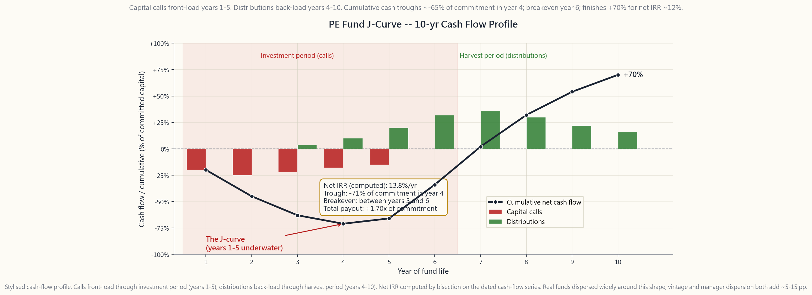
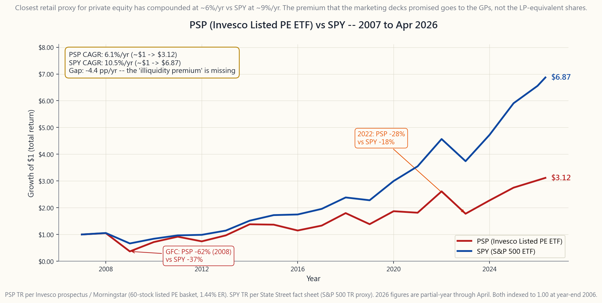

# 補充課程 14：私募市場 — 創投、槓桿收購、私募信貸與流動性溢酬

---

## 第一部分：閱讀章節

---

### 1. 為什麼這堂課很重要

私募市場——創業投資、成長型股權、槓桿收購與直接融資——根據 2025 年 Preqin／麥肯錫報告，全球管理資產規模已達約 **13 兆美元**，相較於世紀之交的約 1 兆美元大幅成長。如今，每一家大型券商、每一個智能理財平台示範，以及每一本精美的退休帳戶手冊，都把「另類資產」或「私募市場」列為投資組合的分散投資工具。阿波羅（Apollo）、黑石（Blackstone）、KKR、凱雷（Carlyle）與艾瑞斯（Ares）在過去十年間積極重新設計其配銷管道，透過區間型基金（interval fund）、非上市商業開發公司（non-traded BDC）、非上市不動產投資信託，以及要約收購型工具，觸及一般散戶的資金。銷售話術始終如一且極具吸引力：*更高報酬、更低波動性、真正的分散投資，以及那些造就大學捐贈基金的阿爾法。*

現實情況卻複雜得多。私募市場違反了兩條最嚴格的核心原則——阿爾法極為稀少，且可投資標的應以美國上市股票為主。私募市場中確實存在的阿爾法，幾乎全數由普通合夥人（GP）透過管理費與附帶收益（carry）所取走，留給有限合夥人（LP）的報酬——一旦修正槓桿、平滑效果與倖存者偏差後——在十年鎖定期內，與公開市場的小型價值股大致相當，難以區分。零售端的配銷版本（區間型基金、非上市商品、商業開發公司）繼承了高費用與低流動性，卻*失去*了篩選優質管理人的優勢，且多數產品扣除費用後都是虧損的。

這堂課之所以值得安排的四個理由：

1. **流動性溢酬在很大程度上是衡量上的假象。** 學術界估計私募股權相較公開市場股票「額外獲得」每年 3% 報酬的說法，一旦針對槓桿收購平均 1.5 至 2 倍的內嵌槓桿加以調整，並採用羅素 2000 價值指數等公開市場等效基準進行比對，便幾乎歸零。Phalippou（2020）、Stafford（2017），以及 L'Her 等人，各自採用獨立方法，得出了相同的結論：溢酬是付給 GP 的附帶收益，而非 LP 獲得的報酬。
2. **淨值平滑製造出虛假的低波動性。** 私募投資每季由 GP 進行市值評估，且常使用過時的可比交易數據。典型私募股權基金的報告波動性為每年 9 至 11%；而對同一批被投資公司，以可交易可比公司衡量的穿透波動性則高達每年 22 至 25%。大多數另類資產配置模型所依賴的「與公開市場低相關性」，幾乎是會計處理上的假象，一旦基金被迫以買價計值，這種假象便會消失。
3. **年份分散效果極為顯著。** 2006 年年份的私募股權基金在槓桿和價格雙峰時進行投資，在金融海嘯（GFC）中遭受重創；同一管理人、同一策略、2009 年年份的基金，年複利報酬卻高達 18%。同一年份內，前四分之一與後四分之一基金的報酬差距達 15 至 20 個百分點。管理人的選擇在私募市場比公開市場更為關鍵，*而散戶根本無法選到前四分之一的管理人。* 紅杉、Andreessen Horowitz、KKR 旗艦基金——這些對承諾金額低於 5,000 萬美元的投資人都是封閉的。散戶拿到的，是外溢的次級商品。
4. **零售包裝比機構原版更差。** 區間型基金、BCRED、BREIT、商業開發公司和非上市不動產投資信託，每年收取 1.5 至 2.0% 的管理費，加上 12.5 至 20% 的附帶收益，每半年設置一次贖回閘口，發放 K-1 稅務表格而非 1099 表格，在個人退休帳戶（IRA）中產生無關事業課稅所得（UBTI），而其扣除費用後的報酬——大致相當於公開市場股票與債券的 60/40 組合。上市的另類資產管理公司股票（BX、KKR、APO、CG、ARES、BN），以及追蹤私募股權的指數股票型基金 PSP，是唯一符合零售規範的工具，而 PSP 的紀錄令人警醒：自 2007 年以來年化報酬約 **6%**，同期 SPY 則約為 **9%/年**。

如果你來上這堂課，是希望被告知如何在私募市場致富，誠實的答案是：*你做不到，而向你兜售這個夢想的人，才是靠著兜售而獲利的一方。* 真正有意義的問題是：對上市另類資產管理公司股票進行小幅配置（5 至 10%），加上永遠不碰區間型基金或非上市商品，能否在分散投資的投資組合中站穩一席之地？我們最終會回答這個問題。

---

### 2. 你需要了解的事

#### 2.1 私募市場的四大支柱

私募市場不是單一資產類別，而是四種相互交疊的策略，各有其報酬輪廓、費用結構與零售可及性。

**創業投資（VC）。** 對早期階段私人公司進行股權投資——尚未有營收的種子輪、已驗證市場契合度的 A 輪、規模化的 B 輪／C 輪、上市前的後期階段。報酬呈現冪次法則分配（Cambridge Associates：65% 的創投基金報酬來自前 5% 的投資項目）。基金層級前四分之一 IRR 可達 25 至 35%/年；中位數基金 IRR 為 11 至 13%/年；後四分之一為*負值*。基金存續期：10 年，並可延長兩年。費用：2/20，多數基金設有約 8% 的最低報酬門檻。

**成長型股權。** 對盈利中、成長中的私人公司取得少數股份，這些公司太過成熟，不適合創投；又太過小型，不適合槓桿收購。典型交易：向一家營收 2 億至 10 億美元的公司投入 5,000 萬至 2 億美元。相較創投波動性較低（無冪次法則尾端，更多穩定成長型公司）。前四分之一 IRR 為 18 至 22%/年。

**收購型投資／槓桿收購（LBO）。** 典型的「私募股權」工具。私募股權公司以 50 至 70% 負債和 30 至 50% 股權收購成熟企業，經過 3 至 7 年的營運改善與附加收購後，再透過首次公開發行或出售給策略買家退出。報酬來自三個來源：（a）盈餘成長（GP 在行銷時宣傳的營運故事）、（b）乘數擴張（以高於買入價的企業價值/稅息折舊攤銷前獲利倍數出售）、（c）還債（自由現金流減少淨負債，提升股權價值）。槓桿放大了三者的效果。

**私募信貸／直接融資。** 由非銀行放款機構直接向中型市場企業（通常稅息折舊攤銷前獲利為 1,000 萬至 1 億美元，規模太小而無法進入廣泛聯貸市場）提供貸款。擔保浮動利率的優先擔保票據，利率為擔保隔夜融資利率（SOFR）加 500 至 700 個基點，附有契約條款與提前還款保護。基金存續期：封閉式 5 至 7 年，或透過商業開發公司結構設計為永久型。這是成長最快的支柱——從 2015 年的 5,000 億美元增長至 2025 年的 1.5 兆美元——受後《陶德-法蘭克法案》時代銀行撤出中型市場放款所驅動。

零售可及性地圖：BX（黑石）、KKR、APO（阿波羅）、CG（凱雷）、ARES（艾瑞斯）、BN（布魯克菲爾德）是上市的母公司。PSP（景順全球上市私募股權指數股票型基金）是多元化的指數股票型基金。ARCC、MAIN、OBDC 是上市商業開發公司。BREIT、BCRED、SREIT、KREST，以及品信-阿波羅的非上市商品，則是區間型基金工具。僅限美國上市的規則讓你可以接觸上市部分；非上市工具違反這項規則，可直接略過。

#### 2.2 基金生命週期與 J 型曲線

傳統的私募股權或創業投資基金，是存續期為十年的封閉型有限合夥事業。以下是重要機制：

1. **承諾。** 你簽署有限合夥協議，承諾向基金投入（例如）100 萬美元。*你目前尚不需要支付此金額。* 基金視需要提取資本。
2. **投資期（第 1 至 5 年）。** GP 進行 15 至 25 項投資，透過發出**資本通知（capital call）**向 LP 提取資金，通知期通常為 10 至 15 個工作日。典型提款時程：第 1 年約 15 至 25% 的承諾金額，第 2 年 20 至 25%，第 3 年 20%，第 4 年 15 至 20%，第 5 年提取剩餘部分。
3. **收割期（第 4 至 10 年）。** GP 透過首次公開發行、出售給策略買家、二次收購或股利資本重組退出投資組合企業。收益以**分配款**形式支付給 LP，通常集中於第 4 至 10 年，高峰期為第 6 至 8 年。
4. **清算期（第 10 至 12 年）。** 剩餘部位清算；邊際留置部位可在委員會核准下將基金延長至第 11 至 12 年。

LP 的累計淨現金流——資本通知（負）加上分配款（正）——形成一條 **J 型曲線**：前 3 至 4 年深度為負（已投入大部分承諾金額，但幾乎沒有任何回收），約在第 5 至 6 年轉正，並在第 9 至 10 年達到正向總回收的高峰。J 型的深度——累計現金流的最大回撤——通常為承諾資本的 60 至 70%。內部報酬率（IRR）是根據整個帶有日期的現金流序列計算而來；一個健康的 12% IRR 基金，在累計現金基礎上仍需歷經 4 至 5 年的水下期。

J 型曲線有其影響。（a）你不能以基金一年後的報酬來評判其表現——早期 IRR 都是雜訊。（b）你應跨年份分散投資以平滑曲線；連續五年每年承諾相同金額，可建構一個「自籌資金型投資組合」，讓第 N 年的分配款大致能支應第 N 年的資本通知。（c）資金被鎖定的隱含平均存續期間為 4 至 5 年，而非 10 年——承諾的加權平均額不會在完整十年間持續處於投入狀態。

#### 2.3 2 與 20 的費用結構

典型的私募股權／創投費用結構為 **2 與 20**：

- **每年 2% 的管理費。** 在投資期（第 1 至 5 年）以*承諾資本*計算，之後以*已投資資本*（或淨值）計算。在一個十年期基金中，管理費累計通常達承諾資本的 13 至 15%，不論績效如何，LP 在 GP 為其賺得任何一分錢報酬之前，已相當於每年支付了約 1.4 個百分點的*毛*報酬作為定期費用。
- **20% 的附帶收益**（「carry」）：針對超過 **8% 最低報酬門檻**的獲利收取，並附有**補足條款（catch-up provision）**，在 8% 至 10% 之間給予 GP 100% 的獲利（使 GP 「補足」至 20%），之後再適用 80/20 的分配比例。部分基金沒有最低報酬門檻，部分設有硬門檻（無補足條款）。門檻通常按年複利計算，並以已提取的資本（而非承諾資本）為基礎。

將此應用於一個在十年內產生 15% 毛 IRR 的基金。扣除約 1.5%/年的有效管理費，以及補足條款後超過門檻的 7% 中 20% 的附帶收益，LP 的淨 IRR 約為 **11 至 12%**——差距約 3 至 4 個百分點。若一個基金產生 8% 毛 IRR，LP 的淨值約為 6%/年——*低於上市小型價值股基準*，且需忍受十年鎖定期。在一個整體報酬僅 10% 的世界裡，費用的重要性遠高於 20% 報酬世界。

避險基金歷史上收取 2 與 20（無最低報酬門檻，採用最高水位線取代補足條款）；現代標準已壓縮至約 1.5 與 17.5。直接融資基金通常收取 1.0 至 1.5%，以及 10 至 15%（附 6% 門檻）。商業開發公司收取 1.5% 管理費，加上超過 7% 門檻的淨投資收益的 17.5 至 20%，且與封閉型基金不同，商業開發公司的費用是*永久*複利計算的（此工具永遠不會清算）。

#### 2.4 流動性溢酬——真實存在還是衡量失準？

私募市場的論據建立在**流動性溢酬**之上：即投資人願意鎖定資金十年，應獲得超越相同曝險在每日流動性下所能提供的超額報酬。理論上言之成理，但實證衡量充滿了陷阱。

**標題數字。** Cambridge Associates 與 Burgiss 均報告，1990 至 2024 年間，私募股權 IRR 約為 13 至 14%/年，而標普 500 為 9 至 10%/年——**標題溢酬為 3 至 4%**。這是大多數行銷簡報開頭引用的數字。

**槓桿調整。** 收購型基金的平均槓桿為投資組合企業層級的負債對股權比 1.5 至 2 倍。若將私募股權報酬去槓桿以匹配無槓桿公開基準，標題溢酬大約消失 1.5 至 2 個百分點。

**基準調整。** 收購型基金投資的企業，通常偏向小型股、偏向價值，且集中在美國。公平的公開基準*並非*標普 500——而是類似羅素 2000 價值指數，或規模與價值因子匹配的法馬-法蘭奇（Fama-French）建構指數。該基準在相同時窗內的年化報酬為 10 至 11%，又吞噬掉 1 至 1.5 個百分點的溢酬。

**平滑調整。** 私募股權淨值每季以可比交易估值進行評估，落後公開市場 2 至 4 季，且大幅低估真實波動性（報告的私募股權波動性為 9 至 11%/年；被投資企業的穿透波動性約為 22 至 25%/年）。一旦進行去平滑處理（使用 Geltner 去平滑轉換或 Stafford 的公開市場複製投資組合等技術），風險調整後的溢酬便崩潰至**接近零**。

**結論。** Phalippou（2020）使用公開市場等效方法、Stafford（2017）使用有槓桿的羅素 2000 價值複製策略，以及 L'Her、Stoyanova、Shaw、Scott 與 Lai（2016）都得出相同答案：**扣除費用後，在風險調整的基礎上，平均私募股權基金大致等同於有槓桿的小型價值股指數。** 流動性溢酬在理論上存在，對前四分之一的管理人而言在實踐中可能存在，但它*並非*任何人只要簽支票就能獲得的每年免費 3%。

#### 2.5 公開替代工具——PSP、BX／KKR／APO，以及商業開發公司的世界

如果機構商品在結構上因費用而受損，而零售商品在結構上因取得困難而受損，還剩什麼？三類上市股票，以每日流動性、美國上市、繳 1099 稅表（而非 K-1）的方式，提供了對私募市場生態系統的實際曝險。

**上市另類資產管理公司。** 黑石（BX）、KKR、阿波羅（APO）、凱雷（CG）、艾瑞斯（ARES）與布魯克菲爾德（BN）。你擁有的不是底層的私人投資，而是 GP 從管理他人資金中賺取的*費用流*。隨著管理資產從 1 兆美元成長至全球 13 兆美元，這些股票自各自首次公開發行以來已年化複利 12 至 18%（BX 2007 年、KKR 2010 年、APO 2011 年、CG 2012 年）。它們交易起來像是貝塔值 1.3 的金融股，附帶私募市場覆蓋；它們從費用相關收益中支付可觀股利；且提供對私募市場持續成長的營運槓桿曝險，而無需自己繳交 2 與 20。

**私募股權指數股票型基金（PSP）。** 景順全球上市私募股權指數股票型基金，代號 PSP，費用率 1.44%，持有約 60 檔全球上市的私募股權相關股票——上述 GP 的組合，加上公開上市的收購公司、商業開發公司，以及私募股權投資信託（主要為英國上市）。這是零售投資人可取得的最接近「私募股權指數基金」的工具。其歷史紀錄令人警醒。

PSP 的紀錄——自 2007 年以來約 **+6%/年**，而同期 SPY 約 **+9%/年**——幾乎完美地具象化了這堂課的核心論點。能向零售投資人*實際提供*私募市場曝險的工具籃子，複利報酬*低於*整體美國股市，且有更深的回撤與更集中的金融股風險。學術研究估計每年 3% 的溢酬，在 PSP 的紀錄中毫無蹤跡，卻出現在 BX、KKR、APO 和 CG 的營業收入中。

**上市商業開發公司。** 艾瑞斯資本（ARCC）、主街資本（MAIN）、藍貓頭鷹資本（OBDC）。這些是依 1940 年《投資公司法》監管的永久資本工具，向中型市場企業放款。它們支付 8 至 12% 的股利殖利率，分配至少 90% 的應稅收入，並以溢價或折價於淨值交易。ARCC 和 MAIN 是金字招牌，擁有 15 年以上的營運歷史，並在金融海嘯、新冠疫情和 2022 年的市場動盪中維持股利紀律。風險在於它們使用槓桿（法規上限為負債對股權 1:1），借款人集群依定義為投資等級以下，而股利取決於信用品質是否維持。在真正的經濟衰退中，預期有 30 至 50% 的回撤與 20 至 30% 的股利削減。

#### 2.6 零售包裝的問題——區間型基金、BCRED、BREIT

2018 年以來私募市場配銷中最熱門的領域，是**面向零售的永久型工具**——區間型基金、非上市不動產投資信託、非上市商業開發公司，以及要約型基金。銷售話術如下：以最低 2,500 美元投入機構品質的私募曝險，無需合格投資人資格，並提供季度流動性窗口。現實是，這些工具繼承了私募市場的所有問題，卻失去了機構的優勢。

**黑石房地產收益信託（BREIT）。** 非上市不動產投資信託，規模高峰達 700 億美元，管理費 1.25% 加上超過 5% 門檻的 12.5% 激勵費。季度贖回窗口上限為淨值的 5%；2022 年底贖回申請超過上限，BREIT 連續 **14 個月設置贖回閘口**。淨值由 GP 每月評估；同期可比的上市不動產投資信託指數下跌 25%，而 BREIT 僅將自身標記下調 7%。這種平滑效果最終在 2023 年底以一次 10% 的補提減值告終。

**黑石私募信貸基金（BCRED）。** 非上市商業開發公司，規模 800 億美元，管理費 1.25%，加上超過 5% 門檻的 12.5% 激勵費。季度贖回上限為淨值的 5%，季內每月上限為 2%。殖利率 9 至 10%；費用率加附帶收益加融資成本，每年合計約佔淨值的 4 至 5%，在 LP 獲得任何報酬前即已消耗。

**品信／阿波羅／KKR 等同類產品。** 每家主要 GP 現在都提供相同商品，費用類似，結構類似，行銷簡報幾乎如出一轍。

**上市商業開發公司和上市另類資產管理公司沒有這些問題。** ARCC 和 MAIN 在紐約證交所以每日價格交易，BX 和 KKR 亦然。費用內嵌於營運模型中，而非額外疊加。如果你想要私募信貸曝險，ARCC 是答案，而非 BCRED；如果你想要私募股權費用流曝險，BX 是答案，而非 BREIT。

#### 2.7 規模配置與四分法架構

私募市場在陳馬的四分法架構中處於何處？

**第一層（成長）。** 上市另類資產管理公司——BX、KKR、APO、CG——在此以小幅超配方式進入（合計部位 1 至 3%）。它們是具備私募市場長期成長趨勢的成長型股票。將其視為高貝塔金融股的子類股傾斜，而非私募市場的配置。

**第二層（收益）。** 上市商業開發公司（ARCC、MAIN）在此以小比例收益配置進入（投資組合的 1 至 3%）。8 至 10% 的殖利率，每月或每季分配，可完整以 1099 稅表申報。由於深度衰退時有尾部風險，應小規模配置。

**第三層（價值儲存）。** *不做任何私募市場配置。* 價值儲存看重的是持久性與價格透明性，而私募市場兩者皆不具備。

**第四層（機會型）。** 若你擁有頂尖管理人的進入管道，且有足夠財富跨越多個年份進行承諾，*理論上可站得住腳的*私募市場配置就在這裡。對零售投資人而言，答案基本上是「不行」。你可取得的包裝（區間型基金、非上市商品）並非機構商品；它們是稀釋的、高費用、設有閘口的版本。阿爾法極為稀少——這在這裡尤其適用。跳過零售包裝。

因此，乾淨的零售私募市場配置是：**上市另類資產管理公司（BX／KKR／APO／CG／BN 籃子，或 PSP）2 至 5%，上市商業開發公司（ARCC／MAIN）0 至 3%，非上市商品零配置。** 這就是整個計畫。任何向你推薦將 15% 配置於區間型基金的人，都是在把一個穿著分散投資外衣的費用流賣給你。

---

### 3. 常見誤解

**1. 「私募股權的表現優於公開市場股票。」** 扣除費用、槓桿調整，並與小型價值股基準比對後，平均私募股權基金大致與*有槓桿的羅素 2000 價值指數相當*。前四分之一基金確實有超越表現；後四分之一基金則是虧損。零售可及的商品，以中位數及以下的族群為主。

**2. 「私募股權波動性較低，所以是分散投資的工具。」** 報告的波動性是每季淨值平滑的衡量假象。以可交易可比公司衡量的穿透波動性，約是報告數字的 2 倍。「低相關性」也是同一個假象。在真正的市場壓力下（2008 年、2020 年、2022 年），私募股權淨值*跟隨*公開市場下跌，滯後 1 至 3 季。

**3. 「流動性溢酬是免費的午餐。」** 它是用 10 年鎖定期、不透明性、GP 的決定權，以及每年複利計算的 1.5% 管理費換來的。計算一下你所放棄的流動性的選擇權價值——這幾乎很少值得每年 1 至 2% 的報酬讓步。

**4. 「商業開發公司是債券的替代品。」** 它們是對中型市場投資等級以下貸款的有槓桿股權。2008 年，商業開發公司指數回撤 75%。它們支付股票般的殖利率，因為它們承擔股票般的風險。它們不是債券。

**5. 「區間型基金讓你以零售最低金額獲得機構進入管道。」** 它們讓你以零售最低金額獲得機構的費用結構。實際的底層投資組合通常是聯合投資或組合型基金的切片，而非機構所能取得的旗艦年份。贖回閘口確保了當你最需要資金時，你無法取回。

**6. 「頂尖的私募股權基金年複利達 25%。」** 頂尖的*同年份*基金確實如此。跨越 30 年和數十個年份，這其中包含相當程度的倖存者偏差（失敗的基金停止申報）。即便照單全收，你也需要進入管道——紅杉、Andreessen Horowitz、Vista、Thoma Bravo——而那樣的管道對承諾資本低於數億美元者是封閉的。

**7. 「群眾募資讓我能像創投業者一樣投資。」** 不行。真正的 VC 每個基金投入 25 至 30 筆，擔任董事會席位，協助招募高階主管，並有資本在勝出者的後續輪次中跟投。群眾募資投資人投入一筆 500 美元的金額，沒有治理權、沒有知情權，且在每一輪後續融資中都會被稀釋。

**8. 「附帶收益只是對技能的報酬。」** 附帶收益適用長期資本利得稅率（聯邦 20%，加上 3.8% 的淨投資收益稅），而非一般所得稅率（聯邦 37%），*即使它本質上是管理他人資金的報酬。* 這是私募市場中最大的稅務政策爭議，也讓你看清楚這個行業是如何形塑其自身規則的。

**9. 「我應該在 EquityZen 上買入 SpaceX／Stripe 上市前的股份。」** 這些是三級市場交易，以加價後的價格進行，沒有治理權、沒有知情權、有轉讓限制，且退出時程不確定。這些公司本身可能很出色，但作為買方的條件並不理想。

**10. 「私募信貸的殖利率高於公開市場信用，所以是更好的固定收益。」** 私募信貸殖利率較高，是因為借款人規模更小、多元性更低、槓桿更高，且貸款流動性不足。殖利率溢酬是風險溢酬，不是免費的錢。2009 年，私募信貸違約率高峰超過 10%，回收率為 35 至 45%（相比之下，公開交易高收益債券的回收率為 40%）。

---

### 4. 問答

**問題 1：什麼是「年份」，為什麼它如此重要？**

年份是基金完成首次募集並開始提取資本的那一年。2006 至 2007 年年份的私募股權基金（槓桿和價格雙峰期進場，接著遭遇金融海嘯）和 1999 至 2000 年年份（科網泡沫高峰，泡沫後）是史上最差的年份群。2009 至 2010 年年份（金融海嘯後買入，進場乘數低估）和 1991 至 1992 年是史上最佳年份。相同的管理人、相同的策略——只是進場環境不同。這就是機構 LP 為何選擇每年持續承諾，而非擇時市場的原因。

**問題 2：區間型基金和商業開發公司有什麼差別？**

區間型基金是依 1940 年《投資公司法》登記的封閉型基金，持有非流動性資產，但提供定期（通常為每季）以淨值進行的回購窗口。商業開發公司也是 1940 年法案的工具，但可組織為上市（每日交易）或非上市型式；商業開發公司主要向中型市場企業放款，並分配至少 90% 的應稅收入。上市商業開發公司是最乾淨的零售曝險方式。非上市商業開發公司（BCRED 等）繼承了區間型基金的流動性問題。

**問題 3：我應該投資非上市不動產投資信託，例如 BREIT 嗎？**

不應該。上市不動產投資信託（VNQ、IYR）能給你相同的曝險，具備每日定價、更低費用（10 至 15 個基點，相較 200 個基點以上的整體費用），且沒有贖回閘口。非上市版本「更低的波動性」是平滑效果的假象。BREIT 在 2023 年長達 14 個月的贖回閘口事件，正是你為此付出的代價。

**問題 4：2 與 20 的實際計算方式如何？**

以一個規模 1 億美元、毛 IRR 為 15%（因此十年毛回收倍數約為 4 倍）的基金為例。管理費：每年 2% × 1 億美元 = 200 萬美元，連續 5 年以承諾資本計算，加上第 6 至 10 年約 2% 的遞減淨值，合計約 1,300 萬美元的管理費。附帶收益：超過 8% 門檻獲利部分的 20%，附補足條款。LP 的淨 IRR 最終約為 **11 至 12%**，毛 IRR 為 15%。對一個毛 IRR 為 8% 的基金，同樣的計算結果使 LP 的淨 IRR 約為 5 至 6%——費用吃掉了大部分報酬。

**問題 5：為什麼上市商業開發公司可以，但非上市商業開發公司不行？**

上市商業開發公司（ARCC、MAIN）在紐約證交所以每日市場出清價格交易，充分反映供需。非上市商業開發公司以其自行計算的淨值為定價基準，而該淨值通常比同類上市商業開發公司的交易價格高出 5 至 15%。你以高估的淨值買入非上市商業開發公司，在該淨值上繳付 1.5% 加 17.5%，然後在贖回閘口啟動時才發現這個落差。上市版本對自身價值是誠實的。

**問題 6：什麼是「附帶收益」，相關的政治爭議為何與我有關？**

附帶收益是 GP 的 20% 績效費，適用長期資本利得稅率（聯邦 20% 加上 3.8% 的淨投資收益稅 = 23.8%），而非一般所得稅率（聯邦 37% 加上 3.8% 的淨投資收益稅）。估計每年對財政部的成本：140 至 250 億美元。在每次重大稅制改革周期中都政治上高度脆弱。從投資組合角度來看，這只有在你持有上市另類資產管理公司股票（BX、KKR 等）時才有關聯——附帶收益稅務待遇的改變將衝擊其淨收入與股價，值得在任何買入論點中特別標注。

**問題 7：私募信貸有類似 PSP 的工具嗎？**

沒有真正的對等工具。最接近的是上市商業開發公司群——ARCC、MAIN、OBDC、GBDC、PSEC。有一個以商業開發公司為重點的指數股票型基金（BIZD，VanEck BDC Income），管理費約 0.40%，加上底層商業開發公司的取得基金費用（約 7 至 8% 整體費用率），使 BIZD 的真實成本約為淨值的 8 至 9%。直接持有前 2 至 3 名商業開發公司更為簡潔。

**問題 8：什麼是「次級交易（secondaries）」，它是零售可及的機會嗎？**

次級交易是向原始 LP 購買現有的 LP 承諾，通常以折價淨值（歷史上為 5 至 30%）買入。專注次級交易的基金（Lexington、Ardian、Pantheon、Coller）是真正的機構策略。向零售行銷的「次級區間型基金」商品（如 Pantheon Private Equity Investors 等），繼承了區間型基金的問題，並因基金疊加費用而稀釋了策略效果。跳過。

**問題 9：為什麼 J 型曲線如此重要？IRR 不是已計入時間了嗎？**

IRR 確實計入了時間——它正好就是將現金流序列折現至零的那個利率。但 J 型曲線在操作上很重要：LP 需要為資本通知做好規劃（可能在 10 天通知後到來）、需要保留流動性儲備來支應這些通知，並需要在情感上接受 4 至 5 年間帳面上承諾資本「處於水下」的狀態。用於支應資本通知的準備資金，在等待期間大約只能賺取國庫券收益，拖累 LP 的*真實*報酬，遠低於基金報告的 IRR。計入準備資金的機會成本後，「真實」的淨 IRR 通常比行銷數字低 1 至 2 個百分點。

**問題 10：如果我要用一句話告訴朋友關於私募市場的事，那會是什麼？**

你聽說的溢酬是 GP 的，不是你的；你聽說的分散投資效果是淨值平滑的假象；而零售包裝的設計，是在假裝給你機構管道的同時提取費用。如果你想要曝險，就在公開市場買 BX、KKR、ARCC 和 MAIN，其他的一概略過。
