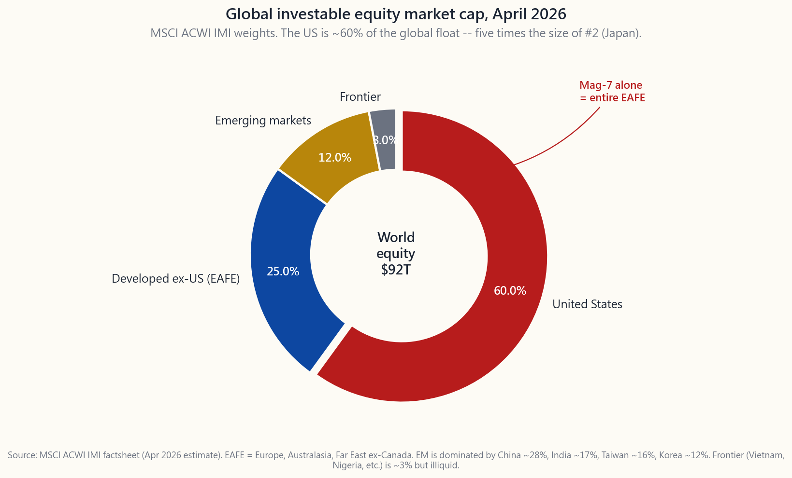
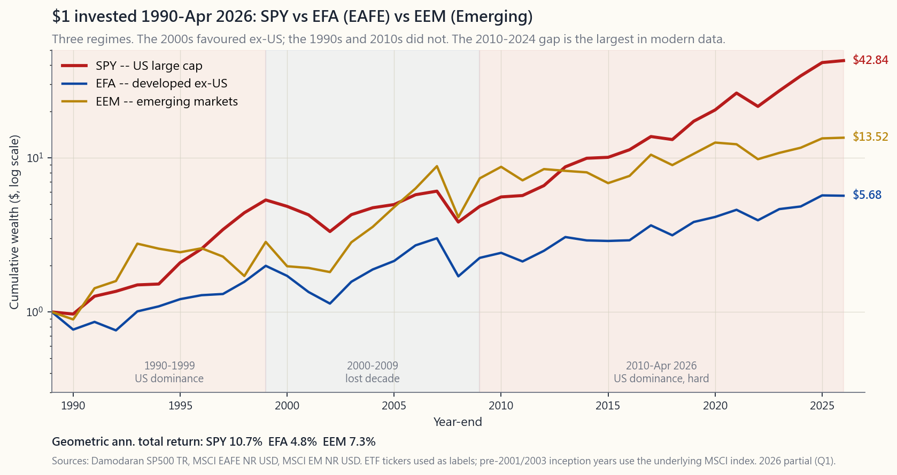

# 番外課程 18：全球市場——國際分散投資的正反論點

---

## 第一部分：閱讀章節

---

### 1. 為什麼這很重要

打開任何一本入門投資組合教科書，你都會看到同一句話：*美國約佔全球市值的 60%，因此一個適當分散投資的股票投資組合應持有其他 40% 的海外資產。* 聽起來顯而易見，幾乎像是一個同義反覆。本課程對這個結論持不同看法。番外課程 18 將解釋這個分歧，並給出整門課程其他章節所默默依賴的規則。

以下四個原因說明，這值得用整整一課來討論，而不是一個附注：

1. **本土偏誤的爭論，是大多數散戶投資人面臨的最重要資產配置問題。** 它比選擇哪種因子傾斜更重要，比主動式管理與被動式管理的選擇更重要——因為它控制了你股票曝險約四十個百分點。得出正確答案，比其他幾乎任何事情都更關鍵。
2. **「再平衡到國際」的反射動作，建立在倖存者樣本上。** 現代投資組合理論在 1950 至 1980 年代被奉為圭臬，彼時美國、英國、德國和日本市場在教科書所關注的維度上（自由流通、會計準則、法治）看起來大致相當。那不是當今投資人所處的世界。2022 年的俄羅斯與 2021 年的中國，並非邊緣案例——在足夠長的時間軸上，它們才是海外股票曝險最典型的結果。
3. **2010 至 2024 年美國對世界的績效落差並非雜訊。** 這是盈餘成長、資本形成與公司治理上的結構性分歧。推薦「40% 國際配置」的教科書模型，是以一個已不復存在的制度為校準基礎。
4. **本課程的可投資範疇規則，正是源於此處。** 其他每一課——從第 3 週的風險報酬溢酬，到第 24 週的機構配置範本——都隱含地將自身限制在美國上市的有價證券範疇內。這堂番外課程解釋了*原因*，讓這條規則在後續各週出現時，不會顯得武斷。

教科書的立場並沒有錯，只是不完整。誠實的答案是：國際分散投資能帶給你真實的數學效益——*但前提是*你所購買的外國市場與美國共享四項特質：法治、會計透明度、少數股東權益保護，以及深度的次級市場。以指數權重計算，「國際」部分約有一半無法達到這個標準。

---

### 2. 你需要了解的內容

#### 2.1 全貌：美國以外的「世界」有多大？

MSCI 全球可投資市場指數（ACWI IMI）是全球涵蓋範圍最廣的可投資股票基準。截至 2026 年 4 月，其權重大致如下：

- **美國——約 60%。** 市值約 55 兆美元，光是「七巨頭」的流通市值就相當於整個 EAFE 指數。
- **已開發市場（不含美國，即 EAFE）——約 25%。** 日本約 6%、英國約 4%、法國約 3%、加拿大約 3%、瑞士約 2.5%，以及德國、澳大利亞、荷蘭、瑞典、香港、新加坡、西班牙、義大利、丹麥、比利時、芬蘭、挪威、以色列、愛爾蘭、葡萄牙、奧地利、紐西蘭。
- **新興市場——約 12%。** 中國佔新興市場桶約 25-30%，印度約 17%，台灣約 16%，韓國約 12%，巴西約 5%，沙烏地阿拉伯約 4%，南非約 3%，墨西哥約 3%。
- **前緣市場——約 3%。** 越南、奈及利亞、肯亞、孟加拉、斯里蘭卡、羅馬尼亞、科威特（晉升前）、巴基斯坦、摩洛哥。前緣市場規模極小且流動性差，即便是機構投資人也鮮少將其視為真正的配置選項。

這張圖應讓你留下的核心直覺是：*全球市值由一個國家主導。* 這並非一直如此——1989 年日本泡沫高峰期，日本曾短暫成為全球最大股票市場，美國緊隨其後。四十年後，兩者的差距約為五比一。這個制度性轉變，比任何回測都更重要。

#### 2.2 績效紀錄，1990-2024：兩段時期，兩個故事

教科書支持國際分散投資的論點，嚴重依賴 2000 至 2009 年的「失落的十年」——那段 SPY 橫盤整理、EAFE 與新興市場顯著跑贏的時期。教科書說這段時期存在是對的，但從中外推則是錯的。

觀察同一組數據，更清晰的方式是：**1990 年至 2026 年 4 月**這段期間，大致可分解為三個制度。

- **1990-1999：美國主導。** SPY 年複合報酬約 18%，EAFE 約 7%，新興市場約 11%（1997 年亞洲金融危機在後期咬掉了一塊）。美國科技股的漲勢讓所有其他股票市場相形見絀。
- **2000-2009：國際主導。** SPY 年報酬率約 -1%（網路泡沫清算加金融海嘯）。EAFE 未避險約 +1%（受美元走弱助益）。新興市場約 +10%（金磚四國商品超級循環）。這是現代史上唯一一個持有美國以外股票有回報的十年。
- **2010-2024：美國強力主導。** SPY 約 +14%/年。EAFE 約 +6%/年。新興市場約 +4%/年。差距是現代數據中最大的——比 1990 年代還寬——由三件可能持續、也可能不持續的事情所驅動：軟體吞噬世界（有利於美國科技複合體）、頁岩革命（有利於美國能源獨立），以及美元走強（不利於未避險的美國以外持倉）。

這張圖的誠實解讀是：**領先地位曾輪換，沒有人知道接下來會怎樣。** 這也是陳馬的第一原則：*阿爾法難得；工具箱是投資組合建構。* 如果你無法預測哪個地區會在下一個十年勝出，教科書的標準回應是*按規模比例持有所有地區。* 本課程的回應不同，將在第 2.4 節解釋。

#### 2.3 貨幣層面

國際投資報酬包含兩個組成部分：標的股票的外幣報酬，加上外幣對美元匯率的變動。在單一年度內，這兩個部分在波動性上大致相當——各約 7-9%——而匯率的變動可以將正的本幣報酬翻轉為負的美元報酬，反之亦然。2014 至 2016 年（美元強勢）和 2022 年（美元極度強勢）傷害了未避險的美國以外持倉；2002 至 2007 年（美元弱勢）和 2017 年（美元弱勢）則有所助益。

你可以做貨幣避險。像 HEFA（避險 EAFE）和 DBEF 這樣的工具，透過購買滾動遠期合約來消除匯率風險。避險成本大約等於利率差異——在美國利率高於外國利率時，對歐元約每年 1%，對日圓則更多。從實證來看，在 10 年窗口期內，*貨幣效應平均接近於零*，但卻為未避險的國際股票增加了約 30-40% 的波動性。因此取捨很清楚：如果你在意年度間的雜訊就做避險；如果你有 10 年以上的投資時間且想要持有非美元資產的分散效益，就不做避險。大多數散戶層級的研究結論是「股票部位不做避險」。

本課程讓這個問題變得無關緊要，因為美國優先規則完全迴避了它。

#### 2.4 政治風險溢酬與可投資範疇規則

教科書沒有提出的論點，正是決定本課程配置規則的那個。國際股票——尤其是新興市場股票——承載著一類風險，它不會出現在任何標準的標準差、風險值或回撤統計中：*徵收*風險。教科書隱含地假設你隨時都可以賣出。

過去十年，這個假設破裂的簡短列表：

- **中國 2021 年。** 中共的「共同富裕」運動在六個月內抹去約 1.5 兆美元的中國科技股市值。滴滴在首次公開發行後數月內從紐交所下市。課外補習產業在一夜之間被監管命令宣告為非法。持有 FXI / KWEB 的散戶目睹了 50-70% 的回撤，沒有任何基本面催化劑——只有政策轉向。
- **俄羅斯 2022 年。** 烏克蘭入侵後，莫斯科交易所對外國賣家關閉長達數月。待交易恢復時，西方制裁實際上已使每一張俄羅斯上市股份對美國持有人而言毫無價值。指數提供商將俄羅斯權重歸零。約 500 億美元的外國持有俄羅斯股票被清零——不是市場驅動的回撤，而是政治命令。這是自 1959 年古巴革命以來最大的單一國家徵收事件。
- **香港 2020-2024 年。** 《國家安全法》及後續的資本管制收緊，已侵蝕香港曾經擁有的法治溢價。在當地上市的股票，如今正在反映五年前不存在的中國大陸政策風險。
- **土耳其 2018-2024 年。** 艾爾多安的非常規貨幣政策摧毀了里拉約 90% 的購買力。一支以里拉計算翻倍的土耳其股票，換算成美元後仍虧損三分之二。

這四個案例的模式相同：*美國上市投資人無法避險、未出現在歷史風險模型中、且無論以什麼價格都無法解倉的事件。* 這就是政治風險溢酬，而標準的股權溢酬數學無法捕捉它。

本課程的回應——「可投資範疇」規則——是**將所有推薦投資組合限制在美國上市的股票。** 這條規則有四根支柱：

1. **法治。** 美國法院執行合約，包括對政府的合約。第五修正案的徵收條款經過考驗，而且有效。
2. **會計透明度。** SEC 登記發行人依規申報並經 PCAOB 監督稽核的年報（10-K）和季報（10-Q）。以本國制度申報的外國私人發行人無法獲得同等的稽核保障。
3. **少數股東權益保護。** 德拉瓦州公司法擁有 200 年的判例法，保護少數股東免受控股股東的自利交易侵害。中國沒有。俄羅斯沒有。韓國在改善中，但尚未達到標準。
4. **深度次級市場。** 你可以在任何交易日、任何制度環境下，以緊縮的買賣價差出售美國上市股票。對於越南、奈及利亞或阿根廷，你無法這麼說。

這四根支柱是分散投資效益的*替代品*。你放棄了全球可投資機會集約 40% 的份額；作為交換，你得到一個在危機中真正能夠變現、且不會被政治決定沒收的投資組合。

#### 2.5 折衷方案：美國上市的存託憑證

拒絕持有 EFA / VXUS / VWO，並不意味著拒絕持有非美國公司。折衷方案——也是本課程其他章節所默默假設的——是**美國上市的美國存託憑證（ADR）。**

ADR 是外國公司的美國上市股份，向 SEC 登記、由美國銀行託管，並受美國法律管轄。在紐交所購買台積電（TSM），實質上比在台灣證券交易所購買 2330.TW 更安全——標的業務相同，但美國上市強制 SEC 申報，美國法院擁有管轄權，股份透過與蘋果（AAPL）相同的 DTC 基礎設施交割清算。

符合本課程可投資範疇的高品質 ADR 精選名單：

- **TSM** — 台積電。在先進邏輯晶片代工領域實質上是獨占地位，是地球上最重要的半導體企業。
- **ASML** — 荷蘭極紫外光（EUV）微影設備製造商。是製造所有先進晶片所需機台的唯一供應商。自 1995 年起在那斯達克上市。
- **SAP** — 德國企業軟體龍頭。
- **NVO** — 諾和諾德（Novo Nordisk），丹麥 Ozempic 製造商。
- **TM / SONY / HMC** — 高品質日本出口企業。
- **SHOP** — Shopify，在加拿大設立但於紐交所上市。

第二梯隊因政治風險覆蓋層需要特別說明：**BABA、JD、PDD、BIDU、NIO** 是美國上市的中國 ADR。它們具有美國的外殼，但標的資產位於中國大陸境內，並採用可變利益實體（VIE）結構，這種結構從未在中國全面徵收事件中接受過考驗。對它們的倉位管理應像創投押注，而非核心股票部位。

需要內化的操作概念：*可投資範疇由上市地點定義，而非由公司在哪裡經營業務。* TSM 在列。同一家公司的台灣上市股票（2330.TW）不在列。兩者都是對同一條生產線的請求權。

---

### 3. 常見誤解

1. **「全球市值 60% 是美國，所以我的投資組合應持有 60% 的美國資產。」** 這是教科書的配方。它假設全球市值的每一分錢都同樣可以投資。實際上並非如此。
2. **「國際投資因為相關性低，是免費的分散投資效益。」** 過去十年 SPY 與 EFA 的相關性約為 0.85——高到從分散投資數學中獲得的波動性降低幅度可能只有 1-2%，而非教科書所稱的 5% 以上。
3. **「新興市場成長更快，必然跑贏。」** 數十年的數據顯示，GDP 成長與股票報酬率基本上不相關。中國 GDP 從 2000 至 2020 年成長了 10 倍，而 MSCI 中國指數在此期間年報酬率約為 5%。
4. **「如果我不持有 VXUS，我就沒有充分分散投資。」** 你是*集中在美國法律管轄區。* 這是一個刻意的選擇，而不是偶然。這是取捨，而非錯誤。
5. **「貨幣避險太複雜，懶得管。」** 它已內建在指數股票型基金中。HEFA 收費 35 個基點。那就是避險的成本——如果你需要，隨時可用。
6. **「俄羅斯 2022 年是一次性事件。」** 這是現代史上最大的單一事件，但中國 2021 年和香港自 2020 年以來的緩慢重新定價，都屬於同一類風險。基礎發生率比表面看起來更高。
7. **「ADR 與本地上市股票沒有差別。」** 兩者有相同的經濟曝險，但法律曝險存在實質差異。美國上市是一層真實的保護。
8. **「中國 A 股現在可以投資了，因為 MSCI 已納入它們。」** MSCI 的指數決策關乎基準涵蓋範圍；它不賦予法治保障。2017 年 A 股納入並未改變散戶持有人在 2021-2022 年管控期間，面對 YY、滴滴或網易所遭遇的事情。
9. **「買 EAFE 是安全的——那都是已開發市場。」** EAFE 比新興市場安全，但仍承載貨幣風險，以及集中的單一國家風險（日本在 1989 年佔 EAFE 的 70%；英國在 2000 年佔 30%）。EAFE 內部的分散程度參差不齊。
10. **「國際分散投資能保護我免受美國崩盤的衝擊。」** 2008 年金融海嘯期間，EAFE 跌幅 -43%，新興市場跌幅 -53%，而 SPY 跌幅 -37%——三者中*最大的*回撤出現在美國以外。分散投資的效益偏偏在你最需要它的時候失靈。

---

### 4. 問答章節

**問：如果我遵循美國優先規則，TSM、ASML、BABA 這些可以持有嗎？**
答：TSM 和 ASML 是可以的——它們是 SEC 登記、美國上市的，你對存託憑證擁有類似德拉瓦州法律風格的請求權。BABA 則介於可以與不可以之間——外殼是美國的，但底層的 VIE 結構位於中國大陸境內，從未在全面徵收事件中接受考驗。像機會性部位一樣配置 BABA 這類股票，而非核心股票。

**問：那 VXUS 或 VEU 作為核心持倉呢？先鋒（Vanguard）正是針對散戶銷售它們。**
答：它們是完全可用的產品。本課程的規則並非說它們不好；而是本課程的風險報酬數學刻意將其排除在外。如果你選擇持有 10-20% 的 VXUS，你的年複合報酬率看起來將近似本課 1990-2024 年的圖表——即過去 15 年低於純美國配置，但在 2000 年代初期較高。你是在做教科書式的交易。

**問：如果我認為美國可能像 2000-2009 年那樣跑輸十年，針對美國優先集中風險，什麼是正確的避險方式？**
答：三個答案。第一，四象限框架已包含一個價值儲存配置——黃金、實物資產——這些資產與貨幣無關。第二，美國跨國企業（AAPL、MSFT、PG、KO）的營收有 50% 以上來自海外，因此 SPY 本身在經濟曝險上已有一半是國際化的。第三，如果你真的想要完整的匯率／地區分散投資，最乾淨的表達方式是持有 GLD 加上少量商品部位，而非 VXUS。

**問：美國上市的外國公司 ADR 需要繳交外國預扣稅嗎？**
答：是的。託管銀行依外國來源稅率扣繳（大多數租稅協定下為 15%，某些情況為 30%）。在應稅帳戶中，你可以在 1116 表格申報外國稅額扣抵。在個人退休帳戶（IRA）中，預扣稅是永久性的且無法取回——這也是本課程建議在應稅帳戶而非遞延課稅帳戶持有國際曝險部位的原因之一。稅務配置課程將詳細介紹這一點。

**問：VWO 和 EEM 有什麼不同？兩者都是新興市場指數股票型基金。**
答：同一資產類別，不同指數提供商。VWO 追蹤富時（FTSE）指數（含韓國），EEM 追蹤 MSCI 指數（不含韓國）。VWO 費用率為 0.08%，相較於 EEM 的 0.70%，這個成本差異足夠重要。如果你確實持有新興市場，VWO 是正確的工具。

**問：2018-2019 年 MSCI 納入的中國 A 股，比香港上市的中國股票更安全嗎？**
答：*更不*安全。A 股在上海和深圳交易所交易，受中國大陸法律約束的程度甚至超過香港上市股票。2017 年的納入決策是 MSCI 的基準涵蓋決定，而非可及性的提升。資本管制限制了你在危機中的賣出能力。堅決回避。

**問：這堂課的內容如何與陳馬的槓鈴原則相符？**
答：槓鈴原則說*結合便宜且安全的 + 彩票型部位 + 中間什麼都不要。* 美國優先規則適用於便宜且安全的那端：VTI、SCHD、TLT——全部美國上市。彩票型部位那端允許納入非美國名稱（少量 TSM 或 ASML 部位），因為這些倉位的大小像選擇權，而非核心部位。槓鈴的中間地帶——以 40% 權重持有國際指數基金——正是本框架所排除的。

**問：什麼單一數字能改變我的看法？**
答：美國與下一大市場（稱之為日本或英國）之間的政治風險溢酬出現持續性縮小。具體而言：如果英國的公司治理評等、會計透明度和合約執行力與美國水準趨同，加上匯率避險成本崩潰，再加上出現持續性的 20% 以上估值折價，那麼這個交易就變得有趣。這些條件目前沒有一個成立。

**問：美國本身難道不存在政治風險嗎？聯邦貿易委員會（FTC）、反托拉斯、加密貨幣打壓、關稅政策？**
答：是的——美國並非零政治風險。但量級差距很大。反托拉斯的解套會被訴訟數年，且受到謝爾曼法和德拉瓦州判例法的約束；它看起來不像中國 2021 年的管控行動。本課程的主張不是「美國是安全的」——而是「在法治軸線上，美國實質上比其他替代方案更安全。」

**問：我的 401(k) 帳戶裡已經持有 VXUS，而且很難輕易處理掉。怎麼辦？**
答：不要跟你的退休計畫對抗。401(k) 的雇主配對（稅務外殼勝過選股）的價值超過每一元的 50%；不要為了執行一個 5 個百分點的配置規則而犧牲它。如果你的退休計畫菜單提供 VXUS 但沒有乾淨的純美國均衡基金，就在 401(k) 裡持有 VXUS，同時讓*應稅帳戶*傾向美國優先，使整體家庭配置達到目標比例。

**問：最後一個問題——如果我使用互動面板的全球混合工具，我應該預期看到什麼？**
答：三件事。第一，幾乎任何合理的美國重倉配置（70-100% VTI），在 1990-2024 年的回測中，年複合報酬率都勝過按市值加權的配置（60% VTI / 28% VXUS / 12% VWO），幅度約為每年 1-2%。第二，夏普比率的差距比年複合報酬率的差距更小——國際配置確實降低了一些波動性。第三，最大回撤線的移動幅度比你預期的更小：金融海嘯和新冠疫情的回撤無處不在。即便在疊加政治風險溢酬之前，數據就已支持更多美國，而非更少。
