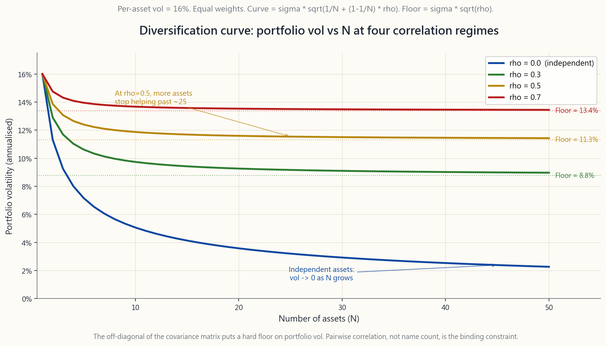

# 補充課 19：相關性數學——分散投資的真正作用（以及何時失效）

---

## 第一部分：閱讀章節

---

### 1. 為什麼這很重要

分散投資是金融領域最接近免費午餐的概念，但這頓午餐是數學性的，而菜單也有其限制。多數散戶投資人對「不要把所有雞蛋放在同一個籃子裡」只有模糊的概念，從未真正推導過風險如何在代數上合併。本課補足這個缺口。一旦你能寫出投資組合變異數公式，以下四件事就不再神秘。

1. **持有更多股票代號不等於分散投資。** 同時持有五十檔美國大型股，*並不能*提供五十種資產的風險降低效果。實際上大約只有兩點五倍——因為它們之間的兩兩相關性約為 0.6，而這個數字為投資組合波動性設下了硬底板，無論你再疊加多少個名字都無法突破。
2. **共變異數矩陣才是關鍵輸入。** 均值-變異數最適化、風險平價、第 52 週的四壘堡壘框架——在機械層面上，它們都是在篩選共變異數矩陣的非對角線元素。如果你對這些數字沒有直覺，你所讀到的每一種「最適化」配置都只是黑盒子。
3. **相關性並不穩定——它在崩盤時會飆升。** 投資組合數學中最令人不安的事實是：你在平靜市場中測量到的分散效果，並不是你在壓力情境下實際得到的效果。2008 年 10 月、2020 年 3 月、以及 2022 年通膨環境，是同一個算式的三次示範：當市場最需要分散工具時，平靜時期 0.2 的相關性會向 1 收斂。
4. **四十年的市場環境可以在一個季度內翻轉。** 從 2000 年到 2021 年，股票與債券的相關性維持在約 -0.4。2022 年翻轉至 +0.3，60/40 投資組合一年內虧損 17%。這次翻轉事前可透過滾動相關性察覺；數學給你一個可以盯住的數字，而非僅是一種感覺。

互動面板讓你拖動兩個滑桿——資產數量與兩兩相關性——並即時觀察投資組合波動性、分散化比率與有效資產數的變化。靜態圖表則以歷史數據為你紮根：2002 至 2026 年的 SPY/TLT 滾動相關性圖，以及分散化曲線——該曲線顯示為何兩兩相關性（而非資產數量）才是真正的約束條件。

---

### 2. 你需要掌握的知識

#### 2.1 投資組合變異數公式——sigma_p^2 = w'Sigma w

金融中所有的投資組合風險計算，最終都可歸結為一個恆等式。對於一個持有 $N$ 種資產、權重向量為 $w$、共變異數矩陣為 $\Sigma$ 的投資組合，其投資組合變異數為：

$$ \sigma_p^2 = w' \Sigma w = \sum_{i=1}^{N} \sum_{j=1}^{N} w_i w_j \sigma_i \sigma_j \rho_{ij} $$

雙重加總看似複雜，但結構其實簡單：

- **對角線**項（$i = j$）給出 $w_i^2 \sigma_i^2$。這些是每種資產自身波動性的貢獻，隨著你將權重分散到更多資產而縮小——對於 $N$ 個等權資產，各自波動性為 $\sigma$，對角線貢獻為 $\sigma^2 / N$。
- **非對角線**項（$i \ne j$）給出 $2 w_i w_j \sigma_i \sigma_j \rho_{ij}$。這類項共有 $N(N-1)$ 個，除非相關性 $\rho_{ij}$ 夠小，否則它們*不會*隨 $N$ 縮小。

這就是分散投資的完整故事，濃縮成一句話：**分散投資的好處完全來自非對角線項，而當非對角線項很大時，它就不再發揮作用。**

對於最簡單的情況——$N$ 個等權資產，各自波動性為 $\sigma$，所有兩兩相關性均為 $\rho$——公式化簡為：

$$ \sigma_p = \sigma \cdot \sqrt{\frac{1}{N} + \left(1 - \frac{1}{N}\right) \rho} $$

這個方程式就是分散化曲線圖所繪製的內容。

#### 2.2 分散化底板——為何增加更多名字不再有用

對上述公式取 $N \to \infty$ 的極限。第一項趨近於零，第二項趨近於 $\rho$。因此：

$$ \lim_{N \to \infty} \sigma_p = \sigma \cdot \sqrt{\rho} $$

大聲念出來：**無論你持有多少資產，所能達到的最低投資組合波動性，就是 sigma 乘以 sqrt(rho)。** 在 $\sigma = 16\%$（美國大型股的典型值）時：

| 兩兩相關性 | 底板波動性（大 N 時） |
|---|---|
| 0.0  | 0%（理論上如此，實際上永遠達不到）|
| 0.1  | 5.1% |
| 0.3  | 8.8% |
| 0.5  | 11.3% |
| 0.7  | 13.4% |
| 0.9  | 15.2% |

美國大型股在平靜環境下的平均兩兩相關性約為 0.6，這將底板設在約 12.4%——而你大約在持有 25 至 30 個名字時就達到了 90%。繼續疊加第 31 到第 500 個名字，幾乎買不到任何額外的風險降低。

對散戶投資人的意涵是：「五十檔不同的美國科技股」投資組合，並不是五十種資產。就風險而言，它大約只等同於兩點五種資產（$\rho \approx 0.7$）。

#### 2.3 相關性並不穩定——危機收斂

更深層的問題在於，公式中的 $\rho$ 是*經驗性*的，而非常數。兩兩相關性本身是隨時間漂移的隨機變數，而這種漂移並非隨機——它以一種特別殘酷的方式依賴市場環境。

在正常市場中，股票間相關性聚集在 0.4 至 0.6，從 2000 年到 2021 年股票與債券的相關性接近 -0.4，國際分散投資在已開發市場相關性方面提供約 0.7 至 0.85 的數值。而在危機中，所有這些數字都向 +1 移動。

- **2008 年（雷曼／全球金融危機）。** 美國與國際股票相關性，平靜基線約 0.80，在 2008 年 10 月高峰達 0.95。投資等級信用與股票的平靜相關性約 0.20，在雷曼事件後的四週內升至 0.85。
- **2020 年（3 月 COVID 崩盤）。** 除現金與長期公債以外，幾乎所有資產都同步波動。標普 500 與新興市場股票相關性，正常情況下為 0.7，在五週拋售期間達到 0.97。甚至黃金也在最慘烈的一天（3 月 16 日）短暫隨股票下跌，原因是追繳保證金迫使投資人出售流動性資產。
- **2022 年（通膨環境）。** 長天期公債——過去二十年的教科書式股票避險工具——自 1969 年以來首次與股票同步下跌。SPY/TLT 的 90 日滾動相關性在八週內從 -0.40 翻轉至 +0.30，並在年底前維持正值。

這個現象在學術文獻中有一個名稱：*相關性崩解*（或更精確地說，*壓力下的相關性收斂*）。其技術機制是：在強制去槓桿化期間，每個槓桿帳戶出售的是流動性好的資產，而非被高估的資產。這使得資產價格同步移動，原因是它們都被同樣的資金流推動，而非由其基本面所驅動。

#### 2.4 滾動相關性——值得盯住的風險指標

靜態歷史相關性是長期平均值。對投資組合建構而言真正重要的，是*當前*相關性，而估計它的標準方法是使用滾動窗口：

$$ \rho_t^{(90)} = \mathrm{corr}\big(r_{t-90:t}^{A}, r_{t-90:t}^{B}\big) $$

以日報酬率計算的 90 日窗口是機構預設標準——長到足以具有統計穩定性，短到能在一個季度內偵測出環境轉變。較短的 30 日窗口雜訊過多；較長的 252 日窗口則會滯後實際環境變化數月。

SPY/TLT 滾動相關性是典型案例。從 2002 年到 2021 年，平均值在 -0.30 至 -0.45，在 2013 年（縮減恐慌）和 2018 年（第四季升息恐慌）期間曾短暫接近零。隨後在 2022 年第一季穿越零軸，在 2022 年中高峰超過 +0.50，此後在 -0.10 至 +0.30 的區間震盪。2026 年 4 月的讀數約為 +0.10——與 2010 年代 -0.40 的基準有顯著差異。

這張圖的實際用途是：如果你持有 60/40 投資組合，滾動相關性告訴你目前*實際*獲得多少分散化效益。相關性為 -0.4 意味著你的債券正在發揮實質作用；相關性為 +0.3 意味著債券大致上只是在股票風險之上疊加存續期間風險。

#### 2.5 蒙地卡羅直覺——10 種資產、兩種相關性環境

感受這個公式最直接的方法是模擬。取 10 種資產，每種年波動性為 16%（美國大型股的長期數值），各自持有 10% 的等權重。執行兩個情境：

- **獨立資產**（$\rho = 0$）：投資組合波動性 = $\sigma / \sqrt{N} = 16\% / \sqrt{10} \approx 5.1\%$。降低了 3 倍。
- **相關資產**（$\rho = 0.5$）：投資組合波動性 = $\sigma \sqrt{1/10 + 0.9 \cdot 0.5} = 16\% \cdot \sqrt{0.55} \approx 11.9\%$。降低了 1.3 倍。

50% 相關的投資組合僅獲得不相關投資組合*四分之一*的分散化效益。在 N 很大的極限下：

- 獨立資產：波動性 $\to 0$。
- $\rho = 0.5$ 資產：波動性 $\to \sigma \sqrt{0.5} = 11.3\%$。

如果「資產」的菜單是「五十檔美國大型股」，你的有效相關性接近 0.6，底板約為 12.4%，而在持有約 25 個名字後，繼續增加名字只是裝飾。

如果菜單是真正相互正交的資產——股票、長期公債、短期公債、黃金、管理期貨、選擇權型防禦策略——那麼你是在運用槓鈴策略與四壘框架，將*各類別間*的相關性壓低至接近零，即使每個壘內部的相關性偏高。

#### 2.6 兩個實務意涵

第一，**跨資產類別分散投資的理由，遠強於跨個股分散投資的理由。** 在 49 檔股票的投資組合中加入第 50 檔美國大型股，波動性約降低 0.05 個百分點。在 100% 股票的投資組合中加入 20% 的長期公債，在正常環境下可降低波動性 3 至 4 個百分點。共變異數矩陣告訴你：把分散投資的預算花在資產類別上，而非花在名字上。

第二，**在依賴相關性之前，先做壓力測試。** 教科書準則是：假設在任何嚴重危機中，相關性都會上升至 0.7 至 0.8。如果你的投資組合的分散效果只在平靜相關性下奏效，你持有的並非分散投資組合——而是對平靜環境持續下去的槓桿押注。2022 年 60/40 投資組合虧損 17%，正是因為投資人以 -0.4 的隱含相關性運作，而真實的危機相關性卻是 +0.3。

這是陳馬反覆強調的「*尾部分布搖動狗*」的正式版本。在尾部失效的分散化，不是分散投資——而是在平靜市場中支付費用，危機時卻一無所獲。

---

### 3. 常見迷思

**迷思一：「持有很多股票就是分散投資。」**
對於平均兩兩相關性約 0.6 的單一資產類別，持有約 25 個名字就能達到 90% 可實現的風險降低。超過此數，邊際效益幾乎等同於捨入誤差。真正的分散投資需要*不同的資產類別*，而非更多的名字。

**迷思二：「零相關性意味著資產相互抵消。」**
零相關性只表示資產在*期望值*上是線性獨立的。在任何單一日子，兩者都可能同步下跌，而歷史上黃金與股票（長期相關性接近零）確實有許多共同下跌的日子。零相關性降低的是*期望*投資組合變異數，並非製造避險效果。

**迷思三：「負相關性永遠是好事。」**
完全負相關的資產理論上可以建構出零波動性的投資組合。真實的負相關資產（2000 至 2021 年的長期公債對股票）只在特定環境下維持這種特性，而且它們通常有較低的預期報酬。「避險」是以較低的年複合成長率換來的。

**迷思四：「歷史相關性是一個常數。」**
相關性是動態的統計估計值，而非物理常數。僅自 2002 年以來，SPY/TLT 滾動 90 日相關性的區間就從 -0.7 到 +0.6。把任何單一數字當作「該」相關性，會讓你在最糟糕的時刻配置失準。

**迷思五：「國際股票能增加大量分散效果。」**
自 2010 年以來，美國與國際已開發市場的相關性約為 0.85，高於 1990 年代的 0.70。效益是存在的，但很小。國際股票基本上是同一種資產類別——全球股票貝塔——只是計價貨幣不同。

**迷思六：「兩種資產不相關，就代表共同風險很低。」**
不相關不等於獨立。兩種資產可以有零相關性，但同時存在災難性的共同左尾風險——相關性只衡量邊際分布之間的*線性*關係。這是為何嚴肅的風險管理已用聯結函數方法取代線性相關性的原因之一。

**迷思七：「相關性崩解是近年才有的現象。」**
1987 年、1998 年（長期資本管理公司）、2001 年、2008 年、2011 年（美國債務上限）、2020 年、2022 年——過去四十年每一次嚴重的市場失序，都產生了明顯的跨資產相關性飆升。這個模式是危機的典型行為，而非例外。

**迷思八：「我可以透過分散投資消除崩盤風險。」**
你可以分散掉*非系統性*風險——單一公司或產業爆雷的風險。你無法分散掉*系統性*風險——整個金融體系同時去槓桿化的風險。危機中的共變異數矩陣由單一共同因子主導，沒有任何風險性資產組合能夠逃脫。現金、短期公債與尾部避險策略，是唯一的出路。

**迷思九：「有效資產數就是資產的數量。」**
有效資產數為 $1 / \sum w_i^2$，只有在等權重時才等於 $N$。50%/50% 的兩資產投資組合，有效資產數為 2。99%/1% 的投資組合，有效資產數為 1.02——儘管帳戶上持有兩種資產，幾乎沒有任何分散效果。無論報告上出現多少名字，在單一部位的高度集中都會破壞這個數學。

**迷思十：「風險平價是具相關性意識的分散投資。」**
風險平價以 $w_i \propto 1/\sigma_i$ 加權，這是*忽略*相關性的。真正具有相關性意識的投資組合，使用完整的共變異數矩陣進行均值-變異數最適化。風險平價在 2022 年損失慘重，部分原因正是其債券配置假設了歷史上的股債相關性，而這個相關性恰在當時翻轉。

---

### 4. 問答

**Q1：我持有 SPY 加上 30 檔美國大型個股。這 30 檔股票為我帶來多少分散效益？**
幾乎沒有。美國大型個股與 SPY 的相關性約為 0.95。這 30 檔股票本質上只是一個更嘈雜的 SPY 版本，但需要付出更高的周轉成本與稅務成本。如果這 30 檔股票有隱含的貝塔傾斜（小型股、價值股、動能），那些*可能*增加因子暴露，但分散化成分是捨入誤差。賣掉這 30 個名字，買進更多 SPY，或者用不同的資產類別取代它們。

**Q2：壓力情境下，我應該假設多少兩兩相關性？**
以所有風險性資產的相關性 0.8 作為工作假設。這大致是 2008 年和 2020 年對風險資產配對所產生的數值，也是前瞻規劃的實際最壞情境。如果你的投資組合只在 $\rho = 0.4$ 時才能分散，它就是脆弱的。如果在 $\rho = 0.8$ 下依然有效，它才是穩健的。

**Q3：滾動相關性應使用多長的窗口？**
90 個交易日（一個季度）是機構在偵測環境轉變時的預設值。252 天（一年）較為穩定但滯後。30 天對投資組合建構而言過於嘈雜，但適合即時壓力事件的診斷。互動工具不提供窗口調整，但圖表是以 90 日窗口渲染的。

**Q4：我的投資組合實際波動性低於公式預測。為什麼？**
要麼你假設的相關性高於資產實際相關性，要麼你在實現路徑上運氣較好。以 60 個月度觀測值估計的年化波動性，具有很寬的信賴區間——60 個月度樣本的年化波動性估計值，相對標準誤約為 9%。你預測 12%、實現 11% 的差異，在統計上並不顯著。

**Q5：加入黃金能降低投資組合風險嗎？**
可以，但幅度有限。黃金與美國股票的相關性在數十年窗口下接近零，在通膨壓力環境下略為負值。在 60/40 中加入 10% 的黃金部位，波動性約降低 0.5 個百分點，並改善股債崩盤時的反應。它不像買權那樣是嚴格意義上的避險工具；它是一個低相關性的分散工具。

**Q6：風險平價是處理相關性的正確方式嗎？**
風險平價按波動性倒數加權，這*並非*具相關性意識的做法。它在相關性穩定、資產波動性是唯一變動因素的環境下有效。當相關性移動時（如 2022 年），它就失效了。真正具相關性意識的配置需要完整的共變異數矩陣，這也是為何均值-變異數與 Black-Litterman 框架主導機構投資組合的原因。

**Q7：在 10 資產投資組合中，50% 的相關性實際感受如何？**
在 16% 的單資產波動性與等權重下，$\rho = 0.5$ 產生 11.9% 的投資組合波動性。相較之下，$\rho = 0$ 時為 5.1%。你獲得的分散效益大約只有獨立資產情況的 26%。如果資產從 10 增加到 30，保持 $\rho = 0.5$，波動性只從 11.9% 降至約 11.4%——多出的四十種資產只買到了半個百分點的波動性降低。這就是相關性底板在實際中的運作方式。

**Q8：2022 年的股債相關性翻轉還會再發生嗎？**
會——這是通膨環境下的歷史基本情境。股債相關性在 1965 至 1998 年間*平均為正*，在 2000 至 2021 年間*為負*。驅動因子是通膨還是成長才是主要風險：當通膨是主要擔憂時，升息同時傷害股票與債券；當成長是主要擔憂時，債券因資金逃往安全資產而上漲。2021 年後的通膨環境帶回了 1965 至 1998 年的行為模式。

**Q9：散戶投資組合中，資產類別的「正確數量」是多少？**
五種就夠了：美國股票、國際股票、美國公債（短期與長期合計為一類）、黃金或原物料，以及一種防禦型覆蓋策略（管理期貨、尾部避險或現金）。每增加一類的邊際效益遞減，且每類都需要監控與再平衡，四壘加現金的框架基本上就是這份清單。

**Q10：如何從真實數據計算投資組合變異數？**
取每種資產 5 至 10 年的月報酬率。計算樣本共變異數矩陣（`pandas` 的 `.cov()` 可直接完成）。對你的權重向量計算 $w' \Sigma w$。取平方根，再乘以 $\sqrt{12}$ 進行年化。最常見的陷阱是對月度數據使用算術平均與算術波動性後再年化——這因忽略序列相關性而高估了波動性。更好的做法是對月度*對數*報酬率計算波動性後再年化。

---

## 第二部分：YouTube 腳本

---

**影片標題：** 補充課 19——相關性數學：分散投資的真正作用
**目標時長：** 約 14 分鐘
**主持人：** 陳馬、小魚

---

**[片頭——0:00 至 1:00]**

**小魚：** 歡迎回到補充課系列。今天我們要做一件聽起來有點無聊、但其實是整個教程中最重要的事情之一：我們要看分散投資的數學。真正的數學，不是口號。

**陳馬：** 大家都知道那句口號。不要把所有雞蛋放在同一個籃子裡。有趣的問題是：這個籃子究竟能降低多少風險，以及從哪個點開始就不再降低？這兩個問題都有非常精確的答案，而我遇到的多數散戶投資人對這兩個答案都是錯的。

**小魚：** 所以今天我們會講三件事。第一，投資組合變異數公式——寫下一次，你就永遠不會忘。第二，分散化底板——為什麼在同一種資產類別中持有更多名字，過了某個點就不再有幫助。第三，相關性崩解的歷史記錄，因為相關性最糟糕的特性就是它不是常數——它在崩盤時會飆升。

---

**[第一段——公式——1:00 至 4:00]**

**陳馬：** 讓我從公式開始。Sigma-p 的平方等於 w 轉置乘以 Sigma 再乘以 w。就這樣。這就是投資組合變異數。

**小魚：** 麻煩翻譯一下。

**陳馬：** Sigma 是共變異數矩陣——對角線放的是每種資產的波動性，非對角線放的是每對資產的共變異數。對角線項是個別資產的風險，非對角線項是資產之間如何共同移動。當你展開這個雙重加總，對角線項隨著 N 增加而縮小，但非對角線項不會。這就是整個機制。

**小魚：** 如果是所有資產有相同波動性、所有配對有相同相關性 rho 的特殊情況呢？

**陳馬：** 那麼就可以化簡成一行。投資組合波動性等於單資產波動性，乘以「1 除以 N，加上（1 減去 1 除以 N）再乘以 rho」的平方根。對 N 取無窮大的極限，你會得到 sigma 乘以 rho 的平方根。那個數字就是分散化底板。

**[VISUAL: image/side19_diversification_curve.png]**

**小魚：** 螢幕上這張圖，展示了四種相關性環境下的公式曲線。Rho 分別等於零、0.3、0.5 和 0.7。每條曲線從 16% 開始——那是我們的單資產波動性——並隨著資產增加而下降。

**陳馬：** 看它們在哪裡趨於平坦。Rho 等於零，理論上你可以用無限資產把波動性降到零。Rho 等於 0.5，無論你疊加多少資產，都無法低於 11.3%。Rho 等於 0.7，無法低於 13.4%。兩兩相關性，而非資產數量，才是真正的約束條件。

**小魚：** 那為什麼散戶還是不斷增加美國大型個股來「分散」？

**陳馬：** 因為他們把兩件事搞混了。「五十檔不同的美國大型股」的正確模型，rho 約為 0.6。這把底板設在約 12.4% 的波動性，而你在大約 25 個名字時就達到了那裡。繼續疊加第 31 到第 500 個名字，什麼都買不到。

**小魚：** 共變異數矩陣的意思是：把你的分散化預算花在不同的資產類別上，而不是不同的名字上。

**陳馬：** 完全正確。這就是為什麼四壘框架比挑選三十檔股票更重要。每個壘是不同的資產類別貝塔，而各壘之間的相關性，才是真正的風險降低所在。

---

**[第二段——滾動相關性與 2022 年翻轉——4:00 至 8:00]**

**小魚：** 好，到目前為止我們假設 rho 是常數。它不是。

**陳馬：** 對。Rho 是一個經驗估計值，它會移動。追蹤它的標準方法是滾動相關性——通常使用日報酬率的 90 日窗口。這是機構的預設標準。長到足以穩定，短到能在一個季度內捕捉環境轉變。

**[VISUAL: image/side19_rolling_corr.png]**

**小魚：** 這是 SPY 對 TLT——美國大型股對長期公債——從 2002 年到 2026 年 4 月的 90 日滾動相關性。

**陳馬：** 你看到的是兩個環境。從 2002 年到 2021 年，相關性大致在負 0.3 到負 0.5 之間運行。那個負數就是讓 60/40 在二十年間有效的原因。當股票下跌時，債券因資金逃往安全資產而上漲。分散效果是真實的，而且很大。

**小魚：** 然後是 2022 年。

**陳馬：** 然後是 2022 年。2022 年第一季，滾動相關性穿越零軸。到 2022 年 6 月，已超過正 0.5。整個年度，標普下跌 18%，TLT 下跌 31%。60/40 虧損 17%。避險工具變成了存續期間加速器。

**小魚：** 為什麼會翻轉？

**陳馬：** 因為主導風險改變了。從 2000 年到 2021 年，主要的總體經濟擔憂是成長。成長恐慌時，債券上漲。從 2022 年起，主要擔憂是通膨。升息同時傷害債券與股票。所以跨資產相關性改變了符號。這並不是前所未見——從 1965 年到 1998 年，股債相關性的平均值為正。這是環境特性，不是異常。

**小魚：** 而根本的重點是，後 1980 年的去通膨、利率下行環境——那個讓被動式 60/40 奏效的環境——翻轉了。

**陳馬：** 對。而滾動相關性圖表就是早期預警指標。到 2022 年第一季，相關性已經穿越零軸——那就是警鐘。任何運作 60/40 的人都應該看到那張圖，在年度最糟糕的部分發生之前就降低 TLT 部位。

---

**[第三段——危機收斂——8:00 至 11:00]**

**小魚：** 除了緩慢的環境轉變，還有更快速的現象——崩盤中的相關性崩解。

**陳馬：** 是的。這個模式一以貫之。2008 年 10 月，國際股票與標普的相關性從 0.80 升至 0.95。投資等級信用與股票的相關性從 0.20 升至 0.85。2020 年 3 月更糟糕——除了現金與短期公債以外，幾乎所有資產在五週內都與股票同步，相關性達到 0.97。甚至黃金也在 2020 年 3 月 16 日短暫隨股票下跌。

**小魚：** 為什麼？

**陳馬：** 強制去槓桿化。當槓桿帳戶面臨追繳保證金時，它出售的是流動性好的資產，而非被高估的資產。所有槓桿帳戶同時出售同樣的流動性資產，使得價格同步移動——不是因為基本面，而是因為資金流。這就是為什麼相關性在壓力下收斂。

**小魚：** 實務意涵是什麼？

**陳馬：** 用所有風險性資產相關性等於 0.8 來做你的投資組合壓力測試。如果在這個相關性下依然有效，你就有了一個真正分散的投資組合。如果只在平靜環境相關性下有效，你就是在對平靜環境持續下去做槓桿押注。我看到的多數「分散」散戶投資組合，都落在第二類。

**小魚：** 這也是為什麼槓鈴策略如此重要。堡壘那側必須持有不參與去槓桿化的工具。現金、短期公債、以及*因為*去槓桿化而獲利的尾部避險策略。

**陳馬：** 完全正確。堡壘不是為了在平靜市場提供分散效果而存在的。它的存在，是為了在所有其他資產收斂的那個關鍵時刻，保持不相關。

---

**[第四段——互動工具導覽——11:00 至 13:00]**

**小魚：** 打開互動工具。兩個滑桿：資產數量，以及兩兩相關性。上方的大數字顯示投資組合波動性、分散化比率與有效資產數。

**陳馬：** 把 N 設為 10，rho 設為零。投資組合波動性是 5.1%。分散化比率——單資產波動性除以投資組合波動性——是 3.16，也就是 10 的平方根。這是零相關性的基準。

**小魚：** 現在把 rho 移到 0.5。

**陳馬：** 投資組合波動性從 5.1% 跳升至 11.9%。分散化比率從 3.16 崩潰至 1.34。我們剛剛只獲得了四分之一的效益。

**小魚：** 現在把 N 從 10 推到 50，保持 rho 在 0.5。

**陳馬：** 波動性從 11.9% 降至約 11.4%。四十種額外的資產，只為我們買到半個百分點的波動性降低。這就是分散化底板在實際中的作用。一旦相關性有意義，增加更多資產就不再有幫助。

**小魚：** 而右邊的圖表顯示我們剛剛走過的曲線。

**陳馬：** 對。你可以看到 rho 等於零、0.3、0.5、0.7 的四條參考曲線，而大圓點就是你目前的 N 和 rho。移動滑桿，你就看到圓點沿著曲線滑動。這就是分散投資的幾何學，全部在一個螢幕上。

---

**[片尾——13:00 至 14:00]**

**小魚：** 三個要點。第一——公式。Sigma-p 的平方等於 w 轉置乘以 Sigma 再乘以 w。對角線項隨 N 縮小，非對角線項不會。第二——底板。在 0.5 至 0.7 的實際相關性下，在同一種資產類別中持有超過約 25 至 30 個部位後，增加更多名字就不再有幫助。第三——相關性並不穩定。它會漂移，它會飆升，而且這個飆升發生在最糟糕的時刻。

**陳馬：** 解決方法是結構性的。跨資產類別分散，而非在資產類別內分散。在 rho 等於 0.8 下進行壓力測試。盯住你主要配置之間的滾動相關性。並接受一個事實：上個季度看起來很分散的投資組合，這個季度可能已經不分散了。數學給了你早期預警訊號——前提是你願意去看。

**小魚：** 這就是相關性數學。下一課補充課，我們會講完全不同的東西。到時見。

---