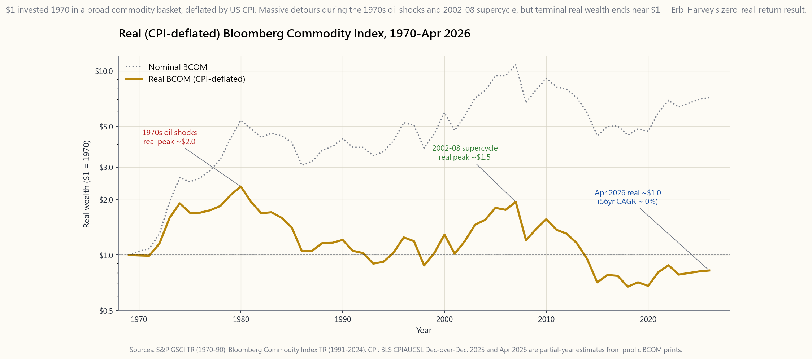
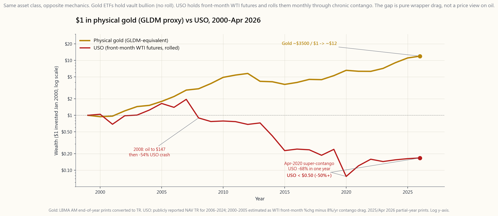

# 側課 22：原物料 — 黃金、石油、農產品作為投資組合的分散投資工具

---## 第 1 部分：閱讀區

---

### 1. 為什麼這很重要

商品是唯一一個其他金融資產是以其為基礎定價的資產類別。債券折現預期的通膨；股票折現未來的盈餘，這些盈餘依賴於投入成本；貨幣則根據貿易條件進行調整。然而，當你詢問一個典型的零售投資組合的「商品配置」時，得到的答案通常是一個混亂的組合，包括 GLD、一個能源 ETF，以及對「它在 2024 年沒有奏效」的懷疑。原因在於，商品作為一種金融曝險，與大多數人想像中所購買的實體商品行為截然不同。

這個課程存在作為一個獨立的部分而不是通膨章節下的一段文字的四個原因（側邊 06）：

1. **大多數零售「商品」曝險是期貨滾動，而非現貨。** USO、UNG、DBC、PDBC 以及整個 BCOM 跟蹤生態系統持有的是 *期貨*，每季度滾動，並且會受到正向期限結構的影響。從 2009 年到 2020 年，USO 的價值損失了約一半，而 WTI 前月的價格基本持平。這個工具並不是商品。
2. **黃金在結構上與其他商品不同，**因為 GLDM/IAU/GLD 持有的是 *保存在金庫中的實體金條* — 沒有滾動，沒有衰減，純粹的現貨曝險。黃金是一種價值儲存，因為集體信念使其成為這樣；而石油則是工業投入，無論你是否相信，它在你的投資組合中都會衰減。
3. **被動商品籃的長期實際回報是平坦或負的。** Erb-Harvey（2006）及其二十年的後續研究將彭博商品指數的實際幾何回報率估算為在多十年的窗口中約為零。多樣化的論點是真實的；長期回報溢價則不是。
4. **對通膨對沖的價值集中在供應衝擊窗口中。** 1973 年的石油、2007 年的農業、2022 年的能源。在這些窗口之外，商品則是死重。如果你的配置規則沒有考慮到制度條件的回報，你將會因錯誤的理由持有它們，並在錯誤的時間減持。

這個課程的目標是使現貨與期貨的區別變得機械化，校準長期實際回報數字，並產生一個配置規則，讓四個部分的投資組合能夠持有商品，而不期望它們成為安靜的貢獻者。

---### 2. 你需要知道的事

#### 2.1 四個類別及其驅動因素

指數提供者將商品分為**能源、金屬、農業和牲畜**。標準的彭博商品指數（BCOM，2026年4月的權重）大約是28%的能源、38%的金屬（分為17%的貴金屬/21%的工業金屬）、31%的農業和3%的牲畜。標準普爾GSCI則更重於能源（約55%）；這個差異很重要，因為GSCI的回報主要受到石油的影響，而BCOM則更接近於平衡的商品籃。

每個類別對不同的驅動因素有反應。**能源**由OPEC+的生產紀律、美國頁岩油的資本支出、運輸需求和地緣政治供應衝擊（1973年禁運、1990年海灣戰爭、2022年烏克蘭）所決定。**工業金屬**——銅、鋁、鋅、鎳——跟蹤全球製造業PMI和中國固定資產投資，因此“銅博士”通常提前六到九個月引領周期。**貴金屬**——黃金和白銀——跟蹤實際利率和中央銀行需求；它們與工業活動幾乎沒有相關性。**農業**——玉米、小麥、大豆、糖、棉花、咖啡——主要受天氣、種植決策和生物燃料法規的影響；供應衝擊通常是劇烈且短暫的。**牲畜**是最小且最具特異性的，受飼料成本和疾病周期的驅動。

商品之間的多樣化是真實存在的：在2022年，能源回報為+35%，工業金屬為-10%，貴金屬接近平穩，農業為+12%，牲畜為+9%。一個廣泛的商品籃能平滑這些波動；單一類別的ETF則無法做到。

#### 2.2 現貨與期貨：大多數投資者誤解的機制

當你購買XOM股票時，你擁有一家石油公司的股份。當你購買USO時，你並不擁有石油——你擁有一籃前月WTI期貨合約，該基金每月將其**滾動**到下一個合約。每次滾動都是對即將到期合約的出售和對下一個合約的購買，這一過程是機械化的。

如果期貨曲線處於**正向市場**（下一個合約的價格高於前一個），那麼基金每次滾動時都會以低價出售並以高價購買，這樣該頭寸就會以正向市場的利差速度流失。如果曲線處於**反向市場**（下一個合約的價格低於前一個），那麼基金就會獲得正的滾動收益。儲存成本高的工業商品（天然氣、石油在供應過剩時）通常處於持續的正向市場。軟性和危機商品（禁運期間的石油、乾旱期間的農產品）則會轉為反向市場。

僅因正向市場對USO的歷史拖累，每年約為-6%到-9%，這是2009年至2020年的平均數據。前月WTI在2009年初約為42美元，到2020年末約為48美元——基本上是平穩的。在同一時間段內，USO的淨值損失了大約一半。投資者對石油的看法是正確的，但仍然賠錢。（第39週詳細介紹了期限結構的機制；這個附帶的教訓借用了這一結果。）

表達商品觀點而不受滾動拖累的簡單方法是使用**股票代理**：XOM/CVX代表石油，FCX代表銅，NEM代表金礦，ADM/BG代表農業。這些股票承擔股票貝塔和管理風險，以換取消除期貨的流失。

#### 2.3 黃金與石油：同一資產類別，對立的機制

黃金ETF（GLDM 0.10%費用率，IAU 0.25%，GLD 0.40%，SGOL 0.17%，BAR 0.175%）持有**實體黃金**。沒有期貨合約，沒有滾動，沒有正向市場。該基金的淨值跟蹤黃金的現貨價格減去費用率。從2000年到2026年4月，黃金價格從約280美元上升到約3,500美元——這是一個約12倍的財富倍增，年化名義回報接近10%。在同一時間段內，扣除CPI後的實際回報約為每年6-7%——這在長期黃金文獻中是異常的，主要是由於自2022年以來中央銀行去美元化的購買行為驅動。

石油ETF（USO、BNO、USL）持有期貨。從2000年到2026年4月，USO每年大約提供負的1%到2%——而且請記住，WTI現貨在2000年初約為25美元，今天約為70美元，現貨價格的2.8倍變化被滾動抹去。相同的實體商品以兩種不同的方式表達，導致終端財富出現30倍的差異。這張圖使這一點變得具體。

這是本課程中最重要的圖片。兩種“商品”，相同的起始資本，卻有截然不同的結果——完全是因為*包裝方式對基礎資產的持有方式*。

#### 2.4 廣泛商品ETF：PDBC、DBC、BCI、GSG

對於希望擁有多樣化商品投資組合並接受滾動拖累的投資者，選擇有：

- **PDBC**（Invesco最佳收益多元化商品策略無K-1，0.59%費用率，約50億美元資產管理）——使用期貨並添加優化層，選擇滾動日期以最小化正向市場的流失。發放1099，而不是K-1。
- **DBC**（Invesco DB商品指數追蹤，0.85%費用率，K-1）——較舊，持有類似，正向市場拖累較大。
- **BCI**（abrdn彭博全商品策略，0.25%費用率，1099）——最乾淨的BCOM追蹤器；資產管理較小，約10億美元，但流動性足夠。
- **GSG**（iShares S&P GSCI，0.75%費用率，K-1）——重能源的GSCI追蹤器。
- **COMT、CMDY**——小眾替代品。

所有四種均為美國上市且可接受。K-1發放者會產生文書工作（3月中旬前發放Schedule K-1；IRA中的合夥企業UBTI）。1099發放者（PDBC、BCI）則更簡單。對於超過5%投資組合的商品投資，BCI是默認選擇。

#### 2.5 Erb-Harvey結果：實際回報約為零

Claude Erb和Cam Harvey在2006年的論文《商品期貨的戰略和戰術價值》中將商品指數回報分解為三個部分：

1. **現貨價格變化**——在100多年中，大多數商品的實際現貨價格一直是*平穩或負向的*。創新、替代和改進的開採在長期內戰勝稀缺。
2. **滾動收益**——對於可儲存商品（能源、基礎金屬）平均為負，因為正向市場是結構性形狀；對於供應緊張的非可儲存商品則為正。
3. **抵押收益**——期貨頭寸在已發佈的保證金上賺取國庫券利率，這是一個實際利率為零到一的收益。

將三者相加，廣泛商品指數的長期實際幾何回報約為零——而且自論文以來的20年超出樣本數據已證實了這一點。BCOM在1970年至2026年4月的實際回報約為每年-0.5%。多樣化的好處是持有這個資產類別的全部理由；回報溢價則不是。

這就是為什麼規模很重要。60/30/10的投資組合中，5-10%的商品投資能增加夏普比率和抗通膨衝擊的能力，而不會顯著改變預期回報。30%的商品投資則會使預期回報下降約1.5%每年，以獲取邊際多樣化。

#### 2.6 供應衝擊模式

歷史模式是一致的：商品在*供應衝擊*期間表現良好，而不是在*需求繁榮*或*穩定通膨*期間。

- **1973年石油禁運**：BCOM（代理：GSCI回溯）名義上+75%，實際上+60%，而標準普爾500指數實際上-23%。
- **2007-2008年商品超週期**：BCOM在2007年+30%，然後在2008年隨著危機爆發而-36%。扣除來回的交易，獲得的收益有限。
- **2021-2022年烏克蘭+後COVID供應鏈**：BCOM在2021年+27%，2022年+14%——當股票實際上損失18%而債券名義上損失31%時，這是唯一一個在2022年有正實際回報的主要資產類別。

這一教訓是非對稱的：商品是保險，而不是收入。當其他資產無法支付時，它們會支付，而在長時間的衝擊之間，它們則需要支付小額的保費。

在陳馬的框架中，這是將波動性尾部驅動狗的觀察應用於不同的時間序列。持有商品的平均經驗是輕微的拖累。在它們激增的稀有情況下的積分就是為何要持有這個資產類別的理由。規模規則：

- 廣泛商品（BCI或PDBC）：投資組合的5-10%。
- 黃金（GLDM/IAU）：額外的2-5%作為單獨的價值儲存類別，而不是作為“通膨對沖”。它位於第3層。
- 單一商品ETF（USO、UNG、COPX）：僅用於戰術，頭寸大小<1%，視為事件交易而非戰略持有。### 3. 常見誤解

1. *「USO 追蹤油價。」* 它追蹤的是前月 WTI 期貨合約，每月展期一次。2009-2020 年的長期順價拖累使持有者損失了大約一半的資本，而現貨 WTI 大致保持平穩。
2. *「商品是通膨的避險工具。」* 它們是 *供應衝擊* 的避險工具。在 2010 年代，當消費者物價指數（CPI）因需求疲弱而運行在 1-2% 時，BCOM 名義上損失了約 35%。單靠通膨是不夠的。
3. *「黃金和石油的行為與商品相同。」* GLDM 持有實物金條（無展期，無衰減）。USO 持有期貨（持續展期）。包裝機制主導了長期回報。
4. *「彭博商品指數是一個廣泛的通膨代理。」* 它由 38% 金屬、28% 能源、31% 農業和 3% 畜牧組成。與 CPI 的相關性依賴於體制——在供應衝擊期間強烈正相關，在平靜期間接近零。
5. *「商品 ETF 是稅務高效的。」* PDBC 和 BCI 使用 1099 結構，但 DBC、GSG、USO 和較舊的基金發放 K-1 合夥形式。IRA 中的 UBTI 對於 K-1 發行者在超過 $1,000 的 UBTI 變得非常重要。
6. *「擁有商品生產者的股票與擁有商品是相同的。」* 事實並非如此。生產者股票的股權貝塔大約為 1.0，還加上商品的風險。XOM 與原油的相關性約為 0.55；其餘則是一般的股權貝塔。
7. *「實際商品價格隨著人口增長而上升。」* Erb 和 Harvey，以及更早的 Jacks（2013）追溯至 1850 年，記錄顯示實際商品價格在長期內保持平穩或略微負增長。創新和替代品抵消了稀缺性。
8. *「黃金支付股利。」* 黃金不支付股利。其預期的實際回報大約是其儲存成本的負值——這些成本被 ETF 包裝吸收進費用率中。黃金的長期實際回報大約為每年 +1%，主要受到偶爾重新定價事件的影響。

---

### 4. 問答環節

**Q: 對於五位數的投資組合，最簡單的商品配置是什麼？**  
A: 完全跳過廣泛商品，持有 3-5% 的 GLDM。在低於 $10,000 的配置中，廣泛籃子的分散投資效益被交易成本和追蹤誤差所主導。透過 GLDM 投資黃金是一個決定，沒有 K-1，並捕捉到價值儲存的部分。

**Q: 為什麼 BCI 比 DBC 更適合廣泛配置？**  
A: BCI 使用 1099 結構（無 K-1 文書），其費用率為 0.25%，而 DBC 為 0.85%。在 10 年內，這 0.6% 的費用率差異會複利到約 6% 的淨值，對於相同的風險敞口。

**Q: 商品應該放在 IRA 還是應稅帳戶中？**  
A: 1099 發行者（PDBC、BCI）是中性的。K-1 發行者應該放在應稅帳戶中，以避免 IRA 中的 UBTI。黃金 ETF 在應稅帳戶中被視為收藏品，聯邦長期資本利得稅率為 28%——這對於股票的 15-20% 稅率來說是一個重要的懲罰。對於黃金 ETF，最好選擇 IRA。

**Q: 1973 年式的油價衝擊在 2026 年仍然有效嗎？**  
A: 機制沒有改變：突發的實體供應中斷會使期貨曲線進入反向市場，並推高現貨價格。美國現在是淨石油出口國，這減少了與 1970 年代相比，石油價格飆升對 *股市* 的損害，但並不改變商品本身的收益。

**Q: 我可以只持有生產者股票——XOM、FCX、NEM、ADM 嗎？**  
A: 可以，且長期回報高於指數籃子。權衡是相關性：這四者對廣泛市場的股權貝塔約為 0.6-0.8，因此在經濟衰退期間，即使商品本身受到追捧，它們也會隨著股票下跌。生產者是 *帶有商品傾斜的股權敞口*，而不是商品避險。

**Q: 彭博商品指數可投資嗎？**  
A: 是的，透過 BCI、PDBC、COMT 和 CMDY 等等。沒有一個完全精確追蹤 BCOM——每個選擇了稍微不同的展期方法。PDBC 明確優化以最小化順價損失；BCI 則追蹤機械性日程。

**Q: Erb-Harvey 的「零實際回報」結果是否排除了商品配置？**  
A: 不。它排除了 *期望* 商品成為回報來源的可能性。這個配置的理由是在供應衝擊期間（2008、2022）所帶來的分散投資效益，以及持有一種與股票和債券偶爾呈負相關的資產所帶來的再平衡收益。這兩種效應大約能提高 30-50 基點的投資組合夏普比率。

**Q: 如果 BTC 是新的數位價值儲存，黃金的角色如何？**  
A: 它們在第三層中服務於不同的利基。黃金有 5,000 年的接受度，深厚的中央銀行需求，且沒有協議風險。BTC 的總量上限為 2100 萬，波動性約為 70%。配置規則：2-5% 的黃金和 1-3% 的 BTC 用於價值儲存配置，而不是單獨選擇一種。（第 09 頁詳細介紹 BTC 的配置。）

**Q: 5% 商品配置的正確再平衡範圍是多少？**  
A: 當配置的權重超過 ±2 個百分點（即 3% 或 7%）時，重新平衡至目標。這樣可以捕捉供應衝擊的上行（在高峰期賣出），而不會在無收益的年份中頻繁交易。僅依靠年度再平衡會錯過太多的高峰。

**Q: 為什麼農產品商品在零售投資組合中幾乎沒有覆蓋？**  
A: 因為零售包裝選擇有限：WEAT、CORN、SOYB、JJG——都是小型資產管理規模，都是單一商品，都是 K-1。表達農業觀點最乾淨的方式是透過股權代理（DE 用於農業設備，ADM 或 BG 用於加工）或將其視為透過 BCI 或 PDBC 的廣泛籃子配置的一部分。

**Q: OPEC+ 卡特爾在設定油價方面仍然有效嗎？**  
A: 截至 2026 年 4 月，答案是「不太有效」。美國頁岩油的盈虧平衡成本接近 $50 WTI，設定了邊際供應曲線。OPEC+ 保留短期市場管理權力，但長期價格底線由美國生產商設定。這壓縮了與 1970 年代相比，油價供應衝擊的上行空間。## 第二部分：YouTube 腳本

---

**影片標題：** 原物料、石油與黃金 — 為什麼 USO 損失 50% 而 WTI 保持平穩

**預計時長：** 約 12 分鐘

**主持人：** 陳馬、小魚

---

**[開場 — 0:00 到 0:45]**

陳馬：兩個圖表。從 2000 年 1 月到 2026 年 4 月，黃金從 280 美元漲到大約 3,500 美元。一美元的實體黃金變成了大約十二美元。同樣的時間段，USO — 美國石油基金 — 一美元變成了不到五十美分。

小魚：它們都是原物料。

陳馬：它們都是 *原物料*。但它們不是都是 *原物料的曝險*。今天的課程是區別，並且為什麼這個區別主導了你對這個資產類別的所有其他問題。

小魚：這是第 22 頁。黃金、石油、農業作為投資組合的多元化工具。我們有兩張圖片和一個互動實驗室。

---

**[第一部分 — 四個部門 — 0:45 到 2:30]**

陳馬：彭博商品指數 — BCOM — 是標準的廣泛籃子。2026 年 4 月的權重，大約：28% 能源，38% 金屬，31% 農業，3% 畜牧業。

小魚：每個部門有不同的驅動因素？

陳馬：是的，這就是多元化的論點。能源是 OPEC+ 加上地緣政治。工業金屬 — 銅、鋁 — 跟蹤全球製造業。農業是天氣加上種植加上生物燃料法規。貴金屬 — 黃金和白銀 — 跟蹤實際利率和中央銀行需求。

小魚：所以在 2022 年，能源上漲 35%，農業上漲 12%，但工業金屬下跌 10% 而貴金屬平穩。

陳馬：正確。這個籃子平滑了這些波動。單一部門的 ETF 則不然。

---

**[第二部分 — 現貨與期貨 — 2:30 到 5:00]**

陳馬：現在來談談機制。當你購買 USO 時，你並不擁有石油。你擁有一籃前月 WTI 期貨合約，USO 每個月會進行滾動。

小魚：滾動是指賣出到期合約並購買下一個合約。

陳馬：對。這裡的問題是。如果期貨曲線處於升水狀態 — 下個月的價格高於這個月 — 每次滾動都是低賣高買。這個部位會流失升水利差。

小魚：歷史上這個流失有多大？

陳馬：從 2009 年到 2020 年的石油期貨，純滾動成本大約每年是負 6% 到負 9%。前月 WTI 在 2009 年初接近 40 美元，2020 年結束時約 48 美元。現貨是平穩的。USO 大約損失了一半。

[視覺：image/side22_gold_vs_oil.png]

小魚：這張圖表很殘酷。黃金向上複利，USO 則向下漂移。

陳馬：同樣的資產類別。同樣的起始資本。包裝機制主導。黃金 ETF 持有實體金條在保險庫中。沒有滾動。USO 持有期貨。總是有滾動。這個差異在二十六年內複利，產生了三十倍的差距。

小魚：所以如果你想要石油曝險而不想流失？

陳馬：生產商的股票 — XOM、CVX。或者對生產商的 LEAPS 買權，如果你想要有風險定義的槓桿。或者接受流失，將 USO 當作一個戰術工具，持有期限在三個月以內，永遠不要作為戰略性投資。

---

**[第三部分 — 長期實際報酬 — 5:00 到 7:00]**

陳馬：現在來談談那個尷尬的數字。Erb 和 Harvey，2006 年的論文。將商品指數的報酬分解為三個部分。現貨價格變化。滾動收益。抵押收益。

小魚：結果是什麼？

陳馬：廣泛商品指數的實際幾何報酬，在超過一個世紀的時間內，大約是零。二十年的後續數據已經確認了這一點。BCOM 從 1970 年到 2026 年 4 月的實際報酬大約是每年負 0.5%。

[視覺：image/side22_real_commodities.png]

小魚：所以這張圖顯示 1970 年投資一美元在實際 BCOM 中，最終大約回到起點。

陳馬：經歷了兩次巨大的繞道 — 在 1970 年代上漲，在 2002-2008 年的超週期中上漲，其他時期則下跌。

小魚：那為什麼還要持有它們？

陳馬：為了供應衝擊的對沖。1973 年、2007 年、2022 年。當其他東西都不賺錢時，它們會賺錢。波動性尾巴搖擺狗，應用於商品。平均經驗是輕微的拖累。罕見的制度支付正是為了證明這個位置的合理性。

---

**[第四部分 — 配置規則 — 7:00 到 9:00]**

陳馬：那麼這個部分有多大？

小魚：廣泛籃子？

陳馬：總投資組合的 5% 到 10%。BCI 用於成本和 1099 結構。如果你想要優化的滾動層，選擇 PDBC。這兩者都可以接受。

小魚：黃金單獨呢？

陳馬：另外 2% 到 5%。作為價值儲存的部分，位於第 3 層，GLDM 是預設的，費用為十個基點。

小魚：單一商品 ETF — USO、UNG、COPX？

陳馬：僅限於戰術用途。持倉規模低於 1%。視為事件交易，永遠不要作為戰略持有。

小魚：那再平衡呢？

陳馬：圍繞目標權重上下浮動兩個百分點。賣出在高峰時，死錢年中再買回。僅年度再平衡會錯過快速的供應衝擊。

---

**[第五部分 — 互動 — 9:00 到 11:00]**

陳馬：打開商品實驗室。

[視覺：interactive/side22_commodity_lab.html]

小魚：四個滑桿 — 黃金權重、廣泛商品權重、石油期貨權重、預期通膨制度。

陳馬：將預期通膨提高到 7%，看看實際報酬數字如何變化。注意到黃金和廣泛商品都增強，但石油期貨保持穩定 — 因為升水拖累是結構性的，而不是制度依賴的。

小魚：如果我將廣泛商品的部分提高到 30% 呢？

陳馬：注意預期的實際報酬數字。它每年壓縮投資組合大約 1.5%，因為廣泛商品的長期實際報酬大約為零。你以報酬為代價購買了多元化。

小魚：所以實驗室明確了這個交易的權衡。

陳馬：對。沒有任何投資組合可以讓你在商品中增加超過 20% 的比例，除非你在押注特定的衝擊制度。預設是 5% 到 10% 的廣泛商品加上 2% 到 5% 的黃金。超過這個範圍的任何配置都是方向性的觀點，而不是戰略配置。

---

**[結尾 — 11:00 到 12:00]**

小魚：從第 22 頁要記住三件事。

陳馬：第一，包裝主導。GLDM 持有實體金條。USO 持有期貨。以兩種不同方式表達的同一商品在二十六年內產生了三十倍的差異。

小魚：第二，Erb-Harvey 的結果。廣泛商品籃的長期實際報酬大約為零。多元化的好處是真實的；報酬溢價則不是。

陳馬：第三，配置。廣泛商品 5% 到 10%。黃金 2% 到 5%。單一商品 ETF 僅作為戰術事件交易。任何更大的配置都需要一個論點和止損。

小魚：接下來 — 第 23 頁。下次見。