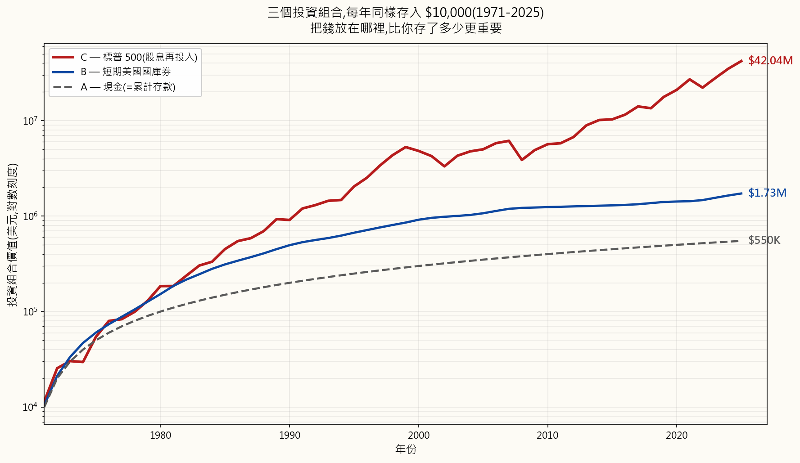
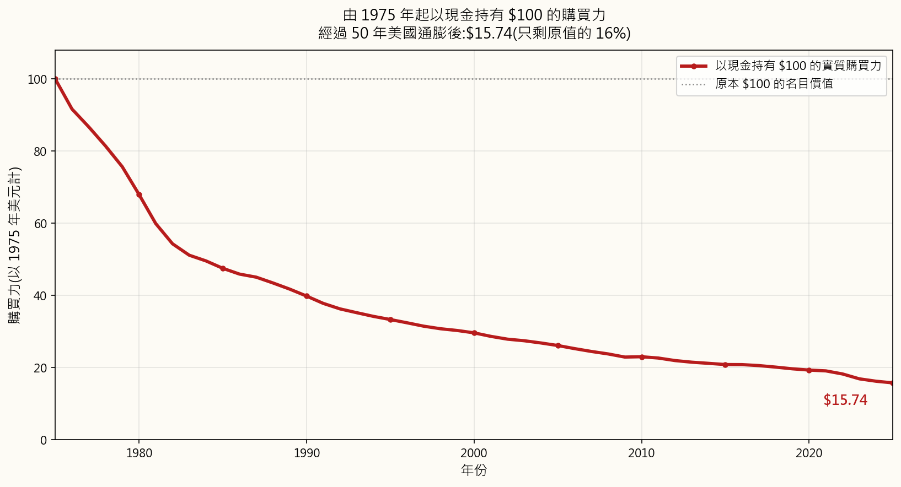
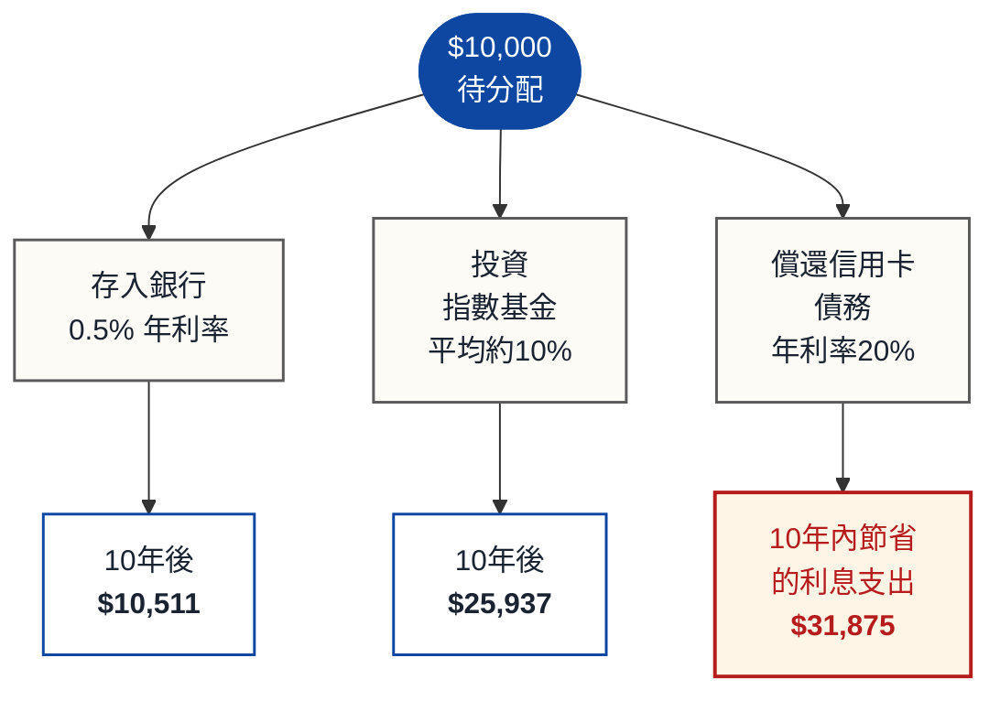

# 第一週：為何要投資？貨幣時間價值

---

## 第一部分：閱讀章節

---

### a) 為何這很重要

閒置的錢就是正在貶值的錢。每一天，通膨都在侵蝕塞在床墊底下、或存放在零利率活期帳戶中的現金購買力。理解*為何*你需要投資，不只是一種理財技能——在現代經濟中，這是一種生存技能。

想想看：1990年，一杯咖啡大約要0.75美元。到了2025年，同一杯咖啡要價5美元以上。咖啡並沒有變好六倍，而是你的每一塊錢變弱了六倍。這就是通膨的作用，而且它從未停歇。

貨幣時間價值（TVM）是所有金融學的基礎原理。它說明：今天的一塊錢比明天的一塊錢更有價值。這基於三個原因：

1. **通膨** — 物價隨時間上漲，因此未來的錢能買到的東西更少。
2. **機會成本** — 現在擁有的錢可以用來投資以賺取報酬。
3. **風險** — 承諾中的未來款項可能永遠不會到來。

如果你理解貨幣時間價值，你就明白為何投資不是選項，而是必要之舉。這是確保你的財富成長速度超越經濟侵蝕速度的唯一方法。

回顧過去55年，來做一個思想實驗，設想三位儲蓄者。從1971年開始，每人每年存入恰好10,000美元——相同的名目金額，每年如此，毫無例外。唯一的差異在於*他們把錢放在哪裡*。

- **甲君** 以現金保存。沒有銀行，沒有利息。純粹的鈔票，放在抽屜裡。
- **乙君** 存入短期美國國庫券，也就是現存最安全的生息工具。
- **丙君** 投入標普500指數，並將所有股利再投入。

相同的紀律，相同的本金，三種截然不同的結果：

55年後，每人存入的本金都是相同的**55萬美元**。但最終餘額根本不在同一個量級：

| 投資工具 | 年化報酬率（複合年均成長率） | 最終名目價值 | 換算為1971年幣值 |
|---|---|---|---|
| **丙君 — 標普500** | **11.24% / 年** | **$42,041,000** | **$5,079,000** |
| **乙君 — 國庫券** | 4.38% / 年 | $1,725,000 | $208,000 |
| **甲君 — 現金** | 0.00% / 年 | $550,000 | $66,000 |

「年化報酬率」欄位即為**複合年均成長率（CAGR）**——指在同樣55年中，以單一固定利率複利計算，能產生與實際逐年資產走勢相同成長倍數的那個利率。引用這個數字才是正確的，因為年報酬率的簡單算術平均值會高估實際的複利績效。供參考，同期美國消費者物價指數（CPI）平均每年上漲**3.92%**——任何低於這條線的報酬，在談稅負之前，實際購買力就已是虧損。

丙君的名目財富是乙君的**24倍**，是甲君的**76倍**，儘管三人每年都存入同樣的10,000美元。再仔細看甲君：那55萬美元的現金，在歷經55年美國通膨累積後，其*實質*購買力僅相當於1971年的**約66,000美元**。甲君不只是財富未能增長——在他勤勤懇懇儲蓄的同時，通膨正在主動侵蝕他的財富。

這一切的差異，完全源於貨幣時間價值與複利成長，在數十年間的積累效應。複利獎勵能帶來報酬的資本，懲罰停滯不動的資本。

本週的課程為本課程後續所有主題提供概念基礎。掌握這些觀念，未來每個主題都會更容易理解。

---

### b) 你需要知道的事

#### 1. 通膨：無聲的財富摧毀者

通膨是指物價水準隨時間普遍上漲。各國中央銀行（如美國的聯準會）以每年約2%的通膨為目標，但實際通膨可能大幅波動。

不要相信教科書中那種以平滑假設利率計算的例子——讓我們用真實的美國消費者物價指數（CPI）數據來說明。想像你在1970年1月1日，把一張嶄新的100美元鈔票塞到床墊下，從此再也不碰它。以下是此後每隔五年，這張鈔票的購買力變化：

| 年份 | 經過年數 | 購買力 | 佔原始金額比例 |
|------|--------------:|-----------------:|--------------:|
| 1970 | 0 | $100.00 | 100.0% |
| 1975 | 5 | $74.49 | 74.5% |
| 1980 | 10 | $50.65 | 50.6% |
| 1985 | 15 | $35.39 | 35.4% |
| 1990 | 20 | $29.66 | 29.7% |
| 1995 | 25 | $24.81 | 24.8% |
| 2000 | 30 | $22.06 | 22.1% |
| 2005 | 35 | $19.44 | 19.4% |
| 2010 | 40 | $17.13 | 17.1% |
| 2015 | 45 | $15.51 | 15.5% |
| 2020 | 50 | $14.37 | 14.4% |
| 2025 | 55 | $11.73 | 11.7% |

1970年的那100美元，今天的購買力僅剩**11.73美元**——在一個完整的工作生涯中，通膨吞噬了其**88.3%的實質價值**。光是1970年代的停滯性通膨，就在1980年前將其價值幾乎砍半（降至50.65美元），而此後相對溫和的25年（1980至2005年）又再削去了三分之二。即便在你自己的有生之年，過去25年也說明了同樣的故事——**2000年1月的100美元，今天只值53.16美元，短短一個世代就喪失了46.8%的購買力**。而2020年後的加速通膨，光在五年內就讓美元的購買力蒸發了約**18%**。

這就是金錢的「實質」價值——它實際上能買到什麼，而非「名目」價值（鈔票上印的數字）。現金並不安全。分文不賺的現金是一種持續、幾乎難以察覺的虧損。這種虧損的緩慢性，正是它如此危險的原因：那些把錢存在活期帳戶以「保護」財富的人，其實是在上面那張圖裡下了最積極進取的賭注——然後輸掉它。

**通膨的衡量方式：**

- **消費者物價指數（CPI）** — 追蹤一般家庭所購買的一籃子商品與服務（食品、住房、交通等）的費用。
- **個人消費支出（PCE）** — 聯準會偏好使用的衡量指標；涵蓋範圍比消費者物價指數更廣。
- **核心通膨** — 剔除波動性較大的食品與能源價格，以顯示潛在趨勢。

**美國歷史通膨率（各年代平均值）：**

| 時期 | 平均年度CPI |
|---|---:|
| 1930–1940 | −2.0% |
| 1940–1950 | +5.6% |
| 1950–1970 | +2.3% |
| 1970–1980 | +7.8% |
| 1980–2000 | +3.8% |
| 2000–2020 | +2.1% |
| 2020–2025 | +4.8% |

請注意通膨在1970年代（石油危機）以及2020年代初期（疫情供應衝擊）的飆升。這些飆升能迅速摧毀購買力。

#### 2. 複利：世界第八大奇蹟

複利意味著你在既有利息上繼續賺取利息。這是個人理財中最強大的力量。

**複利公式：**

\[ FV = PV \cdot (1 + r)^n \]

其中：

- \(FV\) = 終值（你的錢最終成長為多少）
- \(PV\) = 現值（你的起始金額）
- \(r\) = 每期利率（以小數表示）
- \(n\) = 期數

**範例：1,000美元，年報酬率8%**

| 年份 | 期初餘額 | 賺取利息 | 期末餘額 |
|---:|---:|---:|---:|
| 1 | $1,000.00 | $80.00 | $1,080.00 |
| 2 | $1,080.00 | $86.40 | $1,166.40 |
| 3 | $1,166.40 | $93.31 | $1,259.71 |
| 5 | $1,360.49 | $108.84 | $1,469.33 |
| 10 | $1,999.00 | $159.92 | $2,158.92 |
| 20 | $4,315.70 | $345.26 | $4,660.96 |
| 30 | $9,317.27 | $745.38 | $10,062.66 |
| 40 | $20,106.85 | $1,608.55 | $21,715.40 |

請注意第40年賺取的利息（1,608美元）已超過原始本金（1,000美元）。這就是複利的作用。

**複利與單利的視覺化比較：**

以單利計算，你每年賺取原始本金1,000美元的8%（每年80美元）。以複利計算，你賺取的是*當前餘額*的8%，而餘額每年都在增加。長期下來，差距變得極為巨大——上述範例最終結果為**21,725美元（複利）對比4,200美元（單利）**，差了五倍，而這五倍的差距完全來自於將先前利息留在帳戶而非提出的選擇。

**複利頻率同樣重要。**
相同的10,000美元，相同的12%年利率，相同的10年期限，僅複利頻率不同：

| 複利方式 | 最終價值 |
|---|---:|
| 每年 | $31,058.48 |
| 每半年 | $32,071.35 |
| 每季 | $32,620.38 |
| 每月 | $33,003.87 |
| 每日 | $33,194.62 |
| 連續 | $33,201.17 |

複利頻率越高，報酬越高，但邊際效益遞減得很快。從每年到每月的跳躍相當顯著；從每日到連續的跳躍則幾乎為零。

#### 3. 七十二法則

七十二法則是一種心算捷徑，用於估算在特定年報酬率下，資金翻倍所需的時間：

$$ \text{翻倍所需年數} \approx \frac{72}{r} \quad \text{（其中 } r \text{ 為年利率，以百分比表示）} $$

| 年報酬率 | 翻倍所需年數 |
|---:|---|
| 2% | \(72 / 2 = 36\) 年 |
| 4% | \(72 / 4 = 18\) 年 |
| 6% | \(72 / 6 = 12\) 年 |
| 8% | \(72 / 8 = 9\) 年 |
| 10% | \(72 / 10 = 7.2\) 年 |
| 12% | \(72 / 12 = 6\) 年 |

**為何這個法則有效？** 這是一個源自自然對數的數學近似公式。精確公式為

$$ t = \frac{\ln 2}{\ln(1 + r)} $$

但72已足夠接近用於心算，且具有一個實際優點——它可以被2、3、4、6、8、9和12整除，涵蓋了你真正關心的大多數利率。

**七十二法則反向應用——通膨也依相同時鐘讓你的購買力減半。** 將「年報酬率」替換為「年通膨率」，「翻倍所需年數」就變成「你的一塊錢購買力減半所需年數」：

| 通膨率 | 購買力減半所需年數 |
|---:|---|
| 3% | \(72 / 3 = 24\) 年 |
| 4% | \(72 / 4 = 18\) 年 |
| 6% | \(72 / 6 = 12\) 年 |
| 9% | \(72 / 9 \approx 8\) 年 |

這讓通膨變得具體可感。如果通膨平均為4%，每隔18年你的錢就只能買到一半的東西。這就是為什麼那些只賺1至2%的「安全」儲蓄帳戶，實質上正在讓你虧錢。

#### 4. 機會成本

機會成本是指在做決策時，你所放棄的次優選擇的價值。在投資上，它意味著每一塊錢都有相互競爭的用途，選擇其一就意味著放棄其他。

**決策樹——10,000美元該如何運用：**

在這個例子中，償還高利率信用卡債務的「報酬」最高，因為你正在消除每年20%的成本。這就是為什麼理財顧問通常建議先還清高利率債務，再考慮投資。

**關鍵洞察：** 機會成本同樣適用於時間，不僅限於金錢。每延誤一年投資，都有可量化的代價，因為你永遠失去了那一年的複利機會。

**等待的代價——每年投入5,000美元，平均年報酬率10%，至65歲時的終值：**

| 開始年齡 | 投資年數 | 總投入金額 | 65歲時終值 |
|---:|---:|---:|---:|
| 20 | 45 | $225,000 | $3,616,635 |
| 25 | 40 | $200,000 | $2,212,963 |
| 30 | 35 | $175,000 | $1,355,122 |
| 35 | 30 | $150,000 | $822,470 |
| 40 | 25 | $125,000 | $491,735 |
| 45 | 20 | $100,000 | $286,375 |

從20歲而非30歲開始，僅多投入50,000美元，卻能多得226萬美元。複利的早期年份具有不成比例的巨大價值。

#### 5. 實質報酬 vs. 名目報酬

**名目報酬**是投資的原始報酬百分比，未經通膨調整。**實質報酬**是名目報酬減去通膨，代表購買力的實際增加幅度。

一個快速近似公式：

$$ r_{\text{實質}} \approx r_{\text{名目}} - i $$

精確關係式（**費雪方程式**）為：

$$ r_{\text{實質}} = \frac{1 + r_{\text{名目}}}{1 + i} - 1 $$

範例——名目報酬10%，通膨3%：

$$ \begin{aligned}
r_{\text{實質（近似）}} &= 10\% - 3\% = 7\% \\
r_{\text{實質（精確）}}  &= \frac{1.10}{1.03} - 1 = 6.80\%
\end{aligned} $$

在低通膨情況下，近似公式已足夠用於心算；在高通膨或高報酬率時，建議使用精確公式。

**美國各資產類別歷史實質報酬（近似值）：**

| 資產類別 | 名目報酬 | 通膨率 | 實質報酬 |
|---|---:|---:|---:|
| 美股（標普500） | ~10.0% | ~3.0% | ~7.0% |
| 美國債券（10年期） | ~5.0% | ~3.0% | ~2.0% |
| 黃金 | ~7.0% | ~3.0% | ~4.0% |
| 儲蓄帳戶 | ~2.0% | ~3.0% | ~−1.0% |
| 現金（床墊） | 0.0% | ~3.0% | ~−3.0% |

**核心結論：** 在3%通膨環境下，年利率2%的儲蓄帳戶，每年實質上正在*虧損*1%的購買力。床墊下的現金每年虧損3%。只有報酬超過通膨率的資產，才能真正增加你的實質財富。

#### 6. 終值與現值

這是貨幣時間價值計算中最核心的兩個概念。

**終值（FV）：** 今天的一筆錢在未來會變成多少。

\[ FV = PV \cdot (1 + r)^n \]

範例——5,000美元在8%報酬率下，20年後的終值？

\[ \begin{aligned}
FV &= 5{,}000 \cdot (1.08)^{20} \\
   &= 5{,}000 \cdot 4.6610 \\
   &= \$23{,}305
\end{aligned} \]

**現值（PV）：** 未來的一筆錢，在今天值多少。

\[ PV = \frac{FV}{(1 + r)^n} \]

範例——15年後的50,000美元，在折現率7%下，今天值多少？

\[ \begin{aligned}
PV &= \frac{50{,}000}{(1.07)^{15}} \\
   &= \frac{50{,}000}{2.7590} \\
   &= \$18{,}126
\end{aligned} \]

**這意味著：** 如果有人提出15年後給你50,000美元，而你自己投資能賺得7%，那麼這個承諾對你今天來說只值18,126美元。如果他們同時提供你現在就給20,000美元，那麼今天拿20,000美元才是更划算的選擇。

**年金終值（定期定額投資）：**

\[ FV = PMT \cdot \frac{(1 + r)^n - 1}{r} \]

其中 \(PMT\) = 每期投入金額。

範例——每月500美元，投資30年，年利率8%（月利率0.667%）：

\[ \begin{aligned}
FV &= 500 \cdot \frac{(1.00667)^{360} - 1}{0.00667} \\
   &= 500 \cdot 1{,}491.57 \\
   &= \$745{,}785
\end{aligned} \]

總投入金額：\(500 \times 360 = \$180{,}000\)。總成長金額：\(\$745{,}785 - \$180{,}000 = \$565{,}785\)。

你的投資成長金額（565,785美元）是實際投入本金（180,000美元）的三倍以上。這就是持續投資結合複利的力量。

**折現未來現金流。** 未來五年，每年年末各領取100美元，以7%折現率折現：

$$ PV = \sum_{t=1}^{5} \frac{\$100}{(1.07)^t} $$

| 年份 | 未來款項 | 折現因子 | 現值 |
|---:|---:|---:|---:|
| 1 | $100 | \(1 / 1.07^{1} = 0.9346\) | $93.46 |
| 2 | $100 | \(1 / 1.07^{2} = 0.8734\) | $87.34 |
| 3 | $100 | \(1 / 1.07^{3} = 0.8163\) | $81.63 |
| 4 | $100 | \(1 / 1.07^{4} = 0.7629\) | $76.29 |
| 5 | $100 | \(1 / 1.07^{5} = 0.7130\) | $71.30 |
| | | **現值合計** | **$410.02** |

每筆未來的100美元，在今天都價值較低，因為貨幣時間價值的關係。越遠的未來款項，今天的價值越低——第5年的100美元今天只值71.30美元，而第1年的100美元今天值93.46美元。

#### 7. 融會貫通：投資的必要性

**三條路徑，歷時30年**（起始本金10,000美元，每年再投入5,000美元）：

| 指標 | 甚麼都不做（0%） | 儲蓄帳戶（1.5%） | 投資標普500（10%） |
|---|---:|---:|---:|
| 總投入金額 | $160,000 | $160,000 | $160,000 |
| 最終名目價值 | $160,000 | $192,760 | $987,174 |
| 實質價值（3%通膨） | $65,890 | $79,379 | $406,392 |
| 購買力 | **損失59%** | **損失50%** | **增加154%** |

只有投資者能以實質方式真正增加財富。儲蓄者勉強維持。甚麼都不做的人，損失超過一半的購買力。

---

### c) 常見迷思

**迷思一：「投資就是賭博。」**

賭博的預期報酬為負（莊家必贏）。投資於分散的資產，歷史上具有正的預期報酬。標普500在過去一個世紀的年均報酬約10%，期間歷經了大蕭條、二戰、2008年金融危機與新冠肺炎疫情。對個股的短期投機或許類似賭博，但對分散化基金進行有紀律的長期投資，本質上截然不同。

**迷思二：「我需要很多錢才能開始投資。」**

許多券商現在提供零最低投資門檻以及零佣金，並可購買零股。你可以用10美元買入標普500指數基金。最重要的因素不是你起步時有多少錢，而是你多早開始以及多持續地投入。即使是22歲開始每月只投50美元，在10%平均報酬率下，到65歲時也能成長至超過35萬美元。

**迷思三：「儲蓄和投資是一樣的。」**

儲蓄是指把錢存起來。投資是指讓錢為你工作。當通膨達3%時，儲蓄帳戶賺取0.5%的利息，意味著你每年損失2.5%的購買力。儲蓄對於緊急備用金和短期目標很重要，但對於長期財富累積，投資不可或缺。

**迷思四：「我應該等待『對的時機』再投資。」**

市場擇時極為困難。研究一再顯示，「待在市場中的時間」勝過「把握市場時機」。一項嘉信理財的研究發現，即使某人每年都在最糟糕的時機（市場高點）投資，其績效仍遠遠超越那些守著現金等待更好進場點的人。

**迷思五：「複利只對大筆資金才有意義。」**

百分比的作用與金額無關。100美元以10%成長40年後變成4,526美元。倍數（45倍）無論你是以100美元還是100,000美元起步都完全相同。關鍵在於成長率和時間長度。

**迷思六：「通膨通常維持在2至3%。」**

雖然各國中央銀行以2%為目標，但實際通膨可能遠高於此。美國在1980年曾出現13.5%的通膨。阿根廷近年來更見識過超過100%的通膨。即使在穩定的經濟體中，通膨也可能因供應衝擊、貨幣政策改變或地緣政治事件而急劇上升。你的投資策略需要考量不同的通膨情境。

**迷思七：「漲10%之後再跌10%，就回到原點了。」**

這在數學上是不正確的。100美元 + 10% = 110美元。然後110美元 − 10% = 99美元。你實際上還少了1%。虧損的傷害大於相同幅度的獲利所帶來的好處，這就是為什麼管理下跌風險在投資中如此重要。跌50%之後，需要漲100%才能回到原點。

**損益不對稱——回撤後回到損益兩平需要的漲幅：**

| 虧損幅度 | 恢復所需漲幅 |
|---:|---:|
| −10% | +11.1% |
| −20% | +25.0% |
| −30% | +42.9% |
| −40% | +66.7% |
| −50% | +100.0% |
| −75% | +300.0% |
| −90% | +900.0% |

在數學上，虧損 \(L\) 後，所需的恢復漲幅為 \(G = \frac{L}{1 - L}\)——一旦 \(L\) 變大，這個數字成長的速度遠快於 \(L\) 本身。

**迷思八：「七十二法則是精確的。」**

這只是一個近似值。在利率6%至10%之間時效果最佳。在利率非常低或非常高時，準確度會下降。在2%時，實際翻倍時間為35.0年（七十二法則說36年）。在20%時，實際時間為3.8年（七十二法則說3.6年）。用於快速心算已足夠，但不要用於精確的財務規劃。

---

### d) 問與答

**問1：用簡單的話來說，什麼是貨幣時間價值？**

答：今天的一塊錢比未來的一塊錢更有價值，原因有三：（1）通膨降低了未來那塊錢的購買力，（2）今天的錢可以立即投資以賺取報酬，（3）承諾中的未來款項總存在無法兌現的風險。這就是為什麼放款人收取利息，也是為什麼投資人要求報酬——他們在為放棄現在使用金錢的權利而獲得補償。

**問2：複利與單利有何不同？**

答：單利只針對原始本金計算。如果你以5%單利投資1,000美元，每年固定賺取50美元，無論累積了多少都一樣。複利則是針對本金加上所有累積利息來計算。因此在第二年，你賺取的是1,050美元的8%，而非僅1,000美元的8%。長期下來，這個差距變得相當驚人。30年後，1,000美元以5%單利變成2,500美元；以5%複利計算，則變成4,322美元。

**問3：七十二法則為何有效？**

答：它源自數學關係式 ln(2) / ln(1 + r)，其中 ln 是自然對數，r 是利率。當利率接近8%時，72/r 非常接近這個公式的結果。選擇72這個數字，是因為它可以被2、3、4、6、8、9和12整除，使心算更方便。有些人在利率較低時使用「七十法則」，或在連續複利時使用「69.3法則」，但72在日常使用中最為實用。

**問4：名目報酬和實質報酬有何差異？**

答：名目報酬是標題數字——「今年股市報酬10%。」實質報酬經通膨調整，顯示購買力的實際增加幅度。如果股市報酬10%但通膨為4%，你的實質報酬約為6%。在評估長期投資績效時，應始終以實質報酬思考，因為在高通膨環境下，名目報酬可能產生誤導。

**問5：如何計算未來一筆錢的現值？**

答：使用公式 PV = FV / (1 + r)^n。選擇適當的折現率（r）——通常是你在其他投資上能賺到的報酬率。例如，如果有人承諾10年後給你10,000美元，而你自己可以賺到7%：PV = $10,000 / (1.07)^10 = $10,000 / 1.9672 = $5,083。那筆未來的10,000美元，今天對你來說只值約5,083美元。

**問6：投資可以期望多少年報酬？**

答：美國股票市場（標普500）的歷史名目年報酬約10%，或通膨調整後約7%。然而，每年的報酬差異極大。任何特定年份，市場可能漲30%或跌30%。10%的平均值只在長時間（20年以上）後才會浮現。債券的歷史報酬約為5%名目報酬（2%實質報酬）。均衡的投資組合或許以7至8%的名目報酬為目標。切記，沒有任何特定報酬是有保證的。

**問7：我應該先還債還是先投資？**

答：比較你的債務利率和預期投資報酬。如果你的債務利率為20%（信用卡），還清債務就像賺取有保證的20%報酬——比任何投資都好。如果你的債務利率為4%（房貸），而你預期投資能賺10%，那麼投資或許更有利，但還債是有保證的「報酬」，而投資報酬則不然。一個常見策略：先還清所有利率高於6至7%的債務，再將剩餘的錢拿去投資。

**問8：通膨對所有商品的影響都一樣嗎？**

答：不。不同類別的通膨率不同。過去20年在美國，醫療和教育費用的漲幅遠超過整體消費者物價指數，而科技產品和服裝往往變得更便宜。消費者物價指數是一籃子商品的平均值，因此你個人的通膨率取決於你實際的消費結構。例如，退休人士通常面臨較高的實際通膨，因為醫療佔其支出的比例較大。

**問9：一次性投入大筆資金和每月定期定額，哪個比較好？**

答：從統計上看，一次性投入（單筆投資）約有三分之二的時間勝過定期定額投資，因為市場整體趨勢向上。然而，定期定額投資能降低在市場高點一次性投入的風險，且對於多數靠固定薪資生活的人來說更為可行。最好的策略通常是：每次領薪水就立即投入。不要持有現金等待「更好的時機」。

**問10：複利也會對我不利嗎？**

答：絕對會。債務上的複利是投資複利的鏡像。5,000美元的信用卡債務，若年利率24%且未償還，短短5年就會增長至14,615美元。這就是為什麼高利率債務是財務緊急狀況。同樣的數學力量，透過投資能創造財富，透過未償債務則會摧毀財富。

---

## 第二部分：YouTube 腳本

---

**影片標題：** 為何要投資？貨幣時間價值 | 投資課程第一週

**目標時長：** 約25分鐘

**主持人：**
- **陳馬**（老師）：經驗豐富的散戶交易者，從多年市場經驗出發解說概念
- **小魚**（學生）：剛畢業的社會新鮮人，正在學習如何投資她的積蓄，提出觀眾心中的問題

---

**[片頭序列]**

[VISUAL: Animated logo with text "Investment Fundamentals - Week 1"]

[ANIMATION: A clock ticking while dollar bills slowly shrink in size]

**陳馬：** 歡迎來到投資基礎課程第一週。我是陳馬，這堂課將永遠改變你對金錢的思考方式。

**小魚：** 我是小魚。我會問所有新手都想問的問題，所以如果你是完全的初學者，別擔心，我跟你站在同一條起跑線上。

**陳馬：** 今天我們要回答你這輩子最重要的財務問題之一：為什麼你應該投資？

**小魚：** 對啊，說真的，投資感覺很有風險。為什麼不直接把錢存在銀行帳戶裡，這樣不是比較安全嗎？

**陳馬：** 這正是我們要從這裡開始的原因。因為令人驚訝的真相是，把錢「安全地」放在銀行帳戶裡，其實是你能對自己的錢做的最危險的事之一。

**小魚：** 等等，這怎麼可能？

[VISUAL: Title card -- "第一段：無形的竊賊——通膨"]

---

**[第一段：通膨]**

**陳馬：** 讓我告訴你一個正在偷走你錢財的無形竊賊。它叫做通膨。

[ANIMATION: A basket of groceries. The price tag starts at $50 and slowly ticks
up to $75, then $100, while the basket stays the same size. Reference:
animation/week01_compound_growth.py -- inflation_scene()]

**小魚：** 通膨。這個詞我聽過，但它對我的荷包到底代表什麼？

**陳馬：** 通膨的意思是，物價會隨著時間上漲。不是因為產品變得更好，而是因為貨幣失去了價值。1995年，一張電影票大約四塊美金。今天要十五塊。同樣的觀影體驗，但你的一塊錢能買的東西變少了。

**小魚：** 所以即使我不花錢，我的錢也在變弱？

**陳馬：** 沒錯。而且讓它如此危險的原因在這裡。

[VISUAL: Split screen showing two jars. Left jar labeled "2005年的$10,000。"
Right jar labeled "2025年的$10,000。" The right jar shows items being removed
one by one to represent lost purchasing power.]

**陳馬：** 如果你在2005年把一萬美元塞到床墊底下，然後在2025年拿出來，你手上還是一萬美元。但這一萬美元，只能買到2005年大約六千美元能買到的東西。什麼都不做，你就損失了大約四成的購買力。

**小魚：** 四成？那很嚴重耶。但銀行會付利息吧？這樣有幫助嗎？

**陳馬：** 讓我給你看一下這個數字。

[ANIMATION: Bar chart comparing "儲蓄帳戶利率：0.5%" vs
"通膨率：3%" with a gap labeled "實質虧損：每年 -2.5%"]

**陳馬：** 近年來美國普通儲蓄帳戶的年利率大約只有0.5%。與此同時，通膨平均約3%。也就是說，你的儲蓄帳戶每年實質購買力虧損了約2.5%。

**小魚：** 所以我把錢存起來，其實是在虧錢？

**陳馬：** 以實質意義來說，是的。這讓我們來到金融學中最重要的概念。

[VISUAL: Title card -- "第二段：貨幣時間價值"]

---

**[第二段：貨幣時間價值]**

**陳馬：** 貨幣時間價值——簡稱TVM——是指今天的一塊錢比明天的一塊錢更有價值。

**小魚：** 為什麼？一塊錢就是一塊錢嘛，對吧？

**陳馬：** 這樣想吧。如果我現在給你一千美元，和一年後給你一千美元，你選哪個？

**小魚：** 當然是現在啊。

**陳馬：** 為什麼？

**小魚：** 因為……我現在就能用？而且誰知道一年後會發生什麼事？

**陳馬：** 你剛才說出了其中兩個原因。

[VISUAL: Three pillars graphic:
支柱一——「機會：現在就能投資，賺取報酬」
支柱二——「通膨：未來的錢購買力更低」
支柱三——「風險：未來的款項可能無法兌現」]

**陳馬：** 第一，機會。現在有錢，就可以立即投資賺取報酬。第二，通膨。那筆未來的錢，購買力比今天的錢低。第三，風險。承諾給你錢的那個人，未來可能無法履行。

**小魚：** 所以時間本身就讓錢變得不那麼有價值？

**陳馬：** 除非你讓它去工作。而這正是投資的意義所在。投資是你對抗貨幣時間價值的方式。與其讓時間侵蝕你的財富，你反而可以駕馭時間來增長財富。

**小魚：** 怎麼做？

**陳馬：** 兩個字：複利。

[VISUAL: Title card -- "第三段：複利——世界第八大奇蹟"]

---

**[第三段：複利]**

[ANIMATION: Reference animation/week01_compound_growth.py -- compound_scene().
Starting with a single coin, it duplicates. Then each duplicate duplicates.
The pile grows slowly at first, then explosively.]

**陳馬：** 據說愛因斯坦曾稱複利為世界第八大奇蹟。不管他是否真的說過這句話，數學上確實站得住腳。

**小魚：** 複利和普通利息有什麼不同？

**陳馬：** 問得好。單利是指每年在你的原始本金上賺取固定百分比。複利是指你在利息上繼續賺取利息。

[ANIMATION: Side-by-side comparison.
Left side: "單利" -- $1,000 grows by exactly $80 each year, shown
as equal-sized blocks stacking up.
Right side: "複利" -- $1,000 grows by increasing amounts each
year, blocks get larger as they stack.]

**陳馬：** 假設你以8%投資一千美元。以單利計算，你每年賺八十美元。十年後，你有一千八百美元。

**小魚：** 聽起來還行。

**陳馬：** 現在以複利計算，第一年你還是賺八十美元。但第二年，你賺的是一千零八十美元的8%，也就是八十六塊四毛。第三年，你賺的是一千一百六十六塊四毛的8%。

**小魚：** 所以每年賺到的利息越來越多？

**陳馬：** 沒錯。十年後，你不是有一千八百美元，而是有兩千一百五十九美元。

[VISUAL: Table on screen:
單利：$1,000 -> 10年後 $1,800
複利：$1,000 -> 10年後 $2,159
差額：$359]

**小魚：** 多了三百五十九美元。這不錯，但也算不上是改變人生的差距。

**陳馬：** 你說得對。十年後，只是一個不錯的加分。但接下來才是瘋狂的地方。讓我們拉長時間軸。

[ANIMATION: Graph showing both curves extending to 40 years. The compound curve
begins to separate dramatically from the simple interest line around year 20,
and by year 40, it is far above.]

**陳馬：** 二十年後，複利的總額是四千六百六十一美元，單利是兩千六百美元。三十年後，複利是一萬零六十三，單利是三千四百。到了四十年後……

**小魚：** 讓我猜——數字失控了？

**陳馬：** 兩萬一千七百一十五美元。對比單利的四千兩百美元。你的本金成長超過二十一倍。

**小魚：** 從一千美元開始？

**陳馬：** 從一千美元開始。而且沒有再多存一分錢。只是讓複利在四十年間持續發揮作用。

[VISUAL: Final comparison graphic:
$1,000 以8%計算，40年後：
單利：$4,200
複利：$21,715]

**小魚：** 好，這真的很驚人。但誰有四十年？

**陳馬：** 任何二十幾歲開始、六十幾歲退休的人都有。而且多數人不是只做一次性的單筆投資，他們是定期持續投入資金。讓我給你看，當你把定期投入和複利結合在一起會發生什麼事。

[ANIMATION: A piggy bank receiving coins monthly. A growth meter next to it
accelerates upward. Numbers tick from $0 to $500,000 to $1,000,000.]

**陳馬：** 如果你從二十五歲開始，每月投資五百美元，年均報酬率10%，到了六十五歲，你大約會有兩百六十萬美元。

**小魚：** 兩百六十萬？從每月五百塊？

**陳馬：** 你的總投入本金是二十四萬美元。其餘的兩百三十六萬，是純粹的複利成長。

**小魚：** 那就是九成靠成長，一成靠本金。這太難以置信了。

**陳馬：** 這就是時間加複利的力量。而這也正是為什麼早點開始如此重要。

**小魚：** 理論如此，但現實世界真的是這樣運作的嗎？

**陳馬：** 問得好。讓我用真實的美國市場歷史數據來說明——不是假設的10%，而是1971年至2025年的實際報酬。

[VISUAL: Three Portfolios chart -- image/week01_three_portfolios.png. Three
lines climbing on a log-scale chart from 1971 to 2025: 現金成長呈線性至55萬美元（即存款累計基準線），國庫券曲線上升至173萬美元，標普500爆發至4,200萬美元。]

**陳馬：** 三位儲蓄者。每一位每年都存入一萬美元，持續五十五年。唯一的差異就是他們把錢放在哪裡。甲君把現金存在抽屜裡，沒有利息，就是放著。乙君把錢放入短期國庫券——也就是現存最安全的生息工具。丙君把錢投入標普500，並將所有股利再投入。

**小魚：** 存入的錢一樣，所以領回的錢也一樣吧？

**陳馬：** 甲君，也就是存現金的人，最終有剛好五十五萬美元——五十五筆存款的加總，零成長。乙君，國庫券的儲蓄者，最終約有一百七十三萬美元。丙君，股票市場的投資者，最終有四千兩百萬美元。

**小魚：** 四千兩百萬？！從同樣的每年一萬塊？！

**陳馬：** 從同樣的每年一萬塊。丙君最終的財富是國庫券儲蓄者的二十四倍，是存現金者的七十六倍。相同的紀律，相同的本金投入，結果天差地別。而甲君更慘——一旦換算成五十五年的美國通膨，那五十五萬現金，實質購買力只相當於1971年的約六萬六千美元。

**小魚：** 所以存現金的人實際上是在倒退？

**陳馬：** 不投資的儲蓄，不是安全，只是比較慢的虧損方式。這正是這門課程存在的全部原因。

[VISUAL: Title card -- "第四段：等待的代價"]

---

**[第四段：等待的代價]**

[ANIMATION: Two characters walking side by side. "早鳥阿敏" starts at age 25.
"等待阿強" starts at age 35. Both walk toward age 65. 阿敏的財富條遠比阿強的高。]

**陳馬：** 讓我介紹兩位假設的投資人。早鳥阿敏從二十五歲開始每年投資五千美元。等待阿強從三十五歲才開始投入相同金額。兩人都投資到六十五歲，平均年報酬率都是10%。

**小魚：** 所以阿敏投資四十年，阿強投資三十年？

**陳馬：** 對。阿敏總共投入了二十萬美元。阿強總共投入了十五萬美元。所以阿敏多投了五萬。但看看結果。

[VISUAL: Comparison bars:
阿敏（從25歲開始）：投入$200,000 -> 最終價值 $2,212,963
阿強（從35歲開始）：投入$150,000 -> 最終價值 $822,470]

**小魚：** 阿敏的錢快要是阿強的三倍？就因為多投了五萬塊？

**陳馬：** 最終多了一百四十萬美元，只因為多投入了五萬元本金。那代表二十八比一的比率。阿敏在最初十年投入的每一塊錢，在後來三十年都乘以了驚人的倍數。

**小魚：** 所以早期的年份最有價值？

**陳馬：** 毫無疑問。你最早投入的錢，有最長的時間可以複利成長。二十五歲時投入的一塊錢，有四十年可以成長。五十五歲時投入的一塊錢，只有十年。二十五歲的那塊錢可以成長至約四十五塊，五十五歲的那塊錢只能成長至約兩塊六毛。

[VISUAL: Title card -- "第五段：七十二法則"]

---

**[第五段：七十二法則]**

**小魚：** 這些概念都很好，但在腦子裡做複利計算感覺是不可能的任務。

**陳馬：** 確實，但有一個很妙的捷徑，叫做七十二法則。

[VISUAL: Large "72" on screen with a division sign]

**陳馬：** 要估算你的錢翻倍需要多少年，只要把七十二除以年報酬率就好。

**小魚：** 就這樣？

**陳馬：** 就這樣。6%報酬率，十二年翻倍。8%報酬率，九年。12%報酬率，只要六年。

[ANIMATION: A $1 bill doubling into $2, then $4, then $8, then $16, with
timestamps showing the years at 8% return: 0, 9, 18, 27, 36 年]

**小魚：** 所以在8%報酬率下，一塊錢在九年後變兩塊，十八年後變四塊，二十七年後變八塊，三十六年後變十六塊？

**陳馬：** 完全正確。三十六年翻了四倍。而且這個法則還可以反過來用。你可以估算通膨多快會摧毀你的財富。

**小魚：** 怎麼用？

**陳馬：** 通膨3%的話，七十二除以三等於二十四。你的錢每二十四年就損失一半的購買力。

**小魚：** 所以如果我現在三十歲，離退休還有三十五年，只要把現金放著，購買力可能損失超過一半？

**陳馬：** 超過一半。在3%通膨下，三十五年後一塊錢只剩約三毛五分的購買力。你會損失約六成五的購買力。

[VISUAL: Dollar bill with 65% of it shaded out/faded, labeled "35年通膨損失（年均3%）"]

**小魚：** 這很嚇人。

**陳馬：** 這應該是一種激勵。因為一旦你理解了這一點，你就明白不投資才是真正的風險。

[VISUAL: Title card -- "第六段：實質報酬 vs. 名目報酬"]

---

**[第六段：實質報酬 vs. 名目報酬]**

**陳馬：** 在我們結束之前，我想釐清一個讓很多人混淆的概念。當你聽到「股市每年報酬10%」，這是名目報酬。

**小魚：** 名目報酬的意思就是標題上的數字？

**陳馬：** 對。是未經通膨調整的實際數字。但真正影響你購買力的，是實質報酬——也就是名目報酬減去通膨。

[ANIMATION: A thermometer-style graphic. "名目報酬" shows 10%.
"通膨" shows 3% being subtracted. "實質報酬" shows 7%.]

**陳馬：** 如果股市報酬10%而通膨是3%，你的實質報酬約為7%。那7%代表你購買力的實際增加——你現在能多買到的那些商品和服務。

**小魚：** 所以我應該永遠用通膨後的報酬來思考？

**陳馬：** 做長期規劃時，絕對是。讓我告訴你為什麼這很重要。看看這個比較。

[VISUAL: Table on screen:
資產           | 名目報酬 | 扣除3%通膨後 | 實質報酬
股票            |   10%   |              |    7%
債券            |    5%   |              |    2%
儲蓄帳戶        |    2%   |              |   -1%
現金            |    0%   |              |   -3%]

**陳馬：** 年利率2%的儲蓄帳戶，看起來好像在讓你的錢成長。但在3%通膨之後，你每年實際上損失了1%的購買力。床墊下的現金每年損失3%。

**小魚：** 所以股票真的是唯一能顯著增加財富的選擇？

**陳馬：** 長期下來，股票一直是普通投資人最強大的財富累積工具。債券也扮演重要角色，我們在課程後面的資產配置單元會深入討論。但是，在長期成長方面，股票是主要的引擎。

[VISUAL: Title card -- "第七段：終值與現值"]

---

**[第七段：終值與現值]**

**陳馬：** 讓我給你兩個會反覆出現的公式。

[VISUAL: Two formula cards side by side:
左邊："終值：FV = PV x (1 + r)^n"
右邊："現值：PV = FV / (1 + r)^n"]

**陳馬：** 終值回答的問題是：「如果我現在把這筆錢投資，之後會有多少？」現值回答的是反向問題：「一筆未來的款項，今天對我來說值多少？」

**小魚：** 能給我一個實際的例子嗎？

**陳馬：** 當然。假設你有一萬美元，年報酬率8%，投資二十五年。終值是一萬乘以1.08的二十五次方，等於六萬八千四百八十五美元。

[ANIMATION: $10,000 growing in a bar chart over 25 years, reaching $68,485.
Key milestones highlighted: $21,589 at year 10, $46,610 at year 20.]

**小魚：** 幾乎是原始本金的七倍。不錯。

**陳馬：** 現在反過來。你的公司提供你一筆二十年後才給付的一百萬紅利獎金。如果你自己投資能賺8%，這筆錢今天對你來說值多少？

**小魚：** 讓我想想。一百萬除以1.08的二十次方……

**陳馬：** 等於……

**小魚：** 我不知道怎麼在腦子裡算出來。

**陳馬：** 是二十一萬四千五百五十五美元。那筆未來的一百萬，今天對你來說只值約二十一萬四千美元。

[VISUAL: $100,000 shrinking backward through time to $21,455]

**小魚：** 所以如果有人提出現在就給我二十五萬，我應該接受現金？

**陳馬：** 從純粹的貨幣時間價值角度來說，是的。如果你能賺8%，現在的二十五萬比二十年後的一百萬更有價值。

**小魚：** 這完全改變了我對金錢的思考方式。

**陳馬：** 這正是這堂課的核心目的。

[VISUAL: Title card -- "重點整理"]

---

**[第八段：回顧與重點整理]**

[ANIMATION: Summary slide building point by point]

**陳馬：** 來回顧一下今天學到的東西。

[VISUAL: Bullet points appearing one by one]

**陳馬：** 第一：通膨無聲無息地摧毀你的購買力。在3%通膨下，大約每二十四年，你的錢就損失一半的價值。

**小魚：** 無形的竊賊。

**陳馬：** 第二：複利是累積財富最強大的力量。你在利息上賺取利息，幾十年下來，這創造了指數型成長。

**小魚：** 第八大奇蹟。

**陳馬：** 第三：七十二法則。用七十二除以你的報酬率，估算翻倍所需的時間。快速、簡單，而且準確得令人驚訝。

**小魚：** 七十二除以報酬率。記住了。

**陳馬：** 第四：早開始比投入大筆資金更重要。你最早投入的那些錢，有最長的時間複利成長，創造最多財富。

**小魚：** 早鳥阿敏把等待阿強遠遠拋在後頭。

**陳馬：** 第五：永遠要以實質報酬而非名目報酬思考。重要的是通膨後的購買力，而不是帳戶裡的原始數字。

**小魚：** 10%名目報酬減去3%通膨等於7%實質成長。

**陳馬：** 第六：終值和現值是評估任何財務決策的基本工具。每一項投資、每一筆貸款、每一個財務提案，都可以用這些概念來評估。

[VISUAL: Animated graphic showing a timeline from "今天" to "未來" with arrows
showing FV going forward and PV coming back]

**小魚：** 那麼，看完這支影片的人，今天馬上應該做什麼？

**陳馬：** 三件事。第一，查一下你的儲蓄帳戶利率是多少。如果低於通膨率，你要明白你正在虧錢。第二，如果你還沒有投資帳戶，去開一個。現在很多券商零最低開戶門檻、零手續費。第三，開始投資，即使每個月只有五十美元。投入多少不如開始行動重要。

**小魚：** 因為時間是最關鍵的要素。

**陳馬：** 正是。你每等一天，就是永遠失去一天的複利機會。

[VISUAL: End card with course logo]

**陳馬：** 下週，我們要談初學者最簡單、最經過驗證的投資方式：指數基金和指數股票型基金。你將了解為什麼多數專業基金經理人打不贏一支簡單的指數基金，以及你如何幾乎零成本就能開始投資。

**小魚：** 聽起來太棒了。下週見！

**陳馬：** 感謝你的收看。如果你覺得這支影片有幫助，請訂閱並開啟小鈴鐺，才不會錯過第二週。到時候見！

[ANIMATION: Outro animation with subscribe button graphic and "下週：指數基金與指數股票型基金" preview card]

**[結束]**

---

*本集動畫參考檔案：`animation/week01_compound_growth.py`*
*下一課：`course/week02_index_funds_etfs.md`*