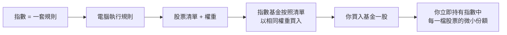
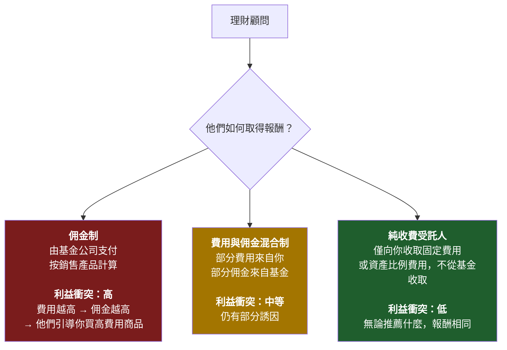
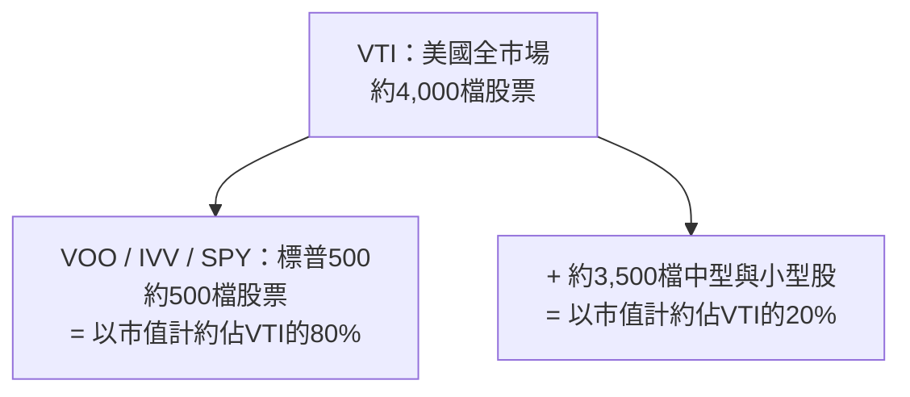
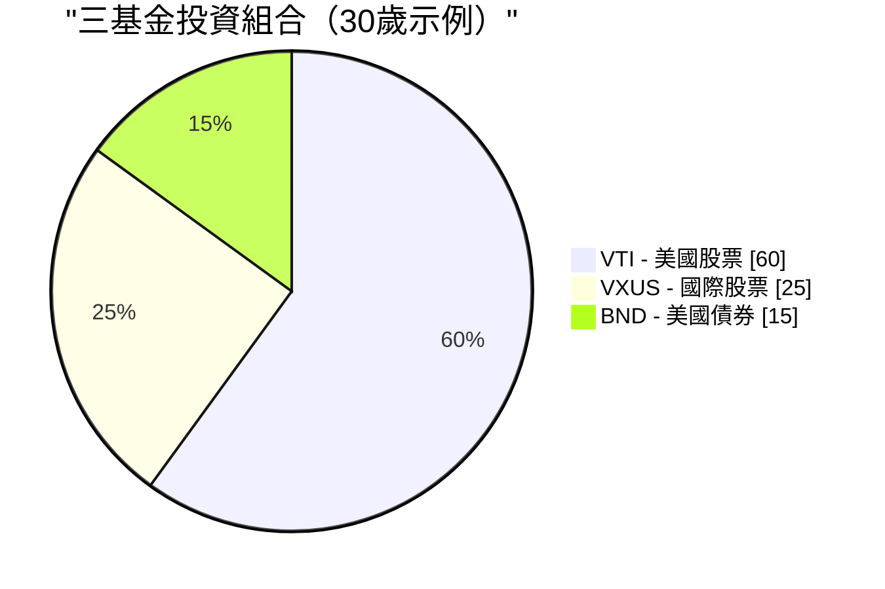

# 第二週：指數基金與指數股票型基金

動畫參考：`animation/week02_active_vs_passive.py`

---

## 第一部分：閱讀章節

---

### 1. 為什麼這很重要

上週我們確立了一個殘酷的事實：**通膨是地心引力，不投資才是你能做的最昂貴的事。** 現在問題是*如何*投資。而這個答案，投資業花了四十年才肯承認：對幾乎所有人來說，正確答案是**低成本的指數基金或指數股票型基金。** 不是選股。不是你銀行的「財富管理師」。不是你姐夫的明牌。更不是你的保險業務員拚命想賣給你的結構型商品。

這是整個課程中最重要的一課，而且它真的很簡單。如果你在第二週之後就不再閱讀，設定每月自動定期定額投資一檔涵蓋廣泛市場的指數股票型基金，然後這輩子再也不讀另一本財經書，**你的表現仍將超越這個星球上絕大多數投資人——包括那些領著百萬薪酬替別人管錢的專業人士。**

這不是推銷話術。這是四十年的資料所呈現的客觀陳述：

- **在20年的時間窗口中，大約90%的主動式管理美國大型股基金表現不如標普500指數**——由標準普爾道瓊斯指數每年發布的SPIVA計分卡為證。
- **預測基金未來表現的最佳單一指標是費用率，** 而不是基金經理的資歷、品牌或過去的報酬。就是那筆費用。費用越低，未來平均報酬越高。（晨星已在一項又一項的研究中驗證了這一點。）
- **華倫·巴菲特——史上最著名的主動式投資人——在他的遺囑中指示，他妻子的遺產要投入「一檔非常低成本的標普500指數基金」。** 如果連史上最偉大的選股者都告訴他自己的遺孀放棄選股，這就是個信號。

因此，我們將在這週探討三件事。第一，指數基金到底是什麼，以及它如何誕生的那段略帶異端色彩的歷史。第二，金融業從散戶投資人手中榨取金錢的四大方式——高費率的主動型基金、佣金驅動的理財顧問、以保險包裝的「投資」商品，以及緩慢失血的傳統共同基金——以及如何繞過每一個陷阱。第三，你真正需要的幾檔特定股票代號。

最後留一個誠實的懸念：**指數基金的主流共識已經奏效了四十年，但不保證永遠有效。** 它何時以及如何可能失效，以及你該如何應對，是我們在更後面的週次會回頭探討的主題。現在，我們先打好地基。進階操作之後自然會來——是*疊加*在這個地基之上，而不是取而代之。

> *「投資是必須的。這門課中的其他所有工具都只是加分項。」*

---

### 2. 你需要了解的知識

#### 2.1 什麼是指數？

**指數**是一份遵循特定規則的股票（或其他資產）清單。沒有人在「管理」這份指數——它就是其規則所定義的樣子。標普500是「符合特定流動性、獲利能力和掛牌標準的500家最大美國公司，按市值加權」。這就是完整的定義。電腦就能執行它。

當新聞說*「今天市場上漲了2%」*，他們幾乎總是指標普500指數上漲了2%。

你會常聽到的主要指數：

| 指數 | 追蹤對象 | 持股數 |
| --- | --- | --- |
| **標普500** | 500家最大的美國公司 | 約500 |
| **CRSP美國全市場** | 整個美國股票市場 | 約4,000 |
| **道瓊工業平均指數（DJIA）** | 30家大型美國公司（價格加權，已是古董） | 30 |
| **那斯達克綜合指數** | 那斯達克上所有股票 | 約3,000 |
| **那斯達克100** | 那斯達克最大的100家非金融股（科技重倉） | 100 |
| **羅素2000** | 2,000家美國小型股公司 | 約2,000 |
| **MSCI EAFE** | 美國/加拿大以外的已開發市場 | 約800 |
| **MSCI新興市場** | 新興市場國家 | 約1,400 |
| **富時100** | 英國100家最大公司 | 100 |

**大多數主要指數採用市值加權。** 這意味著一家公司在指數中的權重與其總市值成比例。蘋果公司市值約3兆美元，在標普500中佔約7%的權重；最小的成分股市值約100億美元，佔約0.02%。前10大公司通常佔**整個指數的30–35%。** 當你「買進標普500」時，你所獲得的大型科技股集中度，遠比「500檔股票」這個名稱所暗示的要高得多。

整個機制就是這樣。其中沒有任何天才的成分。這正是它能奏效的原因。

---

#### 2.2 指數基金——柏格的異端構想

指數基金直到1976年才出現。在此之前，美國每一檔共同基金都是主動式管理：西裝筆挺的聰明人選股，並為此每年收取1–2%的費用。那時的數學和現在一樣——他們大多數人的表現輸給市場平均——但學術發現尚未被具體化為產品。

**將這個數學轉化為產品的人是傑克·柏格。** 柏格在1974年被惠靈頓管理公司掃地出門。1975年，他創立了一家奇特的新共同基金公司，名為**先鋒集團（Vanguard）**，採用互助制結構——由基金持有人自身擁有，無外部獲利動機。1976年，先鋒集團推出了**第一指數投資信託**，這是第一檔面向散戶的指數基金：它將簡單地按照標普500的指數權重買入所有500檔股票，並收取極低的費用。

業界嘲笑它。媒體稱其為**「柏格的蠢事」。** 券商拒絕銷售它（因為沒有佣金可賺）。這檔基金在首次公開發行時僅募集了1,100萬美元——遠低於柏格目標的1.5億美元。競爭對手稱這個構想**「不符合美國精神」**，是**「平庸的保證書」。**

競爭對手說它保證平庸這點是正確的——*如果平庸意味著「市場平均報酬減去幾個基點的費用」。* 他們沒想到的是，市場平均報酬減去幾個基點的費用，在20年內打敗了大約90%的專業人士。

今日先鋒集團管理超過**8兆美元**的資產，指數基金與指數股票型基金合計在全球管理著**超過20兆美元**。柏格的「蠢事」成為了全球散戶股票投資的主流形式。他本人於2019年辭世，而他從未像其他任何8兆美元規模資產管理公司的創辦人那樣致富——先鋒集團的互助制結構意味著節省下來的費用回流給了基金持有人，而不是流入他個人口袋。他是金融界為數極少、可以不加引號地使用*英雄*這個詞的人。

> 「不要在草堆裡找針。直接買整個草堆就好了。」——約翰·柏格

---

#### 2.3 共同基金vs.指數股票型基金——為何共同基金仍然存在（以及為何你應該主要使用指數股票型基金）

**指數基金**是一種*策略*——追蹤指數。這個策略可以用兩種不同的*包裝*來呈現：

- **共同基金**，每天收盤時按淨值定價與交易一次。
- **指數股票型基金（ETF）**，在交易所即時交易，就像一檔股票。

| 特性 | 共同基金 | 指數股票型基金 |
| --- | --- | --- |
| 交易時間 | **每天一次**，以收盤淨值為準 | **全日交易**，像股票一樣 |
| 最低投資金額 | 通常**1,000–3,000美元** | **一股的價格**（或零股） |
| 稅務效率（課稅帳戶） | **較差**——資本利得分配強制施加於所有持有人 | **較佳**——實物申購贖回機制保護持有人 |
| 手續費 | 在基金本身的券商為$0 | 在大多數券商為$0 |
| 便利的自動投資 | **是**（按金額、任意日期） | 有時較困難（除非支援零股，否則需要整股） |

**在2026年，指數股票型基金在幾乎每個重要維度上都勝出**——更低的門檻、即時定價、顯著更好的稅務效率、平均更低的費用率。共同基金仍有真正優勢的類別只有以下幾種：

1. **401(k)及其他雇主退休計畫。** 大多數美國401(k)的選單仍以共同基金為主。計畫管理人尚未轉換，而且你通常無法自行將指數股票型基金帶入計畫。在401(k)中，共同基金的稅務問題大多無關緊要（帳戶本身享有稅務優惠），因此包裝形式是被迫的，但無傷大雅。
2. **以固定金額設定後就不管的自動投資。** 先鋒集團的共同基金讓你可以說「每月1日投入500美元」，它們會精確執行，包括購買零股。指數股票型基金的自動投資也有，但依券商而異。

**就這樣了。** 在2026年的普通課稅券商帳戶中，追蹤相同指數的指數股票型基金版本，在成本和稅後報酬上，對幾乎所有散戶投資人而言都優於共同基金版本。**預設選擇指數股票型基金。** 如果你唯一的管道是透過401(k)，那麼共同基金就很好——在選單中挑最便宜的廣泛市場指數選項，然後繼續向前。

共同基金仍以如此龐大的規模存在，不是因為它們*更好*，而是因為**數兆美元的舊有資金閒置在401(k)、個人退休帳戶（IRA）和舊券商對帳單中**，從共同基金轉出將產生應稅的資本利得。慣性使然，而非優勢。新的資金幾乎總應投入指數股票型基金。

---

#### 2.4 主動vs.被動——那個90%的統計數字

**主動式投資**意味著基金經理（或你自己）試圖挑出贏家股票並迴避輸家。研究、分析、頻繁交易、押注自己的判斷。這是每一檔主動式管理共同基金和避險基金所做的事，也是他們向你收費的理由。

**被動式投資**意味著買入整個指數，接受平均報酬。沒有預測，沒有重大押注，沒有魅力。

正統的問題是*「主動式基金經理能否打敗指數？」* 標準普爾道瓊斯指數每年在SPIVA計分卡中重複超過二十年的正統答案是：**大多數情況下，不能。** 時間拉得越長，情況越糟：

| 類別（美國） | 5年表現不如指數 | 10年表現不如指數 | 20年表現不如指數 |
| --- | --- | --- | --- |
| **美國大型股** | 78% | 85% | **90%** |
| **美國中型股** | 74% | 83% | 89% |
| **美國小型股** | 68% | 79% | 88% |
| **國際股票** | 71% | 82% | 87% |
| **新興市場** | 69% | 80% | 85% |
| **美國投資等級債券** | 72% | 81% | 86% |

*(近期SPIVA報告的約略數字；確切數字每年略有浮動，但定性模式不變。)*

> 翻譯成白話：每100位美國大型股基金經理中，**有90位在20年的時間窗口內輸給一台執行500個名字簡單清單的電腦。**

而且還有一個致命的後續結論：**這次贏的那10位，下個十年不是同一批人。** 標普的持續性研究反覆顯示，在過去五年名列前四分之一的基金，在接下來五年繼續留在前四分之一的比例往往不到半數。過去的優異表現無法預測未來的優異表現——每份基金公開說明書底部的那句警語是真的，而大多數投資人都忽視了它。

主動式基金經理整體上無法打敗指數，有五個原因：

1. **費用。** 主動式基金每年收取0.5–1.5%。指數股票型基金收0.03%。基金經理每年必須比指數多賺**超過整整一個百分點**，才能與便宜的選項打平。
2. **交易成本。** 每一次買賣都有摩擦——買賣價差、市場衝擊、機構端的手續費。高週轉率的策略不斷失血。
3. **稅。** 高週轉率在共同基金中觸發資本利得分配，無論你是否賣出，當年都要繳稅。
4. **市場大致有效。** 數以萬計的專業人士閱讀著同樣的年報、同樣的法說會記錄、同樣的衛星資料。真正的優勢極為罕見。
5. **倖存者偏差。** 表現不佳的基金被悄悄清算或併入其他基金。留存下來的「主動式基金」全集看起來比實際更好，因為最差的輸家已被掩埋。

---

#### 2.5 費用率——你能掌控的最大槓桿

**費用率**是基金每年收取的費用，每天自動從基金資產中扣除。你永遠看不到帳單。它只是以略低的報酬率呈現出來。

這種隱形性，正是它作為財富榨取機制的全部重點所在。**1%的費用聽起來微不足道。但三十年下來，它會吃掉你最終財富的大約25–30%。** 複利是雙向的：它讓你的錢成長，也讓費用成長。

10萬美元以每年10%的總報酬率投資30年：

| 基金類型 | 費用率 | 淨報酬率 | 第30年末的價值 | 與指數相比損失的費用 |
| --- | --- | --- | --- | --- |
| **指數股票型基金**（如VOO） | **0.03%** | 9.97% | **$1,721,686** | — |
| 便宜的主動型基金 | 0.50% | 9.50% | $1,526,688 | **−$194,998** |
| 一般主動型基金 | 1.00% | 9.00% | $1,326,768 | **−$394,918** |
| 昂貴的主動型基金 | 1.50% | 8.50% | $1,152,309 | **−$569,377** |
| 保險商品包裝 | 2.00% | 8.00% | $1,006,266 | **−$715,420** |

再讀一遍最後那一行。**2%的包裝費用，在10萬美元的投資上，30年下來讓你損失超過70萬美元。** 那不是一筆費用，那是一棟房子。視城市而定，可能是兩棟。那筆錢從你的退休生活流向了基金公司的薪資、行銷預算、辦公室租金和執行長薪酬。

**費用在每一種市場環境中都在複利累積。** 市場下跌30%的那一年，你仍要支付。基金經理打敗指數0.4%的那一年，你仍欠他1.0%。費用是基金公開說明書上唯一有保證的數字。

還有兩個業界寧願你不去內化的事實：

- **在任何基金類別中，費用率越低的基金平均表現越好。** 這是基金研究中被重複驗證最多次的發現——晨星已在各資產類別和數十年的時間中證實了這一點。一個類別中最便宜的基金，平均而言是該類別中最好的基金。
- **費用是*有保證的*拖累。基金經理的超額報酬是*所希望的*抵銷。** 用確定性換取希望，在其他所有領域都被認為是糟糕的交易。

---

#### 2.6 理財顧問的陷阱

如果主動型基金這麼差，為什麼每家銀行、券商和「財富管理」部門還在繼續銷售它們？因為**理財顧問的薪酬結構使得銷售它們對顧問而言是理性的**，即使對你來說是不理性的。

你會遇到三種薪酬模式：

**你要問任何顧問的最重要一個問題：*「您是受託人嗎？您是純收費制嗎？」*** 受託人在*法律上*被要求以你的最大利益行事。非受託人的銷售員只被要求推薦「合適」的商品——這是一個低得多的標準，歷史上它允許了將高費率垃圾商品賣給任何年齡夠大能簽名的人。

你的銀行「私人財富管理師」如此熱衷於把你塞進一檔費用率1.5%、外加5%前收手續費的主動型基金，是因為銀行兩頭賺：它在你購買時賺前收手續費，又在你持有期間持續賺取12b-1行銷費用的分成。**你不是他們的客戶；你是他們的產品。** 基金公司付錢給他們，讓他們把你送上門。

對一個非受託人顧問推銷主動型基金的最乾脆回應是：*「請給我看，以書面形式，持有這檔基金十年的全部費用明細——費用率、申購手續費、12b-1費用、顧問費、帳戶費。並告訴我你們公司從這家基金公司獲得的薪酬。」* 如果他們拒絕或拖延，你就得到了答案。

> **預設原則：** 如果你還沒有幾百萬美元和真正複雜的稅務狀況，你幾乎肯定不需要理財顧問。你需要一檔指數股票型基金和一個每月自動轉帳。

---

#### 2.7 保險「投資」幾乎都是騙局

我想在這裡說得異常直接。**變額萬能壽險、指數型萬能壽險、以「投資」名義銷售的終身壽險、連結股票的儲蓄商品、向散戶行銷的結構型年金——這些在極少數例外之外，幾乎都是掠奪性商品，設計目的是從不知道自己在被收費的人身上榨取費用。**

推銷話術永遠是某種組合：

- *「稅務優惠成長。」*
- *「本金保護。」*
- *「享有股市上漲空間，但沒有下行風險。」*
- *「強制儲蓄紀律。」*

而現實幾乎總是：

- 如果你在前5–10年退出，**5–10%的解約費。**
- **全部加起來每年2–4%的費用**，隱藏在晦澀的語言中（「死亡率與費用風險費」、「附加條款費」、「行政費用」、「基金管理費」，一層層疊加）。
- **扣除費用後的報酬遠遠落後基本指數股票型基金**——通常在標的市場賺了8–10%的情況下，你只得到2–4%的淨報酬。
- **業務員的佣金可高達你第一年保費的80–100%**，這正是為什麼它們被如此賣力推銷。

保護你一生的經驗法則：

> **保險用於風險轉移。投資用於財富創造。永遠不要把它們混在一起。**

如果你有需要撫養的家屬，且他們在你離世後會陷入財務困境，**買定期壽險**——純粹、便宜、有固定期限的保障，沒有任何投資成分。一個健康的30歲人可以用大約每月25–35美元買到一份20年、保額100萬美元的定期壽險保單。然後把定期壽險保費與業務員原本要向你收取的終身壽險保費之間的差額，**投入指數股票型基金。** 這是教科書策略：**「買定期壽險，然後把差額拿去投資。」** 在任何20年的時間窗口中，這在扣除費用後的淨資產上，都以數量級的差距勝過終身壽險——而且你完全掌控並保有投資部分的完整流動性。

業務員會告訴你終身壽險「強迫你儲蓄」。每月自動轉帳到你的券商帳戶也能做到。而且那個選擇不會付給他們80%的佣金。

---

#### 2.8 誠實的反例——真正奏效的主動型基金

我在前幾節中一直在批評主動式管理。為了保持智識上的誠實，我必須直白地說：**一小部分主動式基金經理確實打敗了指數，而且是決定性地、持續數十年地打敗了。** 不多——但多到足以計較。

值得一提的例子：

- **華倫·巴菲特與查理·蒙格領導下的波克夏·海瑟威。** 從1965年到2020年代初，波克夏帳面價值的年複合成長率約為**20%**，相比標普500的約10%——這是現代金融史上最令人印象深刻的長期紀錄。巴菲特是*某些*主動式管理確實奏效的教科書證明。他同時也是那個告訴他寡妻把遺產放入標普500指數基金的同一個巴菲特。他是那個例外，告訴你你不是那個例外。
- **彼得·林奇 / 富達麥哲倫基金，1977–1990年。** 林奇管理麥哲倫基金13年，年化報酬率約為**29%**，在13年中有11年打敗了標普500——堪稱有史以來最偉大的共同基金紀錄。他在46歲退休。林奇離開後，麥哲倫大致回到了追蹤指數的水準。
- **文藝復興科技公司的大獎章基金，約1988年起。** 一檔高頻、高數學、僅限員工的量化基金，據報告在其5%和44%的費用結構後，**年化報酬率約40%**，持續超過三十年。大獎章基金已於1993年對外部投資人關閉，此後一直如此。文藝復興面向外部投資人的基金（RIEF、RIDA）表現顯著遜色——有時在大獎章基金上漲70%的年份虧損。**大獎章基金是真實、持久的阿爾法存在的證明。它同時也是真實的阿爾法被牆隔離、永遠無法惠及你的證明。**
- **賽斯·卡拉曼的包浮集團。** 數十年來以結構上低於市場的波動性獲取股票般的報酬，堅守深度價值框架，並在找不到符合標準的標的時持有異常大量的現金。卡拉曼的書《安全邊際》二手書售價超過1,000美元，因為他拒絕再版。
- **喬爾·葛林布萊特在葛咸投資，1985–1994年。** 在一本小型特殊情境帳簿上，10年間年化報酬率約50%，然後返還了外部資金。葛林布萊特後來在《你也可以成為股市天才》和《超越市場的小書》中發表了他的操作手冊——明確押注這個策略對大多數讀者來說*太小型股、太令人不舒服、太需要耐心*，以至於沒有人真的能夠執行。

注意這個模式。幾十年來確實打敗指數的基金，要麼**對新資金關閉**（大獎章基金），要麼**在高峰期定期關閉**（麥哲倫的鼎盛時期），要麼**是一家本身就是另一回事的控股公司**（波克夏），要麼**明確地小到規模化會扼殺優勢**（葛林布萊特的早期），要麼**高度集中且需要承受大多數投資人無法承受的多年回撤**（卡拉曼）。

這個教訓不是*「主動式投資從來不管用。」* 這個教訓是：**真正管用的主動式策略，鮮少是你能從銀行的產品選單上買到的那種。** 而你*能*從銀行產品選單上買到的主動型基金，整體上就是SPIVA計分卡追蹤的那90%輸給指數的基金。

如果你有時間、有心理素質，並且在市場的某個特定角落擁有真正持久的優勢，那麼大膽集中投資吧。大多數讀者沒有。**大多數讀者應該把主要部分指數化，把時間花在別處。**

---

#### 2.9 你真正需要的基金

你不需要記住存在的數千檔指數股票型基金。你需要這份簡短清單：

| 代號 | 基金 | 費用率 | 追蹤對象 |
| --- | --- | --- | --- |
| **VOO** | 先鋒標普500指數股票型基金 | **0.03%** | 500家最大的美國公司 |
| **VTI** | 先鋒美國全股市指數股票型基金 | **0.03%** | 整個美國市場（約4,000檔股票） |
| **IVV** | iShares核心標普500指數股票型基金 | 0.03% | 標普500（貝萊德的VOO等效版本） |
| **SPY** | SPDR標普500指數股票型基金 | 0.09% | 標普500（較老、較貴，交易員的最愛） |
| **VXUS** | 先鋒全球（不含美國）股票指數股票型基金 | 0.07% | 所有非美國已開發市場與新興市場 |
| **VT** | 先鋒全球股票指數股票型基金 | 0.07% | 全球整體（美國+非美國，一檔搞定） |
| **BND** | 先鋒美國全債券市場指數股票型基金 | 0.03% | 美國投資等級債券 |
| **QQQ** | 景順那斯達克100指數股票型基金 | 0.20% | 100家最大的非金融那斯達克股票（科技重倉） |

**VOO vs. VTI vs. SPY** 是被問最多次的問題。簡短版本：

- **VOO** 和 **IVV** 追蹤相同的指數（標普500），費用相同（0.03%）。兩者皆可。
- **SPY** 同樣追蹤標普500，但費用是**3倍**（0.09%）。它的存在是因為它是美國*第一檔*指數股票型基金（1993年），所以流動性最深——機構交易員在乎這一點，長期投資人不需要。**不要為你用不到的流動性多付3倍費用。**
- **VTI** 持有整個美國市場（約4,000個名字），而不僅僅是最大的500家。實際上，VOO和VTI的報酬幾乎完全相同，因為標普500*就是*大約80%的美國市值。如果你想要一檔基金並且稍微更分散一點，選VTI。如果你想要一檔基金並且追蹤大家都在引用的最乾淨的指數，選VOO。**這兩者之間沒有錯誤的答案。**

---

#### 2.10 如何實際買進一檔

整個流程如下，需要15分鐘：

1. **開一個券商帳戶。** 美國居民：富達、嘉信，或先鋒——三者都免費，三者的平台都正常。香港/台灣/新加坡居民：盈透證券（Interactive Brokers）是跨境便宜買入美國掛牌指數股票型基金的標準選擇。
2. **連結你的銀行帳戶並轉帳。** ACH轉帳需要1–3個工作日。
3. **搜尋代號。** 輸入*「VOO」*。基金資訊就會跳出來。
4. **下單買入。** 市價單 = 以當前價格買入。輸入股數或金額（大多數券商現在支援零股）。
5. **設定每月自動投資。** 比如說，設定每月1日投入500美元。然後忘記它的存在。

就這樣了。**五個步驟，十五分鐘。你現在擁有了美國500家最大公司的一小片份額。** 不需要看CNBC。不需要盯著你的投資組合。不需要選股焦慮。

買入後你能做的最重要的事，就是**關閉應用程式，停止查看。** 市場時時刻刻都在漲跌。觀看每日波動是投資人行為不當的最大單一原因——恐慌時賣出，狂喜時買入。打敗SPIVA的指數股票型基金策略中，所有長期報酬的每一分錢，都來自於*撐過*這些雜音，而不是圍繞著它交易。

---

#### 2.11 三基金投資組合

對大多數讀者來說，以柏格推廣的風格建立的**三基金投資組合**確實就是完整的投資組合：

| 基金 | 代號 | 建議配置（30歲） |
| --- | --- | --- |
| 美國全股市 | **VTI** | 60% |
| 全球（不含美國）股票 | **VXUS** | 25% |
| 美國全債券市場 | **BND** | 15% |

在債券比例上，大致的**傳統經驗法則**是：**債券% ≈ 你的年齡 − 20**，大概是這樣。30歲持有約10–15%的債券。65歲持有約45–55%的債券。教科書的邏輯是，債券是*壓艙石*：股票下跌時它們反向走，它們降低投資組合的波動性，並在你接近退休、無法等待十年讓其復原的年份，保護你免受股票50%回撤的衝擊。

> **我必須在這個地基課提前告訴你一個重要的提醒，這樣才誠實：** 那個傳統邏輯是為一個已不再存在的世界所建立的。
>
> 「債券作為壓艙石」的框架假設：（a）債券支付高於通膨的實際殖利率，以及（b）股票下跌時債券上漲。**這兩個假設在2020年代都破功了。** 各國政府以印鈔票方式融資的龐大赤字（第一週，§2.2），加上中央銀行刻意將實際殖利率壓低至通膨以下的政策（「金融壓制」），意味著在通膨環境中持有長期債券基金不是壓艙石——而是購買力的緩慢流失。而在2022年，股票和債券*雙雙*下跌了約20%——這正是60/40加債券的結構應該保護你免遭的場景。
>
> 所以請將上表中的債券比例視為**教科書的起始點，其餘課程將對此提出挑戰。** 我們將在之後回來討論在貨幣寬鬆世界中，什麼才真正扮演壓艙石的角色：
>
> - **第五週（債券）** 深入解析債券究竟是什麼，為何歷史上的避險效果有效，以及它在何種條件下失效。
> - **第六週（黃金與原物料）** 介紹替代的抗通膨避險工具——黃金在人類歷經的每一種貨幣體制中都是價值儲存的工具，2020年代對它的論點遠比長期債券更為有力。
> - **第四十七週（尾部風險避險）** 以及**第五級整體**將重新正確地建構投資組合的安全面，使用現金/短期公債、黃金等貨幣金屬，以及長波動性選擇權結構的組合，而非傳統的長期債券部位。
>
> 對於你今天建立的地基投資組合，三基金模板是好的，而且遠優於不投資。**只需了解，債券比例是這個投資組合中保存期限最短的部分，我們將會回來替換它。**

這個整體投資組合的加權平均費用率：**每年約0.04%。** 也就是說，每投資10,000美元，一年費用*4美元*。卻是一個涵蓋所有主要資產類別的全球分散投資組合。

---

#### 2.12 直到它不再奏效——一個懸念

我在這整章都在告訴你，指數股票型基金是正確答案。我想用一個讓我成為誠實的老師而非推銷員的說明來結尾。

**買進持有的被動式指數策略在過去40年中運作得異常出色——大約從1980年代初期開始。** 它之所以奏效，是因為特定條件的組合：工作年齡人口多於退休人口，每個薪資週期都機械性地買入；利率下滑；美元的儲備貨幣地位；全球化；以及自2008年以來，聯準會在金融環境過度緊縮時一貫介入。

**這些順風都不保證持續吹下去。**

當人口結構的翻轉到來——當嬰兒潮世代從淨買方（累積期）轉變為淨賣方（提領期）——那個四十年來機械性推動指數上漲的管道可能反向運作。被動式基金不是自主的；它們對終端投資人是否在貢獻或提領資金做出反應。在上漲途中由不在意價格的資金流主導的市場，在下跌途中同樣容易受到不在意價格的資金流的衝擊。

**這不是預測指數明天就會停止運作。這是誠實地承認「它已奏效了40年」與「它將永遠奏效」不是同一回事。**

對*你*而言，今天，建立你的第一個投資組合：**指數股票型基金是正確答案。** 打好地基。設定每月自動轉帳。在接下來的幾年中讓它複利成長，同時繼續完成這門課程的其餘部分。

關於指數何時以及如何可能停止運作的詳細討論——以及你屆時遷移的方向——正是我們在這門課程其餘部分所建立的：

- **第二十三週（因子投資）** 介紹了第一套替代純市值加權指數的方案——價值、動能、品質、低波動性傾斜，這些方案在歷史上捕捉到了市值加權指數未能獲取的報酬。
- **第四十三週（主動式投資組合管理）** 是對主動式管理*何時*確實值回票價、何時不值的深入探討。
- **第五級（第四十七–五十二週）** 是我們實際建立「槓鈴式」投資組合形態的地方——一端是高信心的安全資產，另一端是不對稱的投機標的，廣泛市值加權的核心則被刻意*移除*。這是進階的形態，建立在第二至四十六週所涵蓋的一切之上。

現在：**投資是必須的。指數股票型基金是地基。這門課中的其他所有內容都是加分項，疊加在地基之上。** 如果你無法打敗指數——而大多數人大多數時候做不到——那就不要浪費你的人生去嘗試。讓指數完成工作，把你的時間花在能讓你的人生複利、而不是你的電子試算表複利的事情上。

但要明白，*「買進持有指數」*是一個政策環境條件下奏效的策略，在特定的40年時間窗口中有效。我們將回來討論這個窗口關閉後會發生什麼。現在，這個地基就夠了。

---

### 3. 常見的誤解

**誤解一：「指數基金只適合初學者。」**

指數基金和指數股票型基金被主權財富基金、大學捐贈基金、退休基金和億萬富翁使用。CalPERS——全球最大的退休基金之一——執行大規模的指數基金任務。華倫·巴菲特，*那位*史上最著名的主動式投資人，在2008–2017年公開打賭標普500指數基金將打敗手工挑選的一籃子避險基金，並以壓倒性優勢贏得了這場100萬美元的賭注。指數化不是初學者的選項；它是一個理性選擇的選項，碰巧也是最簡單的。

**誤解二：「一分錢一分貨——費用越高代表管理越好。」**

在幾乎所有其他消費類別中，這是對的。在投資中，**這個關係是反轉的。** 晨星已在各資產類別和數十年中證明，**費用率是預測基金未來表現的最佳單一指標**——優於過去報酬，優於星級評等，優於基金經理任期。費用越高，預期未來報酬越低。便宜的基金，平均而言是更好的基金。

**誤解三：「但我的理財顧問推薦了一檔主動型基金。」**

許多理財顧問透過銷售特定基金來賺取佣金——有時是公開的，通常是在你永遠不會在對帳單上看到的不透明分潤安排中。他們的誘因是推薦*對他們*報酬最高的商品，而不是讓*你*複利最大的商品。**務必問：「您是純收費制的受託人嗎？您推薦的任何商品，您的完整薪酬是什麼？」** 如果他們不是，或者無法或不願意以書面形式回答，就離開。

**誤解四：「指數基金在市場下跌時無法保護你。」**

正確——它們無法。它們本來就不應該。市場下跌時指數也下跌。相關的比較不是「指數vs.現金」，而是「指數vs.主動型基金」。2008年標普500下跌約37%；平均主動式管理的美國股票基金下跌約39%。主動式基金經理在崩盤時並沒有保護你；平均而言，他們讓情況稍微更糟。**在市場下跌時的保護來自你的*資產配置*（股票vs.債券vs.現金的比例）和你的行為（不要恐慌賣出），而不是你選了哪一檔基金。**

**誤解五：「我應該挑選過去5年表現最好的基金。」**

這是散戶投資人最常犯、代價最昂貴的錯誤。**表現最佳的基金會回歸均值。** 標普的持續性研究，數十年來一再重複，顯示不到十分之一的前四分之一基金在接下來五年繼續保持在前四分之一。過去的表現無法預測未來的表現；每份基金公開說明書底部的那個警語不是法律樣板文字，那是一句每個人都忽視的真話。追逐過去的贏家，在期望值上，比隨機挑選*更糟。*

**誤解六：「SPY和VOO追蹤同樣的東西，所以買哪個無所謂。」**

它們追蹤相同的指數。但費用不同。SPY收取0.09%；VOO收取0.03%。在持有30年的50萬美元投資組合上，這0.06%的差距複利計算後約等於**損失了25,000美元以上的財富。** SPY唯一的結構性優勢是其交易流動性，這只對移動大規模資金的機構或當沖交易員重要——對買進持有的投資人而言並非如此。**對長期持有者來說，VOO或IVV在成本上永遠勝過SPY。**

**誤解七：「我需要在許多不同的指數股票型基金之間分散投資。」**

單一的全市場基金如VTI已持有約4,000檔股票。加上VXUS，你再多了約7,000檔國際股票。**兩檔指數股票型基金涵蓋了全球所有主要經濟體約11,000檔股票——在股票層面上已沒有什麼可進一步分散的了。** 持有10檔以上的指數股票型基金，通常只是製造重疊（同樣的蘋果、微軟和輝達以不同權重出現在多檔基金中），以及一種虛假的分散感。兩或三檔基金就夠了。超過五檔通常是困惑的跡象，而非精緻。

**誤解八：「指數基金很危險，因為你無法規避不好的公司。」**

指數基金確實持有後來破產的公司。安隆於2001年崩潰時，它大約佔標普500的0.7%——聽起來很慘，但對整個投資組合而言無足輕重。其餘499家公司繼續複利成長。**指數*內部*的分散——數百甚至數千個名字，沒有任何一個個別公司大到足以毀掉你——才是保護所在。** 一個重倉安隆的集中選股者，那個部位就全損了。指數投資人損失了0.7%。

**誤解九：「終身壽險是很好的投資，因為它的現金價值可以免稅增長。」**

並非如此，而現金價值的推銷話術正是這個商品的銷售手法。終身壽險現金價值的實際報酬，在扣除業務員佣金、解約費用時程表和層層年費後，通常結算為**每年淨2–4%**，相較於同期指數股票型基金所能賺到的7–10%。**為真正的身故保障需求買定期壽險，並把定期保費與終身壽險保費之間的差額投入指數股票型基金。** 這是教科書式的*「買定期壽險，然後把差額拿去投資」*策略。在幾乎每一個現實情境中，它都在最終凈資產上贏過這個比較；業務員的佣金正是他們永遠不會推薦它的原因。

---

### 4. 問答

**Q1：指數股票型基金到底是什麼？它和股票有什麼不同？**

**指數股票型基金**（Exchange-Traded Fund，ETF）是將一籃子有價證券打包成在交易所上市交易的單一工具，交易方式就像股票一樣。買進VOO的一股，就是買進了標普500中所有500家公司的一份微小比例。**股票代表一家公司；指數股票型基金代表一個定義好的一籃子。** 交易機制相同——股票代號、即時報價、在交易時段買賣——但你立即獲得了分散投資。

**Q2：VOO、VTI還是SPY——選哪個？**

長期買進持有：**VOO或VTI**，兩者費用率均為0.03%。VOO = 標普500（約500個名字）；VTI = 整個美國市場（約4,000個名字）。它們的表現幾乎完全相同，因為標普500*就是*約80%的美國市值。兩者都可以。**SPY是為交易員設計，不適合投資人**——與VOO相同的曝險，費用卻高3倍。

**Q3：我的投資組合中應該有多少比例在指數股票型基金中？**

對大多數在二三十至四十歲建立第一個投資組合的讀者：股票部位中的**80–100%** 投入廣泛市場指數股票型基金。股票與「安全資產」之間的確切比例取決於年齡和風險承受度：

| 年齡 | 股票% | 安全資產% |
| --- | --- | --- |
| 20–35 | 80–90% | 10–20% |
| 35–50 | 70–80% | 20–30% |
| 50–65 | 50–70% | 30–50% |
| 退休後 | 30–50% | 50–70% |

**關於「安全資產」而非「債券」的說明：** 歷史上，股票部位的壓艙石一直是債券配置，基於債券在股票下跌時反向走的假設。如§2.11所指出，這個假設在2020年代破功——2022年股票和債券雙雙下跌，且在金融壓制下，債券不再支付高於通膨的實際殖利率。**「安全資產」部位因此應被理解為一籃子與股票市場低相關（或負相關）的資產，而不僅僅是債券。** 傳統的債券配置是其中一個組成部分，但現代的安全資產部位還包括短期公債和現金等值品、黃金及其他貨幣金屬（第六週），以及在更進階的層次上，長波動性選擇權結構和尾部避險覆蓋策略（第四十七週，第五級）。對於你今天的第一個投資組合，廣泛的債券指數股票型基金如BND是一個合理的起點；這門課程的其餘部分就是你隨著學習進展如何替換和補充它。

在股票配置內，典型的分配大約是70%美國（VTI）和30%國際（VXUS）。

**Q4：費用率vs.申購手續費——有什麼不同？**

**費用率**是年費，每天從基金資產中扣除。10,000美元的0.03% = 每年3美元。**申購手續費**是你買入（前收手續費）或賣出（後收手續費）時一次性收取的佣金。5%的前收手續費意味著，10,000美元的買入立即消失了500美元，實際上只有9,500美元被投入。**現代指數股票型基金沒有申購手續費。** 任何你正在查看的基金，如果*確實*收取手續費，幾乎可以肯定地說，不值得購買。

**Q5：如果90%的主動式基金經理輸了，為什麼主動型基金還存在？**

因為它們對基金公司而言**利潤極為豐厚。** 一檔100億美元的基金，費用率1%，無論表現如何，每年賺取1億美元的費用。投資人輸給指數對投資人來說是糟糕的交易，但對基金公司而言是絕佳的經常性收入生意。再加上購買了CNBC廣告時段的行銷預算、分發它們的銀行分行網絡、被付錢銷售它們的理財顧問，以及想要相信那位口才一流的基金經理能打敗平均的投資人心理——**主動型基金業得以延續，是因為它為價值鏈中除你以外的每個人付了錢。**

**Q6：指數基金會歸零嗎？**

理論上，只有當指數中每一家公司同時破產才可能——那意味著整個美國經濟已經崩潰，在這種情況下任何金融資產的價值都是學術問題。實際上，歷史上最嚴重的廣泛指數回撤（1929–32年、2007–09年、2020年新冠閃崩）從高峰到谷底下跌了50–80%，並在十年內恢復到歷史新高。**個別股票絕對可能歸零，而且很多都歸零了。廣泛指數實際上不可能。** 這個不對稱性正是分散投資奏效的全部原因。

**Q7：國際指數股票型基金——我也應該持有嗎？**

大多數合理的資產配置都包括一些國際曝險。美國大約佔全球股票市場市值的60%；另外40%位於歐洲、日本、新興市場等地。國際分散投資可以降低投資組合波動性，因為各地區市場並不完全同步。**VXUS**（先鋒全球不含美國股票指數股票型基金），費用率0.07%，一檔就涵蓋了已開發市場和新興市場約7,000檔股票。常見的大致分配是**70%美國（VTI），30%國際（VXUS）**。

**Q8：什麼是定期定額投資？我應該用它來投資指數股票型基金嗎？**

**定期定額投資（Dollar-Cost Averaging，DCA）** = 無論市場價格如何，定期投入固定金額。每月500美元，每個月，無論市場走勢如何。當價格低時，500美元買到更多股份。當價格高時，500美元買到更少股份。結果是平均成本略低於該時期的簡單市場平均價格，加上更重要的行為優勢：**你在那些令人恐慌的月份繼續投資，而不是等待一個永遠感覺不對勁的「適當時機」。** 對於以薪資收入進行投資的人，定期定額投資自動發生。對於有一筆閒錢的人，學術文獻評價不一——歷史上，一次性投入平均略優於定期定額投資（因為市場大多數時間在上漲），但定期定額投資在心理上更容易執行。

**Q9：指數基金有配息嗎？**

有。指數中的公司向基金支付股利，基金收集後每季轉發給持有人。VOO目前的股利殖利率約為1.3–1.5%。大多數券商讓你開啟**股利再投資計畫（DRIP）**，自動用每次配息再買入同一檔基金的更多股份。幾十年下來，**再投資的股利在股票總報酬中佔了相當大一部分**——預設開啟DRIP。

**Q10：我聽說過「智慧型貝塔」或「因子」指數股票型基金——那和指數基金一樣嗎？**

不完全是。傳統指數基金使用**市值加權**（公司越大，指數權重越高）。**智慧型貝塔**或**因子**指數股票型基金仍然基於規則且系統性地再平衡——所以它們類似指數——但它們按照市值以外的某種*因子*加權：價值（基本面便宜）、動能（近期贏家）、品質（乾淨的資產負債表）、低波動性（無聊的股票）、小型股等。費用率高於純指數基金（通常0.10–0.40%），因為再平衡規則更複雜，但仍遠低於主動型基金。**因子投資是一個重要的主題，我們將在第二十三週深入探討。** 但對你的第一個投資組合而言，普通市值加權的指數股票型基金才是正確的起點。

**Q11：我應該在指數股票型基金之外買個股嗎？**

如果你在某個特定公司或行業中確實擁有持久的優勢——來自你日常工作的領域專業知識、對你所身處行業的結構性洞察——那麼**在指數核心之外搭配少量個別高信心標的是合理的。** 常見的形態是80–90%在廣泛市場指數股票型基金，10–20%在個別高信心持股。**你不應該做的**是因為在社群媒體上看到股票推薦、因為品牌熟悉，或因為它剛好漲了一個月就去買個股。90%的SPIVA統計數字，對散戶選股者的適用程度遠比對專業基金經理更為殘酷——大多數散戶個股投資組合的表現顯著**不如**他們本可以直接買進的指數。如果你無法用一句話說清楚為什麼一檔股票相對於其基本面被錯誤定價，你就沒有優勢——你只有一個看法。有看法沒有什麼不對；只是不要把它當成優勢來配置規模。

**Q12：我一直聽說指數「過度集中在大型科技股」——這是個問題嗎？**

這是一個真實的觀察。在2026年，標普500前10大持股（主要是大型科技股——蘋果、微軟、輝達、Alphabet、亞馬遜、Meta等）佔整個指數市值的大約**30–35%。** 買進VOO，其大型科技股的集中程度遠比「500檔股票」這個名稱所暗示的要高得多。這是否構成*問題*，取決於你對這些公司的看法。更廣泛市場的VTI集中度稍低（因為它將前10大分散到約4,000個名字中），而明確的等權重標普500指數股票型基金（RSP，費用率約0.20%）則走向另一個極端——相同的500個名字，等權重。**目前，市值加權指數仍是最簡單且歷史表現最佳的預設選項。** 這個集中度問題，以及它對風險的影響，正是我們在第二十三週及之後所要發展的政策環境意識思考。

---

## 第二部分：YouTube 腳本

---

**影片標題：** 打敗華爾街90%的那一檔指數股票型基金 | 第二週

**時長目標：** 約30分鐘

**主持人：**
- **陳馬**（老師）：有多年自行管理投資組合經驗的散戶投資人，以第一人稱分享親身經歷
- **小魚**（學生）：剛大學畢業，正在學習如何投資積蓄，問出觀眾心中的問題

---

**[片頭 / 第0段：承諾]**

[VISUAL: Cold-open title card -- "$700,000. That's what your fees cost you."]

[ANIMATION: Hundreds of stock tickers swirling chaotically, then being swept into
a single basket labeled "ONE ETF". A subtitle fades in: "And it beats 90% of
the pros."]

**陳馬：** 如果你只看這一支影片，這輩子在理財這件事上什麼都不做——不讀書、不聽podcast、不開什麼選股app——你仍然會打敗華爾街幾乎每一位專業基金經理。

**小魚：** 這是很大的主張耶。

**陳馬：** 這不是我的主張。這是數據四十年來一直說的事。答案就是一檔低成本的廣泛市場指數股票型基金。不是你的銀行理財專員。不是你姐夫的明牌。不是保險業務員拚命要賣給你的結構型商品。

**小魚：** 但是幾乎沒有人真的這樣做。

**陳馬：** 因為有一個數兆美元規模的行業，他們的薪水靠的就是你不這樣做。今天我想把我自己投資組合的地基展示給你看——然後，在最後，我要告訴你一件誠實的事，別的頻道不會說的：這個策略有效了四十年，但不保證永遠有效。

**小魚：** 懸念留著了。我們先從基礎開始。

[VISUAL: Title card -- "1. 什麼是指數？"]

---

**[第1段：什麼是指數？]**

**陳馬：** 在聊基金之前，我們得先定義指數。指數就只是一份遵循特定規則的股票清單。沒有人在管它。標普500就是「符合特定流動性和掛牌規則的500家最大美國公司，按市值加權」。這就是完整的定義。電腦就能跑。

**小魚：** 所以新聞說「市場今天上漲2%」，就是在說標普500。

**陳馬：** 幾乎都是。標普500是美國的頭條指數，代表了約80%的美國市場總市值。

[VISUAL: Quick table flashes the major indices -- 標普500、CRSP美國全市場、道瓊工業平均指數（30個名字，價格加權，「已是古董」）、那斯達克綜合指數、那斯達克100、羅素2000、MSCI EAFE、MSCI新興市場、富時100。]

**小魚：** 500家公司的權重都一樣嗎？

**陳馬：** 不，而且這是大多數人沒注意到的地方。標普500按市值加權。蘋果市值三兆美元，在指數中大概佔7%的權重。最小的成分股市值100億，大概佔0.02%。

[ANIMATION: Bar chart, top of week02_active_vs_passive.py -- 蘋果約7%、微軟約6.5%，一路下降到右端的細小條狀。]

**陳馬：** 而且前十大公司——蘋果、微軟、輝達、Alphabet、亞馬遜、Meta，還有幾個——合計佔整個指數大約30到35%。

**小魚：** 所以我「買標普500」，其實是在買一個相當集中的大型股部位。

**陳馬：** 集中在大型科技股的程度，遠遠超過「500檔股票」這個名字給人的感覺。記住這一點。課程後面我們會回來談它。

[VISUAL: Title card -- "2. 柏格的異端構想"]

---

**[第2段：柏格的異端構想]**

**陳馬：** 指數基金直到1976年才出現。在此之前，美國每一檔共同基金都是主動式管理——西裝筆挺的聰明人選股，每年收取一到兩個百分點的費用。那時的數學和現在一樣：大多數人的表現輸給市場平均。學術發現在那裡，但沒有人把它包裝成產品。

**小魚：** 直到有人做到了。

**陳馬：** 一個叫傑克·柏格的人。柏格在1974年被惠靈頓管理公司掃地出門。1975年，他創立了一家奇特的新基金公司，叫做先鋒集團，採用互助制結構——由基金持有人自身擁有，沒有外部獲利動機。1976年，先鋒集團推出了第一指數投資信託。它要按照標普500的指數權重買入所有500檔股票，然後收取極低的費用。

**小魚：** 華爾街怎麼看？

**陳馬：** 嘲笑它。媒體叫它「柏格的蠢事」。券商拒絕銷售，因為沒有佣金可賺。那次首次公開發行只募集了1,100萬美元——遠低於柏格目標的1.5億美元。競爭對手說它「不符合美國精神」，是「平庸的保證書」。

**小魚：** 那今天呢？

[VISUAL: Bold text card -- "先鋒集團今日：8兆美元。指數股票型基金類別：20兆美元。" 柏格的照片，生卒年1929-2019。]

**陳馬：** 先鋒集團管理超過8兆美元。指數基金與指數股票型基金合計全球超過20兆美元。柏格的「蠢事」成了全球散戶股票投資的主流形式。讓他成為我心目中英雄的，是這一點：因為先鋒集團是互助制，那些省下來的費用回流給了基金持有人，而不是他個人。每個其他創立8兆美元規模資產管理公司的創辦人，早就榜上有名了。柏格沒有。他在2019年離世。

**小魚：** 一個沒有靠金融致富的金融界英雄。這個名單很短。

**陳馬：** 就一個人。他自己說的話是最好的總結：*「不要在草堆裡找針。直接買整個草堆就好了。」*

[VISUAL: Title card -- "3. 共同基金vs.指數股票型基金"]

---

**[第3段：共同基金vs.指數股票型基金]**

**陳馬：** 快速說一下兩種包裝的差別，因為大家常搞混。指數基金是一種*策略*——追蹤指數。這個策略可以用兩種不同的*包裝*呈現：共同基金，每天以收盤淨值定價交易一次；或是指數股票型基金，在交易所即時交易，就像股票一樣。

[VISUAL: Side-by-side comparison table -- 共同基金vs.指數股票型基金，五個比較項目：交易時間、最低投資金額、稅務效率、手續費、自動投資。]

**小魚：** 哪個贏？

**陳馬：** 在2026年的普通課稅券商帳戶，指數股票型基金在幾乎每個重要維度上都勝出——更低的門檻、即時定價、因為實物申購贖回機制而顯著更好的稅務效率、平均更低的費用率。共同基金仍然能打敗指數股票型基金的地方，只有在401(k)帳戶裡——因為選單是固定的、稅務問題也不重要；以及設定好就放著的固定金額自動投資——先鋒集團的共同基金在這方面做得很好。

**小魚：** 那共同基金為什麼還到處都是？

**陳馬：** 慣性。數兆美元的舊有資金閒置在401(k)、個人退休帳戶和舊券商對帳單中，轉出的話會實現大量應稅的資本利得。它們留下來是因為移動有代價，不是因為它們更好。**新的資金幾乎總應投入指數股票型基金。**

[VISUAL: Title card -- "4. 主動vs.被動——那個90%的統計數字"]

---

**[第4段：主動vs.被動——那個90%的統計數字]**

**陳馬：** 來看核心數據。每年，標準普爾道瓊斯指數都會發布SPIVA計分卡——標普指數vs.主動式管理。在20年的時間窗口中，**大約90%的美國大型股基金經理表現不如標普500。**

[ANIMATION: image/week02_spiva.png animated in -- 長條圖從5年的78%爬升，到10年的85%，到20年的90%。底部輪流出現類別標籤：美國大型股、中型股、小型股、國際股票、新興市場、投資等級債券。]

**小魚：** 100個人中有90個。帶著分析師團隊和金融博士。輸給了一份清單。

**陳馬：** 而且還有一個致命的後續：這次贏的那10個，下個十年不是同一批人。標普的持續性研究顯示，過去五年名列前四分之一的基金，在接下來五年繼續留在前四分之一的比例，往往不到一半。過去的表現無法預測未來的表現。每份基金公開說明書底部的那個警語是真的。

**小魚：** 所以他們為什麼贏不了？他們明明很聰明。

**陳馬：** 五個原因，而且都是結構性的——不是努力程度的問題。

[VISUAL: 五張卡片隨著陳馬列舉，依序疊上畫面。]

**陳馬：** 一——費用。主動型基金收取每年0.5到1.5%。指數股票型基金收0.03%。基金經理每年必須打敗指數*超過整整一個百分點*，才能和便宜的選項打平。二——交易成本。買賣價差、市場衝擊、機構端的手續費。高週轉率策略不斷失血。三——稅。週轉率高在共同基金中觸發資本利得分配，當年就要繳稅，不管你有沒有賣出。四——市場大致有效。數以萬計的專業人士讀著同樣的年報、同樣的法說會記錄、同樣的衛星資料。真正的優勢極為罕見。五——倖存者偏差。表現不好的基金被悄悄清算或合併。留下來的「主動型基金」全集看起來比實際更好，因為最差的輸家都被掩埋了。

**小魚：** 翻成白話：每100個專業選股者，有90個在20年內輸給一台跑著500個名字清單的電腦。

**陳馬：** 對。

[VISUAL: Title card -- "5. 費用率——那張70萬的帳單"]

---

**[第5段：費用率——那張70萬的帳單]**

**陳馬：** 現在我想讓費用這件事的衝擊無從忽視。想像你在30歲時投入了10萬美元。每年以10%的總報酬率成長，持續30年。唯一變動的，就是費用。

[ANIMATION: image/week02_expense_drag.png animated in -- 五條財富曲線在30年間越拉越開。費用率0.03%的指數股票型基金在最頂端，依序往下是0.50%、1.00%、1.50%，以及最底部費用率2.00%的保險商品包裝。]

[VISUAL: 最終價值卡片一張一張地印到畫面上：
0.03% → $1,721,686
0.50% → $1,526,688
1.00% → $1,326,768
1.50% → $1,152,309
2.00% → $1,006,266
底部那行以紅色標示「−$715,420」。]

**陳馬：** 看最後那行。**2%的包裝費用，在10萬美元的投資上，30年下來讓你損失超過70萬美元。** 那不是一筆費用，那是一棟房子。視城市而定，可能是兩棟。

**小魚：** 然後那筆錢去了哪裡——

**陳馬：** 基金公司的薪資。行銷預算。辦公室租金。執行長的薪酬。那是你的退休金，被轉走了。

**小魚：** 如果市場在那一年下跌了呢？

**陳馬：** 你仍要支付費用。市場下跌30%的那一年，你還是要付。基金經理打敗指數0.5%的那一年，你仍欠他1到2%。**費用是基金公開說明書上唯一有保證的數字。**

**小魚：** 那費用率較低的基金的數據呢？

**陳馬：** 晨星已在各資產類別和數十年中驗證了這件事。在任何基金類別中，**最便宜的基金，平均而言是該類別中最好的基金。** 費用越低，預期未來報酬越高。這是基金研究中被重複驗證最多次的發現。大多數消費者直覺說「一分錢一分貨」。在基金這裡，這個關係是反轉的。

[VISUAL: Title card -- "6. 理財顧問的陷阱"]

---

**[第6段：理財顧問的陷阱]**

**陳馬：** 如果主動型基金這麼差，為什麼每家銀行、每家券商、每個「財富管理」部門還在繼續銷售它們？因為顧問的薪酬結構使得銷售它們對*顧問*而言是理性的——即使對你來說是不理性的。

[ANIMATION: 三個方框出現——佣金制（紅色）、費用與佣金混合制（琥珀色）、純收費受託人（綠色）。]

**陳馬：** 三種薪酬模式。佣金制——顧問被基金公司支付，按銷售產品計算。利益衝突：高。費用越高、佣金越高，他們就越把你引導過去。費用與佣金混合制——部分費用來自你，部分佣金來自基金。利益衝突：中等。純收費受託人——固定費用或資產比例費用，只向你收取，從不從基金收取。利益衝突：低。推薦什麼都一樣的報酬。

**小魚：** 所以有一個問題能看穿一切？

**陳馬：** **一個問題。記住它。每次有顧問坐在你對面，都要問：「您是受託人嗎？您是純收費制的嗎？」** 受託人在*法律上*被要求以你的最大利益行事。非受託人的銷售員只被要求推薦「合適」的商品——低得多的標準，歷史上它允許了把高費率垃圾商品賣給任何年齡夠大能簽名的人。

**小魚：** 那銀行的「私人財富管理師」呢？

**陳馬：** 兩頭賺。銀行在你買入時賺前收手續費，*又*在你持有期間持續賺取12b-1行銷費用的分成。**你不是他們的客戶。你是他們的產品。** 基金公司付錢給他們，讓他們把你送上門。

**小魚：** 如果我真的想反擊那些顧問呢？

**陳馬：** 這樣說，而且要求書面形式：*「請給我看持有這檔基金十年的全部費用明細——費用率、申購手續費、12b-1費用、顧問費、帳戶費。並告訴我你們公司從這家基金公司獲得的薪酬。」* 如果他們拒絕或拖延，你就得到了答案。

**小魚：** 那我們其他人的預設原則是？

**陳馬：** 除非你有幾百萬美元和真正複雜的稅務狀況，否則你不需要理財顧問。**你需要的是一檔指數股票型基金和一個每月自動轉帳。**

[VISUAL: Title card -- "7. 保險「投資」幾乎都是騙局"]

---

**[第7段：保險「投資」幾乎都是騙局]**

**陳馬：** 我想在這裡說得異常直接。變額萬能壽險。指數型萬能壽險。以「投資」名義銷售的終身壽險。連結股票的儲蓄商品。向散戶行銷的結構型年金。**在極少數例外之外，這些幾乎都是掠奪性商品，設計目的就是從不知道自己在被收費的人身上榨取費用。**

**小魚：** 這句話很重。

**陳馬：** 這句話是真的。推銷話術永遠大同小異——稅務優惠成長、本金保護、股市上漲空間但沒有下行風險、強制儲蓄紀律。現實也永遠大同小異。

[VISUAL: 四張紅色子彈點卡片印到畫面上。]

**陳馬：** 前五到十年退出要付5到10%的解約費。每年2到4%的全部費用，藏在晦澀的語言裡——「死亡率與費用風險費」、「附加條款費」、「行政費用」、「基金管理費」，一層一層疊加。扣除費用後的報酬遠遠落後基本指數股票型基金——往往在標的市場賺了8到10%的情況下，你只得到2到4%。還有——這才是關鍵——**業務員的佣金可高達你第一年保費的80到100%。** 這正是為什麼它們被如此賣力推銷。

**小魚：** 所以原則是什麼？

**陳馬：** 一句話，貼在牆上：**「保險用於風險轉移。投資用於財富創造。永遠不要把它們混在一起。」**

**小魚：** 那真的有需要撫養家屬的人呢？

**陳馬：** 如果你有家屬在你離世後會陷入財務困境，**買定期壽險。** 純粹、便宜、有固定期限的保障，沒有任何投資成分。一個健康的30歲人，大約每月25到35美元就可以買到一份20年、保額100萬美元的保單。

[ANIMATION: image/week02_buy_term_invest_difference.png -- 兩條財富曲線在20年間展開。終身壽險現金價值在最底部緩慢爬行。「定期壽險+指數股票型基金」的曲線高出許多倍。]

**陳馬：** 然後把定期保費與業務員原本要向你收取的終身壽險保費之間的差額，投入指數股票型基金。**這是教科書策略：買定期壽險，然後把差額拿去投資。** 在任何20年的時間窗口中，這在扣除費用後的淨資產上，都以數量級的差距勝過終身壽險——而且你完全掌控並保有投資部分的完整流動性。

**小魚：** 業務員的回應永遠是——

**陳馬：** 「終身壽險強迫你儲蓄。」每月自動轉帳到你的券商帳戶也能做到。而且那個不會付給他們80%的佣金。

[VISUAL: Title card -- "8. 誠實的反例"]

---

**[第8段：誠實的反例——真正奏效的主動型基金]**

**陳馬：** 我在前幾段一直在批評主動式管理。為了保持智識上的誠實，我必須直白地說：**一小部分主動式基金經理確實打敗了指數，而且是決定性地、持續數十年地打敗了。** 不多。但多到足以計較。

[VISUAL: 隨著陳馬說出名字，五張姓名卡片依序出現。]

**陳馬：** 巴菲特與蒙格領導下的波克夏·海瑟威——從1965年到2020年代初，帳面價值年化複合成長率約20%，相比標普500的約10%。*某些*主動式管理確實奏效的教科書證明。同樣是這個巴菲特，他在遺囑中指示他的寡妻把遺產放入低成本標普500指數基金。他是那個例外，告訴你你不是那個例外。

**陳馬：** 彼得·林奇在富達麥哲倫基金，1977到1990年——13年間年化報酬率約29%。他在46歲退休。林奇離開後，麥哲倫大致回到了追蹤指數的水準。

**陳馬：** 文藝復興科技公司的大獎章基金——據報告在5%和44%的費用結構後，年化報酬率約40%，超過三十年。而且——**大獎章基金已於1993年對外部投資人關閉。** 文藝復興面向外部投資人的基金，有時在大獎章基金上漲70%的年份虧損。大獎章基金是真實、持久的阿爾法存在的證明。它同時也是真實的阿爾法被牆隔離、永遠無法惠及你的證明。

**陳馬：** 賽斯·卡拉曼的包浮集團——數十年來以結構上低於市場的波動性獲取股票般的報酬，堅守深度價值框架，並在找不到符合標準的標的時持有異常大量的現金。他的書《安全邊際》二手書售價超過1,000美元，因為他拒絕再版。

**陳馬：** 還有喬爾·葛林布萊特在葛咸投資，1985到1994年——在一本小型帳簿上10年間年化報酬率約50%。後來他返還了外部資金。葛林布萊特後來發表了他的操作手冊，明確押注這個策略對大多數讀者來說*太小型股、太令人不舒服、太需要耐心*，以至於沒有人真的能夠執行。

**小魚：** 有一個共同的模式嗎？

**陳馬：** 非常清楚。幾十年來確實打敗指數的基金，要麼對新資金關閉，像大獎章基金。要麼在高峰期定期關閉，像麥哲倫的鼎盛時期。要麼是一家本身就是另一回事的控股公司，像波克夏。要麼明確地小到規模化會扼殺優勢，像葛林布萊特的早期。要麼高度集中且需要承受大多數投資人無法承受的多年回撤，像卡拉曼。

**小魚：** 所以這個教訓不是「主動式投資從來不管用」。

**陳馬：** 這個教訓是：**真正管用的主動式策略，鮮少是你能從銀行的產品選單上買到的那種。** 而你*能*從銀行產品選單上買到的主動型基金，整體上就是SPIVA計分卡追蹤的那90%輸給指數的基金。

[VISUAL: Title card -- "9. 你真正需要的基金"]

---

**[第9段：你真正需要的基金]**

**陳馬：** 你不需要記住存在的數千檔指數股票型基金。你需要這份簡短清單。

[VISUAL: 乾淨的代號表格——VOO、VTI、IVV、SPY、VXUS、VT、BND、QQQ——附上費用率和一行說明。]

**陳馬：** 美國大型股：VOO和IVV都追蹤標普500，費用率都是0.03%。兩者皆可——VOO是先鋒集團的，IVV是貝萊德的。**SPY也追蹤標普500，但收0.09%——三倍的費用，相同的曝險。** SPY的存在是因為它是美國第一檔指數股票型基金，1993年推出，所以流動性最深。機構交易員在乎這一點。長期投資人不需要。**不要為你用不到的流動性多付三倍費用。**

**小魚：** 那VTI呢？

**陳馬：** VTI持有整個美國市場——約4,000個名字——而不只是最大的500家。實際上，VOO和VTI的報酬幾乎完全相同，因為標普500*就是*約80%的美國市值。如果你想要一檔基金並且稍微更分散一點，選VTI。如果你想要一檔基金並且追蹤大家都在引用的最乾淨的指數，選VOO。**這兩者之間沒有錯誤的答案。**

**小魚：** 那清單上的其他的呢？

**陳馬：** VXUS讓你持有所有非美國的市場——已開發市場*加上*新興市場——費用率0.07%。VT是全球整體一檔搞定，也是0.07%。BND是美國全債券市場。QQQ是那斯達克100——科技重倉，0.20%，更集中，可以作為傾斜配置，但不適合作為核心持倉。

[VISUAL: Title card -- "10. 如何實際買進一檔"]

---

**[第10段：如何實際買進一檔]**

**陳馬：** 五個步驟。十五分鐘。然後關掉應用程式。

[ANIMATION: 底部倒計時條——15:00——隨著陳馬走過每個步驟向下計時，每個環節搭配券商應用程式的截圖。]

**陳馬：** 第一步——開一個券商帳戶。美國居民：富達、嘉信或先鋒。三者都免費，三者的平台都正常。香港、台灣或新加坡居民：盈透證券是跨境便宜買入美國掛牌指數股票型基金的標準選擇。

**陳馬：** 第二步——連結你的銀行帳戶並轉帳。ACH轉帳需要一到三個工作日。

**陳馬：** 第三步——搜尋代號。輸入V-O-O。基金資訊就跳出來了。

**陳馬：** 第四步——下單買入。市價單就是以當前價格買入。輸入股數或金額。大多數券商現在支援零股，所以你輸入任何金額都可以。

**陳馬：** 第五步——設定每月自動投資。每月1日投入500美元。然後忘記它的存在。

**小魚：** 就這樣？

**陳馬：** 就這樣。你現在擁有了美國500家最大公司的一小片份額。不需要看財經新聞。不需要盯著你的投資組合。不需要選股焦慮。

**小魚：** 那買了之後呢？

**陳馬：** **買入後你能做的最重要的事，就是關閉應用程式，停止查看。** 市場時時刻刻都在漲跌。觀看每日波動是投資人行為不當的最大單一原因——恐慌時賣出，狂喜時買入。打敗SPIVA的指數策略中，所有長期報酬的每一分錢，都來自於*撐過*這些雜音，而不是圍繞著它交易。

[VISUAL: Title card -- "11. 三基金投資組合"]

---

**[第11段：三基金投資組合——以及為何債券配置有保存期限]**

**陳馬：** 對大多數讀者來說，以柏格的風格建立的三基金投資組合，確實就是完整的投資組合。

[ANIMATION: 圓餅圖依序填入：VTI 60%、VXUS 25%、BND 15%——BND那塊以琥珀色標示。]

**陳馬：** 美國全股市——VTI——約60%。全球不含美國股票——VXUS——約25%。美國全債券市場——BND——對30歲的人約15%。傳統的經驗法則：債券比例大致等於你的年齡減20。這整個投資組合的加權平均費用率？約0.04%。**每10,000美元一年4美元。** 而且是一個涵蓋所有主要資產類別的全球分散投資組合。

**小魚：** 這就是對所有人的答案？

**陳馬：** 這是*傳統*的答案，而且遠優於不投資。但即使在這個地基課，我也得先告訴你一個重要的提醒，因為我不想把一個已經在開裂的形狀賣給你。

**小魚：** 說吧。

**陳馬：** **「債券作為壓艙石」的框架，是為一個已不再存在的世界建立的。** 它假設兩件事：債券支付高於通膨的實際殖利率；以及股票下跌時債券上漲。**這兩個假設在2020年代都破功了。** 各國政府以印鈔方式融資的龐大赤字。中央銀行刻意將實際殖利率壓低至通膨以下的政策——這叫金融壓制。在通膨環境中持有長期債券基金，不是壓艙石。是購買力的緩慢流失。

**小魚：** 還有2022年——

**陳馬：** 股票和債券*雙雙*下跌了約20%。這正是60/40加債券的結構應該保護你免遭的場景。它沒有做到。

**小魚：** 那你怎麼看待BND那塊配置？

**陳馬：** **把它當成教科書的起始點，其餘課程將對此提出挑戰。** 第五週深入解析債券究竟是什麼，以及歷史上的避險效果何時有效。第六週介紹黃金作為替代的抗通膨避險工具——黃金在人類歷經的每一種貨幣體制中都是價值儲存的工具。第四十七週和第五級將重新正確地建構投資組合的安全面，使用現金、短期公債、黃金，以及長波動性選擇權結構的組合，而非傳統的長期債券部位。

**小魚：** 那今天而言——

**陳馬：** 今天你建立的地基投資組合，三基金模板是好的。只需了解，**債券配置是這個投資組合中保存期限最短的部分，我們將會回來替換它。**

[VISUAL: Title card -- "12. 直到它不再奏效"]

---

**[第12段 / 結尾：直到它不再奏效——懸念]**

**陳馬：** 我在這整集都在告訴你，指數股票型基金是正確答案。我想用一個讓我成為誠實的老師而非推銷員的說明來結尾。

[ANIMATION: 一條長時間軸橫過畫面——從1980到2025——附上向上的指數曲線。靠近未來那端出現一條垂直的「人口結構翻轉」線。曲線在那之後進入問號。]

**陳馬：** **買進持有的被動式指數策略在過去四十年中運作得異常出色——大約從1980年代初期開始。** 它之所以奏效，是因為特定條件的組合：工作年齡人口多於退休人口，每個薪資週期都機械性地買入。利率下滑。美元的儲備貨幣地位。全球化。以及自2008年以來，聯準會在金融環境過度緊縮時一貫介入。

**小魚：** 這些都不是永遠保證的。

**陳馬：** 都不是。當人口結構的翻轉到來——當嬰兒潮世代從淨買方轉變為淨賣方——那個四十年來機械性推動指數上漲的管道可能反向運作。被動式基金不是自主的。它們對終端投資人是否在貢獻或提領資金做出反應。在上漲途中由不在意價格的資金流主導的市場，在下跌途中同樣容易受到不在意價格的資金流的衝擊。

**小魚：** 所以這是一個預測嗎？

**陳馬：** **不。這不是預測指數明天就會停止運作。這是誠實地承認「它已奏效了四十年」與「它將永遠奏效」不是同一回事。** 那些在YouTube上告訴你把100%的身家放進VOO然後永遠不用再想的人，對政策環境風險不誠實。

**小魚：** 那這對今天在看這支影片的人意味著什麼？

**陳馬：** **對你而言，今天，建立你的第一個投資組合：指數股票型基金是正確答案。** 打好地基。設定每月自動轉帳。讓它在你繼續完成這門課程其餘部分的同時複利成長幾年。進階的形狀——第二十三週的因子投資、第四十三週討論主動式管理*何時*確實值回票價、第五級廣泛市場核心被刻意*移除*的槓鈴式投資組合——都是在這個地基*之上*建立的。不是取而代之。

**小魚：** 快速回顧一下，陳馬。

**陳馬：** 六件事。**一：** 指數是一份股票清單；指數股票型基金以幾乎零費用買入所有股票，按權重持有。**二：** 90%的專業基金經理在20年內輸給那份清單。**三：** 費用是你能掌控的最大槓桿——2%的包裝費用，在10萬美元的投資上30年後讓你損失超過70萬美元。**四：** 如果你的顧問不是純收費制的受託人，他就是銷售員。**五：** 保險投資幾乎都是騙局；買定期壽險，然後把差額拿去投資。**六：** VOO或VTI，加上VXUS，再加上暫時的BND——這就是大多數人完整的地基投資組合。

**小魚：** 那個懸念呢？

**陳馬：** **指數有效，直到它不再有效。** 人口結構、被動式投資自身的主導地位侵蝕了價格發現、最終失效的聯準會看跌期權——這些都是真實的，而這門課程的其餘部分就是我們如何建立一個在四十年被動式共識結束*之後*仍能存活的投資組合。現在先把地基蓋好。我們一起蓋上層的樓。

**小魚：** 下一集是什麼？

**陳馬：** **下一週是第三週——風險與報酬。** 你剛買的指數股票型基金，漲跌幅度很大。有時是下跌30%、40%、甚至50%。我們要精確地定義風險，區分能讓你得到報酬的風險和不能讓你得到報酬的風險，並開始建立一個框架，讓你在地基投資組合下跌三分之一、頭條新聞一片慘叫的時候，仍然能坐得穩。

**小魚：** 訂閱才不會錯過。把你的問題留在留言區——我們每一則都看。

**陳馬：** 下週見。

[ANIMATION: 片尾——「下週：風險與報酬」預告卡片、訂閱按鈕，以及「投資是必須的。其他一切都是加分項。」這句話在畫面上停留一拍。]

**[結尾]**

---

*本集動畫參考：`animation/week02_active_vs_passive.py`*
*上一課：`course/week01_why_invest.md`*
*下一課：`course/week03_risk_and_return.md`*