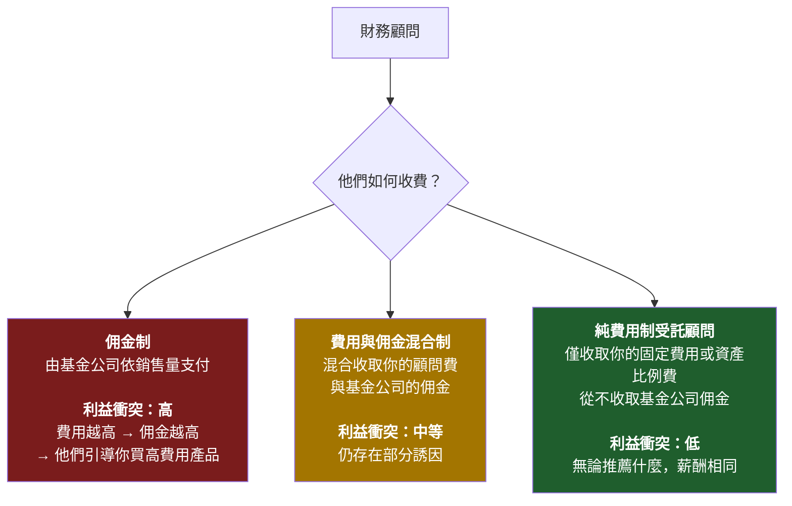
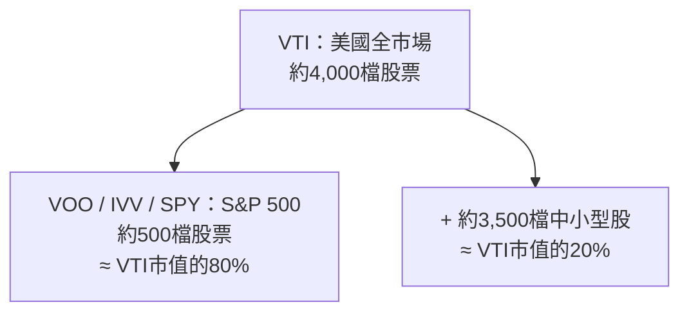
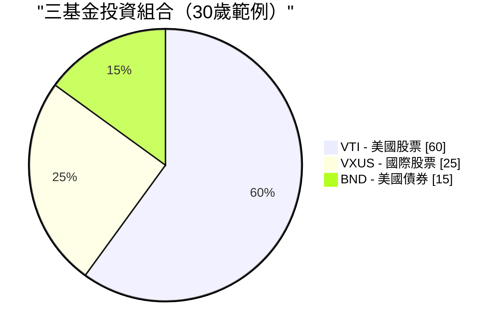

# 第二週：指數基金與指數股票型基金

動畫參考：`animation/week02_active_vs_passive.py`

---

## 第一部分：閱讀章節

---

### 1. 為何這至關重要

上週我們揭示了一個殘酷的事實：**通膨就是地心引力，而不投資是你能做的最昂貴的事。** 現在的問題是*如何*投資。以下這個答案，投資業花了四十年才願意承認：對幾乎所有人來說，正確的答案是**低費用的指數基金或指數股票型基金。** 不是選股，不是你銀行的「財富管理師」，不是你小舅子的內線消息，也不是你保險業務員拼命想賣給你的結構型商品。

這是整個課程中最重要的一課，而且它真的很簡單。如果你讀到第二週就停下來，設定每月自動定期定額投資一檔廣泛市場的指數股票型基金，然後這輩子再也不讀另一本財經書，**你的表現將會超越這個星球上絕大多數投資人——包括那些拿著百萬薪酬替別人管錢的專業人士。**

這不是業配話術，而是對過去四十年資料所呈現結果的客觀陳述：

- **約有 90% 的主動式管理美國大型股基金，在 20 年期間跑輸標普 500** ——這項數據每年由標普道瓊指數的 SPIVA 計分卡公布。
- **預測基金未來表現的最佳單一指標是費用率。** 不是基金經理的學歷背景，不是品牌，也不是過去報酬。就是費用。費用越低，平均而言未來報酬越高。（晨星在一次又一次的研究中都印證了這點。）
- **華倫·巴菲特——史上最知名的主動式投資人——在遺囑中指示，他妻子的遺產要投入「一檔費用極低的標普 500 指數基金」。** 如果史上最偉大的選股者告訴自己的遺孀放棄選股，這本身就說明了一切。

所以本週我們將聚焦三件事。第一，指數基金究竟是什麼，以及它如何誕生的那段略帶異端色彩的歷史。第二，金融業從散戶投資人身上榨取財富的四大手段——高費用主動式基金、佣金驅動的顧問、以保險包裝的「投資」商品，以及慢慢蠶食你資產的老式共同基金——以及如何一一識破。第三，你真正需要的幾個特定股票代碼。

最後有一個誠實的懸念：**指數基金的共識已運行了四十年，但並不保證永遠有效。** 它何時、以何種方式可能失靈，以及你該如何應對，是我們在後面幾週才會回頭討論的主題。現在，我們先打好地基。進階操作留待之後——是*建立在*這個地基之上，而不是取而代之。

> *「投資是必要的。這門課的其他工具都只是加分項。」*

---

### 2. 你需要了解的事

#### 2.1 什麼是指數？

**股票指數**是一份依照一套規則組成的股票（或其他資產）清單。沒有人「管理」這個指數——它就是其規則所規定的樣子。標普 500 的定義是「符合特定流動性、獲利能力和上市條件、以市值加權的 500 家最大美國企業」。就這樣，電腦就能自動執行。

當新聞說*「市場今天上漲 2%」*，幾乎都是指標普 500 上漲了 2%。

你會常聽到的主要指數：

| 指數 | 追蹤標的 | 成分數 |
| --- | --- | --- |
| **標普 500** | 500 家最大美國企業 | 約 500 |
| **CRSP 美國全市場指數** | 整體美國股票市場 | 約 4,000 |
| **道瓊工業平均指數（DJIA）** | 30 家美國大型企業（價格加權，相當老式） | 30 |
| **那斯達克綜合指數** | 那斯達克所有股票 | 約 3,000 |
| **那斯達克 100 指數** | 那斯達克前 100 大非金融股（科技股偏重） | 100 |
| **羅素 2000 指數** | 2,000 家美國小型企業 | 約 2,000 |
| **MSCI 歐澳遠東指數** | 美國及加拿大以外的已開發市場 | 約 800 |
| **MSCI 新興市場指數** | 新興市場國家 | 約 1,400 |
| **富時 100 指數** | 英國前 100 大企業 | 100 |

**大多數主要指數以市值加權。** 這意味著一家公司在指數中的權重與其總市值成正比。蘋果市值約 3 兆美元，在標普 500 中佔約 7% 的權重；市值最小的成分股約 100 億美元，僅佔約 0.02%。前 10 大公司通常佔**整個指數的 30–35%。** 當你「買入標普 500」時，你買到的其實比「500 檔股票」這個名稱所暗示的，更集中於少數幾家超大型股。

這就是整個運作機制。其中沒有任何天才之處，而這正是它有效的原因。

---

#### 2.2 指數基金——柏格的異端構想

指數基金直到 1976 年才問世。在此之前，美國所有共同基金都是主動式管理：西裝筆挺的聰明人選股，每年收取 1–2% 的費用作為服務報酬。當時的數學與現在相同——他們大多數人都輸給市場平均——但學術研究發現還未凝固成一項產品。

**將這個數學論證轉化為產品的人是約翰·柏格。** 柏格於 1974 年遭威靈頓管理公司解雇。1975 年他創立了一家奇特的新共同基金公司——**先鋒集團（Vanguard）**，採用共同所有制結構，由基金持有人自身所擁有，沒有外部獲利動機。1976 年先鋒推出了**第一指數投資信託**，即第一檔零售指數基金：它只須按照指數權重買入標普 500 的全部 500 檔股票，並收取極低的費用。

業界對此嗤之以鼻，媒體稱之為**「柏格的愚蠢之舉」。** 券商拒絕銷售（因為無佣金可賺）。這檔基金在首次公開發行時僅募集了 1,100 萬美元，遠低於柏格設定的 1.5 億美元目標。競爭對手稱這個構想**「不符合美國精神」**，是**「平庸的保障配方」。**

競爭對手說它保證平庸倒是沒錯——*如果平庸指的是「市場平均減去幾個基點的費用」的話。* 他們沒想到的是：市場平均減去幾個基點，在 20 年間能打敗約 90% 的專業投資人。

如今先鋒管理的資產超過**8 兆美元**，指數基金與指數股票型基金合計在全球管理**逾 20 兆美元**。柏格的「愚蠢之舉」成為全球零售股票投資的主流形式。他本人於 2019 年辭世，而他從未像其他每一位管理 8 兆美元規模資產公司的創辦人那樣中飽私囊——先鋒的共同所有制結構意味著省下的費用回流給基金持有人，而不是進他自己的口袋。他是金融界極少數真正配得上「英雄」二字的人，毋須加引號。

> 「別在草堆裡找針。直接把整個草堆買下來。」——約翰·柏格

---

#### 2.3 共同基金 vs. 指數股票型基金——為何共同基金仍然存在（以及為何你大多數時候應選擇指數股票型基金）

**指數基金**是一種*策略*——「追蹤指數」。這個策略可以包裝在兩種不同的*形式*中：

- **共同基金**：每天以收盤淨值進行一次交易定價。
- **指數股票型基金（ETF）**：在交易所像股票一樣即時交易。

| 特性 | 共同基金 | 指數股票型基金 |
| --- | --- | --- |
| 交易時機 | 每日**一次**，以收盤淨值成交 | **全天**，如同股票 |
| 最低投資金額 | 通常**1,000–3,000 美元** | **一股價格**（或部分股份） |
| 稅務效率（應稅帳戶） | **較差**——強制對所有持有人進行資本利得分配 | **較佳**——實物申購贖回機制保護持有人 |
| 手續費 | 在該基金自家券商為 0 美元 | 在多數券商為 0 美元 |
| 便利的自動定期投資 | **是**（固定金額，任意日期） | 有時較麻煩（需整股，除非支援零股） |

**在 2026 年，指數股票型基金在幾乎所有重要面向勝出**——較低的投資門檻、即時定價、大幅更優的稅務效率、平均更低的費用率。共同基金仍具有真正優勢的情況只有：

1. **401(k) 及其他雇主退休計畫。** 大多數美國 401(k) 的選單仍以共同基金為主。計畫管理人尚未完成轉換，你通常也無法自行將指數股票型基金加入計畫。在 401(k) 中，共同基金的稅務問題大多不成問題（帳戶享有稅務遞延），所以包裝形式是被迫選擇，且影響無害。
2. **以固定金額設定自動投資。** 先鋒共同基金讓你設定「每月一日投入 500 美元」，並精確執行，包括購買零股單位。指數股票型基金的自動投資功能雖然存在，但依各券商而異。

**大致就這些。** 在 2026 年的一般應稅證券帳戶中，追蹤相同指數的指數股票型基金版本，對幾乎所有散戶而言，無論是費用還是稅後報酬都優於共同基金版本。**預設選擇指數股票型基金。** 如果你只能透過 401(k) 投資，共同基金也沒問題——在選單中選最便宜的廣泛市場指數選項，繼續往前走就好。

共同基金至今仍規模龐大，並非因為它們*更好*，而是因為**數兆美元的舊有資金停留在 401(k)、IRA 和舊帳戶中**，若將共同基金轉換出去將觸發應稅資本利得。是惰性，不是優點。新投入的資金幾乎都應流向指數股票型基金。

---

#### 2.4 主動式 vs. 被動式——那 90% 的統計數字

**主動式投資**意味著基金經理（或你）試圖挑選會漲的股票、避開會跌的股票。研究、分析、頻繁交易、押注於特定判斷——這就是所有主動式管理共同基金和避險基金所做的事，也是他們向你收費的理由。

**被動式管理**意味著買入整個指數，接受市場平均報酬。不做預測，不押注，不靠魅力。

核心問題是*「主動式基金經理能否打敗指數？」* 標普道瓊指數的 SPIVA 計分卡二十多年來每年重複給出的正統答案是：**大多數不能。** 時間越長，情況越糟：

| 類別（美國） | 5 年跑輸比例 | 10 年跑輸比例 | 20 年跑輸比例 |
| --- | --- | --- | --- |
| **美國大型股** | 78% | 85% | **90%** |
| **美國中型股** | 74% | 83% | 89% |
| **美國小型股** | 68% | 79% | 88% |
| **國際股票** | 71% | 82% | 87% |
| **新興市場** | 69% | 80% | 85% |
| **美國投資等級債券** | 72% | 81% | 86% |

*（數字取自近期 SPIVA 報告的概略值；確切數字每年略有變動，但定性規律不變。）*

> 換句話說：每 100 位美國大型股基金經理中，**有 90 位在 20 年期間輸給了一台執行 500 個名稱簡單清單的電腦。**

更致命的後續：**這次贏的 10 位，下一個十年不會是同樣的 10 位。** 標普的持續性研究一再顯示，五年內排名前四分之一的基金，在接下來五年中多數都跌出前四分之一。過去的超額報酬無法預測未來的超額報酬——每份基金說明書底部的這個警語是真的，但大多數投資人視而不見。

主動式基金經理整體上無法打敗指數，有五個原因：

1. **費用。** 主動式基金每年收取 0.5–1.5%。指數股票型基金只收 0.03%。基金經理每年必須超越指數**超過整整一個百分點**，才能在費用上和廉價選項打平。
2. **交易成本。** 每一筆買賣都有摩擦成本——買賣價差、市場衝擊、機構端的手續費。高週轉策略持續失血。
3. **稅務。** 高週轉在共同基金中觸發資本利得分配，不管你有沒有賣出，當年都要繳稅。
4. **市場大致有效。** 數萬名專業人士閱讀著相同的年報、相同的法說會紀錄、相同的衛星數據。真正的優勢極為罕見。
5. **存活者偏差。** 表現糟糕的基金會被悄悄清算或併入其他基金。現存的「主動式基金」整體看起來比實際更好，因為最差的輸家已被掩埋。

---

#### 2.5 費用率——你能掌控的最大槓桿

**費用率**是基金每年收取的費用，每天自動從基金資產中扣除。你永遠看不到帳單，它只是悄悄以略低的報酬率呈現。

這種無形性，正是它作為財富汲取機制得以奏效的全部原因。**1% 的費用聽起來微不足道，但三十年下來，它會吞噬你終值財富的大約 25–30%。** 複利是把雙面刃：它讓你的錢增長，也讓費用增長。

以 10 萬美元投資、年毛報酬率 10%，持有 30 年：

| 基金類型 | 費用率 | 淨報酬率 | 第 30 年終值 | 相對指數損失於費用 |
| --- | --- | --- | --- | --- |
| **指數股票型基金**（如 VOO） | **0.03%** | 9.97% | **1,721,686 美元** | — |
| 低費用主動式基金 | 0.50% | 9.50% | 1,526,688 美元 | **−194,998 美元** |
| 平均主動式基金 | 1.00% | 9.00% | 1,326,768 美元 | **−394,918 美元** |
| 高費用主動式基金 | 1.50% | 8.50% | 1,152,309 美元 | **−569,377 美元** |
| 保險商品包裝 | 2.00% | 8.00% | 1,006,266 美元 | **−715,420 美元** |

再看一遍最後那一行。**2% 的包裝費用讓你在 10 萬美元的投資上損失逾 70 萬美元。** 那不是費用，那是一棟房子，甚至可能是兩棟，取決於城市。那些錢從你的退休金流入基金公司的薪資、行銷預算、辦公室租金和執行長薪酬。

**無論市場環境如何，費用都持續複利累積。** 市場下跌 30% 的那一年，你照樣要繳。基金經理那年跑贏指數 0.4% 的那一年，你還是欠他 1.0%。費用是基金說明書上唯一有保障的數字。

還有兩個業界希望你不要內化的事實：

- **在任何基金類別中，費用較低的基金平均表現優於費用較高的基金。** 這是基金研究中最廣泛被複製的發現——晨星已在跨資產類別、跨數十年的研究中證明了這點。一個類別中費用最低的基金，平均而言是該類別中最好的基金。
- **費用是*確定的*拖累，基金經理的超額報酬是*期望中的*抵銷。** 以確定性換取希望，在任何其他領域都被認為是糟糕的交易。

---

#### 2.6 財務顧問的陷阱

如果主動式基金這麼糟，為何每家銀行、券商和「財富管理」部門還繼續銷售它們？因為**財務顧問的薪酬結構讓銷售這些產品對顧問而言是理性的**，即使對你而言是非理性的。

你會遇到三種薪酬模式：

**問任何顧問最重要的一個問題：*「您是受託人嗎？您是純費用制嗎？」*** 受託人在*法律上*必須以你的最佳利益行事。非受託人的業務員只需推薦「適合」你的產品——這個標準低得多，歷史上允許向任何能簽名的人銷售高費用劣質產品。

你銀行的「私人財富管理師」如此熱切地想把你塞進費用率 1.5%、前收手續費 5% 的主動式基金，是因為銀行兩頭賺：前端手續費先賺一次，加上你持有期間不斷流入的 12b-1 行銷費分成。**你不是他們的客戶，你是他們的商品。** 基金公司付錢給他們，把你交付出去。

面對非受託顧問推銷主動式基金，最乾脆的回應是：*「請用書面告訴我，持有這檔基金十年的全部費用——費用率、申購手續費、12b-1 費用、顧問費、帳戶費用——以及貴公司從這個基金家族獲得的報酬。」* 如果他們拒絕或拖延，你已經得到答案了。

> **預設原則：** 除非你已擁有數百萬美元且面臨真正複雜的稅務情況，否則你幾乎肯定不需要財務顧問。你需要的是一檔指數股票型基金和一筆每月自動轉帳。

---

#### 2.7 保險「投資」幾乎都是騙局

我想在這裡說得格外直接。**變額萬能壽險、指數型萬能壽險、以「投資」名義銷售的終身壽險、連結股票的儲蓄商品、向散戶行銷的結構型年金——這些商品極少例外，都是掠奪性商品，專門設計來向不知情的人收取費用。**

話術永遠是以下幾種組合：

- *「節稅增值。」*
- *「本金保護。」*
- *「參與股市上漲，同時規避下跌風險。」*
- *「強迫儲蓄的紀律。」*

實際情況幾乎永遠是：

- 頭 5–10 年解約須支付 **5–10% 的解約費**。
- **全包費用每年 2–4%**，藏在不透明的語言中（「死亡及費用費用」、「附加保障費用」、「行政費用」、「基金管理費」，一層一層疊加）。
- **扣除費用後的報酬嚴重落後基本指數股票型基金**——在底層市場給出 8–10% 的情況下，往往只交出 2–4% 的淨報酬。
- **業務員的佣金最高可達你第一年保費的 80–100%**，這正是他們被如此大力推銷的原因。

一個終身保護你的原則：

> **保險是為了風險轉移，投資是為了財富創造。永遠不要把兩者混為一談。**

如果你有需要扶養的家人，其生計會因你的離世而受到影響，請**購買定期壽險**——純粹、便宜、固定期限的保障，不含任何投資成分。一位健康的 30 歲成年人，20 年、保額 100 萬美元的定期壽險每月約只需 25–35 美元。然後把定期壽險與業務員本來要向你收取的終身壽險保費之間的差額，**全部投入一檔指數股票型基金。** 這是教科書級別的策略：**「買定期、投資差額。」** 在任何 20 年期間，這個策略在扣費後的淨資產上，都以數量級的優勢勝過終身壽險——而且你完全掌控投資部分的所有權與流動性。

業務員會告訴你終身壽險「強迫你儲蓄」。你的證券帳戶每月自動轉帳也能達到同樣效果，而且不需要付給他們 80% 的佣金。

---

#### 2.8 誠實的反例——確實有效的主動式基金

前幾節我花了很多篇幅批評主動式管理。為了保持知識上的誠實，我必須直接說明：**確實有少數主動式基金經理打敗了指數，而且是決定性地、持續數十年地超越。** 雖然不多——但多到值得正視。

值得一提的案例：

- **巴菲特與查理·蒙格領導下的波克夏·海瑟威。** 從 1965 年到 2020 年代初，波克夏的每股帳面價值以約**每年 20%** 的速度複利增長，而標普 500 約為 10%——這是現代金融史上最令人印象深刻的長期紀錄。巴菲特是「主動式管理確實可行」的教科書例證。他同時也是告訴遺孀把遺產投入標普 500 指數基金的那個巴菲特。他是那個例外，而他在告訴你：你不是那個例外。
- **彼得·林區 / 富達麥哲倫基金，1977–1990 年。** 林區掌管麥哲倫基金 13 年，年化報酬率約 **29%**，在 13 年中有 11 年打敗標普 500——堪稱史上最偉大的共同基金紀錄。他在 46 歲退休。林區離開後，麥哲倫的表現回歸到大致追蹤指數的水準。
- **文藝復興科技的大獎章基金，約 1988 年起。** 一檔高頻、高數學含量、僅限員工投資的量化基金，據報在超過三十年間，**扣除 5% 管理費和 44% 績效費後，年化報酬率約 40%。** 大獎章基金自 1993 年起對外部投資人關閉，而文藝復興科技旗下的*外部投資人*基金（RIEF、RIDA）表現差距懸殊——有時在大獎章大漲 70% 的年份反而虧損。**大獎章基金是真實、持久的阿爾法存在的證明，也正是這個證明說明了：真正的阿爾法被封閉起來，永遠不會流到你手中。**
- **賽斯·卡拉曼的包普斯特集團。** 數十年來在結構性波動性低於市場的情況下，取得媲美股票的報酬，靠的是堅守深度價值框架，以及在找不到符合標準的標的時持有極高比例的現金。卡拉曼的著作《安全邊際》二手書售價超過 1,000 美元，因為他拒絕再版。
- **喬爾·葛林布拉特在高譚資本，1985–1994 年。** 在一本小型特殊情況的投資帳冊上，連續十年年化報酬率約 50%，之後返還外部資本。葛林布拉特後來在《你可以成為股市天才》和《打敗大盤的獲利公式》中公開了這套方法——明確押注這個策略*市值太小、太令人不安、需要太大耐心*，大多數讀者根本無法真正執行。

注意這個規律。那些有明確證據在數十年間打敗指數的基金，要麼**已對新資金關閉**（大獎章），要麼**在高峰期間歇性關閉**（麥哲倫），要麼**本身就是一個獨立的控股公司**（波克夏），要麼**明確地小到一旦規模化就會消滅優勢**（葛林布拉特早期），要麼**高度集中且需要熬過多數投資人無法忍受的多年最大回撤**（卡拉曼）。

這個教訓不是*「主動式管理從不奏效」*，而是**真正有效的主動式策略，很少是你能從銀行產品選單上買到的那些。** 而你*能*從銀行產品選單上買到的主動式基金，整體上正是 SPIVA 計分卡追蹤到的、那 90% 輸給指數的基金。

如果你有時間、有心態，且在市場的某個特定角落擁有真實、持久的優勢，當然可以在那裡集中布局。大多數讀者沒有。**大多數讀者應該把大部分資金配置於指數，然後把時間花在其他地方。**

---

#### 2.9 你真正需要的指數股票型基金

你不需要記住市面上數千檔指數股票型基金。你需要的只是這份簡短清單：

| 代號 | 基金 | 費用率 | 追蹤標的 |
| --- | --- | --- | --- |
| **VOO** | Vanguard S&P 500 指數股票型基金 | **0.03%** | 美國最大的500家公司 |
| **VTI** | Vanguard 美國全市場指數股票型基金 | **0.03%** | 整個美國市場（約4,000檔股票） |
| **IVV** | iShares Core S&P 500 指數股票型基金 | 0.03% | S&P 500（BlackRock版本的VOO） |
| **SPY** | SPDR S&P 500 指數股票型基金 | 0.09% | S&P 500（歷史較久、費用較高，交易員最愛） |
| **VXUS** | Vanguard 國際全市場指數股票型基金 | 0.07% | 所有非美國已開發市場＋新興市場 |
| **VT** | Vanguard 全球股票指數股票型基金 | 0.07% | 全球市場（美國＋非美國合而為一） |
| **BND** | Vanguard 美國全債市指數股票型基金 | 0.03% | 美國投資等級債券 |
| **QQQ** | Invesco NASDAQ-100 指數股票型基金 | 0.20% | 納斯達克最大100家非金融公司（科技股為主） |

**VOO vs. VTI vs. SPY** 是被問最多的問題。簡短版本如下：

- **VOO** 和 **IVV** 追蹤相同的指數（S&P 500），費用相同（0.03%）。選哪一檔都好。
- **SPY** 同樣追蹤 S&P 500，但費用是前兩者的 **3倍**（0.09%）。它之所以存在，是因為它是*第一檔*美國指數股票型基金（1993年），所以流動性最深——法人交易員在乎這點，長期投資者不需要在乎。**不要為你用不到的流動性多付3倍費用。**
- **VTI** 持有整個美國市場（約4,000檔股票），而不只是最大的500家。實際上，VOO 和 VTI 的報酬幾乎完全相同，因為 S&P 500 大約佔美國股票市場市值的80%。若你想持有單一基金、同時追求稍多的分散投資，選 VTI。若你想持有單一基金、追蹤所有人都在引用的最乾淨指數，選 VOO。**這兩者之間沒有錯誤答案。**

---

#### 2.10 如何實際買進

整個流程就是這樣，只需要15分鐘：

1. **開立券商帳戶。** 美國居民：Fidelity、Schwab 或 Vanguard——三家都免費，三家平台都很正常。香港／台灣／新加坡居民：Interactive Brokers 是買美國掛牌指數股票型基金最便宜的跨境主流選擇。
2. **連結銀行帳戶並轉入資金。** ACH轉帳需要1到3個工作天。
3. **搜尋代號。** 輸入「VOO」，基金頁面就會跳出來。
4. **下買單。** 市價單＝以當前價格買進。輸入股數或金額（現在大多數券商都支援零股買入）。
5. **設定每月自動投資。** 例如設定每月1號自動投入500美元，然後忘記它的存在。

就這樣。**五個步驟，十五分鐘，你現在擁有美國最大500家公司的一份持股。** 不需要看CNBC，不需要盯著投資組合，不需要為選股焦慮。

買下去之後，最重要的事是**關掉app，停止查看。** 市場每天都在漲跌。盯著每日波動，是造成投資人行為偏差的最大原因——在恐慌中賣出、在狂熱中追買。SPIVA研究顯示指數股票型基金策略能打敗大多數主動管理基金，這當中每一分長期報酬，都來自*穿越*雜訊持續持有，而不是來回交易。

---

#### 2.11 三基金投資組合

對大多數讀者而言，以柏格推廣的風格建立一個**三基金投資組合**，真的就是整個投資組合的全部：

| 基金 | 代號 | 建議配置比例（30歲） |
| --- | --- | --- |
| 美國全股市 | **VTI** | 60% |
| 國際全股市 | **VXUS** | 25% |
| 美國全債市 | **BND** | 15% |

關於債券配置比例，傳統的**粗略經驗法則**是：**債券比例 ≈ 你的年齡 − 20**，大約如此。30歲持有約10至15%的債券；65歲持有約45至55%的債券。教科書上的邏輯是，債券是*壓艙石*：股票跌時債券漲，降低投資組合的波動性，並在接近退休的幾年保護你免受股票50%最大回撤之苦——畢竟屆時你等不起十年來等它回本。

> **我有一點話要提前說清楚，即使在基礎課程中也要告訴你：** 那套傳統邏輯是為一個已不復存在的世界所建立的。
>
> 「債券作為壓艙石」的框架假設了：（a）債券能提供高於通膨的實質殖利率，以及（b）股票下跌時債券會上漲。**這兩個假設在2020年代都已經失效。** 在各國政府靠印鈔票來支應龐大赤字的背景下（第一週，§2.2），以及中央銀行刻意將實質殖利率壓低至通膨以下（「金融壓制」），在通膨循環中持有長債基金根本不是壓艙石——而是購買力的緩慢流失。而在2022年，股票和債券*同時*各跌約20%，這恰恰是60/40股債配置本該保護你免遭的情境。
>
> 因此，請把上表中的債券配置視為**教科書的起點，本課程其餘部分將會挑戰它**。我們之後會回來討論在貨幣寬鬆時代，究竟什麼才真正扮演壓艙石的角色：
>
> - **第五週（債券）** 深入剖析債券的本質、歷史上避險功能奏效的原因，以及它失效的條件。
> - **第六週（黃金與原物料）** 介紹另一種抗通膨工具——黃金在人類有史以來每一種貨幣體制中都是價值儲存手段，2020年代持有黃金的理由遠比持有長存續期間債券更為充分。
> - **第47週（尾部風險避險）** 以及 **第五級整體內容** 會從頭重新建構投資組合的安全端，採用現金／短存續期間國庫券、黃金，以及長波動性選擇權結構的組合，而非傳統的長存續期間債券部位。
>
> 就你今天建立的基礎投資組合而言，三基金模板沒有問題，而且比完全不投資要好得多。**只是要了解，債券這個部分是這份投資組合中「保存期限」最短的，我們之後還會回來替換它。**

這整個投資組合的混合總費用率：**每年大約0.04%。** 也就是說，10,000美元每年只需要*四美元*。而這是一個觸及所有主要資產類別、涵蓋全球的分散投資組合。

---

#### 2.12 直到它失效為止——一個懸念

我在這整章都在告訴你，指數股票型基金就是答案。最後我想說明一個保留條件，這樣我才是個誠實的老師，而不是推銷員。

**買進持有的被動式管理指數策略，在過去40年——大約從1980年代初期以來——表現非常出色。** 它之所以奏效，是因為一系列特定條件同時存在：工作年齡人口多於退休人口、每個薪資週期機械性地買入；利率持續下降；美元的儲備貨幣地位；全球化；以及2008年以後聯準會每當金融情勢過度緊縮時都會出手干預。

**這些順風沒有任何一個能保證會永遠持續。**

當人口結構翻轉來臨——當嬰兒潮世代從淨買入者（資產累積期）轉變為淨賣出者（資產提領期）——過去40年持續抬升指數的那條機械性資金管道，就可能反向運作。被動式基金並非自主運作的；它們取決於終端投資人是在持續投入還是在提領資金。一個在上漲時由對價格不敏感的資金流主導的市場，在下跌時同樣會受到對價格不敏感的資金流所衝擊。

**這不是預測指數明天就會失效。這是誠實地承認，「它有效了40年」並不等於「它將永遠有效」。**

對*你*而言，在今天建立你的第一個投資組合時：**指數股票型基金是正確答案。** 建立好基礎，讓每月自動轉帳運作起來，在你學習課程其餘部分的這幾年間讓它持續複利增長。

關於指數何時以及為何可能失效、以及屆時你應該轉向什麼——這是我們在本課程其餘部分逐步建構的內容：

- **第23週（因子投資）** 介紹純粹市值加權指數化之外的第一批替代選擇——價值、動能、品質、低波動性傾斜，這些因子在歷史上捕捉到了市值加權指數所遺漏的報酬。
- **第43週（主動式管理）** 深入探討何時主動式管理*確實*值回票價，何時不值。
- **第五級（第47至52週）** 是我們真正建構「槓鈴」投資組合形態之處——一端是高確信度的安全資產，另一端是不對稱的投機部位，廣泛市值加權核心被刻意*移除*。那是進階形態，建立在第2至46週的所有內容之上。

現在：**投資是必須的。指數股票型基金是基礎。本課程中的其他一切都是加分項目，疊加在這個基礎之上。** 如果你打不贏指數——而大多數人在大多數時候都打不贏——那就不要浪費人生去嘗試。讓指數替你工作，把你的時間花在能讓你的人生增值的事情上，而不只是讓你的試算表增值。

但要明白，*「買進持有指數」*是一種依賴特定環境條件的策略，它在一個特定的40年時間窗口中奏效了。我們之後還會回來探討那個窗口關閉之後會發生什麼。現在，有這個基礎就夠了。

---

### 3. 常見迷思

**迷思一：「指數基金只適合初學者。」**

指數基金和指數股票型基金被主權財富基金、大學捐贈基金、退休基金和億萬富翁廣泛使用。CalPERS——全球最大退休基金之一——就執行大規模的指數基金授權。華倫．巴菲特，*史上*最著名的主動投資者，在2008至2017年間公開打賭100萬美元，賭一檔S&P 500指數基金將打敗一籃子精選避險基金，並以懸殊差距獲勝。指數化投資不是初學者的選項；它是理性選擇的結果，恰好也是最簡單的選項。

**迷思二：「一分錢一分貨——費用越高代表管理越好。」**

在幾乎所有其他消費品類別中，這是對的。但在投資領域，**這個關係是相反的。** 晨星公司橫跨資產類別和數十年的研究顯示，**費用率是預測未來基金表現最佳的單一指標**——比過去報酬更好、比星級評等更好、比基金經理人任期更好。費用越高→預期未來報酬越低。便宜的基金，平均而言，就是更好的基金。

**迷思三：「但我的理財顧問推薦了一檔主動管理基金。」**

許多理財顧問靠銷售特定基金賺取佣金——有時是公開的，但更多時候是隱藏在你永遠看不到的不透明收益分潤安排之中。他們的誘因是推薦讓*他們*賺最多的產品，而不是讓*你*複利成長最多的產品。**永遠要問：「你是純收費制的信任義務顧問嗎？你從任何推薦給我的產品中獲得的完整報酬是什麼？」** 如果他們不是，或是無法或不願以書面回答，就離開。

**迷思四：「指數基金在市場下跌時無法保護你。」**

沒錯——它們確實不能。它們本來也不該這樣。指數在市場下跌時跟著跌。正確的比較不是「指數 vs. 現金」，而是「指數 vs. 主動管理基金」。2008年S&P 500下跌約37%；美國主動管理股票基金的平均跌幅約為39%。主動管理基金在崩盤時並沒有保護你，平均而言它們讓跌幅更深。**在市場下跌時的保護，來自你的*資產配置*（股票、債券、現金各佔多少）以及你的行為（不要在恐慌中賣出），而不是來自你選擇了哪一檔基金。**

**迷思五：「我應該選擇過去五年表現最好的基金。」**

這是散戶投資人最常犯、也最昂貴的錯誤。**表現頂尖的基金會均值回歸。** S&P的持續性研究，十年又十年地重複顯示，排名前四分之一的基金中，五年後仍維持前四分之一的不到十分之一。過去績效不能預測未來績效；每份基金公開說明書底部的那句警語不是法律套話，而是每個人都視而不見的真實陳述。追逐過去的贏家，在預期報酬上，*比隨機選擇還要差*。

**迷思六：「SPY和VOO追蹤的是同樣的東西，所以買哪一檔無所謂。」**

它們確實追蹤同一個指數。但費用不同。SPY收取0.09%；VOO收取0.03%。一個持有500,000美元、持有30年的投資組合，這0.06%的差距複利下來，大約是**超過25,000美元的財富損失。** SPY唯一的結構性優勢是交易流動性，這只對移動大量資金的法人機構或當沖交易員有意義——對買進持有的投資者沒有意義。**對長期持有者而言，VOO或IVV在費用上永遠優於SPY。**

**迷思七：「我需要分散持有許多不同的指數基金。」**

像VTI這樣的單一全市場基金本身就持有約4,000檔股票。加上VXUS又給你另外約7,000檔國際股票。**兩檔指數股票型基金就涵蓋了全球各主要經濟體約11,000檔股票——在股票層面上已沒有任何進一步分散投資的空間。** 持有10檔以上的指數股票型基金，通常只會造成重疊（同樣的蘋果、微軟和Nvidia以不同比重出現在多檔基金中），以及一種虛假的分散感。兩到三檔基金就夠了。超過五檔通常是混亂的表現，而非精明的表現。

**迷思八：「指數基金很危險，因為你無法避開爛公司。」**

指數基金確實持有會倒閉的公司。2001年安隆崩潰時，它在S&P 500中約佔0.7%——抽象地看很痛，但對投資組合毫無影響。其他499家公司繼續複利增長。**指數*內部*的分散投資——數百甚至數千檔個股，沒有任何一檔的比重大到足以獨自毀掉你——就是保護所在。** 一個恰好重倉安隆的集中持股選股人，在那個部位上血本無歸。指數投資者只損失了0.7%。

**迷思九：「終身壽險是好的投資工具，因為它的現金價值免稅增長。」**

它並不是，而現金價值的說詞正是這個產品的銷售話術。終身壽險現金價值的實際報酬，扣除業務員佣金、解約費用表，以及分層的年費之後，通常只有**年化2至4%**，而同期你在指數股票型基金中可能賺到7至10%。**為了真正的身故保障需求而購買定期壽險，然後將定期壽險保費與終身壽險保費之間的差額投入指數股票型基金。** 這就是教科書上的「買定期、投差額」策略。在幾乎所有現實情境中，這個策略都勝出；業務員之所以永遠不會推薦它，正是因為這樣他們就賺不到佣金。

---

### 4. 問答

**Q1：指數股票型基金究竟是什麼？它和股票有什麼不同？**

**指數股票型基金**（Exchange-Traded Fund，ETF）是將一籃子證券打包成單一工具，像股票一樣在交易所交易。買進一股VOO，就等於按比例擁有S&P 500所有500家公司的一小部分。**股票代表單一公司；指數股票型基金代表一個定義好的一籃子資產。** 交易機制相同——有代號、有即時報價、在交易時間內可以買賣——但你能立即獲得分散投資的效果。

**Q2：VOO、VTI還是SPY——選哪一檔？**

對長期買進持有者而言：**VOO或VTI**，費用率均為0.03%。VOO＝S&P 500（約500檔個股）；VTI＝整個美國市場（約4,000檔個股）。兩者報酬幾乎相同，因為S&P 500市值約佔美國市場的80%。選哪一檔都好。**SPY是給交易員的，不是給投資者的**——和VOO相同的曝險，但費用是3倍。

**Q3：我的投資組合中有多少比例應該是指數股票型基金？**

對大多數在20至40歲建立第一個投資組合的讀者而言：股票部位中的**80至100%**應配置於廣泛市場指數股票型基金。股票與「安全資產」之間的確切比例取決於年齡和風險承受度：

| 年齡 | 股票比例 | 安全資產比例 |
| --- | --- | --- |
| 20–35歲 | 80–90% | 10–20% |
| 35–50歲 | 70–80% | 20–30% |
| 50–65歲 | 50–70% | 30–50% |
| 退休後 | 30–50% | 50–70% |

**關於用「安全資產」而非「債券」的說明：** 股票部位的教科書壓艙石歷來是債券配置，其假設是債券在股票下跌時會上漲。如§2.11所述，這個假設在2020年代已經失效——2022年股票和債券同步下跌，而在金融壓制下債券的實質殖利率也不再高於通膨。**「安全資產」這個部位因此應被理解為一籃子與股票市場不相關（或負相關）的資產，而不僅僅是債券。** 傳統債券配置是其中一個組成部分，但現代的安全資產部位還包括短存續期間國庫券和現金等價物、黃金及其他貨幣性金屬（第六週），以及在更進階的層面——長波動性選擇權結構和尾部風險避險覆蓋（第47週，第五級）。對你今天建立的第一個投資組合而言，像BND這樣的廣泛債券指數股票型基金是合理的起點；本課程其餘部分會教你如何隨著進步去替換和補充它。

在股票配置中，典型的比例是約70%美國（VTI）、30%國際（VXUS）。

**Q4：費用率vs.銷售手續費——有什麼不同？**

**費用率**是每年從基金資產中每日扣除的費用。0.03%乘以10,000美元等於每年3美元。**銷售手續費**是你買入（前收型）或賣出（後收型）時一次性收取的佣金。一筆10,000美元申購若收取5%前收手續費，就意味著500美元立刻消失，實際投入的只有9,500美元。**現代指數股票型基金不收銷售手續費。** 任何你在考慮的基金若收取手續費，幾乎可以肯定不值得買。

**Q5：如果90%的主動管理基金輸給指數，為什麼主動型基金還存在？**

因為它們對基金公司來說**獲利豐厚。** 一檔規模100億美元的基金，以1%費用率計算，每年坐收1億美元的費用，不管績效好壞。投資人輸給指數，對投資人是壞事，但對基金公司來說是穩定的經常性收益生意。加上買CNBC廣告時段的行銷預算、分銷它們的銀行分行網絡、被付錢來銷售它們的理財顧問，以及投資人相信能言善道的基金經理人可以打敗大盤的心理——**主動型基金業之所以持續存在，是因為它向價值鏈上的每個人付錢，就是不向你付錢。**

**Q6：指數基金可能歸零嗎？**

理論上，只有當指數中的每一家公司同時破產才可能發生——那意味著整個美國經濟已經崩潰，屆時任何金融資產的價值都只是學術問題。實際上，歷史上最嚴重的廣泛指數最大回撤（1929至32年、2007至09年、2020年COVID閃崩）從高點到低點下跌了50至80%，但都在十年內回升至歷史新高。**單一股票絕對可以歸零，而且已有許多例子。廣泛指數實際上不可能歸零。** 這種不對稱性，正是分散投資奏效的根本原因。

**Q7：國際指數基金——我也應該持有嗎？**

大多數合理的資產配置都包含一定的國際曝險。美國在全球股票市場市值中約佔60%；其餘40%分布在歐洲、日本、新興市場及其他地區。國際分散投資可以降低投資組合波動性，因為各地區市場並非完全同步。**VXUS**（Vanguard國際全股市指數股票型基金），費用率0.07%，單一基金涵蓋已開發和新興市場約7,000檔個股。常見的粗略比例是 **70%美國（VTI）、30%國際（VXUS）**。

**Q8：什麼是定期定額投資？我應該用它來投資指數股票型基金嗎？**

**定期定額投資（Dollar-Cost Averaging，DCA）**＝不管市場如何，以固定金額按固定頻率投資。每個月投入500美元，不管市場在做什麼。價格低時，500美元買到更多股份；價格高時，500美元買到較少股份。結果是平均成本略低於該期間的簡單平均市場價格，加上更重要的行為面好處：**你在那些令人害怕的月份仍持續投資，而不是等待那個「感覺永遠不對」的「正確時機」。** 對靠薪資收入投資的人來說，定期定額本來就自動發生了。對於手上有一筆錢的人，學術研究結果不一——歷史上，一次性投入的表現平均而言略優於定期定額（因為市場多數時間是上漲的），但定期定額在心理上更容易堅持。

**Q9：指數基金有配發股利嗎？**

有。指數中的公司向基金配發股利，基金收取後每季分發給持有人。VOO目前的股利殖利率約為1.3至1.5%。大多數券商允許你開啟**DRIP（股利再投資計畫）**，自動將每次收到的股利用於買進同一檔基金的更多股份。幾十年下來，**再投資的股利在股票總報酬中佔了相當大的比例**——請預設開啟DRIP。

**Q10：我聽說過「Smart Beta」或「因子」指數股票型基金——那和指數基金一樣嗎？**

不完全是。傳統指數基金採用**市值加權**（公司越大，指數中的比重越高）。**Smart Beta** 或 **因子**指數股票型基金同樣是以規則為基礎、系統性再平衡——所以類似指數——但它們按市值*以外*的某個因子來加權：價值（便宜的基本面）、動能（近期強勢股）、品質（乾淨的資產負債表）、低波動性（無聊的股票）、小市值等等。費用率高於普通指數基金（通常為0.10至0.40%），因為再平衡規則更複雜，但仍比主動型基金便宜得多。**因子投資是個重要的主題，我們在第23週深入介紹。** 不過對於你的第一個投資組合而言，純粹的市值加權指數股票型基金是正確的起點。

**Q11：我應該在指數股票型基金之外額外持有個股嗎？**

如果你在某家公司或某個產業確實擁有持久的優勢——來自本職工作的領域專業知識、對你親身置身其中的行業的結構性洞見——那麼**以一個小型「衛星」部位持有個股，搭配指數核心，是合理的。** 常見的形態是80至90%配置在廣泛市場指數股票型基金，10至20%用於個別高確信度個股。**你不應該做的是**：因為在社群媒體上看到選股建議、因為品牌熟悉，或因為它上個月剛大漲而買進個股。SPIVA的90%統計數字套用在散戶選股上，遠比套用在專業基金經理人上更為殘酷——大多數散戶的個股投資組合表現都*明顯落後*於他們本可直接買進的指數。如果你無法用一句話清楚說明為什麼這檔股票相對其基本面被低估，那你就沒有優勢——你只有一個看法。有看法並無不妥；只是不要把它按照優勢的規模來配置。

**Q12：我一直聽說指數「集中在大型科技股」——這是個問題嗎？**

這是個真實的觀察。2026年S&P 500前十大持股（主要是大型科技股——蘋果、微軟、Nvidia、Alphabet、亞馬遜、Meta等）佔整個指數市值比重約**30至35%。** 買進VOO所獲得的大型科技股曝險，遠比「500檔個股」這個名稱所暗示的要集中得多。這是否是個*問題*，取決於你對這些公司的看法。涵蓋面更廣的VTI集中度稍低（因為前十大持股的比重被分散到約4,000檔個股中），而明確的等權重S&P 500指數股票型基金（RSP，費用率約0.20%）則走另一個極端——相同的500檔個股，等比例加權。**就目前而言，市值加權指數仍然是最簡單、歷史表現最佳的預設選擇。** 這個集中度問題及其所隱含的風險，正是我們在第23週及之後進一步培養的那種「考量環境條件」的思維方式。

---

## 第二部分：YouTube 腳本

---

**影片標題：** 這檔指數股票型基金勝過九成華爾街基金經理人｜第二週

**目標時長：** 約 30 分鐘

**主持人：**
- **陳馬**（老師）：資深散戶投資人，以第一人稱分享數十年親自操盤的經驗
- **小魚**（學生）：剛從大學畢業、正在學習如何投資積蓄的社會新鮮人，提出觀眾心中的疑問

---

**[開場 / 第 0 段：承諾]**

[VISUAL: Cold-open title card -- "$700,000. That's what your fees cost you."]

[ANIMATION: Hundreds of stock tickers swirling chaotically, then being swept into
a single basket labeled "ONE ETF". A subtitle fades in: "And it beats 90% of
the pros."]

**陳馬：** 你只要看完這支影片，然後在你的財務人生中什麼都不做——不讀書、不聽 Podcast、不用選股 App——你依然能夠打敗華爾街幾乎所有的專業基金經理人。

**小魚：** 這個說法也太誇張了吧。

**陳馬：** 這不是我說的。這是數據說了四十年的話。答案就是一檔低費用的廣市場指數股票型基金。不是你銀行的財富管理師，不是你姐夫的明牌，也不是保險業務員拼命想賣給你的結構型商品。

**小魚：** 但幾乎沒有人真的這樣做。

**陳馬：** 因為有一個規模幾十兆美元的產業，靠的就是你不這麼做來支撐他們的薪水。今天我想帶你看我自己投資組合的基礎，然後在最後，我會說一件這個領域裡沒有人會承認的老實話：這個策略已經奏效了四十年，但它並不保證永遠有效。

**小魚：** 好，懸念留下了。我們先從基礎開始吧。

[VISUAL: Title card -- "1. What Is an Index?"]

---

**[第 1 段：什麼是指數？]**

**陳馬：** 在談指數股票型基金之前，我們必須先定義「指數」。指數就是一份依照一套規則篩選出來的股票清單，沒有人主動管理它。S&P 500 的定義是「符合特定流動性與上市條件、以市值加權的 500 家最大美國企業」，這就是全部的定義，一台電腦就能執行。

**小魚：** 所以新聞說「大盤今天漲了百分之二」，說的就是 S&P 500？

**陳馬：** 幾乎都是。S&P 500 是美國最主要的股票指數，代表著整個美國市場約八成的總市值。

[VISUAL: Quick table flashes the major indices -- S&P 500, CRSP US Total Market,
Dow Jones (30 names, price-weighted, "an antique"), Nasdaq Composite, NASDAQ-100,
Russell 2000, MSCI EAFE, MSCI Emerging Markets, FTSE 100.]

**小魚：** 這五百家公司的權重是一樣的嗎？

**陳馬：** 不一樣，而且這正是大多數人忽略的地方。S&P 500 是以市值加權的。蘋果市值三兆美元，權重大約是百分之七；最小的成分股市值約一百億美元，權重只有約萬分之二。

[ANIMATION: Bar chart, top of week02_active_vs_passive.py -- Apple ~7%,
Microsoft ~6.5%, descending to a tiny sliver at the right end.]

**陳馬：** 前十大成分股——蘋果、微軟、輝達、Alphabet、亞馬遜、Meta 以及其他幾家——加起來大約佔整個指數的三成到三成五。

**小魚：** 所以我「買 S&P 500」，其實是買了一個高度集中在大型股的部位？

**陳馬：** 是一個比「500 檔股票」這個名字所暗示的更集中的大型科技股部位。記住這點，我們之後在課程中還會再回來談。

[VISUAL: Title card -- "2. Bogle's Heretical Idea"]

---

**[第 2 段：柏格的離經叛道之舉]**

**陳馬：** 指數基金直到 1976 年才出現。在那之前，美國每一檔共同基金都是主動式管理——穿著西裝的聰明人選股，每年收取百分之一到二的費用。當時的數學跟現在一樣：大多數人的績效都輸給市場平均。學術研究的結論早就在那裡了，只是還沒有人把它包裝成一個產品。

**小魚：** 直到有人做了。

**陳馬：** 這個人叫做傑克‧柏格。柏格在 1974 年被威靈頓管理公司解雇，隔年他創辦了一家奇特的新基金公司——先鋒集團，採取共同所有制結構，由基金持有人共同擁有，沒有外部股東的獲利動機。1976 年，先鋒推出了第一檔指數投資信託基金，這檔基金會按照指數權重買入 S&P 500 的所有五百家公司，並收取極低的費用。

**小魚：** 華爾街怎麼反應？

**陳馬：** 華爾街嘲笑他。媒體稱之為「柏格的愚行」。券商拒絕銷售，因為沒有佣金可賺。首次公開發行只募到了一千一百萬美元，遠低於柏格設定的一億五千萬美元目標。競爭對手稱這是「不愛國的行為」、「保證平庸的配方」。

**小魚：** 那現在呢？

[VISUAL: Bold text card -- "Vanguard today: $8 trillion. Index ETF category:
$20 trillion." Photo of Bogle, dates 1929-2019.]

**陳馬：** 先鋒集團現在管理超過八兆美元的資產。全球指數基金與指數股票型基金的規模已超過二十兆美元。柏格的「愚行」成為了全球散戶股票投資最主流的形式。而讓他成為我心目中英雄的是：因為先鋒採取共同所有制，省下來的費用回流給了基金持有人，而不是進了他個人的口袋。任何一位管理八兆美元資產公司的創辦人，都應該在富比世富豪榜上榜。柏格不在榜上。他於 2019 年辭世。

**小魚：** 一位沒有讓自己致富的金融英雄，這份名單很短。

**陳馬：** 名單上只有一個人。他自己說過最好的一句總結：*「不要在草堆裡找針，直接把整個草堆買下來。」*

[VISUAL: Title card -- "3. Mutual Fund vs ETF"]

---

**[第 3 段：共同基金 vs 指數股票型基金]**

**陳馬：** 快速說明一下包裝的差異，因為很多人搞混了。指數基金是一種「策略」——追蹤指數。這個策略可以用兩種不同的「包裝」來銷售：一種是共同基金，每天收盤後以當日淨值交易一次；另一種是指數股票型基金，在交易所像股票一樣即時交易。

[VISUAL: Side-by-side comparison table -- Mutual Fund vs ETF on five rows:
trading hours, minimum investment, tax efficiency, commissions, auto-invest.]

**小魚：** 哪個比較好？

**陳馬：** 在 2026 年的一般應稅券商帳戶裡，指數股票型基金在幾乎所有重要面向上都勝出——最低投資門檻更低、即時報價、透過實物贖回機制帶來顯著更優異的稅務效率、平均費用率也更低。共同基金仍然勝出的場合只有兩個：一是在 401(k) 退休帳戶內，投資選項是固定的、稅務問題也不存在；二是要設定固定金額的自動定期定額投資，這方面先鋒的共同基金做得非常好。

**小魚：** 那共同基金為什麼還是到處都是？

**陳馬：** 慣性使然。有幾兆美元的舊資金停放在 401(k)、個人退休帳戶，以及舊版券商帳戶裡，轉出去會實現一大筆應稅資本利得。它們留著，不是因為它們更好，而是因為搬移要付出代價。**新投入的資金幾乎都應該放進指數股票型基金。**

[VISUAL: Title card -- "4. Active vs Passive -- The 90% Statistic"]

---

**[第 4 段：主動式管理 vs 被動式管理——九成的統計數據]**

**陳馬：** 來看核心數據。S&P Dow Jones Indices 每年發布 SPIVA 計分卡——S&P 指數對抗主動式管理基金。在二十年的觀察期間，**大約九成的美國大型股基金經理人績效輸給 S&P 500。**

[ANIMATION: image/week02_spiva.png animated in -- bars climb from 78% over
five years, to 85% over ten, to 90% over twenty. Categories tick across the
bottom: US large-cap, mid-cap, small-cap, international, EM, investment-grade
bond.]

**小魚：** 一百人裡有九十人。手上有一整個分析師團隊，還有財金博士。輸給一份清單。

**陳馬：** 而且殺傷力更強的後續數據是：贏的那十個人，在下一個十年不會還是同一批人。S&P 的績效持續性研究顯示，頂四分位的基金在接下來的五年裡，多半會跌出頂四分位。過去績效不代表未來績效。每份基金公開說明書底部的那行警語，是真的。

**小魚：** 那他們為什麼贏不了？他們明明很聰明。

**陳馬：** 五個原因，而且都是結構性的問題，不是努力程度的問題。

[VISUAL: Five cards stack on screen as Horace lists them.]

**陳馬：** 第一——費用。主動式基金收取百分之零點五到一點五。指數股票型基金收百分之零點零三。主動式基金經理人必須每年打敗指數超過整整一個百分點，才能在費用後與廉價選項平手。第二——交易成本。買賣價差、市場衝擊、手續費，高週轉率持續消耗績效。第三——稅務。高週轉率會觸發共同基金的資本利得分配，在分配當年就須繳稅。第四——市場相當有效率。數以萬計的專業人士在讀同樣的財報、同樣的衛星數據，真正的優勢非常罕見。第五——倖存者偏差。績效差的基金會被悄悄清算或合併消失。留下來的「主動式基金」看起來比實際上更好，因為最差的輸家早已被埋葬。

**小魚：** 翻譯一下：每一百個專業選股人裡，有九十個輸給了一台跑著五百檔股票清單的電腦。

**陳馬：** 在二十年的時間維度上。是的。

[VISUAL: Title card -- "5. Expense Ratios -- The $700,000 Card"]

---

**[第 5 段：費用率——七十萬美元這張牌]**

**陳馬：** 現在我要讓費用的重要性變得無法忽視。假設你在三十歲投入十萬美元，每年獲得百分之十的毛報酬，持續三十年。唯一改變的是費用。

[ANIMATION: image/week02_expense_drag.png animated in -- five wealth curves
diverging over thirty years. Index ETF at 0.03% on top, then 0.50%, 1.00%,
1.50%, and the insurance-product wrapper at 2.00% on the bottom.]

[VISUAL: Final value cards stamp onto the screen one by one:
0.03% -> $1,721,686
0.50% -> $1,526,688
1.00% -> $1,326,768
1.50% -> $1,152,309
2.00% -> $1,006,266
"-$715,420" highlighted in red against the bottom row.]

**陳馬：** 看最下面那行。**一個費用率百分之二的包裝，會讓你在十萬美元的本金上，損失超過七十一萬五千美元。** 那不是費用，那是一棟房子。看城市的話，可能是兩棟。

**小魚：** 那些錢進了——

**陳馬：** 基金公司的薪資帳戶。行銷預算。辦公室租金。執行長的薪酬方案。那是你的退休金，被轉走了。

**小魚：** 那市場下跌的那幾年呢？

**陳馬：** 你照樣繳費用。市場下跌三成的那一年，你照繳。基金經理人打敗指數半個百分點的那一年，你仍然欠他整整一到兩個百分點。**費用率是基金公開說明書上唯一保證兌現的數字。**

**小魚：** 那關於低費用基金的數據呢？

**陳馬：** 晨星（Morningstar）已在各個資產類別和數十年的時間裡驗證過了。在任何一個基金類別裡，**費用最低的基金，平均而言就是該類別績效最好的基金。** 費用越低，預期未來報酬越高。這是基金研究中被重複驗證最多次的發現。大多數消費者的直覺是「一分錢一分貨」，但在基金這件事上，這個關係是反過來的。

[VISUAL: Title card -- "6. The Financial Advisor Trap"]

---

**[第 6 段：財務顧問陷阱]**

**陳馬：** 如果主動式管理基金這麼糟糕，為什麼每家銀行、每間券商、每個「財富管理」部門還在繼續賣？因為顧問的薪酬結構讓銷售這些產品對**他**來說是理性的——即使對你來說是不理性的。

[ANIMATION: Three boxes appearing -- Commission-based (red), Fee-based (amber),
Fee-only Fiduciary (green).]

**陳馬：** 三種薪酬模式。佣金制——顧問每賣出一個產品，就從基金公司獲得佣金。利益衝突：高。費用越高，佣金越多，他們越會把你引導過去。費用混合制——從你身上收費加上從基金收佣金。利益衝突：中等。純費用受託制——只收你支付的固定費用或資產比例，絕不收基金的錢。利益衝突：低。不管推薦什麼，薪酬都一樣。

**小魚：** 所以有一個問題可以一刀切穿所有煙霧？

**陳馬：** **一個問題，背起來。每次有顧問坐在你對面，都要問：「你是受託人嗎？你是純費用制嗎？」** 受託人在**法律上**有義務以你的最大利益行事。非受託人的業務員只需要推薦「適合」的產品——一個低得多的標準，歷史上這個標準讓高費用的垃圾產品得以賣給任何一個能簽字的人。

**小魚：** 那銀行的「私人財富管理師」呢？

**陳馬：** 兩頭都拿。銀行在你買入時賺前端申購費，你持有期間還持續收取一部分的 12b-1 行銷費用。**你不是他們的客戶，你是他們的商品。** 基金公司付錢給他們，讓他們把你送上門。

**小魚：** 如果我真的想要反擊其中一個顧問，怎麼說？

**陳馬：** 書面提出這句話：*「請告訴我，持有這檔基金十年的全部成本——費用率、申購手續費、12b-1 費用、顧問費、帳戶管理費——分別是多少？以及貴公司從這個基金家族收取的所有報酬是什麼？」* 如果他們拒絕回答或拖延，你已經得到答案了。

**小魚：** 那對我們一般人來說，預設法則是什麼？

**陳馬：** 除非你有幾百萬美元以上的資產，加上真正複雜的稅務狀況，否則你不需要財務顧問。**你需要的是一檔指數股票型基金，加上每月自動轉帳。**

[VISUAL: Title card -- "7. Insurance 'Investments' Are Almost All Scams"]

---

**[第 7 段：保險「投資」幾乎都是騙局]**

**陳馬：** 我要在這裡說得格外直接。變額萬能壽險、指數型萬能壽險、被包裝成「投資」的終身壽險、股票連結型儲蓄商品、向散戶行銷的結構型年金。**除了極少數例外，這些幾乎都是掠奪性商品，設計目的就是從不知道自己被收費的人身上榨取費用。**

**小魚：** 這話說得很重。

**陳馬：** 這話說得很真。說詞永遠都一樣——稅務優惠增長、本金保護、享有股市上漲空間卻無下跌風險、強迫儲蓄紀律。現實也永遠都一樣。

[VISUAL: Four red bullet cards stamping on screen.]

**陳馬：** 前五到十年解約要收取百分之五到十的解約費用。每年隱藏在不透明條款中的全部費用高達百分之二到四——「死亡費用及費用費率」、「特約條款費」、「行政費用」、「基金管理費」層層疊加。扣除費用後的淨報酬遠遠落後基本的指數股票型基金——當底層市場給出百分之八到十的報酬時，這些商品往往只能交出百分之二到四的淨值。還有——這才是關鍵——業務員的佣金可能**高達你第一年保費的百分之八十到一百。** 這就是為什麼他們那麼賣力在推的原因。

**小魚：** 那規則是什麼？

**陳馬：** 一句話，寫在牆上：**「保險是為了移轉風險；投資是為了創造財富。永遠不要把它們混在一起。」**

**小魚：** 那些真的需要壽險的人呢？

**陳馬：** 如果你有受撫養人，在你身故後會面臨財務困難，那就**買定期壽險。** 純粹、低廉、固定期間的保障，不含任何投資成分。一個健康的三十歲年輕人，每個月大約花二十五到三十五美元，就能買到二十年一百萬美元的定期壽險。

[ANIMATION: image/week02_buy_term_invest_difference.png -- two wealth curves
over 20 years. Whole-life policy cash value crawling along the bottom. "Term +
ETF" curve climbing many multiples higher.]

**陳馬：** 然後把定期壽險保費與業務員想賣你的終身壽險保費之間的差額，拿去投入指數股票型基金。**這是教科書級的策略：買定期險，投資差額。** 在任何一個二十年的時間窗口裡，以稅後淨資產計算，都能以數量級的差距擊敗終身壽險。

**小魚：** 業務員的回應永遠是——

**陳馬：** 「終身壽險強迫你儲蓄。」你的券商帳戶每月自動轉帳也能強迫你儲蓄。而且那個不用付他們百分之八十的佣金。

[VISUAL: Title card -- "8. The Honest Counter-Examples"]

---

**[第 8 段：誠實的反例——那些確實奏效的主動式基金]**

**陳馬：** 我在前幾段花了不少時間批評主動式管理。為了保持知識上的誠信，我必須坦白說：**確實有少數主動式基金經理人，在數十年間，以明顯差距打敗了指數。** 數量不多，但多到值得一提。

[VISUAL: Five name cards animate in as Horace speaks them.]

**陳馬：** 巴菲特與蒙格掌舵下的波克夏‧海瑟威——從 1965 年到 2020 年代初期，每年複合成長率約百分之二十，對比 S&P 500 的百分之十。這是教科書級的主動式管理成功案例。順帶一提，就是這位巴菲特，在遺囑中指示將妻子的遺產放入低費用的 S&P 500 指數基金。他是例外，而他用這件事告訴你：你不是例外。

**陳馬：** 彼得‧林區在富達麥哲倫基金，1977 年到 1990 年——十三年間每年約百分之二十九的報酬。他在四十六歲退休。林區離任後，麥哲倫的績效大致回到了追蹤指數的水準。

**陳馬：** 文藝復興科技的大獎章基金——據報導，在超過三十年間，**扣除五比四十四費用結構後**，每年仍有約百分之四十的報酬。而且——**大獎章基金自 1993 年起就不對外部投資人開放。** 文藝復興的公募基金，也就是你我能買到的那些，在大獎章基金上漲七成的年份，有時還是虧損的。大獎章基金是真實、持久阿爾法的存在證明，同時也是真實阿爾法會被築牆圍起、永遠不會流到你手中的存在證明。

**陳馬：** 包珵的包波斯特集團——透過堅守深度價值、在找不到合適標的時持有大量現金，實現了股票等級的報酬，但波動性在結構上更低。他的著作《安全邊際》在二手書市場賣到一千美元以上，因為他拒絕重印。

**陳馬：** 還有喬爾‧葛林布拉特在哥譚資本，1985 年到 1994 年——在一本小型特殊情況的帳簿上，十年間每年約百分之五十的報酬。後來他把外部資金還給投資人了。葛林布拉特後來把他的操作手法寫成了兩本書，他明確賭的是這個策略「太小型股、太不舒服、需要太多耐心」，以至於大多數讀者根本無法真正執行。

**小魚：** 這裡面有規律可循嗎？

**陳馬：** 非常清晰。那些在數十年間打敗指數的基金，不是像大獎章那樣已對外關閉，就是像麥哲倫那樣在高峰時周期性關閉，或者像波克夏那樣是自成一格的控股公司，或者像葛林布拉特早年那樣刻意規模小，或者像包珵那樣如此集中、如此需要耐心，以至於散戶根本撐不過回撤期。

**小魚：** 所以結論不是「主動式管理永遠無效」。

**陳馬：** 結論是：**真正有效的主動式策略，很少是你能在銀行的產品目錄裡買到的那種。** 而你**能**在銀行產品目錄裡買到的主動式基金，加總起來，就是 SPIVA 計分卡追蹤到的那九成輸給指數的人。

[VISUAL: Title card -- "9. The Funds You Actually Need"]

---

**[第 9 段：你真正需要的那幾檔基金]**

**陳馬：** 你不需要記住市面上幾千檔指數股票型基金，你只需要這份短清單。

[VISUAL: Clean ticker table -- VOO, VTI, IVV, SPY, VXUS, VT, BND, QQQ -- with
expense ratios and one-line descriptions.]

**陳馬：** 美國大型股：VOO 和 IVV 都追蹤 S&P 500，費用率均為百分之零點零三，任選其一都好——VOO 是先鋒的，IVV 是貝萊德的。**SPY 同樣追蹤 S&P 500，但費用率為百分之零點零九——收三倍的費用，取得一模一樣的曝險。** SPY 存在是因為它是美國第一檔指數股票型基金，1993 年成立，所以流動性最深。這對機構交易者有意義，對長期投資人沒有。**不要為你根本不需要的流動性付三倍的錢。**

**小魚：** 那 VTI 呢？

**陳馬：** VTI 持有整個美國市場——大約四千檔股票——而不只是最大的五百家。實際上，VOO 和 VTI 的報酬幾乎完全一樣，因為 S&P 500 本來就占了美國市場總市值的約八成。如果你想要一檔基金加上稍微更分散的投資，選 VTI。如果你想要一檔基金加上所有人都拿來參考的最標準指數，選 VOO。**這兩者之間沒有錯誤答案。**

**小魚：** 清單上的其他幾檔呢？

**陳馬：** VXUS 讓你持有所有非美國市場——已開發市場**和**新興市場——費用率百分之零點零七。VT 是一檔涵蓋全球的基金，同樣百分之零點零七。BND 是整個美國債券市場。QQQ 是那斯達克 100 指數——科技股比重高，費用率百分之零點二，更為集中，可以作為傾斜持倉，但不適合作為核心持倉。

[VISUAL: Title card -- "10. How to Actually Buy One"]

---

**[第 10 段：如何實際買入一檔]**

**陳馬：** 五個步驟，十五分鐘，然後關掉 App。

[ANIMATION: A countdown bar across the bottom -- 15:00 -- ticking down as
Horace walks through each step, with screenshots of a brokerage app for each
beat.]

**陳馬：** 第一步——開一個券商帳戶。美國居民：富達、嘉信理財，或先鋒都可以。三家都免費，三家都有合理的操作介面。香港、台灣或新加坡居民：互動券商（Interactive Brokers）是跨境購買美國上市指數股票型基金的標準選擇，費用低廉。

**陳馬：** 第二步——連結你的銀行帳戶並轉帳。ACH 轉帳需要一到三個工作天。

**陳馬：** 第三步——搜尋股票代號。輸入 V-O-O，基金資訊頁面就會跳出來。

**陳馬：** 第四步——下買入委託單。市價單表示以當前市場價格買入。輸入股數或金額。大多數券商現在都支援零股交易，所以你想放多少錢都可以。

**陳馬：** 第五步——設定每月自動投資。每個月一號自動投入五百美元，然後忘了它的存在。

**小魚：** 就這樣？

**陳馬：** 就這樣。你現在擁有了美國五百家最大企業的一小片。不需要看 CNBC，不需要盯著你的投資組合，不需要為選股焦慮。

**小魚：** 按下買入之後，接下來最重要的事是什麼？

**陳馬：** **按下買入之後，你能做的最重要的事，就是關掉 App、停止看它。** 市場每天都在漲跌，盯著每日波動是投資人最大的自我傷害來源——恐慌時賣出、狂熱時追高。那個打敗 SPIVA 統計的指數策略，所有的長期報酬都來自**撐過**那些雜音，而不是在裡面交易。

[VISUAL: Title card -- "11. The Three-Fund Portfolio"]

---

**[第 11 段：三基金投資組合——以及債券部位的「保存期限」]**

**陳馬：** 對大多數人來說，以柏格風格建立的三基金投資組合，就是完整的投資組合。

[ANIMATION: Pie chart fills in: VTI 60%, VXUS 25%, BND 15% -- with the BND
slice flagged in amber.]

**陳馬：** 美國全市場股票——VTI——約百分之六十。全球國際股票——VXUS——約百分之二十五。美國全債券市場——BND——對一個三十歲的人來說約百分之十五。傳統經驗法則：債券比例大約等於你的年齡減二十。整個投資組合的加權平均費用率？約百分之零點零四。**一萬美元每年四美元的費用。** 全球分散投資。

**小魚：** 這就是所有人的答案？

**陳馬：** 這是**傳統**答案，而且遠比不投資要好得多。但即使在這堂基礎課裡，我也有義務提前告訴你，因為我不是在賣你一個已經開始鬆動的形狀。

**小魚：** 請說。

**陳馬：** **「債券作為壓艙石」的框架，是為一個已不復存在的世界而建立的。** 它依賴兩個假設：債券的殖利率高於通膨，以及股票下跌時債券會上漲。**這兩個假設在 2020 年代都已失效。** 各國政府靠著印鈔票來融通龐大的財政赤字，中央銀行一直在以政策手段壓制實質殖利率使其低於通膨——這叫做金融壓制。在通膨週期裡持有長天期債券基金，不是壓艙石，而是購買力的緩慢流失。

**小魚：** 然後 2022 年——

**陳馬：** 股票和債券**同時**下跌了約百分之二十。這正是六四債股配置應該保護你免受的情境，它沒有做到。

**小魚：** 那你怎麼看待 BND 那個部位？

**陳馬：** **把它當成這門課接下來會挑戰的教科書起點。** 第五週會解析債券究竟是什麼，以及歷史上的避險功能在哪些條件下奏效。第六週會介紹黃金作為替代的抗通膨避險工具——黃金在人類歷史上每一個貨幣體制中，都是價值儲存工具。第四十七週和第五級別會用現金、短天期國庫券、黃金以及長波動率選擇權結構的組合，重新建構投資組合的安全側，取代傳統的長天期債券部位。

**小魚：** 但就今天而言——

**陳馬：** 就今天你所建立的基礎投資組合而言，三基金範本是沒問題的。只是要記住：**債券部位是其中保存期限最短的部分，我們之後會回來替換它。**

[VISUAL: Title card -- "12. Until It Stops Working"]

---

**[第 12 段 / 結尾：直到它不再奏效——留下的懸念]**

**陳馬：** 我在整集都在告訴你指數股票型基金是答案。我想在結尾說一個讓我成為誠實老師而非業務員的限定條件。

[ANIMATION: A long timeline rolls across the screen -- 1980 to 2025 -- with an
upward index curve. A vertical "DEMOGRAPHIC FLIP" line appears around the
near-future end. The curve dips into a question mark beyond it.]

**陳馬：** **買進持有的被動式指數策略，在過去四十年——大約從 1980 年代初期開始——運作得極為出色。** 它之所以有效，是因為一組特定條件的組合：在工作年齡人口多於退休人口的時代，每個發薪日都有機械性的資金持續流入買進股票；利率不斷下降；美元的儲備貨幣地位；全球化；以及 2008 年後，聯準會在金融環境過度緊縮時持續出手干預的機制。

**小魚：** 而這些都不是永遠有保障的。

**陳馬：** 一個都不是。當人口結構翻轉到來——當嬰兒潮世代從積累期的淨買方，轉為提領期的淨賣方——四十年來一直推動指數上行的那條機械性資金管道，可以反向運作。被動式基金不是自主運作的，它們反映的是末端投資人究竟是在定期投入還是在提領。一個在上漲途中被不考慮價格的資金流主導的市場，在下跌途中同樣容易受到不考慮價格的資金流衝擊。

**小魚：** 所以這是一個預測？

**陳馬：** **不，這不是預測指數明天就會停止運作。這是一個誠實的承認：「它已經有效運作了四十年」不等於「它會永遠有效」。** 而那些在 YouTube 上叫你把全部身家都放進 VOO、然後永遠不用再想它的人，並沒有對你誠實地說明政策環境風險。

**小魚：** 那對今天在看這支影片的人來說，意味著什麼？

**陳馬：** **對你，今天，正在建立第一個投資組合的你來說：指數股票型基金是正確的答案。** 把基礎建好，讓每月自動轉帳跑起來，在你學完課程剩餘內容的這幾年裡，讓它持續複利滾動。進階的形狀——第二十三週的因子投資、第四十三週關於主動式管理**何時**值回票價、第五級別把廣市場核心刻意**移除**的槓鈴型投資組合——那是我們**在這個基礎之上**建構的東西，不是取而代之。

**小魚：** 快速回顧一下，陳馬。

**陳馬：** 六件事。**第一：** 指數是一份股票清單；指數股票型基金以幾乎為零的費用，按照各自的權重買入所有成分股。**第二：** 九成的專業基金經理人在二十年內輸給了這份清單。**第三：** 費用率是你能掌控的最大槓桿——一個百分之二的包裝，會讓你在三十年內、一個十萬美元的投資上損失超過七十萬美元。**第四：** 如果你的顧問不是純費用制的受託人，他就是一個業務員。**第五：** 保險投資幾乎都是騙局；買定期險，投資差額。**第六：** VOO 或 VTI，加上 VXUS，再加上——就目前而言——BND，這就是大多數人的完整基礎投資組合。

**小魚：** 那懸念呢？

**陳馬：** **指數有效，直到它不再有效。** 人口結構、被動式投資自身主導地位造成的價格發現功能喪失、最終失效的聯準會護盤機制——這些都是真實存在的，而這門課程的其餘部分，正是我們如何建立一個能在四十年被動式投資共識終結**之後**依然存活的投資組合。現在先把基礎建好，我們一起把上面的樓層建起來。

**小魚：** 下週是什麼？

**陳馬：** **下週是第三週——風險與報酬。** 你剛買的那檔指數股票型基金會大幅波動，有時會下跌三成、四成、甚至五成。我們要精確地定義風險，區分哪種風險會讓你獲得報酬、哪種不會，並開始建立一套框架，讓你在基礎投資組合下跌三分之一、而各大媒體鋪天蓋地在尖叫的時候，依然能夠穩穩坐著不動。

**小魚：** 記得訂閱，這樣你才不會錯過。歡迎在留言區提問——我們每則都會看。

**陳馬：** 下週見。

[ANIMATION: Outro -- "Next Week: Risk and Return" preview card, subscribe
button, and the line "Investing is a must. Everything else is a nice-to-have."
holding on screen for a beat.]

**[END]**

---

*本集動畫參考檔案：`animation/week02_active_vs_passive.py`*
*上一課：`course/week01_why_invest.md`*
*下一課：`course/week03_risk_and_return.md`*