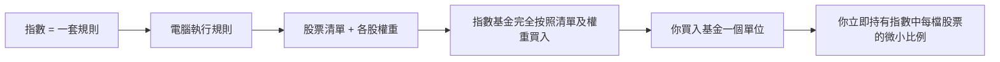
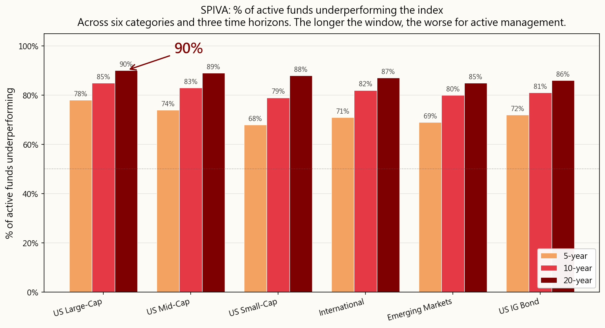
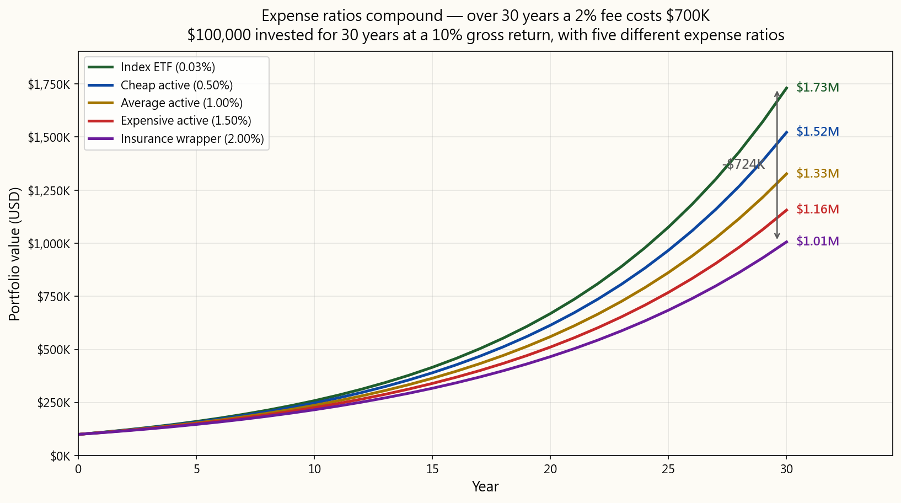
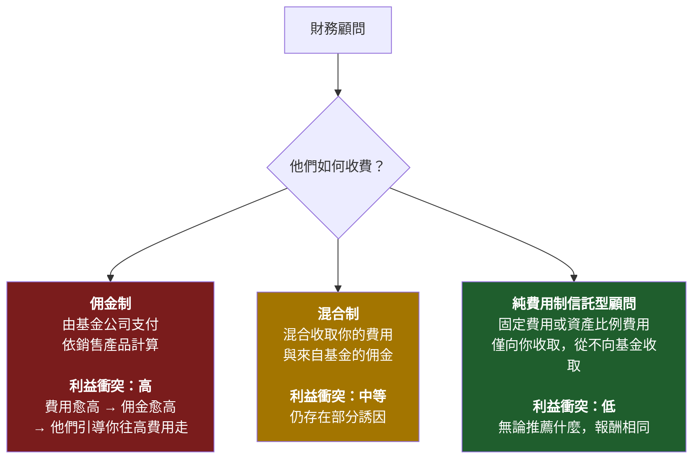
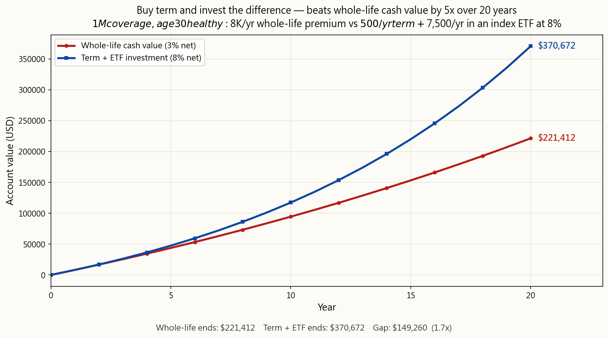
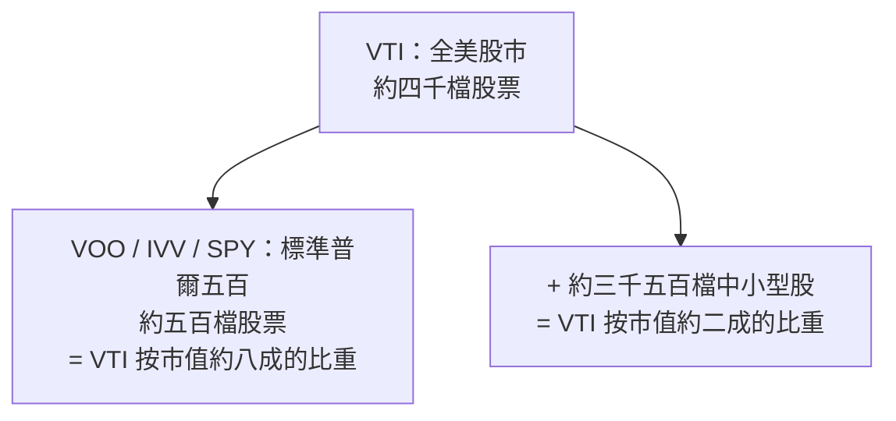
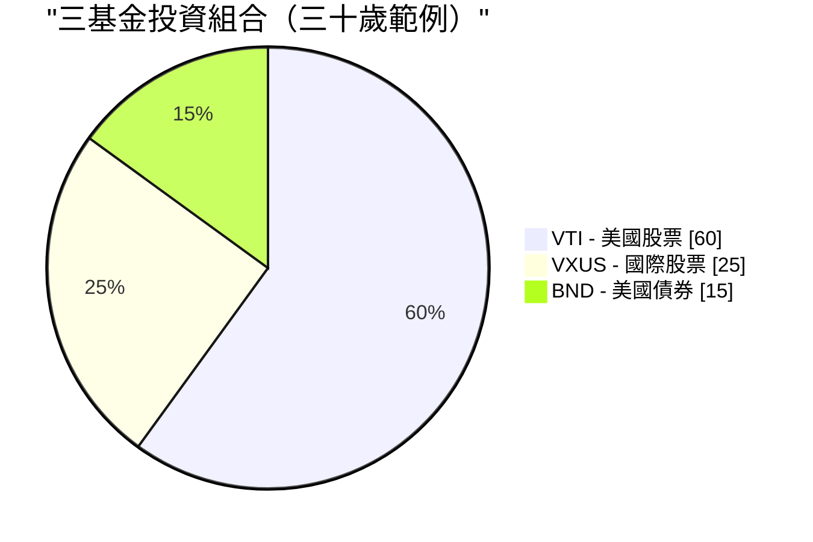

# 第二週：指數基金與指數股票型基金

動畫參考：`animation/week02_active_vs_passive.py`

---

## 第一部分：閱讀章節

---

### 1. 為什麼這很重要

上週我們確立了一個殘酷的事實：**通膨是地心引力，不投資才是你能做出的最昂貴決定。** 現在問題是*怎麼做*。以下是投資產業花了四十年才肯承認的答案：對幾乎所有人來說，正確答案是**低成本的指數基金或指數股票型基金**。不是選股。不是你銀行的「財富管理師」。不是你妹婿的內線消息。也不是你保險業務員拚命想賣給你的結構型商品。

這是整門課最重要的一課，而且它確實簡單。如果你在第二週讀完就停下來，設定每月自動定期定額購買廣市場指數股票型基金，此生再也不讀另一本理財書，**你的投資成果仍將超越這個星球上絕大多數的投資人——包括那些收取數百萬薪酬替他人管理資金的專業人士。**

這不是推銷話術。這是過去四十年數據所呈現的客觀陳述：

- **美國大型股主動式管理基金中，約有九成在二十年的區間內跑輸標準普爾五百指數**——這是標準普爾道瓊指數每年公布的 SPIVA 計分卡所記錄的數據。
- **預測基金未來績效的最佳單一指標是費用率。** 不是基金經理的學歷背景，不是品牌，不是過去的報酬。是費用。費用愈低 → 平均而言未來報酬愈高。（晨星在一項又一項的研究中均已證實這一點。）
- **華倫．巴菲特——史上最知名的主動投資人——在遺囑中指示，其妻子的遺產應投入「一檔極低成本的標準普爾五百指數基金」。** 如果連史上最偉大的選股人都告訴自己的遺孀放棄選股，這本身就說明了一切。

因此，本週我們將聚焦三件事。第一，指數基金究竟是什麼，以及它問世的那段帶點異端色彩的歷史。第二，金融業從散戶口袋裡掏錢的四大手法——高費用的主動式基金、依佣金制運作的顧問、以保險為包裝的「投資」商品，以及緩慢吸血的傳統共同基金——以及如何一一繞過它們。第三，你實際上需要的幾個特定股票代號。

最後還有一個誠實的懸念：**指數基金的主流共識已運作四十年，但無法保證永遠有效。** 這個模式何時、以何種方式可能失靈，以及你該如何應對，是我們在後續週次才會回頭探討的主題。現在，我們先打好地基。進階操作是之後才會添加的上層結構——是建立*在*這個地基之上，而非取而代之。

> *「投資是必做的事。本課程中的其他所有工具都只是加分項。」*

---

### 2. 你需要知道的事

#### 2.1 什麼是指數？

**股票指數**是一份依照一套規則編制的股票（或其他資產）清單。沒有人「管理」這個指數——它就是其規則所規定的樣子。標準普爾五百指數是「符合特定流動性、獲利能力及掛牌標準、市值最大的五百家美國企業，依市值加權計算。」這就是完整的定義。電腦就能執行。

當新聞說*「今天市場上漲了百分之二」*，指的幾乎都是標準普爾五百指數上漲了百分之二。

你常聽到的主要指數：

| 指數 | 追蹤標的 | 成分股數 |
| --- | --- | --- |
| **標準普爾五百（S&P 500）** | 美國最大的五百家企業 | 約 500 |
| **CRSP 美國全市場** | 整個美國股市 | 約 4,000 |
| **道瓊工業平均指數（DJIA）** | 30 家美國大型企業（價格加權，相當古老的設計） | 30 |
| **那斯達克綜合指數** | 所有那斯達克掛牌股票 | 約 3,000 |
| **那斯達克一百指數** | 那斯達克規模最大的一百家非金融類股（以科技股為主） | 100 |
| **羅素兩千指數** | 兩千家美國中小型企業 | 約 2,000 |
| **MSCI 歐澳遠東指數（EAFE）** | 美國和加拿大以外的已開發市場 | 約 800 |
| **MSCI 新興市場指數** | 新興市場國家 | 約 1,400 |
| **富時一百指數（FTSE 100）** | 英國規模最大的一百家企業 | 100 |

**大多數主要指數採市值加權。** 意思是，某家公司在指數中的權重與其總市值成正比。蘋果公司市值約三兆美元，在標準普爾五百指數中約佔百分之七的權重；市值最小的成分股約一百億美元，約佔百分之零點零二的權重。排名前十的公司通常合計佔**整個指數的百分之三十至三十五**。當你「買入標準普爾五百指數」，你所持有的大型股集中程度，遠比「五百檔股票」這個名稱所暗示的要高。

這就是整個運作機制。其中沒有任何天才成分。這正是它為何有效的原因。

---

#### 2.2 指數基金——柏格的異端想法

指數基金直到一九七六年才問世。在那之前，美國每一檔共同基金都是主動式管理：穿著西裝的聰明人挑選股票，每年收取百分之一至二的費用作為報酬。當時的數學和今天一模一樣——大多數人跑輸市場平均——但這個學術發現尚未轉化為實際產品。

**將這個數學轉化為產品的人是傑克．柏格。** 柏格於一九七四年遭惠靈頓管理公司解雇。一九七五年，他創辦了一家名叫**先鋒集團（Vanguard）**的奇特新基金公司，採取互助架構——由基金本身的持有人共同擁有，沒有外部獲利動機。一九七六年，先鋒集團推出了**第一檔指數投資信託**——史上第一檔零售指數基金：只須按照指數權重買入標準普爾五百指數的全部五百檔股票，並收取極低的費用。

整個業界嘲笑它。媒體稱之為**「柏格的蠢事」**。券商拒絕銷售（因為沒有佣金可賺）。這檔基金在首次公開發行時僅募得一千一百萬美元——遠低於柏格設定的一點五億美元目標。競爭對手稱這個想法**「不符合美國精神」**，是**「保證平庸的處方」**。

競爭對手說這保證平庸是對的——*如果平庸的意思是「市場平均報酬減去幾個基點的費用」*。他們沒能理解的是：市場平均報酬減去幾個基點的費用，二十年下來能擊敗約百分之九十的專業人士。

今天，先鋒集團管理超過**八兆美元**的資產，指數基金與指數股票型基金整體類別在全球管理的資產超過**二十兆美元**。柏格的「蠢事」已成為全球零售股票投資的主流形式。柏格本人於二○一九年辭世，他從未像其他任何管理八兆美元資產規模公司的創辦人那樣讓自己致富——先鋒的互助架構使節省下來的費用流回基金持有人手中，而非進入他個人的口袋。在金融界，他是極少數能不加引號地被稱為*英雄*的人之一。

> 「不要在乾草堆裡找針。直接買下整座乾草堆。」——約翰．柏格

---

#### 2.3 共同基金與指數股票型基金的比較——共同基金為何依然存在（以及為什麼你應該主要使用指數股票型基金）

**指數基金**是一種*策略*——追蹤指數。這個策略可以包裝成兩種不同的*形式*：

- **共同基金**：每天依收盤淨值計價並交易一次。
- **指數股票型基金（ETF）**：在交易所即時交易，就像一般股票一樣。

| 特性 | 共同基金 | 指數股票型基金 |
| --- | --- | --- |
| 交易時間 | 每天**收盤後**依淨值一次 | **全天**，如同股票 |
| 最低投資金額 | 通常**一千至三千美元** | **一股的價格**（或零股） |
| 稅務效率（課稅帳戶） | **較差**——強制分配資本利得給所有持有人 | **較佳**——實物申購贖回機制保護持有人 |
| 手續費 | 在基金自家券商購買為零元 | 在大多數券商為零元 |
| 自動扣款投資 | **方便**（任意金額、任意日期） | 有時較麻煩（需要整股，除非支援零股）|

**在二○二六年，指數股票型基金幾乎在所有重要面向上都勝出**——較低的最低投資門檻、即時報價、因實物申購贖回機制帶來的顯著稅務優勢，以及平均而言較低的費用率。共同基金仍具有真正優勢的類別，只有以下幾種：

1. **確定提撥制退休金帳戶（401(k)）及其他雇主退休計畫。** 大多數美國確定提撥制退休金帳戶的菜單仍以共同基金為主。計畫管理員尚未完成轉型，而你通常無法將自己選擇的指數股票型基金帶進計畫。在確定提撥制退休金帳戶中，共同基金的稅務問題基本上不存在（帳戶本身已享有稅務優惠），因此包裝形式的選擇是被迫的，且無傷大雅。
2. **以固定金額自動投資的「設好就不管」模式。** 先鋒集團的共同基金讓你輸入「每月一日投入五百元」，並精確執行到分毫，包括購買零碎單位。指數股票型基金的自動扣款功能雖然存在，但需視券商支援程度而定。

**基本上就這樣了。** 在二○二六年的一般課稅證券帳戶中，追蹤相同指數的指數股票型基金版本，對幾乎所有散戶投資人而言，在費用面和稅後報酬面都將優於共同基金版本。**預設選擇指數股票型基金。** 如果你只能透過確定提撥制退休金帳戶投資，共同基金是可以的——從選單中挑選費用最低的廣市場指數選項，然後繼續往下走就好。

共同基金至今仍以龐大規模存在，原因不是它們*更好*，而是因為**數兆美元的舊有資金躺在確定提撥制退休金帳戶、個人退休帳戶（IRA）和舊的券商帳戶裡**，一旦換出就會產生需要繳稅的資本利得。是惰性，不是優越性。新增的每一塊錢，幾乎都應該流向指數股票型基金。

---

#### 2.4 主動式管理與被動式管理——那個九成的統計數字

**主動投資**意指基金經理（或你自己）試圖挑選績優股並迴避虧損的股票。研究、分析、頻繁交易、押注特定判斷。每一檔主動式管理共同基金和避險基金都在做這件事，而你付的費用就是為了這個。

**被動投資**意指買下整個指數，接受平均報酬。沒有預測，沒有特定押注，沒有個人魅力。

傳統問題是*「主動式管理的基金經理能否跑贏指數？」* 傳統答案——由標準普爾道瓊指數每年發布的 SPIVA 計分卡重複了超過二十年——是**大多數情況下不行。** 時間拉得愈長，情況愈糟糕：

| 類別（美國） | 五年跑輸比例 | 十年跑輸比例 | 二十年跑輸比例 |
| --- | --- | --- | --- |
| **美國大型股** | 78% | 85% | **90%** |
| **美國中型股** | 74% | 83% | 89% |
| **美國小型股** | 68% | 79% | 88% |
| **國際股票** | 71% | 82% | 87% |
| **新興市場** | 69% | 80% | 85% |
| **美國投資等級債券** | 72% | 81% | 86% |

*（數字取自近期 SPIVA 報告的近似值；確切數字每年略有波動，但定性規律不變。）*

> 翻譯成白話：每一百位美國大型股基金經理中，**有九十位在二十年期間輸給了一台執行五百個名字簡單清單的電腦。**

而且還有一個致命的後續：**那十位勝出的，下個十年不會是同樣那十位。** 標準普爾的績效持續性研究一再顯示，過去五年排名前四分之一的基金，在接下來五年有超過一半的機率跌出前四分之一。過去的超額表現無法預測未來的超額表現——每份基金說明書底部的那句警語是真的，但大多數投資人都視而不見。

主動式管理基金整體而言無法跑贏指數，有五個原因：

1. **費用。** 主動式基金每年收取百分之零點五至一點五。指數股票型基金收取百分之零點零三。基金經理必須每年讓績效超越指數**超過整整一個百分點**，才能與低廉的選項打平。
2. **交易成本。** 每筆買賣都有摩擦——買賣價差、市場衝擊、機構端的手續費。高周轉率策略會持續消耗資產。
3. **稅負。** 高周轉率會在共同基金中觸發資本利得分配，無論你是否賣出，都需在當年繳稅。
4. **市場大致有效。** 成千上萬的專業人士閱讀著相同的年報、相同的法說會記錄、相同的衛星影像數據。真正的資訊優勢極為罕見。
5. **倖存者偏差。** 績效不佳的基金會被悄悄清算或合併到其他基金中。剩餘的「主動式基金」全集看起來比實際情況好，因為最差的輸家已被埋入歷史。

---

#### 2.5 費用率——你能掌控的最大單一槓桿

**費用率**是基金每年收取的費用，每天從基金資產中自動扣除。你永遠不會看到帳單。它只是默默地以略低一些的報酬呈現出來。

這種隱形性正是它作為財富汲取機制發揮效果的關鍵所在。**百分之一的費用聽起來微不足道，但三十年下來，它會吞噬你最終財富的約百分之二十五至三十。** 複利是雙面刃：它讓你的錢成長，也讓費用的損耗成長。

十萬元，投資三十年，假設毛報酬率為百分之十：

| 基金類型 | 費用率 | 淨報酬 | 第三十年時的資產 | 相較指數的費用損失 |
| --- | --- | --- | --- | --- |
| **指數股票型基金**（如 VOO） | **0.03%** | 9.97% | **$1,721,686** | — |
| 低費主動型 | 0.50% | 9.50% | $1,526,688 | **−$194,998** |
| 一般主動型 | 1.00% | 9.00% | $1,326,768 | **−$394,918** |
| 高費主動型 | 1.50% | 8.50% | $1,152,309 | **−$569,377** |
| 保險商品包裝 | 2.00% | 8.00% | $1,006,266 | **−$715,420** |

再看一遍最後一行。**百分之二的包裝費用，會讓你在一筆十萬元的投資上損失超過七十一萬元。** 那不是一筆費用，那是一棟房子的錢。在某些城市，可能是兩棟。那些錢從你的退休金，流向了基金公司的薪資支出、行銷預算、辦公室租金和執行長的薪酬。

**費用在任何市場環境下都持續計算。** 市場下跌百分之三十的那一年，你照樣繳費。基金經理跑贏指數百分之零點四的那一年，你仍欠他百分之一。費用是基金說明書上唯一保證成立的數字。

還有兩個事實是這個業界希望你不要內化的：

- **在任何基金類別中，費用率較低的基金，平均表現優於費用率較高的基金。** 這是基金研究中被複製最多次的發現——晨星已跨越資產類別和數十年反覆證實這一點。一個類別中費用最低的基金，平均而言就是該類別中最好的基金。
- **費用是*確定*的拖累。基金經理的超額報酬是*希望*抵銷這個拖累。** 用確定性去換取希望，在任何其他領域都被認為是一筆壞買賣。

---

#### 2.6 財務顧問的陷阱

如果主動式基金表現如此糟糕，為什麼每家銀行、每家券商、每個「財富管理」分支機構仍持續銷售它們？因為**財務顧問的薪酬結構，讓銷售這些產品對顧問而言是理性的**，即便對你而言是不理性的。

你將遇到三種薪酬模式：

**你能向任何顧問提出的最重要問題只有一個：*「您是受信託義務約束的信託型顧問嗎？您是純費用制嗎？」*** 信託型顧問在*法律上*被要求以你的最佳利益行事。非信託型的業務人員只需推薦「合適」的商品——這是一個寬鬆得多的標準，歷史上允許將高費用的糟糕產品賣給任何有能力簽名的人。

你的銀行「私人財富管理師」如此急切地想把你放進一檔費用率百分之一點五、還附帶百分之五前端申購手續費的主動式基金，是因為銀行可以兩頭收費：買入時賺取申購手續費，持有期間還收取 12b-1 行銷費用的分成。**你不是他們的客戶；你是他們的商品。** 是基金公司付錢讓他們把你送過去。

面對非信託型顧問推銷主動式基金，最乾脆的回應是：*「請以書面形式告訴我，持有這檔基金十年的全部費用——費用率、申購手續費、12b-1 費用、顧問費、帳戶費用——加起來是多少。同時請告訴我，貴公司從這個基金家族中獲得的補償是多少。」* 如果他們拒絕或拖延，你就有了答案。

> **預設原則：** 除非你已擁有好幾百萬美元，且真的面臨複雜的稅務狀況，否則你幾乎肯定不需要財務顧問。你需要的是一檔指數股票型基金和一個每月自動轉帳的設定。

---

#### 2.7 保險「投資」幾乎全是騙局

我在這裡想說得格外直接。**變額萬能壽險、指數型萬能壽險、以「投資」名義銷售的終身壽險、連結股市的儲蓄型商品、針對散戶行銷的結構型年金——這些商品幾乎無一例外，都是掠奪性設計，專門從那些不知道自己正在被收費的人身上汲取費用。**

推銷話術永遠是以下幾種組合：

- *「稅務優惠的增值。」*
- *「本金保護。」*
- *「享受股市上漲，卻不受下跌拖累。」*
- *「強制儲蓄的紀律。」*

現實幾乎永遠是：

- **百分之五至十的解約費**，若你在前五至十年內退出。
- **每年百分之二至四的全部費用**，隱藏在不透明的語言之中（「死亡保障費用」、「附加條款費用」、「行政費用」、「基金管理費用」，全部層層疊加）。
- **在費用扣除後，報酬遠遜於基本的指數股票型基金**——底層市場給出百分之八至十的報酬，到你手上往往只剩百分之二至四。
- **給業務員的佣金可能高達你第一年保費的百分之八十至一百**，這正是為什麼這類商品被如此大力推銷的原因。

讓你一生受用的規則只有一條：

> **保險是用來轉移風險的。投資是用來創造財富的。永遠不要將兩者混為一談。**

如果你有撫養家屬，而他們的財務狀況會因你的死亡而受到損害，那就**買定期壽險**——純粹的、便宜的、固定期間的保障，沒有任何投資成分。一位健康的三十歲成年人，可以用每月約二十五至三十五美元的保費，買到保障期二十年、理賠金額一百萬美元的定期壽險。然後，把定期壽險保費與業務員要你購買終身壽險保費之間的差額，**投入指數股票型基金**。這是教科書級別的策略：**「買定期，投差額。」** 在任何二十年的期間，這個策略在扣除費用後的淨資產表現上，都能以數量級的差距擊敗終身壽險商品——而且你對投資端保有完整的掌控權和完全的流動性。

業務員會告訴你，終身壽險「強制你儲蓄」。設定一個每月自動轉帳到你券商帳戶的指令，同樣能做到，而且那個指令不會付給他們百分之八十的佣金。

---

#### 2.8 誠實的反例——確實有效的主動式基金

我花了好幾個章節抨擊主動式管理。為了保持知識上的誠實，我必須坦白說：**少數主動式管理人確實擊敗了指數，而且是決定性地、持續了幾十年。** 為數不多——但多到不能忽視。

值得關注的幾個案例：

- **巴菲特和蒙格領導下的波克夏海瑟威公司。** 從一九六五年到二○二○年代初，波克夏的帳面價值每年複合成長率約為**百分之二十**，而標準普爾五百指數約為百分之十——這是現代金融史上最令人印象深刻的長期紀錄。巴菲特是主動投資有效的教科書級明證。同樣是這個巴菲特，在遺囑中告訴他的遺孀把遺產放進標準普爾五百指數基金。他是那個在告訴你，你不是例外的那個例外。
- **彼得．林區 / 富達麥哲倫基金，一九七七至一九九○年。** 林區執掌麥哲倫基金十三年，年均報酬率約為**百分之二十九**，在那十三年中有十一年擊敗標準普爾五百指數——這可能是有史以來最出色的共同基金紀錄。他在四十六歲時退休。林區離開後，麥哲倫的績效基本上回歸到追蹤指數的水準。
- **文藝復興科技的獎章基金（Medallion Fund），約一九八八年至今。** 這是一檔高頻、高數學、僅限員工參與的量化基金，據報導在三十餘年的期間，**在其百分之五管理費加百分之四十四績效費的費用結構*之後*，年均報酬率約為百分之四十**。獎章基金自一九九三年起已不接受外部投資人，而文藝復興面向外部投資人的基金（RIEF、RIDA）的表現則大為遜色——有時在獎章基金上漲百分之七十的年份反而虧損。**獎章基金是真正持久阿爾法存在的明證，同時也是真正阿爾法被牆壁隔絕、永遠無法到達你手中的明證。**
- **賽斯．卡拉曼的包浮集團（Baupost Group）。** 幾十年來，透過堅守深度價值框架、並在找不到符合標準的標的時持有大量現金，實現了接近股票的報酬，同時結構性地低於市場的波動性。卡拉曼的著作《安全邊際》（*Margin of Safety*）的二手書售價超過一千美元，因為他拒絕重印。
- **喬爾．格林布拉特在高譚資本（Gotham Capital），一九八五至一九九四年。** 在一個小型特殊情況投資組合上，十年間年均報酬率約百分之五十，之後把外部資金還給投資人。格林布拉特後來在《你也可以成為股市天才》和《打敗大盤的獲利公式》中公開了他的操作方法——他明確地在押注，這個策略對大多數讀者而言*太小市值、太令人不舒服、又太需要耐心*，以至於根本無法真正執行。

注意這個模式。那些確實在數十年間擊敗指數的基金，不是**封閉接受新資金**（獎章基金），就是**在巔峰時期不定期關閉**（麥哲倫在高峰期），或者是**一家獨立的控股公司**（波克夏），或者是**規模刻意維持在小水準，一旦擴大規模就會毀掉優勢**（格林布拉特早期），再不就是**高度集中且需要在多年回撤中堅持持有，而大多數投資人無法承受這種壓力**（卡拉曼）。

結論不是*「主動管理從不奏效」*，而是**能真正奏效的主動策略，很少是你能從銀行的產品選單中買到的那種。** 而你*確實*能從銀行產品選單中買到的主動式基金，整體而言，就是 SPIVA 計分卡所追蹤的那九成輸家。

如果你有時間、有心態，且在市場的某個特定角落確實擁有真正持久的優勢，當然可以在那裡集中佈局。大多數讀者沒有這樣的條件。**大多數讀者應該把主要部位做成指數，把時間花在其他地方。**

---

#### 2.9 你實際需要的基金

你不需要記住現有的數千檔指數股票型基金。你需要的是這份簡短清單：

| 代號 | 基金 | 費用率 | 追蹤標的 |
| --- | --- | --- | --- |
| **VOO** | 先鋒標準普爾五百指數股票型基金 | **0.03%** | 美國最大的五百家企業 |
| **VTI** | 先鋒全美股市指數股票型基金 | **0.03%** | 整個美國股市（約四千檔股票） |
| **IVV** | 貝萊德核心標準普爾五百指數股票型基金 | 0.03% | 標準普爾五百（VOO 的貝萊德版） |
| **SPY** | 道富標準普爾五百指數股票型基金 | 0.09% | 標準普爾五百（較舊、費用較高、交易員愛用） |
| **VXUS** | 先鋒全球（美國除外）股市指數股票型基金 | 0.07% | 所有非美國已開發市場 + 新興市場 |
| **VT** | 先鋒全球股市指數股票型基金 | 0.07% | 全球股市（美國 + 非美國，單一基金） |
| **BND** | 先鋒全美債券市場指數股票型基金 | 0.03% | 美國投資等級債券 |
| **QQQ** | 景順那斯達克一百指數股票型基金 | 0.20% | 一百檔那斯達克最大非金融股（以科技股為主） |

**VOO 對比 VTI 對比 SPY** 是被問得最多的問題。簡短版本：

- **VOO** 和 **IVV** 追蹤相同的指數（標準普爾五百），費用相同（百分之零點零三）。兩者都可以。
- **SPY** 同樣追蹤標準普爾五百，但費用**是前者的三倍**（百分之零點零九）。它存在是因為它是*第一檔*美國指數股票型基金（一九九三年），因此流動性最深——機構交易員在乎這一點，長期投資人不需要在乎。**不要為你不需要的流動性付三倍的費用。**
- **VTI** 持有整個美國市場的約四千檔股票，而不只是最大的五百檔。實際上，VOO 和 VTI 的報酬幾乎相同，因為標準普爾五百佔美國市場總市值的約百分之八十。如果你想要一檔基金，同時追求略高的分散程度，選 VTI。如果你想要一檔基金，且是所有人都在引用的最標準指數，選 VOO。**在這兩者之間，沒有錯誤的答案。**

---

#### 2.10 實際如何買入

完整流程如下，只需十五分鐘：

1. **開立券商帳戶。** 美國居民：富達、嘉信或先鋒——三家都免費，三家都有合理的平台。香港、台灣或新加坡居民：盈透證券（Interactive Brokers）是便宜購買美國掛牌指數股票型基金的標準跨境選擇。
2. **連結你的銀行帳戶並轉入資金。** 電子轉帳（ACH）需要一至三個工作天。
3. **搜尋股票代號。** 輸入「VOO」，基金資訊即顯示。
4. **下達買入委託單。** 市價單 = 以當前價格買入。輸入股數或金額（大多數券商現在支援零股）。
5. **設定每月自動投資。** 例如，設定每月一日自動扣款五百元。然後忘記它的存在。

就這樣了。**五個步驟，十五分鐘，你現在持有了美國五百家最大企業的一小部分股份。** 不需要看財經新聞，不需要盯著投資組合，不需要選股的焦慮。

按下買入鍵後，你最重要的事情是**關掉 app，停止盯著它看。** 市場每天都在上下波動。盯著每日漲跌是導致投資人做出不良決策的最大單一原因——在恐慌中賣出，在狂熱中買入。用指數股票型基金策略能擊敗 SPIVA 追蹤數據的每一分長期報酬，都來自於*撐過*雜訊，而不是在雜訊中交易。

---

#### 2.11 三基金投資組合

對大多數讀者而言，柏格所推廣的**三基金投資組合**，真的就是整個投資組合：

| 基金 | 代號 | 建議配置比例（三十歲） |
| --- | --- | --- |
| 全美股市指數 | **VTI** | 60% |
| 全球（美國除外）股市指數 | **VXUS** | 25% |
| 全美債券市場指數 | **BND** | 15% |

債券部位的**傳統粗略原則**：**債券比例 ≈ 你的年齡減二十**，大致如此。三十歲持有約百分之十至十五的債券。六十五歲持有約百分之四十五至五十五的債券。教科書的邏輯是，債券是*壓艙石*：股票跌時它漲，降低投資組合的波動性，並在接近退休、無法等待十年讓股市回復的那幾年，保護你免受股票資產五成回撤的衝擊。

> **有一點我必須在這堂基礎課就先告訴你，因為我虧欠你這份誠實：** 那個傳統邏輯是在一個已不復存在的世界裡建立的。
>
> 「債券作為壓艙石」的框架假設：（a）債券的實際殖利率高於通膨，以及（b）股票下跌時債券上漲。**這兩個假設在二○二○年代都破功了。** 政府大規模財政赤字以印鈔融資（第一週，§2.2），而中央銀行將實際殖利率壓制在通膨以下作為政策工具（這叫做「金融抑制」），在通膨環境中持有長天期債券基金，不是壓艙石——而是購買力的緩慢流失。二○二二年，股票和債券*雙雙*各自下跌約百分之二十，而這正是六十四十配置加債券的設計本來要防範的情境。
>
> 因此，請將上表中的債券部位視為**教科書起點，而本課程的其餘內容將對其提出挑戰。** 我們之後會回來探討在貨幣超發的世界裡，真正扮演壓艙石角色的是什麼：
>
> - **第五週（債券）** 深入解析債券的本質、歷史上避險功能發揮效果的原因，以及在什麼條件下它會失靈。
> - **第六週（黃金與原物料）** 介紹作為通膨避險的替代選項——黃金是人類有史以來所有貨幣制度中的價值儲存工具，而在二○二○年代，持有黃金的理由遠比持有長天期債券更為充分。
> - **第四十七週（尾部風險避險）** 和整個 **第五級** 才是我們真正重建投資組合安全端的地方，使用的是現金／短天期公債、黃金，以及長波動率選擇權結構的組合，而非傳統的長天期債券部位。
>
> 對於你今天建立的基礎投資組合而言，三基金模板是沒問題的，也遠優於不投資。**只需了解，債券部位是這個投資組合中保存期限最短的那部分，我們之後會回來替換它。**

這整個投資組合的加權平均費用率：**每年約百分之零點零四。** 也就是說，一萬元投資每年的費用是*四塊錢*。涵蓋每個主要資產類別、全球多元分散的投資組合。

---

#### 2.12 直到它不再有效——一個懸念

我花了整個章節告訴你指數股票型基金就是答案。我想用一個限定條件來收尾，這讓我成為一位誠實的老師，而非推銷員。

**買進持有被動指數策略在過去四十年——大約從一九八○年代初以來——運作得異常出色。** 之所以有效，是因為一組特定的條件：工作年齡人口多於退休人口，每個薪資周期都在機械式地買入；利率持續下降；美元的儲備貨幣地位；全球化；以及二○○八年以來，聯準會在金融環境收緊過度時持續出手干預的慣例。

**這些順風條件沒有一個能保證持續吹拂。**

當人口結構轉折點到來——當嬰兒潮世代從資產累積階段的淨買入者，轉變為資產提領階段的淨賣出者——那條將指數在過去四十年推高的機械性資金流向，可能反向運作。被動式基金不是自主運作的；它們反映的是末端投資人是在投入還是提領。一個在上漲時由價格不敏感資金主導的市場，在下跌時同樣容易受到價格不敏感資金的衝擊。

**這不是在預測指數明天就會失效。這是誠實地承認，「它有效運作了四十年」和「它永遠有效」並不是同一件事。**

對*你*而言，今天，在建立第一個投資組合的時候：**指數股票型基金是正確的答案。** 打好地基，讓每月自動轉帳的機制運作，在你學習本課程其餘內容的這幾年間讓它持續複利。指數何時以及如何可能失效的詳細探討，還有你接下來要往哪裡移轉——這是我們在整個課程後續所要建立的內容：

- **第二十三週（因子投資）** 介紹普通市值加權指數化的第一組替代方案——價值、動能、品質、低波動傾斜，這些因子歷史上捕捉了市值加權指數未能取得的報酬。
- **第四十三週（主動式投資組合管理）** 深入探討主動式管理何時確實值回票價，何時又不值得。
- **第五級（第四十七至五十二週）** 才是我們真正建立「槓鈴型」投資組合形狀的地方——一端是高確信度的安全資產，另一端是非對稱的投機部位，刻意*移除*了廣市場市值加權的核心持倉。那是進階形狀，建立在第二週至第四十六週所涵蓋的一切之上。

現在：**投資是必做的事。指數股票型基金是地基。本課程中的所有其他內容都是建立在這個地基之上的加分項。** 如果你無法擊敗指數——而大多數人、在大多數時候，都做不到——那就不要把你的生命浪費在嘗試上面。讓指數為你做工，把你的時間花在能在你的人生而不只是試算表上複利的事物上。

但要理解，「買進持有指數」是一個條件成立才有效的策略，它在一個特定的四十年時間窗口裡運作良好。我們會回來探討這個時間窗口關閉後會發生什麼。現在，打好地基就已足夠。

---

### 3. 常見誤解

**誤解一：「指數基金只適合初學者。」**

指數基金和指數股票型基金被主權財富基金、大學捐贈基金、退休基金和億萬富翁所使用。加州公務員退休基金（CalPERS）——全球最大的退休基金之一——管理著大規模的指數基金委託。華倫．巴菲特，*最*著名的主動投資人，在二○○八至二○一七年間公開打賭一百萬美元，賭一檔標準普爾五百指數基金的表現將超越一籃子精心挑選的避險基金，而且他輸了的話。他以決定性的差距贏得了這場賭注。指數化不是初學者的選項；它是經過理性選擇後的選項，碰巧也是最容易執行的那個。

**誤解二：「一分錢一分貨——費用更高代表管理更好。」**

在幾乎所有其他消費品類別中，這是對的。在投資領域，**這個關係是反過來的。** 晨星跨越資產類別和數十年的研究顯示，**費用率是預測基金未來績效的最佳單一指標**——優於過去報酬、優於星級評等、優於基金經理的任期長短。費用率越高 → 預期未來報酬越低。費用最低的基金，平均而言就是最好的基金。

**誤解三：「但我的財務顧問推薦了一檔主動式基金。」**

許多財務顧問因銷售特定基金而獲取佣金——有時是公開的，更多時候是隱藏在你永遠看不到的帳單中的不透明收益分成協議。他們的誘因是推薦付給*他們*最多的產品，而不是能讓*你*複利最大化的產品。**永遠要問：「您是純費用制的信託型顧問嗎？您從任何您推薦的商品中獲得的全部報酬是什麼？」** 如果答案是否定的，或者他們不能或不願以書面回答，就走開。

**誤解四：「指數基金在下跌時無法保護你。」**

正確——它們確實無法保護你。它們本來也不應該這樣做。市場下跌時，指數也跟著跌。相關的比較不是「指數對比現金」，而是「指數對比主動式基金」。二○○八年，標準普爾五百指數下跌約百分之三十七；一般主動式管理的美國股票基金平均下跌約百分之三十九。主動式管理在崩盤中並沒有保護你；平均而言，它還讓情況稍微更糟。**下跌時的保護，來自你的*資產配置*（股票對比債券對比現金的比例）和你的行為（不要恐慌性賣出），而不是來自你選擇哪一檔基金。**

**誤解五：「我應該挑選過去五年績效最好的基金。」**

這是散戶投資人最常犯、也最昂貴的錯誤。**績效最好的基金會均值回歸。** 標準普爾的績效持續性研究，十年又十年反覆顯示，前四分之一的頂尖基金，在五年後仍留在前四分之一的機率不到十分之一。過去的績效不能預測未來的績效；每份基金說明書底部的那句警語，不是法律套話，而是每個人都忽視的真實陳述。追逐過去的贏家，在期望值上，*比隨機挑選還糟糕*。

**誤解六：「SPY 和 VOO 追蹤的是同樣的標的，買哪個都沒差。」**

它們追蹤相同的指數，但費用不同。SPY 收取百分之零點零九；VOO 收取百分之零點零三。以五十萬美元的投資組合持有三十年計算，百分之零點零六的費用差距複利下來，約損失了超過**兩萬五千元的財富。** SPY 唯一的結構性優勢是交易流動性，這只對搬動大筆資金的機構或日內交易員有意義——對買進持有的投資人來說不重要。**對長期持有人而言，VOO 或 IVV 在費用上永遠優於 SPY。**

**誤解七：「我需要分散投資到多種不同的指數基金。」**

像 VTI 這樣的全市場基金已經持有約四千檔股票。加上 VXUS，還能增加約七千檔國際股票。**兩檔指數股票型基金就涵蓋了全球所有主要經濟體的大約一萬一千檔股票——在股票端已沒有更多分散的空間了。** 持有十檔以上的指數股票型基金，通常只會造成重疊（同樣的蘋果、微軟和輝達以不同權重出現在多檔基金中），以及一種虛假的分散投資感。兩到三檔基金就足夠了。超過五檔，通常是困惑的表現，而非精密的表現。

**誤解八：「指數基金很危險，因為你無法迴避糟糕的公司。」**

指數基金確實持有那些後來破產的公司。安隆公司在二○○一年崩潰時，約佔標準普爾五百指數的百分之零點七——抽象地看很痛苦，但對整個投資組合而言微不足道。其餘四百九十九家公司繼續複利成長。**指數*內部*的分散——數百甚至數千個名字，沒有任何一個大到足以單獨擊垮你——才是保護所在。** 碰巧重倉安隆的集中型選股者，在那個標的上損失慘重。指數投資人損失了百分之零點七。

**誤解九：「終身壽險是好的投資，因為它的現金價值可以免稅增值。」**

它不是好的投資，而現金價值的說辭正是這個商品的銷售手法。終身壽險的現金價值，在扣除業務員佣金、解約費用期程和層層年費之後，實際報酬率通常只有**百分之二至四**，而同期投入指數股票型基金的報酬率為百分之七至十。**買定期壽險以滿足真正的死亡保障需求，然後把定期保費與終身壽險保費之差額投入指數股票型基金。** 這是教科書級別的「買定期，投差額」策略。在幾乎所有真實情境下，它在比較中都能勝出；業務員之所以從不推薦它，正是因為他們收不到佣金。

---

### 4. 問與答

**Q1：指數股票型基金究竟是什麼？它和股票有什麼不同？**

**指數股票型基金**（Exchange-Traded Fund，ETF）是一籃子有價證券，被包裝成像股票一樣在交易所上市交易的單一工具。買入一個單位的 VOO，就等於按比例擁有標準普爾五百指數中全部五百家公司的微小股份。**股票代表一家公司；指數股票型基金代表一個定義好的一籃子資產。** 交易機制相同——有股票代號、即時報價，可以在交易時間內買賣——但你能立即獲得分散投資的效果。

**Q2：VOO、VTI 還是 SPY——選哪個？**

長期買進持有：**VOO 或 VTI**，費用率均為百分之零點零三。VOO = 標準普爾五百（約五百個名字）；VTI = 整個美國市場（約四千個名字）。兩者的績效幾乎相同，因為標準普爾五百按市值約佔美國市場的百分之八十。任一個都可以。**SPY 是為交易員設計的，不是為投資人**——相同的曝險，但費用是 VOO 的三倍。

**Q3：我的投資組合有多少比例應該放在指數股票型基金？**

對大多數二十至四十歲正在建立第一個投資組合的讀者而言：**股票部位的百分之八十至一百**放在廣市場指數股票型基金。股票和「安全資產」之間的精確比例，取決於年齡和風險承受度：

| 年齡 | 股票比例 | 安全資產比例 |
| --- | --- | --- |
| 20–35 歲 | 80–90% | 10–20% |
| 35–50 歲 | 70–80% | 20–30% |
| 50–65 歲 | 50–70% | 30–50% |
| 退休後 | 30–50% | 50–70% |

**關於「安全資產」而非「債券」的說明：** 教科書上股票部位的壓艙石，歷史上一直是債券配置，假設債券與股票走勢相反。如 §2.11 所述，這個假設在二○二○年代已破功——二○二二年股票和債券雙雙下跌，而在金融抑制下，債券的實際殖利率已不再高於通膨。**「安全資產」部位因此應理解為與股市不相關（或負相關）的資產籃子，而不只是債券。** 傳統的債券配置是其中一個組成部分，但現代的安全資產部位還包括短天期公債和現金等價物、黃金和其他貨幣金屬（第六週），以及在更進階的層面，長波動率選擇權結構和尾部避險覆蓋層（第四十七週，第五級）。對你今天建立的第一個投資組合而言，像 BND 這樣的廣泛債券指數股票型基金是一個合理的起點；本課程的其餘部分將帶你在這個基礎上進行替換和補充。

在股票配置內，典型的比例是約百分之七十美國股（VTI）和百分之三十國際股（VXUS）。

**Q4：費用率和申購手續費有什麼差別？**

**費用率**是每年收取的費用，每天從基金資產中自動扣除。百分之零點零三，一萬元投資就是每年三元。**申購手續費**是買入（前端申購費）或賣出（後端贖回費）時一次性收取的佣金。百分之五的前端申購費，意味著你投入一萬元時，五百元立刻消失，只有九千五百元真正投入。**現代指數股票型基金沒有申購手續費。** 任何你正在考慮的、確實收取申購手續費的基金，幾乎無一例外都不值得購買。

**Q5：如果九成的主動式管理人都輸了，為什麼主動式基金還存在？**

因為它們對基金公司而言**利潤極為豐厚。** 一個管理規模一百億元、費用率百分之一的基金，每年賺取一億元的費用，無論績效如何。投資人輸給指數對投資人而言是壞事，但對基金公司而言卻是一門絕佳的經常性收益生意。加上支付 CNBC 廣告時段的行銷預算、進行銷售的銀行分行網絡、被付費銷售的財務顧問，以及投資人想相信那位口才流利的基金經理能擊敗平均水準的心理——**主動式基金產業之所以存在，是因為它為價值鏈中除你以外的每個人付了酬勞。**

**Q6：指數基金會歸零嗎？**

理論上，只有在指數中的每家公司同時破產的情況下才會——而那意味著整個美國經濟已經崩潰，那種情況下任何金融資產的價值都無關緊要了。實際上，歷史上最嚴重的廣市場指數回撤（一九二九至三二年、二○○七至○九年、二○二○年新冠病毒閃崩）最深曾達到高峰到谷底的百分之五十至八十，之後均在十年內回復到歷史新高。**單一個股確實可能歸零，而且確實有很多已經歸零了。廣泛的指數在實際上是不可能的。** 這個不對稱性正是分散投資有效的根本原因。

**Q7：國際指數股票型基金——我也應該持有嗎？**

大多數合理的資產配置都包含一定程度的國際曝險。美國按市值約佔全球股市的百分之六十；其餘百分之四十分布在歐洲、日本、新興市場及其他地區。由於各地區市場並非完全同步移動，國際分散投資可以降低投資組合的波動性。**VXUS**（先鋒全球（美國除外）股市指數股票型基金），費用率百分之零點零七，以一檔指數股票型基金涵蓋已開發和新興市場約七千檔股票。一個常見的粗略比例是**百分之七十美國（VTI），百分之三十國際（VXUS）**。

**Q8：什麼是定期定額投資？我應該用這個方式購買指數股票型基金嗎？**

**定期定額投資（Dollar-Cost Averaging, DCA）** = 無論市場如何，定期投入固定金額。每個月五百元，每個月，無論市場在做什麼。價格低時，五百元能買到更多股份；價格高時，五百元能買到的股份較少。結果是平均成本略低於這段期間的簡單平均市場價格，更重要的是在行為上的好處：**你在那些令人恐慌的月份仍持續投入，而不是等待那個永遠感覺不對的「最佳時機」。** 對任何從薪資收入中投資的人而言，定期定額投資是自動發生的。對於擁有一筆資金的人，學術文獻說法不一——歷史上，一次投入的平均績效略優於定期定額（因為市場多數時候是上漲的），但定期定額在心理上要容易承受得多。

**Q9：指數基金有發放股利嗎？**

有的。指數中的公司向基金發放股利，基金收取後每季轉發給股東。VOO 目前的股利殖利率約為百分之一點三至一點五。大多數券商允許你開啟**股利再投資計畫（DRIP）**，自動將每筆股利用於購買同一基金的更多股份。長期下來，**再投資的股利佔股票總報酬的比重相當大**——預設開啟股利再投資。

**Q10：我聽說過「聰明貝塔」或「因子」指數股票型基金——那和指數基金一樣嗎？**

不完全是。傳統指數基金使用**市值加權**（公司愈大，在指數中的權重愈大）。**聰明貝塔**或**因子**指數股票型基金仍是規則導向的，會進行系統性再平衡——所以它們有指數化的特性——但它們按照*市值以外*的某個因子加權：價值（基本面便宜的股票）、動能（近期漲幅較強的股票）、品質（資產負債表健全的股票）、低波動性（走勢平穩的股票）、規模（小型股），等等。費用率高於普通指數基金（通常為百分之零點一至零點四），因為再平衡規則更為複雜，但仍遠比主動式基金便宜。**因子投資是一個重要的主題，我們在第二十三週深入介紹。** 但對你的第一個投資組合而言，普通的市值加權指數股票型基金是正確的起點。

**Q11：我應該在指數股票型基金之外買入個別股票嗎？**

如果你在某家特定公司或產業確實擁有持久的優勢——來自你日常工作的領域專業知識、對你所身處產業的結構性洞察——那麼**在指數核心之外持有一小部分個別股票的「衛星」部位可能是合理的。** 一個常見的形狀是百分之八十至九十在廣市場指數股票型基金，百分之十至二十在個別高確信度的標的。**你不應該做的**，是因為在社群媒體上看到選股推薦、因為品牌眼熟、或因為它上個月剛漲了一波而去買個股。那個九成的 SPIVA 統計數字，套用在散戶選股人身上遠比套用在專業基金經理身上更為殘酷——大多數散戶的個別股票投資組合，表現都大幅*遜於*他們本可以直接買入的指數。如果你無法用一句話說清楚某檔股票為何相對於基本面被低估，你就沒有優勢——你只有一個看法。看法沒什麼不好；只是不要用有優勢的規模去押注一個看法。

**Q12：我一直聽說指數「過度集中在大型科技股」——這是個問題嗎？**

這是真實的觀察。在二○二六年，標準普爾五百指數的前十大持股（主要是大型科技股——蘋果、微軟、輝達、Alphabet、亞馬遜、Meta 等），按權重合計約佔**整個指數的百分之三十至三十五**。買入 VOO 的大型科技股集中程度，遠比「五百檔股票」這個名稱所暗示的要高。這是否構成*問題*，取決於你對這些公司的看法。更廣泛的 VTI 集中程度略低（因為頂端的十大持股被分散在約四千個名字中），而明確採等權重的標準普爾五百指數股票型基金（RSP，費用率約百分之零點二）則走向另一個極端——同樣的五百個名字，但各自等權重配置。**現在，市值加權指數仍是最簡單、歷史上績效最佳的預設選擇。** 這個集中度問題，以及它對風險的影響，正是我們在第二十三週及以後深入發展的體制感知思考方式。

---

## 第二部分：YouTube 腳本

---

**影片標題：** 這一檔指數股票型基金，擊敗九成的華爾街專業人士｜第二週

**目標時長：** 約三十分鐘

**主持人：**
- **陳馬**（老師）：有多年自管投資組合經驗的散戶投資人，以第一人稱分享親身經歷
- **小魚**（學生）：剛大學畢業、學習如何投資積蓄的新手，提出觀眾心中的問題

---

**[開場 / 第零段：承諾]**

[VISUAL: Cold-open title card -- "$700,000. That's what your fees cost you."]

[ANIMATION: Hundreds of stock tickers swirling chaotically, then being swept into
a single basket labeled "ONE ETF". A subtitle fades in: "And it beats 90% of
the pros."]

**陳馬：** 如果你看完這支影片，此後對自己的財務生活什麼都不做——不讀書、不聽播客、不用任何選股 App——你的投資成果依然會超越華爾街幾乎所有的專業基金經理。

**小魚：** 這個說法也太大了吧。

**陳馬：** 這不是我的說法。這是四十年來數據所呈現的結論。答案是一檔低成本的廣市場指數股票型基金。不是你銀行的財富管理師。不是你妹婿的內線消息。也不是保險業務員拚命想賣給你的結構型商品。

**小魚：** 然而幾乎沒有人真的這樣做。

**陳馬：** 因為有一個幾十兆規模的產業，它的薪水取決於你不這樣做。今天我想跟你分享我自己投資組合的地基——然後，在最後，我會告訴你一件沒有其他人會在這類影片裡承認的真相：這個策略有效運作了四十年，但無法保證永遠有效。

**小魚：** 懸念先記下來。我們先從基礎開始吧。

[VISUAL: Title card -- "1. 什麼是指數？"]

---

**[第一段：什麼是指數？]**

**陳馬：** 在談基金之前，我們必須先定義指數。指數就是一份依照一套規則編制的股票清單。沒有人管理它。標準普爾五百指數是「符合特定流動性和掛牌規定、市值最大的五百家美國企業，依市值加權計算。」這就是完整的定義。電腦就能執行。

**小魚：** 當新聞說「今天市場上漲了百分之二」，就是在說標準普爾五百指數。

**陳馬：** 幾乎都是這個意思。標準普爾五百指數是美國最主要的股票指數，代表整個美國股市市值的約百分之八十。

[VISUAL: Quick table flashes the major indices -- 標準普爾五百（S&P 500）、CRSP 全美股市、道瓊工業平均指數（30 個名字，價格加權，「相當古老的設計」）、那斯達克綜合指數、那斯達克一百指數、羅素兩千指數、MSCI 歐澳遠東指數、MSCI 新興市場指數、富時一百指數。]

**小魚：** 這五百家公司的權重是一樣的嗎？

**陳馬：** 不是，而這正是大多數人忽略的部分。標準普爾五百指數是以市值加權的。蘋果市值約三兆美元，在指數中的權重約為百分之七。最小的成分股市值約一百億美元，權重約為百分之零點零二。

[ANIMATION: Bar chart, top of week02_active_vs_passive.py -- 蘋果約 7%，微軟約 6.5%，依序遞減至右端的微小細條。]

**陳馬：** 而排名前十的公司——蘋果、微軟、輝達、Alphabet、亞馬遜、Meta 及其他幾家——合計佔整個指數的約百分之三十至三十五。

**小魚：** 所以當我「買入標準普爾五百指數」，我買的其實是一個集中的大型股部位。

**陳馬：** 一個遠比「五百檔股票」這個名字所暗示的，更集中的大型科技股部位。記住這一點，我們之後在課程中還會回來談。

[VISUAL: Title card -- "2. 柏格的異端想法"]

---

**[第二段：柏格的異端想法]**

**陳馬：** 指數基金直到一九七六年才問世。在那之前，美國每一檔共同基金都是主動式管理的——穿著西裝的聰明人挑選股票，每年收取百分之一至二的費用。當時的數學和今天一模一樣：大多數人跑輸市場平均。學術發現已經存在，但沒有人將它包裝成產品。

**小魚：** 直到有人做了。

**陳馬：** 那個人叫傑克．柏格。柏格在一九七四年遭惠靈頓管理公司解雇。一九七五年，他創辦了一家名叫先鋒集團的奇特新基金公司，採取互助架構——由基金本身的持有人共同擁有，沒有外部獲利動機。一九七六年，先鋒集團推出了第一檔指數投資信託。它只需按照標準普爾五百指數的權重買入全部五百檔股票，並收取極低的費用。

**小魚：** 華爾街的反應是？

**陳馬：** 嘲笑。媒體稱之為「柏格的蠢事」。券商拒絕銷售，因為沒有佣金可賺。這次首次公開發行只募得一千一百萬美元——遠低於柏格一點五億的目標。競爭對手稱之為「不符合美國精神」，是「保證平庸的處方」。

**小魚：** 那今天呢？

[VISUAL: Bold text card -- "先鋒集團今日：八兆美元。指數股票型基金整體類別：二十兆美元。" 柏格的照片，生卒年：一九二九—二○一九。]

**陳馬：** 先鋒集團管理超過八兆美元。指數基金與指數股票型基金的整體類別在全球超過二十兆美元。柏格的「蠢事」成為了全球零售股票投資的主流形式。而且有件事讓他成為我心目中的英雄：因為先鋒集團採互助所有制，節省下來的費用流回基金持有人手中，而非流入他的口袋。其他任何管理八兆美元資產規模公司的創辦人，早就登上《富比士》排行榜了。柏格沒有。他在二○一九年辭世。

**小魚：** 一個沒有讓自己致富的金融英雄。這份名單很短。

**陳馬：** 這份名單只有他一個人。他自己的那句話是最好的總結：*「不要在乾草堆裡找針，直接買下整座乾草堆。」*

[VISUAL: Title card -- "3. 共同基金對比指數股票型基金"]

---

**[第三段：共同基金對比指數股票型基金]**

**陳馬：** 快速說明一下包裝形式的區別，因為很多人會搞混。指數基金是一種*策略*——追蹤指數。這個策略可以用兩種不同的*形式*銷售：共同基金，每天依收盤淨值計價和交易一次；或是指數股票型基金，在交易所即時交易，就像普通股票一樣。

[VISUAL: Side-by-side comparison table -- 共同基金對比指數股票型基金，比較五個面向：交易時間、最低投資金額、稅務效率、手續費、自動扣款投資。]

**小魚：** 哪個勝出？

**陳馬：** 在二○二六年的一般課稅券商帳戶中，指數股票型基金幾乎在所有重要面向上都勝出——較低的最低投資門檻、即時報價、因實物申購贖回機制而帶來的顯著稅務優勢，以及平均而言較低的費用率。共同基金仍優於指數股票型基金的場合，只有確定提撥制退休金帳戶（菜單已固定、稅務問題不存在）和以固定金額自動投資的模式（先鋒集團的共同基金做得非常好）。

**小魚：** 那為什麼共同基金無處不在？

**陳馬：** 惰性。幾十兆的舊有資金躺在確定提撥制退休金帳戶、個人退休帳戶和舊的券商帳戶裡，一旦換出就會產生大筆需要繳稅的資本利得。它們留存是因為換出有成本，而不是因為它們更好。**新增的每一塊錢，幾乎都應該流向指數股票型基金。**

[VISUAL: Title card -- "4. 主動式管理對比被動式管理——那個九成的統計數字"]

---

**[第四段：主動式管理對比被動式管理——那個九成的統計數字]**

**陳馬：** 這裡是核心的數據點。每年，標準普爾道瓊指數都會發布 SPIVA 計分卡——標準普爾指數對比主動式管理。在二十年的區間內，**大約九成的美國大型股基金經理跑輸標準普爾五百指數。**

[ANIMATION: image/week02_spiva.png animated in -- 長條圖從五年的 78%，爬升至十年的 85%，再到二十年的 90%。底部的類別逐一出現：美國大型股、中型股、小型股、國際股票、新興市場、投資等級債券。]

**小魚：** 一百個人裡有九十個。帶著一整隊分析師和財金博士的專業人士。輸給了一份清單。

**陳馬：** 而且還有一個致命的後續：那勝出的十個，下一個十年不會是同樣的十個。標準普爾的績效持續性研究顯示，排名前四分之一的頂尖基金，在接下來五年期間有超過一半的機率跌出前四分之一。過去的績效不能預測未來的績效。每份基金說明書底部的那句警語是真的。

**小魚：** 所以他們為什麼贏不了？他們顯然很聰明。

**陳馬：** 五個原因，而且這些原因是結構性的——跟努力程度無關。

[VISUAL: 五張卡片在陳馬逐一列出時依序顯示在螢幕上。]

**陳馬：** 第一，費用。主動式基金每年收取百分之零點五至一點五。指數股票型基金收取百分之零點零三。基金經理必須每年讓績效超越指數超過整整一個百分點，才能與低廉的選項打平。第二，交易成本。買賣價差、市場衝擊、機構端的手續費。高周轉率會持續消耗資產。第三，稅負。高周轉率會在共同基金中觸發資本利得分配，無論你是否賣出都需在當年繳稅。第四，市場大致有效。成千上萬的專業人士閱讀著相同的年報、相同的法說會記錄、相同的衛星影像數據。真正的資訊優勢極為罕見。第五，倖存者偏差。績效不佳的基金會被悄悄清算或合併。剩餘的「主動式基金」全集，看起來比實際情況好，因為最差的輸家已被埋入歷史。

**小魚：** 翻譯成白話：每一百位專業選股人中，有九十位在二十年期間輸給了一台執行五百個名字清單的電腦。

**陳馬：** 對。

[VISUAL: Title card -- "5. 費用率——那張七十一萬的帳單"]

---

**[第五段：費用率——那張七十一萬的帳單]**

**陳馬：** 現在我想讓費用這個概念變得無法忽視。假設你三十歲時投入了十萬元。每年的毛報酬率是百分之十，持續三十年。唯一改變的變數是費用。

[ANIMATION: image/week02_expense_drag.png animated in -- 五條財富曲線在三十年間逐漸分叉。指數股票型基金（費用率 0.03%）在最上方，依序往下是 0.50%、1.00%、1.50%，保險商品包裝（費用率 2.00%）在最下方。]

[VISUAL: 最終資產卡片依序標示上去：
0.03% → $1,721,686
0.50% → $1,526,688
1.00% → $1,326,768
1.50% → $1,152,309
2.00% → $1,006,266
最後一行以紅色標注「−$715,420」。]

**陳馬：** 看最後一行。**百分之二的包裝費用，讓你在一筆十萬元的投資上，三十年損失超過七十一萬元。** 那不是一筆費用，那是一棟房子的錢。在某些城市，可能是兩棟。

**小魚：** 那些錢去了哪裡——

**陳馬：** 基金公司的薪資支出。行銷預算。辦公室租金。執行長的薪酬方案。那是從你的退休金轉移過去的。

**小魚：** 市場下跌的那一年呢？

**陳馬：** 你照樣繳費。市場下跌百分之三十的那一年，你繳。基金經理跑贏指數百分之零點五的那一年，你仍欠他們百分之一或百分之二。**費用是基金說明書上唯一保證成立的數字。**

**小魚：** 那關於低費用基金的數據呢？

**陳馬：** 晨星跨越資產類別和數十年都已證實這一點。在任何基金類別中，**費用最低的基金，平均而言就是該類別中最好的基金。** 費用率愈低，預期未來報酬愈高。這是基金研究中被複製最多次的發現。大多數消費者的直覺是「一分錢一分貨」。在基金領域，這個關係是反過來的。

[VISUAL: Title card -- "6. 財務顧問的陷阱"]

---

**[第六段：財務顧問的陷阱]**

**陳馬：** 如果主動式基金表現如此糟糕，為什麼每家銀行、每家券商、每個「財富管理」分支機構仍持續銷售它們？因為顧問的薪酬結構，讓銷售這些產品對*顧問*而言是理性的——即便對你而言是不理性的。

[ANIMATION: Three boxes appearing -- 佣金制（紅色），混合制（琥珀色），純費用制信託型顧問（綠色）。]

**陳馬：** 三種薪酬模式。佣金制——顧問從基金公司獲得每筆銷售的佣金。利益衝突：高。費用愈高，佣金愈高，他們就愈往那個方向引導你。混合制——混合收取你的費用和來自基金的佣金。利益衝突：中等。純費用制信託型顧問——固定費用或資產比例費用，僅向你收取，從不向基金收取。利益衝突：低。無論推薦什麼，薪資相同。

**小魚：** 所以有一個問題能讓一切真相大白？

**陳馬：** **一個問題。把它背起來。每次有顧問坐在你對面，就問他：「您是受信託義務約束的信託型顧問嗎？您是純費用制嗎？」** 信託型顧問在*法律上*被要求以你的最佳利益行事。非信託型的業務人員只需推薦「合適」的商品——這是一個寬鬆得多的標準，歷史上允許將高費用的糟糕產品賣給任何有能力簽名的人。

**小魚：** 那銀行的「私人財富管理師」呢？

**陳馬：** 兩頭收費。銀行在你買入時賺取前端申購手續費，持有期間還收取 12b-1 行銷費用的分成。**你不是他們的客戶，你是他們的商品。** 是基金公司付錢讓他們把你送過去。

**小魚：** 如果我真的想反駁其中一位顧問，怎麼說？

**陳馬：** 這樣說，而且要求書面回覆：*「請告訴我，持有這檔基金十年的全部費用——費用率、申購手續費、12b-1 費用、顧問費、帳戶費用——加起來是多少。同時請告訴我，貴公司從這個基金家族中獲得的補償是多少。」* 如果他們拒絕或拖延，你就有了答案。

**小魚：** 那對其他人而言，預設規則是什麼？

**陳馬：** 除非你已擁有好幾百萬元，且真的面臨複雜的稅務狀況，否則你不需要財務顧問。**你需要的是一檔指數股票型基金和一個每月自動轉帳的設定。**

[VISUAL: Title card -- "7. 保險「投資」幾乎全是騙局"]

---

**[第七段：保險「投資」幾乎全是騙局]**

**陳馬：** 我在這裡想說得格外直接。變額萬能壽險。指數型萬能壽險。以「投資」名義銷售的終身壽險。連結股市的儲蓄型商品。針對散戶行銷的結構型年金。**幾乎無一例外，這些都是掠奪性商品，設計用來從那些不知道自己正在被收費的人身上汲取費用。**

**小魚：** 這說法真的很重。

**陳馬：** 這是真的說法。推銷話術永遠都一樣——稅務優惠的增值、本金保護、享受股市上漲卻不受下跌拖累、強制儲蓄的紀律。現實也永遠都一樣。

[VISUAL: 四張紅色重點卡片依序標示在螢幕上。]

**陳馬：** 前五至十年解約的違約金是百分之五至十。全部的年費合計百分之二至四，隱藏在不透明的語言中——「死亡保障費用」、「附加條款費用」、「行政費用」、「基金管理費用」，全部層層疊加。在費用扣除後，報酬遠遜於基本的指數股票型基金——底層市場給出百分之八至十的報酬，到你手上往往只剩百分之二至四。而且——這是關鍵——給業務員的佣金可能高達你**第一年保費的百分之八十至一百**。這正是這類商品被如此大力推銷的原因。

**小魚：** 那規則是什麼？

**陳馬：** 一句話，把它貼在牆上：**「保險是用來轉移風險的。投資是用來創造財富的。永遠不要將兩者混為一談。」**

**小魚：** 那真正需要壽險的人呢？

**陳馬：** 如果你有撫養家屬，而他們的財務狀況會因你的死亡而受到損害，那就**買定期壽險。** 純粹的、便宜的、固定期間的保障，沒有任何投資成分。一位健康的三十歲成年人，可以用每月約二十五至三十五美元的保費，買到保障期二十年、理賠金額一百萬美元的定期壽險。

[ANIMATION: image/week02_buy_term_invest_difference.png -- 兩條二十年的財富曲線。終身壽險的現金價值緩慢地沿著底部爬行。「定期壽險 + 指數股票型基金」的曲線攀升至高出許多倍的位置。]

**陳馬：** 然後，把定期保費與業務員要你購買終身壽險的保費之間的差額，投入指數股票型基金。**這是教科書級別的策略：買定期，投差額。** 在任何二十年的期間，它在扣除費用後的淨資產表現上，都能以數量級的差距擊敗終身壽險。

**小魚：** 業務員的回應永遠是——

**陳馬：** 「終身壽險強制你儲蓄。」設定一個每月自動轉帳到你券商帳戶的指令，同樣能做到。而且那個指令不會付給他們百分之八十的佣金。

[VISUAL: Title card -- "8. 誠實的反例"]

---

**[第八段：誠實的反例——確實有效的主動式基金]**

**陳馬：** 我花了好幾段時間抨擊主動式管理。為了保持知識上的誠實，我必須坦白說：**少數主動式管理人確實擊敗了指數，而且是決定性地、持續了幾十年。** 為數不多，但多到不能忽視。

[VISUAL: 五個名字卡片在陳馬逐一說出時依序出現。]

**陳馬：** 巴菲特和蒙格領導下的波克夏海瑟威——從一九六五年到二○二○年代初，每年複合成長率約百分之二十，對比標準普爾五百指數的百分之十。主動投資有效的教科書級明證。同樣是這個巴菲特，在遺囑中告訴他的遺孀把遺產放進低成本的標準普爾五百指數基金。他是那個在告訴你，你不是例外的那個例外。

**陳馬：** 彼得．林區在富達麥哲倫基金，一九七七至一九九○年——十三年間年均報酬率約百分之二十九。他四十六歲就退休了。林區離開後，麥哲倫的績效基本上回歸到追蹤指數的水準。

**陳馬：** 文藝復興科技的獎章基金——據報導，在三十餘年的期間，在百分之五管理費加百分之四十四績效費的費用結構之後，年均報酬率約百分之四十。而且——**獎章基金自一九九三年起已不接受外部投資人。** 文藝復興面向外部投資人的基金，有時在獎章基金上漲百分之七十的年份反而虧損。獎章基金是真正持久阿爾法存在的明證，同時也是真正阿爾法被牆壁隔絕、永遠無法到達你手中的明證。

**陳馬：** 賽斯．卡拉曼的包浮集團——幾十年來，透過堅守深度價值框架，並在找不到符合標準的標的時持有大量現金，實現了接近股票的報酬，同時結構性地低於市場的波動性。他的著作《安全邊際》的二手書售價超過一千美元，因為他拒絕重印。

**陳馬：** 喬爾．格林布拉特在高譚資本，一九八五至一九九四年——在一個小型特殊情況投資組合上，十年間年均報酬率約百分之五十。之後他把外部資金還給投資人。格林布拉特後來在兩本書中公開了他的操作方法，明確地在押注，這個策略對大多數讀者而言太小市值、太令人不舒服、又太需要耐心，以至於根本無法真正執行。

**小魚：** 這當中有什麼規律嗎？

**陳馬：** 非常清晰的規律。那些確實在數十年間擊敗指數的基金，不是封閉接受新資金（獎章基金），就是在巔峰時期不定期關閉（麥哲倫在高峰期），或者是一家獨立的控股公司（波克夏），或者是規模刻意維持在小水準（格林布拉特早期），再不就是太過集中、需要在多年回撤中堅持持有、而大多數投資人無法承受這種壓力（卡拉曼）。

**小魚：** 所以結論不是「主動管理從不奏效」。

**陳馬：** 結論是：**能真正奏效的主動策略，很少是你能從銀行的產品選單中買到的那種。** 而你確實能從銀行產品選單中買到的主動式基金，整體而言，就是 SPIVA 計分卡所追蹤的那九成輸家。

[VISUAL: Title card -- "9. 你實際需要的基金"]

---

**[第九段：你實際需要的基金]**

**陳馬：** 你不需要記住現有的數千檔指數股票型基金。你需要這份簡短清單。

[VISUAL: 清晰的代號表——VOO、VTI、IVV、SPY、VXUS、VT、BND、QQQ——附上費用率和一行說明。]

**陳馬：** 美國大型股：VOO 和 IVV 都追蹤標準普爾五百，費用率均為百分之零點零三。兩者都可以——VOO 是先鋒，IVV 是貝萊德。**SPY 同樣追蹤標準普爾五百，但費用是百分之零點零九——相同的曝險，費用是前者的三倍。** SPY 存在是因為它是第一檔美國指數股票型基金，一九九三年推出，因此交易流動性最深。機構交易員在乎這一點。長期投資人不需要在乎。**不要為你不需要的流動性付三倍的費用。**

**小魚：** 那 VTI 呢？

**陳馬：** VTI 持有整個美國市場，約四千個名字，而不只是最大的五百個。實際上，VOO 和 VTI 的報酬幾乎相同，因為標準普爾五百按市值約佔美國股市的百分之八十。如果你想要一檔基金，同時追求略高的分散程度，選 VTI。如果你想要一檔基金，且是所有人都在引用的最標準指數，選 VOO。**在這兩者之間，沒有錯誤的答案。**

**小魚：** 那清單上的其他幾檔呢？

**陳馬：** VXUS 以百分之零點零七的費用率，涵蓋所有非美國市場——已開發市場*加上*新興市場。VT 是單一一檔涵蓋全球的指數股票型基金，同樣是百分之零點零七。BND 是全美債券市場。QQQ 是那斯達克一百指數——以科技股為主，費用率百分之零點二，較為集中，可作為傾斜配置，但不適合作為核心持倉。

[VISUAL: Title card -- "10. 實際如何買入"]

---

**[第十段：實際如何買入]**

**陳馬：** 五個步驟，十五分鐘，然後你就關掉 App。

[ANIMATION: A countdown bar across the bottom -- 15:00 -- ticking down as 陳馬 walks through each step, with screenshots of a brokerage app for each beat.]

**陳馬：** 第一步——開立券商帳戶。美國居民：富達、嘉信或先鋒。三家都免費，三家都有合理的平台。香港、台灣或新加坡居民：盈透證券（Interactive Brokers）是便宜購買美國掛牌指數股票型基金的標準跨境選擇。

**陳馬：** 第二步——連結你的銀行帳戶並轉入資金。電子轉帳需要一至三個工作天。

**陳馬：** 第三步——搜尋股票代號。輸入 V-O-O，基金資訊就會出現。

**陳馬：** 第四步——下達買入委託單。市價單的意思是以當前價格買入。輸入股數或金額。大多數券商現在支援零股，所以你可以輸入任意金額。

**陳馬：** 第五步——設定每月自動投資。每月一日自動扣款五百元。然後忘記它的存在。

**小魚：** 就這樣了？

**陳馬：** 就這樣了。你現在持有了美國五百家最大企業的一小部分股份。不需要看財經新聞，不需要盯著你的投資組合，不需要選股的焦慮。

**小魚：** 按下買入鍵之後呢？

**陳馬：** **按下買入鍵後，你最重要的事情是關掉 App，停止盯著它看。** 市場每天都在上下波動。盯著每日漲跌，是導致投資人做出不良決策的最大單一原因——在恐慌中賣出，在狂熱中買入。用指數股票型基金策略能擊敗 SPIVA 追蹤數據的每一分長期報酬，都來自於*撐過*雜訊，而不是在雜訊中交易。

[VISUAL: Title card -- "11. 三基金投資組合"]

---

**[第十一段：三基金投資組合——以及為什麼債券部位有保存期限]**

**陳馬：** 對大多數讀者而言，柏格所推廣的三基金投資組合，真的就是整個投資組合。

[ANIMATION: Pie chart fills in: VTI 60%，VXUS 25%，BND 15%——BND 的扇形部分以琥珀色標注。]

**陳馬：** 全美股市指數，VTI，約百分之六十。全球（美國除外）股市指數，VXUS，約百分之二十五。全美債券市場，BND，對三十歲的人而言約百分之十五。傳統的粗略原則：債券比例大約等於你的年齡減二十。這個整體投資組合的加權平均費用率是多少？大約百分之零點零四。**一萬元每年四塊錢。** 全球多元分散配置。

**小魚：** 這就是所有人的答案？

**陳馬：** 這是*傳統*的答案，而且遠優於不投資。但我必須在這堂基礎課就告訴你一件事，因為我不會向你推銷一個已經開始出現裂縫的形狀。

**小魚：** 說下去。

**陳馬：** **「債券作為壓艙石」的框架，是在一個已不復存在的世界裡建立的。** 它假設兩件事：債券的實際殖利率高於通膨，以及股票下跌時債券上漲。**這兩個假設在二○二○年代都破功了。** 政府大規模財政赤字，以印鈔融資。中央銀行將實際殖利率壓制在通膨以下，作為政策工具——這叫做金融抑制。在通膨環境中持有長天期債券基金，不是壓艙石，而是購買力的緩慢流失。

**小魚：** 還有二○二二年——

**陳馬：** 股票和債券*雙雙*各自下跌約百分之二十。而這正是六十四十加債券的設計本來要防範的情境。結果它沒能防範。

**小魚：** 那怎麼處理 BND 這個部位？

**陳馬：** **把它視為教科書起點，而本課程的其餘內容將對其提出挑戰。** 第五週深入解析債券的本質，以及歷史上的避險功能何時有效。第六週介紹黃金作為通膨避險的替代方案——黃金是人類有史以來所有貨幣制度中的價值儲存工具。第四十七週和第五級才是我們真正重建投資組合安全端的地方，使用的是現金、短天期公債、黃金，以及長波動率選擇權結構的組合，而非傳統的長天期債券部位。

**小魚：** 但對今天而言——

**陳馬：** 對你今天建立的基礎投資組合而言，三基金模板是沒問題的。只需了解，**債券部位是這個投資組合中保存期限最短的那部分，我們之後會回來替換它。**

[VISUAL: Title card -- "12. 直到它不再有效"]

---

**[第十二段 / 結語：直到它不再有效——懸念]**

**陳馬：** 我花了整集告訴你指數股票型基金就是答案。我想用一個限定條件收尾，這讓我成為一位誠實的老師，而非推銷員。

[ANIMATION: A long timeline rolls across the screen -- 一九八○年至二○二五年——伴隨一條向上的指數曲線。在接近未來的時間點，出現一條「人口結構轉折點」的垂直線。曲線在此之後進入一個問號。]

**陳馬：** **買進持有被動指數策略在過去四十年——大約從一九八○年代初以來——運作得異常出色。** 之所以有效，是因為一組特定的條件：工作年齡人口多於退休人口，每個薪資周期都在機械式地買入。利率持續下降。美元的儲備貨幣地位。全球化。以及二○○八年以來，聯準會在金融環境收緊過度時持續出手干預的慣例。

**小魚：** 而這些沒有一個能保證永遠持續。

**陳馬：** 一個都不能保證。當人口結構轉折點到來——當嬰兒潮世代從資產累積階段的淨買入者，轉變為資產提領階段的淨賣出者——那條將指數在過去四十年推高的機械性資金流向，可能反向運作。被動式基金不是自主運作的。它們反映的是末端投資人是在投入還是提領。一個在上漲時由價格不敏感資金主導的市場，在下跌時同樣容易受到價格不敏感資金的衝擊。

**小魚：** 所以這是一個預測嗎？

**陳馬：** **不是。這不是在預測指數明天就會失效。這是誠實地承認，「它有效運作了四十年」和「它永遠有效」並不是同一件事。** 而那些在 YouTube 上告訴你把百分之一百的淨資產都放進 VOO、然後永遠不要再想它的人，對體制風險並沒有誠實以對。

**小魚：** 那對今天看這支影片的人而言，這意味著什麼？

**陳馬：** **對你而言，今天，在建立第一個投資組合的時候：指數股票型基金是正確的答案。** 打好地基，讓每月自動轉帳的機制運作，在你學習本課程其餘內容的這幾年間讓它持續複利。進階形狀——第二十三週的因子投資、第四十三週關於主動式管理何時確實值回票價、第五級的槓鈴型投資組合（刻意移除廣市場市值加權核心持倉）——那是我們建立*在*這個地基之上的內容，而不是取而代之的。

**小魚：** 簡單回顧一下，陳馬。

**陳馬：** 六件事。**第一：** 指數就是一份股票清單；指數股票型基金以幾乎為零的費用，買下清單上的所有股票。**第二：** 九成的專業基金經理在二十年期間輸給了那份清單。**第三：** 費用是你能掌控的最大單一槓桿——百分之二的包裝費用，在一筆十萬元的投資上三十年損失超過七十一萬元。**第四：** 如果你的顧問不是純費用制的信託型顧問，他是個業務員。**第五：** 保險投資幾乎全是騙局；買定期壽險，投入差額。**第六：** VOO 或 VTI，加上 VXUS，再加上目前的 BND——對大多數人而言，這就是完整的基礎投資組合。

**小魚：** 還有那個懸念？

**陳馬：** **指數有效，直到它不再有效。** 人口結構、被動式投資主導所導致的價格發現功能喪失、聯準會護盤機制最終失效——這些風險是真實的，而本課程的其餘部分正是關於如何建立一個能在四十年被動式投資共識結束之後仍能存活的投資組合。現在先打好地基，上層結構我們一起來建。

**小魚：** 下週是什麼？

**陳馬：** **下週是第三週——風險與報酬。** 你剛買入的指數股票型基金會大幅波動，有時下跌百分之三十、四十、甚至五十。我們將精確地定義風險，區分那種會為你帶來報酬的風險，和那種不會的；並開始建立一個框架，讓你在基礎投資組合下跌三分之一、標題新聞一片哀嚎的時候，仍能穩穩地留在座位上。

**小魚：** 訂閱，才不會錯過。把你的問題留在留言區——我們每一則都會看。

**陳馬：** 下週見。

[ANIMATION: Outro -- "下週：風險與報酬" 預告卡，訂閱按鈕，以及「投資是必做的事，其他都只是加分項。」這行字停留在螢幕上片刻。]

**[結束]**

---

*本集動畫參考：`animation/week02_active_vs_passive.py`*
*上一課：`course/week01_why_invest.md`*
*下一課：`course/week03_risk_and_return.md`*