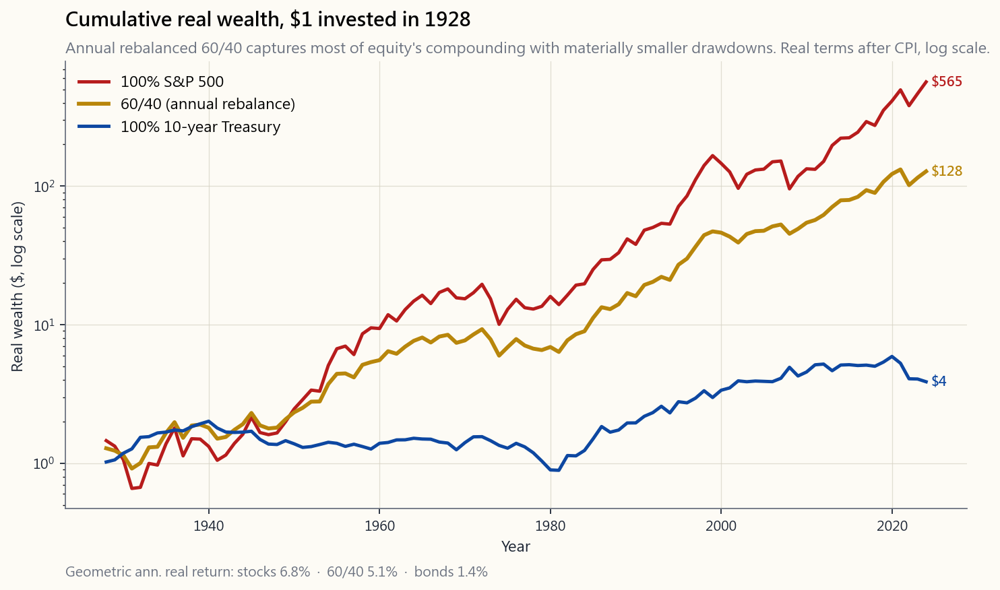
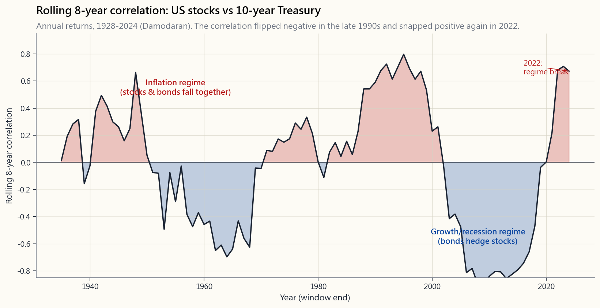

# 第四週：60/40 投資組合——為何曾經有效，以及為何 2022 年讓它瓦解

---

## 第一部分：閱讀章節

---

### 1. 為何這很重要

六成股票，四成債券。這是投資史上最著名的資產配置，是每位理財顧問的預設選項，是所有平衡型基金的衡量基準，也是——直到 2022 年——教科書界願意白紙黑字寫下、最接近「設定好就不用管」的投資組合。

即使你最終選擇不採用 60/40，你仍需要了解它，原因有四。

1. **它是基準線。** 每一種更複雜的策略——風險平價、趨勢跟隨、因子投資傾斜、第十四週介紹的啞鈴型策略——都以 60/40 作為比較標準。若不了解 60/40 能帶來什麼，就無法評估任何改良策略。
2. **它示範了分散投資真正能買到什麼。** 當股票與債券呈負相關時，60/40 的組合能帶來約 80% 的股票報酬，卻只承擔約 60% 的股票風險。這不是簡單的算術——這是投資組合波動性的「相關性折價」，也是馬可維茲（Markowitz）諾貝爾獎研究的核心洞見。
3. **它示範了分散投資的極限。** 2022 年，股票與債券各自下跌約 18%，這是 60/40 自 1937 年以來最慘的一年。理解「為什麼」，比虧損本身更重要：讓 60/40 長達四十年有效運作的總體經濟環境，有其特定的宏觀特徵，而這個特徵在 2022 年逆轉了。
4. **它教會你：相關性是投資組合建構中最重要的變數。** 報酬影響的是你財富的水位；相關性影響的是報酬分布的形狀。2022 年股債相關性翻轉正負號，整個業界至今仍在消化其意涵。

本課涵蓋 60/40 的起源與運作機制、各年代的歷史績效、相關性的歷史、2022 年的崩裂，以及現代的調適方案。

---

### 2. 你需要掌握的知識

#### 2.1 運作機制——為何要混合股票與債券？

核心洞見只有一個：**投資組合的波動性，並不等於其各組成部分波動性的加權平均值。**

對於兩種資產，權重為 $w_1, w_2$，標準差為 $\sigma_1, \sigma_2$，相關性為 $\rho$：

$$ \sigma_p = \sqrt{w_1^2 \sigma_1^2 + w_2^2 \sigma_2^2 + 2 w_1 w_2 \sigma_1 \sigma_2 \rho} $$

當 $\rho < 1$ 時，這個平方根的結果*小於*加權平均的波動性。相關性越接近 $\rho = -1$，風險降幅越大。**分散投資的本質，是相關性的數學運算。**

以美國股票（$\sigma \approx 16\%$）與美國國庫券（$\sigma \approx 6\%$）為例，搭配兩者的長期相關性：

| 股債相關性 ρ | 60/40 標準差 | 分散投資效益 |
|---|---:|---|
| +1.0（完全正相關） | 12.0% | 無——純粹加權平均 |
| 0.0（不相關） | 10.1% | 波動性約降低 16% |
| −0.3（1990 至 2010 年代的典型值） | 9.4% | 約降低 22% |
| −1.0（理論極限） | 7.2% | 最大降幅 |

1990 至 2010 年代的環境，帶來了平均約 −0.3 的股債相關性。這就是 60/40 長期有效的根本原因。驅動力並非任一資產的預期報酬；而是兩者之間的交叉相關性。

#### 2.2 歷史績效——四十年的順風

下圖呈現 1928 年以來，100% 股票、100% 國庫券，以及 60/40（每年再平衡）三種配置，以 CPI 平減後的累積實質財富走勢。

從圖的最右側看到最左側。到 2024 年，1928 年投入的 1 美元，以實質幣值計算，約變成：

- 100% 股票：763 美元
- 60/40：304 美元
- 100% 債券：9 美元

純債券線在整個百年中幾乎只能勉強跟上通膨——國庫券的長期實質年報酬接近 1.5%。股票的實質複利約為 7%。60/40 落在約 5.7% 實質報酬，以「複利速率」而言，達到股票線的三分之二，同時沿途的最大回撤明顯較小。

若以十年為單位來看，圖像更為細緻：

| 年代 | 60/40（實質年化） | 股票（實質年化） | 債券（實質年化） | 60/40 最大回撤 |
|---|---:|---:|---:|---:|
| 1930 年代 | 1.0% | -0.1% | 4.7% | -28% |
| 1940 年代 | 1.6% | 3.6% | -3.5% | -13% |
| 1950 年代 | 12.5% | 16.7% | -2.6% | -8% |
| 1960 年代 | 3.5% | 5.0% | -0.7% | -14% |
| 1970 年代 | -0.7% | -1.4% | -1.0% | -18% |
| 1980 年代 | 9.7% | 12.0% | 7.2% | -8% |
| 1990 年代 | 8.7% | 14.8% | 4.6% | -6% |
| 2000 年代 | 1.8% | -3.4% | 4.4% | -33% |
| 2010 年代 | 6.8% | 11.4% | 1.6% | -10% |
| 2020-24 年 | 1.6% | 6.7% | -3.5% | -22% |

1980 年代和 1990 年代是奠定 60/40 聲譽的兩個十年。債券實質報酬年化超過 7%，股票實質報酬年化超過 12%，股債相關性約在 −0.3 至 −0.4 之間。哪一種資產在下跌，另一種就在上漲，而再平衡的操作會*付錢給你*，讓你機械式地買進表現落後的那方。

2020 至 2024 年這一欄，是現代業界最為憂慮的數字。

#### 2.3 相關性的故事——隱藏的關鍵變數

下圖呈現 1928 年以來，美國股票與美國國庫券之間的滾動 36 個月相關性。本課最重要的事實，就藏在這張圖裡。

圖中可見三個環境：

- **1928 至 1997 年：股票與債券通常同向移動。** 通膨是主導驅動力。通膨上升同時壓低債券價格（利率上行）和股票價格（實質盈餘受壓）；通膨下降則同時推升兩者。相關性為正，分散投資效果有限。
- **1998 至 2021 年：長達二十四年的逆相關窗口。** 通膨不再是主導驅動力，成長與衰退週期成為主角。經濟衰退時，聯準會降息→債券上漲；同時盈餘重挫→股票下跌。相關性深度為負。60/40 在這個時期創下史上最佳的四十年。
- **2022 年迄今：逆相關環境破裂。** 當聯準會被迫積極升息以對抗 9% 的 CPI，債券下跌，股票的盈餘乘數同步收縮，股票也跟著下跌。相關性再度翻回正值。60/40 迎來自大蕭條時期以來最慘的一年。

簡單的框架：**當總體經濟的主導驅動力是成長/衰退時，股票與債券負相關；當主導驅動力是通膨時，兩者正相關。** 判斷你認為未來十年將落入哪種環境，就等於判斷了 60/40 是否仍是你的良伴。

#### 2.4 2022 年的慘敗——究竟發生了什麼

在那一個日曆年內：
- 標普 500 總報酬：−18.1%
- 美國十年期國庫券總報酬：−17.8%
- 60/40：約 −18.0%
- CPI：+6.5%
- 60/40 實質報酬：約 −24%

最後那個數字，是 60/40 投資組合自 1937 年以來最差的實質報酬年度。機制既簡單又令人膽寒。聯準會基準利率從 2022 年初的 0.25% 攀升至年底的 4% 以上。長期債券因利率驟升而重新定價；股票則因長期公債殖利率即為未來現金流的折現率，而該利率翻倍，導致估值同步重定。兩者同時下跌，對於未採取避險措施的投資人而言，無處可躲。

2022 年的最大回撤還揭示了另一件事：**60/40 投資組合對通膨衝擊毫無防護力。** 現金在通膨中保值，黃金大致維持價值，原物料上漲。這個經典的兩資產分散工具，在那個業界討論了十年的高通膨年份，卻是表現最差的配置。

#### 2.5 現代調適方案——60/40 的下一步

以下三種修正方式，依複雜度遞增排列。

1. **以現金取代部分債券。** 當債券殖利率低於通膨率時，短期國庫券（短存續期間、可快速重新投入於較高殖利率）在幾乎所有情境下都勝過長期債券。60/30/10 的配置（股票/短期國庫券/現金）幾乎不犧牲長期報酬，卻能大幅降低 2022 年式的最大回撤。
2. **加入 5 至 10% 的黃金部位。** 黃金在正常環境下與股票的相關性接近零，在 2022 年那種環境破裂的情況下則轉為負相關。歷史上的原型是永久投資組合（25/25/25/25 分配於股票/長期債券/現金/黃金）；現代版本通常採用較小的黃金比重並加大股票傾斜。黃金並非免費午餐——它沒有殖利率，且對實質利率高度敏感——但在 60/40 失靈的環境中，黃金發揮了作用。
3. **加入長波動性或趨勢跟隨部位。** 配置少量資金（5 至 10%）於管理期貨或長波動性結構，能在尾部風險事件中彌補損失。這是機構投資人的調適方案；第四十七週與第五十週將詳細介紹。

誠實的框架，也是陳馬在整個課程中一再強調的：**60/40 之所以有效，是因為一個特定的宏觀環境，而這個環境在未來十年不太可能以同等的強度重演。** 它並未崩壞，只是不再是最優解。啞鈴型策略——一端是高度集中的安全資產，另一端是具備不對稱報酬的投機部位，中間幾乎沒有結構性平庸的資產——對於能接受不同報酬形狀的投資人而言，是更誠實的答案。

---

### 3. 常見迷思

**迷思一：「債券是 60/40 中安全的那一半。」**

債券的波動性*低於*股票，但並非安全無虞。2022 年，美國國庫券的虧損幅度超過過去七十年中的任何一年。長期債券跌幅約 30%，比股票空頭市場的中位數跌幅還要大。「債券部位等於安全」這個框架，是 1980 至 2020 年利率持續下行所造就的四十年多頭市場的產物。

**迷思二：「60/40 一直都有效。」**

以實質報酬計算，60/40 在整個 1965 至 1981 年間持續虧損。平衡型投資人的實質財富縮水長達十六年，因為通膨持續超過股票與債券的合計名目報酬。直到 1980 年代，長期實質報酬的趨勢才重新回到正軌。

**迷思三：「在股票投資組合中加入債券，一定會降低報酬。」**

未必如此。每年進行再平衡時，再平衡操作——賣出近期表現較佳的資產，買入表現落後的資產——是一個小而持續的額外報酬來源，疊加在買進持有的混合報酬之上，因為這是機械式的「低買高賣」。某些長期回測顯示，60/40 的複利報酬*高於* 100% 股票，原因正是這個再平衡溢酬加上較小的最大回撤。這個免費午餐的成分雖小，但確實存在。

**迷思四：「國際分散投資能解決問題。」**

在真正關鍵的時刻（經濟衰退、金融危機、新冠疫情崩盤），國際股票與美國股票的相關性很高。國際分散投資能降低部分特定國家風險，但對解決 60/40 中的股債相關性問題幫助有限。能改變投資組合應對通膨衝擊方式的，是*資產類別*的分散，而非*地理*上的分散。

**迷思五：「有在再平衡的 60/40 就是主動式管理。」**

再平衡回到固定配置，並*不是*主動式管理，而是一個機械化規則。主動式管理是指根據自身判斷調整目標配置（例如在殖利率偏低時降低債券比重）。嚴格每年再平衡的 60/40，在策略層面上是完全被動式管理。

**迷思六：「我應該頻繁再平衡以捕捉再平衡溢酬。」**

再平衡溢酬確實存在，但很微小（在典型的 60/40 回測中約為每年 0.2 至 0.4%）。每季或每年再平衡已能捕捉到絕大部分的溢酬；每週或每日再平衡反而會在錯誤的方向上交易均值回歸，並累積交易成本。每年一次是慣例答案，半年一次亦可。頻率更高就是過度操作了。

---

### 4. 問答

**Q1：我應該在 2026 年執行 60/40 嗎？**

A：對於長期投資、沒有特殊優勢、也沒有時間主動管理投資組合的投資人而言，60/40 仍是可以辯護的答案——但在當前環境下，更站得住腳的答案是 *60/30/10*（股票/短存續期間國庫券/現金）或 55/30/10/5（再加入黃金）。純長期債券的 40% 部位，最容易受到 2022 年式正相關環境捲土重來的衝擊。

**Q2：為什麼不是 70/30 或 50/50？60/40 有什麼特別之處？**

A：沒什麼特別——這是慣例，不是推導出來的結果。從大約 40/60 到 70/30，夏普比率相當平坦。「正確」的配置，是你能在最大回撤 35% 的情況下撐過而不賣出的那個。70/30 適合風險承受度較高、投資期限較長的投資人；50/50 適合投資期限較短、風險承受度較低的投資人。60/40 居於中間，因此成為業界的慣例。

**Q3：實務上如何用指數股票型基金實施 60/40？**

A：兩檔指數股票型基金就夠了。股票部位用 VTI（或 VOO/SPY for 標普 500）；債券部位用 AGG 或 BND。設定每月自動按 60/40 比例定期定額投入。每年再平衡一次，回到 60/40。每年花費的時間：約三十分鐘。總費用率：約 0.04%。

**Q4：「多合一」平衡型基金怎麼樣？**

A：Vanguard 的 VBAIX（60/40）、iShares 的 AOR（60/40）等類似產品，會在內部自動進行再平衡。費用率略高（約 0.07 至 0.30%，相比兩檔指數股票型基金版本的 0.04%），但省去你自行再平衡的麻煩。對於不想管理的帳戶而言是合理選擇。對於一般應稅帳戶，兩檔指數股票型基金的版本較佳，因為你可以自行控制再平衡時的稅務時機。

**Q5：為何 2008 年沒有像 2022 年一樣讓 60/40 瓦解？**

A：2008 年股票大跌約 37%，但國庫券在資金逃向安全資產的浪潮中，反而上漲了約 20%。60/40 的最大回撤約為 −22%——很慘，但遠低於純股票的跌幅。2022 年則是兩者同步下跌。機制在於：2008 年是通縮型的信用衝擊；2022 年是通膨型的貨幣衝擊。60/40 投資組合能對沖前者，卻暴露於後者之中。

**Q6：應該用新增資金再平衡，還是出售資產再平衡？**

A：能的話，盡量用新增資金。將每月的定期定額投入引導至低於目標配置的那一側——這樣就能在不產生應稅資本利得、也不支付買賣價差的情況下完成再平衡。只有在新增資金不足以修正偏離時，或作為年度一次性整理，才透過出售來再平衡。

**Q7：那國際債券呢？**

A：對於在台灣或美國登記的投資人而言，已進行匯率避險的國際已開發市場債券（如 BNDX）提供了邊際上額外的分散投資效益。但實務上效益有限（全球投資等級主權債通過全球利率週期高度連動），且匯率避險的成本會吃掉部分殖利率。多數從業人員略過國際債券，單純持有美國國庫券。

**Q8：「啞鈴型」配置與 60/40 的關係是什麼？**

A：啞鈴型策略在哲學層面上拒絕 60/40。風險頻譜的中段（投資等級債券、防禦型股利股票的配置）正是啞鈴型策略要剔除的部分，因為那正是在通膨衝擊中最受重創的部分。啞鈴型策略持有比 60/40 更多的集中安全資產（現金、短期國庫券、黃金），以及比 60/40 更多的不對稱投機部位（買權、動能股票、加密貨幣），中間幾乎沒有任何東西。

**Q9：再平衡溢酬需要繳稅嗎？**

A：在一般應稅帳戶中，每次再平衡交易都可能觸發資本利得實現。為了在稅後保留溢酬，盡量用資金流入進行再平衡（不觸發實現），並將增值最快的部位放在免稅帳戶（如退休帳戶或各種稅優帳戶）中。兩檔指數股票型基金版的 60/40，費用率上確實便宜；但在稅務層面，帳戶結構的重要性遠高於指數股票型基金的選擇。

**Q10：這與課程其餘部分有何關聯？**

A：60/40 是基準線。第五週更深入探討分散投資。第十三至十四週介紹啞鈴型策略。第二十三週介紹因子投資，將股票部位拆解為各種報酬溢酬。第四十七週介紹長波動性避險，可用於彌補 60/40 在通膨衝擊下的弱點。此後所有的配置討論，都將以這個基準線作為比較對象。

下方的互動面板讓你自由滑動股票比重（從 0% 到 100%），以及再平衡頻率（從每月到從不）。它會根據 Damodaran 1928 至 2024 年的資料集，繪製對應的累積實質財富走勢，並顯示最大回撤與幾何年化報酬。請滑動看看。觀察夏普比率的峰值落在哪裡，也觀察當你調整債券比重時，1973 至 1974 年的最大回撤形狀如何改變。

---

## 第二部分：YouTube 腳本

---

**影片標題：** 60/40 投資組合——為何曾經有效，以及為何 2022 年讓它瓦解｜第四週

**目標片長：** 約 18 分鐘

**主持人：** 陳馬、小魚

---

**[開場]**

**陳馬：** 上週我們談了風險與報酬。這週要談的是地球上最有名的投資組合。六成股票，四成債券。全台灣每個理財顧問都推薦過它，每一檔目標日期基金都是它的某種變形。然後它在 2022 年創下了 1937 年以來最慘的一年。

**小魚：** 所以它到底是壞掉了，還是沒有？

**陳馬：** 它沒壞。但它也不再是以前的那個樣子了。這堂課結束時，你會清楚知道它對*你*而言究竟是哪一種情況。

---

**[第一段：為何要混合資產]**

**陳馬：** 混合股票與債券的全部意義，就在一條公式裡。投資組合的波動性，不等於各組成部分波動性的加權平均值。當兩種資產負相關——一個漲另一個跌——合併後的波動性會*低於*任何一個加權後的數字。

**小魚：** 這就是分散投資的效益。

**陳馬：** 對。而效益有多大，完全取決於股票與債券之間的相關性。從 1990 年代末到 2021 年，這個相關性大約是負 0.3。這個負相關，就是 60/40 長期有效的*全部原因*。

---

**[第二段：成長圖表]**

[VISUAL: image/week04_sixty_forty_growth.png]

**陳馬：** 這是長期成長圖。100% 股票、100% 債券、60/40，全部每年再平衡，以通膨調整後的實質幣值計算，從 1928 年起算。到 2024 年，你的 1 美元以實質幣值計算，變成了：100% 股票是 763 美元，60/40 是 304 美元，100% 債券是 9 美元。

**小魚：** 債券花了整整一百年，幾乎只能勉強跟上通膨。

**陳馬：** 一個數字道盡一個世紀。國庫券的長期實質年報酬約 1.5%，股票約 7%，60/40 落在約 5.7%。達到股票複利速率的三分之二，但在每次危機中的最大回撤都明顯較小。

---

**[第三段：相關性翻轉]**

[VISUAL: image/week04_stock_bond_corr.png]

**陳馬：** 這是本課最重要的圖表。股票與債券之間的滾動 36 個月相關性，三個環境。

1997 年以前，多半是正相關。通膨是主導驅動力，通膨同時打壓股票與債券。1998 至 2021 年，深度負相關。成長與衰退是主導驅動力，聯準會的「衰退時降息」政策，讓債券在股票下跌時上漲。然後是 2022 年，啪的一聲。

**小魚：** 翻回正相關了。

**陳馬：** 通膨回來，通膨環境也跟著回來。兩者同步下跌。60/40 投資組合找不到任何避風港。

---

**[第四段：2022 年的解剖]**

**陳馬：** 2022 年全年。標普 500 跌了 18，十年期國庫券跌了 17.8，CPI 漲了 6.5。所以 60/40 名目報酬跌了 18，實質報酬跌了 24。這是自 1937 年以來，這個策略最慘的實質報酬年份。

**小魚：** 聯準會為什麼這樣做？

**陳馬：** 他們別無選擇。通膨衝上 9%，政策利率卻只有 0.25%。他們必須對抗通膨，就得積極升息，而升息在機制上就是讓債券價格重挫。同樣的利率衝擊也打壓了股票的估值倍數，因為長期公債殖利率就是未來現金流的折現率，而那個利率翻了一倍。同一個衝擊，同時打中投資組合的兩端。

**小魚：** 那個教訓是什麼？

**陳馬：** 60/40 能對沖*衰退型*衝擊，但對*通膨型*衝擊毫無招架之力。如果未來十年比較像 1970 年代，而不像 2010 年代，60/40 就會持續落後於具備通膨避險功能的分散配置。

---

**[第五段：替代方案]**

**陳馬：** 三種修正方式，依照所需工夫遞增排列。

第一，用短期債券或現金取代部分長期債券。現金和短期國庫券在 2022 年幾乎沒有虧損，因為它們能不斷以更高的殖利率再投入。這是最便宜的修正方式。

第二，加入 5 至 10% 的黃金。正常時期與股票的相關性接近零，在 2022 年那樣的環境破裂時是強力的通膨避險工具。你要放棄殖利率，但在尾部風險事件中能把它賺回來。

第三，加入長波動性部位。趨勢跟隨或管理期貨策略，在 2022 年和 2008 年那樣的年份能夠補償損失。我們在第四十七週詳細介紹這個——那是機構投資人的答案。

---

**[結語]**

**陳馬：** 60/40 沒壞。但它也不再是預設的最優解了。2026 年最站得住腳的預設配置，更接近 60/30/10，加上小量的黃金或趨勢跟隨部位。不管你採用這個版本，還是堅持經典 60/40，你都應該清楚知道*為什麼*這樣選。這就是這堂課的全部意義。

**小魚：** 那互動工具呢？

**陳馬：** 一個滑桿調整股票比重，另一個滑桿調整再平衡頻率。圖表會呈現財富走勢、最大回撤和夏普比率。去滑看看，找到你自己的最適點。

---

**結尾畫面：**「下週：第五週——做對分散投資」